> 这是本人听了狂神和黑马满老师的课程(强推[满老师的课程](https://www.bilibili.com/video/BV16J411h7Rd))   之后重构出的笔记 ，其中面试高频部分已高亮

> 推荐使用typora阅读，ctrl + shift + L 可以打开目录

[toc]


**面试：单例模式、排序算法、生产者和消费者、死锁问题**


# 1. 什么是JUC

JUC就是java.util.concurrent下面的类包，专门用于多线程的开发。

**源码 + 官方文档 面试高频问 **

java.util 工具包

- 业务：无法通过普通的线程代码 Thread实现。
- Runnable 没有返回值、效率相比于Callable相对较低 
- **企业开发中Callable 使用较多**
  Callable ：


锁：


# 2、线程和进程

> 进程是操作系统中的应用程序、是资源分配的基本单位，线程是用来执行具体的任务和功能，是CPU调度和分派的最小单位
>
> 一个进程往往可以包含多个线程，至少包含一个


## 相关概念

### 进程

**一个程序(QQ.EXE Music.EXE)；程序的集合**
一个进程可以包含多个线程，至少包含一个线程 
Java默认有几个线程：2个线程   main线程、GC线程

### 线程

**开了一个进程Typora，写字，等待几分钟会进行自动保存(线程负责的)**
对于Java而言：Thread、Runable、Callable进行开启线程的。

**提问？JAVA真的可以开启线程吗？ 开不了的 **

Java是没有权限去开启线程、操作硬件的，这是一个native的一个本地方法，它调用的底层的C++代码。

```java
    public synchronized void start() {
        /**
         * This method is not invoked for the main method thread or "system"
         * group threads created/set up by the VM. Any new functionality added
         * to this method in the future may have to also be added to the VM.
         *
         * A zero status value corresponds to state "NEW".
         */
        if (threadStatus != 0)
            throw new IllegalThreadStateException();

        /* Notify the group that this thread is about to be started
         * so that it can be added to the group's list of threads
         * and the group's unstarted count can be decremented. */
        group.add(this);

        boolean started = false;
        try {
            start0();
            started = true;
        } finally {
            try {
                if (!started) {
                    group.threadStartFailed(this);
                }
            } catch (Throwable ignore) {
                /* do nothing. If start0 threw a Throwable then
                  it will be passed up the call stack */
            }
        }
    }
	//这是一个本地方法，Java是没有权限操作底层硬件的
    private native void start0();
```


==**两者的区别**==

* 一个进程可以有多个线程，进程是资源分配的基本单位，线程是CPU调度的基本单位
* 进程之间互相隔离，线程之间共享进程的资源
* 进程间通信(IPC)复杂
  线程间通信简单，因为共享进程内的内存
* 进程进程创建和销毁开销大、上下文切换成本高
  线程轻量，创建和销毁开销小、上下文切换成本低
* 


### 并发

> concurrent: 同一时间**应对**多件事情的能力

多线程操作同一个资源。

- CPU 只有一核，通过时间片轮转，来模拟多线程。
- 并发编程的本质：**充分利用CPU的资源 **


### 并行

> parallel: 同一时间动手**做**多件事情的能力

**并行：** 多个线程一起工作(多个人一起行走)

- CPU多核，多个线程可以同时执行。 我们可以使用线程池

**获取cpu的核数**

```java
public class Test1 {
    public static void main(String[] args) {
        //获取cpu的核数
        System.out.println(Runtime.getRuntime().availableProcessors());
    }
}
```


> 多线程程序处理同一系列任务，是否比单线程效率更高？
>
> * 单核CPU：效率更低，因为有上下文切换开销(但是多线程能避免饥饿现象)
> * 多核CPU：效率更高，因为可以把多个线程映射到不同内核上同时执行

> 补充知识：
>
> IO操作不占用CPU，但是阻塞IO会阻塞线程；  优化：非阻塞IO/异步IO


## ==线程的状态==

> Java API层面

```java
public enum State {	
	//新生
    NEW,

	//运行
    RUNNABLE,

	//阻塞
    BLOCKED,

	//等待
    WAITING,

	//超时等待
    TIMED_WAITING,

	//终止
    TERMINATED;
}
```

> **Java 的线程状态是对操作系统线程状态的一种抽象和简化**
>
> 其中:
>
> RUNNABLE对应就绪态 运行态 阻塞态(由BIO导致的线程阻塞)
>
> WAITING与TIMED_WAITING也对应阻塞态（是 Java API 层面对阻塞态的细分）
>
> | Java 状态     | 对应的 OS 状态                    | 说明                                                         |
> | ------------- | --------------------------------- | ------------------------------------------------------------ |
> | NEW           | 创建态                            | 线程对象已创建，但未调用 `start()`，OS 尚未为其分配资源。    |
> | RUNNABLE      | 就绪态 (Ready) + 运行态 (Running) | 这是一个“组合态”。只要线程在等待 CPU 调度（就绪）或正在 CPU 上执行（运行），Java 都将其视为 `RUNNABLE`。 |
> | BLOCKED       | 阻塞态 (Blocked)                  | 仅指等待获取 `synchronized` 监视器锁的线程。此时线程不占用 CPU，等待特定资源（锁）可用。 |
> | WAITING       | 阻塞态 (Blocked)                  | 线程无限期等待另一个线程执行特定操作（如 `notify` 或 `join` 结束）。 |
> | TIMED_WAITING | 阻塞态 (Blocked)                  | 带有时间限制的等待（如 `sleep`, `wait(timeout)`），超时后自动唤醒。 |
> | TERMINATED    | 终止态                            | 线程执行完毕，生命周期结束。                                 |
>
> #### **BLOCKED vs WAITING：同样是“等”，等的内容不同**
>
> 这是最容易混淆的地方，也是 Java 状态机比 OS 状态更细腻的地方：
>
> - BLOCKED (Java) = 等“钥匙”
>   - **场景：** 你想进 `synchronized` 房间，但门被锁了（锁被别人持有）。
>   - **特点：** 你（线程）在门口排队，只有等里面的人把钥匙（锁）扔出来，你才能进去。你不知道里面发生了什么，只知道门打不开。
>   - **OS 层面：** 这也是一种阻塞（等待资源）。
> - WAITING / TIMED_WAITING (Java) = 等“通知”
>   - **场景：** 你在房间里，调用了 `wait()` 或 `join()` 或 `LockSupport.park()`。
>   - **特点：** 你主动放弃了钥匙（释放了锁），并且进入了“休息室”（等待队列）。你不再参与锁的竞争，直到有人喊你名字（`notify`）或者时间到了，你才会出来重新抢钥匙。
>   - **OS 层面：** 这也是一种阻塞（等待事件/条件）。


### 线程状态转换

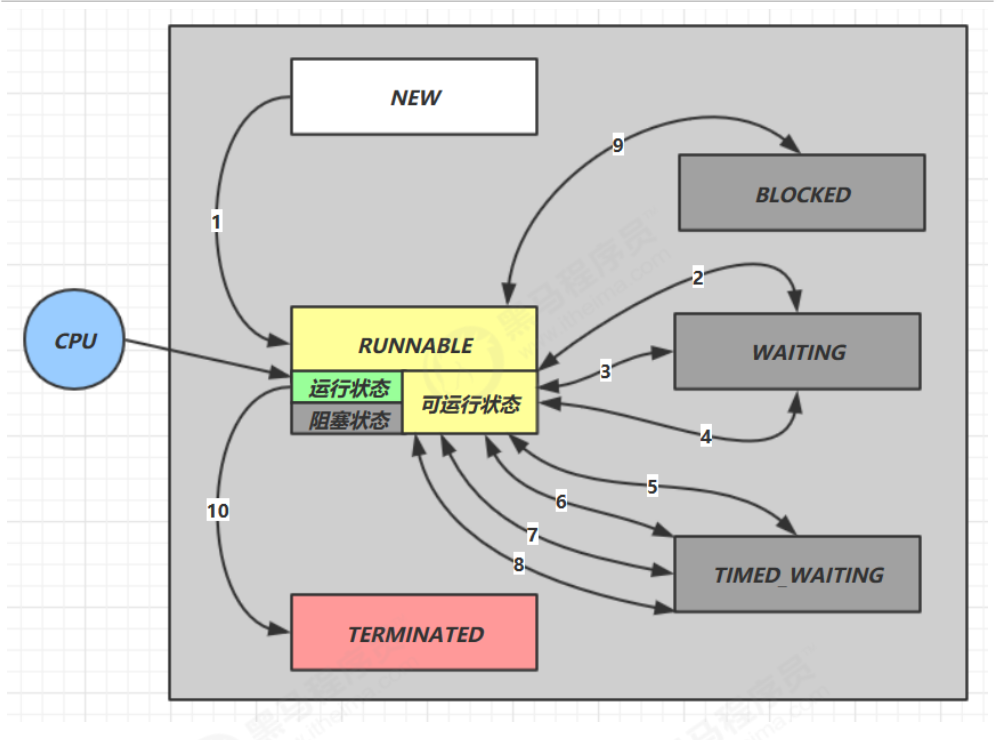

假设有线程 `Thread t` 

#### 情况 1 `NEW --> RUNNABLE`

* 当调用 `t.start()` 方法时，由 `NEW --> RUNNABLE` 


#### 情况 2 `RUNNABLE <--> WAITING` 

t 线程用 `synchronized(obj)` 获取了对象锁后 

* 调用 `obj.wait()` 方法时，t 线程从 `RUNNABLE --> WAITING` 
* 调用 `obj.notify()` ， `obj.notifyAll()` ， `t.interrupt()` 时 
  * 竞争锁成功，t 线程从 `WAITING --> RUNNABLE`
  * 竞争锁失败，t 线程从 `WAITING --> BLOCKED`

```java
public class TestWaitNotify {
    final static Object obj = new Object();
    public static void main(String[] args) {
        new Thread(() -> {
            synchronized (obj) {
                log.debug("执行....");
                try {
                    obj.wait();
                } catch (InterruptedException e) {
                    e.printStackTrace();
                }
                log.debug("其它代码...."); // 断点
            }
        },"t1").start();
        new Thread(() -> {
            synchronized (obj) {
                log.debug("执行....");
                try {
                    obj.wait();
                } catch (InterruptedException e) {
                    e.printStackTrace();
                }
                log.debug("其它代码...."); // 断点
            }
        },"t2").start();

        sleep(0.5);
        log.debug("唤醒 obj 上其它线程");
        synchronized (obj) {
            obj.notifyAll(); // 唤醒obj上所有等待线程 断点
        }
    }
}
```


#### 情况 3 `RUNNABLE <--> WAITING` 

* 当前线程调用 `t.join()` 方法时，当前线程从 `RUNNABLE --> WAITING` 
  * 注意是当前线程在t 线程对象的监视器上等待 
* t 线程运行结束，或调用了当前线程的 `interrupt()` 时，当前线程从 `WAITING --> RUNNABLE`


#### 情况 4 `RUNNABLE <--> WAITING` 

* 当前线程调用 `LockSupport.park()` 方法会让当前线程从 `RUNNABLE --> WAITING` 
* 调用 `LockSupport.unpark(目标线程)` 或调用了线程 的 `interrupt()` ，会让目标线程从 `WAITING --> RUNNABLE`


#### 情况 5 `RUNNABLE <--> TIMED_WAITING`

t 线程用 `synchronized(obj)` 获取了对象锁后 

* 调用 `obj.wait(long n)` 方法时，t 线程从 `RUNNABLE --> TIMED_WAITING` 
* t 线程等待时间超过了 n 毫秒，或调用 `obj.notify()` ， `obj.notifyAll()` ， `t.interrupt()` 时 
  * 竞争锁成功，t 线程从 `TIMED_WAITING --> RUNNABLE` 
  * 竞争锁失败，t 线程从 `TIMED_WAITING --> BLOCKED`


#### 情况 6 `RUNNABLE <--> TIMED_WAITING`

* **当前线程调用 `t.join(long n)` 方法**时，当前线程从 `RUNNABLE --> TIMED_WAITING` 
  * 注意是当前线程在t 线程对象的监视器上等待 
* 当前线程等待时间超过了 n 毫秒，或t 线程运行结束，或调用了当前线程的 `interrupt()` 时，当前线程从 `TIMED_WAITING --> RUNNABLE`


#### 情况 7 `RUNNABLE <--> TIMED_WAITING`

* **当前线程调用 `Thread.sleep(long n)`** ，当前线程从 `RUNNABLE --> TIMED_WAITING` 
* 当前线程等待时间超过了 n 毫秒，当前线程从 `TIMED_WAITING --> RUNNABLE`


#### 情况 8 `RUNNABLE <--> TIMED_WAITING`

* **当前线程调用 `LockSupport.parkNanos(long nanos)` 或 `LockSupport.parkUntil(long millis)`** 时，当前线 程从 `RUNNABLE --> TIMED_WAITING`
* 调用 `LockSupport.unpark(目标线程)` 或调用了线程 的 `interrupt()` ，或是等待超时，会让目标线程从 `TIMED_WAITING--> RUNNABLE`


#### 情况 9 `RUNNABLE <--> BLOCKED`

* t 线程用 `synchronized(obj)` **获取对象锁**时如果**竞争失败**，从 `RUNNABLE --> BLOCKED` 
* 持 obj 锁线程的同步代码块执行完毕，会唤醒该对象上所有 BLOCKED 的线程重新竞争，如果其中 t 线程竞争 成功，从 `BLOCKED --> RUNNABLE` ，其它失败的线程仍然 `BLOCKED`


#### 情况 10 `RUNNABLE <--> TERMINATED`

当前线程所有代码运行完毕，进入 `TERMINATED`


## ==创建线程的方法==


1**.使用Thread的start方法**

> 任务和线程合并(耦合)

```java
new Thread(){() -> {
    log.debug("hello,I'm running");
}}.start();
```

> ```java
> Thread t = new Thread(){
>  @Override
>  public void run(){
>      log.debug("hello,I'm running");
>  }
> };
> t.start();
> ```

重写了父类的run方法


**2.使用Runnable配合Thread**

> 把任务和线程分离

```java
new Thread(() -> {
        log.debug("I'm running");
}}, "线程一").start();
```

> ```java
> // Runnable runnable = () -> log.debug("running");
> Runnable runnable = new Runnable() {
>  public void run(){
>      log.debug("I'm running");
>  }
> };
> Thread t = new Thread(runnable, "线程一");
> t.start();
> ```
>
> 实际执行的时候，调用的是Runnable实现的run方法


**3.使用FutureTask配合Thread**

> 可以获取任务执行结果
>
> 间接实现了Runnable接口，也可以传入Thread：
>
> 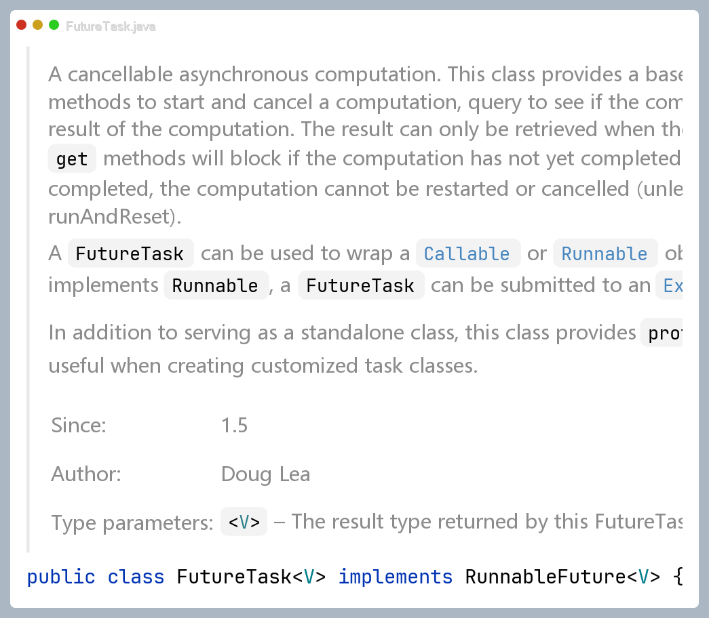
>
> 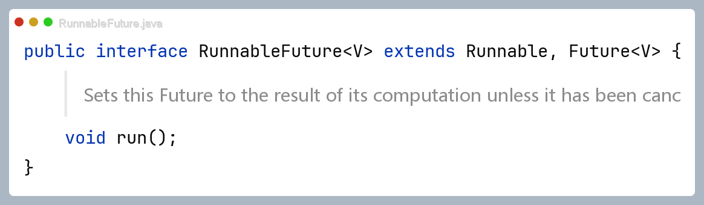
>
> callable的唯一方法提供了返回值
>
> 
>
> 

```java
FutureTask<Integer> task = new FureTask<>(new Callable<Integer>(){
    @Override
    public Integer call() throws Exception {
        log.debug("I'm running");
        Thread.sleep(1000);
        return 100;
    }
});
new Thread(task, "线程一").start();

Integer res = task.get();// 获取返回结果(会阻塞，直到结果返回)
```


4.


#### 【查看进程】


**windows**

* 任务管理器

* `tasklist` 查看进程

  ```
  tasklist
  tasklist | findstr java
  ```

* `taskkill` 杀死进程

  ```
  taskkill /F /PID 12345
  ```

  


**linux**

* `ps -ef` 查看所有进程

  ```
  ps -ef | grep java
  ```

  > 会显示出相关进程+grep进程
  >
  > 查看java相关进程也可以用：`jps`

* `ps -fT -p <PID>`：查看某个进程的所有线程

* `kill <PID>`杀死进程

* `top -H -p <PID>` 动态查看<u>某个进程中的所有线程的</u>信息

  > 内存占用、CPU占用百分比
  >
  > 查看java相关线程也可以用：`jstack <PID>` 
  > (把**某一瞬间的**<u>进程中的所有线程的</u>信息抓取出来)

  > 按大写H可以切换是否显示线程


**Java**

* jconsole ：用图形化界面查看java进程中线程的运行情况


## 线程运行的原理

**栈与栈帧**

JVM 中由堆、栈、方法区所组成，其中栈内存是给谁用的呢？其实就是线程

* 每个线程启动后，虚拟机就会为其分配一块栈内存 (按照线程分配) 

* 每个栈由多个栈帧（Frame）组成，对应着每次方法调用时所占用的内存
* 每个线程只能有一个活动栈帧，对应着当前正在执行的那个方法 


> 图解
>
> 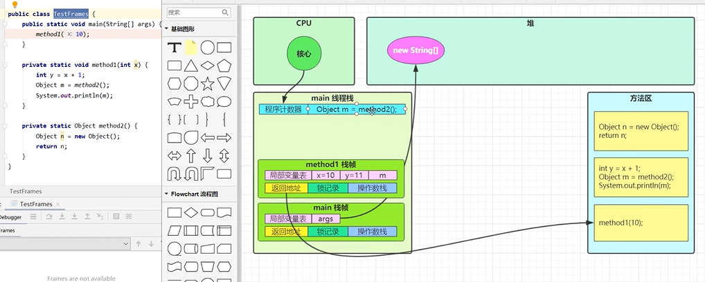
>
> 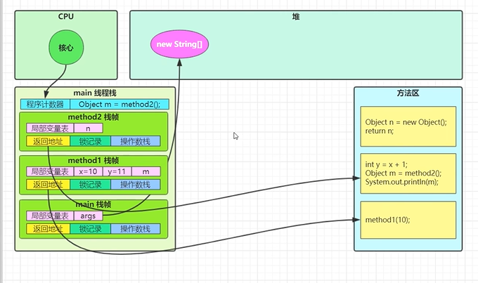
>
> 


**线程上下文切换**

因为以下一些原因导致 cpu 不再执行当前的线程，转而执行另一个线程的代码 

* 线程的 cpu 时间片用完
* 垃圾回收
* 有更高优先级的线程需要运行
* <u>线程自己调用了 sleep、yield、wait、join、park、synchronized、lock 等方法</u>

当上下文切换发生时，需要由操作系统保存当前线程的状态，并恢复另一个线程的状态，Java 中对应的概念 就是程序计数器（Program Counter Register），它的作用是记住下一条 jvm 指令的执行地址，是线程私有的

* 状态包括程序计数器、虚拟机栈中每个栈帧的信息，如局部变量、操作数栈、返回地址等

* 线程数不是越多越好，上下文切换频繁会影响性能

  > <u>如何选择合适的线程数</u>


> 
>
> 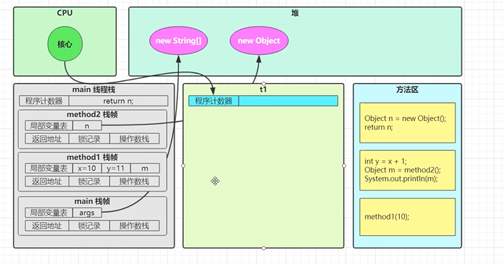
>
> 


## 主线程和守护线程

默认情况下，Java 进程需要等待所有线程都运行结束，才会结束。有一种特殊的线程叫做守护线程，只要其它非守护线程运行结束了，即使守护线程的代码没有执行完，也会强制结束

* 垃圾回收器线程就是一种守护线程
* Tomcat 中的 Acceptor 和 Poller 线程都是守护线程，所以 Tomcat 接收到 shutdown 命令后，不会等 待它们处理完当前请求

> ```java
> log.debug("开始运行...");
> Thread t1 = new Thread(() -> {
>  log.debug("开始运行...");
>  TimeUnit.SECONDS.sleep(2);
>  log.debug("运行结束...");
> }, "daemon");
> // 设置该线程为守护线程
> t1.setDaemon(true);
> t1.start();
> 
> TimeUnit.SECONDS.sleep(1);
> log.debug("运行结束...");
> ```
>
> 


## Thread类常见方法


| 方法名                 | static | 功能说明                                                     | 注意                                                         |
| ---------------------- | ------ | ------------------------------------------------------------ | ------------------------------------------------------------ |
| start()                |        | 启动一个新线程，在新的线程运行run方法中的代码                | start 方法只是让线程进入就绪态(RUNNABLE)，不一定立刻进入运行(CPU时间片可能还没分给它)，每个线程对象的 start 方法只能调用一次，如果多次调用会出现IllegalThreadStateException |
| run()                  |        | 新线程启动后会调用的方法                                     | 如果在构造Thread对象的时候传递了 Runnable 参数，则线程启动后会调用 Runnable 中的 run 方法，否则默认不执行任何操作。但可以创建 Thread 的子类对象，来覆盖默认行为 |
| join()                 |        | 等待线程运行结束                                             |                                                              |
| join(long n)           |        | 等待线程运行结束，最多等待n毫秒                              |                                                              |
| getId()                |        | 获取线程长整型的id                                           | id 唯一                                                      |
| getName()              |        | 获取线程名                                                   |                                                              |
| setName(String)        |        | 修改线程名                                                   |                                                              |
| getPriority()          |        | 获取线程优先级                                               |                                                              |
| setPriority(int)       |        | 修改线程优先级                                               | java中规定线程优先级是 1~10 的整数，较大的优先级能提高该线程被CPU调度的机率 |
| getState()             |        | 获取线程状态                                                 | Java中线程状态是用 6个enum 表示，分别为：NEW，RUNNABLE，BLOCKED，WAITING，TIMED_WAITING，TERMINATED |
| <u>isInterrupted()</u> |        | 判断是否被打断                                               | <u>不会被清除`打断标记`</u>                                  |
| isAlive()              |        | 线程是否存活(还没运行完毕)                                   |                                                              |
| interrupt()            |        | 打断线程                                                     | 如果被打断的线程正在sleep / wait / join，会导致打断的线程抛出 InterruptedException，并清除`打断标记`，如果打断的是正在运行的线程，则会设置`打断标记`，park 的线程被打断，也会设置`打断标记` |
| <u>interrupted()</u>   | static | 判断当前线程是否被打断                                       | <u>会清除`打断标记`</u>                                      |
| currentThread()        | static | 获取当前正在执行的线程                                       |                                                              |
| sleep(long n)          | static | 让当前执行的线程休眠n毫秒(阻塞态 TIMED_WAITING)，休眠时让出cpu的时间片给其他线程 |                                                              |
| yield()                | static | 提示线程调度器让出当前线程对CPU的使用                        | 主要用于测试和调试                                           |


#### sleep 与 yield

**sleep**

> **"躺下"**

1. 调用sleep会让当前线程从**RUNNABLE(具体来说是RUNNING)进入TIMED_WAITING状态**

2. 其它线程可以使用 interrupt 方法打断正在睡眠的线程，这是sleep方法会抛出InterruptedException

3. 睡眠结束后的线程未必会立刻得到执行(进入就绪态 就绪队列)

4. 建议用TimeUnit 的sleep 代替 Thread 的 sleep 来获得更好的可读性

   ```java
   Thread.sleep(2000);
   TimeUnit.SECONDS.sleep(2); // 睡眠2s
   ```

   

**yield**

> “**谦让**”

1. 调用yield 之后， JVM 层面的状态**仍然是 `RUNNABLE`**，向线程调度器发出信号 在操作系统层面由运行态转成就绪态、让出CPU时间片，然后调度器选择其他同优先级的线程运行，如果不存在同优先级的线程(，则当前线程可能被立即重新调度)，那么不能保证让当前线程暂停的效果
2. 具体的实现依赖于操作系统的任务调度器


#### join

* 等待某个线程运行结束

  > 在哪个线程中调用就是哪个线程开始等待

  > 底层基于wait()

```java
log.debug("开始");
Thread t1 = new Thread(() -> {
    log.debug("开始");
    sleep(1);
	log.debug("结束");
    r = 10;
});
t1.start();
t1.join();
log.debug("结果为:{}", r);
log.debug("结束");
```

可以设置等待时间限制

```java
log.debug("开始");
Thread t1 = new Thread(() -> {
    log.debug("开始");
    sleep(1);
	log.debug("结束");
    r = 10;
});
t1.start();
t1.join(2000); // 最多等待两千毫秒
log.debug("结果为:{}", r);
log.debug("结束");
```


##### join原理

> 底层基于[同步模式之保护性暂停](##同步模式之保护性暂停)


> 源码：
>
> 
>
> 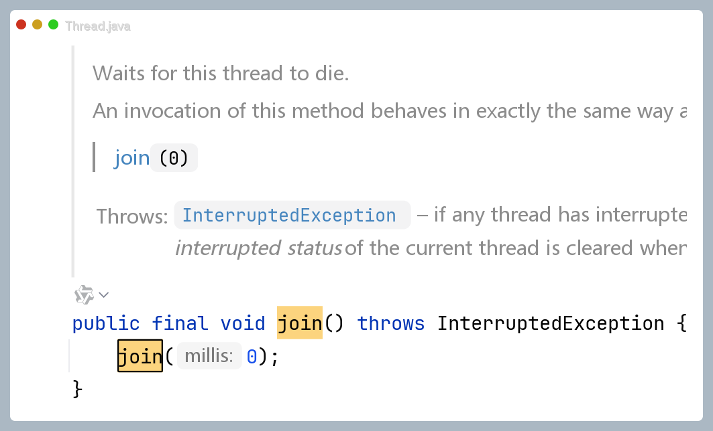
>
> 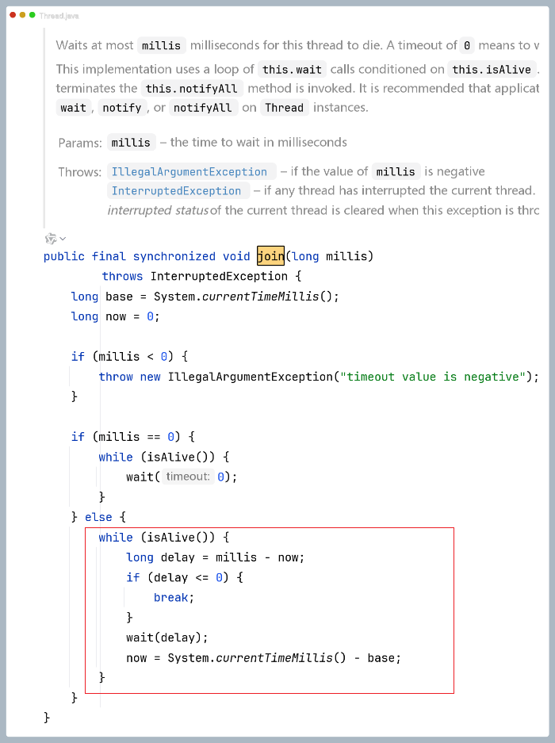
>
> 


#### interrupt

* 可以打断正在运行态或阻塞态的线程

  > 阻塞态(**sleep wait join** / WAITING TIMED_WAITING BLOCK)

```java
Thread t1 = new Thread(() -> {
	log.debug("sleep...");
	try {
		Thread.sleep(5000);
	} catch(InterruptedException e) {
		e.printStackTrace();
	}
}, "线程1");
t1.start();

TimeUnit.SECONDS.sleep(1);// 主线程睡一会，让线程1先进入睡眠
log.debug("interrupt");
t1.interrupt();
log.debug(": {}", t1.isInterrupted()); // 打印false
```


**打断标记**：可以用于判断线程被打断之后继续运行还是终止

* 在阻塞态被打断的线程，打断标记会置为false

* 在运行态被打断的线程，打断标记会置为true

  


> ```java
> Thread t1 = new Thread(() -> {
> 	while(true){
> 		boolean interrupted = Thread.currentThread().isInterrupted();
> 		if(interrupted) {
> 			log.debug("被打断了，退出循环");
> 			break;
> 		}
> 	}
> }, "线程1");
> t1.start();
> 
> TimeUnit.SECONDS.sleep(1);
> log.debug("打断线程1");
> t1.interrupt();
> 
> ```
>
> 


##### 使用 interrupt() 打断 park 线程

可以打断处于 park 状态的线程，让它继续往下执行

```java
private static void test() throws InterruptedException {
    Thread t1 = new Thread(() -> {
        log.debug("park...");
        LockSuport.park();
        // 如果不打断，会保持 park，下面的代码不再执行
        log.debug("unpark...");
        log.debug("打断状态: {}", Thread.currentThread().isInterrupted());
        
        LockSuport.park();
        log.debug("unpark...");// 二次park不会生效，会继续打印这行代码
    }, "线程1");
    t1.start();
    
    sleep(1);
    t1.interrupt();
}
```

打断标记为真的时候，park 方法不会生效


```java
private static void test() throws InterruptedException {
    Thread t1 = new Thread(() -> {
        log.debug("park...");
        LockSuport.park();
        // 如果不打断，会保持 park，下面的代码不再执行
        log.debug("unpark...");
        log.debug("打断状态: {}", Thread.currentThread().interrupted());
        // interrupted()在返回打断标记的同时把打断标记置为
        
        LockSuport.park();// 此时二次 park 会生效
        log.debug("unpark...");
    }, "线程1");
    t1.start();
    
    sleep(1);
    t1.interrupt();
}
```


## Object类


#### ==wait / notify==


> #### 小故事-为什么需要 wait
>
> 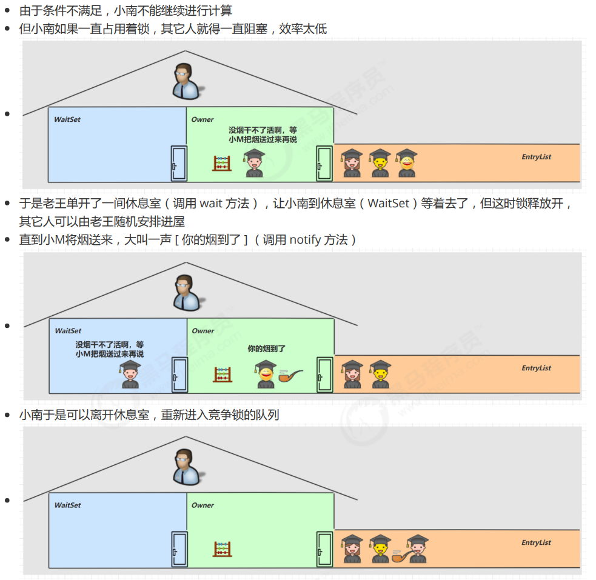


##### **原理**

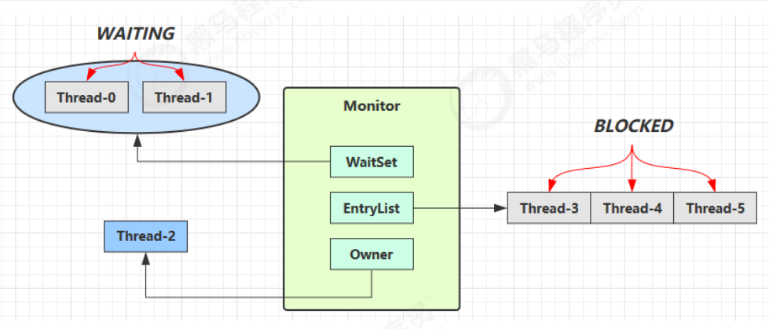

* Owner 线程发现条件不满足 (需等待)，调用 wait 方法  即可进入 WaitSet 变为 WAITING 状态 
* BLOCKED 和 WAITING 的线程都处于阻塞状态，不占用 CPU 时间片 
* BLOCKED 线程会在 Owner 线程释放锁时唤醒 
* WAITING 线程会在 Owner 线程调用 notify 或 notifyAll 时唤醒，但唤醒后并不意味者立刻获得锁，仍需进入 EntryList 重新竞争


##### **API**

* `obj.wait()` 让进入 object 监视器的线程到 waitSet 等待 
* `obj.notify()` 在 object 上正在 waitSet 等待的线程中挑一个唤醒 
* `obj.notifyAll()` 让 object 上正在 waitSet 等待的线程全部唤醒

它们都是线程之间进行协作的手段，都属于 Object 对象的方法。**必须获得此对象的锁(Monitor)**，才能调用这三个方法

```java
final static Object obj = new Object();
public static void main(String[] args) {
    new Thread(() -> {
        synchronized (obj) {
            log.debug("执行....");
            try {
                obj.wait(); // 此时持有了Monitor，可以调用wait
                // 让线程在obj上一直等待下去
            } catch (InterruptedException e) {
                e.printStackTrace();
            }
            log.debug("其它代码....");
        }
    }).start();
    new Thread(() -> {
        synchronized (obj) {
            log.debug("执行....");
            try {
                obj.wait(); // 让线程在obj上一直等待下去
            } catch (InterruptedException e) {
                e.printStackTrace();
            }
            log.debug("其它代码....");
        }
    }).start();
    
    // 主线程两秒后执行
    sleep(2);
    log.debug("唤醒 obj 上其它线程");
    synchronized (obj) {
        obj.notify(); // 唤醒Monitor的WaitSet上的一个线程
        // obj.notifyAll(); // 唤醒obj上所有等待线程
    }
}
```

notify 的一种结果

```
20:00:53.096 [Thread-0] c.TestWaitNotify - 执行....
20:00:53.099 [Thread-1] c.TestWaitNotify - 执行....
20:00:55.096 [main] c.TestWaitNotify - 唤醒 obj 上其它线程
20:00:55.096 [Thread-0] c.TestWaitNotify - 其它代码.... 

```

notifyAll 的结果

```
19:58:15.457 [Thread-0] c.TestWaitNotify - 执行....
19:58:15.460 [Thread-1] c.TestWaitNotify - 执行....
19:58:17.456 [main] c.TestWaitNotify - 唤醒 obj 上其它线程
19:58:17.456 [Thread-1] c.TestWaitNotify - 其它代码....
19:58:17.456 [Thread-0] c.TestWaitNotify - 其它代码.... 

```

`wait()` 方法会释放对象的锁，进入 WaitSet 等待区，从而让其他线程就机会获取对象的锁。无限制等待，直到 notify 为止

`wait(long n)` 有时限的等待, 到 n 毫秒后结束等待，或是被 notify

> **源码**：
>
> 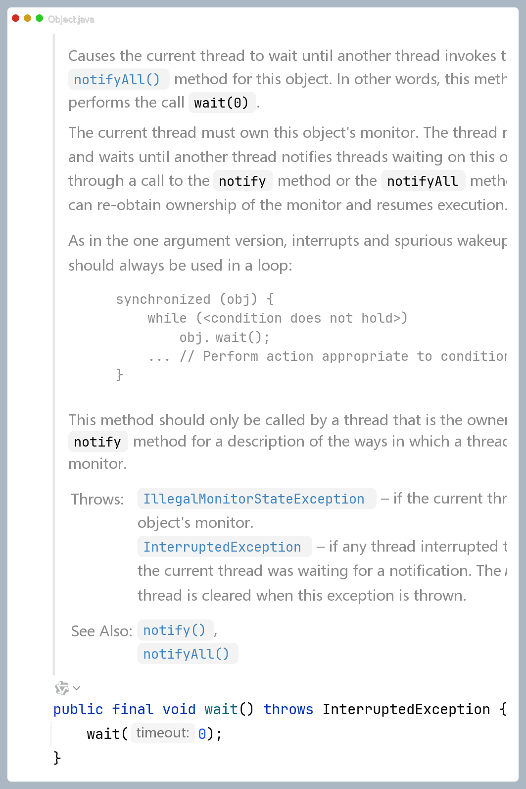
>
> 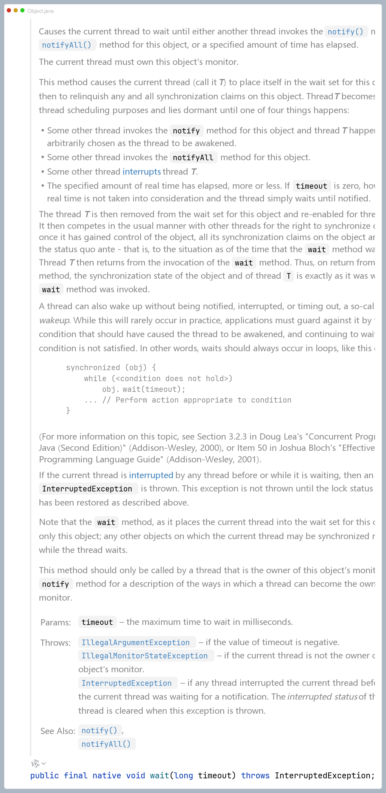
>
> 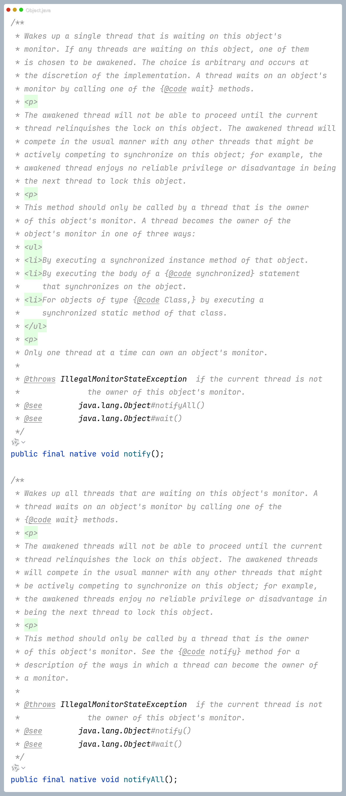
>
> 在java中，Thread类线程执行完run()方法后，一定会自动执行notifyAll()方法。因为线程在die的时候会释放持用的资源和锁，自动调用自身的notifyAll方法。


##### ==区别 sleep & wait==

> ##### sleep(long n) 和 wait(long n) 的区别

1) [API角度]sleep 是 Thread 的(静态)方法，而 wait 是 Object 的方法 
2) [使用条件不同]sleep 不需要强制和 synchronized 配合使用，但 wait 需要 和 synchronized 一起用 
3) [是否释放锁]sleep 在睡眠的同时，不会释放对象锁的，但 wait 在等待的时候会释放对象锁 

> 共同点：调用之后，线程状态都是 TIMED_WAITING


##### 使用


**step 1**

```java
static final Object room = new Object(); // 共享变量(房间)
// 推荐锁对象加上final保证其引用地址不可变，锁住的都是同一个对象
static boolean hasCigarette = false;
static boolean hasTakeout = false;
```

思考下面的解决方案好不好，为什么？

```java
new Thread(() -> {
    synchronized (room) {
        log.debug("有烟没？[{}]", hasCigarette);
        if (!hasCigarette) {
            log.debug("没烟，先歇会！");
            sleep(2);
        }
        log.debug("有烟没？[{}]", hasCigarette);
        if (hasCigarette) {
            log.debug("可以开始干活了");
        }
    }
}, "小南").start();
for (int i = 0; i < 5; i++) {
    new Thread(() -> {
        synchronized (room) {
            log.debug("可以开始干活了");
        }
    }, "其它人").start();   
}
sleep(1);
new Thread(() -> {
    // 这里能不能加 synchronized (room)？
    hasCigarette = true;
    log.debug("烟到了噢！");
}, "送烟的").start();
```

> 不能加。加了 synchronized (room) 后，就好比小南在里面反锁了门睡觉，烟根本没法送进门，main 没加 synchronized 就好像 main 线程是翻窗户进来的 

输出

```java
20:49:49.883 [小南] c.TestCorrectPosture - 有烟没？[false]
20:49:49.887 [小南] c.TestCorrectPosture - 没烟，先歇会！
20:49:50.882 [送烟的] c.TestCorrectPosture - 烟到了噢！
20:49:51.887 [小南] c.TestCorrectPosture - 有烟没？[true]
20:49:51.887 [小南] c.TestCorrectPosture - 可以开始干活了
20:49:51.887 [其它人] c.TestCorrectPosture - 可以开始干活了
20:49:51.887 [其它人] c.TestCorrectPosture - 可以开始干活了
20:49:51.888 [其它人] c.TestCorrectPosture - 可以开始干活了
20:49:51.888 [其它人] c.TestCorrectPosture - 可以开始干活了
20:49:51.888 [其它人] c.TestCorrectPosture - 可以开始干活了
```

* 其它干活的线程，都要一直阻塞，效率太低 
* 小南线程必须睡足 2s 后才能醒来，就算烟提前送到，也无法立刻醒来 
* 改进方法，使用 wait - notify 机制


**step 2**

思考下面的实现行吗，为什么？思考下面的实现行吗，为什么？

```java
new Thread(() -> {
    synchronized (room) {
        log.debug("有烟没？[{}]", hasCigarette);
        if (!hasCigarette) {
            log.debug("没烟，先歇会！");
            try {
                room.wait(2000);
            } catch (InterruptedException e) {
                e.printStackTrace();
            }
        }
        log.debug("有烟没？[{}]", hasCigarette);
        if (hasCigarette) {
            log.debug("可以开始干活了");
        }
    }
}, "小南").start();

for (int i = 0; i < 5; i++) {
    new Thread(() -> {
        synchronized (room) {
            log.debug("可以开始干活了");
        }
 }, "其它人").start();
}
sleep(1);
new Thread(() -> {
    synchronized (room) {
        hasCigarette = true;
        log.debug("烟到了噢！");
        room.notify();
    }
}, "送烟的").start();

```

输出

```
20:51:42.489 [小南] c.TestCorrectPosture - 有烟没？[false]
20:51:42.493 [小南] c.TestCorrectPosture - 没烟，先歇会！
20:51:42.493 [其它人] c.TestCorrectPosture - 可以开始干活了
20:51:42.493 [其它人] c.TestCorrectPosture - 可以开始干活了
20:51:42.494 [其它人] c.TestCorrectPosture - 可以开始干活了
20:51:42.494 [其它人] c.TestCorrectPosture - 可以开始干活了
20:51:42.494 [其它人] c.TestCorrectPosture - 可以开始干活了
20:51:43.490 [送烟的] c.TestCorrectPosture - 烟到了噢！
20:51:43.490 [小南] c.TestCorrectPosture - 有烟没？[true]
20:51:43.490 [小南] c.TestCorrectPosture - 可以开始干活了

```

* 解决了其它干活的线程阻塞的问题 
* 问题：
  * 如果有其它线程也在等待条件呢？
    如果还有其他线程也在等待，不能保证唤醒的是“小南”的线程


**step3**

```java
new Thread(() -> {
    synchronized (room) {
        log.debug("有烟没？[{}]", hasCigarette);
        if (!hasCigarette) {
            log.debug("没烟，先歇会！");
            try {
                room.wait();
            } catch (InterruptedException e) {
                e.printStackTrace();
            }
        }
        log.debug("有烟没？[{}]", hasCigarette);
        if (hasCigarette) {
            log.debug("可以开始干活了");
        } else {
            log.debug("没干成活...");
        }
    }
}, "小南").start();

new Thread(() -> {
    synchronized (room) {
        Thread thread = Thread.currentThread();
        log.debug("外卖送到没？[{}]", hasTakeout);
        if (!hasTakeout) {
            log.debug("没外卖，先歇会！");
            try {
                room.wait();
            } catch (InterruptedException e) {
                e.printStackTrace();
            }
        }
        log.debug("外卖送到没？[{}]", hasTakeout);
        if (hasTakeout) {
            log.debug("可以开始干活了");
        } else {
            log.debug("没干成活...");
        }
    }
}, "小女").start();
sleep(1);
new Thread(() -> {
    synchronized (room) {
        hasTakeout = true;
        log.debug("外卖到了噢！");
        room.notify();
    }
}, "送外卖的").start();
```

输出

```
20:53:12.173 [小南] c.TestCorrectPosture - 有烟没？[false]
20:53:12.176 [小南] c.TestCorrectPosture - 没烟，先歇会！
20:53:12.176 [小女] c.TestCorrectPosture - 外卖送到没？[false]
20:53:12.176 [小女] c.TestCorrectPosture - 没外卖，先歇会！
20:53:13.174 [送外卖的] c.TestCorrectPosture - 外卖到了噢！
20:53:13.174 [小南] c.TestCorrectPosture - 有烟没？[false]
20:53:13.174 [小南] c.TestCorrectPosture - 没干成活... 
```

* notify 只能随机唤醒一个 WaitSet 中的线程，这时如果有其它线程也在等待，那么就可能唤醒不了正确的线程，称之为【虚假唤醒】 
* 解决方法，改为 notifyAll


**step4**

```java
new Thread(() -> {
    synchronized (room) {
        hasTakeout = true;
        log.debug("外卖到了噢！");
        room.notifyAll();
    }
}, "送外卖的").start();

```

输出

```
20:55:23.978 [小南] c.TestCorrectPosture - 有烟没？[false]
20:55:23.982 [小南] c.TestCorrectPosture - 没烟，先歇会！
20:55:23.982 [小女] c.TestCorrectPosture - 外卖送到没？[false]
20:55:23.982 [小女] c.TestCorrectPosture - 没外卖，先歇会！
20:55:24.979 [送外卖的] c.TestCorrectPosture - 外卖到了噢！
20:55:24.979 [小女] c.TestCorrectPosture - 外卖送到没？[true]
20:55:24.980 [小女] c.TestCorrectPosture - 可以开始干活了
20:55:24.980 [小南] c.TestCorrectPosture - 有烟没？[false]
20:55:24.980 [小南] c.TestCorrectPosture - 没干成活... 

```

* 用 notifyAll 仅解决某个线程的唤醒问题，但使用 if + wait 判断仅有一次机会，一旦条件不成立，就没有重新判断的机会了 
* 解决方法，用 ==while + wait==（解决虚假唤醒问题，唤醒的时候惊喜那个条件判断，如果是假唤醒就继续等待），当条件不成立，再次 wait


**step5**

将 if 改为 while

```java
while (!hasCigarette) { // 类似自旋
    log.debug("没烟，先歇会！");
    try {
        room.wait();
    } catch (InterruptedException e) {
        e.printStackTrace();
    }
}

```

输出

```
20:58:34.322 [小南] c.TestCorrectPosture - 有烟没？[false]
20:58:34.326 [小南] c.TestCorrectPosture - 没烟，先歇会！
20:58:34.326 [小女] c.TestCorrectPosture - 外卖送到没？[false]
20:58:34.326 [小女] c.TestCorrectPosture - 没外卖，先歇会！
20:58:35.323 [送外卖的] c.TestCorrectPosture - 外卖到了噢！
20:58:35.324 [小女] c.TestCorrectPosture - 外卖送到没？[true]
20:58:35.324 [小女] c.TestCorrectPosture - 可以开始干活了
20:58:35.324 [小南] c.TestCorrectPosture - 没烟，先歇会！
```


**使用套路**

```java
synchronized(lock) {
    while(条件不成立) {
        lock.wait();
    }
    // 干活
}
//另一个线程
synchronized(lock) {
    lock.notifyAll();
}

```


#### 不推荐使用的方法

| 方法名    | 功能说明           | 替代   |
| --------- | ------------------ | ------ |
| stop()    | 停止线程运行       |        |
| suspend() | 挂起(暂停)线程运行 | wait   |
| resume()  | 恢复线程运行       | notify |

已过时，容易破坏同步代码块，造成死锁


## LockSupport类


### Park & Unpark


**基本使用**

它们是 LockSupport 类中的方法

```java
// 暂停当前线程
LockSupport.park();

// 恢复某个线程的运行
LockSupport.unpark(暂停线程对象)
```

**先 park 再 unpark**

```java
Thread t1 = new Thread(() -> {
    log.debug("start...");
    sleep(1);
    log.debug("park...");
    LockSupport.park();
    log.debug("resume...");
},"t1");
t1.start();

sleep(2);
log.debug("unpark...");
LockSupport.unpark(t1); // 恢复t1线程运行
```

输出

```
18:42:52.585 c.TestParkUnpark [t1] - start...
18:42:53.589 c.TestParkUnpark [t1] - park...
18:42:54.583 c.TestParkUnpark [main] - unpark...
18:42:54.583 c.TestParkUnpark [t1] - resume... 

```

**先 unpark 再 park**

```java
Thread t1 = new Thread(() -> {
    log.debug("start...");
    sleep(2);
    log.debug("park...");
    LockSupport.park();
    log.debug("resume...");
}, "t1");
t1.start();

sleep(1);
log.debug("unpark...");
LockSupport.unpark(t1);
```

输出

```
18:43:50.765 c.TestParkUnpark [t1] - start...
18:43:51.764 c.TestParkUnpark [main] - unpark...
18:43:52.769 c.TestParkUnpark [t1] - park...
18:43:52.769 c.TestParkUnpark [t1] - resume... 

```

> 原因参考“原理”部分


**与 Object 的 wait & notify 相比** 

* wait，notify 和 notifyAll 必须配合 Object Monitor 一起使用，而 park，unpark 不必
* park & unpark 是以线程为单位来【阻塞】和【唤醒】线程，而 notify 只能随机唤醒一个等待线程，notifyAll 是唤醒所有等待线程，就不那么【精确】 
* park & unpark 可以先 unpark，而 wait & notify 不能先 notify


#### 原理


**每个线程都有自己的一个 Parker 对象**，由三部分组成 _counter ， _cond 和 _mutex ，打个比喻：_

* **线程就像一个旅人，Parker 就像他随身携带的背包**，条件变量就好比背包中的帐篷。_counter 就好比背包中 的备用干粮（0 为耗尽，1 为充足） 
* 调用 park 就是要看需不需要停下来歇息 
  * 如果备用干粮耗尽(_counter为0)，那么钻进帐篷歇息 
  * 如果备用干粮充足(_counter为1)，那么不需停留，继续前进 
* 调用 unpark，就好比令干粮充足 (令_counter为1)
  * 如果这时线程还在帐篷，就唤醒让他继续前进 
  * 如果这时线程还在运行，那么下次他调用 park 时，仅是消耗掉备用干粮，不需停留继续前进 
    * 因为背包空间有限，多次调用 unpark 仅会补充一份备用干粮

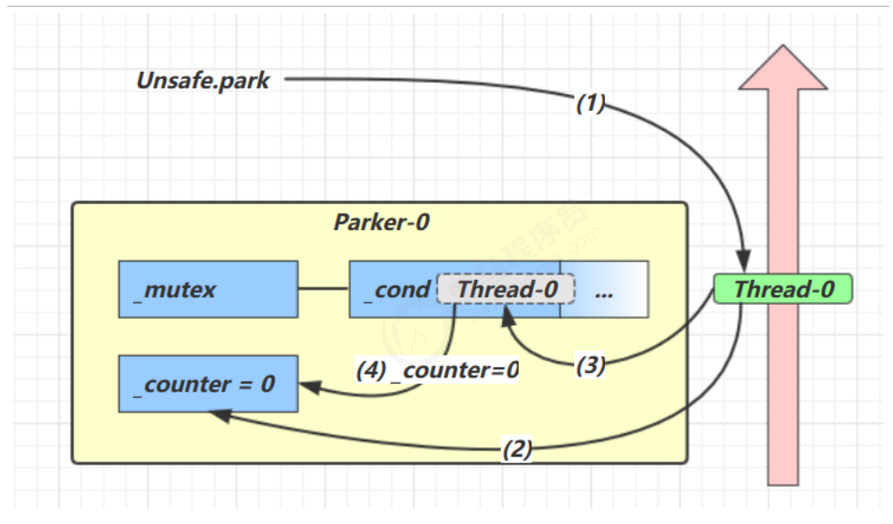

1. 当前线程调用 Unsafe.park() 方法 
2. 检查 _counter ，本情况为 0，这时，获得 _mutex 互斥锁 
3. 线程进入 _cond 条件变量阻塞 
4. 设置 _counter = 0

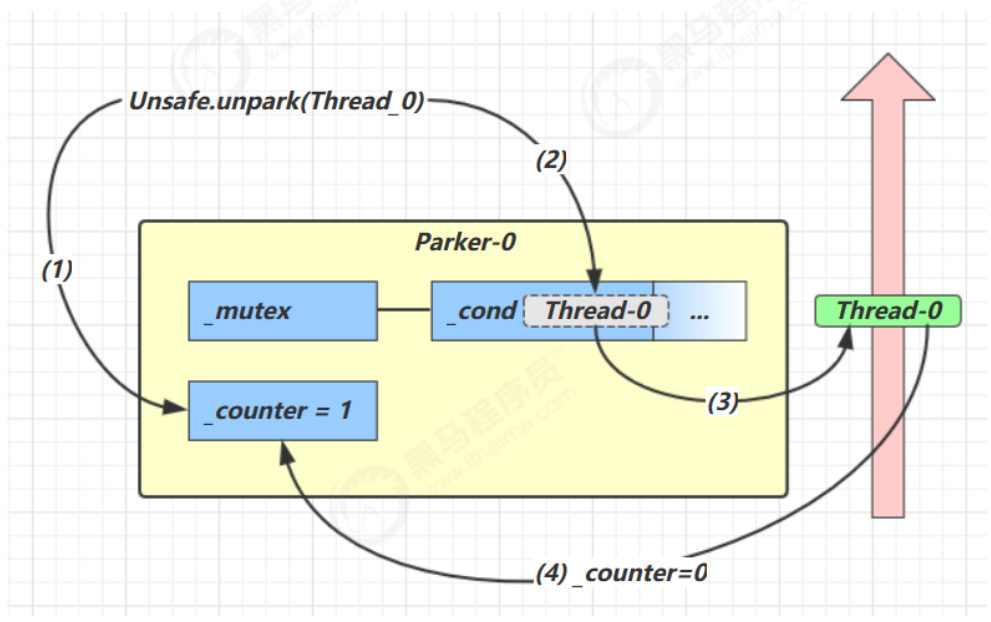

1. 调用 Unsafe.unpark(Thread_0) 方法，设置 _counter 为 1 
2. 唤醒 _cond 条件变量中的 Thread_0 
3. Thread_0 恢复运行 
4. 设置 _counter 为 0


## 线程优先级

`package java.lang;`

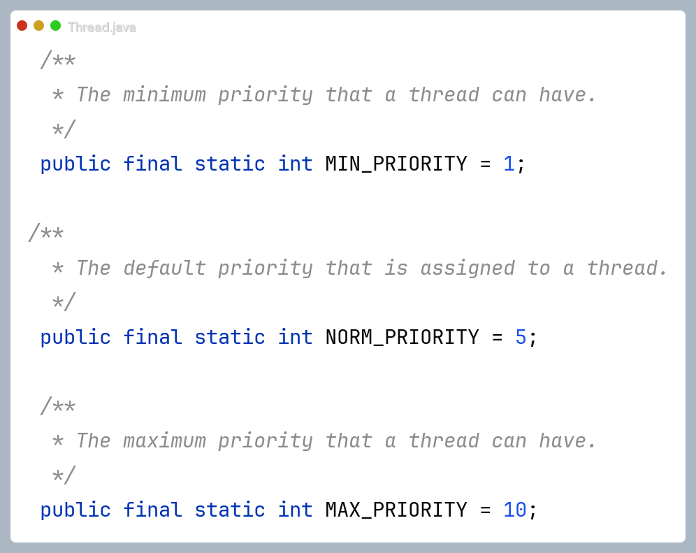

最小优先级1

默认优先级5


* 线程优先级会提示（hint）调度器优先调度该线程，但它仅仅是一个提示，调度器可以忽略它

* 如果 cpu 比较忙，那么优先级高的线程会获得更多的时间片，但 cpu 闲时，优先级几乎没作用


# 模式

## 终止模式之两阶段终止模式

> 模式方面

**错误的终止思路**：

* 使用线程对象的`stop()`方法停止线程

  * stop方法会真正杀死线程，如果这时线程锁住了共享资源，那么它被杀死后就再也没有机会释放锁，其他线程将永远无法获取锁

* 使用`System.exit(int)`方法停止线程

  此方法会让整个程序都停止，而不是仅停止一个线程


**两阶段终止模式**：


* 优点：给被终止线程处理后续工作的机会

* 场景：监控线程，如果需要停止

  > 监控线程一般会有个while(true)循环
  >
  > 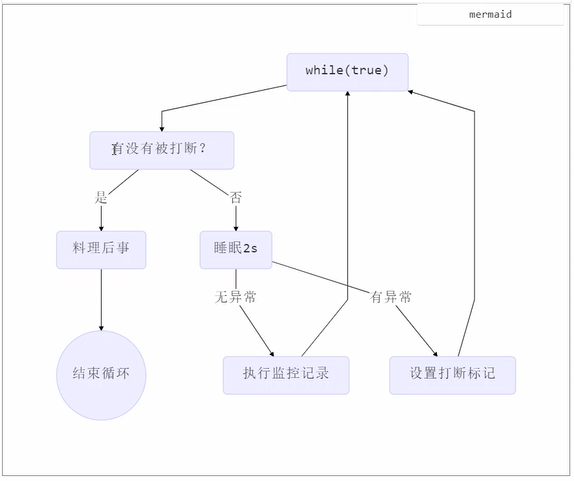


**使用打断标记实现**

```java
public class Test {
    public static void main(String[] args) throws InterruptedException();
    tpt.start();
    
    Thread.sleep(3500);
    tpt.stop(); 
}
class TwoPhaseTermination {
    private Thread monitor;
    
    // 启动监控线程
    public void start() {
        monitor = new Thread(() -> {
            while(true){
                Thread current = Thread.currentThread();
                if(current.isInterrupted()){
                    log.debug("处理终止工作(料理后事)");
                    break;
                }
                
                try {
                    TimeUnit.SECONDS.sleep(1); // 1.睡眠中可能被打断
                    log.debug("执行监控记录"); // 2.运行中可能被打断 
                } catch (InterruptedException e) {
                    // 睡眠中被打断会以异常的形式处理
                    e.printStackTrace();
                    // 设置打断标记为真，确保睡眠中被打断也能正常终止程序
                    current.interrupt();// 容易忘记将这个interrupt重新设置为true
                }
            }
        });
        
        monitor.start();
    }
    
    // 停止监控线程
    public void stop() {
        monitor.interrupt();
    }
    
}
```


**使用volatile优化**

```java
public class Test {
    public static void main(String[] args) throws InterruptedException();
    tpt.start();
    
    Thread.sleep(3500);
    tpt.stop(); 
}
class TwoPhaseTermination {
    private Thread monitor;
    private volatile boolean stop; // 标记是否被打断了
    
    // 启动监控线程
    public void start() {
        monitor = new Thread(() -> {
            while(true){
                
                if(stop){
                    log.debug("处理终止工作(料理后事)");
                    break;
                }
                
                try {
                    TimeUnit.SECONDS.sleep(1); // 1.睡眠中可能被打断
                    log.debug("执行监控记录"); // 2.运行中可能被打断 
                } catch (InterruptedException e) {
                    // 睡眠中被打断会以异常的形式处理
                    e.printStackTrace();
                }
            }
        });
        
        monitor.start();
    }
    
    // 停止监控线程
    public void stop() { 
        stop = true;
        monitor.interrupt();
    }
    
}
```


## 同步模式之保护性暂停


##### **1.定义**

即 Guarded Suspension，用在一个线程等待另一个线程的执行结果 

要点 

* 有一个结果需要从一个线程传递到另一个线程，让他们关联同一个 GuardedObject 

* 如果有结果不断从一个线程到另一个线程那么可以使用消息队列（见生产者/消费者） 

* JDK 中，**join 的实现、Future 的实现，采用的就是此模式** 

  > [join原理](####join原理)

* 因为要等待另一方的结果，因此归类到同步模式


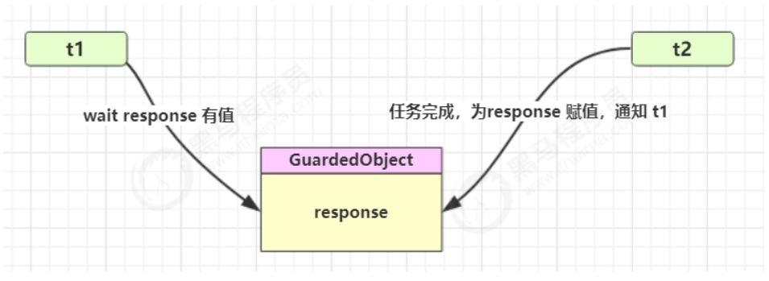


##### **2.实现**


```java
class GuardedObject {
    private Object response;
    private final Object lock = new Object();
    // 获取结果
    public Object get() {
        synchronized (lock) {
            // 条件不满足则等待
            while (response == null) {
                try {
                    lock.wait();
                } catch (InterruptedException e) {
                    e.printStackTrace();
                }
            }
            return response;
        }
    }
    // 产生结果
    public void complete(Object response) {
        synchronized (lock) {
            // 条件满足，通知等待线程
            this.response = response;
            lock.notifyAll();
        }
    }
}

```


##### **应用**

一个线程等待另一个线程的执行结果

```java
public static void main(String[] args) {
    GuardedObject guardedObject = new GuardedObject();
    new Thread(() -> {
        try {
            // 子线程执行下载
            List<String> list = Downloader.download();
            log.debug("download complete...");
            guardedObject.complete(list);
        } catch (IOException e) {
            e.printStackTrace();
        }
    }).start();
    log.debug("waiting...");
    // 主线程阻塞等待
    Object response = guardedObject.get();
    log.debug("get response: [{}] lines", ((List<String>) response).size());
}

```

执行结果

```
08:42:18.568 [main] c.TestGuardedObject - waiting...
08:42:23.312 [Thread-0] c.TestGuardedObject - download complete...
08:42:23.312 [main] c.TestGuardedObject - get response: [3] lines
```


##### **3.带超时版 GuardedObject**

控制超时时间的版本

```java
class GuardedObjectV2 {
    private Object response;
    private final Object lock = new Object();
    public Object get(long millis) {
        synchronized (lock) {
            // 1) 记录最初时间
            long begin = System.currentTimeMillis();
            // 2) 已经经历的时间
            long passedTime = 0;
            while (response == null) {
                // 4) 假设 millis 是 1000，结果在 400 时唤醒了，那么还有 600 要等
                log.debug("还需等待时间: {}", millis - passedTime);
                if (waitTime <= 0) {
                    log.debug("break...");
                    break;
                }
                try {
                    lock.wait(millis - passedTime);
                } catch (InterruptedException e) {
                    e.printStackTrace();
                }
                // 3) 如果提前被唤醒，这时已经经历的时间假设为 400
                passedTime = System.currentTimeMillis() - begin;
                log.debug("passedTime: {}, object is null {}", passedTime, response == null);
            }
            return response;
        }
    }
    public void complete(Object response) {
        synchronized (lock) {
            // 条件满足，通知等待线程
            this.response = response;
            log.debug("notify...");
            lock.notifyAll();
        }
    }
}

```

测试，没有超时

```java
public static void main(String[] args) {
    GuardedObjectV2 v2 = new GuardedObjectV2();
    new Thread(() -> {
        sleep(1);
        v2.complete(null);
        sleep(1);
        v2.complete(Arrays.asList("a", "b", "c"));
    }).start();
    Object response = v2.get(2500);
    if (response != null) {
        log.debug("get response: [{}] lines", ((List<String>) response).size());
    } else {
        log.debug("can't get response");
    }
}

```


### 改进

> #### 多任务版 GuardedObject
>
> (消息队列)

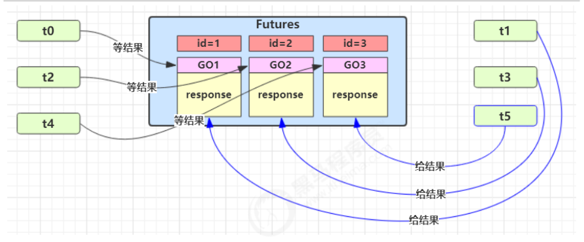

图中 Futures 就好比居民楼一层的信箱（每个信箱有房间编号），左侧的 t0，t2，t4 就好比等待邮件的居民，右 侧的 t1，t3，t5 就好比邮递员 

如果需要在多个类之间使用 GuardedObject 对象，作为参数传递不是很方便，因此设计一个用来解耦的中间类， 这样不仅能够解耦【结果等待者】和【结果生产者】，还能够同时支持多个任务的管理


```java
class GuardedObject {
    // 标识 Guarded Object
    private int id;
    public GuardedObject(int id) {
        this.id = id;
    }
    public int getId() {
        return id;
    }
    // 结果
   private Object response;
    // 获取结果
    // timeout 表示要等待多久 2000
    public Object get(long timeout) {
        synchronized (this) {
            // 开始时间 15:00:00
           long begin = System.currentTimeMillis();
            // 经历的时间
            long passedTime = 0;
            while (response == null) {
                // 这一轮循环应该等待的时间
                long waitTime = timeout - passedTime;
                // 经历的时间超过了最大等待时间时，退出循环
                if (timeout - passedTime <= 0) {
                    break;
                }
                try {
                    this.wait(waitTime); // 虚假唤醒 15:00:01
                } catch (InterruptedException e) {
                    e.printStackTrace();
                }
                // 求得经历时间
                passedTime = System.currentTimeMillis() - begin; // 15:00:02 1s
            }
            return response;
        }
    }
    // 产生结果
    public void complete(Object response) {
        synchronized (this) {
            // 给结果成员变量赋值
            this.response = response;
            this.notifyAll();
        }
    }
}
```

新增 id 用来标识 Guarded Object

**中间解耦类**：

```java
class Mailboxes {
    private static Map<Integer, GuardedObject> boxes = new Hashtable<>();
    private static int id = 1;
    // 产生唯一 id (在中间类中产生，避免外部自定义的id冲突)
    private static synchronized int generateId() {
        return id++;
    }
    public static GuardedObject getGuardedObject(int id) {
        return boxes.remove(id); // 删除，避免内存溢出
    }
    public static GuardedObject createGuardedObject() {
        GuardedObject go = new GuardedObject(generateId());
        boxes.put(go.getId(), go);
        return go;
    }
    public static Set<Integer> getIds() {
        return boxes.keySet();
    }
}

```


**业务相关类**:

```java
class People extends Thread{
    @Override
    public void run() {
        // 收信
        GuardedObject guardedObject = Mailboxes.createGuardedObject();
        log.debug("开始收信 id:{}", guardedObject.getId());
        Object mail = guardedObject.get(5000); // 收信，最多等5s
        log.debug("收到信 id:{}, 内容:{}", guardedObject.getId(), mail);
    }
}

```

```java
class Postman extends Thread {
    private int id;
    private String mail;
    public Postman(int id, String mail) {
        this.id = id;
        this.mail = mail;
    }
    @Override
    public void run() {
        GuardedObject guardedObject = Mailboxes.getGuardedObject(id);
        log.debug("送信 id:{}, 内容:{}", id, mail);
        guardedObject.complete(mail); // （送信）
    }
}
```


测试

```java
public static void main(String[] args) throws InterruptedException {
    for (int i = 0; i < 3; i++) {
        new People().start();
    }
    Sleeper.sleep(1);
    for (Integer id : Mailboxes.getIds()) {
        new Postman(id, "内容" + id).start();
    }
}

```


## 同步模式之顺序控制


#### **固定运行顺序**


案例：两个打印线程，要求必须先打印 2   后打印 1

方法一：使用`wait()`+`notify()`方法

```java
public class Main{
    static final Object lock = new Object();
    private int count = 0;
    static boolean t2Runned = false;// 【表示t2是否运行过】
    new Thread(() -> {
        synchronized (lock) {
            while(!t2Runned){
                try {
                    lock.wait();
                } catch (InterruptedException e) {
                    e.printStackTrace();
                }
            }
            log.debug("1");
        }
    },"t1").start();
    new Thread(() -> {
        synchronized (lock) {
            log.debug("2");
            t2Runned = true;
            lock.notify();
        }
    },"t2").start();
}
```

方法二：使用`await()`+`signal()`方法

方法三：使用`park()` + `unpark()`方法

```java
public class Main{
    static final Object lock = new Object();
    private int count = 0;
    Thread t1 = new Thread(() -> {
        LockSupport.park();
        log.debug("1");
    },"t1");
    Thread t2 = new Thread(() -> {
        log.debug("2");
        LockSupport.park(t1);
    }, "t2");
    
    t1.start();
    t2.start();
}


```


#### 交替输出

线程 1 输出 a 5 次，线程 2 输出 b 5 次，线程 3 输出 c 5 次。现在要求输出 abcabcabcabcabc 怎么实现

方法一：使用`wait()`+`notify()`方法

```java
class SyncWaitNotify {
    private int flag;
    private int loopNumber;
    public SyncWaitNotify(int flag, int loopNumber) {
        this.flag = flag;
        this.loopNumber = loopNumber;
    }
    public void print(int waitFlag, int nextFlag, String str) {
        for (int i = 0; i < loopNumber; i++) {
            synchronized (this) {// 如果不是当前线程期望打印的数字就继续等待
                while (this.flag != waitFlag) {
                    try {
                        this.wait();
                    } catch (InterruptedException e) {
                        e.printStackTrace();
                    }
                }
                System.out.print(str); 
                flag = nextFlag;// flag标记为下一个应该打印的数字
                this.notifyAll();
            }
        }
    }
}

public static void main(String[] args){
    SyncWaitNotify syncWaitNotify = new SyncWaitNotify(1, 5);
    new Thread(() -> {
     syncWaitNotify.print(1, 2, "a");// 每个线程自己运行完了就把标记改成下一个线程的标记
    }).start();
    new Thread(() -> {
     syncWaitNotify.print(2, 3, "b");
    }).start();
    new Thread(() -> {
     syncWaitNotify.print(3, 1, "c");
    }).start();
}
```

方法二：使用`await()`+`signal()`方法

```java
class AwaitSignal extends ReentrantLock {
    public void start(Condition first) {
        this.lock();
        try {
            log.debug("start");
            first.signal();
        } finally {
            this.unlock();
        }
    }
    public void print(String str, Condition current, Condition next) {
        for (int i = 0; i < loopNumber; i++) {
            this.lock();
            try {
                current.await();
                log.debug(str);
                next.signal();
            } catch (InterruptedException e) {
                e.printStackTrace();
            } finally {
                this.unlock();
            }
        }
    }
    // 循环次数
    private int loopNumber;
    public AwaitSignal(int loopNumber) {
        this.loopNumber = loopNumber;
    }
}

public static void main(String[] args){
    AwaitSignal as = new AwaitSignal(5);
    Condition aWaitSet = as.newCondition();
    Condition bWaitSet = as.newCondition();
    Condition cWaitSet = as.newCondition();
    new Thread(() -> {
        as.print("a", aWaitSet, bWaitSet);
    }).start();
    
    new Thread(() -> {
        as.print("b", bWaitSet, cWaitSet);
    }).start();
    new Thread(() -> {
        as.print("c", cWaitSet, aWaitSet);
    }).start();
    Thread.sleep(1000);
    try {
        System.out.println("开始...");
        aWaitSet.signal();
    } finally {
        awaitSignal.unlock();
    }
    
}
```


方法三：使用`park()` + `unpark()`方法

```java
class SyncPark {
    private int loopNumber;
    private Thread[] threads;
    public SyncPark(int loopNumber) {
        this.loopNumber = loopNumber;
    }
    public void setThreads(Thread... threads) {
        this.threads = threads;
    }
    public void print(String str) {
        for (int i = 0; i < loopNumber; i++) {
            LockSupport.park();
            System.out.print(str);
            LockSupport.unpark(nextThread());// 打印完唤醒下一个线程
        }
    }
    private Thread nextThread() {
        Thread current = Thread.currentThread();
        int index = 0;
        for (int i = 0; i < threads.length; i++) {
            if(threads[i] == current) {
                index = i;
                break;
            }
        }
        if(index < threads.length - 1) {
            return threads[index+1];
        } else {
            return threads[0];
        }
    }
    public void start() {
        for (Thread thread : threads) {
            thread.start();
        }
        LockSupport.unpark(threads[0]);
    }
}

public static void main(String[] args){
    SyncPark syncPark = new SyncPark(5);
    Thread t1 = new Thread(() -> {
        syncPark.print("a");
    });
    Thread t2 = new Thread(() -> {
        syncPark.print("b");
    });
    Thread t3 = new Thread(() -> {
        syncPark.print("c\n");
    });
    syncPark.setThreads(t1, t2, t3);
    syncPark.start();

}
```


**大厂面试原题 两个线程交替打印奇偶数**

方法一：使用`synchronized` + `wait/notify`（推荐）

```java
public class Main{
    public static void main(String[] args){
        static final Object lock = new Object();
        private int count = 1;
        private static final int MAX = 100;
        static boolean t2Runned = false;// 【表示t2是否运行过】
        Thread t1 = new Thread(() -> {
            synchronized (lock) {
                while (count <= MAX) {
                    if (count % 2 == 1) { // 奇数
                        System.out.println(Thread.currentThread().getName() + ": " + count);
                        count++;
                        lock.notify(); // 唤醒t2
                    } else {
                        try {
                            lock.wait(); // 等待t2打印偶数
                        } catch (InterruptedException e) {
                            Thread.currentThread().interrupt();
                            return;
                        }
                    }
                }
            }
        },"t1");

        Thread t2 = new Thread(() -> {
            synchronized (lock) {
                while (count <= MAX) {
                    if (count % 2 == 0) { // 偶数
                        System.out.println(Thread.currentThread().getName() + ": " + count);
                        count++;
                        lock.notify(); // 唤醒t1
                    } else {
                        try {
                            lock.wait(); // 等待t1打印奇数
                        } catch (InterruptedException e) {
                            Thread.currentThread().interrupt();
                            return;
                        }
                    }
                }
            }
        },"t2");
        
        t1.start();
        t2.start();
        
    }    
}

```


> 
>
> 相关题：力扣1114题


## 同步模式之 Balking

> 和 “终止模式” 类似，都与监控场景相关
>
> ```java
> public class Test {
>  public static void main(String[] args) throws InterruptedException();
>  tpt.start();
> 
>  Thread.sleep(3500);
>  tpt.stop(); 
> }
> class TwoPhaseTermination {
>  private Thread monitor;
>  private volatile boolean stop; // 标记是否被打断了
> 
>  // 启动监控线程
>  public void start() {
>      monitor = new Thread(() -> {
>          while(true){
> 
>              if(stop){
>                  log.debug("处理终止工作(料理后事)");
>                  break;
>              }
> 
>              try {
>                  TimeUnit.SECONDS.sleep(1); // 1.睡眠中可能被打断
>                  log.debug("执行监控记录"); // 2.运行中可能被打断 
>              } catch (InterruptedException e) {
>                  // 睡眠中被打断会以异常的形式处理
>                  e.printStackTrace();
>              }
>          }
>      });
>      monitor.start();
>  }
> 
>  // 停止监控线程
>  public void stop() { 
>      stop = true;
>      monitor.interrupt();
>  }
> 
> }
> ```
>
> 存在问题：start 方法可以反复调用，每次掉员工都会创建一个监控线程


**1.定义**

Balking （犹豫）模式用在一个线程发现另一个线程或本线程已经做了某一件相同的事，那么本线程就无需再做 了，直接结束返回

**2.实现**

例如：

```java
public class MonitorService {
    // 增加一个标记 用来表示是否已经有线程已经在执行启动了
    private volatile boolean starting;
    
    public void start() {
        log.info("尝试启动监控线程...");
        synchronized (this) { // 需要加锁，否则多线程进入这段代码，都判断为false，导致仍然有多个线程被创建 (此处volatile不足以应对多线程，需要锁住临界区)
            log.info("该监控线程已启动?({})", starting);
            if (starting) {
                return;
            }
            starting = true;
        }
        // 真正启动监控线程
        monitor = new Thread(() -> {
            while(true){       
                if(stop){
                    log.debug("处理终止工作(料理后事)");
                    starting = false; // 用volatile保证可见性
                    log.info("监控线程已经停止");
                    break;
                }
                try {
                    TimeUnit.SECONDS.sleep(1); // 1.睡眠中可能被打断
                    log.debug("执行监控记录"); // 2.运行中可能被打断 
                } catch (InterruptedException e) {
                    // 睡眠中被打断会以异常的形式处理
                    e.printStackTrace();
                }
            }
        });
        monitor.start();
    }
}
```

当前端页面多次点击按钮调用 start 时 

输出

```
[http-nio-8080-exec-1] cn.itcast.monitor.service.MonitorService - 该监控线程已启动?(false)
[http-nio-8080-exec-1] cn.itcast.monitor.service.MonitorService - 监控线程已启动...
[http-nio-8080-exec-2] cn.itcast.monitor.service.MonitorService - 该监控线程已启动?(true)
[http-nio-8080-exec-3] cn.itcast.monitor.service.MonitorService - 该监控线程已启动?(true)
[http-nio-8080-exec-4] cn.itcast.monitor.service.MonitorService - 该监控线程已启动?(true)
```

它还经常用来实现线程安全的单例

```java
public final class Singleton {
    private Singleton() {
        
    }
    private static Singleton INSTANCE = null;
    public static synchronized Singleton getInstance() {
        if (INSTANCE != null) { // 也是Balking 模式的体现
            return INSTANCE;
        }
        INSTANCE = new Singleton();
        return INSTANCE;
    }
}
```

对比一下保护性暂停模式：保护性暂停模式用在一个线程等待另一个线程的执行结果，当条件不满足时线程等待


## 异步模式之==生产者/消费者==

> #### 生产者和消费者问题


要点

* 与前面的保护性暂停中的 GuardObject 不同，不需要产生结果和消费结果的线程一一对应 
* 消费队列可以用来平衡生产和消费的线程资源 
* 生产者仅负责产生结果数据，不关心数据该如何处理，而消费者专心处理结果数据 
* 消息队列是有容量限制的，满时不会再加入数据，空时不会再消耗数据 
* JDK 中各种阻塞队列，采用的就是这种模式

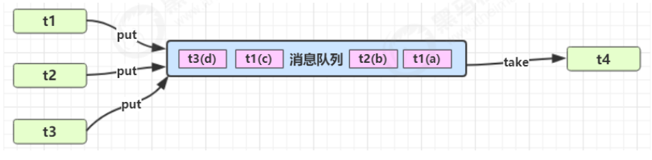

### 代码实现


#### 满哥讲解

```java
class Message {
    private int id;
    private Object message;
    public Message(int id, Object message) {
        this.id = id;
        this.message = message;
    }
    public int getId() {
        return id;
    }
    public Object getMessage() {
        return message;
    }
}
class MessageQueue {
    private LinkedList<Message> queue;
    private int capacity;
    public MessageQueue(int capacity) {
        this.capacity = capacity;
        queue = new LinkedList<>();
    }
    
    // 获取消息
    public Message take() {
        synchronized (queue) {
            while (queue.isEmpty()) {
                log.debug("没货了, wait");
                try {
                    queue.wait();
                } catch (InterruptedException e) {
                    e.printStackTrace();
                }
            }
            Message message = queue.removeFirst();
            queue.notifyAll();
            return message;
        }
        
        // 存入消息
        public void put(Message message) {
            synchronized (queue) {
                while (queue.size() == capacity) {
                    log.debug("库存已达上限, wait");
                    try {
                        queue.wait();
                    } catch (InterruptedException e) {
                        e.printStackTrace();
                    }
                }
                queue.addLast(message);
                queue.notifyAll();
            }
        }
}
```


```java
MessageQueue messageQueue = new MessageQueue(2);
// 4 个生产者线程, 下载任务
for (int i = 0; i < 4; i++) {
    int id = i;
    new Thread(() -> {
        try {
            log.debug("download...");
            List<String> response = Downloader.download();
            log.debug("try put message({})", id);
            // 存入下载结果
            messageQueue.put(new Message(id, response));
        } catch (IOException e) {
            e.printStackTrace();
        }
    }, "生产者" + i).start();
}
// 1 个消费者线程, 处理结果
new Thread(() -> {
    while (true) {
        Message message = messageQueue.take();// 获取消息
        List<String> response = (List<String>) message.getMessage();
        log.debug("take message({}): [{}] lines", message.getId(), response.size());
    }
}, "消费者").start();

```

某次运行结果

```
10:48:38.070 [生产者3] c.TestProducerConsumer - download...
10:48:38.070 [生产者0] c.TestProducerConsumer - download...
10:48:38.070 [消费者] c.MessageQueue - 没货了, wait
10:48:38.070 [生产者1] c.TestProducerConsumer - download...
10:48:38.070 [生产者2] c.TestProducerConsumer - download...
10:48:41.236 [生产者1] c.TestProducerConsumer - try put message(1)
10:48:41.237 [生产者2] c.TestProducerConsumer - try put message(2)
10:48:41.236 [生产者0] c.TestProducerConsumer - try put message(0)
10:48:41.237 [生产者3] c.TestProducerConsumer - try put message(3)
10:48:41.239 [生产者2] c.MessageQueue - 库存已达上限, wait
10:48:41.240 [生产者1] c.MessageQueue - 库存已达上限, wait
10:48:41.240 [消费者] c.TestProducerConsumer - take message(0): [3] lines
10:48:41.240 [生产者2] c.MessageQueue - 库存已达上限, wait
10:48:41.240 [消费者] c.TestProducerConsumer - take message(3): [3] lines
10:48:41.240 [消费者] c.TestProducerConsumer - take message(1): [3] lines
10:48:41.240 [消费者] c.TestProducerConsumer - take message(2): [3] lines
10:48:41.240 [消费者] c.MessageQueue - 没货了, wait

```


#### Synchronized 版

```
/**
 * 线程之间的通信问题：生产者和消费者问题 
 * 解释：两个线程交替执行 A B 操作同一个变量 num = 0
 * A 执行 num+1
 * B 执行 num-1
 * 使用“等待唤醒+通知唤醒”的方式让两个轮流执行
 */
```

生产者和消费者问题-演示代码

```JAVA
package com.zzy.pc;
//顺序：判断等待->业务->通知
public class A {
    public static void main(String[] args) {
        Data data = new Data();

        new Thread(() -> {
            for (int i = 0; i < 10; i++) {
                try {
                    data.increment();
                } catch (InterruptedException e) {
                    e.printStackTrace();
                }
            }

        }, "A").start();

        new Thread(() -> {
            for (int i = 0; i < 10; i++) {
                try {
                    data.decrement();
                } catch (InterruptedException e) {
                    e.printStackTrace();
                }
            }
            
        },"B").start();
    }
}

class Data {
    private int number = 0;

    //+1
    public synchronized void increment() throws InterruptedException {
        //一、等待
        if (number != 0) {
            this.wait();
        }
        
        // 二、业务
        number++;
        System.out.println(Thread.currentThread().getName() + "=>" + number);
        // 三、通知其他线程，我+1完毕了
        this.notifyAll();
    }

    //-1
    public synchronized void decrement() throws InterruptedException {
        //一、等待
        if (number == 0) {
            this.wait();
        }
        
        // 二、业务
        number--;
        System.out.println(Thread.currentThread().getName() + "=>" + number);
        // 三、通知其他线程，我-1完毕了
        this.notifyAll();
    }
}
```

##### 存在的虚假唤醒问题

**问题，如果有四个线程**，会出现虚假唤醒


**虚假唤醒问题**：


解决方式 ，**if 改为while即可，防止虚假唤醒**

> 结论：**就是用if判断的话，唤醒后线程会从wait之后的代码开始运行，但是不会重新判断if条件，直接继续运行if代码块之后的代码，而如果使用while的话，也会从wait之后的代码运行，但是唤醒后会重新判断循环条件，如果不成立再执行while代码块之后的代码块，成立的话继续wait。**
> 这也就是为什么用while而不用if的原因了，因为线程被唤醒后，执行开始的地方是wait之后
>
> 
>
> (本来只需要一个消费者，但是notifyAll唤醒了一群消费者，一群只有一个可以消费，那么其他消费者就是虚假唤醒了，所以才需要使用while来多次判断条件)

```java
package com.marchsoft.juctest;

/**
 * Description：
 *
 * @author jiaoqianjin
 * Date: 2020/8/10 22:33
 **/

public class ConsumeAndProduct {
    public static void main(String[] args) {
        Data data = new Data();

        new Thread(() -> {
            for (int i = 0; i < 10; i++) {
                try {
                    data.increment();
                } catch (InterruptedException e) {
                    e.printStackTrace();
                }
            }
        }, "A").start();
        new Thread(() -> {
            for (int i = 0; i < 10; i++) {
                try {
                    data.decrement();
                } catch (InterruptedException e) {
                    e.printStackTrace();
                }
            }
        }, "B").start();
        new Thread(() -> {
            for (int i = 0; i < 10; i++) {
                try {
                    data.increment();
                } catch (InterruptedException e) {
                    e.printStackTrace();
                }
            }
        }, "C").start();
        new Thread(() -> {
            for (int i = 0; i < 10; i++) {
                try {
                    data.decrement();
                } catch (InterruptedException e) {
                    e.printStackTrace();
                }
            }
        }, "D").start();
    }
}

class Data {
    private int num = 0;

    // +1
    public synchronized void increment() throws InterruptedException {
        // 判断等待
        while (num != 0) {
            this.wait();
        }
        num++;
        System.out.println(Thread.currentThread().getName() + "=>" + num);
        // 通知其他线程 +1 执行完毕
        this.notifyAll();
    }

    // -1
    public synchronized void decrement() throws InterruptedException {
        // 判断等待
        while (num == 0) {
            this.wait();
        }
        num--;
        System.out.println(Thread.currentThread().getName() + "=>" + num);
        // 通知其他线程 -1 执行完毕
        this.notifyAll();
    }
}
```

#### Lock版


> Lock场景下，Condition对象的await方法起到wait的作用，signal方法起到notify的作用


生产者和消费者问题-演示代码：

```java
package com.marchsoft.juctest;

import java.util.concurrent.locks.Condition;
import java.util.concurrent.locks.Lock;
import java.util.concurrent.locks.ReentrantLock;

/**
 * Description：
 *
 * @author jiaoqianjin
 * Date: 2020/8/11 9:48
 **/

public class LockCAP {
    public static void main(String[] args) {
        Data2 data = new Data2();

        new Thread(() -> {
            for (int i = 0; i < 10; i++) {

                try {
                    data.increment();
                } catch (InterruptedException e) {
                    e.printStackTrace();
                }

            }
        }, "A").start();
        new Thread(() -> {
            for (int i = 0; i < 10; i++) {
                try {
                    data.decrement();
                } catch (InterruptedException e) {
                    e.printStackTrace();
                }
            }
        }, "B").start();
        new Thread(() -> {
            for (int i = 0; i < 10; i++) {
                try {
                    data.increment();
                } catch (InterruptedException e) {
                    e.printStackTrace();
                }
            }
        }, "C").start();
        new Thread(() -> {
            for (int i = 0; i < 10; i++) {
                try {
                    data.decrement();
                } catch (InterruptedException e) {
                    e.printStackTrace();
                }
            }
        }, "D").start();
    }
}

class Data2 {
    private int num = 0;
    Lock lock = new ReentrantLock();
    Condition condition = lock.newCondition();
    // +1
    public  void increment() throws InterruptedException {
        lock.lock();
        try {
            // 一、判断等待
            while (num != 0) {
                condition.await();
            }
            // 二、业务
            num++;
            System.out.println(Thread.currentThread().getName() + "=>" + num);
            // 三、通知其他线程 +1 执行完毕
            condition.signalAll();
        }finally {
            lock.unlock();
        }

    }

    // -1
    public  void decrement() throws InterruptedException {
        lock.lock();
        try {
            // 判断等待
            while (num == 0) {
                condition.await();
            }
            num--;
            System.out.println(Thread.currentThread().getName() + "=>" + num);
            // 通知其他线程 +1 执行完毕
            condition.signalAll();
        }finally {
            lock.unlock();
        }

    }
}
```


#### Condition的优势

精准的通知和唤醒的线程 

**如果我们要指定通知的下一个进行顺序怎么办呢？ 我们<u>可以使用Condition来指定通知进程执行顺序</u>~**

示例代码

```java
package com.marchsoft.juctest;

import java.util.concurrent.locks.Condition;
import java.util.concurrent.locks.Lock;
import java.util.concurrent.locks.ReentrantLock;

/**
 * Description：实现
 * A 执行完 调用B
 * B 执行完 调用C
 * C 执行完 调用A
 *
 * @author jiaoqianjin
 * Date: 2020/8/11 9:58
 **/

public class ConditionDemo {
    public static void main(String[] args) {
        Data3 data3 = new Data3();

        new Thread(() -> {
            for (int i = 0; i < 10; i++) {
                data3.printA();
            }
        },"A").start();
        new Thread(() -> {
            for (int i = 0; i < 10; i++) {
                data3.printB();
            }
        },"B").start();
        new Thread(() -> {
            for (int i = 0; i < 10; i++) {
                data3.printC();
            }
        },"C").start();
    }

}

//num为1的时候，让A执行；num为2的时候，让B执行；num为3的时候，让C执行；

class Data3 {
    private Lock lock = new ReentrantLock();
    private Condition condition1 = lock.newCondition();
    private Condition condition2 = lock.newCondition();
    private Condition condition3 = lock.newCondition();
    private int num = 1; // 1A 2B 3C

    public void printA() {
        lock.lock();
        try {
            // 业务代码 判断 -> 执行 -> 通知
            while (num != 1) {
                condition1.await();
            }
            System.out.println(Thread.currentThread().getName() + "==> AAAA" );
            num = 2;
            condition2.signal();//唤醒condition2
        }catch (Exception e) {
            e.printStackTrace();
        }finally {
            lock.unlock();
        }
    }
    public void printB() {
        lock.lock();
        try {
            // 业务代码 判断 -> 执行 -> 通知
            while (num != 2) {
                condition2.await();
            }
            System.out.println(Thread.currentThread().getName() + "==> BBBB" );
            num = 3;
            condition3.signal();
        }catch (Exception e) {
            e.printStackTrace();
        }finally {
            lock.unlock();
        }
    }
    public void printC() {
        lock.lock();
        try {
            // 业务代码 判断 -> 执行 -> 通知
            while (num != 3) {
                condition3.await();
            }
            System.out.println(Thread.currentThread().getName() + "==> CCCC" );
            num = 1;
            condition1.signal();
        }catch (Exception e) {
            e.printStackTrace();
        }finally {
            lock.unlock();
        }
    }
}
/*
A==> AAAA
B==> BBBB
C==> CCCC
A==> AAAA
B==> BBBB
C==> CCCC
...
*/
```


## 异步模式之工作线程


### 定义

让有限的工作线程（Worker Thread）来轮流异步处理无限多的任务。也可以将其归类为分工模式，它的典型实现 就是线程池，也体现了经典设计模式中的享元模式

> 例如，海底捞的服务员（线程），轮流处理每位客人的点餐（任务），如果为每位客人都配一名专属的服务员，那 么成本就太高了（对比另一种多线程设计模式：Thread-Per-Message） 

注意，不同任务类型应该使用不同的线程池，这样能够避免饥饿，并能提升效率 

> 例如，如果一个餐馆的工人既要招呼客人（任务类型A），又要到后厨做菜（任务类型B）显然效率不咋地，分成 服务员（线程池A）与厨师（线程池B）更为合理，当然你能想到更细致的分工


### 饥饿现象

> 线程中的线程不足导致的饥饿现象

固定大小线程池会有饥饿现象

> * 两个工人是同一个线程池中的两个线程 他们要做的事情是：为客人点餐和到后厨做菜，这是两个阶段的工作 
>   * 客人点餐：必须先点完餐，等菜做好，上菜，在此期间处理点餐的工人必须等待 
>   * 后厨做菜：没啥说的，做就是了 
> * 比如工人A 处理了点餐任务，接下来它要等着 工人B 把菜做好，然后上菜，他俩也配合的蛮好 
> * 但现在同时来了两个客人，这个时候工人A 和工人B 都去处理点餐了，这时没人做饭了，饥饿

解决方法可以增加线程池的大小，不过不是根本解决方案，还是前面提到的，不同的任务类型，采用不同的线程 池


### 如何设置最大线程数

* 过小会导致程序不能充分地利用系统资源、容易导致饥饿 
* 过大会导致更多的线程上下文切换，占用更多内存

[计算最大线程数方法参考](https://www.cnblogs.com/jpfss/p/11016169.html)


**1、CPU密集型运算：**

通常采用 cpu 核数 + 1 能够实现最优的 CPU 利用率，+1 是保证当线程由于页缺失故障（操作系统）或其它原因 导致暂停时，额外的这个线程就能顶上去，保证 CPU 时钟周期不被浪费

****

```java
int maxNum = Runtime.getRuntime().availableProcessors()+1;// 获取cpu 的核数（软编码）
ExecutorService service =new ThreadPoolExecutor(
        2,
        maxNum,
        3,
        TimeUnit.SECONDS,
        new LinkedBlockingDeque<>(3),
        Executors.defaultThreadFactory(),
        new ThreadPoolExecutor.AbortPolicy()
);
```


**2、I/O密集型运算：**

更常见（web应用：RPC调用、数据库操作）

> 比如一个程序中有15个大型任务，其中io十分占用资源；I/O密集型就是判断我们程序中十分耗I/O的线程数量，大约是最大I/O数的一倍到两倍之间。

判断你的程序中 耗IO 的线程数num ，设成 num~2*num之间

CPU 不总是处于繁忙状态，例如，当你执行业务计算时，这时候会使用 CPU 资源，但当你执行 I/O 操作时、远程 RPC 调用时，包括进行数据库操作时，这时候 CPU 就闲下来了，你可以利用多线程提高它的利用率

**经验公式如下**：


```
线程数 = 核数 * 期望 CPU 利用率 * 总时间(CPU计算时间+等待时间) / CPU 计算时间
```

> 即 `线程数*当前线程利用率 = 核心数*期望CPU利用率`

> 例如 4 核 CPU 计算时间是 50% ，其它等待时间是 50%，期望 cpu 被 100% 利用，套用公式
>
> ```
> 4 * 100% * 100% / 50% = 8
> ```
>
> 例如 4 核 CPU 计算时间是 10% ，其它等待时间是 90%，期望 cpu 被 100% 利用，套用公式
>
> ```
> 4 * 100% * 100% / 10% = 40
> ```
>
> 


## 设计模式之享元模式


### 1.简介

**定义** 英文名称：Flyweight pattern. 当需要重用数量有限的同一类对象时

> wikipedia： A flyweight is an object that minimizes memory usage by sharing as much data as possible with other similar objects
>

出自 "Gang of Four" design patterns


### 2.体现

#### 2.1包装类中的应用

在JDK中 Boolean，Byte，Short，Integer，Long，Character 等包装类提供了 valueOf 方法，例如 Long 的 valueOf 会缓存 -128~127 之间的 Long 对象，在这个范围之间会重用对象，大于这个范围，才会新建 Long 对象：

```java
public static Long valueOf(long l) {
    final int offset = 128;
    if (l >= -128 && l <= 127) { // will cache
        return LongCache.cache[(int)l + offset];
    }
    return new Long(l);
}
```

> 注意： 
>
> * Byte, Short, Long 缓存的范围都是 -128~127 
> * Character 缓存的范围是 0~127 
> * Integer的默认范围是 -128~127 
>   * 最小值不能变 
>   * 但最大值可以通过调整虚拟机参数 ` -Djava.lang.Integer.IntegerCache.high` 来改变 
> * Boolean 缓存了 TRUE 和 FALSE


#### 2.2 String 串池 

字符串常量池（jvm课程）


#### 2.3 BigDecimal BigInteger


> 单个BigDecimal是原子性的，但是组合使用的时候需要用原子引用类保护（`AtomicReference<BigDecimal>`）
>
> 


### 3.DIY

一个线上商城应用，QPS 达到数千，如果每次都重新创建和关闭数据库连接，性能会受到极大影响。 这时 预先创建好一批连接，放入连接池。一次请求到达后，从连接池获取连接，使用完毕后再还回连接池，这样既节约了连接的创建和关闭时间，也实现了连接的重用，不至于让庞大的连接数压垮数据库。

```java

public class TestPoolSemaphore {
    public static void main(String[] args) {
        Pool pool = new Pool(2);
        for (int i = 0; i < 5; i++) {
            new Thread(() -> {
                Connection conn = pool.borrow();
                try {
                    Thread.sleep(1000);// 模拟对连接的使用
                } catch (InterruptedException e) {
                    e.printStackTrace();
                }finally{
                    pool.free(conn);
                }
            }).start();
        }
    }
}
class Pool {
    // 1. 连接池大小
    private final int poolSize;
    // 2. 连接对象数组
    private Connection[] connections;
    // 3. 连接状态数组 0 表示空闲， 1 表示繁忙
    private AtomicIntegerArray states;// 需要使用原子类保证线程安全
    // 4. 构造方法初始化
    public Pool(int poolSize) {
        this.poolSize = poolSize;
        this.connections = new Connection[poolSize];
        this.states = new AtomicIntegerArray(new int[poolSize]);
        for (int i = 0; i < poolSize; i++) {
            connections[i] = new MockConnection("连接" + (i+1));
        }
    }
    // 5. 借连接
    public Connection borrow() {
        while(true) {
            for (int i = 0; i < poolSize; i++) {
                // 获取空闲连接
                if(states.get(i) == 0) {
                    if (states.compareAndSet(i, 0, 1)) {
                        log.debug("borrow {}", connections[i]);
                        return connections[i];
                    }
                }
            }
            // 如果没有空闲连接，当前线程进入等待(避免获取不到连接的线程不断空转)
            synchronized (this) {
                try {
                    log.debug("wait...");
                    this.wait();
                } catch (InterruptedException e) {
                    e.printStackTrace();
                }
            }
        }
    }
    // 6. 归还连接
    public void free(Connection conn) {
        for (int i = 0; i < poolSize; i++) {
            if (connections[i] == conn) {
                states.set(i, 0);
                synchronized (this) {
                    log.debug("free {}", conn);
                    this.notifyAll();
                }
                break;
            }
        }
    }
}
class MockConnection implements Connection {
 // 实现略
}


```

> 以上实现没有考虑： 
>
> * 连接的动态增长与收缩 
> * 连接保活（可用性检测） 
> * 等待超时处理 
> * **分布式 hash** 
>
> 对于关系型数据库，有比较成熟的连接池实现，例如c3p0, druid等 对于更通用的对象池，可以考虑使用apache commons pool，例如redis连接池可以参考jedis中关于连接池的实现


# ==共享模型-管程==

> 解决并发问题的思路-1


## 管程-悲观锁(阻塞)


### 共享资源的线程安全问题

 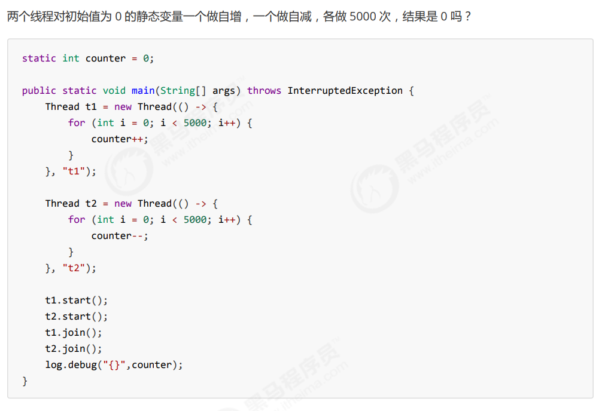

**问题分析** 

> 以上的结果可能是正数、负数、零。为什么呢？因为 Java 中对静态变量的自增，自减并不是原子操作，要彻底理 解，必须从字节码来进行分析
>
> 例如对于 i++ 而言（i 为静态变量），实际会产生如下的 JVM 字节码指令：
>
> ```java
> getstatic     i // 获取静态变量i的值
> iconst_1      i // 准备常量1
> iadd          i // 自增
> putstatic     i // 将修改后的值存入静态变量i
> ```
>
> 而对应 `i--` 也是类似：
>
> ```java
> getstatic     i // 获取静态变量i的值
> iconst_1      i // 准备常量1
> isub          i // 自减
> putstatic     i // 将修改后的值存入静态变量i
> ```
>
> 而 Java 的内存模型如下，完成静态变量的自增，自减需要在主存和工作内存中进行数据交换：
>
> 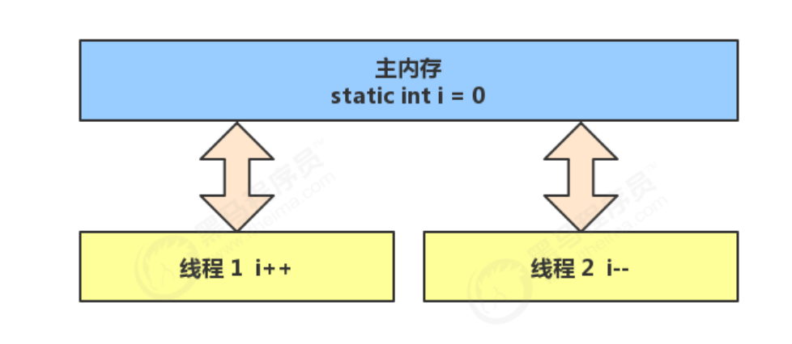
>
> 如果是单线程以上 8 行代码是顺序执行（不会交错）没有问题：
>
> 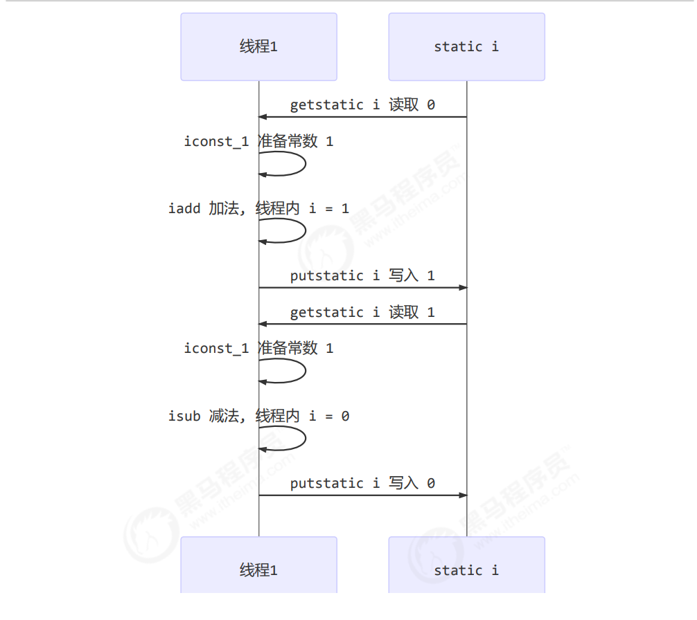
>
> 但多线程下这 8 行代码可能交错运行，(出现负数的情况)：
>
> 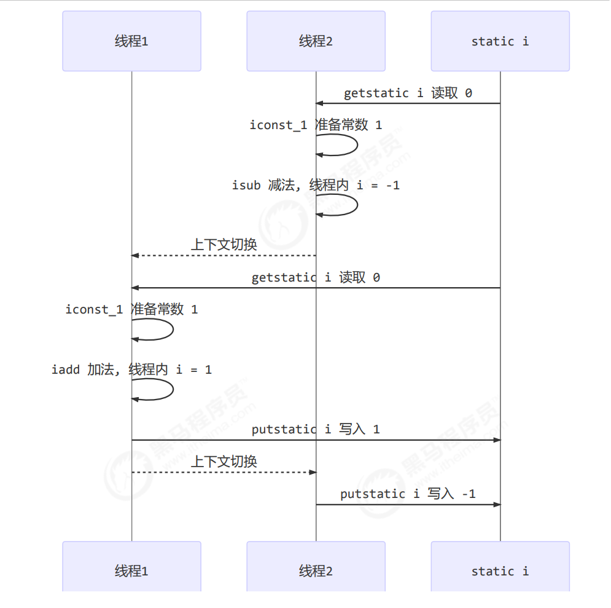
>
> (出现正数的情况)：
>
> 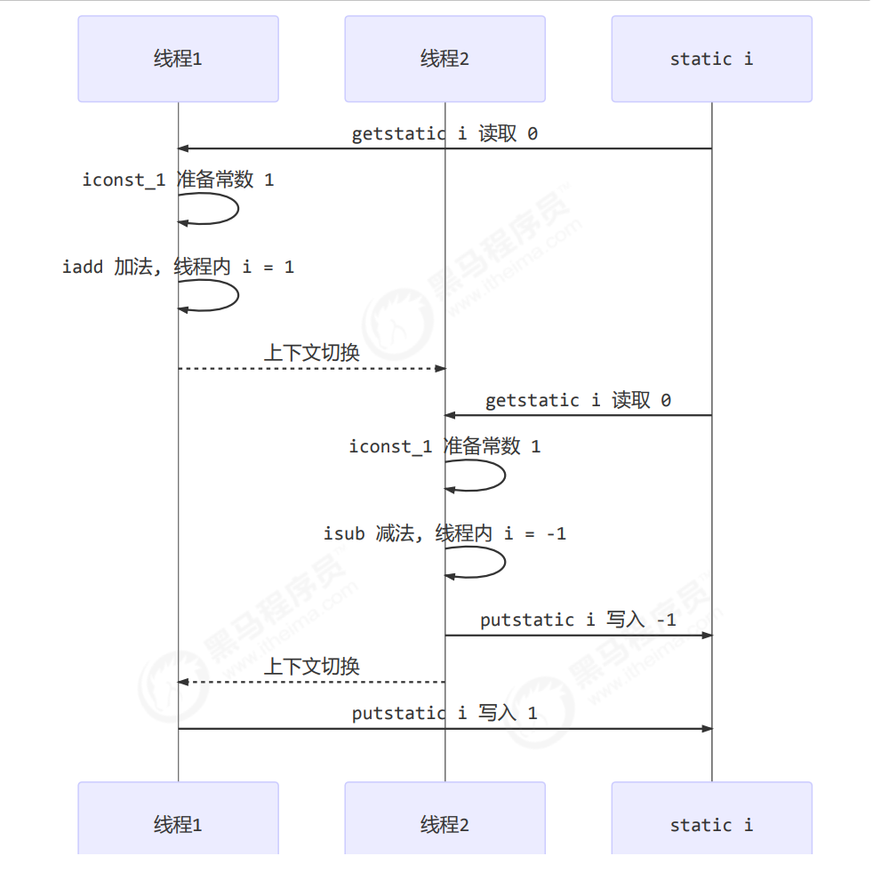
>
> 

——上下文切换导致的指令交错


**临界区**

* 一个程序运行多个线程本身是没有问题的
* 问题出在多个线程访问共享资源
  * 多个线程读共享资源其实也没有问题
  * 在多个线程对共享资源读写操作时发生指令交错，就会出现问题
* 一段代码块内如果存在对共享资源的多线程读写操作，称这段代码块为临界区

例如，下面代码中的临界区

 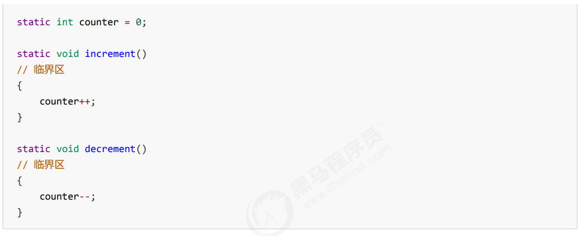


**竞争条件**

多个线程在临界区内执行，由于代码的**执行序列不同**而导致结果无法预测，称之为发生了**竞态条件**


#### 变量的线程安全分析

**成员变量和静态变量是否线程安全？**

* 如果它们没有共享，则线程安全
* 如果它们被共享了，根据它们的状态是否能够改变，又分两种情况
  * 如果只有读操作，则线程安全 
  * 如果有读写操作，则这段代码是临界区，需要考虑线程安全

> **成员变量一定要注意是否有线程安全问题**


**局部变量是否线程安全？** 

* 局部变量是线程安全的

  ```java
  public static void test1() {
      int i = 10;
      i++;
  }
  ```

  > 每个线程调用 test1() 方法时局部变量 i，会在**每个线程的栈帧内存中**被创建，因此不存在共享
  >
  > 

* 但局部变量引用的对象则未必

  * 如果该对象没有逃离方法的作用访问，它是线程安全的
  * 如果该对象逃离方法的作用范围，需要考虑线程安全


> 
>
> 方法访问修饰符带来的思考，如果把 method2 和 method3 的方法修改为 public 会不会代理线程安全问题？
>
> * 情况1：有其它线程调用 method2 和 method3 ——不会有线程安全问题
> * 情况2：在 情况1 的基础上，为 ThreadSafe 类添加子类，子类覆盖 method2 或 method3 方法——有线程安全问题：
>
> ```java
> class ThreadSafe {
>     public final void method1(int loopNumber) {
>         ArrayList<String> list = new ArrayList<>();
>         for (int i = 0; i < loopNumber; i++) {
>             method2(list);
>             method3(list);
>         }
>     }
>     public void method2(ArrayList<String> list) {
>         list.add("1");
>     }
>     public void method3(ArrayList<String> list) {
>         list.remove(0);
>     }
> }
> 
> class ThreadSafeSubClass extends ThreadSafe{
>     @Override
>     public void method3(ArrayList<String> list) {
>         new Thread(() -> {
>             list.remove(0);
>         }).start();
>     }
> }
> 
> ```
>
> 就是方法3里开了个新线程，新线程可以访问到list，此时就有两个线程共享list这个资源了 就会出现线程安全问题(可能执行删除的时候，还没执行添加操作)
>
> 所以访问修饰符 private  / final 是有意义的，能避免子类重写


### ==解决方案synchronized==

为了避免临界区的竞态条件发生，有多种手段可以达到目的。 

* 阻塞式的解决方案：synchronized，Lock
* 非阻塞式的解决方案：原子变量


synchronized，即俗称的【对象锁】，它采用互斥的方式让同一时刻至多只有一个线程能持有【对象锁】，其它线程再想获取这个【对象锁】时就会阻塞住。这样就能保证拥有锁 的线程可以安全的执行临界区内的代码，不用担心线程上下文切换

> 互斥：
>
> 保证临界区的代码片段同一时间内只有一个线程能够执行，不会因为线程的上下文切换导致指令的交错

> 如果共享变量能够**完全被**`synchronized`代码块保护，就不会有可见性、有序性、原子性的相关问题
>
> > 虽然也有指令重排，但是由于被完全保护，单线程环境下的指令重排不会出现问题

```java
synchronized(对象)
{
    临界区
}
```


```java
static int counter = 0;
static final Object room = new Object();

public static void main(String[] args) throws InterruptedException {
	Thread t1 = new Thread(() -> {
	for (int i = 0; i < 5000; i++) {
        synchronized (room) {
            counter++;
        }
    }
}, "t1");
    
Thread t2 = new Thread(() -> {
    for (int i = 0; i < 5000; i++) {
        synchronized (room) {
            counter--;
        }
    }
}, "t2");

t1.start();
t2.start();
t1.join();
t2.join();
log.debug("{}",counter);
}
```


类比： 

* `synchronized(对象)` 中的对象，可以想象为一个房间（room），有唯一入口（门）房间只能一次进入一人 进行计算，线程 t1，t2 想象成两个人
* 当线程 t1 执行到 synchronized(room) 时就好比 t1 进入了这个房间，并锁住了门拿走了钥匙，在门内执行 `count++`代码
* 这时候如果 t2 也运行到了 `synchronized(room)` 时，它发现门被锁住了，只能在门外等待，发生了上下文切换，阻塞住了
* 这**中间即使 t1 的 cpu 时间片不幸用完，被踢出了门外（不要错误理解为锁住了对象就能一直执行下去哦）， 这时门还是锁住的，t1 仍拿着钥匙，t2 线程还在阻塞状态进不来，只有下次轮到 t1 自己再次获得时间片时才 能开门进入**
* 当 t1 执行完 synchronized{} 块内的代码，这时候才会从 obj 房间出来并解开门上的锁，唤醒 t2 线程把钥匙给他。t2 线程这时才可以进入 obj 房间，锁住了门拿上钥匙，执行它的 count-- 代码

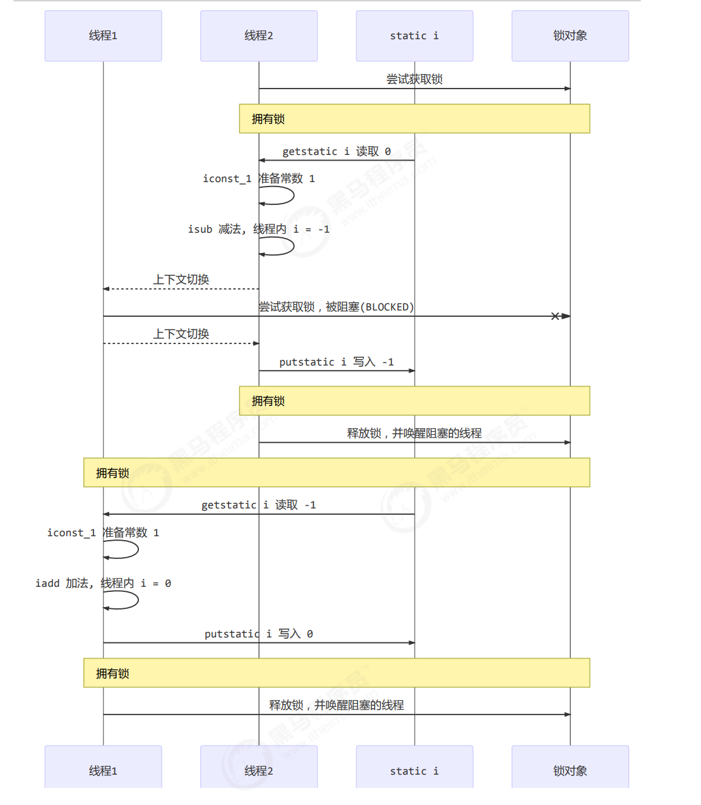

synchronized 实际是用**对象锁**保证了**临界区内代码的原子性**，临界区内的代码对外是不可分割的，不会被线程切 换所打断。

为了加深理解，请思考下面的问题

* 如果把 synchronized(obj) 放在 for 循环的外面，如何理解？-- 原子性
  把整个循环里面的所有指令作为整体，在这些全部指令执行的过程中，不会被其他线程干扰

* 如果 t1 synchronized(obj1) 而 t2 synchronized(obj2) 会怎样运作？-- 锁对象

* 如果 t1 synchronized(obj) 而 t2 没有加会怎么样？如何理解？-- 锁对象

  和没加锁一样，锁只有线程一持有 线程二不用尝试获取锁，线程二不会因为锁而被阻塞


#### 八锁问题

如何判断锁的是谁 锁到底锁的是谁？

**锁会锁住：对象、Class**


**问题1**

两个同步方法，先执行发短信还是打电话

```java
public class dome01 {
    public static void main(String[] args) {
        Phone phone = new Phone();

        new Thread(() -> { phone.sendMs(); }).start();
        TimeUnit.SECONDS.sleep(1);
        new Thread(() -> { phone.call(); }).start();
    }
}

class Phone {
    public synchronized void sendMs() {
        System.out.println("发短信");
    }
    public synchronized void call() {
        System.out.println("打电话");
    }
    
    // 为什么加在方法上锁的是对象？ 
    // 实际上等价于这种写法:
    public void sendMs() {
        synchronized(this) {
            System.out.println("发短信");
        }
    }
    public void call() {
        synchronized (this) {
            System.out.println("打电话");
        }
    }
}
```

输出结果为

发短信

打电话

**为什么？ 如果你认为是顺序在前？ 这个答案是错误的 **

**问题2：**

**我们再来看：我们让发短信 延迟4s**

```java
public class dome01 {
    public static void main(String[] args) throws InterruptedException {
        Phone phone = new Phone();

        new Thread(() -> {
            try {
                phone.sendMs();
            } catch (InterruptedException e) {
                e.printStackTrace();
            }
        }).start();
        TimeUnit.SECONDS.sleep(1);
        new Thread(() -> { phone.call(); }).start();
    }
}

class Phone {
    public synchronized void sendMs() throws InterruptedException {
        TimeUnit.SECONDS.sleep(4);
        System.out.println("发短信");
    }
    public synchronized void call() {
        System.out.println("打电话");
    }
}
```

TimeUnit

现在结果是什么呢？

结果：**==还是先发短信，然后再打电话 ==**

> 原因：sleep不会释放锁
>
> 并不是顺序执行，而是synchronized <u>锁住的对象</u>**是方法的调用者（也就是说，锁住的是对象）** 对于两个方法用的是同一个锁，谁先拿到谁先执行，另外一个等待
>
> ==对象锁==


**问题三**

加一个普通方法

```java
public class dome01 {
    public static void main(String[] args) throws InterruptedException {
        Phone phone = new Phone();

        new Thread(() -> {
            try {
                phone.sendMs();
            } catch (InterruptedException e) {
                e.printStackTrace();
            }
        }).start();
        TimeUnit.SECONDS.sleep(1);
        new Thread(() -> { phone.hello(); }).start();
    }
}

class Phone {
    public synchronized void sendMs() throws InterruptedException {
        TimeUnit.SECONDS.sleep(4);
        System.out.println("发短信");
    }
    public synchronized void call() {
        System.out.println("打电话");
    }
    public void hello() {
        System.out.println("hello");
    }
}
```

输出结果为

hello

发短信

> 原因：hello是一个**普通方法，不受synchronized锁的影响**，==**不用等待锁的释放**==
>
> 


**问题四**

**如果我们使用的是两个对象，一个调用发短信，一个调用打电话，那么整个顺序是怎么样的呢？**

```java
public class dome01 {
    public static void main(String[] args) throws InterruptedException {
        Phone phone1 = new Phone();
        Phone phone2 = new Phone();

        new Thread(() -> {
            try {
                phone1.sendMs();
            } catch (InterruptedException e) {
                e.printStackTrace();
            }
        }).start();
        TimeUnit.SECONDS.sleep(1);
        new Thread(() -> { phone2.call(); }).start();
    }
}

class Phone {
    public synchronized void sendMs() throws InterruptedException {
        TimeUnit.SECONDS.sleep(4);
        System.out.println("发短信");
    }
    public synchronized void call() {
        System.out.println("打电话");
    }
    public void hello() {
        System.out.println("hello");
    }
}
```

输出结果

打电话

发短信

> 原因：<u>两个对象两把锁，不会出现等待的情况</u>，发短信睡了4s,所以先执行打电话


**问题五、六**

**如果我们把两个synchronized的方法加上static变成静态方法 那么顺序又是怎么样的呢？**

（1）我们先来使用一个对象调用两个方法 

答案是：**先发短信,后打电话**

（2）如果我们使用两个对象调用两个方法 

答案是：**还是先发短信，后打电话**

原因是什么呢？ 为什么加了static就始终前面一个对象先执行呢 为什么后面会等待呢？
原因是：**对于static静态方法来说，对于整个类Class来说只有一份，对于不同的对象使用的是同一份方法，相当于==这个方法是属于这个类的==，如果静态static方法使用synchronized锁定，那么这个synchronized锁会锁住整个类 不管多少个对象，各个静态方法使用的是同一把锁，谁先拿到这个锁就先执行，其他的进程都需要等待 **


**问题七**

**如果我们使用一个静态同步方法、一个同步方法、一个对象调用顺序是什么？**

```java
public class dome01 {
    public static void main(String[] args) throws InterruptedException {
        Phone phone = new Phone();

        new Thread(() -> {
            try {
                phone.sendMs();
            } catch (InterruptedException e) {
                e.printStackTrace();
            }
        }).start();
        TimeUnit.SECONDS.sleep(1);
        new Thread(() -> { phone.call(); }).start();
    }
}

class Phone {
    public static synchronized void sendMs() throws InterruptedException {
        TimeUnit.SECONDS.sleep(4);
        System.out.println("发短信");
    }
    public synchronized void call() {
        System.out.println("打电话");
    }
    public void hello() {
        System.out.println("hello");
    }
}
```

输出结果

打电话

发短信

> 原因：因为<u>一个锁的是Class类的模板，一个锁的是对象的调用者</u>。所以**不存在等待，直接运行**。


**问题八**

**如果我们使用一个静态同步方法、一个同步方法、两个对象调用顺序是什么？**

```java
public class dome01 {
    public static void main(String[] args) throws InterruptedException {
        Phone phone1 = new Phone();
        Phone phone2 = new Phone();

        new Thread(() -> {
            try {
                phone1.sendMs();
            } catch (InterruptedException e) {
                e.printStackTrace();
            }
        }).start();
        TimeUnit.SECONDS.sleep(1);
        new Thread(() -> { phone2.call(); }).start();
    }
}

class Phone {
    public static synchronized void sendMs() throws InterruptedException {
        TimeUnit.SECONDS.sleep(4);
        System.out.println("发短信");
    }
    public synchronized void call() {
        System.out.println("打电话");
    }
    public void hello() {
        System.out.println("hello");
    }
}
```

输出结果

打电话

发短信

> 原因：两把锁锁的不是同一个东西


**小结**

- 锁对象：new this 具体的一个手机
- 锁class：static Class 唯一的一个模板


#### 锁应用案例

测试下面代码是否存在线程安全问题，并尝试改正

```java
public class ExerciseTransfer {
    public static void main(String[] args) throws InterruptedException {
        Account a = new Account(1000);
        Account b = new Account(1000);
        Thread t1 = new Thread(() -> {
            for (int i = 0; i < 1000; i++) {
                a.transfer(b, randomAmount());
            }
        }, "t1");
        Thread t2 = new Thread(() -> {
            for (int i = 0; i < 1000; i++) {
                b.transfer(a, randomAmount());
            }
        }, "t2");
        t1.start();
        t2.start();
        t1.join();
        t2.join();
        // 查看转账2000次后的总金额
        log.debug("total:{}",(a.getMoney() + b.getMoney()));
    }
    // Random 为线程安全
    static Random random = new Random();
    // 随机 1~100
    public static int randomAmount() {
        return random.nextInt(100) +1;
    }
}
class Account {
    private int money;
    public Account(int money) {
        this.money = money;
    }
    public int getMoney() {
        return money;
    }
    public void setMoney(int money) {
        this.money = money;
    }
    public void transfer(Account target, int amount) {
        if (this.money > amount) {
            this.setMoney(this.getMoney() - amount);
            target.setMoney(target.getMoney() + amount);
        }
    }
}

```

> 错误修正
>
> ```java
> public synchronized void transfer(Account target, int amount) {
>  if (this.money > amount) {
>      this.setMoney(this.getMoney() - amount);
>      target.setMoney(target.getMoney() + amount);
>  }
> }
> ```
>
> 只能锁住this(调用这个方法的对象)，而传入的target对象不会被锁住

正确方式：

```java
public void transfer(Account target, int amount) {
    synchronized (Account.class) {// 把调用这个方法的对象this和传入的对象都锁住
        if (this.money > amount) {
            this.setMoney(this.getMoney() - amount);
            target.setMoney(target.getMoney() + amount);
        }
    }
    
}
```

> 会锁住所有账户，效率不行，还可以改进


### Synchronized原理-Monitor


> 普通对象对象头用八个字节存储( 4 个字节的 Mark Word，4 个自己的 Klass Word)
>
> Klass Word 是个指针，指向这个对象的类（用于判断类是什么类型）
>
> 

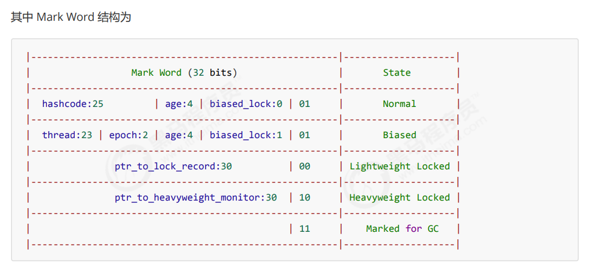

> Normal：哈希码；分代年龄；是否是偏向锁；加锁状态
>
> * 哈希码用的时候才产生，默认是0，只有第一次调用对象的hashcode，对象的哈希码才会产生，才在对象头的markword里面填充哈希码
>
> 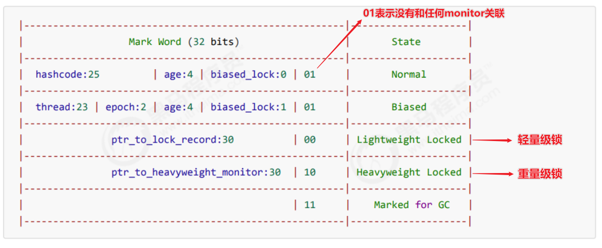
>
> 


#### Monitor

Monitor是synchronized的底层原理，称之为monitor。

Monitor 通常被翻译为**监视器**或**管程** 

每个 Java 对象都可以关联一个 Monitor 对象，如果使用 synchronized 给对象上锁（重量级）之后，该对象头的 Mark Word 中就被设置指向 Monitor 对象的指针 

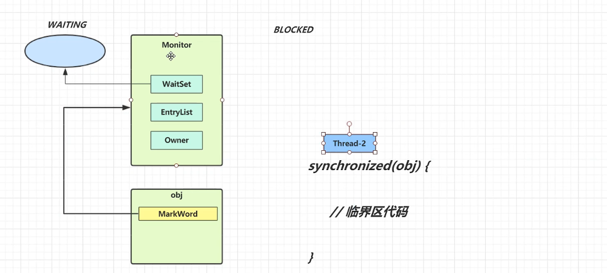


* 刚开始 Monitor 中 Owner 为 null

* 当Thread-2 执行 synchronized(obj)里面的代码时 就会将 **obj 对象和**操作系统层面提供的 **Monitor相关联(在 obj 里面记录 monitor 对象的指针地址)**，将 Monitor 的Owner置为 Thread-2

* 在 Thread-2 上锁的过程中，如果 Thread-3、 Thread-4、 Thread-5 也希望执行 synchronized(obj) 里面的代码，就会先判断 obj 是否关联和Monitor；

  * 如果关联了 monitor 锁：判断monitor 锁是否有owner 

    * 有owner了：Thread-3、 Thread-4、 Thread-5就会进入Monitor 的 EntryList（等待队列/阻塞队列）

      > 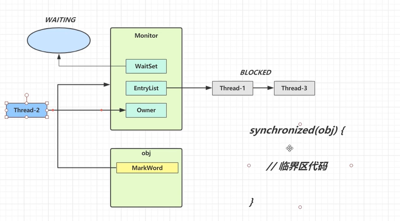

* 执行完代码之后，就会**根据一定规则**唤醒 EntryList 里面的某个线程
  (先来先服务，优先级，最短时间优先......)

* WaitSet中的线程是之前获得过锁、但条件不满足进入 WAITING 状态的线程

  > 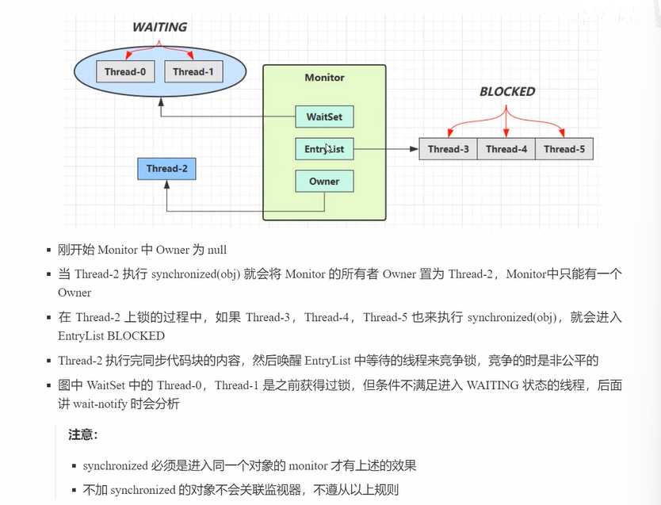

**注意**：

* synchronized 必须是进入同一个对象的 monitor 才有上述效果
  另一个对象 关联 另一个 Monitor 锁
* 不加 synchronized 的对象不会做monitor的检查 ，不会看对象头上的 Mark Word 、不会执行monitor相关的逻辑


#### 原理讲解-字节码层面

```java
static final Object lock = new Object();
static int counter = 0;
public static void main(String[] args) {
    synchronized (lock) {
        counter++;
    }
}
```

对应的字节码为：

```java
public static void main(java.lang.String[]);
	descriptor: ([Ljava/lang/String;)V
	flags: ACC_PUBLIC, ACC_STATIC
	Code:
 		stack=2, locals=3, args_size=1
            0: getstatic #2 	// <- lock引用 （synchronized开始）
            3: dup
            4: astore_1 		// lock引用 -> slot 1
            5: monitorenter 	// 将 lock对象 MarkWord 置为 Monitor 指针
            6: getstatic #3 	// <- i
            9: iconst_1 		// 准备常数 1
            10: iadd 			// +1
            11: putstatic #3 	// -> i
            14: aload_1 		// <- lock引用
            15: monitorexit 	// 将 lock对象 MarkWord 重置, 唤醒 EntryList 里面的进程 竞争锁
            16: goto 24
            19: astore_2 		// e -> slot 2
            20: aload_1 		// <- lock引用
            21: monitorexit 	// 将 lock对象 MarkWord 重置, 唤醒 EntryList
            22: aload_2 		// <- slot 2 (e)
            23: athrow			// throw e
            24: return
            // 19~23 如果代码块执行过程中出现了异常，就会执行这部分，正常释放锁
        Exception table: // 监听异常的范围
            from to target type
            6    16   19   any
            19   22   19   any
		LineNumberTable:
            line 8: 0
            line 9: 6
            line 10: 14
            line 11: 24
        LocalVariableTable:
            Start Length Slot Name Signature
            0     25     0    args [Ljava/lang/String;
		StackMapTable: number_of_entries = 2
			frame_type = 255 /* full_frame */
				offset_delta = 19
				locals = [ class "[Ljava/lang/String;", class java/lang/Object ]
				stack = [ class java/lang/Throwable ]
			frame_type = 250 /* chop */
				offset_delta = 4

```

> 注意
>
> 方法级别的 synchronized 不会在字节码指令中有所体现


> ##### 小故事 
>
> 故事角色 
>
> * 老王 - JVM
> * 小南 - 线程 
> * 小女 - 线程 
> * 房间 - 对象 
> * 房间门上 - 防盗锁 - Monitor 
> * 房间门上 - 小南书包 - 轻量级锁 
> * 房间门上 - 刻上小南大名 - 偏向锁 
> * 批量重刻名 - 一个类的偏向锁撤销到达 20 阈值 
> * 不能刻名字 - 批量撤销该类对象的偏向锁，设置该类不可偏向 
>
> 小南要使用房间保证计算不被其它人干扰（原子性），最初，他用的是防盗锁，当上下文切换时，锁住门。这样， 即使他离开了，别人也进不了门，他的工作就是安全的。
>
>  但是，很多情况下没人跟他来竞争房间的使用权。小女是要用房间，但使用的时间上是错开的，小南白天用，小女 晚上用。每次上锁太麻烦了，有没有更简单的办法呢？ 
>
> 小南和小女商量了一下，约定不锁门了，而是谁用房间，谁把自己的书包挂在门口，但他们的书包样式都一样，因 此每次进门前得翻翻书包，看课本是谁的，如果是自己的，那么就可以进门，这样省的上锁解锁了。万一书包不是 自己的，那么就在门外等，**并通知对方下次用锁门的方式**。(<u>发现有竞争之后，就不再使用轻量级锁，升级为重量级锁</u>)
>
> 后来，小女回老家了，很长一段时间都不会用这个房间。小南每次还是挂书包，翻书包，虽然比锁门省事了，但仍 然觉得麻烦。 于是，小南干脆在门上刻上了自己的名字：【小南专属房间，其它人勿用】，下次来用房间时，只要名字还在，那 么说明没人打扰，还是可以安全地使用房间。如果这期间有其它人要用这个房间，那么由使用者将小南刻的名字擦 掉，升级为挂书包的方式。 
>
> 同学们都放假回老家了，小南就膨胀了，在 20 个房间刻上了自己的名字，想进哪个进哪个。后来他自己放假回老 家了，这时小女回来了（她也要用这些房间），结果就是得一个个地擦掉小南刻的名字，升级为挂书包的方式。老 王觉得这成本有点高，提出了一种批量重刻名的方法，他让小女不用挂书包了，可以直接在门上刻上自己的名字 
>
> 后来，刻名的现象越来越频繁，老王受不了了：算了，这些房间都不能刻名了，只能挂书包


### Synchronized原理进阶


#### 1.轻量级锁

轻量级锁的使用场景：如果一个对象虽然有多线程要加锁，但加锁的时间是错开的（也就是没有竞争），那么可以 使用轻量级锁来优化。 

轻量级锁对使用者是透明的，即语法仍然是 synchronized 

假设有两个方法同步块，利用同一个对象加锁

```java
static final Object obj = new Object();
public static void method1() {
    synchronized( obj ) {
        // 同步块 A
        method2();
    }
}
public static void method2() {
    synchronized( obj ) {
        // 同步块 B
    }
}
```


* 创建锁记录（Lock Record）对象，每个线程都的栈帧都会包含一个锁记录的结构，内部可以存储锁定对象的 Mark Word

  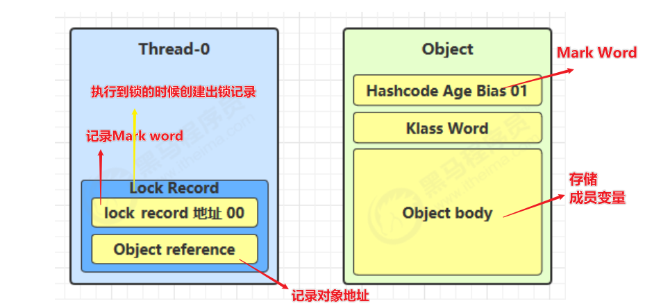

* 让锁记录中 Object reference 指向锁对象，并尝试用 cas 替换 Object 的 Mark Word，将 Mark Word 的值存 入锁记录

  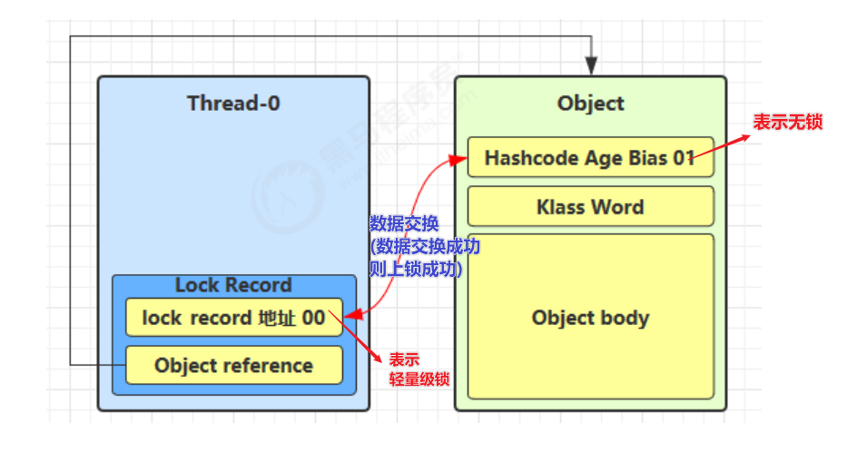

* 如果 cas 替换成功(数据交换成功)，对象头中存储了 锁记录地址和状态 00 ，表示由该线程给对象加锁，这时图示如下

  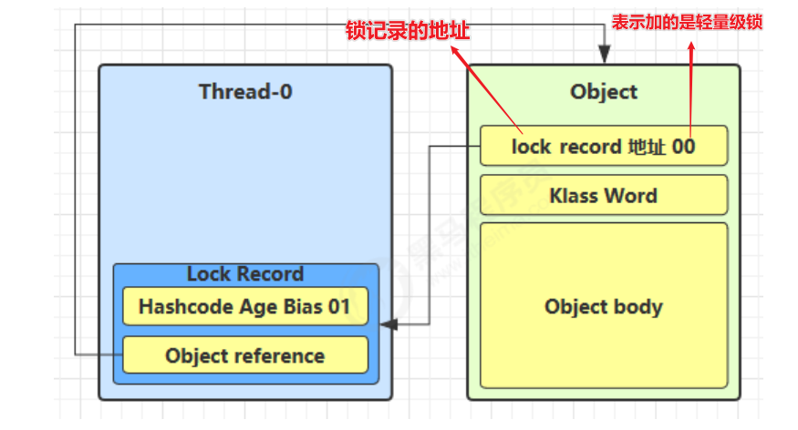

* 如果 cas 失败，有两种情况 

  * 如果是其它线程已经持有了该 Object 的轻量级锁，这时表明有竞争，进入锁膨胀过程 
  * 如果是自己执行了 synchronized **锁重入**，那么再添加一条 Lock Record 作为重入的计数(数据交换会失败，因为交换过了，但是这种情况的失败无影响，因为可以看到 Mark Word 里面的锁记录地址 是当前线程中的另一个锁记录地址)

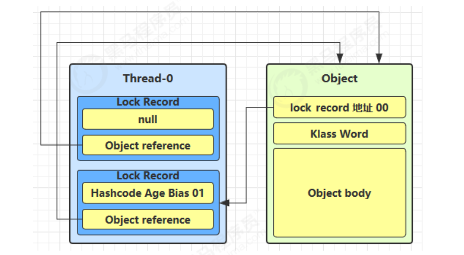

* 当退出 synchronized 代码块（解锁时）如果是取值为 null 的锁记录，表示有重入，这时重置锁记录，表示重入计数减一

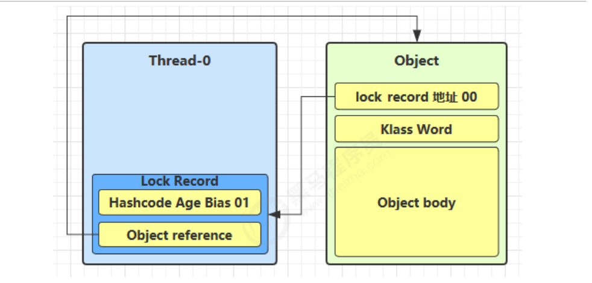

* 当退出 synchronized 代码块（解锁时）锁记录的值不为 null (最外层的一个锁)，这时使用 cas 将 Mark Word 的值恢复给对象 头 
  * 成功，则解锁成功 
  * 失败，<u>说明轻量级锁进行了锁膨胀或已经升级为重量级锁，进入重量级锁解锁流程</u>


#### 2.锁膨胀

如果在尝试加轻量级锁的过程中，CAS 操作无法成功，这时**一种情况就是有其它线程为此对象加上了轻量级锁（有竞争）**，这时需要进行锁膨胀，将轻量级锁变为重量级锁

```java
static Object obj = new Object();
public static void method1() {
    synchronized( obj ) {
        // 同步块
    }
}
```

* 当 Thread-1 进行轻量级加锁时，Thread-0 已经对该对象加了轻量级锁

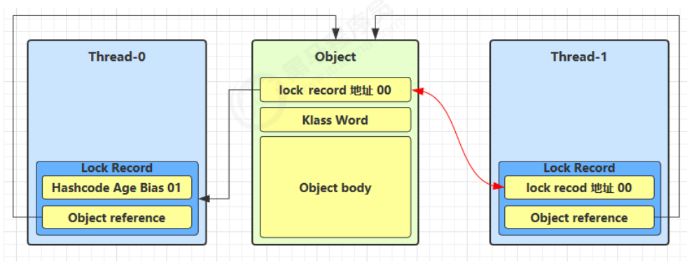

* 这时 Thread-1 **加轻量级锁失败，进入锁膨胀流程**——升级到重量级锁

  > 轻量级锁没有阻塞的说法，此时升级到重量级锁

  * 即为 Object 对象**申请 Monitor 锁**，让 **Object 的 Mark Word 指向 Monitor 重量级锁)**地址
  * 然后自己**进入 Monitor 的 EntryList** 

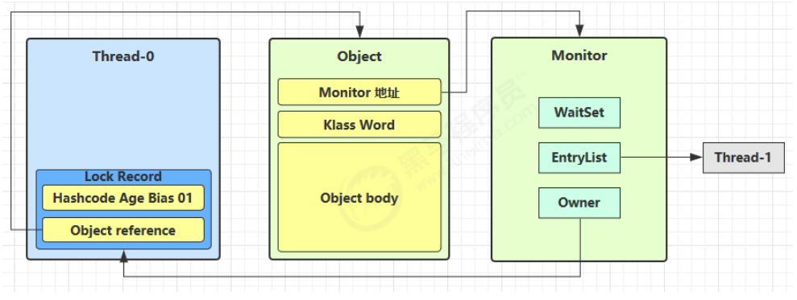

* 当 Thread-0 退出同步块解锁时，使用 cas 将 Mark Word 的值恢复给对象头，失败。这时会**进入重量级解锁 流程**:  即按照 Monitor 地址找到 Monitor 对象，设置 Owner 为 null，唤醒 EntryList 中 BLOCKED 线程


#### 3.自旋优化

**重量级锁竞争的时候，还可以使用自旋来进行优化**，如果当前线程自旋成功（即这时候持锁线程已经退出了同步 块，释放了锁），这时当前线程就可以避免阻塞。 

> 自旋：让线程暂时不进入阻塞，而是循环几次
>
> 阻塞会有上下文切换，更消耗性能

自旋重试成功的情况

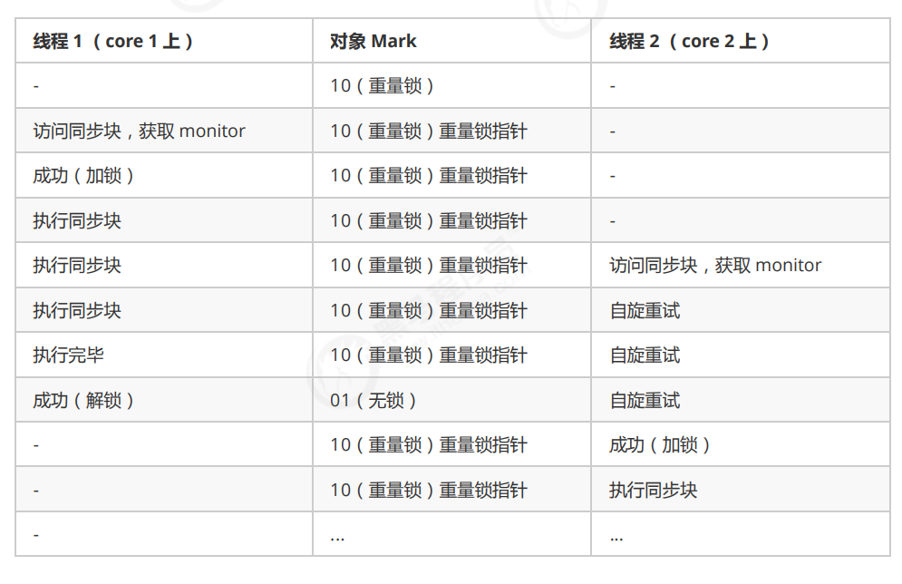

自旋重试失败的情况

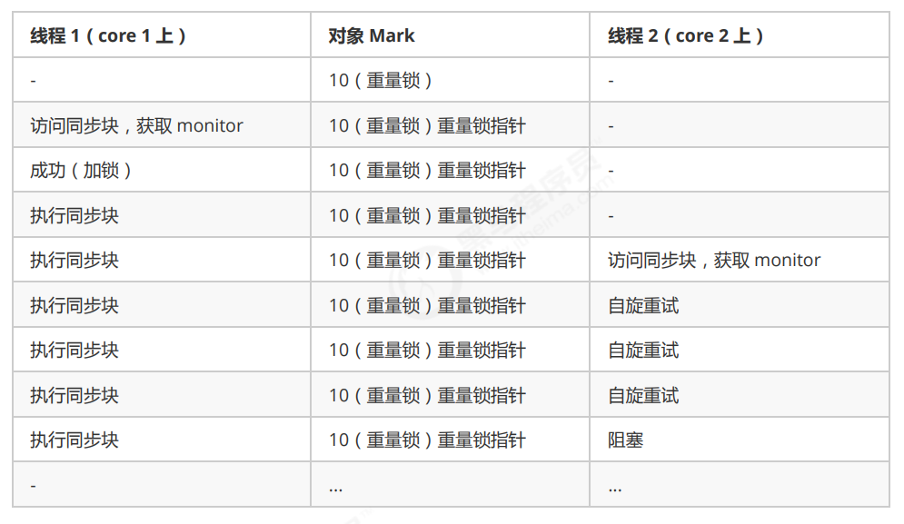

* 自旋会占用 CPU 时间，单核 CPU 自旋就是无意义的(线程1占用了CPU，线程2没有CPU可用)，多核 CPU 自旋才能发挥优势，自旋优化适合多核CPU
* 在 Java 6 之后自旋锁是**自适应的**，比如对象刚刚的一次自旋操作成功过，那么认为这次自旋成功的可能性会 高，就多自旋几次；反之，就少自旋甚至不自旋，总之，比较智能。 
* **Java 7 之后不能控制是否开启自旋功能**


#### 4.偏向锁

轻量级锁在没有竞争时（就自己这个线程），每次锁 重入仍然需要执行 CAS 操作。 

Java 6 中引入了偏向锁来做进一步优化：<u>只有第一次使用 CAS 将**线程 ID** 设置到**对象的 Mark Word** 头(Mark Word 原本存的是**锁记录的地址**)，之后发现 这个线程 ID 是自己的就表示没有竞争，不用重新 CAS</u>。以后只要不发生竞争，这个对象就归该线程所有 

例如：

```java
static final Object obj = new Object();
public static void m1() {
    synchronized( obj ) {
        // 同步块 A
        m2();
    }
}
public static void m2() {
    synchronized( obj ) {
        // 同步块 B
        m3();
    }
}
public static void m3() {
    synchronized( obj ) {
        // 同步块 C
    }
}

```

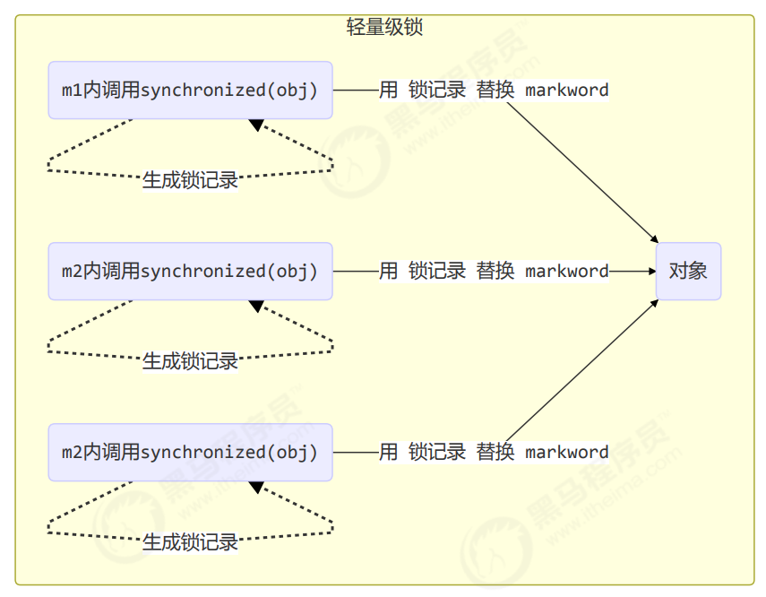

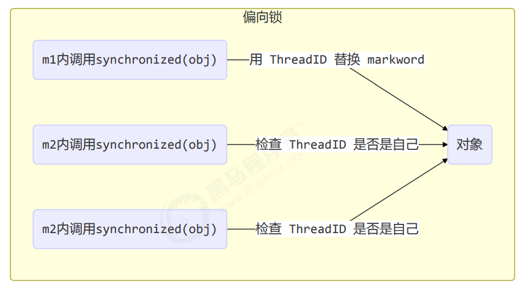


**偏向状态**

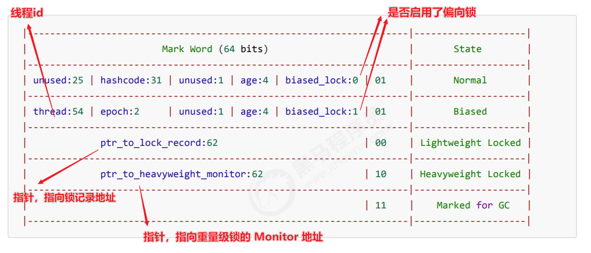

一个对象创建时： 

* 如果开启了偏向锁（默认开启），那么对象创建后，markword 值为 0x05 即最后 3 位为 101，这时它的 thread、epoch、age 都为 0 

* 偏向锁是默认是延迟的，不会在程序启动时立即生效，如果想避免延迟，可以加 VM 参数 - XX:BiasedLockingStartupDelay=0 来禁用延迟 

* 如果调用了hashcode()生成哈希码，就会撤销偏向状态(偏向状态和哈希码互斥)；因为不撤销，哈希码在 Mark Word 中没地方存

  > 轻量级锁、重量级锁调用 hashCode() 不会有问题，因为<u>轻量级锁哈希码存在线程栈帧的锁记录里面，重量级锁哈希码存在Monitor对象中</u>

* 如果没有开启偏向锁，那么对象创建后，markword 值为 0x01 即最后 3 位为 001


> Java15废弃了偏向锁


**撤销现象**

* 多线程访问同一个对象，会导致偏向锁被撤销
* 调用`wait() / notify()`会导致偏向锁被撤销 (等待、通知的机制只有重量级锁有)


**批量重偏向**

如果对象虽然被多个线程访问，但没有竞争，这时偏向了线程 T1 的对象仍有机会重新偏向 T2，重偏向会重置对象 的 Thread ID 

当撤销偏向锁阈值超过 20 次后，jvm 会这样觉得，我是不是偏向错了呢，于是会在给这些对象加锁时重新偏向至 加锁线程

> 注意：这个阈值针对的是<u>同一个类的不同实例对象</u>加锁的情况。

```java
rivate static void test3() throws InterruptedException {
    Vector<Dog> list = new Vector<>();
    Thread t1 = new Thread(() -> {
        for (int i = 0; i < 30; i++) {
            Dog d = new Dog();
            list.add(d);
            synchronized (d) { // 没有竞争，都是偏向锁；30个对象都是偏向线程 t1
                log.debug(i + "\t" + ClassLayout.parseInstance(d).toPrintableSimple(true));
            }
        }
        synchronized (list) {
            list.notify();
        }
    }, "t1");
    t1.start();
    
    Thread t2 = new Thread(() -> {
        synchronized (list) {
            try {
                list.wait();
            } catch (InterruptedException e) {
                e.printStackTrace();
            }
        }
        log.debug("===============> ");
        for (int i = 0; i < 30; i++) {
            Dog d = list.get(i);
            log.debug(i + "\t" + ClassLayout.parseInstance(d).toPrintableSimple(true));
            synchronized (d) { // 对象被 t2 线程使用，撤销偏向状态（101），对象头末尾变成00 升级成轻量级锁
                log.debug(i + "\t" + ClassLayout.parseInstance(d).toPrintableSimple(true));
            }
            log.debug(i + "\t" + ClassLayout.parseInstance(d).toPrintableSimple(true));
            // 解锁之后，会发现对象的状态会变成不可偏向状态（末尾001）
        }
        // 而在循环到第20个对象之后，由于批量重偏向机制，会把剩下的对象的偏向状态都改成偏向t2
        
    }, "t2");
    t2.start();
}

```


**批量撤销**

当撤销偏向锁阈值达到 40 次后，jvm 会这样觉得，自己确实偏向错了，根本就不该偏向。于是 <u>整个类的所有对象</u> 都会变为不可偏向的(从第20次开始)，新建的对象也是不可偏向的

```java
static Thread t1,t2,t3;
private static void test4() throws InterruptedException {
    Vector<Dog> list = new Vector<>();
    int loopNumber = 39;
    t1 = new Thread(() -> {
        for (int i = 0; i < loopNumber; i++) {
            Dog d = new Dog();
            list.add(d);
            synchronized (d) {
                log.debug(i + "\t" + ClassLayout.parseInstance(d).toPrintableSimple(true));
            }
        }
        LockSupport.unpark(t2);
    }, "t1");
    t1.start();
    t2 = new Thread(() -> {
        LockSupport.park();
        log.debug("===============> ");
        for (int i = 0; i < loopNumber; i++) { // 对象被 t2 线程使用，撤销偏向状态（101），对象头末尾变成00 升级成轻量级锁
            Dog d = list.get(i);
            log.debug(i + "\t" + ClassLayout.parseInstance(d).toPrintableSimple(true));
            synchronized (d) {
                log.debug(i + "\t" + ClassLayout.parseInstance(d).toPrintableSimple(true));
            }
            log.debug(i + "\t" + ClassLayout.parseInstance(d).toPrintableSimple(true));
        }
        LockSupport.unpark(t3);
    }, "t2");
    t2.start();
    t3 = new Thread(() -> {
        LockSupport.park();
        log.debug("===============> ");
        for (int i = 0; i < loopNumber; i++) {
            Dog d = list.get(i);
            log.debug(i + "\t" + ClassLayout.parseInstance(d).toPrintableSimple(true));
            synchronized (d) {
                log.debug(i + "\t" + ClassLayout.parseInstance(d).toPrintableSimple(true));
            }
            log.debug(i + "\t" + ClassLayout.parseInstance(d).toPrintableSimple(true));
        }
    }, "t3");
    t3.start();
    t3.join();
    log.debug(ClassLayout.parseInstance(new Dog()).toPrintableSimple(true));
}

```


#### 5.锁消除


```java
@Fork(1)
@BenchmarkMode(Mode.AverageTime)
@Warmup(iterations=3)
@Measurement(iterations=5)
@OutputTimeUnit(TimeUnit.NANOSECONDS)
public class MyBenchmark {
    static int x = 0;
    @Benchmark
    public void a() throws Exception {
        x++;
    }
    @Benchmark
    public void b() throws Exception {
        Object o = new Object();
        synchronized (o) {
            x++;
        }
    }
}
```

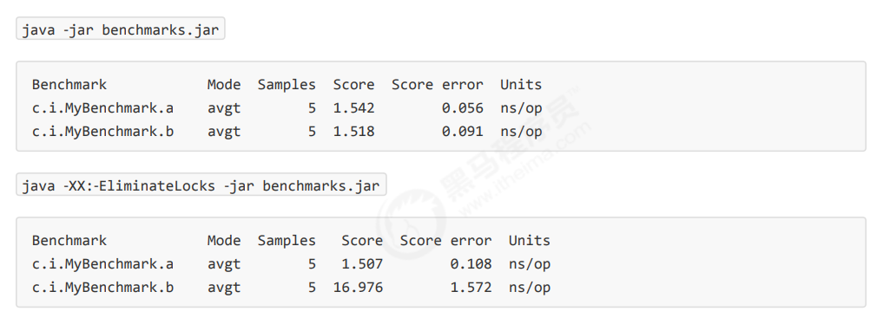

虽然b方法加锁了，但是两个方法的性能还是差不多

这是因为 JIT 即时编译器会对 Java 字节码进一步优化，对反复调用的方法进行进一步的优化

> JIT 发现局部变量o不可能被共享，加锁没有意义 于是会进行锁消除，把synchronized优化掉，真正执行的时候是没加锁的；所以性能特别相近
>
> 锁消除的开关是默认打开的，也可以通过JVM参数关闭


#### 6.锁粗化

对相同对象多次加锁，导致线程发生多次重入，可以使用锁粗化方式来优化，这不同于之前讲的细分锁的粒度

> 锁粗化就是，当多个方法重复调用锁synchronized ，比如在for 循环中，就可以相当于在synchronized中进行for循环，进行粗化


## 多把锁


#### 多把不相干的锁


> 一间大屋子有两个功能：睡觉、学习，互不相干。 
>
> 现在小南要学习，小女要睡觉，但如果只用一间屋子（一个对象锁）的话，那么并发度很低 
>
> 解决方法是准备多个房间（多个对象锁）

例如

```java
class BigRoom {
    public void sleep() {
        synchronized (this) {
            log.debug("sleeping 2 小时");
            Sleeper.sleep(2);
        }
    }
    public void study() {
        synchronized (this) {
            log.debug("study 1 小时");
            Sleeper.sleep(1);
        }
    }
}

```

执行

```java
BigRoom bigRoom = new BigRoom();
new Thread(() -> {
    bigRoom.study();
},"小南").start();
new Thread(() -> {
    bigRoom.sleep();
},"小女").start();

```

某次结果

```
12:13:54.471 [小南] c.BigRoom - study 1 小时
12:13:55.476 [小女] c.BigRoom - sleeping 2 小时

```

改进

```java
class BigRoom {
    private final Object studyRoom = new Object();
    private final Object bedRoom = new Object();
    public void sleep() {
        synchronized (bedRoom) {
            log.debug("sleeping 2 小时");
            Sleeper.sleep(2);
        }
    }
    public void study() {
        synchronized (studyRoom) {
            log.debug("study 1 小时");
            Sleeper.sleep(1);
        }
    }
}
   
```

某次执行结果

```
12:15:35.069 [小南] c.BigRoom - study 1 小时
12:15:35.069 [小女] c.BigRoom - sleeping 2 小时
```


**将锁的粒度细分** 

* 好处，是可以**增强并发度** 
* 坏处，如果一个线程需要同时获得多把锁，就容易发生死锁


## 活跃性


### 死锁

如果一个线程需要同时获取多把锁，这时就容易发生死锁 

> 例：
> `t1线程` 获得 `A对象` 锁，接下来想获取 `B对象` 的锁 `t2线程` 获得 `B对象` 锁，接下来想获取 `A对象` 的锁
>
> ```java
> Object A = new Object();
> Object B = new Object();
> Thread t1 = new Thread(() -> {
>  synchronized (A) {
>      log.debug("lock A");
>      sleep(1);
>      synchronized (B) {
>          log.debug("lock B");
>          log.debug("操作...");
>      }
>  }
> }, "t1");
> 
> Thread t2 = new Thread(() -> {
>  synchronized (B) {
>      log.debug("lock B");
>      sleep(0.5);
>      synchronized (A) {
>          log.debug("lock A");           
>          log.debug("操作...");
>      }
>  }
> }, "t2");
> t1.start();
> t2.start();
> 
> ```
>
> 结果
>
> ```
> 12:22:06.962 [t2] c.TestDeadLock - lock B
> 12:22:06.962 [t1] c.TestDeadLock - lock A 
> ```
>
> 

#### 定位死锁

* 检测死锁
  * 可以使用 jconsole工具，或者
  * 使用 jps 定位进程 id，再用 jstack 定位死锁：

```cmd
cmd > jps // 查看当前运行的所有进程
Picked up JAVA_TOOL_OPTIONS: -Dfile.encoding=UTF-8
12320 Jps
22816 KotlinCompileDaemon
33200 TestDeadLock 			// JVM 进程
11508 Main
28468 Launcher
```


```cmd
cmd > jstack 33200 // 查看该进程中的线程信息
Picked up JAVA_TOOL_OPTIONS: -Dfile.encoding=UTF-8
2018-12-29 05:51:40
Full thread dump Java HotSpot(TM) 64-Bit Server VM (25.91-b14 mixed mode):

"DestroyJavaVM" #13 prio=5 os_prio=0 tid=0x0000000003525000 nid=0x2f60 waiting on condition
[0x0000000000000000]
 java.lang.Thread.State: RUNNABLE

"Thread-1" #12 prio=5 os_prio=0 tid=0x000000001eb69000 nid=0xd40 waiting for monitor entry
[0x000000001f54f000]
   java.lang.Thread.State: BLOCKED (on object monitor) // 线程1阻塞
		at thread.TestDeadLock.lambda$main$1(TestDeadLock.java:28)
		- waiting to lock <0x000000076b5bf1c0> (a java.lang.Object) // 等待0x000000076b5bf1c0释放锁
		- locked <0x000000076b5bf1d0> (a java.lang.Object)
		at thread.TestDeadLock$$Lambda$2/883049899.run(Unknown Source)
		at java.lang.Thread.run(Thread.java:745)

"Thread-0" #11 prio=5 os_prio=0 tid=0x000000001eb68800 nid=0x1b28 waiting for monitor entry
[0x000000001f44f000]
   java.lang.Thread.State: BLOCKED (on object monitor) // 线程0阻塞
		at thread.TestDeadLock.lambda$main$0(TestDeadLock.java:15)
		
		- waiting to lock <0x000000076b5bf1d0> (a java.lang.Object) // 等待0x000000076b5bf1d0释放锁
		- locked <0x000000076b5bf1c0> (a java.lang.Object)
		at thread.TestDeadLock$$Lambda$1/495053715.run(Unknown Source)
		at java.lang.Thread.run(Thread.java:745)

// 略去部分输出

Found one Java-level deadlock: // 展示找到的死锁信息
=============================
"Thread-1":
  waiting to lock monitor 0x000000000361d378 (object 0x000000076b5bf1c0, a java.lang.Object),
  which is held by "Thread-0"
"Thread-0":
  waiting to lock monitor 0x000000000361e768 (object 0x000000076b5bf1d0, a java.lang.Object),
  which is held by "Thread-1"

Java stack information for the threads listed above: // 指出出现循环等待的代码位置
===================================================
"Thread-1":
		at thread.TestDeadLock.lambda$main$1(TestDeadLock.java:28)
		- waiting to lock <0x000000076b5bf1c0> (a java.lang.Object)
		- locked <0x000000076b5bf1d0> (a java.lang.Object)
		at thread.TestDeadLock$$Lambda$2/883049899.run(Unknown Source)
		at java.lang.Thread.run(Thread.java:745)
"Thread-0":
		at thread.TestDeadLock.lambda$main$0(TestDeadLock.java:15)
		- waiting to lock <0x000000076b5bf1d0> (a java.lang.Object)
		- locked <0x000000076b5bf1c0> (a java.lang.Object)
		at thread.TestDeadLock$$Lambda$1/495053715.run(Unknown Source)
		at java.lang.Thread.run(Thread.java:745)

Found 1 deadlock.

```

* 避免死锁要注意加锁顺序 
* 另外如果由于某个线程进入了死循环，导致其它线程一直等待，对于这种情况 linux 下可以通过 top 先定位到 CPU 占用高的 Java 进程，再利用 top -Hp 进程id 来定位是哪个线程，最后再用 jstack 排查


#### 哲学家就餐问题

> 一个容易导致死锁的问题

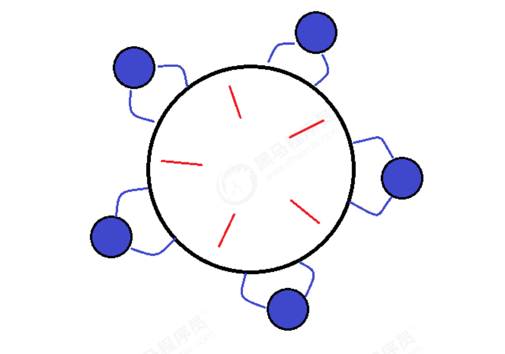

有五位哲学家，围坐在圆桌旁。 

* 他们只做两件事，思考和吃饭，思考一会吃口饭，吃完饭后接着思考。
* 吃饭时要用两根筷子吃，桌上共有 5 根筷子，每位哲学家左右手边各有一根筷子。 
* 如果筷子被身边的人拿着，自己就得等待 


筷子类：

```java
class Chopstick {
    String name;
    public Chopstick(String name) {
        this.name = name;
    }
    @Override
    public String toString() {
        return "筷子{" + name + '}';
    }
}
```

哲学家类：

```java
class Philosopher extends Thread {
    Chopstick left;
    Chopstick right;
    public Philosopher(String name, Chopstick left, Chopstick right) {
        super(name);
        this.left = left;
        this.right = right;
    }
    private void eat() {
        log.debug("eating...");
        Sleeper.sleep(1);
    }

    @Override
    public void run() {
        while (true) {
            // 获得左手筷子
            synchronized (left) {
                // 获得右手筷子
                synchronized (right) {
                    // 吃饭
                    eat();
                }
                // 放下右手筷子
            }
            // 放下左手筷子
        }
    }
}

```

就餐：

```java
Chopstick c1 = new Chopstick("1");
Chopstick c2 = new Chopstick("2");
Chopstick c3 = new Chopstick("3");
Chopstick c4 = new Chopstick("4");
Chopstick c5 = new Chopstick("5");

new Philosopher("苏格拉底", c1, c2).start();
new Philosopher("柏拉图", c2, c3).start();
new Philosopher("亚里士多德", c3, c4).start();
new Philosopher("赫拉克利特", c4, c5).start();
new Philosopher("阿基米德", c5, c1).start();
```

执行不多会，就执行不下去了

```
12:33:15.575 [苏格拉底] c.Philosopher - eating...
12:33:15.575 [亚里士多德] c.Philosopher - eating...
12:33:16.580 [阿基米德] c.Philosopher - eating...
12:33:17.580 [阿基米德] c.Philosopher - eating...
// 卡在这里, 不向下运行
```

使用 jconsole 检测死锁，发现

```java
-------------------------------------------------------------------------
名称: 阿基米德
状态: cn.itcast.Chopstick@1540e19d (筷子1) 上的BLOCKED, 拥有者: 苏格拉底
总阻止数: 2, 总等待数: 1
堆栈跟踪:
cn.itcast.Philosopher.run(TestDinner.java:48)
 - 已锁定 cn.itcast.Chopstick@6d6f6e28 (筷子5)
-------------------------------------------------------------------------
名称: 苏格拉底
状态: cn.itcast.Chopstick@677327b6 (筷子2) 上的BLOCKED, 拥有者: 柏拉图
总阻止数: 2, 总等待数: 1
堆栈跟踪:
cn.itcast.Philosopher.run(TestDinner.java:48)
 - 已锁定 cn.itcast.Chopstick@1540e19d (筷子1)
-------------------------------------------------------------------------
名称: 柏拉图
状态: cn.itcast.Chopstick@14ae5a5 (筷子3) 上的BLOCKED, 拥有者: 亚里士多德
总阻止数: 2, 总等待数: 0
堆栈跟踪:
cn.itcast.Philosopher.run(TestDinner.java:48)
 - 已锁定 cn.itcast.Chopstick@677327b6 (筷子2)
-------------------------------------------------------------------------
名称: 亚里士多德
状态: cn.itcast.Chopstick@7f31245a (筷子4) 上的BLOCKED, 拥有者: 赫拉克利特
总阻止数: 1, 总等待数: 1
堆栈跟踪:
cn.itcast.Philosopher.run(TestDinner.java:48)
 - 已锁定 cn.itcast.Chopstick@14ae5a5 (筷子3)
-------------------------------------------------------------------------
名称: 赫拉克利特
状态: cn.itcast.Chopstick@6d6f6e28 (筷子5) 上的BLOCKED, 拥有者: 阿基米德
总阻止数: 2, 总等待数: 0
堆栈跟踪:
cn.itcast.Philosopher.run(TestDinner.java:48)
 - 已锁定 cn.itcast.Chopstick@7f31245a (筷子4)
```

这种线程没有按预期结束，执行不下去的情况，归类为【活跃性】问题，除了死锁以外，还有活锁和饥饿者两种情 况


### 活锁

活锁出现在两个线程互相改变对方的结束条件，最后谁也无法结束，例如

```java
public class TestLiveLock {
    static volatile int count = 10;
    static final Object lock = new Object();
    public static void main(String[] args) {
        new Thread(() -> { 
            // 期望减到 0 退出循环
            while (count > 0) {
                sleep(0.2);
                count--;
                log.debug("count: {}", count);
            }
        }, "t1").start();
        new Thread(() -> {
            // 期望超过 20 退出循环
            while (count < 20) {
                sleep(0.2);
                count++;
                log.debug("count: {}", count);
            }
        }, "t2").start();
    }
}

```

> **也可以使用随机睡眠时间的方法来避免活锁**


### 饥饿者

很多教程中把饥饿定义为，一个线程由于优先级太低，始终得不到 CPU 调度执行，也不能够结束，饥饿的情况不易演示，讲读写锁时会涉及饥饿问题 

下面我讲一下我遇到的一个线程饥饿的例子，先来看看**使用顺序加锁的方式解决之前的死锁问题**

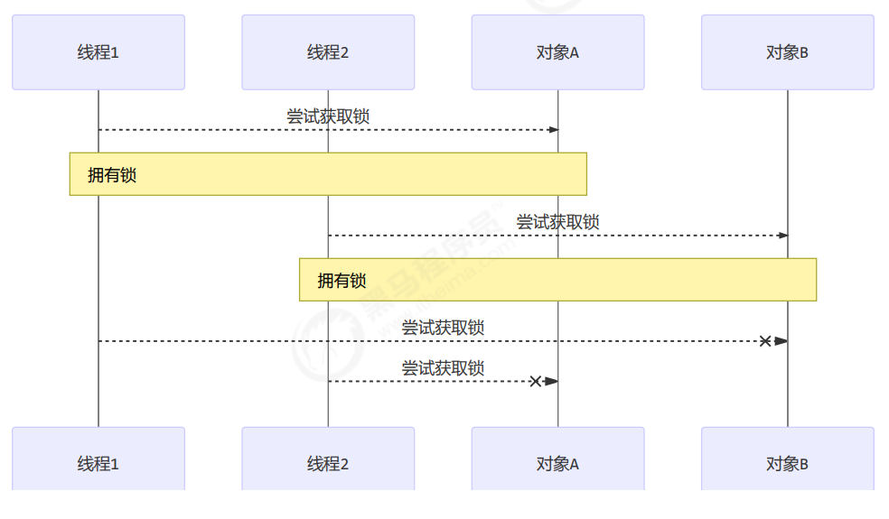

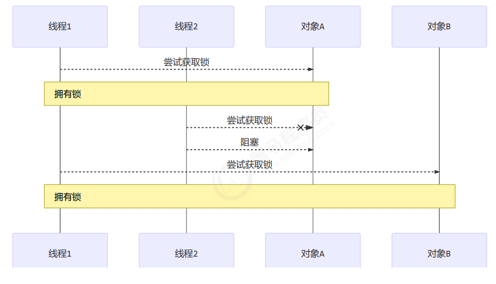

但是顺序加锁容易产生饥饿问题


## ReentrantLock

可重入锁

> 死锁、饥饿都可以用ReentrantLock解决
>
> 公平锁，可以避免饥饿现象


相对于 synchronized 它具备如下特点 

* 可中断 

  > 这里的中断是指别的线程可以破坏你的blocking状态，而不是指自己中断阻塞状态

* 可以设置超时时间 

* 可以设置为公平锁 

* 支持多个条件变量 

  > 支持多个WaitSet，Synchronized支持一个WaitSet

**与 synchronized 一样，都支持可重入**


基本语法

```java
ReentrantLock lock = new ReentrantLock();
// 获取锁
lock.lock();
try {
    // 临界区代码
} finally {
    // 释放锁
    reentrantLock.unlock(); // 保证是否有异常都会正常释放锁
}

```

> synchronized是关键字级别，ReentranLock是对象级别保护临界区  需要创建对象

> 在try块外面创建 （阿里规范）


#### 可重入

可重入是指同一个线程如果首次获得了这把锁，那么因为它是这把锁的拥有者，因此有权利再次获取这把锁 

如果是不可重入锁，那么第二次获得锁时，自己也会被锁挡住

```java
static ReentrantLock lock = new ReentrantLock();
public static void main(String[] args) {
    method1();
}
public static void method1() {
    lock.lock();
    try {
        log.debug("execute method1");
        method2();
    } finally {
        lock.unlock();
    }
}
public static void method2() {
    lock.lock();
    try {
        log.debug("execute method2");
        method3();
    } finally {
        lock.unlock();
    }
}
public static void method3() {
    lock.lock();
    try {
        log.debug("execute method3");
    } finally {
        lock.unlock();
    }
}
```

输出

```
17:59:11.862 [main] c.TestReentrant - execute method1
17:59:11.865 [main] c.TestReentrant - execute method2
17:59:11.865 [main] c.TestReentrant - execute method3 
```


#### 可打断

示例

```java
ReentrantLock lock = new ReentrantLock();
Thread t1 = new Thread(() -> {
    debug("启动...");
    try {
        lock.lockInterruptibly(); // lockInterruptibly()方法是可打断的，lock()方法是不可打断的
        // 【如果没有竞争，那么此方法就会获取lock对象锁】
        // 【如果其他线程持有了锁，那么就会进入阻塞队列，可以被其他线程用interrupt打断阻塞状态】
    } catch (InterruptedException e) {
        e.printStackTrace();
        log.debug("等锁的过程中被打断");
        return;
    }
    try {
        log.debug("获得了锁");
    } finally {
        lock.unlock();
    }
}, "t1");

lock.lock();
log.debug("获得了锁");
t1.start();
try {
    sleep(1);
    t1.interrupt(); // 打断t1
    log.debug("执行打断");
} finally {
    lock.unlock();
}
```

输出

```
18:02:40.520 [main] c.TestInterrupt - 获得了锁
18:02:40.524 [t1] c.TestInterrupt - 启动...
18:02:41.530 [main] c.TestInterrupt - 执行打断
java.lang.InterruptedException
 at
java.util.concurrent.locks.AbstractQueuedSynchronizer.doAcquireInterruptibly(AbstractQueuedSynchr
onizer.java:898)
 at
java.util.concurrent.locks.AbstractQueuedSynchronizer.acquireInterruptibly(AbstractQueuedSynchron
izer.java:1222)
 at java.util.concurrent.locks.ReentrantLock.lockInterruptibly(ReentrantLock.java:335)
 at cn.itcast.n4.reentrant.TestInterrupt.lambda$main$0(TestInterrupt.java:17)
 at java.lang.Thread.run(Thread.java:748)
18:02:41.532 [t1] c.TestInterrupt - 等锁的过程中被打断
```

* 作用：防止无限制地在阻塞队列等待下去 (可用于打断死锁)
* 被打断之后会抛出 `InterruptedException` 异常

> synchorized的被打断：设置打断标识，根据打断标记是否为true来手动break或return
>
> 


注意如果是不可中断模式，那么即使使用了 interrupt 也不会让等待中断

```java
ReentrantLock lock = new ReentrantLock();
Thread t1 = new Thread(() -> {
    log.debug("启动...");
    lock.lock();
    try {
        log.debug("获得了锁");
    } finally {
        lock.unlock();
    }
}, "t1");

lock.lock();
log.debug("获得了锁");
t1.start();

try {
    sleep(1);
    t1.interrupt();
    log.debug("执行打断");
    sleep(1);
} finally {
    log.debug("释放了锁");
    lock.unlock();
}

```

输出

```
18:06:56.261 [main] c.TestInterrupt - 获得了锁
18:06:56.265 [t1] c.TestInterrupt - 启动...
18:06:57.266 [main] c.TestInterrupt - 执行打断 // 这时 t1 并没有被真正打断, 而是仍继续等待锁
18:06:58.267 [main] c.TestInterrupt - 释放了锁
18:06:58.267 [t1] c.TestInterrupt - 获得了锁
```


#### 锁超时

如果持有锁的的线程超过一定时间，就不继续等待 放弃等待，此次获取锁失败

* `tryLock()` 

  * 返回布尔值，false表示获取失败

  > 源码：
  >
  > 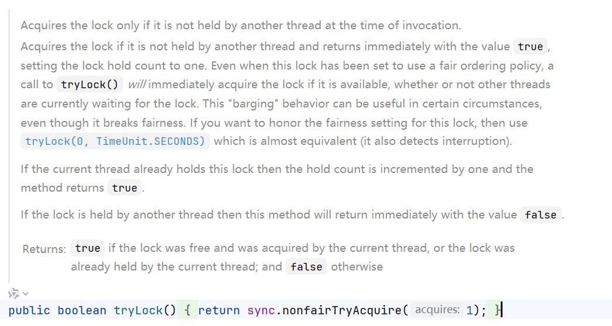

* `lock.tryLock(1, TimeUnit.SECONDS)`——可设置等待时间

  如果等待时间内能获取到锁，就会停止等待  方法返回`true`

  > 需要用`try catch`捕获`InterruptedException`异常

  > `tryLock`方法也是可打断的

  > 源码：
  >
  > 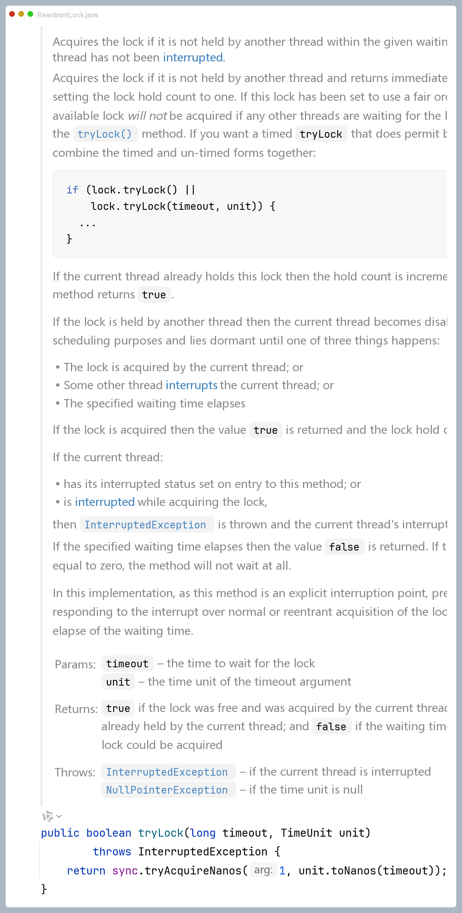
  >
  > 1. **参数转换**：首先将时间参数转换为纳秒单位，unit.toNanos(time) 将传入的时间转换成纳秒。
  > 2. **调用 AQS 的 tryAcquireNanos 方法**：这是 AbstractQueuedSynchronizer(AQS) 类中的一个核心方法，实现了带有超时功能的尝试获取同步状态。
  > 3. **AQS 的 tryAcquireNanos 实现逻辑**：
  >    * 首先检查当前线程是否被中断，如果是则抛出 [InterruptedException](file:///C:/Program Files/Java/jdk-17.0.5/lib/src/java.base/java/lang/InterruptedException.java#L54-L86)
  >    * 调用 tryAcquire 方法尝试立即获取锁，如果成功直接返回 true
  >    * 如果获取失败，计算超时截止时间
  >    * 将当前线程封装成节点加入到同步队列中
  >    * **在循环中持续尝试获取锁，直到成功或超时时间到达**
  >    * 如果超时仍未获取到锁，返回 false
  > 4. **超时机制**：该方法会在指定的时间内不断尝试获取锁，如果在超时时间内成功获取锁则返回 true，否则返回 false。

* 


**1.立刻失败**

```java
ReentrantLock lock = new ReentrantLock();
Thread t1 = new Thread(() -> {
    log.debug("t1线程启动...");
    if (!lock.tryLock()) {
        log.debug("获取立刻失败，返回");
        return;
    }
    try {
        log.debug("获得了锁");
    } finally {
        lock.unlock();
    }
}, "t1");
lock.lock();
log.debug("主线程获得了锁");

t1.start();
try {
    sleep(2);
} finally {
    lock.unlock();
}

```

输出

```
18:15:02.918 [main] c.TestTimeout - 主线程获得了锁
18:15:02.921 [t1] c.TestTimeout - t1线程启动...
18:15:02.921 [t1] c.TestTimeout - 获取立刻失败，返回
```


**2.超时失败**

```java
ReentrantLock lock = new ReentrantLock();
Thread t1 = new Thread(() -> {
    log.debug("启动...");
    try {
        if (!lock.tryLock(1, TimeUnit.SECONDS)) {
            log.debug("获取等待 1s 后失败，返回");
            return;
        }
    } catch (InterruptedException e) {
        e.printStackTrace();
        log.debug("获取不到锁");
        return ;
    }
    try {
        log.debug("获得了锁");
    } finally {
        lock.unlock();
    }
}, "t1");

lock.lock();
log.debug("获得了锁");
t1.start();
try {
    sleep(2);
} finally {
    lock.unlock();
}


```

输出

```
18:19:40.537 [main] c.TestTimeout - 获得了锁
18:19:40.544 [t1] c.TestTimeout - 启动...
18:19:41.547 [t1] c.TestTimeout - 获取等待 1s 后失败，返回
```


**使用 tryLock 解决哲学家就餐问题**

* 继承 `ReentrantLock`
* 使用 `tryLock()`或`tryLock(n,TimeUnit.SECONDS)`
* 如果不能同时获取到两个锁，就会释放锁，不会导致死锁问题

```java
class Chopstick extends ReentrantLock {
    String name;
    public Chopstick(String name) {
        this.name = name;
    }
    @Override
    public String toString() {
        return "筷子{" + name + '}';
    }
}

class Philosopher extends Thread {
    Chopstick left;
    Chopstick right;
    public Philosopher(String name, Chopstick left, Chopstick right) {
        super(name);
        this.left = left;
        this.right = right;
    }
    @Override
    public void run() {
        while (true) {
            // 尝试获得左手筷子
            if (left.tryLock()) {
                try {
                    // 尝试获得右手筷子
                    if (right.tryLock()) {
                        try {
                            eat();
                        } finally {
                            // 释放锁
                            right.unlock();
                        }
                    }
                } finally {
                    // 释放锁
                    left.unlock();
                }
            }
        }
    }
    private void eat() {
        log.debug("eating...");
        Sleeper.sleep(1);
    }
}

```


#### 公平锁

ReentrantLock 默认是不公平的

```java
ReentrantLock lock = new ReentrantLock(false);
lock.lock();

for (int i = 0; i < 500; i++) {
    new Thread(() -> {
        lock.lock();
        try {
          System.out.println(Thread.currentThread().getName() + " running...");
        } finally {
            lock.unlock();
        }
    }, "t" + i).start();
}

// 1s 之后去争抢锁
Thread.sleep(1000);
new Thread(() -> {
    System.out.println(Thread.currentThread().getName() + " start...");
    lock.lock();
    try {
        System.out.println(Thread.currentThread().getName() + " running...");
    } finally {
        lock.unlock();
    }
}, "强行插入").start();
lock.unlock();
```

强行插入，有机会在中间输出

> 注意：该实验不一定总能复现

```
t39 running...
t40 running...
t41 running...
t42 running...
t43 running...
强行插入 start...
强行插入 running...
t44 running...
t45 running...
t46 running...
t47 running...
t49 running... 
```

改为公平锁后 （`ReentrantLock lock = new ReentrantLock(true);`）

强行插入，总是在最后输出

```
t465 running...
t464 running...
t477 running...
t442 running...
t468 running...
t493 running...
t482 running...
t485 running...
t481 running...
强行插入 running... 
```

公平锁意图是解决饥饿问题；

但是公平锁一般没有必要，会降低并发度，后面分析原理时会讲解

> 可以使用tryLock，立刻失败/超时失败，让其他线程先处理


#### 条件变量

synchronized 中也有条件变量，就是我们讲原理时那个 waitSet 休息室，当条件不满足时进入 waitSet 等待

ReentrantLock 的条件变量比 synchronized 强大之处在于，它是支持多个条件变量的，这就好比 

* synchronized 是那些不满足条件的线程都在一间休息室等消息 
* 而 ReentrantLock 支持多间休息室，有专门等烟的休息室、专门等早餐的休息室、唤醒时也是按休息室来唤醒 

使用要点： 

* await 前需要获得锁 
* await 执行后，会释放锁，进入 conditionObject 等待 
* await 的线程被唤醒（或打断、或超时），会重新竞争 lock 锁 
* 竞争 lock 锁成功后，从 await 后继续执行


例子

```java
// static final Object room = new Object();
static ReentrantLock lock = new ReentrantLock();
// 创建条件队列
static Condition waitCigaretteQueue = lock.newCondition();
static Condition waitbreakfastQueue = lock.newCondition();

static volatile boolean hasCigrette = false;
static volatile boolean hasBreakfast = false;
public static void main(String[] args) {
    new Thread(() -> {
        try {
            lock.lock();
            while (!hasCigrette) {
                try {
                    waitCigaretteQueue.await(); // 到指定的条件队列等待
                    // room.wait()
                } catch (InterruptedException e) {
                    e.printStackTrace();
                }
            }
            log.debug("等到了它的烟，可以开始干活了");
        } finally {
            lock.unlock();
        }
    }).start();
    new Thread(() -> {
        try {
            lock.lock();
            while (!hasBreakfast) {
                try {
                    waitbreakfastQueue.await();
                } catch (InterruptedException e) {
                    e.printStackTrace();
                }
            }
            log.debug("等到了它的早餐，可以开始干活了");
        } finally {
            lock.unlock();
        }
    }).start();
    sleep(1);
    sendBreakfast(); // 送早餐
    sleep(1);
    sendCigarette(); // 送烟
}
private static void sendCigarette() {
    lock.lock();
    try {
        log.debug("送烟来了");
        hasCigrette = true;
        // 唤醒指定“休息室”里面的线程
        waitCigaretteQueue.signal();
    } finally {
        lock.unlock();
    }
}
private static void sendBreakfast() {
    lock.lock();
    try {
        log.debug("送早餐来了");
        hasBreakfast = true;
        waitbreakfastQueue.signal();
    } finally {
        lock.unlock();
    }
}

```

> **源码**：
>
> Condition接口类：
>
> 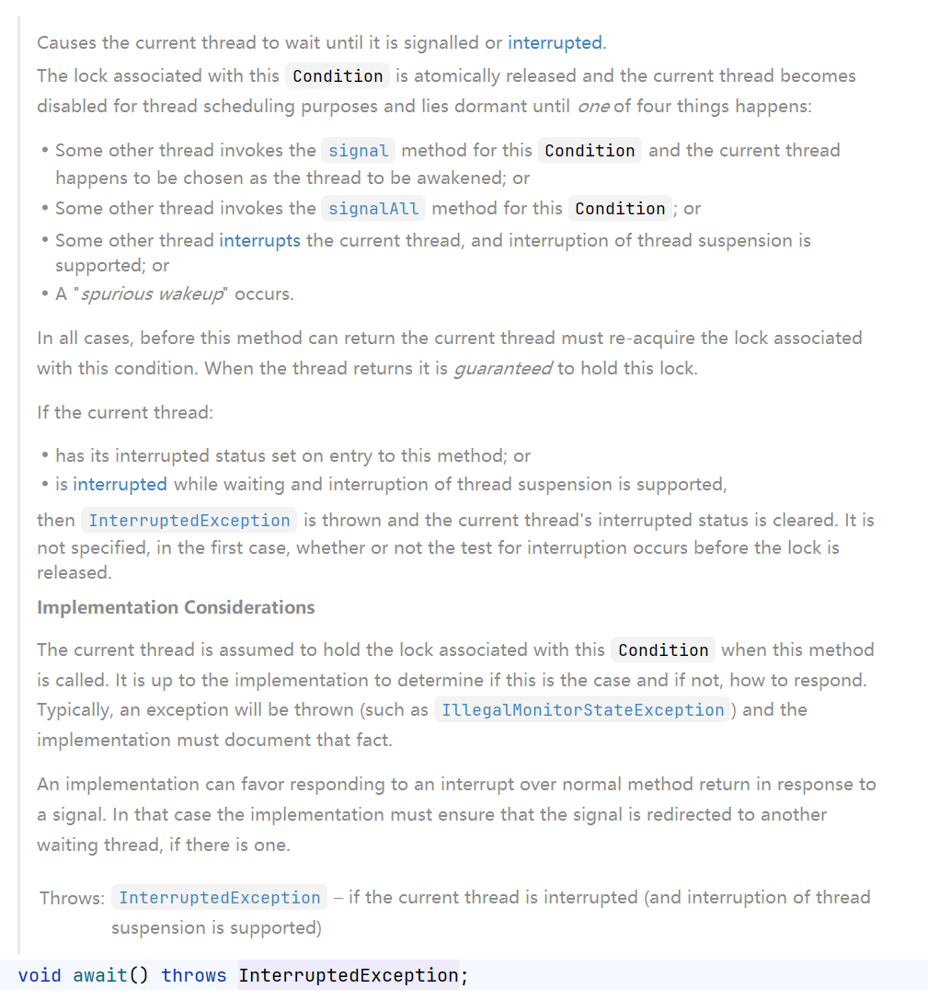
>
> AbstractQueuedSynchronizer实现类
>
> 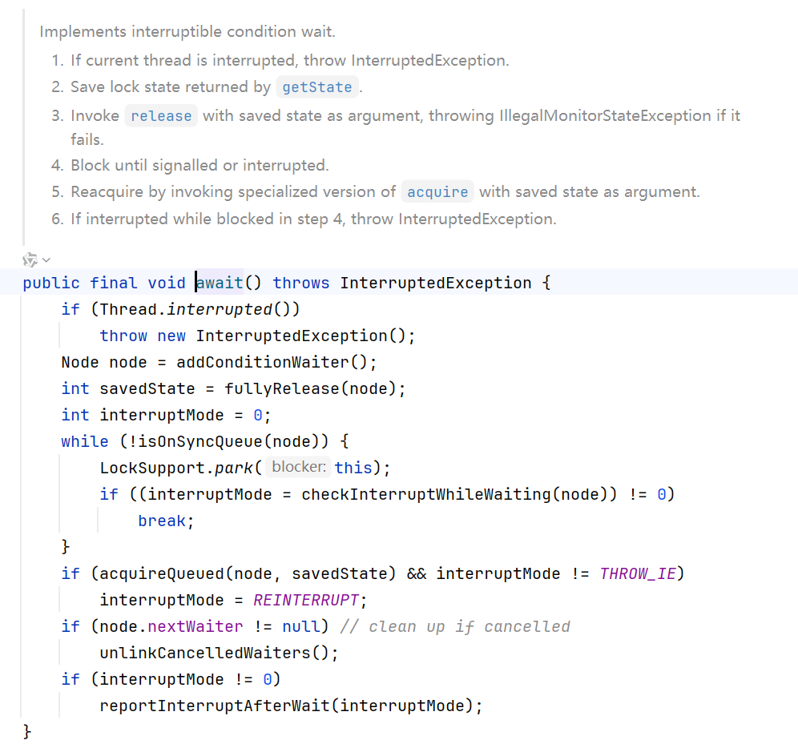
>
> 底层基于队列
>
> 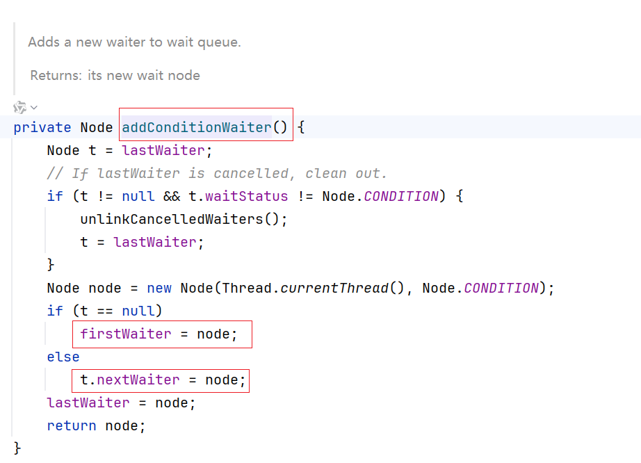


### ReentrantLock原理

> 在Java层面实现Monitor


# ==共享模型-内存==


## JMM


#### 什么是JMM

**JMM：JAVA内存模型**——Java Memory Model，它定义了主存、工作内存抽象概念，<u>底层对应着</u> CPU 寄存器、缓存、硬件内存、 CPU 指令优化等


JMM 体现在以下几个方面 

* 原子性 - 保证指令不会受到线程上下文切换的影响 
* 可见性 - 保证指令不会受 cpu 缓存的影响 
* 有序性 - 保证指令不会受 cpu 指令并行优化的影响


**关于JMM的一些同步的约定：**

1、线程加锁前，必须**读取主存**中的最新值到工作内存中；

2、线程解锁前，必须把共享变量**立刻**刷回主存；

3、加锁和解锁是同一把锁；

线程中分为 **工作内存、主内存**

**8种操作:**

读->加载->使用->赋值（assign）->写->存储

加锁、解锁


内存交互操作有8种，虚拟机实现必须保证每一个操作都是原子的，不可在分的（对于double和long类型的变量来说，load、store、read和write操作在某些平台上允许例外）

- **Read（读取）**：作用于主内存变量，它把一个变量的值从主内存传输到线程的工作内存中，以便随后的load动作使用；
- **load（载入）**：作用于工作内存的变量，它把read操作从主存中变量放入工作内存中；
- **Use（使用）**：作用于工作内存中的变量，它把工作内存中的变量传输给执行引擎，每当虚拟机遇到一个需要使用到变量的值，就会使用到这个指令；
- **assign（赋值）**：作用于工作内存中的变量，它把一个从执行引擎中接受到的值放入工作内存的变量副本中；
- **store（存储）**：作用于主内存中的变量，它把一个从工作内存中一个变量的值传送到主内存中，以便后续的write使用；
- **write（写入）**：作用于主内存中的变量，它把store操作从工作内存中得到的变量的值放入主内存的变量中；
- **lock（锁定）**：作用于主内存的变量，把一个变量标识为线程独占状态；
- **unlock（解锁）**：作用于主内存的变量，它把一个处于锁定状态的变量释放出来，释放后的变量才可以被其他线程锁定；


**JMM对这八种指令的使用，制定了如下规则：**

- 不允许read和load、store和write操作之一单独出现，必须成对使用。即使用了read必须load，使用了store必须write
- 不允许线程丢弃他最近的assign操作，即工作变量的数据改变了之后，必须告知主存
- 不允许一个线程将没有assign的数据从工作内存同步回主内存
  一个新的变量必须在主内存中诞生，不允许工作内存直接使用一个未被初始化的变量。就是怼变量实施use、store操作之前，必须经过assign和load操作
- 一个变量同一时间只有一个线程能对其进行lock。多次lock后，必须执行相同次数的unlock才能解锁
- 如果对一个变量进行lock操作，会清空所有工作内存中此变量的值，在执行引擎使用这个变量前，必须重新load或assign操作初始化变量的值
- 如果一个变量没有被lock，就不能对其进行unlock操作。也不能unlock一个被其他线程锁住的变量对一个变量进行unlock操作之前，必须把此变量同步回主内存
  问题： 程序不知道主内存的值已经被修改过了
  


### 可见性


> #### 退不出的循环 
>
> 先来看一个现象，main 线程对 run 变量的修改对于 t 线程不可见，导致了 t 线程无法停止：
>
> ```java
> static boolean run = true;
> public static void main(String[] args) throws InterruptedException {
>  Thread t = new Thread(()->{
>      while(run){
>          // ....
>      }
>  });
>  t.start();
>  sleep(1);
>  run = false; // 线程t不会如预想的停下来
> }
> 
> ```
>
> > 停下来的同学可能是在while里面加了println吧，因为println是一个线程安全的方法 ，底层有synchronized，而synchronized保证了可见性，不会一直循环

为什么呢？分析一下： 

1. 初始状态， t 线程刚开始从主内存读取了 run 的值到工作内存。

   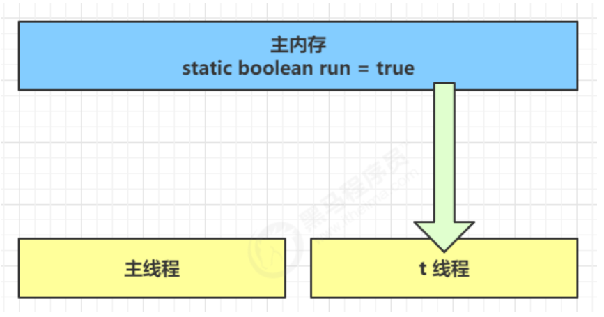

2. 因为 t 线程要频繁从主内存中读取 run 的值，JIT 编译器会将 run 的值缓存至自己工作内存中的高速缓存中， 减少对主存中 run 的访问，提高效率

   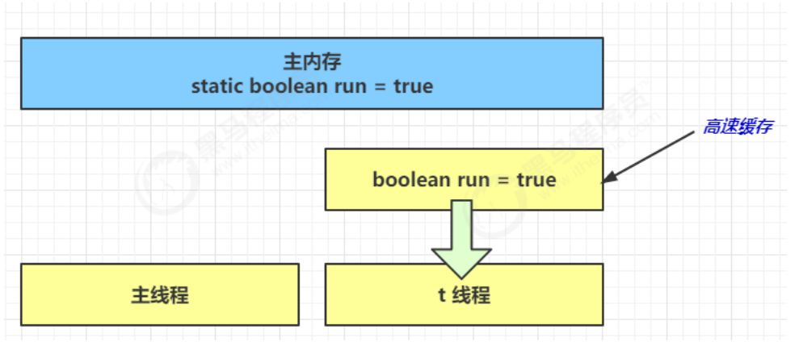

3. 1 秒之后，main 线程修改了 run 的值，并**同步至主存**，而 t 是从**自己工作内存中的高速缓存中**读取这个变量 的值，结果永远是旧值

   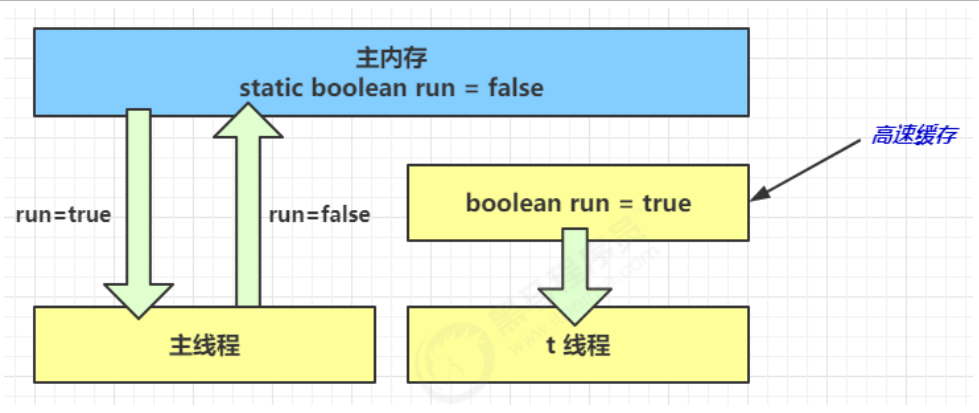


**解决方法**

**1.volatile（易变关键字）** 

> 能保证可见性，不能保证原子性，适合一写多读的场景

```java
volatile static boolean run = true;
public static void main(String[] args) throws InterruptedException {
    Thread t = new Thread(()->{
        while(run){
            // ....
        }
    });
    t.start();
    sleep(1);
    run = false; // 线程t会如预想的停下来
}
```


- volatile 变量在修改后，会插入**写屏障（StoreBarrier）**，强制将该变量的最新值从 CPU 缓存写回主内存；
- 同时，通过**缓存一致性协议（如 Intel 的 MESI 协议）**，其他 CPU 核心会感知到该变量的缓存行已失效（Invalid），在下一次读取时必须从主内存重新加载最新值；
- 读取 volatile 变量前会插入**读屏障（LoadBarrier）**，确保不会使用过期的缓存值，而是从主内存或最新缓存中获取。

> 因此，volatile 的可见性并非“跳过缓存直接操作主存”，而是通过**控制缓存同步时机**和**禁止指令重排序**，保证多线程环境下变量的修改对所有线程立即可见。
>
> 

**2.synchronized**

```java
static boolean run = true;
final Object lock = new Object();
public static void main(String[] args) throws InterruptedException {
    Thread t = new Thread(()->{
        while(true){
            // ....
            synchronized(lock) {
                if(!run){
                    break;
                }
            }
        }
    });
    t.start();
    sleep(1);
    synchronized(lock) {
        run = false; // 线程t会如预想的停下来
    }
}
```

> 两者都能保证可见性，但是synchronized更重、需要关联Monitor，volatile更轻量
>
> 


**可见性 vs 原子性**

前面例子体现的实际就是可见性，它保证的是在多个线程之间，一个线程对 volatile 变量的修改对另一个线程可 见， 不能保证原子性，仅用在一个写线程，多个读线程的情况： 上例从字节码理解是这样的：

```
getstatic run // 线程 t 获取 run true
getstatic run // 线程 t 获取 run true
getstatic run // 线程 t 获取 run true
getstatic run // 线程 t 获取 run true
putstatic run // 线程 main 修改 run 为 false， 仅此一次
getstatic run // 线程 t 获取 run false 
```

思考一下之前我们将线程安全时举的例子：两个线程一个 i++ 一个 i-- ，是否能用volatile解决？

> 不能 volatile 只能保证看到最新值，不能解决指令交错

```cmd
/ 假设i的初始值为0
getstatic 	i // 线程2-获取静态变量i的值 线程内i=0

getstatic 	i // 线程1-获取静态变量i的值 线程内i=0
iconst_1 	  // 线程1-准备常量1
iadd 		  // 线程1-自增 线程内i=1
putstatic   i // 线程1-将修改后的值存入静态变量i 静态变量i=1

iconst_1 	  // 线程2-准备常量1
isub 		  // 线程2-自减 线程内i=-1
putstatic   i // 线程2-将修改后的值存入静态变量i 静态变量i=-1 

```

> **注意** synchronized 语句块既可以保证代码块的原子性，也同时保证代码块内变量的可见性。但缺点是 synchronized 是属于重量级操作，性能相对更低 
>
> 如果在前面示例的死循环中加入 System.out.println() 会发现即使不加 volatile 修饰符，线程 t 也能正确看到 对 run 变量的修改了，想一想为什么？
>
> 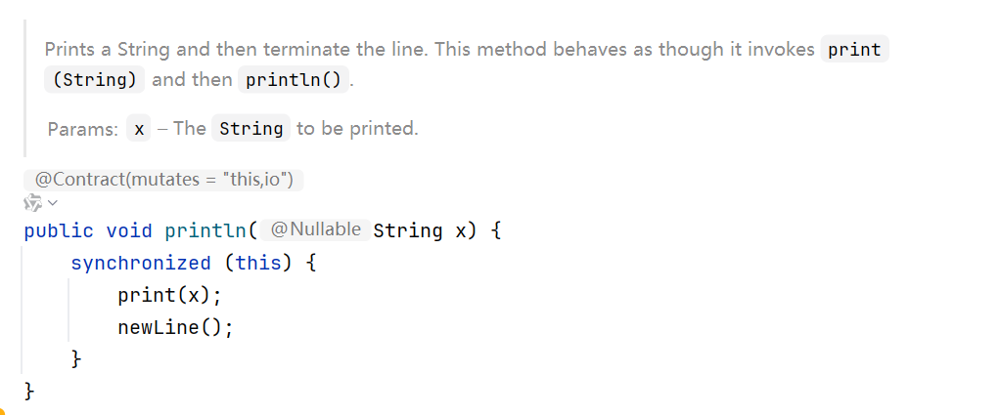


#### volatile 原理

volatile 的底层实现原理是内存屏障，Memory Barrier（Memory Fence） 

* 对 volatile 变量的写指令后会加入写屏障 
* 对 volatile 变量的读指令前会加入读屏障


##### 1.如何保证可见性

* 写屏障（sfence）保证在该屏障之前的，对共享变量的改动，都同步到主存当中

```java
public void actor2(I_Result r) {
    num = 2;
    ready = true; // (ready被volatile修饰)
    // 写屏障加在赋值操作之后
}
```

* 而读屏障（lfence）保证在该屏障之后，对共享变量的读取，加载的是主存中最新数据(从主存加载最新数据到高速缓存中)

```java
public void actor1(I_Result r) {
    // 读屏障加在读取操作之前
    if(ready) {
        r.r1 = num + num;
    } else {
        r.r1 = 1;
    }
}
```

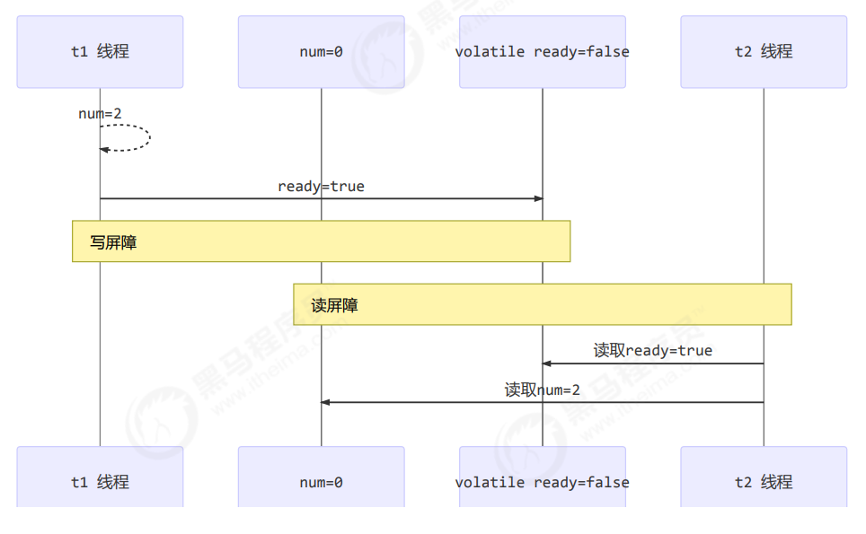


##### 2.如何保证有序性

* 写屏障会确保指令重排序时，不会将写屏障之前的代码排在写屏障之后

```java
public void actor2(I_Result r) {
    num = 2;
    ready = true; // (ready被volatile修饰)
    // 写屏障
}

```

* 读屏障会确保指令重排序时，不会将读屏障之后的代码排在读屏障之前

```java
public void actor1(I_Result r) {
    // 读屏障
    if(ready) {
        r.r1 = num + num;
    } else {
        r.r1 = 1;
    }
}
```

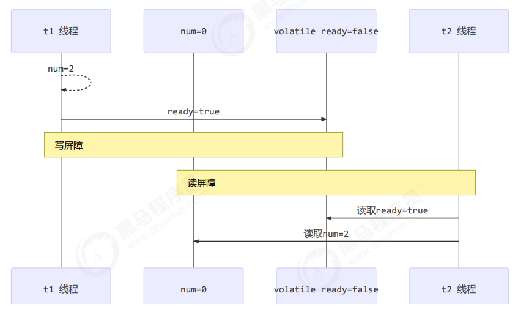

还是那句话，不能解决指令交错(保证了有序性和可见性，不能保证原子性)： 

* 写屏障仅仅是保证之后的读能够读到最新的结果，但不能保证读跑到它前面去 
* 而有序性的保证也只是保证了本线程内相关代码不被重排序


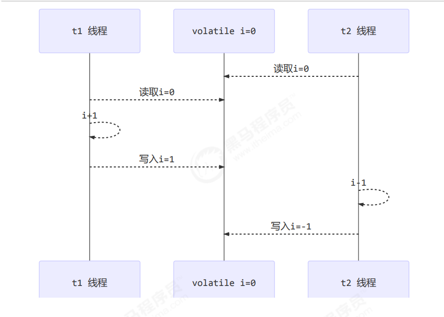

##### 3.double-checked locking 问题

以著名的 double-checked locking 单例模式为例`

```java
public final class Singleton {
    private Singleton() { }
    private static Singleton INSTANCE = null;
    public static Singleton getInstance() {
        if(INSTANCE == null) { // 因为只有第一次之后的使用不需要线程安全保护；两次检查，只让第一次访问的时候加锁
            // t2
            // 首次访问会同步，而之后的使用不需要线程安全保护
            synchronized(Singleton.class) {
                if (INSTANCE == null) { // t1
                    INSTANCE = new Singleton();
                }
            }
        }
        return INSTANCE;
    }
}

```

以上的实现特点是：

* 懒惰实例化 
* 首次使用 getInstance() 才使用 synchronized 加锁，后续使用时无需加锁 
* 有隐含的，但很关键的一点：第一个 if 使用了 INSTANCE 变量，是在同步块之外

但在多线程环境下，上面的代码是有问题的，getInstance 方法对应的字节码为：

> 由于synchronized代码块之外的INSTANCE变量不受保护，由于会有指令重排，可能导致问题

```
0: getstatic 		#2 // Field INSTANCE:Lcn/itcast/n5/Singleton;
3: ifnonnull 		37
6: ldc 				#3 // class cn/itcast/n5/Singleton
8: dup
9: astore_0
10: monitorenter
11: getstatic 		#2 // Field INSTANCE:Lcn/itcast/n5/Singleton;
14: ifnonnull 		27

17: new 			#3 // class cn/itcast/n5/Singleton
20: dup
21: invokespecial 	#4 // Method "<init>":()V
24: putstatic 		#2 // Field INSTANCE:Lcn/itcast/n5/Singleton;

27: aload_0
28: monitorexit
29: goto 37
32: astore_1
33: aload_0
34: monitorexit
35: aload_1
36: athrow
37: getstatic 		#2 // Field INSTANCE:Lcn/itcast/n5/Singleton;
40: areturn
```

其中 

* 17 表示创建对象，将对象引用入栈 // new Singleton 
* 20 表示复制一份对象引用 // 引用地址 
* 21 表示利用一个对象引用，调用构造方法 
* 24 表示利用一个对象引用，赋值给 static INSTANCE 

也许 jvm 会优化为：先执行 24，再执行 21。如果两个线程 t1，t2 按如下时间序列执行：

关键在于 0: getstatic 这行代码在 monitor 控制之外，它就像之前举例中不守规则的人，可以越过 monitor 读取 INSTANCE 变量的值 

**这时 t1 还未完全将构造方法执行完毕，如果在构造方法中要执行很多初始化操作，那么 t2 拿到的是将是一个未初 始化完毕的单例** 

([05.016-volatile-原理-dcl-问题分析_哔哩哔哩_bilibili](https://www.bilibili.com/video/BV16J411h7Rd?spm_id_from=333.788.player.switch&vd_source=67ef3bb4c8d68a96408acdaa865b1313&p=149))

对 INSTANCE 使用 volatile 修饰即可，可以禁用指令重排，但要注意在 JDK 5 以上的版本的 volatile 才会真正有效


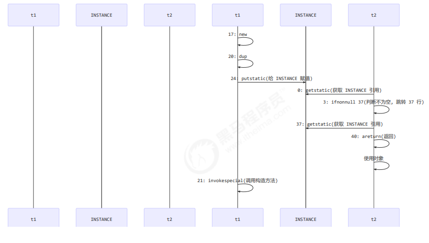


##### 4.double-checked locking 解决

加入`volatile`关键字

```java
public final class Singleton {
    private Singleton() { }
    private static volatile Singleton INSTANCE = null;
    public static Singleton getInstance() {
        // 实例没创建，才会进入内部的 synchronized代码块
        if (INSTANCE == null) {
            synchronized (Singleton.class) { 
                // t2
                // 也许有其它线程已经创建实例，所以再判断一次
                if (INSTANCE == null) { // t1
                    INSTANCE = new Singleton();
                }
            }
        }
        return INSTANCE;
    }
}

```


```
// -------------------------------------> 加入对 INSTANCE 变量的读屏障
0: getstatic #2 // Field INSTANCE:Lcn/itcast/n5/Singleton;

3: ifnonnull 37
6: ldc #3 // class cn/itcast/n5/Singleton
8: dup
9: astore_0
10: monitorenter -----------------------> 保证原子性、可见性
11: getstatic #2 // Field INSTANCE:Lcn/itcast/n5/Singleton;
14: ifnonnull 27
17: new #3 // class cn/itcast/n5/Singleton
20: dup
21: invokespecial #4 // Method "<init>":()V
24: putstatic #2 // Field INSTANCE:Lcn/itcast/n5/Singleton;
// -------------------------------------> 加入对 INSTANCE 变量的写屏障
27: aload_0
28: monitorexit ------------------------> 保证原子性、可见性
29: goto 37
32: astore_1
33: aload_0
34: monitorexit
35: aload_1
36: athrow
37: getstatic #2 // Field INSTANCE:Lcn/itcast/n5/Singleton;
40: areturn
```

如上面的注释内容所示，读写 volatile 变量时会加入内存屏障（Memory Barrier（Memory Fence）），保证下面 两点： 

* 可见性 
  * 写屏障（sfence）保证在该屏障之前的 t1 对共享变量的改动，都同步到主存当中 
  * 而读屏障（lfence）保证在该屏障之后 t2 对共享变量的读取，加载的是主存中最新数据 
* 有序性 
  * 写屏障会确保指令重排序时，不会将写屏障之前的代码排在写屏障之后 
  * 读屏障会确保指令重排序时，不会将读屏障之后的代码排在读屏障之前 
* 更底层是读写变量时使用 lock 指令来多核 CPU 之间的可见性与有序性

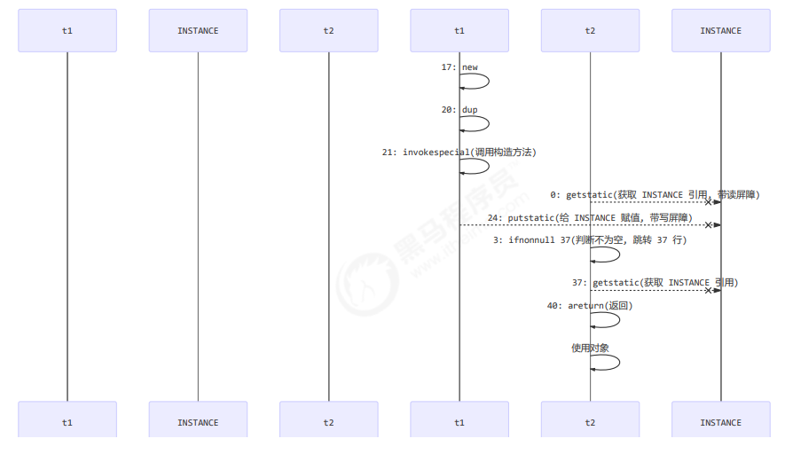

保证了getStatic 获取引用的时候获取到的一定是构造完成的对象


#### 对Volatile 的理解

**Volatile** 是 Java 虚拟机提供 **轻量级的同步机制**

**1、保证可见性 2、不保证原子性 3、禁止指令重排**


**如何实现可见性**

volatile变量修饰的共享变量在进行写操作的时候回多出一行汇编：

0x01a3de1d:movb $0×0，0×1104800（%esi）;0x01a3de24**:lock** addl $0×0,(%esp);

Lock前缀的指令在多核处理器下会引发两件事情。

 1）将当前处理器缓存行的数据写回到系统内存。

 2）这个写回内存的操作会使其他cpu里缓存了该内存地址的数据无效。

**多处理器总线嗅探：**

为了提高处理速度，处理器不直接和内存进行通信，而是先将系统内存的数据读到内部缓存后再进行操作，但操作不知道何时会写到内存。如果对声明了**volatile**的变量进行写操作，JVM就会向处理器发送一条lock前缀的指令，将这个变量所在缓存行的数据写回到系统内存。但是在**多处理器下**，为了保证各个处理器的缓存是一致的，就会实现缓存缓存一致性协议，**每个处理器通过嗅探在总线上传播的数据来检查自己的缓存值是不是过期了，如果处理器发现自己缓存行对应的内存地址被修改，就会将当前处理器的缓存行设置无效状态**，当处理器对这个数据进行修改操作的时候，会重新从系统内存中把数据库读到处理器缓存中。


### 有序性

JVM 会在不影响正确性的前提下，可以调整语句的执行顺序(指令重排)，思考下面一段代码

```java
static int i;
static int j;
// 在某个线程内执行如下赋值操作
i = ...;
j = ...; 

```

可以看到，至于是先执行 i 还是 先执行 j ，对最终的结果不会产生影响。所以，上面代码真正执行时，既可以是

```java
i = ...;
j = ...;
```

也可以是

```java
j = ...;
i = ...; 
```

这种特性称之为『指令重排』


**多线程下『指令重排』会影响正确性：**

```java
int num = 0;
boolean ready = false;
// 线程1 执行此方法
public void actor1(I_Result r) {
    if(ready) {
        r.r1 = num + num;
    } else {
        r.r1 = 1;
    }
}

// 线程2 执行此方法
public void actor2(I_Result r) {
    num = 2;
    ready = true;
}
```

I_Result 是一个对象，有一个属性 r1 用来保存结果，问，可能的结果有几种？ 

有同学这么分析 

情况1：线程1 先执行，这时 ready = false，所以进入 else 分支结果为 1 

情况2：线程2 先执行 num = 2，但没来得及执行 ready = true，线程1 执行，还是进入 else 分支，结果为1 

情况3：线程2 执行到 ready = true，线程1 执行，这回进入 if 分支，结果为 4（因为 num 已经执行过了） 

但我告诉你，结果还有可能是 0 😁😁😁，信不信吧！ 

这种情况下是：线程2 执行 ready = true，切换到线程1，进入 if 分支，相加为 0，再切回线程2 执行 num = 2 

相信很多人已经晕了 😵😵😵 

这种现象叫做指令重排，是 JIT 编译器在运行时的一些优化，这个现象需要通过大量测试才能复现： 

> 借助 java 并发压测工具 jcstress https://wiki.openjdk.java.net/display/CodeTools/jcstress
>
> ```
> mvn archetype:generate -DinteractiveMode=false -DarchetypeGroupId=org.openjdk.jcstress -
> DarchetypeArtifactId=jcstress-java-test-archetype -DarchetypeVersion=0.5 -DgroupId=cn.itcast -
> DartifactId=ordering -Dversion=1.0 
> ```
>
> 创建 maven 项目，提供如下测试类
>
> ```java
> @JCStressTest
> @Outcome(id = {"1", "4"}, expect = Expect.ACCEPTABLE, desc = "ok")
> @Outcome(id = "0", expect = Expect.ACCEPTABLE_INTERESTING, desc = "!!!!")
> @State
> public class ConcurrencyTest {
>  int num = 0;
>  boolean ready = false;
>  @Actor
>  public void actor1(I_Result r) {
>      if(ready) {
>          r.r1 = num + num;
>      } else {
>          r.r1 = 1;
>      }
>  }
>  @Actor
>  public void actor2(I_Result r) {
>      num = 2;
>      ready = true;
>  }
> }
> 
> ```
>
> 执行
>
> ```
> mvn clean install
> java -jar target/jcstress.jar 
> ```
>
> 会输出我们感兴趣的结果，摘录其中一次结果：
>
> ```
> *** INTERESTING tests
> Some interesting behaviors observed. This is for the plain curiosity.
> 2 matching test results.
> [OK] test.ConcurrencyTest
> (JVM args: [-XX:-TieredCompilation])
> Observed state Occurrences Expectation Interpretation
> 0 1,729 ACCEPTABLE_INTERESTING !!!!
> 1 42,617,915 ACCEPTABLE ok
> 4 5,146,627 ACCEPTABLE ok
> [OK] test.ConcurrencyTest
> (JVM args: [])
> Observed state Occurrences Expectation Interpretation
> 0 1,652 ACCEPTABLE_INTERESTING !!!!
> 1 46,460,657 ACCEPTABLE ok
> 4 4,571,072 ACCEPTABLE ok 
> ```
>
> 可以看到，出现结果为 0 的情况有 638 次，虽然次数相对很少，但毕竟是出现了

**解决方法**

volatile 修饰的变量，可以禁用指令重排

```java
@JCStressTest
@Outcome(id = {"1", "4"}, expect = Expect.ACCEPTABLE, desc = "ok")
@Outcome(id = "0", expect = Expect.ACCEPTABLE_INTERESTING, desc = "!!!!")
@State
public class ConcurrencyTest {
    int num = 0;
    volatile boolean ready = false;// 通过写屏障，防止之前的指令重排序
    @Actor
    public void actor1(I_Result r) {
        if(ready) {
            r.r1 = num + num;
        } else {
            r.r1 = 1;
        }
    }
    @Actor
    public void actor2(I_Result r) {
        num = 2;
        ready = true;
    }
}
```

结果为：

```
*** INTERESTING tests
 Some interesting behaviors observed. This is for the plain curiosity.
 0 matching test results.
```


#### CPU指令级并行原理

> 为什么要有重排指令这项优化呢？从 CPU 执行指令的原理来理解一下

**1.概念**

**Clock Cycle Time** 

主频的概念大家接触的比较多，而 CPU 的 Clock Cycle Time（时钟周期时间），等于主频的倒数，意思是 CPU 能 够识别的最小时间单位，比如说 4G 主频的 CPU 的 Clock Cycle Time 就是 0.25 ns，作为对比，我们墙上挂钟的 Cycle Time 是 1s 

例如，运行一条加法指令一般需要一个时钟周期时间

**CPI**

有的指令需要更多的时钟周期时间，所以引出了 CPI （Cycles Per Instruction）指令平均时钟周期数

**IPC**

IPC（Instruction Per Clock Cycle） 即 CPI 的倒数，表示每个时钟周期能够运行的指令数

**CPU 执行时间**

程序的 CPU 执行时间，即我们前面提到的 user + system 时间，可以用下面的公式来表示

```
程序 CPU 执行时间 = 指令数 * CPI * Clock Cycle Time 
```


> #### 鱼罐头的故事
>
> 加工一条鱼需要 50 分钟，只能一条鱼、一条鱼顺序加工...
>
> 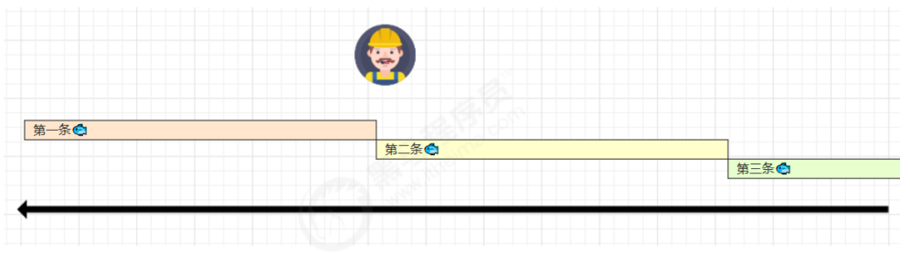
>
> 可以将每个鱼罐头的加工流程细分为 5 个步骤： 
>
> * 去鳞清洗 10分钟 
> * 蒸煮沥水 10分钟 
> * 加注汤料 10分钟 
> * 杀菌出锅 10分钟 
> * 真空封罐 10分钟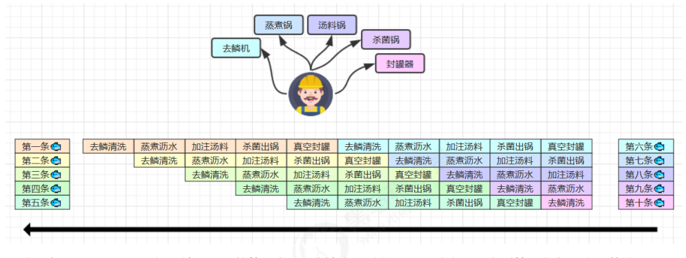即使只有一个工人，最理想的情况是：他能够在 10 分钟内同时做好这 5 件事，因为对第一条鱼的真空装罐，不会 影响对第二条鱼的杀菌出锅...


**2.利用指令重排序优化**

事实上，现代处理器会设计为一个时钟周期完成一条执行时间最长的 CPU 指令。为什么这么做呢？可以想到指令 还可以再划分成一个个更小的阶段，例如，每条指令都可以分为： `取指令 - 指令译码 - 执行指令 - 内存访问 - 数据` 写回 这 5 个阶段

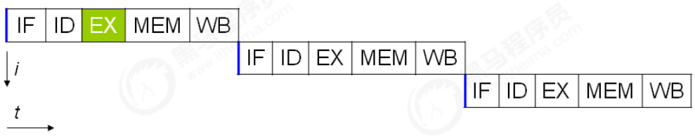


> 术语参考： 
>
> * instruction fetch (IF) 
> * instruction decode (ID) 
> * execute (EX) 
> * memory access (MEM) 
> * register write back (WB)

在不改变程序结果的前提下，这些指令的<u>各个阶段可以通过**重排序**和**组合**</u>来实现指令级并行，这一技术在 80's 中 叶到 90's 中叶占据了计算架构的重要地位

> **提示：**
>
> 分阶段，分工是提升效率的关键！


指令重排的前提是，重排指令不能影响结果，例如

```java
// 可以重排的例子
int a = 10; // 指令1
int b = 20; // 指令2
System.out.println( a + b );

// 不能重排的例子
int a = 10; // 指令1
int b = a - 5; // 指令2
```

> **参考：** Scoreboarding and the Tomasulo algorithm (which is similar to scoreboarding but makes use of register renaming) are two of the most common techniques for implementing out-of-order execution and instruction-level parallelism.


**3.支持流水线的处理器**

现代 CPU 支持**多级指令流水线**，例如支持同时执行 `取指令 - 指令译码 - 执行指令 - 内存访问 - 数据写回` 的处理 器，就可以称之为**五级指令流水线**。这时 CPU 可以在一个时钟周期内，**同时运行五条指令的不同阶段**（相当于一条执行时间最长的复杂指令），IPC = 1，本质上，流水线技术并不能缩短单条指令的执行时间，但它变相地提高了 指令地吞吐率

> 提示：
>
> 奔腾四（Pentium 4）支持高达 35 级流水线，但由于功耗太高被废弃

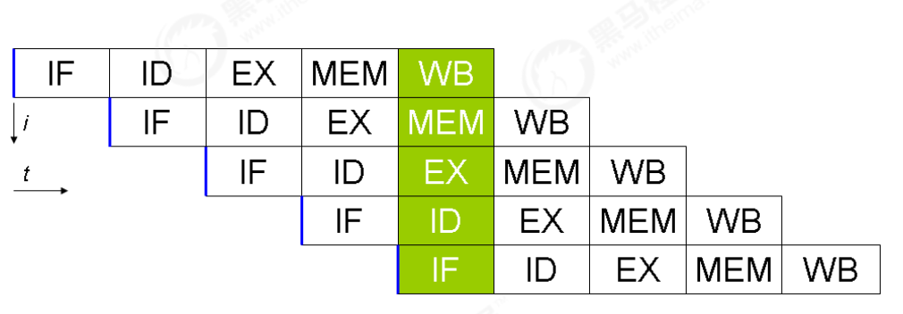


**4.SuperScalar 处理器**

大多数处理器包含多个执行单元，并不是所有计算功能都集中在一起，可以再细分为整数运算单元、浮点数运算单 元等，这样可以把多条指令也可以做到并行获取、译码等，CPU 可以在一个时钟周期内，执行多于一条指令，IPC > 1

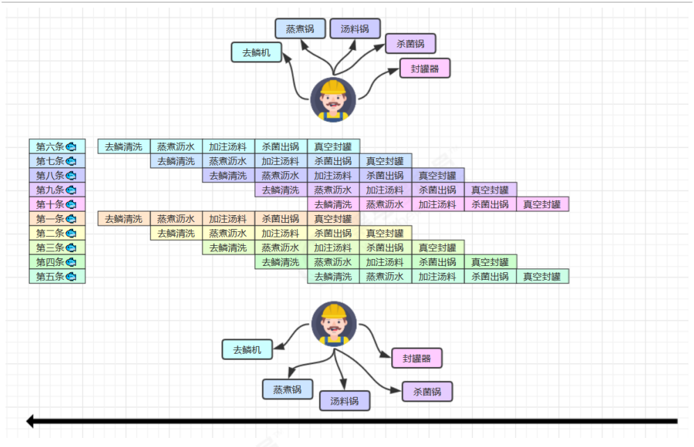

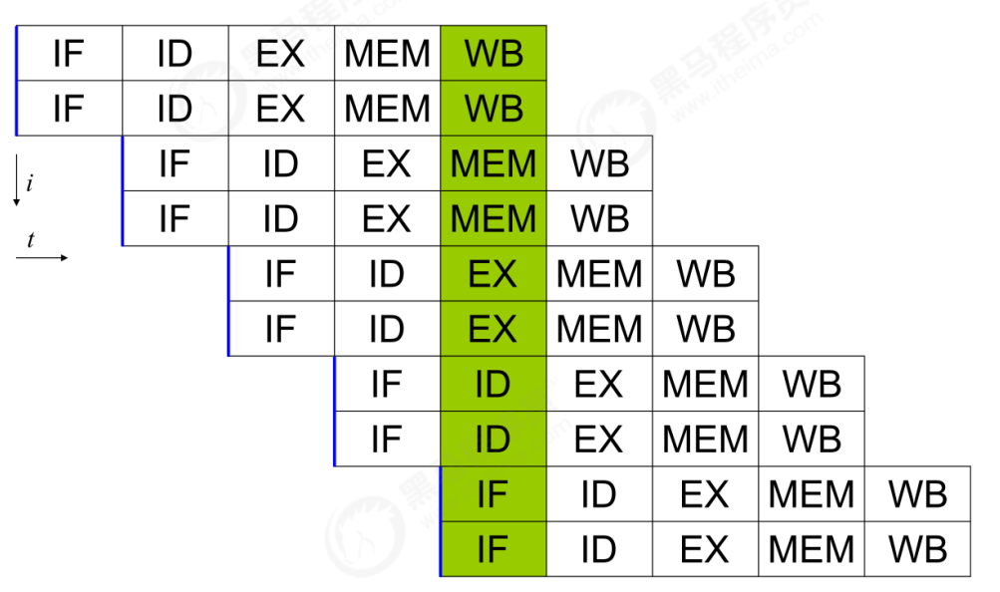


### happens-before

happens-before **规定了对共享变量的写操作对其它线程的读操作可见**，它**是可见性与有序性的一套规则总结**，抛开以下 happens-before 规则，JMM 并不能保证一个线程对共享变量的写，对于其它线程对该共享变量的读可见 

1. 线程解锁 m 之前对变量的写，对于接下来对 m 加锁的其它线程对该变量的读可见

```java
static int x;
static Object m = new Object();
new Thread(()->{
    synchronized(m) {
        x = 10;
    }
},"t1").start();

new Thread(()->{
    synchronized(m) {
        System.out.println(x);
    }
},"t2").start();

```


2. 线程对 volatile 变量的写，对接下来其它线程对该变量的读可见

```java
volatile static int x;
new Thread(()->{
    x = 10;
},"t1").start();
new Thread(()->{
    System.out.println(x);
},"t2").start();
```


3. 线程 start 前对变量的写，对该线程开始后对该变量的读可见

```java
static int x;
x = 10;
new Thread(()->{
    System.out.println(x);
},"t2").start();

```

4. 线程结束前对变量的写，对其它线程得知它结束后的读可见（比如其它线程调用 t1.isAlive() 或 t1.join()等待 它结束）

```java
static int x;
Thread t1 = new Thread(()->{
    x = 10;
},"t1");
t1.start();
t1.join();
System.out.println(x);
```

5. 线程 t1 打断 t2（interrupt）前对变量的写，对于其他线程得知 t2 被打断后对变量的读可见（通过 t2.interrupted 或 t2.isInterrupted）

```java
static int x;
public static void main(String[] args) {
    Thread t2 = new Thread(()->{
        while(true) {
            if(Thread.currentThread().isInterrupted()) {
                System.out.println(x);
                break;
            }
        }
    },"t2");
    t2.start();
    new Thread(()->{
        sleep(1);    
        x = 10;
        t2.interrupt();
    },"t1").start();
    while(!t2.isInterrupted()) {
        Thread.yield();
    }
    System.out.println(x);
}
```


6. 对变量默认值（0，false，null）的写，对其它线程对该变量的读可见 

7. 具有传递性，如果 x hb-> y 并且 y hb-> z 那么有 x hb-> z ，配合 volatile 的防指令重排，有下面的例子

```java
volatile static int x;
static int y;
new Thread(()->{
    y = 10;v
    x = 20;
},"t1").start();

new Thread(()->{
    // x=20 对 t2 可见, 同时 y=10 也对 t2 可见
    System.out.println(x);093
},"t2").start();
```

> 变量都是指成员变量或静态成员变量 
>
> 参考： 第17页


# 习题


#### 线程安全单例习题


# ==共享模型-无锁==

> 乐观锁

jdk提供的无锁并发的原子实现

* CAS 与 volatile
* 原子整数
* 原子引用
* 原子累加器
* Unsafe


##  CAS 与 volatile

#### 问题背景


保证 account.withdraw 取款方法的线程安全

```java
package cn.itcast.test;


import java.util.ArrayList;
import java.util.List;
import java.util.concurrent.atomic.AtomicInteger;

public class TestAccount {
    public static void main(String[] args) {
        Account account = new AccountCas(10000);
        Account.demo(account);
    }
}


class AccountUnsafe implements Account {

    private Integer balance;

    public AccountUnsafe(Integer balance) {
        this.balance = balance;
    }

    @Override
    public Integer getBalance() {

        return this.balance;
        
    }

    @Override
    public void withdraw(Integer amount) {
        this.balance -= amount;
    }
}

interface Account {
    // 获取余额
    Integer getBalance();

    // 取款
    void withdraw(Integer amount);

    /**
     * 方法内会启动 1000 个线程，每个线程做 -10 元 的操作
     * 如果初始余额为 10000 那么正确的结果应当是 0
     */
    static void demo(Account account) {
        List<Thread> ts = new ArrayList<>();
        for (int i = 0; i < 1000; i++) {
            ts.add(new Thread(() -> {
                account.withdraw(10);
            }));
        }
        long start = System.nanoTime();
        ts.forEach(Thread::start);
        ts.forEach(t -> {
            try {
                t.join();
            } catch (InterruptedException e) {
                e.printStackTrace();
            }
        });
        long end = System.nanoTime();
        System.out.println(account.getBalance()
                + " cost: " + (end-start)/1000_000 + " ms");
    }
}

```


```java
package cn.itcast.test;


import java.util.ArrayList;
import java.util.List;
import java.util.concurrent.atomic.AtomicInteger;

public class TestAccount {
    public static void main(String[] args) {
        Account account = new AccountCas(10000);
        Account.demo(account);
    }
}

class AccountCas implements Account {
    private AtomicInteger balance;

    public AccountCas(int balance) {
        this.balance = new AtomicInteger(balance);
    }

    @Override
    public Integer getBalance() {
        return balance.get();
    }

    /**
     * 不加锁的方式
     */
    @Override
    public void withdraw(Integer amount) {
        // getAndAdd的底层逻辑
        /*while(true) {
            // 获取余额的最新值
            int prev = balance.get();
            // 要修改的余额
            int next = prev - amount;
            // 真正修改
            if(balance.compareAndSet(prev, next)) {
                break; // 修改成功就退出循环
            }
        }*/
        
        // 可以简化为下面的方法
        balance.getAndAdd(-1 * amount);
    }
}

class AccountUnsafe implements Account {

    private Integer balance;

    public AccountUnsafe(Integer balance) {
        this.balance = balance;
    }

    @Override
    public Integer getBalance() {
        synchronized (this) {
            return this.balance;
        }
    }

    /**
     * 加锁的方式
     */
    @Override
    public void withdraw(Integer amount) {
        synchronized (this) {
            this.balance -= amount;
        }
    }
}

interface Account {
    // 获取余额
    Integer getBalance();

    // 取款
    void withdraw(Integer amount);

    /**
     * 方法内会启动 1000 个线程，每个线程做 -10 元 的操作
     * 如果初始余额为 10000 那么正确的结果应当是 0
     */
    static void demo(Account account) {
        List<Thread> ts = new ArrayList<>();
        for (int i = 0; i < 1000; i++) {
            ts.add(new Thread(() -> {
                account.withdraw(10);
            }));
        }
        long start = System.nanoTime();
        ts.forEach(Thread::start);
        ts.forEach(t -> {
            try {
                t.join();
            } catch (InterruptedException e) {
                e.printStackTrace();
            }
        });
        long end = System.nanoTime();
        System.out.println(account.getBalance()
                + " cost: " + (end-start)/1000_000 + " ms");
    }
}

```


#### CAS原理

前面看到的 AtomicInteger 的解决方法，内部并没有用锁来保护共享变量的线程安全。那么它是如何实现的呢？

```java
public void withdraw(Integer amount) {
    while(true) {
        // 需要不断尝试，直到成功为止
        while (true) {
            // 比如拿到了旧值 1000
            int prev = balance.get();
            // 在这个基础上 1000-10 = 990
            int next = prev - amount;
            /*
            compareAndSet 正是做这个检查，在 set 前，先比较 prev 与当前值
            - 不一致了，next 作废，返回 false 表示失败
            比如，别的线程已经做了减法，当前值已经被减成了 990
            那么本线程的这次 990 就作废了，进入 while 下次循环重试
            - 一致，以 next 设置为新值，返回 true 表示成功
            */
            if (balance.compareAndSet(prev, next)) {
                break;
            }
        }
    }
}
          

```

关键： compareAndSet，简称就是 CAS （也有 Compare And Swap 的说法），它必须是原子操作

先**对比**当前值是不是预期的值，如果是预期的 就执行**操作**，如不不是预期的，就重新获取最新值

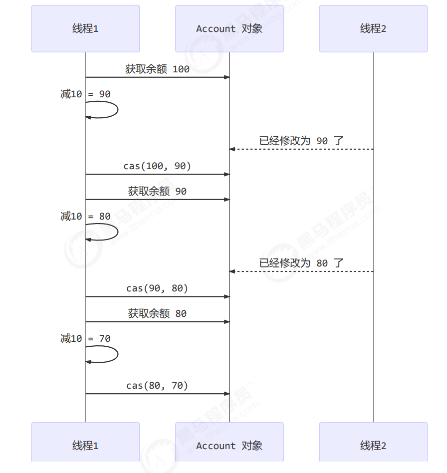

> **注意**
>
> 其实 CAS 的底层是 lock cmpxchg 指令（X86 架构），在单核 CPU 和多核 CPU 下都能够保证【比较-交 换】的原子性
>
> * 在多核状态下，某个核执行到带 lock 的指令时，CPU 会让总线锁住，当这个核把此指令执行完毕，再 开启总线。这个过程中不会被线程的调度机制所打断，保证了多个线程对内存操作的准确性，是原子 的。


**volatile的支持**

* **CAS操作需要volatile的支持**
  获取共享变量时，为了保证该变量的可见性，需要使用 volatile 修饰

  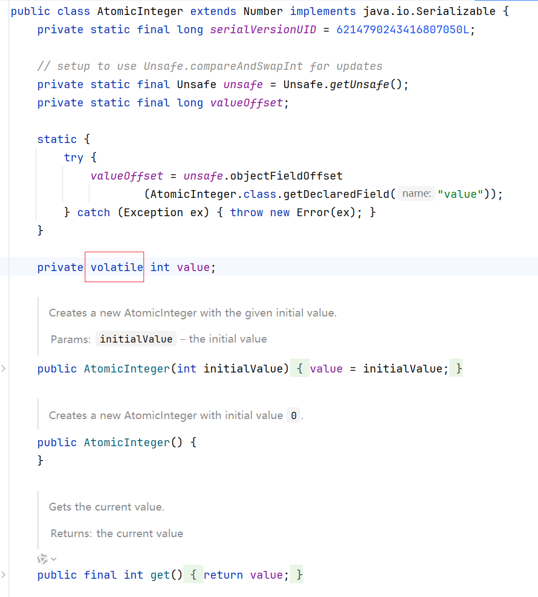


**为什么无锁效率高** 

* 无锁情况下，即使重试失败，线程始终在高速运行，没有停歇，而 synchronized 会让线程在没有获得锁的时候，**发生上下文切换，进入阻塞**。打个比喻 

* 线程就好像高速跑道上的赛车，高速运行时，速度超快，一旦发生上下文切换，就好比赛车要减速、熄火， 等被唤醒又得重新打火、启动、加速... 恢复到高速运行，代价比较大 

* 但在无锁情况下，线程要保持运行  就需要额外 CPU 的支持 (CPU 在这里就好比高速跑道，没有额外的跑 道，线程想高速运行也无从谈起) ，如果没有额外的CPU支持，虽然**不会进入阻塞**，但由于没有分到时间片，仍然会进入可运行状态，**还是会有上下文切换**。

  > 所以CAS操作需要多核CPU才能发挥出优势，而且线程数最好不要超过CPU核数，线程数如果太多  CAS效率优势也不高


**特点**

结合 CAS 和 volatile 可以实现无锁并发，适用于线程数少、多核 CPU 的场景下。 

* CAS 是基于乐观锁的思想：最乐观的估计，不怕别的线程来修改共享变量，就算改了也没关系，我吃亏点再 重试呗。 

  > 乐观锁：乐观地认为当前变量的修改不会有冲突，如果发生冲突了再去从重试
  >
  > 悲观锁：先预设会产生冲突，所以先上锁

* synchronized 是基于悲观锁的思想：最悲观的估计，得防着其它线程来修改共享变量，我上了锁你们都别想 改，我改完了解开锁，你们才有机会。 

* CAS 体现的是无锁并发、无阻塞并发，请仔细体会这两句话的意思 

  * 因为没有使用 synchronized，所以线程不会陷入阻塞，这是效率提升的因素之一 
  * 但如果竞争激烈，可以想到重试必然频繁发生，反而效率会受影响


## JUC并发包工具


### 原子整数

J.U.C 并发包提供了： 

* AtomicBoolean 
* AtomicInteger 
* AtomicLong 

以 AtomicInteger 为例

```java
AtomicInteger i = new AtomicInteger(0);

// 先获取，后自增（i = 0, 结果 i = 1, 返回 0），类似于 i++
System.out.println(i.getAndIncrement());
// 先自增，后获取（i = 1, 结果 i = 2, 返回 2），类似于 ++i
System.out.println(i.incrementAndGet());

// 自减并获取（i = 2, 结果 i = 1, 返回 1），类似于 --i
System.out.println(i.decrementAndGet());
// 获取并自减（i = 1, 结果 i = 0, 返回 1），类似于 i--
System.out.println(i.getAndDecrement());

// 获取并加值（i = 0, 结果 i = 5, 返回 0）
System.out.println(i.getAndAdd(5));
// 加值并获取（i = 5, 结果 i = 0, 返回 0）
System.out.println(i.addAndGet(-5));

// 获取并更新（i = 0, p 为 i 的当前值, 结果 i = 1, 返回 0）
// 其中函数中的操作能保证原子，但函数需要无副作用
System.out.println(i.getAndUpdate(p -> p*2+1));

// 更新并获取（i = 1, p 为 i 的当前值, 结果 i = 0, 返回 0）
// 其中函数中的操作能保证原子，但函数需要无副作用
System.out.println(i.updateAndGet(p -> p*2-2));

// 获取并计算（i = 0, p 为 i 的当前值, x 为参数1, 结果 i = 10, 返回 0）
// 其中函数中的操作能保证原子，但函数需要无副作用
// getAndUpdate 如果在 lambda 中引用了外部的局部变量，要保证该局部变量是 final 的
// getAndAccumulate 可以通过 参数1 来引用外部的局部变量，但因为其不在 lambda 中因此不必是 final
System.out.println(i.getAndAccumulate(10, (p, x) -> p + x));

// 计算并获取（i = 10, p 为 i 的当前值, x 为参数1, 结果 i = 0, 返回 0）
// 其中函数中的操作能保证原子，但函数需要无副作用
System.out.println(i.accumulateAndGet(-10, (p, x) -> p + x));
```

> 都使用了CAS的思路，保证操作是原子性的，不会有线程安全问题

> `getAndUpdate(p -> p*2+1)`的底层实现
>
> 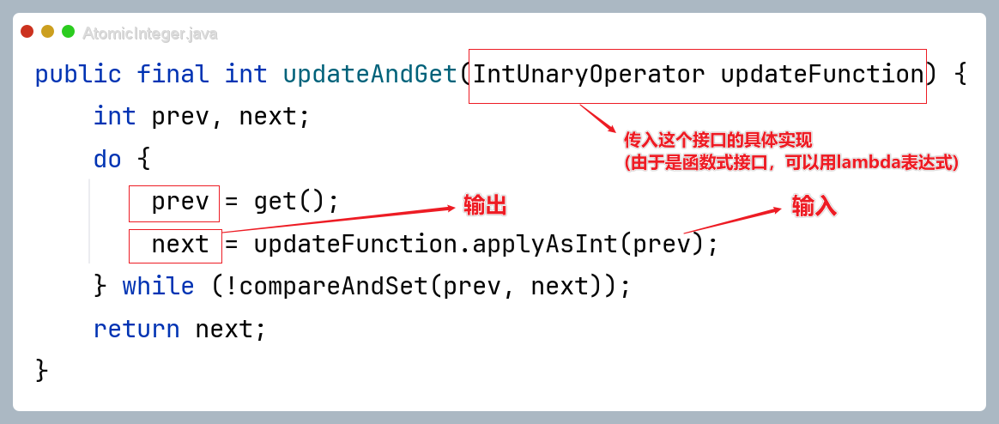
>
> 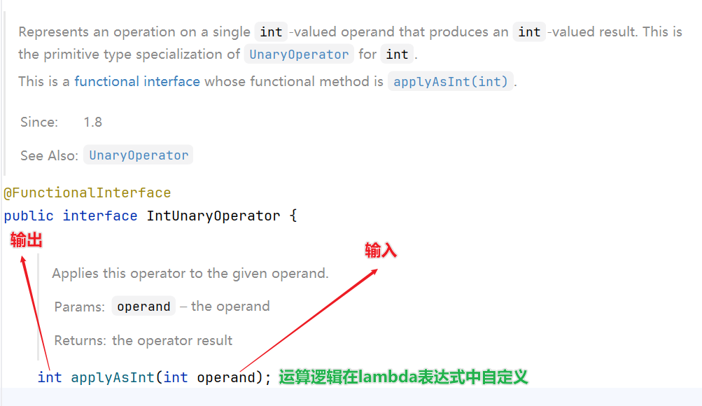
>
> 


### 原子引用

* AtomicReference 
* AtomicMarkableReference 
* AtomicStampedReference

有如下方法

```java
@Slf4j(topic = "c.Test35")
public class Test35 {
    public static void main(String[] args) {
        DecimalAccount.demo(new DecimalAccountCas(new BigDecimal("10000")));
    }
}

class DecimalAccountCas implements DecimalAccount {
    private AtomicReference<BigDecimal> balance; // 原子引用类

    public DecimalAccountCas(BigDecimal balance) {
//        this.balance = balance;
        this.balance = new AtomicReference<>(balance);
    }

    @Override
    public BigDecimal getBalance() {
        return balance.get();
    }

    @Override
    public void withdraw(BigDecimal amount) {
        while(true) {
            BigDecimal prev = balance.get();
            BigDecimal next = prev.subtract(amount);
            if (balance.compareAndSet(prev, next)) {
                break;
            }
        }
    }
}

public interface DecimalAccount {
    // 获取余额
    BigDecimal getBalance();
    // 取款
    void withdraw(BigDecimal amount);

    /**
     * 方法内会启动 1000 个线程，每个线程做 -10 元 的操作
     * 如果初始余额为 10000 那么正确的结果应当是 0
     */
    static void demo(DecimalAccount account) {
        List<Thread> ts = new ArrayList<>();
        for (int i = 0; i < 1000; i++) {
            ts.add(new Thread(() -> {
                account.withdraw(BigDecimal.TEN);
            }));
        }
        ts.forEach(Thread::start);
        ts.forEach(t -> {
            try {
                t.join();
            } catch (InterruptedException e) {
                e.printStackTrace();
            }
        });
        System.out.println(account.getBalance());
    }
}

```


### ABA问题及解决

> ABA问题在大部分场景下对业务都没什么影响

```java
import static cn.itcast.n2.util.Sleeper.sleep;

@Slf4j(topic = "c.Test36")
public class Test36 {

    static AtomicReference<String> ref = new AtomicReference<>("A", 0);

    public static void main(String[] args) throws InterruptedException {
        log.debug("main start...");
        // 获取值 A
        String prev = ref.getReference();
        other();
        sleep(1);
        // 尝试改为 C
        log.debug("change A->C {}", ref.compareAndSet(prev, "C", stamp, stamp + 1));
    }

    private static void other() {
        new Thread(() -> {
            log.debug("change A->B {}", ref.compareAndSet(ref.get(), "B"));
        }, "t1").start();
        sleep(0.5);
        new Thread(() -> {
            log.debug("change B->A {}", ref.compareAndSet(ref.get(), "A"));
        }, "t2").start();
    }
}
```

输出

```
11:29:52.325 c.Test36 [main] - main start...
11:29:52.379 c.Test36 [t1] - change A->B true
11:29:52.879 c.Test36 [t2] - change B->A true
11:29:53.880 c.Test36 [main] - change A->C true 
```

主线程仅能判断出共享变量的值与最初值 A 是否相同，不能感知到这种从 A 改为 B 又 改回 A 的情况，如果主线程希望： 

只要有其它线程【动过了】共享变量，那么自己的 cas 就算失败，这时，仅比较值是不够的，需要再加一个版本号

**解决-使用AtomicStampedReference**

* ```java
  AtomicStampedReference<String> ref = new AtomicStampedReference<>("A", 0);
  String prev = ref.getReference();// 获取值
  int stamp = ref.getStamp();// 获取版本号
  ref.compareAndSet(prev, "C", stamp, stamp + 1));// 有版本号变动的CAS操作
  ```

  

```java
import static cn.itcast.n2.util.Sleeper.sleep;

@Slf4j(topic = "c.Test36")
public class Test36 {

    static AtomicStampedReference<String> ref = new AtomicStampedReference<>("A", 0);

    public static void main(String[] args) throws InterruptedException {
        log.debug("main start...");
        // 获取值 A
        String prev = ref.getReference();
        // 【获取版本号】
        int stamp = ref.getStamp();
        log.debug("版本 {}", stamp);
        // 如果中间有其它线程干扰，发生了 ABA 现象
        other();
        sleep(1);
        // 尝试改为 C
        log.debug("change A->C {}", ref.compareAndSet(prev, "C", stamp, stamp + 1));
    }

    private static void other() {
        new Thread(() -> {
            log.debug("change A->B {}", ref.compareAndSet(ref.getReference(), "B", ref.getStamp(), ref.getStamp() + 1));
            log.debug("更新版本为 {}", ref.getStamp());
        }, "t1").start();
        sleep(0.5);
        new Thread(() -> {
            log.debug("change B->A {}", ref.compareAndSet(ref.getReference(), "A", ref.getStamp(), ref.getStamp() + 1));
            log.debug("更新版本为 {}", ref.getStamp());
        }, "t2").start();
    }
}
```

输出

```
15:41:34.891 c.Test36 [main] - main start...
15:41:34.894 c.Test36 [main] - 版本 0
15:41:34.956 c.Test36 [t1] - change A->B true
15:41:34.956 c.Test36 [t1] - 更新版本为 1
15:41:35.457 c.Test36 [t2] - change B->A true
15:41:35.457 c.Test36 [t2] - 更新版本为 2
15:41:36.457 c.Test36 [main] - change A->C false 
```

AtomicStampedReference 可以给原子引用加上版本号，追踪原子引用整个的变化过程，如： A -> B -> A -> C ，通过AtomicStampedReference，我们可以知道，引用变量中途被更改了几次。 **但是有时候，并不关心引用变量更改了几次，只是单纯的关心是否更改过，所以就有了 AtomicMarkableReference** (只需要布尔值)


**解决-AtomicMarkableReference**

* ```java
  GarbageBag bag = new GarbageBag("装满了垃圾");
  GarbageBag bag2 = new GarbageBag("装满了垃圾");
  AtomicMarkableReference<GarbageBag> ref = new AtomicMarkableReference<>(bag, true);
  ref.compareAndSet(bag, bag2, true, false);
  
  ```

```java
class GarbageBag {
    String desc;
    public GarbageBag(String desc) {
        this.desc = desc;
    }
    public void setDesc(String desc) {
        this.desc = desc;
    }
    
    @Override
    public String toString() {
        return super.toString() + " " + desc;
    }
}

```

```java
@Slf4j
public class TestABAAtomicMarkableReference {
    public static void main(String[] args) throws InterruptedException {
        GarbageBag bag = new GarbageBag("装满了垃圾");
        // 参数2 mark 可以看作一个标记，表示垃圾袋满了
        AtomicMarkableReference<GarbageBag> ref = new AtomicMarkableReference<>(bag, true);
        log.debug("主线程 start...");
        GarbageBag prev = ref.getReference();
        log.debug(prev.toString());
        new Thread(() -> {
            log.debug("打扫卫生的线程 start...");
            bag.setDesc("空垃圾袋");
            while (!ref.compareAndSet(bag, bag, true, false)) {}
            log.debug(bag.toString());
        }).start();
        Thread.sleep(1000);
        log.debug("主线程想换一只新垃圾袋？");
        boolean success = ref.compareAndSet(prev, new GarbageBag("空垃圾袋"), true, false);
        log.debug("换了么？" + success);
        log.debug(ref.getReference().toString());
    }
}
```

输出

```
2019-10-13 15:30:09.264 [main] 主线程 start...
2019-10-13 15:30:09.270 [main] cn.itcast.GarbageBag@5f0fd5a0 装满了垃圾
2019-10-13 15:30:09.293 [Thread-1] 打扫卫生的线程 start...
2019-10-13 15:30:09.294 [Thread-1] cn.itcast.GarbageBag@5f0fd5a0 空垃圾袋
2019-10-13 15:30:10.294 [main] 主线程想换一只新垃圾袋？
2019-10-13 15:30:10.294 [main] 换了么？false
2019-10-13 15:30:10.294 [main] cn.itcast.GarbageBag@5f0fd5a0 空垃圾袋
```

可以注释掉打扫卫生线程代码，再观察输出


### 原子数组

* AtomicReference没办法对对象内部的数值进行保护，这就需要原子数组
  保证内部数组元素的线程安全


* AtomicIntegerArray 

  > 受保护数组内部元素是整型

* AtomicLongArray 

  > 受保护数组内部元素是长整型

* AtomicReferenceArray

  > 受保护数组内部元素是引用类型

有如下方法

```java
// 测试方法
/**
	参数1，提供数组、可以是线程不安全数组或线程安全数组
 	参数2，获取数组长度的方法
 	参数3，自增方法，回传 array, index
 	参数4，打印数组的方法
*/
// supplier 提供者 无中生有 ()->结果
// function 函数 一个参数一个结果 (参数)->结果 , BiFunction (参数1,参数2)->结果
// consumer 消费者 一个参数没结果 (参数)->void, BiConsumer (参数1,参数2)->
private static <T> void demo(
    Supplier<T> arraySupplier,
    Function<T, Integer> lengthFun,
    BiConsumer<T, Integer> putConsumer, //  传入自增数组的实现
    Consumer<T> printConsumer ) {
    List<Thread> ts = new ArrayList<>();// 获取数组
    T array = arraySupplier.get();		// 获取长度
    int length = lengthFun.apply(array);
    for (int i = 0; i < length; i++) {
        // 每个线程对数组作 10000 次操作
        ts.add(new Thread(() -> {
            for (int j = 0; j < 10000; j++) {
                putConsumer.accept(array, j%length);// 10万次均摊给每个元素
            }
        }));
    }
    ts.forEach(t -> t.start()); // 启动所有线程
    ts.forEach(t -> {
        try {
            t.join();
        } catch (InterruptedException e) {
            e.printStackTrace();
        }
    }); // 等所有线程结束
    printConsumer.accept(array);
}

```


**不安全的数组**

```java
demo(
 ()->new int[10],// 10万次均摊给10个元素，每个元素正常应该自增1万
 (array)->array.length,
 (array, index) -> array[index]++,
 array-> System.out.println(Arrays.toString(array))
);
```

结果

```
[9870, 9862, 9774, 9697, 9683, 9678, 9679, 9668, 9680, 9698]
```

**=> 多线程下普通数组的元素存在线程安全问题**

**安全的数组**

```java
demo(
 ()-> new AtomicIntegerArray(10),// 10万次均摊给10个元素，每个元素正常应该自增1万
 (array) -> array.length(),
 (array, index) -> array.getAndIncrement(index),
 array -> System.out.println(array)
);

```

结果

```
[10000, 10000, 10000, 10000, 10000, 10000, 10000, 10000, 10000, 10000] 
```

**=> 使用原子数组能避免数组元素出现线程安全问题**


### 字段更新器

* 用于避免 **对象的成员变量(属性)** 出现线程安全问题


* AtomicReferenceFieldUpdater // 域 字段 
* AtomicIntegerFieldUpdater 
* AtomicLongFieldUpdater

> 利用字段更新器，可以针对对象的某个域（Field）进行原子操作，**只能配合 volatile 修饰的字段使用**，否则会出现异常
>
> ```java
> Exception in thread "main" java.lang.IllegalArgumentException: Must be volatile type
> ```
>
> 

```java
public class Test5 {
    private volatile int field;
    public static void main(String[] args) {
        AtomicIntegerFieldUpdater fieldUpdater = AtomicIntegerFieldUpdater.newUpdater(Test5.class, "field");// (类, 属性名称)
        Test5 test5 = new Test5();
        fieldUpdater.compareAndSet(test5, 0, 10); // 实际修改 配合while循环更新当前值
        // 修改成功 field = 10
        System.out.println(test5.field);
        // 修改成功 field = 20
        fieldUpdater.compareAndSet(test5, 10, 20);
        System.out.println(test5.field);
        // 修改失败 field = 20
        fieldUpdater.compareAndSet(test5, 10, 30);
        System.out.println(test5.field);
    }
}
```

输出

```
10
20
20
```


### 原子累加器

> jdk8之后新增的专门用于累加的工具类，性能比AtomicInteger和AtomicLong高
>

* LongAdder


**累加器性能比较**

```java
private static <T> void demo(Supplier<T> adderSupplier, Consumer<T> action) {
    T adder = adderSupplier.get();
    long start = System.nanoTime();
    List<Thread> ts = new ArrayList<>();
    // 4 个线程，每人累加 50 万
    for (int i = 0; i < 40; i++) {
        ts.add(new Thread(() -> {
            for (int j = 0; j < 500000; j++) {
                action.accept(adder);
            }
        }));
    }
    ts.forEach(t -> t.start());
    ts.forEach(t -> {
        try {
            t.join();
        } catch (InterruptedException e) {
            e.printStackTrace();
        }
    });
    long end = System.nanoTime();
    System.out.println(adder + " cost:" + (end - start)/1000_000);
}

```

比较 AtomicLong 与 LongAdder

```java
for (int i = 0; i < 5; i++) {
 demo(() -> new LongAdder(), adder -> adder.increment());
}

for (int i = 0; i < 5; i++) {
 demo(() -> new AtomicLong(), adder -> adder.getAndIncrement());
}
```

输出

```
1000000 cost:43
1000000 cost:9
1000000 cost:7
1000000 cost:7
1000000 cost:7
1000000 cost:31
1000000 cost:27
1000000 cost:28
1000000 cost:24
1000000 cost:22
```


性能提升的原因很简单，就是在有竞争时，**设置多个累加单元**，Therad-0 累加 Cell[0]，而 Thread-1 累加 Cell[1]... **最后将结果汇总**。这样它们在累加时操作的不同的 Cell 变量，因此减少了 CAS 重试失败，从而提高性 能。


####  LongAdder 原理


LongAdder 是并发大师 @author Doug Lea （大哥李）的作品，设计的非常精巧 LongAdder 类有几个关键域

**源码**

```java
// 累加单元数组, 懒惰初始化
transient volatile Cell[] cells;
// 基础值, 如果没有竞争, 则用 cas 累加这个 base
transient volatile long base;
// 在 cells 数组创建或扩容时使用, 置为 1 则表示加锁(自旋锁)
transient volatile int cellsBusy;
```


##### **使用 CAS 实现锁**

```java
// 不要用于实际项目中，jdk中有类似的操作，但是你自己写是有风险的，可能导致线程一致空转影响性能
public class LockCas {
    private AtomicInteger state = new AtomicInteger(0);// 用state表示是否加锁了
    public void lock() {
        // 竞争不到锁就不断自旋
        while (true) {
            if (state.compareAndSet(0, 1)) {
                break;
            }
        }
    }
    public void unlock() {
        log.debug("unlock...");
        state.set(0);
    }
}
```

测试

```java
LockCas lock = new LockCas();
new Thread(() -> {
    log.debug("begin...");
    lock.lock();
    try {
        log.debug("lock...");
        sleep(1);
    } finally {
        lock.unlock();
    }
}).start();
new Thread(() -> {
    log.debug("begin...");
    lock.lock();
    try {
        log.debug("lock...");
    } finally {
        lock.unlock();
    }
}).start();

```

输出

```
18:27:07.198 c.Test42 [Thread-0] - begin...
18:27:07.202 c.Test42 [Thread-0] - lock...
18:27:07.198 c.Test42 [Thread-1] - begin...
18:27:08.204 c.Test42 [Thread-0] - unlock...
18:27:08.204 c.Test42 [Thread-1] - lock...
18:27:08.204 c.Test42 [Thread-1] - unlock... 
```


##### **伪共享原理**


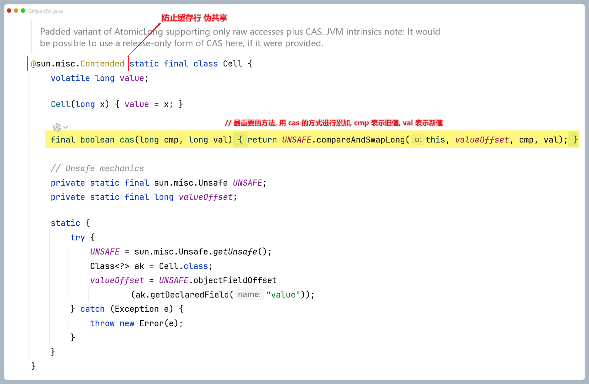

> 背景知识：cpu与缓存
>
> 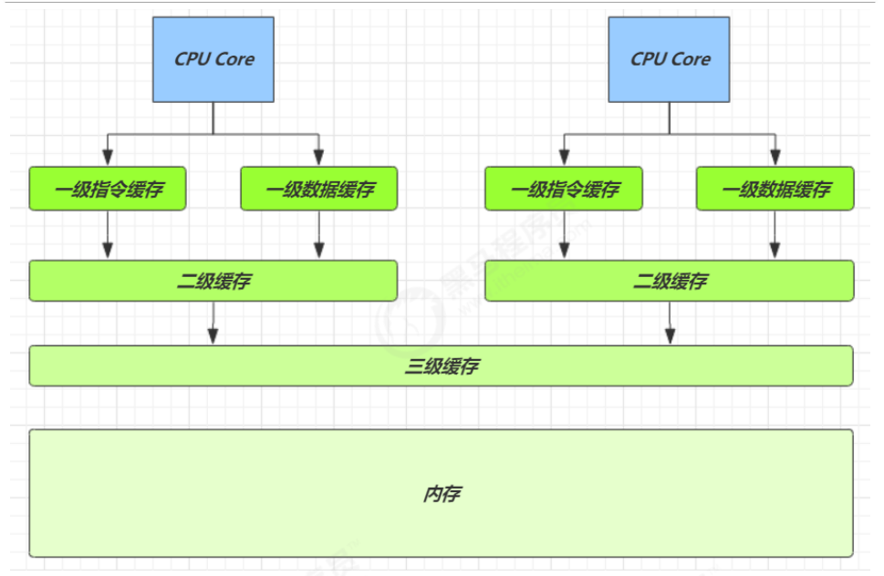
>
> 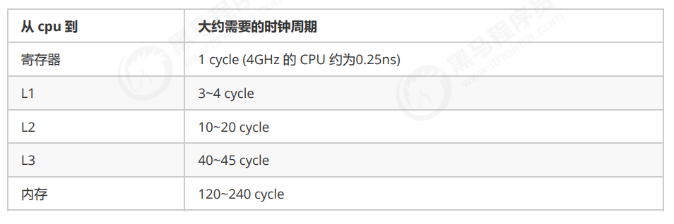
>
> 因为 CPU 与 内存的速度差异很大，需要靠预读数据至缓存来提升效率。 
>
> 而<u>缓存以缓存行为单位</u>，<u>每个缓存行对应着一块内存</u>，一般是 64 byte（8 个 long） 
>
> **缓存的加入会造成数据副本的产生，即同一份数据会缓存在不同核心的缓存行中** 
>
> <u>CPU 要保证数据的一致性，如果某个 CPU 核心更改了数据，其它 CPU 核心对应的整个缓存行必须失效</u>
>
> 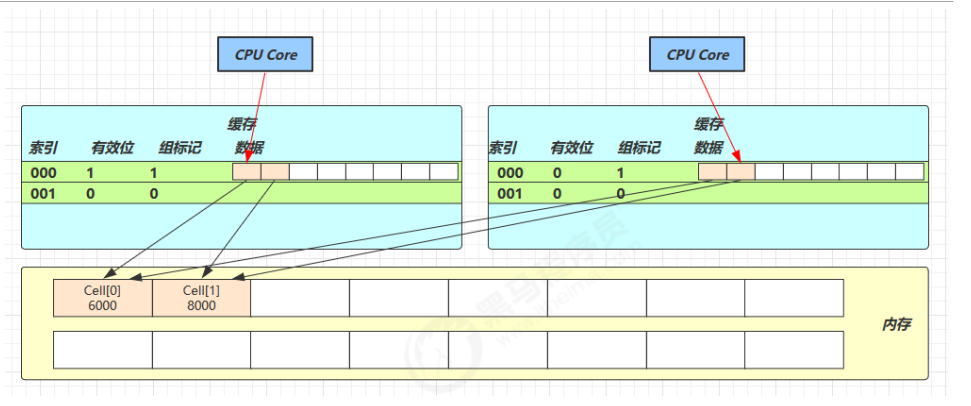


因为 Cell 是数组形式，在内存中是连续存储的，一个 Cell 为 24 字节（16 字节的对象头和 8 字节的 value），<u>因此缓存行可以存下 2 个的 Cell 对象</u>。这样问题来了： 

* Core-0 要修改 Cell[0] 
* Core-1 要修改 Cell[1]

<u>无论谁修改成功，都会导致对方 Core 的缓存行失效</u>，比如 Core-0 中 `Cell[0]=6000, Cell[1]=8000` 要累加 `Cell[0]=6001, Cell[1]=8000` ，这时会让 Core-1 的缓存行失效

**@sun.misc.Contended** 用来解决这个问题，它的原理是**在使用此注解的对象或字段的前后各增加 128 字节大小的 padding**，<u>从而让 CPU 将对象预读至缓存时占用不同的缓存行，这样，不会造成对方缓存行的失效</u>

> 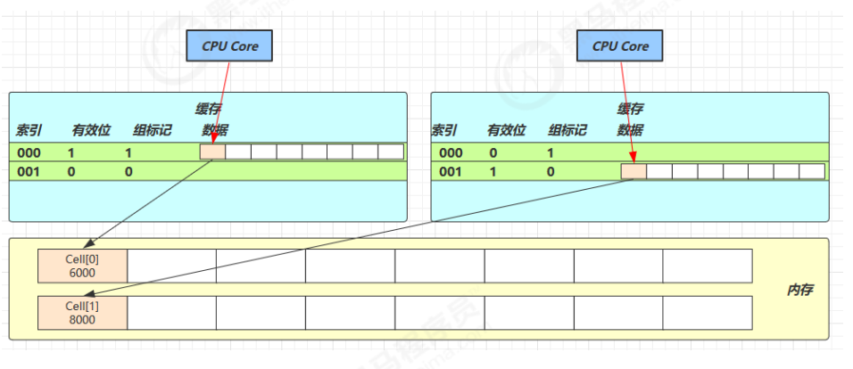

##### 源码

**累加操作主要调用的方法：**

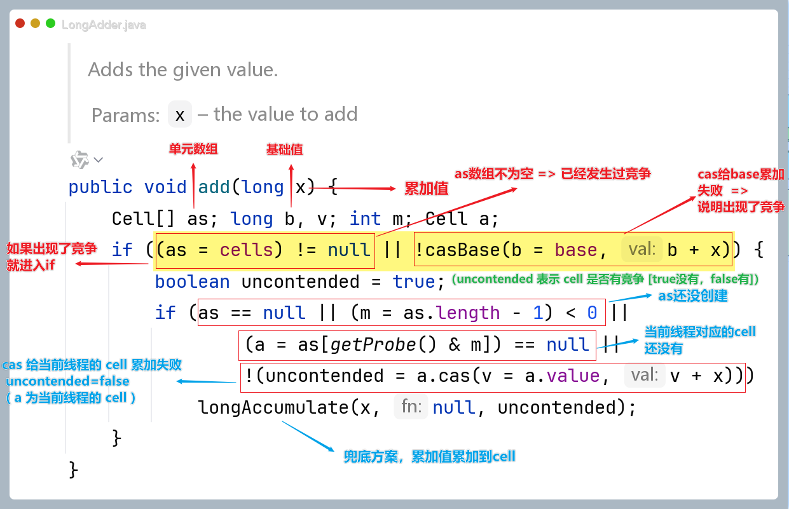

* 第一个if条件中，如果没有竞争会在`casBase(b = base, b+x)`这里直接完成累加操作

流程图

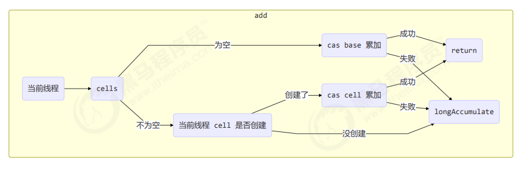

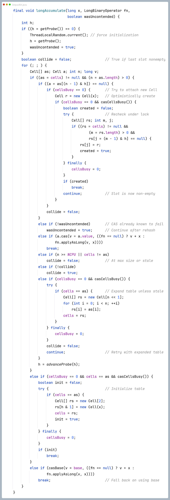

> 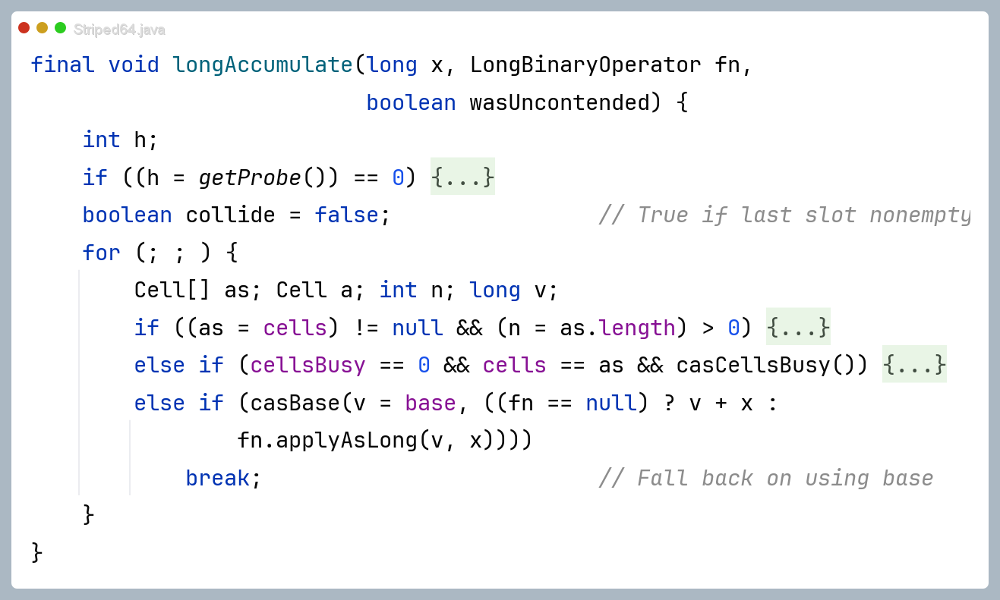
>
> [06.024-LongAdder源码-longAccumulate-cell未创建_哔哩哔哩_bilibili](https://www.bilibili.com/video/BV16J411h7Rd?spm_id_from=333.788.player.switch&vd_source=67ef3bb4c8d68a96408acdaa865b1313&p=181)
>
> 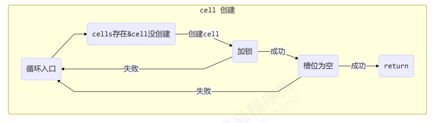
>
> 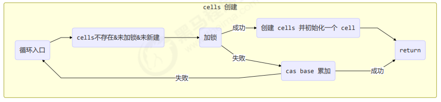
>
> 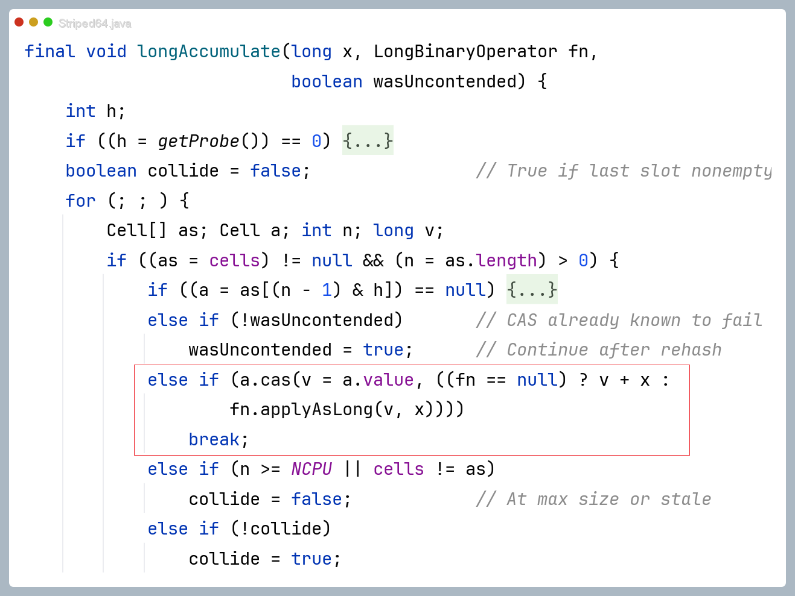
>
> 每个线程刚进入 longAccumulate 时，会尝试对应一个 cell 对象（找到一个坑位）
>
> 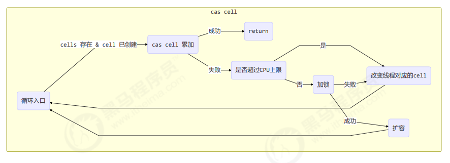
>
> ```java
> final void longAccumulate(long x, LongBinaryOperator fn,boolean wasUncontended) {
>     int h;
>     // 当前线程还没有对应的 cell, 需要随机生成一个 h 值用来将当前线程绑定到 cell
>     if ((h = getProbe()) == 0) {
>         // 初始化 probe
>         ThreadLocalRandom.current();
>         // h 对应新的 probe 值, 用来对应 cell
>         h = getProbe();
>         wasUncontended = true;
>     }
>     // collide 为 true 表示需要扩容
>     boolean collide = false;
>     for (;;) {
>         Cell[] as; Cell a; int n; long v;
>         // 已经有了 cells
>         if ((as = cells) != null && (n = as.length) > 0) {
>             // 还没有 cell
>             if ((a = as[(n - 1) & h]) == null) {
>                 // 为 cellsBusy 加锁, 创建 cell, cell 的初始累加值为 x
>                 // 成功则 break, 否则继续 continue 循环
>             }
>             // 有竞争, 改变线程对应的 cell 来重试 cas
>             else if (!wasUncontended)
>                 wasUncontended = true;
>             // cas 尝试累加, fn 配合 LongAccumulator 不为 null, 配合 LongAdder 为 null
>             else if (a.cas(v = a.value, ((fn == null) ? v + x : fn.applyAsLong(v, x))))
>                 break;
>             // 如果 cells 长度已经超过了最大长度, 或者已经扩容, 改变线程对应的 cell 来重试 cas
>             else if (n >= NCPU || cells != as)
>                 collide = false;
>  // 确保 collide 为 false 进入此分支, 就不会进入下面的 else if 进行扩容了
>             else if (!collide)
>                 collide = true;
>             // 加锁
>             else if (cellsBusy == 0 && casCellsBusy()) {
>                 // 加锁成功, 扩容
>                 continue;
>             }
>             // 改变线程对应的 cell
>             h = advanceProbe(h);
>         }
>         // 还没有 cells, 尝试给 cellsBusy 加锁
>         else if (cellsBusy == 0 && cells == as && casCellsBusy()) {
>             // 加锁成功, 初始化 cells, 最开始长度为 2, 并填充一个 cell
>             // 成功则 break;
>         }
>         // 上两种情况失败, 尝试给 base 累加
>         else if (casBase(v = base, ((fn == null) ? v + x : fn.applyAsLong(v, x))))
>             break;
>     }
> }
> 
> ```
>
> 


获取最终结果通过 sum 方法

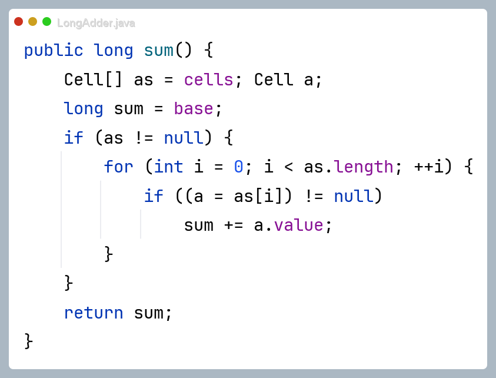


### Unsafe类

**概述**

Unsafe 对象提供了非常底层的，<u>操作内存、线程的方法</u>，Unsafe 对象不能直接调用，只能通过反射获得

> 
>
> 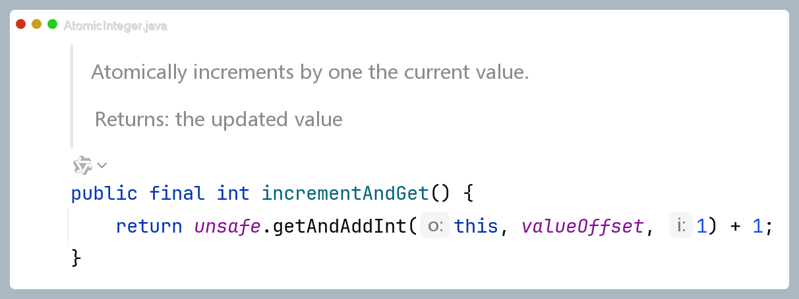
>
> 很多源码底层调用了unsafe对象的方法
>
> 
>
> 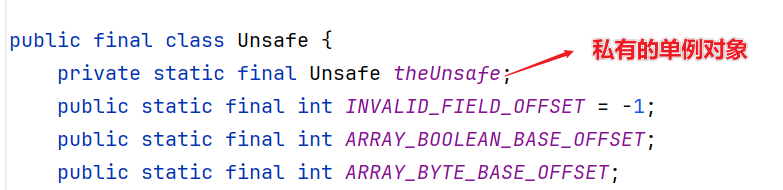

```java
public class UnsafeAccessor {
    static Unsafe unsafe;
    static {
        try {
            Field theUnsafe = Unsafe.class.getDeclaredField("theUnsafe");
            theUnsafe.setAccessible(true);
            unsafe = (Unsafe) theUnsafe.get(null);
        } catch (NoSuchFieldException | IllegalAccessException e) {
            throw new Error(e);
        }
    }
    static Unsafe getUnsafe() {
        return unsafe;
    }
}

```

> jdk可以直接`Unsafe.getUnsafe`获得这个单例对象


**Unsafe 和 CAS 相关的方法**

```java
@Data
class Student {
    volatile int id;
    volatile String name;
}

```


```java
Unsafe unsafe = UnsafeAccessor.getUnsafe();
Field id = Student.class.getDeclaredField("id");
Field name = Student.class.getDeclaredField("name");
// 获得成员变量的偏移量
long idOffset = UnsafeAccessor.unsafe.objectFieldOffset(id);
long nameOffset = UnsafeAccessor.unsafe.objectFieldOffset(name);
Student student = new Student();

// 使用 cas 方法替换成员变量的值
UnsafeAccessor.unsafe.compareAndSwapInt(student, idOffset, 0, 20); // 返回 true [比较并交换整型]
UnsafeAccessor.unsafe.compareAndSwapObject(student, nameOffset, null, "张三"); // 返回 true  [比较并交换引用地址]
System.out.println(student);
```

> 底层通过偏移量定位到属性，定位到之后使用cas方法执行比较并交换的操作

输出

```
Student(id=20, name=张三) 
```


使用自定义的 AtomicData 实现之前线程安全的**原子整数** Account **实现**

> 原子类的底层实现 ⬇️

```java
class AtomicData {
    private volatile int value;
    static final Unsafe unsafe;
    static final long Value_OFFSET;
    static {
        unsafe = UnsafeAccessor.getUnsafe();
        try {
            // value 属性在 DataContainer 对象中的偏移量，用于 Unsafe 直接访问该属性
            Value_OFFSET = unsafe.objectFieldOffset(AtomicData.class.getDeclaredField("value"));
        } catch (NoSuchFieldException e) {
            throw new Error(e);
        }
    }
    
    public AtomicData(int value) {
        this.value = value;
    }
    public void decrease(int amount) {
        int oldValue;
        while(true) {
            // 获取共享变量旧值，可以在这一行加入断点，修改 value 调试来加深理解
            oldValue = value;
            // cas 尝试修改 value 为 旧值 + amount，如果期间旧值被别的线程改了，返回 false
            if (unsafe.compareAndSwapInt(this, Value_OFFSET, oldValue, oldValue - amount)) {
                return;
            }
        }
    }
    public int getData() {
        return value;
    }
}
```

Account 实现

```java
Account.demo(new Account() {
    AtomicData atomicData = new AtomicData(10000);
    @Override
    public Integer getBalance() {
        return atomicData.getData();
    }
    @Override
    public void withdraw(Integer amount) {
        atomicData.decrease(amount);
    }
});
```


# 共享模型-不可变

* 不可变类的使用
* 不可变类设计
* 无状态类设计


## 日期转换问题


```java
SimpleDateFormat sdf = new SimpleDateFormat("yyyy-MM-dd");
for (int i = 0; i < 10; i++) {
    new Thread(() -> {
        try {
            log.debug("{}", sdf.parse("1951-04-21"));
        } catch (Exception e) {
            log.error("{}", e);
        }
    }).start();
}
```


这段代码在运行时，由于 SimpleDateFormat 不是线程安全的，有很大几率出现 java.lang.NumberFormatException 或者出现不正确的日期解析结果，例如：

```
19:10:40.859 [Thread-2] c.TestDateParse - {}
java.lang.NumberFormatException: For input string: ""
         at java.lang.NumberFormatException.forInputString(NumberFormatException.java:65)
         at java.lang.Long.parseLong(Long.java:601)
         at java.lang.Long.parseLong(Long.java:631)
         at java.text.DigitList.getLong(DigitList.java:195)
         at java.text.DecimalFormat.parse(DecimalFormat.java:2084)
         at java.text.SimpleDateFormat.subParse(SimpleDateFormat.java:2162)
         at java.text.SimpleDateFormat.parse(SimpleDateFormat.java:1514)
         at java.text.DateFormat.parse(DateFormat.java:364)
         at cn.itcast.n7.TestDateParse.lambda$test1$0(TestDateParse.java:18)
         at java.lang.Thread.run(Thread.java:748)
19:10:40.859 [Thread-1] c.TestDateParse - {}
java.lang.NumberFormatException: empty String
         at sun.misc.FloatingDecimal.readJavaFormatString(FloatingDecimal.java:1842)
         at sun.misc.FloatingDecimal.parseDouble(FloatingDecimal.java:110)
         at java.lang.Double.parseDouble(Double.java:538)
         at java.text.DigitList.getDouble(DigitList.java:169)
         at java.text.DecimalFormat.parse(DecimalFormat.java:2089)
         at java.text.SimpleDateFormat.subParse(SimpleDateFormat.java:2162)
         at java.text.SimpleDateFormat.parse(SimpleDateFormat.java:1514)
         at java.text.DateFormat.parse(DateFormat.java:364)
         at cn.itcast.n7.TestDateParse.lambda$test1$0(TestDateParse.java:18)
         at java.lang.Thread.run(Thread.java:748)
19:10:40.857 [Thread-8] c.TestDateParse - Sat Apr 21 00:00:00 CST 1951
19:10:40.857 [Thread-9] c.TestDateParse - Sat Apr 21 00:00:00 CST 1951
19:10:40.857 [Thread-6] c.TestDateParse - Sat Apr 21 00:00:00 CST 1951
19:10:40.857 [Thread-4] c.TestDateParse - Sat Apr 21 00:00:00 CST 1951
19:10:40.857 [Thread-5] c.TestDateParse - Mon Apr 21 00:00:00 CST 178960645
19:10:40.857 [Thread-0] c.TestDateParse - Sat Apr 21 00:00:00 CST 1951
19:10:40.857 [Thread-7] c.TestDateParse - Sat Apr 21 00:00:00 CST 1951
19:10:40.857 [Thread-3] c.TestDateParse - Sat Apr 21 00:00:00 CST 1951 

```


**解决-同步锁**

```java
SimpleDateFormat sdf = new SimpleDateFormat("yyyy-MM-dd");
for (int i = 0; i < 50; i++) {
    new Thread(() -> {
        synchronized (sdf) {
            try {
                log.debug("{}", sdf.parse("1951-04-21"));
            } catch (Exception e) {
                log.error("{}", e);
            }
        }
    }).start();
}
```

这样虽能解决问题，但带来的是性能上的损失，并不算很好


**解决-不可变**

如果一个对象在不能够修改其内部状态（属性），那么它就是线程安全的，因为不存在并发修改啊！这样的对象在 Java 中有很多，例如在 Java 8 后，提供了一个新的日期格式化类：

```java
DateTimeFormatter dtf = DateTimeFormatter.ofPattern("yyyy-MM-dd");
for (int i = 0; i < 10; i++) {
    new Thread(() -> {
        LocalDate date = dtf.parse("2018-10-01", LocalDate::from);
        log.debug("{}", date);
    }).start();
}

```

可以看 **DateTimeFormatter** 的文档

```java
@implSpec
This class is immutable and thread-safe. 
```

不可变对象，实际是另一种避免竞争的方式


## “不可变“的设计

以不可变类 String 为例，说明一下不可变设计的要素

```java
public final class String
    implements java.io.Serializable, Comparable<String>, CharSequence {
    /** The value is used for character storage. */
    private final char value[];
    /** Cache the hash code for the string */
    private int hash; // Default to 0

    // ...

}
```


**1.final的使用**

不可变类、类中所有属性都是 final 的

* 属性用 final 修饰保证了该属性是只读的，不能修改 
* 类用 final 修饰保证了该类中的方法不能被覆盖，防止子类无意间破坏不可变性


> #### final原理
>
> **1.设置 final 变量的原理**
>
> ```java
> public class TestFinal {
>     final int a = 20;
> }
> ```
>
> 字节码
>
> ```cmd
> 0: aload_0
> 1: invokespecial #1 // Method java/lang/Object."<init>":()V
> 4: aload_0
> 5: bipush 20
> 7: putfield #2 // Field a:I
>  <-- 写屏障
> 10: return
> ```
>
> （参考volatile）发现 final 变量的赋值也会通过 putfield 指令来完成，同样在这条指令之后也会加入写屏障，保证在其它线程读到 它的值时不会出现为 0 的情况
>
> **2.获取 final 变量的原理**
>
> [07.010-final-原理_哔哩哔哩_bilibili](https://www.bilibili.com/video/BV16J411h7Rd?spm_id_from=333.788.player.switch&vd_source=67ef3bb4c8d68a96408acdaa865b1313&p=197)
>
> 


**2.保护性拷贝**

但使用字符串时，也有一些跟修改相关的方法（如 substring），其内部是调用 String 的构造方法创建了一个新字符串

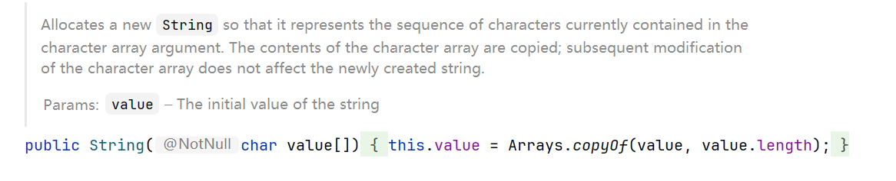

```java
public String substring(int beginIndex) {
    if (beginIndex < 0) {
        throw new StringIndexOutOfBoundsException(beginIndex);
    }
    int subLen = value.length - beginIndex;
    if (subLen < 0) {
        throw new StringIndexOutOfBoundsException(subLen);
    }
    return (beginIndex == 0) ? this : new String(value, beginIndex, subLen);
}
```

```java
public String(char value[], int offset, int count) {
    if (offset < 0) {
        throw new StringIndexOutOfBoundsException(offset);
    }
    if (count <= 0) {
        if (count < 0) {
            throw new StringIndexOutOfBoundsException(count);
        }
        if (offset <= value.length) {
            this.value = "".value;
            return;
        }
    }
    if (offset > value.length - count) {
        throw new StringIndexOutOfBoundsException(offset + count);
    }
    this.value = Arrays.copyOfRange(value, offset, offset+count);
}

```

结果发现也没有，构造新字符串对象时，会生成新的 char[] value，对内容进行复制 。这种通过创建副本对象来避 免共享的手段称之为【保护性拷贝（defensive copy）】

> 带来的问题
>
> * 对象创建太频繁，对象个数多
>
> 解决方案：[设计模式之享元模式](##)


## 无状态

设计 Servlet 时为了保证其线程安全，都会有这样的建议，不要为 Servlet 设置成员变量，这 种没有任何成员变量的类是线程安全的

> 因为成员变量保存的数据也可以称为状态信息，因此没有成员变量就称之为【无状态】


# 并发工具


## 线程池


### 线程池基础


**必会： 线程池：三大方法、7大参数、4种拒绝策略**

线程池：三大方式、七大参数、四种拒绝策略

> 池化技术：事先准备好资源
>
> 线程池、JDBC的连接池、内存池、对象池 等等。


**池化技术**：事先准备好一些资源，如果有人要用，就来我这里拿，用完之后还给我，以此来提高效率。

#### 线程池作用：

1、降低资源的消耗；

> 资源的创建、销毁十分消耗资源
>

2、提高响应的速度；

3、方便管理；


**线程复用、可以控制最大并发数、管理线程；**


### ThreadPoolExecutor

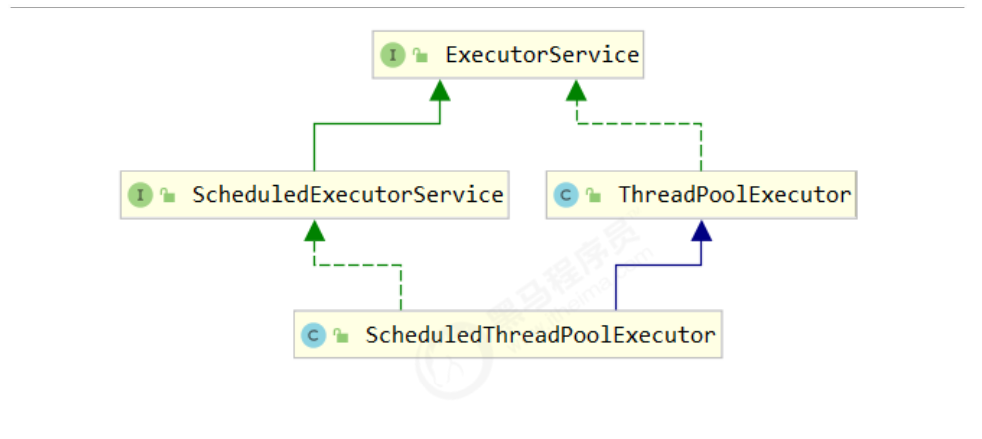


#### **1.线程池状态**


ThreadPoolExecutor 使用 int 的<u>高 3 位来表示线程池状态</u>，<u>低 29 位表示线程数量</u>

| 状态名     | 高三位 | 接收新任务 | 处理阻塞队列任务 | 说明                                                     |
| ---------- | ------ | ---------- | ---------------- | -------------------------------------------------------- |
| RUNNING    | 111    | Y          | Y                |                                                          |
| SHUTDOWN   | 000    | N          | Y                | (比较温和的停止)不会接收新任务，但会处理阻塞队列剩余任务 |
| STOP       | 001    | N          | N                | (比较粗暴的停止)会中断正在执行的任务，并抛弃阻塞队列任务 |
| TIDYING    | 010    | -          | -                | 任务全执行完毕，活动线程为 0 ，即将进入终结              |
| TERMINATED | 011    | -          | -                | 终结状态                                                 |


> 从数字上比较，TERMINATED > TIDYING > STOP > SHUTDOWN > RUNNING
>
> 这些信息存储在一个原子变量 ctl 中，目的是将线程池状态与线程个数合二为一，这样就可以用一次 cas 原子操作 进行赋值
>
> ```java
> // c 为旧值， ctlOf 返回结果为新值
> ctl.compareAndSet(c, ctlOf(targetState, workerCountOf(c))));
> // rs(running state) 为高 3 位代表线程池状态， wc(working count) 为低 29 位代表线程个数，ctl 是合并它们
> private static int ctlOf(int rs, int wc) { return rs | wc; }
> ```
>
> 


#### **2.构造方法(七大参数)**

```java
// 本质: 都是调用ThreadPoolExecutor（）

//【七大参数】
public ThreadPoolExecutor(int corePoolSize, // 核心线程池大小
                 int maximumPoolSize,  // 最大核心线程池大小
                 long keepAliveTime, // 存活时间（如果存活时间之内没有调用就会被释放）
                    TimeUnit unit, // 超时单位
                    BlockingQueue<Runnable> workQueue,// 阻塞队列
                    ThreadFactory threadFactory,// 线程工厂：创建线程的，一般不用动
                 RejectedExecutionHandler handler// 拒绝策略
                 ) {
    if (corePoolSize < 0 ||
        maximumPoolSize <= 0 ||
        maximumPoolSize < corePoolSize ||
        keepAliveTime < 0)
        throw new IllegalArgumentException();
    if (workQueue == null || threadFactory == null || handler == null)
        throw new NullPointerException();
    this.acc = System.getSecurityManager() == null ?
        null :
    AccessController.getContext();
    this.corePoolSize = corePoolSize;
    this.maximumPoolSize = maximumPoolSize;
    this.workQueue = workQueue;
    this.keepAliveTime = unit.toNanos(keepAliveTime);
    this.threadFactory = threadFactory;
    this.handler = handler;
}
```

* corePoolSize 核心线程数目 (最多保留的线程数) 
* maximumPoolSize 最大线程数目 
* keepAliveTime 生存时间 - 针对救急线程 
* unit 时间单位 - 针对救急线程 
* workQueue 阻塞队列 
* threadFactory 线程工厂 - 可以为线程创建时起个好名字 
* handler 拒绝策略


#### **3.工作方式**


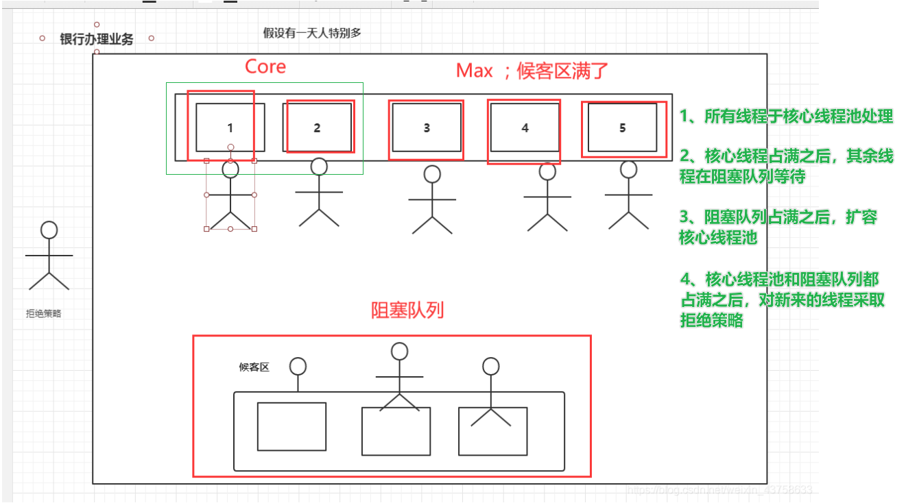

阻塞队列满了的时候，才会触发最大连接数

* 线程池中刚开始没有线程，当一个任务提交给线程池后，线程池会创建一个新线程来执行任务。 
* 当线程数达到 corePoolSize 并 没有线程空闲，这时再加入任务，新加的任务会被加入workQueue 队列排队，直到有空闲的线程。 
  * **如果队列选择了有界队列**，那么<u>任务超过了队列大小时</u>，会<u>创建 maximumPoolSize - corePoolSize 数目的线程来救急</u>。 
* 如果线程到达 maximumPoolSize 仍然有新任务这时会执行拒绝策略。拒绝策略 jdk 提供了 4 种实现，其它 著名框架也提供了实现 
  * jdk中的实现
    * AbortPolicy 让调用者抛出 RejectedExecutionException 异常，这是默认策略
    * CallerRunsPolicy 让调用者运行任务 
    * DiscardPolicy 放弃本次任务 
    * DiscardOldestPolicy 放弃队列中最早的任务，本任务取而代之 
  * Dubbo 的实现，在抛出 RejectedExecutionException 异常之前会记录日志，并 dump 线程栈信息，方便定位问题 
  * Netty 的实现：创建一个新线程 来执行 
  * ActiveMQ 的实现：带超时等待（60s）尝试放入队列(60s的尝试时间，60s后失败)，类似我们之前自定义的拒绝策略 
  * PinPoint 的实现：它使用了一个拒绝策略链，会<u>逐一尝试策略链中每种拒绝策略</u>

* 当高峰过去后，超过corePoolSize 的救急线程如果一段时间没有任务做，需要结束节省资源，这个时间由 keepAliveTime 和 unit 来控制。

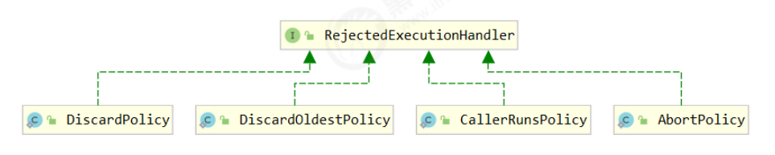

根据这个构造方法，JDK Executors 类中提供了众多工厂方法来创建各种用途的线程池


#### ==线程池的正确使用方式==

> <u>阿里巴巴开发规范</u>：
>
> 
>
> Executors是jdk提供的工具类，里面有很多工厂方法能创造各种线程池

```java
package com.zzy.pool;

import java.util.concurrent.*;

//Executors 工具类， 3大方法
// Executors 工具类、3大方法

/**
 * new ThreadPoolExecutor.AbortPolicy() // 银行满了，还有人进来，不处理这个人的，抛出异常
 * new ThreadPoolExecutor.CallerRunsPolicy() // 哪来的去哪里 
 * new ThreadPoolExecutor.DiscardPolicy() //队列满了，丢掉任务，不会抛出异常 
 * new ThreadPoolExecutor.DiscardOldestPolicy() //队列满了，尝试去和最早的竞争，也不会抛出异常 
 */
public class Demo01 {
    public static void main(String[] args) {
        // 自定义线程池 工作 ThreadPoolExecutor
        ExecutorService threadPool = new ThreadPoolExecutor(
            	2,// 核心线程数
                5,// 最大核心线程数
                3, // 存活时间
            	TimeUnit.SECONDS,// 存活时间单位
                new LinkedBlockingDeque<>(3),// 
                Executors.defaultThreadFactory(),// 线程工厂（使用默认线程工厂）
                new ThreadPoolExecutor.AbortPolicy()// 拒绝策略
            // 银行人满了，还有人进来，不处理这个人，抛出异常
        );

        try {
            // 最大承载：Deque + max
            // 超过 抛出异常： RejectedExecutionException
            for (int i = 1; i <= 8; i++) {
                // 使用了线程池之后，使用线程池来创建线程
                threadPool.execute(() -> {
                    System.out.println(Thread.currentThread().getName() + "  OK");
                });
            }
        } catch (Exception e) {
            e.printStackTrace();
        } finally {
            // 线程池用完，程序结束，关闭线程池
            threadPool.shutdown();
        }
    }
}
```


##### 其他使用方式

> #### 线程池：三大方法
>


**newSingleThreadExecutor**

```java
ExecutorService threadPool = Executors.();//单个线程
```

```java
public static ExecutorService newSingleThreadExecutor() {
    return new FinalizableDelegatedExecutorService
        (new ThreadPoolExecutor(1, 1,
                                0L, TimeUnit.MILLISECONDS,
                                new LinkedBlockingQueue<Runnable>()));
}
```

使用场景： 

希望多个任务排队执行。线程数固定为 1，任务数多于 1 时，会放入无界队列排队。任务执行完毕，这唯一的线程 也不会被释放。 

**区别**：

* 自己创建一个单线程串行执行任务，如果任务执行失败而终止那么没有任何补救措施；而线程池还会新建一 个线程，保证池的正常工作 
* `Executors.newSingleThreadExecutor()` <u>线程个数始终为1</u>，不能修改 
  * `FinalizableDelegatedExecutorService` 应用的是装饰器模式，只对外暴露了 `ExecutorService` 接口，因此不能调用 `ThreadPoolExecutor` 中特有的方法 
* `Executors.newFixedThreadPool(1)` 初始时为1，以后还可以修改 
  * 对外暴露的是 `ThreadPoolExecutor` 对象，可以强转后调用 `setCorePoolSize` 等方法进行修改


**newFixedThreadPool**

```java
ExecutorService threadPool2 = Executors.newFixedThreadPool(5); //创建一个固定大小的线程池
```

```java
public static ExecutorService newFixedThreadPool(int nThreads) {
    return new ThreadPoolExecutor(nThreads, nThreads,
                                  0L, TimeUnit.MILLISECONDS,
                                  new LinkedBlockingQueue<Runnable>());
}
```

特点 

* 核心线程数 == 最大线程数（没有救急线程被创建），因此也无需超时时间 
* 阻塞队列是无界的(`LinkedBlockingQueue`)，可以放任意数量的任务

—— **适用于<u>任务量已知</u>，<u>相对耗时</u>的任务**


**newCachedThreadPool**

```java
ExecutorService threadPool3 = Executors.newCachedThreadPool(); //可伸缩的线程池
```

```java
public static ExecutorService newCachedThreadPool() {
    return new ThreadPoolExecutor(0, Integer.MAX_VALUE,
                                  60L, TimeUnit.SECONDS,
                                  new SynchronousQueue<Runnable>());
}
```

特点

* 核心线程数是 0， 最大线程数是 Integer.MAX_VALUE，救急线程的空闲生存时间是 60s，意味着 

  * <u>全部都是救急线程（60s 后可以回收）</u>
  * 救急线程可以无限创建

* 队列采用了 SynchronousQueue 实现特点是，**它没有容量**，没有线程来取是放不进去的（一手交钱、一手交货）

  > 如果没有线程来取，put操作就会被阻塞  直到有线程来取

* 整个线程池表现为线程数会根据任务量不断增长，没有上限，当任务执行完毕，空闲1分钟后释放线 程。 

—— **适合<u>任务数比较密集</u>，但每个任务执行时间较短的情况**

> 如果任务执行时间不短，线程数不断增加 容易OOM


**使用**

```java
package com.zzy.pool;

import java.util.concurrent.ExecutorService;
import java.util.concurrent.Executors;

//Executors 工具类， 3大方法
public class Demo01 {
    public static void main(String[] args) {
        ExecutorService threadPool = Executors.newSingleThreadExecutor();//单个线程
//        ExecutorService threadPool = Executors.newFixedThreadPool(5);//创建一个固定大小的线程池
//        ExecutorService threadPool = Executors.newCachedThreadPool();//创建一个可伸缩的线程池【不推荐使用这种方式创建，最大线程数量过大 可能导致OOM】

        try {
            for (int i = 0; i < 10; i++) {
                // 旧方式：new Thread().start();

                // 使用线程池来创建线程
                threadPool.execute(() -> {
                    System.out.println(Thread.currentThread().getName() + "  OK");
                });
            }
        } catch (Exception e) {
            e.printStackTrace();
        } finally {
            // 线程池用完，程序结束，关闭线程池
            threadPool.shutdown();
        }
    }
}
```

> #### 运行结果：
>
> **newSingleThreadExecutor（）**
> 
> **newFixedThreadPool(5)**
>
> 
>
> **newCachedThreadPool()**
>
> 


**三者本质上都是调用`ThreadPoolExecutor`**

> 源码分析
>
> 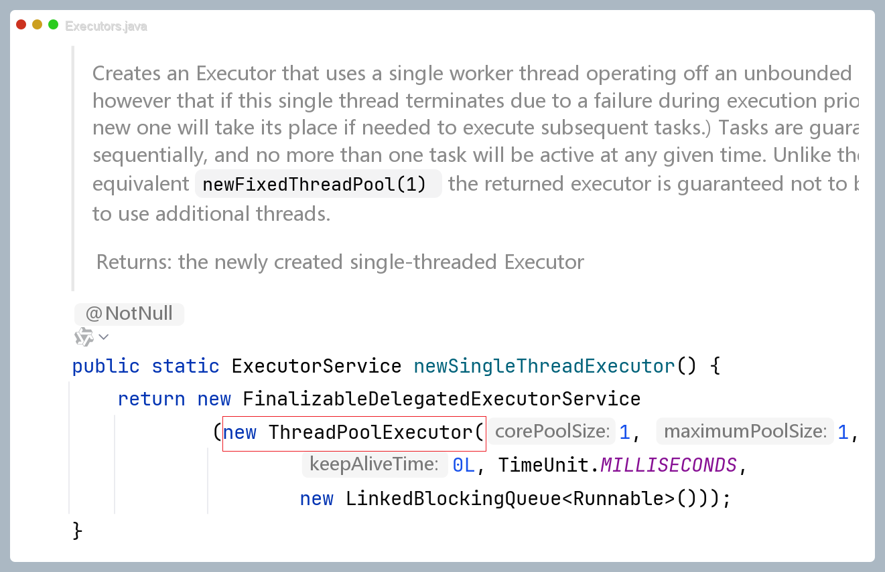
>
> 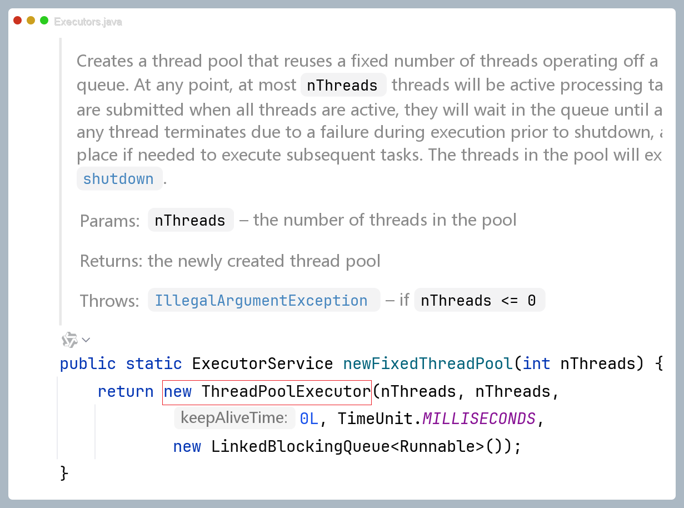
>
> 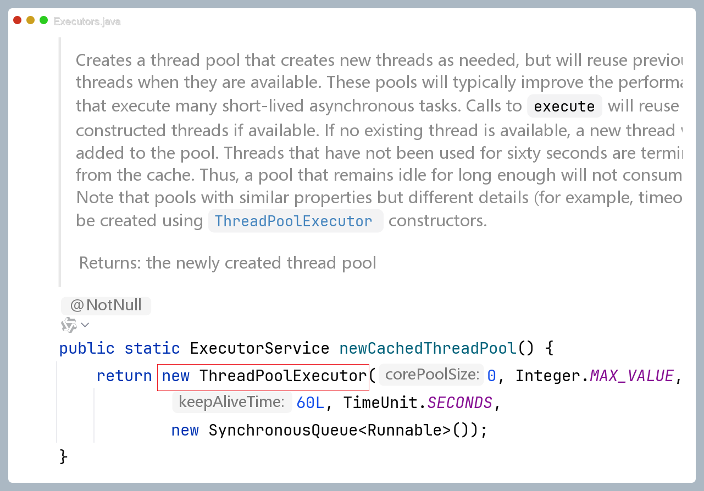
>
> 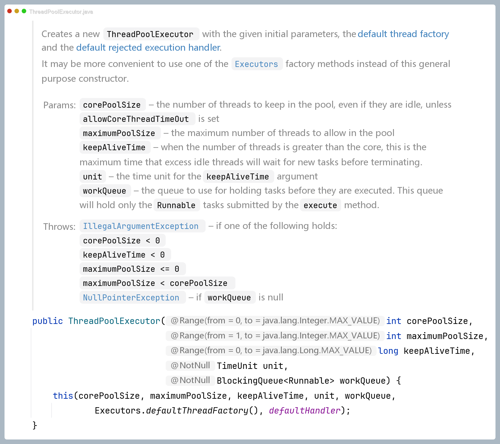

```java
public static ExecutorService newSingleThreadExecutor() {
 return new FinalizableDelegatedExecutorService
     (new ThreadPoolExecutor(1, 1,
                             0L, TimeUnit.MILLISECONDS,
                             new LinkedBlockingQueue<Runnable>()));
}

public static ExecutorService newFixedThreadPool(int nThreads) {
 return new ThreadPoolExecutor(nThreads, nThreads,
                               0L, TimeUnit.MILLISECONDS,
                               new LinkedBlockingQueue<Runnable>());
}

public static ExecutorService newCachedThreadPool() {
 return new ThreadPoolExecutor(0, Integer.MAX_VALUE,// 21亿
                               60L, TimeUnit.SECONDS,
                               new SynchronousQueue<Runnable>());
}
```


##### 提交任务方法

```java
// 执行任务
void execute(Runnable command);

// 提交任务 task，用返回值 Future 获得任务执行结果
<T> Future<T> submit(Callable<T> task);

// 提交 tasks 中所有任务
<T> List<Future<T>> invokeAll(Collection<? extends Callable<T>> tasks)
    throws InterruptedException;

// 提交 tasks 中所有任务，带超时时间
<T> List<Future<T>> invokeAll(Collection<? extends Callable<T>> tasks, long timeout, TimeUnit unit)
    throws InterruptedException;

// 提交 tasks 中所有任务，哪个任务先成功执行完毕，返回此任务执行结果，其它任务取消
<T> T invokeAny(Collection<? extends Callable<T>> tasks)
    throws InterruptedException,ExecutionException;

// 提交 tasks 中所有任务，哪个任务先成功执行完毕，返回此任务执行结果，其它任务取消，带超时时间
<T> T invokeAny(Collection<? extends Callable<T>> tasks,
                long timeout, TimeUnit unit)
    throws InterruptedException, ExecutionException, TimeoutException;
```


**使用**

任务对象提交给线程池

用future方法获得执行结果

```java
@Slf4j(topic = "c.TestSubmit")
public class TestSubmit {

    public static void main(String[] args) throws ExecutionException, InterruptedException {
        ExecutorService pool = Executors.newFixedThreadPool(1);
        method1(pool)
    }

    private static void method3(ExecutorService pool) throws InterruptedException, ExecutionException {
        String result = pool.invokeAny(Arrays.asList(
                () -> {
                    log.debug("begin 1");
                    Thread.sleep(1000);
                    log.debug("end 1");
                    return "1";
                },
                () -> {
                    log.debug("begin 2");
                    Thread.sleep(500);
                    log.debug("end 2");
                    return "2";
                },
                () -> {
                    log.debug("begin 3");
                    Thread.sleep(2000);
                    log.debug("end 3");
                    return "3";
                }
        ));
        log.debug("{}", result);
    }

    private static void method2(ExecutorService pool) throws InterruptedException {
        List<Future<String>> futures = pool.invokeAll(Arrays.asList(
                () -> {
                    log.debug("begin");
                    Thread.sleep(1000);
                    return "1";
                },
                () -> {
                    log.debug("begin");
                    Thread.sleep(500);
                    return "2";
                },
                () -> {
                    log.debug("begin");
                    Thread.sleep(2000);
                    return "3";
                }
        ));

        futures.forEach( f ->  {
            try {
                log.debug("{}", f.get());
            } catch (InterruptedException | ExecutionException e) {
                e.printStackTrace();
            }
        });
    }

    private static void method1(ExecutorService pool) throws InterruptedException, ExecutionException {
        Future<String> future = pool.submit(() -> {
            log.debug("running");
            Thread.sleep(1000);
            return "ok";
        });

        log.debug("{}", future.get());
    }
}

```


##### 关闭线程池方法

**shutdown**

```java
/*
线程池状态变为 SHUTDOWN
- 不会接收新任务
- 但已提交任务会执行完
- 此方法不会阻塞调用线程的执行
*/
void shutdown();
```

```java
public void shutdown() {
    final ReentrantLock mainLock = this.mainLock;
    mainLock.lock();
    try {
        checkShutdownAccess();
        // 修改线程池状态
        advanceRunState(SHUTDOWN);
        // 仅会打断空闲线程
        interruptIdleWorkers();
        onShutdown(); // 扩展点 ScheduledThreadPoolExecutor
    } finally {
        mainLock.unlock();
    }
    // 尝试终结(没有运行的线程可以立刻终结，如果还有运行的线程也不会等)
    tryTerminate();
}
```


**shutdownNow**

```java
/*
线程池状态变为 STOP
 - 不会接收新任务
 - 会将队列中的任务返回
 - 并用 interrupt 的方式中断正在执行的任务
*/
List<Runnable> shutdownNow();
```

```java
public List<Runnable> shutdownNow() {
List<Runnable> tasks;
    final ReentrantLock mainLock = this.mainLock;
    mainLock.lock();
    try {
        checkShutdownAccess();
        // 修改线程池状态
        advanceRunState(STOP);
        // 打断所有线程
        interruptWorkers();
        // 获取队列中剩余任务
        tasks = drainQueue();
    } finally {
        mainLock.unlock();
    }
    // 尝试终结
    tryTerminate();
    return tasks;
}

```


其它方法

```java
// 不在 RUNNING 状态的线程池，此方法就返回 true
boolean isShutdown();

// 线程池状态是否是 TERMINATED
boolean isTerminated();

// 调用 shutdown 后，由于调用线程并不会等待所有任务运行结束，因此如果它想在线程池 TERMINATED 后做些事情，可以利用此方法等待
boolean awaitTermination(long timeout, TimeUnit unit) throws InterruptedException;

```


#### 拒绝策略详解


1. **AbortPolicy（中止策略）——`new ThreadPoolExecutor.AbortPolicy() `**
   - 默认策略。
   - 直接抛出 `RejectedExecutionException` 异常，通知调用者任务被拒绝。
   - 适用于<u>对任务丢失敏感、希望及时感知异常</u>的场景。
2. **CallerRunsPolicy（调用者运行策略）——`new ThreadPoolExecutor.CallerRunsPolicy() `**
   - 由提交任务的线程（即调用 `execute()` 的线程）直接执行该任务。
   - 不会丢弃任务，也不会抛异常，但可能降低新任务提交的速度（起到“反馈抑制”作用）。
   - 适用于希望任务最终都能被执行，且能容忍主线程阻塞的场景。
3. **DiscardPolicy（丢弃策略）——`new ThreadPoolExecutor.DiscardPolicy() `**
   - <u>静默丢弃</u>被拒绝的任务，<u>不抛异常、不执行</u>。
   - 适用于<u>允许任务丢失、且不希望影响系统稳定性</u>的场景。
4. **DiscardOldestPolicy（丢弃最旧策略）——`new ThreadPoolExecutor.DiscardOldestPolicy() `**
   - <u>丢弃任务队列中最老（即将被执行）的任务</u>，然后尝试重新提交当前任务。
   - 可能导致某些任务永远无法执行（如持续高负载时），但保留了最新任务。
   - 适用于<u>更关注最新任务价值的场景</u>。

> 注意：这些策略只在使用有界队列（如 `ArrayBlockingQueue`）且线程数达到上限时才会触发。若使用无界队列（如 `LinkedBlockingQueue`），一般不会触发拒绝策略（除非内存耗尽）


### ScheduledExecutorService


* `ScheduledExecutorService` 新增了任务调度功能，可以用来执行定时任务


```java
ScheduledExecutorService executor = Executors.newScheduledThreadPool(2);
// 添加两个任务，希望它们都在 1s 后执行
executor.schedule(() -> {
    System.out.println("任务1，执行时间：" + new Date());
    try { Thread.sleep(2000); } catch (InterruptedException e) { }
}, 1000, TimeUnit.MILLISECONDS);
executor.schedule(() -> {
    System.out.println("任务2，执行时间：" + new Date());
}, 1000, TimeUnit.MILLISECONDS);

```

输出

```
任务1，执行时间：Thu Jan 03 12:45:17 CST 2019
任务2，执行时间：Thu Jan 03 12:45:17 CST 2019 
```


任务阻塞或报异常不会影响其他线程

以固定速率执行任务：

```java
ScheduledExecutorService pool = Executors.newScheduledThreadPool(1);
log.debug("start...");
pool.scheduleAtFixedRate(() -> {
    log.debug("running...");
}, 1, 1, TimeUnit.SECONDS);// 任务，初始延时，时间间隔，时间单位
```

输出

```
21:45:43.167 c.TestTimer [main] - start...
21:45:44.215 c.TestTimer [pool-1-thread-1] - running...
21:45:45.215 c.TestTimer [pool-1-thread-1] - running...
21:45:46.215 c.TestTimer [pool-1-thread-1] - running...
21:45:47.215 c.TestTimer [pool-1-thread-1] - running... 
```

> 如果任务执行时间超过了间隔时间：
>
> ```java
> ScheduledExecutorService pool = Executors.newScheduledThreadPool(1);
> log.debug("start...");
> pool.scheduleAtFixedRate(() -> {
>     log.debug("running...");
>     sleep(2);
> }, 1, 1, TimeUnit.SECONDS);
> ```
>
> 输出分析：一开始，延时 1s，接下来，由于任务执行时间 > 间隔时间，间隔被『撑』到了 2s
>
> ```
> 21:44:30.311 c.TestTimer [main] - start...
> 21:44:31.360 c.TestTimer [pool-1-thread-1] - running...
> 21:44:33.361 c.TestTimer [pool-1-thread-1] - running...
> 21:44:35.362 c.TestTimer [pool-1-thread-1] - running...
> 21:44:37.362 c.TestTimer [pool-1-thread-1] - running... 
> ```
>
> 


```java
ScheduledExecutorService pool = Executors.newScheduledThreadPool(1);
log.debug("start...");
pool.scheduleWithFixedDelay(()-> {
    log.debug("running...");
    sleep(2);
}, 1, 1, TimeUnit.SECONDS);

```

输出分析：一开始，延时 1s，scheduleWithFixedDelay 的间隔是 上一个任务结束 <-> 延时 <-> 下一个任务开始 所 以间隔都是 3s

```
21:40:55.078 c.TestTimer [main] - start...
21:40:56.140 c.TestTimer [pool-1-thread-1] - running...
21:40:59.143 c.TestTimer [pool-1-thread-1] - running...
21:41:02.145 c.TestTimer [pool-1-thread-1] - running...
21:41:05.147 c.TestTimer [pool-1-thread-1] - running... 
```


> 线程数固定，任务数多于线程数时，会放入无界队列排队。任务执行完毕，这些线 程也不会被释放。用来执行延迟或反复执行的任务
>


### 正确处理异常

方法1：主动捉异常

```java
ExecutorService pool = Executors.newFixedThreadPool(1);
pool.submit(() -> {
   try {
       log.debug("task1");
       int i = 1 / 0;
   } catch (Exception e) {
       log.error("error:", e);
   }
});
```

输出

```
21:59:04.558 c.TestTimer [pool-1-thread-1] - task1
21:59:04.562 c.TestTimer [pool-1-thread-1] - error:
java.lang.ArithmeticException: / by zero
 at cn.itcast.n8.TestTimer.lambda$main$0(TestTimer.java:28)
 at java.util.concurrent.Executors$RunnableAdapter.call(Executors.java:511)
 at java.util.concurrent.FutureTask.run(FutureTask.java:266)
 at java.util.concurrent.ThreadPoolExecutor.runWorker(ThreadPoolExecutor.java:1149)
 at java.util.concurrent.ThreadPoolExecutor$Worker.run(ThreadPoolExecutor.java:624)
 at java.lang.Thread.run(Thread.java:748)
```


方法2：使用 Future

```java
ExecutorService pool = Executors.newFixedThreadPool(1);
Future<Boolean> f = pool.submit(() -> {
    log.debug("task1");
    int i = 1 / 0;
    return true;
});
log.debug("result:{}", f.get());
```

输出

```
21:54:58.208 c.TestTimer [pool-1-thread-1] - task1
Exception in thread "main" java.util.concurrent.ExecutionException:
java.lang.ArithmeticException: / by zero
         at java.util.concurrent.FutureTask.report(FutureTask.java:122)
         at java.util.concurrent.FutureTask.get(FutureTask.java:192)
         at cn.itcast.n8.TestTimer.main(TestTimer.java:31)
Caused by: java.lang.ArithmeticException: / by zero
         at cn.itcast.n8.TestTimer.lambda$main$0(TestTimer.java:28)
         at java.util.concurrent.FutureTask.run(FutureTask.java:266)
         at java.util.concurrent.ThreadPoolExecutor.runWorker(ThreadPoolExecutor.java:1149)
         at java.util.concurrent.ThreadPoolExecutor$Worker.run(ThreadPoolExecutor.java:624)
         at java.lang.Thread.run(Thread.java:748) 

```


### Tomcat中的线程池

Tomcat 在哪里用到了线程池呢

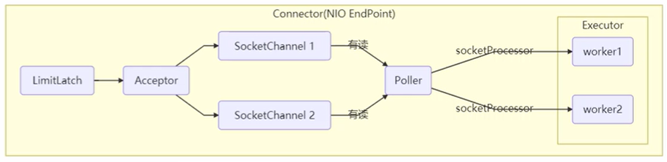

* LimitLatch 用来限流，可以控制最大连接个数，类似 J.U.C 中的 Semaphore
* Acceptor 只负责【接收新的 socket 连接】 
* Poller 只负责监听 socket channel 是否有【可读的 I/O 事件】 
* 一旦可读，封装一个任务对象（socketProcessor），提交给 
* Executor 线程池处理 Executor 线程池中的工作线程**最终负责【处理请求】**


Tomcat 线程池扩展了 ThreadPoolExecutor，行为稍有不同 

* 如果总线程数达到 maximumPoolSize 
  * 这时不会立刻抛 RejectedExecutionException 异常 
  * 而是**再次尝试将任务放入队列，如果还失败，才抛出 RejectedExecutionException 异常**

> ```java
> public void execute(Runnable command, long timeout, TimeUnit unit) {
>     submittedCount.incrementAndGet();
>     try {
>         super.execute(command);
>     } catch (RejectedExecutionException rx) {
>         if (super.getQueue() instanceof TaskQueue) {
>             final TaskQueue queue = (TaskQueue)super.getQueue();
>             try {
>                 if (!queue.force(command, timeout, unit)) {
>                     submittedCount.decrementAndGet();
>                     throw new RejectedExecutionException("Queue capacity is full.");
>                 }
>             } catch (InterruptedException x) {
>                 submittedCount.decrementAndGet();
>                 Thread.interrupted();
>                 throw new RejectedExecutionException(x);
>             }
>         } else {
>             submittedCount.decrementAndGet();
>             throw rx;
>         }
>     }
> }
> 
> ```
>
> ```java
> public boolean force(Runnable o, long timeout, TimeUnit unit) throws InterruptedException {
>     if ( parent.isShutdown() )
>         throw new RejectedExecutionException(
>         "Executor not running, can't force a command into the queue"
>     );
>     return super.offer(o,timeout,unit); //forces the item onto the queue, to be used if the taskis rejected
> }
> 
> ```
>
> 


Connector 相关配置

| 配置项                | 默认值 | 说明                                   |                                                     |
| --------------------- | ------ | -------------------------------------- | --------------------------------------------------- |
| `acceptorThreadCount` | 1      | acceptor 线程数量                      | 一个线程接收连接就行                                |
| `pollerThreadCount`   | 1      | poller 线程数量                        | 采用多路复用思想，一个线程就能接收多个channel的事件 |
| `minSpareThreads`     | 10     | 核心线程数，即corePoolSize             |                                                     |
| `maxThreads`          | 200    | 最大线程数，即 maximumPoolSize         |                                                     |
| `executor`            | -      | Executor 名称，用来引用下面的 Executor | 可以自定义线程池的详细参数                          |


Executor 线程配置

| 配置项                    | 默认值                                 | 说明                                    |
| ------------------------- | -------------------------------------- | --------------------------------------- |
| `threadPriority`          | 5                                      | 线程优先级                              |
| `daemon`                  | true                                   | 是否守护线程                            |
| `minSpareThreads`         | 25                                     | 核心线程数，即 corePoolSize             |
| `maxThreads`              | 200                                    | 最大线程数，即 maximumPoolSize          |
| `maxIdleTime`             | 60000                                  | 线程生存时间，单位是毫秒，默认值即1分钟 |
| `maxQueueSize`            | `Integer.MAX_VALUE` （相当于无界队列） | 队列长度                                |
| `prestartminSpareThreads` | false                                  | 核心线程是否在服务器启动时启动          |

如果提交任务数小于核心线程 或者 大于最大线程数就加入队列

如果`核心线程< 提交任务数 < 最大线程数` 就直接创建救急线程执行

> 普通救急线程的创建是在阻塞队列满的时候触发（不会在超过核心线程数之后就触发）

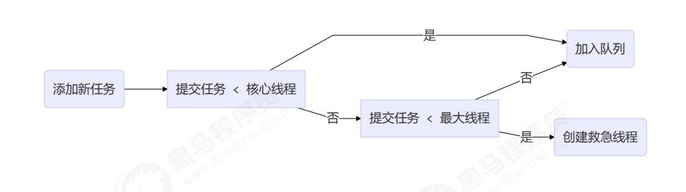


### Fork / Join 线程池


**1.概念** 

Fork/Join 是 JDK 1.7 加入的新的线程池实现，它体现的是一种**分治思想**，适用于<u>能够进行任务拆分的 cpu 密集型 运算</u>

所谓的任务拆分，<u>是将一个大任务拆分为算法上相同的小任务，直至不能拆分可以直接求解</u>

跟递归相关的一些计 算，如归并排序、斐波那契数列、都可以用分治思想进行求解 

Fork/Join **在分治的基础上加入了多线程**，可以把每个**任务的分解和合并交给不同的线程来完成**，进一步提升了运 算效率 

Fork/Join 默认会创建与 cpu 核心数大小相同的线程池

**2.使用**

提交给 Fork/Join 线程池的任务需要继承 RecursiveTask（有返回值）或 RecursiveAction（没有返回值），例如下 面定义了一个对 1~n 之间的整数求和的任务

```java
package cn.itcast.n8;

import lombok.extern.slf4j.Slf4j;

import java.util.concurrent.ForkJoinPool;
import java.util.concurrent.RecursiveTask;

public class TestForkJoin {

    public static void main(String[] args) {
        ForkJoinPool pool = new ForkJoinPool(4);
        // 提交任务对象给 ForkJoinPool 来执行
//        System.out.println(pool.invoke(new AddTask1(5)));
        System.out.println(pool.invoke(new AddTask3(1, 5)));
    }
}

@Slf4j(topic = "c.AddTask")
class AddTask1 extends RecursiveTask<Integer> {

    int n;

    public AddTask1(int n) {
        this.n = n;
    }

    @Override
    public String toString() {
        return "{" + n + '}';
    }

    @Override
    protected Integer compute() { // 计算1-n之间整数的和
        // 需要注意的是 Fork/Join 线程池不适合这种需要等待子步骤的任务，这里只是演示
        if (n == 1) {
            log.debug("join() {}", n);
            return n;
        }
        AddTask1 t1 = new AddTask1(n - 1);

        t1.fork(); // 把子任务交给一个线程执行
        log.debug("fork() {} + {}", n, t1);
        int result = n + t1.join(); // join()方法获取这个子任务的执行结果
        log.debug("join() {} + {} = {}", n, t1, result);
        return result;
    }
}

@Slf4j(topic = "c.AddTask")
class AddTask2 extends RecursiveTask<Integer> {

    int begin;
    int end;

    public AddTask2(int begin, int end) {
        this.begin = begin;
        this.end = end;
    }

    @Override
    public String toString() {
        return "{" + begin + "," + end + '}';
    }

    @Override
    protected Integer compute() {
        if (begin == end) {
            log.debug("join() {}", begin);
            return begin;
        }
        if (end - begin == 1) {
            log.debug("join() {} + {} = {}", begin, end, end + begin);
            return end + begin;
        }
        int mid = (end + begin) / 2;

        AddTask2 t1 = new AddTask2(begin, mid - 1);
        t1.fork();
        AddTask2 t2 = new AddTask2(mid + 1, end);
        t2.fork();
        log.debug("fork() {} + {} + {} = ?", mid, t1, t2);

        int result = mid + t1.join() + t2.join();
        log.debug("join() {} + {} + {} = {}", mid, t1, t2, result);
        return result;
    }
}

// 思路3
@Slf4j(topic = "c.AddTask")
class AddTask3 extends RecursiveTask<Integer> {
    int begin;
    int end;

    public AddTask3(int begin, int end) {
        this.begin = begin;
        this.end = end;
    }

    @Override
    public String toString() {
        return "{" + begin + "," + end + '}';
    }

    @Override
    protected Integer compute() {
        if (begin == end) {
            log.debug("join() {}", begin);
            return begin;
        }
        if (end - begin == 1) {
            log.debug("join() {} + {} = {}", begin, end, end + begin);
            return end + begin;
        }
        int mid = (end + begin) / 2;

        AddTask3 t1 = new AddTask3(begin, mid);
        t1.fork();
        AddTask3 t2 = new AddTask3(mid + 1, end);
        t2.fork();
        log.debug("fork() {} + {} = ?", t1, t2);

        int result = t1.join() + t2.join();
        log.debug("join() {} + {} = {}", t1, t2, result);
        return result;
    }
}

```

> 思路一
>
> 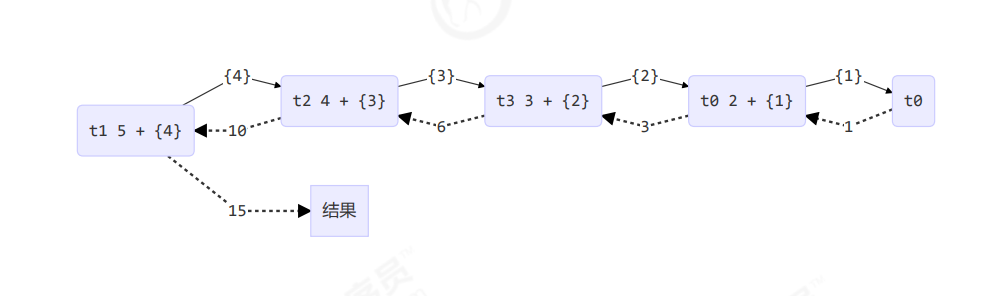
>
> 思路三
>
> 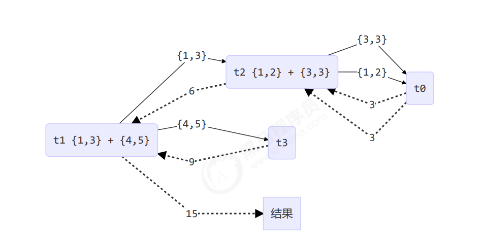
>
> 


### ==手写线程池==

[08.002-自定义线程池-阻塞队列_哔哩哔哩_bilibili](https://www.bilibili.com/video/BV16J411h7Rd?spm_id_from=333.788.player.switch&vd_source=67ef3bb4c8d68a96408acdaa865b1313&p=200)


步骤1：自定义拒绝策略接口

```java
@FunctionalInterface // 拒绝策略
interface RejectPolicy<T> {
    void reject(BlockingQueue<T> queue, T task);
}
```

步骤2：自定义任务队列

> 阻塞队列：平衡消费者线程和生产者线程的桥梁

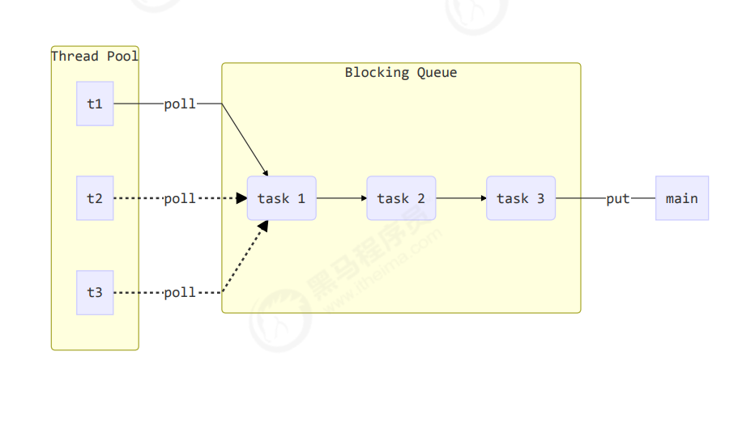

```java
class BlockingQueue<T> {
    // 1. 任务队列(双向队列)
    private Deque<T> queue = new ArrayDeque<>();
    // 2. 锁(保证头部元素只被一个线程获取)
    private ReentrantLock lock = new ReentrantLock();
    // 3. 生产者条件变量(让生产者被阻塞的时候，进入队列等待)
    private Condition fullWaitSet = lock.newCondition();
    // 4. 消费者条件变量
    private Condition emptyWaitSet = lock.newCondition();
    // 5. 容量
    private int capcity;
    public BlockingQueue(int capcity) {
        this.capcity = capcity;
    }
    // 带超时阻塞获取
    public T poll(long timeout, TimeUnit unit) {
        lock.lock();
        try {
            // 将 timeout 统一转换为 纳秒
            long nanos = unit.toNanos(timeout);
            while (queue.isEmpty()) {
                try {
                    // 返回值是剩余时间
                    if (nanos <= 0) {
                        return null;
                    }
                    nanos = emptyWaitSet.awaitNanos(nanos);
                } catch (InterruptedException e) {
                    e.printStackTrace();
                }
            }
            T t = queue.removeFirst();
            fullWaitSet.signal();
            return t;
        } finally {
            lock.unlock();
        }
    }
    // 阻塞获取
    public T take() {
        lock.lock();
        try {
            while (queue.isEmpty()) {
                try {
                    emptyWaitSet.await();// 队列为空，阻塞获取操作
                } catch (InterruptedException e) {
                    e.printStackTrace();
                }
            }
            T t = queue.removeFirst(); // 获取头部元素
            fullWaitSet.signal(); // 每次获取完元素之后(一定有空位)，通知 fullWaitSet 里面的线程——可以执行添加操作了
            return t;
        } finally {
            lock.unlock();
        }
    }
    // 阻塞添加
    public void put(T task) {
        lock.lock();
        try {
            while (queue.size() == capcity) {
                try {
                    log.debug("等待加入任务队列 {} ...", task);
                    fullWaitSet.await(); // 队列满了，阻塞添加操作
                } catch (InterruptedException e) {
                    e.printStackTrace();
                }
            }
            log.debug("加入任务队列 {}", task);
            queue.addLast(task);
            emptyWaitSet.signal();
        } finally {
            lock.unlock();
        }
    }
    
    // 带超时时间的阻塞添加
    public boolean offer(T task, long timeout, TimeUnit timeUnit) {
        lock.lock();
        try {
            long nanos = timeUnit.toNanos(timeout);
            while (queue.size() == capcity) {
                try {
                    if(nanos <= 0) {
                        return false;
                    }
                    log.debug("等待加入任务队列 {} ...", task);
                    nanos = fullWaitSet.awaitNanos(nanos);// 把nacos更新为 剩余等待时间(虚假唤醒之后只需要等待 剩余的时间)
                } catch (InterruptedException e) {
                    e.printStackTrace();
                }
            }
            log.debug("加入任务队列 {}", task);
            queue.addLast(task);
            emptyWaitSet.signal();
            return true; 
        } finally {
            lock.unlock();
        }
    }
    
    public int size() {
        lock.lock();
        try {
            return queue.size();
        } finally {
            lock.unlock();
        }
    }
    public void tryPut(RejectPolicy<T> rejectPolicy, T task) {
        lock.lock();
        try {
            // 判断队列是否满
            if(queue.size() == capcity) {
                rejectPolicy.reject(this, task);
 } else { // 有空闲
                log.debug("加入任务队列 {}", task);
                queue.addLast(task);
                emptyWaitSet.signal();
            }
        } finally {
            lock.unlock();
        }
    }
}
```

步骤3：自定义线程池

 ```java
 class ThreadPool {
     // 任务队列
     private BlockingQueue<Runnable> taskQueue;
 
     // 线程集合
     private HashSet<Worker> workers = new HashSet<>();
 
     // 核心线程数
     private int coreSize;
 
     // 获取任务时的超时时间
     private long timeout;
 
     private TimeUnit timeUnit;
 
     private RejectPolicy<Runnable> rejectPolicy;
 
     // 执行任务
     public void execute(Runnable task) {
         // 当任务数没有超过 coreSize 时，直接交给 worker 对象执行
         // 如果任务数超过 coreSize 时，加入任务队列暂存
         synchronized (workers) {
             if(workers.size() < coreSize) {
                 Worker worker = new Worker(task);
                 log.debug("新增 worker{}, {}", worker, task);
                 workers.add(worker);
                 worker.start();
             } else {
 //                taskQueue.put(task);
                 // 1) 死等
                 // 2) 带超时等待
                 // 3) 让调用者放弃任务执行
                 // 4) 让调用者抛出异常
                 // 5) 让调用者自己执行任务
                 taskQueue.tryPut(rejectPolicy, task);
             }
         }
     }
 
     public ThreadPool(int coreSize, long timeout, TimeUnit timeUnit, int queueCapcity, RejectPolicy<Runnable> rejectPolicy) {
         this.coreSize = coreSize;
         this.timeout = timeout;
         this.timeUnit = timeUnit;
         this.taskQueue = new BlockingQueue<>(queueCapcity);
         this.rejectPolicy = rejectPolicy;
     }
 
     class Worker extends Thread{
         private Runnable task;
 
         public Worker(Runnable task) {
             this.task = task;
         }
 
         @Override
         public void run() {
             // 执行任务
             // 1) 当 task 不为空，执行任务
             // 2) 当 task 执行完毕，再接着从任务队列获取任务并执行
 //            while(task != null || (task = taskQueue.take()) != null) {
             while(task != null || (task = taskQueue.poll(timeout, timeUnit)) != null) {
                 try {
                     log.debug("正在执行...{}", task);
                     task.run();
                 } catch (Exception e) {
                     e.printStackTrace();
                 } finally {
                     task = null;
                 }
             }
             synchronized (workers) {
                 log.debug("worker 被移除{}", this);
                 workers.remove(this);
             }
         }
     }
 }
 ```

* 生产者任务交给线程池
  * 线程池如果没有线程就创建线程
  * 线程池已满，就把任务放到阻塞队列

步骤4：测试

```java
public class TestPool {
    public static void main(String[] args) {
        ThreadPool threadPool = new ThreadPool(1,
                1000, TimeUnit.MILLISECONDS, 1, (queue, task)->{
            // 1. 死等
//            queue.put(task);
            // 2) 带超时等待
//            queue.offer(task, 1500, TimeUnit.MILLISECONDS);
            // 3) 让调用者放弃任务执行
//            log.debug("放弃{}", task);
            // 4) 让调用者抛出异常
//            throw new RuntimeException("任务执行失败 " + task);
            // 5) 让调用者自己执行任务
            task.run();
        });
        for (int i = 0; i < 4; i++) {
            int j = i;
            threadPool.execute(() -> {
                try {
                    Thread.sleep(1000L);
                } catch (InterruptedException e) {
                    e.printStackTrace();
                }
                log.debug("{}", j);
            });
        }
    }
}
```


## ==<font color='blue'>* AQS 原理</font>==

> 很多并发工具都是依赖于AQS

### 概述

全称是 AbstractQueuedSynchronizer，是阻塞式锁和相关的同步器工具的框架

AQS全称翻译过来就是抽象的队列同步器，其他的同步器都是它的子类，都调用了这个父类里面相关的方法，<u>它实现的锁是这种阻塞式的锁，更加类似于synchronized。</u>


特点：   

- **用 state 属性来表示资源的状态**
  
  > 资源的状态分为独占模式和共享模式，独占模式只允许一个线程能够访问共享资源，共享模式允许多个线程能够访问资源，但是可能会提供一个访问的上限，比如允许十个线程访问共享资源，多的就不允许访问，这种就叫做共享模式；
  
  **子类需要定义如何维护这个状态**，控制如何获取锁和释放锁
  
  > 比如刚开始state等于0表示没有人占用这个锁，将来将state表示1就表示有线程来占用这个锁
  
  - getState - 获取 state 状态 
  
  - setState - 设置 state 状态 
  
  - compareAndSetState - 使用 cas 机制来设置 state 状态
  
    > 防止多个线程都来修改state状态时的线程安全问题，使用cas保证state变量的线程安全。
  
  - 独占模式是只有一个线程能够访问资源，而共享模式可以允许多个线程访问资源 
  
- 提供了基于 FIFO 先进先出的等待队列，

  > 比如有一个线程已经占用了这个独占锁了，那么其他的线程就只能等待，这个队列就是由AQS来维护的，这个等待队列类似于 Monitor 的 EntryList，只不过Monitor的EntryList是在c++的层面上来实现的，而AQS是纯java来实现的。

- 基于 条件变量 来实现 等待(wait)、唤醒(notify)机制，支持多个条件变量
  其中的一个条件变量类似于 Monitor 的 WaitSet。


**AQS如何使用？**

子类主要实现这样一些方法（默认抛出 UnsupportedOperationException），我们主要是使用下面的这些方法来实现一些功能。

- tryAcquire 
- tryRelease 
- tryAcquireShared 
- tryReleaseShared 
- isHeldExclusively

获取锁的方式

```java
// 如果获取锁失败
if (!tryAcquire(arg)) {
    // 进入等待队列进行等待, 阻塞当前线程，AQS里面让当前线程暂停 / 恢复运行用的是park()和unpark()方法
}
//tryAcquire()方法获取锁成功返回true，tryAcquire()方法获取锁失败返回false
```

释放锁的方式

```java
// 释放锁的方式就是tryRelease()方法，返回为真表示释放锁成功，否则就是没有成功
if (tryRelease(arg)) {
    // 让阻塞线程恢复运行
}
```


### 基于AQS实现不可重入锁 

```
不可重入锁的意思是：自己加的锁连自己也能挡住
```

代码演示

```java
/* 自定义锁(不可重入锁) */
/* 不可重入锁就是自己加的锁连自己也能挡住 */
class MyLock implements Lock {
    
    /*同步器类MySync，将来MyLock锁的大部分功能，都是下面的代码来完成的*/
    class MySync extends AbstractQueuedSynchronizer{
        /*尝试获取锁*/
        protected boolean tryAcquire(int arg){
            /*使用cas的方式保证state的修改是原子性的*/
            if(compareAndSetState(0, 1)){
                /*加上锁，并设置owner为当前线程*/
                setExclusiveOwnerThread(Thread.currentThread());
                return true;
            }
            /*表示加锁失败*/
            return false;
        }

        /*尝试释放锁*/
        protected boolean tryRelease(int arg){
            /*表示没有线程占用*/
            setExclusiveOwnerThread(null);
            /*状态改为0表示解锁*/
            setState(0);
            return true;
        }

        /*是否持有独占锁*/
        protected boolean isHeldExclusively(){
            /*持有锁表示state的值是1的时候表示持有锁*/
            return getState()==1;
        }
        public Condition newCondition(){
            return new ConditionObject();
        }
    }

    private MySync sync = new MySync();

    @Override  /* 加锁，尝试一次 不成功就会进入等待队列进行等待 */
    public void lock() {
        sync.acquire(1);
    }

    @Override  /* 加锁，其他线程可打断 */
    public void lockInterruptibly() throws InterruptedException {
        sync.acquireInterruptibly(1);
    }

    @Override  /* 尝试加锁，尝试几次 加锁不成功，就返回false，不会继续死等 */
    public boolean tryLock() {
        return sync.tryAcquire(1);
    }

    @Override
    public boolean tryLock(long time, TimeUnit unit) throws InterruptedException {
        return sync.tryAcquireNanos(1, unit.toNanos(time));
    }

    @Override
    public void unlock() {
        sync.release(1);
    }

    @Override
    public Condition newCondition() {
        return sync.newCondition();
    }
}

```

测试代码1

```java
@Slf4j(topic = "c.TestAqs")
public class TestAqs {
    /*测试代码，看下面的锁好不好用*/
    public static void main(String[] args) {
        MyLock lock = new MyLock();
        new Thread(()->{
            lock.lock();
            try {
                log.debug("t1加锁成功....");
                sleep(1);
            }finally {
                log.debug("t1解锁成功....");
                lock.unlock();
            }
        },"t1").start();

        new Thread(()->{
            lock.lock();
            try {
                log.debug("t2加锁成功....");
            }finally {
                log.debug("t2解锁成功....");
                lock.unlock();
            }
        },"t2").start();
    }
}

```

结果展示1

```java
14:56:30.734 c.TestAqs [t1] - t1加锁成功....
14:56:31.738 c.TestAqs [t1] - t1解锁成功....
14:56:31.738 c.TestAqs [t2] - t2加锁成功....
14:56:31.738 c.TestAqs [t2] - t2解锁成功....

```

测试代码2

```java
@Slf4j(topic = "c.TestAqs")
public class TestAqs {
    /*测试代码，看下面的锁好不好用*/
    public static void main(String[] args) {
        MyLock lock = new MyLock();
        new Thread(()->{
            lock.lock();
            System.out.println("第一次加锁成功");
            lock.lock();/*一个线程重复加锁*/
            System.out.println("第二次加锁成功");
            /*因为是不可重入锁，也就是一个线程加锁，下次同一个线程再次加锁的时候加不上锁，锁只能是加一次*/
            try {
                log.debug("t1加锁成功....");
                sleep(1);
            }finally {
                log.debug("t1解锁成功....");
                lock.unlock();
            }
        },"t1").start();
    }
}

```

结果展示2

```java
第一次加锁成功
//可以看到并没有打印第二次加锁成功的标识，是因为这个是不可重入锁
```

##### **目标**

AQS 要实现的功能目标

- 阻塞版本获取锁 acquire 和非阻塞的版本尝试获取锁 tryAcquire 
- 获取锁超时机制
- 通过打断取消机制 
- 独占机制及共享机制 
- 条件不满足时的等待机制

要实现的性能目标 

> Instead, the primary performance goal here is scalability: to predictably maintain efficiency even, or especially, when synchronizers are contended.

##### **设计**

 AQS 的基本思想其实很简单 

获取锁的逻辑

```java
while(state 状态不允许获取) {
    if(队列中还没有此线程) {
        入队并阻塞
    }
}
当前线程出队

```

释放锁的逻辑

```java
if(state 状态允许了) {
    恢复阻塞的线程(s)
}

```

要点 

- 原子维护 state 状态 
- 阻塞及恢复线程 
- 维护队列


1) state 设计 

   - state 使用 volatile 配合 cas 保证其修改时的原子性 
   - state 使用了 32bit int 来维护同步状态，因为当时使用 long 在很多平台下测试的结果并不理想 

2. 阻塞恢复设计 
   - 早期的控制线程暂停和恢复的 api 有 suspend 和 resume，但它们是不可用的，因为如果先调用的 resume  那么 suspend 将感知不到 
   - 解决方法是使用 park & unpark 来实现线程的暂停和恢复，具体原理在之前讲过了，先 unpark 再 park 也没 问题 
   - park & unpark 是针对线程的，而不是针对同步器的，因此控制粒度更为精细 
   - park 线程还可以通过 interrupt 打断 
3. 队列设计 
   - 使用了 FIFO 先入先出队列，并不支持优先级队列 
   - 设计时借鉴了 CLH 队列，它是一种单向无锁队列

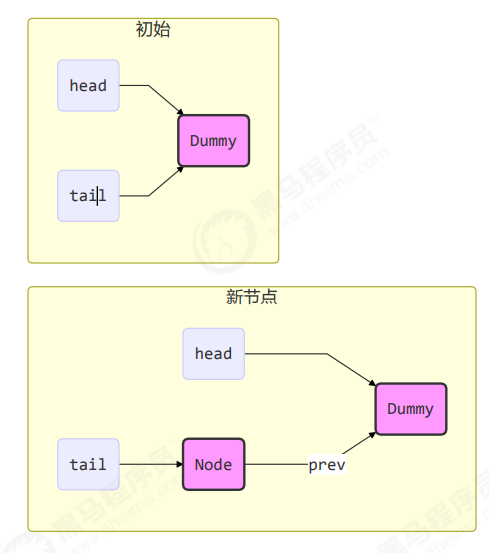

队列中有 head 和 tail 两个指针节点，都用 volatile 修饰配合 cas 使用，每个节点有 state 维护节点状态 入队伪代码，只需要考虑 tail 赋值的原子性

```java
do {
    // 原来的 tail
    Node prev = tail;
    // 用 cas 在原来 tail 的基础上改为 node
} while(tail.compareAndSet(prev, node))

```

出队伪代码

```java
// prev 是上一个节点
while((Node prev=node.prev).state != 唤醒状态) {
}
// 设置头节点
head = node;

```

CLH 好处： 

- 无锁，使用自旋
- 快速，无阻塞

AQS 在一些方面改进了 CLH

```java
private Node enq(final Node node) {
    for (;;) {
        Node t = tail;
        // 队列中还没有元素 tail 为 null
        if (t == null) {
            // 将 head 从 null -> dummy
            if (compareAndSetHead(new Node()))
                tail = head;
        } else {
            // 将 node 的 prev 设置为原来的 tail
            node.prev = t;
            // 将 tail 从原来的 tail 设置为 node
            if (compareAndSetTail(t, node)) {
                // 原来 tail 的 next 设置为 node
                t.next = node;
                return t;
            }
        }
    }
}

```

##### 主要用到 AQS 的并发工具类

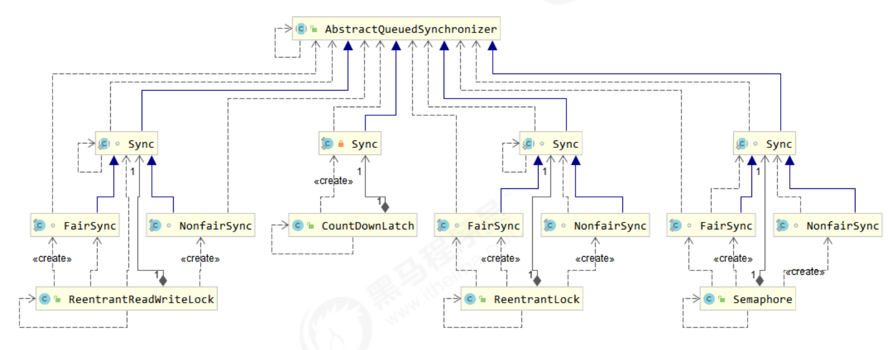


## ReentrantLock 原理

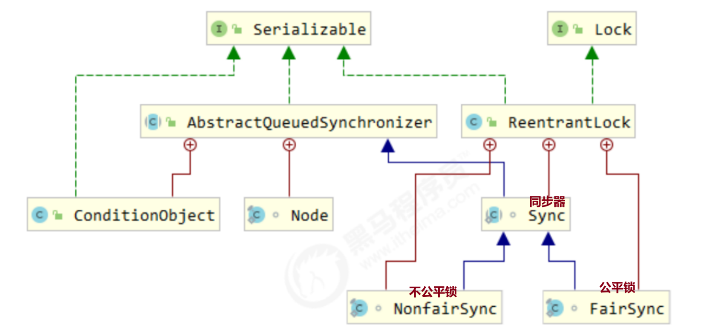

```
可以看出ReentrantLock下面有同步器，同步器下面有公平锁和非公平锁
```

### 非公平锁实现原理

下面看看非公平锁的加锁解锁流程

> 没有竞争时
>
> 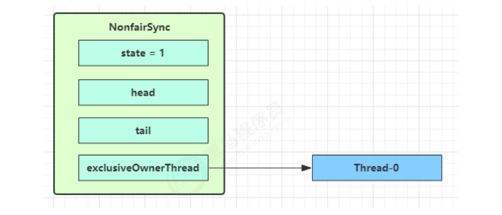
>
> 第一个竞争出现时
>
> 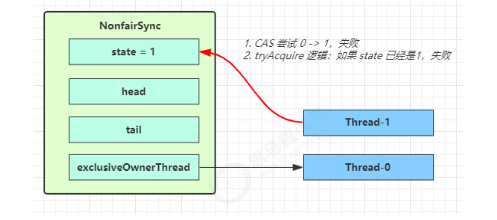
>
> Thread-1 执行逻辑： 
>
> 	1. CAS 尝试将 state 由 0 改为 1，结果失败 
> 	2. 进入 tryAcquire 逻辑，这时 state 已经是1，结果仍然失败 
> 	3. 接下来进入 addWaiter 逻辑，构造 Node 队列 
> 	* 图中黄色三角表示该 Node 的 waitStatus 状态，其中 0 为默认正常状态 
> 	* Node 的创建是懒惰的 
> 	* 其中第一个 Node 称为 Dummy（哑元）或哨兵，用来占位，并不关联线程
>
> 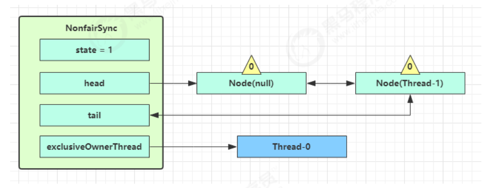
>
> 当前线程继续进入 acquireQueued 逻辑 
>
> 1. acquireQueued 会在一个死循环中不断尝试获得锁，失败后进入 park 阻塞 
> 2. 如果自己是紧邻着 head（排第二位），那么再次 tryAcquire 尝试获取锁，当然这时 state 仍为 1，失败 
> 3. 进入 shouldParkAfterFailedAcquire 逻辑，将前驱 node，即 head 的 waitStatus 改为 -1，这次返回 false
>
> 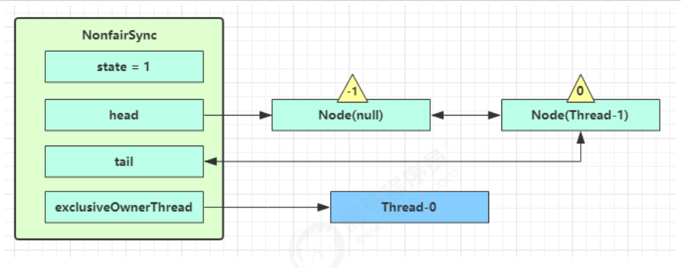
>
> 4. <u>shouldParkAfterFailedAcquire(返回false)</u> 执行完毕回到 acquireQueued ，**再次 tryAcquire 尝试获取锁**，当然这时 state 仍为 1，失败 
> 5. 当再次进入 shouldParkAfterFailedAcquire 时，这时因为其前驱 node 的 waitStatus 已经是 -1，这次返回 true 
> 6. 进入 parkAndCheckInterrupt， Thread-1 park（灰色表示）
>
> 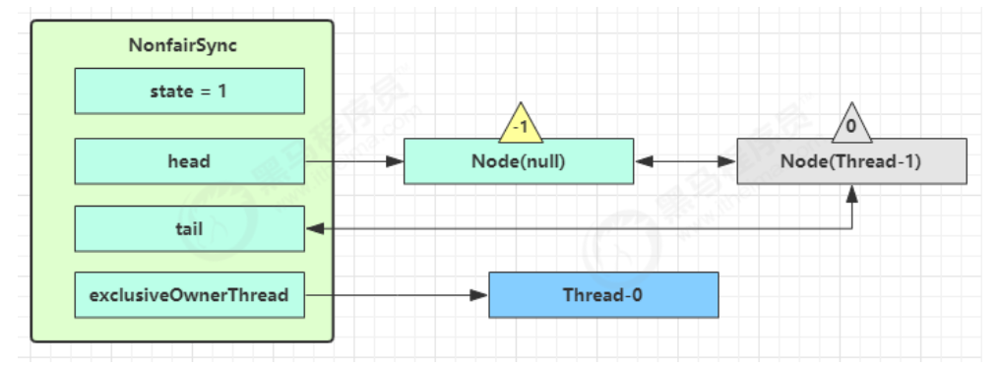
>
> 再次有多个线程经历上述过程竞争失败，变成这个样子
>
> 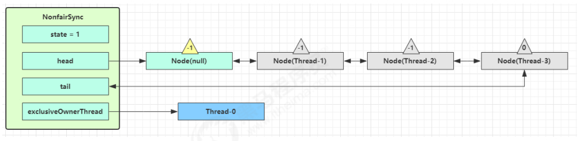
>
> Thread-0 释放锁，进入 tryRelease 流程，如果成功 
>
> * 设置 exclusiveOwnerThread 为 null 
> * state = 0
>
> 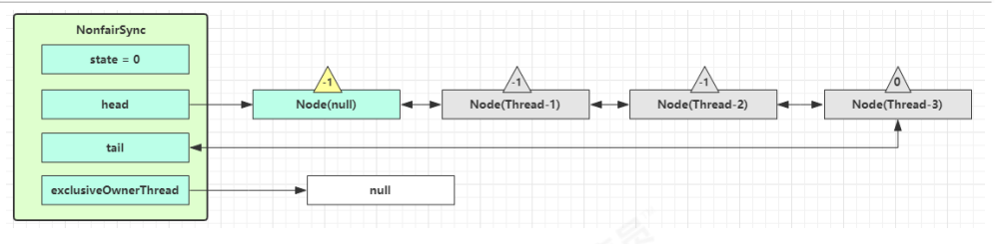
>
> 当前队列不为 null，并且 head 的 waitStatus = -1，进入 unparkSuccessor 流程 
>
> 找到队列中离 head 最近的一个 Node（没取消的），unpark 恢复其运行，本例中即为 Thread-1 
>
> 回到 Thread-1 的 acquireQueued 流程
>
> 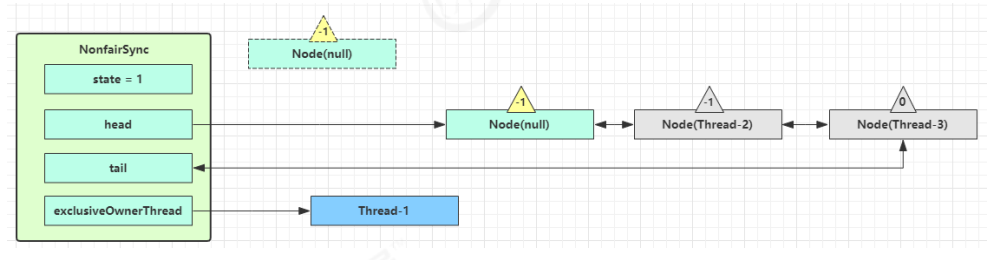
>
> 如果加锁成功（没有竞争），会设置 
>
> * exclusiveOwnerThread 为 Thread-1，state = 1 
> * head 指向刚刚 Thread-1 所在的 Node，该 Node 清空 Thread 
> * 原本的 head 因为从链表断开，而可被垃圾回收
>
> 如果这时候有其它线程来竞争（非公平的体现），例如这时有 Thread-4 来了
>
> 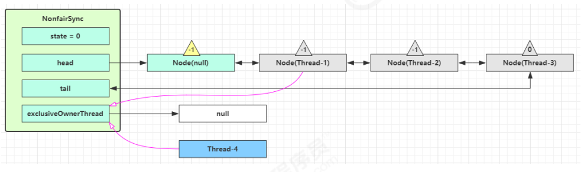
>
> 如果不巧又被 Thread-4 占了先
>
> * Thread-4 被设置为 exclusiveOwnerThread，state = 1 
> * Thread-1 再次进入 acquireQueued 流程，获取锁失败，重新进入 park 阻塞


**加锁解锁部分源码**

##### 加锁源码

###### **ReentrantLock下面的非公平锁实现**

从构造器可以看出，默认为非公平锁实现

```java
    public ReentrantLock() {
        sync = new NonfairSync();
    }
```


###### **非公平锁extends Sync**

```java
// Sync 继承自 AQS
static final class NonfairSync extends Sync {
    private static final long serialVersionUID = 7316153563782823691L;

........
......

}
```


> 没有竞争时
>
> 
>
> 第一个竞争出现时
>
> 
>
> Thread-1 执行逻辑： 
>
> 	1. CAS 尝试将 state 由 0 改为 1，结果失败 
> 	2. 进入 tryAcquire 逻辑，这时 state 已经是1，结果仍然失败 
> 	3. 接下来进入 addWaiter 逻辑，构造 Node 队列 
> 	* 图中黄色三角表示该 Node 的 waitStatus 状态，其中 0 为默认正常状态 
> 	* Node 的创建是懒惰的 
> 	* 其中第一个 Node 称为 Dummy（哑元）或哨兵，用来占位，并不关联线程
>
> 

###### **lock()**

```java
    // 加锁实现
    final void lock() {
        // 首先用 cas 尝试（仅尝试一次）将 state 从 0 改为 1,并将owner里面的线程改为自己,如果成功表示获得了独占锁
        if (compareAndSetState(0, 1))
            setExclusiveOwnerThread(Thread.currentThread());
        else
            // 如果出现竞争的时候，也就是不能将state从0改为1了，就进入acquire(1)方法里面
            acquire(1);
    }
```

###### **acquire()**——尝试获取锁

* acquire()方法里面首先调用了tryAcquire()方法
* tryAcquire()方法其实就是尝试去加锁；接下来就会进入addWaiter(Node.EXCLUSIVE)方法

```java
    // ㈠ AQS 继承过来的方法, 方便阅读, 放在此处
    public final void acquire(int arg) {
        // ㈡ tryAcquire 
        if (
            !tryAcquire(arg) &&
            // [再次尝试获取锁失败，就加入等待队列]当 tryAcquire 返回为 false 时, 先调用 addWaiter㈣, 接着 acquireQueued㈤
            acquireQueued(addWaiter(Node.EXCLUSIVE), arg)
        ) {
            selfInterrupt();
        }
    }
```

###### **addWaiter()**

```java
    // ㈣ AQS 继承过来的方法, 方便阅读, 放在此处
    // addWaiter()方法就是构造一个node队列，如图，一个head和tail都是没有东西的，
	// 首次去创建node的时候会创建两个，第一个node为dummy(哑元)或则哨兵，是用来占位的，并不关联任何的线程；只有第二个node才是thread-1,因为thread-1竞争失败了，就关联到一个node上面，因为thread-1是第一个加入的，所以关联到链表的尾部。这就是一个线程关联到node对象上，node对象有属于非公平锁的链表上，如上图所示这其实就是一个等待队列，需要注意的是这个线程还是活动的，node对象给创建好了之后就会进入acquireQueued()这个方法

    //将当前node加入等待队列末尾等待，并返回当前node
    private Node addWaiter(Node mode) {
        // 将当前线程关联到一个 Node 对象上, 模式为独占模式
        Node node = new Node(Thread.currentThread(), mode);
        //非公平同步器中有head和tail两个引用分别指向了等待队列的第一个和最后一个节点
        //pred指的是node的前驱，从队尾插入，所以pred为tail
        Node pred = tail;
        // 如果 tail 不为 null, 说明已经有了等待队列了，cas 尝试将 Node 对象加入 AQS 队列尾部
        if (pred != null) {
            //将node的前驱节点设置为pred
            node.prev = pred;
            //尝试将队列的tial从当前的pred修改为node
            if (compareAndSetTail(pred, node)) {
                // 双向链表
                pred.next = node;
                return node;
            }
        }
        //如果pred为null，说明等待队列还未创建，调用enq方法创建队列
        // 尝试将 Node 加入 AQS, 进入 ㈥
        enq(node);
        return node;
    }
```


> 当前线程继续进入 acquireQueued 逻辑 
>
> 1. acquireQueued 会在一个死循环中不断尝试获得锁，失败后进入 park 阻塞 
> 2. 如果自己是紧邻着 head（排第二位），那么再次 tryAcquire 尝试获取锁，当然这时 state 仍为 1，失败 
> 3. 进入 shouldParkAfterFailedAcquire 逻辑，将前驱 node，即 head 的 waitStatus 改为 -1，这次返回 false
>
> 
>
> 4. <u>shouldParkAfterFailedAcquire(返回false)</u> 执行完毕回到 acquireQueued ，**再次 tryAcquire 尝试获取锁**，当然这时 state 仍为 1，失败 
> 5. 当再次进入 shouldParkAfterFailedAcquire 时，这时因为其前驱 node 的 waitStatus 已经是 -1，这次返回 true 
> 6. 进入 parkAndCheckInterrupt， Thread-1 park（灰色表示）
>
> 

###### **acquireQueued()**

```java
// ㈤AQS 继承过来的方法, 方便阅读, 放在此处
    //当前线程进入acquireQueued()这个逻辑了，这个里面是一个死循环，会在死循环里面再做几次尝试，最后的挣扎，看能不能获得锁，可以看到下面的代码node.predecessor()就是获取它的前驱结点，里面的node就是刚刚thread-1所在的node；if (p == head && tryAcquire(arg)) 表示去看node节点的上一个节点是不是头结点，如果是的话，那么说明你这个含有thread-1的node是处于第二位的，处于第二位的就还有资格再去调用&&后面的tryAcquire()方法，去尝试获得锁，也就是还是会再去试一次，如果这个时候thread-0把锁释放开了，那么thread-1还是有机会获得锁的，但是我们这个例子里面，thread-0就一直占用着锁，那么tryAcquire()方法又失败了，所以整个if条件都失败了；失败以后就会进入下一个if判断，会去执行shouldParkAfterFailedAcquire()这样一个方法，这个方法就是尝试去获取锁失败的时候，就会去阻塞住，如果shouldParkAfterFailedAcquire()方法返回为真，就会去park，就会去阻塞；如果这个方法返回为假，还会再一次循环，再去做下轮的尝试；shouldParkAfterFailedAcquire()方法会把它的前驱节点，也就是前面这个没有关联线程的node节点，将它的waitstatus状态改为-1，需要注意的是一开始他们的状态都是0;改成-1有什么用嘞，只要这个waitstatus=-1就有责任唤醒它的后继的节点，也就是说你thread-1的node节点，你尝试了好几遍，都没有获得锁，你应该进入阻塞状态，应该去park阻塞，所以你要阻塞，是不是就需要一个节点来唤醒你，谁来唤醒你嘞，就是这个前驱节点来唤醒你这个后继节点，这是它的作用；shouldParkAfterFailedAcquire()方法返回的是false，还会再一次尝试，又回到for循环的开始，然后这回再次尝试如果失败了，又会进入shouldParkAfterFailedAcquire(p,node)这个方法，因为其前驱节点node的waitStatus已经是-1了，这次就会返回true，因为前面是true，就会执行&&后面的代码了，这个代码就是parkAndCheckInterrupt()方法，
    //在队列中循环等待，只有当排队排到第一名并且获得了锁才能出队并从方法中退出。
    //返回打断状态 
    final boolean acquireQueued(final Node node, int arg) {
        boolean failed = true;
        try {
            boolean interrupted = false;
            for (;;) {
                //找到当前node的前驱节点
                final Node p = node.predecessor();
                // [如果]上一个节点是 head, 表示下一个就轮到自己(当前线程对应的 node)了, 再次尝试获取锁(第三次)
                if (p == head && tryAcquire(arg)) {
                    // 获取锁成功, 设置自己（当前线程对应的 node）为 head
                    setHead(node);
                    // 上一个节点 help GC
                    p.next = null;
                    failed = false;
                    // 返回中断标记 false
                    return interrupted;
                }
                if (
                    // 判断是否应当 park, 进入㈦
                    shouldParkAfterFailedAcquire(p, node) &&
                    // park当前线程, 此时 Node 的状态被置为 Node.SIGNAL㈧
                    parkAndCheckInterrupt()
                ) {
                    interrupted = true;
                }
            }
        } finally {
            if (failed)
                cancelAcquire(node);
        }
    }
```

###### **shouldParkAfterFailedAcquire()**

```java
// ㈦AQS 继承过来的方法, 方便阅读, 放在此处
    // 判断尝试获取锁(acquire)失败以后是否应该阻塞等待。从规则上来讲：
    // 1.如果前驱节点都阻塞了，那么当前节点也应该阻塞
    // 2.如果前驱节点取消，那么应该将前驱节点前移，直到其状态不为取消为止。
    // 3.如果前两种情况都不是，尝试将前驱节点状态设为SIGNAL，返回false（不用阻塞，等到下次在阻塞）
    private static boolean shouldParkAfterFailedAcquire(Node pred, Node node) {
        // 获取上一个节点的状态
        int ws = pred.waitStatus;
        if (ws == Node.SIGNAL) {
            // 上一个节点都在阻塞, 那么自己也阻塞好了
            return true;
        }
        // > 0 表示取消状态
        if (ws > 0) {
            // 上一个节点取消, 那么重构删除前面所有取消的节点, 返回到外层循环重试
            do {
                node.prev = pred = pred.prev;
            } while (pred.waitStatus > 0);
            pred.next = node;
        } else {
            // 这次还没有阻塞
            // 但下次如果重试不成功, 则需要阻塞，这时需要设置前驱节点状态为 Node.SIGNAL(即-1，表示有责任唤醒它的后继节点)
            compareAndSetWaitStatus(pred, ws, Node.SIGNAL);
        }
        return false;
    }
```

###### **parkAndCheckInterrupt()**


```java
    // ㈧ 阻塞当前线程
    // 把当前线程park阻塞住，图中灰色的表示thread-1已经阻塞住了
    private final boolean parkAndCheckInterrupt() {
        LockSupport.park(this);
        return Thread.interrupted();
    }
```


###### **tryAcquire()**

```java
    // ㈡ 进入 ㈢
    protected final boolean tryAcquire(int acquires) {
        return nonfairTryAcquire(acquires);
    }
```

###### **nonfairTryAcquire()**

```java
    // ㈢ Sync 继承过来的方法, 方便阅读, 放在此处
    final boolean nonfairTryAcquire(int acquires) {
        final Thread current = Thread.currentThread();
        int c = getState();
        // 如果还没有获得锁
        if (c == 0) {
            // 尝试用 cas 获得, 这里体现了非公平性: 不去检查 AQS 队列
            if (compareAndSetState(0, acquires)) {
                setExclusiveOwnerThread(current);
                return true;
            }
        }
        // 如果已经获得了锁, 线程还是当前线程, 表示发生了锁重入
        else if (current == getExclusiveOwnerThread()) {
            // state++
            int nextc = c + acquires;
            if (nextc < 0) // overflow
                throw new Error("Maximum lock count exceeded");
            setState(nextc);
            return true;
        }
        // 获取失败, 回到调用处
        return false;
    }
```

###### **enq()**

```java
    
    // ㈥ AQS 继承过来的方法, 方便阅读, 放在此处
    //该方法就是创建等待队列，并将node插入队列的尾部。
    private Node enq(final Node node) {
        for (;;) {
            Node t = tail;
            if (t == null) {
                // 还没有, 设置 head 为哨兵节点（不对应线程，状态为 0）
                if (compareAndSetHead(new Node())) {
                    //将head赋值给tail，head和tail同时指向哨兵节点
                    tail = head;
                }
            } else {
                // cas 尝试将 Node 对象加入 AQS 队列尾部
                //设置node的前驱节点为队列的最后一个节点
                node.prev = t;
                //尝试将队列的尾部从当前的tail设置为node
                if (compareAndSetTail(t, node)) {
                    //将node设为上一个tail的后继节点
                    t.next = node;
                    return t;
                }
            }
        }
    }
```


> **注意** 
>
> 是否需要 unpark 是由当前节点的前驱节点的 waitStatus == Node.SIGNAL 来决定，而不是本节点的 waitStatus 决定

总结：

- 调用`lock`，尝试将state从0修改为1
  - 成功：将owner设为当前线程
  - 失败：调用`acquire`->`tryAcquire`->`nonfairTryAcquire`，判断state=0则获得锁，或者state不为0但当前线程持有锁则重入锁，以上两种情况`tryAcquire`返回true，剩余情况返回false。
    - true：获得锁
    - false：调用`acquireQueued(addWaiter(Node.EXCLUSIVE), arg)`,其中`addwiter`将关联线程的节点插入AQS队列尾部，进入`acquireQueued`中的for循环:
      - 如果当前节点是头节点，并尝试获得锁成功，将当前节点设为头节点，清除此节点信息，返回打断标记。
      - 调用`shoudParkAfterFailure`,第一次调用返回false，并将前驱节点改为-1，第二次循环如果再进入此方法，会进入阻塞并检查打断的方法。

##### 解锁源码


> 假设有多个线程经历上述过程竞争失败，变成这个样子
>
> 
>
> 他们构成了一个双向的链表，头部是我们没有关联线程的节点，下一个是thread-1，然后是thread-2、thread-3；可以看到除去最后一个，其waitstatus的状态都被改为了-1，意思有责任去唤醒后继节点
>
> Thread-0 释放锁，进入 tryRelease 流程，如果成功 
>
> * 设置 exclusiveOwnerThread 为 null 
> * state = 0
>
> 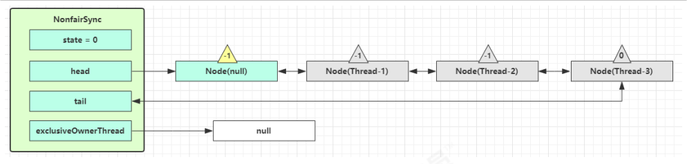
>
> 当前队列不为 null，并且 head 的 waitStatus = -1，进入 unparkSuccessor 流程 
>
> 找到队列中离 head 最近的一个 Node（没取消的），unpark 恢复其运行，本例中即为 Thread-1 
>
> 

###### unlock()

```java
    // 解锁实现
    public void unlock() {
        //调用同步器的release()方法
        sync.release(1);
    }
```

###### release()


release()方法里面首先调用tryRelease( )方法

tryRelease()方法通过之后，会去检查head是不是为null，然后再看下head.waitStatus是不是不等于0，确实不等于0，是-1，这个时候就会去唤醒下一个节点——进入了这个unparkSuccessor(h)流程，去唤醒后继的节点

```java
public final boolean release(int arg) {
    // 尝试释放锁, 进入 ㈠
    if (tryRelease(arg)) {
        // 队列头节点 unpark
        Node h = head; 
        if (
            // 队列不为 null
            h != null &&
            // waitStatus == Node.SIGNAL 才需要 unpark
            h.waitStatus != 0
        ) {
            // unpark AQS 中等待的线程, 进入 ㈡
            unparkSuccessor(h);
        }
        return true;
    }
    return false;
}
```

###### unparkSuccessor()


unparkSuccessor()方法用于唤醒后继节点，会找到离head最近的一个node（没取消的），也就是本例中thread-1这个node，unpark恢复thread-1的运行，底层调用`LockSupport.unpark(s.thread)`


> 唤醒之后开始新一轮的竞争
>
>  Thread-1 的 acquireQueued 流程
>
> 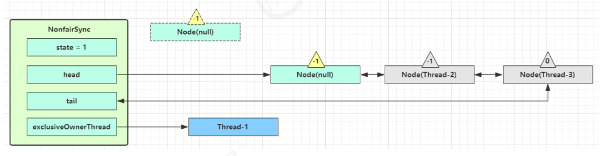
>
> 如果加锁成功（没有竞争），会设置 
>
> * exclusiveOwnerThread 为 Thread-1，state = 1 
> * head 指向刚刚 Thread-1 所在的 Node，该 Node 清空 Thread 
> * 原本的 head 因为从链表断开，而可被垃圾回收 
>
> 如果这时候有其它线程来竞争（非公平的体现），例如这时有 Thread-4 来了
>
> 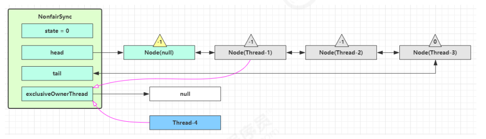
>
> 如果不巧又被 Thread-4 占了先 
>
> * Thread-4 被设置为 exclusiveOwnerThread，state = 1
> * Thread-1 再次进入 acquireQueued 流程，获取锁失败，重新进入 park 阻塞


刚刚 thread-1是在 `parkAndCheckInterrupt()` 方法这里阻塞着的，那么一运行就又进去循环了，去执行`if(p==head && tryAcquire(arg))`代码，成功之后，thread-1就会变成owner线程，并且把state变为1

```java
// ㈡ AQS 继承过来的方法, 方便阅读, 放在此处
    private void unparkSuccessor(Node node) {
        // 如果状态为 Node.SIGNAL 尝试重置状态为 0
        // 不成功也可以
        int ws = node.waitStatus;
        if (ws < 0) {
            compareAndSetWaitStatus(node, ws, 0);
        }
        // 找到需要 unpark 的节点, 但本节点从 AQS 队列中脱离, 是由唤醒节点完成的
        Node s = node.next;
        // 不考虑已取消的节点, 从 AQS 队列从后至前找到队列最前面需要 unpark 的节点
        if (s == null || s.waitStatus > 0) {
            s = null;
            for (Node t = tail; t != null && t != node; t = t.prev)
                if (t.waitStatus <= 0)
                    s = t;
        }
        if (s != null)
            LockSupport.unpark(s.thread);// 解除该线程的阻塞状态
    }
}
```

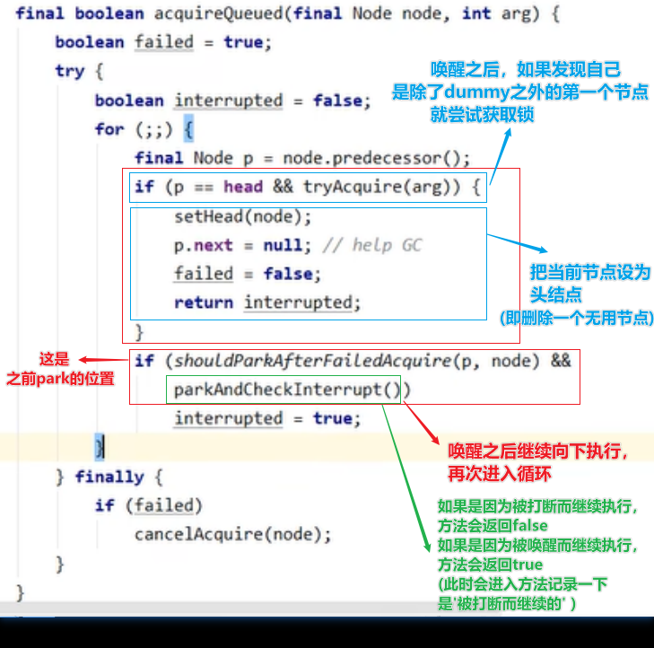


由于非公平锁的特性，thread-1可能获取不到锁

> 非公平锁的意思就是 如果这个时候又来了一个线程4，线程4并不是在等待队列里面的，是一个新的线程，这个线程也想要获得锁，就会跟thread-1线程发生一个竞争，要竞争去成为这个owner，如果不巧这个thread-4去把state改为1了，那么这个thread-4就变成owner了
>
> 
>
> 这个时候相当于你的thread-1又失败了，失败了之后就会再次进入这个`if(p==head && tryAcquire(arg))` 流程，那么`tryAcquire(arg)`就是一个false，false以后就会进入`shouldParkAfterFailedAcquire()` 流程，又被阻塞住

###### tryRelease()

```java
 // ㈠ 
    protected final boolean tryRelease(int releases) {
        // state--
        int c = getState() - releases;
        if (Thread.currentThread() != getExclusiveOwnerThread())
            throw new IllegalMonitorStateException();
        boolean free = false;
        // 支持锁重入, 只有 state 减为 0, 才释放成功
        if (c == 0) {
            free = true;
            setExclusiveOwnerThread(null);
        }
        setState(c);
        return free;
    }
```


总结：

- `unlock`->`syn.release(1)`->`tryRelease(1)`,如果当前线程并不持有锁，抛异常。state减去1,如果之后state为0，解锁成功，返回true；如果仍大于0，表示解锁不完全，当前线程依旧持有锁，返回false。
- 返回true：检查AQS队列第一个节点状态图是否为`SIGNAL`(意味着有责任唤醒其后记节点)，如果有，调用`unparkSuccessor`。
  - 再`unparkSuccessor`中，不考虑已取消的节点, 从 AQS 队列从后至前找到队列最前面需要 unpark 的节点，如果有，将其唤醒。
- 返回false：


### 可重入原理

```java
static final class NonfairSync extends Sync {
    // ...

    // Sync 继承过来的方法, 方便阅读, 放在此处
    final boolean nonfairTryAcquire(int acquires) {
        final Thread current = Thread.currentThread();
        int c = getState();
        if (c == 0) {
            if (compareAndSetState(0, acquires)) {
                setExclusiveOwnerThread(current);
                return true;
            }
        }
        // 如果已经获得了锁, 线程还是当前线程, 表示发生了锁重入(发生‘重入’时显然c==0这个条件已经不成立了)
        else if (current == getExclusiveOwnerThread()) {
            // state++ 当持有锁的线程再次尝试获取锁时，会将state的值加1，state表示锁的重入量
            int nextc = c + acquires;
            if (nextc < 0) // overflow
                throw new Error("Maximum lock count exceeded");
            setState(nextc);
            return true;
        }
        return false;
    }

    // Sync 继承过来的方法, 方便阅读, 放在此处
    protected final boolean tryRelease(int releases) {
        // state-- 
        int c = getState() - releases;
        if (Thread.currentThread() != getExclusiveOwnerThread())
            throw new IllegalMonitorStateException();
        boolean free = false;
        // 支持锁重入, [只有state减为 0, 才释放成功]
        if (c == 0) {
            free = true;
            setExclusiveOwnerThread(null);
        }
        setState(c);
        return free;
    }
}


```


### 可打断原理

**不可打断模式**

我们都知道线程在没办法立刻获得锁的时候，会进入这个acquireQueued()方法，这个方法的循环内不断的去尝试，如果尝试仍然没有成功，回去进入这个parkAndCheckInterrupt()方法，进行等待，但是进入park这个方法的线程可以被其他线程调用它的interrupt()方法进行唤醒，打断以后，会终止这个park()，然后继续向下运行，执行Thread.interrupted()，会返回一个boolean值，表示你是否被打断过，不过·这个interrupted()方法除去返回打断的事务被打断的布尔值以外，还会清除打断标记，清除打断标记就是如果你下次这个线程在park的时候，还可以park住；也就是一旦你不清除打断标记，那么park()方法就会失效，清除主要是为了下次再次park的时候不受打断标记的影响。当然我们这个例子里面return Thread.interrupted() ; 就会返回真，parkAndCheckInterrupt()这一段是真了，那么就会进入if块了，就会把打断标记做一个记录，也就是interrupted=true，因为原先interrupted的默认值是false，一旦被打断了，就会置为true，但是它只是置为true了，他没有做更多额外的处理，所以这个线程就继续进行下一次for的循环，这个时候如果获得不了锁，还是会进入阻塞，进入parkAndCheckInterrupt()阻塞，那什么时候会用到这个打断标记这个真嘞，只有你获得到锁以后，它会把这个打断标记作为返回结果进行返回。能返回回来，也就是执行到acquireQueued这里了，说明已经获得到锁了，获得到锁以后，这个打断标记为真，

在此模式下，即使它被打断，仍会驻留在 AQS 队列中，并将打断信号存储在一个interrupt变量中。一直要等到获得锁后方能得知自己被打断了,并且调用`selfInterrupt`方法打断自己。

```java
// Sync 继承自 AQS
static final class NonfairSync extends Sync {
    // ...

    private final boolean parkAndCheckInterrupt() {
        // 如果打断标记已经是 true, 则 park 会失效
        LockSupport.park(this);
        // interrupted 会清除打断标记[保证下一次仍然能park住]
        return Thread.interrupted();
    }

    final boolean acquireQueued(final Node node, int arg) {
        boolean failed = true;
        try {
            boolean interrupted = false;
            for (;;) {
                final Node p = node.predecessor();
                if (p == head && tryAcquire(arg)) {
                    setHead(node);
                    p.next = null;
                    failed = false;
                    // 还是需要获得锁后, 才能返回打断状态
                    return interrupted;
                }
                if (
                    shouldParkAfterFailedAcquire(p, node) &&
                    parkAndCheckInterrupt()
                ) {
                    // 如果是因为 interrupt 被唤醒, 记录为true[由于清除过了打断标记，所以才需要这个局部变量]
                    interrupted = true;
                }
            }
        } finally {
            if (failed)
                cancelAcquire(node);
        }
    }

    public final void acquire(int arg) {
        if (
            !tryAcquire(arg) &&
            acquireQueued(addWaiter(Node.EXCLUSIVE), arg)
        ) {
            // 局部变量interrupted返回的true在这里起作用，如果返回true，就会进入这个if块
            selfInterrupt();
        }
    }
	
    //响应打断标记，打断自己
    static void selfInterrupt() {
        // 重新产生一次中断
        Thread.currentThread().interrupt();
    }
}


```

**可打断模式**

此模式下即使线程在等待队列中等待，一旦被打断，就会立刻抛出打断异常。

```java
static final class NonfairSync extends Sync {
    public final void acquireInterruptibly(int arg) throws InterruptedException {
        if (Thread.interrupted())
            throw new InterruptedException();
        // 如果没有获得到锁, 进入 ㈠
        if (!tryAcquire(arg))
            doAcquireInterruptibly(arg);
    }

    // ㈠ 可打断的获取锁流程
    private void doAcquireInterruptibly(int arg) throws InterruptedException {
        final Node node = addWaiter(Node.EXCLUSIVE);
        boolean failed = true;
        try {
            for (;;) {
                final Node p = node.predecessor();
                if (p == head && tryAcquire(arg)) {
                    setHead(node);
                    p.next = null; // help GC
                    failed = false;
                    return;
                }
                if (shouldParkAfterFailedAcquire(p, node) &&
                    parkAndCheckInterrupt()) {
                    // 在 park 过程中如果被 interrupt 会进入此
                    // 这时候抛出异常, 而不会再次进入 for (;;)
                    throw new InterruptedException();
                }
            }
        } finally {
            if (failed)
                cancelAcquire(node);
        }
    }

```

### 公平锁实现原理

简而言之，公平与非公平的区别在于，公平锁中的tryAcquire方法被重写了，新来的线程即便得知了锁的state为0，也要先判断等待队列中是否还有线程等待，只有当队列没有线程等待式，才获得锁。

```java
static final class FairSync extends Sync {
    private static final long serialVersionUID = -3000897897090466540L;
    final void lock() {
        acquire(1);
    }

    // AQS 继承过来的方法, 方便阅读, 放在此处
    public final void acquire(int arg) {
        if (
            !tryAcquire(arg) &&
            acquireQueued(addWaiter(Node.EXCLUSIVE), arg)
        ) {
            selfInterrupt();
        }
    }
    // 与非公平锁主要区别在于 tryAcquire 方法的实现
    protected final boolean tryAcquire(int acquires) {
        final Thread current = Thread.currentThread();
        int c = getState();
        if (c == 0) {
            // 先检查 AQS 队列中是否有前驱节点, 没有才去竞争(非公平锁不会检查AQS队列)
            if (!hasQueuedPredecessors() &&
                compareAndSetState(0, acquires)) {
                setExclusiveOwnerThread(current);
                return true;
            }
        }
        else if (current == getExclusiveOwnerThread()) {
            int nextc = c + acquires;
            if (nextc < 0)
                throw new Error("Maximum lock count exceeded");
            setState(nextc);
            return true;
        }
        return false;
    }

    // ㈠ AQS 继承过来的方法, 方便阅读, 放在此处
    //存疑
    public final boolean hasQueuedPredecessors() {
        Node t = tail;
        Node h = head;
        Node s;
        // h != t 时表示队列中有 Node
        return h != t &&
            (
            // (s = h.next) == null 表示队列中还有没有老二
            (s = h.next) == null ||
            // 或者队列中老二线程不是此线程
            s.thread != Thread.currentThread()
        );
    }
}


```


### 条件变量实现原理

每个条件变量其实就对应着一个等待队列，其实现类是 ConditionObject


#### await 流程

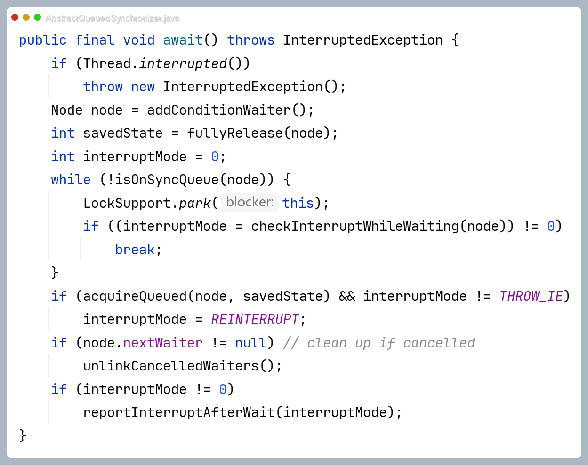

开始 Thread-0 持有锁，调用 await，进入 ConditionObject 的 addConditionWaiter 流程 

创建新的 Node 状态为 -2（Node.CONDITION），关联 Thread-0，加入等待队列尾部

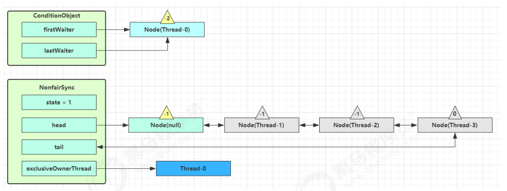

接下来进入 AQS 的 fullyRelease 流程，释放同步器上的所有锁(因为可能有锁重入)，owner设为null

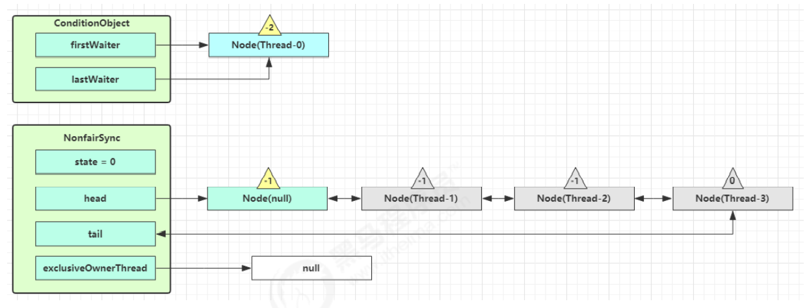

unpark AQS 队列中的下一个节点，竞争锁，假设没有其他竞争线程，那么 Thread-1 竞争成功

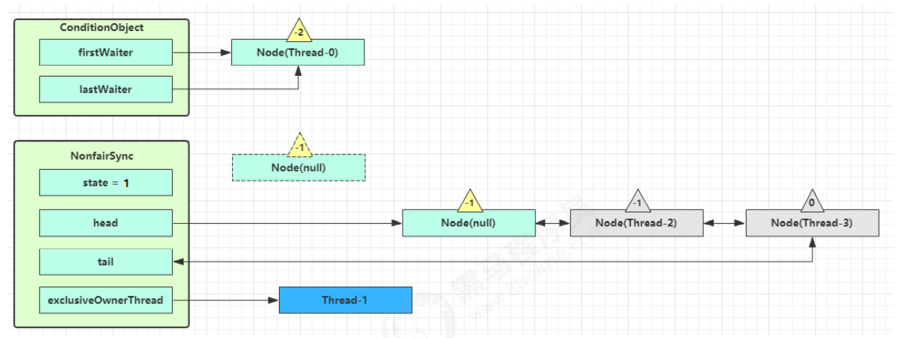

park 阻塞 Thread-0

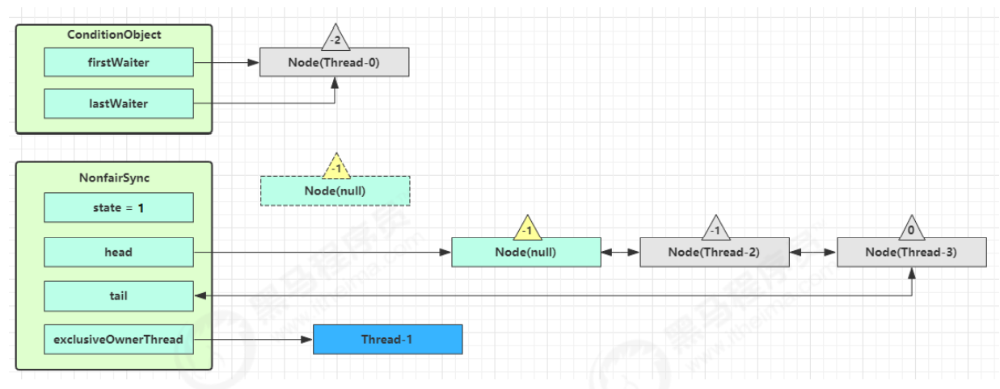

总结：

- 创建一个节点，关联当前线程，并插入到当前Condition队列的尾部
- 调用`fullRelease`，完全释放同步器中的锁，并记录当前线程的锁重入数
- 唤醒(park)AQS队列中的第一个线程
- 调用park方法，阻塞当前线程。


#### signal 流程


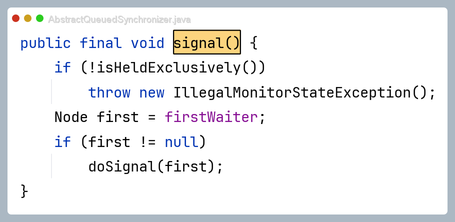

假设 Thread-1 要来唤醒 Thread-0

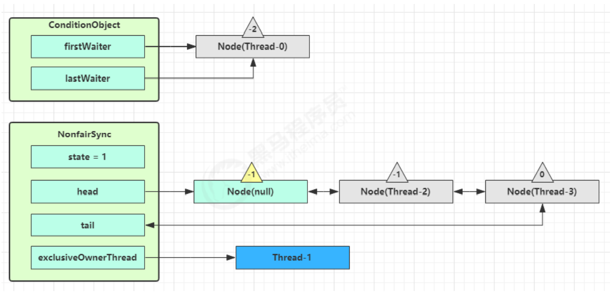

判断是否是owner线程

判断队列是否为空

不为空，取得等待队列中第一个 Node，即 Thread-0 所在 Node，进入 ConditionObject 的 doSignal 流程

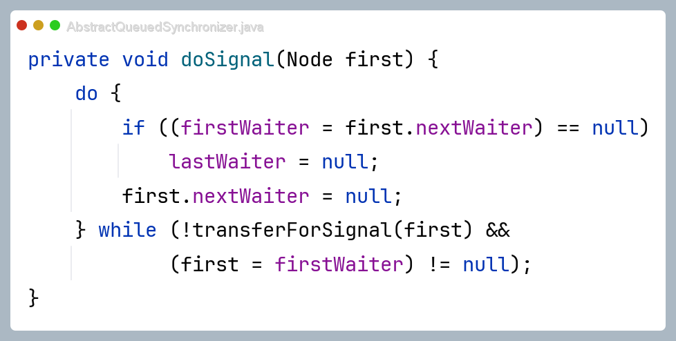


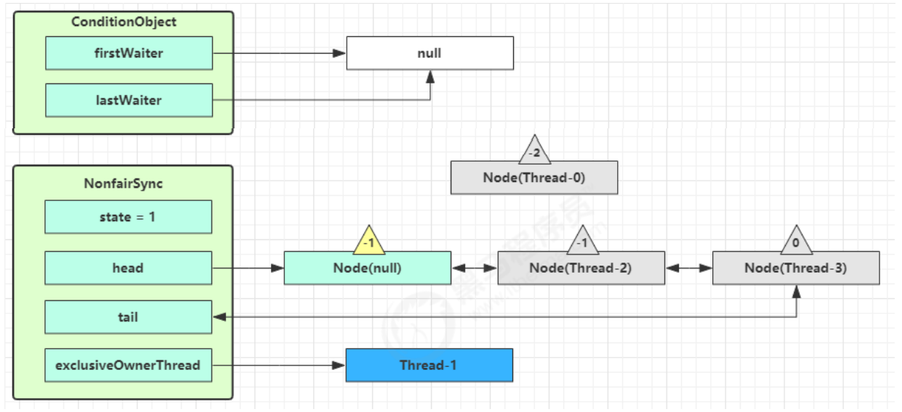

2.执行 transferForSignal 流程，将该 Node 加入 AQS 队列尾部，将 Thread-0 的 waitStatus 从-2 改为 0，Thread-3 的 waitStatus 改为 -1(让它有义务唤醒刚加入到队尾的 Thread-0)

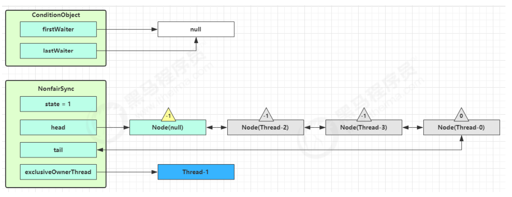

Thread-1 释放锁，进入 unlock 流程，略

总结：

- 当前持有锁的线程唤醒等待队列中的线程，调用doSignal或doSignalAll方法，将等待队列中的第一个（或全部）节点插入到AQS队列中的尾部。
- 将插入的节点的状态从Condition设置为0，将插入节点的前一个节点的状态设置为-1（意味着要承担唤醒后一个节点的责任）
- 当前线程释放锁，parkAQS队列中的第一个节点线程。

#### 源码

```java
public class ConditionObject implements Condition, java.io.Serializable {
    private static final long serialVersionUID = 1173984872572414699L;

    // 第一个等待节点
    private transient Node firstWaiter;

    // 最后一个等待节点
    private transient Node lastWaiter;
    public ConditionObject() { }
    // ㈠ 添加一个 Node 至等待队列
    private Node addConditionWaiter() {
        Node t = lastWaiter;
        // 所有已取消的 Node 从队列链表删除, 见 ㈡
        if (t != null && t.waitStatus != Node.CONDITION) {
            unlinkCancelledWaiters();
            t = lastWaiter;
        }
        // 创建一个关联当前线程的新 Node, 添加至队列尾部
        Node node = new Node(Thread.currentThread(), Node.CONDITION);
        if (t == null)
            firstWaiter = node;
        else
            t.nextWaiter = node;
        lastWaiter = node;
        return node;
    }
    // 唤醒 - 将没取消的第一个节点转移至 AQS 队列
    private void doSignal(Node first) {
        do {
            // 已经是尾节点了
            if ( (firstWaiter = first.nextWaiter) == null) {
                lastWaiter = null;
            }
            first.nextWaiter = null;
        } while (
            // 将等待队列中的 Node 转移至 AQS 队列, 不成功且还有节点则继续循环 ㈢
            !transferForSignal(first) &&
            // 队列还有节点
            (first = firstWaiter) != null
        );
    }

    // 外部类方法, 方便阅读, 放在此处
    // ㈢ 如果节点状态是取消, 返回 false 表示转移失败, 否则转移成功
    final boolean transferForSignal(Node node) {
        // 如果状态已经不是 Node.CONDITION, 说明被取消了
        if (!compareAndSetWaitStatus(node, Node.CONDITION, 0))
            return false;
        // 加入 AQS 队列尾部
        Node p = enq(node);
        int ws = p.waitStatus;
        if (
            // 上一个节点被取消
            ws > 0 ||
            // 上一个节点不能设置状态为 Node.SIGNAL
            !compareAndSetWaitStatus(p, ws, Node.SIGNAL) 
        ) {
            // unpark 取消阻塞, 让线程重新同步状态
            LockSupport.unpark(node.thread);
        }
        return true;
    }
    // 全部唤醒 - 等待队列的所有节点转移至 AQS 队列
    private void doSignalAll(Node first) {
        lastWaiter = firstWaiter = null;
        do {
            Node next = first.nextWaiter;
            first.nextWaiter = null;
            transferForSignal(first);
            first = next;
        } while (first != null);
    }

    // ㈡
    private void unlinkCancelledWaiters() {
        // ...
    }
    // 唤醒 - 必须持有锁才能唤醒, 因此 doSignal 内无需考虑加锁
    public final void signal() {
        if (!isHeldExclusively())
            throw new IllegalMonitorStateException();
        Node first = firstWaiter;
        if (first != null)
            doSignal(first);
    }
    // 全部唤醒 - 必须持有锁才能唤醒, 因此 doSignalAll 内无需考虑加锁
    public final void signalAll() {
        if (!isHeldExclusively())
            throw new IllegalMonitorStateException();
        Node first = firstWaiter;
        if (first != null)
            doSignalAll(first);
    }
    // 不可打断等待 - 直到被唤醒
    public final void awaitUninterruptibly() {
        // 添加一个 Node 至等待队列, 见 ㈠
        Node node = addConditionWaiter();
        // 释放节点持有的锁, 见 ㈣
        int savedState = fullyRelease(node);
        boolean interrupted = false;
        // 如果该节点还没有转移至 AQS 队列, 阻塞
        while (!isOnSyncQueue(node)) {
            // park 阻塞
            LockSupport.park(this);
            // 如果被打断, 仅设置打断状态
            if (Thread.interrupted())
                interrupted = true;
        }
        // 唤醒后, 尝试竞争锁, 如果失败进入 AQS 队列
        if (acquireQueued(node, savedState) || interrupted)
            selfInterrupt();
    }
    private void doSignalAll(Node first) {
        lastWaiter = firstWaiter = null;
        do {
            Node next = first.nextWaiter;
            first.nextWaiter = null;
            transferForSignal(first);
            first = next;
        } while (first != null);
    }

    // ㈡
    private void unlinkCancelledWaiters() {
        // ...
    }
    // 唤醒 - 必须持有锁才能唤醒, 因此 doSignal 内无需考虑加锁
    public final void signal() {
        if (!isHeldExclusively())
            throw new IllegalMonitorStateException();
        Node first = firstWaiter;
        if (first != null)
            doSignal(first);
    }
    // 全部唤醒 - 必须持有锁才能唤醒, 因此 doSignalAll 内无需考虑加锁
    public final void signalAll() {
        if (!isHeldExclusively())
            throw new IllegalMonitorStateException();
        Node first = firstWaiter;
        if (first != null)
            doSignalAll(first);
    }
    // 不可打断等待 - 直到被唤醒
    public final void awaitUninterruptibly() {
        // 添加一个 Node 至等待队列, 见 ㈠
        Node node = addConditionWaiter();
        // 释放节点持有的锁, 见 ㈣
        int savedState = fullyRelease(node);
        boolean interrupted = false;
        // 如果该节点还没有转移至 AQS 队列, 阻塞
        while (!isOnSyncQueue(node)) {
            // park 阻塞
            LockSupport.park(this);
            // 如果被打断, 仅设置打断状态
            if (Thread.interrupted())
                interrupted = true;
        }
        // 唤醒后, 尝试竞争锁, 如果失败进入 AQS 队列
        if (acquireQueued(node, savedState) || interrupted)
            selfInterrupt();
    }

    // 外部类方法, 方便阅读, 放在此处
    // ㈣ 因为某线程可能重入，需要将 state 全部释放
    final int fullyRelease(Node node) {
        boolean failed = true;
        try {
            int savedState = getState();
            if (release(savedState)) {
                failed = false;
                return savedState;
            } else {
                throw new IllegalMonitorStateException();
            }
        } finally {
            if (failed)
                node.waitStatus = Node.CANCELLED;
        }
    }
    // 打断模式 - 在退出等待时重新设置打断状态
    private static final int REINTERRUPT = 1;
    // 打断模式 - 在退出等待时抛出异常
    private static final int THROW_IE = -1;
    // 判断打断模式
    private int checkInterruptWhileWaiting(Node node) {
        return Thread.interrupted() ?
            (transferAfterCancelledWait(node) ? THROW_IE : REINTERRUPT) :
        0;
    }
    // ㈤ 应用打断模式
    private void reportInterruptAfterWait(int interruptMode)
        throws InterruptedException {
        if (interruptMode == THROW_IE)
            throw new InterruptedException();
        else if (interruptMode == REINTERRUPT)
            selfInterrupt();
    }
    // 等待 - 直到被唤醒或打断
    public final void await() throws InterruptedException {
        if (Thread.interrupted()) {
            throw new InterruptedException();
        }
        // 添加一个 Node 至等待队列, 见 ㈠
        Node node = addConditionWaiter();
        // 释放节点持有的锁
        int savedState = fullyRelease(node);
        int interruptMode = 0;
        // 如果该节点还没有转移至 AQS 队列, 阻塞
        while (!isOnSyncQueue(node)) {
            // park 阻塞
            LockSupport.park(this);
            // 如果被打断, 退出等待队列
            if ((interruptMode = checkInterruptWhileWaiting(node)) != 0)
                break;
        }
        // 退出等待队列后, 还需要获得 AQS 队列的锁
        if (acquireQueued(node, savedState) && interruptMode != THROW_IE)
            interruptMode = REINTERRUPT;
        // 所有已取消的 Node 从队列链表删除, 见 ㈡
        if (node.nextWaiter != null) 
            unlinkCancelledWaiters();
        // 应用打断模式, 见 ㈤
        if (interruptMode != 0)
            reportInterruptAfterWait(interruptMode);
    }
    //向Condition中的等待队列中新增节点，并将此节点返回
    private Node addConditionWaiter() {
        Node t = lastWaiter;
        // If lastWaiter is cancelled, clean out.
        if (t != null && t.waitStatus != Node.CONDITION) {
            unlinkCancelledWaiters();
            t = lastWaiter;
        }
        Node node = new Node(Thread.currentThread(), Node.CONDITION);
        if (t == null)
            firstWaiter = node;
        else
            t.nextWaiter = node;
        lastWaiter = node;
        return node;
    }
    
    //判断当前节点是否在同步器中的队列中等待锁
    final boolean isOnSyncQueue(Node node) {
        if (node.waitStatus == Node.CONDITION || node.prev == null)
            return false;
        if (node.next != null) // If has successor, it must be on queue
            return true;
        /*
         * node.prev can be non-null, but not yet on queue because
         * the CAS to place it on queue can fail. So we have to
         * traverse from tail to make sure it actually made it.  It
         * will always be near the tail in calls to this method, and
         * unless the CAS failed (which is unlikely), it will be
         * there, so we hardly ever traverse much.
         */
        return findNodeFromTail(node);
    }
    // 等待 - 直到被唤醒或打断或超时
    public final long awaitNanos(long nanosTimeout) throws InterruptedException {
        if (Thread.interrupted()) {
            throw new InterruptedException();
        }
        // 添加一个 Node 至等待队列, 见 ㈠
        Node node = addConditionWaiter();
        // 释放节点持有的锁
        int savedState = fullyRelease(node);
        // 获得最后期限
        final long deadline = System.nanoTime() + nanosTimeout;
        int interruptMode = 0;
        // 如果该节点还没有转移至 AQS 队列, 阻塞
        while (!isOnSyncQueue(node)) {
            // 已超时, 退出等待队列
            if (nanosTimeout <= 0L) {
                transferAfterCancelledWait(node);
                break;
            }
            // park 阻塞一定时间, spinForTimeoutThreshold 为 1000 ns
            if (nanosTimeout >= spinForTimeoutThreshold)
                LockSupport.parkNanos(this, nanosTimeout);
            // 如果被打断, 退出等待队列
            if ((interruptMode = checkInterruptWhileWaiting(node)) != 0)
                break;
            nanosTimeout = deadline - System.nanoTime();
        }
        // 退出等待队列后, 还需要获得 AQS 队列的锁
        if (acquireQueued(node, savedState) && interruptMode != THROW_IE)
            interruptMode = REINTERRUPT;
        // 所有已取消的 Node 从队列链表删除, 见 ㈡
        if (node.nextWaiter != null)
            unlinkCancelledWaiters();
        // 应用打断模式, 见 ㈤
        if (interruptMode != 0)
            reportInterruptAfterWait(interruptMode);
        return deadline - System.nanoTime();
    }
    // 等待 - 直到被唤醒或打断或超时, 逻辑类似于 awaitNanos
    public final boolean awaitUntil(Date deadline) throws InterruptedException {
        // ...
    }
    // 等待 - 直到被唤醒或打断或超时, 逻辑类似于 awaitNanos
    public final boolean await(long time, TimeUnit unit) throws InterruptedException {
        // ...
    }
    // 工具方法 省略 ...
}
```


## 读写锁


### 1.ReentrantReadWriteLock

当读操作远远高于写操作时，这时候使用`读写锁`让`读-读`可以并发，提高性能。 类似于数据库中的 `select ... from ... lock in share mode` 

提供一个`数据容器类`内部分别使用读锁保护数据的 read() 方法，写锁保护数据的 write() 方法

测试

```java
class DataContainer {
    private Object data;
    private ReentrantReadWriteLock rw = new ReentrantReadWriteLock();
    private ReentrantReadWriteLock.ReadLock r = rw.readLock();
    private ReentrantReadWriteLock.WriteLock w = rw.writeLock();
    public Object read() {
        log.debug("获取读锁...");
        r.lock();
        try {
            log.debug("读取");
            sleep(1);
            return data;
        } finally {
            log.debug("释放读锁...");
            r.unlock();
        }
    }
    public void write() {
        log.debug("获取写锁...");
        w.lock();
        try {
            log.debug("写入");
            sleep(1);
        } finally {
            log.debug("释放写锁...");
            w.unlock();
        }
    }
}


```

测试`读锁-读锁`可以并发

```java
DataContainer dataContainer = new DataContainer();
new Thread(() -> {
    dataContainer.read();
}, "t1").start();
new Thread(() -> {
    dataContainer.read();
}, "t2").start();


```

输出结果，从这里可以看到 Thread-0 锁定期间，Thread-1 的读操作不受影响

```sh
14:05:14.341 c.DataContainer [t2] - 获取读锁... 
14:05:14.341 c.DataContainer [t1] - 获取读锁... 
14:05:14.345 c.DataContainer [t1] - 读取
14:05:14.345 c.DataContainer [t2] - 读取
14:05:15.365 c.DataContainer [t2] - 释放读锁... 
14:05:15.386 c.DataContainer [t1] - 释放读锁... 


```

测试`读锁-写锁`相互阻塞

```java
DataContainer dataContainer = new DataContainer();
new Thread(() -> {
    dataContainer.read();
}, "t1").start();
Thread.sleep(100);
new Thread(() -> {
    dataContainer.write();
}, "t2").start();


```

输出结果

```java
14:04:21.838 c.DataContainer [t1] - 获取读锁... 
14:04:21.838 c.DataContainer [t2] - 获取写锁... 
14:04:21.841 c.DataContainer [t2] - 写入
14:04:22.843 c.DataContainer [t2] - 释放写锁... 
14:04:22.843 c.DataContainer [t1] - 读取
14:04:23.843 c.DataContainer [t1] - 释放读锁... 


```

`写锁-写锁`也是相互阻塞的，这里就不测试了


**注意事项** 

- 读锁不支持条件变量 
- **重入时升级不支持**：即持有读锁的情况下去获取写锁，会导致获取写锁永久等待

```java
r.lock();
try {
    // ...
    w.lock();
    try {
        // ...
    } finally{
        w.unlock();
    }
} finally{
    r.unlock();
}


```

- **重入时降级支持**：即持有写锁的情况下去获取读锁

```java
class CachedData {
    Object data;
    // 是否有效，如果失效，需要重新计算 data
    volatile boolean cacheValid;
    final ReentrantReadWriteLock rwl = new ReentrantReadWriteLock();
    void processCachedData() {
        rwl.readLock().lock();
        if (!cacheValid) {
            // 获取写锁前必须释放读锁
            rwl.readLock().unlock();
            rwl.writeLock().lock();
            try {
                // 判断是否有其它线程已经获取了写锁、更新了缓存, 避免重复更新
                if (!cacheValid) {
                    data = ...
                        cacheValid = true;
                }
                // 降级为读锁, 释放写锁之后能够让其它线程马上读取缓存
                rwl.readLock().lock();
            } finally {
                rwl.writeLock().unlock();
            }
        }
        // 自己用完数据, 释放读锁 
        try {
            use(data);
        } finally {
            rwl.readLock().unlock();
        }
    }
}


```


### <font color='green'>* 应用之缓存</font>

##### 缓存更新策略

更新时，是先清缓存还是先更新数据库 

**先清缓存**

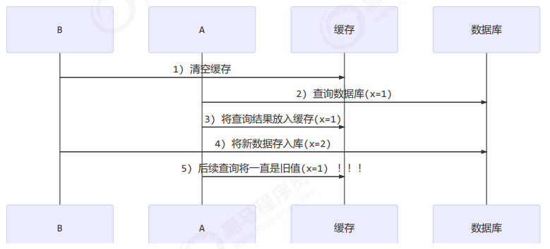

**先更新数据库**

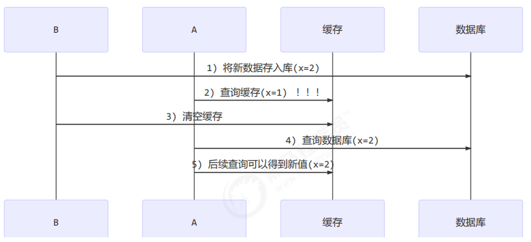

补充一种情况，假设查询线程 A 查询数据时恰好缓存数据由于时间到期失效，或是第一次查询

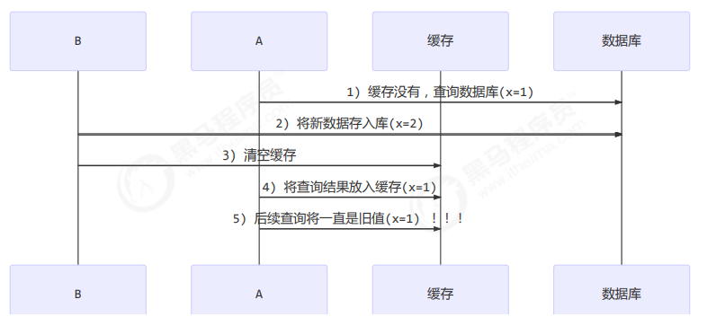

这种情况的出现几率非常小，见 facebook 论文


##### 读写锁实现一致性缓存

使用读写锁实现一个简单的按需加载缓存

```java
class GenericCachedDao<T> {
    // HashMap 作为缓存非线程安全, 需要保护
    HashMap<SqlPair, T> map = new HashMap<>();
    ReentrantReadWriteLock lock = new ReentrantReadWriteLock(); 
    GenericDao genericDao = new GenericDao();
    public int update(String sql, Object... params) {
        SqlPair key = new SqlPair(sql, params);
        // 加写锁, 防止其它线程对缓存读取和更改
        lock.writeLock().lock();
        try {
            int rows = genericDao.update(sql, params);
            map.clear();
            return rows;
        } finally {
            lock.writeLock().unlock();
        }
    }
    public T queryOne(Class<T> beanClass, String sql, Object... params) {
        SqlPair key = new SqlPair(sql, params);
        // 加读锁, 防止其它线程对缓存更改
        lock.readLock().lock();
        try {
            T value = map.get(key);
            if (value != null) {
                return value;
            }
        } finally {
            lock.readLock().unlock();
        }
        // 加写锁, 防止其它线程对缓存读取和更改
        lock.writeLock().lock();
        try {
            // get 方法上面部分是可能多个线程进来的, 可能已经向缓存填充了数据
            // 为防止重复查询数据库, 再次验证
            T value = map.get(key);
            if (value == null) {
                // 如果没有, 查询数据库
                value = genericDao.queryOne(beanClass, sql, params);
                map.put(key, value);
            }
            return value;
        } finally {
            lock.writeLock().unlock();
        }
    }
    // 作为 key 保证其是不可变的
    class SqlPair {
        private String sql;
        private Object[] params;
        public SqlPair(String sql, Object[] params) {
            this.sql = sql;
            this.params = params;
        }
        @Override
        public boolean equals(Object o) {
            if (this == o) {
                return true;
            }
            if (o == null || getClass() != o.getClass()) {
                return false;
            }
            SqlPair sqlPair = (SqlPair) o;
            return sql.equals(sqlPair.sql) &&
                Arrays.equals(params, sqlPair.params);
        }
        @Override
        public int hashCode() {
            int result = Objects.hash(sql);
            result = 31 * result + Arrays.hashCode(params);
            return result;
        }
    }
}


```

> **注意** 
>
> - 以上实现体现的是读写锁的应用，保证缓存和数据库的一致性，但有下面的问题没有考虑 
>
>   - 适合读多写少，如果写操作比较频繁，以上实现性能低 
>
>   - 没有考虑缓存容量 
>
>   - 没有考虑缓存过期 
>
>   - 只适合单机 
>
>   - 并发性还是低，目前只会用一把锁 
>
>   - 更新方法太过简单粗暴，清空了所有 key（考虑按类型分区或重新设计 key） 
>
> - 乐观锁实现：用 CAS 去更新


### <font color='blue'>\* 读写锁原理</font>

#### 图解流程

读写锁用的是同一个 Sycn 同步器，因此等待队列、state 等也是同一个

> 和 ReentrantLock 的源码有一定类似
>

**t1 w.lock，t2 r.lock**

1） t1 成功上锁，流程与 ReentrantLock 加锁相比没有特殊之处，不同是写锁状态占了 state 的低 16 位，而读锁 使用的是 state 的高 16 位（分别都用0表示未加锁，1表示加锁，大于一 - 锁重入/多个线程加锁）

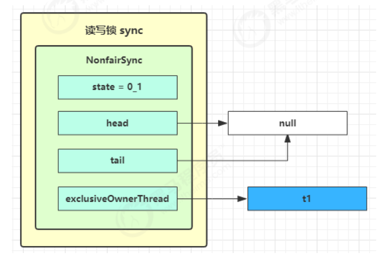

2）t2 执行 r.lock，这时进入读锁的 sync.acquireShared(1) 流程，首先会进入 tryAcquireShared 流程。如果有写 锁占据，那么 tryAcquireShared 返回 -1 表示失败

> tryAcquireShared 返回值表示 
>
> - -1 表示失败
> - 0 表示成功，但后继节点不会继续唤醒 
> - 正数表示成功，而且数值是还有几个后继节点需要唤醒，读写锁返回 1

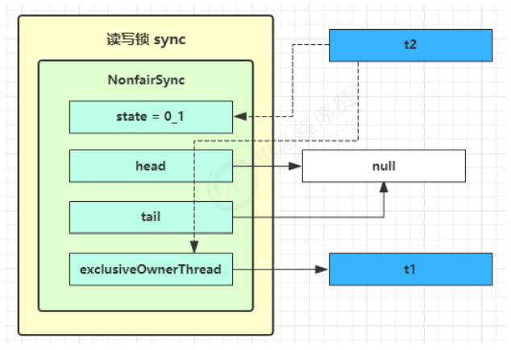

3）这时会进入 sync.doAcquireShared(1) 流程，首先也是调用 addWaiter 添加节点，不同之处在于节点被设置为 Node.SHARED 模式而非 Node.EXCLUSIVE 模式，注意此时 t2 仍处于活跃状态

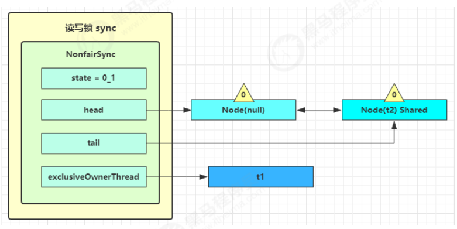

4）t2 会看看自己的节点是不是老二，如果是，还会再次调用 tryAcquireShared(1) 来尝试获取锁 

5）如果没有成功，在 doAcquireShared 内 for (;;) 循环一次，把前驱节点的 waitStatus 改为 -1，再 for (;;) 循环一 次尝试 tryAcquireShared(1) 如果还不成功，那么在 parkAndCheckInterrupt() 处 park

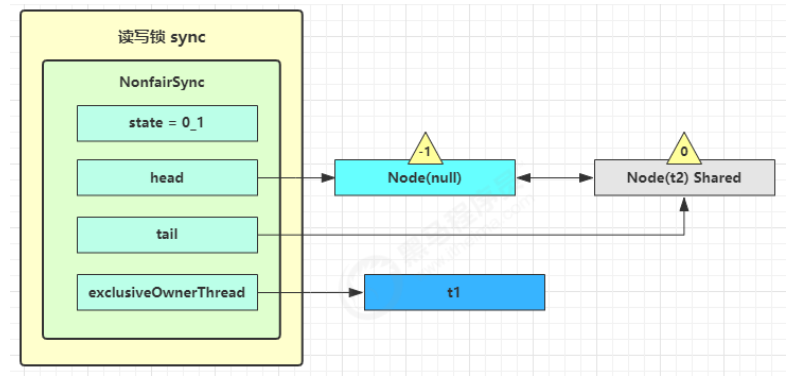

**t3 r.lock，t4 w.lock** 

这种状态下，假设又有 t3 加读锁和 t4 加写锁，这期间 t1 仍然持有锁，就变成了下面的样子

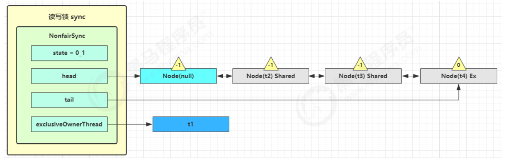


**t1 w.unlock** 

这时会走到写锁的 sync.release(1) 流程，调用 sync.tryRelease(1) 成功，变成下面的样子

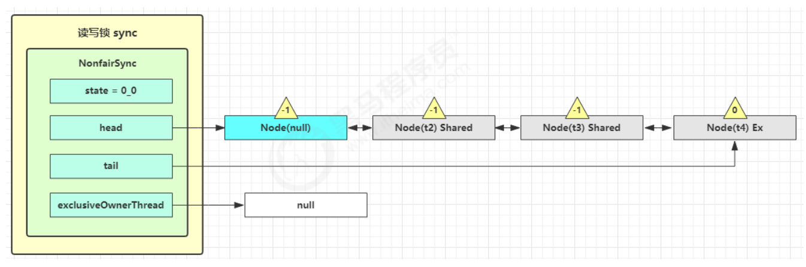

接下来执行唤醒流程 sync.unparkSuccessor，即让老二恢复运行，这时 t2 在 doAcquireShared 内 parkAndCheckInterrupt() 处恢复运行 

这回再来一次 for (;;) 执行 tryAcquireShared 成功则让读锁计数加一

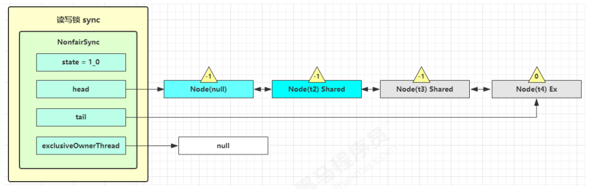

这时 t2 已经恢复运行，接下来 t2 调用 setHeadAndPropagate(node, 1)，它原本所在节点被置为头节点

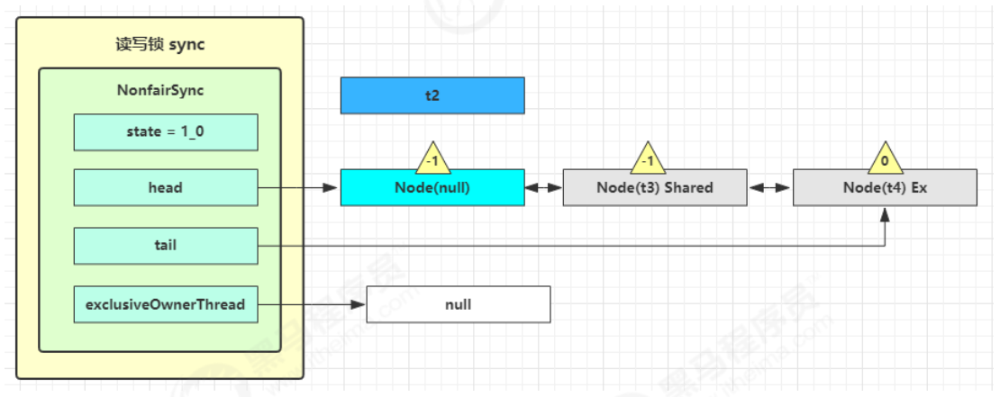

事情还没完，在 setHeadAndPropagate 方法内还会检查下一个节点是否是 shared，如果是则调用 doReleaseShared() 将 head 的状态从 -1 改为 0 并唤醒老二，这时 t3 在 doAcquireShared 内 parkAndCheckInterrupt() 处恢复运行

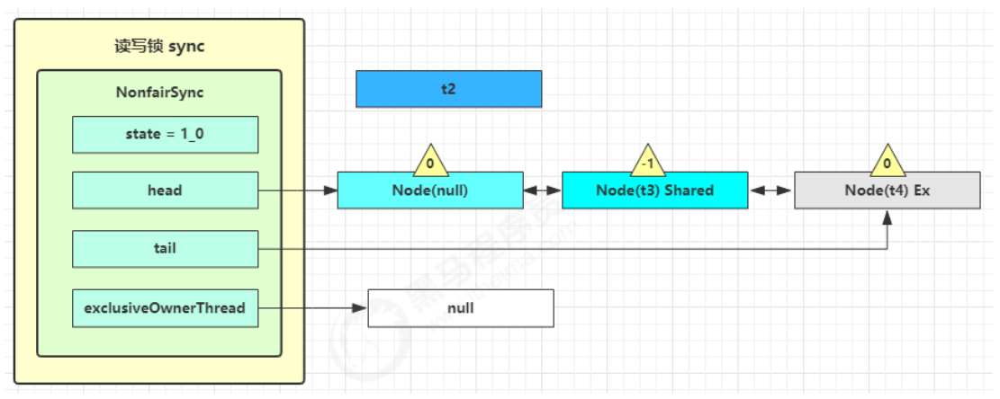

这回再来一次 for (;;) 执行 tryAcquireShared 成功则让读锁计数加一

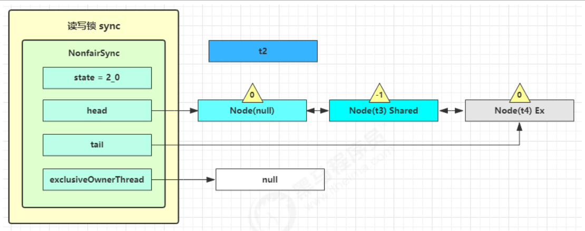

这时 t3 已经恢复运行，接下来 t3 调用 setHeadAndPropagate(node, 1)，它原本所在节点被置为头节点

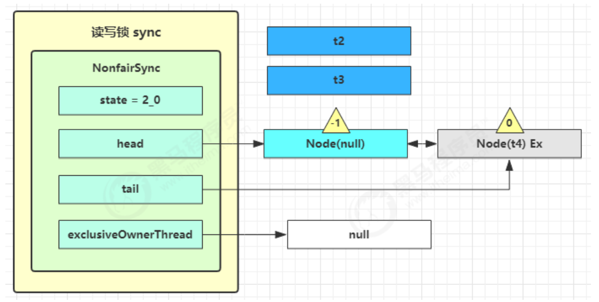

下一个节点不是 shared 了，因此不会继续唤醒 t4 所在节点

**t2 r.unlock，t3 r.unlock**

t2 进入 sync.releaseShared(1) 中，调用 tryReleaseShared(1) 让计数减一，但由于计数还不为零

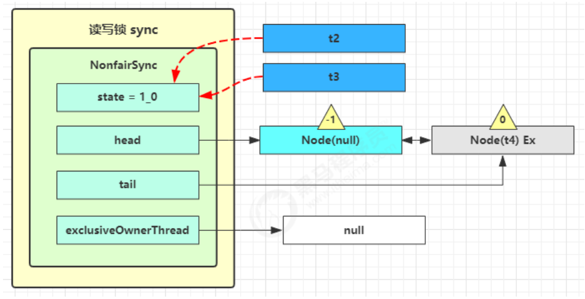

t3 进入 sync.releaseShared(1) 中，调用 tryReleaseShared(1) 让计数减一，这回计数为零了，进入 doReleaseShared() 将头节点从 -1 改为 0 并唤醒老二，即

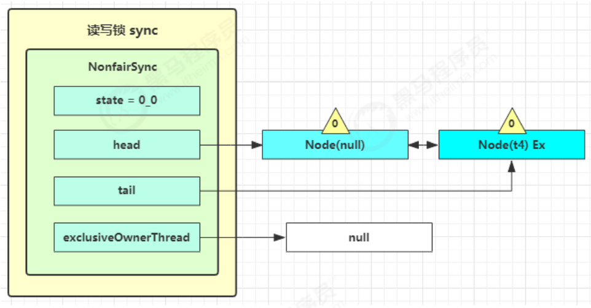

之后 t4 在 acquireQueued 中 parkAndCheckInterrupt 处恢复运行，再次 for (;;) 这次自己是老二，并且没有其他 竞争，tryAcquire(1) 成功，修改头结点，流程结束

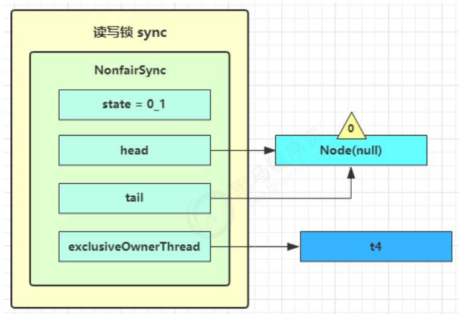


#### 源码分析

##### **写锁上锁流程**

```java
static final class NonfairSync extends Sync {
    // ... 省略无关代码

    // 外部类 WriteLock 方法, 方便阅读, 放在此处
    public void lock() {
        sync.acquire(1);
    }

    // AQS 继承过来的方法, 方便阅读, 放在此处
    public final void acquire(int arg) {
        if (
            // 尝试获得写锁失败
            !tryAcquire(arg) &&
            // 将当前线程关联到一个 Node 对象上, 模式为独占模式
            // 进入 AQS 队列阻塞
            acquireQueued(addWaiter(Node.EXCLUSIVE), arg)
        ) {
            selfInterrupt();
        }
    }

    // Sync 继承过来的方法, 方便阅读, 放在此处
    protected final boolean tryAcquire(int acquires) {
        
        Thread current = Thread.currentThread();
        int c = getState();
        // 获得低 16 位, 代表写锁的 state 计数
        int w = exclusiveCount(c);
		//表示有写锁或者有读锁
        if (c != 0) {
            if (
                // c != 0 and w == 0 表示有读锁, 或者
                w == 0 ||
                // 如果 exclusiveOwnerThread 不是自己
                current != getExclusiveOwnerThread()
            ) {
                // 获得锁失败
                return false;
            }
            // 写锁计数超过低 16 位, 报异常
            if (w + exclusiveCount(acquires) > MAX_COUNT)
                throw new Error("Maximum lock count exceeded");
            // 写锁重入, 获得锁成功
            setState(c + acquires);
            return true;
        } 
        if (
            // 判断写锁是否该阻塞, 或者
            // 非公平锁下，总是返回false
            writerShouldBlock() ||
            // 尝试更改计数,如果失败,则return false
            !compareAndSetState(c, c + acquires)
        ) {
            // 获得锁失败
            return false;
        }
        // 获得锁成功
        setExclusiveOwnerThread(current);
        return true;
    }

    // 非公平锁 writerShouldBlock 总是返回 false, 无需阻塞
    final boolean writerShouldBlock() {
        return false;
    }
}


```

总结：

- `lock` -> `syn.acquire`  ->`tryAquire`
  - 如果有锁：
    - 如果是写锁或者锁持有者不为自己，返回false
    - 如果时写锁且为自己持有，则重入
  - 如果无锁：
    - 判断无序阻塞并设置state成功后，将owner设为自己，返回true
- 成功，则获得了锁
- 失败：
  - 调用`acquireQueued(addWaiter(Node.EXCLUSIVE), arg)`进入阻塞队列，将节点状态设置为EXCLUSIVE，之后的逻辑与之前的aquireQueued类似。


##### **写锁释放流程**

```java
static final class NonfairSync extends Sync {
    // ... 省略无关代码

    // WriteLock 方法, 方便阅读, 放在此处
    public void unlock() {
        sync.release(1);
    }

    // AQS 继承过来的方法, 方便阅读, 放在此处
    public final boolean release(int arg) {
        // 尝试释放写锁成功
        if (tryRelease(arg)) {
            // unpark AQS 中等待的线程
            Node h = head;
            if (h != null && h.waitStatus != 0)
                unparkSuccessor(h);
            return true;
        }
        return false;
    }

    // Sync 继承过来的方法, 方便阅读, 放在此处
    protected final boolean tryRelease(int releases) {
        if (!isHeldExclusively())
            throw new IllegalMonitorStateException();
        int nextc = getState() - releases;
        // 因为可重入的原因, 写锁计数为 0, 才算释放成功
        boolean free = exclusiveCount(nextc) == 0;
        if (free) {
            setExclusiveOwnerThread(null);
        }
        setState(nextc);
        return free;
    }
}


```

总结：

- `unlock`->`syn.release`->`tryRelease`

  - state状态减少
    - 如果减为零，表示解锁成功，返回true
    - 没有减为0，当前线程依旧持有锁

- 成功：解锁成功

  - 如果ASQ队列不为空，则唤醒第一个节点。

- 失败：解锁失败。

  


##### **读锁上锁流程**

```java
static final class NonfairSync extends Sync {

    // ReadLock 方法, 方便阅读, 放在此处
    public void lock() {
        sync.acquireShared(1);
    }

    // AQS 继承过来的方法, 方便阅读, 放在此处
    public final void acquireShared(int arg) {
        // tryAcquireShared 返回负数, 表示获取读锁失败
        //大于0的情况在读写锁这里无区别，后面信号量会做进一步处理。
        if (tryAcquireShared(arg) < 0) {
            doAcquireShared(arg);
        }
    }

    // Sync 继承过来的方法, 方便阅读, 放在此处
    protected final int tryAcquireShared(int unused) {
        Thread current = Thread.currentThread();
        int c = getState();
        // 如果是其它线程持有写锁, 获取读锁失败
        if ( 
            exclusiveCount(c) != 0 &&
            getExclusiveOwnerThread() != current
        ) {
            return -1;
        }
        int r = sharedCount(c);
        if (
            // 读锁不该阻塞(如果老二是写锁，读锁该阻塞), 并且
            !readerShouldBlock() &&
            // 小于读锁计数, 并且
            r < MAX_COUNT &&
            // 尝试增加计数成功
            compareAndSetState(c, c + SHARED_UNIT)
        ) {
            // ... 省略不重要的代码
            return 1;
        }
        return fullTryAcquireShared(current);
    }

    // 非公平锁 readerShouldBlock 看 AQS 队列中第一个节点是否是写锁
    // true 则该阻塞, false 则不阻塞
    final boolean readerShouldBlock() {
        return apparentlyFirstQueuedIsExclusive();
    }

    // AQS 继承过来的方法, 方便阅读, 放在此处
    // 与 tryAcquireShared 功能类似, 但会不断尝试 for (;;) 获取读锁, 执行过程中无阻塞
    final int fullTryAcquireShared(Thread current) {
        HoldCounter rh = null;
        for (;;) {
            int c = getState();
            if (exclusiveCount(c) != 0) {
                if (getExclusiveOwnerThread() != current)
                    return -1;
            } else if (readerShouldBlock()) {
                // ... 省略不重要的代码
            }
            if (sharedCount(c) == MAX_COUNT)
                throw new Error("Maximum lock count exceeded");
            if (compareAndSetState(c, c + SHARED_UNIT)) {
                // ... 省略不重要的代码
                return 1;
            }
        }
    }

    // AQS 继承过来的方法, 方便阅读, 放在此处
    private void doAcquireShared(int arg) {
        // 将当前线程关联到一个 Node 对象上, 模式为共享模式
        final Node node = addWaiter(Node.SHARED);
        boolean failed = true;
        try {
            boolean interrupted = false;
            for (;;) {
                final Node p = node.predecessor();
                if (p == head) {
                    // 再一次尝试获取读锁
                    int r = tryAcquireShared(arg);
                    // 成功
                    if (r >= 0) {
                        // ㈠
                        // r 表示可用资源数, 在这里总是 1 允许传播
                        //（唤醒 AQS 中下一个 Share 节点）
                        setHeadAndPropagate(node, r);
                        p.next = null; // help GC
                        if (interrupted)
                            selfInterrupt();
                        failed = false;
                        return;
                    }
                }
                if (
                    // 是否在获取读锁失败时阻塞（前一个阶段 waitStatus == Node.SIGNAL）
                    shouldParkAfterFailedAcquire(p, node) &&
                    // park 当前线程
                    parkAndCheckInterrupt()
                ) {
                    interrupted = true;
                }
            }
        } finally {
            if (failed)
                cancelAcquire(node);
        }
    }

    // ㈠ AQS 继承过来的方法, 方便阅读, 放在此处
    private void setHeadAndPropagate(Node node, int propagate) {
        Node h = head; // Record old head for check below
        // 设置自己为 head
        setHead(node);

        // propagate 表示有共享资源（例如共享读锁或信号量）
        // 原 head waitStatus == Node.SIGNAL 或 Node.PROPAGATE
        // 现在 head waitStatus == Node.SIGNAL 或 Node.PROPAGATE
        if (propagate > 0 || h == null || h.waitStatus < 0 ||
            (h = head) == null || h.waitStatus < 0) {
            Node s = node.next;
            // 如果是最后一个节点或者是等待共享读锁的节点
            if (s == null || s.isShared()) {
                // 进入 ㈡
                doReleaseShared();
            }
        }
    }

    // ㈡ AQS 继承过来的方法, 方便阅读, 放在此处
    private void doReleaseShared() {
        // 如果 head.waitStatus == Node.SIGNAL ==> 0 成功, 下一个节点 unpark
        // 如果 head.waitStatus == 0 ==> Node.PROPAGATE, 为了解决 bug, 见后面分析
        for (;;) {
            Node h = head;
            // 队列还有节点
            if (h != null && h != tail) {
                int ws = h.waitStatus;
                if (ws == Node.SIGNAL) {
                    if (!compareAndSetWaitStatus(h, Node.SIGNAL, 0))
                        continue; // loop to recheck cases
                    // 下一个节点 unpark 如果成功获取读锁
                    // 并且下下个节点还是 shared, 继续 doReleaseShared
                    unparkSuccessor(h);
                }
                else if (ws == 0 &&
                         !compareAndSetWaitStatus(h, 0, Node.PROPAGATE))
                    continue; // loop on failed CAS
            }
            if (h == head) // loop if head changed
                break;
        }
    }
}


```

总结：

- `lock`->`syn.acquireShare`->`tryAcquireShare`
  - 如果其他线程持有写锁：则失败，返回-1
  - 否则：判断无需等待后，将state加上一个写锁的单位，返回1
- 返回值大于等于0：成功
- 返回值小于0：
  - 调用doAcquireShare，类似之前的aquireQueued,将当前线程关联节点，状态设置为SHARE，插入AQS队列尾部。在for循环中判断当前节点的前驱节点是否为头节点
    - 是：调用`tryAcquireShare`
      - 如果返回值大于等于0，则获取锁成功，并调用`setHeadAndPropagate`，出队，并不断唤醒AQS队列中的状态为SHARE的节点，直到下一个节点为EXCLUSIVE。记录打断标记，之后退出方法（不返回打断标记）
  - 判断是否在失败后阻塞
    - 是：阻塞住，并监测打断信号。
    - 否则：将前驱节点状态设为-1。（下一次循环就又要阻塞了）


##### **读锁释放流程**

```java
static final class NonfairSync extends Sync {

    // ReadLock 方法, 方便阅读, 放在此处
    public void unlock() {
        sync.releaseShared(1);
    }

    // AQS 继承过来的方法, 方便阅读, 放在此处
    public final boolean releaseShared(int arg) {
        if (tryReleaseShared(arg)) {
            doReleaseShared();
            return true;
        }
        return false;
    }

    // Sync 继承过来的方法, 方便阅读, 放在此处
    protected final boolean tryReleaseShared(int unused) {
        // ... 省略不重要的代码
        for (;;) {
            int c = getState();
            int nextc = c - SHARED_UNIT;
            if (compareAndSetState(c, nextc)) {
                // 读锁的计数不会影响其它获取读锁线程, 但会影响其它获取写锁线程
                // 计数为 0 才是真正释放
                return nextc == 0;
            }
        }
    }

    // AQS 继承过来的方法, 方便阅读, 放在此处
    private void doReleaseShared() {
        // 如果 head.waitStatus == Node.SIGNAL ==> 0 成功, 下一个节点 unpark
        // 如果 head.waitStatus == 0 ==> Node.PROPAGATE 
        for (;;) {
            Node h = head;
            if (h != null && h != tail) {
                int ws = h.waitStatus;
                // 如果有其它线程也在释放读锁，那么需要将 waitStatus 先改为 0
                // 防止 unparkSuccessor 被多次执行
                if (ws == Node.SIGNAL) {
                    if (!compareAndSetWaitStatus(h, Node.SIGNAL, 0))
                        continue; // loop to recheck cases
                    unparkSuccessor(h);
                }
                // 如果已经是 0 了，改为 -3，用来解决传播性，见后文信号量 bug 分析
                else if (ws == 0 &&
                         !compareAndSetWaitStatus(h, 0, Node.PROPAGATE))
                    continue; // loop on failed CAS
            }
            if (h == head) // loop if head changed
                break;
        }
    } 
}


```

总结：

- `unlock`->`releaseShared`->`tryReleaseShared`,将state减去一个share单元，最后state为0则返回true，不然返回false。
- 返回tue：调用`doReleaseShare`,唤醒队列中的节点。
- 返回false：解锁不完全。


###  2.StampedLock

该类自 JDK 8 加入，是为了进一步优化读性能，它的特点是在使用读锁、写锁时都必须配合【戳】使用 加解读锁

```java
long stamp = lock.readLock();
lock.unlockRead(stamp);


```

加解写锁

```java
long stamp = lock.writeLock();
lock.unlockWrite(stamp);


```

乐观读，StampedLock 支持 `tryOptimisticRead()` 方法（**乐观读**），**读取完毕后需要做一次 戳校验 如果校验通过，表示这期间确实没有写操作，数据可以安全使用**，如果校验没通过，需要重新获取读锁，保证数据安全。

```java
long stamp = lock.tryOptimisticRead();
// 验戳
if(!lock.validate(stamp)){
    // 锁升级
}


```

提供一个`数据容器类`内部分别使用读锁保护数据的`read()`方法，写锁保护数据的`write()`方法

```JAVA
class DataContainerStamped {
    private int data;
    private final StampedLock lock = new StampedLock();
    public DataContainerStamped(int data) {
        this.data = data;
    }
    public int read(int readTime) {
        //获取戳
        long stamp = lock.tryOptimisticRead();
        log.debug("optimistic read locking...{}", stamp);
        //读取数据
        sleep(readTime);
        //读取数据之后再验戳
        if (lock.validate(stamp)) {
            log.debug("read finish...{}, data:{}", stamp, data);
            return data;
        }
        //如果验戳失败，[说明已经数据已经被修改]，需要升级锁,重新读。
        // 锁升级 - 读锁
        log.debug("updating to read lock... {}", stamp);
        try {
            stamp = lock.readLock();
            log.debug("read lock {}", stamp);
            sleep(readTime);
            log.debug("read finish...{}, data:{}", stamp, data);
            return data;
        } finally {
            log.debug("read unlock {}", stamp);
            lock.unlockRead(stamp);
        }
    }
    public void write(int newData) {
        long stamp = lock.writeLock();
        log.debug("write lock {}", stamp);
        try {
            sleep(2);
            this.data = newData;
        } finally {
            log.debug("write unlock {}", stamp);
            lock.unlockWrite(stamp);
        }
    }
}


```

测试`读-读`可以优化

```JAVA
public static void main(String[] args) {
    DataContainerStamped dataContainer = new DataContainerStamped(1);
    new Thread(() -> {
        dataContainer.read(1);
    }, "t1").start();
    sleep(0.5);
    new Thread(() -> {
        dataContainer.read(0);
    }, "t2").start();
}


```

输出结果，可以看到实际没有加读锁

```SH
15:58:50.217 c.DataContainerStamped [t1] - optimistic read locking...256 
15:58:50.717 c.DataContainerStamped [t2] - optimistic read locking...256 
15:58:50.717 c.DataContainerStamped [t2] - read finish...256, data:1 
15:58:51.220 c.DataContainerStamped [t1] - read finish...256, data:1 


```

测试`读-写`时优化读补加读锁

```JAVA
public static void main(String[] args) {
    DataContainerStamped dataContainer = new DataContainerStamped(1);
    new Thread(() -> {
        dataContainer.read(1);
    }, "t1").start();
    sleep(0.5);
    new Thread(() -> {
        dataContainer.write(100);
    }, "t2").start();
}


```

输出结果

```SH
15:57:00.219 c.DataContainerStamped [t1] - optimistic read locking...256 
15:57:00.717 c.DataContainerStamped [t2] - write lock 384 
15:57:01.225 c.DataContainerStamped [t1] - updating to read lock... 256 
15:57:02.719 c.DataContainerStamped [t2] - write unlock 384 
15:57:02.719 c.DataContainerStamped [t1] - read lock 513 
15:57:03.719 c.DataContainerStamped [t1] - read finish...513, data:1000 
15:57:03.719 c.DataContainerStamped [t1] - read unlock 513 


```

> **注意** 
>
> - StampedLock 不支持条件变量 
> - StampedLock 不支持可重入


## Semaphore


### 基本使用

[ˈsɛməˌfɔr] 信号量，用来限制能同时访问共享资源的线程上限。

```java
public static void main(String[] args) {
    // 1. 创建 semaphore 对象
    Semaphore semaphore = new Semaphore(3);
    // 2. 10个线程同时运行
    for (int i = 0; i < 10; i++) {
        new Thread(() -> {
            // 3. 获取许可
            try {
                semaphore.acquire();
            //对于非打断式获取，如果此过程中被打断，线程依旧会等到获取了信号量之后才进入catch块。
            //catch块中的线程依旧持有信号量，捕获该异常后catch块可以不做任何处理。
            } catch (InterruptedException e) {
                e.printStackTrace();
            }
            try {
                log.debug("running...");
                sleep(1);
                log.debug("end...");
            } finally {
                // 4. 释放许可
                semaphore.release();
            }
        }).start();
    }
}


```

输出

```sh
07:35:15.485 c.TestSemaphore [Thread-2] - running... 
07:35:15.485 c.TestSemaphore [Thread-1] - running... 
07:35:15.485 c.TestSemaphore [Thread-0] - running... 
07:35:16.490 c.TestSemaphore [Thread-2] - end... 
07:35:16.490 c.TestSemaphore [Thread-0] - end... 
07:35:16.490 c.TestSemaphore [Thread-1] - end... 
07:35:16.490 c.TestSemaphore [Thread-3] - running... 
07:35:16.490 c.TestSemaphore [Thread-5] - running... 
07:35:16.490 c.TestSemaphore [Thread-4] - running... 
07:35:17.490 c.TestSemaphore [Thread-5] - end... 
07:35:17.490 c.TestSemaphore [Thread-4] - end... 
07:35:17.490 c.TestSemaphore [Thread-3] - end... 
07:35:17.490 c.TestSemaphore [Thread-6] - running... 
07:35:17.490 c.TestSemaphore [Thread-7] - running... 
07:35:17.490 c.TestSemaphore [Thread-9] - running... 
07:35:18.491 c.TestSemaphore [Thread-6] - end... 
07:35:18.491 c.TestSemaphore [Thread-7] - end... 
07:35:18.491 c.TestSemaphore [Thread-9] - end... 
07:35:18.491 c.TestSemaphore [Thread-8] - running... 
07:35:19.492 c.TestSemaphore [Thread-8] - end... 


```

说明：

- Semaphore有两个构造器：`Semaphore(int permits)`和`Semaphore(int permits,boolean fair)`
- permits表示允许同时访问共享资源的线程数。
- fair表示公平与否，与之前的ReentrantLock一样。


### <font color='green'>\* Semaphore 应用</font>


semaphore 限制对共享资源的使用 

- 使用 Semaphore 限流，在访问高峰期时，让请求线程阻塞，高峰期过去再释放许可，当然它只适合限制单机 线程数量，并且仅是限制线程数，而不是限制资源数（例如连接数，请对比 Tomcat LimitLatch 的实现） 
- 用 Semaphore 实现简单连接池，对比『享元模式』下的实现（用wait notify），性能和可读性显然更好， 注意下面的实现中线程数和数据库连接数是相等的

```java
@Slf4j(topic = "c.Pool")
class Pool {
    // 1. 连接池大小
    private final int poolSize;
    // 2. 连接对象数组
    private Connection[] connections;
    // 3. 连接状态数组 0 表示空闲， 1 表示繁忙
    private AtomicIntegerArray states;
    private Semaphore semaphore;
    // 4. 构造方法初始化
    public Pool(int poolSize) {
        this.poolSize = poolSize;
        // 让许可数与资源数一致
        this.semaphore = new Semaphore(poolSize);
        this.connections = new Connection[poolSize];
        this.states = new AtomicIntegerArray(new int[poolSize]);
        for (int i = 0; i < poolSize; i++) {
            connections[i] = new MockConnection("连接" + (i+1));
        }
    }
    // 5. 借连接
    public Connection borrow() {// t1, t2, t3
        // 获取许可
        try {
            semaphore.acquire(); // 没有许可的线程，在此等待
        } catch (InterruptedException e) {
            e.printStackTrace();
        }
        for (int i = 0; i < poolSize; i++) {
            // 获取空闲连接
            if(states.get(i) == 0) {
                if (states.compareAndSet(i, 0, 1)) {
                    log.debug("borrow {}", connections[i]);
                    return connections[i];
                }
            }
        }
        // 不会执行到这里
        return null;
    }
    // 6. 归还连接
    public void free(Connection conn) {
        for (int i = 0; i < poolSize; i++) {
            if (connections[i] == conn) {
                states.set(i, 0);
                log.debug("free {}", conn);
                semaphore.release();
                break;
            }
        }
    }
}


```


### <font color='blue'>* Semaphore 原理</font>


#### 加锁解锁流程

Semaphore有点像一个停车场，permits就好像停车位数量，当线程获得了permits就像是获得了停车位，然后停车场显示空余车位减一。 

刚开始，permits（state）为 3，这时 5 个线程来获取资源

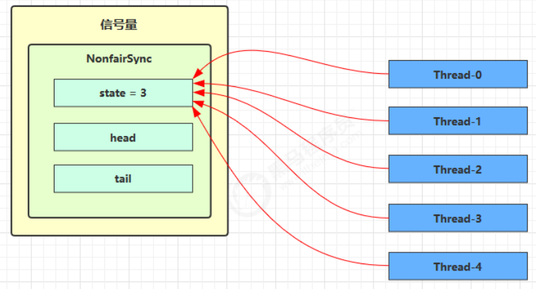

假设其中 Thread-1，Thread-2，Thread-4 cas 竞争成功，而 Thread-0 和 Thread-3 竞争失败，进入 AQS 队列 park 阻塞

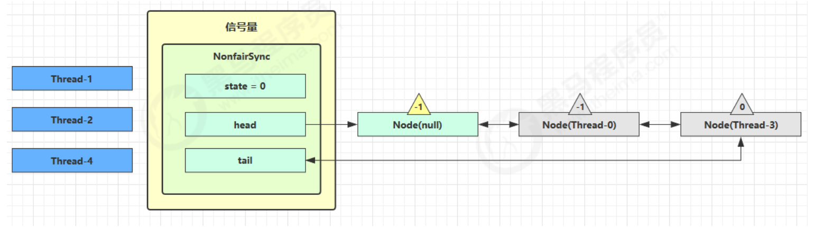

这时 Thread-4 释放了 permits，状态如下

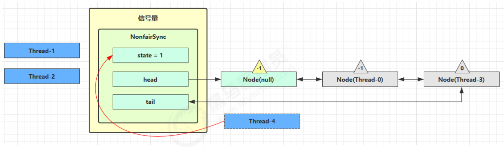

接下来 Thread-0 竞争成功，permits 再次设置为 0，设置自己为 head 节点，断开原来的 head 节点，unpark 接 下来的 Thread-3 节点，但由于 permits 是 0，因此 Thread-3 在尝试不成功后再次进入 park 状态

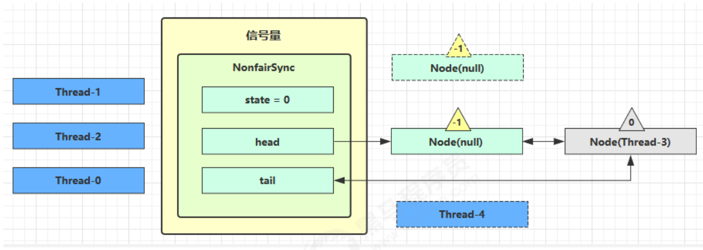


#### 源码分析

```java
static final class NonfairSync extends Sync {
    private static final long serialVersionUID = -2694183684443567898L;
    NonfairSync(int permits) {
        // permits 即 state
        super(permits);
    }

    // Semaphore 方法, 方便阅读, 放在此处
    public void acquire() throws InterruptedException {
        sync.acquireSharedInterruptibly(1);
    }
    // AQS 继承过来的方法, 方便阅读, 放在此处
    public final void acquireSharedInterruptibly(int arg)
        throws InterruptedException {
        if (Thread.interrupted())
            throw new InterruptedException();
        if (tryAcquireShared(arg) < 0)
            doAcquireSharedInterruptibly(arg);
    }

    // 尝试获得共享锁
    protected int tryAcquireShared(int acquires) {
        return nonfairTryAcquireShared(acquires);
    }

    // Sync 继承过来的方法, 方便阅读, 放在此处
    final int nonfairTryAcquireShared(int acquires) {
        for (;;) {
            int available = getState();
            int remaining = available - acquires; 
            if (
                // 如果许可已经用完, 返回负数, 表示获取失败, 进入 doAcquireSharedInterruptibly
                remaining < 0 ||
                // 如果 cas 重试成功, 返回正数, 表示获取成功
                compareAndSetState(available, remaining)
            ) {
                return remaining;
            }
        }
    }

    // AQS 继承过来的方法, 方便阅读, 放在此处
    private void doAcquireSharedInterruptibly(int arg) throws InterruptedException {
        final Node node = addWaiter(Node.SHARED);
        boolean failed = true;
        try {
            for (;;) {
                final Node p = node.predecessor();
                if (p == head) {
                    // 再次尝试获取许可
                    int r = tryAcquireShared(arg);
                    if (r >= 0) {
                        // 成功后本线程出队（AQS）, 所在 Node设置为 head
                        // 如果 head.waitStatus == Node.SIGNAL ==> 0 成功, 下一个节点 unpark
                        // 如果 head.waitStatus == 0 ==> Node.PROPAGATE 
                        // r 表示可用资源数, 为 0 则不会继续传播
                        setHeadAndPropagate(node, r);
                        p.next = null; // help GC
                        failed = false;
                        return;
                    }
                }
                // 不成功, 设置上一个节点 waitStatus = Node.SIGNAL, 下轮进入 park 阻塞
                if (shouldParkAfterFailedAcquire(p, node) &&
                    parkAndCheckInterrupt())
                    throw new InterruptedException();
            }
        } finally {
            if (failed)
                cancelAcquire(node);
        }
    }

    // Semaphore 方法, 方便阅读, 放在此处
    public void release() {
        sync.releaseShared(1);
    }

    // AQS 继承过来的方法, 方便阅读, 放在此处
    public final boolean releaseShared(int arg) {
        if (tryReleaseShared(arg)) {
            doReleaseShared();
            return true;
        }
        return false;
    }

    // Sync 继承过来的方法, 方便阅读, 放在此处
    protected final boolean tryReleaseShared(int releases) {
        for (;;) {
            int current = getState();
            int next = current + releases;
            if (next < current) // overflow
                throw new Error("Maximum permit count exceeded");
            if (compareAndSetState(current, next))
                return true;
        }
    }
}
private void setHeadAndPropagate(Node node, int propagate) {
    Node h = head; // Record old head for check below
    // 设置自己为 head
    setHead(node);
    // propagate 表示有共享资源（例如共享读锁或信号量）
    // 原 head waitStatus == Node.SIGNAL 或 Node.PROPAGATE
    // 现在 head waitStatus == Node.SIGNAL 或 Node.PROPAGATE
    if (propagate > 0 || h == null || h.waitStatus < 0 ||
        (h = head) == null || h.waitStatus < 0) {
        Node s = node.next;
        // 如果是最后一个节点或者是等待共享读锁的节点
        if (s == null || s.isShared()) {
            doReleaseShared();
        }
    }
}
private void doReleaseShared() {
    for (;;) {
        Node h = head;
        if (h != null && h != tail) {
            int ws = h.waitStatus;
            if (ws == Node.SIGNAL) {
                if (!compareAndSetWaitStatus(h, Node.SIGNAL, 0))
                    continue;            // loop to recheck cases
                unparkSuccessor(h);
            }
            else if (ws == 0 &&
                     !compareAndSetWaitStatus(h, 0, Node.PROPAGATE))
                continue;                // loop on failed CAS
        }
        if (h == head)                   // loop if head changed
            break;
    }
}


```

##### 加锁流程总结：

- `acquire`->`acquireSharedInterruptibly(1)`->`tryAcquireShared(1)`->`nonfairTryAcquireShared(1)`,如果资源用完了，返回负数，`tryAcquireShared`返回负数，表示失败。否则返回正数，`tryAcquireShared`返回正数,表示成功。
  - 如果成功，获取信号量成功。
  - 如果失败，调用`doAcquireSharedInterruptibly`,进入for循环：
    - 如果当前驱节点为头节点，调用`tryAcquireShared`尝试获取锁
      - 如果结果大于等于0，表明获取锁成功，调用`setHeadAndPropagate`，将当前节点设为头节点，之后又调用`doReleaseShared`，唤醒后继节点。
    - 调用`shoudParkAfterFailure`,第一次调用返回false，并将前驱节点改为-1，第二次循环如果再进入此方法，会进入阻塞并检查打断的方法。

##### 解锁流程总结：

- `release`->`sync.releaseShared(1)`->`tryReleaseShared(1)`,只要不发生整数溢出，就返回true
  - 如果返回true，调用`doReleaseShared`，唤醒后继节点。
  - 如果返回false，解锁失败。


#### 为什么要有 PROPAGATE


## CountdownLatch

用来进行线程同步协作，等待所有线程完成倒计时。 

其中构造参数用来初始化等待计数值，await() 用来等待计数归零，countDown() 用来让计数减一

```java
public static void main(String[] args) throws InterruptedException {
    CountDownLatch latch = new CountDownLatch(3);
    new Thread(() -> {
        log.debug("begin...");
        sleep(1);
        latch.countDown();
        log.debug("end...{}", latch.getCount());
    }).start();
    new Thread(() -> {
        log.debug("begin...");
        sleep(2);
        latch.countDown();
        log.debug("end...{}", latch.getCount());
    }).start();
    new Thread(() -> {
        log.debug("begin...");
        sleep(1.5);
        latch.countDown();
        log.debug("end...{}", latch.getCount());
    }).start();
    log.debug("waiting...");
    latch.await();
    log.debug("wait end...");
}


```

输出

```sh
18:44:00.778 c.TestCountDownLatch [main] - waiting... 
18:44:00.778 c.TestCountDownLatch [Thread-2] - begin... 
18:44:00.778 c.TestCountDownLatch [Thread-0] - begin... 
18:44:00.778 c.TestCountDownLatch [Thread-1] - begin... 
18:44:01.782 c.TestCountDownLatch [Thread-0] - end...2 
18:44:02.283 c.TestCountDownLatch [Thread-2] - end...1 
18:44:02.782 c.TestCountDownLatch [Thread-1] - end...0 
18:44:02.782 c.TestCountDownLatch [main] - wait end... 


```

相比于join，CountDownLatch能配合线程池使用。

```java
public static void main(String[] args) throws InterruptedException {
    CountDownLatch latch = new CountDownLatch(3);
    ExecutorService service = Executors.newFixedThreadPool(4);
    service.submit(() -> {
        log.debug("begin...");
        sleep(1);
        latch.countDown();
        log.debug("end...{}", latch.getCount());
    });
    service.submit(() -> {
        log.debug("begin...");
        sleep(1.5);
        latch.countDown();
        log.debug("end...{}", latch.getCount());
    });
    service.submit(() -> {
        log.debug("begin...");
        sleep(2);
        latch.countDown();
        log.debug("end...{}", latch.getCount());
    });
    service.submit(()->{
        try {
            log.debug("waiting...");
            latch.await();
            log.debug("wait end...");
        } catch (InterruptedException e) {
            e.printStackTrace();
        }
    });
}


```


### <font color='green'>\* 应用之同步等待多线程准备完毕</font>

```java
AtomicInteger num = new AtomicInteger(0);
ExecutorService service = Executors.newFixedThreadPool(10, (r) -> {
    return new Thread(r, "t" + num.getAndIncrement());
});
CountDownLatch latch = new CountDownLatch(10);
String[] all = new String[10];
Random r = new Random();
for (int j = 0; j < 10; j++) {
    int x = j;
    service.submit(() -> {
        for (int i = 0; i <= 100; i++) {
            try {
                //随机休眠，模拟网络延迟
                Thread.sleep(r.nextInt(100));
            } catch (InterruptedException e) {
            }
            all[x] = Thread.currentThread().getName() + "(" + (i + "%") + ")";
            //\r可以让当前输出覆盖上一次的输出。
            System.out.print("\r" + Arrays.toString(all));
        }
        latch.countDown();
    });
}
latch.await();
System.out.println("\n游戏开始...");
service.shutdown();


```

中间输出

```sh
[t0(52%), t1(47%), t2(51%), t3(40%), t4(49%), t5(44%), t6(49%), t7(52%), t8(46%), t9(46%)] 


```

最后输出

```sh
[t0(100%), t1(100%), t2(100%), t3(100%), t4(100%), t5(100%), t6(100%), t7(100%), t8(100%), 
t9(100%)] 
游戏开始... 


```


### ==<font color='green'>\* 应用之同步等待多个远程调用结束</font>==

* 开启多个线程 调用接口/xxx（不用串行）

  并使用 `CountDownLatch` 等待多个结果都返回再处理

```java
@RestController
public class TestCountDownlatchController {
    @GetMapping("/order/{id}")
    public Map<String, Object> order(@PathVariable int id) {
        HashMap<String, Object> map = new HashMap<>();
        map.put("id", id);
        map.put("total", "2300.00");
        sleep(2000);
        return map;
    }
    @GetMapping("/product/{id}")
    public Map<String, Object> product(@PathVariable int id) {
        HashMap<String, Object> map = new HashMap<>();
        if (id == 1) {
            map.put("name", "小爱音箱");
            map.put("price", 300);
        } else if (id == 2) {
            map.put("name", "小米手机");
            map.put("price", 2000);
        }
        map.put("id", id);
        sleep(1000);
        return map;
    }
    @GetMapping("/logistics/{id}")
    public Map<String, Object> logistics(@PathVariable int id) {
        HashMap<String, Object> map = new HashMap<>();
        map.put("id", id);
        map.put("name", "中通快递");
        sleep(2500);
        return map;
    }
    private void sleep(int millis) {
        try {
            Thread.sleep(millis);
        } catch (InterruptedException e) {
            e.printStackTrace();
        }
    }
}


```

rest远程调用

```java
RestTemplate restTemplate = new RestTemplate();
log.debug("begin");
ExecutorService service = Executors.newCachedThreadPool();
CountDownLatch latch = new CountDownLatch(4);
Future<Map<String,Object>> f1 = service.submit(() -> {
    Map<String, Object> r =
        restTemplate.getForObject("http://localhost:8080/order/{1}", Map.class, 1);
    return r;
});
Future<Map<String, Object>> f2 = service.submit(() -> {
    Map<String, Object> r =
        restTemplate.getForObject("http://localhost:8080/product/{1}", Map.class, 1);
    return r;
});
Future<Map<String, Object>> f3 = service.submit(() -> {
    Map<String, Object> r =
        restTemplate.getForObject("http://localhost:8080/product/{1}", Map.class, 2);
    return r;
});
Future<Map<String, Object>> f4 = service.submit(() -> {
    Map<String, Object> r =
        restTemplate.getForObject("http://localhost:8080/logistics/{1}", Map.class, 1);
    return r;
});
System.out.println(f1.get());
System.out.println(f2.get());
System.out.println(f3.get());
System.out.println(f4.get());
log.debug("执行完毕");
service.shutdown();


```

执行结果

```sh
19:51:39.711 c.TestCountDownLatch [main] - begin 
{total=2300.00, id=1} 
{price=300, name=小爱音箱, id=1} 
{price=2000, name=小米手机, id=2} 
{name=中通快递, id=1} 
19:51:42.407 c.TestCountDownLatch [main] - 执行完毕


```

说明：

- 这种**等待多个带有返回值的任务的场景**，还是**用future比较合适**，CountdownLatch适合任务没有返回值的场景 
  (比如需要更新三个微服务里面的数据  调用三个接口 使用`CountDownLatch` 同时更新三个微服务)


## CyclicBarrier

CountdownLatch的缺点在于不能重用，见下：

```java
private static void test1() {
    ExecutorService service = Executors.newFixedThreadPool(5);
    for (int i = 0; i < 3; i++) {
        CountDownLatch latch = new CountDownLatch(2);
        service.submit(() -> {
            log.debug("task1 start...");
            sleep(1);
            latch.countDown();
        });
        service.submit(() -> {
            log.debug("task2 start...");
            sleep(2);
            latch.countDown();
        });
        try {
            latch.await();
        } catch (InterruptedException e) {
            e.printStackTrace();
        }
        log.debug("task1 task2 finish...");
    }
    service.shutdown();
}


```

想要重复使用CountdownLatch进行同步，必须创建多个CountDownLatch对象。


[ˈsaɪklɪk ˈbæriɚ] 循环栅栏，用来进行线程协作，等待线程满足某个计数。构造时设置『计数个数』，每个线程执 行到某个需要“同步”的时刻调用 await() 方法进行等待，当等待的线程数满足『计数个数』时，继续执行

```java
CyclicBarrier cb = new CyclicBarrier(2); // 个数为2时才会继续执行
new Thread(()->{
    System.out.println("线程1开始.."+new Date());
    try {
        cb.await(); // 当个数不足时，等待
    } catch (InterruptedException | BrokenBarrierException e) {
        e.printStackTrace();
    }
    System.out.println("线程1继续向下运行..."+new Date());
}).start();
new Thread(()->{
    System.out.println("线程2开始.."+new Date());
    try { Thread.sleep(2000); } catch (InterruptedException e) { }
    try {
        cb.await(); // 2 秒后，线程个数够2，继续运行
    } catch (InterruptedException | BrokenBarrierException e) {
        e.printStackTrace();
    }
    System.out.println("线程2继续向下运行..."+new Date());
}).start();


```

> **注意** 
>
> - CyclicBarrier 与 CountDownLatch 的主要区别在于 CyclicBarrier 是可以重用的 CyclicBarrier 可以被比 喻为『人满发车』
> - CountDownLatch的计数和阻塞方法是分开的两个方法，而CyclicBarrier是一个方法。
> - CyclicBarrier的构造器还有一个Runnable类型的参数，在计数为0时会执行其中的run方法。


## 线程安全集合类概述

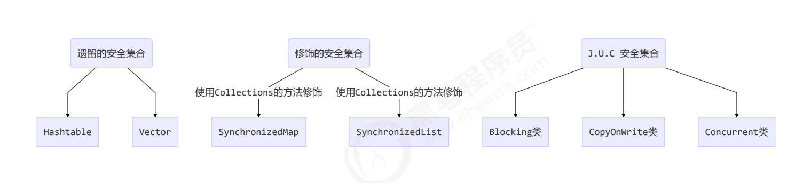

线程安全集合类可以分为三大类： 

1. 遗留的线程安全集合如`Hashtable`，` Vector `

2. 使用`Collections`装饰的线程安全集合，如： 

- `Collections.synchronizedCollection `
- `Collections.synchronizedList `
- `Collections.synchronizedMap `
- `Collections.synchronizedSet `
- `Collections.synchronizedNavigableMap `
- `Collections.synchronizedNavigableSet  `
- `Collections.synchronizedSortedMap `
- `Collections.synchronizedSortedSet `
- 说明：以上集合均采用修饰模式设计，将非线程安全的集合包装后，在调用方法时包裹了一层synchronized代码块。其并发性并不比遗留的安全集合好。

3.java.util.concurrent.*

重点介绍`java.util.concurrent.* `下的线程安全集合类，可以发现它们有规律，里面包含三类关键词： Blocking、CopyOnWrite、Concurrent

- Blocking 大部分实现基于锁，并提供用来阻塞的方法 
- CopyOnWrite 之类容器修改开销相对较重，一般适用于读多写少的场景，它的修改或则写的开销就比较重。
- Concurrent 类型的容器
  - 内部很多操作使用 cas 优化，并且能够采用多把锁，一般可以提供较高吞吐量 ，如果可能建议多使用带有concurrent关键字的集合容器。
  - 弱一致性
    - 遍历时弱一致性，例如，当利用迭代器遍历时，如果容器发生修改，迭代器仍然可以继续进行遍 历，这时内容是旧的 
    - 求大小弱一致性，size 操作未必是 100% 准确 
    - 读取弱一致性 

> 遍历时如果发生了修改，对于非安全容器来讲，使用 **fail-fast** 机制也就是让遍历立刻失败，抛出 ConcurrentModificationException，不再继续遍历


## ConcurrentHashMap

### <font color='green'>应用之单词计数</font>

**搭建练习环境：**

```java
public class Test {
    public static void main(String[] args){
        //在main方法中实现两个接口
    }
	
    //开启26个线程，每个线程调用get方法获取map，从对应的文件读取单词并存储到list中，最后调用accept方法进行统计。
    public static <V> void  calculate(Supplier<Map<String,V>> supplier, BiConsumer<Map<String,V>, List<String>> consumer) {
        Map<String, V> map = supplier.get();
        CountDownLatch count = new CountDownLatch(26);
        for (int i = 1; i < 27; i++) {
            int k = i;
            new Thread(()->{
                ArrayList<String> list = new ArrayList<>();
                read(list,k);
                consumer.accept(map,list);
                count.countDown();
            }).start();
        }
        try {
            count.await();
        } catch (InterruptedException e) {
            e.printStackTrace();
        }
        System.out.println(map.toString());
    }
	//读单词方法的实现
    public static void read(List<String> list,int i){
        try{
            String element;
            BufferedReader reader = new BufferedReader(new FileReader(i + ".txt"));
            while((element = reader.readLine()) != null){
                list.add(element);
            }
        }catch (IOException e){

        }
    }
	//生成测试数据
    public void construct(){
        String str = "abcdefghijklmnopqrstuvwxyz";
        ArrayList<String> list = new ArrayList<>();
        for (int i = 0; i < str.length(); i++) {
            for (int j = 0; j < 200; j++) {
                list.add(String.valueOf(str.charAt(i)));
            }
        }
        Collections.shuffle(list);
        for (int i = 0; i < 26; i++) {
            try (PrintWriter out = new PrintWriter(new FileWriter(i + 1 + ".txt"))) {
                String collect = list.subList(i * 200, (i + 1) * 200).stream().collect(Collectors.joining("\n"));
                out.println(collect);
            } catch (IOException e) {
                e.printStackTrace();
            }
        }
    }
}


```

##### 实现一：

```java
demo(
    // 创建 map 集合
    // 创建 ConcurrentHashMap 对不对？
    () -> new ConcurrentHashMap<String, Integer>(),
    // 进行计数
    (map, words) -> {
        for (String word : words) {
            Integer counter = map.get(word);
            int newValue = counter == null ? 1 : counter + 1;
            map.put(word, newValue);
        }
    }
);


```

输出：

```sh
{a=186, b=192, c=187, d=184, e=185, f=185, g=176, h=185, i=193, j=189, k=187, l=157, m=189, n=181, o=180, p=178, q=185, r=188, s=181, t=183, u=177, v=186, w=188, x=178, y=189, z=186}
47


```

错误原因：

- ConcurrentHashMap虽然每个方法都是线程安全的，但是多个方法的组合并不是线程安全的。


##### 正确答案一：

```java
demo(
    () -> new ConcurrentHashMap<String, LongAdder>(),
    (map, words) -> {
        for (String word : words) {
            // 注意不能使用 putIfAbsent，此方法返回的是上一次的 value，首次调用返回 null
            map.computeIfAbsent(word, (key) -> new LongAdder()).increment();
        }
    }
);


```

说明：

- computIfAbsent方法的作用是：当map中不存在以参数1为key对应的value时，会将参数2函数式接口的返回值作为value，put进map中，然后返回该value。如果存在key，则直接返回value
- 以上两部均是线程安全的。


##### 正确答案二：

```java
demo(
    () -> new ConcurrentHashMap<String, Integer>(),
    (map, words) -> {
        for (String word : words) {
            // 函数式编程，无需原子变量
            map.merge(word, 1, Integer::sum);
        }
    }
);


```


### <font color='blue'>ConcurrentHashMap 原理</font>

我们先来分析下hashmap的数据结构，hashmap是数组加上链表的结构，当一个key被放入hashmap的时候，首先会计算key的hash码，比如a的hash码计算出来是97，然后再对链表的数组的长度求一个模，算下来，桶的下标是1，这样下来就应该知道应该把key放在数组下标为1的这个位置；比如现在还有一个b，类似的也是计算hash码，算出来桶的下标是2，就放入这个位置，这样尽可能把我们的key分散在不同的桶下标下，这样的好处就是可以让查找非常的快速，时间复杂度是1，但是因为数组的容量是有限的，因此不可避免的有桶下标冲突的问题，当桶下标冲突的时候，jdk采用的是一种拉链法，形成一个链表，来解决这种桶下标冲突，将来一旦有冲突了，从拉链头在一个个的去比较，去查找这个key，虽然查找性能上稍微有些损失，但是它能解决桶下标冲突；这里强调一点，就是在jdk8里面，后加入的链表的元素，会放在链表的尾部，但是在jdk7中，后加入的链表的元素会放在链表的首部，这是这两个版本的不同，这也是后面死链产生的一个重要的原因。死链会发生在扩容的时候，随着数组里面元素定义的越来越多，会导致链表的长度也会越来越长，这样你的查找性能就会受到影响，所以在jdk7或则jdk8里面，在数组元素超过阈值的时候，这个阈值就是你数组长度的四分之三十，会进行一次扩容，扩容的时候会重新计算桶的下标，这种多线程下的扩容就会造成一种叫做并发死链的问题，这个后果非常严重，会让你的程序直接卡死，内存outofmemory。

#### JDK 7 HashMap 并发死链

下面的代码思路是这样的，因为并发死链，得形成链表才有可能出现死链的问题，所以我们得找到桶下标相同的那些key，也就是把数字让他们形成一条链；第二个是因为问题出现在扩容的时候，所以我们需要模拟那种扩容的场景，我们的hashmap什么时候可以扩容嘞，是在元素个数超过容量的四分之三时，就会扩容，它的初始容量是16，所以提前放置了12个元素，放置12个元素，才不会出现扩容，下面我准备了两个新的线程，这两个新的线程每次都去放置第十三个元素，这个时候就会出现扩容了，并且是第一个线程会触发扩容，第二个线程也会触发扩容。

##### 测试代码

注意 

- 要在 JDK 7 下运行，否则扩容机制和 hash 的计算方法都变了
- 以下测试代码是精心准备的，不要随便改动

```java
public static void main(String[] args) {
    // 测试 java 7 中哪些数字的 hash 结果相等
    System.out.println("长度为16时，桶下标为1的key");
    for (int i = 0; i < 64; i++) {
        if (hash(i) % 16 == 1) {
            System.out.println(i);
        }
    }
    System.out.println("长度为32时，桶下标为1的key");
    for (int i = 0; i < 64; i++) {
        if (hash(i) % 32 == 1) {
            System.out.println(i);
        }
    }
    // 1, 35, 16, 50 当大小为16时，它们在一个桶内
    final HashMap<Integer, Integer> map = new HashMap<Integer, Integer>();
    // 放 12 个元素
    map.put(2, null);
    map.put(3, null);
    map.put(4, null);
    map.put(5, null);
    map.put(6, null);
    map.put(7, null);
    map.put(8, null);
    map.put(9, null);
    map.put(10, null);
    map.put(16, null);
    map.put(35, null);
    map.put(1, null);
    System.out.println("扩容前大小[main]:"+map.size());
    new Thread() {
        @Override
        public void run() {
            // 放第 13 个元素, 发生扩容
            map.put(50, null);
            System.out.println("扩容后大小[Thread-0]:"+map.size());
        }
    }.start();
    new Thread() {
        @Override
        public void run() {
            // 放第 13 个元素, 发生扩容
            map.put(50, null);
            System.out.println("扩容后大小[Thread-1]:"+map.size());
        }
    }.start();
}
final static int hash(Object k) {
    int h = 0;
    if (0 != h && k instanceof String) {
        return sun.misc.Hashing.stringHash32((String) k);
    }
    h ^= k.hashCode();
    h ^= (h >>> 20) ^ (h >>> 12);
    return h ^ (h >>> 7) ^ (h >>> 4);
}


```


##### 死链复现

调试工具使用 idea 

在 HashMap 源码 590 行加断点

```java
int newCapacity = newTable.length;

```

断点的条件如下，目的是让 HashMap 在扩容为 32 时，并且线程为 Thread-0 或 Thread-1 时停下来

```java
newTable.length==32 &&
 (
 Thread.currentThread().getName().equals("Thread-0")||
 Thread.currentThread().getName().equals("Thread-1")
 )

```

断点暂停方式选择 Thread，否则在调试 Thread-0 时，Thread-1 无法恢复运行 

运行代码，程序在预料的断点位置停了下来，输出

```sh
长度为16时，桶下标为1的key 
1 
16 
35 
50 
长度为32时，桶下标为1的key 
1 
35 
扩容前大小[main]:12 


```

接下来进入扩容流程调试 

在 HashMap 源码 594 行加断点

```java
Entry<K,V> next = e.next; // 593
if (rehash) // 594
// ...


```

这是为了观察 e 节点和 next 节点的状态，Thread-0 单步执行到 594 行，再 594 处再添加一个断点（条件 Thread.currentThread().getName().equals("Thread-0")）

这时可以在 Variables 面板观察到 e 和 next 变量，使用`view as -> Object`查看节点状态

```java
e (1)->(35)->(16)->null 
next (35)->(16)->null 


```

在 Threads 面板选中 Thread-1 恢复运行，可以看到控制台输出新的内容如下，Thread-1 扩容已完成

```java
newTable[1] (35)->(1)->null 


```

```sh
扩容后大小:13 


```

这时 Thread-0 还停在 594 处， Variables 面板变量的状态已经变化为

```java
e (1)->null 
next (35)->(1)->null 


```

为什么呢，因为 Thread-1 扩容时链表也是后加入的元素放入链表头，因此链表就倒过来了，但 Thread-1 虽然结 果正确，但它结束后 Thread-0 还要继续运行 

接下来就可以单步调试（F8）观察死链的产生了 

下一轮循环到 594，将 e 搬迁到 newTable 链表头

```java
newTable[1] (1)->null 
e (35)->(1)->null 
next (1)->null


```

下一轮循环到 594，将 e 搬迁到 newTable 链表头

```java
newTable[1] (35)->(1)->null 
e (1)->null 
next null 


```

再看看源码

```java
e.next = newTable[1];
// 这时 e (1,35)
// 而 newTable[1] (35,1)->(1,35) 因为是同一个对象
newTable[1] = e; 
// 再尝试将 e 作为链表头, 死链已成
e = next;
// 虽然 next 是 null, 会进入下一个链表的复制, 但死链已经形成了


```

##### **源码分析**

HashMap 的并发死链发生在扩容时

```java
// 将 table 迁移至 newTable
void transfer(Entry[] newTable, boolean rehash) { 
    int newCapacity = newTable.length;
    for (Entry<K,V> e : table) {
        while(null != e) {
            Entry<K,V> next = e.next;
            // 1 处
            if (rehash) {
                e.hash = null == e.key ? 0 : hash(e.key);
            }
            int i = indexFor(e.hash, newCapacity);
            // 2 处
            // 将新元素加入 newTable[i], 原 newTable[i] 作为新元素的 next
            e.next = newTable[i];
            newTable[i] = e;
            e = next;
        }
    }
}


```

假设 map 中初始元素是

```java
原始链表，格式：[下标] (key,next)
[1] (1,35)->(35,16)->(16,null)
线程 a 执行到 1 处 ，此时局部变量 e 为 (1,35)，而局部变量 next 为 (35,16) 线程 a 挂起
线程 b 开始执行
第一次循环
[1] (1,null)
第二次循环
[1] (35,1)->(1,null)
第三次循环
[1] (35,1)->(1,null)
[17] (16,null)
切换回线程 a，此时局部变量 e 和 next 被恢复，引用没变但内容变了：e 的内容被改为 (1,null)，而 next 的内
容被改为 (35,1) 并链向 (1,null)
第一次循环
[1] (1,null)
第二次循环，注意这时 e 是 (35,1) 并链向 (1,null) 所以 next 又是 (1,null)
[1] (35,1)->(1,null)
第三次循环，e 是 (1,null)，而 next 是 null，但 e 被放入链表头，这样 e.next 变成了 35 （2 处）
[1] (1,35)->(35,1)->(1,35)
已经是死链了


```

**小结**

- 究其原因，是因为在多线程环境下使用了非线程安全的 map 集合 
- JDK 8 虽然将扩容算法做了调整，不再将元素加入链表头（而是保持与扩容前一样的顺序），但仍不意味着能 够在多线程环境下能够安全扩容，还会出现其它问题（如扩容丢数据）

 

#### JDK 8 ConcurrentHashMap

##### 重要属性和内部类

```java
// 默认为 0
// 当初始化时, 为 -1
// 当扩容时, 为 -(1 + 扩容线程数)
// 当初始化或扩容完成后，为 下一次的扩容的阈值大小
private transient volatile int sizeCtl;
// 整个 ConcurrentHashMap 就是一个 Node[]
static class Node<K,V> implements Map.Entry<K,V> {}
// hash 表
transient volatile Node<K,V>[] table;
// 扩容时的 新 hash 表
private transient volatile Node<K,V>[] nextTable;
// 扩容时如果某个 bin 迁移完毕, 用 ForwardingNode 作为旧 table bin 的头结点
static final class ForwardingNode<K,V> extends Node<K,V> {}
// 用在 compute 以及 computeIfAbsent 时, 用来占位, 计算完成后替换为普通 Node
static final class ReservationNode<K,V> extends Node<K,V> {}
// 作为 treebin 的头节点, 存储 root 和 first
static final class TreeBin<K,V> extends Node<K,V> {}
// 作为 treebin 的节点, 存储 parent, left, right
static final class TreeNode<K,V> extends Node<K,V> {}


```


##### 重要方法

```java
// 获取 Node[] 中第 i 个 Node
static final <K,V> Node<K,V> tabAt(Node<K,V>[] tab, int i)
 
// cas 修改 Node[] 中第 i 个 Node 的值, c 为旧值, v 为新值
static final <K,V> boolean casTabAt(Node<K,V>[] tab, int i, Node<K,V> c, Node<K,V> v)
 
// 直接修改 Node[] 中第 i 个 Node 的值, v 为新值
static final <K,V> void setTabAt(Node<K,V>[] tab, int i, Node<K,V> v)


```


##### 构造器分析

可以看到实现了懒惰初始化，在构造方法中仅仅计算了 table 的大小，以后在第一次使用时才会真正创建

```java
public ConcurrentHashMap(int initialCapacity, float loadFactor, int concurrencyLevel) {
    if (!(loadFactor > 0.0f) || initialCapacity < 0 || concurrencyLevel <= 0)
        throw new IllegalArgumentException();
    if (initialCapacity < concurrencyLevel) // Use at least as many bins
        initialCapacity = concurrencyLevel; // as estimated threads
    long size = (long)(1.0 + (long)initialCapacity / loadFactor);
    // tableSizeFor 仍然是保证计算的大小是 2^n, 即 16,32,64 ... 
    int cap = (size >= (long)MAXIMUM_CAPACITY) ?
        MAXIMUM_CAPACITY : tableSizeFor((int)size);
    this.sizeCtl = cap;
}


```


##### get流程

```java
public V get(Object key) {
    Node<K,V>[] tab; Node<K,V> e, p; int n, eh; K ek;
    // spread 方法能确保返回结果是正数
    int h = spread(key.hashCode());
    if ((tab = table) != null && (n = tab.length) > 0 &&
        (e = tabAt(tab, (n - 1) & h)) != null) {
        // 如果头结点已经是要查找的 key
        if ((eh = e.hash) == h) {
            if ((ek = e.key) == key || (ek != null && key.equals(ek)))
                return e.val;
        }
        // hash 为负数表示该 bin 在扩容中或是 treebin, 这时调用 find 方法来查找
        else if (eh < 0)
            return (p = e.find(h, key)) != null ? p.val : null;
        // 正常遍历链表, 用 equals 比较
        while ((e = e.next) != null) {
            if (e.hash == h &&
                ((ek = e.key) == key || (ek != null && key.equals(ek))))
                return e.val;
        }
    }
    return null;
}


```

总结：

- 如果table不为空且长度大于0且索引位置有元素
  - if 头节点key的hash值相等
    - 头节点的key指向同一个地址或者equals
      - 返回value
  - else if 头节点的hash为负数（bin在扩容或者是treebin）
    - 调用find方法查找
  - 进入循环（e不为空）：
    - 节点key的hash值相等，且key指向同一个地址或equals
      - 返回value
- 返回null


##### put 流程 

以下数组简称（table），链表简称（bin）

```java
public V put(K key, V value) {
    return putVal(key, value, false);
}
final V putVal(K key, V value, boolean onlyIfAbsent) {
    if (key == null || value == null) throw new NullPointerException();
    // 其中 spread 方法会综合高位低位, 具有更好的 hash 性
    int hash = spread(key.hashCode());
    int binCount = 0;
    for (Node<K,V>[] tab = table;;) {
        // f 是链表头节点
        // fh 是链表头结点的 hash
        // i 是链表在 table 中的下标
        Node<K,V> f; int n, i, fh;
        // 要创建 table
        if (tab == null || (n = tab.length) == 0)
            // 初始化 table 使用了 cas, 无需 synchronized 创建成功, 进入下一轮循环
            tab = initTable();
        // 要创建链表头节点
        else if ((f = tabAt(tab, i = (n - 1) & hash)) == null) {
            // 添加链表头使用了 cas, 无需 synchronized
            if (casTabAt(tab, i, null,
                         new Node<K,V>(hash, key, value, null)))
                break;
        }
        // 帮忙扩容
        else if ((fh = f.hash) == MOVED)
            // 帮忙之后, 进入下一轮循环
            tab = helpTransfer(tab, f);
        else {
            V oldVal = null;
            // 锁住链表头节点
            synchronized (f) {
                // 再次确认链表头节点没有被移动
                if (tabAt(tab, i) == f) {
                    // 链表
                    if (fh >= 0) {
                        binCount = 1;
                        // 遍历链表
                        for (Node<K,V> e = f;; ++binCount) {
                            K ek;
                            // 找到相同的 key
                            if (e.hash == hash &&
                                ((ek = e.key) == key ||
                                 (ek != null && key.equals(ek)))) {
                                oldVal = e.val;
                                // 更新
                                if (!onlyIfAbsent)
                                    e.val = value;
                                break;
                            }
                            Node<K,V> pred = e;
                            // 已经是最后的节点了, 新增 Node, 追加至链表尾
                            if ((e = e.next) == null) {
                                pred.next = new Node<K,V>(hash, key,
                                                          value, null);
                                break;
                            }
                        }
                    }
                    // 红黑树
                    else if (f instanceof TreeBin) {
                        Node<K,V> p;
                        binCount = 2;
                        // putTreeVal 会看 key 是否已经在树中, 是, 则返回对应的 TreeNode
                        if ((p = ((TreeBin<K,V>)f).putTreeVal(hash, key,
                                                              value)) != null) {
                            oldVal = p.val;
                            if (!onlyIfAbsent)
                                p.val = value;
                        }
                    }
                }
                // 释放链表头节点的锁
            }

            if (binCount != 0) { 
                if (binCount >= TREEIFY_THRESHOLD)
                    // 如果链表长度 >= 树化阈值(8), 进行链表转为红黑树
                    treeifyBin(tab, i);
                if (oldVal != null)
                    return oldVal;
                break;
            }
        }
    }
    // 增加 size 计数
    addCount(1L, binCount);
    return null;
}
private final Node<K,V>[] initTable() {
    Node<K,V>[] tab; int sc;
    while ((tab = table) == null || tab.length == 0) {
        if ((sc = sizeCtl) < 0)
            Thread.yield();
        // 尝试将 sizeCtl 设置为 -1（表示初始化 table）
        else if (U.compareAndSwapInt(this, SIZECTL, sc, -1)) {
            // 获得锁, 创建 table, 这时其它线程会在 while() 循环中 yield 直至 table 创建
            try {
                if ((tab = table) == null || tab.length == 0) {
                    int n = (sc > 0) ? sc : DEFAULT_CAPACITY;
                    Node<K,V>[] nt = (Node<K,V>[])new Node<?,?>[n];
                    table = tab = nt;
                    sc = n - (n >>> 2);
                }
            } finally {
                sizeCtl = sc;
            }
            break;
        }
    }
    return tab;
}
// check 是之前 binCount 的个数
private final void addCount(long x, int check) {
    CounterCell[] as; long b, s;
    if (
        // 已经有了 counterCells, 向 cell 累加
        (as = counterCells) != null ||
        // 还没有, 向 baseCount 累加
        !U.compareAndSwapLong(this, BASECOUNT, b = baseCount, s = b + x)
    ) {
        CounterCell a; long v; int m;
        boolean uncontended = true;
        if (
            // 还没有 counterCells
            as == null || (m = as.length - 1) < 0 ||
            // 还没有 cell
            (a = as[ThreadLocalRandom.getProbe() & m]) == null ||
            // cell cas 增加计数失败
            !(uncontended = U.compareAndSwapLong(a, CELLVALUE, v = a.value, v + x))
        ) {
            // 创建累加单元数组和cell, 累加重试
            fullAddCount(x, uncontended);
            return;
        }
        if (check <= 1)
            return;
        // 获取元素个数
        s = sumCount();
    }
    if (check >= 0) {
        Node<K,V>[] tab, nt; int n, sc;
        while (s >= (long)(sc = sizeCtl) && (tab = table) != null &&
               (n = tab.length) < MAXIMUM_CAPACITY) {
            int rs = resizeStamp(n);
            if (sc < 0) {
                if ((sc >>> RESIZE_STAMP_SHIFT) != rs || sc == rs + 1 ||
                    sc == rs + MAX_RESIZERS || (nt = nextTable) == null ||
                    transferIndex <= 0)
                    break;
                // newtable 已经创建了，帮忙扩容
                if (U.compareAndSwapInt(this, SIZECTL, sc, sc + 1))
                    transfer(tab, nt);
            }
            // 需要扩容，这时 newtable 未创建
            else if (U.compareAndSwapInt(this, SIZECTL, sc,
                                         (rs << RESIZE_STAMP_SHIFT) + 2))
                transfer(tab, null);
            s = sumCount();
        }
    }
}


```

总结：

- 进入for循环：
  - if  table为null或者长度 为0
    - 初始化表
  - else if 索引处无节点
    - 创建节点，填入key和value，放入table，退出循环
  - else if 索引处节点的hash值为MOVE（ForwardingNode），表示正在扩容和迁移
    - 帮忙
  - else
    - 锁住头节点
      - if 再次确认头节点没有被移动
        - if  头节点hash值大于0（表示这是一个链表）
          - 遍历链表找到对应key，如果没有，创建。
        - else if 节点为红黑树节点
          - 调用`putTreeVal`查看是否有对应key的数节点
            - 如果有且为覆盖模式，将值覆盖，返回旧值
            - 如果没有，创建并插入，返回null
      - 解锁
    - if binCount不为0
      - 如果binCount大于树化阈值8
        - 树化
      - 如果旧值不为null
        - 返回旧值
      - break
- 增加size计数
- return null


##### size 计算流程 

size 计算实际发生在 put，remove 改变集合元素的操作之中 

- 没有竞争发生，向 baseCount 累加计数 
- 有竞争发生，新建 counterCells，向其中的一个 cell 累加计
  - counterCells 初始有两个 cell 
  - 如果计数竞争比较激烈，会创建新的 cell 来累加计数

```java
public int size() {
    long n = sumCount();
    return ((n < 0L) ? 0 :
            (n > (long)Integer.MAX_VALUE) ? Integer.MAX_VALUE :
            (int)n);
}
final long sumCount() {
    CounterCell[] as = counterCells; CounterCell a;
    // 将 baseCount 计数与所有 cell 计数累加
    long sum = baseCount;
    if (as != null) {
        for (int i = 0; i < as.length; ++i) {
            if ((a = as[i]) != null)
                sum += a.value;
        }
    }
    return sum;
}


```


##### 总结

**Java 8** 数组（Node） +（ 链表 Node | 红黑树 TreeNode ） 以下数组简称（table），链表简称（bin） 

- 初始化，使用 cas 来保证并发安全，懒惰初始化 table 
- 树化，当 table.length < 64 时，先尝试扩容，超过 64 时，并且 bin.length > 8 时，会将链表树化，树化过程 会用 synchronized 锁住链表头 
- put，如果该 bin 尚未创建，只需要使用 cas 创建 bin；如果已经有了，锁住链表头进行后续 put 操作，元素 添加至 bin 的尾部 
- get，无锁操作仅需要保证可见性，扩容过程中 get 操作拿到的是 ForwardingNode 它会让 get 操作在新 table 进行搜索 
- 扩容，扩容时以 bin 为单位进行，需要对 bin 进行 synchronized，但这时妙的是其它竞争线程也不是无事可 做，它们会帮助把其它 bin 进行扩容，扩容时平均只有 1/6 的节点会把复制到新 table 中 
- size，元素个数保存在 baseCount 中，并发时的个数变动保存在 CounterCell[] 当中。最后统计数量时累加 即可

源码分析 http://www.importnew.com/28263.html 

其它实现 [Cliff Click's high scale lib](https://github.com/boundary/high-scale-lib)


#### JDK 7 ConcurrentHashMap

它维护了一个 segment 数组，每个 segment 对应一把锁 

- 优点：如果多个线程访问不同的 segment，实际是没有冲突的，这与 jdk8 中是类似的 
- 缺点：Segments 数组默认大小为16，这个容量初始化指定后就不能改变了，并且不是懒惰初始化


##### 构造器分析

```java
public ConcurrentHashMap(int initialCapacity, float loadFactor, int concurrencyLevel) {
    if (!(loadFactor > 0) || initialCapacity < 0 || concurrencyLevel <= 0)
        throw new IllegalArgumentException();
    if (concurrencyLevel > MAX_SEGMENTS)
        concurrencyLevel = MAX_SEGMENTS;
    // ssize 必须是 2^n, 即 2, 4, 8, 16 ... 表示了 segments 数组的大小
    int sshift = 0;
    int ssize = 1;
    while (ssize < concurrencyLevel) {
        ++sshift;
        ssize <<= 1;
    }
    // segmentShift 默认是 32 - 4 = 28
    this.segmentShift = 32 - sshift;
    // segmentMask 默认是 15 即 0000 0000 0000 1111
    this.segmentMask = ssize - 1;
    if (initialCapacity > MAXIMUM_CAPACITY)
        initialCapacity = MAXIMUM_CAPACITY;
    int c = initialCapacity / ssize;
    if (c * ssize < initialCapacity)
        ++c;
    int cap = MIN_SEGMENT_TABLE_CAPACITY;
    while (cap < c)
        cap <<= 1;
    // 创建 segments and segments[0]
    Segment<K,V> s0 =
        new Segment<K,V>(loadFactor, (int)(cap * loadFactor),
                         (HashEntry<K,V>[])new HashEntry[cap]);
    Segment<K,V>[] ss = (Segment<K,V>[])new Segment[ssize];
    UNSAFE.putOrderedObject(ss, SBASE, s0); // ordered write of segments[0]
    this.segments = ss;
}


```

构造完成，如下图所示

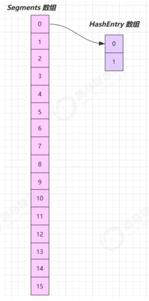

可以看到 ConcurrentHashMap 没有实现懒惰初始化，空间占用不友好 

其中 this.segmentShift 和 this.segmentMask 的作用是决定将 key 的 hash 结果匹配到哪个 segment 

例如，根据某一 hash 值求 segment 位置，先将高位向低位移动 this.segmentShift 位

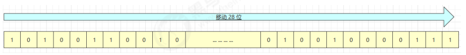

结果再与 this.segmentMask 做位于运算，最终得到 1010 即下标为 10 的 segment

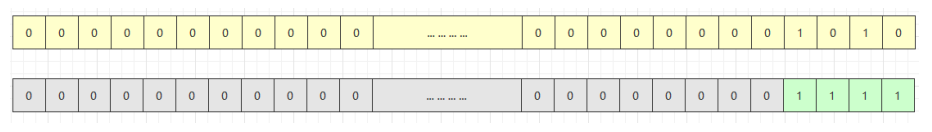

##### put 流程

```java
public V put(K key, V value) {
    Segment<K,V> s;
    if (value == null)
        throw new NullPointerException();
    int hash = hash(key);
    // 计算出 segment 下标
    int j = (hash >>> segmentShift) & segmentMask;

    // 获得 segment 对象, 判断是否为 null, 是则创建该 segment
    if ((s = (Segment<K,V>)UNSAFE.getObject 
         (segments, (j << SSHIFT) + SBASE)) == null) {
        // 这时不能确定是否真的为 null, 因为其它线程也发现该 segment 为 null,
        // 因此在 ensureSegment 里用 cas 方式保证该 segment 安全性
        s = ensureSegment(j);
    }
    // 进入 segment 的put 流程
    return s.put(key, hash, value, false);
}


```

segment 继承了可重入锁（ReentrantLock），它的 put 方法为

```java
final V put(K key, int hash, V value, boolean onlyIfAbsent) {
    // 尝试加锁
    HashEntry<K,V> node = tryLock() ? null :
    // 如果不成功, 进入 scanAndLockForPut 流程
    // 如果是多核 cpu 最多 tryLock 64 次, 进入 lock 流程
    // 在尝试期间, 还可以顺便看该节点在链表中有没有, 如果没有顺便创建出来
    scanAndLockForPut(key, hash, value);

    // 执行到这里 segment 已经被成功加锁, 可以安全执行
    V oldValue;
    try {
        HashEntry<K,V>[] tab = table;
        int index = (tab.length - 1) & hash;
        HashEntry<K,V> first = entryAt(tab, index);
        for (HashEntry<K,V> e = first;;) {
            if (e != null) {
                // 更新
                K k;
                if ((k = e.key) == key ||
                    (e.hash == hash && key.equals(k))) { 
                    oldValue = e.value;
                    if (!onlyIfAbsent) {
                        e.value = value;
                        ++modCount;
                    } break;
                }
                e = e.next;
            }
            else {
                // 新增
                // 1) 之前等待锁时, node 已经被创建, next 指向链表头
                if (node != null)
                    node.setNext(first);
                else
                    // 2) 创建新 node
                    node = new HashEntry<K,V>(hash, key, value, first);
                int c = count + 1; 
                // 3) 扩容
                if (c > threshold && tab.length < MAXIMUM_CAPACITY)
                    rehash(node);
                else
                    // 将 node 作为链表头
                    setEntryAt(tab, index, node);
                ++modCount;
                count = c;
                oldValue = null;
                break;
            }
        }
    } finally {
        unlock();
    }
    return oldValue;
}


```

##### rehash 流程 

发生在 put 中，因为此时已经获得了锁，因此 rehash 时不需要考虑线程安全

```java
private void rehash(HashEntry<K,V> node) {
    HashEntry<K,V>[] oldTable = table;
    int oldCapacity = oldTable.length;
    int newCapacity = oldCapacity << 1;
    threshold = (int)(newCapacity * loadFactor);
    HashEntry<K,V>[] newTable =
        (HashEntry<K,V>[]) new HashEntry[newCapacity];
    int sizeMask = newCapacity - 1;
    for (int i = 0; i < oldCapacity ; i++) {
        HashEntry<K,V> e = oldTable[i];
        if (e != null) {
            HashEntry<K,V> next = e.next;
            int idx = e.hash & sizeMask;
            if (next == null) // Single node on list
                newTable[idx] = e;
            else { // Reuse consecutive sequence at same slot
                HashEntry<K,V> lastRun = e;
                int lastIdx = idx;
                // 过一遍链表, 尽可能把 rehash 后 idx 不变的节点重用
                for (HashEntry<K,V> last = next;
                     last != null;
                     last = last.next) {
                    int k = last.hash & sizeMask;
                    if (k != lastIdx) {
                        lastIdx = k;
                        lastRun = last;
                    }
                }
                newTable[lastIdx] = lastRun;
                // 剩余节点需要新建
                for (HashEntry<K,V> p = e; p != lastRun; p = p.next) {
                    V v = p.value;
                    int h = p.hash;
                    int k = h & sizeMask;
                    HashEntry<K,V> n = newTable[k];
                    newTable[k] = new HashEntry<K,V>(h, p.key, v, n);
                }
            }
        }
    }
    // 扩容完成, 才加入新的节点
    int nodeIndex = node.hash & sizeMask; // add the new node
    node.setNext(newTable[nodeIndex]);
    newTable[nodeIndex] = node;

    // 替换为新的 HashEntry table
    table = newTable;
}


```

附，调试代码

```java
public static void main(String[] args) {
    ConcurrentHashMap<Integer, String> map = new ConcurrentHashMap<>();
    for (int i = 0; i < 1000; i++) {
        int hash = hash(i);
        int segmentIndex = (hash >>> 28) & 15;
        if (segmentIndex == 4 && hash % 8 == 2) {
            System.out.println(i + "\t" + segmentIndex + "\t" + hash % 2 + "\t" + hash % 4 +
                               "\t" + hash % 8);
        }
    }
    map.put(1, "value");
    map.put(15, "value"); // 2 扩容为 4 15 的 hash%8 与其他不同
    map.put(169, "value");
    map.put(197, "value"); // 4 扩容为 8
    map.put(341, "value");
    map.put(484, "value");
    map.put(545, "value"); // 8 扩容为 16
    map.put(912, "value");
    map.put(941, "value");
    System.out.println("ok");
}
private static int hash(Object k) {
    int h = 0;
    if ((0 != h) && (k instanceof String)) {
        return sun.misc.Hashing.stringHash32((String) k);
    }
    h ^= k.hashCode();
    // Spread bits to regularize both segment and index locations,
    // using variant of single-word Wang/Jenkins hash.
    h += (h << 15) ^ 0xffffcd7d;
    h ^= (h >>> 10);
    h += (h << 3);
    h ^= (h >>> 6);
    h += (h << 2) + (h << 14);
    int v = h ^ (h >>> 16);
    return v;
}


```

##### get 流程 

get 时并未加锁，用了 UNSAFE 方法保证了可见性，扩容过程中，get 先发生就从旧表取内容，get 后发生就从新 表取内容

```java
public V get(Object key) {
    Segment<K,V> s; // manually integrate access methods to reduce overhead
    HashEntry<K,V>[] tab;
    int h = hash(key);
    // u 为 segment 对象在数组中的偏移量
    long u = (((h >>> segmentShift) & segmentMask) << SSHIFT) + SBASE;
    // s 即为 segment
    if ((s = (Segment<K,V>)UNSAFE.getObjectVolatile(segments, u)) != null &&
        (tab = s.table) != null) {
        for (HashEntry<K,V> e = (HashEntry<K,V>) UNSAFE.getObjectVolatile
             (tab, ((long)(((tab.length - 1) & h)) << TSHIFT) + TBASE);
             e != null; e = e.next) {
            K k;
            if ((k = e.key) == key || (e.hash == h && key.equals(k)))
                return e.value;
        }
    }
    return null;
}


```

##### size 计算流程

- 计算元素个数前，先不加锁计算两次，如果前后两次结果如一样，认为个数正确返回 
- 如果不一样，进行重试，重试次数超过 3，将所有 segment 锁住，重新计算个数返回

```java
public int size() {
    // Try a few times to get accurate count. On failure due to
    // continuous async changes in table, resort to locking.
    final Segment<K,V>[] segments = this.segments;
    int size;
    boolean overflow; // true if size overflows 32 bits
    long sum; // sum of modCounts
    long last = 0L; // previous sum
    int retries = -1; // first iteration isn't retry
    try {
        for (;;) {
            if (retries++ == RETRIES_BEFORE_LOCK) {
                // 超过重试次数, 需要创建所有 segment 并加锁
                for (int j = 0; j < segments.length; ++j)
                    ensureSegment(j).lock(); // force creation
            }
            sum = 0L;
            size = 0;
            overflow = false;
            for (int j = 0; j < segments.length; ++j) {
                Segment<K,V> seg = segmentAt(segments, j);
                if (seg != null) {
                    sum += seg.modCount;
                    int c = seg.count;
                    if (c < 0 || (size += c) < 0)
                        overflow = true;
                }
            }
            if (sum == last)
                break;
            last = sum;
        }
    } finally {
        if (retries > RETRIES_BEFORE_LOCK) {
            for (int j = 0; j < segments.length; ++j)
                segmentAt(segments, j).unlock();
        }
    }
    return overflow ? Integer.MAX_VALUE : size;
}


```


## BlockingQueue


### <font color='blue'>\* BlockingQueue 原理</font>

#### 基本的入队出队

```java
public class LinkedBlockingQueue<E> extends AbstractQueue<E>
    implements BlockingQueue<E>, java.io.Serializable {
    static class Node<E> {
        E item;
        /**
 		* 下列三种情况之一
 		* - 真正的后继节点
 		* - 自己, 发生在出队时
 		* - null, 表示是没有后继节点, 是最后了
 		*/
        Node<E> next;
        Node(E x) { item = x; }
    }
}


```

##### 初始化链表

`last = head = new Node(null);`Dummy 节点用来占位，item 为 null

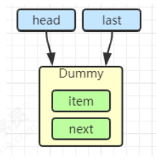

##### 当一个节点入队

`last = last.next = node;`

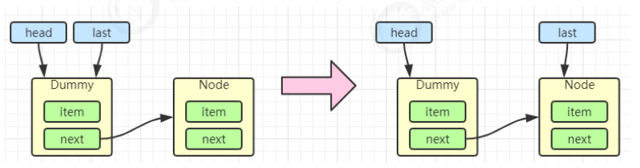

再来一个节点入队`last = last.next = node;`

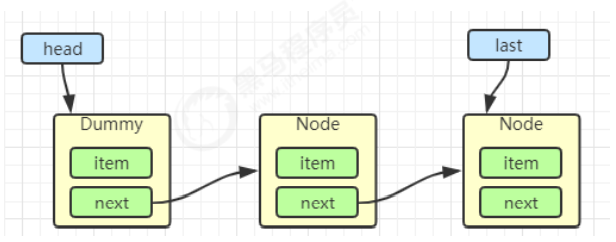

##### 出队

```java
//临时变量h用来指向哨兵
Node<E> h = head;
//first用来指向第一个元素
Node<E> first = h.next;
h.next = h; // help GC
//head赋值为first，表示first节点就是下一个哨兵。
head = first;
E x = first.item;
//删除first节点中的数据，表示真正成为了哨兵，第一个元素出队。
first.item = null;
return x;


```

`h = head`

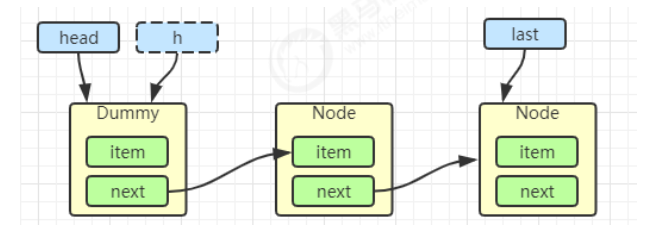

`first = h.next`

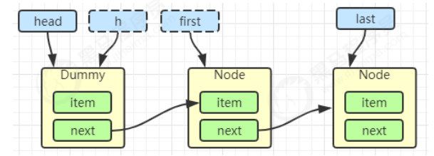

`h.next = h`

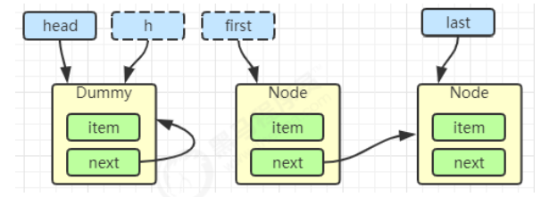

`head = first`

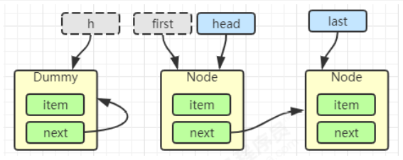

```java
E x = first.item;
first.item = null;
return x;


```

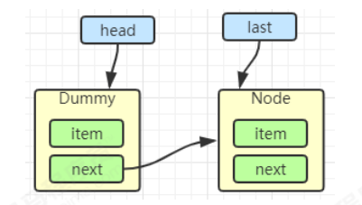


#### 加锁分析

**高明之处**在于用了两把锁和 dummy 节点 

- 用一把锁，同一时刻，最多只允许有一个线程（生产者或消费者，二选一）执行 
- 用两把锁，同一时刻，可以允许两个线程同时（一个生产者与一个消费者）执行 
  - 消费者与消费者线程仍然串行 
  - 生产者与生产者线程仍然串行


线程安全分析 

- 当节点总数大于 2 时（包括 dummy 节点），putLock 保证的是 last 节点的线程安全，takeLock 保证的是 head 节点的线程安全。两把锁保证了入队和出队没有竞争 
- 当节点总数等于 2 时（即一个 dummy 节点，一个正常节点）这时候，仍然是两把锁锁两个对象，不会竞争 
- 当节点总数等于 1 时（就一个 dummy 节点）这时 take 线程会被 notEmpty 条件阻塞，有竞争，会阻塞

```java
// 用于 put(阻塞) offer(非阻塞)
private final ReentrantLock putLock = new ReentrantLock();
// 用户 take(阻塞) poll(非阻塞)
private final ReentrantLock takeLock = new ReentrantLock();


```

put 操作

```java
public void put(E e) throws InterruptedException {
    //LinkedBlockingQueue不支持空元素
    if (e == null) throw new NullPointerException();
    int c = -1;
    Node<E> node = new Node<E>(e);
    final ReentrantLock putLock = this.putLock;
    // count 用来维护元素计数
    final AtomicInteger count = this.count;
    putLock.lockInterruptibly();
    try {
        // 满了等待
        while (count.get() == capacity) {
            // 倒过来读就好: 等待 notFull
            notFull.await();
        }
        // 有空位, 入队且计数加一
        enqueue(node);
        c = count.getAndIncrement(); 
        // 除了自己 put 以外, 队列还有空位, 由自己叫醒其他 put 线程
        if (c + 1 < capacity)
            notFull.signal();
    } finally {
        putLock.unlock();
    }
    // 如果队列中有一个元素, 叫醒 take 线程
    if (c == 0)
        // 这里调用的是 notEmpty.signal() 而不是 notEmpty.signalAll() 是为了减少竞争
        signalNotEmpty();
}


```

take 操作

```java
public E take() throws InterruptedException {
    E x;
    int c = -1;
    final AtomicInteger count = this.count;
    final ReentrantLock takeLock = this.takeLock;
    takeLock.lockInterruptibly();
    try {
        while (count.get() == 0) {
            notEmpty.await();
        }
        x = dequeue();
        c = count.getAndDecrement();
        if (c > 1)
            notEmpty.signal();
    } finally {
        takeLock.unlock();
    }
    // 如果队列中只有一个空位时, 叫醒 put 线程
    // 如果有多个线程进行出队, 第一个线程满足 c == capacity, 但后续线程 c < capacity
    if (c == capacity)
        // 这里调用的是 notFull.signal() 而不是 notFull.signalAll() 是为了减少竞争
        signalNotFull()
        return x;
}


```

> 由 put 唤醒 put 是为了避免信号不足


#### 性能比较

主要列举 LinkedBlockingQueue 与 ArrayBlockingQueue 的性能比较 

- Linked 支持有界，Array 强制有界 
- Linked 实现是链表，Array 实现是数组 
- Linked 是懒惰的，而 Array 需要提前初始化 Node 数组 
- Linked 每次入队会生成新 Node，而 Array 的 Node 是提前创建好的 
- Linked 两把锁，Array 一把锁


## ConcurrentLinkedQueue

ConcurrentLinkedQueue 的设计与 LinkedBlockingQueue 非常像，也是 

- 两把【锁】，同一时刻，可以允许两个线程同时（一个生产者与一个消费者）执行 
- dummy 节点的引入让两把【锁】将来锁住的是不同对象，避免竞争 
- 只是这【锁】使用了 cas 来实现


事实上，ConcurrentLinkedQueue 应用还是非常广泛的 

例如之前讲的 Tomcat 的 Connector 结构时，Acceptor 作为生产者向 Poller 消费者传递事件信息时，正是采用了 ConcurrentLinkedQueue 将 SocketChannel 给 Poller 使用

```mermaid
graph LR

subgraph Connector->NIO EndPoint
t1(LimitLatch)
t2(Acceptor)
t3(SocketChannel 1)
t4(SocketChannel 2)
t5(Poller)
subgraph Executor
t7(worker1)
t8(worker2)
end
t1 --> t2
t2 --> t3
t2 --> t4
t3 --有读--> t5
t4 --有读--> t5
t5 --socketProcessor--> t7
t5 --socketProcessor--> t8
end


```


### <font color='blue'>*ConcurrentLinkedQueue 原理</font>

#### 模仿 ConcurrentLinkedQueue

初始代码

```java
package cn.itcast.concurrent.thirdpart.test;
import java.util.Collection;
import java.util.Iterator;
import java.util.Queue;
import java.util.concurrent.atomic.AtomicReference;
public class Test3 {
    public static void main(String[] args) {
        MyQueue<String> queue = new MyQueue<>();
        queue.offer("1");
        queue.offer("2");
        queue.offer("3");
        System.out.println(queue);
    }
}
class MyQueue<E> implements Queue<E> {
    @Override
    public String toString() {
        StringBuilder sb = new StringBuilder();
        for (Node<E> p = head; p != null; p = p.next.get()) {
            E item = p.item;
            if (item != null) {
                sb.append(item).append("->");
            }
        }
        sb.append("null");
        return sb.toString();
    }
    @Override
    public int size() {
        return 0;
    }
    @Override
    public boolean isEmpty() {
        return false;
    }
    @Override
    public boolean contains(Object o) {
        return false;
    }
    @Override
    public Iterator<E> iterator() {
        return null;
    }
    @Override
    public Object[] toArray() {
        return new Object[0];
    }
    @Override
    public <T> T[] toArray(T[] a) {
        return null;
    }
    @Override
    public boolean add(E e) {
        return false;
    }
    @Override
    public boolean remove(Object o) {
        return false;
    }
    @Override
    public boolean containsAll(Collection<?> c) {
        return false;
    }
    @Override
    public boolean addAll(Collection<? extends E> c) {
        return false;
    }
    @Override
    public boolean removeAll(Collection<?> c) {
        return false;
    }
    @Override
    public boolean retainAll(Collection<?> c) {
        return false;
    }
    @Override
    public void clear() {
    }
    @Override
    public E remove() {
        return null;
    }
    @Override
    public E element() {
        return null;
    }
    @Override
    public E peek() {
        return null;
    }
    public MyQueue() {
        head = last = new Node<>(null, null);
    }
    private volatile Node<E> last;
    private volatile Node<E> head;
    private E dequeue() {
        /*Node<E> h = head;
 		Node<E> first = h.next;
 		h.next = h;
 		head = first;
        E x = first.item;
 		first.item = null;
 		return x;*/
        return null;
    }
    @Override
    public E poll() {
        return null;
    }
    @Override
    public boolean offer(E e) {
        return true;
    }
    static class Node<E> {
        volatile E item;
        public Node(E item, Node<E> next) {
            this.item = item;
            this.next = new AtomicReference<>(next);
        }
        AtomicReference<Node<E>> next;
    }
}


```

offer

```java
public boolean offer(E e) {
    Node<E> n = new Node<>(e, null);
    while(true) {
        // 获取尾节点
        AtomicReference<Node<E>> next = last.next;
        // S1: 真正尾节点的 next 是 null, cas 从 null 到新节点
        if(next.compareAndSet(null, n)) {
            // 这时的 last 已经是倒数第二, next 不为空了, 其它线程的 cas 肯定失败
            // S2: 更新 last 为倒数第一的节点
            last = n;
            return true;
        }
    }
}


```


## CopyOnWriteArrayList

`CopyOnWriteArraySet`是它的马甲 底层实现采用了 写入时拷贝 的思想，增删改操作会将底层数组拷贝一份，更 改操作在新数组上执行，这时不影响其它线程的**并发读**，**读写分离**。 以新增为例：

```java
public boolean add(E e) {
    synchronized (lock) {
        // 获取旧的数组
        Object[] es = getArray();
        int len = es.length;
        // 拷贝新的数组（这里是比较耗时的操作，但不影响其它读线程）
        es = Arrays.copyOf(es, len + 1);
        // 添加新元素
        es[len] = e;
        // 替换旧的数组
        setArray(es);
        return true;
    }
}


```

> 这里的源码版本是 Java 11，在 Java 1.8 中使用的是可重入锁而不是 synchronized

其它读操作并未加锁，例如：

```java
public void forEach(Consumer<? super E> action) {
    Objects.requireNonNull(action);
    for (Object x : getArray()) {
        @SuppressWarnings("unchecked") E e = (E) x;
        action.accept(e);
    }
}


```

适合『读多写少』的应用场景 

##### get 弱一致性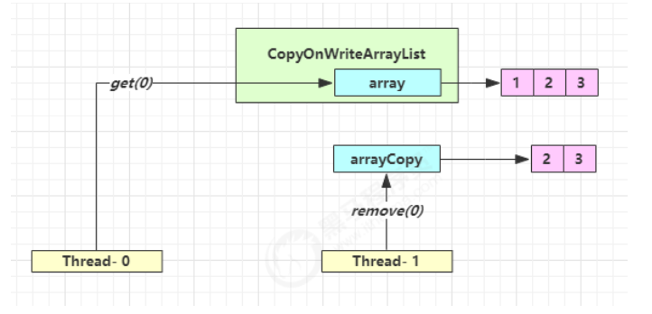

| 时间点 |             操作             |
| :----: | :--------------------------: |
|   1    |     Thread-0 getArray()      |
|   2    |     Thread-1 getArray()      |
|   3    | Thread-1 setArray(arrayCopy) |
|   4    |    Thread-0 array[index]     |

> 不容易测试，但问题确实存在


##### 迭代器弱一致性

```java
CopyOnWriteArrayList<Integer> list = new CopyOnWriteArrayList<>();
list.add(1);
list.add(2);
list.add(3);
Iterator<Integer> iter = list.iterator();
new Thread(() -> {
    list.remove(0);
    System.out.println(list);
}).start();
sleep1s();
//此时主线程的iterator依旧指向旧的数组。
while (iter.hasNext()) {
    System.out.println(iter.next());
}


```

> 不要觉得弱一致性就不好 
>
> - 数据库的 MVCC 都是弱一致性的表现 
> - 并发高和一致性是矛盾的，需要权衡


# ==并发-非共享模型==


# 3.Lock

### 1）传统的 synchronized

给方法加上synchronized属性

```java
package com.marchsoft.juctest;

import lombok.Synchronized;

/**
 * Description：synchronized
 *
 * @author jiaoqianjin
 * Date: 2020/8/10 21:36
 **/

public class Demo01 {
    public static void main(String[] args) {
        final Ticket ticket = new Ticket();
        //lambda表达式  (参数)->{代码}
        new Thread(()->{
            for (int i = 0; i < 40; i++) {
                ticket.sale();
            }
        },"A").start();
        new Thread(()->{
            for (int i = 0; i < 40; i++) {
                ticket.sale();
            }
        },"B").start();
        new Thread(()->{
            for (int i = 0; i < 40; i++) {
                ticket.sale();
            }
        },"C").start();
    }
}
// 资源类 OOP 属性、方法
class Ticket {
    private int number = 30;

    //卖票的方式
    public synchronized void sale() {
        if (number > 0) {
            System.out.println(Thread.currentThread().getName() + "卖出了第" + (number--) + "张票剩余" + number + "张票");
        }
    }
}
```

### 2）Lock

java.util.concurrent.locks


> 传入一个true就能设置成公平锁

**公平锁：** 十分公平，必须先来后到~；

**非公平锁：** 十分不公平，可以插队；**(默认为非公平锁)**


```java
package com.marchsoft.juctest;

import java.util.concurrent.locks.Lock;
import java.util.concurrent.locks.ReentrantLock;

/**
 * Description：
 *
 * @author 
 * Date: 2020/8/10 22:05
 **/

public class LockDemo {
    public static void main(String[] args) {
        final Ticket2 ticket = new Ticket2();

        new Thread(() -> {
            for (int i = 0; i < 40; i++) {
                ticket.sale();
            }
        }, "A").start();
        new Thread(() -> {
            for (int i = 0; i < 40; i++) {
                ticket.sale();
            }
        }, "B").start();
        new Thread(() -> {
            for (int i = 0; i < 40; i++) {
                ticket.sale();
            }
        }, "C").start();
    }
}
//lock三部曲
//1、    Lock lock=new ReentrantLock();
//2、    lock.lock() 加锁
//3、    finally=> 解锁：lock.unlock();
class Ticket2 {
    private int number = 30;
	
    // 【创建锁】
    Lock lock = new ReentrantLock();
    //卖票的方式
    public synchronized void sale() {//
        lock.lock(); // 开启锁
        try {
            if (number > 0) {
                System.out.println(Thread.currentThread().getName() + "卖出了第" + (number--) + "张票剩余" + number + "张票");
            }
        }finally {
            lock.unlock(); // 关闭锁
        }

    }
}
```

### 3）==Synchronized 与Lock 的区别==

- Synchronized **内置的Java关键字**，Lock是一个**Java类**
- Synchronized 无法判断获取**锁的状态**，Lock可以判断是否获取到了锁
- Synchronized 会**自动释放锁**，lock必须要手动加锁和手动释放锁 可能会遇到死锁
- Synchronized 线程1(获得锁->阻塞)、线程2(等待)；lock就不一定会一直等待下去，l<u>ock会有一个**trylock**去尝试获取锁</u>，不会造成长久的等待。
- Synchronized **是可重入锁**，不可以中断的，**非公平的**；Lock，可重入的，可以判断锁，可以自己设置公平锁和非公平锁；
- Synchronized 适合锁少量的代码同步问题，Lock适合锁大量的同步代码；


# 6. 集合的线程不安全问题

### 1）List 不安全

代码演示：

```java
//java.util.ConcurrentModificationException 并发修改异常 
public class ListTest {
    public static void main(String[] args) {

        List<Object> arrayList = new ArrayList<>();

        for(int i=1;i<=10;i++){
            new Thread(()->{
                arrayList.add(UUID.randomUUID().toString().substring(0,5));
                System.out.println(arrayList);
            },String.valueOf(i)).start();
        }

    }
}
```

会导致java.util.ConcurrentModificationException 并发修改异常

**ArrayList 在并发情况下是不安全的**

解决方案：

```java
public class ListTest {
    public static void main(String[] args) {
        /**
         * 解决方案
         * 1. List<String> list = new Vector<>(); //使用Vector
         * 2. List<String> list = Collections.synchronizedList(new ArrayList<>()); //工具类 转换成线程安全的集合
         * 3. List<String> list = new CopyOnWriteArrayList<>(); //使用juc包下的CopyOnWriteArrayList类
         */
        List<String> list = new CopyOnWriteArrayList<>();
        

        for (int i = 1; i <=10; i++) {
            new Thread(() -> {
                list.add(UUID.randomUUID().toString().substring(0,5));
                System.out.println(list);
            },String.valueOf(i)).start();
        }
    }
}
```

==CopyOnWrite——写入时复制==

**COW 计算机程序设计领域的一种优化策略**

核心思想是，如果有多个调用者（Callers）同时要求相同的资源（如内存或者是磁盘上的数据存储），他们会共同获取相同的指针指向相同的资源，直到某个调用者视图修改资源内容时，系统才会真正复制一份专用副本（private copy）给该调用者，而其他调用者所见到的最初的资源仍然保持不变。这过程对其他的调用者都是透明的（transparently）。此做法主要的优点是如果调用者没有修改资源，就不会有副本（private copy）被创建，因此多个调用者只是读取操作时可以共享同一份资源。

读的时候不需要加锁，如果读的时候有多个线程正在向CopyOnWriteArrayList添加数据，读还是会读到旧的数据，因为写的时候不会锁住旧的CopyOnWriteArrayList。


**多个线程调用，读取的时候读取固定的数据，写入时复制一份数据（存在覆盖操作）；**

> 作用：能在写入的时候避免多个线程操作的结果相互覆盖；


**CopyOnWriteArrayList**比**Vector**厉害在哪里？

**Vector**底层是使用**synchronized**关键字来实现的：效率特别低下。


**CopyOnWriteArrayList**使用的是ReentrantLock锁，效率会更加高效 


### 2）set 不安全

**Set和List同理可得:** 多线程情况下，普通的Set集合是线程不安全的；

解决方案还是两种：

- 使用Collections工具类的**synchronized**包装的Set类
- 使用CopyOnWriteArraySet 写入复制的**JUC**解决方案

```java
public class SetTest {
    public static void main(String[] args) {
        /**
         * 1. Set<String> set = Collections.synchronizedSet(new HashSet<>());
         * 2. Set<String> set = new CopyOnWriteArraySet<>();
         */
//        Set<String> set = new HashSet<>();
        Set<String> set = new CopyOnWriteArraySet<>();

        for (int i = 1; i <= 30; i++) {
            new Thread(() -> {
                set.add(UUID.randomUUID().toString().substring(0,5));
                System.out.println(set);
            },String.valueOf(i)).start();
        }
    }
}
```


> **HashSet底层是什么？**
>
> hashSet底层就是一个**HashMap**；
>
> ```java
> 源码
> 
> // Dummy value to associate with an Object in the backing Map
> private static final Object PRESENT = new Object();
> 
> public HashSet() {
>  map = new HashMap<>();
> }
> 
> public boolean add(E e) {
>  return map.put(e, PRESENT)==null;// 这里的PRESENT就是一个常量
> }
> 
> 
> ```
>
> 


### 3）Map不安全

```java、
Map<String, String> map = new HashMap<>();
//加载因子、初始化容量
```

1. map 是这样用的吗？  不是，工作中不使用这个（太绝对）
2. 默认等价什么？ new HashMap<>(16,0.75);

默认**加载因子是0.75**,默认的**初始容量是16**


```
public HashMap() {
    this.loadFactor = DEFAULT_LOAD_FACTOR; // all other fields defaulted
}
```


同样的HashMap基础类也存在**并发修改异常**

```java
public class MapTest {
    public static void main(String[] args) {
        
        /**
         * 解决方案
         * 1. Map<String, String> map = Collections.synchronizedMap(new HashMap<>());
         *  Map<String, String> map = new ConcurrentHashMap<>();
         */
        Map<String, String> map = new ConcurrentHashMap<>();
        //加载因子、初始化容量
        for (int i = 1; i < 100; i++) {
            new Thread(()->{
                map.put(Thread.currentThread().getName(), UUID.randomUUID().toString().substring(0,5));
                System.out.println(map);
            },String.valueOf(i)).start();
        }
    }
}
```

**TODO:研究ConcurrentHashMap底层原理：**


7. Callable创建线程


**1、可以有返回值；
2、可以抛出异常；
3、方法不同，run()/call()**


FutureTask是Runnable的实现类，其构造参数中能传入collable


```java
package com.zzy.callable;

import java.util.concurrent.Callable;
import java.util.concurrent.ExecutionException;
import java.util.concurrent.FutureTask;

/**
 * 1、探究原理
 * 2、觉自己会用
 */
public class CallableTest {
    public static void main(String[] args) throws ExecutionException, InterruptedException {
        //new Thread(new Runnable()).start();
        //new Thread(new FutureTask<V>()).start();
        //new Thread(new FutureTask<V>( Callable )).start();

        //new Thread().start();// 怎么启动Callable

        MyThread thread = new MyThread();
        FutureTask futureTask = new FutureTask(thread);//适配类

        new Thread(futureTask,"A").start();
        new Thread(futureTask,"B").start();// 结果会被缓存，效率高，结果只打印一次

        //获取Callable的返回结果
        String o = (String) futureTask.get();//这个get 方法可能会产生阻塞 把他放到最后 或者使用异步通信来处理 

        System.out.println(o);
    }
}
class MyThread implements Callable<String> {

    @Override
    public String call() throws Exception {
        System.out.println("jjjj");
        // 耗时的操作
        return "hello";
    }
}
```

细节：
1、有缓存
2、结果可能需要等待，会阻塞 


### 常见的线程安全类

* String 
* Integer 
* StringBuffer 
* Random 
* Vector 
* Hashtable 
* java.util.concurrent 包下的类 

这里说它们是线程安全的是指，多个线程调用它们同一个实例的某个方法时，是线程安全的


```java
Hashtable table = new Hashtable();
new Thread(()->{
 table.put("key", "value1"); // 内部有synchronized关键字
}).start();
new Thread(()->{
 table.put("key", "value2");
}).start();

// 结果是value1
```

* 它们的每个方法是原子的

* 但注意它们多个方法的组合不是原子的：

  ```java
  private Hashtable table;
  // 线程1，线程2先后调用这个方法 
  void method(table){
      if( table.get("key") == null) {
          table.put("key", value);
      }
  }
  // 这个方法虽然是两个线程安全的方法的组合，但是也不能保证操作原子性 保证线程安全
  // 如果要保证这个方法的原子性，需要在外层(方法上)加 synchronized 关键字
  ```

  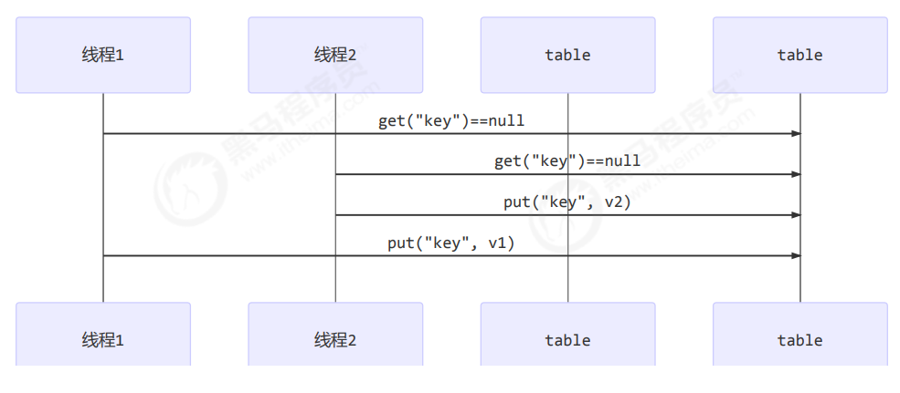

  线程1先进入，但是线程2先执行了put，出现线程安全问题


#### 不可变类的线程安全性


String、Integer 等都是不可变类，因为其内部的状态(属性)不可以改变，因此它们的方法都是线程安全的 

有同学或许有疑问，String 有 replace，substring 等方法【可以】改变值啊，那么这些方法又是如何保证线程安全的呢——会重新创建新的字符串对象(而不是改变原有的值)

 


# 8、常用的辅助类(高并发必会)

加法计数器，减法计数器和信号量

### 1）CountDownLatch

减法计数器


**主要方法：**

- countDown 减一操作；
- await 等待计数器归零

作用：等待计数器归零，再唤醒、继续向下运行

> ==和join的作用类似，能实现线程执行顺序的定义==

```java
package com.zzy.add;

import java.util.concurrent.BrokenBarrierException;
import java.util.concurrent.CyclicBarrier;

/**
 * @author Zhao
 * @DATE 2021/1/31 - 17:54
 */
public class CyclicBarrierDemo {
    public static void main(String[] args) throws InterruptedException{
        CountDownLatch countDownLatch = new CountDownLatch(6);
        for(int i = 1;i<=6;i++){
            new Thread(() -> {
                System.out.println(Thread.currentThread().getName() + "Go out");
                countDownLatch.countDown();//数量减一
            },String.valueOf(i)).start();
        }
        countDownLatch.await();//等待计数器归零，然后再向下执行
        
        System.out.println("Close Door");

    }
}
```

如果没有`countDownLatch.await();`这行代码，会输出

```
Close Door
1 Go out
2 Go out
3 Go out
4 Go out
5 Go out
6 Go out
```


### 2）CyclickBarrier

加法计数器

> 


加法计数器

```java
package com.zzy.add;

import java.util.concurrent.BrokenBarrierException;
import java.util.concurrent.CyclicBarrier;

/**
 * @author Zhao
 * @DATE 2021/1/31 - 17:54
 */
public class CyclicBarrierDemo {
    public static void main(String[] args) {
        /**
         * 集齐7颗龙珠召唤神龙
         */
        // 召唤龙珠的线程
        CyclicBarrier cyclicBarrier = new CyclicBarrier(7, () -> {
            System.out.println("召唤神龙。。。");
        });

        for (int i = 1; i <= 7; i++) {
            // lambda不能操作到 i
            int temp = i;
            new Thread(() -> {
                System.out.println(Thread.currentThread().getName()+"收集第"+temp+"颗龙珠");
                try {
                    cyclicBarrier.await();
                } catch (InterruptedException e) {
                    e.printStackTrace();
                } catch (BrokenBarrierException e) {
                    e.printStackTrace();
                }
            }, String.valueOf(i)).start();
        }
    }
}
```

CyclicBarrier 与 CountDownLatch 区别

- CountDownLatch 是一次性的，CyclicBarrier 是可循环利用的
- CountDownLatch 参与的线程的职责是不一样的，有的在倒计时，有的在等待倒计时结束。CyclicBarrier 参与的线程职责是一样的。

### 3）Semaphore（**信号量**）

> 

抢车位问题：

6车—3个停车位置

```java
package com.zzy.add;

import java.util.concurrent.Semaphore;
import java.util.concurrent.TimeUnit;

/**
 * @author Zhao
 * @DATE 2021/1/31 - 18:05
 */
public class SemaphoreDemo {
    public static void main(String[] args) {

        // 线程数量：停车位! 用来限流 
        Semaphore semaphore = new Semaphore(3);
        for (int i = 1; i <= 6; i++) {
            new Thread(() -> {
                //acquire() 得到
                //release() 释放
                try {
                    semaphore.acquire();
                    System.out.println(Thread.currentThread().getName()+"抢到车位 ");
                    TimeUnit.SECONDS.sleep(2);
                    System.out.println(Thread.currentThread().getName()+"离开车位 ");

                } catch (InterruptedException e) {
                    e.printStackTrace();
                }finally {
                    semaphore.release();
                }

            }, String.valueOf(i)).start();

        }
    }
}
```


**原理：**

- `semaphore.acquire();` **获得，假设如果已经满了，等待资源盈余，等到有资源被释放为止**
- `semaphore.release();` **释放，会将当前的信号量释放 + 1，然后唤醒等待的线程 **

作用：

- **并发限流，控制最大的线程数 **


> CycliBarrier：指定个数的线程执行完毕再执行操作
>
> Semaphore：同一时间只能有指定数量的线程得到资源 允许执行（弹幕：底层用的AQS）


# 9. 读写锁


作用：允许多个线程读(提高效率)；只让一个线程写

```java
public class ReadWriteLockDemo {
    public static void main(String[] args) {
        MyCache myCache = new MyCache();
        int num = 6;
        for (int i = 1; i <= num; i++) {
            int finalI = i;
            new Thread(() -> {

                myCache.write(String.valueOf(finalI), String.valueOf(finalI));

            },String.valueOf(i)).start();
        }

        for (int i = 1; i <= num; i++) {
            int finalI = i;
            new Thread(() -> {

                myCache.read(String.valueOf(finalI));

            },String.valueOf(i)).start();
        }
    }
}

/**
 *  自定义缓存；方法未加锁，导致写的时候被插队
 */
class MyCache {
    private volatile Map<String, String> map = new HashMap<>();

    public void write(String key, String value) {
        System.out.println(Thread.currentThread().getName() + "线程开始写入");
        map.put(key, value);
        System.out.println(Thread.currentThread().getName() + "线程写入ok");
    }

    public void read(String key) {
        System.out.println(Thread.currentThread().getName() + "线程开始读取");
        map.get(key);
        System.out.println(Thread.currentThread().getName() + "线程写读取ok");
    }
}
2线程开始写入
2线程写入ok
3线程开始写入
3线程写入ok
1线程开始写入    # 没加锁的情况：1线程写入的时候插入了其他线程，导致数据不一致
4线程开始写入
4线程写入ok
1线程写入ok
6线程开始写入
6线程写入ok
5线程开始写入
5线程写入ok
1线程开始读取
1线程写读取ok
2线程开始读取
2线程写读取ok
3线程开始读取
3线程写读取ok
4线程开始读取
4线程写读取ok
5线程开始读取
6线程开始读取
6线程写读取ok
5线程写读取ok

Process finished with exit code 0
```

不加锁的情况，多线程的读写会造成数据不可靠的问题。


我可以采用**synchronized**这种重量锁和轻量锁 **lock**去保证数据的可靠。

也可以采用更细粒度的锁：**ReadWriteLock** 读写锁来保证（颗粒度更细，效率更高）

* 写锁(独占锁)
* 读锁(共享锁)


> 

```java
public class ReadWriteLockDemo {
    public static void main(String[] args) {
        MyCache2 myCache = new MyCache2();
        int num = 6;
        for (int i = 1; i <= num; i++) {
            int finalI = i;
            new Thread(() -> {

                myCache.write(String.valueOf(finalI), String.valueOf(finalI));

            },String.valueOf(i)).start();
        }

        for (int i = 1; i <= num; i++) {
            int finalI = i;
            new Thread(() -> {

                myCache.read(String.valueOf(finalI));

            },String.valueOf(i)).start();
        }
    }

}
class MyCache2 {
    private volatile Map<String, String> map = new HashMap<>();
    private ReadWriteLock lock = new ReentrantReadWriteLock();

    public void write(String key, String value) {
        lock.writeLock().lock(); // 写锁
        try {
            System.out.println(Thread.currentThread().getName() + "线程开始写入");
            map.put(key, value);
            System.out.println(Thread.currentThread().getName() + "线程写入ok");

        }finally {
            lock.writeLock().unlock(); // 释放写锁
        }
    }

    public void read(String key) {
        lock.readLock().lock(); // 读锁
        try {
            System.out.println(Thread.currentThread().getName() + "线程开始读取");
            map.get(key);
            System.out.println(Thread.currentThread().getName() + "线程写读取ok");
        }finally {
            lock.readLock().unlock(); // 释放读锁
        }
    }
}
1线程开始写入
1线程写入ok
6线程开始写入
6线程写入ok
3线程开始写入
3线程写入ok
2线程开始写入
2线程写入ok
5线程开始写入
5线程写入ok
4线程开始写入
4线程写入ok
    
1线程开始读取
5线程开始读取
2线程开始读取
1线程写读取ok
3线程开始读取
2线程写读取ok
6线程开始读取
6线程写读取ok
5线程写读取ok
4线程开始读取
4线程写读取ok
3线程写读取ok

Process finished with exit code 0
```

# 10. 阻塞队列


发生阻塞的情况：

1. 如果队列满了，写入操作就会被阻塞
2. 如果队列是空的，读取操作会被阻塞

> 
>
> 


使用场景

* 多线程
* 线程池


### 1）BlockQueue

是Collection的一个子类

什么情况下我们会使用阻塞队列

> 多线程并发处理、线程池


BlockingQueue 有四组api

| 操作逻辑        | 抛出异常 | 不会抛出异常，有返回值 | 阻塞，等待 | 超时等待                |
| --------------- | -------- | ---------------------- | ---------- | ----------------------- |
| 添加 - 相关方法 | add      | offer                  | put        | offer(timenum.timeUnit) |
| 移出 - 相关方法 | remove   | poll                   | take       | poll(timenum,timeUnit)  |
| 判断队首元素    | element  | peek                   | -          | -                       |

演示代码


- **抛出异常**

```JAVA
    public static void test1() {
        // 队列的大小
        ArrayBlockingQueue blockingQueue = new ArrayBlockingQueue<>(3);

        System.out.println(blockingQueue.add("a"));
        System.out.println(blockingQueue.add("b"));
        System.out.println(blockingQueue.add("c"));
		System.out.println(blockingQueue.element());//查看队首元素
        System.out.println("---------------------");

        //IllegalStateException: Queue full
        System.out.println(blockingQueue.add("d"));//继续添加，超出容量；就会报异常

        System.out.println(blockingQueue.remove());
        System.out.println(blockingQueue.remove());
        System.out.println(blockingQueue.remove());

        //java.util.NoSuchElementException 抛出异常 
        System.out.println(blockingQueue.remove());//继续移除，就会报异常
     }
```

- **有返回值，不抛出异常**

```java
/**
* 有返回值，没有异常
*/
    public static void test2() {
        // 队列的大小
        ArrayBlockingQueue blockingQueue = new ArrayBlockingQueue<>(3);

        System.out.println(blockingQueue.offer("a"));
        System.out.println(blockingQueue.offer("b"));
        System.out.println(blockingQueue.offer("c"));

        System.out.println("---------------------");
        System.out.println(blockingQueue.peek());//查看队首元素

		System.out.println(blockingQueue.offer("d"));// 返回false 不抛出异常 

        System.out.println(blockingQueue.poll());
        System.out.println(blockingQueue.poll());
        System.out.println(blockingQueue.poll());

        System.out.println(blockingQueue.poll()); // null 不抛出异常 
    }
```

- **等待，阻塞（一直阻塞）（用的较少）**

```java
	/**
     * 等待，阻塞（一直阻塞）
     */
    public static void test3() throws InterruptedException {
        // 队列的大小
        ArrayBlockingQueue blockingQueue = new ArrayBlockingQueue<>(3);
        // 一直阻塞
        blockingQueue.put("a");
        blockingQueue.put("b");
        blockingQueue.put("c");

        // blockingQueue.put("d"); // 队列没有位置了，会被阻塞，【一直等待】
        System.out.println(blockingQueue.take());
        System.out.println(blockingQueue.take());
        System.out.println(blockingQueue.take());
        System.out.println(blockingQueue.take()); // 没有这个元素，一直阻塞
    }
```

- **等待，阻塞（等待超时）（用的较多）**

```java
/**
     * 等待 超时阻塞
     *  这种情况也会等待队列有位置 或者有产品 但是会超时结束
     */
    public static void test4() throws InterruptedException {
        ArrayBlockingQueue blockingQueue = new ArrayBlockingQueue<>(3);
        blockingQueue.offer("a");
        blockingQueue.offer("b");
        blockingQueue.offer("c");
        System.out.println("开始等待");
        blockingQueue.offer("d",2, TimeUnit.SECONDS);  // 超时时间设置为2s 等待如果超过2s就结束等待
        System.out.println("结束等待");
        System.out.println("===========取值==================");
        System.out.println(blockingQueue.poll());
        System.out.println(blockingQueue.poll());
        System.out.println(blockingQueue.poll());
        System.out.println("开始等待");
        blockingQueue.poll(2,TimeUnit.SECONDS); //超过两秒 就不再等待
        System.out.println("结束等待");
    }
```


### 2）同步队列

- <u>同步队列 没有容量，也可以视为**容量为1的队列**；</u>
- <u>进去一个元素，必须等待取出来之后，才能再往里面放入一个元素；</u>
- **put**方法 和 **take**方法；
- Synchronized 和 其他的BlockingQueue 不一样 它不存储元素；
- put了一个元素，就必须从里面先take出来，否则不能再put进去值 
- 并且SynchronousQueue 的take是使用了lock锁保证线程安全的

```java
package com.marchsoft.queue;

import java.util.concurrent.BlockingDeque;
import java.util.concurrent.BlockingQueue;

/**
 * Description：
 *
 * @author jiaoqianjin
 * Date: 2020/8/12 10:02
 **/

public class SynchronousQueue {
    public static void main(String[] args) {
        BlockingQueue<String> synchronousQueue = new java.util.concurrent.SynchronousQueue<>();// SynchronousQueue和BlockingQueue是父子关系
        // 网queue中添加元素
        new Thread(() -> {
            try {
                System.out.println(Thread.currentThread().getName() + "put 01");
                synchronousQueue.put("1");
                System.out.println(Thread.currentThread().getName() + "put 02");
                synchronousQueue.put("2");
                System.out.println(Thread.currentThread().getName() + "put 03");
                synchronousQueue.put("3");
            } catch (InterruptedException e) {
                e.printStackTrace();
            }
        }).start();
        // 取出元素
        new Thread(()-> {
            try {
                System.out.println(Thread.currentThread().getName() + "take" + synchronousQueue.take());
                System.out.println(Thread.currentThread().getName() + "take" + synchronousQueue.take());
                System.out.println(Thread.currentThread().getName() + "take" + synchronousQueue.take());
            }catch (InterruptedException e) {
                e.printStackTrace();
            }
        }).start();
    }
}
Thread-0put 01
Thread-1take1
Thread-0put 02
Thread-1take2
Thread-0put 03
Thread-1take3

Process finished with exit code 0
```

 


# 12. 四大函数式接口

传统技术必会：泛型、枚举、反射

新时代的程序员：**lambda表达式、链式编程、函数式接口、Stream流式计算**

**函数式接口(FunctionalInterface)：只有一个方法的接口**

> 学习必要性：函数式接口简化了编程模型，在新版本的框架底层大量应用 

```java
@FunctionalInterface
public interface Runnable {
    public abstract void run();
}

```


java.util.function


### 1）Function 函数型接口

> 源码
>
> 

* 特性：有一个输入参数，有一个输出

* 只要是函数型接口，就可以用lambda表达式简化（适当简化，否则影响可读性）

  > 不需要定义一个类，重写方法，然后再创建对象

```java
package com.zzy.function;

import java.util.function.Function;

/**
 * Function 函数型接口, 
 * 只要是函数型接口，就可以用 lambda表达式简化
 */
public class Demo01 {
    public static void main(String[] args) {
        //工具类：输出输入的值
        Function function = new Function<String, String>() {// 不需要定义一个类，重写方法，然后再创建对象
            @Override
            public String apply(String str) {
                return str;
            }
        };

        //只要是函数型接口，就可以用 lambda表达式简化
        Function function1 = (str) -> {
            return str;
        };

        System.out.println(function1.apply("123"));
    }
}
```


### 2）Predicate 断定型接口

* 特性： 有一个输入参数，返回值只能是 布尔值


```java
package com.zzy.function;

import java.util.function.Predicate;

/**
 * 断定型接口：有一个输入参数，返回值只能是 布尔值 
 */
public class Demo02 {

    public static void main(String[] args) {
        //判断字符串是否为空
        Predicate<String> predicate = new Predicate<String>() {
            @Override
            public boolean test(String str) {
                return str.isEmpty();
            }
        };
        //只要是函数型接口，就可以用 lambda表达式简化
        Predicate<String> predicate2 = (str) -> {
            return str.isEmpty();
        };

        System.out.println(predicate.test("asddd"));
    }
}
```


### 3）Suppier 供给型接口

* 特性：没有参数，只有返回值


```java
package com.zzy.function;

import java.util.function.Predicate;
import java.util.function.Supplier;

/**
 * Supplier 供给型接口 没有参数，只有返回值
 */
public class Demo04 {
    public static void main(String[] args) {
        Supplier supplier = new Supplier<Integer>() {
            @Override
            public Integer get() {
                return 1024;
            }
        };

        //只要是函数型接口，就可以用 lambda表达式简化
        Supplier supplier2 = () -> {
            return 1024;
        };
        
        System.out.println(supplier2.get());
    }
}
```

### 4）Consummer 消费型接口


```java
package com.zzy.function;

import com.zzy.pc.C;

import java.util.function.Consumer;

/**
 * Consumer 消费型接口: 只有输入，没有返回值
 */
public class Demo03 {
    public static void main(String[] args) {
        Consumer<String> consumer = new Consumer<String>() {
            @Override
            public void accept(String str) {
                System.out.println(str);
            }
        };


        //只要是函数型接口，就可以用 lambda表达式简化
        Consumer<String> consumer1 = (str)->{
            System.out.println(str);
        };
        consumer.accept("qwre");
    }
}
```

简化编程

# 13. Stream流式计算

> 什么是Stream流式计算

> 大数据：存储 + 计算
>
> 集合、MySQL 本质就是**存储**东西的；
>
> 计算都应该交给**流**来操作


见“stream流.md”


# 14. ForkJoin

ForkJoin 在JDK1.7，并行执行任务 提高效率~。在大数据量速率会更快 

大数据中：**Map Reduce 核心思想->把大任务拆分为小任务 **


### 1）ForkJoin 特点： 工作窃取 

实现原理是：**双端队列** 从上面和下面都可以去拿到任务进行执行 


### 2）如何使用ForkJoin?

使用场景：大数据量场景


- 通过**ForkJoinPool**来执行

- 调用 **`execute(ForkJoinTask<?> task)`**执行计算任务

  ```
  forkJoinPool.execute(task)
  ```

- 计算类要去继承`RecursiveTask`；

  > 底层集成了`ForkJoinTask`


```java
ForkJoinPool forkJoinPool = new ForkJoinPool();
ForkJoinTask<Long> task = new ForkJoinDemo(0L, SUM);
ForkJoinTask<Long> submit = forkJoinPool.submit(task);// 提交任务，获取结果
Long along = submit.get();
```


使用案例

> 这里只是举个使用案例，当然等差数列求和肯定用公式计算的

```java
package com.marchsoft.forkjoin;

import java.util.concurrent.RecursiveTask;

/**
 * Description：
 *
 * @author jiaoqianjin
 * Date: 2020/8/13 8:33
 **/

public class ForkJoinDemo extends RecursiveTask<Long> {
    private long star;
    private long end;
    /** 临界值 */
    private long temp = 1000000L;

    public ForkJoinDemo(long star, long end) {
        this.star = star;
        this.end = end;
    }

    /**
     * 重写计算方法
     * @return
     */
    @Override
    protected Long compute() {
        if ((end - star) < temp) {//小于临界值普通计算
            Long sum = 0L;
            for (Long i = star; i < end; i++) {
                sum += i;
            }
            return sum;
        }else {
            // 大于等于临界值，使用ForkJoin 分而治之 计算
            //1 . 计算平均值
            long middle = (star + end) / 2;
            ForkJoinDemo forkJoinDemo1 = new ForkJoinDemo(star, middle);
            // 拆分任务，把线程压入线程队列
            forkJoinDemo1.fork();
            ForkJoinDemo forkJoinDemo2 = new ForkJoinDemo(middle, end);
            forkJoinDemo2.fork();

            long taskSum = forkJoinDemo1.join() + forkJoinDemo2.join();
            return taskSum;
        }
    }
}
```

**测试类**

```java
package com.marchsoft.forkjoin;

import java.util.concurrent.ExecutionException;
import java.util.concurrent.ForkJoinPool;
import java.util.concurrent.ForkJoinTask;
import java.util.stream.LongStream;

/**
 * Description：
 *
 * @author jiaoqianjin
 * Date: 2020/8/13 8:43
 **/

public class ForkJoinTest {
    private static final long SUM = 20_0000_0000;

    public static void main(String[] args) throws ExecutionException, InterruptedException {
        test1();
        test2();
        test3();
    }

    /**
     * 使用普通方法
     */
    public static void test1() {
        long star = System.currentTimeMillis();
        long sum = 0L;
        for (long i = 1; i < SUM ; i++) {
            sum += i;
        }
        long end = System.currentTimeMillis();
        System.out.println(sum);
        System.out.println("时间：" + (end - star));
        System.out.println("----------------------");
    }
    /**
     * 使用ForkJoin 方法
     */
    public static void test2() throws ExecutionException, InterruptedException {
        long star = System.currentTimeMillis();

        ForkJoinPool forkJoinPool = new ForkJoinPool();
        ForkJoinTask<Long> task = new ForkJoinDemo(0L, SUM);
        ForkJoinTask<Long> submit = forkJoinPool.submit(task);
        Long along = submit.get();

        System.out.println(along);
        long end = System.currentTimeMillis();
        System.out.println("时间：" + (end - star));
        System.out.println("-----------");
    }
    /**
     * 使用 Stream 流计算
     */
    public static void test3() {
        long star = System.currentTimeMillis();

        long sum = LongStream.range(0L, 20_0000_0000L).parallel().reduce(0, Long::sum);
        System.out.println(sum);
        long end = System.currentTimeMillis();
        System.out.println("时间：" + (end - star));
        System.out.println("-----------");
    }
}
```


**.parallel().reduce(0, Long::sum)使用一个并行流去计算整个计算，提高效率。**


# 15、异步回调

讲得不清楚，跳过·

> Future 设计的初衷： 对将来的某个事件的结果进行建模


**CompletableFuture：Future的一个实现类，可以实现异步回调**


#### （1）没有返回值的runAsync异步回调

```java
package com.zzy.future;
import java.util.concurrent.CompletableFuture;
import java.util.concurrent.ExecutionException;
import java.util.concurrent.TimeUnit;

/**
 * 异步调用： CompletableFuture
 * // 异步执行
 * // 成功回调
 * // 失败回调
 */
public class Demo01 {
    public static void main(String[] args) throws ExecutionException, InterruptedException {

        // 没有返回值的 runAsync 异步回调
        CompletableFuture<Void> completableFuture = CompletableFuture.runAsync(() -> {
            try {
                TimeUnit.SECONDS.sleep(2);
            } catch (InterruptedException e) {
                e.printStackTrace();
            }
            System.out.println(Thread.currentThread().getName() + "runAsync=>void");
        });

        System.out.println("11111111");
        completableFuture.get();//获取执行结果
    }

}
```

#### （2）有返回值的异步回调supplyAsync

```java
package com.zzy.future;

import java.util.concurrent.CompletableFuture;
import java.util.concurrent.ExecutionException;
import java.util.concurrent.TimeUnit;

/**
 * 异步调用： CompletableFuture
 * // 异步执行
 * // 成功回调
 * // 失败回调
 */
public class Demo01 {
    public static void main(String[] args) throws ExecutionException, InterruptedException {
        // completableFuture.get(); // 获取阻塞执行结果
        // 有返回值的 supplyAsync 异步回调
        // ajax，成功和失败的回调
        // 失败返回的是错误信息；
        CompletableFuture<Integer> completableFuture = CompletableFuture.supplyAsync(() -> {
            System.out.println(Thread.currentThread().getName() + "supplyAsync=>Integer");
//            int i = 10 / 0;
            return 1024;
        });

        System.out.println(completableFuture.whenComplete((t, u) -> {
            System.out.println("t=>" + t);// 正常的返回结果
            System.out.println("u=>" + u);// 错误信息：

        }).exceptionally((e) -> {
            System.out.println(e.getMessage());
            return 233;// 可以获取到错误的返回结果
        }).get());
    }
    /**
     * 工作中：
     * succee Code 200
     * error Code 404 500
     */
}
```

**whenComplete**: 有两个参数，一个是t 一个是u

T：是代表的 **正常返回的结果**；

U：是代表的 **抛出异常的错误信息**；

如果发生了异常，get可以获取到**exceptionally**返回的值；


# 16. JMM


# 17. volatile

### 1）保证可见性

如果此处不加volatile，程序就会死循环，因为线程一感知不到number的变化

```java
public class JMMDemo01 {

    // 如果不加volatile 程序会死循环
    // 加了volatile是可以保证可见性的
    private volatile static Integer number = 0;

    public static void main(String[] args) {
        //main线程
        //子线程1
        new Thread(()->{
            while (number==0){
                
            }
        }).start();
        try {
            TimeUnit.SECONDS.sleep(2);
        } catch (InterruptedException e) {
            e.printStackTrace();
        }
        //子线程2
        new Thread(()->{
            while (number==0){
            }

        }).start();
        try {
            TimeUnit.SECONDS.sleep(2);
        } catch (InterruptedException e) {
            e.printStackTrace();
        }
        number=1;
        System.out.println(number);
    }
}
```

### 2）不保证原子性

> 原子性：不可分割，
>
> 线程A在执行任务的时候，不能被打扰的，也不能被分割的，要么同时成功，要么同时失败。

下面这个程序运行的结果<=2w，表明 不保证原子性

```java
/*
 * 不保证原子性
 * number <=2w
 * 
 */
public class VDemo02 {

    private static volatile int number = 0;

    public static void add(){
        number++; 
        //++ 不是一个原子性操作，是两个~3个操作
        //
    }

    public static void main(String[] args) {
        //理论上number  === 20000

        for (int i = 1; i <= 20; i++) {
            new Thread(()->{
                for (int j = 1; j <= 1000 ; j++) {
                    add();
                }
            }).start();
        }

        while (Thread.activeCount()>2){
            //main  gc
            Thread.yield();
        }
        System.out.println(Thread.currentThread().getName()+",num="+number);
    }
}
```

****

> “++”这个操作分为三步
>
> 


==如果不加lock和synchronized ，怎么样保证原子性？==

**使用原子类，解决原子性问题**，比锁高效很多倍

【底层基于CAS】


```java
public class VDemo02 {

    private static volatile AtomicInteger number = new AtomicInteger();

    public static void add(){
//        number++;
        number.incrementAndGet();  //底层是CAS保证的原子性
    }

    public static void main(String[] args) {
        //理论上number  === 20000

        for (int i = 1; i <= 20; i++) {
            new Thread(()->{
                for (int j = 1; j <= 1000 ; j++) {
                    add();
                }
            }).start();
        }

        while (Thread.activeCount()>2){
            //main  gc
            Thread.yield();
        }
        System.out.println(Thread.currentThread().getName()+",num="+number);
    }
}
```

这Unsafe类底层都直接和操作系统挂钩，是在内存中修改值。


> 原子类为什么这么高级？
>
> 


### 3）禁止指令重排

**什么是指令重排？**

计算机并不是完全按照我们自己写的程序顺序去执行的

源代码–>编译器优化重排–>指令并行也可能会重排–>内存系统也会重排–>执行

> **当然，处理器在进行指令重排的时候，会考虑数据之间的依赖性**
>
> ```java
> int x=1; //1
> int y=2; //2
> x=x+5;   //3
> y=x*x;   //4
> 
> //我们期望的执行顺序是 1_2_3_4  可能执行的顺序会变成2134 1324
> //但不可能是4123
> ```
>
> 
>
> 

可能造成的影响结果：

a b x y这四个值 默认都是0

| 线程A   | 线程B   |
| ------- | ------- |
| 执行x=a | 执行y=b |
| 执行b=1 | 执行a=2 |

正常的结果： x = 0; y =0;

> 但可能在线程A中会出现，先执行b=1,然后再执行x=a、在B线程中可能会出现，先执行a=2，然后执行y=b；
>
> | 线程A   | 线程B   |
> | ------- | ------- |
> | 执行b=1 | 执行a=2 |
> | 执行x=a | 执行y=b |
>
> 那么就有可能结果如下：x=2; y=1.

---

**volatile可以避免指令重排：**

**volatile中会加一道内存的屏障，这个内存屏障可以保证在这个屏障中的指令顺序。**


内存屏障：CPU指令。作用：

1、保证特定的操作的执行顺序；

2、可以保证某些变量的内存可见性（利用这些特性，就可以保证volatile实现的可见性）

volatile在上下加上两层内存屏障，防止指令重排。


### 4）总结

- **volatile可以保证可见性；**
- **不能保证原子性**
- **由于内存屏障，可以避免指令重排的现象产生**

面试官：那么你知道在哪里用这个内存屏障用得最多呢？**单例模式**

# 18. 玩转单例模式

为什么枚举可以避免单例模式被破坏？

饿汉式 DCL懒汉式，深究 

### 1）饿汉式

```java
package com.zzy.single;
//饿汉式单例
public class Hungry {
    //一上来就实例化，可能会浪费空间
    private byte[] data1 =new byte[1024*1024];
    private byte[] data2 =new byte[1024*1024];
    private byte[] data3 =new byte[1024*1024];
    private byte[] data4 =new byte[1024*1024];

    //私有化构造器
    private Hungry() {

    }
    private final static Hungry HUNGRY = new Hungry();

    public Hungry getInstance() {
        return HUNGRY;
    }
}
```

### 2）DCL懒汉式

```java
package com.zzy.single;

// 懒汉式单例
// 道高一尺，魔高一丈 
public class LazyMan {
    //私有化构造器
    private LazyMan() {
        System.out.println(Thread.currentThread().getName()+"OK");
    }

    private static LazyMan lazyMan;

    public static LazyMan getInstance() {
        if (lazyMan == null) {
            lazyMan = new LazyMan();
        }
        return lazyMan;
    }


    //多线程并，会有隐患 
    public static void main(String[] args) {
        for (int i = 0; i < 10; i++) {
            new Thread(()->{
                lazyMan.getInstance();
            }).start();
        }

    }
}
```

> 双重检测锁模式的懒汉式单例（DCL懒汉式）

```java
package com.zzy.single;

// 懒汉式单例
// 道高一尺，魔高一丈 
public class LazyMan {
    //私有化构造器
    private LazyMan() {
        System.out.println(Thread.currentThread().getName() + "OK");
    }

    private static LazyMan lazyMan;

    // 双重检测锁模式的 懒汉式单例 DCL懒汉式
    public static LazyMan getInstance() {
        if (lazyMan == null) {
            synchronized (LazyMan.class) {
                if (lazyMan == null) {
                    lazyMan = new LazyMan();
                }
            }
        }
        return lazyMan;
    }

    //多线程并发
    public static void main(String[] args) {
        for (int i = 0; i < 10; i++) {
            new Thread(() -> {
                lazyMan.getInstance();
            }).start();
        }

    }
}
```

> 加volatile，防止指令重排

```java
package com.zzy.single;

// 懒汉式单例
// 道高一尺，魔高一丈 
public class LazyMan {
    //私有化构造器
    private LazyMan() {
        System.out.println(Thread.currentThread().getName() + "OK");
    }

    private volatile static LazyMan lazyMan;

    // 双重检测锁模式的 懒汉式单例 DCL懒汉式
    public static LazyMan getInstance() {
        if (lazyMan == null) {
            synchronized (LazyMan.class) {
                if (lazyMan == null) {
                    lazyMan = new LazyMan();// 不是一个原子性操作
                    /**
                     * 1. 分配内存空间
                     * 2、执行构造方法，初始化对象
                     * 3、把这个对象指向这个空间
                     * 执行顺序123,132都有可能
                     * A：123
                     * B：132
                     * B把这个对象指向这个空间，发现不为空执行return
                     * // 但是此时在线程A中，lazyMan还没有完成构造，lazyMan要加volatile，防止指令重排
                     */
                }
            }
        }
        return lazyMan;
    }


    //多线程并发
    public static void main(String[] args) {
        for (int i = 0; i < 10; i++) {
            new Thread(() -> {
                lazyMan.getInstance();
            }).start();
        }
    }
}
```

> 静态内部类

```java
package com.zzy.single;

/**
 * @author Zhao
 * @DATE 2021/2/1 - 23:08
 */
public class Holder {
    private Holder() {
    }

    private static Holder getInstance() {
        return InnerClass.HOLDER;
    }

    public static class InnerClass {
        private static final Holder HOLDER = new Holder();
    }
}
```

> 以上都不安全，可以通过反射破坏 

```java
package com.zzy.single;

import java.lang.reflect.Constructor;
import java.lang.reflect.InvocationTargetException;

// 懒汉式单例
// 道高一尺，魔高一丈 
public class LazyMan {
    //私有化构造器
    private LazyMan() {
        System.out.println(Thread.currentThread().getName() + "OK");
    }

    private volatile static LazyMan lazyMan;

    // 双重检测锁模式的 懒汉式单例 DCL懒汉式
    public static LazyMan getInstance() {
        if (lazyMan == null) {
            synchronized (LazyMan.class) {
                if (lazyMan == null) {
                    lazyMan = new LazyMan();// 不是一个原子性操作
                }
            }
        }
        return lazyMan;
    }

    //多线程并发
    public static void main(String[] args) throws Exception {
        LazyMan instance = LazyMan.getInstance();
        Constructor<LazyMan> declaredConstructor = LazyMan.class.getDeclaredConstructor(null);
        declaredConstructor.setAccessible(true);//无视私有
        LazyMan instance2 = declaredConstructor.newInstance();

        System.out.println(instance);
        System.out.println(instance2);
       
    }
}
```

> 防止反射破坏异常

```java
package com.zzy.single;

import java.lang.reflect.Constructor;
import java.lang.reflect.InvocationTargetException;

// 懒汉式单例
// 道高一尺，魔高一丈 
public class LazyMan {
    //私有化构造器
    private LazyMan() {
        synchronized (LazyMan.class) {
            if (lazyMan != null) {
                throw new RuntimeException("不要试图使用反射破坏异常");
            }
        }
        System.out.println(Thread.currentThread().getName() + "OK");
    }

    private volatile static LazyMan lazyMan;

    // 双重检测锁模式的 懒汉式单例 DCL懒汉式
    public static LazyMan getInstance() {
        if (lazyMan == null) {
            synchronized (LazyMan.class) {
                if (lazyMan == null) {
                    lazyMan = new LazyMan();// 不是一个原子性操作
                }
            }
        }
        return lazyMan;
    }

    //多线程并发
    public static void main(String[] args) throws Exception {
        LazyMan instance = LazyMan.getInstance();
        Constructor<LazyMan> declaredConstructor = LazyMan.class.getDeclaredConstructor(null);
        declaredConstructor.setAccessible(true);//无视私有
        LazyMan instance2 = declaredConstructor.newInstance();
        System.out.println(instance);
        System.out.println(instance2);
    }
}
```

> 但是仍然可以通过如下方式破坏：

```java
 //多线程并发
    public static void main(String[] args) throws Exception {
//        LazyMan instance = LazyMan.getInstance();
        Constructor<LazyMan> declaredConstructor = LazyMan.class.getDeclaredConstructor(null);
        declaredConstructor.setAccessible(true);//无视私有
        LazyMan instance1 = declaredConstructor.newInstance();
        LazyMan instance2 = declaredConstructor.newInstance();

        System.out.println(instance1);
        System.out.println(instance2);
    }
```

> 设置一个别人不知道的变量

```java
package com.zzy.single;

import java.lang.reflect.Constructor;
import java.lang.reflect.InvocationTargetException;

// 懒汉式单例
public class LazyMan {

    //定义一个别人不知道的变量
    private static boolean hello = false;

    //私有化构造器
    private LazyMan() {
        synchronized (LazyMan.class) {
            if (hello == false) {
                hello = true;
            } else {
                throw new RuntimeException("不要试图使用反射破坏异常");
            }
        }
        System.out.println(Thread.currentThread().getName() + "OK");
    }

    private volatile static LazyMan lazyMan;

    // 双重检测锁模式的 懒汉式单例 DCL懒汉式
    public static LazyMan getInstance() {
        if (lazyMan == null) {
            synchronized (LazyMan.class) {
                if (lazyMan == null) {
                    lazyMan = new LazyMan();// 不是一个原子性操作
                }
            }
        }
        return lazyMan;
    }

    //多线程并发
    public static void main(String[] args) throws Exception {
//        LazyMan instance = LazyMan.getInstance();
        Constructor<LazyMan> declaredConstructor = LazyMan.class.getDeclaredConstructor(null);
        declaredConstructor.setAccessible(true);//无视私有
        LazyMan instance1 = declaredConstructor.newInstance();
        LazyMan instance2 = declaredConstructor.newInstance();

        System.out.println(instance1);
        System.out.println(instance2);
    }
}
```

继续破坏，道高一尺，魔高一丈 

```java
 //多线程并发
    public static void main(String[] args) throws Exception {
//        LazyMan instance = LazyMan.getInstance();
        Field hello = LazyMan.class.getDeclaredField("hello");
        hello.setAccessible(true);

        Constructor<LazyMan> declaredConstructor = LazyMan.class.getDeclaredConstructor(null);
        declaredConstructor.setAccessible(true);//无视私有
        LazyMan instance1 = declaredConstructor.newInstance();
        hello.set(instance1,false);
        LazyMan instance2 = declaredConstructor.newInstance();

        System.out.println(instance1);
        System.out.println(instance2);
    }
```

### 3）静态内部类

```java
//静态内部类
public class Holder {
    private Holder(){

    }
    public static Holder getInstance(){
        return InnerClass.holder;
    }
    public static class InnerClass{
        private static final Holder holder = new Holder();
    }
}
```

> 单例不安全, 因为反射

### 4）枚举

使用枚举，我们就可以防止反射破坏了。

```java
package com.zzy.single;

import java.lang.reflect.Constructor;
import java.lang.reflect.InvocationTargetException;

// enum 是一个什么？ 本身也是一个Class类
public enum EnumSingle {
    INSTANCE;

    public  EnumSingle getInstance(){
        return INSTANCE;
    }
}


class Test{
    public static void main(String[] args) throws Exception {
        EnumSingle instance1 = EnumSingle.INSTANCE;
        Constructor<EnumSingle> declaredConstructor = EnumSingle.class.getDeclaredConstructor(null);
        declaredConstructor.setAccessible(true);

        //java.lang.NoSuchMethodException: com.zzy.single.EnumSingle.<init>() 没有空参构造方法
        EnumSingle instance2 = declaredConstructor.newInstance();
        
        System.out.println(instance1);
        System.out.println(instance2);
    }
}
```

反编译


**使用jad工具反编译为java**

> 枚举类型的最终反编译源码：

```java
// Decompiled by Jad v1.5.8g. Copyright 2001 Pavel Kouznetsov.
// Jad home page: http://www.kpdus.com/jad.html
// Decompiler options: packimports(3)
// Source File Name: EnumSingle.java
public final class EnumSingle extends Enum
{
    public static EnumSingle[] values()
    {
        return (EnumSingle[])$VALUES.clone();
    }
    public static EnumSingle valueOf(String name)
    {
        return (EnumSingle)Enum.valueOf(com/kuang/single/EnumSingle, name);
    }
    private EnumSingle(String s, int i)
    {
        super(s, i);
    }
    public EnumSingle getInstance()
    {
        return INSTANCE;
    }
    public static final EnumSingle INSTANCE;
    private static final EnumSingle $VALUES[];
    static
    {
        INSTANCE = new EnumSingle("INSTANCE", 0);
        $VALUES = (new EnumSingle[] {
                INSTANCE
        });
    }
}
```

> 源码骗了我们，用了一个有参构造器

```java
class Test{
    public static void main(String[] args) throws Exception {
        EnumSingle instance1 = EnumSingle.INSTANCE;
        Constructor<EnumSingle> declaredConstructor = EnumSingle.class.getDeclaredConstructor(String.class,int.class);
        declaredConstructor.setAccessible(true);

        //java.lang.IllegalArgumentException: Cannot reflectively create enum objects
        EnumSingle instance2 = declaredConstructor.newInstance();
        
        System.out.println(instance1);
        System.out.println(instance2);
    }
}
```

抛出异常： `java.lang.IllegalArgumentException: Cannot reflectively create enum objects`。


# 19、深入理解CAS

### 1）什么是CAS？

CAS : CompareAndSet 比较并交换

> 进大厂必须要深入研究底层 否则进不去 
> 有所突破  修内功，**操作系统，计算机网络原理**。


```java
public class casDemo {
    //
    public static void main(String[] args) {
        AtomicInteger atomicInteger = new AtomicInteger(2020);

        //boolean compareAndSet(int expect, int update)
        //期望值、更新值
        //如果实际值 和 我的期望值相同，那么就更新
        //如果实际值 和 我的期望值不同，那么就不更新
        System.out.println(atomicInteger.compareAndSet(2020, 2021));//修改成功
        System.out.println(atomicInteger.get());

        //因为期望值是2020  实际值却变成了2021  所以会修改失败
        //CAS 是CPU的并发原语
        atomicInteger.getAndIncrement(); //++操作
        System.out.println(atomicInteger.compareAndSet(2020, 2025));//修改失败
        System.out.println(atomicInteger.get());
    }
}
```

> **Unsafe 类**
>
> 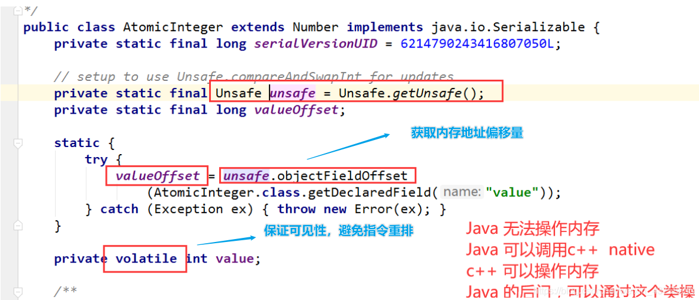

---


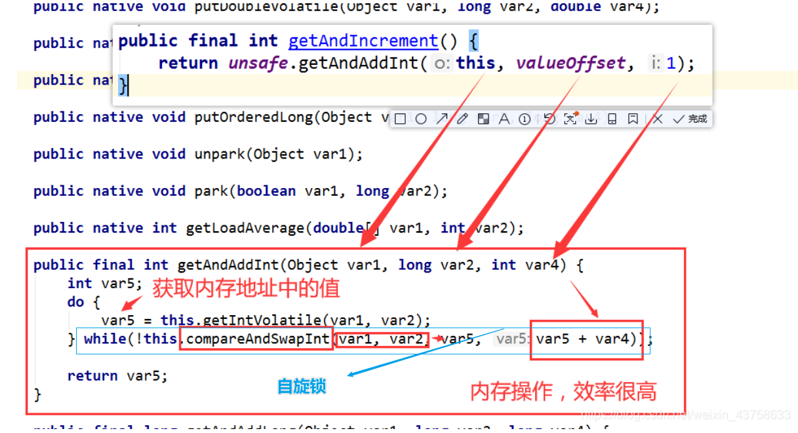

---

自旋锁：


### 2）总结

**CAS**：比较当前工作内存中的值 和 主内存中的值，如果这个值是期望的，那么则执行操作 如果不是就一直循环(使用自旋锁)。

**缺点：**

- 循环会耗时；
- 一次性只能保证一个共享变量的原子性；
- 它会存在ABA问题


### CAS的ABA问题

> #### (狸猫换太子)


线程1：期望值是1，要改成2；

线程2：两个操作：

- 1、期望值是1，要改成3
- 2、期望是3，要1改成

> 对于线程1来说，A的值还是1；但是这个值已经被线程2改动过了，只不过最后改回来了

==ABA问题是否有影响？==

**看业务场景，如果不影响业务就不用管，如果有影响就引入版本号**


问题：

1、循环会耗时

2、一次性只能保证一个共享变量

（基本变量在栈里面都是单线程，跟多线程没关系，只有堆里面才会出现多线程问题）


```java
package com.zzy.cas;

import java.util.concurrent.atomic.AtomicInteger;


public class CASDemo {
    // CAS compareAndSet : 比较并交换 
    public static void main(String[] args) {
        AtomicInteger atomicInteger = new AtomicInteger(2020);


        //平时写的SQL：乐观锁
        
        //期望 更新
        //public final boolean compareAndSet(int expect, int update)
        // 如果我期望的值达到了，那么就更新，否则，就不更新, CAS 是CPU的并发原语 
        // ============== 捣乱的线程 ==================
        System.out.println(atomicInteger.compareAndSet(2020, 2021));
        System.out.println(atomicInteger.get());
        System.out.println(atomicInteger.compareAndSet(2021, 2020));
        System.out.println(atomicInteger.get());

        // ============== 期望的线程 ==================
        System.out.println(atomicInteger.compareAndSet(2020, 77777));
        System.out.println(atomicInteger.get());
    }
}
```

#### 原子引用解决ABA问题

> 原子引用的思想：乐观锁

**带版本号 的原子操作**

考虑重听

[35、原子引用解决ABA问题_哔哩哔哩_bilibili](https://www.bilibili.com/video/BV1B7411L7tE/?spm_id_from=333.1391.0.0&p=35&vd_source=67ef3bb4c8d68a96408acdaa865b1313)

```java
package com.marchsoft.lockdemo;

import java.util.concurrent.TimeUnit;
import java.util.concurrent.atomic.AtomicStampedReference;

/**
 * Description：
 *
 * @author jiaoqianjin
 * Date: 2020/8/12 22:07
 **/

public class CASDemo {
    /**AtomicStampedReference 注意，如果泛型是一个包装类，注意对象的引用问题
     * 正常在业务操作，这里面比较的都是一个个对象
     */
    static AtomicStampedReference<Integer> atomicStampedReference = new
            AtomicStampedReference<>(1, 1);// 版本号是1，只要被修改过，版本号就会变化


    public static void main(String[] args) {
        new Thread(() -> {
            int stamp = atomicStampedReference.getStamp(); // 获得版本号
            System.out.println("a1=>" + stamp);// 输出
            
            // 修改操作时，版本号更新 + 1
            atomicStampedReference.compareAndSet(1, 3,
                    atomicStampedReference.getStamp(),
                    atomicStampedReference.getStamp() + 1);
            
            System.out.println("a2=>" + atomicStampedReference.getStamp());
            // 重新把值改回去， 版本号更新 + 1
            System.out.println(atomicStampedReference.compareAndSet(2, 1,
                    atomicStampedReference.getStamp(),
                    atomicStampedReference.getStamp() + 1));
            System.out.println("a3=>" + atomicStampedReference.getStamp());
        }, "a").start();
        
        // 乐观锁的原理相同 
        new Thread(() -> {
            int stamp = atomicStampedReference.getStamp(); // 获得版本号
            System.out.println("b1=>" + stamp);
            try {
                TimeUnit.SECONDS.sleep(2);
            } catch (InterruptedException e) {
                e.printStackTrace();
            }
            System.out.println(atomicStampedReference.compareAndSet(1, ,
                    stamp, stamp + 1));
            System.out.println("b2=>" + atomicStampedReference.getStamp());
        }, "b").start();
    }
}
```

**注意：**

**Integer 使用了对象缓存机制，默认范围是 -128 ~ 127 ，推荐使用静态工厂方法 valueOf 获取对象实例，而不是 new，因为 valueOf 使用缓存，而 new 一定会创建新的对象分配新的内存空间；**


# 21、各种锁的理解

### 1）公平锁，非公平锁

1. 公平锁： 非常公平， 不能够插队，必须先来后到 
2. 非公平锁：非常不公平，可以插队 （默认都是非公平）

> ```java
> public ReentrantLock() {
> 	sync = new NonfairSync();
> }
> 
> public ReentrantLock(boolean fair) {
> 	sync = fair ? new FairSync() : new NonfairSync();
> }
> ```


### 2）可重入锁

可重入锁（递归锁）


Synchronized：可重入锁

Lock：不可重入锁


> **Synchronized**

```java
package com.zzy.lock;


//Synchronized
public class Demo01 {

    public static void main(String[] args) {
        Phone phone = new Phone();
        new Thread(()->{
            phone.sms();
        },"A").start();

        new Thread(()->{
            phone.sms();
        },"B").start();
    }
}
class Phone{
    public synchronized void sms(){
        System.out.println(Thread.currentThread().getName()+"：sms");
        call();//这里也有锁
    }

    public synchronized void call(){
        System.out.println(Thread.currentThread().getName()+"：call");
    }
}
```

> **Lock 版**

```java
package com.zzy.lock;

import java.util.concurrent.locks.Lock;
import java.util.concurrent.locks.ReentrantLock;

//Synchronized
public class Demo02 {

    public static void main(String[] args) {
        Phone2 phone = new Phone2();
        new Thread(() -> {
            phone.sms();
        }, "A").start();

        new Thread(() -> {
            phone.sms();
        }, "B").start();
    }
}

class Phone2 {
    Lock lock = new ReentrantLock();

    public synchronized void sms() {
        lock.lock();// 细节问题：lock.lock(); lock.unlock(); 
        // lock锁必须配对，lock与unlock成对出现，否则就会死在里面
        try {
            System.out.println(Thread.currentThread().getName() + "：sms");
            call();//这里也有锁
        } catch (Exception e) {
            e.printStackTrace();
        } finally {
            lock.unlock();
        }
    }

    public synchronized void call() {
        lock.lock();
        try {
            System.out.println(Thread.currentThread().getName() + "：call");
        } catch (Exception e) {
            e.printStackTrace();
        } finally {
            lock.unlock();
        }
    }
}
```

- lock锁必须配对，lock和 unlock 必须数量相同；
- 在外面加的锁，也可以在里面解锁；在里面加的锁，在外面也可以解锁；


### 3）自旋锁

> spinlock


案例：自己写一个自旋锁

```java
package com.zzy.lock;


import java.util.concurrent.atomic.AtomicReference;

/**
 * 自己写一个自旋锁
 */
public class SpinlockDemo {
    //初始： int -> 0; 引用类型 Thread -> null
    AtomicReference<Thread> atomicReference = new AtomicReference<>();

    // 加锁
    public void myLock() {
        Thread thread = Thread.currentThread();
        System.out.println(Thread.currentThread().getName() + "==>myLock");
        //自旋锁
        while (!atomicReference.compareAndSet(null, thread)) {// 现成如果没抢到锁，就阻塞在循环（自旋）

        }
    }

    // 解锁
    public void myUnlock() {
        Thread thread = Thread.currentThread();
        System.out.println(Thread.currentThread().getName() + "==>myUnlock");
        //自旋锁
        atomicReference.compareAndSet(thread, null);

    }
}
```

> 测试

```java
package com.zzy.lock;

import java.util.concurrent.TimeUnit;
import java.util.concurrent.locks.ReentrantLock;

/**
 * @author Zhao
 * @DATE 2021/2/3 - 23:29
 */
public class TestSpinLock {
    public static void main(String[] args) {
        //ReentrantLock
        ReentrantLock reentrantLock = new ReentrantLock();
        reentrantLock.lock();
        reentrantLock.unlock();

        // 底层使用的自旋锁CAS
        SpinlockDemo lock = new SpinlockDemo();

        new Thread(()->{
            lock.myLock();
            try {
                TimeUnit.SECONDS.sleep(3);
            } catch (Exception e) {
                e.printStackTrace();
            } finally {
                lock.myUnlock();
            }

        },"T1").start();

        new Thread(()->{
            lock.myLock();
            try {
                TimeUnit.SECONDS.sleep(1);
            } catch (Exception e) {
                e.printStackTrace();
            } finally {
                lock.myUnlock();
            }

        },"T2").start();

    }
}
```

运行结果：

**t2进程必须等待t1进程Unlock后，才能Unlock，在这之前进行自旋等待。。。。**


### 4）==死锁==

> 死锁是什么


**死锁四要素**：

1. 


**死锁测试，怎么排除死锁：**

```java
package com.zzy.lock;
import java.util.concurrent.TimeUnit;

public class DeadLockDemo {
    public static void main(String[] args) {
        String lockA = "lockA";
        String lockB = "lockB";

        new Thread(new MyThread(lockA, lockB), "T1").start();

        new Thread(new MyThread(lockB, lockA), "T2").start();

    }
}

class MyThread implements Runnable {
    private String lockA;
    private String lockB;

    public MyThread(String lockA, String lockB) {
        this.lockA = lockA;
        this.lockB = lockB;
    }

    @Override
    public void run() {
        synchronized (lockA) {
            System.out.println(Thread.currentThread().getName() + "lock:" + lockA + "=>get" + lockB);
            try {
                TimeUnit.SECONDS.sleep(2);
            } catch (InterruptedException e) {
                e.printStackTrace();
            }
            synchronized (lockB) {
                System.out.println(Thread.currentThread().getName() + "lock:" + lockB + "=>get" + lockA);
            }
        }
    }
}
```


如何排查死锁问题

**1、使用jps定位出现问题的进程号（jdk的bin目录下： 有一个jps**工具）

命令：`jps -l`


**2、使用`jstack 进程号`，找到死锁问题**

```
jstack 14380
```

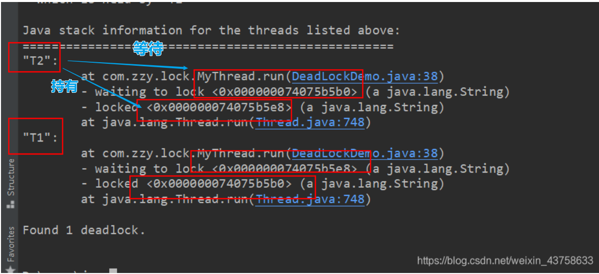

面试7：工作中排查问题：

1. 查看日志
2. 堆栈信息


> ### 视频地址：https://space.bilibili.com/95256449
>
> 笔记参考：https://blog.csdn.net/weixin_44491927/article/details/108560692
>
> 笔记参考：https://blog.csdn.net/weixin_43758633/article/details/113408853

https://blog.csdn.net/weixin_44491927/article/details/108560692

https://blog.csdn.net/weixin_43758633/article/details/113408853


```

```


