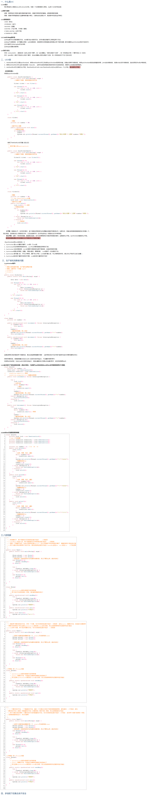

[JUC并发编程笔记（狂神说） - 你我不在年少 - 博客园](https://www.cnblogs.com/th11/p/15330675.html)

## 1. 什么是JUC

JUC就是java.util.concurrent下面的类包，专门用于多线程的开发。

**源码 + 官方文档 面试高频问 **

java.util 工具包

- 业务：无法通过普通的线程代码 Thread实现。
- Runnable 没有返回值、效率相比于Callable相对较低 
- **企业开发中Callable 使用较多**
  Callable ：


锁：


## 2、线程和进程

> 进程是操作系统中的应用程序、是资源分配的基本单位，线程是用来执行具体的任务和功能，是CPU调度和分派的最小单位
>
> 一个进程往往可以包含多个线程，至少包含一个


### 1）进程

**一个程序(QQ.EXE Music.EXE)；程序的集合**
一个进程可以包含多个线程，至少包含一个线程 
Java默认有几个线程：2个线程   main线程、GC线程

### 2）线程

**开了一个进程Typora，写字，等待几分钟会进行自动保存(线程负责的)**
对于Java而言：Thread、Runable、Callable进行开启线程的。

**提问？JAVA真的可以开启线程吗？ 开不了的 **

Java是没有权限去开启线程、操作硬件的，这是一个native的一个本地方法，它调用的底层的C++代码。

```java
    public synchronized void start() {
        /**
         * This method is not invoked for the main method thread or "system"
         * group threads created/set up by the VM. Any new functionality added
         * to this method in the future may have to also be added to the VM.
         *
         * A zero status value corresponds to state "NEW".
         */
        if (threadStatus != 0)
            throw new IllegalThreadStateException();

        /* Notify the group that this thread is about to be started
         * so that it can be added to the group's list of threads
         * and the group's unstarted count can be decremented. */
        group.add(this);

        boolean started = false;
        try {
            start0();
            started = true;
        } finally {
            try {
                if (!started) {
                    group.threadStartFailed(this);
                }
            } catch (Throwable ignore) {
                /* do nothing. If start0 threw a Throwable then
                  it will be passed up the call stack */
            }
        }
    }
	//这是一个本地方法，Java是没有权限操作底层硬件的
    private native void start0();
```

### ==区别==

* 一个进程可以有多个线程，进程是资源分配的基本单位，线程是CPU调度的基本单位
* 进程之间互相隔离，线程之间共享进程的资源
* 进程间通信(IPC)复杂
  线程间通信简单，因为共享进程内的内存
* 进程进程创建和销毁开销大、上下文切换成本高
  线程轻量，创建和销毁开销小、上下文切换成本低
* 


### 3）并发

> concurrent: 同一时间**应对**多件事情的能力

多线程操作同一个资源。

- CPU 只有一核，通过时间片轮转，来模拟多线程。
- 并发编程的本质：**充分利用CPU的资源 **

### 4）并行

> parallel: 同一时间动手**做**多件事情的能力

**并行：** 多个线程一起工作(多个人一起行走)

- CPU多核，多个线程可以同时执行。 我们可以使用线程池

**获取cpu的核数**

```java
public class Test1 {
    public static void main(String[] args) {
        //获取cpu的核数
        System.out.println(Runtime.getRuntime().availableProcessors());
    }
}
```


> 多线程程序处理同一系列任务，是否比单线程效率更高？
>
> * 单核CPU：效率更低，因为有上下文切换开销(但是多线程能避免饥饿现象)
> * 多核CPU：效率更高，因为可以把多个线程映射到不同内核上同时执行

> 补充知识：
>
> IO操作不占用CPU，但是阻塞IO会阻塞线程；  优化：非阻塞IO/异步IO


### 5）==线程的状态==

> Java API层面

```java
public enum State {	
	//新生
    NEW,

	//运行
    RUNNABLE,

	//阻塞
    BLOCKED,

	//等待
    WAITING,

	//超时等待
    TIMED_WAITING,

	//终止
    TERMINATED;
}
```

> **Java 的线程状态是对操作系统线程状态的一种抽象和简化**
>
> 其中:
>
> RUNNABLE对应就绪态 运行态 阻塞态(由BIO导致的线程阻塞)
>
> WAITING与TIMED_WAITING也对应阻塞态（是 Java API 层面对阻塞态的细分）
>
> | Java 状态     | 对应的 OS 状态                    | 说明                                                         |
> | ------------- | --------------------------------- | ------------------------------------------------------------ |
> | NEW           | 创建态                            | 线程对象已创建，但未调用 `start()`，OS 尚未为其分配资源。    |
> | RUNNABLE      | 就绪态 (Ready) + 运行态 (Running) | 这是一个“组合态”。只要线程在等待 CPU 调度（就绪）或正在 CPU 上执行（运行），Java 都将其视为 `RUNNABLE`。 |
> | BLOCKED       | 阻塞态 (Blocked)                  | 仅指等待获取 `synchronized` 监视器锁的线程。此时线程不占用 CPU，等待特定资源（锁）可用。 |
> | WAITING       | 阻塞态 (Blocked)                  | 线程无限期等待另一个线程执行特定操作（如 `notify` 或 `join` 结束）。 |
> | TIMED_WAITING | 阻塞态 (Blocked)                  | 带有时间限制的等待（如 `sleep`, `wait(timeout)`），超时后自动唤醒。 |
> | TERMINATED    | 终止态                            | 线程执行完毕，生命周期结束。                                 |
>
> #### **BLOCKED vs WAITING：同样是“等”，等的内容不同**
>
> 这是最容易混淆的地方，也是 Java 状态机比 OS 状态更细腻的地方：
>
> - BLOCKED (Java) = 等“钥匙”
>   - **场景：** 你想进 `synchronized` 房间，但门被锁了（锁被别人持有）。
>   - **特点：** 你（线程）在门口排队，只有等里面的人把钥匙（锁）扔出来，你才能进去。你不知道里面发生了什么，只知道门打不开。
>   - **OS 层面：** 这也是一种阻塞（等待资源）。
> - WAITING / TIMED_WAITING (Java) = 等“通知”
>   - **场景：** 你在房间里，调用了 `wait()` 或 `join()` 或 `LockSupport.park()`。
>   - **特点：** 你主动放弃了钥匙（释放了锁），并且进入了“休息室”（等待队列）。你不再参与锁的竞争，直到有人喊你名字（`notify`）或者时间到了，你才会出来重新抢钥匙。
>   - **OS 层面：** 这也是一种阻塞（等待事件/条件）。


### ==创建线程的方法==


1**.使用Thread的start方法**

> 任务和线程合并(耦合)

```java
new Thread(){() -> {
    log.debug("hello,I'm running");
}}.start();
```

> ```java
> Thread t = new Thread(){
>     @Override
>     public void run(){
>         log.debug("hello,I'm running");
>     }
> };
> t.start();
> ```

重写了父类的run方法


**2.使用Runnable配合Thread**

> 把任务和线程分离

```java
new Thread(() -> {
        log.debug("I'm running");
}}, "线程一").start();
```

> ```java
> // Runnable runnable = () -> log.debug("running");
> Runnable runnable = new Runnable() {
>     public void run(){
>         log.debug("I'm running");
>     }
> };
> Thread t = new Thread(runnable, "线程一");
> t.start();
> ```
>
> 实际执行的时候，调用的是Runnable实现的run方法


**3.使用FutureTask配合Thread**

> 可以获取任务执行结果
>
> 间接实现了Runnable接口，也可以传入Thread：
>
> 
>
> 
>
> callable的唯一方法提供了返回值
>
> 
>
> 

```java
FutureTask<Integer> task = new FureTask<>(new Callable<Integer>(){
    @Override
    public Integer call() throws Exception {
        log.debug("I'm running");
        Thread.sleep(1000);
        return 100;
    }
});
new Thread(task, "线程一").start();

Integer res = task.get();// 获取返回结果(会阻塞，直到结果返回)
```


4.


#### 【查看进程】


**windows**

* 任务管理器

* `tasklist` 查看进程

  ```
  tasklist
  tasklist | findstr java
  ```

* `taskkill` 杀死进程

  ```
  taskkill /F /PID 12345
  ```

  


**linux**

* `ps -ef` 查看所有进程

  ```
  ps -ef | grep java
  ```

  > 会显示出相关进程+grep进程
  >
  > 查看java相关进程也可以用：`jps`

* `ps -fT -p <PID>`：查看某个进程的所有线程

* `kill <PID>`杀死进程

* `top -H -p <PID>` 动态查看<u>某个进程中的所有线程的</u>信息

  > 内存占用、CPU占用百分比
  >
  > 查看java相关线程也可以用：`jstack <PID>` 
  > (把**某一瞬间的**<u>进程中的所有线程的</u>信息抓取出来)

  > 按大写H可以切换是否显示线程


**Java**

* jconsole ：用图形化界面查看java进程中线程的运行情况


### 线程运行的原理

**栈与栈帧**

JVM 中由堆、栈、方法区所组成，其中栈内存是给谁用的呢？其实就是线程

* 每个线程启动后，虚拟机就会为其分配一块栈内存 (按照线程分配) 

* 每个栈由多个栈帧（Frame）组成，对应着每次方法调用时所占用的内存
* 每个线程只能有一个活动栈帧，对应着当前正在执行的那个方法 


> 图解
>
> 
>
> 
>
> 


**线程上下文切换**

因为以下一些原因导致 cpu 不再执行当前的线程，转而执行另一个线程的代码 

* 线程的 cpu 时间片用完
* 垃圾回收
* 有更高优先级的线程需要运行
* <u>线程自己调用了 sleep、yield、wait、join、park、synchronized、lock 等方法</u>

当上下文切换发生时，需要由操作系统保存当前线程的状态，并恢复另一个线程的状态，Java 中对应的概念 就是程序计数器（Program Counter Register），它的作用是记住下一条 jvm 指令的执行地址，是线程私有的

* 状态包括程序计数器、虚拟机栈中每个栈帧的信息，如局部变量、操作数栈、返回地址等

* 线程数不是越多越好，上下文切换频繁会影响性能

  > <u>如何选择合适的线程数</u>


> 
>
> 
>
> 


### 主线程和守护线程

默认情况下，Java 进程需要等待所有线程都运行结束，才会结束。有一种特殊的线程叫做守护线程，只要其它非守护线程运行结束了，即使守护线程的代码没有执行完，也会强制结束

* 垃圾回收器线程就是一种守护线程
* Tomcat 中的 Acceptor 和 Poller 线程都是守护线程，所以 Tomcat 接收到 shutdown 命令后，不会等 待它们处理完当前请求

> ```java
> log.debug("开始运行...");
> Thread t1 = new Thread(() -> {
>     log.debug("开始运行...");
>     TimeUnit.SECONDS.sleep(2);
>     log.debug("运行结束...");
> }, "daemon");
> // 设置该线程为守护线程
> t1.setDaemon(true);
> t1.start();
> 
> TimeUnit.SECONDS.sleep(1);
> log.debug("运行结束...");
> ```
>
> 


### Thread类常见方法


| 方法名                 | static | 功能说明                                                     | 注意                                                         |
| ---------------------- | ------ | ------------------------------------------------------------ | ------------------------------------------------------------ |
| start()                |        | 启动一个新线程，在新的线程运行run方法中的代码                | start 方法只是让线程进入就绪态(RUNNABLE)，不一定立刻进入运行(CPU时间片可能还没分给它)，每个线程对象的 start 方法只能调用一次，如果多次调用会出现IllegalThreadStateException |
| run()                  |        | 新线程启动后会调用的方法                                     | 如果在构造Thread对象的时候传递了 Runnable 参数，则线程启动后会调用 Runnable 中的 run 方法，否则默认不执行任何操作。但可以创建 Thread 的子类对象，来覆盖默认行为 |
| join()                 |        | 等待线程运行结束                                             |                                                              |
| join(long n)           |        | 等待线程运行结束，最多等待n毫秒                              |                                                              |
| getId()                |        | 获取线程长整型的id                                           | id 唯一                                                      |
| getName()              |        | 获取线程名                                                   |                                                              |
| setName(String)        |        | 修改线程名                                                   |                                                              |
| getPriority()          |        | 获取线程优先级                                               |                                                              |
| setPriority(int)       |        | 修改线程优先级                                               | java中规定线程优先级是 1~10 的整数，较大的优先级能提高该线程被CPU调度的机率 |
| getState()             |        | 获取线程状态                                                 | Java中线程状态是用 6个enum 表示，分别为：NEW，RUNNABLE，BLOCKED，WAITING，TIMED_WAITING，TERMINATED |
| <u>isInterrupted()</u> |        | 判断是否被打断                                               | <u>不会被清除`打断标记`</u>                                  |
| isAlive()              |        | 线程是否存活(还没运行完毕)                                   |                                                              |
| interrupt()            |        | 打断线程                                                     | 如果被打断的线程正在sleep / wait / join，会导致打断的线程抛出 InterruptedException，并清除`打断标记`，如果打断的是正在运行的线程，则会设置`打断标记`，park 的线程被打断，也会设置`打断标记` |
| <u>interrupted()</u>   | static | 判断当前线程是否被打断                                       | <u>会清除`打断标记`</u>                                      |
| currentThread()        | static | 获取当前正在执行的线程                                       |                                                              |
| sleep(long n)          | static | 让当前执行的线程休眠n毫秒(阻塞态 TIMED_WAITING)，休眠时让出cpu的时间片给其他线程 |                                                              |
| yield()                | static | 提示线程调度器让出当前线程对CPU的使用                        | 主要用于测试和调试                                           |


#### sleep 与 yield

**sleep**

> **"躺下"**

1. 调用sleep会让当前线程从**RUNNABLE(具体来说是RUNNING)进入TIMED_WAITING状态**

2. 其它线程可以使用 interrupt 方法打断正在睡眠的线程，这是sleep方法会抛出InterruptedException

3. 睡眠结束后的线程未必会立刻得到执行(进入就绪态 就绪队列)

4. 建议用TimeUnit 的sleep 代替 Thread 的 sleep 来获得更好的可读性

   ```java
   Thread.sleep(2000);
   TimeUnit.SECONDS.sleep(2); // 睡眠2s
   ```

   

**yield**

> “**谦让**”

1. 调用yield 之后， JVM 层面的状态**仍然是 `RUNNABLE`**，向线程调度器发出信号 在操作系统层面由运行态转成就绪态、让出CPU时间片，然后调度器选择其他同优先级的线程运行，如果不存在同优先级的线程(，则当前线程可能被立即重新调度)，那么不能保证让当前线程暂停的效果
2. 具体的实现依赖于操作系统的任务调度器


#### join

* 等待某个线程运行结束

  > 在哪个线程中调用就是哪个线程开始等待

  > 底层基于wait()

```java
log.debug("开始");
Thread t1 = new Thread(() -> {
    log.debug("开始");
    sleep(1);
	log.debug("结束");
    r = 10;
});
t1.start();
t1.join();
log.debug("结果为:{}", r);
log.debug("结束");
```

可以设置等待时间限制

```java
log.debug("开始");
Thread t1 = new Thread(() -> {
    log.debug("开始");
    sleep(1);
	log.debug("结束");
    r = 10;
});
t1.start();
t1.join(2000); // 最多等待两千毫秒
log.debug("结果为:{}", r);
log.debug("结束");
```


#### interrupt

* 可以打断正在运行态或阻塞态的线程

  > 阻塞态(**sleep wait join** / WAITING TIMED_WAITING BLOCK)

```java
Thread t1 = new Thread(() -> {
	log.debug("sleep...");
	try {
		Thread.sleep(5000);
	} catch(InterruptedException e) {
		e.printStackTrace();
	}
}, "线程1");
t1.start();

TimeUnit.SECONDS.sleep(1);// 主线程睡一会，让线程1先进入睡眠
log.debug("interrupt");
t1.interrupt();
log.debug(": {}", t1.isInterrupted()); // 打印false
```


**打断标记**：可以用于判断线程被打断之后继续运行还是终止

* 在阻塞态被打断的线程，打断标记会置为false

* 在运行态被打断的线程，打断标记会置为true

  


> ```java
> Thread t1 = new Thread(() -> {
> 	while(true){
> 		boolean interrupted = Thread.currentThread().isInterrupted();
> 		if(interrupted) {
> 			log.debug("被打断了，退出循环");
> 			break;
> 		}
> 	}
> }, "线程1");
> t1.start();
> 
> TimeUnit.SECONDS.sleep(1);
> log.debug("打断线程1");
> t1.interrupt();
> 
> ```
>
> 


##### 使用 interrupt() 打断 park 线程

可以打断处于 park 状态的线程，让它继续往下执行

```java
private static void test() throws InterruptedException {
    Thread t1 = new Thread(() -> {
        log.debug("park...");
        LockSuport.park();
        // 如果不打断，会保持 park，下面的代码不再执行
        log.debug("unpark...");
        log.debug("打断状态: {}", Thread.currentThread().isInterrupted());
        
        LockSuport.park();
        log.debug("unpark...");// 二次park不会生效，会继续打印这行代码
    }, "线程1");
    t1.start();
    
    sleep(1);
    t1.interrupt();
}
```

打断标记为真的时候，park 方法不会生效


```java
private static void test() throws InterruptedException {
    Thread t1 = new Thread(() -> {
        log.debug("park...");
        LockSuport.park();
        // 如果不打断，会保持 park，下面的代码不再执行
        log.debug("unpark...");
        log.debug("打断状态: {}", Thread.currentThread().interrupted());
        // interrupted()在返回打断标记的同时把打断标记置为
        
        LockSuport.park();// 此时二次 park 会生效
        log.debug("unpark...");
    }, "线程1");
    t1.start();
    
    sleep(1);
    t1.interrupt();
}
```


#### 不推荐使用的方法

| 方法名    | 功能说明           | 替代   |
| --------- | ------------------ | ------ |
| stop()    | 停止线程运行       |        |
| suspend() | 挂起(暂停)线程运行 | wait   |
| resume()  | 恢复线程运行       | notify |

已过时，容易破坏同步代码块，造成死锁


### 两阶段终止模式

**错误的终止思路**：

* 使用线程对象的`stop()`方法停止线程

  * stop方法会真正杀死线程，如果这时线程锁住了共享资源，那么它被杀死后就再也没有机会释放锁，其他线程将永远无法获取锁

* 使用`System.exit(int)`方法停止线程

  此方法会让整个程序都停止，而不是仅停止一个线程


**两阶段终止模式**：


* 优点：给被终止线程处理后续工作的机会

* 场景：监控线程，如果需要停止

  > 监控线程一般会有个while(true)循环
  >
  > 
  >
  > 

```java
public class Test {
    public static void main(String[] args) throws InterruptedException();
    tpt.start();
    
    Thread.sleep(3500);
    tpt.stop(); 
}
class TwoPhaseTermination {
    private Thread monitor;
    
    // 启动监控线程
    public void start() {
        monitor = new Thread(() -> {
            while(true){
                Thread current = Thread.currentThread();
                if(current.isInterrupted()){
                    log.debug("处理终止工作(料理后事)");
                    break;
                }
                
                try {
                    TimeUnit.SECONDS.sleep(1); // 1.睡眠中可能被打断
                    log.debug("执行监控记录"); // 2.运行中可能被打断 
                } catch (InterruptedException e) {
                    // 睡眠中被打断会以异常的形式处理
                    e.printStackTrace();
                    // 设置打断标记为真，确保睡眠中被打断也能正常终止程序
                    current.interrupt();
                }
            }
        });
        
        monitor.start();
    }
    
    // 停止监控线程
    public void stop() {
        monitor.interrupt();
    }
    
}
```

可以用volatile优化


### 线程优先级

`package java.lang;`


最小优先级1

默认优先级5


* 线程优先级会提示（hint）调度器优先调度该线程，但它仅仅是一个提示，调度器可以忽略它

* 如果 cpu 比较忙，那么优先级高的线程会获得更多的时间片，但 cpu 闲时，优先级几乎没作用


### 6）wait/sleep

**1、来自不同的类**

wait => Object
sleep => Thread
一般情况企业中使用休眠是：

```java
TimeUnit.DAYS.sleep(1); //休眠1天
TimeUnit.SECONDS.sleep(1); //休眠1s
```

**2、关于锁的释放**

wait 会释放锁；

sleep睡觉了，不会释放锁；

**3、使用的范围是不同的**

wait 必须在同步代码块中；

sleep 可以在任何地方睡；

**4、是否需要捕获异常**

wait是也需要捕获异常；（网上非常多的代码说不用抛出异常，应该是没去看源码和尝试吧，下面附图，其实文章上一张源码的图也显示需要抛出异常），notify和notifyAll不需要捕获异常。）

> 中断异常   

sleep必须要捕获异常；

5、


## 3.Lock

### 1）传统的 synchronized

给方法加上synchronized属性

```java
package com.marchsoft.juctest;

import lombok.Synchronized;

/**
 * Description：synchronized
 *
 * @author jiaoqianjin
 * Date: 2020/8/10 21:36
 **/

public class Demo01 {
    public static void main(String[] args) {
        final Ticket ticket = new Ticket();
        //lambda表达式  (参数)->{代码}
        new Thread(()->{
            for (int i = 0; i < 40; i++) {
                ticket.sale();
            }
        },"A").start();
        new Thread(()->{
            for (int i = 0; i < 40; i++) {
                ticket.sale();
            }
        },"B").start();
        new Thread(()->{
            for (int i = 0; i < 40; i++) {
                ticket.sale();
            }
        },"C").start();
    }
}
// 资源类 OOP 属性、方法
class Ticket {
    private int number = 30;

    //卖票的方式
    public synchronized void sale() {
        if (number > 0) {
            System.out.println(Thread.currentThread().getName() + "卖出了第" + (number--) + "张票剩余" + number + "张票");
        }
    }
}
```

### 2）Lock

java.util.concurrent.locks


> 传入一个true就能设置成公平锁

**公平锁：** 十分公平，必须先来后到~；

**非公平锁：** 十分不公平，可以插队；**(默认为非公平锁)**


```java
package com.marchsoft.juctest;

import java.util.concurrent.locks.Lock;
import java.util.concurrent.locks.ReentrantLock;

/**
 * Description：
 *
 * @author 
 * Date: 2020/8/10 22:05
 **/

public class LockDemo {
    public static void main(String[] args) {
        final Ticket2 ticket = new Ticket2();

        new Thread(() -> {
            for (int i = 0; i < 40; i++) {
                ticket.sale();
            }
        }, "A").start();
        new Thread(() -> {
            for (int i = 0; i < 40; i++) {
                ticket.sale();
            }
        }, "B").start();
        new Thread(() -> {
            for (int i = 0; i < 40; i++) {
                ticket.sale();
            }
        }, "C").start();
    }
}
//lock三部曲
//1、    Lock lock=new ReentrantLock();
//2、    lock.lock() 加锁
//3、    finally=> 解锁：lock.unlock();
class Ticket2 {
    private int number = 30;
	
    // 【创建锁】
    Lock lock = new ReentrantLock();
    //卖票的方式
    public synchronized void sale() {//
        lock.lock(); // 开启锁
        try {
            if (number > 0) {
                System.out.println(Thread.currentThread().getName() + "卖出了第" + (number--) + "张票剩余" + number + "张票");
            }
        }finally {
            lock.unlock(); // 关闭锁
        }

    }
}
```

### 3）==Synchronized 与Lock 的区别==

- Synchronized **内置的Java关键字**，Lock是一个**Java类**
- Synchronized 无法判断获取**锁的状态**，Lock可以判断是否获取到了锁
- Synchronized 会**自动释放锁**，lock必须要手动加锁和手动释放锁 可能会遇到死锁
- Synchronized 线程1(获得锁->阻塞)、线程2(等待)；lock就不一定会一直等待下去，l<u>ock会有一个**trylock**去尝试获取锁</u>，不会造成长久的等待。
- Synchronized **是可重入锁**，不可以中断的，**非公平的**；Lock，可重入的，可以判断锁，可以自己设置公平锁和非公平锁；
- Synchronized 适合锁少量的代码同步问题，Lock适合锁大量的同步代码；


## 4、==生产者和消费者问题==

**面试：单例模式、排序算法、生产者和消费者、死锁问题**

### 1) Synchronized 版

```
/**
 * 线程之间的通信问题：生产者和消费者问题 
 * 解释：两个线程交替执行 A B 操作同一个变量 num = 0
 * A 执行 num+1
 * B 执行 num-1
 * 使用“等待唤醒+通知唤醒”的方式让两个轮流执行
 */
```

生产者和消费者问题-演示代码

```JAVA
package com.zzy.pc;
//顺序：判断等待->业务->通知
public class A {
    public static void main(String[] args) {
        Data data = new Data();

        new Thread(() -> {
            for (int i = 0; i < 10; i++) {
                try {
                    data.increment();
                } catch (InterruptedException e) {
                    e.printStackTrace();
                }
            }

        }, "A").start();

        new Thread(() -> {
            for (int i = 0; i < 10; i++) {
                try {
                    data.decrement();
                } catch (InterruptedException e) {
                    e.printStackTrace();
                }
            }
            
        },"B").start();
    }
}

class Data {
    private int number = 0;

    //+1
    public synchronized void increment() throws InterruptedException {
        //一、等待
        if (number != 0) {
            this.wait();
        }
        
        // 二、业务
        number++;
        System.out.println(Thread.currentThread().getName() + "=>" + number);
        // 三、通知其他线程，我+1完毕了
        this.notifyAll();
    }

    //-1
    public synchronized void decrement() throws InterruptedException {
        //一、等待
        if (number == 0) {
            this.wait();
        }
        
        // 二、业务
        number--;
        System.out.println(Thread.currentThread().getName() + "=>" + number);
        // 三、通知其他线程，我-1完毕了
        this.notifyAll();
    }
}
```

### 2）存在问题（虚假唤醒）

**问题，如果有四个线程**，会出现虚假唤醒


**虚假唤醒问题**：


解决方式 ，**if 改为while即可，防止虚假唤醒**

> 结论：**就是用if判断的话，唤醒后线程会从wait之后的代码开始运行，但是不会重新判断if条件，直接继续运行if代码块之后的代码，而如果使用while的话，也会从wait之后的代码运行，但是唤醒后会重新判断循环条件，如果不成立再执行while代码块之后的代码块，成立的话继续wait。**
> 这也就是为什么用while而不用if的原因了，因为线程被唤醒后，执行开始的地方是wait之后
>
> 
>
> (本来只需要一个消费者，但是notifyAll唤醒了一群消费者，一群只有一个可以消费，那么其他消费者就是虚假唤醒了，所以才需要使用while来多次判断条件)

```java
package com.marchsoft.juctest;

/**
 * Description：
 *
 * @author jiaoqianjin
 * Date: 2020/8/10 22:33
 **/

public class ConsumeAndProduct {
    public static void main(String[] args) {
        Data data = new Data();

        new Thread(() -> {
            for (int i = 0; i < 10; i++) {
                try {
                    data.increment();
                } catch (InterruptedException e) {
                    e.printStackTrace();
                }
            }
        }, "A").start();
        new Thread(() -> {
            for (int i = 0; i < 10; i++) {
                try {
                    data.decrement();
                } catch (InterruptedException e) {
                    e.printStackTrace();
                }
            }
        }, "B").start();
        new Thread(() -> {
            for (int i = 0; i < 10; i++) {
                try {
                    data.increment();
                } catch (InterruptedException e) {
                    e.printStackTrace();
                }
            }
        }, "C").start();
        new Thread(() -> {
            for (int i = 0; i < 10; i++) {
                try {
                    data.decrement();
                } catch (InterruptedException e) {
                    e.printStackTrace();
                }
            }
        }, "D").start();
    }
}

class Data {
    private int num = 0;

    // +1
    public synchronized void increment() throws InterruptedException {
        // 判断等待
        while (num != 0) {
            this.wait();
        }
        num++;
        System.out.println(Thread.currentThread().getName() + "=>" + num);
        // 通知其他线程 +1 执行完毕
        this.notifyAll();
    }

    // -1
    public synchronized void decrement() throws InterruptedException {
        // 判断等待
        while (num == 0) {
            this.wait();
        }
        num--;
        System.out.println(Thread.currentThread().getName() + "=>" + num);
        // 通知其他线程 -1 执行完毕
        this.notifyAll();
    }
}
```

### 3）Lock版


> Lock场景下，Condition对象的await方法起到wait的作用，signal方法起到notify的作用


生产者和消费者问题-演示代码：

```java
package com.marchsoft.juctest;

import java.util.concurrent.locks.Condition;
import java.util.concurrent.locks.Lock;
import java.util.concurrent.locks.ReentrantLock;

/**
 * Description：
 *
 * @author jiaoqianjin
 * Date: 2020/8/11 9:48
 **/

public class LockCAP {
    public static void main(String[] args) {
        Data2 data = new Data2();

        new Thread(() -> {
            for (int i = 0; i < 10; i++) {

                try {
                    data.increment();
                } catch (InterruptedException e) {
                    e.printStackTrace();
                }

            }
        }, "A").start();
        new Thread(() -> {
            for (int i = 0; i < 10; i++) {
                try {
                    data.decrement();
                } catch (InterruptedException e) {
                    e.printStackTrace();
                }
            }
        }, "B").start();
        new Thread(() -> {
            for (int i = 0; i < 10; i++) {
                try {
                    data.increment();
                } catch (InterruptedException e) {
                    e.printStackTrace();
                }
            }
        }, "C").start();
        new Thread(() -> {
            for (int i = 0; i < 10; i++) {
                try {
                    data.decrement();
                } catch (InterruptedException e) {
                    e.printStackTrace();
                }
            }
        }, "D").start();
    }
}

class Data2 {
    private int num = 0;
    Lock lock = new ReentrantLock();
    Condition condition = lock.newCondition();
    // +1
    public  void increment() throws InterruptedException {
        lock.lock();
        try {
            // 一、判断等待
            while (num != 0) {
                condition.await();
            }
            // 二、业务
            num++;
            System.out.println(Thread.currentThread().getName() + "=>" + num);
            // 三、通知其他线程 +1 执行完毕
            condition.signalAll();
        }finally {
            lock.unlock();
        }

    }

    // -1
    public  void decrement() throws InterruptedException {
        lock.lock();
        try {
            // 判断等待
            while (num == 0) {
                condition.await();
            }
            num--;
            System.out.println(Thread.currentThread().getName() + "=>" + num);
            // 通知其他线程 +1 执行完毕
            condition.signalAll();
        }finally {
            lock.unlock();
        }

    }
}
```


#### Condition的优势

精准的通知和唤醒的线程 

**如果我们要指定通知的下一个进行顺序怎么办呢？ 我们<u>可以使用Condition来指定通知进程执行顺序</u>~**

示例代码

```java
package com.marchsoft.juctest;

import java.util.concurrent.locks.Condition;
import java.util.concurrent.locks.Lock;
import java.util.concurrent.locks.ReentrantLock;

/**
 * Description：实现
 * A 执行完 调用B
 * B 执行完 调用C
 * C 执行完 调用A
 *
 * @author jiaoqianjin
 * Date: 2020/8/11 9:58
 **/

public class ConditionDemo {
    public static void main(String[] args) {
        Data3 data3 = new Data3();

        new Thread(() -> {
            for (int i = 0; i < 10; i++) {
                data3.printA();
            }
        },"A").start();
        new Thread(() -> {
            for (int i = 0; i < 10; i++) {
                data3.printB();
            }
        },"B").start();
        new Thread(() -> {
            for (int i = 0; i < 10; i++) {
                data3.printC();
            }
        },"C").start();
    }

}

//num为1的时候，让A执行；num为2的时候，让B执行；num为3的时候，让C执行；

class Data3 {
    private Lock lock = new ReentrantLock();
    private Condition condition1 = lock.newCondition();
    private Condition condition2 = lock.newCondition();
    private Condition condition3 = lock.newCondition();
    private int num = 1; // 1A 2B 3C

    public void printA() {
        lock.lock();
        try {
            // 业务代码 判断 -> 执行 -> 通知
            while (num != 1) {
                condition1.await();
            }
            System.out.println(Thread.currentThread().getName() + "==> AAAA" );
            num = 2;
            condition2.signal();//唤醒condition2
        }catch (Exception e) {
            e.printStackTrace();
        }finally {
            lock.unlock();
        }
    }
    public void printB() {
        lock.lock();
        try {
            // 业务代码 判断 -> 执行 -> 通知
            while (num != 2) {
                condition2.await();
            }
            System.out.println(Thread.currentThread().getName() + "==> BBBB" );
            num = 3;
            condition3.signal();
        }catch (Exception e) {
            e.printStackTrace();
        }finally {
            lock.unlock();
        }
    }
    public void printC() {
        lock.lock();
        try {
            // 业务代码 判断 -> 执行 -> 通知
            while (num != 3) {
                condition3.await();
            }
            System.out.println(Thread.currentThread().getName() + "==> CCCC" );
            num = 1;
            condition1.signal();
        }catch (Exception e) {
            e.printStackTrace();
        }finally {
            lock.unlock();
        }
    }
}
/*
A==> AAAA
B==> BBBB
C==> CCCC
A==> AAAA
B==> BBBB
C==> CCCC
...
*/
```


## 5. 关于锁的8个问题

如何判断锁的是谁 锁到底锁的是谁？

**锁会锁住：对象、Class**


**问题1**

两个同步方法，先执行发短信还是打电话

```java
public class dome01 {
    public static void main(String[] args) {
        Phone phone = new Phone();

        new Thread(() -> { phone.sendMs(); }).start();
        TimeUnit.SECONDS.sleep(1);
        new Thread(() -> { phone.call(); }).start();
    }
}

class Phone {
    public synchronized void sendMs() {
        System.out.println("发短信");
    }
    public synchronized void call() {
        System.out.println("打电话");
    }
}
```

输出结果为

发短信

打电话

**为什么？ 如果你认为是顺序在前？ 这个答案是错误的 **

**问题2：**

**我们再来看：我们让发短信 延迟4s**

```java
public class dome01 {
    public static void main(String[] args) throws InterruptedException {
        Phone phone = new Phone();

        new Thread(() -> {
            try {
                phone.sendMs();
            } catch (InterruptedException e) {
                e.printStackTrace();
            }
        }).start();
        TimeUnit.SECONDS.sleep(1);
        new Thread(() -> { phone.call(); }).start();
    }
}

class Phone {
    public synchronized void sendMs() throws InterruptedException {
        TimeUnit.SECONDS.sleep(4);
        System.out.println("发短信");
    }
    public synchronized void call() {
        System.out.println("打电话");
    }
}
```

TimeUnit

现在结果是什么呢？

结果：**==还是先发短信，然后再打电话 ==**

**why？**

> 原因：并不是顺序执行，而是synchronized <u>锁住的对象</u>**是方法的调用者（也就是说，锁住的是对象）** 对于两个方法用的是同一个锁，谁先拿到谁先执行，另外一个等待
>
> ==对象锁==


**问题三**

加一个普通方法

```java
public class dome01 {
    public static void main(String[] args) throws InterruptedException {
        Phone phone = new Phone();

        new Thread(() -> {
            try {
                phone.sendMs();
            } catch (InterruptedException e) {
                e.printStackTrace();
            }
        }).start();
        TimeUnit.SECONDS.sleep(1);
        new Thread(() -> { phone.hello(); }).start();
    }
}

class Phone {
    public synchronized void sendMs() throws InterruptedException {
        TimeUnit.SECONDS.sleep(4);
        System.out.println("发短信");
    }
    public synchronized void call() {
        System.out.println("打电话");
    }
    public void hello() {
        System.out.println("hello");
    }
}
```

输出结果为

hello

发短信

> 原因：hello是一个**普通方法，不受synchronized锁的影响**，==**不用等待锁的释放**==
>
> 


**问题四**

**如果我们使用的是两个对象，一个调用发短信，一个调用打电话，那么整个顺序是怎么样的呢？**

```java
public class dome01 {
    public static void main(String[] args) throws InterruptedException {
        Phone phone1 = new Phone();
        Phone phone2 = new Phone();

        new Thread(() -> {
            try {
                phone1.sendMs();
            } catch (InterruptedException e) {
                e.printStackTrace();
            }
        }).start();
        TimeUnit.SECONDS.sleep(1);
        new Thread(() -> { phone2.call(); }).start();
    }
}

class Phone {
    public synchronized void sendMs() throws InterruptedException {
        TimeUnit.SECONDS.sleep(4);
        System.out.println("发短信");
    }
    public synchronized void call() {
        System.out.println("打电话");
    }
    public void hello() {
        System.out.println("hello");
    }
}
```

输出结果

打电话

发短信

> 原因：<u>两个对象两把锁，不会出现等待的情况</u>，发短信睡了4s,所以先执行打电话


**问题五、六**

**如果我们把synchronized的方法加上static变成静态方法 那么顺序又是怎么样的呢？**

（1）我们先来使用一个对象调用两个方法 

答案是：**先发短信,后打电话**

（2）如果我们使用两个对象调用两个方法 

答案是：**还是先发短信，后打电话**

原因是什么呢？ 为什么加了static就始终前面一个对象先执行呢 为什么后面会等待呢？
原因是：**对于static静态方法来说，对于整个类Class来说只有一份，对于不同的对象使用的是同一份方法，相当于==这个方法是属于这个类的==，如果静态static方法使用synchronized锁定，那么这个synchronized锁会锁住整个对象 不管多少个对象，各个静态方法使用的是同一把锁，谁先拿到这个锁就先执行，其他的进程都需要等待 **


**问题七**

**如果我们使用一个静态同步方法、一个同步方法、一个对象调用顺序是什么？**

```java
public class dome01 {
    public static void main(String[] args) throws InterruptedException {
        Phone phone = new Phone();

        new Thread(() -> {
            try {
                phone.sendMs();
            } catch (InterruptedException e) {
                e.printStackTrace();
            }
        }).start();
        TimeUnit.SECONDS.sleep(1);
        new Thread(() -> { phone.call(); }).start();
    }
}

class Phone {
    public static synchronized void sendMs() throws InterruptedException {
        TimeUnit.SECONDS.sleep(4);
        System.out.println("发短信");
    }
    public synchronized void call() {
        System.out.println("打电话");
    }
    public void hello() {
        System.out.println("hello");
    }
}
```

输出结果

打电话

发短信

> 原因：因为<u>一个锁的是Class类的模板，一个锁的是对象的调用者</u>。所以**不存在等待，直接运行**。


**问题八**

**如果我们使用一个静态同步方法、一个同步方法、两个对象调用顺序是什么？**

```java
public class dome01 {
    public static void main(String[] args) throws InterruptedException {
        Phone phone1 = new Phone();
        Phone phone2 = new Phone();

        new Thread(() -> {
            try {
                phone1.sendMs();
            } catch (InterruptedException e) {
                e.printStackTrace();
            }
        }).start();
        TimeUnit.SECONDS.sleep(1);
        new Thread(() -> { phone2.call(); }).start();
    }
}

class Phone {
    public static synchronized void sendMs() throws InterruptedException {
        TimeUnit.SECONDS.sleep(4);
        System.out.println("发短信");
    }
    public synchronized void call() {
        System.out.println("打电话");
    }
    public void hello() {
        System.out.println("hello");
    }
}
```

输出结果

打电话

发短信

> 原因：两把锁锁的不是同一个东西


**小结**

- 锁对象：new this 具体的一个手机
- 锁class：static Class 唯一的一个模板


## 6. 集合的线程不安全问题

### 1）List 不安全

代码演示：

```java
//java.util.ConcurrentModificationException 并发修改异常 
public class ListTest {
    public static void main(String[] args) {

        List<Object> arrayList = new ArrayList<>();

        for(int i=1;i<=10;i++){
            new Thread(()->{
                arrayList.add(UUID.randomUUID().toString().substring(0,5));
                System.out.println(arrayList);
            },String.valueOf(i)).start();
        }

    }
}
```

会导致java.util.ConcurrentModificationException 并发修改异常

**ArrayList 在并发情况下是不安全的**

解决方案：

```java
public class ListTest {
    public static void main(String[] args) {
        /**
         * 解决方案
         * 1. List<String> list = new Vector<>(); //使用Vector
         * 2. List<String> list = Collections.synchronizedList(new ArrayList<>()); //工具类 转换成线程安全的集合
         * 3. List<String> list = new CopyOnWriteArrayList<>(); //使用juc包下的CopyOnWriteArrayList类
         */
        List<String> list = new CopyOnWriteArrayList<>();
        

        for (int i = 1; i <=10; i++) {
            new Thread(() -> {
                list.add(UUID.randomUUID().toString().substring(0,5));
                System.out.println(list);
            },String.valueOf(i)).start();
        }
    }
}
```

==CopyOnWrite——写入时复制==

**COW 计算机程序设计领域的一种优化策略**

核心思想是，如果有多个调用者（Callers）同时要求相同的资源（如内存或者是磁盘上的数据存储），他们会共同获取相同的指针指向相同的资源，直到某个调用者视图修改资源内容时，系统才会真正复制一份专用副本（private copy）给该调用者，而其他调用者所见到的最初的资源仍然保持不变。这过程对其他的调用者都是透明的（transparently）。此做法主要的优点是如果调用者没有修改资源，就不会有副本（private copy）被创建，因此多个调用者只是读取操作时可以共享同一份资源。

读的时候不需要加锁，如果读的时候有多个线程正在向CopyOnWriteArrayList添加数据，读还是会读到旧的数据，因为写的时候不会锁住旧的CopyOnWriteArrayList。


**多个线程调用，读取的时候读取固定的数据，写入时复制一份数据（存在覆盖操作）；**

> 作用：能在写入的时候避免多个线程操作的结果相互覆盖；


**CopyOnWriteArrayList**比**Vector**厉害在哪里？

**Vector**底层是使用**synchronized**关键字来实现的：效率特别低下。


**CopyOnWriteArrayList**使用的是ReentrantLock锁，效率会更加高效 


### 2）set 不安全

**Set和List同理可得:** 多线程情况下，普通的Set集合是线程不安全的；

解决方案还是两种：

- 使用Collections工具类的**synchronized**包装的Set类
- 使用CopyOnWriteArraySet 写入复制的**JUC**解决方案

```java
public class SetTest {
    public static void main(String[] args) {
        /**
         * 1. Set<String> set = Collections.synchronizedSet(new HashSet<>());
         * 2. Set<String> set = new CopyOnWriteArraySet<>();
         */
//        Set<String> set = new HashSet<>();
        Set<String> set = new CopyOnWriteArraySet<>();

        for (int i = 1; i <= 30; i++) {
            new Thread(() -> {
                set.add(UUID.randomUUID().toString().substring(0,5));
                System.out.println(set);
            },String.valueOf(i)).start();
        }
    }
}
```


> **HashSet底层是什么？**
>
> hashSet底层就是一个**HashMap**；
>
> ```java
> 源码
> 
> // Dummy value to associate with an Object in the backing Map
> private static final Object PRESENT = new Object();
> 
> public HashSet() {
>     map = new HashMap<>();
> }
> 
> public boolean add(E e) {
>     return map.put(e, PRESENT)==null;// 这里的PRESENT就是一个常量
> }
> 
> 
> ```
>
> 


### 3）Map不安全

```java、

Map<String, String> map = new HashMap<>();
//加载因子、初始化容量
```

1. map 是这样用的吗？  不是，工作中不使用这个（太绝对）
2. 默认等价什么？ new HashMap<>(16,0.75);

默认**加载因子是0.75**,默认的**初始容量是16**


```
public HashMap() {
    this.loadFactor = DEFAULT_LOAD_FACTOR; // all other fields defaulted
}
```


同样的HashMap基础类也存在**并发修改异常**

```java
public class MapTest {
    public static void main(String[] args) {
        
        /**
         * 解决方案
         * 1. Map<String, String> map = Collections.synchronizedMap(new HashMap<>());
         *  Map<String, String> map = new ConcurrentHashMap<>();
         */
        Map<String, String> map = new ConcurrentHashMap<>();
        //加载因子、初始化容量
        for (int i = 1; i < 100; i++) {
            new Thread(()->{
                map.put(Thread.currentThread().getName(), UUID.randomUUID().toString().substring(0,5));
                System.out.println(map);
            },String.valueOf(i)).start();
        }
    }
}
```

**TODO:研究ConcurrentHashMap底层原理：**


## 7. Callable创建线程


**1、可以有返回值；
2、可以抛出异常；
3、方法不同，run()/call()**


FutureTask是Runnable的实现类，其构造参数中能传入collable


```java
package com.zzy.callable;

import java.util.concurrent.Callable;
import java.util.concurrent.ExecutionException;
import java.util.concurrent.FutureTask;

/**
 * 1、探究原理
 * 2、觉自己会用
 */
public class CallableTest {
    public static void main(String[] args) throws ExecutionException, InterruptedException {
        //new Thread(new Runnable()).start();
        //new Thread(new FutureTask<V>()).start();
        //new Thread(new FutureTask<V>( Callable )).start();

        //new Thread().start();// 怎么启动Callable

        MyThread thread = new MyThread();
        FutureTask futureTask = new FutureTask(thread);//适配类

        new Thread(futureTask,"A").start();
        new Thread(futureTask,"B").start();// 结果会被缓存，效率高，结果只打印一次

        //获取Callable的返回结果
        String o = (String) futureTask.get();//这个get 方法可能会产生阻塞 把他放到最后 或者使用异步通信来处理 

        System.out.println(o);
    }
}
class MyThread implements Callable<String> {

    @Override
    public String call() throws Exception {
        System.out.println("jjjj");
        // 耗时的操作
        return "hello";
    }
}
```

细节：
1、有缓存
2、结果可能需要等待，会阻塞 


## 8、常用的辅助类(高并发必会)

加法计数器，减法计数器和信号量

### 1）CountDownLatch

减法计数器


**主要方法：**

- countDown 减一操作；
- await 等待计数器归零

作用：等待计数器归零，再唤醒、继续向下运行

> ==和join的作用类似，能实现线程执行顺序的定义==

```java
package com.zzy.add;

import java.util.concurrent.BrokenBarrierException;
import java.util.concurrent.CyclicBarrier;

/**
 * @author Zhao
 * @DATE 2021/1/31 - 17:54
 */
public class CyclicBarrierDemo {
    public static void main(String[] args) throws InterruptedException{
        CountDownLatch countDownLatch = new CountDownLatch(6);
        for(int i = 1;i<=6;i++){
            new Thread(() -> {
                System.out.println(Thread.currentThread().getName() + "Go out");
                countDownLatch.countDown();//数量减一
            },String.valueOf(i)).start();
        }
        countDownLatch.await();//等待计数器归零，然后再向下执行
        
        System.out.println("Close Door");

    }
}
```

如果没有`countDownLatch.await();`这行代码，会输出

```
Close Door
1 Go out
2 Go out
3 Go out
4 Go out
5 Go out
6 Go out
```


### 2）CyclickBarrier

加法计数器

> 


加法计数器

```java
package com.zzy.add;

import java.util.concurrent.BrokenBarrierException;
import java.util.concurrent.CyclicBarrier;

/**
 * @author Zhao
 * @DATE 2021/1/31 - 17:54
 */
public class CyclicBarrierDemo {
    public static void main(String[] args) {
        /**
         * 集齐7颗龙珠召唤神龙
         */
        // 召唤龙珠的线程
        CyclicBarrier cyclicBarrier = new CyclicBarrier(7, () -> {
            System.out.println("召唤神龙。。。");
        });

        for (int i = 1; i <= 7; i++) {
            // lambda不能操作到 i
            int temp = i;
            new Thread(() -> {
                System.out.println(Thread.currentThread().getName()+"收集第"+temp+"颗龙珠");
                try {
                    cyclicBarrier.await();
                } catch (InterruptedException e) {
                    e.printStackTrace();
                } catch (BrokenBarrierException e) {
                    e.printStackTrace();
                }
            }, String.valueOf(i)).start();
        }
    }
}
```

CyclicBarrier 与 CountDownLatch 区别

- CountDownLatch 是一次性的，CyclicBarrier 是可循环利用的
- CountDownLatch 参与的线程的职责是不一样的，有的在倒计时，有的在等待倒计时结束。CyclicBarrier 参与的线程职责是一样的。

### 3）Semaphore（**信号量**）

> 

抢车位问题：

6车—3个停车位置

```java
package com.zzy.add;

import java.util.concurrent.Semaphore;
import java.util.concurrent.TimeUnit;

/**
 * @author Zhao
 * @DATE 2021/1/31 - 18:05
 */
public class SemaphoreDemo {
    public static void main(String[] args) {

        // 线程数量：停车位! 用来限流 
        Semaphore semaphore = new Semaphore(3);
        for (int i = 1; i <= 6; i++) {
            new Thread(() -> {
                //acquire() 得到
                //release() 释放
                try {
                    semaphore.acquire();
                    System.out.println(Thread.currentThread().getName()+"抢到车位 ");
                    TimeUnit.SECONDS.sleep(2);
                    System.out.println(Thread.currentThread().getName()+"离开车位 ");

                } catch (InterruptedException e) {
                    e.printStackTrace();
                }finally {
                    semaphore.release();
                }

            }, String.valueOf(i)).start();

        }
    }
}
```


**原理：**

- `semaphore.acquire();` **获得，假设如果已经满了，等待资源盈余，等到有资源被释放为止**
- `semaphore.release();` **释放，会将当前的信号量释放 + 1，然后唤醒等待的线程 **

作用：

- **并发限流，控制最大的线程数 **


> CycliBarrier：指定个数的线程执行完毕再执行操作
>
> Semaphore：同一时间只能有指定数量的线程得到资源 允许执行（弹幕：底层用的AQS）


## 9. 读写锁


作用：允许多个线程读(提高效率)；只让一个线程写

```java
public class ReadWriteLockDemo {
    public static void main(String[] args) {
        MyCache myCache = new MyCache();
        int num = 6;
        for (int i = 1; i <= num; i++) {
            int finalI = i;
            new Thread(() -> {

                myCache.write(String.valueOf(finalI), String.valueOf(finalI));

            },String.valueOf(i)).start();
        }

        for (int i = 1; i <= num; i++) {
            int finalI = i;
            new Thread(() -> {

                myCache.read(String.valueOf(finalI));

            },String.valueOf(i)).start();
        }
    }
}

/**
 *  自定义缓存；方法未加锁，导致写的时候被插队
 */
class MyCache {
    private volatile Map<String, String> map = new HashMap<>();

    public void write(String key, String value) {
        System.out.println(Thread.currentThread().getName() + "线程开始写入");
        map.put(key, value);
        System.out.println(Thread.currentThread().getName() + "线程写入ok");
    }

    public void read(String key) {
        System.out.println(Thread.currentThread().getName() + "线程开始读取");
        map.get(key);
        System.out.println(Thread.currentThread().getName() + "线程写读取ok");
    }
}
2线程开始写入
2线程写入ok
3线程开始写入
3线程写入ok
1线程开始写入    # 没加锁的情况：1线程写入的时候插入了其他线程，导致数据不一致
4线程开始写入
4线程写入ok
1线程写入ok
6线程开始写入
6线程写入ok
5线程开始写入
5线程写入ok
1线程开始读取
1线程写读取ok
2线程开始读取
2线程写读取ok
3线程开始读取
3线程写读取ok
4线程开始读取
4线程写读取ok
5线程开始读取
6线程开始读取
6线程写读取ok
5线程写读取ok

Process finished with exit code 0
```

不加锁的情况，多线程的读写会造成数据不可靠的问题。


我可以采用**synchronized**这种重量锁和轻量锁 **lock**去保证数据的可靠。

也可以采用更细粒度的锁：**ReadWriteLock** 读写锁来保证（颗粒度更细，效率更高）

* 写锁(独占锁)
* 读锁(共享锁)


> 

```java
public class ReadWriteLockDemo {
    public static void main(String[] args) {
        MyCache2 myCache = new MyCache2();
        int num = 6;
        for (int i = 1; i <= num; i++) {
            int finalI = i;
            new Thread(() -> {

                myCache.write(String.valueOf(finalI), String.valueOf(finalI));

            },String.valueOf(i)).start();
        }

        for (int i = 1; i <= num; i++) {
            int finalI = i;
            new Thread(() -> {

                myCache.read(String.valueOf(finalI));

            },String.valueOf(i)).start();
        }
    }

}
class MyCache2 {
    private volatile Map<String, String> map = new HashMap<>();
    private ReadWriteLock lock = new ReentrantReadWriteLock();

    public void write(String key, String value) {
        lock.writeLock().lock(); // 写锁
        try {
            System.out.println(Thread.currentThread().getName() + "线程开始写入");
            map.put(key, value);
            System.out.println(Thread.currentThread().getName() + "线程写入ok");

        }finally {
            lock.writeLock().unlock(); // 释放写锁
        }
    }

    public void read(String key) {
        lock.readLock().lock(); // 读锁
        try {
            System.out.println(Thread.currentThread().getName() + "线程开始读取");
            map.get(key);
            System.out.println(Thread.currentThread().getName() + "线程写读取ok");
        }finally {
            lock.readLock().unlock(); // 释放读锁
        }
    }
}
1线程开始写入
1线程写入ok
6线程开始写入
6线程写入ok
3线程开始写入
3线程写入ok
2线程开始写入
2线程写入ok
5线程开始写入
5线程写入ok
4线程开始写入
4线程写入ok
    
1线程开始读取
5线程开始读取
2线程开始读取
1线程写读取ok
3线程开始读取
2线程写读取ok
6线程开始读取
6线程写读取ok
5线程写读取ok
4线程开始读取
4线程写读取ok
3线程写读取ok

Process finished with exit code 0
```

## 10. 阻塞队列


发生阻塞的情况：

1. 如果队列满了，写入操作就会被阻塞
2. 如果队列是空的，读取操作会被阻塞

> 
>
> 


使用场景

* 多线程
* 线程池


### 1）BlockQueue

是Collection的一个子类

什么情况下我们会使用阻塞队列

> 多线程并发处理、线程池


BlockingQueue 有四组api

| 操作逻辑        | 抛出异常 | 不会抛出异常，有返回值 | 阻塞，等待 | 超时等待                |
| --------------- | -------- | ---------------------- | ---------- | ----------------------- |
| 添加 - 相关方法 | add      | offer                  | put        | offer(timenum.timeUnit) |
| 移出 - 相关方法 | remove   | poll                   | take       | poll(timenum,timeUnit)  |
| 判断队首元素    | element  | peek                   | -          | -                       |

演示代码


- **抛出异常**

```JAVA
    public static void test1() {
        // 队列的大小
        ArrayBlockingQueue blockingQueue = new ArrayBlockingQueue<>(3);

        System.out.println(blockingQueue.add("a"));
        System.out.println(blockingQueue.add("b"));
        System.out.println(blockingQueue.add("c"));
		System.out.println(blockingQueue.element());//查看队首元素
        System.out.println("---------------------");

        //IllegalStateException: Queue full
        System.out.println(blockingQueue.add("d"));//继续添加，超出容量；就会报异常

        System.out.println(blockingQueue.remove());
        System.out.println(blockingQueue.remove());
        System.out.println(blockingQueue.remove());

        //java.util.NoSuchElementException 抛出异常 
        System.out.println(blockingQueue.remove());//继续移除，就会报异常
     }
```

- **有返回值，不抛出异常**

```java
/**
* 有返回值，没有异常
*/
    public static void test2() {
        // 队列的大小
        ArrayBlockingQueue blockingQueue = new ArrayBlockingQueue<>(3);

        System.out.println(blockingQueue.offer("a"));
        System.out.println(blockingQueue.offer("b"));
        System.out.println(blockingQueue.offer("c"));

        System.out.println("---------------------");
        System.out.println(blockingQueue.peek());//查看队首元素

		System.out.println(blockingQueue.offer("d"));// 返回false 不抛出异常 

        System.out.println(blockingQueue.poll());
        System.out.println(blockingQueue.poll());
        System.out.println(blockingQueue.poll());

        System.out.println(blockingQueue.poll()); // null 不抛出异常 
    }
```

- **等待，阻塞（一直阻塞）（用的较少）**

```java
	/**
     * 等待，阻塞（一直阻塞）
     */
    public static void test3() throws InterruptedException {
        // 队列的大小
        ArrayBlockingQueue blockingQueue = new ArrayBlockingQueue<>(3);
        // 一直阻塞
        blockingQueue.put("a");
        blockingQueue.put("b");
        blockingQueue.put("c");

        // blockingQueue.put("d"); // 队列没有位置了，会被阻塞，【一直等待】
        System.out.println(blockingQueue.take());
        System.out.println(blockingQueue.take());
        System.out.println(blockingQueue.take());
        System.out.println(blockingQueue.take()); // 没有这个元素，一直阻塞
    }
```

- **等待，阻塞（等待超时）（用的较多）**

```java
/**
     * 等待 超时阻塞
     *  这种情况也会等待队列有位置 或者有产品 但是会超时结束
     */
    public static void test4() throws InterruptedException {
        ArrayBlockingQueue blockingQueue = new ArrayBlockingQueue<>(3);
        blockingQueue.offer("a");
        blockingQueue.offer("b");
        blockingQueue.offer("c");
        System.out.println("开始等待");
        blockingQueue.offer("d",2, TimeUnit.SECONDS);  // 超时时间设置为2s 等待如果超过2s就结束等待
        System.out.println("结束等待");
        System.out.println("===========取值==================");
        System.out.println(blockingQueue.poll());
        System.out.println(blockingQueue.poll());
        System.out.println(blockingQueue.poll());
        System.out.println("开始等待");
        blockingQueue.poll(2,TimeUnit.SECONDS); //超过两秒 就不再等待
        System.out.println("结束等待");
    }
```


### 2）同步队列

- <u>同步队列 没有容量，也可以视为**容量为1的队列**；</u>
- <u>进去一个元素，必须等待取出来之后，才能再往里面放入一个元素；</u>
- **put**方法 和 **take**方法；
- Synchronized 和 其他的BlockingQueue 不一样 它不存储元素；
- put了一个元素，就必须从里面先take出来，否则不能再put进去值 
- 并且SynchronousQueue 的take是使用了lock锁保证线程安全的

```java
package com.marchsoft.queue;

import java.util.concurrent.BlockingDeque;
import java.util.concurrent.BlockingQueue;

/**
 * Description：
 *
 * @author jiaoqianjin
 * Date: 2020/8/12 10:02
 **/

public class SynchronousQueue {
    public static void main(String[] args) {
        BlockingQueue<String> synchronousQueue = new java.util.concurrent.SynchronousQueue<>();// SynchronousQueue和BlockingQueue是父子关系
        // 网queue中添加元素
        new Thread(() -> {
            try {
                System.out.println(Thread.currentThread().getName() + "put 01");
                synchronousQueue.put("1");
                System.out.println(Thread.currentThread().getName() + "put 02");
                synchronousQueue.put("2");
                System.out.println(Thread.currentThread().getName() + "put 03");
                synchronousQueue.put("3");
            } catch (InterruptedException e) {
                e.printStackTrace();
            }
        }).start();
        // 取出元素
        new Thread(()-> {
            try {
                System.out.println(Thread.currentThread().getName() + "take" + synchronousQueue.take());
                System.out.println(Thread.currentThread().getName() + "take" + synchronousQueue.take());
                System.out.println(Thread.currentThread().getName() + "take" + synchronousQueue.take());
            }catch (InterruptedException e) {
                e.printStackTrace();
            }
        }).start();
    }
}
Thread-0put 01
Thread-1take1
Thread-0put 02
Thread-1take2
Thread-0put 03
Thread-1take3

Process finished with exit code 0
```

 


## 11、线程池(重点)

**必会： 线程池：三大方法、7大参数、4种拒绝策略**

线程池：三大方式、七大参数、四种拒绝策略

> 池化技术：事先准备好资源
>
> 线程池、JDBC的连接池、内存池、对象池 等等。


**池化技术**：事先准备好一些资源，如果有人要用，就来我这里拿，用完之后还给我，以此来提高效率。

### 1）线程池的好处：

1、降低资源的消耗；

> 资源的创建、销毁十分消耗资源
>
> 

2、提高响应的速度；

3、方便管理；


**线程复用、可以控制最大并发数、管理线程；**

### 2）线程池：三大方法

- ExecutorService threadPool = Executors.newSingleThreadExecutor();//单个线程

- ExecutorService threadPool2 = Executors.newFixedThreadPool(5); //创建一个固定的线程池的大小

- ExecutorService threadPool3 = Executors.newCachedThreadPool(); //可伸缩的

  > 


**线程池使用**

```java
package com.zzy.pool;

import java.util.concurrent.ExecutorService;
import java.util.concurrent.Executors;

//Executors 工具类， 3大方法
public class Demo01 {
    public static void main(String[] args) {
        ExecutorService threadPool = Executors.newSingleThreadExecutor();//单个线程
//        ExecutorService threadPool = Executors.newFixedThreadPool(5);//创建一个固定大小的线程池
//        ExecutorService threadPool = Executors.newCachedThreadPool();//创建一个可伸缩的线程池【不推荐使用这种方式创建，最大线程数量过大 可能导致OOM】

        try {
            for (int i = 0; i < 10; i++) {
                // 旧方式：new Thread().start();

                // 使用线程池来创建线程
                threadPool.execute(() -> {
                    System.out.println(Thread.currentThread().getName() + "  OK");
                });
            }
        } catch (Exception e) {
            e.printStackTrace();
        } finally {
            // 线程池用完，程序结束，关闭线程池
            threadPool.shutdown();
        }
    }
}
```

> #### 运行结果：
>
> **newSingleThreadExecutor（）**
> 
> **newFixedThreadPool(5)**
>
> 
>
> **newCachedThreadPool()**
>
> 
>


三者本质上都是调用`ThreadPoolExecutor`

> 源码分析
>
> 
>
> 
>
> 
>
> 

```java
public static ExecutorService newSingleThreadExecutor() {
 return new FinalizableDelegatedExecutorService
     (new ThreadPoolExecutor(1, 1,
                             0L, TimeUnit.MILLISECONDS,
                             new LinkedBlockingQueue<Runnable>()));
}

public static ExecutorService newFixedThreadPool(int nThreads) {
 return new ThreadPoolExecutor(nThreads, nThreads,
                               0L, TimeUnit.MILLISECONDS,
                               new LinkedBlockingQueue<Runnable>());
}

public static ExecutorService newCachedThreadPool() {
 return new ThreadPoolExecutor(0, Integer.MAX_VALUE,// 21亿
                               60L, TimeUnit.SECONDS,
                               new SynchronousQueue<Runnable>());
}
```


> <u>阿里巴巴开发规范</u>：
>
> 
>
> 


### 3）七大参数

> ```java
> 
>    
>    // 本质: 都是调用ThreadPoolExecutor（）
>    
>    //【七大参数】
> public ThreadPoolExecutor(int corePoolSize, // 核心线程池大小
>                        int maximumPoolSize,  // 最大核心线程池大小
>                        long keepAliveTime, // 存活时间（如果存活时间之内没有调用就会被释放）
>                           TimeUnit unit, // 超时单位
>                           BlockingQueue<Runnable> workQueue,// 阻塞队列
>                           ThreadFactory threadFactory,// 线程工厂：创建线程的，一般不用动
>                        RejectedExecutionHandler handler// 拒绝策略
>                        ) {
>  if (corePoolSize < 0 ||
>         maximumPoolSize <= 0 ||
>         maximumPoolSize < corePoolSize ||
>         keepAliveTime < 0)
>      throw new IllegalArgumentException();
>  if (workQueue == null || threadFactory == null || handler == null)
>      throw new NullPointerException();
>  this.acc = System.getSecurityManager() == null ?
>          null :
>          AccessController.getContext();
>     this.corePoolSize = corePoolSize;
>     this.maximumPoolSize = maximumPoolSize;
>     this.workQueue = workQueue;
>     this.keepAliveTime = unit.toNanos(keepAliveTime);
>     this.threadFactory = threadFactory;
>     this.handler = handler;
>    }
>    ```
>    
>    
>    


阻塞队列满了的时候，才会触发最大连接数


##### 线程池的正确使用方式

```java
package com.zzy.pool;

import java.util.concurrent.*;

//Executors 工具类， 3大方法
// Executors 工具类、3大方法

/**
 * new ThreadPoolExecutor.AbortPolicy() // 银行满了，还有人进来，不处理这个人的，抛出异常
 * new ThreadPoolExecutor.CallerRunsPolicy() // 哪来的去哪里 
 * new ThreadPoolExecutor.DiscardPolicy() //队列满了，丢掉任务，不会抛出异常 
 * new ThreadPoolExecutor.DiscardOldestPolicy() //队列满了，尝试去和最早的竞争，也不会抛出异常 
 */
public class Demo01 {
    public static void main(String[] args) {
        // 自定义线程池 工作 ThreadPoolExecutor
        ExecutorService threadPool = new ThreadPoolExecutor(
            	2,// 核心线程数
                5,// 最大核心线程数
                3, // 存活时间
            	TimeUnit.SECONDS,// 存活时间单位
                new LinkedBlockingDeque<>(3),// 
                Executors.defaultThreadFactory(),//线程工厂（使用默认线程工厂）
                new ThreadPoolExecutor.AbortPolicy()//拒绝策略
            银行人满了，还有人进来，不处理这个人，抛出异常
        );

        try {
            // 最大承载：Deque + max
            // 超过 抛出异常： RejectedExecutionException
            for (int i = 1; i <= 8; i++) {
                // 使用了线程池之后，使用线程池来创建线程
                threadPool.execute(() -> {
                    System.out.println(Thread.currentThread().getName() + "  OK");
                });
            }
        } catch (Exception e) {
            e.printStackTrace();
        } finally {
            // 线程池用完，程序结束，关闭线程池
            threadPool.shutdown();
        }
    }
}
```

### 4）拒绝策略


1. **AbortPolicy（中止策略）——`new ThreadPoolExecutor.AbortPolicy() `**
   - 默认策略。
   - 直接抛出 `RejectedExecutionException` 异常，通知调用者任务被拒绝。
   - 适用于<u>对任务丢失敏感、希望及时感知异常</u>的场景。
2. **CallerRunsPolicy（调用者运行策略）——`new ThreadPoolExecutor.CallerRunsPolicy() `**
   - 由提交任务的线程（即调用 `execute()` 的线程）直接执行该任务。
   - 不会丢弃任务，也不会抛异常，但可能降低新任务提交的速度（起到“反馈抑制”作用）。
   - 适用于希望任务最终都能被执行，且能容忍主线程阻塞的场景。
3. **DiscardPolicy（丢弃策略）——`new ThreadPoolExecutor.DiscardPolicy() `**
   - <u>静默丢弃</u>被拒绝的任务，<u>不抛异常、不执行</u>。
   - 适用于<u>允许任务丢失、且不希望影响系统稳定性</u>的场景。
4. **DiscardOldestPolicy（丢弃最旧策略）——`new ThreadPoolExecutor.DiscardOldestPolicy() `**
   - <u>丢弃任务队列中最老（即将被执行）的任务</u>，然后尝试重新提交当前任务。
   - 可能导致某些任务永远无法执行（如持续高负载时），但保留了最新任务。
   - 适用于<u>更关注最新任务价值的场景</u>。

> 注意：这些策略只在使用有界队列（如 `ArrayBlockingQueue`）且线程数达到上限时才会触发。若使用无界队列（如 `LinkedBlockingQueue`），一般不会触发拒绝策略（除非内存耗尽）


### 5）如何设置最大线程池

> 设置最大线程数

**1、CPU密集型：电脑的核数是几核就选择几，可以保持CPU效率最高；**
**选择maximunPoolSize的大小**

```java

int maxNum = Runtime.getRuntime().availableProcessors();// 获取cpu 的核数（软编码）
ExecutorService service =new ThreadPoolExecutor(
        2,
        maxNum,
        3,
        TimeUnit.SECONDS,
        new LinkedBlockingDeque<>(3),
        Executors.defaultThreadFactory(),
        new ThreadPoolExecutor.AbortPolicy()
);
```

**2、I/O密集型：**

> 比如一个程序中有15个大型任务，其中io十分占用资源；I/O密集型就是判断我们程序中十分耗I/O的线程数量，大约是最大I/O数的一倍到两倍之间。
>

判断你的程序中 耗IO 的线程数num ，设成 num~2*num之间


## 12. 四大函数式接口

传统技术必会：泛型、枚举、反射

新时代的程序员：**lambda表达式、链式编程、函数式接口、Stream流式计算**

**函数式接口(FunctionalInterface)：只有一个方法的接口**

> 学习必要性：函数式接口简化了编程模型，在新版本的框架底层大量应用 

```java
@FunctionalInterface
public interface Runnable {
    public abstract void run();
}

```


java.util.function


### 1）Function 函数型接口

> 源码
>
> 

* 特性：有一个输入参数，有一个输出

* 只要是函数型接口，就可以用lambda表达式简化（适当简化，否则影响可读性）

  > 不需要定义一个类，重写方法，然后再创建对象

```java
package com.zzy.function;

import java.util.function.Function;

/**
 * Function 函数型接口, 
 * 只要是函数型接口，就可以用 lambda表达式简化
 */
public class Demo01 {
    public static void main(String[] args) {
        //工具类：输出输入的值
        Function function = new Function<String, String>() {// 不需要定义一个类，重写方法，然后再创建对象
            @Override
            public String apply(String str) {
                return str;
            }
        };

        //只要是函数型接口，就可以用 lambda表达式简化
        Function function1 = (str) -> {
            return str;
        };

        System.out.println(function1.apply("123"));
    }
}
```


### 2）Predicate 断定型接口

* 特性： 有一个输入参数，返回值只能是 布尔值


```java
package com.zzy.function;

import java.util.function.Predicate;

/**
 * 断定型接口：有一个输入参数，返回值只能是 布尔值 
 */
public class Demo02 {

    public static void main(String[] args) {
        //判断字符串是否为空
        Predicate<String> predicate = new Predicate<String>() {
            @Override
            public boolean test(String str) {
                return str.isEmpty();
            }
        };
        //只要是函数型接口，就可以用 lambda表达式简化
        Predicate<String> predicate2 = (str) -> {
            return str.isEmpty();
        };

        System.out.println(predicate.test("asddd"));
    }
}
```


### 3）Suppier 供给型接口

* 特性：没有参数，只有返回值


```java
package com.zzy.function;

import java.util.function.Predicate;
import java.util.function.Supplier;

/**
 * Supplier 供给型接口 没有参数，只有返回值
 */
public class Demo04 {
    public static void main(String[] args) {
        Supplier supplier = new Supplier<Integer>() {
            @Override
            public Integer get() {
                return 1024;
            }
        };

        //只要是函数型接口，就可以用 lambda表达式简化
        Supplier supplier2 = () -> {
            return 1024;
        };
        
        System.out.println(supplier2.get());
    }
}
```

### 4）Consummer 消费型接口


```java
package com.zzy.function;

import com.zzy.pc.C;

import java.util.function.Consumer;

/**
 * Consumer 消费型接口: 只有输入，没有返回值
 */
public class Demo03 {
    public static void main(String[] args) {
        Consumer<String> consumer = new Consumer<String>() {
            @Override
            public void accept(String str) {
                System.out.println(str);
            }
        };


        //只要是函数型接口，就可以用 lambda表达式简化
        Consumer<String> consumer1 = (str)->{
            System.out.println(str);
        };
        consumer.accept("qwre");
    }
}
```

简化编程

## 13. Stream流式计算

> 什么是Stream流式计算

> 大数据：存储 + 计算
>
> 集合、MySQL 本质就是**存储**东西的；
>
> 计算都应该交给**流**来操作


见“stream流.md”


## 14. ForkJoin

ForkJoin 在JDK1.7，并行执行任务 提高效率~。在大数据量速率会更快 

大数据中：**Map Reduce 核心思想->把大任务拆分为小任务 **


### 1）ForkJoin 特点： 工作窃取 

实现原理是：**双端队列** 从上面和下面都可以去拿到任务进行执行 


### 2）如何使用ForkJoin?

使用场景：大数据量场景


- 通过**ForkJoinPool**来执行

- 调用 **`execute(ForkJoinTask<?> task)`**执行计算任务

  ```
  forkJoinPool.execute(task)
  ```

- 计算类要去继承`RecursiveTask`；

  > 底层集成了`ForkJoinTask`


```java
ForkJoinPool forkJoinPool = new ForkJoinPool();
ForkJoinTask<Long> task = new ForkJoinDemo(0L, SUM);
ForkJoinTask<Long> submit = forkJoinPool.submit(task);// 提交任务，获取结果
Long along = submit.get();
```


使用案例

> 这里只是举个使用案例，当然等差数列求和肯定用公式计算的

```java
package com.marchsoft.forkjoin;

import java.util.concurrent.RecursiveTask;

/**
 * Description：
 *
 * @author jiaoqianjin
 * Date: 2020/8/13 8:33
 **/

public class ForkJoinDemo extends RecursiveTask<Long> {
    private long star;
    private long end;
    /** 临界值 */
    private long temp = 1000000L;

    public ForkJoinDemo(long star, long end) {
        this.star = star;
        this.end = end;
    }

    /**
     * 重写计算方法
     * @return
     */
    @Override
    protected Long compute() {
        if ((end - star) < temp) {//小于临界值普通计算
            Long sum = 0L;
            for (Long i = star; i < end; i++) {
                sum += i;
            }
            return sum;
        }else {
            // 大于等于临界值，使用ForkJoin 分而治之 计算
            //1 . 计算平均值
            long middle = (star + end) / 2;
            ForkJoinDemo forkJoinDemo1 = new ForkJoinDemo(star, middle);
            // 拆分任务，把线程压入线程队列
            forkJoinDemo1.fork();
            ForkJoinDemo forkJoinDemo2 = new ForkJoinDemo(middle, end);
            forkJoinDemo2.fork();

            long taskSum = forkJoinDemo1.join() + forkJoinDemo2.join();
            return taskSum;
        }
    }
}
```

**测试类**

```java
package com.marchsoft.forkjoin;

import java.util.concurrent.ExecutionException;
import java.util.concurrent.ForkJoinPool;
import java.util.concurrent.ForkJoinTask;
import java.util.stream.LongStream;

/**
 * Description：
 *
 * @author jiaoqianjin
 * Date: 2020/8/13 8:43
 **/

public class ForkJoinTest {
    private static final long SUM = 20_0000_0000;

    public static void main(String[] args) throws ExecutionException, InterruptedException {
        test1();
        test2();
        test3();
    }

    /**
     * 使用普通方法
     */
    public static void test1() {
        long star = System.currentTimeMillis();
        long sum = 0L;
        for (long i = 1; i < SUM ; i++) {
            sum += i;
        }
        long end = System.currentTimeMillis();
        System.out.println(sum);
        System.out.println("时间：" + (end - star));
        System.out.println("----------------------");
    }
    /**
     * 使用ForkJoin 方法
     */
    public static void test2() throws ExecutionException, InterruptedException {
        long star = System.currentTimeMillis();

        ForkJoinPool forkJoinPool = new ForkJoinPool();
        ForkJoinTask<Long> task = new ForkJoinDemo(0L, SUM);
        ForkJoinTask<Long> submit = forkJoinPool.submit(task);
        Long along = submit.get();

        System.out.println(along);
        long end = System.currentTimeMillis();
        System.out.println("时间：" + (end - star));
        System.out.println("-----------");
    }
    /**
     * 使用 Stream 流计算
     */
    public static void test3() {
        long star = System.currentTimeMillis();

        long sum = LongStream.range(0L, 20_0000_0000L).parallel().reduce(0, Long::sum);
        System.out.println(sum);
        long end = System.currentTimeMillis();
        System.out.println("时间：" + (end - star));
        System.out.println("-----------");
    }
}
```


**.parallel().reduce(0, Long::sum)使用一个并行流去计算整个计算，提高效率。**


## 15、异步回调

讲得不清楚，跳过·

> Future 设计的初衷： 对将来的某个事件的结果进行建模


**CompletableFuture：Future的一个实现类，可以实现异步回调**


#### （1）没有返回值的runAsync异步回调

```java
package com.zzy.future;
import java.util.concurrent.CompletableFuture;
import java.util.concurrent.ExecutionException;
import java.util.concurrent.TimeUnit;

/**
 * 异步调用： CompletableFuture
 * // 异步执行
 * // 成功回调
 * // 失败回调
 */
public class Demo01 {
    public static void main(String[] args) throws ExecutionException, InterruptedException {

        // 没有返回值的 runAsync 异步回调
        CompletableFuture<Void> completableFuture = CompletableFuture.runAsync(() -> {
            try {
                TimeUnit.SECONDS.sleep(2);
            } catch (InterruptedException e) {
                e.printStackTrace();
            }
            System.out.println(Thread.currentThread().getName() + "runAsync=>void");
        });

        System.out.println("11111111");
        completableFuture.get();//获取执行结果
    }

}
```

#### （2）有返回值的异步回调supplyAsync

```java
package com.zzy.future;

import java.util.concurrent.CompletableFuture;
import java.util.concurrent.ExecutionException;
import java.util.concurrent.TimeUnit;

/**
 * 异步调用： CompletableFuture
 * // 异步执行
 * // 成功回调
 * // 失败回调
 */
public class Demo01 {
    public static void main(String[] args) throws ExecutionException, InterruptedException {
        // completableFuture.get(); // 获取阻塞执行结果
        // 有返回值的 supplyAsync 异步回调
        // ajax，成功和失败的回调
        // 失败返回的是错误信息；
        CompletableFuture<Integer> completableFuture = CompletableFuture.supplyAsync(() -> {
            System.out.println(Thread.currentThread().getName() + "supplyAsync=>Integer");
//            int i = 10 / 0;
            return 1024;
        });

        System.out.println(completableFuture.whenComplete((t, u) -> {
            System.out.println("t=>" + t);// 正常的返回结果
            System.out.println("u=>" + u);// 错误信息：

        }).exceptionally((e) -> {
            System.out.println(e.getMessage());
            return 233;// 可以获取到错误的返回结果
        }).get());
    }
    /**
     * 工作中：
     * succee Code 200
     * error Code 404 500
     */
}
```

**whenComplete**: 有两个参数，一个是t 一个是u

T：是代表的 **正常返回的结果**；

U：是代表的 **抛出异常的错误信息**；

如果发生了异常，get可以获取到**exceptionally**返回的值；


## 16. JMM

### 1）对Volatile 的理解

**Volatile** 是 Java 虚拟机提供 **<u>轻量级</u>的同步机制**

**1、保证可见性
2、不保证原子性
3、禁止指令重排**


**如何实现可见性**

volatile变量修饰的共享变量在进行写操作的时候回多出一行汇编：

0x01a3de1d:movb $0×0，0×1104800（%esi）;0x01a3de24**:lock** addl $0×0,(%esp);

Lock前缀的指令在多核处理器下会引发两件事情。

 1）将当前处理器缓存行的数据写回到系统内存。

 2）这个写回内存的操作会使其他cpu里缓存了该内存地址的数据无效。

**多处理器总线嗅探：**

为了提高处理速度，处理器不直接和内存进行通信，而是先将系统内存的数据读到内部缓存后再进行操作，但操作不知道何时会写到内存。如果对声明了**volatile**的变量进行写操作，JVM就会向处理器发送一条lock前缀的指令，将这个变量所在缓存行的数据写回到系统内存。但是在**多处理器下**，为了保证各个处理器的缓存是一致的，就会实现缓存缓存一致性协议，**每个处理器通过嗅探在总线上传播的数据来检查自己的缓存值是不是过期了，如果处理器发现自己缓存行对应的内存地址被修改，就会将当前处理器的缓存行设置无效状态**，当处理器对这个数据进行修改操作的时候，会重新从系统内存中把数据库读到处理器缓存中。


### 2）什么是JMM

**JMM：JAVA内存模型**——Java Memory Model

**关于JMM的一些同步的约定：**

1、线程加锁前，必须**读取主存**中的最新值到工作内存中；

2、线程解锁前，必须把共享变量**立刻**刷回主存；

3、加锁和解锁是同一把锁；

线程中分为 **工作内存、主内存**

**8种操作:**

读->加载->使用->赋值（assign）->写->存储

加锁、解锁


内存交互操作有8种，虚拟机实现必须保证每一个操作都是原子的，不可在分的（对于double和long类型的变量来说，load、store、read和write操作在某些平台上允许例外）

- **Read（读取）**：作用于主内存变量，它把一个变量的值从主内存传输到线程的工作内存中，以便随后的load动作使用；
- **load（载入）**：作用于工作内存的变量，它把read操作从主存中变量放入工作内存中；
- **Use（使用）**：作用于工作内存中的变量，它把工作内存中的变量传输给执行引擎，每当虚拟机遇到一个需要使用到变量的值，就会使用到这个指令；
- **assign（赋值）**：作用于工作内存中的变量，它把一个从执行引擎中接受到的值放入工作内存的变量副本中；
- **store（存储）**：作用于主内存中的变量，它把一个从工作内存中一个变量的值传送到主内存中，以便后续的write使用；
- **write（写入）**：作用于主内存中的变量，它把store操作从工作内存中得到的变量的值放入主内存的变量中；
- **lock（锁定）**：作用于主内存的变量，把一个变量标识为线程独占状态；
- **unlock（解锁）**：作用于主内存的变量，它把一个处于锁定状态的变量释放出来，释放后的变量才可以被其他线程锁定；


**JMM对这八种指令的使用，制定了如下规则：**

- 不允许read和load、store和write操作之一单独出现，必须成对使用。即使用了read必须load，使用了store必须write
- 不允许线程丢弃他最近的assign操作，即工作变量的数据改变了之后，必须告知主存
- 不允许一个线程将没有assign的数据从工作内存同步回主内存
  一个新的变量必须在主内存中诞生，不允许工作内存直接使用一个未被初始化的变量。就是怼变量实施use、store操作之前，必须经过assign和load操作
- 一个变量同一时间只有一个线程能对其进行lock。多次lock后，必须执行相同次数的unlock才能解锁
- 如果对一个变量进行lock操作，会清空所有工作内存中此变量的值，在执行引擎使用这个变量前，必须重新load或assign操作初始化变量的值
- 如果一个变量没有被lock，就不能对其进行unlock操作。也不能unlock一个被其他线程锁住的变量对一个变量进行unlock操作之前，必须把此变量同步回主内存
  问题： 程序不知道主内存的值已经被修改过了
  

## 17. volatile

### 1）保证可见性

如果此处不加volatile，程序就会死循环，因为线程一感知不到number的变化

```java
public class JMMDemo01 {

    // 如果不加volatile 程序会死循环
    // 加了volatile是可以保证可见性的
    private volatile static Integer number = 0;

    public static void main(String[] args) {
        //main线程
        //子线程1
        new Thread(()->{
            while (number==0){
                
            }
        }).start();
        try {
            TimeUnit.SECONDS.sleep(2);
        } catch (InterruptedException e) {
            e.printStackTrace();
        }
        //子线程2
        new Thread(()->{
            while (number==0){
            }

        }).start();
        try {
            TimeUnit.SECONDS.sleep(2);
        } catch (InterruptedException e) {
            e.printStackTrace();
        }
        number=1;
        System.out.println(number);
    }
}
```

### 2）不保证原子性

> 原子性：不可分割，
>
> 线程A在执行任务的时候，不能被打扰的，也不能被分割的，要么同时成功，要么同时失败。

下面这个程序运行的结果<=2w，表明 不保证原子性

```java
/*
 * 不保证原子性
 * number <=2w
 * 
 */
public class VDemo02 {

    private static volatile int number = 0;

    public static void add(){
        number++; 
        //++ 不是一个原子性操作，是两个~3个操作
        //
    }

    public static void main(String[] args) {
        //理论上number  === 20000

        for (int i = 1; i <= 20; i++) {
            new Thread(()->{
                for (int j = 1; j <= 1000 ; j++) {
                    add();
                }
            }).start();
        }

        while (Thread.activeCount()>2){
            //main  gc
            Thread.yield();
        }
        System.out.println(Thread.currentThread().getName()+",num="+number);
    }
}
```

****

> “++”这个操作分为三步
>
> 


==如果不加lock和synchronized ，怎么样保证原子性？==

**使用原子类，解决原子性问题**，比锁高效很多倍

【底层基于CAS】


```java
public class VDemo02 {

    private static volatile AtomicInteger number = new AtomicInteger();

    public static void add(){
//        number++;
        number.incrementAndGet();  //底层是CAS保证的原子性
    }

    public static void main(String[] args) {
        //理论上number  === 20000

        for (int i = 1; i <= 20; i++) {
            new Thread(()->{
                for (int j = 1; j <= 1000 ; j++) {
                    add();
                }
            }).start();
        }

        while (Thread.activeCount()>2){
            //main  gc
            Thread.yield();
        }
        System.out.println(Thread.currentThread().getName()+",num="+number);
    }
}
```

这Unsafe类底层都直接和操作系统挂钩，是在内存中修改值。


> 原子类为什么这么高级？
>
> 


### 3）禁止指令重排

**什么是指令重排？**

计算机并不是完全按照我们自己写的程序顺序去执行的

源代码–>编译器优化重排–>指令并行也可能会重排–>内存系统也会重排–>执行

> **当然，处理器在进行指令重排的时候，会考虑数据之间的依赖性**
>
> ```java
> int x=1; //1
> int y=2; //2
> x=x+5;   //3
> y=x*x;   //4
> 
> //我们期望的执行顺序是 1_2_3_4  可能执行的顺序会变成2134 1324
> //但不可能是4123
> ```
>
> 
>
> 

可能造成的影响结果：

a b x y这四个值 默认都是0

| 线程A   | 线程B   |
| ------- | ------- |
| 执行x=a | 执行y=b |
| 执行b=1 | 执行a=2 |

正常的结果： x = 0; y =0;

> 但可能在线程A中会出现，先执行b=1,然后再执行x=a、在B线程中可能会出现，先执行a=2，然后执行y=b；
>
> | 线程A   | 线程B   |
> | ------- | ------- |
> | 执行b=1 | 执行a=2 |
> | 执行x=a | 执行y=b |
>
> 那么就有可能结果如下：x=2; y=1.
>

---

**volatile可以避免指令重排：**

**volatile中会加一道内存的屏障，这个内存屏障可以保证在这个屏障中的指令顺序。**


内存屏障：CPU指令。作用：

1、保证特定的操作的执行顺序；

2、可以保证某些变量的内存可见性（利用这些特性，就可以保证volatile实现的可见性）

volatile在上下加上两层内存屏障，防止指令重排。


### 4）总结

- **volatile可以保证可见性；**
- **不能保证原子性**
- **由于内存屏障，可以避免指令重排的现象产生**

面试官：那么你知道在哪里用这个内存屏障用得最多呢？**单例模式**

## 18. 玩转单例模式

为什么枚举可以避免单例模式被破坏？

饿汉式 DCL懒汉式，深究 

### 1）饿汉式

```java
package com.zzy.single;
//饿汉式单例
public class Hungry {
    //一上来就实例化，可能会浪费空间
    private byte[] data1 =new byte[1024*1024];
    private byte[] data2 =new byte[1024*1024];
    private byte[] data3 =new byte[1024*1024];
    private byte[] data4 =new byte[1024*1024];

    //私有化构造器
    private Hungry() {

    }
    private final static Hungry HUNGRY = new Hungry();

    public Hungry getInstance() {
        return HUNGRY;
    }
}
```

### 2）DCL懒汉式

```java
package com.zzy.single;

// 懒汉式单例
// 道高一尺，魔高一丈 
public class LazyMan {
    //私有化构造器
    private LazyMan() {
        System.out.println(Thread.currentThread().getName()+"OK");
    }

    private static LazyMan lazyMan;

    public static LazyMan getInstance() {
        if (lazyMan == null) {
            lazyMan = new LazyMan();
        }
        return lazyMan;
    }


    //多线程并，会有隐患 
    public static void main(String[] args) {
        for (int i = 0; i < 10; i++) {
            new Thread(()->{
                lazyMan.getInstance();
            }).start();
        }

    }
}
```

> 双重检测锁模式的懒汉式单例（DCL懒汉式）

```java
package com.zzy.single;

// 懒汉式单例
// 道高一尺，魔高一丈 
public class LazyMan {
    //私有化构造器
    private LazyMan() {
        System.out.println(Thread.currentThread().getName() + "OK");
    }

    private static LazyMan lazyMan;

    // 双重检测锁模式的 懒汉式单例 DCL懒汉式
    public static LazyMan getInstance() {
        if (lazyMan == null) {
            synchronized (LazyMan.class) {
                if (lazyMan == null) {
                    lazyMan = new LazyMan();
                }
            }
        }
        return lazyMan;
    }

    //多线程并发
    public static void main(String[] args) {
        for (int i = 0; i < 10; i++) {
            new Thread(() -> {
                lazyMan.getInstance();
            }).start();
        }

    }
}
```

> 加volatile，防止指令重排

```java
package com.zzy.single;

// 懒汉式单例
// 道高一尺，魔高一丈 
public class LazyMan {
    //私有化构造器
    private LazyMan() {
        System.out.println(Thread.currentThread().getName() + "OK");
    }

    private volatile static LazyMan lazyMan;

    // 双重检测锁模式的 懒汉式单例 DCL懒汉式
    public static LazyMan getInstance() {
        if (lazyMan == null) {
            synchronized (LazyMan.class) {
                if (lazyMan == null) {
                    lazyMan = new LazyMan();// 不是一个原子性操作
                    /**
                     * 1. 分配内存空间
                     * 2、执行构造方法，初始化对象
                     * 3、把这个对象指向这个空间
                     * 执行顺序123,132都有可能
                     * A：123
                     * B：132
                     * B把这个对象指向这个空间，发现不为空执行return
                     * // 但是此时在线程A中，lazyMan还没有完成构造，lazyMan要加volatile，防止指令重排
                     */
                }
            }
        }
        return lazyMan;
    }


    //多线程并发
    public static void main(String[] args) {
        for (int i = 0; i < 10; i++) {
            new Thread(() -> {
                lazyMan.getInstance();
            }).start();
        }
    }
}
```

> 静态内部类

```java
package com.zzy.single;

/**
 * @author Zhao
 * @DATE 2021/2/1 - 23:08
 */
public class Holder {
    private Holder() {
    }

    private static Holder getInstance() {
        return InnerClass.HOLDER;
    }

    public static class InnerClass {
        private static final Holder HOLDER = new Holder();
    }
}
```

> 以上都不安全，可以通过反射破坏 

```java
package com.zzy.single;

import java.lang.reflect.Constructor;
import java.lang.reflect.InvocationTargetException;

// 懒汉式单例
// 道高一尺，魔高一丈 
public class LazyMan {
    //私有化构造器
    private LazyMan() {
        System.out.println(Thread.currentThread().getName() + "OK");
    }

    private volatile static LazyMan lazyMan;

    // 双重检测锁模式的 懒汉式单例 DCL懒汉式
    public static LazyMan getInstance() {
        if (lazyMan == null) {
            synchronized (LazyMan.class) {
                if (lazyMan == null) {
                    lazyMan = new LazyMan();// 不是一个原子性操作
                }
            }
        }
        return lazyMan;
    }

    //多线程并发
    public static void main(String[] args) throws Exception {
        LazyMan instance = LazyMan.getInstance();
        Constructor<LazyMan> declaredConstructor = LazyMan.class.getDeclaredConstructor(null);
        declaredConstructor.setAccessible(true);//无视私有
        LazyMan instance2 = declaredConstructor.newInstance();

        System.out.println(instance);
        System.out.println(instance2);
       
    }
}
```

> 防止反射破坏异常

```java
package com.zzy.single;

import java.lang.reflect.Constructor;
import java.lang.reflect.InvocationTargetException;

// 懒汉式单例
// 道高一尺，魔高一丈 
public class LazyMan {
    //私有化构造器
    private LazyMan() {
        synchronized (LazyMan.class) {
            if (lazyMan != null) {
                throw new RuntimeException("不要试图使用反射破坏异常");
            }
        }
        System.out.println(Thread.currentThread().getName() + "OK");
    }

    private volatile static LazyMan lazyMan;

    // 双重检测锁模式的 懒汉式单例 DCL懒汉式
    public static LazyMan getInstance() {
        if (lazyMan == null) {
            synchronized (LazyMan.class) {
                if (lazyMan == null) {
                    lazyMan = new LazyMan();// 不是一个原子性操作
                }
            }
        }
        return lazyMan;
    }

    //多线程并发
    public static void main(String[] args) throws Exception {
        LazyMan instance = LazyMan.getInstance();
        Constructor<LazyMan> declaredConstructor = LazyMan.class.getDeclaredConstructor(null);
        declaredConstructor.setAccessible(true);//无视私有
        LazyMan instance2 = declaredConstructor.newInstance();
        System.out.println(instance);
        System.out.println(instance2);
    }
}
```

> 但是仍然可以通过如下方式破坏：

```java
 //多线程并发
    public static void main(String[] args) throws Exception {
//        LazyMan instance = LazyMan.getInstance();
        Constructor<LazyMan> declaredConstructor = LazyMan.class.getDeclaredConstructor(null);
        declaredConstructor.setAccessible(true);//无视私有
        LazyMan instance1 = declaredConstructor.newInstance();
        LazyMan instance2 = declaredConstructor.newInstance();

        System.out.println(instance1);
        System.out.println(instance2);
    }
```

> 设置一个别人不知道的变量

```java
package com.zzy.single;

import java.lang.reflect.Constructor;
import java.lang.reflect.InvocationTargetException;

// 懒汉式单例
public class LazyMan {

    //定义一个别人不知道的变量
    private static boolean hello = false;

    //私有化构造器
    private LazyMan() {
        synchronized (LazyMan.class) {
            if (hello == false) {
                hello = true;
            } else {
                throw new RuntimeException("不要试图使用反射破坏异常");
            }
        }
        System.out.println(Thread.currentThread().getName() + "OK");
    }

    private volatile static LazyMan lazyMan;

    // 双重检测锁模式的 懒汉式单例 DCL懒汉式
    public static LazyMan getInstance() {
        if (lazyMan == null) {
            synchronized (LazyMan.class) {
                if (lazyMan == null) {
                    lazyMan = new LazyMan();// 不是一个原子性操作
                }
            }
        }
        return lazyMan;
    }

    //多线程并发
    public static void main(String[] args) throws Exception {
//        LazyMan instance = LazyMan.getInstance();
        Constructor<LazyMan> declaredConstructor = LazyMan.class.getDeclaredConstructor(null);
        declaredConstructor.setAccessible(true);//无视私有
        LazyMan instance1 = declaredConstructor.newInstance();
        LazyMan instance2 = declaredConstructor.newInstance();

        System.out.println(instance1);
        System.out.println(instance2);
    }
}
```

继续破坏，道高一尺，魔高一丈 

```java
 //多线程并发
    public static void main(String[] args) throws Exception {
//        LazyMan instance = LazyMan.getInstance();
        Field hello = LazyMan.class.getDeclaredField("hello");
        hello.setAccessible(true);

        Constructor<LazyMan> declaredConstructor = LazyMan.class.getDeclaredConstructor(null);
        declaredConstructor.setAccessible(true);//无视私有
        LazyMan instance1 = declaredConstructor.newInstance();
        hello.set(instance1,false);
        LazyMan instance2 = declaredConstructor.newInstance();

        System.out.println(instance1);
        System.out.println(instance2);
    }
```

### 3）静态内部类

```java
//静态内部类
public class Holder {
    private Holder(){

    }
    public static Holder getInstance(){
        return InnerClass.holder;
    }
    public static class InnerClass{
        private static final Holder holder = new Holder();
    }
}
```

> 单例不安全, 因为反射

### 4）枚举

使用枚举，我们就可以防止反射破坏了。

```java
package com.zzy.single;

import java.lang.reflect.Constructor;
import java.lang.reflect.InvocationTargetException;

// enum 是一个什么？ 本身也是一个Class类
public enum EnumSingle {
    INSTANCE;

    public  EnumSingle getInstance(){
        return INSTANCE;
    }
}


class Test{
    public static void main(String[] args) throws Exception {
        EnumSingle instance1 = EnumSingle.INSTANCE;
        Constructor<EnumSingle> declaredConstructor = EnumSingle.class.getDeclaredConstructor(null);
        declaredConstructor.setAccessible(true);

        //java.lang.NoSuchMethodException: com.zzy.single.EnumSingle.<init>() 没有空参构造方法
        EnumSingle instance2 = declaredConstructor.newInstance();
        
        System.out.println(instance1);
        System.out.println(instance2);
    }
}
```

反编译


**使用jad工具反编译为java**

> 枚举类型的最终反编译源码：

```java
// Decompiled by Jad v1.5.8g. Copyright 2001 Pavel Kouznetsov.
// Jad home page: http://www.kpdus.com/jad.html
// Decompiler options: packimports(3)
// Source File Name: EnumSingle.java
public final class EnumSingle extends Enum
{
    public static EnumSingle[] values()
    {
        return (EnumSingle[])$VALUES.clone();
    }
    public static EnumSingle valueOf(String name)
    {
        return (EnumSingle)Enum.valueOf(com/kuang/single/EnumSingle, name);
    }
    private EnumSingle(String s, int i)
    {
        super(s, i);
    }
    public EnumSingle getInstance()
    {
        return INSTANCE;
    }
    public static final EnumSingle INSTANCE;
    private static final EnumSingle $VALUES[];
    static
    {
        INSTANCE = new EnumSingle("INSTANCE", 0);
        $VALUES = (new EnumSingle[] {
                INSTANCE
        });
    }
}
```

> 源码骗了我们，用了一个有参构造器

```java
class Test{
    public static void main(String[] args) throws Exception {
        EnumSingle instance1 = EnumSingle.INSTANCE;
        Constructor<EnumSingle> declaredConstructor = EnumSingle.class.getDeclaredConstructor(String.class,int.class);
        declaredConstructor.setAccessible(true);

        //java.lang.IllegalArgumentException: Cannot reflectively create enum objects
        EnumSingle instance2 = declaredConstructor.newInstance();
        
        System.out.println(instance1);
        System.out.println(instance2);
    }
}
```

抛出异常： `java.lang.IllegalArgumentException: Cannot reflectively create enum objects`。


## 19、深入理解CAS

### 1）什么是CAS？

CAS : CompareAndSet 比较并交换

> 进大厂必须要深入研究底层 否则进不去 
> 有所突破  修内功，**操作系统，计算机网络原理**。


```java
public class casDemo {
    //
    public static void main(String[] args) {
        AtomicInteger atomicInteger = new AtomicInteger(2020);

        //boolean compareAndSet(int expect, int update)
        //期望值、更新值
        //如果实际值 和 我的期望值相同，那么就更新
        //如果实际值 和 我的期望值不同，那么就不更新
        System.out.println(atomicInteger.compareAndSet(2020, 2021));//修改成功
        System.out.println(atomicInteger.get());

        //因为期望值是2020  实际值却变成了2021  所以会修改失败
        //CAS 是CPU的并发原语
        atomicInteger.getAndIncrement(); //++操作
        System.out.println(atomicInteger.compareAndSet(2020, 2025));//修改失败
        System.out.println(atomicInteger.get());
    }
}
```

> **Unsafe 类**
>
> 
>

---


---

自旋锁：


### 2）总结

**CAS**：比较当前工作内存中的值 和 主内存中的值，如果这个值是期望的，那么则执行操作 如果不是就一直循环(使用自旋锁)。

**缺点：**

- 循环会耗时；
- 一次性只能保证一个共享变量的原子性；
- 它会存在ABA问题


### CAS的ABA问题

> #### (狸猫换太子)


线程1：期望值是1，要改成2；

线程2：两个操作：

- 1、期望值是1，要改成3
- 2、期望是3，要1改成

> 对于线程1来说，A的值还是1；但是这个值已经被线程2改动过了，只不过最后改回来了

==ABA问题是否有影响？==

**看业务场景，如果不影响业务就不用管，如果有影响就引入版本号**


问题：

1、循环会耗时

2、一次性只能保证一个共享变量

（基本变量在栈里面都是单线程，跟多线程没关系，只有堆里面才会出现多线程问题）


```java
package com.zzy.cas;

import java.util.concurrent.atomic.AtomicInteger;


public class CASDemo {
    // CAS compareAndSet : 比较并交换 
    public static void main(String[] args) {
        AtomicInteger atomicInteger = new AtomicInteger(2020);


        //平时写的SQL：乐观锁
        
        //期望 更新
        //public final boolean compareAndSet(int expect, int update)
        // 如果我期望的值达到了，那么就更新，否则，就不更新, CAS 是CPU的并发原语 
        // ============== 捣乱的线程 ==================
        System.out.println(atomicInteger.compareAndSet(2020, 2021));
        System.out.println(atomicInteger.get());
        System.out.println(atomicInteger.compareAndSet(2021, 2020));
        System.out.println(atomicInteger.get());

        // ============== 期望的线程 ==================
        System.out.println(atomicInteger.compareAndSet(2020, 77777));
        System.out.println(atomicInteger.get());
    }
}
```

#### 原子引用解决ABA问题

> 原子引用的思想：乐观锁

**带版本号 的原子操作**

考虑重听

[35、原子引用解决ABA问题_哔哩哔哩_bilibili](https://www.bilibili.com/video/BV1B7411L7tE/?spm_id_from=333.1391.0.0&p=35&vd_source=67ef3bb4c8d68a96408acdaa865b1313)

```java
package com.marchsoft.lockdemo;

import java.util.concurrent.TimeUnit;
import java.util.concurrent.atomic.AtomicStampedReference;

/**
 * Description：
 *
 * @author jiaoqianjin
 * Date: 2020/8/12 22:07
 **/

public class CASDemo {
    /**AtomicStampedReference 注意，如果泛型是一个包装类，注意对象的引用问题
     * 正常在业务操作，这里面比较的都是一个个对象
     */
    static AtomicStampedReference<Integer> atomicStampedReference = new
            AtomicStampedReference<>(1, 1);// 版本号是1，只要被修改过，版本号就会变化


    public static void main(String[] args) {
        new Thread(() -> {
            int stamp = atomicStampedReference.getStamp(); // 获得版本号
            System.out.println("a1=>" + stamp);// 输出
            
            // 修改操作时，版本号更新 + 1
            atomicStampedReference.compareAndSet(1, 3,
                    atomicStampedReference.getStamp(),
                    atomicStampedReference.getStamp() + 1);
            
            System.out.println("a2=>" + atomicStampedReference.getStamp());
            // 重新把值改回去， 版本号更新 + 1
            System.out.println(atomicStampedReference.compareAndSet(2, 1,
                    atomicStampedReference.getStamp(),
                    atomicStampedReference.getStamp() + 1));
            System.out.println("a3=>" + atomicStampedReference.getStamp());
        }, "a").start();
        
        // 乐观锁的原理相同 
        new Thread(() -> {
            int stamp = atomicStampedReference.getStamp(); // 获得版本号
            System.out.println("b1=>" + stamp);
            try {
                TimeUnit.SECONDS.sleep(2);
            } catch (InterruptedException e) {
                e.printStackTrace();
            }
            System.out.println(atomicStampedReference.compareAndSet(1, ,
                    stamp, stamp + 1));
            System.out.println("b2=>" + atomicStampedReference.getStamp());
        }, "b").start();
    }
}
```

**注意：**

**Integer 使用了对象缓存机制，默认范围是 -128 ~ 127 ，推荐使用静态工厂方法 valueOf 获取对象实例，而不是 new，因为 valueOf 使用缓存，而 new 一定会创建新的对象分配新的内存空间；**


## 21、各种锁的理解

### 1）公平锁，非公平锁

1. 公平锁： 非常公平， 不能够插队，必须先来后到 
2. 非公平锁：非常不公平，可以插队 （默认都是非公平）

> ```java
> public ReentrantLock() {
> 	sync = new NonfairSync();
> }
> 
> public ReentrantLock(boolean fair) {
> 	sync = fair ? new FairSync() : new NonfairSync();
> }
> ```


### 2）可重入锁

可重入锁（递归锁）


Synchronized：可重入锁

Lock：不可重入锁


> **Synchronized**

```java
package com.zzy.lock;


//Synchronized
public class Demo01 {

    public static void main(String[] args) {
        Phone phone = new Phone();
        new Thread(()->{
            phone.sms();
        },"A").start();

        new Thread(()->{
            phone.sms();
        },"B").start();
    }
}
class Phone{
    public synchronized void sms(){
        System.out.println(Thread.currentThread().getName()+"：sms");
        call();//这里也有锁
    }

    public synchronized void call(){
        System.out.println(Thread.currentThread().getName()+"：call");
    }
}
```

> **Lock 版**

```java
package com.zzy.lock;

import java.util.concurrent.locks.Lock;
import java.util.concurrent.locks.ReentrantLock;

//Synchronized
public class Demo02 {

    public static void main(String[] args) {
        Phone2 phone = new Phone2();
        new Thread(() -> {
            phone.sms();
        }, "A").start();

        new Thread(() -> {
            phone.sms();
        }, "B").start();
    }
}

class Phone2 {
    Lock lock = new ReentrantLock();

    public synchronized void sms() {
        lock.lock();// 细节问题：lock.lock(); lock.unlock(); 
        // lock锁必须配对，lock与unlock成对出现，否则就会死在里面
        try {
            System.out.println(Thread.currentThread().getName() + "：sms");
            call();//这里也有锁
        } catch (Exception e) {
            e.printStackTrace();
        } finally {
            lock.unlock();
        }
    }

    public synchronized void call() {
        lock.lock();
        try {
            System.out.println(Thread.currentThread().getName() + "：call");
        } catch (Exception e) {
            e.printStackTrace();
        } finally {
            lock.unlock();
        }
    }
}
```

- lock锁必须配对，lock和 unlock 必须数量相同；
- 在外面加的锁，也可以在里面解锁；在里面加的锁，在外面也可以解锁；


### 3）自旋锁

> spinlock


案例：自己写一个自旋锁

```java
package com.zzy.lock;


import java.util.concurrent.atomic.AtomicReference;

/**
 * 自己写一个自旋锁
 */
public class SpinlockDemo {
    //初始： int -> 0; 引用类型 Thread -> null
    AtomicReference<Thread> atomicReference = new AtomicReference<>();

    // 加锁
    public void myLock() {
        Thread thread = Thread.currentThread();
        System.out.println(Thread.currentThread().getName() + "==>myLock");
        //自旋锁
        while (!atomicReference.compareAndSet(null, thread)) {// 现成如果没抢到锁，就阻塞在循环（自旋）

        }
    }

    // 解锁
    public void myUnlock() {
        Thread thread = Thread.currentThread();
        System.out.println(Thread.currentThread().getName() + "==>myUnlock");
        //自旋锁
        atomicReference.compareAndSet(thread, null);

    }
}
```

> 测试

```java
package com.zzy.lock;

import java.util.concurrent.TimeUnit;
import java.util.concurrent.locks.ReentrantLock;

/**
 * @author Zhao
 * @DATE 2021/2/3 - 23:29
 */
public class TestSpinLock {
    public static void main(String[] args) {
        //ReentrantLock
        ReentrantLock reentrantLock = new ReentrantLock();
        reentrantLock.lock();
        reentrantLock.unlock();

        // 底层使用的自旋锁CAS
        SpinlockDemo lock = new SpinlockDemo();

        new Thread(()->{
            lock.myLock();
            try {
                TimeUnit.SECONDS.sleep(3);
            } catch (Exception e) {
                e.printStackTrace();
            } finally {
                lock.myUnlock();
            }

        },"T1").start();

        new Thread(()->{
            lock.myLock();
            try {
                TimeUnit.SECONDS.sleep(1);
            } catch (Exception e) {
                e.printStackTrace();
            } finally {
                lock.myUnlock();
            }

        },"T2").start();

    }
}
```

运行结果：

**t2进程必须等待t1进程Unlock后，才能Unlock，在这之前进行自旋等待。。。。**


### 4）死锁

> 死锁是什么


**死锁四要素**：

1. 


**死锁测试，怎么排除死锁：**

```java
package com.zzy.lock;
import java.util.concurrent.TimeUnit;

public class DeadLockDemo {
    public static void main(String[] args) {
        String lockA = "lockA";
        String lockB = "lockB";

        new Thread(new MyThread(lockA, lockB), "T1").start();

        new Thread(new MyThread(lockB, lockA), "T2").start();

    }
}

class MyThread implements Runnable {
    private String lockA;
    private String lockB;

    public MyThread(String lockA, String lockB) {
        this.lockA = lockA;
        this.lockB = lockB;
    }

    @Override
    public void run() {
        synchronized (lockA) {
            System.out.println(Thread.currentThread().getName() + "lock:" + lockA + "=>get" + lockB);
            try {
                TimeUnit.SECONDS.sleep(2);
            } catch (InterruptedException e) {
                e.printStackTrace();
            }
            synchronized (lockB) {
                System.out.println(Thread.currentThread().getName() + "lock:" + lockB + "=>get" + lockA);
            }
        }
    }
}
```


如何排查死锁问题

**1、使用jps定位出现问题的进程号（jdk的bin目录下： 有一个jps**工具）

命令：`jps -l`


**2、使用`jstack 进程号`，找到死锁问题**

```
jstack 14380
```


面试7：工作中排查问题：

1. 查看日志
2. 堆栈信息


> ### 视频地址：https://space.bilibili.com/95256449
>
> 笔记参考：https://blog.csdn.net/weixin_44491927/article/details/108560692
>
> 笔记参考：https://blog.csdn.net/weixin_43758633/article/details/113408853

https://blog.csdn.net/weixin_44491927/article/details/108560692

https://blog.csdn.net/weixin_43758633/article/details/113408853


```

```


