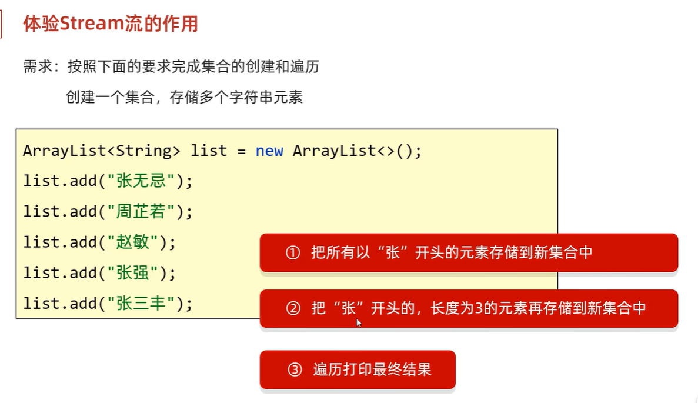
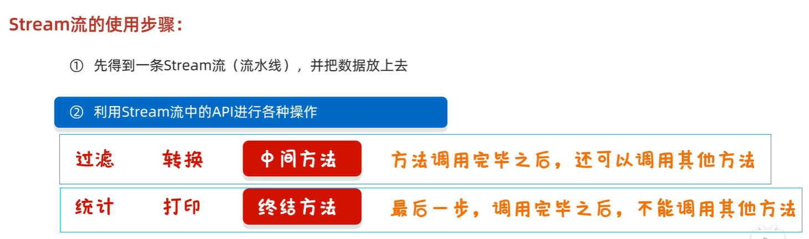
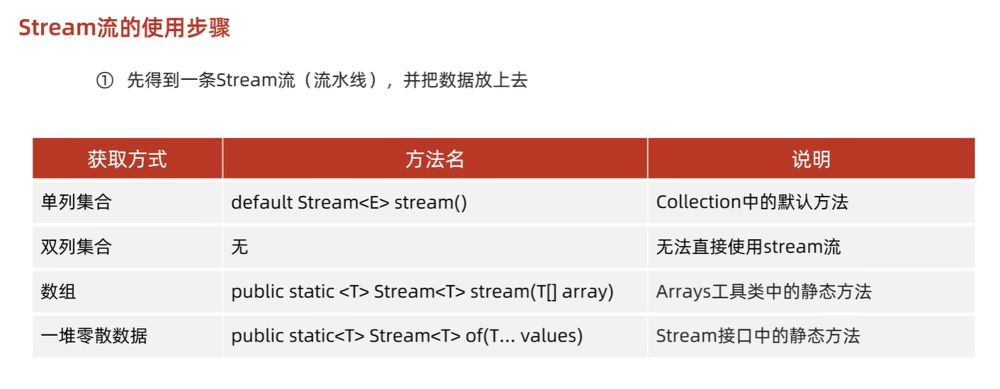

## 案例



**作用：简化集合、数组的操作**


**传统写法**

```java
List<String> res1 = new ArrayList<>();
for(int i = 0;i<list.size();i++){
	String name = list.get(i);
	if(name.startsWith("张")){
        res1.add(name);
    }
}

// 遍历打印
for(String name: list){
    System.out.println(name);
}


List<String> res2 = new ArrayList<>();
for(String name: list){
	if(name.startsWith("张") && name.length() == 3){
        res2.add(name);
    }
}
// 遍历打印
for(String name: list){
    System.out.println(name);
}


```


**stream流写法**


```java
List<String> res1 = new ArrayList<>();

list.stream().filter(name -> name.length() == 3).forEach(name -> System.out.println(name));


List<String> res2 = new ArrayList<>();
list.stream().filter(name -> name.length() == 3).filter(name -> name.length() == 3).forEach(name -> System.out.println(name));
```


* `filter( name -> { name.startsWith("张")})`
  相当于

  ```
  for(String name: list){
  	if(name.startsWith("张")){
          res1.add(name);
      }
  }
  ```

  省略了res1的定义，直接把满足条件的元素收集起来

* 


### 经典流方式代码


#### 遍历打印集合

* 用流调用forEach方法

  ```
  list.stream().filter(name -> name.length() == 3).forEach(name -> System.out.println(name));
  ```

  


> * 用流的方式代替遍历，一行代码完成操作
>
> 
>
> ```java
> List<Employee> employeeList = employeeService.selectAll(null);
>         //拿出部门名称
>         //（虽然employee表里面没有department属性，但是selectAll采用关联查询，也查询到了departmentName并存在对象中、于是后面employee就能get到departmentName）
> 
> Set<String> departmentNameSet = employeeList.stream().map(Employee::getDepartmentName).collect(Collectors.toSet());
> ```
>
> > 首先，通过`stream()`方法将列表转换为流；然后，使用`map(Employee::getDepartmentName)`对流中的每个元素调用`getDepartmentName()`方法，提取出部门名称，形成一个新的流；最后，通过`collect(Collectors.toSet())`将流中的元素收集到一个集合中，并确保集合中的元素是唯一的，即去重。最终，`departmentNameSet`集合中存储了所有员工所属部门的唯一名称。
> >
> >
> > 它接受一个函数作为参数（在 Java 中，这个函数通常是用方法引用或 Lambda 表达式表示的），然后对流中的每个元素应用这个函数，并生成一个新的流,它不仅限于提取属性，还可以用来对元素进行各种操作，比如类型转换、格式化、甚至是数学运算。`map()` 和 `collect()` 是紧密配合的，前者负责数据的“加工”，后者负责数据的“收集”
>
> 

* 有了orderCountList和validOrderCountList，获取订单总数和有效订单总数

  ```
  Integer totalOrderCount = orderCountList.stream().reduce(Integer::sum).get();
  Integer validOrderCount = validOrderCOuntList.stream().reduce(Integer::sum).get();
  ```

  

* 从一个对象集合中通过流获得另一个集合

  for写法

  

  stream写法

  


* 将一个对象数据转换成 长字符串

  

  ```
  List<OrderDetail> orderDetailList = orderDetailMapper.getByOrderId(orders.getId());
  
  List<String> orderDishList = orderDetailList.stream().map(x -> {
      String orderDish = x.getName() + "*" + x.getNumber() + ";";
      return orderDish;
  }).collect(Collectors.toList());
  // 将该订单对应的所有菜品信息拼接在一起
  String orderDishes = String.join("", orderDishList);
  ```

* 


## 使用教程




**1.获取一条Stream流(流水线)，并把数据放上去**




> 双列集合需要通过`keySet()`或`entrySet()`，先转成单列集合，才能转成stream流

> 零散数据可以用Stram接口的静态方法 of ，但是这些数据必须是同一类型的

案例

```java
//单列集合
 


```


## Stream流式计算

**java.util.stream**


```java
package com.zzy.stream;

import lombok.AllArgsConstructor;
import lombok.Data;
import lombok.NoArgsConstructor;

//有参，无参构造，get set toString方法
@Data
@NoArgsConstructor
@AllArgsConstructor
public class User {
    private int id;
    private String name;
    private int age;
}
package com.zzy.stream;

import java.util.Arrays;
import java.util.List;

/**
 * 题目要求：一分钟内完成此题，只能用一行代码实现！
 * 现在有5个用户！筛选：
 * 1、ID 必须是偶数
 * 2、年龄必须大于23岁
 * 3、用户名转为大写字母
 * 4、用户名字母倒着排序
 * 5、只输出一个用户！
 */
public class Test {
    public static void main(String[] args) {
        User u1 = new User(1, "a", 21);
        User u2 = new User(2, "b", 22);
        User u3 = new User(3, "c", 23);
        User u4 = new User(4, "d", 24);
        User u5 = new User(6, "e", 25);

        // 集合是存储
        List<User> list = Arrays.asList(u1, u2, u3, u4, u5);

        // 计算交给Stream流

        // lambda表达式、链式编程、函数式接口、Stream流式计算
        list.stream()
                .filter(u -> {
                    return u.getId() % 2 == 0;
                })
                .filter(u -> {
                    return u.getAge() > 23;
                })
                .map(u -> {
                    return u.getName().toUpperCase();
                })
                .sorted((o1, o2) -> {
                    return o2.compareTo(o1);
                })
                .limit(1)
                .forEach(System.out::println);
    }
}
```


