https://lcn41634gsrj.feishu.cn/wiki/Ca3qwvb6EidhkJksvJGcDXGxnDb
# 1、内存调优

## 1.1 内存溢出和内存泄漏

内存泄漏（memory leak）：在Java中如果不再使用一个对象，但是该对象依然在GC ROOT的引用链上，这个对象就不会被垃圾回收器回收，这种情况就称之为内存泄漏。

内存泄漏绝大多数情况都是由堆内存泄漏引起的，所以后续没有特别说明则讨论的都是堆内存泄漏。

比如图中，如果学生对象1不再使用


可以选择将ArrayList到学生对象1的引用删除：

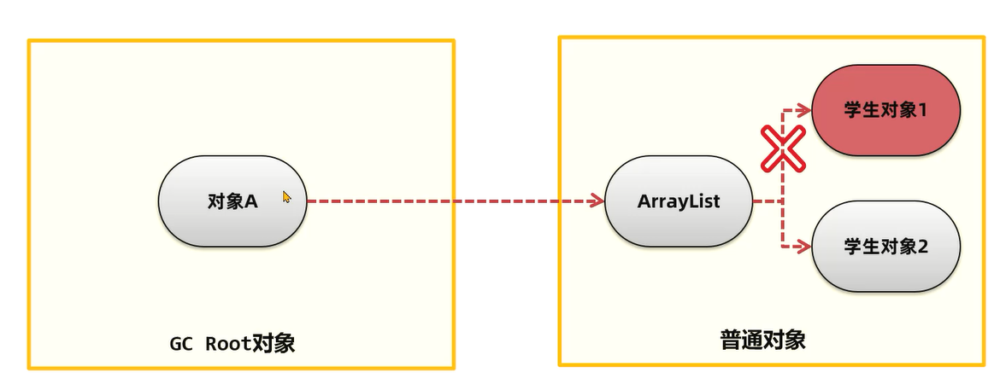

或者将对象A堆ArrayList的引用删除，这样所有的学生对象包括ArrayList都可以回收：

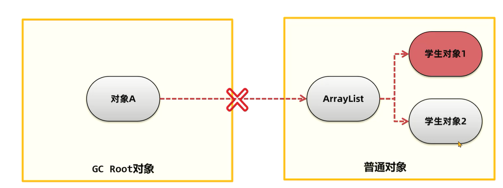

但是如果不移除这两个引用中的任何一个，学生对象1就属于内存泄漏了。

少量的内存泄漏可以容忍，但是如果发生持续的内存泄漏，就像滚雪球雪球越滚越大，不管有多大的内存迟早会被消耗完，最终导致的结果就是内存溢出。但是产生内存溢出并不是只有内存泄漏这一种原因。        

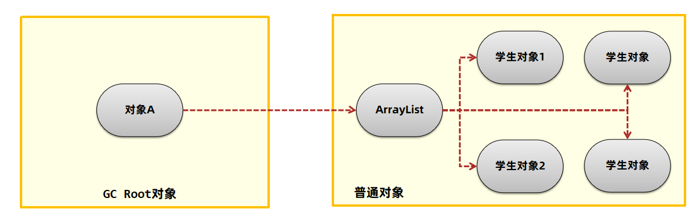

这些学生对象如果都不再使用，越积越多，就会导致超过堆内存的上限出现内存溢出。

正常情况的内存结构图如下：


内存溢出出现时如下：


内存泄漏的对象和依然在GC ROOT引用链上需要使用的对象加起来占满了内存空间，无法为新的对象分配内存。

#### 内存泄漏的常见场景：

1、内存泄漏导致溢出的常见场景是大型的Java后端应用中，在处理用户的请求之后，没有及时将用户的数据删除。随着用户请求数量越来越多，内存泄漏的对象占满了堆内存最终导致内存溢出。

这种产生的内存溢出会直接导致用户请求无法处理，影响用户的正常使用。重启可以恢复应用使用，但是在运行一段时间之后依然会出现内存溢出。


代码：

```Java
package com.itheima.jvmoptimize.controller;

import com.itheima.jvmoptimize.entity.UserEntity;
import org.springframework.web.bind.annotation.GetMapping;
import org.springframework.web.bind.annotation.PostMapping;
import org.springframework.web.bind.annotation.RequestMapping;
import org.springframework.web.bind.annotation.RestController;

import java.util.ArrayList;
import java.util.HashMap;
import java.util.List;
import java.util.Map;

@RestController
@RequestMapping("/leak2")
public class LeakController2 {
    private static Map<Long,Object> userCache = new HashMap<>();

    /**
     * 登录接口 放入hashmap中
     */
    @PostMapping("/login")
    public void login(String name,Long id){
        userCache.put(id,new byte[1024 * 1024 * 300]);
    }


    /**
     * 登出接口，删除缓存的用户信息
     */

    @GetMapping("/logout")
    public void logout(Long id){
        userCache.remove(id);
    }

}
```

设置虚拟机参数，将最大堆内存设置为1g:


在Postman中测试，登录id为1的用户：


调用logout接口，id为1那么数据会正常删除：


连续调用login传递不同的id，但是不调用logout

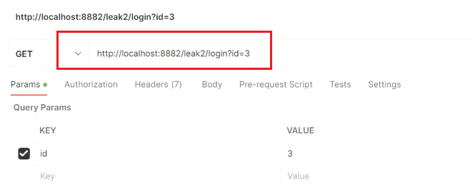

调用几次之后就会出现内存溢出：

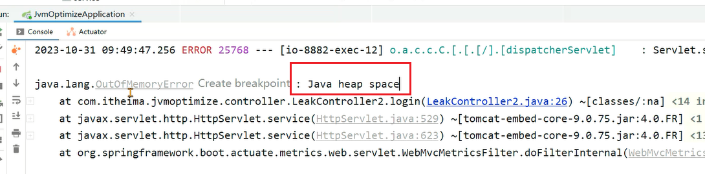

2、第二种常见场景是分布式任务调度系统如Elastic-job、Quartz等进行任务调度时，被调度的Java应用在调度任务结束中出现了内存泄漏，最终导致多次调度之后内存溢出。

这种产生的内存溢出会导致应用执行下次的调度任务执行。同样重启可以恢复应用使用，但是在调度执行一段时间之后依然会出现内存溢出。


开启定时任务：

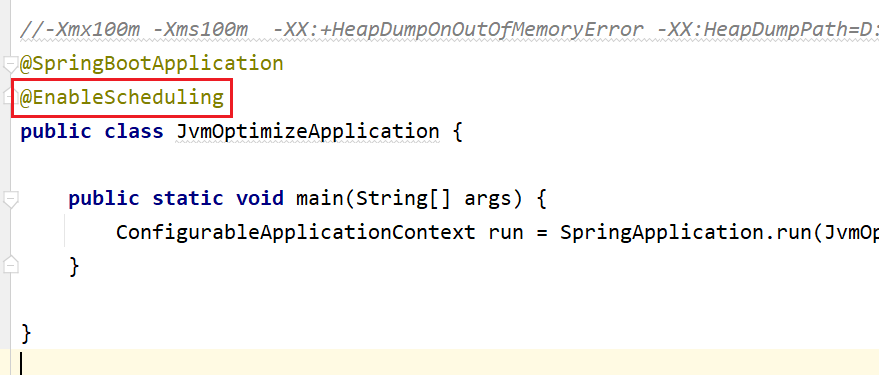

定时任务代码：

```Java
package com.itheima.jvmoptimize.task;

import com.itheima.jvmoptimize.leakdemo.demo4.Outer;
import org.springframework.scheduling.annotation.Scheduled;
import org.springframework.stereotype.Component;

import java.util.ArrayList;
import java.util.List;

@Component
public class LeakTask {

    private int count = 0;
    private List<Object> list = new ArrayList<>();

    @Scheduled(fixedRate = 100L)
    public void test(){
        System.out.println("定时任务调用" + ++count);
        list.add(new Outer().newList());
    }
}
```

启动程序之后很快就出现了内存溢出：

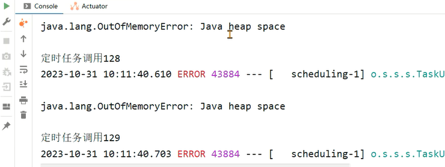

## 1.2 解决内存溢出的方法

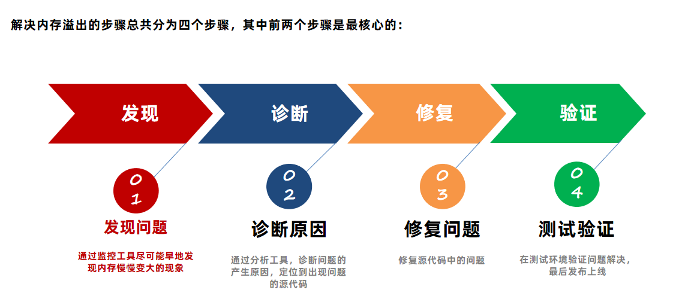

首先要熟悉一些常用的监控工具：

### 1.2.1 常用监控工具

#### Top命令

top命令是linux下用来查看系统信息的一个命令，它提供给我们去实时地去查看系统的资源，比如执行时的进程、线程和系统参数等信息。进程使用的内存为RES（常驻内存）- SHR（共享内存）

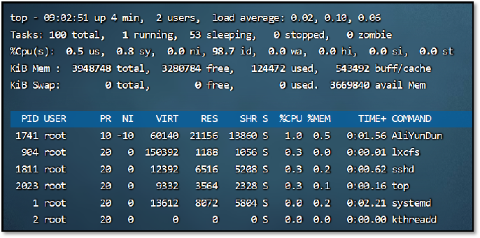

**优点：**

- 操作简单
- 无额外的软件安装

**缺点：**

只能查看最基础的进程信息，无法查看到每个部分的内存占用（堆、方法区、堆外） 

#### VisualVM

VisualVM是多功能合一的Java故障排除工具并且他是一款可视化工具，整合了命令行 JDK 工具和轻量级分析功能，功能非常强大。这款软件在Oracle JDK 6~8 中发布，但是在 Oracle JDK 9 之后不在JDK安装目录下需要单独下载。下载地址：https://visualvm.github.io/

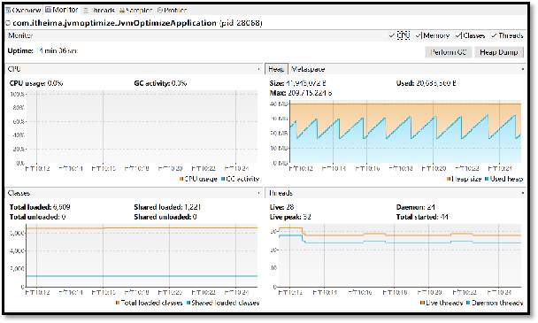

**优点：**

- 功能丰富，实时监控CPU、内存、线程等详细信息
- 支持Idea插件，开发过程中也可以使用

**缺点：**

对大量集群化部署的Java进程需要手动进行管理

如果需要进行远程监控，可以通过jmx方式进行连接。在启动java程序时添加如下参数：

```Java
-Djava.rmi.server.hostname=服务器ip地址
-Dcom.sun.management.jmxremote
-Dcom.sun.management.jmxremote.port=9122
-Dcom.sun.management.jmxremote.ssl=false
-Dcom.sun.management.jmxremote.authenticate=false
```

右键点击remote

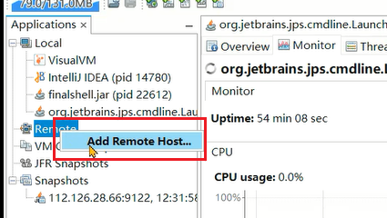

填写服务器的ip地址：


右键添加JMX连接

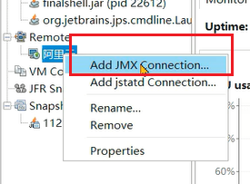

填写ip地址和端口号，勾选不需要SSL安全验证：

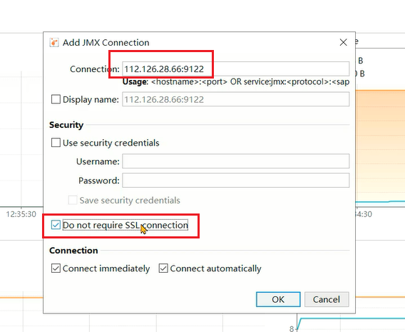

双击成功连接。

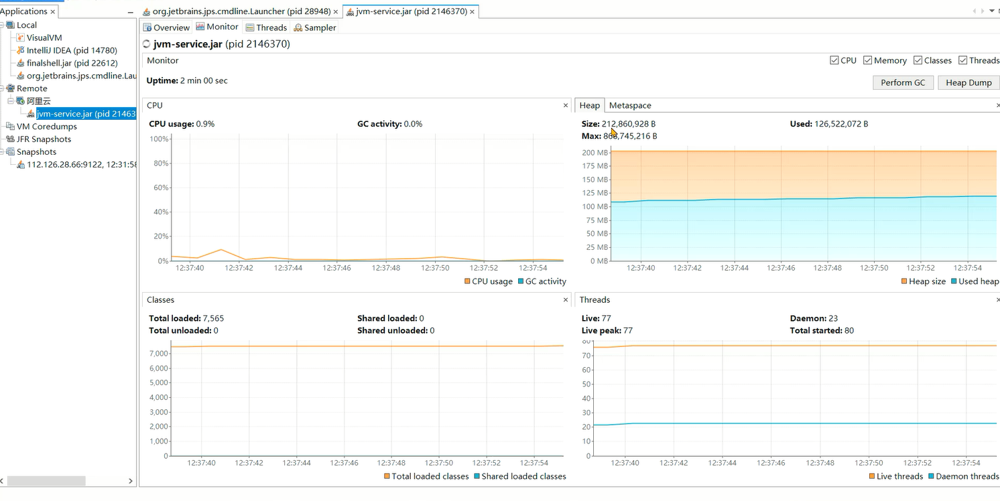

#### Arthas

Arthas 是一款线上监控诊断产品，通过全局视角实时查看应用 load、内存、gc、线程的状态信息，并能在不修改应用代码的情况下，对业务问题进行诊断，包括查看方法调用的出入参、异常，监测方法执行耗时，类加载信息等，大大提升线上问题排查效率。


**优点：**

- 功能强大，不止于监控基础的信息，还能监控单个方法的执行耗时等细节内容。
- 支持应用的集群管理

**缺点：**

部分高级功能使用门槛较高

##### **使用阿里arthas tunnel管理所有的需要监控的程序**

背景：

小李的团队已经普及了arthas的使用，但是由于使用了微服务架构，生产环境上的应用数量非常多，使用arthas还得登录到每一台服务器上再去操作非常不方便。他看到官方文档上可以使用tunnel来管理所有需要监控的程序。


步骤：

在Spring Boot程序中添加arthas的依赖(支持Spring Boot2)，在配置文件中添加tunnel服务端的地址，便于tunnel去监控所有的程序。

2. 将tunnel服务端程序部署在某台服务器上并启动。
3. 启动java程序
4. 打开tunnel的服务端页面，查看所有的进程列表，并选择进程进行arthas的操作。

pom.xml添加依赖：

```XML
<dependency>
    <groupId>com.taobao.arthas</groupId>
    <artifactId>arthas-spring-boot-starter</artifactId>
    <version>3.7.1</version>
</dependency>
```

application.yml中添加配置:

```Properties
arthas:
  #tunnel地址，目前是部署在同一台服务器，正式环境需要拆分
  tunnel-server: ws://localhost:7777/ws
  #tunnel显示的应用名称，直接使用应用名
  app-name: ${spring.application.name}
  #arthas http访问的端口和远程连接的端口
  http-port: 8888
  telnet-port: 9999
```

在资料中找到arthas-tunnel-server.3.7.1-fatjar.jar上传到服务器，并使用

`nohup java -jar -Darthas.enable-detail-pages=true arthas-tunnel-server.3.7.1-fatjar.jar & ` 命令启动该程序。`-Darthas.enable-detail-pages=true`参数作用是可以有一个页面展示内容。通过`服务器ip地址:8080/apps.html`打开页面，目前没有注册上来任何应用。

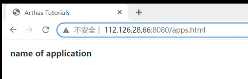

启动spring boot应用，如果在一台服务器上，注意区分端口。

```Properties
-Dserver.port=tomcat端口号
-Darthas.http-port=arthas的http端口号
-Darthas.telnet-port=arthas的telnet端口号端口号
```

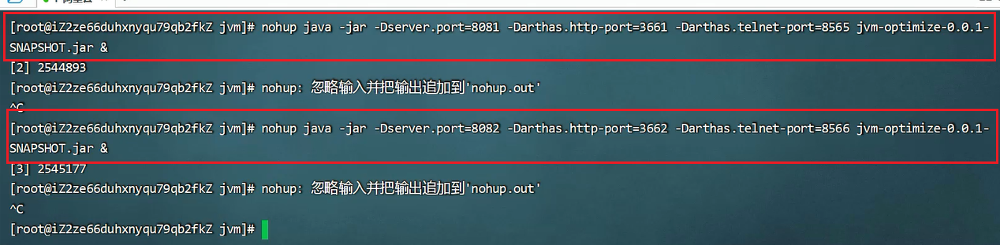

最终就能看到两个应用：

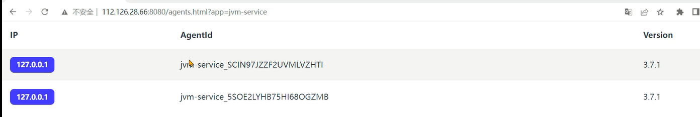

单击应用就可以进入操作arthas了。

#### Prometheus+Grafana

Prometheus+Grafana是企业中运维常用的监控方案，其中Prometheus用来采集系统或者应用的相关数据，同时具备告警功能。Grafana可以将Prometheus采集到的数据以可视化的方式进行展示。

Java程序员要学会如何读懂Grafana展示的Java虚拟机相关的参数。

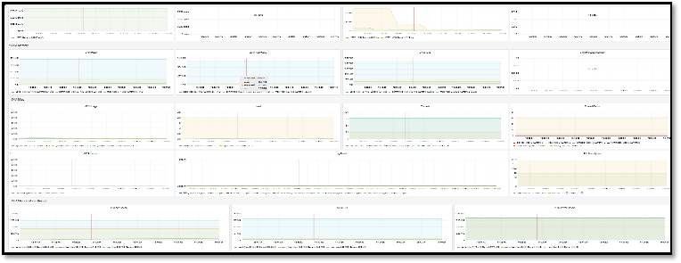

**优点：**

- 支持系统级别和应用级别的监控，比如linux操作系统、Redis、MySQL、Java进程。
- 支持告警并允许自定义告警指标，通过邮件、短信等方式尽早通知相关人员进行处理

**缺点：**

环境搭建较为复杂，一般由运维人员完成

##### 阿里云环境搭建（了解即可）

这一小节主要是为了让同学们更好地去阅读监控数据，所以提供一整套最简单的环境搭建方式，觉得困难可以直接跳过。企业中环境搭建的工作由运维人员来完成。

1、在pom文件中添加依赖

```XML
<dependency>
    <groupId>io.micrometer</groupId>
    <artifactId>micrometer-registry-prometheus</artifactId>
    <scope>runtime</scope>
</dependency>
<dependency>
    <groupId>org.springframework.boot</groupId>
    <artifactId>spring-boot-starter-actuator</artifactId>

    <exclusions><!-- 去掉springboot默认配置 -->
        <exclusion>
            <groupId>org.springframework.boot</groupId>
            <artifactId>spring-boot-starter-logging</artifactId>
        </exclusion>
    </exclusions>
</dependency>
```

2、添加配置项

```Properties
management:
  endpoint:
    metrics:
      enabled: true #支持metrics
    prometheus:
      enabled: true #支持Prometheus
  metrics:
    export:
      prometheus:
        enabled: true
    tags:
      application: jvm-test #实例名采集
  endpoints:
    web:
      exposure:
        include: '*' #开放所有端口
```

这两步做完之后，启动程序。

3、通过地址：`ip地址:端口号/actuator/prometheus`访问之后可以看到jvm相关的指标数据。


4、创建阿里云Prometheus实例


5、选择ECS服务

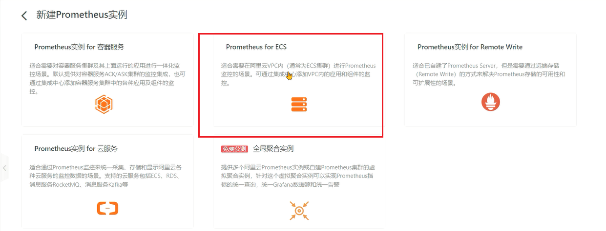

6、在自己的ECS服务器上找到网络和交换机

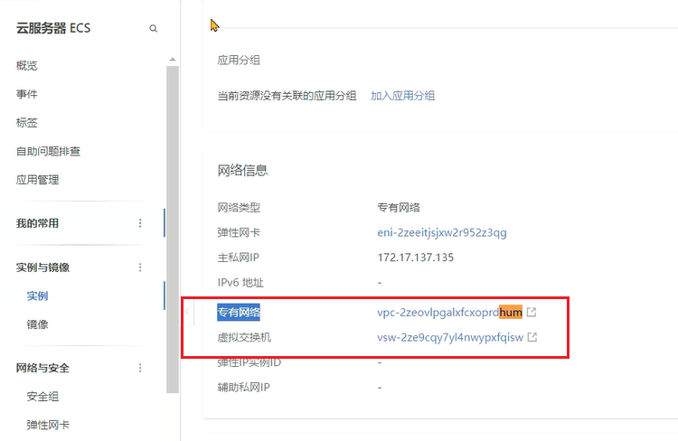

7、选择对应的网络：


填写内容，与ECS里边的网络设置保持一致

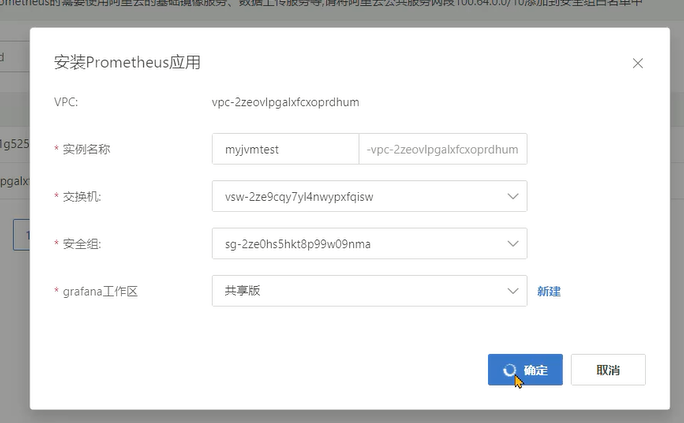

8、选中新的实例，选择MicroMeter

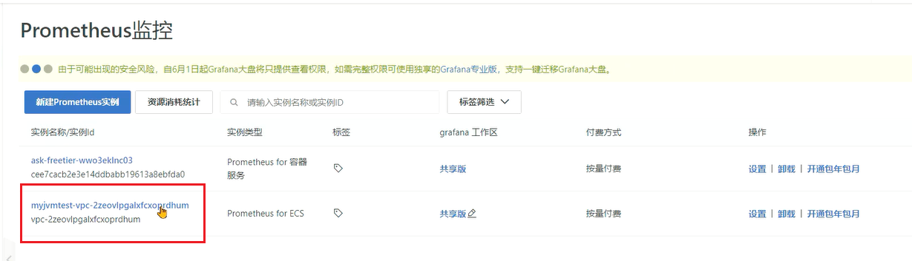


9、给ECS添加标签；

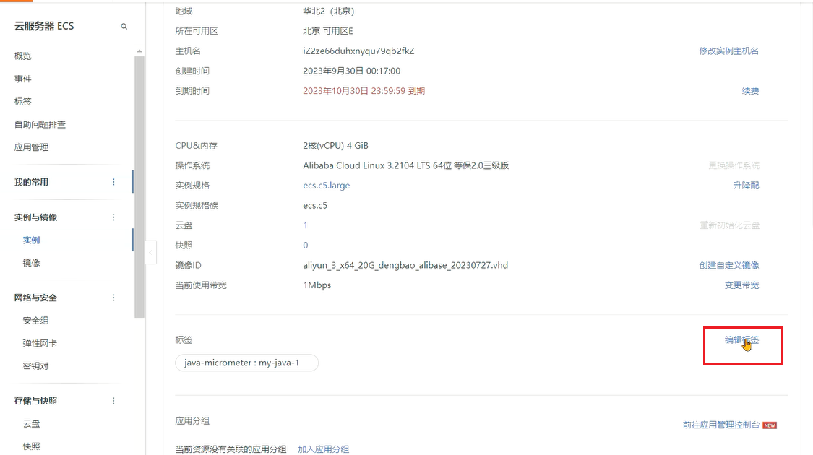

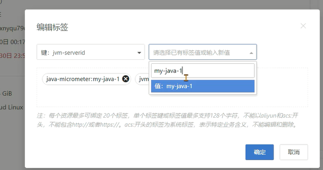

10、填写内容，注意ECS的标签

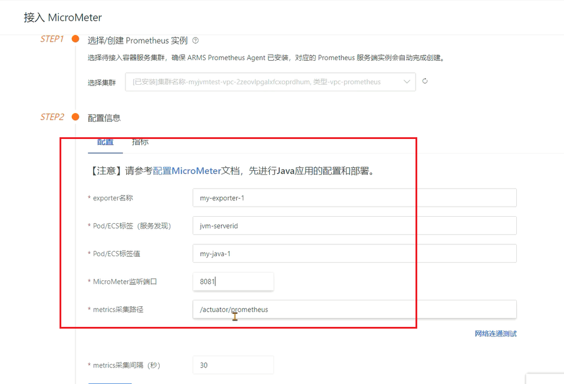

11、点击大盘就可以看到指标了

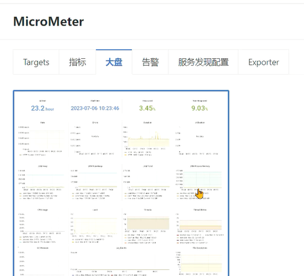

12、指标内容:

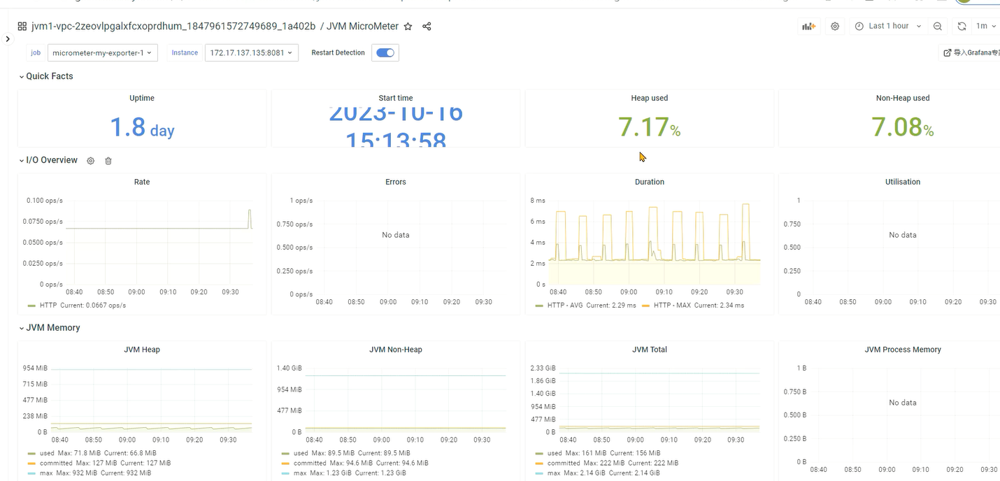

### 1.2.2 堆内存状况的对比

- 正常情况
  - 处理业务时会出现上下起伏，业务对象频繁创建内存会升高，触发MinorGC之后内存会降下来。
  - 手动执行FULL GC之后，内存大小会骤降，而且每次降完之后的大小是接近的。
  - 长时间观察内存曲线应该是在一个范围内。
  - 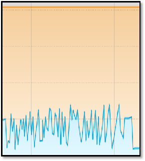
  - 出现内存泄漏
    - 处于持续增长的情况，即使Minor GC也不能把大部分对象回收
    - 手动FULL GC之后的内存量每一次都在增长
    - 长时间观察内存曲线持续增长

### 1.2.3 产生内存溢出原因一 ：代码中的内存泄漏

总结了6种产生内存泄漏的原因，均来自于java代码的不当处理：

- equals()和hashCode()，不正确的equals()和hashCode()实现导致内存泄漏
- ThreadLocal的使用，由于线程池中的线程不被回收导致的ThreadLocal内存泄漏
- 内部类引用外部类，非静态的内部类和匿名内部类的错误使用导致内存泄漏
- String的intern方法，由于JDK6中的字符串常量池位于永久代，intern被大量调用并保存产生的内存泄漏
- 通过静态字段保存对象，大量的数据在静态变量中被引用，但是不再使用，成为了内存泄漏
- 资源没有正常关闭，由于资源没有调用close方法正常关闭，导致的内存溢出

#### 案例1：equals()和hashCode()导致的内存泄漏

问题：

在定义新类时没有重写正确的equals()和hashCode()方法。在使用HashMap的场景下，如果使用这个类对象作为key，HashMap在判断key是否已经存在时会使用这些方法，如果重写方式不正确，会导致相同的数据被保存多份。

正常情况：

1、以JDK8为例，首先调用hash方法计算key的哈希值，hash方法中会使用到key的hashcode方法。根据hash方法的结果决定存放的数组中位置。

2、如果没有元素，直接放入。如果有元素，先判断key是否相等，会用到equals方法，如果key相等，直接替换value；key不相等，走链表或者红黑树查找逻辑，其中也会使用equals比对是否相同。

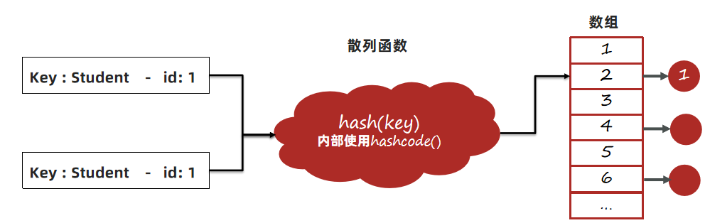

异常情况：

1、hashCode方法实现不正确，会导致相同id的学生对象计算出来的hash值不同，可能会被分到不同的槽中。

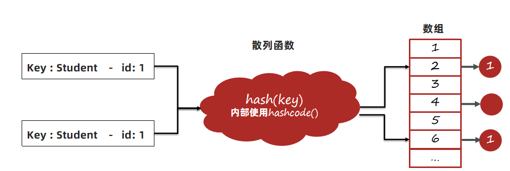

2、equals方法实现不正确，会导致key在比对时，即便学生对象的id是相同的，也被认为是不同的key。

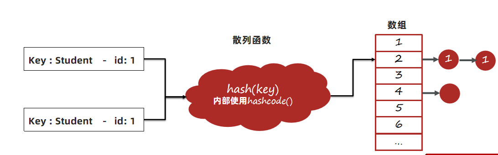

3、长时间运行之后HashMap中会保存大量相同id的学生数据。

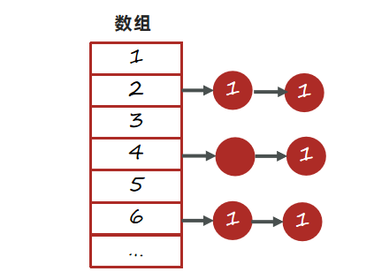

```Java
package com.itheima.jvmoptimize.leakdemo.demo2;

import org.apache.commons.lang3.builder.EqualsBuilder;
import org.apache.commons.lang3.builder.HashCodeBuilder;

import java.util.Objects;

public class Student {
    private String name;
    private Integer id;
    private byte[] bytes = new byte[1024 * 1024];

    public String getName() {
        return name;
    }

    public void setName(String name) {
        this.name = name;
    }

    public Integer getId() {
        return id;
    }

    public void setId(Integer id) {
        this.id = id;
    }

  
}
package com.itheima.jvmoptimize.leakdemo.demo2;

import java.util.HashMap;
import java.util.Map;

public class Demo2 {
    public static long count = 0;
    public static Map<Student,Long> map = new HashMap<>();
    public static void main(String[] args) throws InterruptedException {
        while (true){
            if(count++ % 100 == 0){
                Thread.sleep(10);
            }
            Student student = new Student();
            student.setId(1);
            student.setName("张三");
            map.put(student,1L);
        }
    }
}
```

运行之后通过visualvm观察：


出现内存泄漏的现象。

解决方案：

1、在定义新实体时，始终重写equals()和hashCode()方法。

2、重写时一定要确定使用了唯一标识去区分不同的对象，比如用户的id等。

3、hashmap使用时尽量使用编号id等数据作为key，不要将整个实体类对象作为key存放。

代码：

```Properties
package com.itheima.jvmoptimize.leakdemo.demo2;

import org.apache.commons.lang3.builder.EqualsBuilder;
import org.apache.commons.lang3.builder.HashCodeBuilder;

import java.util.Objects;

public class Student {
    private String name;
    private Integer id;
    private byte[] bytes = new byte[1024 * 1024];

    public String getName() {
        return name;
    }

    public void setName(String name) {
        this.name = name;
    }

    public Integer getId() {
        return id;
    }

    public void setId(Integer id) {
        this.id = id;
    }

    @Override
    public boolean equals(Object o) {
        if (this == o) {
            return true;
        }

        if (o == null || getClass() != o.getClass()) {
            return false;
        }

        Student student = (Student) o;

        return new EqualsBuilder().append(id, student.id).isEquals();
    }

    @Override
    public int hashCode() {
        return new HashCodeBuilder(17, 37).append(id).toHashCode();
    }
}
```

#### 案例2：内部类引用外部类

问题：

1、非静态的内部类默认会持有外部类，尽管代码上不再使用外部类，所以如果有地方引用了这个非静态内部类，会导致外部类也被引用，垃圾回收时无法回收这个外部类。

2、匿名内部类对象如果在非静态方法中被创建，会持有调用者对象，垃圾回收时无法回收调用者。

```Java
package com.itheima.jvmoptimize.leakdemo.demo3;

import java.io.IOException;
import java.util.ArrayList;

public class Outer{
    private byte[] bytes = new byte[1024 * 1024]; //外部类持有数据
    private static String name  = "测试";
    class Inner{
        private String name;
        public Inner() {
            this.name = Outer.name;
        }
    }

    public static void main(String[] args) throws IOException, InterruptedException {
//        System.in.read();
        int count = 0;
        ArrayList<Inner> inners = new ArrayList<>();
        while (true){
            if(count++ % 100 == 0){
                Thread.sleep(10);
            }
            inners.add(new Outer().new Inner());
        }
    }
}
package com.itheima.jvmoptimize.leakdemo.demo4;

import java.io.IOException;
import java.util.ArrayList;
import java.util.List;

public class Outer {
    private byte[] bytes = new byte[1024 * 1024 * 10];
    public List<String> newList() {
        List<String> list = new ArrayList<String>() {{
            add("1");
            add("2");
        }};
        return list;
    }

    public static void main(String[] args) throws IOException {
        System.in.read();
        int count = 0;
        ArrayList<Object> objects = new ArrayList<>();
        while (true){
            System.out.println(++count);
            objects.add(new Outer().newList());
        }
    }
}
```

解决方案：

1、这个案例中，使用内部类的原因是可以直接获取到外部类中的成员变量值，简化开发。如果不想持有外部类对象，应该使用静态内部类。

2、使用静态方法，可以避免匿名内部类持有调用者对象。

```Java
package com.itheima.jvmoptimize.leakdemo.demo3;

import java.io.IOException;
import java.util.ArrayList;

public class Outer{
    private byte[] bytes = new byte[1024 * 1024]; //外部类持有数据
    private static String name  = "测试";
    static class Inner{
        private String name;
        public Inner() {
            this.name = Outer.name;
        }
    }

    public static void main(String[] args) throws IOException, InterruptedException {
//        System.in.read();
        int count = 0;
        ArrayList<Inner> inners = new ArrayList<>();
        while (true){
            if(count++ % 100 == 0){
                Thread.sleep(10);
            }
            inners.add(new Inner());
        }
    }
}
package com.itheima.jvmoptimize.leakdemo.demo4;

import java.io.IOException;
import java.util.ArrayList;
import java.util.List;

public class Outer {
    private byte[] bytes = new byte[1024 * 1024 * 10];
    public static List<String> newList() {
        List<String> list = new ArrayList<String>() {{
            add("1");
            add("2");
        }};
        return list;
    }

    public static void main(String[] args) throws IOException {
        System.in.read();
        int count = 0;
        ArrayList<Object> objects = new ArrayList<>();
        while (true){
            System.out.println(++count);
            objects.add(newList());
        }
    }
}
```

#### 案例3：ThreadLocal的使用

问题：

如果仅仅使用手动创建的线程，就算没有调用ThreadLocal的remove方法清理数据，也不会产生内存泄漏。因为当线程被回收时，ThreadLocal也同样被回收。但是如果使用线程池就不一定了。

```Java
package com.itheima.jvmoptimize.leakdemo.demo5;

import java.util.concurrent.*;

public class Demo5 {
    public static ThreadLocal<Object> threadLocal = new ThreadLocal<>();

    public static void main(String[] args) throws InterruptedException {
        ThreadPoolExecutor threadPoolExecutor = new ThreadPoolExecutor(Integer.MAX_VALUE, Integer.MAX_VALUE,
                0, TimeUnit.DAYS, new SynchronousQueue<>());
        int count = 0;
        while (true) {
            System.out.println(++count);
            threadPoolExecutor.execute(() -> {
                threadLocal.set(new byte[1024 * 1024]);
            });
            Thread.sleep(10);
        }


    }
}
```

解决方案：

线程方法执行完，一定要调用ThreadLocal中的remove方法清理对象。

```Java
package com.itheima.jvmoptimize.leakdemo.demo5;

import java.util.concurrent.*;

public class Demo5 {
    public static ThreadLocal<Object> threadLocal = new ThreadLocal<>();

    public static void main(String[] args) throws InterruptedException {
        ThreadPoolExecutor threadPoolExecutor = new ThreadPoolExecutor(Integer.MAX_VALUE, Integer.MAX_VALUE,
                0, TimeUnit.DAYS, new SynchronousQueue<>());
        int count = 0;
        while (true) {
            System.out.println(++count);
            threadPoolExecutor.execute(() -> {
                threadLocal.set(new byte[1024 * 1024]);
                threadLocal.remove();
            });
            Thread.sleep(10);
        }


    }
}
```

#### 案例4：String的intern方法

问题：

JDK6中字符串常量池位于堆内存中的Perm Gen永久代中，如果不同字符串的intern方法被大量调用，字符串常量池会不停的变大超过永久代内存上限之后就会产生内存溢出问题。

```Java
package com.itheima.jvmoptimize.leakdemo.demo6;

import org.apache.commons.lang3.RandomStringUtils;

import java.util.ArrayList;
import java.util.List;

public class Demo6 {
    public static void main(String[] args) {
        while (true){
            List<String> list = new ArrayList<String>();
            int i = 0;
            while (true) {
                //String.valueOf(i++).intern(); //JDK1.6 perm gen 不会溢出
                list.add(String.valueOf(i++).intern()); //溢出
            }
        }
    }
}
```

解决方案：

1、注意代码中的逻辑，尽量不要将随机生成的字符串加入字符串常量池

2、增大永久代空间的大小，根据实际的测试/估算结果进行设置-XX:MaxPermSize=256M

#### 案例5：通过静态字段保存对象

问题：

如果大量的数据在静态变量中被长期引用，数据就不会被释放，如果这些数据不再使用，就成为了内存泄漏。

解决方案：

1、尽量减少将对象长时间的保存在静态变量中，如果不再使用，必须将对象删除（比如在集合中）或者将静态变量设置为null。

2、使用单例模式时，尽量使用懒加载，而不是立即加载。

```Java
package com.itheima.jvmoptimize.leakdemo.demo7;

import org.springframework.context.annotation.Lazy;
import org.springframework.stereotype.Component;

@Lazy //懒加载
@Component
public class TestLazy {
    private byte[] bytes = new byte[1024 * 1024 * 1024];
}
```

3、Spring的Bean中不要长期存放大对象，如果是缓存用于提升性能，尽量设置过期时间定期失效。

```Java
package com.itheima.jvmoptimize.leakdemo.demo7;

import com.github.benmanes.caffeine.cache.Cache;
import com.github.benmanes.caffeine.cache.Caffeine;

import java.time.Duration;

public class CaffineDemo {
    public static void main(String[] args) throws InterruptedException {
        Cache<Object, Object> build = Caffeine.newBuilder()
        //设置100ms之后就过期
                 .expireAfterWrite(Duration.ofMillis(100))
                .build();
        int count = 0;
        while (true){
            build.put(count++,new byte[1024 * 1024 * 10]);
            Thread.sleep(100L);
        }
    }
}
```

#### 案例6：资源没有正常关闭

问题：

连接和流这些资源会占用内存，如果使用完之后没有关闭，这部分内存不一定会出现内存泄漏，但是会导致close方法不被执行。

```Java
package com.itheima.jvmoptimize.leakdemo.demo1;

import java.io.FileInputStream;
import java.io.IOException;
import java.io.InputStream;
import java.net.URL;
import java.net.URLConnection;
import java.sql.*;

//-Xmx50m -Xms50m
public class Demo1 {

    // JDBC driver name and database URL
    static final String JDBC_DRIVER = "com.mysql.cj.jdbc.Driver";
    static final String DB_URL = "jdbc:mysql:///bank1";

    //  Database credentials
    static final String USER = "root";
    static final String PASS = "123456";

    public static void leak() throws SQLException {
        //Connection conn = null;
        Statement stmt = null;
        Connection conn = DriverManager.getConnection(DB_URL, USER, PASS);

        // executes a valid query
        stmt = conn.createStatement();
        String sql;
        sql = "SELECT id, account_name FROM account_info";
        ResultSet rs = stmt.executeQuery(sql);

        //STEP 4: Extract data from result set
        while (rs.next()) {
            //Retrieve by column name
            int id = rs.getInt("id");
            String name = rs.getString("account_name");

            //Display values
            System.out.print("ID: " + id);
            System.out.print(", Name: " + name + "\n");
        }

    }

    public static void main(String[] args) throws InterruptedException, SQLException {
        while (true) {
            leak();
        }
    }
}
```

同学们可以测试一下这段代码会不会产生内存泄漏，应该是不会的。但是这个结论不是确定的，所以建议编程时养成良好的习惯，尽量关闭不再使用的资源。

解决方案：

1、为了防止出现这类的资源对象泄漏问题，必须在finally块中关闭不再使用的资源。

2、从 Java 7 开始，使用try-with-resources语法可以用于自动关闭资源。

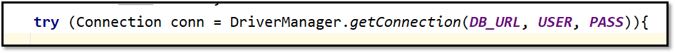

### 1.2.4 产生内存溢出原因二 ： 并发请求问题

通过发送请求向Java应用获取数据，正常情况下Java应用将数据返回之后，这部分数据就可以在内存中被释放掉。

接收到请求时创建对象:


响应返回之后，对象就可以被回收掉：


并发请求问题指的是由于用户的并发请求量有可能很大，同时处理数据的时间很长，导致大量的数据存在于内存中，最终超过了内存的上限，导致内存溢出。这类问题的处理思路和内存泄漏类似，首先要定位到对象产生的根源。


那么怎么模拟并发请求呢？

使用Apache Jmeter软件可以进行并发请求测试。

Apache Jmeter是一款开源的测试软件，使用Java语言编写，最初是为了测试Web程序，目前已经发展成支持数据库、消息队列、邮件协议等不同类型内容的测试工具。


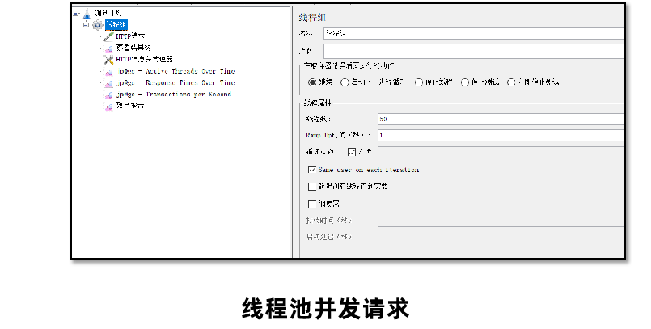

Apache Jmeter支持插件扩展，生成多样化的测试结果。

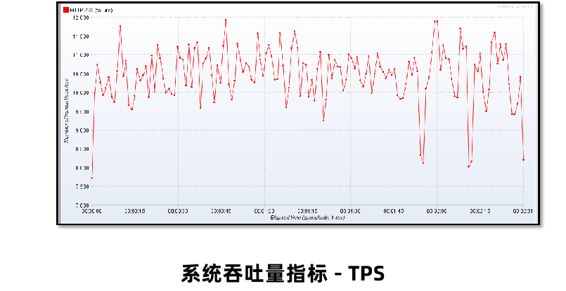

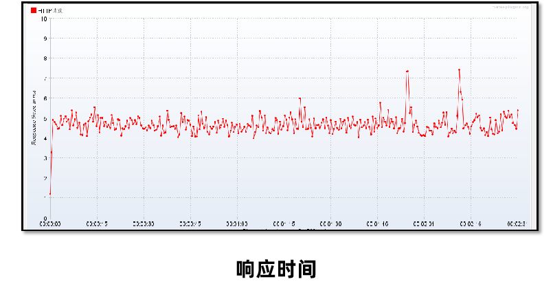

#### 使用Jmeter进行并发测试，发现内存溢出问题

背景：

小李的团队发现有一个微服务在晚上8点左右用户使用的高峰期会出现内存溢出的问题，于是他们希望在自己的开发环境能重现类似的问题。

步骤：

1、安装Jmeter软件，添加线程组。

打开资料中的Jmeter，找到bin目录，双击`jmeter.bat`启动程序。

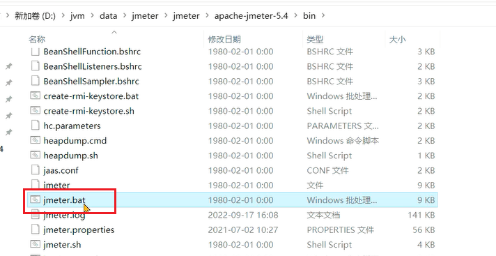

2. 在线程组中增加Http请求，添加随机参数。

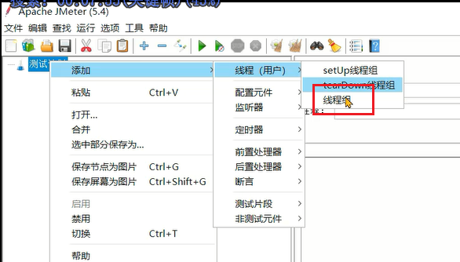

添加线程组参数：

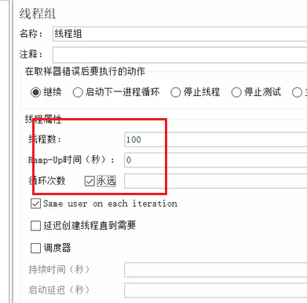

添加Http请求：

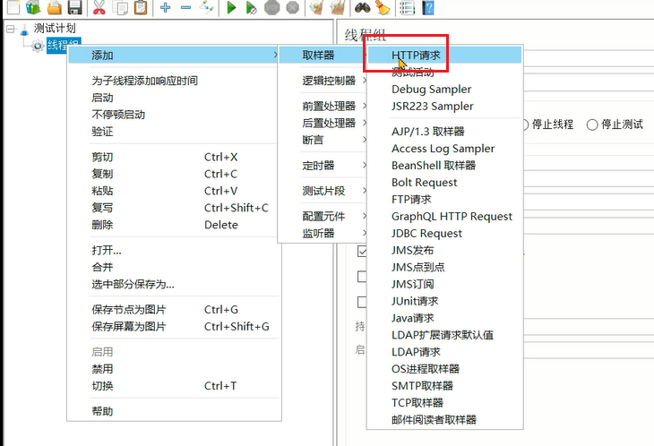

添加http参数：

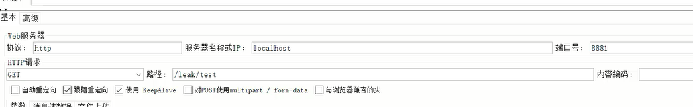

接口代码：

```Java
/**
 * 大量数据 + 处理慢
 */
@GetMapping("/test")
public void test1() throws InterruptedException {
    byte[] bytes = new byte[1024 * 1024 * 100];//100m
    Thread.sleep(10 * 1000L);
}
```

3. 在线程组中添加监听器 – 聚合报告，用来展示最终结果。


4. 启动程序，运行线程组并观察程序是否出现内存溢出。

添加虚拟机参数：

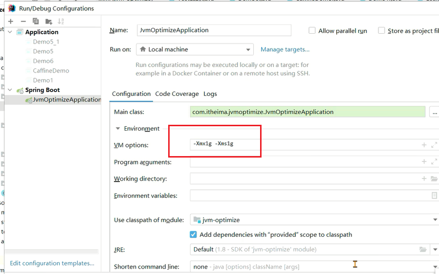

点击运行：

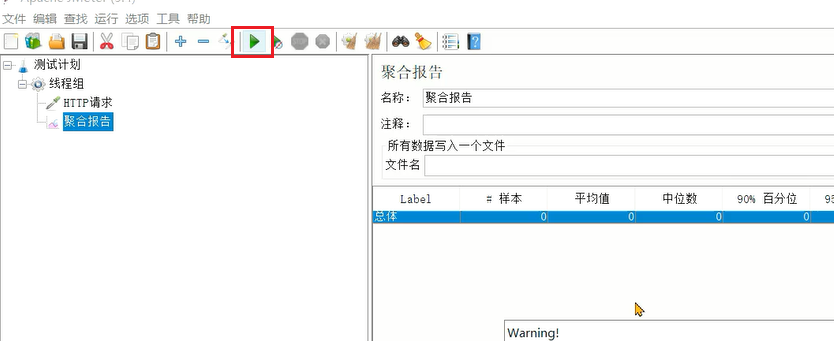

很快就出现了内存溢出：


再来看一个案例：

1、设置线程池参数：

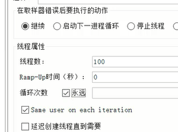

2、设置http接口参数

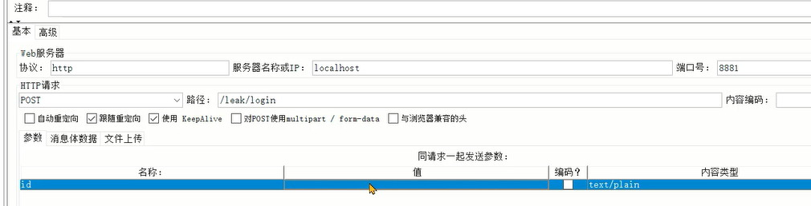

3、代码：

```Java
/**
 * 登录接口 传递名字和id,放入hashmap中
 */
@PostMapping("/login")
public void login(String name,Long id){
    userCache.put(id,new UserEntity(id,name));
}
```

4、我们想生成随机的名字和id,选择函数助手对话框

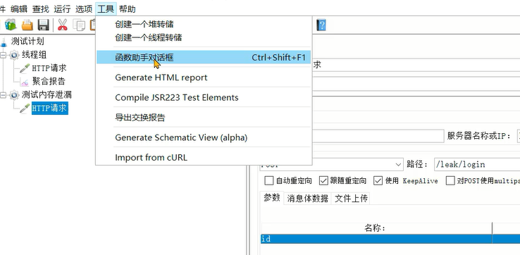

5、选择Random随机数生成器

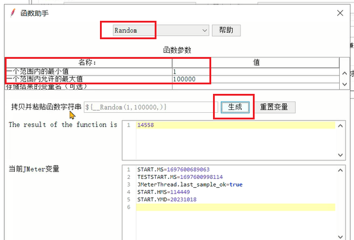

6、让随机数生成器生效，值中直接ctrl + v就行，已经被复制到粘贴板了。

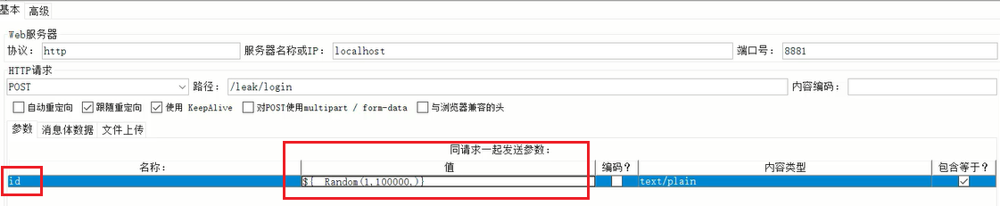

7、字符串也是同理的设置方法：


8、添加name字段：


9、点击测试，一段时间之后同样出现了内存溢出：


### 1.2.5 诊断

#### 内存快照

当堆内存溢出时，需要在堆内存溢出时将整个堆内存保存下来，生成内存快照(Heap Profile )文件。

使用MAT打开hprof文件，并选择内存泄漏检测功能，MAT会自行根据内存快照中保存的数据分析内存泄漏的根源。


生成内存快照的Java虚拟机参数：

​    `-XX:+HeapDumpOnOutOfMemoryError`：发生OutOfMemoryError错误时，自动生成hprof内存快照文件。

​    `-XX:HeapDumpPath=<path>`：指定hprof文件的输出路径。

使用MAT打开hprof文件，并选择内存泄漏检测功能，MAT会自行根据内存快照中保存的数据分析内存泄漏的根源。

在程序中添加jvm参数：

```Java
-Xmx256m -Xms256m -XX:+HeapDumpOnOutOfMemoryError -XX:HeapDumpPath=D:\jvm\dump\test1.hprof
```

运行程序之后：


使用MAT打开hprof文件（操作步骤见前文GC Root小节），首页就展示了MAT检测出来的内存泄漏问题原因。


点击Details查看详情，这个线程持有了大量的字节数组：

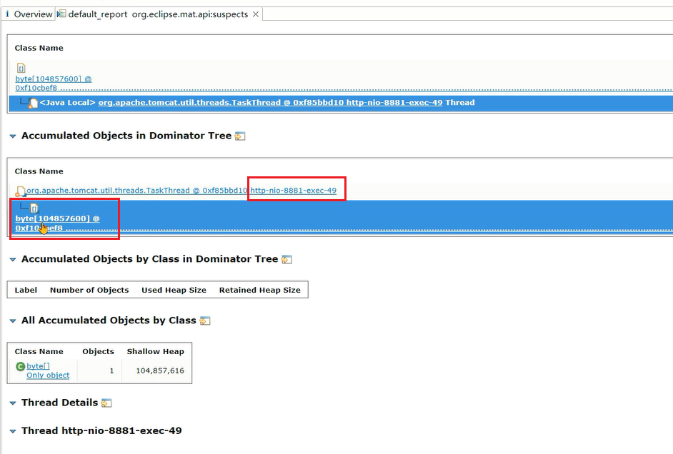

继续往下来，还可以看到溢出时线程栈，通过栈信息也可以怀疑下是否是因为这句代码创建了大量的对象：

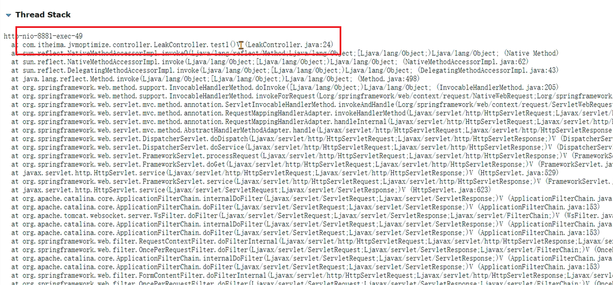

#### MAT内存泄漏检测的原理

MAT提供了称为支配树（Dominator Tree）的对象图。支配树展示的是对象实例间的支配关系。在对象引用图中，所有指向对象B的路径都经过对象A，则认为对象A支配对象B。

如下图，A引用B、C，B、C引用D, C引用E，D、E引用F，转成支配树之后。由于E只有C引用，所以E挂在C上。接下来B、C、D、F都由其他至少1个对象引用，所以追溯上去，只有A满足支配它们的条件。

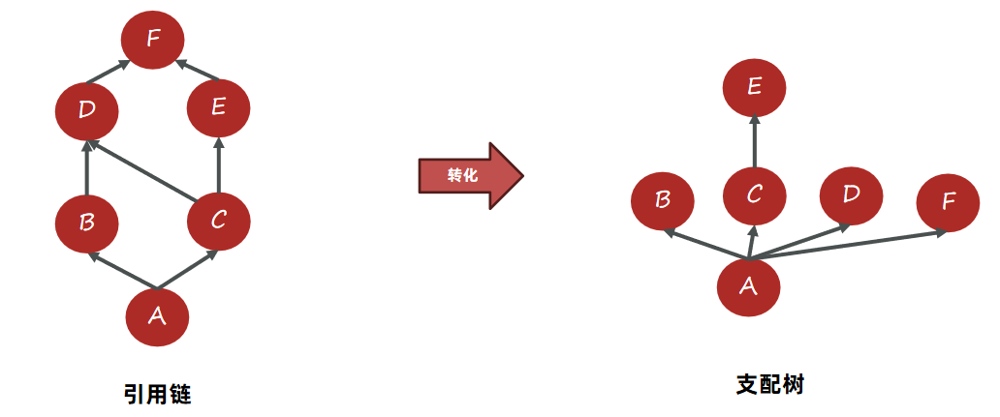

支配树中对象本身占用的空间称之为浅堆(Shallow Heap）。

支配树中对象的子树就是所有被该对象支配的内容，这些内容组成了对象的深堆（Retained Heap），也称之为保留集（ Retained Set ） 。深堆的大小表示该对象如果可以被回收，能释放多大的内存空间。

如下图：C自身包含一个浅堆，而C底下挂了E，所以C+E占用的空间大小代表C的深堆。

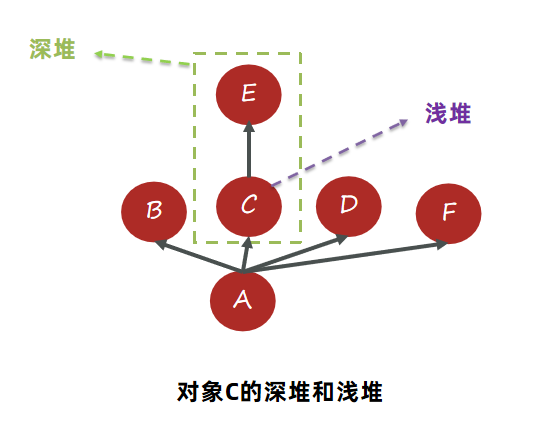

需求：

使用如下代码生成内存快照，并分析TestClass对象的深堆和浅堆。

如何在不内存溢出情况下生成堆内存快照？-XX:+HeapDumpBeforeFullGC可以在FullGC之前就生成内存快照。

```Java
package com.itheima.jvmoptimize.matdemo;

import org.openjdk.jol.info.ClassLayout;

import java.util.ArrayList;
import java.util.List;

//-XX:+HeapDumpBeforeFullGC -XX:HeapDumpPath=D:/jvm/dump/mattest.hprof
public class HeapDemo {
    public static void main(String[] args) {
        TestClass a1 = new TestClass();
        TestClass a2 = new TestClass();
        TestClass a3 = new TestClass();
        String s1 = "itheima1";
        String s2 = "itheima2";
        String s3 = "itheima3";

        a1.list.add(s1);

        a2.list.add(s1);
        a2.list.add(s2);

        a3.list.add(s3);

        //System.out.print(ClassLayout.parseClass(TestClass.class).toPrintable());
        s1 = null;
        s2 = null;
        s3 = null;
        System.gc();
    }
}

class TestClass {
    public List<String> list = new ArrayList<>(10);
}
```

上面代码的引用链如下：

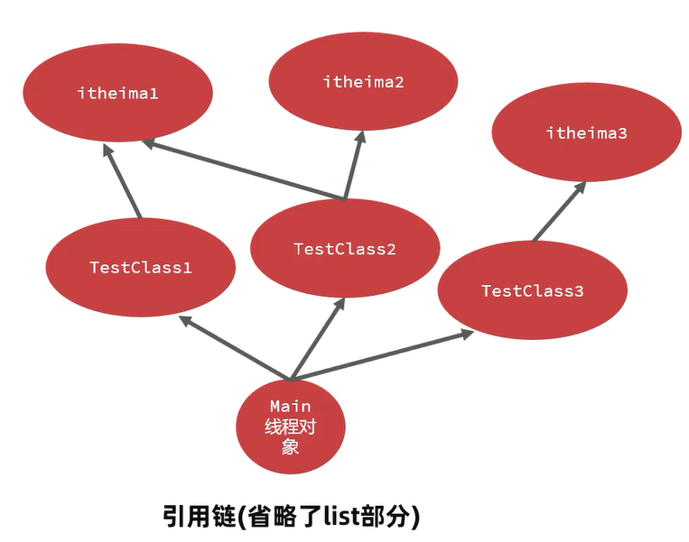

转换成支配树，`TestClass`简称为tc。tc1 tc2 tc3都是直接挂在main线程对象上，itheima2 itheima3都只能通过tc2和tc3访问，所以直接挂上。itheima1不同，他可以由tc1 tc2访问，所以他要挂载他们的上级也就是main线程对象上：

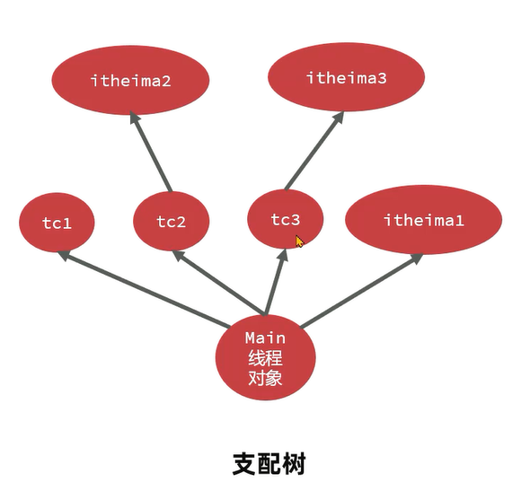

使用mat来分析，添加虚拟机参数：

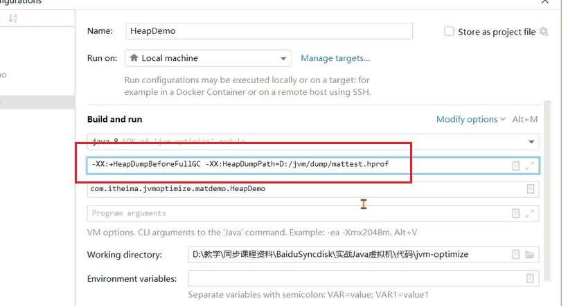

在FullGC之后产生了内存快照文件：

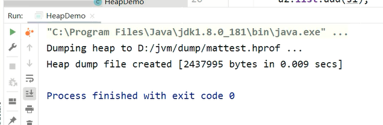

直接查看MAT的支配树功能：

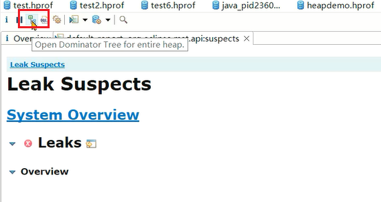

输入main进行搜索：


可以看到结构与之前分析的是一致的：

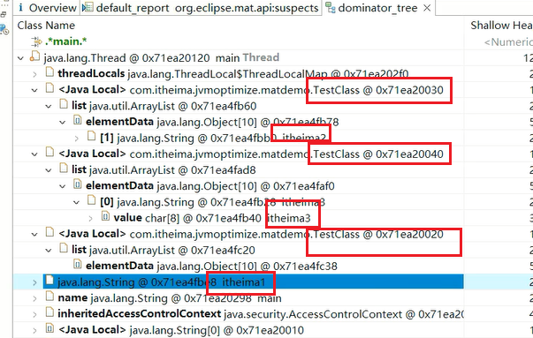

 同时可以看到字符串的浅堆大小和深堆大小：

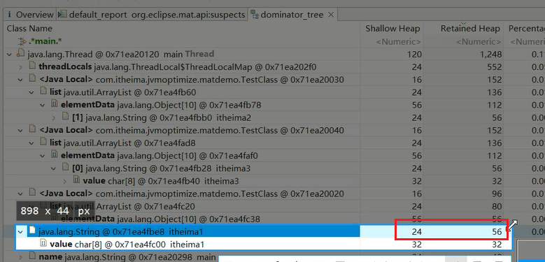

为什么字符串对象的浅堆大小是24字节，深堆大小是56字节呢？首先字符串对象引用了字符数组，字符数组的字节大小底下有展示是32字节，那我们只需要搞清楚浅堆大小也就是他自身为什么是24字节就可以了。使用`jol`框架打印下对象大小（原理篇会详细展开讲解，这里先有个基本的认知）。

添加依赖：

```XML
<dependency>
    <groupId>org.openjdk.jol</groupId>
    <artifactId>jol-core</artifactId>
    <version>0.9</version>
</dependency>
```

使用代码打印：

```Java
public class StringSize {
    public static void main(String[] args) {
        //使用JOL打印String对象
        System.out.print(ClassLayout.parseClass(String.class).toPrintable());
    }
}
```

结果如下：

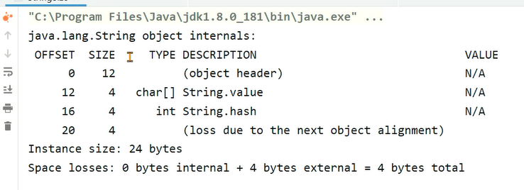

对象头占用了12字节，value字符数组的引用占用了4字节，int类型的hash字段占用4字节，还有4字节是对象填充，所以加起来是24字节。至于对象填充、对象头是做什么用的，在《原理篇》中会详细讲解。

MAT就是根据支配树，从叶子节点向根节点遍历，如果发现深堆的大小超过整个堆内存的一定比例阈值，就会将其标记成内存泄漏的“嫌疑对象”。

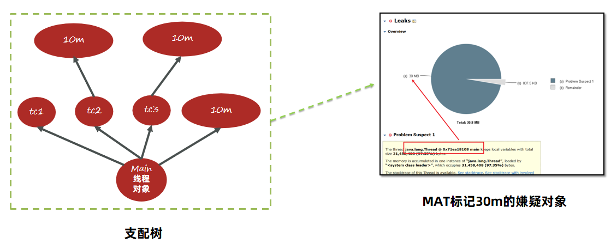

#### 服务器上的内存快照导出和分析

刚才我们都是在本地导出内存快照的，并且是程序已经出现了内存溢出，接下来我们要做到防范于未然，一旦看到内存大量增长就去分析内存快照，那此时内存还没溢出，怎么样去获得内存快照文件呢？

**背景：**

小李的团队通过监控系统发现有一个服务内存在持续增长，希望尽快通过内存快照分析增长的原因，由于并未产生内存溢出所以不能通过HeapDumpOnOutOfMemoryError参数生成内存快照。

**思路：**

导出运行中系统的内存快照，比较简单的方式有两种，注意只需要导出标记为存活的对象：

通过JDK自带的jmap命令导出，格式为：

​      jmap -dump:live,format=b,file=文件路径和文件名 进程ID

通过arthas的heapdump命令导出，格式为：

​      heapdump --live  文件路径和文件名 

先使用`jps`或者`ps -ef`查看进程ID:

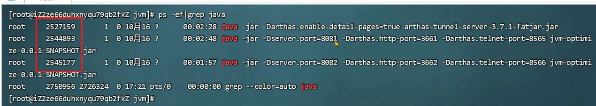

 通过`jmap`命令导出内存快照文件，live代表只保存存活对象，format=b用二进制方式保存：

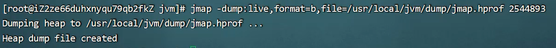

也可以在arthas中输出`heapdump`命令：

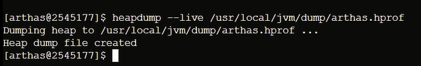

接下来下载到本地分析即可。

**大文件的处理**

在程序员开发用的机器内存范围之内的快照文件，直接使用MAT打开分析即可。但是经常会遇到服务器上的程序占用的内存达到10G以上，开发机无法正常打开此类内存快照，此时需要下载服务器操作系统对应的MAT。下载地址：https://eclipse.dev/mat/downloads.php 通过MAT中的脚本生成分析报告：

 **./ParseHeapDump.sh 快照文件路径 org.eclipse.mat.api:suspects org.eclipse.mat.api:overview org.eclipse.mat.api:top_components**

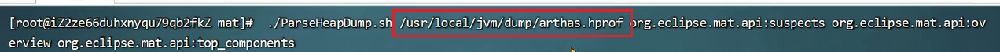

> 注意：默认MAT分析时只使用了1G的堆内存，如果快照文件超过1G，需要修改MAT目录下的MemoryAnalyzer.ini配置文件调整最大堆内存。

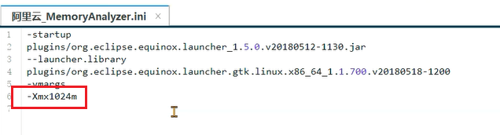

最终会生成报告文件：

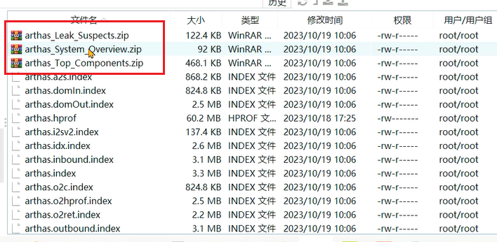

将这些文件下载到本地，解压之后打开index.html文件：

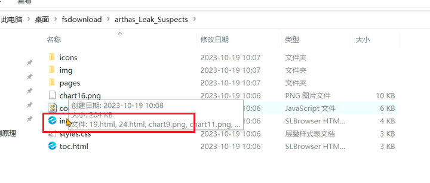

同样可以看到类似的报告：

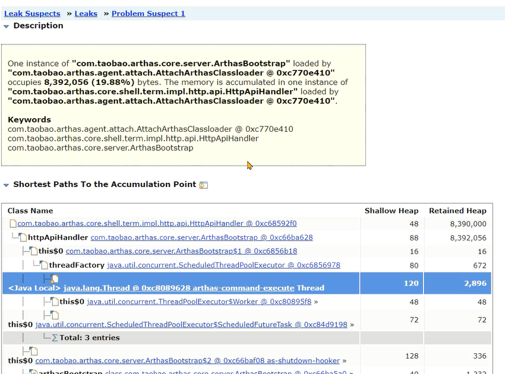

#### 案例1 - 分页查询文章接口的内存溢出：

背景：

小李负责的新闻资讯类项目采用了微服务架构，其中有一个文章微服务，这个微服务在业务高峰期出现了内存溢出的现象。

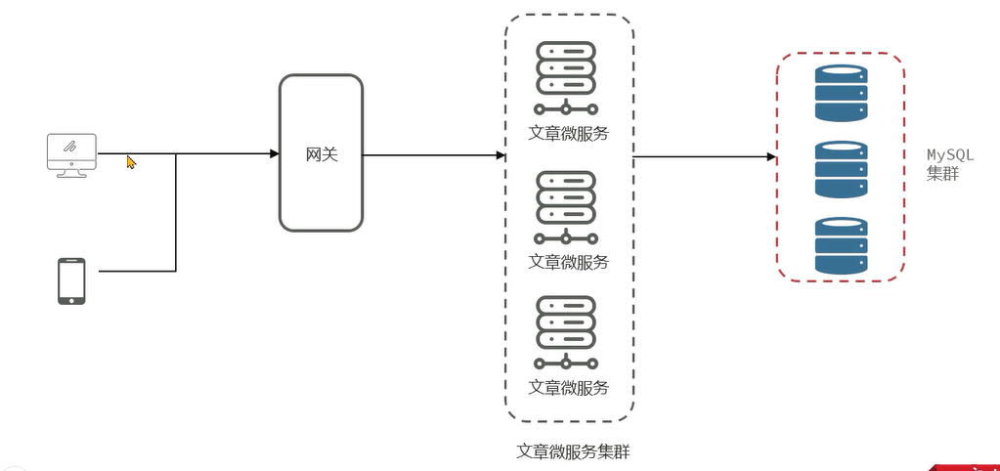

解决思路：

1、服务出现OOM内存溢出时，生成内存快照。

2、使用MAT分析内存快照，找到内存溢出的对象。

3、尝试在开发环境中重现问题，分析代码中问题产生的原因。

4、修改代码。

5、测试并验证结果。

代码使用的是`com.itheima.jvmoptimize.practice.oom.controller.DemoQueryController`：

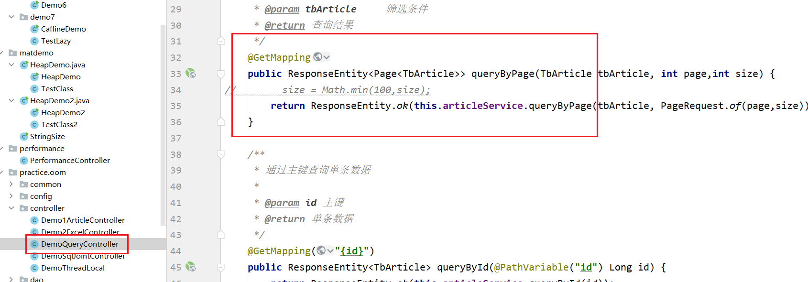

首先将项目打包，放到服务器上，同时使用如下启动命令启动。设置了最大堆内存为512m，同时堆内存溢出时会生成hprof文件：


编写JMeter脚本进行压测，size数据量一次性获取10000条，线程150，每个线程执行10次方法调用：

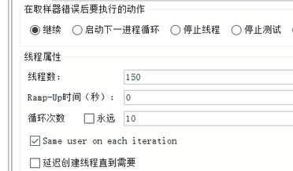


执行之后可以发现服务器上已经生成了`hprof`文件：

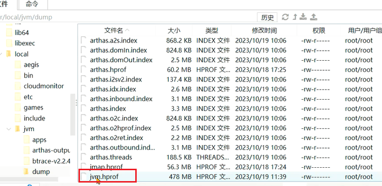

将其下载到本地，通过MAT分析发现是Mysql返回的ResultSet存在大量的数据：

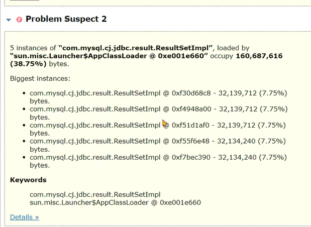

通过支配树，可以发现里边包含的数据，如果数据有一些特殊的标识，其实就可以判断出来是哪个接口产生的数据：

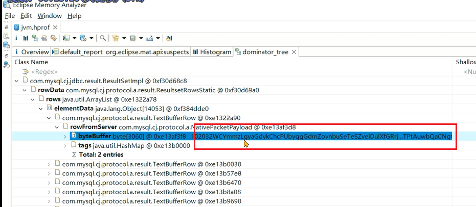

如果想知道每个线程在执行哪个方法，先找到spring的HandlerMethod对象：

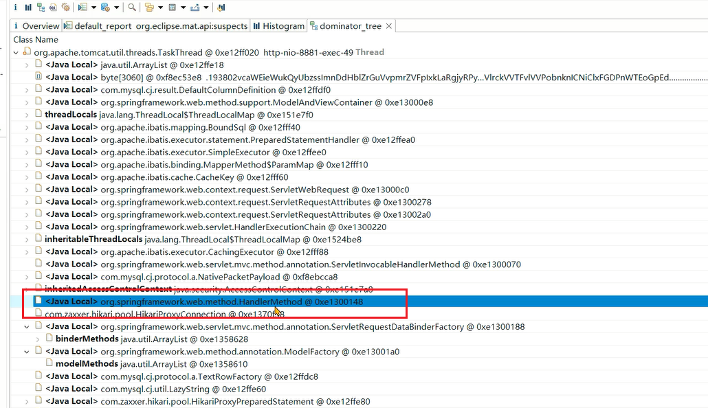

接着去找引用关系：

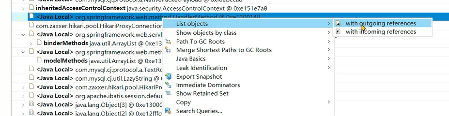

通过描述信息就可以看到接口：

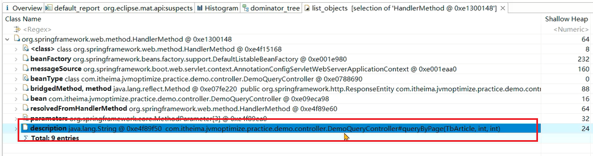

通过直方图的查找功能，也可以找到项目里哪些对象比较多：

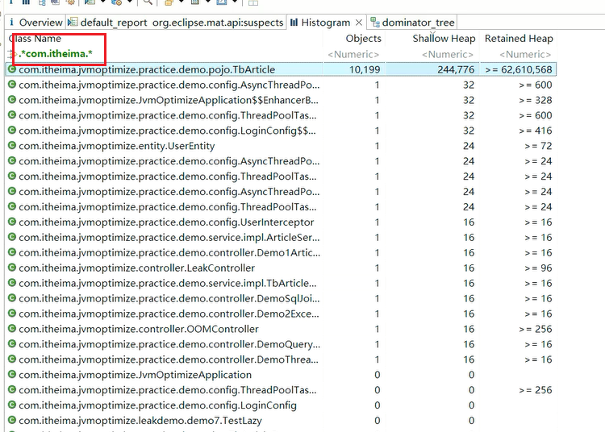

**问题根源：**

文章微服务中的分页接口没有限制最大单次访问条数，并且单个文章对象占用的内存量较大，在业务高峰期并发量较大时这部分从数据库获取到内存之后会占用大量的内存空间。

**解决思路：**

1、与产品设计人员沟通，限制最大的单次访问条数。

以下代码，限制了每次访问的最大条数为100条

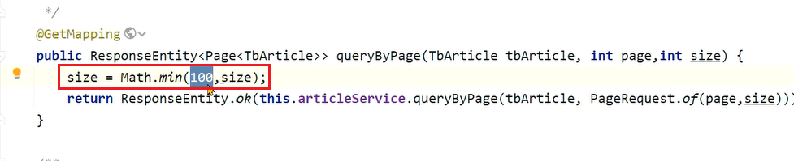

2、分页接口如果只是为了展示文章列表，不需要获取文章内容，可以大大减少对象的大小。

把文章内容去掉，减少对象大小：

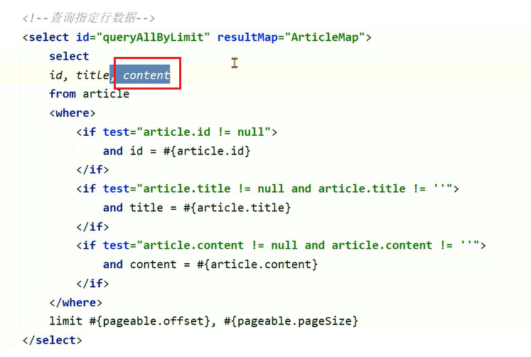

3、在高峰期对微服务进行限流保护。

#### 案例2 - Mybatis导致的内存溢出：

背景：

小李负责的文章微服务进行了升级，新增加了一个判断id是否存在的接口，第二天业务高峰期再次出现了内存溢出，小李觉得应该和新增加的接口有关系。

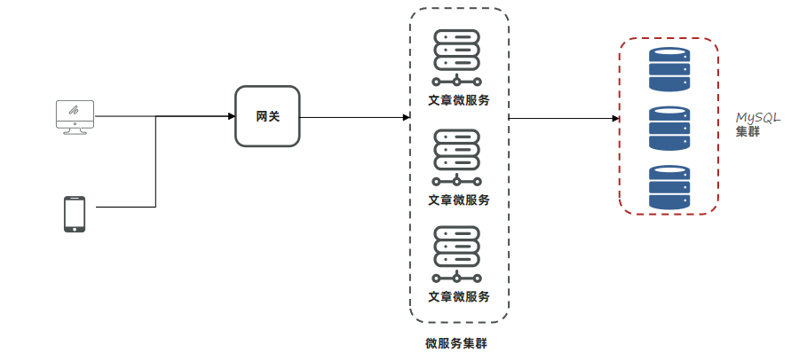

解决思路：

1、服务出现OOM内存溢出时，生成内存快照。

2、使用MAT分析内存快照，找到内存溢出的对象。

3、尝试在开发环境中重现问题，分析代码中问题产生的原因。

4、修改代码。

5、测试并验证结果。

通过分析hprof发现调用的方法，但是这个仅供参考：

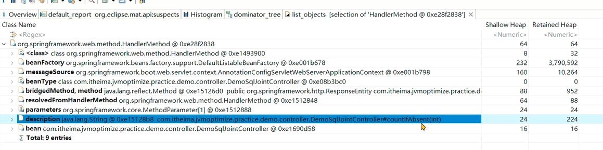

分析支配树，找到大对象来源，是一些字符串，里边还包含SQL

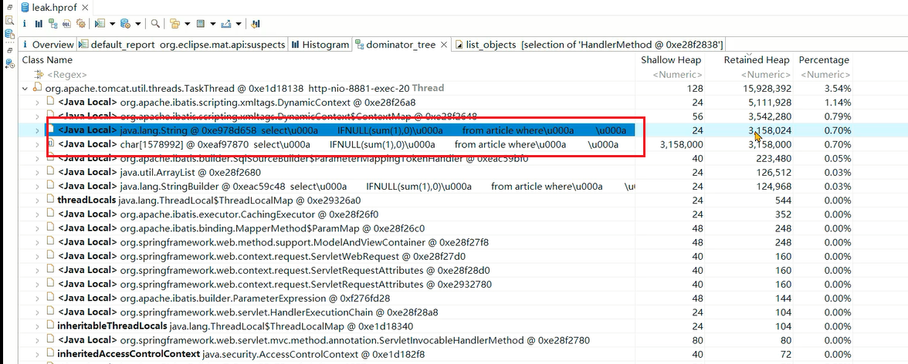

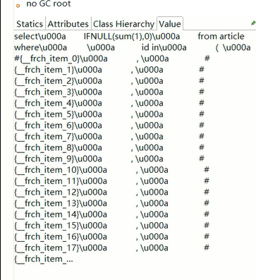

通过SQL内容搜索下可以找到对应的方法：

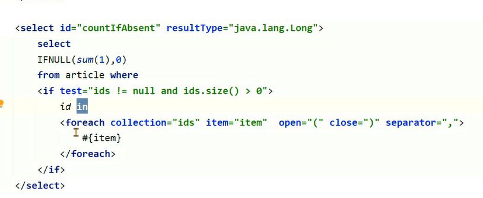

发现里边用了foreach，如果循环内容很大，会产生特别大的一个SQL语句。

直接打开jmeter，打开测试脚本进行测试:

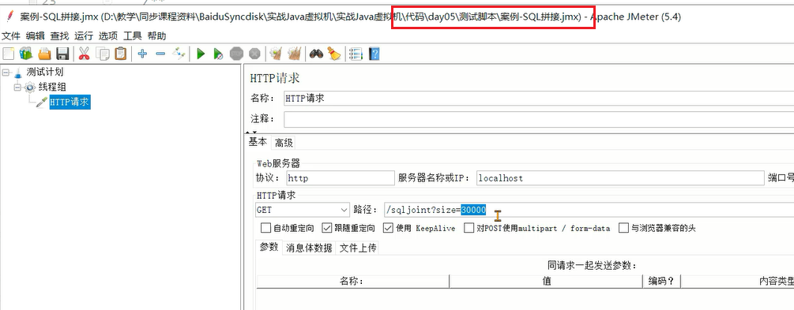

本地测试之后，出现了内存溢出：

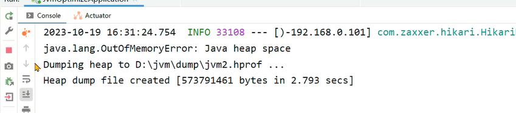

问题根源：

Mybatis在使用foreach进行sql拼接时，会在内存中创建对象，如果foreach处理的数组或者集合元素个数过多，会占用大量的内存空间。

解决思路：

1、限制参数中最大的id个数。

2、将id缓存到redis或者内存缓存中，通过缓存进行校验。

#### 案例3 - 导出大文件内存溢出

小李团队使用的是k8s将管理系统部署到了容器中，所以这一次我们使用阿里云的k8s环境还原场景，并解决问题。阿里云的k8s整体规划如下：


##### **K8S环境搭建（了解即可）**

1、创建镜像仓库


2、项目中添加Dockerfile文件

```Dockerfile
FROM openjdk:8-jre

MAINTAINER xiadong <xiadong@itcast.cn>

RUN ln -sf /usr/share/zoneinfo/Asia/Shanghai /etc/localtime

ADD jvm-optimize-0.0.1-SNAPSHOT.jar /app/

CMD ["java", "-Xmx512m", "-Xms512m", "-Dfile.encoding=UTF-8", "-XX:+HeapDumpOnOutOfMemoryError","-XX:HeapDumpPath=/opt/dump/heapdump.hprof","-jar", "/app/jvm-optimize-0.0.1-SNAPSHOT.jar"]

EXPOSE 8881
```

3、完全按照阿里云的教程执行命令：


4、推送成功之后，镜像仓库中已经出现了镜像：

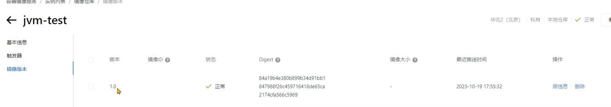

5、通过镜像构建k8s中的pod:

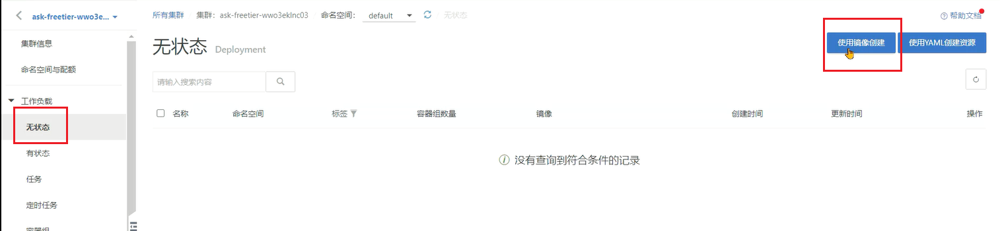

6、选择刚才的镜像：

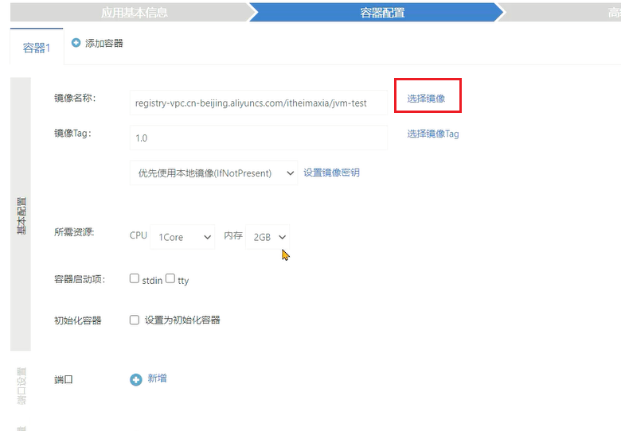

7、在OSS中创建一个Bucket：


8、创建存储声明，选择刚才的Bucket：

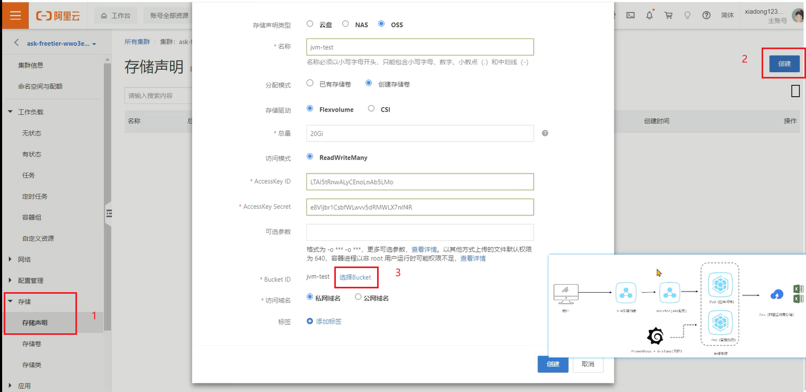

9、选择这个存储声明，并添加hprof文件生成的路径映射，要和Dockerfile中虚拟机参数里的路径相同：


10、创建一个service，填写配置，方便外网进行访问。

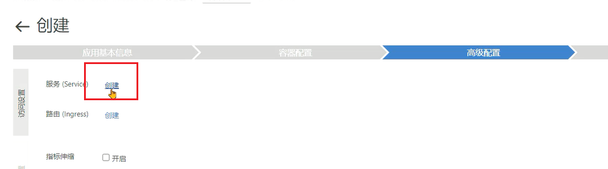


11、打开jmeter文件并测试：

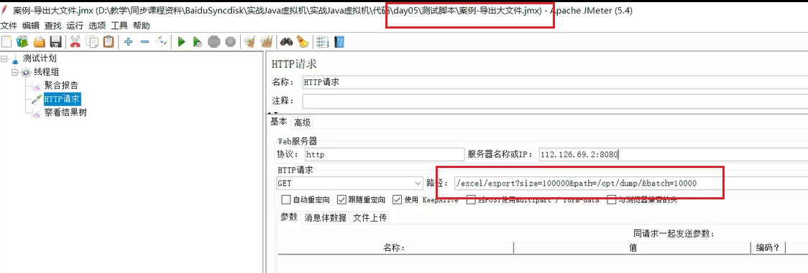

12、OSS中出现了这个hprof文件：

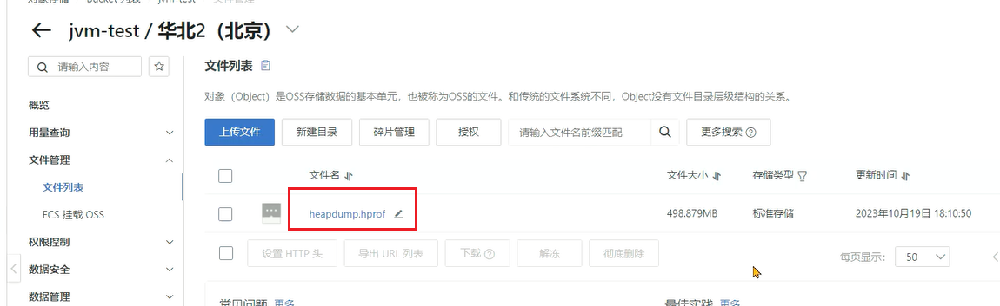

13、从直方图就可以看到是导出文件导致的内存溢出：


问题根源：

Excel文件导出如果使用POI的XSSFWorkbook，在大数据量（几十万）的情况下会占用大量的内存。

代码：`com.itheima.jvmoptimize.practice.oom.controller.Demo2ExcelController`

解决思路：

1、使用poi的SXSSFWorkbook。

2、hutool提供的BigExcelWriter减少内存开销。

```Dockerfile
 //http://www.hutool.cn/docs/#/poi/Excel%E5%A4%A7%E6%95%B0%E6%8D%AE%E7%94%9F%E6%88%90-BigExcelWriter
    @GetMapping("/export_hutool")
    public void export_hutool(int size, String path) throws IOException {


        List<List<?>> rows = new ArrayList<>();
        for (int i = 0; i < size; i++) {
           rows.add( CollUtil.newArrayList(RandomStringUtils.randomAlphabetic(1000)));
        }

        BigExcelWriter writer= ExcelUtil.getBigWriter(path + RandomStringUtils.randomAlphabetic(10) + ".xlsx");
// 一次性写出内容，使用默认样式
        writer.write(rows);
// 关闭writer，释放内存
        writer.close();


    }
```

3、使用easy excel，对内存进行了大量的优化。

```Dockerfile
//https://easyexcel.opensource.alibaba.com/docs/current/quickstart/write#%E9%87%8D%E5%A4%8D%E5%A4%9A%E6%AC%A1%E5%86%99%E5%85%A5%E5%86%99%E5%88%B0%E5%8D%95%E4%B8%AA%E6%88%96%E8%80%85%E5%A4%9A%E4%B8%AAsheet
@GetMapping("/export_easyexcel")
public void export_easyexcel(int size, String path,int batch) throws IOException {

    // 方法1: 如果写到同一个sheet
    String fileName = path + RandomStringUtils.randomAlphabetic(10) + ".xlsx";
    // 这里注意 如果同一个sheet只要创建一次
    WriteSheet writeSheet = EasyExcel.writerSheet("测试").build();
    // 这里 需要指定写用哪个class去写
    try (ExcelWriter excelWriter = EasyExcel.write(fileName, DemoData.class).build()) {
        // 分100次写入
        for (int i = 0; i < batch; i++) {
            // 分页去数据库查询数据 这里可以去数据库查询每一页的数据
            List<DemoData> datas = new ArrayList<>();
            for (int j = 0; j < size / batch; j++) {
                DemoData demoData = new DemoData();
                demoData.setString(RandomStringUtils.randomAlphabetic(1000));
                datas.add(demoData);
            }
            excelWriter.write(datas, writeSheet);
            //写入之后datas数据就可以释放了
        }
    }

}
```

#### 案例4 – ThreadLocal使用时占用大量内存

背景：

小李负责了一个微服务，但是他发现系统在没有任何用户使用时，也占用了大量的内存。导致可以使用的内存大大减少。


1、打开jmeter测试脚本


2、内存有增长，但是没溢出。所以通过jmap命令导出hprof文件


3、MAT分析之后发现每个线程中都包含了大量的对象：


4、在支配树中可以发现是ThreadLocalMap导致的内存增长：


5、ThreadLocalMap就是ThreadLocal对象保存数据的地方，所以只要分析ThreadLocal代码即可。在拦截器中，ThreadLocal清理的代码被错误的放在postHandle中，如果接口发生了异常，这段代码不会调用到，这样就产生了内存泄漏，将其移动到afterCompletion就可以了。


问题根源和解决思路：

很多微服务会选择在拦截器preHandle方法中去解析请求头中的数据，并放入一些数据到ThreadLocal中方便后续使用。在拦截器的afterCompletion方法中，必须要将ThreadLocal中的数据清理掉。

#### 案例5 – 文章内容审核接口的内存问题

背景：

文章微服务中提供了文章审核接口，会调用阿里云的内容安全接口进行文章中文字和图片的审核，在自测过程中出现内存占用较大的问题。


##### 设计1：使用SpringBoot中的@Async注解进行异步的审核。

##### `com.itheima.jvmoptimize.practice.oom.controller.Demo1ArticleController`类中的`article1`方法


1、打开jmeter脚本，已经准好了一段测试用的文本。


2、运行测试，发现线程数一直在增加：


3、发现是因为异步线程池的最大线程数设置了Integer的最大值，所以只要没到上限就一直创建线程：


4、接下来修改为100，再次测试：


5、这次线程数相对来说比较正常：


存在问题：

1、线程池参数设置不当，会导致大量线程的创建或者队列中保存大量的数据。

2、任务没有持久化，一旦走线程池的拒绝策略或者服务宕机、服务器掉电等情况很有可能会丢失任务。

##### 设计2：使用生产者和消费者模式进行处理，队列数据可以实现持久化到数据库。

代码实现：article2方法


1、测试之后发现，出现内存泄漏问题(其实并不是泄漏，而是内存中存放了太多的对象，但是从图上看着像内存泄漏了)：


2、每次接口调用之后，都会将数据放入队列中。


3、而这个队列没有设置上限：


4、调整一下上限设置为2000：


5、这次就没有出现内存泄漏问题了：


存在问题：

1、队列参数设置不正确，会保存大量的数据。

2、实现复杂，需要自行实现持久化的机制，否则数据会丢失。

##### 设计3：使用mq消息队列进行处理，由mq来保存文章的数据。发送消息的服务和拉取消息的服务可以是同一个，也可以不是同一个。

代码方法：article3


测试结果：

内存没有出现膨胀的情况


问题根源和解决思路：

在项目中如果要使用异步进行业务处理，或者实现生产者 – 消费者的模型，如果在Java代码中实现，会占用大量的内存去保存中间数据。

尽量使用Mq消息队列，可以很好地将中间数据单独进行保存，不会占用Java的内存。同时也可以将生产者和消费者拆分成不同的微服务。

#### 在线定位问题

诊断问题有两种方法，之前我们介绍的是第一种：

- 生成内存快照并分析。

优点：

   通过完整的内存快照准确地判断出问题产生的原因

缺点：

 内存较大时，生成内存快照较慢，这个过程中会影响用户的使用

 通过MAT分析内存快照，至少要准备1.5 – 2倍大小的内存空间

- 在线定位问题

优点：

   无需生成内存快照，整个过程对用户的影响较小

缺点：

 无法查看到详细的内存信息

 需要通过arthas或者btrace工具调测发现问题产生的原因，需要具备一定的经验

##### 安装Jmeter插件

为了监控响应时间RT、每秒事务数TPS等指标，需要在Jmeter上安装gc插件。

1、打开资料中的插件包并解压。


2、按插件包中的目录，复制到jmeter安装目录的lib目录下。


3、重启之后就可以在监听器中看到三个选项，分别是活跃线程数、响应时间RT、每秒事务数TPS。


##### Arthas stack命令在线定位步骤

1、使用jmap -histo:live 进程ID > 文件名 命令将内存中存活对象以直方图的形式保存到文件中，这个过程会影响用户的时间，但是时间比较短暂。


2、分析内存占用最多的对象，一般这些对象就是造成内存泄 打开1.txt文件，从图中可以看到，有一个UserEntity对象占用非常多的内存。


漏的原因。

3、使用arthas的stack命令，追踪对象创建的方法被调用的调用路径，找到对象创建的根源。也可以使用btrace工具编写脚本追踪方法执行的过程。


接下来启动jmeter脚本，会发现有大量的方法调用这样不利于观察。


加上 `-n 1 ` 参数，限制只查看一笔调用：


这样就定位到了是`login`接口中创建的对象：


##### btrace在线定位问题步骤

相比较arthas的stack命令，btrace允许我们自己编写代码获取感兴趣的内容，灵活性更高。

BTrace 是一个在Java 平台上执行的追踪工具，可以有效地用于线上运行系统的方法追踪，具有侵入性小、对性能的影响微乎其微等特点。 项目中可以使用btrace工具，打印出方法被调用的栈信息。 使用方法： 1、下载btrace工具， 官方地址：https://github.com/btraceio/btrace/releases/latest

在资料中也给出了：


2、编写btrace脚本，通常是一个java文件 依赖：

```XML
<dependencies>
        <dependency>
            <groupId>org.openjdk.btrace</groupId>
            <artifactId>btrace-agent</artifactId>
            <version>${btrace.version}</version>
            <scope>system</scope>
            <systemPath>D:\tools\btrace-v2.2.4-bin\libs\btrace-agent.jar</systemPath>
        </dependency>

        <dependency>
            <groupId>org.openjdk.btrace</groupId>
            <artifactId>btrace-boot</artifactId>
            <version>${btrace.version}</version>
            <scope>system</scope>
            <systemPath>D:\tools\btrace-v2.2.4-bin\libs\btrace-boot.jar</systemPath>
        </dependency>

        <dependency>
            <groupId>org.openjdk.btrace</groupId>
            <artifactId>btrace-client</artifactId>
            <version>${btrace.version}</version>
            <scope>system</scope>
            <systemPath>D:\tools\btrace-v2.2.4-bin\libs\btrace-client.jar</systemPath>
        </dependency>
    </dependencies>
```

代码：

代码非常简单，就是打印出栈信息。clazz指定类，method指定监控的方法。

```Java
import org.openjdk.btrace.core.annotations.*;

import static org.openjdk.btrace.core.BTraceUtils.jstack;
import static org.openjdk.btrace.core.BTraceUtils.println;

@BTrace
public class TracingUserEntity {
        @OnMethod(
            clazz="com.itheima.jvmoptimize.entity.UserEntity",
            method="/.*/")
        public static void traceExecute(){
                jstack();
        }
}
```

3、将btrace工具和脚本上传到服务器，在服务器上运行 `btrace 进程ID 脚本文件名` 。

配置btrace环境变量，与JDK配置方式基本相同：


在服务器上运行 `btrace 进程ID 脚本文件名`:


4、观察执行结果。 启动jmeter之后，同样获取到了栈信息：


# 2、GC调优

GC调优指的是对垃圾回收（Garbage Collection）进行调优。GC调优的主要目标是避免由垃圾回收引起程序性能下降。

GC调优的核心分成三部分：

1、通用Jvm参数的设置。

2、特定垃圾回收器的Jvm参数的设置。

3、解决由频繁的FULLGC引起的程序性能问题。

GC调优没有没有唯一的标准答案，如何调优与硬件、程序本身、使用情况均有关系，重点学习调优的工具和方法。

## 2.1 GC调优的核心指标

所以判断GC是否需要调优，需要从三方面来考虑，与GC算法的评判标准类似：

1.吞吐量(Throughput) 吞吐量分为业务吞吐量和垃圾回收吞吐量

业务吞吐量指的在一段时间内，程序需要完成的业务数量。比如企业中对于吞吐量的要求可能会是这样的：

支持用户每天生成10000笔订单

在晚上8点到10点，支持用户查询50000条商品信息

保证高吞吐量的常规手段有两条：

1、优化业务执行性能，减少单次业务的执行时间

2、优化垃圾回收吞吐量

### 2.1.1 垃圾回收吞吐量

垃圾回收吞吐量指的是 CPU 用于执行用户代码的时间与 CPU 总执行时间的比值，即吞吐量 = 执行用户代码时间 /（执行用户代码时间 + GC时间）。吞吐量数值越高，垃圾回收的效率就越高，允许更多的CPU时间去处理用户的业务，相应的业务吞吐量也就越高。


### 2.1.2 延迟（Latency）

1. 延迟指的是从用户发起一个请求到收到响应这其中经历的时间。比如企业中对于延迟的要求可能会是这样的：

1. 所有的请求必须在5秒内返回给用户结果

1. 延迟 = GC延迟 + 业务执行时间，所以如果GC时间过长，会影响到用户的使用。


### 2.1.3 内存使用量

1. 内存使用量指的是Java应用占用系统内存的最大值，一般通过Jvm参数调整，在满足上述两个指标的前提下，这个值越小越好。


## 2.2 GC调优的步骤


### 2.2.1 发现问题 - 常用工具

####  jstat工具

Jstat工具是JDK自带的一款监控工具，可以提供各种垃圾回收、类加载、编译信息

等不同的数据。使用方法为：`jstat -gc 进程ID 每次统计的间隔（毫秒） 统计次数 `


C代表Capacity容量，U代表Used使用量

S – 幸存者区，E – 伊甸园区，O – 老年代，M – 元空间

YGC、YGT：年轻代GC次数和GC耗时（单位：秒）

FGC、FGCT：Full GC次数和Full GC耗时

GCT：GC总耗时

优点：

 操作简单

 无额外的软件安装

缺点：

 无法精确到GC产生的时间，只能用于判断GC是否存在问题 

#### Visualvm插件

VisualVm中提供了一款Visual GC插件，实时监控Java进程的堆内存结构、堆内存变化趋势以及垃圾回收时间的变化趋势。同时还可以监控对象晋升的直方图。


优点：

 适合开发使用，能直观的看到堆内存和GC的变化趋势

缺点：

 对程序运行性能有一定影响

 生产环境程序员一般没有权限进行操作

安装方法：

1、打开插件页面


2、安装Visual GC插件


3、选择标签就可以看到内容：


#### Prometheus + Grafana

Prometheus+Grafana是企业中运维常用的监控方案，其中Prometheus用来采系统或者应用的相关数据，同时具备告警功能。Grafana可以将Prometheus采集到的数据以可视化的方式进行展示。

Java程序员要学会如何读懂Grafana展示的Java虚拟机相关的参数。


优点：

 支持系统级别和应用级别的监控，比如linux操作系统、Redis、MySQL、Java进程。

 支持告警并允许自定义告警指标，通过邮件、短信等方式尽早通知相关人员进行处理

缺点：

 环境搭建较为复杂，一般由运维人员完成

#### GC日志

通过GC日志，可以更好的看到垃圾回收细节上的数据，同时也可以根据每款垃圾回收器的不同特点更好地发现存在的问题。

使用方法（JDK 8及以下）：-XX:+PrintGCDetails  -Xloggc:文件名

使用方法（JDK 9+）：-Xlog:gc*:file=文件名


1、添加虚拟机参数：


2、打开日志文件就可以看到GC日志


3、分析GC日志

##### 分析GC日志 - GCViewer

GCViewer是一个将GC日志转换成可视化图表的小工具，github地址： https://github.com/chewiebug/GCViewer 使用方法：java -jar gcviewer_1.3.4.jar 日志文件.log


右下角是基础信息，左边是内存趋势图


##### 分析GC日志 - GCEasy

GCeasy是业界首款使用AI机器学习技术在线进行GC分析和诊断的工具。定位内存泄漏、GC延迟高的问题，提供JVM参数优化建议，支持在线的可视化工具图表展示。 官方网站：https://gceasy.io/ 


使用方法：

1、选择文件，找到GC日志并上传


2、点击Analyze分析就可以看到报告，每个账号每个月能免费上传5个GC日志。

建议部分：


内存情况：


GC关键性指标：


GC的趋势图：


引发GC的原因：


### 2.2.2 常见的GC模式

根据内存的趋势图，我们可以将GC的情况分成几种模式

#### 1、正常情况

特点：呈现锯齿状，对象创建之后内存上升，一旦发生垃圾回收之后下降到底部，并且每次下降之后的内存大小接近，存留的对象较少。

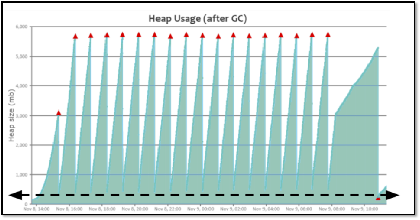

#### 2、缓存对象过多

特点：呈现锯齿状，对象创建之后内存上升，一旦发生垃圾回收之后下降到底部，并且每次下降之后的内存大小接近，处于比较高的位置。

问题产生原因： 程序中保存了大量的缓存对象，导致GC之后无法释放，可以使用MAT或者HeapHero等工具进行分析内存占用的原因。


#### 3、内存泄漏

特点：呈现锯齿状，每次垃圾回收之后下降到的内存位置越来越高，最后由于垃圾回收无法释放空间导致对象无法分配产生OutOfMemory的错误。

问题产生原因： 程序中保存了大量的内存泄漏对象，导致GC之后无法释放，可以使用MAT或者HeapHero等工具进行分析是哪些对象产生了内存泄漏。


#### 4、持续的FullGC

特点：在某个时间点产生多次Full GC，CPU使用率同时飙高，用户请求基本无法处理。一段时间之后恢复正常。

问题产生原因： 在该时间范围请求量激增，程序开始生成更多对象，同时垃圾收集无法跟上对象创建速率，导致持续地在进行FULL GC。GC分析报告


比如如下报告就产生了持续的FULL GC：


整体的延迟就变得很长：


原因就是老年代满了：


由于分配不了对象，导致频繁的FULLGC：


#### 5、元空间不足导致的FULLGC

特点：堆内存的大小并不是特别大，但是持续发生FULLGC。

问题产生原因： 元空间大小不足，导致持续FULLGC回收元空间的数据。GC分析报告

 元空间并不是满了才触发FULLGC，而是JVM自动会计算一个阈值，如下图中元空间并没有满，但是频繁产生了FULLGC。


停顿时间也比较长：


非常频繁的FULLGC:


### 2.2.3 解决GC问题的手段

解决GC问题的手段中，前三种是比较推荐的手段，第四种仅在前三种无法解决时选用：

- 优化基础JVM参数，基础JVM参数的设置不当，会导致频繁FULLGC的产生
- 减少对象产生，大多数场景下的FULLGC是由于对象产生速度过快导致的，减少对象产生可以有效的缓解FULLGC的发生
- 更换垃圾回收器，选择适合当前业务场景的垃圾回收器，减少延迟、提高吞吐量
- 优化垃圾回收器参数，优化垃圾回收器的参数，能在一定程度上提升GC效率

#### 优化基础JVM参数

**参数1 ： -Xmx 和 –Xms**

-Xmx参数设置的是最大堆内存，但是由于程序是运行在服务器或者容器上，计算可用内存时，要将元空间、操作系统、其它软件占用的内存排除掉。

案例： 服务器内存4G，操作系统+元空间最大值+其它软件占用1.5G，-Xmx可以设置为2g。

最合理的设置方式应该是根据最大并发量估算服务器的配置，然后再根据服务器配置计算最大堆内存的值。


参数1 ： -Xmx 和 –Xms

-Xms用来设置初始堆大小，建议将-Xms设置的和-Xmx一样大，有以下几点好处：

- 运行时性能更好，堆的扩容是需要向操作系统申请内存的，这样会导致程序性能短期下降。
- 可用性问题，如果在扩容时其他程序正在使用大量内存，很容易因为操作系统内存不足分配失败。
- 启动速度更快，Oracle官方文档的原话：如果初始堆太小，Java 应用程序启动会变得很慢，因为 JVM 被迫频繁执行垃圾收集，直到堆增长到更合理的大小。为了获得最佳启动性能，请将初始堆大小设置为与最大堆大小相同。

**参数2 ： -XX:MaxMetaspaceSize 和 –XX:MetaspaceSize**

-XX:MaxMetaspaceSize=值  参数指的是最大元空间大小，默认值比较大，如果出现元空间内存泄漏会让操作系统可用内存不可控，建议根据测试情况设置最大值，一般设置为256m。

-XX:MetaspaceSize=值 参数指的是到达这个值之后会触发FULLGC（网上很多文章的初始元空间大小是错误的），后续什么时候再触发JVM会自行计算。如果设置为和MaxMetaspaceSize一样大，就不会FULLGC，但是对象也无法回收。


计算出来第一次因元空间触发FULLGC的阈值：


**参数3 ： -Xss虚拟机栈大小**

如果我们不指定栈的大小，JVM 将创建一个具有默认大小的栈。大小取决于操作系统和计算机的体系结构。

比如Linux x86 64位 ： 1MB，如果不需要用到这么大的栈内存，完全可以将此值调小节省内存空间，合理值为256k – 1m之间。

使用：-Xss256k

**参数4 ： 不建议手动设置的参数**

由于JVM底层设计极为复杂，一个参数的调整也许让某个接口得益，但同样有可能影响其他更多接口。

-Xmn 年轻代的大小，默认值为整个堆的1/3，可以根据峰值流量计算最大的年轻代大小，尽量让对象只存放在年轻代，不进入老年代。但是实际的场景中，接口的响应时间、创建对象的大小、程序内部还会有一些定时任务等不确定因素都会导致这个值的大小并不能仅凭计算得出，如果设置该值要进行大量的测试。G1垃圾回收器尽量不要设置该值，G1会动态调整年轻代的大小。


‐XX:SurvivorRatio 伊甸园区和幸存者区的大小比例，默认值为8。

‐XX:MaxTenuringThreshold 最大晋升阈值，年龄大于此值之后，会进入老年代。另外JVM有动态年龄判断机制：将年龄从小到大的对象占据的空间加起来，如果大于survivor区域的50%，然后把等于或大于该年龄的对象，放入到老年代。

比如下图中，年龄1+年龄2+年龄3 = 55m已经超过了S区的50%，所以会将年龄3及以上的对象全部放入老年代。


**其他参数 ：**

 -XX:+DisableExplicitGC

禁止在代码中使用System.gc()， System.gc()可能会引起FULLGC，在代码中尽量不要使用。使用DisableExplicitGC参数可以禁止使用System.gc()方法调用。

-XX:+HeapDumpOnOutOfMemoryError：发生OutOfMemoryError错误时，自动生成hprof内存快照文件。

  -XX:HeapDumpPath=<path>：指定hprof文件的输出路径。

打印GC日志

JDK8及之前 ： -XX:+PrintGCDetails -XX:+PrintGCDateStamps -Xloggc:文件路径

JDK9及之后 ： -Xlog:gc*:file=文件路径

**JVM参数模板**

```Java
-Xms1g
-Xmx1g
-Xss256k
-XX:MaxMetaspaceSize=512m 
-XX:+DisableExplicitGC-XX:+HeapDumpOnOutOfMemoryError
-XX:HeapDumpPath=/opt/logs/my-service.hprof-XX:+PrintGCDetails 
-XX:+PrintGCDateStamps 
-Xloggc:文件路径
```

注意：

JDK9及之后gc日志输出修改为 -Xlog:gc*:file=文件名

堆内存大小和栈内存大小根据实际情况灵活调整。

#### 垃圾回收器的选择

**背景**：

小李负责的程序在高峰期遇到了性能瓶颈，团队从业务代码入手优化了多次也取得了不错的效果，这次他希望能采用更合理的垃圾回收器优化性能。

**思路：**

编写Jmeter脚本对程序进行压测，同时添加RT响应时间、每秒钟的事务数

等指标进行监控。

选择不同的垃圾回收器进行测试，并发量分别设置50、100、200，观察

数据的变化情况。

3. JDK8 下 ParNew + CMS 组合 ： -XX:+UseParNewGC -XX:+UseConcMarkSweepGC

​                 默认组合 ： PS + PO

​    JDK8使用g1 : -XX:+UseG1GC    JDK11 默认 g1

**测试用代码：**

```
com.itheima.jvmoptimize.fullgcdemo.Demo2Controller
```

1、使用jmeter测试脚本


2、添加基础JVM测试参数：

```Java
-Xms8g -Xmx8g -Xss256k -XX:MaxMetaspaceSize=512m  -XX:+DisableExplicitGC -XX:+HeapDumpOnOutOfMemoryError -XX:HeapDumpPath=D:/test.hprof  -verbose:gc -XX:+PrintGCDetails -XX:+PrintGCTimeStamps
```

JDK8默认情况下测试的是PS+PO组合 

##### 测试结果：

| 垃圾回收器 | 参数                                       | 50并发（最大响应时间） | 100并发（最大响应时间） | 200并发（最大响应时间） |
| ---------- | ------------------------------------------ | ---------------------- | ----------------------- | ----------------------- |
| PS+PO      | 默认                                       | 260ms                  | 474ms                   | 930ms                   |
| CMS        | *-XX:+UseParNewGC -XX:+UseConcMarkSweepGC* | 157ms                  | 未测试                  | 833ms                   |
| G1         | JDK11默认                                  | 未测试                 | 未测试                  | 248ms                   |

由此可见使用了JDK11之后使用G1垃圾回收器，性能优化结果还是非常明显的。其他测试数据同学们有兴趣可以自行去测试一下。

#### 优化垃圾回收器的参数

这部分优化效果未必出色，仅当前边的一些手动无效时才考虑。

一个优化的案例：

CMS的并发模式失败（concurrent mode failure）现象。由于CMS的垃圾清理线程和用户线程是并行进行的，如果在并发清理的过程中老年代的空间不足以容纳放入老年代的对象，会产生并发模式失败。


老年代已经满了此时有一些对象要晋升到老年代：


解决方案：

1.减少对象的产生以及对象的晋升。

2.增加堆内存大小

3.优化垃圾回收器的参数，比如-XX:CMSInitiatingOccupancyFraction=值，当老年代大小到达该阈值时，会自动进行CMS垃圾回收，通过控制这个参数提前进行老年代的垃圾回收，减少其大小。

JDK8中默认这个参数值为 -1，根据其他几个参数计算出阈值：

((100 - MinHeapFreeRatio) + (double)(CMSTriggerRatio * MinHeapFreeRatio) / 100.0)

在我本机计算之后的结果是92：


该参数设置完是不会生效的，必须开启-XX:+UseCMSInitiatingOccupancyOnly参数。

调整前和调整之后的效果对比：


很明显FULLGC产生的次数下降了。

### 2.2.4 案例实战

**背景：**

小李负责的程序在高峰期经常会出现接口调用时间特别长的现象，他希望能优化程序的性能。

**思路：**

生成GC报告，通过Gceasy工具进行分析，判断是否存在GC问题或者内存问题。

存在内存问题，通过jmap或者arthas将堆内存快照保存下来。

通过MAT或者在线的heaphero工具分析内存问题的原因。

修复问题，并发布上线进行测试。

**测试代码**：`com.itheima.jvmoptimize.fullgcdemo.Practice`

JVM参数：

```Java
-Xms1g -Xmx1g -Xss256k    -XX:MaxMetaspaceSize=256m  -XX:+UseParNewGC -XX:+UseConcMarkSweepGC -XX:+PrintGCDateStamps  -XX:+PrintGCDetails -XX:+DisableExplicitGC -Xloggc:D:/test.log
```

1、打开测试脚本：


2、发现有几笔响应时间特别长的请求，怀疑是GC引起的：


3、把GC日志上传到GCEasy之后发现内存占用情况很严重：


出现了几次FULLGC,并且FULL GC之后，内存占用也有160m左右:


##### 问题1：

发生了连续的FULL GC,堆内存1g如果没有请求的情况下，内存大小在200-300mb之间。

分析：

没有请求的情况下，内存大小并没有处于很低的情况，满足缓存对象过多的情况，怀疑内存种缓存了很多数据。需要将堆内存快照保存下来进行分析。


1、在本地测试，通过visualvm将hprof文件保存下来：


2、通过Heap Hero分析文件，操作方式与GCEasy相同，上传的是hprof文件：


但是我们发现，生成的文件非常小，与接近200m大小不符：


3、怀疑有些对象已经可以回收，所以没有下载下来。使用jmap调整下参数，将live参数去掉，这样即便是垃圾对象也能保存下来：


4、在MAT中分析，选择不可达对象直方图：


5、大量的对象都是字节数组对象：


6.那么这些对象是如何产生的呢？继续往下来，捕捉到有大量的线程对象，如果没有发现这个点，只能去查代码看看哪里创建了大量的字节数组了：


##### 问题2：

由于这些对象已经不在引用链上，无法通过支配树等手段分析创建的位置。

分析：

在不可达对象列表中，除了发现大量的byte[]还发现了大量的线程，可以考虑跟踪线程的栈信息来判断对象在哪里创建。

1、在VisualVM中使用采样功能，对内存采样：


2、观察到这个线程一直在发生变化，说明有线程频繁创建销毁：


3、选择线程功能，保存线程栈：


4、抓到了一个线程，线程后边的ID很大，说明已经创建过很多线程了：


5、通过栈信息找到源代码：


这里有个定时任务，每隔200ms就创建线程。

问题产生原因：

在定时任务中通过线程创建了大量的对象，导致堆内存一直处于比较高的位置。

 

解决方案：

暂时先将这段代码注释掉，测试效果，由于这个服务本身的内存压力比较大，将这段定时任务移动到别的服务中。

##### 问题3：

修复之后内存基本上处于100m左右，但是当请求发生时，依然有频繁FULL GC的发生。

分析：

请求产生的内存大小比当前最大堆内存大，尝试选择配置更高的服务器，将-Xmx和-Xms参数调大一些。


当前的堆内存大小无法支撑请求量，所以要不就将请求量降下来，比如限制tomcat线程数、限流，或者提升服务器配置，增大堆内存。

调整为4G之后的效果，FULLGC数量很少：


##### 案例总结：

1、压力比较大的服务中，尽量不要存放大量的缓存或者定时任务，会影响到服务的内存使用。

2、内存分析发现有大量线程创建时，可以使用导出线程栈来查看线程的运行情况。

3、如果请求确实创建了大量的内存超过了内存上限，只能考虑减少请求时创建的对象，或者使用更大的内存。

4、推荐使用g1垃圾回收器，并且使用较新的JDK可以获得更好的性能。

# 3、性能调优

## 3.1 性能调优解决的问题

应用程序在运行过程中经常会出现性能问题，比较常见的性能问题现象是：

1、通过top命令查看CPU占用率高，接近100甚至多核CPU下超过100都是有可能的。


2、请求单个服务处理时间特别长，多服务使用skywalking等监控系统来判断是哪一个环节性能低下。


3、程序启动之后运行正常，但是在运行一段时间之后无法处理任何的请求（内存和GC正常）。

## 3.2 性能调优的方法

线程转储（Thread Dump）提供了对所有运行中的线程当前状态的快照。线程转储可以通过jstack、visualvm等工具获取。其中包含了线程名、优先级、线程ID、线程状态、线程栈信息等等内容，可以用来解决CPU占用率高、死锁等问题。


1、通过jps查看进程ID：


2、通过`jstack 进程ID`查看线程栈信息：


3、通过`jstack 进程ID > 文件名`导出线程栈文件


线程转储（Thread Dump）中的几个核心内容： 名称： 线程名称，通过给线程设置合适的名称更容易“见名知意” 优先级（prio）：线程的优先级 Java ID（tid）：JVM中线程的唯一ID 本地 ID (nid)：操作系统分配给线程的唯一ID 状态：线程的状态，分为： NEW – 新创建的线程，尚未开始执行 RUNNABLE –正在运行或准备执行 BLOCKED – 等待获取监视器锁以进入或重新进入同步块/方法 WAITING – 等待其他线程执行特定操作，没有时间限制 TIMED_WAITING – 等待其他线程在指定时间内执行特定操作 TERMINATED – 已完成执行 栈追踪： 显示整个方法的栈帧信息 线程转储的可视化在线分析平台： 1、 https://jstack.review/ 2、 https://fastthread.io/

### 解决CPU占用率高的问题

应用程序在运行过程中经常会出现性能问题，比较常见的性能问题现象是：

1、通过top命令查看CPU占用率高，接近100甚至多核CPU下超过100都是有可能的。

2、请求单个服务处理时间特别长，多服务使用skywalking等监控系统来判断是哪一个环节性能低下。

3、程序启动之后运行正常，但是在运行一段时间之后无法处理任何的请求（内存和GC正常）。

问题：

监控人员通过prometheus的告警发现CPU占用率一直处于很高的情况，通过top命令看到是由于Java程序引起的，希望能快速定位到是哪一部分代码导致了性能问题。

解决思路：

1、通过top –c 命令找到CPU占用率高的进程，获取它的进程ID。


2、使用top -p 进程ID单独监控某个进程，按H可以查看到所有的线程以及线程对应的CPU使用率，找到CPU使用率特别高的线程。


3、使用 jstack 进程ID 命令可以查看到所有线程正在执行的栈信息。使用 jstack 进程ID > 文件名 保存到文件中方便查看。


4、找到nid线程ID相同的栈信息，需要将之前记录下的十进制线程号转换成16进制。通过 printf ‘%x\n’ 线程ID 命令直接获得16进制下的线程ID。


5、找到栈信息对应的源代码，并分析问题产生原因。

在定位CPU占用率高的问题时，比较需要关注的是状态为RUNNABLE的线程。但实际上，有一些线程执行本地方法时并不会消耗CPU，而只是在等待。但 JVM 仍然会将它们标识成“RUNNABLE”状态。


## 3.3 案例实战

### 案例2：接口响应时间很长的问题

问题：

在程序运行过程中，发现有几个接口的响应时间特别长，需要快速定位到是哪一个方法的代码执行过程中出现了性能问题。

解决思路：

已经确定是某个接口性能出现了问题，但是由于方法嵌套比较深，需要借助于arthas定位到具体的方法。

比如调用链是A方法 -> B方法 -> C方法 -> D方法，整体耗时较长。我们需要定位出来是C方法慢导致的问题。


#### trace命令监控

使用arthas的trace命令，可以展示出整个方法的调用路径以及每一个方法的执行耗时。

命令： `trace 类名 方法名`

添加 `--skipJDKMethod false` 参数可以输出JDK核心包中的方法及耗时。

添加 ‘#cost > 毫秒值’ 参数，只会显示耗时超过该毫秒值的调用。

添加 `–n 数值` 参数，最多显示该数值条数的数据。

所有监控都结束之后，输入`stop`结束监控，重置arthas增强的对象。

测试方法：

```
com.itheima.jvmoptimize.performance.PerformanceController.a()
```

1、使用trace命令，监控方法的执行：


2、发起一次请求调用：


3、显示出了方法调用的耗时占比：


4、添加 `--skipJDKMethod false` 参数可以输出JDK核心包中的方法及耗时：


5、添加 ‘#cost > 1000’ 参数，只显示耗时超过1秒的调用。


6、添加 `–n 1` 参数，最多显示1条数据，避免数据太多看起来不清晰。


7、所有监控都结束之后，输入`stop`结束监控，重置arthas增强的对象。避免对性能产生影响。


#### watch命令监控

在使用trace定位到性能较低的方法之后，使用watch命令监控该方法，可以获得更为详细的方法信息。

命令：  

```
watch 类名 方法名 ‘{params, returnObj}’ ‘#cost>毫秒值' -x 2
```

`‘{params, returnObj}‘` 代表打印参数和返回值。

`-x` 代表打印的结果中如果有嵌套（比如对象里有属性），最多只展开2层。允许设置的最大值为4。

测试方法：

```
com.itheima.jvmoptimize.performance.PerformanceController.a()
```

1、执行命令，发起一笔接口调用：


2、cost = 1565ms代表方法执行时间是1.56秒，result = 后边是参数的内容，首先是一个集合（既可以获取返回值，也可以获取参数），第一个数组就是参数，里边只有一个元素是一个整数值为1。


总结：

1、通过arthas的trace命令，首先找到性能较差的具体方法，如果访问量比较大，建议设置最小的耗时，精确的找到耗时比较高的调用。

2、通过watch命令，查看此调用的参数和返回值，重点是参数，这样就可以在开发环境或者测试环境模拟类似的现象，通过debug找到具体的问题根源。

3、使用stop命令将所有增强的对象恢复。

### 案例3：定位偏底层的性能问题

问题：

有一个接口中使用了for循环向ArrayList中添加数据，但是最终发现执行时间比较长，需要定位是由于什么原因导致的性能低下。

解决思路：

Arthas提供了性能火焰图的功能，可以非常直观地显示所有方法中哪些方法执行时间比较长。


测试方法：

```
com.itheima.jvmoptimize.performance.PerformanceController.test6()
```

使用arthas的profile命令，生成性能监控的火焰图。

命令1：  profiler start  开始监控方法执行性能

命令2：  profiler stop --format html  以HTML的方式生成火焰图

火焰图中一般找绿色部分Java中栈顶上比较平的部分，很可能就是性能的瓶颈。

1、使用命令开始监控：


2、发送请求测试：


3、执行命令结束，并生成火焰图的HTML


4、观察火焰图的结果：


火焰图中重点关注左边部分，是我们自己编写的代码的执行性能，右边是Java虚拟机底层方法的性能。火焰图中会展示出Java虚拟机自身方法执行的时间。

火焰图中越宽的部分代表执行时间越长，比如：


很明显ArrayList类中的add方法调用花费了大量的时间，这其中可以发现一个copyOf方法，数组的拷贝占用时间较多。

观察源码可以知道，频繁的扩容需要多次将老数组中的元素复制到新数组，浪费了大量的时间。


在ArrayList的构造方法中，设置一下最大容量，一开始就让它具备这样的大小，避免频繁扩容带来的影响：


最终这部分开销就没有了，宽度变大是因为我放大了这张图：


总结：

偏底层的性能问题，特别是由于JDK中某些方法被大量调用导致的性能低下，可以使用火焰图非常直观的找到原因。

这个案例中是由于创建ArrayList时没有手动指定容量，导致使用默认的容量而在添加对象过程中发生了多次的扩容，扩容需要将原来数组中的元素复制到新的数组中，消耗了大量的时间。通过火焰图可以看到大量的调用，修复完之后节省了20% ~ 50%的时间。

### 案例4：线程被耗尽问题

问题：

程序在启动运行一段时间之后，就无法接受任何请求了。将程序重启之后继续运行，依然会出现相同的情况。

解决思路：

线程耗尽问题，一般是由于执行时间过长，分析方法分成两步：

1、检测是否有死锁产生，无法自动解除的死锁会将线程永远阻塞。

2、如果没有死锁，再使用案例1的打印线程栈的方法检测线程正在执行哪个方法，一般这些大量出现的方法就是慢方法。

死锁：两个或以上的线程因为争夺资源而造成互相等待的现象。

死锁问题，学习黑马程序员《JUC并发编程》相关章节。 地址 ： https://www.bilibili.com/video/BV16J411h7Rd?p=115


解决方案：

线程死锁可以通过三种方法定位问题：

测试方法：

```
com.itheima.jvmoptimize.performance.PerformanceController.test6()
com.itheima.jvmoptimize.performance.PerformanceController.test7()
```

先调用deadlock1(test6)方法


再调用deadlock2(test7)方法，就可以产生死锁


1、 jstack -l 进程ID > 文件名  将线程栈保存到本地。


在文件中搜索deadlock即可找到死锁位置：


2、 开发环境中使用visual vm或者Jconsole工具，都可以检测出死锁。使用线程快照生成工具就可以看到死锁的根源。生产环境的服务一般不会允许使用这两种工具连接。


3、使用fastthread自动检测线程问题。 https://fastthread.io/ Fastthread和Gceasy类似，是一款在线的AI自动线程问题检测工具，可以提供线程分析报告。通过报告查看是否存在死锁问题。

在visualvm中保存线程栈：


选择文件并点击分析：


死锁分析报告：


## 3.4 JMH基准测试框架

面试中容易问到性能测试问题：


Java程序在运行过程中，JIT即时编译器会实时对代码进行性能优化，所以仅凭少量的测试是无法真实反应运行系统最终给用户提供的性能。如下图，随着执行次数的增加，程序性能会逐渐优化。


所以简单地打印时间是不准确的，JIT有可能还没有对程序进行性能优化，我们拿到的测试数据和最终用户使用的数据是不一致的。

OpenJDK中提供了一款叫JMH（Java Microbenchmark Harness）的工具，可以准确地对Java代码进行基准测试，量化方法的执行性能。 官网地址：https://github.com/openjdk/jmhc JMH会首先执行预热过程，确保JIT对代码进行优化之后再进行真正的迭代测试，最后输出测试的结果。


#### JMH环境搭建：

创建基准测试项目，在CMD窗口中，使用以下命令创建JMH环境项目：

```Shell
mvn archetype:generate \
-DinteractiveMode=false \
-DarchetypeGroupId=org.openjdk.jmh \
-DarchetypeArtifactId=jmh-java-benchmark-archetype \
-DgroupId=org.sample \
-DartifactId=test \
-Dversion=1.0
```

修改POM文件中的JDK版本号和JMH版本号，JMH最新版本号参考Github。


编写测试方法，几个需要注意的点：

- 死代码问题
- 黑洞的用法

初始代码：

```Java
package org.sample;

import org.openjdk.jmh.annotations.*;
import org.openjdk.jmh.results.format.ResultFormatType;
import org.openjdk.jmh.runner.Runner;
import org.openjdk.jmh.runner.RunnerException;
import org.openjdk.jmh.runner.options.Options;
import org.openjdk.jmh.runner.options.OptionsBuilder;

import java.text.SimpleDateFormat;
import java.time.LocalDateTime;
import java.time.format.DateTimeFormatter;
import java.util.Date;
import java.util.concurrent.TimeUnit;

//执行5轮预热，每次持续1秒
@Warmup(iterations = 5, time = 1, timeUnit = TimeUnit.SECONDS)
//执行一次测试
@Fork(value = 1, jvmArgsAppend = {"-Xms1g", "-Xmx1g"})
//显示平均时间，单位纳秒
@BenchmarkMode(Mode.AverageTime)
@OutputTimeUnit(TimeUnit.NANOSECONDS)
@State(Scope.Benchmark)
public class HelloWorldBench {

    @Benchmark
    public int test1() {
        int i = 0;
        i++;
        return i;
    }

    public static void main(String[] args) throws RunnerException {
        Options opt = new OptionsBuilder()
                .include(HelloWorldBench.class.getSimpleName())
                .resultFormat(ResultFormatType.JSON)
                .forks(1)
                .build();

        new Runner(opt).run();
    }
}
```

如果不降i返回，JIT会直接将这段代码去掉，因为它认为你不会使用*i那么我们对i进行的任何处理都是没有意义的，这种代码无法执行的现象称之为**`死代码`*


我们可以将i返回，或者添加黑洞来消费这些变量，让JIT无法消除这些代码:


通过maven的verify命令，检测代码问题并打包成jar包。通过 java -jar target/benchmarks.jar 命令执行基准测试。

添加这行参数，可以生成JSON文件，测试结果通过https://jmh.morethan.io/生成可视化的结果。


#### 案例：日期格式化方法性能测试 问题：

在JDK8中，可以使用Date进行日期的格式化，也可以使用LocalDateTime进行格式化，使用JMH对比这两种格式化的性能。

**解决思路：**

1、搭建JMH测试环境。

2、编写JMH测试代码。

3、进行测试。

4、比对测试结果。

```Java
package org.sample;

import org.openjdk.jmh.annotations.*;
import org.openjdk.jmh.results.format.ResultFormatType;
import org.openjdk.jmh.runner.Runner;
import org.openjdk.jmh.runner.RunnerException;
import org.openjdk.jmh.runner.options.Options;
import org.openjdk.jmh.runner.options.OptionsBuilder;

import java.text.SimpleDateFormat;
import java.time.LocalDateTime;
import java.time.format.DateTimeFormatter;
import java.util.Date;
import java.util.concurrent.TimeUnit;

//执行5轮预热，每次持续1秒
@Warmup(iterations = 5, time = 1, timeUnit = TimeUnit.SECONDS)
//执行一次测试
@Fork(value = 1, jvmArgsAppend = {"-Xms1g", "-Xmx1g"})
//显示平均时间，单位纳秒
@BenchmarkMode(Mode.AverageTime)
@OutputTimeUnit(TimeUnit.NANOSECONDS)
@State(Scope.Thread)
public class DateBench {


    private static String sDateFormatString = "yyyy-MM-dd HH:mm:ss";
    private Date date = new Date();
    private LocalDateTime localDateTime = LocalDateTime.now();
    private static ThreadLocal<SimpleDateFormat> simpleDateFormatThreadLocal = new ThreadLocal();
    private static final DateTimeFormatter formatter = DateTimeFormatter.ofPattern("yyyy-MM-dd HH:mm:ss");

    @Setup
    public void setUp() {

        SimpleDateFormat sdf = new SimpleDateFormat(sDateFormatString);
        simpleDateFormatThreadLocal.set(sdf);

    }

    @Benchmark
    public String date() {
        SimpleDateFormat simpleDateFormat = new SimpleDateFormat(sDateFormatString);
        return simpleDateFormat.format(date);
    }

    @Benchmark
    public String localDateTime() {
        return localDateTime.format(formatter);
    }
    @Benchmark
    public String localDateTimeNotSave() {
        return localDateTime.format(DateTimeFormatter.ofPattern("yyyy-MM-dd HH:mm:ss"));
    }

    @Benchmark
    public String dateThreadLocal() {
        return simpleDateFormatThreadLocal.get().format(date);
    }


    public static void main(String[] args) throws RunnerException {
        Options opt = new OptionsBuilder()
                .include(DateBench.class.getSimpleName())
                .resultFormat(ResultFormatType.JSON)
                .forks(1)
                .build();

        new Runner(opt).run();
    }
}
```

## 3.5 性能调优综合案例

问题：

小李的项目中有一个获取用户信息的接口性能比较差，他希望能对这个接口在代码中进行彻底的优化，提升性能。

解决思路：

1、使用trace分析性能瓶颈。

2、优化代码，反复使用trace测试性能提升的情况。

3、使用JMH在SpringBoot环境中进行测试。

4、比对测试结果。

```Java
package com.itheima.jvmoptimize.performance.practice.controller;

import com.itheima.jvmoptimize.performance.practice.entity.User;
import com.itheima.jvmoptimize.performance.practice.entity.UserDetails;
import com.itheima.jvmoptimize.performance.practice.service.UserService;
import com.itheima.jvmoptimize.performance.practice.vo.UserVO;
import org.springframework.beans.factory.annotation.Autowired;
import org.springframework.web.bind.annotation.GetMapping;
import org.springframework.web.bind.annotation.RequestMapping;
import org.springframework.web.bind.annotation.RestController;

import java.text.SimpleDateFormat;
import java.time.format.DateTimeFormatter;
import java.util.ArrayList;
import java.util.HashMap;
import java.util.List;
import java.util.Map;
import java.util.stream.Collectors;

@RestController
@RequestMapping("/puser")
public class UserController {

    @Autowired
    private UserService userService;

    private final DateTimeFormatter formatter = DateTimeFormatter.ofPattern("yyyy-MM-dd HH:mm:ss");

    //初始代码
    public List<UserVO> user1(){
        //1.从数据库获取前端需要的详情数据
        List<UserDetails> userDetails = userService.getUserDetails();

        //2.获取缓存中的用户数据
        List<User> users = userService.getUsers();

        SimpleDateFormat simpleDateFormat = new SimpleDateFormat("yyyy-MM-dd HH:mm:ss");
        //3.遍历详情集合，从缓存中获取用户名，生成VO进行填充
        ArrayList<UserVO> userVOS = new ArrayList<>();
        for (UserDetails userDetail : userDetails) {
            UserVO userVO = new UserVO();
            //可以使用BeanUtils对象拷贝
            userVO.setId(userDetail.getId());
            userVO.setRegister(simpleDateFormat.format(userDetail.getRegister2()));
            //填充name
            for (User user : users) {
                if(user.getId().equals(userDetail.getId())){
                    userVO.setName(user.getName());
                }
            }
            //加入集合
            userVOS.add(userVO);
        }

        return userVOS;

    }


    //使用HasmMap存放用户名字
    public List<UserVO> user2(){
        //1.从数据库获取前端需要的详情数据
        List<UserDetails> userDetails = userService.getUserDetails();

        //2.获取缓存中的用户数据
        List<User> users = userService.getUsers();
        //将list转换成hashmap
        HashMap<Long, User> map = new HashMap<>();
        for (User user : users) {
            map.put(user.getId(),user);
        }

        SimpleDateFormat simpleDateFormat = new SimpleDateFormat("yyyy-MM-dd HH:mm:ss");
        //3.遍历详情集合，从缓存中获取用户名，生成VO进行填充
        ArrayList<UserVO> userVOS = new ArrayList<>();
        for (UserDetails userDetail : userDetails) {
            UserVO userVO = new UserVO();
            //可以使用BeanUtils对象拷贝
            userVO.setId(userDetail.getId());
            userVO.setRegister(simpleDateFormat.format(userDetail.getRegister2()));
            //填充name
            userVO.setName(map.get(userDetail.getId()).getName());
            //加入集合
            userVOS.add(userVO);
        }

        return userVOS;

    }


    //优化日期格式化
    public List<UserVO> user3(){
        //1.从数据库获取前端需要的详情数据
        List<UserDetails> userDetails = userService.getUserDetails();

        //2.获取缓存中的用户数据
        List<User> users = userService.getUsers();
        //将list转换成hashmap
        HashMap<Long, User> map = new HashMap<>();
        for (User user : users) {
            map.put(user.getId(),user);
        }

        //3.遍历详情集合，从缓存中获取用户名，生成VO进行填充
        ArrayList<UserVO> userVOS = new ArrayList<>();
        for (UserDetails userDetail : userDetails) {
            UserVO userVO = new UserVO();
            //可以使用BeanUtils对象拷贝
            userVO.setId(userDetail.getId());
            userVO.setRegister(userDetail.getRegister().format(formatter));
            //填充name
            userVO.setName(map.get(userDetail.getId()).getName());
            //加入集合
            userVOS.add(userVO);
        }

        return userVOS;

    }

    @GetMapping
    //使用stream流改写for循环
    public List<UserVO> user4(){
        //1.从数据库获取前端需要的详情数据
        List<UserDetails> userDetails = userService.getUserDetails();

        //2.获取缓存中的用户数据
        List<User> users = userService.getUsers();
        //将list转换成hashmap
        Map<Long, User> map = users.stream().collect(Collectors.toMap(User::getId, o -> o));

        //3.遍历详情集合，从缓存中获取用户名，生成VO进行填充
        return userDetails.stream().map(userDetail -> {
            UserVO userVO = new UserVO();
            //可以使用BeanUtils对象拷贝
            userVO.setId(userDetail.getId());
            userVO.setRegister(userDetail.getRegister().format(formatter));
            //填充name
            userVO.setName(map.get(userDetail.getId()).getName());
            return userVO;
        }).collect(Collectors.toList());

    }

    //使用并行流优化性能
    public List<UserVO> user5(){
        //1.从数据库获取前端需要的详情数据
        List<UserDetails> userDetails = userService.getUserDetails();

        //2.获取缓存中的用户数据
        List<User> users = userService.getUsers();
        //将list转换成hashmap
        Map<Long, User> map = users.parallelStream().collect(Collectors.toMap(User::getId, o -> o));

        //3.遍历详情集合，从缓存中获取用户名，生成VO进行填充
        return userDetails.parallelStream().map(userDetail -> {
            UserVO userVO = new UserVO();
            //可以使用BeanUtils对象拷贝
            userVO.setId(userDetail.getId());
            userVO.setRegister(userDetail.getRegister().format(formatter));
            //填充name
            userVO.setName(map.get(userDetail.getId()).getName());
            return userVO;
        }).collect(Collectors.toList());

    }
}
```

在SpringBoot项目中整合JMH:

1、pom文件中添加依赖:

```XML
<dependency>
    <groupId>org.openjdk.jmh</groupId>
    <artifactId>jmh-core</artifactId>
    <version>${jmh.version}</version>
    <scope>test</scope>
</dependency>
<dependency>
    <groupId>org.openjdk.jmh</groupId>
    <artifactId>jmh-generator-annprocess</artifactId>
    <version>${jmh.version}</version>
    <scope>test</scope>
</dependency>
<properties>
    <java.version>8</java.version>
    <jmh.version>1.37</jmh.version>
</properties>
```

2、测试类中编写:

```Java
package com.itheima.jvmoptimize;

import com.itheima.jvmoptimize.performance.practice.controller.UserController;
import org.junit.jupiter.api.Test;
import org.openjdk.jmh.annotations.*;
import org.openjdk.jmh.infra.Blackhole;
import org.openjdk.jmh.results.format.ResultFormatType;
import org.openjdk.jmh.runner.Runner;
import org.openjdk.jmh.runner.RunnerException;
import org.openjdk.jmh.runner.options.OptionsBuilder;
import org.springframework.boot.SpringApplication;
import org.springframework.context.ApplicationContext;

import java.io.IOException;
import java.util.concurrent.TimeUnit;

//执行5轮预热，每次持续1秒
@Warmup(iterations = 5, time = 1, timeUnit = TimeUnit.SECONDS)
//执行一次测试
@Fork(value = 1, jvmArgsAppend = {"-Xms1g", "-Xmx1g"})
//显示平均时间，单位纳秒
@BenchmarkMode(Mode.AverageTime)
@OutputTimeUnit(TimeUnit.MILLISECONDS)
@State(Scope.Benchmark)
public class PracticeBenchmarkTest {

    private UserController userController;
    private ApplicationContext context;

    //初始化将springboot容器启动 端口号随机
    @Setup
    public void setup() {
        this.context = new SpringApplication(JvmOptimizeApplication.class).run();
        userController = this.context.getBean(UserController.class);
    }

    //启动这个测试用例进行测试
    @Test
    public void executeJmhRunner() throws RunnerException, IOException {

        new Runner(new OptionsBuilder()
                .shouldDoGC(true)
                .forks(0)
                .resultFormat(ResultFormatType.JSON)
                .shouldFailOnError(true)
                .build()).run();
    }

    //用黑洞消费数据，避免JIT消除代码
    @Benchmark
    public void test1(final Blackhole bh) {

        bh.consume(userController.user1());
    }

    @Benchmark
    public void test2(final Blackhole bh) {

        bh.consume(userController.user2());
    }

    @Benchmark
    public void test3(final Blackhole bh) {

        bh.consume(userController.user3());
    }

    @Benchmark
    public void test4(final Blackhole bh) {

        bh.consume(userController.user4());
    }

    @Benchmark
    public void test5(final Blackhole bh) {

        bh.consume(userController.user5());
    }
}
```

总结：

1、本案例中性能问题产生的原因是两层for循环导致的循环次数过多，处理时间在循环次数变大的情况下变得非常长，考虑将一层循环拆出去，创建HashMap用来查询提升性能。

2、使用LocalDateTime替代SimpleDateFormat进行日期的格式化。

3、使用stream流改造代码，这一步可能会导致性能下降，主要是为了第四次优化准备。

4、使用并行流利用多核CPU的优势并行执行提升性能。