## MQ使用场景

#### **1. 订单与支付处理**

- 支付结果异步通知
- 具体应用：
  - 订单创建后触发库存锁定
  - 支付超时自动取消
  - 多系统财务对账
  - 优惠券核销与回滚
- **价值**：保证支付链路的最终一致性，避免资金损失

#### **2. 用户行为分析**

- **数据收集**：用户点击、浏览、停留等行为
- 典型应用：
  - 用户画像实时更新
  - 推荐系统数据收集
  - A/B测试数据汇总
  - 转化漏斗分析
- **价值**：解耦业务系统与分析系统，确保不影响主流程性能

#### **3. 系统解耦**

- 典型场景：
  - 用户注册后触发多系统联动（CRM、营销、通知系统）
  - 商品信息变更同步到搜索、推荐、缓存系统
  - 跨部门/跨团队系统集成
- **价值**：避免系统间直连带来的强依赖，降低维护复杂度

#### **4. 异步任务处理**

- 典型应用：
  - **邮件/短信/APP推送通知**
  - 文件处理（图片压缩、视频转码、PDF生成）
  - 大数据报表生成
  - Excel导入导出
- **价值**：提升用户体验，避免用户等待长时间操作

#### **5. 流量削峰**

- 典型场景：
  - 电商大促/秒杀活动
  - 热点新闻爆发
  - 营销活动流量洪峰
- **实现方式**：将突发流量暂存到队列，后端系统按处理能力消费
- **价值**：保护核心系统不被突发流量击垮，保障服务稳定性

#### **6. 数据同步**

- 应用场景：
  - 主从数据库同步
  - 多数据中心数据同步
  - 业务数据库到数仓的数据抽取(ETL)
  - 搜索引擎索引更新
- **价值**：保证数据最终一致性，减少对源数据库的压力

#### **7. 分布式事务**

- **实现模式**：基于可靠消息的最终一致性
- 典型应用：
  - 跨服务订单创建（订单、库存、会员积分）
  - 跨系统资金转账
  - 保险理赔多系统协同
- **价值**：解决分布式环境下数据一致性问题

#### **8. IoT与设备通信**

- 应用场景：
  - 智能设备状态上报
  - 指令下发（智能家居控制）
  - 车联网数据采集
  - 工业传感器监控
- **价值**：处理海量设备连接，支持离线消息，确保指令可靠送达

#### **9. 实时计算与风控**

- 典型应用：
  - 金融交易实时风控
  - 反欺诈系统
  - 实时大屏监控
  - 业务指标实时计算
- **价值**：实现毫秒级响应的业务决策，降低风险

#### **10. 事件驱动架构**

- 应用场景：
  - 业务事件溯源
  - CQRS架构实现
  - 微服务间通信
  - 系统状态变更通知
- **价值**：构建高度可扩展、松耦合的系统架构

#### **企业选型建议**

1. **高吞吐量场景**（日志、IoT）：Kafka、Pulsar
2. **金融级可靠性**：RocketMQ、RabbitMQ
3. **云原生环境**：AWS SQS/SNS、阿里云RocketMQ
4. **轻量级应用**：Redis List、RabbitMQ

消息队列已成为现代企业架构的基础设施，从初创公司到大型企业都在不同程度上依赖消息队列实现系统解耦、异步处理和高可用性。选择合适的场景和产品，对系统稳定性与性能有着决定性影响。


## MQ技术选型


> Rabbit社区活跃
>
> erlang特点：面向并发、性能好

> RabbitMQ任何语言多可以用它发消息


**大型项目要做日志收集，不是在控制台打印(或记在本地文件)**

> 输出文件，收集、放到专门的日志平台，供我们检索

收集日志的过程中，就要用到消息队列(日志一般用Kafka，吞吐量大)


# 异步通讯


# 基础篇


## 同步和异步


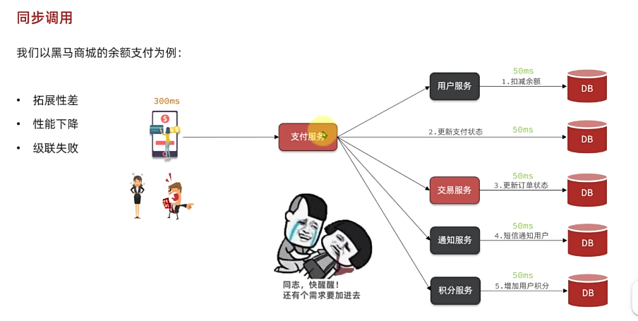


缺点：

* 耦合再一起，造成

* 同步调用，其他逻辑要等上面的完成了才可以执行，性能较差


常见的同步调用

* OpenFeign

优势

* 时效性强，等待到结果后才返回

缺点

* 耦合度高，拓展性差，如果加新功能，原本的代码需要不断修改

* 性能差

* 有级联失效问题

  假设有个微服务阻塞了，调用方也会被阻塞


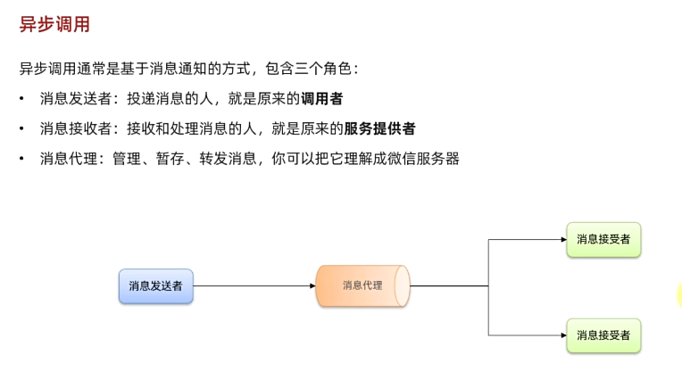

> 类比送外卖
>
> 外卖员送到之后，一直等到你下课过来拿，才能送下一单
>
> 外卖员送到之后，直接放到外卖柜，继续去送下一单，所有人都去外卖柜拿


**支付场景下，我们将非核心业务改成异步调用，如图：**

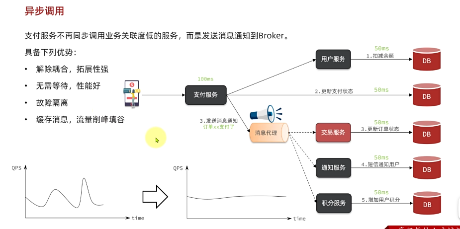

> 拓展性变强，支付服务模块只用发送消息通知到消息代理，就算后期要加其他模块、也不用修改支付服务模块，其他新加的模块直接监听消息代理就行

> 性能变好，支付服务不受其他服务执行时间的影响

> 故障隔离：其他服务宕机，不影响支付服务模块的正常运行

> 缓存消息，流量削峰填谷。全部缓存在消息队列里面，把过多的流量放到后面慢慢执行


* 优势
  * 耦合度低，拓展性强
    后续添加服务(比如短信通知、积分服务)不用修改消息发送者的代码
  * 异步调用，无需等待，性能好
    非核心业务、边缘业务适合异步调用	
  * 故障隔离，下游服务故障不影响上游业务
  * 缓存消息，削峰填谷
* 缺点
  * 不能立即得到调用结果，时效性差
  * 不确定下游业务执行是否成功
  * 业务安全依赖于Broker的可靠性


**常见使用场景**

* 不关心下游业务是否执行成功；下游业务执行失败对上游没什么影响

  > 查询逻辑就不适合，查询必须查到，下游影响大

* 对性能要求较高的场景（发现调用链长，拖慢了整个业务）


## 安装

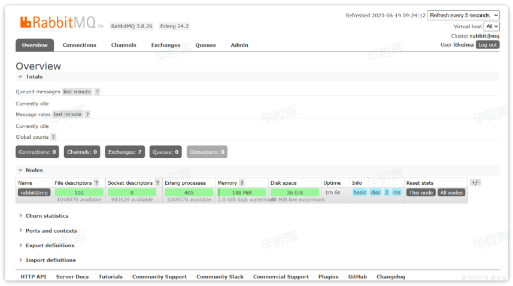


https://ai.feishu.cn/wiki/OQH4weMbcimUSLkIzD6cCpN0nvc

使用3.8的版本


```Shell
docker run \
 -e RABBITMQ_DEFAULT_USER=root \
 -e RABBITMQ_DEFAULT_PASS=1234 \
 -v mq-plugins:/plugins \
 --name mq \
 --hostname mq \
 -p 15672:15672 \
 -p 5672:5672 \
 --network hazenix-net\
 -d \
 rabbitmq:3.8-management
```

运行成功后在 ip:15672访问控制台


## 基本概念

RabbitMQ对应的架构如图：

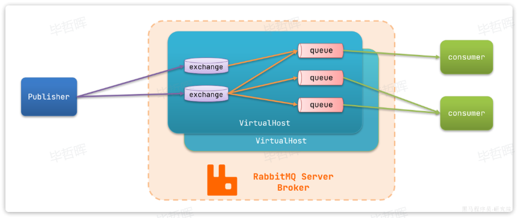

其中包含几个概念：

- **`publisher`**：生产者，也就是发送消息的一方

- **`consumer`**：消费者，也就是消费消息的一方

- **`queue`**：队列，存储消息。生产者投递的消息会暂存在消息队列中，等待消费者处理

- **`exchange`**：交换机，负责<u>消息路由</u>。生产者发送的消息由交换机决定投递到哪个队列。

  > 消息发送者发送给交换机，交换机根据配置好的规则路由给不同的消息队列

- **`virtual host`**：虚拟主机，起到数据隔离的作用。每个虚拟主机相互独立，有各自的exchange、queue

  > 企业中性能很强，一个企业内部可能只需要一套RabbitMQ，此时需要虚拟主机进行不同项目之间的隔离

上述这些东西都可以在RabbitMQ的管理控制台来管理：

#### 控制台的使用


### 

> 我们打开`Queues`选项卡，新建一个队列：
>
> 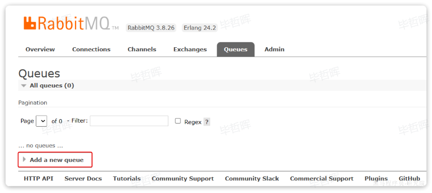
>
> 命名为`hello.queue1`：
>
> 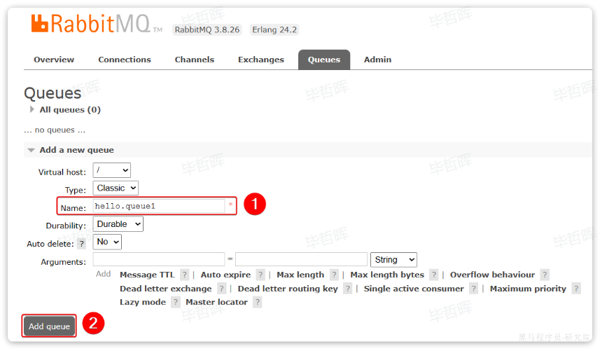
>
> 再以相同的方式，创建一个队列，密码为`hello.queue2`，最终队列列表如下：
>
> 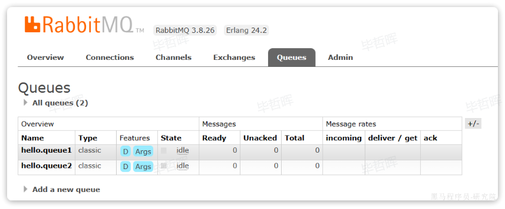
>
> 此时，我们再次向`amq.fanout`交换机发送一条消息。会发现消息依然没有到达队列！！
>
> 怎么回事呢？
>
> 发送到交换机的消息，只会路由到与其绑定的队列，因此仅仅创建队列是不够的，我们还需要将其与交换机绑定。
>
> **绑定关系**
>
> 点击`Exchanges`选项卡，点击`amq.fanout`交换机，进入交换机详情页，然后点击`Bindings`菜单，在表单中填写要绑定的队列名称：
>
> 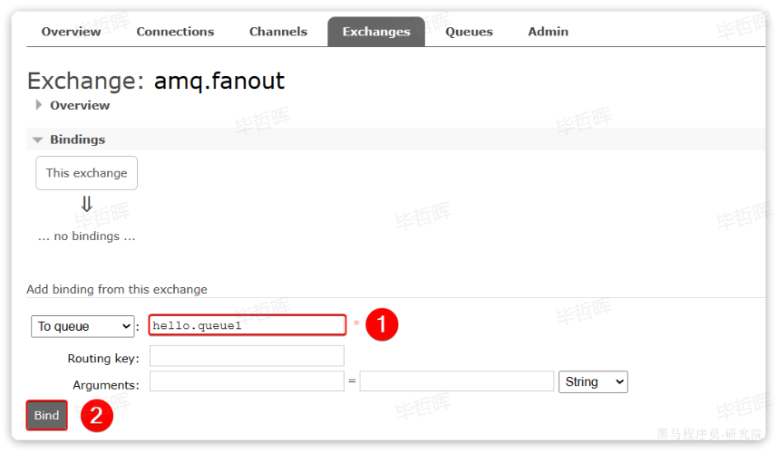
>
> 相同的方式，将hello.queue2也绑定到改交换机。
>
> 最终，绑定结果如下：
>
> 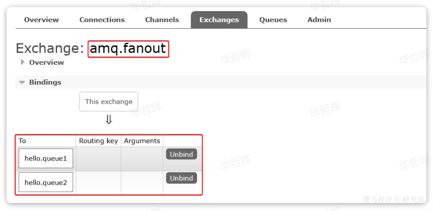
>
> ### 2.2.4.发送消息
>
> 再次回到exchange页面，找到刚刚绑定的`amq.fanout`，点击进入详情页，再次发送一条消息：
>
> 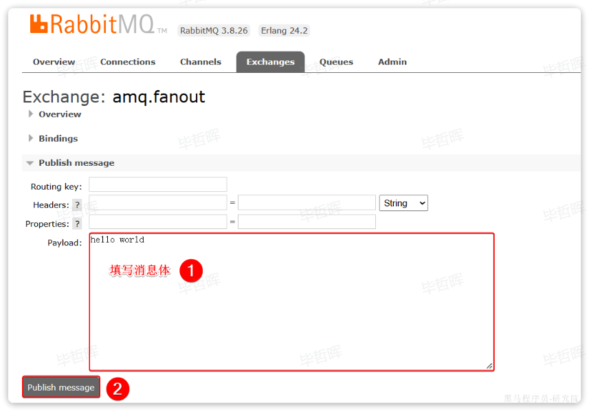
>
> 回到`Queues`页面，可以发现`hello.queue`中已经有一条消息了：
>
> 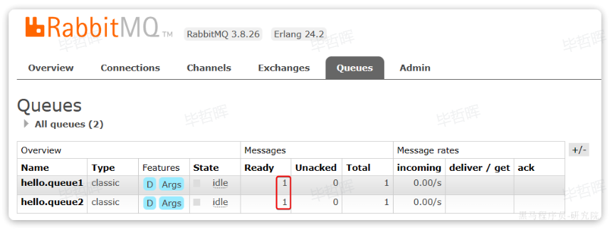
>
> 点击队列名称，进入详情页，查看队列详情，这次我们点击get message：
>
> 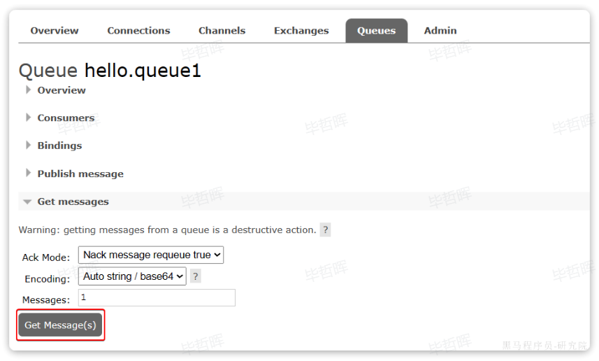
>
> 可以看到消息到达队列了：
>
> 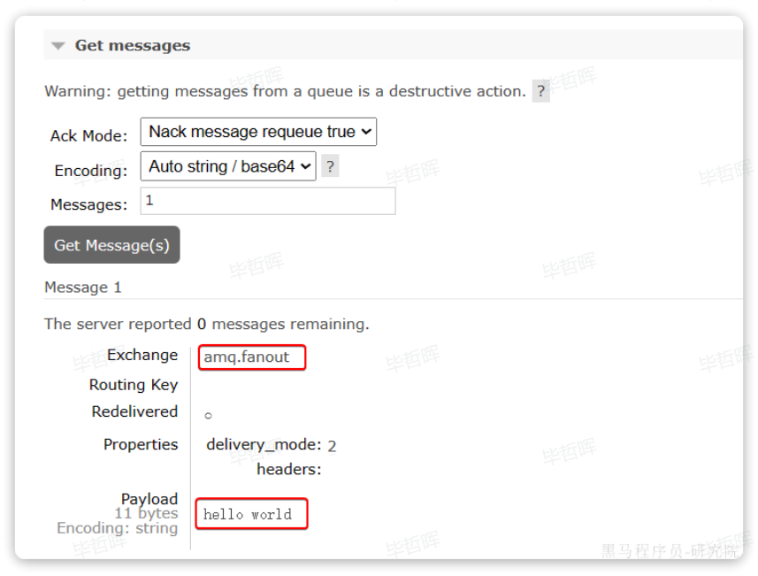
>
> 这个时候如果有消费者监听了MQ的`hello.queue1`或`hello.queue2`队列，自然就能接收到消息了。
>
> 


## 数据隔离

不同用户使用不同虚拟主机，登录之后访问到的是不同虚拟主机

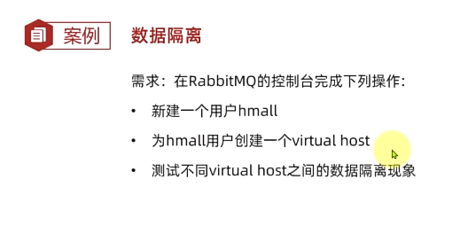


> **用户管理**
>
> 点击`Admin`选项卡，首先会看到RabbitMQ控制台的用户管理界面：
>
> 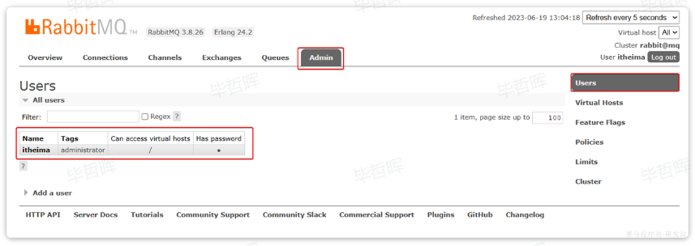
>
> 这里的用户都是RabbitMQ的管理或运维人员。目前只有安装RabbitMQ时添加的`itheima`这个用户。仔细观察用户表格中的字段，如下：
>
> - `Name`：`itheima`，也就是用户名
> - `Tags`：`administrator`，说明`itheima`用户是超级管理员，拥有所有权限
> - `Can access virtual host`： `/`，可以访问的`virtual host`，这里的`/`是默认的`virtual host`
>
> 对于小型企业而言，出于成本考虑，我们通常只会搭建一套MQ集群，公司内的多个不同项目同时使用。这个时候为了避免互相干扰， 我们会利用`virtual host`的隔离特性，将不同项目隔离。一般会做两件事情：
>
> - 给每个项目创建独立的运维账号，将管理权限分离。
> - 给每个项目创建不同的`virtual host`，将每个项目的数据隔离。
>
> 比如，我们给黑马商城创建一个新的用户，命名为`hmall`：
>
> 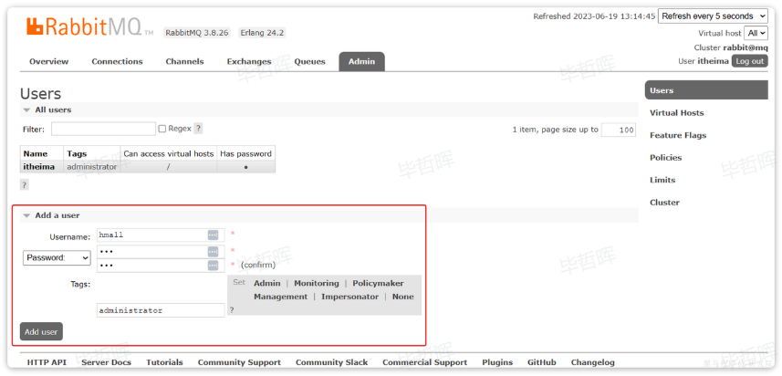
>
> 你会发现此时hmall用户没有任何`virtual host`的访问权限：
>
> 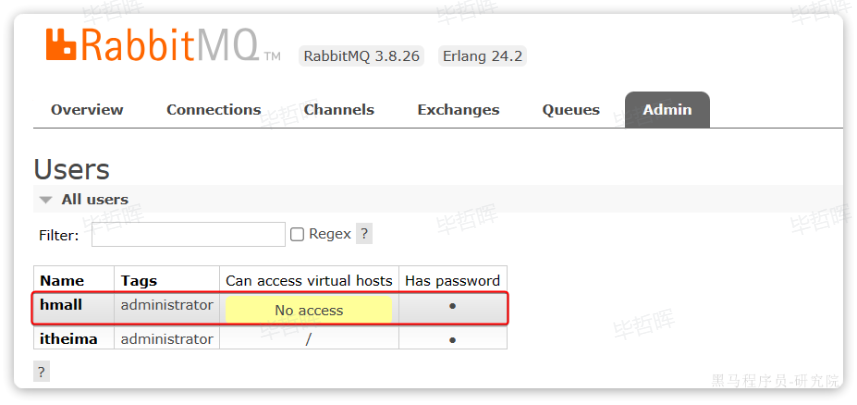
>
> 别急，接下来我们就来授权。
>
> **virtual host**
>
> 我们先退出登录：
>
> 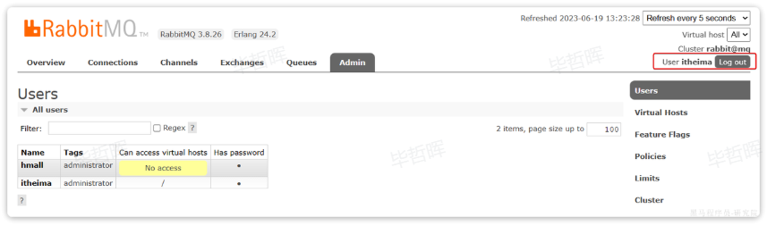
>
> 切换到刚刚创建的hmall用户登录，然后点击`Virtual Hosts`菜单，进入`virtual host`管理页：
>
> 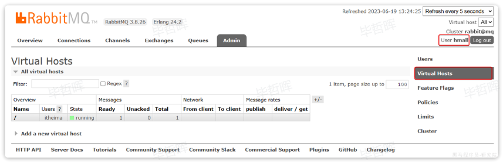
>
> 可以看到目前只有一个默认的`virtual host`，名字为 `/`。
>
>  我们可以给黑马商城项目创建一个单独的`virtual host`，而不是使用默认的`/`。
>
> 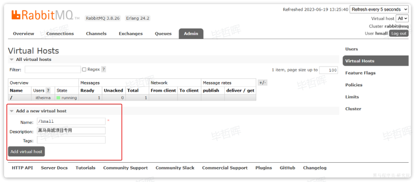
>
> 创建完成后如图：
>
> 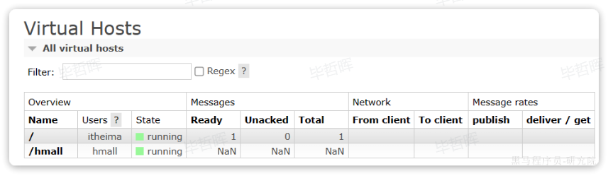
>
> **由于我们是登录`hmall`账户后创建的`virtual host`，因此回到`users`菜单，你会发现当前用户已经具备了对`/hmall`这个`virtual host`的访问权限了**：
>
> 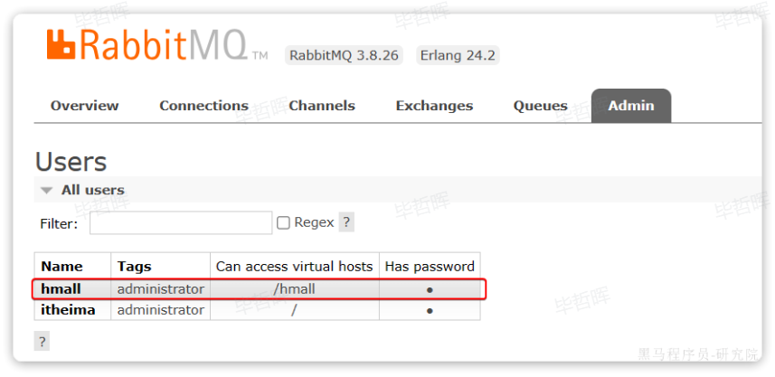
>
> 此时，点击页面右上角的`virtual host`下拉菜单，切换`virtual host`为 `/hmall`：
>
> 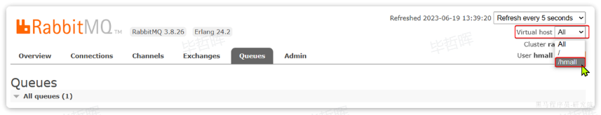
>
> 然后再次查看queues选项卡，会发现之前的队列已经看不到了：
>
> 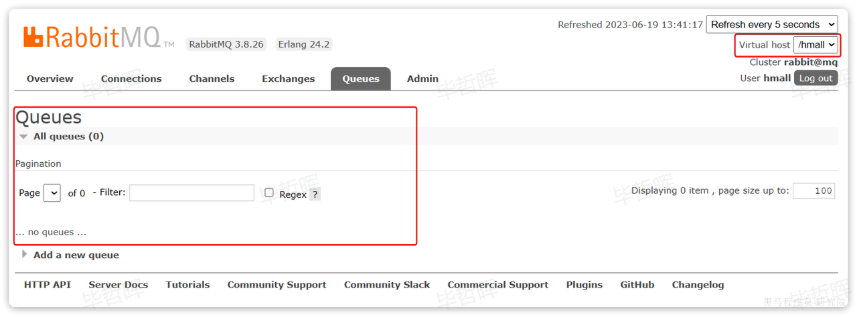
>
> 这就是基于`virtual host `的隔离效果。


## SpringAMQP

> Java客户端
>
> 由于`RabbitMQ`采用了AMQP协议，因此它具备跨语言的特性。任何语言只要遵循AMQP协议收发消息，都可以与`RabbitMQ`交互。并且`RabbitMQ`官方也提供了各种不同语言的客户端。
>
> 但是，RabbitMQ官方提供的Java客户端编码相对复杂，一般生产环境下我们更多会结合Spring来使用。而Spring的官方刚好基于RabbitMQ提供了这样一套消息收发的模板工具：SpringAMQP。并且还基于SpringBoot对其实现了自动装配，使用起来非常方便。


SpringAmqp的官方地址：

https://spring.io/projects/spring-amqp

SpringAMQP提供了三个功能：

- 自动声明队列、交换机及其绑定关系
- 基于注解的监听器模式，异步接收消息
- 封装了RabbitTemplate工具，用于发送消息


#### 快速入门


##### **1.<u>给发送者和消费者引入依赖</u>**

```xml
<!--AMQP依赖，包含RabbitMQ-->
<dependency>
    <groupId>org.springframework.boot</groupId>
    <artifactId>spring-boot-starter-amqp</artifactId>
</dependency>
```

##### **2.<u>配置MQ地址</u>**

**在`publisher`服务的`application.yml`中添加配置：**


```yaml
spring:
  rabbitmq:
    host: 47.100.37.166 # 你的rabbitmq所在主机ip
    port: 5672 # 端口（15672是控制台端口，这里是5672）
    virtual-host: /hmall # 虚拟主机
    username: hmall # 用户名
    password: 1234 # 密码
    connection-timeout: 1s # 设置MQ的连接超时时间（1s没连上就算超时）
    template:
      retry:
        enabled: true # 开启超时重试机制
        initial-interval: 1000ms # 失败后的初始等待时间
        multiplier: 2 # 失败后下次的等待时长倍数，下次等待时长 = initial-interval * multiplier
        max-attempts: 6 # 最大重试次数
```

> ⬆️ 不完善，还有其他配置要补充进去
>
> [发送者重连配置](####所需配置)

> 无注释版
>
> ```yaml
> spring:
>   rabbitmq:
>     host: 47.100.37.166 
>     port: 5672 
>     virtual-host: /eats
>     username: root 
>     password: 1234 
>     connection-timeout: 1s 
>     template:
>       retry:
>         enabled: true 
>         initial-interval: 1000ms 
>         multiplier: 2 
>         max-attempts: 6 
> ```
>
> 


##### 3.配置消息转换器

```java
@Bean
public MessageConverter messageConverter(){
    // 1.定义消息转换器
    Jackson2JsonMessageConverter jackson2JsonMessageConverter = new Jackson2JsonMessageConverter();
    // 2.配置自动创建消息id，用于识别不同消息，也可以在业务中基于ID判断是否是重复消息
    jackson2JsonMessageConverter.setCreateMessageIds(true);// 消息转换器中添加的messageId可以便于将来做幂等性判断
    return jackson2JsonMessageConverter;
}
```


##### 4.**利用`RabbitTemplate`实现消息发送**

```java
@Autowired
private RabbitTemplate rabbitTemplate;

@Test
public void testSimpleQueue() {
    // 队列名称
    String queueName = "simple.queue";
    // 消息
    String message = "hello, spring amqp!";
    // 发送消息
    rabbitTemplate.convertAndSend(queueName, message);
}


@Test
public void testSimpleQueue() {
    // 队列名称
    String queueName = "simple.queue";
    // 消息
    String message = "hello, spring amqp!";
    // 发送消息——交换机;Routing key;消息
    rabbitTemplate.convertAndSend("pay.direct", "pay.success", outTradeNo);

}


```


##### 5.**接收消息(指定监听队列)**

通过注解在方法上声明要监听的队列名称，将来SpringAMQP把消息传递给当前方法

```java
import org.springframework.amqp.rabbit.annotation.RabbitListener;
import org.springframework.stereotype.Component;

@Component
public class SpringRabbitListener {
        // 利用RabbitListener来声明要监听的队列信息
    // 将来一旦监听的队列中有了消息，就会推送给当前服务，调用当前方法，处理消息。
    // 可以看到方法体中接收的就是消息体的内容
    @RabbitListener(bindings = @QueueBinding(
                value = @Queue(value = "trade.pay.success.queue", durable = "true"),
                exchange = @Exchange(value = "pay.direct"),
                key = "pay.success"
            ))
    public void listenSimpleQueueMessage(String msg) throws InterruptedException {
        System.out.println("spring 消费者接收到消息：【" + msg + "】");
    }
}
```

> **交换机默认类型direct**


## work queue模式


Work queues，任务模型。简单来说就是让**多个消费者绑定到一个队列，共同消费队列中的消息**。

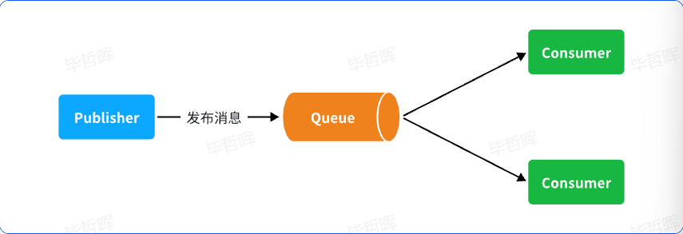

当消息处理比较耗时的时候，可能生产消息的速度会远远大于消息的消费速度。长此以往，消息就会堆积越来越多，无法及时处理。

此时就可以使用work 模型，**多个消费者共同处理消息处理，消息处理的速度就能大大提高**了。


> **但消息是平均分配给每个消费者，并没有考虑到消费者的处理能力**。这 可能导致1个消费者空闲，另一个消费者忙的不可开交。没有充分利用每一个消费者的能力，最终消息处理的耗时远远超过预期时间。这样显然是有问题的。
>
> 修改consumer服务的application.yml文件，==添加配置来解决这个问题==：
>
> ```yaml
> spring:
>   rabbitmq:
>     listener:
>       simple:
>         prefetch: 1 # 每次只能获取一条消息，处理完成才能获取下一个消息(避免消息积压)
> ```
>
> 修改之后速度较快的消费者处理了更多的消息；处理速度较慢的消费者处理了更少消息。充分利用了优秀消费者的处理能力，大大缩短了处理时间。


## 交换机

### Fanout交换机

* 广播，将消息交给所有绑定到交换机的队列


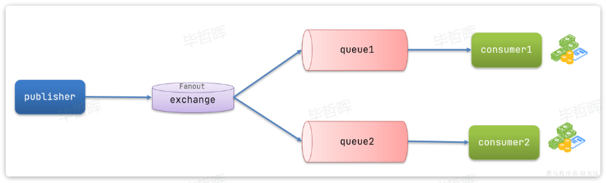

- 1）  可以有多个队列
- 2）  每个队列都要绑定到Exchange（交换机）
- 3）  生产者发送的消息，只能发送到交换机
- 4）  交换机把消息发送给绑定过的所有队列
- 5）  订阅队列的消费者都能拿到消息

每一个微服务创建自己的队列，把消费者绑定到各自的队列（短信服务队列、积分服务队列）上


==**声明队列和交换机**==

> 在控制台创建队列`fanout.queue1`:
>
> 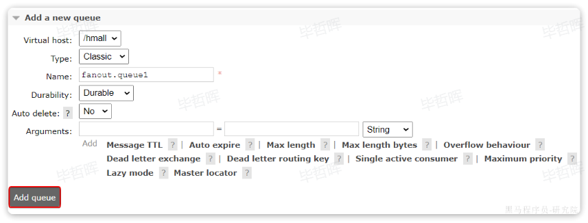再创建一个队列`fanout.queue2`：
>
> 
>
> 然后再创建一个交换机：
>
> 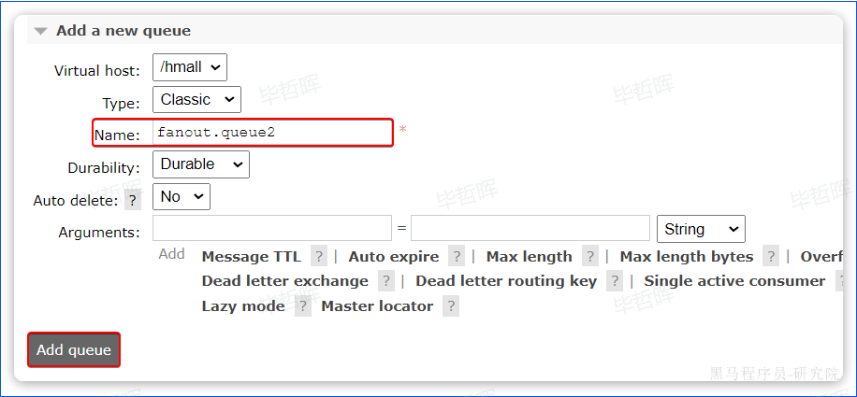
>
> 


**然后绑定两个队列到交换机：**

> 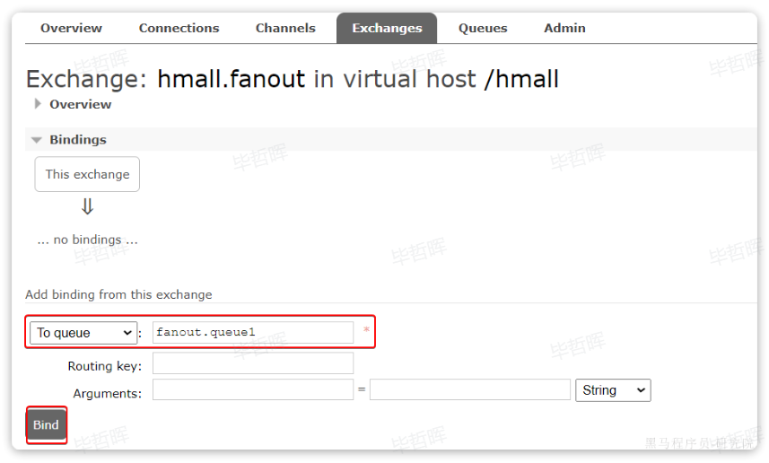
>
> 


**消息发送**

在publisher服务的SpringAmqpTest类中添加测试方法：

```Java
@Test
public void testFanoutExchange() {
    // 交换机名称
    String exchangeName = "hmall.fanout";
    // 消息
    String message = "hello, everyone!";
    rabbitTemplate.convertAndSend(exchangeName, null, message);
}
```

**消息接收**

在consumer服务的SpringRabbitListener类中添加两个方法，作为消费者：

```Java
@RabbitListener(queues = "fanout.queue1")
public void listenFanoutQueue1(String msg) {
    System.out.println("消费者1接收到Fanout消息：【" + msg + "】");
}

@RabbitListener(queues = "fanout.queue2")
public void listenFanoutQueue2(String msg) {
    System.out.println("消费者2接收到Fanout消息：【" + msg + "】");
}
```


### Direct交换机

在Fanout模式中，一条消息，会被所有订阅的队列都消费。但是，在某些场景下，我们希望不同的消息被不同的队列消费。这时就要用到Direct类型的Exchange。

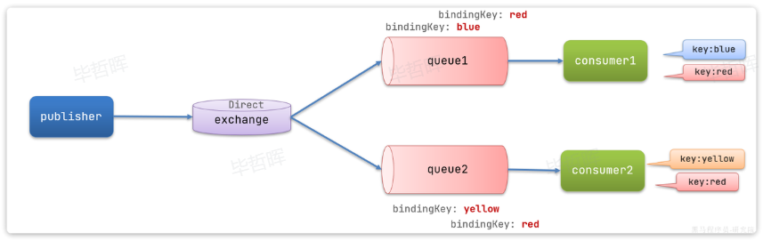

在Direct模型下：

- 队列与交换机的绑定，不能是任意绑定了，而是要指定一个`RoutingKey`（路由key）
- 消息的发送方在 向 Exchange发送消息时，也必须指定消息的 `RoutingKey`。
- Exchange不再把消息交给每一个绑定的队列，而是根据消息的`Routing Key`进行判断，只有队列的`Routingkey`与消息的 `Routing key`完全一致，才会接收到消息


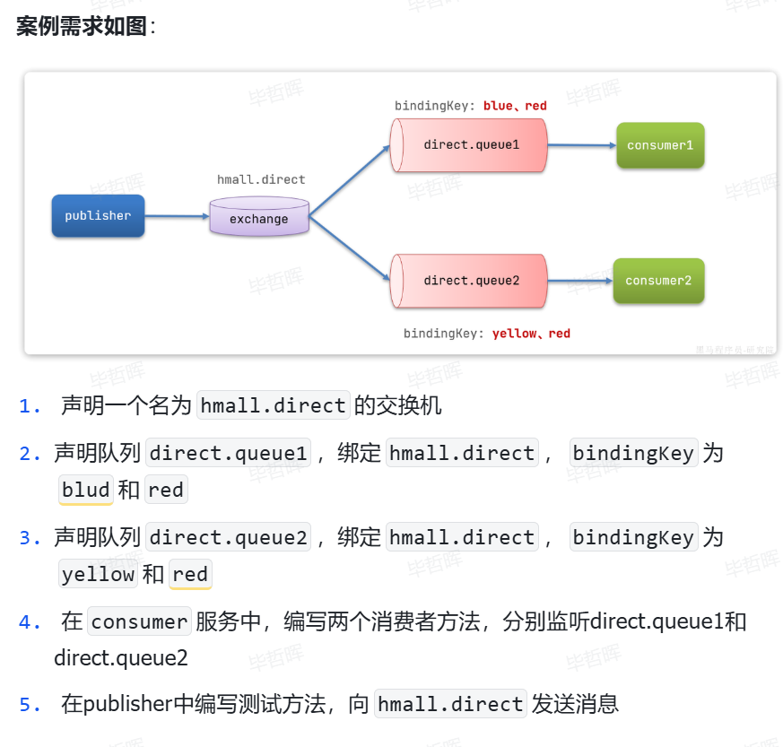


**声明队列和交换机**

> 首先在控制台声明两个队列`direct.queue1`和`direct.queue2`，这里不再展示过程：
>
> 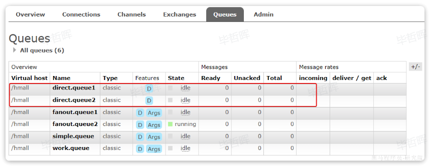
>
> 然后声明一个direct类型的交换机，命名为`hmall.direct`:
>
> 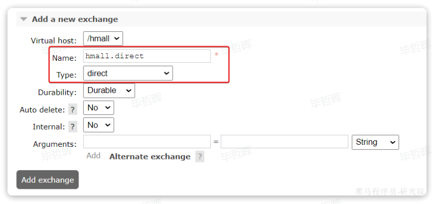
>

然后使用`red`和`blue`作为**Routing key，绑定**`direct.queue1`到`hmall.direct`：

> 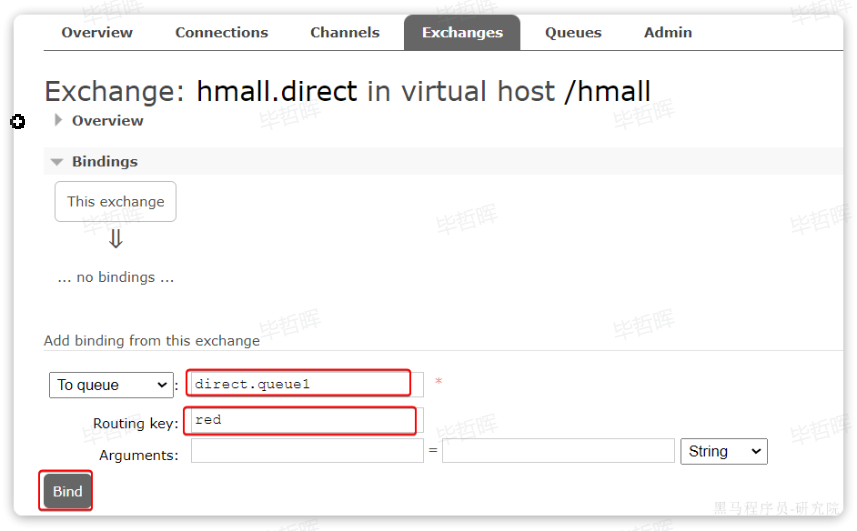
>
> 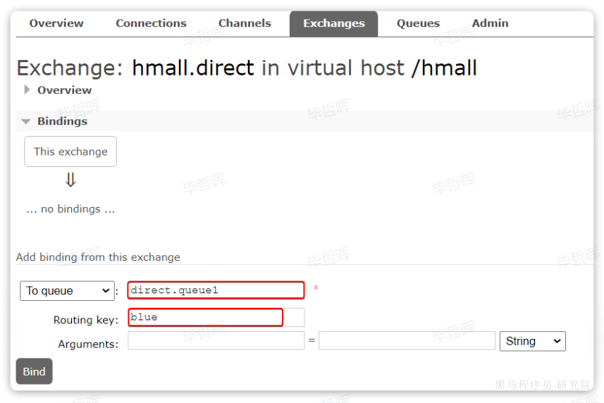

同理，使用`red`和`yellow`作为**Routing key，绑定**`direct.queue2`到`hmall.direct`，步骤略，最终结果：

> 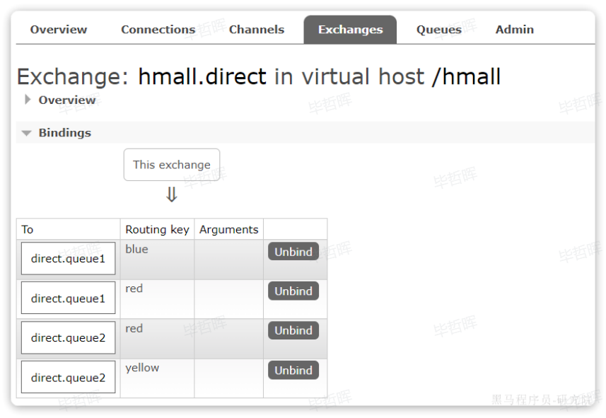
>

**消息接收**

在consumer服务的SpringRabbitListener中添加方法：

```Java
@RabbitListener(queues = "direct.queue1")
public void listenDirectQueue1(String msg) {
    System.out.println("消费者1接收到direct.queue1的消息：【" + msg + "】");
}

@RabbitListener(queues = "direct.queue2")
public void listenDirectQueue2(String msg) {
    System.out.println("消费者2接收到direct.queue2的消息：【" + msg + "】");
}
```

**消息发送**

在publisher服务的SpringAmqpTest类中添加测试方法：

```Java
@Test
public void testSendDirectExchange() {
    // 交换机名称
    String exchangeName = "hmall.direct";
    // 消息
    String message = "红色警报！日本乱排核废水，导致海洋生物变异，惊现哥斯拉！";
    // 发送消息
    rabbitTemplate.convertAndSend(exchangeName, "red", message);
}
```

> 由于使用的red这个key，所以两个消费者都收到了消息：
>
> 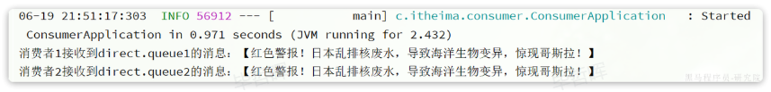
>
> 我们再切换为blue这个key：
>
> ```Java
> @Test
> public void testSendDirectExchange() {
>     // 交换机名称
>     String exchangeName = "hmall.direct";
>     // 消息
>     String message = "最新报道，哥斯拉是居民自治巨型气球，虚惊一场！";
>     // 发送消息
>     rabbitTemplate.convertAndSend(exchangeName, "blue", message);
> }
> ```
>
> 你会发现，只有消费者1收到了消息：
>
> 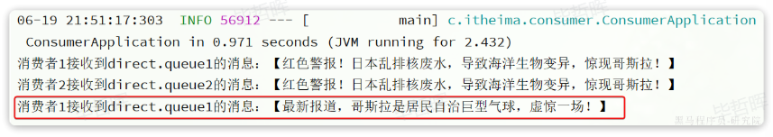
>


描述下Direct交换机与Fanout交换机的差异？

- Fanout交换机将消息路由给每一个与之绑定的队列
- Direct交换机**根据RoutingKey(可以有多个)判断路由给哪个队列**
- 如果多个队列具有相同的RoutingKey，则与Fanout功能类似


### Topic交换机

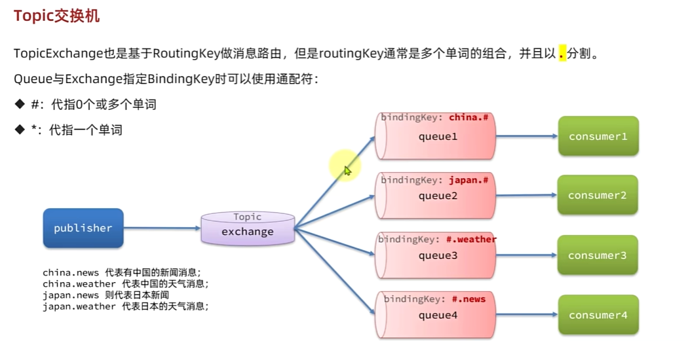

> `#`用的更多


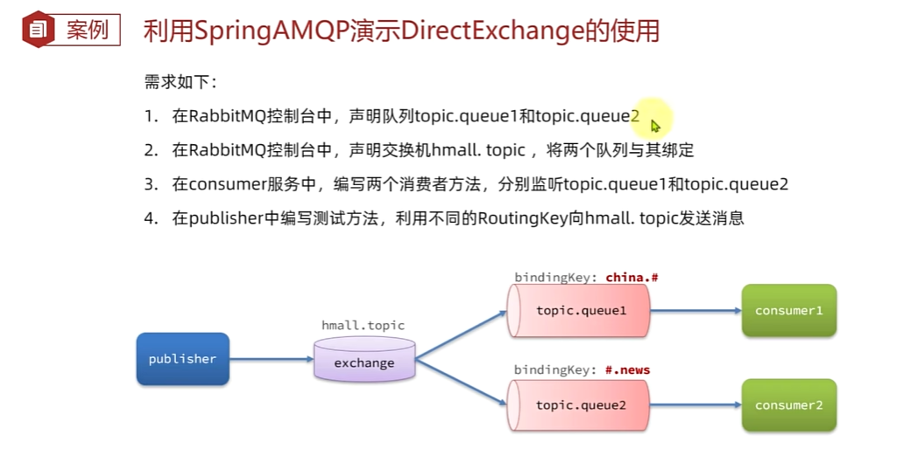


首先，在控制台按照图示例子**创建队列、交换机**，并利**用通配符绑定队列和交换机**。此处步骤略。最终结果如下：

> 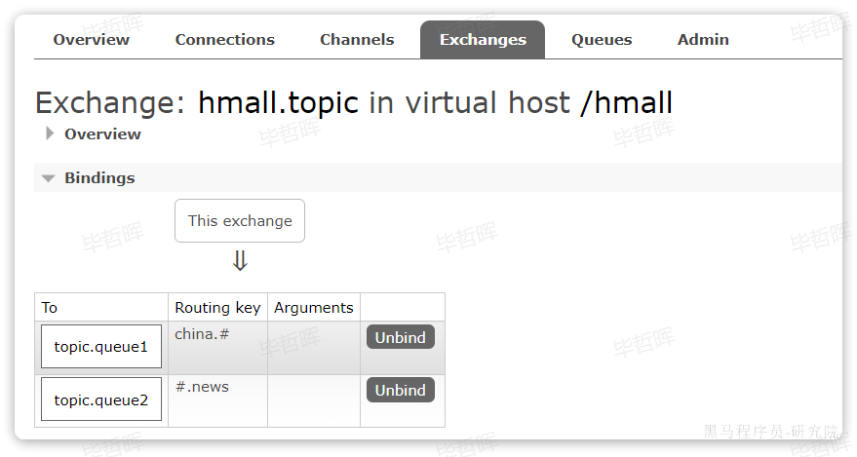
>

**消息发送**

在publisher服务的SpringAmqpTest类中添加测试方法：

```Java
/**
 * topicExchange
 */
@Test
public void testSendTopicExchange() {
    // 交换机名称
    String exchangeName = "hmall.topic";
    // 消息
    String message = "喜报！孙悟空大战哥斯拉，胜!";
    // 发送消息
    rabbitTemplate.convertAndSend(exchangeName, "china.news", message);
}
```

**消息接收**

在consumer服务的SpringRabbitListener中添加方法：

```Java
@RabbitListener(queues = "topic.queue1")
public void listenTopicQueue1(String msg){
    System.out.println("消费者1接收到topic.queue1的消息：【" + msg + "】");
}

@RabbitListener(queues = "topic.queue2")
public void listenTopicQueue2(String msg){
    System.out.println("消费者2接收到topic.queue2的消息：【" + msg + "】");
}
```


### 总结

描述下Direct交换机与Topic交换机的差异？

- Topic交换机接收的消息RoutingKey**必须是多个单词，以 `.` 分割**
- Topic交换机与队列**绑定时的Routing Key可以指定通配符**
  - `#`：代表0个或多个词
  - `*`：代表1个词


## 声明队列和交换机

在之前我们都是基于RabbitMQ控制台来创建队列、交换机。但是在实际开发时，队列和交换机是程序员定义的，将来项目上线，又要交给运维去创建。那么程序员就需要把程序中运行的所有队列和交换机都写下来，交给运维。在这个过程中是很容易出现错误的。

因此<u>**推荐的做法是由程序启动时检查队列和交换机是否存在，如果不存在自动创建**</u>


**基本API**

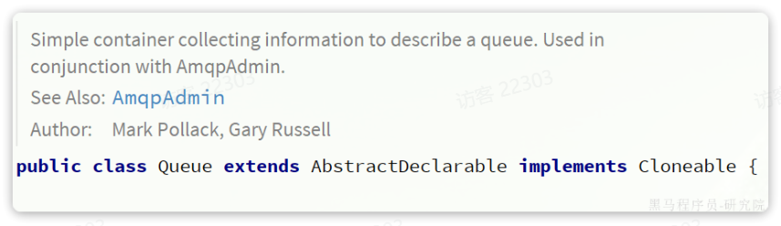

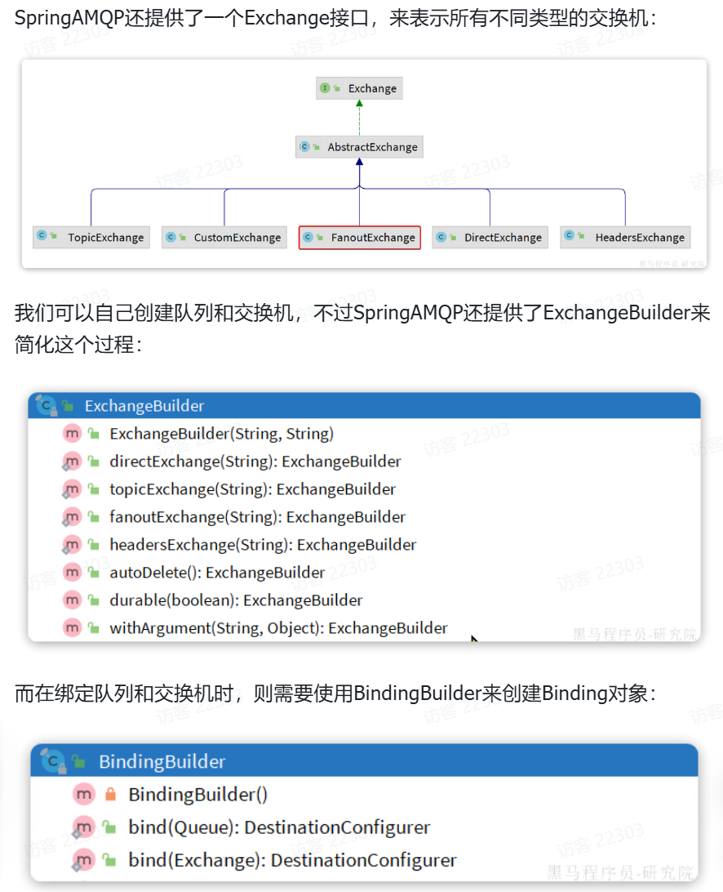


通常在**消费者**那方声明交换机、队列及绑定关系（因为消息发送者只需要发送到交换机）


#### ==基于@Bean声明==

```Java
import org.springframework.amqp.core.Binding;
import org.springframework.amqp.core.BindingBuilder;
import org.springframework.amqp.core.FanoutExchange;
import org.springframework.amqp.core.Queue;
import org.springframework.context.annotation.Bean;
import org.springframework.context.annotation.Configuration;

@Configuration
public class FanoutConfig {
    /**
     * 声明交换机
     * @return Fanout类型交换机
     */
    @Bean
    public FanoutExchange fanoutExchange(){
        return new FanoutExchange("hmall.fanout");
    }

    /**
     * 第1个队列
     */
    @Bean
    public Queue fanoutQueue1(){
        return new Queue("fanout.queue1");
    }

    /**
     * 绑定队列和交换机
     */
    @Bean
    public Binding bindingQueue1(Queue fanoutQueue1, FanoutExchange fanoutExchange){
        return BindingBuilder.bind(fanoutQueue1).to(fanoutExchange);
    }

    /**
     * 第2个队列
     */
    @Bean
    public Queue fanoutQueue2(){
        return new Queue("fanout.queue2");
    }

    /**
     * 绑定队列和交换机
     */
    @Bean
    public Binding bindingQueue2(Queue fanoutQueue2, FanoutExchange fanoutExchange){
        return BindingBuilder.bind(fanoutQueue2).to(fanoutExchange);
    }
}
```

**direct示例**

direct模式由于要绑定多个KEY，会非常麻烦，每一个Key都要编写一个binding：

```Java
package com.itheima.consumer.config;

import org.springframework.amqp.core.*;
import org.springframework.context.annotation.Bean;
import org.springframework.context.annotation.Configuration;

@Configuration
public class DirectConfig {

    /**
     * 声明交换机
     * @return Direct类型交换机
     */
    @Bean
    public DirectExchange directExchange(){
        return ExchangeBuilder.directExchange("hmall.direct").build();
    }

    /**
     * 第1个队列
     */
    @Bean
    public Queue directQueue1(){
        return new Queue("direct.queue1");
    }

    /**
     * 绑定队列和交换机
     */
    @Bean
    public Binding bindingQueue1WithRed(Queue directQueue1, DirectExchange directExchange){
        return BindingBuilder.bind(directQueue1).to(directExchange).with("red");
    }
    /**
     * 绑定队列和交换机
     */
    @Bean
    public Binding bindingQueue1WithBlue(Queue directQueue1, DirectExchange directExchange){
        return BindingBuilder.bind(directQueue1).to(directExchange).with("blue");
    }

    /**
     * 第2个队列
     */
    @Bean
    public Queue directQueue2(){
        return new Queue("direct.queue2");
    }

    /**
     * 绑定队列和交换机
     */
    @Bean
    public Binding bindingQueue2WithRed(Queue directQueue2, DirectExchange directExchange){
        return BindingBuilder.bind(directQueue2).to(directExchange).with("red");//with里面传key
    }
    /**
     * 绑定队列和交换机
     */
    @Bean
    public Binding bindingQueue2WithYellow(Queue directQueue2, DirectExchange directExchange){
        return BindingBuilder.bind(directQueue2).to(directExchange).with("yellow");
    }
}
```

#### ==**基于注解声明**==

基于@Bean的方式声明队列和交换机比较麻烦，Spring还提供了基于`@RabbitListener`注解方式来声明。


例如，我们同样声明Direct模式的交换机和队列：

```Java
@RabbitListener(bindings = @QueueBinding(
    value = @Queue(name = "direct.queue1"),
    exchange = @Exchange(name = "hmall.direct", type = ExchangeTypes.DIRECT),
    key = {"red", "blue"}
))
public void listenDirectQueue1(String msg){
    System.out.println("消费者1接收到direct.queue1的消息：【" + msg + "】");
}

@RabbitListener(bindings = @QueueBinding(
    value = @Queue(name = "direct.queue2"),
    exchange = @Exchange(name = "hmall.direct", type = ExchangeTypes.DIRECT),
    key = {"red", "yellow"}
))
public void listenDirectQueue2(String msg){
    System.out.println("消费者2接收到direct.queue2的消息：【" + msg + "】");
}
```

是不是简单多了。

再试试Topic模式：

```Java
@RabbitListener(bindings = @QueueBinding(
    value = @Queue(name = "topic.queue1"),
    exchange = @Exchange(name = "hmall.topic", type = ExchangeTypes.TOPIC),
    key = "china.#"
))
public void listenTopicQueue1(String msg){
    System.out.println("消费者1接收到topic.queue1的消息：【" + msg + "】");
}

@RabbitListener(bindings = @QueueBinding(
    value = @Queue(name = "topic.queue2"),
    exchange = @Exchange(name = "hmall.topic", type = ExchangeTypes.TOPIC),
    key = "#.news"
))
public void listenTopicQueue2(String msg){
    System.out.println("消费者2接收到topic.queue2的消息：【" + msg + "】");
}
```


## MQ消息转换器

Spring的消息发送代码接收的消息体是一个Object：

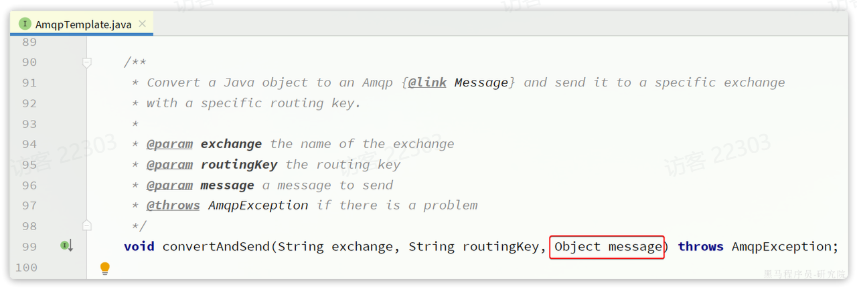

而在**数据传输时，它会把你发送的消息<u>序列化为字节</u>发送给MQ，接收消息的时候，还会把<u>字节反序列化为Java对象</u>。**

<u>默认情况下Spring采用的序列化方式是JDK序列化</u>。众所周知，**JDK序列化存在下列问题：**

- **数据体积过大**
- **有安全漏洞**
- **可读性差**


我们来测试一下。

#### 测试默认转换器

> 1）创建测试队列
>
> 首先，我们在consumer服务中声明一个新的配置类：
>
> 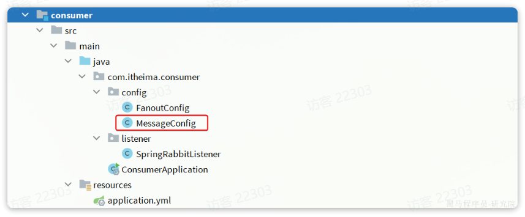
>
> 利用@Bean的方式创建一个队列，
>
> 具体代码：
>
> ```Java
> package com.itheima.consumer.config;
> 
> import org.springframework.amqp.core.Queue;
> import org.springframework.context.annotation.Bean;
> import org.springframework.context.annotation.Configuration;
> 
> @Configuration
> public class MessageConfig {
> 
>     @Bean
>     public Queue objectQueue() {
>         return new Queue("object.queue");
>     }
> }
> ```
>
> 注意，这里我们先不要给这个队列添加消费者，我们要查看消息体的格式。
>
> 重启consumer服务以后，该队列就会被自动创建出来了：
>
> 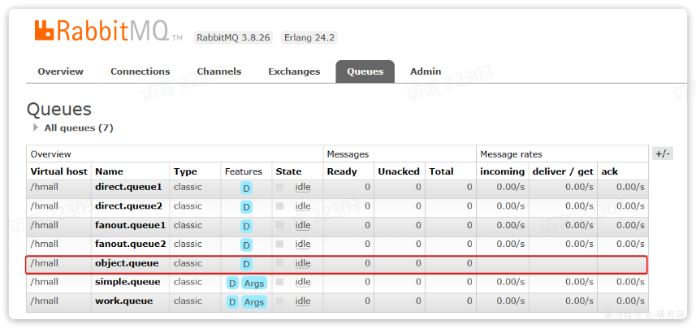
>
> 2）发送消息
>
> 我们在publisher模块的SpringAmqpTest中新增一个消息发送的代码，发送一个Map对象：
>
> ```Java
> @Test
> public void testSendMap() throws InterruptedException {
>     // 准备消息
>     Map<String,Object> msg = new HashMap<>();
>     msg.put("name", "柳岩");
>     msg.put("age", 21);
>     // 发送消息
>     rabbitTemplate.convertAndSend("object.queue", msg);
> }
> ```
>
> 发送消息后查看控制台：
>
> 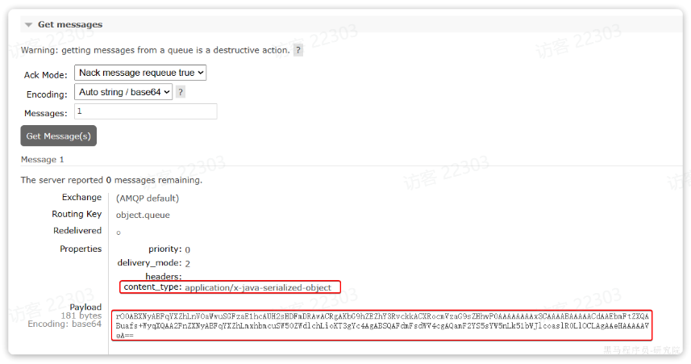
>
> 可以看到消息格式非常不友好。
>

#### 【配置JSON转换器】

显然，JDK序列化方式并不合适。我们希望消息体的**体积更小、可读性更高**，**因此可以使用JSON方式来做序列化和反序列化。**

在`publisher`和`consumer`两个服务中都**引入依赖：**

```XML
<!--jackson依赖-->
<dependency>
    <groupId>com.fasterxml.jackson.dataformat</groupId>
    <artifactId>jackson-dataformat-xml</artifactId>
    <version>2.9.10</version>
</dependency>
```

**注意，如果项目中引入了`spring-boot-starter-web`依赖，则无需再次引入`Jackson`依赖。**


**配置消息转换器**，在`publisher`和`consumer`两个服务的启动类中<u>添加一个Bean</u>即可：

```Java


@Bean
public MessageConverter messageConverter(){
    // 1.定义消息转换器
    Jackson2JsonMessageConverter jackson2JsonMessageConverter = new Jackson2JsonMessageConverter();
    // 2.配置自动创建消息id，用于识别不同消息，也可以在业务中基于ID判断是否是重复消息
    jackson2JsonMessageConverter.setCreateMessageIds(true);// 消息转换器中添加的messageId可以便于将来做幂等性判断
    return jackson2JsonMessageConverter;
}
```

。


> 此时，我们到MQ控制台**删除**`object.queue`中的旧的消息。然后再次执行刚才的消息发送的代码，到MQ的控制台查看消息结构：
>
> 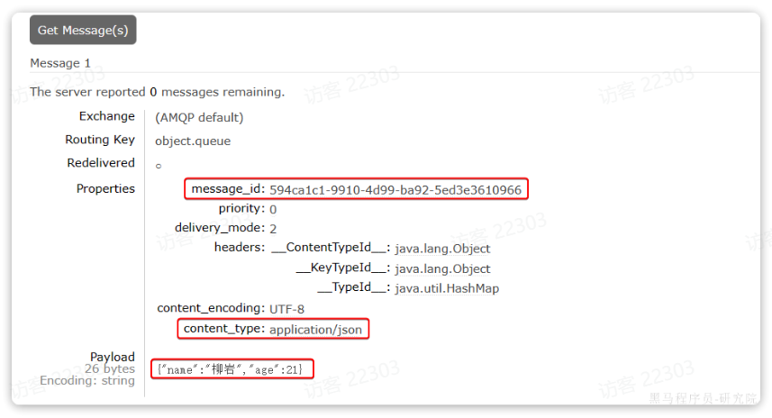
>


#### 消费者接收Object

我们在consumer服务中定义一个新的消费者，publisher是用Map发送，那么消费者也一定要用Map接收，格式如下：

```Java
@RabbitListener(queues = "object.queue")
public void listenSimpleQueueMessage(Map<String, Object> msg) throws InterruptedException {
    System.out.println("消费者接收到object.queue消息：【" + msg + "】");
}
```


## 业务改造

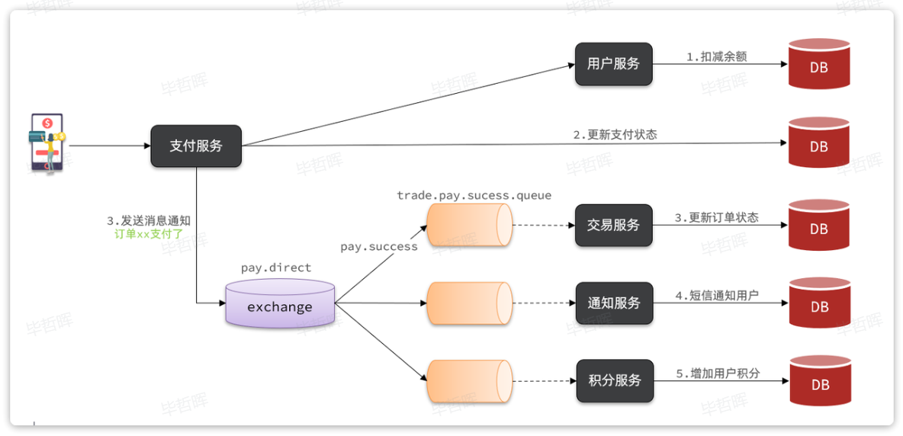

支付成功，有必要向三个微服务发布通知，支付失败，只需要掉员工交易微服务，所以使用direct/topic


 

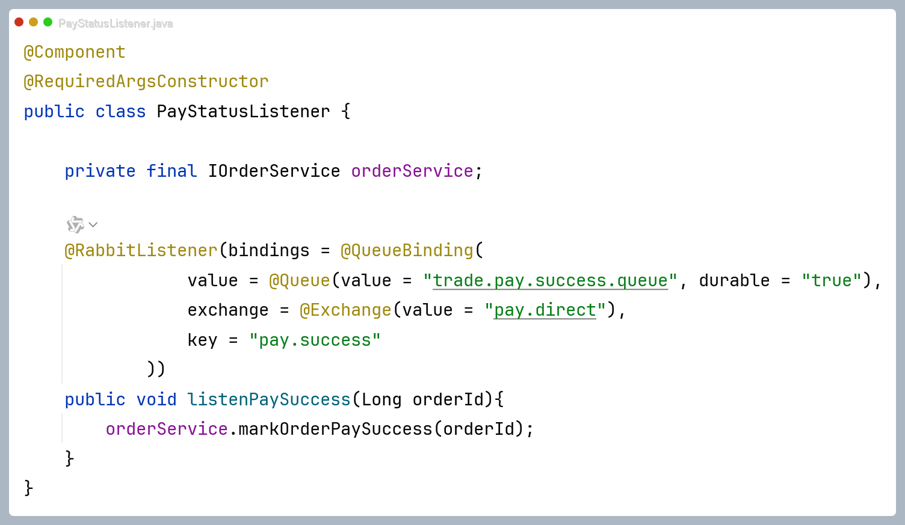

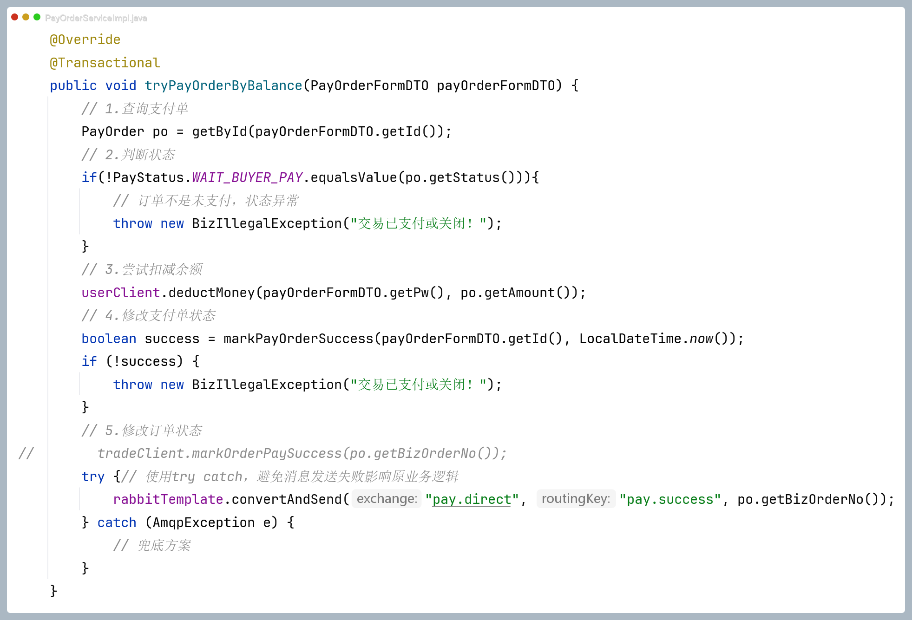

​		


## 发布订阅模式


## 消息堆积问题处理


# 高级篇


==消息丢失的可能性有哪些==

消息从发送者发送消息，到消费者处理消息，需要经过的流程是这样的：

暂时无法在飞书文档外展示此内容

消息从生产者到消费者的每一步都可能导致消息丢失：

- 发送消息时丢失：
  - 生产者发送消息时连接MQ失败
  - 生产者发送消息到达MQ后未找到`Exchange`
  - 生产者发送消息到达MQ的`Exchange`后，未找到合适的`Queue`
  - 消息到达MQ后，处理消息的进程发生异常
- MQ导致消息丢失：
  - 消息到达MQ，保存到队列后，尚未消费就突然宕机
- 消费者处理消息时：
  - 消息接收后尚未处理突然宕机
  - 消息接收后处理过程中抛出异常


要解决消息丢失问题，保证MQ的可靠性，就必须从3个方面入手：

- 确保生产者一定把消息发送到MQ
- 确保MQ不会将消息弄丢
- 确保消费者一定要处理消息

## 发送者可靠性

### 发送者/生产者重连机制

> 在网络不稳定、中断或服务不可用时，自动尝试重新建立连接的机制
>
> 生产者发送消息时，可能出现网络故障，导致与MQ的连接中断。

> ==几乎标配，推荐使用==


**SpringAMQP提供的消息发送时的重试机制**能解决这个问题——当`RabbitTemplate`与MQ连接超时后，多次重试。

#### 所需配置

修改`publisher`模块的`application.yaml`文件，添加下面的内容：

```YAML
spring:
  rabbitmq:
    connection-timeout: 1s # 设置MQ的连接超时时间（1s没连上就算超时）
    template:
      retry:
        enabled: true # 开启超时重试机制
        initial-interval: 1000ms # 失败后的初始等待时间
        multiplier: 1 # 失败后下次的等待时长倍数，下次等待时长 = initial-interval * multiplier
        max-attempts: 3 # 最大重试次数
```

**注意**：当网络不稳定的时候，利用重试机制可以有效提高消息发送的成功率。不过SpringAMQP提供的重试机制是**阻塞式**的重试，也就是说多次重试等待的过程中，当前线程是被阻塞的。

**如果对于业务性能有要求，建议禁用重试机制**。如果一定要使用，请**合理配置等待时长和重试次数，当然也可以考虑使用==异步线程来执行发送消息的代码==。**

> 超时等待时间的合理数值：500ms-3s（取决于网络质量）
>
> 重试次数的合理数值：3-10次（关键业务8-15，普通业务3-5次，非关键业务1-3次）
> 建议配置死信队列(DLX)，当达到最大重试次数后将消息转移到死信队列，避免无限重试
>
> 重试间隔的合理数值：
>
> - **推荐策略**: 指数退避算法(Exponential Backoff)
> - **初始间隔**: 100ms-1秒
> - **增长策略**: 每次重试间隔按倍数增长(如2倍)
> - **最大间隔**: 30秒-5分钟
> - **示例序列**: 1s → 2s → 4s → 8s → 16s → 30s(上限)


### 发送者确认机制

> **推荐使用**  异步+失败重连机制
>
> 一般情况下，**只要生产者与MQ之间的网路连接顺畅**，基本不会出现发送消息丢失的情况，因此大多数情况下我们无需考虑这种问题。
> “发送者确认机制”由于需要和MQ进行通信和确认 会大大影响消息通信效率，通常情况下不建议开启(大多数情况下出现异常概率极低，所以一般不开启)，
>
> 而这类关键业务场景下，一般同步处理 而不是异步处理 也一般用不着两种机制都上


不过，在很少数情况下，也会出现消息发送到MQ之后丢失的现象，比如：

- MQ内部处理消息的进程发生了异常
- 生产者发送消息到达MQ后未找到`Exchange`
- 生产者发送消息到达MQ的`Exchange`后，未找到合适的`Queue`，因此无法路由

针对上述情况，RabbitMQ提供了生产者消息确认机制，包括`Publisher Confirm`和`Publisher Return`两种。在开启确认机制的情况下，当生产者发送消息给MQ后，MQ会根据消息处理的情况返回不同的**回执**。


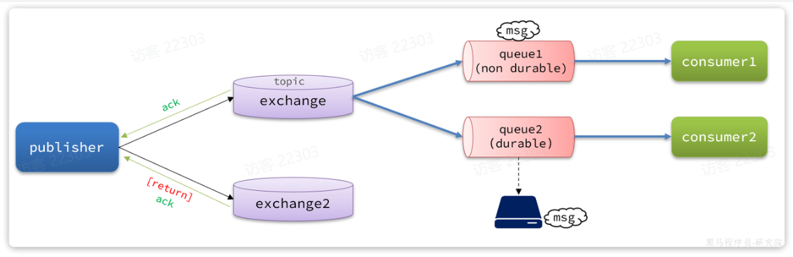

- 当消息投递到MQ，但是路由失败时，通过**Publisher Return**返回异常信息，同时返回ack的确认信息，代表投递成功

- **临时消息**投递到了MQ，并且入队成功，返回ACK，告知投递成功

- **持久消息**投递到了MQ，并且入队完成持久化，返回ACK ，告知投递成功

- 其它情况都会返回NACK，告知投递失败

  > 需要重发消息


#### 1.所需配置

在publisher模块的`application.yaml`中添加配置：

```YAML
spring:
  rabbitmq:
    publisher-confirm-type: correlated # 开启publisher confirm机制，并设置confirm类型
    publisher-returns: true # 开启publisher return机制
```

这里`publisher-confirm-type`有三种模式可选：

- `none`：关闭confirm机制
- `simple`：同步阻塞等待MQ的回执
- `correlated`：MQ异步回调返回回执

一般我们推荐使用`correlated`，回调机制。

> `ack`和`nack`属于**Publisher Confirm**机制，`ack`是投递成功；`nack`是投递失败。而`return`则属于**Publisher Return**机制。
>
> 默认两种机制都是关闭状态，需要通过配置文件来开启。


#### 2.定义ReturnCallback

每个`RabbitTemplate`只能配置一个`ReturnCallback`，因此我们可以在配置类中统一设置。我们在publisher模块定义一个配置类：

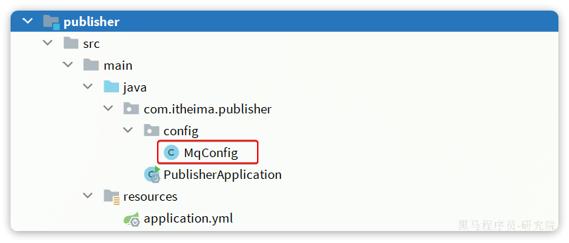

内容如下：

```Java
package com.itheima.publisher.config;

import lombok.AllArgsConstructor;
import lombok.extern.slf4j.Slf4j;
import org.springframework.amqp.core.ReturnedMessage;
import org.springframework.amqp.rabbit.core.RabbitTemplate;
import org.springframework.context.annotation.Configuration;

import javax.annotation.PostConstruct;

@Slf4j
@AllArgsConstructor
@Configuration
public class MqConfig {
    private final RabbitTemplate rabbitTemplate;

    @PostConstruct
    public void init(){
        rabbitTemplate.setReturnsCallback(new RabbitTemplate.ReturnsCallback() {
            @Override
            public void returnedMessage(ReturnedMessage returned) {
                log.error("触发return callback,");
                log.debug("exchange: {}", returned.getExchange());
                log.debug("routingKey: {}", returned.getRoutingKey());
                log.debug("message: {}", returned.getMessage());
                log.debug("replyCode: {}", returned.getReplyCode());
                log.debug("replyText: {}", returned.getReplyText());
            }
        });
    }
}
```


#### 3.定义ConfirmCallback

由于**每个消息发送时的处理逻辑不一定相同**，因此**ConfirmCallback需要在每次发消息时定义**。具体来说，是在调用RabbitTemplate中的convertAndSend方法时，多传递一个参数：

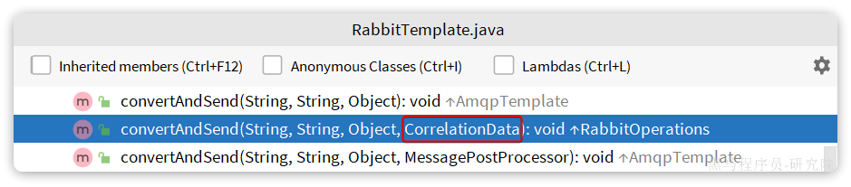

这里的CorrelationData中包含两个核心的东西：

- `id`：消息的唯一标示，MQ对不同的消息的回执以此做判断，避免混淆
- `SettableListenableFuture`：回执结果的Future对象

将来MQ的回执就会通过这个`Future`来返回，我们可以提前给`CorrelationData`中的`Future`添加回调函数来处理消息回执：

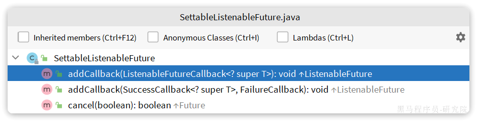

我们新建一个测试，向系统自带的交换机发送消息，并且添加`ConfirmCallback`：

```Java
@Test
void testPublisherConfirm() {
    // 1.创建CorrelationData
    CorrelationData cd = new CorrelationData();
    // 2.给Future添加ConfirmCallback
    cd.getFuture().addCallback(new ListenableFutureCallback<CorrelationData.Confirm>() {
        @Override
        public void onFailure(Throwable ex) {
            // 2.1.Future发生异常时的处理逻辑，基本不会触发
            log.error("send message fail", ex);
        }
        @Override
        public void onSuccess(CorrelationData.Confirm result) {
            // 2.2.Future接收到回执的处理逻辑，参数中的result就是回执内容
            if(result.isAck()){ // result.isAck()，boolean类型，true代表ack回执，false 代表 nack回执
                log.debug("发送消息成功，收到 ack!");
            }else{ // result.getReason()，String类型，返回nack时的异常描述
                log.error("发送消息失败，收到 nack, reason : {}", result.getReason());
            }
        }
    });
    // 3.发送消息
    rabbitTemplate.convertAndSend("hmall.direct", "q", "hello", cd);
}
```

执行结果如下：

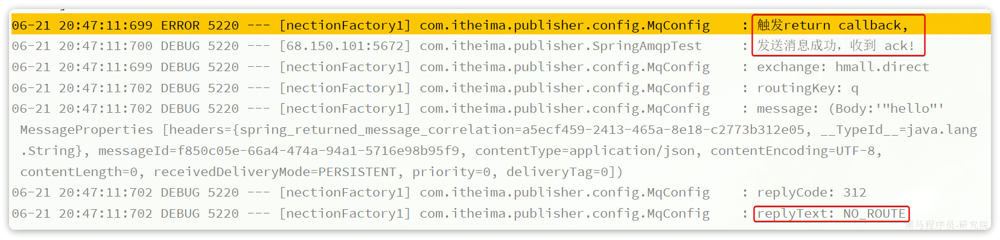

可以看到，由于传递的`RoutingKey`是错误的，路由失败后，触发了`return callback`，同时也收到了ack。

当我们修改为正确的`RoutingKey`以后，就不会触发`return callback`了，只收到ack。

而如果连交换机都是错误的，则只会收到nack。


**注意**：

开启生产者确认比较消耗MQ性能，一般不建议开启。而且大家思考一下触发确认的几种情况：

- 路由失败：一般是因为RoutingKey错误导致，往往是编程导致
- 交换机名称错误：同样是编程错误导致
- MQ内部故障：这种需要处理，但概率往往较低。因此只有对消息可靠性要求非常高的业务才需要开启，而且仅仅需要开启ConfirmCallback处理nack就可以了。


## MQ可靠性


### MQ持久化

> **默认情况Spring AMQP 交换机、队列、消息都是持久化的，不需要动**

消息到达MQ以后，如果MQ不能及时保存，也会导致消息丢失，所以MQ的可靠性也非常重要。


为了提升性能，默认情况下MQ的数据都是在内存存储的临时数据，重启后就会消失。为了保证数据的可靠性，必须配置数据持久化，包括：

- 交换机持久化
- 队列持久化
- 消息持久化

我们以控制台界面为例来说明。

#### 交换机持久化

在控制台的`Exchanges`页面，添加交换机时可以配置交换机的`Durability`参数：

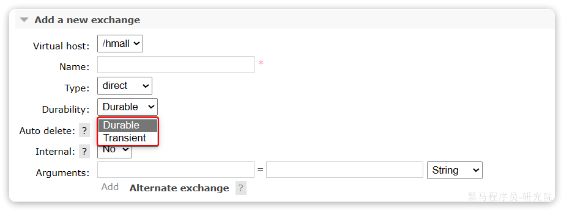

设置为`Durable`就是持久化模式，`Transient`就是临时模式。


#### 队列持久化

在控制台的Queues页面，添加队列时，同样可以配置队列的`Durability`参数：

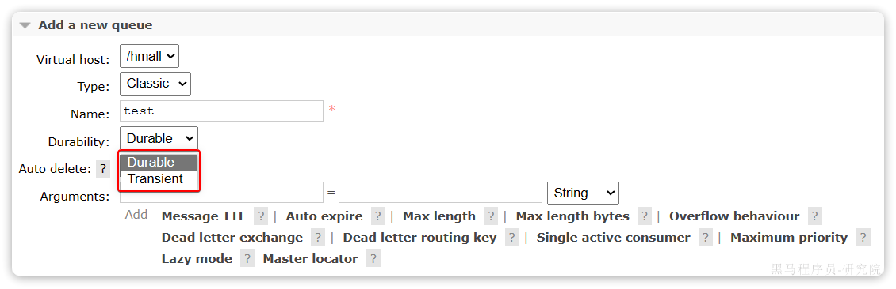

除了持久化以外，你可以看到队列还有很多其它参数，有一些我们会在后期学习。


#### 消息持久化

> 避免mq宕机导致数据丢失，避免mq  因为消息堆积、PageOut(写入到磁盘)导致阻塞
> 
>
> 在默认情况下，RabbitMQ会将接收到的信息保存在内存中以降低消息收发的延迟。但在某些特殊情况下，这会导致消息积压，比如：
>
> - 消费者宕机或出现网络故障
> - 消息发送量激增，超过了消费者处理速度
> - 消费者处理业务发生阻塞
>
> 一旦出现消息堆积问题，RabbitMQ的内存占用就会越来越高，直到触发内存预警上限。此时RabbitMQ会将内存消息刷到磁盘上，这个行为成为`PageOut`. `PageOut`会耗费一段时间，并且会阻塞队列进程。因此在这个过程中RabbitMQ不会再处理新的消息，生产者的所有请求都会被阻塞。

在控制台发送消息的时候，可以添加很多参数，而消息的持久化是要配置一个`properties`：

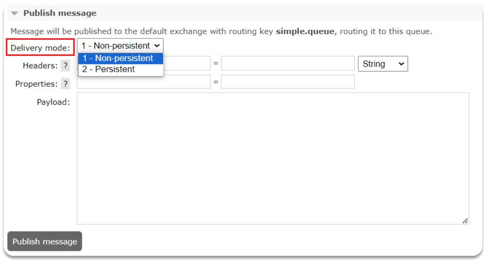

> **说明**：在开启持久化机制以后，如果同时还开启了生产者确认，那么MQ会在消息持久化以后才发送ACK回执，进一步确保消息的可靠性。

不过**出于性能考虑，为了减少IO次数**， **<u>发送到MQ的消息并不是逐条持久化到数据库的，而是每隔一段时间批量持久化</u>**。一般间隔在100毫秒左右，这就会导致ACK有一定的延迟，因此建议生产者确认全部采用异步方式。


### LazyQueue

> 惰性队列
>
> * 并发能力更强 


“MQ消息堆积会引发PageOut，阻塞进程”，为了解决这个问题，从RabbitMQ的3.6.0版本开始，就增加了Lazy Queues的模式，也就是惰性队列。惰性队列的特征如下：

- **接收到消息后直接存入磁盘而非内存**
- 消费者要消费消息时才会从磁盘中读取并加载到内存（也就是**懒加载**）
- <u>支持数百万条的消息存储</u>

而**在3.12.0版本之后，LazyQueue已经成为所有队列的默认格式**。因此官方推荐升级MQ为3.12版本或者所有队列都设置为LazyQueue模式。


> #### 控制台配置Lazy模式
>
> 在添加队列的时候，添加`x-queue-mod=lazy`参数即可设置队列为Lazy模式：
>
> 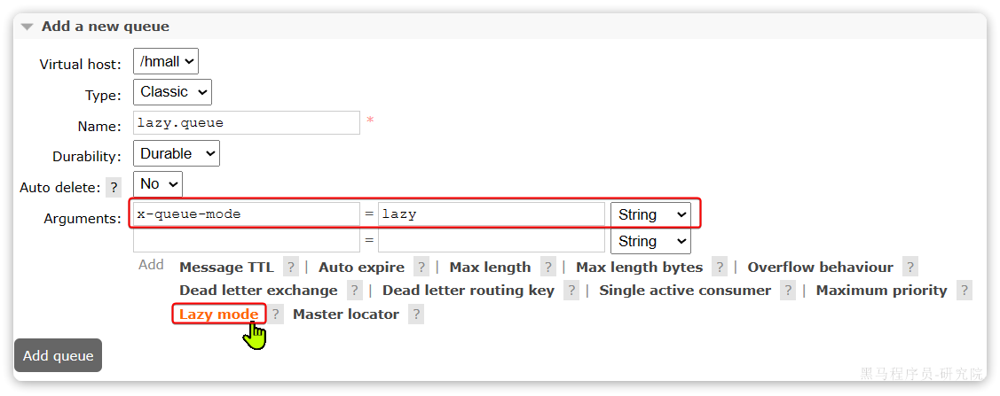
>
> 


> #### 代码配置Lazy模式
>
> 在利用SpringAMQP声明队列的时候，添加`x-queue-mod=lazy`参数也可设置队列为Lazy模式：
>
> ```Java
> @Bean
> public Queue lazyQueue(){
>     return QueueBuilder
>             .durable("lazy.queue")
>             .lazy() // 开启Lazy模式
>             .build();
> }
> ```
>
> 这里是通过`QueueBuilder`的`lazy()`函数配置Lazy模式，底层源码如下：
>
> 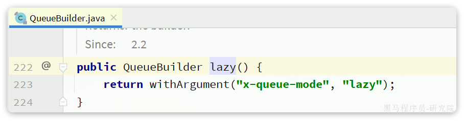
>
> 当然，我们也可以基于注解来声明队列并设置为Lazy模式：
>
> ```Java
> @RabbitListener(queuesToDeclare = @Queue(
>         name = "lazy.queue",
>         durable = "true",
>         arguments = @Argument(name = "x-queue-mode", value = "lazy")
> ))
> public void listenLazyQueue(String msg){
>     log.info("接收到 lazy.queue的消息：{}", msg);
> }
> ```


> #### 更新已有队列为lazy模式
>
> 对于已经存在的队列，也可以配置为lazy模式，但是要通过设置policy实现。
>
> 可以基于命令行设置policy：
>
> ```Shell
> rabbitmqctl set_policy Lazy "^lazy-queue$" '{"queue-mode":"lazy"}' --apply-to queues  
> ```
>
> 命令解读：
>
> - `rabbitmqctl` ：RabbitMQ的命令行工具
> - `set_policy` ：添加一个策略
> - `Lazy` ：策略名称，可以自定义
> - `"^lazy-queue$"` ：用正则表达式匹配队列的名字
> - `'{"queue-mode":"lazy"}'` ：设置队列模式为lazy模式
> - `--apply-to queues`：策略的作用对象，是所有的队列
>
> 当然，也可以在控制台配置policy，进入在控制台的`Admin`页面，点击`Policies`，即可添加配置：
>
> 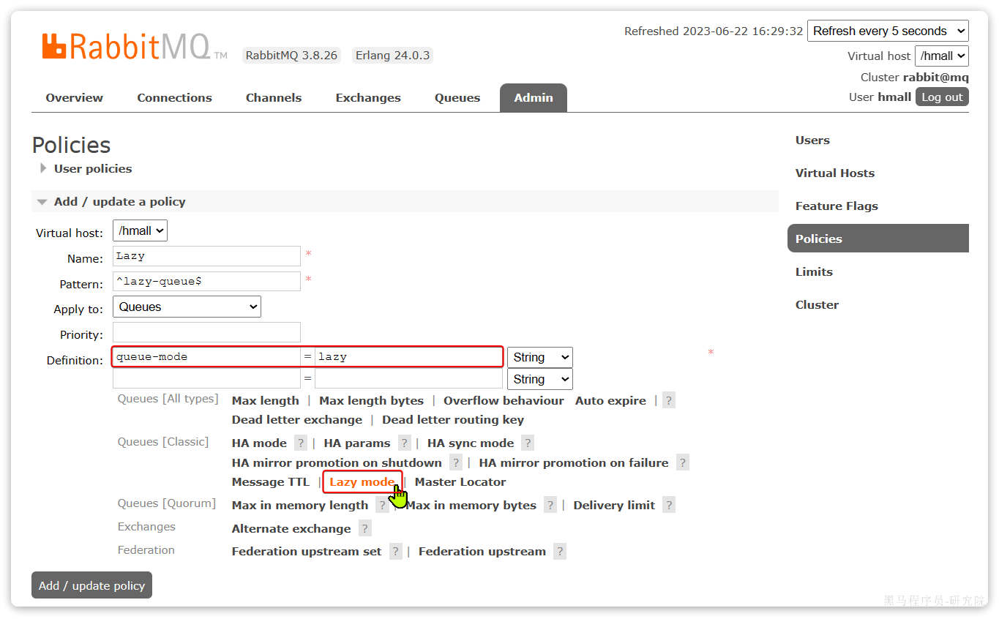
>
> 


## 消费者可靠性


当RabbitMQ向消费者投递消息以后，需要知道消费者的处理状态如何。因为消息投递给消费者并不代表就一定被正确消费了，可能出现的故障有很多，比如：

- **<u>消息投递的过程</u>中出现了网络故障**
- **消费者接收到消息后突然<u>宕机</u>**
- **消费者接收到消息后，因处理不当导致异常**
- ...

一旦发生上述情况，消息也会丢失。因此，RabbitMQ必须知道消费者的处理状态，一旦消息处理失败才能重新投递消息。

所以，RabbitMQ如何得知消费者的处理状态呢？

本章我们就一起研究一下消费者处理消息时的可靠性解决方案。

### 消费者确认机制

> **默认开启，有三种模式**


为了确认消费者是否成功处理消息，RabbitMQ提供了消费者确认机制（**Consumer Acknowledgement**）。即：**当消费者处理消息结束后，应该向RabbitMQ发送一个回执，告知RabbitMQ自己消息处理状态**。回执有三种可选值：

- ack：成功处理消息，RabbitMQ<u>从队列中删除该消息</u>
- nack：消息处理失败，RabbitMQ<u>需要再次投递消息</u>
- reject：消息处理失败并<u>拒绝该消息</u>，RabbitMQ<u>从队列中删除该消息</u>

一般reject方式用的较少，除非是消息格式有问题，那就是开发问题了。因此大多数情况下我们需要将消息处理的代码通过`try catch`机制捕获，消息处理成功时返回ack，处理失败时返回nack.


由于消息回执的处理代码比较统一，因此SpringAMQP帮我们实现了消息确认。并允许我们通过配置文件设置ACK处理方式，有三种模式：

- **`none`**：**不处理。即消息投递给消费者后立刻ack**，消息会立刻从MQ删除。非常不安全，不建议使用
- **`manual`**：**手动模式。需要自己在业务代码中调用api，发送`ack`或`reject**`，存在业务入侵，但更灵活
- **`auto`**：自动模式。SpringAMQP利用AOP对我们的消息处理逻辑做了环绕增强，当**业务正常执行时则自动返回`ack`.  当业务出现异常时，根据异常判断返回不同结果**：
  - 如果是**业务异常**，会自动返回`nack`；
  - 如果是**消息处理或校验异常**，自动返回`reject`;


返回Reject的常见异常有：

> Starting with version 1.3.2, the default ErrorHandler is now a ConditionalRejectingErrorHandler that rejects (and does not requeue) messages that fail with an irrecoverable error. Specifically, it rejects messages that fail with the following errors:
>
> - o.s.amqp…MessageConversionException: Can be thrown when converting the incoming message payload using a MessageConverter.
> - o.s.messaging…MessageConversionException: Can be thrown by the conversion service if additional conversion is required when mapping to a @RabbitListener method.
> - o.s.messaging…MethodArgumentNotValidException: Can be thrown if validation (for example, @Valid) is used in the listener and the validation fails.
> - o.s.messaging…MethodArgumentTypeMismatchException: Can be thrown if the inbound message was converted to a type that is not correct for the target method. For example, the parameter is declared as Message<Foo> but Message<Bar> is received.
> - java.lang.NoSuchMethodException: Added in version 1.6.3.
> - java.lang.ClassCastException: Added in version 1.6.3.


#### 所需配置

通过下面的配置可以修改SpringAMQP的ACK处理方式：

```yaml
spring:
  rabbitmq:
    listener:
      simple:
      	prefetch: 1 # 每次只能获取一条消息，处理完成才能获取下一个消息(避免消息积压)
        acknowledge-mode: auto # 自动处理 返回ack/nack/reject
```


> ```YAML
> spring:
>   rabbitmq:
>     listener:
>       simple:
>         acknowledge-mode: none # 不做处理
> ```
>
> 修改consumer服务的SpringRabbitListener类中的方法，模拟一个消息处理的异常：
>
> ```Java
> @RabbitListener(queues = "simple.queue")
> public void listenSimpleQueueMessage(String msg) throws InterruptedException {
>     log.info("spring 消费者接收到消息：【" + msg + "】");
>     if (true) {
>         throw new MessageConversionException("故意的");
>     }
>     log.info("消息处理完成");
> }
> ```
>
> 测试可以发现：当消息处理发生异常时，消息依然被RabbitMQ删除了。
>
> 我们再次把确认机制修改为auto：
>
> ```YAML
> spring:
>   rabbitmq:
>     listener:
>       simple:
>         acknowledge-mode: auto # 自动ack
> ```
>
> 在异常位置打断点，再次发送消息，程序卡在断点时，可以发现此时消息状态为`unacked`（未确定状态）：
>
> 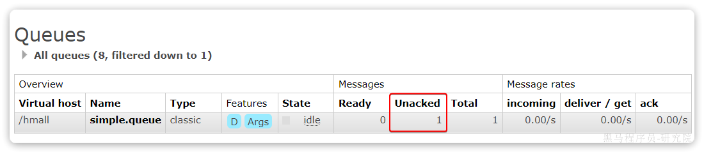
>
> 放行以后，由于抛出的是**消息转换异常**，因此Spring会自动返回`reject`，所以消息依然会被删除：
>
> 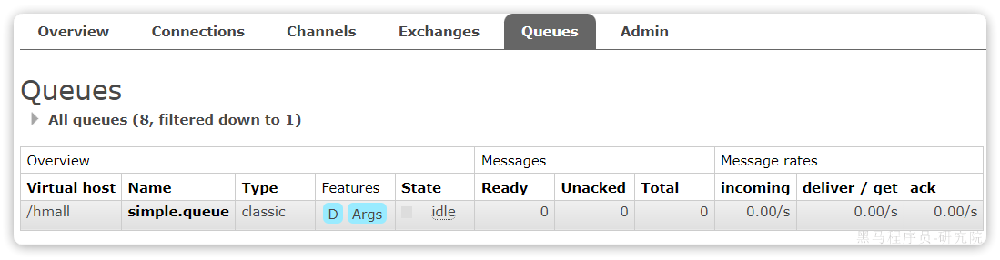
>
> 我们将异常改为RuntimeException类型：
>
> ```Java
> @RabbitListener(queues = "simple.queue")
> public void listenSimpleQueueMessage(String msg) throws InterruptedException {
>     log.info("spring 消费者接收到消息：【" + msg + "】");
>     if (true) {
>         throw new RuntimeException("故意的");
>     }
>     log.info("消息处理完成");
> }
> ```
>
> 在异常位置打断点，然后再次发送消息测试，程序卡在断点时，可以发现此时消息状态为`unacked`（未确定状态）：
>
> 
>
> 放行以后，由于抛出的是业务异常，所以Spring返回`ack`，最终消息恢复至`Ready`状态，并且没有被RabbitMQ删除：
>
> 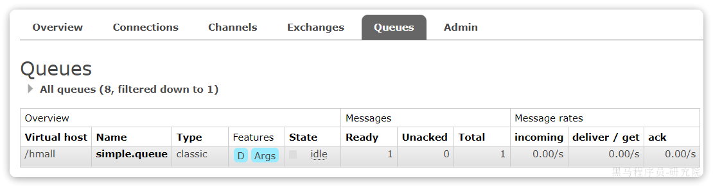
>
> 当我们把配置改为`auto`时，消息处理失败后，会回到RabbitMQ，并重新投递到消费者。


### 消费者失败(本地)重试机制

> **背景：避免requeue带来不必要的压力**
>
> 当消费者出现异常后，消息会不断requeue（重入队）到队列，再重新发送给消费者。如果消费者再次执行依然出错，消息会再次requeue到队列，再次投递，直到消息处理成功为止。
>
> 极端情况就是消费者一直无法执行成功，那么消息requeue就会无限循环，导致mq的消息处理飙升，带来不必要的压力：
>
> 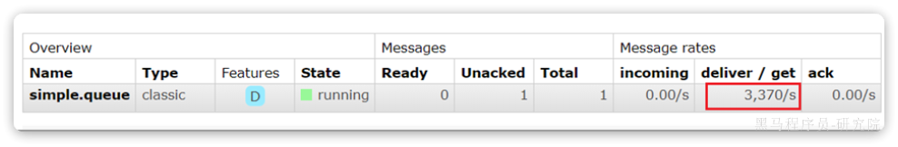

当然，上述极端情况发生的概率还是非常低的，不过为了应对上述情况Spring又提供了**消费者失败重试机制**：**在消费者出现异常时利用本地重试，而不是无限制的requeue到mq队列**。


修改consumer服务的application.yml文件，添加内容：

```YAML
spring:
  rabbitmq:
    listener:
      simple:
        retry:
          enabled: true # 开启消费者失败重试
          initial-interval: 1000ms # 初识的失败等待时长为1秒
          multiplier: 1 # 失败的等待时长倍数，下次等待时长 = multiplier * last-interval
          max-attempts: 3 # 最大重试次数
          stateless: true # true无状态；false有状态。如果业务中包含事务，这里改为false
```

重启consumer服务，重复之前的测试。可以发现：

- 消费者在失败后消息没有重新回到MQ无限重新投递，而是在本地重试了3次
- 本地重试3次以后，抛出了`AmqpRejectAndDontRequeueException`异常。查看RabbitMQ控制台，发现消息被删除了，说明**最后SpringAMQP返回的是`reject`**
  **默认失败处理策略：重试达到最大次数后，Spring会返回reject，消息会被丢弃**

> #### 数值配置
>
> ##### RabbitMQ消费者重试配置最佳实践
>
> ##### 各参数详解及推荐配置
>
> ##### 1.`retry.enabled`
>
> - **作用**：开关重试功能
> - **建议**：生产环境**必须开启**，避免临时性错误导致消息丢失
> - **配置**：`true`
>
> ##### 2.`retry.initial-interval`
>
> - **作用**：首次重试等待时间
> - 推荐值：
>   - 一般业务：`1000ms` (1秒)
>   - 高实时性业务(如支付)：`500ms`
>   - 非关键业务(如日志处理)：`2000-5000ms`
>   - 依赖外部服务(如第三方API)：`3000ms+`
> - **原理**：避免立即重试导致系统雪崩，给系统恢复留出时间
>
> ##### 3. `retry.multiplier`
>
> - **作用**：重试间隔增长倍数(指数退避)
> - 推荐值：
>   - 一般场景：`1.5-2.0` (推荐`1.8`)
>   - 高负载系统：`2.0` (更保守的退避策略)
>   - 非关键业务：`1.0` (固定间隔)
> - 示例：若initial-interval=1000ms, multiplier=1.8
>   - 第1次重试：1秒后
>   - 第2次重试：1.8秒后
>   - 第3次重试：3.24秒后
>
> ##### 4. `retry.max-attempts`
>
> - **作用**：最大重试次数
> - 推荐值：
>   - 核心业务(订单/支付)：`5`次
>   - 一般业务：`3`次(当前配置)
>   - 非关键业务：`2-3`次
>   - 依赖不稳定外部系统：`8-10`次(配合较大multiplier)
> - **警告**：过高会导致消息长时间堵塞；过低可能导致消息过早进入死信队列
>
> ##### 5. `retry.stateless`
>
> - **作用**：重试是否有状态
> - 推荐值：
>   - 无数据库操作或幂等接口：`true`(当前配置)
>   - **有数据库事务操作**：`false`（非常重要！）
>   - 调用其他服务且需要事务一致性：`false`
> - **原理**：`stateless=false`会保留事务上下文，确保重试在同一事务中
>
> ##### 不同业务场景配置示例
>
> ##### 1. 支付/订单核心业务
>
> ```yaml
> retry:
>   enabled: true
>   initial-interval: 800ms
>   multiplier: 1.8
>   max-attempts: 5
>   stateless: false  # 必须设为false，保证事务一致性
> ```
>
> ##### 2. 一般业务(用户通知、数据同步)
>
> ```yaml
> retry:
>   enabled: true
>   initial-interval: 1000ms
>   multiplier: 1.5
>   max-attempts: 3
>   stateless: true
> ```
>
> ##### 3. 非关键业务(日志收集、监控)
>
> ```yaml
> retry:
>   enabled: true
>   initial-interval: 3000ms
>   multiplier: 1.0  # 固定间隔
>   max-attempts: 2
>   stateless: true
> ```
>
> ##### 重要注意事项
>
> 1. **重试与死信队列配合**：重试失败后应配置死信交换器，便于人工干预
>
>    ```yaml
>    spring:
>      rabbitmq:
>        listener:
>          simple:
>            default-requeue-rejected: false  # 重试失败不重回队列
>    ```
>
> 2. **事务场景必须注意**：
>
>    - 当消费者方法包含`@Transactional`注解时，**必须**设置`stateless: false`
>    - 否则事务会在第一次失败时回滚，重试时无事务上下文
>
> 3. **幂等性设计**：
>
>    - 无论重试配置如何，消费者必须实现幂等处理
>    - 建议使用唯一消息ID或业务标识进行去重
>
> 4. **监控告警**：
>
>    - 重试次数较多时应触发告警
>    - 可通过Micrometer收集RabbitMQ重试指标
>
> 5. **避免雪崩**：
>
>    - 大规模故障时，指数退避(multiplier>1)尤为重要
>    - 考虑添加熔断机制，当失败率达到阈值时暂停消费
>
> 企业级应用中，这组参数需要结合业务特性、系统负载、依赖服务稳定性综合考虑，建议在测试环境进行故障注入测试，验证重试策略的有效性。


#### 更改超出重试次数之后的 失败处理策略


默认的失败处理策略：消费者最大重试次数后，消息会被丢弃。这在某些对于消息可靠性要求较高的业务场景下，显然不太合适了。

因此Spring允许我们**自定义重试次数耗尽后的消息处理策略**，这个策略是由`MessageRecovery`接口来定义的，它有3个不同实现：

-  `RejectAndDontRequeueRecoverer`：重试耗尽后，直接`reject`，丢弃消息。默认就是这种方式 
-  `ImmediateRequeueMessageRecoverer`：重试耗尽后，返回`nack`，消息重新入队 
-  ==**`RepublishMessageRecoverer`：重试耗尽后，将失败消息投递到指定的交换机**==

> 比较优雅的一种处理方案是`RepublishMessageRecoverer`，失败后将消息投递到一个指定的，专门存放异常消息的队列，后续由人工集中处理。


1）在消费者服务中**定义处理失败消息的交换机和队列**(配置类中定义bean)

```Java
@Bean
public DirectExchange errorMessageExchange(){
    return new DirectExchange("error.direct");
}
@Bean
public Queue errorQueue(){
    return new Queue("error.queue", true);
}
@Bean
public Binding errorBinding(Queue errorQueue, DirectExchange errorMessageExchange){
    return BindingBuilder.bind(errorQueue).to(errorMessageExchange).with("error");
}
```

2）@Bean**定义一个RepublishMessageRecoverer，关联队列和交换机**

```Java
@Bean
public MessageRecoverer republishMessageRecoverer(RabbitTemplate rabbitTemplate){
    return new RepublishMessageRecoverer(rabbitTemplate, "error.direct", "error");
}
```

完整代码如下：

```Java
import lombok.RequiredArgsConstructor;
import org.springframework.amqp.core.Binding;
import org.springframework.amqp.core.BindingBuilder;
import org.springframework.amqp.core.DirectExchange;

import org.springframework.amqp.core.Queue;
import org.springframework.amqp.rabbit.core.RabbitTemplate;
import org.springframework.amqp.rabbit.retry.MessageRecoverer;
import org.springframework.amqp.rabbit.retry.RepublishMessageRecoverer;
import org.springframework.context.annotation.Bean;
import org.springframework.context.annotation.Configuration;

@Configuration
@RequiredArgsConstructor
public class ErrorMessageConfiguration {

    @Bean
    public DirectExchange errorMessageExchange(){
        return new DirectExchange("error.direct");
    }
    @Bean
    public Queue errorQueue(){
        return new Queue("error.queue", true);
    }
    @Bean
    public Binding errorBinding(Queue errorQueue, DirectExchange errorMessageExchange){
        return BindingBuilder.bind(errorQueue).to(errorMessageExchange).with("error");
    }
    @Bean
    public MessageRecoverer republishMessageRecoverer(RabbitTemplate rabbitTemplate){
        return new RepublishMessageRecoverer(rabbitTemplate, "error.direct", "error");
    }
}
```

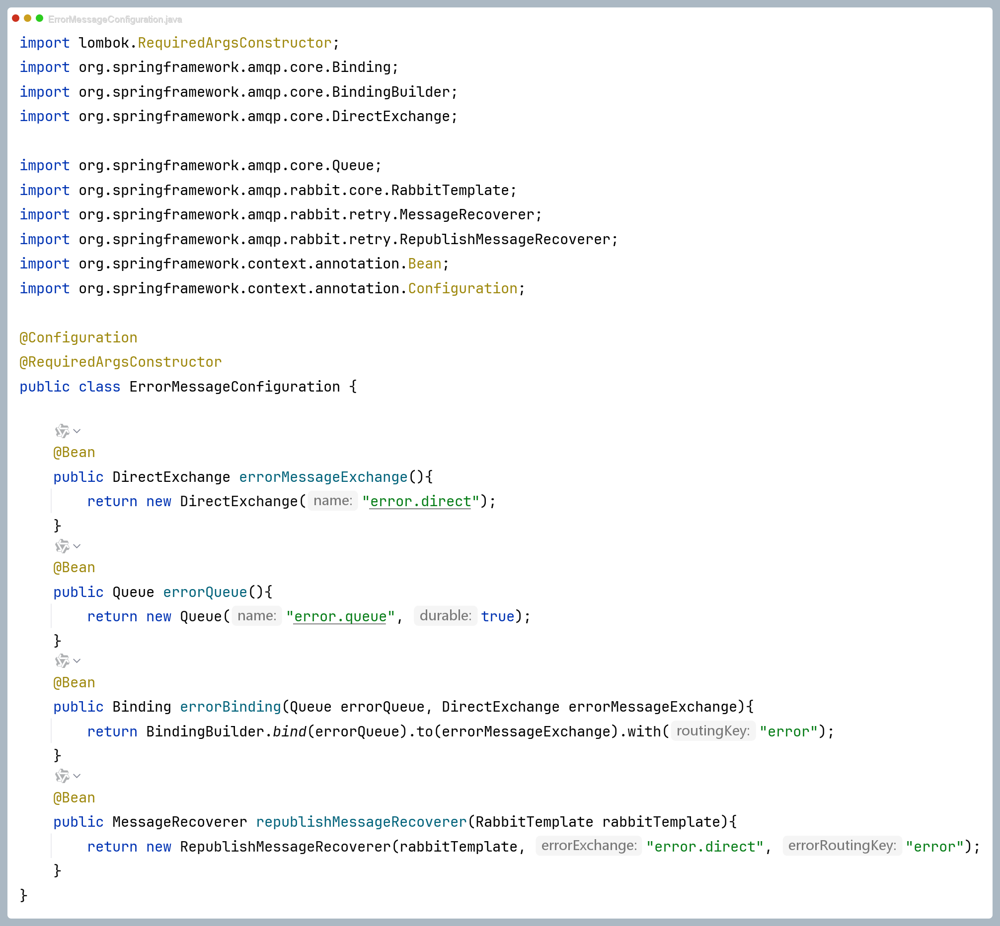


## 业务幂等性的保证

在程序开发中，幂等性是指同一个业务，执行一次或多次对业务状态的影响是一致的。例如：

- 根据id删除数据
- 查询数据
- 新增数据

但数据的更新往往不是幂等的，如果重复执行可能造成不一样的后果。比如：

- 取消订单，恢复库存的业务。如果多次恢复就会出现库存重复增加的情况
- 退款业务。重复退款对商家而言会有经济损失。

所以，要尽可能避免业务被重复执行。


#### 出现场景

在实际业务场景中，由于意外经常会出现业务被重复执行的情况，例如：

- 页面卡顿时频繁刷新导致表单重复提交

- 服务间调用的重试

- MQ消息的重复投递

  > 如果因为网络问题，导致网络连接断开  消费者的ack信号没返回给MQ，MQ重连之后就会重新投递这个消息给消费者
  >
  > 

> 我们在用户支付成功后会发送MQ消息到交易服务，修改订单状态为已支付，就可能出现消息重复投递的情况。如果消费者不做判断，很有可能导致消息被消费多次，出现业务故障。
>
> 举例：
>
> 1. 假如用户刚刚支付完成，并且投递消息到交易服务，交易服务更改订单为**已支付**状态。
> 2. 由于某种原因，例如网络故障导致生产者没有得到确认，隔了一段时间后**重新投递**给交易服务。
> 3. 但是，在新投递的消息被消费之前，用户选择了退款，将订单状态改为了**已退款**状态。
> 4. 退款完成后，新投递的消息才被消费，那么订单状态会被再次改为**已支付**。业务异常。


#### 唯一消息ID 

> 解决幂等性问题

思路非常简单：

1. 每一条消息都生成一个唯一的id，与消息一起投递给消费者。
2. 消费者接收到消息后处理自己的业务，业务处理成功后将消息ID保存到数据库
3. 如果下次又收到相同消息，去数据库查询判断是否存在，存在则为重复消息放弃处理。

我们该如何给消息添加唯一ID呢？

其实很简单，SpringAMQP的MessageConverter自带了MessageID的功能，我们只要开启这个功能即可。

以Jackson的消息转换器为例：

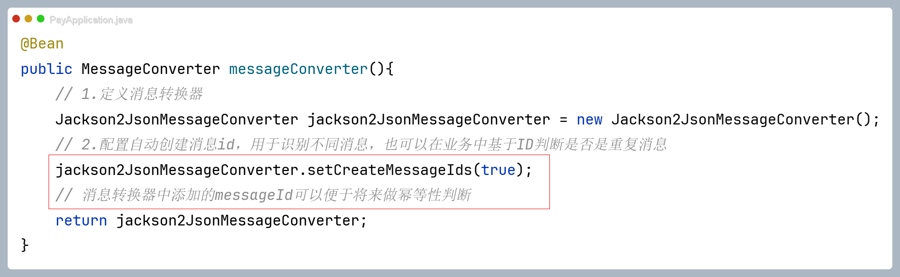

> 注意（加入这个id之后）
>
> ==消费者里面的监听方法要用Message对象接收参数==
>
> ``获取消息唯一id
>
> ``获取消息


#### 业务状态判断 

> 解决幂等性问题

业务判断就是基于业务本身的逻辑或状态来判断是否是重复的请求或消息，不同的业务场景判断的思路也不一样。

例如我们当前案例中，处理消息的业务逻辑是把订单状态从未支付修改为已支付。因此我们就可以在执行业务时判断订单状态是否是未支付，如果不是则证明订单已经被处理过，无需重复处理。

相比较而言，**消息ID的方案需要改造原有的数据库**，所以我**更推荐使用业务判断的方案**。


以支付修改订单的业务为例，我们需要修改`OrderServiceImpl`中的`markOrderPaySuccess`方法：

```Java
    @Override
    public void markOrderPaySuccess(Long orderId) {
        // 1.查询订单
        Order old = getById(orderId);
        // 2.判断订单状态
        if (old == null || old.getStatus() != 1) {
            // 订单不存在或者订单状态不是1，放弃处理
            return;
        }
        // 3.尝试更新订单
        Order order = new Order();
        order.setId(orderId);
        order.setStatus(2);
        order.setPayTime(LocalDateTime.now());
        updateById(order);
    }
```

上述代码逻辑上符合了幂等判断的需求，但是由于判断和更新是两步动作，因此在极小概率下可能存在线程安全问题。

我们可以合并上述操作为这样：

```Java
@Override
public void markOrderPaySuccess(Long orderId) {
    // UPDATE `order` SET status = ? , pay_time = ? WHERE id = ? AND status = 1
    lambdaUpdate()
            .set(Order::getStatus, 2)
            .set(Order::getPayTime, LocalDateTime.now())
            .eq(Order::getId, orderId)
            .eq(Order::getStatus, 1)
            .update();
}
```

注意看，上述代码等同于这样的SQL语句：

```SQL
UPDATE `order` SET status = ? , pay_time = ? WHERE id = ? AND status = 1
```

我们在where条件中除了判断id以外，还加上了status必须为1的条件。如果条件不符（说明订单已支付），则SQL匹配不到数据，根本不会执行。


> 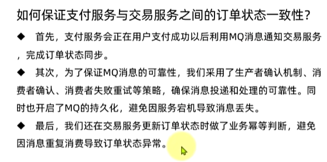


## 兜底方案

虽然我们利用各种机制尽可能增加了消息的可靠性，但也不好说能保证消息100%的可靠。万一真的MQ通知失败该怎么办呢？

有没有其它兜底方案，能够确保订单的支付状态一致呢？

其实思想很简单：既然MQ通知不一定发送到交易服务，那么交易服务就必须自己**主动去查询**支付状态。这样即便支付服务的MQ通知失败，我们依然能通过主动查询来保证订单状态的一致。

流程如下：

暂时无法在飞书文档外展示此内容

图中黄色线圈起来的部分就是MQ通知失败后的兜底处理方案，由交易服务自己主动去查询支付状态。

不过需要注意的是，交易服务并不知道用户会在什么时候支付，如果查询的时机不正确（比如查询的时候用户正在支付中），可能查询到的支付状态也不正确。

那么问题来了，我们到底该在什么时间主动查询支付状态呢？

这个时间是无法确定的，因此，通常我们采取的措施就是利用**定时任务**定期查询，例如每隔20秒就查询一次，并判断支付状态。如果发现订单已经支付，则立刻更新订单状态为已支付即可。

定时任务大家之前学习过，具体的实现这里就不再赘述了。

至此，消息可靠性的问题已经解决了。

综上，支付服务与交易服务之间的订单状态一致性是如何保证的？

- 首先，支付服务会正在用户支付成功以后利用MQ消息通知交易服务，完成订单状态同步。
- 其次，为了保证MQ消息的可靠性，我们采用了生产者确认机制、消费者确认、消费者失败重试等策略，确保消息投递的可靠性
- 最后，我们还在交易服务设置了定时任务，定期查询订单支付状态。这样即便MQ通知失败，还可以利用定时任务作为兜底方案，确保订单支付状态的最终一致性。


# 超时取消的实现

> 订单超时取消

在电商的支付业务中，对于一些库存有限的商品，为了更好的用户体验，通常都会在用户下单时立刻扣减商品库存。例如电影院购票、高铁购票，下单后就会锁定座位资源，其他人无法重复购买。

但是这样就存在一个问题，假如用户下单后一直不付款，就会一直占有库存资源，导致其他客户无法正常交易，最终导致商户利益受损！

因此，电商中通常的做法就是：**对于超过一定时间未支付的订单，应该立刻取消订单并释放占用的库存**。

例如，订单支付超时时间为30分钟，则我们应该在用户下单后的第30分钟检查订单支付状态，如果发现未支付，应该立刻取消订单，释放库存。

但问题来了：如何才能准确的实现在下单后第30分钟去检查支付状态呢？

> 检查支付状态：
> 如果支付服务已支付，就将交易服务的订单状态改成已支付(二次确保一致性，消息没接收到的时候 能对一致性进行兜底)
> 如果支付服务未支付，就取消订单 释放库存，实现超时未支付取消


像这种在一段时间以后才执行的**延迟任务**，最简单的方案就是利用MQ的延迟消息。

在RabbitMQ中实现延迟消息也有两种方案：

- 死信交换机+TTL
- 延迟消息插件


## 1.基于死信交换机和延迟消息


#### 死信交换机

什么是死信？

当一个队列中的消息满足下列情况之一时，就会成为死信（dead letter）：

- 消费者使用`basic.reject`或 `basic.nack`声明消费失败，并且消息的`requeue`参数设置为false
- 消息是一个过期消息，超时无人消费
- 要投递的队列消息满了，最早的消息可能成为死信

如果一个队列中的消息已经成为死信，并且这个队列通过**`dead-letter-exchange`**属性指定了一个交换机，那么队列中的死信就会投递到这个交换机中，而这个交换机就称为**死信交换机**（Dead Letter Exchange，简称DLX）。

> 此时加入有队列与死信交换机绑定，则最终死信就会被投递到这个队列中。
>
> **和之前的error交换机区分**：
> 这里的死信是由死信消息所在的队列投递到指定的死信交换机，
> error交换机是消费者进行投递——把多次尝试消费但消费失败的消息投入error交换机
>
> 

死信交换机有什么作用呢？

1. 收集那些因处理失败而被拒绝的消息
2. 收集那些因队列满了而被拒绝的消息
3. 收集因TTL（有效期）到期的消息


#### 模拟延迟消息

前面两种作用场景可以看做是把死信交换机当做一种消息处理的最终兜底方案，与消费者重试时讲的`RepublishMessageRecoverer`作用类似。

第三种作用： **结合死信出现的第二种情况和死信交换机，实现模拟延时消息**


案例演示：

> 如图，有一组绑定的交换机（`ttl.fanout`）和队列（`ttl.queue`）。但是<u>`ttl.queue`没有消费者监听(不要绑定消费者)，而是设定了死信交换机`hmall.direct`</u>，而队列`direct.queue1`则与死信交换机绑定，RoutingKey是blue：
>
> 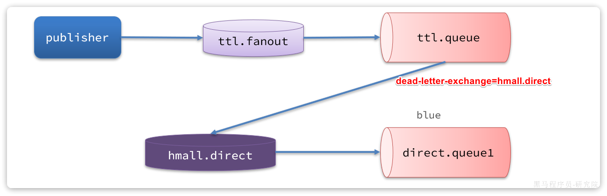
>
> 假如我们现在发送一条消息到`ttl.fanout`，RoutingKey为blue，并设置消息的**有效期**为5000毫秒：
>
> 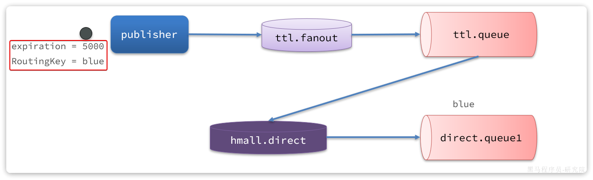
>
> **注意**：尽管这里的`ttl.fanout`不需要RoutingKey，但是当消息变为死信并投递到死信交换机时，会沿用之前的RoutingKey，这样`hmall.direct`才能正确路由消息。
>
> 消息肯定会被投递到`ttl.queue`之后，由于没有消费者，因此消息无人消费。5秒之后，消息的有效期到期，成为死信：
>
> 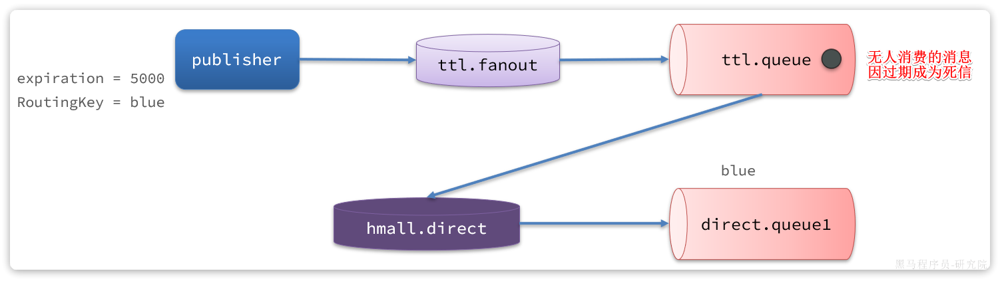
>
> 死信被再次投递到死信交换机`hmall.direct`，并沿用之前的RoutingKey，也就是`blue`：
>
> 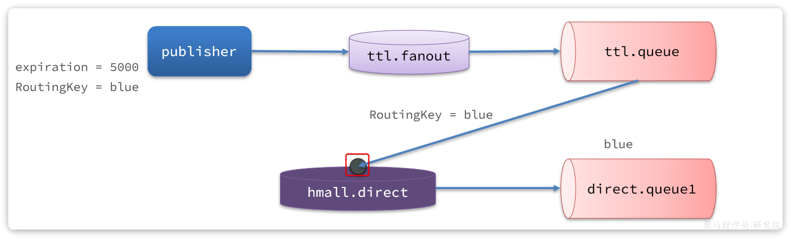
>
> 由于`direct.queue1`与`hmall.direct`绑定的key是blue，因此最终消息被成功路由到`direct.queue1`，如果此时有消费者与`direct.queue1`绑定， 也就能成功消费消息了。但此时已经是5秒钟以后了：
>
> 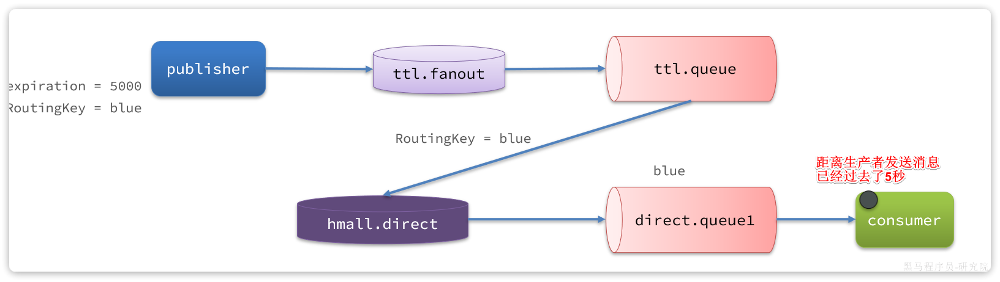
>
> 也就是说，publisher发送了一条消息，但最终consumer在5秒后才收到消息。我们成功实现了**延迟消息**。


**注意：**

RabbitMQ的消息过期是基于追溯方式来实现的，也就是说当一个消息的TTL到期以后不一定会被移除或投递到死信交换机，而是在消息恰好处于队首时才会被处理。

当队列中消息堆积很多的时候，过期消息可能不会被按时处理，因此你设置的TTL时间不一定准确。


## ==2.基于延迟消息插件==


基于死信队列虽然可以实现延迟消息，但是太麻烦了。因此RabbitMQ社区提供了一个延迟消息插件来实现相同的效果。

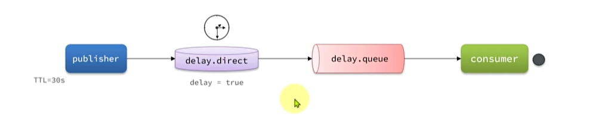

> 将消息在交换机暂存一段时间，到期后路由到队列


官方文档说明：

https://blog.rabbitmq.com/posts/2015/04/scheduling-messages-with-rabbitmq

#### 1.下载

插件下载地址：

https://github.com/rabbitmq/rabbitmq-delayed-message-exchange

由于我们安装的MQ是`3.8`版本，因此这里下载`3.8.17`版本：

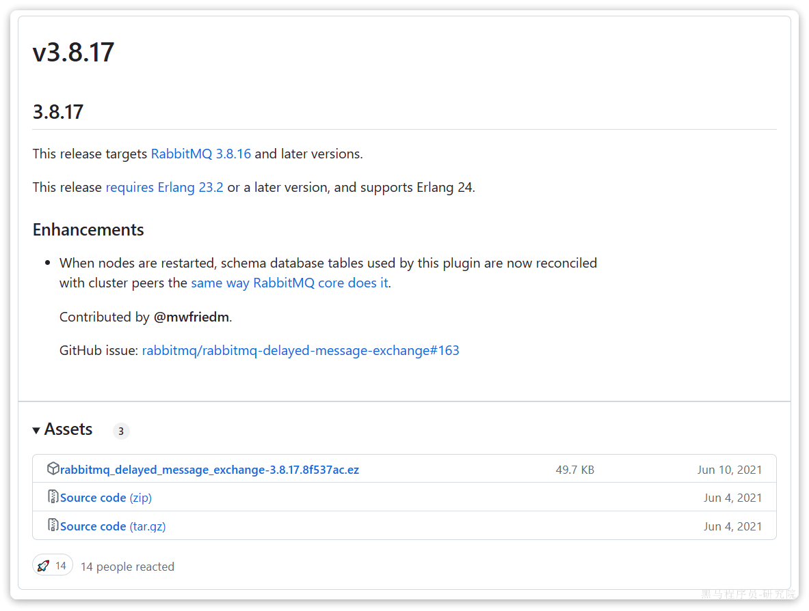

当然，也可以直接使用课前资料提供好的插件：

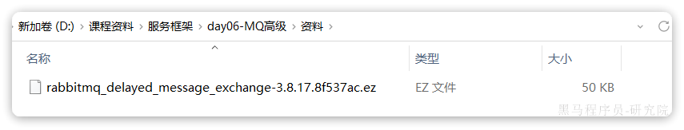

#### 2.安装

因为我们是基于Docker安装，所以需要先查看RabbitMQ的插件目录对应的数据卷。

```Shell
docker volume inspect mq-plugins
```

结果如下：

```JSON
[
    {
        "CreatedAt": "2024-06-19T09:22:59+08:00",
        "Driver": "local",
        "Labels": null,
        "Mountpoint": "/var/lib/docker/volumes/mq-plugins/_data",
        "Name": "mq-plugins",
        "Options": null,
        "Scope": "local"
    }
]
```

插件目录被挂载到了`/var/lib/docker/volumes/mq-plugins/_data`这个目录，我们**上传插件到该目录下**。

**接下来执行命令，安装插件**：

```Shell
docker exec -it mq rabbitmq-plugins enable rabbitmq_delayed_message_exchange
```

运行结果如下：

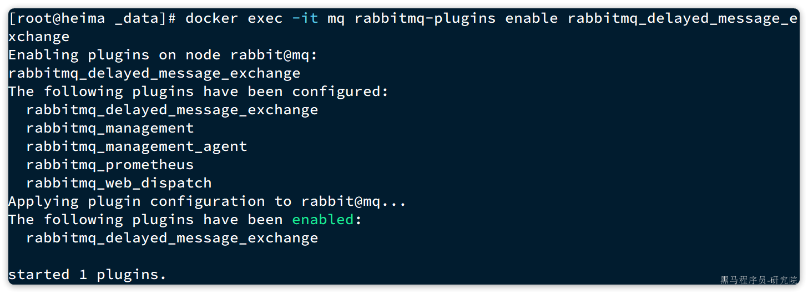


#### 3.声明延迟交换机

基于注解方式：

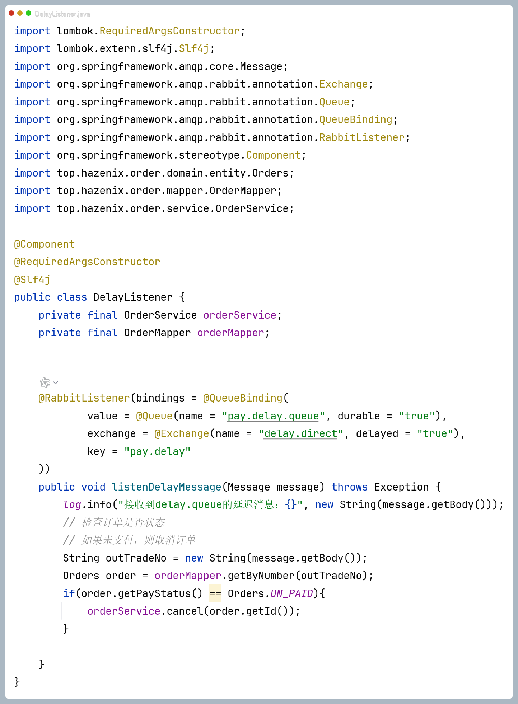

```Java
@RabbitListener(bindings = @QueueBinding(
        value = @Queue(name = "delay.queue", durable = "true"),
        exchange = @Exchange(name = "delay.direct", delayed = "true"),
        key = "delay"
))
public void listenDelayMessage(String msg){
    log.info("接收到delay.queue的延迟消息：{}", msg);
}
```

基于`@Bean`的方式：

```Java
package com.itheima.consumer.config;

import lombok.extern.slf4j.Slf4j;
import org.springframework.amqp.core.*;
import org.springframework.context.annotation.Bean;
import org.springframework.context.annotation.Configuration;

@Slf4j
@Configuration
public class DelayExchangeConfig {

    @Bean
    public DirectExchange delayExchange(){
        return ExchangeBuilder
                .directExchange("delay.direct") // 指定交换机类型和名称
                .delayed() // 设置delay的属性为true
                .durable(true) // 持久化
                .build();
    }

    @Bean
    public Queue delayedQueue(){
        return new Queue("delay.queue");
    }
    
    @Bean
    public Binding delayQueueBinding(){
        return BindingBuilder.bind(delayedQueue()).to(delayExchange()).with("delay");
    }
}
```


#### 4.发送延迟消息

**发送消息时，必须通过x-delay属性设定延迟时间**：

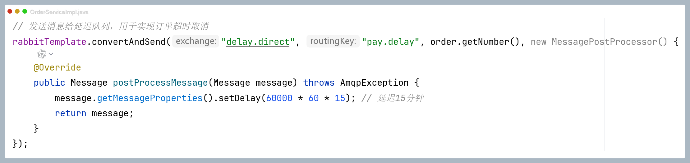

```Java
@Test
void testPublisherDelayMessage() {
    // 1.创建消息
    String message = "hello, delayed message";
    // 2.发送消息，利用消息后置处理器添加消息头
    rabbitTemplate.convertAndSend("delay.direct", "delay", message, new MessagePostProcessor() {
        @Override
        public Message postProcessMessage(Message message) throws AmqpException {
            // 添加延迟消息属性
            message.getMessageProperties().setDelay(5000);
            return message;
        }
    });
}
```

**注意：**

延迟消息插件内部会维护一个本地数据库表，同时使用Elang Timers功能实现计时。如果消息的延迟时间设置较长，可能会导致堆积的延迟消息非常多，会带来较大的CPU开销，同时延迟消息的时间会存在误差。

因此，**不建议设置延迟时间过长的延迟消息**。


#### 超时订单问题

接下来，我们就在交易服务中利用延迟消息实现订单超时取消功能。其大概思路如下：

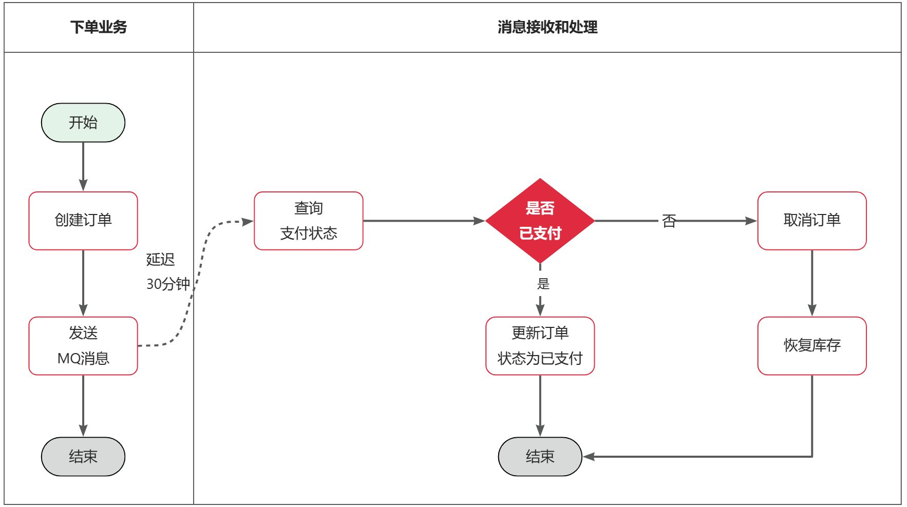

假如订单超时支付时间为30分钟，理论上说我们应该在下单时发送一条延迟消息，延迟时间为30分钟。这样就可以在接收到消息时检验订单支付状态，关闭未支付订单。


#### 定义常量

无论是消息发送还是接收都是在交易服务完成，因此我们在`trade-service`中定义一个常量类，用于记录交换机、队列、RoutingKey等常量：

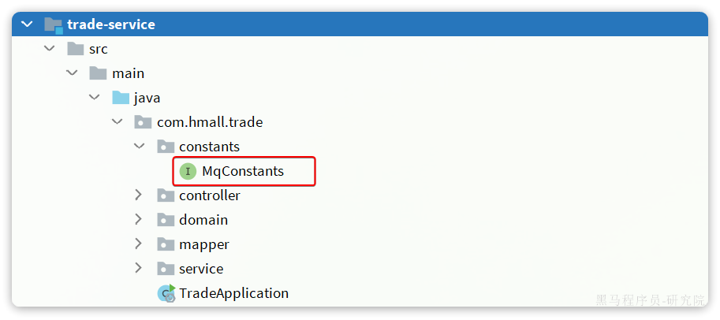

内容如下：

```Java
package com.hmall.trade.constants;

public interface MQConstants {
    String DELAY_EXCHANGE_NAME = "trade.delay.direct";
    String DELAY_ORDER_QUEUE_NAME = "trade.delay.order.queue";
    String DELAY_ORDER_KEY = "delay.order.query";
}
```


#### 配置MQ

在`trade-service`模块的`pom.xml`中引入amqp的依赖：

```XML
  <!--amqp-->
  <dependency>
      <groupId>org.springframework.boot</groupId>
      <artifactId>spring-boot-starter-amqp</artifactId>
  </dependency>
```

在`trade-service`的`application.yaml`中添加MQ的配置：

```YAML
spring:
  rabbitmq:
    host: 192.168.150.101
    port: 5672
    virtual-host: /hmall
    username: hmall
    password: 123
```


#### 改造下单业务，发送延迟消息

接下来，我们改造下单业务，在下单完成后，发送延迟消息，查询支付状态。

修改`trade-service`模块的`com.hmall.trade.service.impl.OrderServiceImpl`类的`createOrder`方法，添加消息发送的代码：

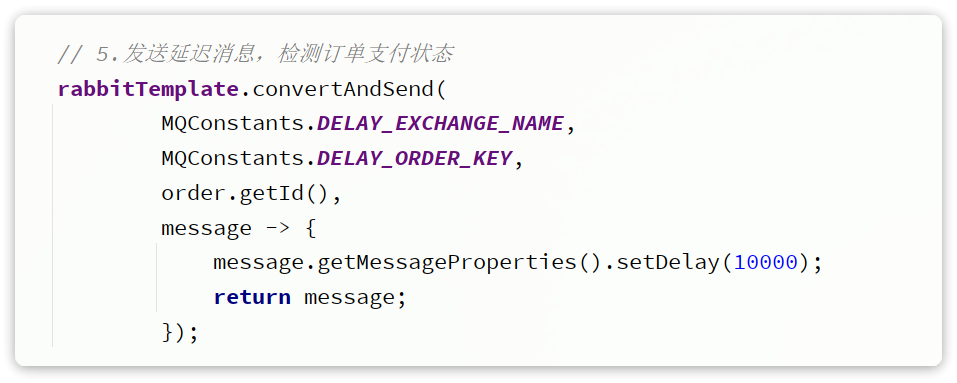

这里延迟消息的时间应该是15分钟，不过我们为了测试方便，改成10秒。


#### 编写查询支付状态接口

由于MQ消息处理时需要查询支付状态，因此我们要在`pay-service`模块定义一个这样的接口，并提供对应的`FeignClient`.

首先，在`hm-api`模块定义三个类：

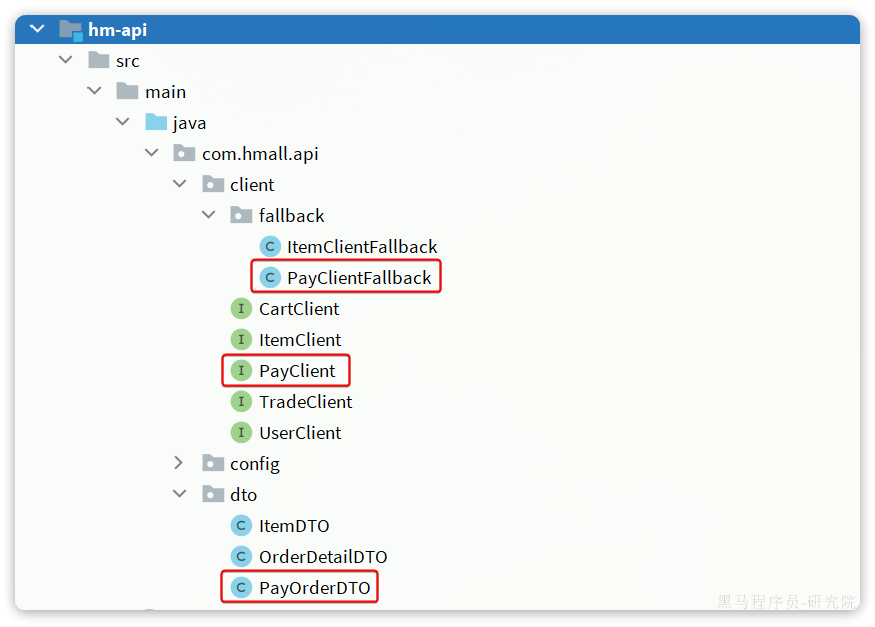

说明：

- PayOrderDTO：支付单的数据传输实体
- PayClient：支付系统的Feign客户端
- PayClientFallback：支付系统的fallback逻辑

`PayOrderDTO`代码如下：

```Java
package com.hmall.api.dto;

import io.swagger.annotations.ApiModel;
import io.swagger.annotations.ApiModelProperty;
import lombok.Data;

import java.time.LocalDateTime;

/**
 * <p>
 * 支付订单
 * </p>
 */
@Data
@ApiModel(description = "支付单数据传输实体")
public class PayOrderDTO {
    @ApiModelProperty("id")
    private Long id;
    @ApiModelProperty("业务订单号")
    private Long bizOrderNo;
    @ApiModelProperty("支付单号")
    private Long payOrderNo;
    @ApiModelProperty("支付用户id")
    private Long bizUserId;
    @ApiModelProperty("支付渠道编码")
    private String payChannelCode;
    @ApiModelProperty("支付金额，单位分")
    private Integer amount;
    @ApiModelProperty("付类型，1：h5,2:小程序，3：公众号，4：扫码，5：余额支付")
    private Integer payType;
    @ApiModelProperty("付状态，0：待提交，1:待支付，2：支付超时或取消，3：支付成功")
    private Integer status;
    @ApiModelProperty("拓展字段，用于传递不同渠道单独处理的字段")
    private String expandJson;
    @ApiModelProperty("第三方返回业务码")
    private String resultCode;
    @ApiModelProperty("第三方返回提示信息")
    private String resultMsg;
    @ApiModelProperty("支付成功时间")
    private LocalDateTime paySuccessTime;
    @ApiModelProperty("支付超时时间")
    private LocalDateTime payOverTime;
    @ApiModelProperty("支付二维码链接")
    private String qrCodeUrl;
    @ApiModelProperty("创建时间")
    private LocalDateTime createTime;
    @ApiModelProperty("更新时间")
    private LocalDateTime updateTime;
}
```

`PayClient`代码如下：

```Java
package com.hmall.api.client;

import com.hmall.api.client.fallback.PayClientFallback;
import com.hmall.api.dto.PayOrderDTO;
import org.springframework.cloud.openfeign.FeignClient;
import org.springframework.web.bind.annotation.GetMapping;
import org.springframework.web.bind.annotation.PathVariable;

@FeignClient(value = "pay-service", fallbackFactory = PayClientFallback.class)
public interface PayClient {
    /**
     * 根据交易订单id查询支付单
     * @param id 业务订单id
     * @return 支付单信息
     */
    @GetMapping("/pay-orders/biz/{id}")
    PayOrderDTO queryPayOrderByBizOrderNo(@PathVariable("id") Long id);
}
```

`PayClientFallback`代码如下：

```Java
package com.hmall.api.client.fallback;

import com.hmall.api.client.PayClient;
import com.hmall.api.dto.PayOrderDTO;
import lombok.extern.slf4j.Slf4j;
import org.springframework.cloud.openfeign.FallbackFactory;

@Slf4j
public class PayClientFallback implements FallbackFactory<PayClient> {
    @Override
    public PayClient create(Throwable cause) {
        return new PayClient() {
            @Override
            public PayOrderDTO queryPayOrderByBizOrderNo(Long id) {
                return null;
            }
        };
    }
}
```

最后，在`pay-service`模块的`PayController`中实现该接口：

```Java
@ApiOperation("根据id查询支付单")
@GetMapping("/biz/{id}")
public PayOrderDTO queryPayOrderByBizOrderNo(@PathVariable("id") Long id){
    PayOrder payOrder = payOrderService.lambdaQuery().eq(PayOrder::getBizOrderNo, id).one();
    return BeanUtils.copyBean(payOrder, PayOrderDTO.class);
}
```


#### 监听消息，查询支付状态

接下来，我们在`trader-service`编写一个监听器，监听延迟消息，查询订单支付状态：

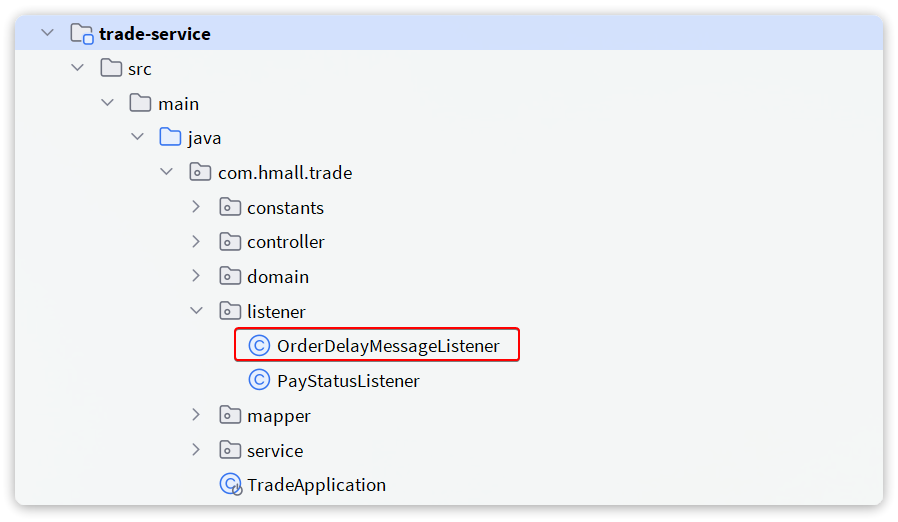

代码如下：

```Java
package com.hmall.trade.listener;

import com.hmall.api.client.PayClient;
import com.hmall.api.dto.PayOrderDTO;
import com.hmall.trade.constants.MQConstants;
import com.hmall.trade.domain.po.Order;
import com.hmall.trade.service.IOrderService;
import lombok.RequiredArgsConstructor;
import org.springframework.amqp.rabbit.annotation.Exchange;
import org.springframework.amqp.rabbit.annotation.Queue;
import org.springframework.amqp.rabbit.annotation.QueueBinding;
import org.springframework.amqp.rabbit.annotation.RabbitListener;
import org.springframework.stereotype.Component;

@Component
@RequiredArgsConstructor
public class OrderDelayMessageListener {

    private final IOrderService orderService;
    private final PayClient payClient;

    @RabbitListener(bindings = @QueueBinding(
            value = @Queue(name = MQConstants.DELAY_ORDER_QUEUE_NAME),
            exchange = @Exchange(name = MQConstants.DELAY_EXCHANGE_NAME, delayed = "true"),
            key = MQConstants.DELAY_ORDER_KEY
    ))
    public void listenOrderDelayMessage(Long orderId){
        // 1.查询订单
        Order order = orderService.getById(orderId);
        // 2.检测订单状态，判断是否已支付
        if(order == null || order.getStatus() != 1){
            // 订单不存在或者已经支付
            return;
        }
        // 3.未支付，需要查询支付流水状态
        PayOrderDTO payOrder = payClient.queryPayOrderByBizOrderNo(orderId);
        // 4.判断是否支付
        if(payOrder != null && payOrder.getStatus() == 3){
            // 4.1.已支付，标记订单状态为已支付
            orderService.markOrderPaySuccess(orderId);
        }else{
            // TODO 4.2.未支付，取消订单，回复库存
            orderService.cancelOrder(orderId);
        }
    }
}
```

注意，这里要在OrderServiceImpl中实现cancelOrder方法，留作作业大家自行实现。


