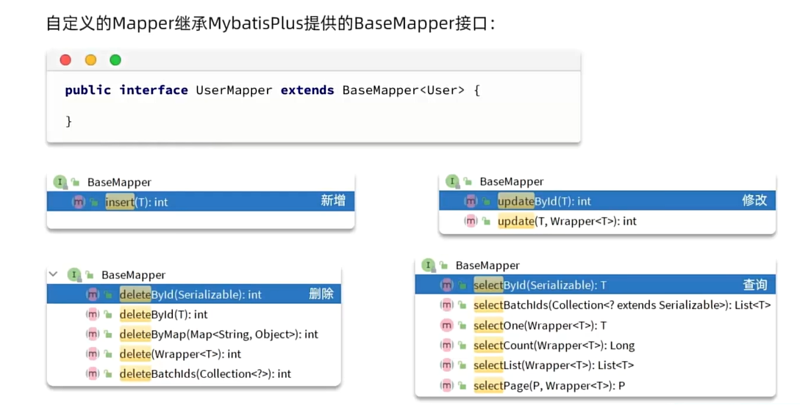
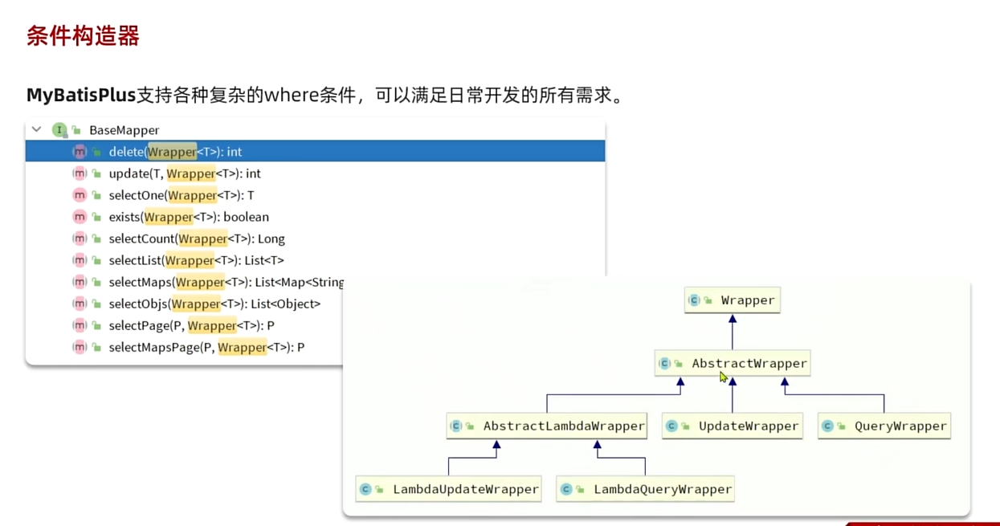
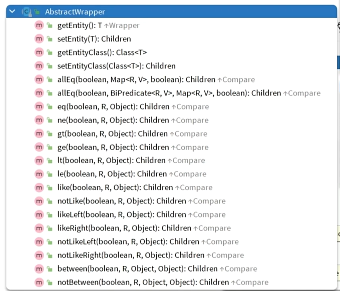
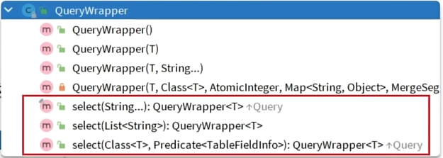
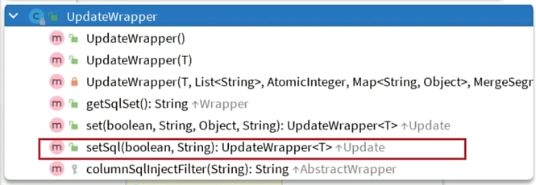
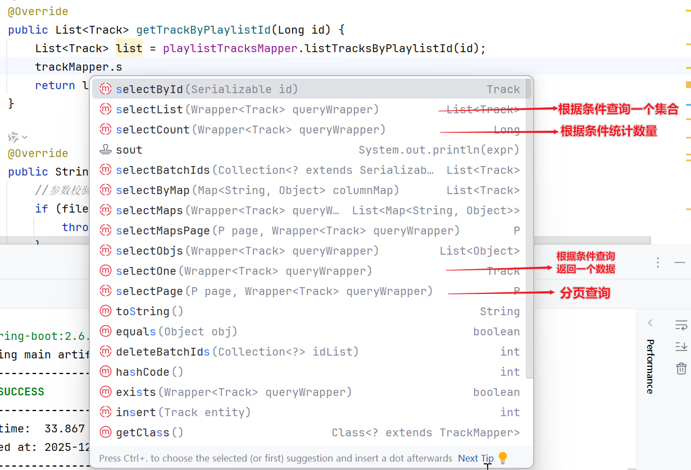

> 具体场景中是否使用mybatis plus、怎么使用，还是得看团队规范


# 快速入门

1. **引入mybatis依赖**

   ```xml
   <dependency>
       <groupId>com.baomidou</groupId>
       <artifactId>mybatis-plus-boot-starter</artifactId>
       <version>3.5.3.1</version>
   </dependency>
   ```

   

   

   

2. 自定义Mapper**继承MybatisPlus提供的BaseMapper类**：

   ```
   public interface UserMapper extends BaseMapper<User>{
   	
   }
   ```

   > 继承的时候要指定泛型（**泛型为想要操作的实体类**）

3. **注入xxMapper对象**

   直接使用xxMapper对象调用继承下来的方法

   

   4. [配置 配置文件](##配置)
   5. [调用api完成查询语句](##查询语句编写)
      [调用api完成更新语句](##更新语句编写)
      [调用api完成插入语句](##插入语句编写)
      [调用api完成删除语句](##删除语句编写)


## 配置

常见配置

* mybatisplus的配置项继承了MyBatis原生配置，并且有自己特有的配置

  ```yaml
  mybatis-plus:
    #mapper配置文件
    mapper-locations: classpath*:mapper/**/*.xml
    type-aliases-package: top.blog.entity # 别名扫描包(项目中实体类放置的包路径)
    configuration:
      #开启驼峰和下划线的映射
      map-underscore-to-camel-case: true
      log-impl: org.apache.ibatis.logging.stdout.StdOutImpl
      cache-enabled: false # 是否开启二级缓存
    global-config:
      db-config:
        id-type: assign_id # 设置全局的id生成策略：id为雪花算法生成【mybatis plus 会自动主键回填】
        update-strategy: not_null # 设置更新策略：只更新非空字段
      
  ```

  

* 常用配置讲解

  

  > 备注：大部分不用手动配置，使用默认即可，如果有需要更改配置就到yml文件中自己修改

* 

  > [官方文档](https://baomidou.com/reference/)中写明了mp支持的全部配置，需要了解的可以跳转
  >
  > 
  >
  > 
  >
  > 


## 条件构造器


* 作用：
  应对真实业务中复杂的条件，使用条件构造器构造

> 简单查询用wrapper，复杂查询自己写


> 
>

> QueryWrapper拓展了查询相关的功能（允许指定需要查询的字段）
>
> 
>
> updataWrapper扩展了更新功能（set部分，）
>
> 


## **查询语句编写**

> #### 基于LambdaQueryWrapper的查询


1. 构建查询条件【lambdaQueryWrapper】
   泛型填写<u>数据表所映射的实体类</u>

2. 调用select* 方法查询

   


**条件查询**

```java
//1. 构建查询条件
LambdaQueryWrapper<User> wrapper = new LambdaQueryWrapper<User>()
    .select(User::getId,User::getUsername,User::getInfo,User::getBalance)// （如果需要 指定查询出来的字段）
    // 构建查询条件
    .like(User::getUsername,"o")
    .and(wrapper -> wrapper.eq(User::getAge, 18).or().eq(User::getAge, 20))// （多条件）
    .ge(user::getBalance,1000);

//2. 查询
List<User> users = userMapper.selectList(wrapper);
```

**分页查询**

> 核心方法：`IPage<T> selectPage(P page, Wrapper<T> queryWrapper)`
>
> 1. 创建分页对象 `Page`
> 2. 构建查询条件
> 3. 调用`selectPage`方法
> 4. 获取分页结果
>    (返回值包括**当前页数据列表、总记录数、总页数**、当前页、每页大小)

```java
Page<User> page = new Page<>(currentPage, pageSize)// 创建分页对象（传入要查询的页数 和 页的大小）
    
// 构建查询条件(可选，如果需要分页查询+条件查询的话)
LambdaQueryWrapper<User> wrapper = new LambdaQueryWrapper<>();
wrapper.eq(User::getName, "周杰伦");
wrapper.gt(User::getAge, 18); // 大于18岁

// 调用selectPage方法
IPage<User> result = trackMapper.selectPage(page, wrapper);// 返回值包括当前页数据列表、总记录数、总页数、当前页、每页大小
List<User> records = result.getRecords();        // 当前页的数据列表
long total = result.getTotal();                   // 总记录数
int pages = result.getPages();                    // 总页数
int current = result.getCurrent();                // 当前页
int size = result.getSize();                      // 每页大小
```

> ##### 补充：为什么推荐使用Lambdaxxx构建查询条件
>
> 在 MyBatis-Plus 中，**`LambdaQueryWrapper<T>` 和 `QueryWrapper<T>` 都能构建查询条件**，但 **推荐优先使用 `LambdaQueryWrapper<T>`**(若不涉及复杂sql函数、动态列时)，原因如下：
>
> 区别：字段引用方式不同
>
> | 特性     | `QueryWrapper<User>`                   | `LambdaQueryWrapper<User>`                     |
> | -------- | -------------------------------------- | ---------------------------------------------- |
> | 字段引用 | 字符串硬编码： `.eq("name", "周杰伦")` | Lambda 表达式： `.eq(User::getName, "周杰伦")` |
> | 类型安全 | ❌ 编译期无法检查字段是否存在           | ✅ 编译时报错（若字段不存在或拼错）             |
> | IDE 支持 | ❌ 无自动补全、跳转                     | ✅ 自动补全、Ctrl+点击跳转到 getter 方法        |
> | 重构友好 | ❌ 改实体类字段名后需手动改字符串       | ✅ IDE 自动重命名所有引用                       |
>
> 备注：
>
> - **MyBatis-Plus 官方文档**明确推荐使用 `LambdaQueryWrapper` 提升代码健壮性。
> - **《阿里巴巴 Java 开发手册》** ：避免魔法值（magic string），字段名应通过代码引用。
>
> ------
>
> 
>
> ##### 什么时候用 `QueryWrapper`？
>
> 虽然 `LambdaQueryWrapper` 是首选，但以下场景**必须用 `QueryWrapper`**：
>
> | 场景                           | 示例                                                         |
> | ------------------------------ | ------------------------------------------------------------ |
> | **动态字段名**                 | `String field = isVip ? "vip_level" : "level"; wrapper.eq(field, 5);` |
> | **数据库函数/原生 SQL**        | `wrapper.apply("DATE(create_time) = {0}", "2025-12-31");`    |
> | **复杂子查询或 EXISTS**        | `wrapper.exists("SELECT 1 FROM album WHERE album.id = track.album_id AND status = 1");` |
> | **多表关联字段（非当前实体）** | 查询中涉及 `user.name` 但当前是 `Order` 实体                 |
>
> > 💡 小技巧：可以在 `LambdaQueryWrapper` 中嵌套 `QueryWrapper` 来处理特殊片段：
> >
> > ```java
> > lqw.and(w -> w.apply("MOD(id, 2) = 0"));
> > ```
>
> 
> 


## 更新语句编写


**1.使用`updateById`方法**

```java
User user = new User();
user.setId(1L);
user.setAge(18);
user.setBalance(1000);

// 将 id=1 的用户 balance 改为 1000, 年龄改为18
userMapper.update(user);
```


> 注意：
> updateById 方法不会自动只更新不为 Null 的属性，它会将实体对象中的所有字段值更新到数据库中，包括显式设置为 null 的字段


**2.使用`update(entity, wrapper)`方法**

> 传入的entity用于 指定需要重新set的字段（自动只set非空的字段）
>
> 传入的wrapper指定更新条件——对什么数据进行更新

```java
User user = new User();
user.setAge(18);
user.setBalance(1000);

// 将 id=1 的用户 balance 改为 1000, 年龄改为18
userMapper.update(
    user, // SET 部分
    new LambdaUpdateWrapper<User>().eq(User::getId, 1L)
);
```


**3.使用`update(wrapper)`方法【只用wrapper】**

```java
LambdaUpdateWrapper<User> updateWrapper = new LambdaUpdateWrapper<User>()
                .eq(User::getId, id)
                .set(User::getName, userDTO.getName())
                .set(User::getAge, userDTO.getAge());
        
userMapper.update(updateWrapper);
```

> update user set balance = balance - 200 where id in (1,2,4)

> ge 大于等于（greater and equal）
>
> gt 大于（greater than）


**4.链式更新**

```java
// MyBatis-Plus 3.4+ 支持
userMapper.update()
    .set(User::getBalance, new BigDecimal("5000"))
    .eq(User::getId, 1L)
    .update();
```


* lambadaWrapper的使用

  > 和之前其他wrapper的区别：构建条件使用的是lambada的语法

* 案例

  ```java
  //1. 构建查询条件
  QueryWrapper<User> wrapper = new QueryWrapper<User>()
      .select(User::getId,User::getUsername,User::getInfo,User::getBalance)
      .like(User::getUsername,"o")
      .ge(User::getBalance,1000);
  
  //2. 查询
  userMapper.selectList(wrapper);
  ```

  

几种条件构造器的用法

* QueryWrapper和LambdaQueryWrapper通常用来构建select、delete、update的where条件部分
* UpdateWrapper和LambdaUpdateWrapper通常只有在set语句比较特殊才使用
* 尽量使用LambdaQueryWrapper和LambdaUpdateWrapper，避免硬编码


## 插入语句编写

> 不需要wrapper，直接转实体


```java
User user = new User();
user.setUsername("alice");
user.setAge(22);
user.setBalance(new BigDecimal("2000"));

userMapper.insert(user); // 自动填充 id（如果配置了）
```

> ✅ 如果有自动填充字段（如 `createTime`），可在实体类上加 `@TableField(fill = FieldFill.INSERT)`。


## 删除语句编写


**1.构造wrapper**

```java
// 删除 age < 18 的用户
userMapper.delete(
    new LambdaQueryWrapper<User>()
        .lt(User::getAge, 18)
);
```


**2.链式删除**

```java
userMapper.delete()
    .lt(User::getAge, 18)
    .remove();
```


> ##### 封装的其他删除方法
>
> ```java
> userMapper.deleteById(1L);                 // 单个
> userMapper.deleteBatchIds(List.of(1L,2L)); // 批量
> ```
>
> 


# 常见注解

> 通过注解，mp可以知道要访问那张表、表中有哪些信息


* 继承的时候会指定泛型

  * mp通过扫描指定的实体类，并基于反射获取实体类信息作为数据库表信息

    * **类名驼峰转下划线作为表名**

      > (不用手动开启驼峰命名)

    * **名为id的字段作为主键**

    * **变量名驼峰转下划线作为表的字段名**


> 约定大于配置：
> 符合约定就不用配置；
> 但是如果实体类不符合约定，就需要手动配置（自己定义表名、注解名、字段）


* **常用注解**

  [注解配置 | MyBatis-Plus](https://baomidou.com/reference/annotation/#tablename)

  * **@TableName**—**—用于指定表名**

    ```
    @TableName("tb_user")
    public class User{
    
    }
    ```

    

  * **@TableId——用来指定表中的主键字段信息**
  
    ```
    @TableId("id")
    private Long xx;
    ```

    支持设定id的增长策略

    ```
    @TableId(value="id",type=IdType.AUTO)
    private Long xx;
    ```
  
    * AUTO：数据库自增长
  
    * INPUT：通过set方法执行输入
  
    * ASSIGN_ID：分配ID
      使用IdentifierGenerator接口的nextId方法生成id
      （即默认实现类DefaultIdentifierGenerator的雪花算法 来生成id）

      > 如果没有指定type=IdType.xx，会默认使用ASSIGN_ID（即雪花算法）

  * **@TableField**——**用来指定表中的普通字段信息**
  
    ```
    @TableField("username")
    private String name;
    ```
  
    > 成员变量名和字段名不一致
  
    ```
    @TableField("is_married")
    private Boolean isMarried;
    ```
  
    > **is开头的mp底层会把is去掉、然后作为变量名**
    > **所以is开头的成员变量也要手动制定对应的字段**
  
    ```
    @TableField("`order`")
    private Integer order;
    ```
  
    **如果有成员变量名和数据库关键字一致，也要指定**
  
    
    
    ```
    @TableField("exist=false")
    private String address;
    ```
    
    如果有一个字段不是数据库字段
    
  * 


* 注意
  * 一定要有一个主键，mp才能基于主键做增删改查


#### 如何选择id的增长策略


# 核心功能


## 自定义SQL


* 应用场景：

  * 团队要求使用mp，且sql语句除了where条件之外的部门没办法利用mp更方便的实现、只能是拼接(这会违背企业开发规范)，这种场景下建议使用  wrapper构建条件+自定义其他部分sql语句

  * 将复杂的where条件的构建 交给mp实现(mp擅长的领域)，其余sql自定义

  * 将mp构建好的条件往下传递给mapper层，在mapper中实现sql语句的组装

    > 不再业务层中处理，更符合企业的开发规范


* 步骤

  1. 基于Wrapper构建where条件

     ```
     List<Long> ids = List.of(1L,2L,4L);
     int amount = 200;
     LambdaQueryWrapper<User> wrapper = new LambdaQueryWrapper<User>().in(User::getId,ids);
     
     ```

     

  2. 自定义mapper方法调用

     ```
     userMapper.updateBalanceByIds(wrapper,amount);
     ```

     mapper方法的参数需要用注解声明变量名称(**这里wrapper变量名称必须是ew**)

     > ew：entity wrapper

     ```
     void updateBalanceByIds(@Param("ew") LambdaQueryWrapper<User> wrapper,@Param("amount") int amount)
     ```

  3. 自定义xml中书写sql语句前半部分后半部分使用Wrapper构造的条件

     ```xml
     <update id="updateBalanceByIds">
         update user set balance = balance -#{amount} ${ew.customSqlSegment}
     </update>
     
     ```

     

     


* 案例：将id在指定范围内的用户（例如1、2、4）的余额扣减指定值 

  ```xml
  update user
      set balance = balance - #{amount}
  	where id in
  	<foreach collection="ids" separator="," item="id" open="(" close=")">
          #{id}
  </foreach>
  ```

  

  


> ew：EntityWrapper


## Service接口


* 使用中
  我们的接口需要继承IService接口
  我们的实现类需要集成ServiceImpl接口

  ```
  public classUserServiceImpl extends ServiceImpl<UserMapper,User> implements UserService{}
  ```

  > 仍然实现我们自定义的接口，同时继承mp提供的ServiceImpl
  > 【这里泛型填写用到的Mapper层和操作的实体类】
  >
  > 


* 提供了封装好的批处理方法
* saveOrUpdate增或改，会判断是否存在当前id，智能选择修改或更新
* 查询
  * 单个查询调用get 查多个调用list
  * count查数量
  * page分页查询
  * 复杂条件的查询：lambdaQuery()


* 更新
  * 复杂条件的更新：lambdaUpdate()


#### 实际使用


* 测试方法

```
@Autowired
private UserService userService;
//...省略构造user的代码
userService.save(user);


```

* 增删改查用户

  

  **新增用户**

  ```
  @ApiOperation("新增用户接口")
  @PostMapping
  public Result saveUser(@RequestBody UserFormDTO userDTO){
  	//拷贝
  	User user = BeanUtil.copyProperties(userDTO,User.class);
  	//（补充属性）
  	//新增
  	userService.save(user);//(省掉了自己写service层方法)	
  	return Result.success();
  }
  
  
  ```

  **删除用户**

  ```
  @ApiOperation("删除用户接口")
  @DeleteMapping("/{id}")
  public Result deleteUserById(@ApiParam("用户id") @PathVariable("id") Long id){
  	//删除
  	userService.removeById(id);//(省掉了自己写service层方法)	
  	return Result.success();
  }
  ```

  **根据id查询用户接口**

  ```
  @ApiOperation("查询用户接口")
  @GetMapping("{id}")
  public Result queryUserById(@ApiParam("用户id") @PathVariable("id") Long id){
  	//查询
  	User user = userService.getById(id);
  	//拷贝到vO
  	UserVO userVO = BeanUtil.copyProperties(user,UserVO.class);
  	//(执行业务逻辑、补充属性)
  	//返回
  	return Result.success(userVO);
  }
  ```

  **批量id查询用户接口**

  ```
  @ApiOperation("批量查询用户接口")
  @GetMapping
  public Result<List<UserVO>> queryUserByIds(@ApiParam("用户id集合") @PathVariable("ids") List<Long> ids){
  	//查询
  	List<USer> userList = userService.listById(ids);
  	//拷贝到vO
  	List<UserVO> userVOList = BeanUtil.copyToList(user,UserVO.class);
  	//(执行业务逻辑、补充属性)
  	//返回
  	return Result.success(userVOList);
  }
  ```

  > **拷贝集合使用copyToList方法**


> 没什么业务逻辑的简单方法可以直接在controller层使用mp搞定，无需自定义service
>
> 复杂业务逻辑的方法还是要自定义Service层
>
> 复杂业务逻辑中如果要自定义sql语句，就要用到Mapper层

* 根据id扣减余额

  ```
  @ApiOperation("扣减用户余额接口")
  @PutMapping("/{id}/deduction/{money}")
  public Result deleteUserById(
  @ApiParam("用户id") @PathVariable("id") Long id
  @ApiParam("扣减金额") @PathVariable("money") Integer money){
  	userService.deductBalance(id,money);
  	return Result.success();
  }
  ```

  ```
  public interface UserService extends IService<User>{
  	void deductBalance(Long id,Integer money);
  }
  ```

  ```
  public class UserServiceImpl extends ServiceImpl<UserMapper,User> implements UserService{
  	@Override
  	public void deductBalance(Long id,Integer money){
  		//1. 查询用户
  		User user = getById();
  		//User user = this.getById();
  		
  		//2. 检验用户状态用户
  		
  		if(user==null || user.getStatus() == 2){
  			throw new RuntimeException("用户状态异常");
  		}
  		
  		
  		//3. 检验余额是否充足
  		if(user.getBalance() < money){
  			throw new RuntimeException("用户余额不足");
  		}
  		
  		//4. 扣减金额
  		user.setBalance(user.getBalance().substract(money));
  		update(user);
  		
  		
  		
  	}
  }
  ```

  > 采用反向校验，如果不符合条件，就抛出异常，最后直接写一个扣减金额的逻辑
  >
  > 如果采用多层if嵌套的方式，代码就不够简洁，可读性差


* Lambda查询

  

  查询用户列表接口

  ```
  @ApiOperation("批量查询用户接口")
  @GetMapping("/list")
  public Result<List<UserVO>> queryUsers(UserQuery query){
  	List<UserVO> userVOList = userService.queryUsers(query);
  	return Result.success(userVOList);
  }
  ```

  ```
  public List<UserVO> queryUsers(UserQuery query){
  	lambdaQuery().
  		.like(name !=null,User::getUsername,query.getName())
  		.eq(status !=null,User::getStatus,query.getStatus())
  		.gt(minBalance != null,User::getBalance,query.getMinBalance())
  		.lt(maxBalance != null,User::getBalance,query.getMaxBalance())
  		.list();//查多个，使用list()
  	return
  }
  
  
  
  ```

  


* 


## 代码生成器


* 三种配置方式
  * 按照官方文档写“生成代码”的代码
  * 使用mybatixX插件
  * 使用MyBatisPlus插件


* 这里使用的是MyBatisPlus插件


1. 连接数据库

   

   

2. 


> 
>


> 
>
> 
> 
> 


