# 单体架构

特点：将业务的所有功能集中在一个项目中开发，打成一个包部署

**优点**：

* 架构简单
* 部署成本低

* （小公司适合起步项目）


* 不适合大项目——功能复杂、开发人员多、功能模块多；

**缺点**

* 团队协作成本高

* 系统发布效率低、编译时间长(一次编译长达十分钟)

* 系统可用性差

  > 一些功能的并发功能高、一些功能的并发量低 但是重要
  >
  > 比如大量用户访问登录/查询商品、把TOMCAT资源耗尽，其他人交易/下单支付 就会发现特别卡顿


# 微服务


**特点**：微服务架构，是服务化思想指导下的一套最佳实践架构方案。服务化，就是把单体架构中的功能模块拆分为多个独立项目


优点

* 粒度小
  独立编译打包速度快，将来版本更新只需要重新编译部署有改动的模块
  每个服务有自己的数据库，之间没有影响
* 团队自治（不同团队不同项目，冲突少）
* 服务自治（分别部署，每个功能模块都是一个小的服务[微服务]）


# 微服务拆分


单一职责，每个小项目负责一个功能模块

每个团队负责一个小的项目


> **什么时候拆分**
>
> 


### 怎么拆分

**目标**

* **高内聚**：每个微服务的职责要尽量单一，包含的业务项目关联度高、完整度高

  > 如果将来需要升级和迭代微服务，如果需要修改的代码大部分都是在这个微服务内部的、几乎不动其他服务，说明你这个微服务的完整度高

* **低耦合**：每个微服务的功能要相对独立，尽量减少对其他微服务的依赖

  

**拆分方式**

* **纵向拆分**：按照业务模块来拆分

* **横向拆分**：抽取公共服务，提高复用性


**项目结构**

* **单体项目**：Maven聚合-父子工程

* **微服务项目**

  * **独立 project**

    让每一个微服务都是一个project（IDEA中的一个独立窗口；磁盘中的一个独立目录）
    每个微服务对应一个独立的代码仓库；完全解耦、耦合度最低；比较松散、管理有一定负担

    **【适合大厂的复杂大项目】**

    > 

  * **Maven聚合**

    每个微服务都是一个project下的一个module，由Maven聚合

    > 和单体多模块的区别：微服务项目里面的每个module都是能运行的，业务功能分散在不同的module里，每个module独立打包和部署

    **【适合没那么复杂的微服务项目(受中小厂欢迎 使用也较多)；减少管理负担】**


==拆分步骤==

（先拆分user-service 和其他模块耦合度低）

1. **创建一个新模块**

   

2. **[引入nacos依赖，在yml文件配置nacos注册中心的ip和端口](####服务注册)，注册这个微服务**(或者 如果有引入xx-api、并且里面有这个依赖 ，也行)

   编写bootstrap.yml文件

3. [编写nacos里面的通用配置](####Nacos通用配置收集)

4. **复制application*.yml配置文件**

   > ==注意修改==**里面占用的端口**、**连接的数据库**信息、**swagger的扫描包路径**
   >
   > > 如果是同一个mysql实例、不同的数据库，就修改下问号前面的名字
   > >
   > > 

5. **复制启动类，改名、改包路径**

   如果调用了client，需要在启动类加上
   `@EnableFeignClients(basePackages = "top.hazenix.api.client") // 启用Feign客户端，扫描指定包下的Feign接口`

   

6. 改包名：com.hmall改成com.hmall.cart/...
   避免类冲突，方便独立部署

7. **创建controller/service/mapper/domain等包，先拉POJO、再拉service、controller、**，将原单体项目中与这个模块相关的文件复制过来 (如果有爆红可能要修改下导包路径、引依赖；有些类有多个路径(比如order、user、address等)，不能自动导包、需要手动导包)

8. **如果原来的代码逻辑中涉及到路径的话** 由于微服务路径差异  要修改下这部分的路径

   9. **(方式一:创建一个xx-api模块【i存放各个微服务对外开放的api(Client)】，在xx-api模块编写client类)**

      > 复制client的时候，注解里面的name也要改
      >
      > 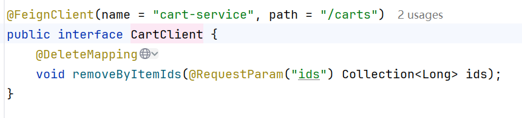

      如果当前微服务依赖其他微服务，引入xx-api的maven坐标
      (方式二：)
      略

9. 如果当前微服务需要注入common模块工具类里面的bean，然而common模块并不会被扫描到  bean就装配不到IOC容器
   需要给启动类加上`@Component`注解，指定需要扫描的包

   ```
   @ComponentScan(basePackages = {"top.hazenix", "top.hazenix.utils"}) // 扫描指定包，包括工具类所在的包
   ```

   

12. 在启动项里面启动，如果没有启动项、就自己添加下

    

    > 如果刷新完没有，就自己加入一下启动项
    >
    >
    > 
    > 


#### 应该拆分为哪些微服务

> 在微服务架构中，**如何拆分微服务**是系统设计的核心问题之一。拆分的目标是实现**高内聚、低耦合、独立部署、可扩展、可维护**的系统结构。
>
> ------
>
> ## 一、微服务拆分原则（指导思想）
>
> ### ✅ 1. **业务边界驱动（Domain-Driven Design, DDD）**
>
> - 按照**限界上下文（Bounded Context）**划分服务。
> - 每个微服务应围绕一个**清晰的业务能力**或**子域**构建。
>
> ### ✅ 2. **单一职责原则（SRP）**
>
> - 一个微服务只负责一件事，比如“用户管理”、“订单处理”、“支付”。
>
> ### ✅ 3. **自治性**
>
> - 微服务应能独立开发、测试、部署、扩展、运维。
> - 数据库也应私有（每个服务有自己的 DB，不共享表）。
>
> ### ✅ 4. **避免分布式事务**
>
> - 尽量通过**最终一致性 + 消息队列**解决跨服务数据一致性。
>
> ------
>
> #### 二、常见微服务模块（按典型业务系统分类）
>
> 以下是一个**电商/互联网平台**常见的微服务划分示例（可根据实际业务调整）：
>
> | 微服务名称                     | 职责说明                                                     |
> | ------------------------------ | ------------------------------------------------------------ |
> | **user-service**               | 用户管理：注册、登录、个人信息、权限、角色、地址管理等       |
> | **auth-service / iam-service** | 认证与授权（OAuth2、JWT 签发、RBAC）                         |
> | **product(item)-service**      | 商品管理：商品信息、分类、SKU、库存（有时库存单独拆）        |
> | **inventory-service**          | 库存服务（高并发场景下独立，支持扣减、回滚、预警）           |
> | **order-service**              | 订单创建、状态管理、超时取消                                 |
> | **payment-service**            | 支付对接（微信、支付宝）、支付状态回调、对账                 |
> | **cart-service**               | 购物车管理（临时存储用户选中的商品）                         |
> | **promotion-service**          | 优惠券、满减、折扣、秒杀活动等营销逻辑                       |
> | **notification-service**       | 消息通知（短信、邮件、站内信、推送）                         |
> | **file-service / oss-service** | 文件上传、存储、CDN 管理                                     |
> | **search-service**             | 商品搜索（通常基于 Elasticsearch）                           |
> | **recommendation-service**     | 推荐系统（协同过滤、热门推荐等）                             |
> | **gateway-service**            | API 网关（路由、鉴权、限流、日志）                           |
> | **config-service**             | 配置中心（如 Nacos Config、Apollo）                          |
> | **monitoring / observability** | 日志收集（ELK）、指标监控（Prometheus+Grafana）、链路追踪（SkyWalking） |
>
> > 💡 注意：不是所有系统都需要全部服务！小型项目可合并，如将 `user` 和 `auth` 合并，`product` 和 `inventory` 合并。
>
> ------
>
> #### 三、通用型微服务（ 基础设施类）
>
> 这些服务通常与具体业务无关，但支撑整个系统运行：
>
> | 服务类型                  | 说明                                    |
> | ------------------------- | --------------------------------------- |
> | **API Gateway**           | 统一入口，路由、认证、限流、熔断        |
> | **Service Registry**      | 服务注册与发现（Nacos、Eureka、Consul） |
> | **Config Server**         | 外部化配置管理                          |
> | **Message Queue Service** | 异步解耦（RabbitMQ、Kafka、RocketMQ）   |
> | **Distributed Scheduler** | 分布式任务调度（XXL-JOB、Quartz 集群）  |
> | **Audit / Log Service**   | 操作审计、日志归集                      |
>
> > ⚠️ 这些通常是**中间件或平台组件**，不一定需要你“开发”，但需集成。
>
> ------
>
> ## 四、拆分建议（从单体到微服务）
>
> ### 初期（MVP 阶段）：
>
> - 可先保留单体，或仅拆出 **用户中心 + 网关 + 配置中心**。
> - 避免过早微服务化（增加运维复杂度）。
>
> ### 中期（业务增长）：
>
> - 按高频变更、高负载、核心业务拆分。
>   - 例如：订单和支付拆开，因为支付涉及第三方且需高安全。
>   - 商品和库存拆开，因为库存需高并发扣减。
>
> ### 成熟期（大型系统）：
>
> - 按 DDD 严格划分限界上下文。
> - 引入领域事件、CQRS、Saga 模式处理复杂流程。
>
> ------
>
> ## 五、反模式（避免错误拆分）
>
> | 错误做法                                         | 问题                       |
> | ------------------------------------------------ | -------------------------- |
> | 按技术层拆分（如 “DAO 服务”、“Controller 服务”） | 违背业务内聚，调用链极长   |
> | 一个微服务对应一张数据库表                       | 粒度过细，通信成本高       |
> | 所有服务共用一个数据库                           | 丧失自治性，无法独立演进   |
> | 微服务之间强事务依赖                             | 导致分布式事务复杂、性能差 |
>
> ------
>
> ## 六、参考案例
>
> ### 1. **电商系统**
>
> - user, product, cart, order, payment, inventory, promotion, search
>
> ### 2. **社交平台**
>
> - user, friend, post, comment, message, notification, feed
>
> ### 3. **SaaS 系统**
>
> - tenant（租户管理）, user, role-permission, billing, audit
>
> ------
>
> ## 总结
>
> > **微服务不是越多越好，而是“恰到好处”地按业务能力拆分。**
>
> ✅ 建议步骤：
>
> 1. 画出业务流程图和领域模型；
> 2. 识别核心子域（Core Domain）、支撑子域（Supporting）、通用子域（Generic）；
> 3. 优先拆分**高价值、高变化、高负载**的模块；
> 4. 保证每个服务有明确的 API 边界和数据所有权。
>
> 如果你提供具体业务场景（如“在线教育平台”、“物流系统”），我可以给出更精准的拆分建议。


以下是 **6 个核心微服务模块** 的推荐拆分方式：

| 微服务名称       | 职责       | 控制层                                                       | 包含核心功能                                                |
| ---------------- | ---------- | ------------------------------------------------------------ | ----------------------------------------------------------- |
| `user-service`   | 用户中心   | `UserController`、`AddressBookController`                    | 用户注册、登录、个人信息、地址管理                          |
| `cart-service`   | 购物车中心 | `ShopingCartController`                                      | 用户购物车增删改查                                          |
| `shop-sercice`   | 商家中心   | `ShopController`、`CategoryController`                       | 商家信息、店铺管理、营业状态、分类管理                      |
| `dish-service`   | 菜品中心   | `DishController(user和admin )`、`SetmealController(user和admin )` | 菜品管理、套餐管理、口味标签、上下架                        |
| `order-service`  | 订单中心   | `OrderController`（user 和 admin 都有）                      | 用户下单+管理端订单操作、支付、订单查询、订单状态变更、退款 |
| `pay-service`    | 支付中心   | `PayNotifyController`                                        | 支付回调处理、支付状态查询、生成支付链接                    |
| `report-service` | 报表中心   | `ReportController`                                           | 数据统计、经营分析、报表导出                                |


#### ==依赖管理==

```
parent-project (父模块)
├── pom.xml
├── xx-common/
│   └── pom.xml
├── xx-api/
│   └── pom.xml
├── service-a/
│   └── pom.xml
├── service-b/
│   └── pom.xml
└── gateway/
    └── pom.xml
```

> 
>
> 为了保持代码清晰、依赖可控、避免循环引用和重复依赖，各类依赖应按以下原则分配到不同模块的 `pom.xml` 中：
>
> ------
>
> #### ✅ 1. **父模块（parent-project/pom.xml）**
>
> **作用**：统一管理所有子模块的版本、依赖管理（dependencyManagement）、插件配置等。
>
> #### 应包含：
>
> - ```
>   <dependencyManagement>
>   ```
>
>   ：==**集中声明所有依赖的版本（不实际引入）**==。
>
>   ```xml
>   <dependencyManagement>
>     <dependencies>
>       <dependency>
>         <groupId>org.springframework.boot</groupId>
>         <artifactId>spring-boot-dependencies</artifactId>
>         <version>3.2.0</version>
>         <type>pom</type>
>         <scope>import</scope>
>       </dependency>
>       <dependency>
>         <groupId>com.alibaba.cloud</groupId>
>         <artifactId>spring-cloud-alibaba-dependencies</artifactId>
>         <version>2022.0.0.0</version>
>         <type>pom</type>
>         <scope>import</scope>
>       </dependency>
>       <!-- 自定义模块版本 -->
>       <dependency>
>         <groupId>com.example</groupId>
>         <artifactId>xx-common</artifactId>
>         <version>${project.version}</version>
>       </dependency>
>     </dependencies>
>   </dependencyManagement>
>   ```
>
> - `<properties>`：**定义通用属性（如 Java 版本、编码、自定义模块版本号等）**。
>
> - `<modules>`：声明子模块。
>
> > ❌ 不要在这里直接 `<dependencies>` 引入具体依赖（除非所有子模块都需要，极少见）。
>
> ------
>
> #### ✅ 2. **xx-common 模块（公共工具/基础类库）**
>
> **作用**：存放所有微服务**共享的工具类、常量、异常、DTO 基类、通用配置**等。
>
> #### 应包含：
>
> - 工具类依赖（仅限无 Spring 上下文的纯 Java 工具）：
>   如 ==lombok==、==hutool==、、、
>
>   ```xml
>   <dependencies>
>     <dependency>
>       <groupId>org.apache.commons</groupId>
>       <artifactId>commons-lang3</artifactId>
>     </dependency>
>     <dependency>
>       <groupId>com.google.guava</groupId>
>       <artifactId>guava</artifactId>
>     </dependency>
>     <dependency>
>       <groupId>cn.hutool</groupId>
>       <artifactId>hutool-all</artifactId>
>     </dependency>
>     <!-- Lombok（用于 DTO 等） -->
>     <dependency>
>       <groupId>org.projectlombok</groupId>
>       <artifactId>lombok</artifactId>
>       <scope>provided</scope>
>     </dependency>
>   </dependencies>
>   ```
>
> > ⚠️ **避免引入 Spring、Spring Boot、数据库、Web 等框架依赖，否则会导致所有服务被迫加载这些依赖。**
>
> ------
>
> ## ✅ 3. **xx-api 模块（Feign 接口 / DTO 定义）**
>
> **作用**：定义微服务之间的接口契约（Feign Client）和传输对象（DTO），供消费方和服务提供方共用。
>
> ### 应包含：
>
> - ==对 `xx-common` 的依赖==（用于继承 BaseDTO、异常等）。
>
> - ==**Feign 相关**==注解（但不引入完整 Spring Cloud）：
>
>   ```xml
>   <dependencies>
>     <dependency>
>       <groupId>com.example</groupId>
>       <artifactId>xx-common</artifactId>
>     </dependency>
>     <!-- Feign 核心注解（非运行时依赖） -->
>     <dependency>
>       <groupId>org.springframework.cloud</groupId>
>       <artifactId>spring-cloud-openfeign-core</artifactId>
>       <scope>provided</scope> <!-- 或 compile，视情况 -->
>     </dependency>
>   </dependencies>
>   ```
>
> ```
> //示例
> ```
>
> 
>
> > ✅ 消费方（如 service-b）引入 `xx-api` 即可调用 service-a 的接口。
> > ❌ 不要在此模块引入 Web、数据库、业务逻辑等依赖。
>
> ------
>
> ## ✅ 4. **微服务模块（service-a, service-b 等）**
>
> **作用**：实现具体业务逻辑的独立服务。
>
> ### 应包含：
>
> - **业务依赖**：
>
>   - ==Spring Boot Starter==（web, data-jpa, redis, etc.）
>   - ==数据库驱动==（MySQL, PostgreSQL）
>   - ==消息队列==（RabbitMQ, Kafka）
>   - ==安全==（Spring Security）
>   - ==服务注册发现==（Nacos/Eureka client）
>   - ==配置中心客户端==
>   - ==熔断限流==（Sentinel, Resilience4j）
>
> - **对内部模块的依赖**：
>
>   ```
>   <!--common模块-->
>   <dependency>
>       <groupId>top.hazenix</groupId>
>       <artifactId>eats-common</artifactId>
>       <version>1.0.1-SNAPSHOT</version>
>   </dependency>
>   
>   <!--api模块（如果有调用其他微服务）-->
>   <dependency>
>       <groupId>top.hazenix</groupId>
>       <artifactId>eats-api</artifactId>
>       <version>1.0.1-SNAPSHOT</version>
>   </dependency>
>   
>   <!--redis-->
>   <dependency>
>       <groupId>org.springframework.boot</groupId>
>       <artifactId>spring-boot-starter-data-redis</artifactId>
>   </dependency>
>   
>   <!--各个微服务基本必备：pagehelper/knife4j(swagger)/mysql/mybatis/spring-boot-starter-web/nacos-discovery/nacos-config/spring-cloud-starter-bootstrap/ ==========================-->
>   
>   <!--pagehelper-->
>   <dependency>
>       <groupId>com.github.pagehelper</groupId>
>       <artifactId>pagehelper-spring-boot-starter</artifactId>
>   </dependency>
>   
>   <!--knife4j依赖-->
>   <dependency>
>       <groupId>com.github.xiaoymin</groupId>
>       <artifactId>knife4j-openapi2-spring-boot-starter</artifactId>
>   </dependency>
>   
>   <!--mysql-->
>   <dependency>
>       <groupId>mysql</groupId>
>       <artifactId>mysql-connector-java</artifactId>
>       <scope>runtime</scope>
>   </dependency>
>   
>   <!--mybatis-->
>   <dependency>
>       <groupId>org.mybatis.spring.boot</groupId>
>       <artifactId>mybatis-spring-boot-starter</artifactId>
>   </dependency>
>   
>   <!--spring-boot-starter-web-->
>   <dependency>
>       <groupId>org.springframework.boot</groupId>
>       <artifactId>spring-boot-starter-web</artifactId>
>       <scope>compile</scope>
>   </dependency>
>   
>   <!--nacos 服务注册发现-->
>   <dependency>
>       <groupId>com.alibaba.cloud</groupId>
>       <artifactId>spring-cloud-starter-alibaba-nacos-discovery</artifactId>
>   </dependency>
>   
>   <!--nacos配置管理-->
>   <dependency>
>       <groupId>com.alibaba.cloud</groupId>
>       <artifactId>spring-cloud-starter-alibaba-nacos-config</artifactId>
>   </dependency>
>   
>   <!--读取bootstrap文件-->
>   <dependency>
>       <groupId>org.springframework.cloud</groupId>
>       <artifactId>spring-cloud-starter-bootstrap</artifactId>
>   </dependency>
>   <!--==================================================-->
>   ```
>
> * **生产者和消费者**需要依赖：
>
>   ```xml
>   <!--AMQP依赖，包含RabbitMQ-->
>   <dependency>
>       <groupId>org.springframework.boot</groupId>
>       <artifactId>spring-boot-starter-amqp</artifactId>
>   </dependency>
>   ```
>
>   
>
> 
>
> > ✅ **每个微服务只引入自己需要的依赖，保持轻量。**
>
> ------
>
> ## ✅ 5. **网关模块（gateway）**
>
> 类似微服务模块，但侧重：
>
> - ==Spring Cloud Gateway / Zuul==
> - ==认证鉴权（JWT, OAuth2）==
> - ==限流熔断==
> - ==不需要数据库、JPA== 等
>
> ------
>
> ## 📌 总结：依赖放置原则
>
> | 依赖类型                                               | 放置位置                       |
> | ------------------------------------------------------ | ------------------------------ |
> | 所有依赖的**版本管理**                                 | 父模块 `dependencyManagement`  |
> | 通用工具类（StringUtils, JSON 工具等）                 | `xx-common`                    |
> | Feign 接口 + DTO                                       | `xx-api`                       |
> | Spring Boot / Web / DB / MQ / 注册中心等**运行时依赖** | 各微服务模块自身               |
> | Lombok / MapStruct 等**编译期依赖**                    | 按需放在 `common` 或微服务模块 |
>
> ------
>
> ## 💡 最佳实践建议
>
> 1. **`xx-common` 尽量“无 Spring”**：避免污染所有服务。
> 2. **`xx-api` 只包含接口和 DTO**：不要放实现。
> 3. **微服务之间通过 `xx-api` 通信**：避免直接依赖对方的业务模块。
> 4. **父模块只管版本，不管依赖引入**：防止传递不需要的 jar。
>
> 这样设计后，项目结构清晰、依赖隔离良好、易于维护和升级。

**每个微服务只引入自己需要的依赖，有什么作用**

> “每个微服务只引入自己需要的依赖”是微服务架构中的一项**核心设计原则**，其作用远不止“减少 jar 包数量”这么简单。它对系统的**稳定性、可维护性、安全性、部署效率和演进能力**都有深远影响。
>
> ------
>
> ### ✅ 1. **降低耦合，提高内聚（高内聚低耦合）**
>
> - 如果一个订单服务不小心引入了用户中心的完整业务依赖（比如 `user-service` 的实现类），就可能在代码中直接调用其内部逻辑。
> - 这会导致**隐式耦合**：订单服务的行为依赖于用户服务的内部实现，一旦用户服务重构，订单服务可能意外崩溃。
> - **正确做法**：订单服务只依赖 `user-api`（接口契约），通过 Feign 或 REST 调用，实现**松耦合**。
>
> > 🔒 微服务之间的通信应仅通过**明确定义的 API**，而非共享代码或数据库。
>
> ------
>
> ### ✅ 2. **减小应用体积，加快启动速度**
>
> - 每多一个不必要的依赖（如 
>
>   ```
>   spring-boot-starter-data-mongodb
>   ```
>
>    在一个不用 MongoDB 的服务中），就会：
>
>   - 增加 JAR 包大小（从 50MB → 80MB）
>   - 延长 Spring Boot 启动时的类扫描和自动配置时间
>   - 增加内存占用（更多类加载到 JVM）
>
> > 🚀 在云原生/K8s 环境中，快速启动 = 更快扩缩容 + 更低冷启动延迟。
>
> ------
>
> ### ✅ 3. **减少安全风险面（Attack Surface）**
>
> - 每个依赖都可能包含漏洞（如 Log4j、Fastjson、Jackson）。
> - 如果一个服务本不需要 Redis，却引入了 `spring-boot-starter-data-redis`，而该 starter 又传递依赖了有漏洞的库，那么这个服务就**无端暴露在风险中**。
> - **最小化依赖 = 最小化攻击面**，符合安全最佳实践（Principle of Least Privilege）。
>
> ------
>
> ### ✅ 4. **避免类冲突和版本冲突**
>
> - 不同依赖可能传递引入**相同组件的不同版本**（如 A 依赖 Guava 30，B 依赖 Guava 32）。
> - 虽然 Maven 有依赖调解机制，但容易导致：
>   - `NoSuchMethodError`
>   - `ClassNotFoundException`
>   - 隐蔽的运行时行为异常
>
> > 💡 微服务独立依赖，可各自选择最适合的版本（只要 API 兼容），互不干扰。
>
> ------
>
> ### ✅ 5. **提升可测试性和可维护性**
>
> - 依赖越少，单元测试越容易（mock 对象更少）。
> - 开发者能更清晰理解服务职责：“这个服务只处理订单，为什么会有 Kafka 消费者？哦，原来是为了发通知——那应该拆给 notification-service！”
>
> ------
>
> ### ✅ 6. **支持独立技术栈演进**
>
> - 未来某个服务想从 MySQL 切换到 PostgreSQL？只要它自己的依赖里只有 JDBC 和 MyBatis，不影响其他服务。
> - 某个服务想尝试新框架（如 Quarkus）？因为依赖干净，迁移成本低。
>
> > 🌱 微服务的核心价值之一：**允许不同团队用不同技术栈独立演进**。
>
> ------
>
> ### ✅ 7. **便于容器化与资源优化**
>
> - 在 Docker/Kubernetes 中，镜像越小越好（Alpine + 精简 JAR）。
> - 无用依赖会增加镜像体积，浪费存储和网络带宽。
> - 资源调度（CPU/内存限制）也更精准：你知道这个服务实际需要多少资源。
>
> ------
>
> ### ❌ 反面例子：依赖“大杂烩”
>
> ```xml
> <!-- 错误示范：一个用户服务引入了所有 starter -->
> <dependencies>
>   <dependency><groupId>org.springframework.boot</groupId><artifactId>spring-boot-starter-web</artifactId></dependency>
>   <dependency><groupId>org.springframework.boot</groupId><artifactId>spring-boot-starter-data-jpa</artifactId></dependency>
>   <dependency><groupId>org.springframework.boot</groupId><artifactId>spring-boot-starter-amqp</artifactId></dependency>
>   <dependency><groupId>org.springframework.boot</groupId><artifactId>spring-boot-starter-data-redis</artifactId></dependency>
>   <dependency><groupId>org.springframework.boot</groupId><artifactId>spring-boot-starter-batch</artifactId></dependency>
>   <!-- 实际只用了 Web + JPA -->
> </dependencies>
> ```
>
> 后果：
>
> - 启动慢
> - 内存高
> - 安全漏洞多
> - 团队新人困惑：“我们用 RabbitMQ 吗？怎么从来没看到相关代码？”
>
> ------
>
> ### ✅ 正确做法：按需引入
>
> ```xml
> <!-- 用户服务只需要 Web + DB -->
> <dependencies>
>   <dependency>
>     <groupId>org.springframework.boot</groupId>
>     <artifactId>spring-boot-starter-web</artifactId>
>   </dependency>
>   <dependency>
>     <groupId>org.springframework.boot</groupId>
>     <artifactId>spring-boot-starter-data-jpa</artifactId>
>   </dependency>
>   <dependency>
>     <groupId>mysql</groupId>
>     <artifactId>mysql-connector-java</artifactId>
>   </dependency>
> </dependencies>
> ```
>
> ------
>
> ### 总结：为什么“只引入需要的依赖”如此重要？
>
> | 维度         | 好处                                     |
> | ------------ | ---------------------------------------- |
> | **架构**     | 保持服务边界清晰，避免隐式耦合           |
> | **性能**     | 启动更快、内存更低、镜像更小             |
> | **安全**     | 减少漏洞暴露面                           |
> | **运维**     | 故障排查更容易（依赖链简单）             |
> | **演进**     | 技术升级/替换成本低                      |
> | **团队协作** | 职责明确，减少“我不小心改了别人用的东西” |
>
> > 🧩 微服务不是“把单体切成多个小单体”，而是构建**自治、专注、轻量**的业务单元。**依赖精简**是实现这一目标的基础。
>
> 

此项目由于只有一个微服务用到了AliOssUtil，所以我不放common模块，放到调用者模块


### 数据库

* 每个微服务都有自己的mysql数据库(每个微服务一个独立的mysql实例)

  > 或者微服务共享一个mysql数据库，里面创建不同的database，模拟一下


**案例-黑马商城**


# 远程调用


微服务之间数据隔离、服务隔离，没办法本地调用，要做查询其他微服务的数据，就必须进行 网络调用（一个服务向另一个服务 通过网络 向另一个服务发起请求、获取数据）

> 类比前端向后端发起请求
>
> 


### 1.使用RestTemplate对象


在启动类里面给容器加入一个RestTemplate的bean

```
package com.hmall.cart;

import org.mybatis.spring.annotation.MapperScan;
import org.springframework.boot.SpringApplication;
import org.springframework.boot.autoconfigure.SpringBootApplication;

@MapperScan("com.hmall.cart.mapper")
@SpringBootApplication
public class CartApplication {
    public static void main(String[] args) {
        SpringApplication.run(CartApplication.class, args);
    }
    
    @Bean
    public RestTemplate restTemplate(){
    	return new RestTemplate(); 
    }
}
```

在需要远程调用的地方注入restTemplate对象

发起调用，查询其他微服务的数据

```
restTemplate.get();
restTemplate.put();
restTemplate.delete();
restTemplate.post();、

业务比较复杂的话，适合exchange()方法
ResponseEntity<List<ItemDTO>> response = restTemplate.exchange(
	"http://localhost:8081/items?ids={ids}",
	HttpMethod.GET,
	null,
	new ParameterizedTypeReference<List<ItemDTO>>(){},
	Map.of("ids",CollUtil.join(itemIds), ",")//hutool的一个工具类：CollUtil.join
);
```

拿到响应体，获取返回的数据

```
if(！response.getStatusCode().is2xxSuccessful()){
	return;//查询失败
}
List<ItemDTO> items = response.getBody();

//...  其他业务逻辑
```


### 注册中心


为解决服务治理问题 ⬇️ ，需要使用Nacos

* 硬编码，ip地址、端口写死，不适合负载均衡的需求——写代码的时候不知道用的哪个实例
* 无法感知服务变更


#### 原理

> 


服务提供者启动之后就会在注册中心注册自己的信息(ip地址、端口号等)

服务调用者需要调用服务的时候就可以从注册中心获取可以选择的服务

服务提供者和注册中心直接还会形成心跳，每个一段时间向注册中心发起请求、报告自身状态（没有心跳就认为宕机，从注册列表中剔除 并 向订阅这个服务的服务调用者推送最新的注册表信息(感知到变化)）


> 


#### **负载均衡**：

服务调用者调用某个功能的时候可能发现有多个实例，这时候从中选择一种实例 的动作，就叫做负载均衡

**负载均衡的各种算法：**

**随机**

**轮询**

**加权轮询**

权重更高的实例，访问的频率就更高


#### Nacos-其中一种注册中心框架

> Alibaba系列

[学习文档](https://ai.feishu.cn/wiki/R4Sdwvo8Si4kilkSKfscgQX0niB)

> 安装和部署可以看[黑马笔记](https://ai.feishu.cn/wiki/R4Sdwvo8Si4kilkSKfscgQX0niB)


1. 准备MySQL数据库表，用来 存储Nacos的数据

   

2. 拉镜像，创建并启动nacos服务端容器

   ```
   # 进入root目录
   docker run -d \
   --name nacos \
   --env-file ./nacos/custom.env \
   -p 8848:8848 \
   -p 9848:9848 \
   -p 9849:9849 \
   --restart=always \
   --network hazenix-net \
   nacos/nacos-server:v2.1.0-slim
   ```

3. 开放防火墙的8848端口、浏览器才能访问

   ```
   # 查看防火墙状态
   systemctl status firewalld
   
   # 查看开放的端口
   firewall-cmd --list-ports
   
   # 如果没开 8848，添加并永久生效
   firewall-cmd --add-port=8848/tcp --permanent
   firewall-cmd --add-port=9848/tcp --permanent
   firewall-cmd --add-port=9849/tcp --permanent
   firewall-cmd --reload
   ```

   还需要配置端口转发，使用必应浏览器访问（google可能被某个插件拦截了）

   > 你提供的信息非常关键，现在我们可以 **100% 确认问题根源**：
   >
   > ------
   >
   > ### ❌ 问题结论
   >
   > > **你的 Windows 电脑和虚拟机之间虽然能 `ping` 通（ICMP 层），但 TCP 连接被阻断（8848 端口无法建立连接）**。
   >
   > 这说明：
   >
   > - 虚拟机 **网络层（IP）可达**
   > - 但 **传输层（TCP）被拦截或未正确监听**
   >
   > 而你在虚拟机内已经确认：
   >
   > - `curl http://192.168.73.128:8848/nacos` ✅ 成功
   > - `docker port nacos` 显示绑定到 `0.0.0.0:8848` ✅
   > - 防火墙已放行 8848 ✅
   >
   > ------
   >
   > ## 🔍 最可能的原因：**VMware NAT 网络的端口转发未启用**
   >
   > 从你的 IP 地址 `192.168.73.128` 和网卡 `ens33` 判断，你使用的是 **VMware Workstation**，并且网络模式是 **NAT 模式**。
   >
   > ⚠️ **VMware 的 NAT 模式默认只允许虚拟机访问外网，不允许外部主动访问虚拟机！**
   >
   > 也就是说：
   >
   > - 虚拟机可以 `ping` 外网、上网
   > - 但 **宿主机（Windows）不能主动连接虚拟机的任意端口**（除非配置了端口转发）
   >
   > > 📌 这就是为什么 `ping` 通（ICMP 是双向的），但 `telnet`/`curl` 失败（TCP 连接被 VMware NAT 阻断）！
   >
   > ------
   >
   > ## ✅ 解决方案：在 VMware 中配置 **端口转发（Port Forwarding）**
   >
   > ### 步骤如下（VMware Workstation）：
   >
   > #### 1. 关闭虚拟机（必须关机才能修改）
   >
   > ```bash
   > # 在虚拟机中执行
   > sudo shutdown -h now
   > ```
   >
   > #### 2. 打开 VMware → 编辑 → 虚拟网络编辑器
   >
   > - 需要 **管理员权限**（点击“更改设置”）
   > - 选择 **VMnet8（NAT 模式）** → 点击 **“NAT 设置”**
   >
   > #### 3. 添加端口转发规则
   >
   > 点击 **“添加”**，填写：
   >
   > | 字段                                         | 值               |
   > | -------------------------------------------- | ---------------- |
   > | 主机端口（Host Port）                        | `8848`           |
   > | 虚拟机 IP 地址（Virtual Machine IP Address） | `192.168.73.128` |
   > | 虚拟机端口（Virtual Machine Port）           | `8848`           |
   > | 描述（可选）                                 | `nacos`          |
   >
   > 同样添加：
   >
   > - `9848 → 192.168.73.128:9848`
   > - `9849 → 192.168.73.128:9849`
   >
   > > ⚠️ 注意：**主机端口**是你在 Windows 上访问的端口，**虚拟机端口**是容器暴露的端口。
   >
   > #### 4. 启动虚拟机
   >
   > #### 5. 在 Windows 访问：
   >
   > ```
   > http://localhost:8848/nacos
   > ```
   >
   > > ✅ 不再用 `192.168.73.128`，而是用 `localhost`！
   >
   > ------
   >
   > ## 🧪 验证是否成功
   >
   > 在 Windows 执行：
   >
   > ```cmd
   > telnet localhost 8848
   > ```
   >
   > 或
   >
   > ```powershell
   > curl -v http://localhost:8848/nacos
   > ```
   >
   > 应该能成功连接！
   >
   > ------
   >
   > ## ❓为什么之前 `ping 192.168.73.128` 能通？
   >
   > 因为 VMware 的 NAT 网络允许 **ICMP 回显请求（ping）** 双向通信，这是为了方便调试。
   > 但 **TCP 连接默认是单向的（虚拟机 → 外网）**，反向需要手动配置端口转发。
   >
   > > 📚 官方文档说明：[VMware NAT Networking](https://docs.vmware.com/en/VMware-Workstation-Pro/17/rn/VMware-Workstation-17-Pro-Release-Notes.html)
   >
   > ------
   >
   > ## ✅ 替代方案：改用桥接模式（Bridged）
   >
   > 如果你不想每次配端口转发：
   >
   > 1. 关闭虚拟机
   > 2. VMware 设置 → 网络适配器 → **桥接模式（Bridged）**
   > 3. 启动虚拟机，它会从路由器获取一个真实 IP（如 `192.168.1.x`）
   > 4. 然后你就可以直接用这个 IP + 8848 访问，无需端口转发
   >
   > > ⚠️ 注意：桥接模式要求虚拟机和 Windows 在同一个物理网络（比如都连同一个 Wi-Fi）
   >
   > ------
   >
   > ## 📌 总结
   >
   > | 现象                       | 原因                        | 解决方案                                     |
   > | -------------------------- | --------------------------- | -------------------------------------------- |
   > | `ping 192.168.73.128` 成功 | ICMP 允许                   | —                                            |
   > | `telnet/curl 8848` 失败    | VMware NAT 默认禁止外部访问 | **配置 VMware 端口转发** 或 **改用桥接模式** |
   >
   > ------
   >
   > ### 🔧 操作建议
   >
   > ✅ **首选：配置 VMware 端口转发**（简单、安全、不影响网络结构）
   > ✅ **次选：改用桥接模式**（适合长期开发）
   >
   > ------
   >
   > 请按上述步骤操作，完成后你就能访问 Nacos 了！如果找不到“虚拟网络编辑器”，可以告诉我你的 VMware 版本（如 16.2、17.0 等），我可以给你截图指引 😊


其他：

Eureka


#### 服务注册

> 对象：服务提供者

**1.引入nacos discovery依赖**

```
<!--nacos 服务注册发现-->
<dependency>
  <groupId>com.alibaba.cloud</groupId>
  <artifactId>spring-cloud-starter-alibaba-nacos-discovery</artifactId>
</dependency>
```

**2.配置Nacos地址（类似于连接数据库）**

```
spring:
  application:
    name: item-service # 服务名称
  cloud:
    nacos:
      server-addr: 192.168.73.128:8848 # nacos地址
      username: nacos
      password: nacos
```

> ==微服务连接的是nacos服务端的9848端口，注意开放防火墙/安全组==
>

> 启动之后：
>
> 
>
> 


#### 服务发现

> 对象：服务调用者


消费者需要连接nacos以拉取和订阅服务，因此服务发现的前两步与服务注册一样，后面再加上服务调用即可

**3.服务发现**

方法一：

```
private final DiscoveryClient discoveryClient;
private void handleCartItems(List<CartVO> vos){
	//1. 根据服务名称，拉取服务的实例列表
	List<ServiceInstance> instances = discoveryClient.getInstances("item-service");
	if(CollUtil.isEmpty(instance)){
		return ;
	}
	//2. 负载均衡，挑选一个实例(随机负载均衡算法)
	ServiceInstance instance = instance.get(RandowUtil.randowInt(instances.size()));
	//3. 获取实例的IP和端口
	URI uri = instance.getUri();
	//... 使用restTemplate发起请求 获取数据
}
```

> 使用注册中心之后不用写死ip地址，每次都能通过服务名动态获取ip和端口


> 缺点：繁琐
>
> 


### 2.使用OpenFeign（推荐）

==易错点==

> FeignException$NotFound

* 注意参数是否要加@RequestParam注解；如果没有@RequestParam，默认自动给第一个参数加上@RequestBody
* 路径是否写全了


#### 使用方式

> 备注：仍然需要nacos注册中心，这样才能从服务中心拉取服务列表

**1.引入依赖，包括OpenFeign和负载均衡组件SpringCloudLoadBalancer**

```
<!--OpenFeign-->
<dependency>
  <groupId>org.springframework.cloud</groupId>
  <artifactId>spring-cloud-starter-openfeign</artifactId>
</dependency>
<!--负载均衡-->
<dependency>
  <groupId>org.springframework.cloud</groupId>
  <artifactId>spring-cloud-starter-loadbalancer</artifactId>
</dependency>

```

> 负载均衡早期用的是Ribbon，现在用的loadbalancer

**2.加上@EnableFeignClients注解，启用OpenFeign功能**

```
@EnableFeignClients
@SpringBootApplication
public class CartApplication{
	//...
}
```

**3.1.编写FeignClient接口，标记方法**

```
@FeignClient(value = "item-service")//根据这个服务名称去注册中心拉取服务列表，根据负载均衡算法获取一个服务的ip和端口
public interface ItemClient {
	//在这里标记出来请求方式、请求路径、请求参数、返回值（OpenFeign能直接基于这个方法声明，通过反射知道这个 请求方式、请求路径、请求参数、返回值）
	//未来需要调用微服务的方法直接调用这个方法即可获取到返回值
	@GetMapping("/items")
	List<ItemDTO> queryItemByIds(@RequestParam("ids") Collection<Long> ids);
	
}
```

> 可以用SpringMVC的注解标记方法的请求方式、路径（此处采用）
>
> 也可以使用OpenFeign内置的注解标记方法的请求方式、路径

> 这个接口不用实现（就像Mapper接口一样），OpenFeign框架会自动实现

**3.2【最佳实践】**


在微服务里面再创建dto、api、biz子模块，分别放dto、feign接口和实现类

其他需要调用item-service的微服务，直接引入item-dto、item-api对应的坐标到pom文件，就具备了对应的功能

**合理但是较为繁琐、耦合度低【推荐】**【适合微服务的第一种结构；大公司】


单独创建一个同一级别的通用模块，把整个项目的每一个微服务的想要暴露的接口 放到client包、整个项目的每一个微服务的对外接口涉及到的DTO 放到DTO包

其他微服务需要依赖另一个微服务的时候，就引入这个通用模块的依赖

xx-api作为其他模块的依赖模块，没有启动类，不是真正的微服务

**操作更方便，耦合度更高**【不适合微服务的第一种结构】

> 优点：
>
> 如果有多个微服务都需要调用同一个方法，就不用像3.1的那样在多个微服务中都编写xxClient接口并定义方法


> #### 扫描问题
>
> 当定义的FeignClient不在当前的SpringBootApplication的扫描包范围时，这些FeignClient无法使用，有两种方法解决：
>
> 都是配置@EnableFeignClients注解的参数
>
> 1.指定FeignClient所在包
>
> ```
> @EnableFeignClients(basePackages = "com.hmall.api.clients")
> ```
>
> 2.指定FeignClient字节码
>
> ```
> @EnableFeignClients(clients = {UserClient.class})
> ```
>
> 

**4.实现远程调用**

```
List<ItemDTO> items = itemClient.queryItemByIds(List.of(1,2,3));
```

> 在本来单体项目需要调用service方法的地方，使用xxClient调用方法即可


> **注意**
>
> 1. 该微服务的服务名是否配置了、是否正确书写
> 2. 该微服务是否引入了nacos和openfeign的依赖
> 3. 


#### 优化-连接池

OpenFeign底层发起请求用的Client接口的默认实现-HttpURLConnection，每次发请求都要重新创建连接，于是我们可以通过连接池来优化

> OpenFeign对Http请求做了优雅的伪装，不过其底层发起http请求，依赖于其他的框架。这些框架可以自己选择，包括以下三种：
>
> * HttpURLConnection：<u>默认实现</u>，不支持连接池
> * Apache HttpClient：支持连接池
> * OKHttp：支持连接池
>
> 具体源码可以参考FeignBlockingLoadBalancerClient类中的delegate成员变量

**1.引入OKHttp依赖**

```
<!--ok-http-->
<dependency>
  <groupId>io.github.openfeign</groupId>
  <artifactId>feign-okhttp</artifactId>
</dependency>
```

**2.开启连接池功能**

```
feign:
  okhttp:
    enabled: true # 开启OKHttp连接池支持
```

> 

> 也可以选择Apache HttpClient


#### 开启OpenFeign日志

> **多数情况下不用配置，需要调试的时候再配置**


 


> 需要哪个微服务打印日志，就在他的启动类上的注解加个参数


# 网关

> nacos连接不上可以考虑重启容器
>

解决的问题

1. 多个微服务的ip和端口都不一样、这些ip和地址还有可能变化，前端如何请求后端？

2. 单体业务只要校验完用户 所有业务都能拿到用户信息；拆分之后总不能在每个微服务里面都写登录和JWT校验的逻辑
   每个服务都需要登录的用户的信息，如果各自做登录校验，不仅麻烦、还会有密钥泄漏的风险

    

网关：就是网络的关口，负责请求的路由、身份校验、转发

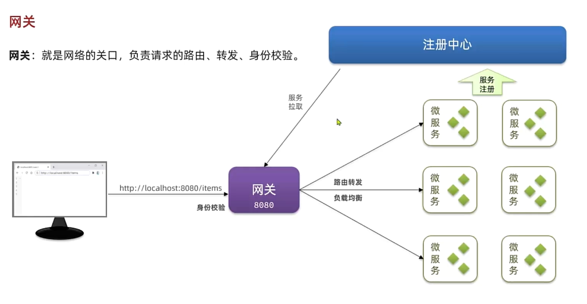


> 前端只需要知道网关的ip和端口
>
> 网关根据前端的请求判断应该由哪个微服务来处理这个请求，然后转发给具体的微服务（网关从注册中心获取具体微服务的ip和端口）
>
> 


**两种技术方案**

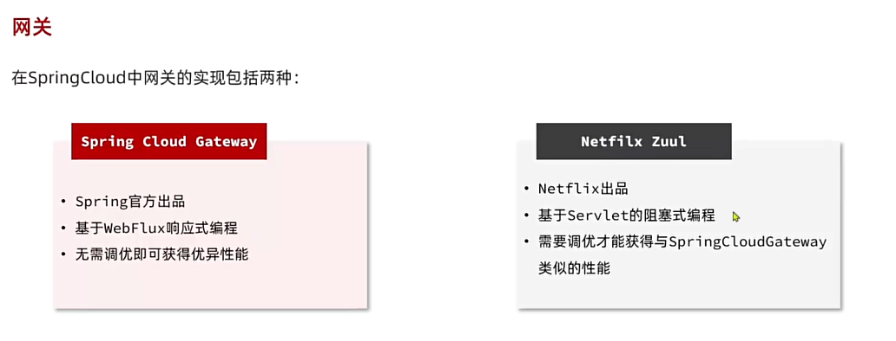

> SpringCloud Gateway更主流


## 网关路由与转发


**1.创建模块**，hm-gateway

**2.引入依赖**

```
<dependencies>
    <!--common-->
    <dependency>
        <groupId>com.heima</groupId>
        <artifactId>hm-common</artifactId>
        <version>1.0.0</version>
    </dependency>
    <!--网关-->
    <dependency>
        <groupId>org.springframework.cloud</groupId>
        <artifactId>spring-cloud-starter-gateway</artifactId>
    </dependency>
    <!--nacos discovery-->
    <dependency>
        <groupId>com.alibaba.cloud</groupId>
        <artifactId>spring-cloud-starter-alibaba-nacos-discovery</artifactId>
    </dependency>
    <!--负载均衡-->
    <dependency>
        <groupId>org.springframework.cloud</groupId>
        <artifactId>spring-cloud-starter-loadbalancer</artifactId>
    </dependency>
</dependencies>
<build>
    <finalName>${project.artifactId}</finalName>
    <plugins>
        <plugin>
            <groupId>org.springframework.boot</groupId>
            <artifactId>spring-boot-maven-plugin</artifactId>
        </plugin>
    </plugins>
</build>
```

**3.创建启动类**

```
package com.hmall.gateway;

import org.springframework.boot.SpringApplication;
import org.springframework.boot.autoconfigure.SpringBootApplication;

@SpringBootApplication
public class GatewayApplication {
    public static void main(String[] args) {
        SpringApplication.run(GatewayApplication.class, args);
    }
}

```

**4.配置配置文件**

```
server:
  port: 8080
spring:
  application:
    name: gateway
  profiles:
    active: local
  cloud:
    nacos:
      server-addr: ${hm.nacos.host}:${hm.nacos.port}
      username: nacos
      password: nacos
    # 重点：配置路由规则
    gateway:
      routes:
        - id: item-service
          uri: lb://item-service
          predicates:
            - Path=/items/**,/search/**
        - id: user-service
          uri: lb://user-service
          predicates:
            - Path=/users/**,/address/**
        - id: cart-service
          uri: lb://cart-service
          predicates:
            - Path=/carts/**
        - id: trade-service
          uri: lb://trade-service
          predicates:
            - Path=/orders/**
        - id: pay-service
          uri: lb://pay-service
          predicates:
            - Path=/pay-orders/**
mybatis-plus:
  configuration:
    default-enum-type-handler: com.baomidou.mybatisplus.core.handlers.MybatisEnumTypeHandler
  global-config:
    db-config:
      update-strategy: not_null
      id-type: auto
logging:
  level:
    com.hmall: debug
  pattern:
    dateformat: HH:mm:ss:SSS
  file:
    path: "logs/${spring.application.name}"

hm:
  jwt:
    location: classpath:hmall.jks
    alias: hmall
    password: hmall123
    tokenTTL: 30m
  auth:
    excludePaths:
      - /search/**
      - /users/login
      - /items/**
      - /hi
```

> 

【<u>**配置路由规则**</u>】


> 路由id建议和服务名一致
>
> predicates：路由断言   判断的依据，符合断言就匹配对应的微服务；可以配置多个路由断言
>
> > 如果有多个controller，用逗号分隔
> >
> > 


### 路由属性介绍

网关路由对应的Java类型是RouteDefinition，其中常见的属性有：

* id：路由唯一标识
* uri：路由目标地址
* **predicates**：路由断言，判断请求是否符合当前路由
* **filters**：路由过滤器，对请求或响应做特殊处理


#### 各种路由断言


[官方文档](https://docs.spring.io/spring-cloud-gateway/docs/3.1.8/reference/html/#gateway-request-predicates-factories)


#### 各种路由过滤器


[官方文档](https://docs.spring.io/spring-cloud-gateway/docs/3.1.8/reference/html/#gatewayfilter-factories)

 

```
# 全局配置过滤器
```


## 网关登录校验


#### 原理

在网关转发之前做登录校验


**编写一个过滤器，在PRE阶段、在NettyRoutingFilter之前去实现JWT校验**


> 
>
> 


#### **如何自定义过滤器**


> ServerWebExchange：可以理解成网关内部的上下文对象，用来保存网关内部的一些共享数据

> GatewayFilterChain：业务逻辑处理完之后就可以调用这个过滤器链，通过它调用过滤器链中的下一个过滤器


**GlobalFilter的定义(大多数时候选择)：**

1.新建MyGlobalFilter类，实现GlobalFilter接口，实现filter方法

2.利用exchange获取请求信息，完成登录校验

3.调用过滤器链，完成放行


**GatewayFilter的定义**：

（[后续有需求再学]([微服务02-06.网关登录校验-自定义GatewayFilter_哔哩哔哩_bilibili](https://www.bilibili.com/video/BV1S142197x7?spm_id_from=333.788.player.switch&vd_source=67ef3bb4c8d68a96408acdaa865b1313&p=63))）


### 网关登录校验功能-实现


**1.前置准备**

**hmall.jks：密钥文件**

**解密密钥文件所需的信息和排除的请求路径 （配置在配置文件）**

```
hm:
  jwt:
    location: classpath:hmall.jks
    alias: hmall
    password: hmall123 # 用来解析这个文件
    tokenTTL: 30m
  auth:
    excludePaths:
      - /search/**
      - /users/login

```

**JWTProperties加载配置里面的属性**

> 通过@EnableConfigurationProperties或者@Component注解生效（装配到IOC容器）

```
@Data
@ConfigurationProperties(prefix = "hm.jwt")
public class JwtProperties {
    private Resource location;
    private String password;
    private String alias;
    private Duration tokenTTL = Duration.ofMinutes(10);
}
```

**AuthProperties加载配置里面的属性**

```
@Data
@ConfigurationProperties(prefix = "hm.auth")
public class AuthProperties {
    private List<String> includePaths;
    private List<String> excludePaths;
}
```

**SecurityConfig**

> 注册一个bean，用于加密和解密

```
package com.hmall.config;

import org.springframework.boot.context.properties.EnableConfigurationProperties;
import org.springframework.context.annotation.Bean;
import org.springframework.context.annotation.Configuration;
import org.springframework.security.crypto.bcrypt.BCryptPasswordEncoder;
import org.springframework.security.crypto.password.PasswordEncoder;
import org.springframework.security.rsa.crypto.KeyStoreKeyFactory;

import java.security.KeyPair;

@Configuration
@EnableConfigurationProperties(JwtProperties.class)
public class SecurityConfig {

    @Bean
    public PasswordEncoder passwordEncoder(){
        return new BCryptPasswordEncoder();
    }

    @Bean
    public KeyPair keyPair(JwtProperties properties){
        // 获取秘钥工厂
        KeyStoreKeyFactory keyStoreKeyFactory =
                new KeyStoreKeyFactory(
                        properties.getLocation(),
                        properties.getPassword().toCharArray());
        //读取钥匙对
        return keyStoreKeyFactory.getKeyPair(
                properties.getAlias(),
                properties.getPassword().toCharArray());
    }
}
```

**JwtTool：提前封装好的工具类**

```
import cn.hutool.core.exceptions.ValidateException;
import cn.hutool.jwt.JWT;
import cn.hutool.jwt.JWTValidator;
import cn.hutool.jwt.signers.JWTSigner;
import cn.hutool.jwt.signers.JWTSignerUtil;
import com.hmall.common.exception.UnauthorizedException;
import org.springframework.stereotype.Component;

import java.security.KeyPair;
import java.time.Duration;
import java.util.Date;

@Component
public class JwtTool {
    private final JWTSigner jwtSigner;

    public JwtTool(KeyPair keyPair) {
        this.jwtSigner = JWTSignerUtil.createSigner("rs256", keyPair);
    }

    /**
     * 创建 access-token
     *
     * @param userDTO 用户信息
     * @return access-token
     */
    public String createToken(Long userId, Duration ttl) {
        // 1.生成jws
        return JWT.create()
                .setPayload("user", userId)
                .setExpiresAt(new Date(System.currentTimeMillis() + ttl.toMillis()))
                .setSigner(jwtSigner)
                .sign();
    }

    /**
     * 解析token
     *
     * @param token token
     * @return 解析刷新token得到的用户信息
     */
    public Long parseToken(String token) {
        // 1.校验token是否为空
        if (token == null) {
            throw new UnauthorizedException("未登录");
        }
        // 2.校验并解析jwt
        JWT jwt;
        try {
            jwt = JWT.of(token).setSigner(jwtSigner);
        } catch (Exception e) {
            throw new UnauthorizedException("无效的token", e);
        }
        // 2.校验jwt是否有效
        if (!jwt.verify()) {
            // 验证失败
            throw new UnauthorizedException("无效的token");
        }
        // 3.校验是否过期
        try {
            JWTValidator.of(jwt).validateDate();
        } catch (ValidateException e) {
            throw new UnauthorizedException("token已经过期");
        }
        // 4.数据格式校验
        Object userPayload = jwt.getPayload("user");
        if (userPayload == null) {
            // 数据为空
            throw new UnauthorizedException("无效的token");
        }

        // 5.数据解析
        try {
           return Long.valueOf(userPayload.toString());
        } catch (RuntimeException e) {
            // 数据格式有误
            throw new UnauthorizedException("无效的token");
        }
    }
}
```

**2.编写自定义过滤器、拦截器，完成登录校验   用户信息传递**

AuthGlobalFilter：

```
import com.hmall.common.exception.UnauthorizedException;
import com.hmall.gateway.config.AuthProperties;
import com.hmall.gateway.util.JwtTool;
import lombok.RequiredArgsConstructor;
import org.springframework.cloud.gateway.filter.GatewayFilterChain;
import org.springframework.cloud.gateway.filter.GlobalFilter;
import org.springframework.core.Ordered;
import org.springframework.http.HttpStatus;
import org.springframework.http.server.reactive.ServerHttpResponse;
import org.springframework.stereotype.Component;
import org.springframework.util.AntPathMatcher;
import org.springframework.web.server.ServerWebExchange;
import org.springframework.http.server.reactive.ServerHttpRequest;
import reactor.core.publisher.Mono;

import java.util.List;

@Component
@RequiredArgsConstructor
public class AuthGlobalFilter implements GlobalFilter, Ordered {
    private final AuthProperties authProperties;
    private final JwtTool jwtTool;
    private final AntPathMatcher antPathMatcher = new AntPathMatcher();// spring工具包里面的匹配器
    //【这个类预先没有用@Bean处理，不在IOC容器里 所以要自己new出来】
    @Override
    public Mono<Void> filter(ServerWebExchange exchange, GatewayFilterChain chain) {
        // 获取request
        ServerHttpRequest request = exchange.getRequest();
        // 判断是否需要登录拦截
        if(isExcludePath(request.getPath().toString())){
            // 不需要登录拦截, 放行
            return chain.filter(exchange);
        }
        // 如果需要登录拦截，获取token
        String token = null;
        List<String> headers = request.getHeaders().get("Authorization");
        if(headers != null && !headers.isEmpty()){
            token = headers.get(0);
        }

        // 校验(解析)token
        Long userId = null;
        try {
            userId = jwtTool.parseToken(token);
            // 直接抛异常的话，状态码就是500，彰显不出原因是登录错误，所以catch起来，设置状态码为401
        }catch (UnauthorizedException e){
            // 拦截，设置响应状态码为401
            ServerHttpResponse response = exchange.getResponse();
            response.setStatusCode(HttpStatus.UNAUTHORIZED);
            return response.setComplete();
        }
        // 没有抛异常，说明校验通过
        // 获取用户id，传递用户信息
        String userInfo = userId.toString();
        ServerWebExchange swe = exchange.mutate()
                .request(builder -> builder.header("user-info", userInfo))
                .build();
        //提前约定好请求头，才能取出来
        
        // 放行
        return chain.filter(swe);
    }

    private boolean isExcludePath(String path){
        for (String excludePath : authProperties.getExcludePaths()) {
            if(antPathMatcher.match(excludePath, path)){
                return true;
            }
        }
        return false;
    }
    @Override
    public int getOrder() {
        return 0;//比nettyRouting小就行
    }


}

```


##### 用户信息传递详解


==<u>微服务很多，每个微服务都使用id获取一遍用户信息不太合理；所以在拦截器里面获取用户信息，把用户信息保存到ThreadLocal里面；</u>==

> 为什么存储userId的逻辑不在过滤器里面完成
>
> 因为不同微服务不同的实例，存到gateway这个微服务的ThreadLocal里面 并不能被其他微服务使用

**具体步骤：1.在网关的登录校验过滤器中，把获取的用户id写入请求头**

```
// 没有抛异常，说明校验通过
// 获取用户id，传递用户信息
String userInfo = userId.toString();
ServerWebExchange swe = exchange.mutate()
        .request(builder -> builder.header("user-info", userInfo))
        .build();
//提前约定好请求头，才能取出来
```


> 
>
> 通过RequestHeader注解获取用户信息
> 

**具体步骤：2.在hm-common中编写SpringMVC拦截器并注册，获取登录用户**

> 各个微服务模块都会引入common，统一在里面注册拦截器，无需重复编写

UserInfoInterceptor：

```
package com.hmall.common.interceptors;

import cn.hutool.core.util.StrUtil;
import com.hmall.common.utils.UserContext;
import org.springframework.web.servlet.HandlerInterceptor;

import javax.servlet.http.HttpServletRequest;
import javax.servlet.http.HttpServletResponse;

public class UsereInfoInterceptor implements HandlerInterceptor {
    @Override
    public boolean preHandle(HttpServletRequest request, HttpServletResponse response, Object handler) throws Exception {
        // 获取用户id
        String userInfo = request.getHeader("user-info");
        if(StrUtil.isNotBlank(userInfo)){
            Long userId = Long.valueOf(userInfo);
            UserContext.setUser(userId);
        }
        // 放行
        return true;
    }
    @Override
    public void afterCompletion(HttpServletRequest request, HttpServletResponse response, Object handler, Exception ex) throws Exception {
        // 清理用户
        UserContext.removeUser();
    }
}

```

MvcConfig配置类

```
import com.hmall.common.interceptors.UsereInfoInterceptor;
import org.springframework.boot.autoconfigure.condition.ConditionalOnClass;
import org.springframework.context.annotation.Configuration;
import org.springframework.web.servlet.DispatcherServlet;
import org.springframework.web.servlet.config.annotation.WebMvcConfigurer;

@ConditionalOnClass(DispatcherServlet.class)
@Configuration
public class MvcConfig implements WebMvcConfigurer {
    @Override
    public void addInterceptors(org.springframework.web.servlet.config.annotation.InterceptorRegistry registry) {
        registry.addInterceptor(new UsereInfoInterceptor());//【默认拦截所有路径】

    }
}

```


> 
>
> 
>
> 里面加路径，让spring 能扫描到这个类，从而配置到IOC容器中

> **@ConditionalOnClass注解**：
>
> *配置一下，让这个bean只在微服务模块生效，不要在网关生效*（因为网关底层不是基于SpringMVC的阻塞式编程，而是基于WebFlux的响应式编程；把SpringMVC的东西加载进去会报错(大概这个意思)）
>
> 有SpringMVC就会有DispatcherServlet.class，就会生效


==<u>而微服务之间 调用时的用户信息传递（不是从网关发起的），使用OpenFeign传递用户信息</u>==

> 用户信息不是已经通过通用的拦截器保存到threadlocal里面了吗？每个微服务都可以拿到里面的信息
>
> 本质：跨服务是新是新线程（都不在一个服务器里面，ThreadLocal肯定不一样），而ThreadLocal是线程私有的。
>
> （跨服务 = 跨进程 = 线程隔离 = ThreadLocal无效，必须显式传递身份信息）


在hm-api模块加入一个RequestInterceptor的bean

> 放在这个模块，任何需要远程调用的服务都能自动传递用户信息

```
import com.hmall.common.utils.UserContext;
import feign.RequestInterceptor;
import org.springframework.context.annotation.Bean;

public class DefaultUserInfoTransmit {
    @Bean
    public RequestInterceptor userInfoInterceptor() {
        return new RequestInterceptor() {
            @Override
            public void apply(feign.RequestTemplate requestTemplate) {
                Long userId = UserContext.getUser();
                if (userId == null) {
                    return;
                }
                requestTemplate.header("user-info", userId.toString());
            }
        };

    }
}
```

然后在启动类里面启用：


# 配置管理

* 问题
  * 微服务重复配置过多，维护成本高
  * 业务相关配置（比如登录之后的超时时间、登录失败之后的最大重试次数、登录失败之后的锁定时长，添加商品的上限）
    不适合在代码中写死，上线之后可能还需要调整，如果写死
    每次修改都要重新编译打包、重启
  * 网关路由配置写死，如果变更 要重启网关


* 使用配置管理的优点
  * 减少重复配置，读取配置管理中的配置
  * 可以随时修改业务相关配置，不用重新编译打包
  * 监听配置变更，推送配置变更，无需重启就能生效（实现配置热更新）
  * 


#### 添加共享配置到nacos

常见的重复配置：JDBC连接；日志；mybatis-plus

> #### 应用专属配置（自动加载）
>
> ==Nacos 会根据 spring.application.name 自动加载对应的配置文件==。例如 his-clinic 微服务：
>
> ```
> spring:
>   application:
>     name: his-clinic
> ```
>
> Nacos 会自动加载 his-clinic.yaml（或 his-clinic.yaml，取决于 file-extension 配置）。


<u>**在配置中心中配置共同的部分**</u>

<u>**有差异的部分，各个微服务自己定义在自己的yaml文件中，配置中心读取**</u>

```
spring:
  datasource:
    url: jdbc:mysql://${hm.db.host}:${hm.db.port:3306}/${hm.db.database}?useUnicode=true&characterEncoding=UTF-8&autoReconnect=true&serverTimezone=Asia/Shanghai
    driver-class-name: com.mysql.cj.jdbc.Driver
    username: root
    password: ${hm.db.pw}
```

> ${hm.db.port:3306}表示端口从配置文件读取，如果没有，就使用默认值3306


#### Nacos通用配置收集

##### shared-jdbc.yaml

> ```
> spring:
>   datasource:
>     url: jdbc:mysql://${eats.db.host:localhost}:${eats.db.port:3306}/${eats.db.database}?useUnicode=true&characterEncoding=UTF-8&autoReconnect=true&serverTimezone=Asia/Shanghai
>     driver-class-name: com.mysql.cj.jdbc.Driver
>     username: ${eats.db.username:root}
>     password: ${eats.db.password}
> mybatis:
>   #mapper
>   mapper-locations: classpath:mapper/*.xml
>   type-aliases-package: ${eats.mybatis.type-aliases-package}
>   configuration: 
>     map-underscore-to-camel-case: true
> mybatis-plus:
>   configuration:
>     default-enum-type-handler: com.baomidou.mybatisplus.core.handlers.MybatisEnumTypeHandler
>   global-config:
>     db-config:
>       update-strategy: not_null
>       id-type: auto
> ```
>
> 


##### **shared-swagger.yaml**

接口文档配置

> ```
> knife4j:
>   enable: true
>   openapi:
>     title: ${eats.swagger.title}
>     description: ${eats.swagger.description}
>     email: L3542495583@outlook.com
>     concat: Hazenix
>     url: https://blog.hazenix.top
>     version: v1.0.1
>     group:
>       default:
>         group-name: default
>         api-rule: package
>         api-rule-resources:
>           - ${eats.swagger.package}
> ```
>
> 


##### **shared-redis.yaml**

redis配置

> ```
> spring:  
>   redis:
>     host: ${eats.redis.host}
>     port: ${eats.redis.port}
>     password: ${eats.redis.password}
>     database: ${eats.redis.database}
> ```
>
> 

##### **shared-jwt-properties.yaml**

被项目中的jwtProperties读取

> ```
> hazeeats:
>   jwt:
>     admin-secret-key: haze66
>     admin-ttl: 43200000
>     admin-token-name: token
> 
>     user-secret-key: haze66
>     user-ttl: 43200000
>     user-token-name: authentication
> ```
>
> 


##### **third-wechat.yaml**

被项目中的WeChatProperties读取
appid; //小程序的appid
secret; //小程序的秘钥
mchid; //商户号
mchSerialNo; //商户API证书的证书序列号
privateKeyFilePath; //商户私钥文件
apiV3Key; //证书解密的密钥
weChatPayCertFilePath; //平台证书
notifyUrl; //支付成功的回调地址
refundNotifyUrl; //退款成功的回调地址

> ```
> 
> ```
>
> 


##### **third-aliyunoss.yaml**

被项目中的AliOssProperties读取

> ```
> hazeeats:
>   alioss:
>     endpoint: oss-cn-heyuan.aliyuncs.com
>     access-key-id: xxx
>     access-key-secret: xxx
>     bucket-name: blog-hazenix-top
> ```
>
> 

##### shared-mq.yaml


```

```


> 生产者和消费者额外在自己的配置文件里配置独有配置
>
> 生产者：
>
> ```yaml
> spring:
>   rabbitmq:
>     connection-timeout: 1s 
>     template:
>       retry:
>         enabled: true 
>         initial-interval: 1000ms 
>         multiplier: 2 
>         max-attempts: 6 
> ```
>
> > 生产者重连机制的参数数值  参考RabbitMQ.md
>
> 消费者：
>
> ```yaml
> spring:
>   rabbitmq:
>     listener:
>       simple:
>       	        prefetch: 1 # 每次只能获取一条消息，处理完成才能获取下一个消息(避免消息积压)
>         acknowledge-mode: auto # 自动处理 返回ack/nack/reject
>         retry:
>           enabled: true # 开启消费者失败重试
>           initial-interval: 1000ms # 初识的失败等待时长为1秒
>           multiplier: 1 # 失败的等待时长倍数，下次等待时长 = multiplier * last-interval
>           max-attempts: 3 # 最大重试次数
>           stateless: true # true无状态；false有状态。如果业务中包含事务，这里改为false
> ```
>
> > 消费者失败重试参数数值 参考RabbitMQ.md
> >
> > 


#### 拉取共享配置


> 逻辑梳理：
>
> 
>
> 由于要先去拉取Nacos的**共享配置**，所以nacos的ip和端口就不能配到application.yml中，要配置到bootstrap.yml中
>
> bootstrap：引导
>
> bootstrap中的配置，application.yml 就不用再配置


##### ==**流程图**==

```
启动
   |
   v
SpringCloud上下文
   |-- 加载 bootstrap.yml
   |-- 拉取Nacos配置
   |-- 根据环境变量或配置文件确定使用哪个profile
   |-- 加载 application.yml
   |-- 加载 application-{profile}.yml (例如: application-dev.yml 或 application-prod.yml)
   |-- 初始化 ApplicationContext
   |
SpringBoot上下文
   |-- 合并配置
   |-- 初始化 ApplicationContext
```

在这个流程中，`application-{profile}.yml` 文件在Spring Cloud上下文中被加载，这通常发生在`bootstrap.yml`之后，以允许环境特定的配置覆盖或添加到从Nacos拉取的配置中。然后，这些配置被合并到Spring Boot的上下文中，最终初始化`ApplicationContext`


> 这段激活配置文件的代码可以放在bootstrap.yml/application.yml，建议放在bootstrap.yml

```
spring:
  profiles:
    active: dev # 或 prod
```


> #### 占位符属性何时被替换？
>
> 
>
> 占位符的替换发生在Spring Boot的配置合并阶段，即在所有配置文件被加载之后。Spring Boot会遍历所**有配置文件(包含环境特定的配置文件(如application-dev.yml))**，查找并替换所有的占位符。这个过程是全局的，不局限于某个特定的配置文件。这意味着：
>
> - 如果在Nacos配置中存在占位符`${hm.swagger.title}`，并且这个值在`application.yml`或环境特定的配置文件中定义了，那么这个占位符会被相应的值替换。
> - 替换过程是自动的，不需要在特定的配置文件中显式指定替换规则。
>
> ##### 总结
>
> 替换Nacos配置中的占位符是由Spring Boot的全局属性占位符解析器完成的，它不依赖于特定的配置文件，而是在整个应用的配置环境中进行。这样可以确保所有的配置文件中的占位符都能被正确替换，从而提供一致的配置管理体验。
>
> ### 示例
>
> 假设你有以下配置：
>
> - **Nacos配置**：
>
>   ```yaml
>   knife4j:
>     enable: true
>     openapi:
>       title: ${hm.swagger.title}
>       description: ${hm.swagger.description}
>   ```
>
> - **application.yml**：
>
>   ```yaml
>   hm:
>     swagger:
>       title: My API Title
>       description: My API Descripion
>   ```
>
> - **application-dev.yml**：
>
>   ```yaml
>   hm:
>     swagger:
>       title: My Dev API Title
>       description: My Dev API Description
>   ```
>
> - **application-prod.yml**：
>
>   ```yaml
>   hm:
>     swagger:
>       title: My Prod API Title
>       description: My Prod API Description
>   ```
>
> 在这种情况下：
>
> - 当激活`dev`环境时，Spring Boot会加载`application-dev.yml`，并用其中的值替换Nacos配置中的占位符。
> - 当激活`prod`环境时，Spring Boot会加载`application-prod.yml`，并用其中的值替换Nacos配置中的占位符。
>
> 
> 


##### **基于NacosConfig自动拉取共享配置代替微服务的本地配置**

**1.引入依赖**

```
//配置管理，完成配置拉取
<!--nacos配置管理-->
<dependency>
  <groupId>com.alibaba.cloud</groupId>
  <artifactId>spring-cloud-starter-alibaba-nacos-config</artifactId>
</dependency>

//读取bootstrap文件，创建bootstrap上下文
<!--读取bootstrap文件-->
<dependency>
  <groupId>org.springframework.cloud</groupId>
  <artifactId>spring-cloud-starter-bootstrap</artifactId>
</dependency>

```

**2.新建bootstrap.yaml**(也放resources目录)

```
spring:
  application:
    name: cart-service # 服务名称
  profiles:
    active: dev
  cloud:
    nacos:
      server-addr: 192.168.73.128
      config:
        file-extension: yaml # 文件后缀名
        shared-configs: # 共享配置
          - dataId: shared-jdbc.yaml # 共享mybatis配置
          - dataId: shared-log.yaml # 共享日志配置
          - dataId: shared-swagger.yaml # 共享日志配置
```

> bootstrap也可以指定悲痛开发环境，bootstrap-dev.yml/bootstrap-prod.yml

> 
>
> 


#### 实现配置热更新

* 作用

  * 监听配置变更，推送配置变更，**无需重启就能生效**（实现配置热更新）

  * 可以随时修改业务相关配置（比如登录之后的超时时间、登录失败之后的最大重试次数、登录失败之后的锁定时长，添加商品的上限）

    

  


**编写读取配置属性的配置类**


> 编写之后在nacos中准备一个**与微服务名有关的文件**，并编写好hm.cart
>
> 就会自动读取到配置的值


#### 实现网关动态路由

* 作用
  *  灵活变更网关路由配置，不用重启网关


[微服务02-13.配置管理-动态路由(拓展）_哔哩哔哩_bilibili](https://www.bilibili.com/video/BV1S142197x7?spm_id_from=333.788.player.switch&vd_source=67ef3bb4c8d68a96408acdaa865b1313&p=70)

据说新版本已经可以简单实现，暂时不管看这篇


# 服务保护


## 雪崩问题


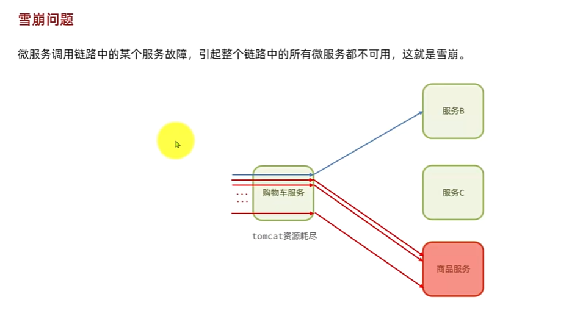

商品服务<u>卡住</u>，导致购物车服务因为商品服务而卡住了好几秒才能返回(正常情况比如几十毫秒)，几秒钟才能处理一个请求，逐渐越来越多请求堆积在这里，最后tomcat资源被耗尽

商品服务<u>故障</u>，导致调用商品服务的购物车服务的请求迟迟不能被处理，请求不断挤压，最后tomcat资源被耗尽

最终导致购物车服务也故障


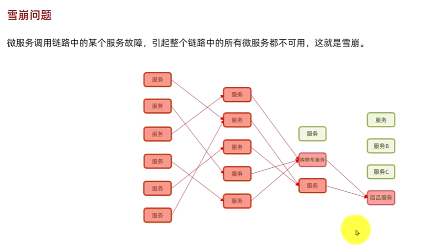


雪崩问题产生的原因是什么

* 微服务相互调用，服务提供者出现故障或阻塞
* 服务调用者没有做好异常处理，导致自身故障
* 调用链中的所有服务级联失败，导致整个集群故障


==解决问题的思路==

* 尽量避免服务出现故障或阻塞
  * 保证代码的健壮性
  * 保证网络畅通
  * 能应对较高的并发请求
  * **请求限流**
*  **线程隔离** + **服务熔断 与 服务降级**——
  服务调用者做好远程调用异常的后备方案，避免故障扩散


#### 请求限流的实现


请求限流：限制访问微服务的请求的并发量，**避免服务因流量激增出现故障**


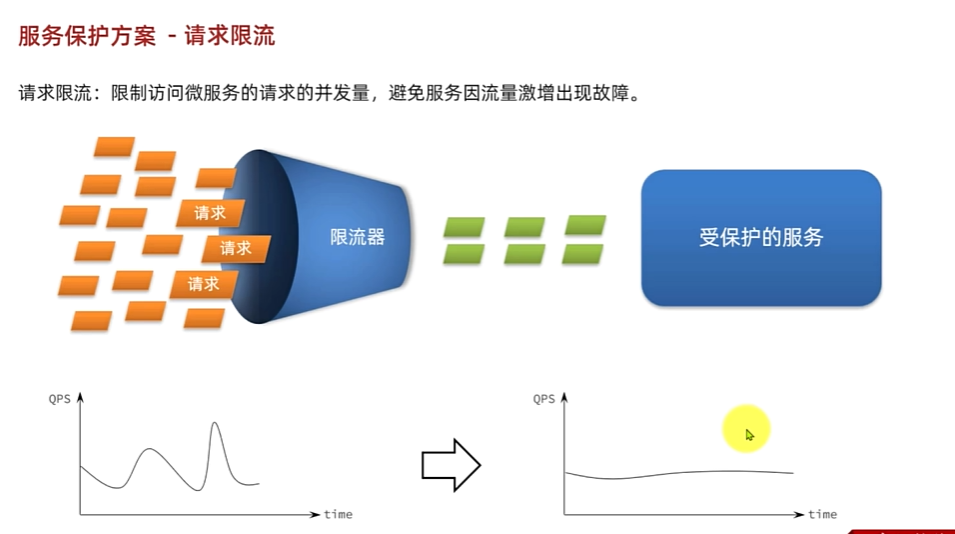


#### 线程隔离

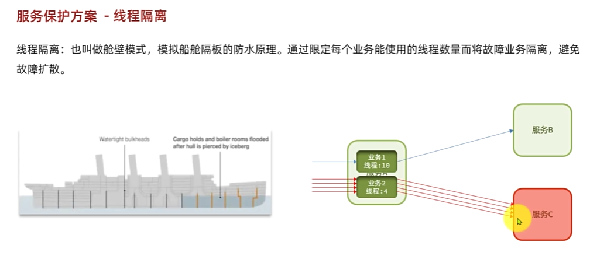

限定每一个业务能使用的线程数量，避免因为故障问题不断占用tomcat资源，导致资源耗尽


#### 服务熔断

**确保知晓下游微服务故障的情况下，不再浪费线程资源(CPU资源)请求下游微服务(尽管因为线程隔离 浪费的资源有限)，直接走服务熔断、服务降级的逻辑**


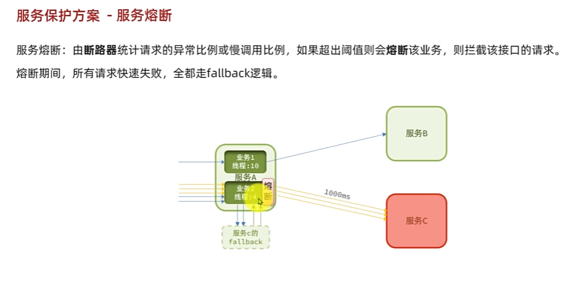


## Setinel的使用

微服务流量控制组件

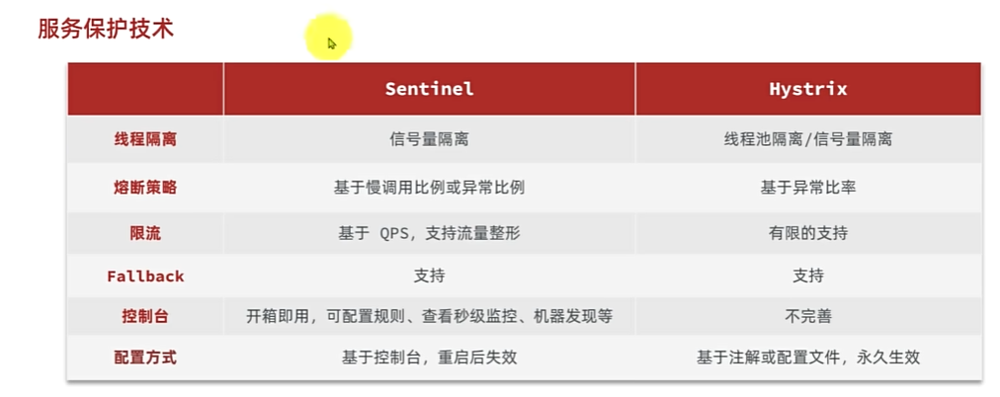

[官方文档](https://setinelguard.io/zh-cn/index.html)


**介绍与安装**

https://ai.feishu.cn/wiki/QfVrw3sZvihmnPkmALYcUHIDnff

> ```
> java -Dserver.port=8090 -Dcsp.sentinel.dashboard.server=localhost:8090 -Dproject.name=sentinel-dashboard -jar sentinel-dashboard.jar
> ```
>
> windows运行指令
>
> 其它启动时可配置参数可参考官方文档

#### **1.引入依赖**

```
<!--sentinel-->
<dependency>
    <groupId>com.alibaba.cloud</groupId> 
    <artifactId>spring-cloud-starter-alibaba-sentinel</artifactId>
</dependency>
```

#### **2.配置控制台**

```
spring:
  cloud: 
    sentinel:
      transport:
        dashboard: localhost:8090
      http-method-specify: true # 开启请求方式前缀
```


#### **3.访问`cart-service`的任意端点**

重启`cart-service`，然后访问查询购物车接口，sentinel的客户端就会将服务访问的信息提交到`sentinel-dashboard`控制台。并展示出统计信息：

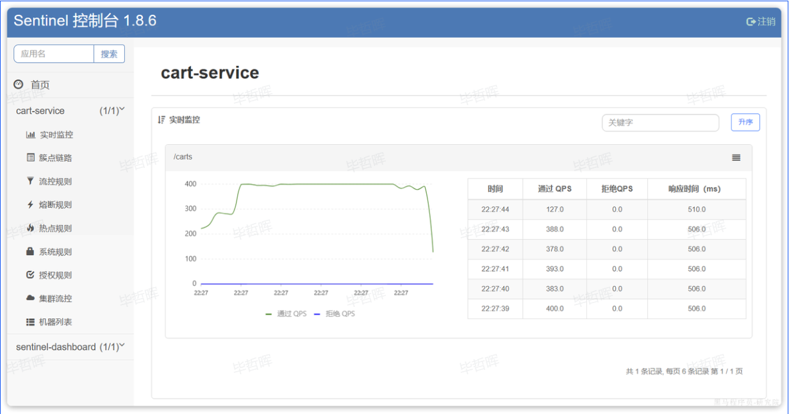

> #### QPS
>
> quest per second


点击簇点链路菜单，会看到下面的页面：

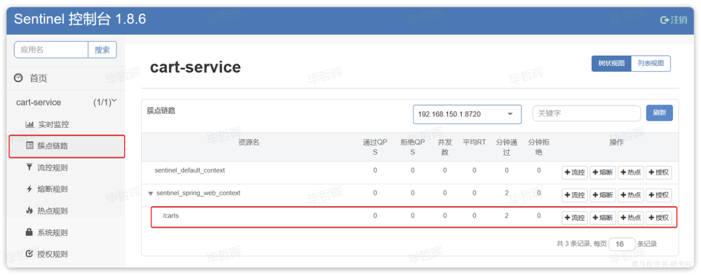

所谓**簇点链路**，就是**单机调用链路**，是一次请求进入服务后**经过的每一个被`Sentinel`监控的资源**。默认情况下，`Sentinel`会监控`SpringMVC`的每一个`Endpoint`（接口 (controller接口) ）。

因此，我们看到`/carts`这个接口路径就是其中一个簇点，我们可以对其进行限流、熔断、隔离等保护措施。

> 不过，需要注意的是，我们的SpringMVC接口是按照Restful风格设计，因此购物车的查询、删除、修改等接口全部都是`/carts`路径：
>
> 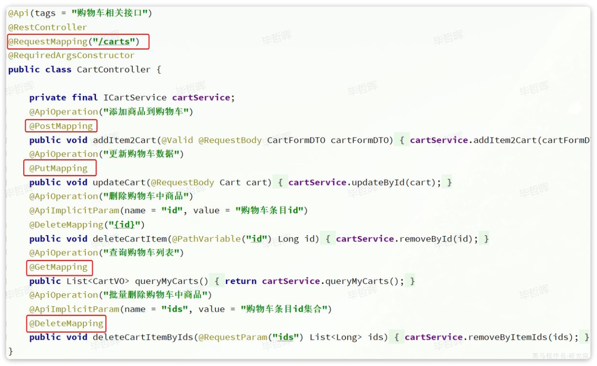
>
> 默认情况下Sentinel会把路径作为簇点资源的名称，无法区分路径相同但请求方式不同的接口，查询、删除、修改等都被识别为一个簇点资源，这显然是不合适的。
>
> 所以我们可以选择**打开Sentinel的请求方式前缀，把`请求方式 + 请求路径`作为簇点资源名**：
>
> 首先，在`cart-service`的`application.yml`中添加下面的配置：
>
> ```YAML
> spring:
>   cloud:
>     sentinel:
>       transport:
>         dashboard: localhost:8090
>       http-method-specify: true # 开启请求方式前缀
> ```
>
> 然后，重启服务，通过页面访问购物车的相关接口，可以看到sentinel控制台的簇点链路发生了变化：
>
> 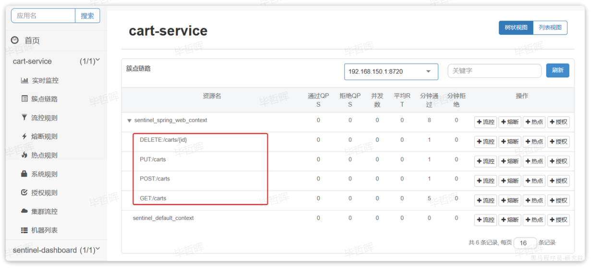


#### **4.设置请求限流**(限制并发量QPS)

在簇点链路后面点击流控按钮，即可对其做限流配置：

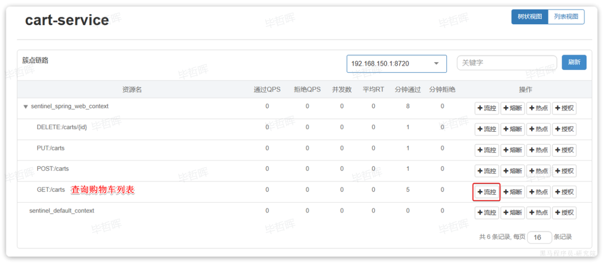

在弹出的菜单中这样填写：

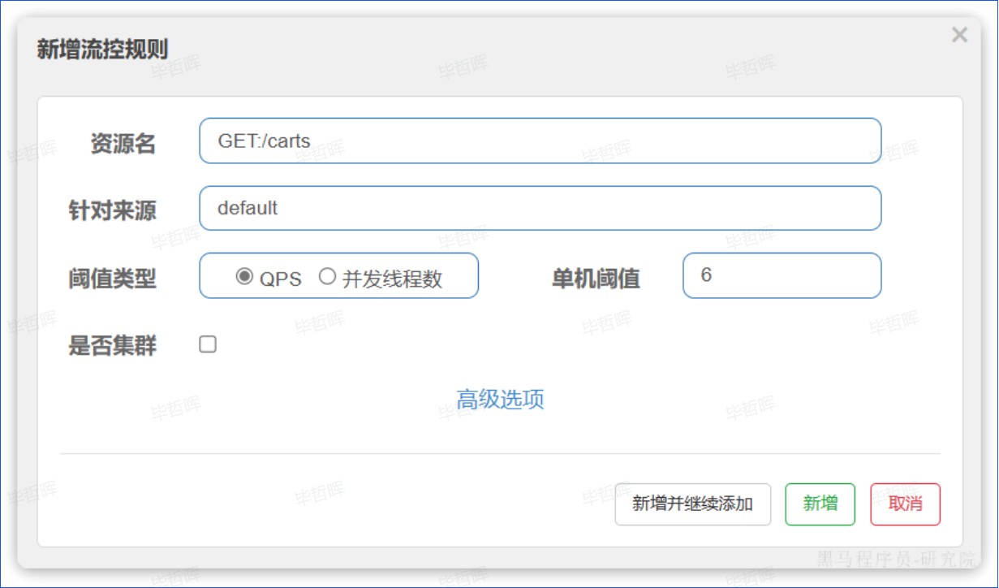

这样就把查询购物车列表这个簇点资源的流量限制在了每秒6个，也就是最大QPS为6.

> 我们利用Jemeter做限流测试，我们每秒发出10个请求：
>
> 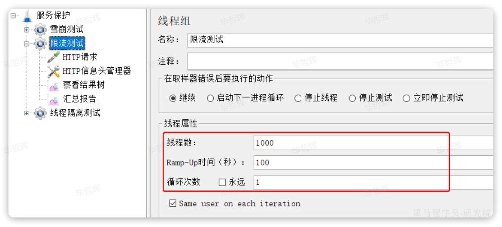
>
> 最终监控结果如下：
>
> 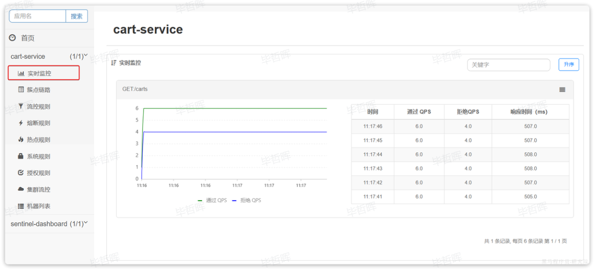
>
> 可以看出`GET:/carts`这个接口的通过QPS稳定在6附近，而拒绝的QPS在4附近，符合我们的预期


#### **5.设置线程隔离**(限制并发线程数)

> QPS=2代表一个秒钟访问两次，一个线程的QPS为2 五个线程 就是 5 * 2 = 10
>
>
> QPS=一个港口能进多少人，线程数=有几条船
>
> QPS：车道每秒钟通过的车流量，并发线程数：车道数量。

**在配置文件开启Feign的sentinel功能**

> 让openfeign的http远程调用成为sentinel的一个簇点资源
>
> 

```
feign:
  okhttp:
    enabled: true
  sentinel:
    enabled: true # 开启feign对sentinel的支持
```


重启cart-service服务，可以看到查询商品的FeignClient自动变成了一个簇点资源：


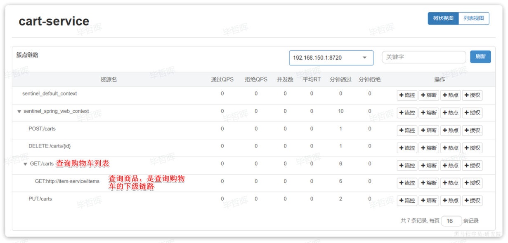


**配置线程隔离**

> 

点击查询商品的FeignClient对应的簇点资源后面的**流控按钮(也是流控按钮)**：

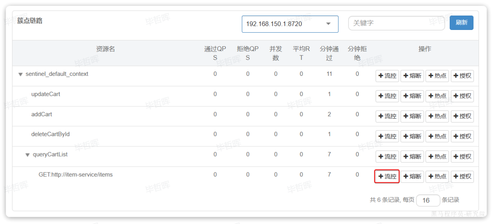

在弹出的表单中填写下面内容：

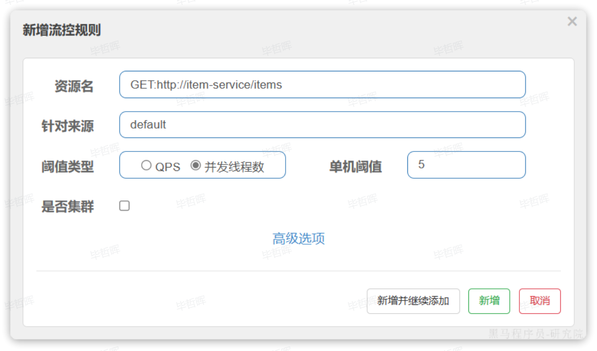

注意，这里勾选的是**并发线程数限制**，也就是说**这个查询功能最多使用==5个线程==**，而不是5QPS(单位: 每秒)。如果查询商品的接口每秒处理2个请求，则5个线程的实际QPS在10左右，而超出的请求自然会被拒绝。

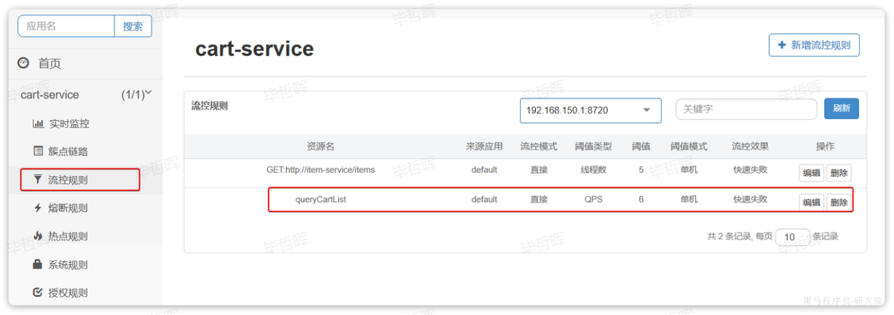


> 我们利用Jemeter测试，每秒发送100个请求：
>
> 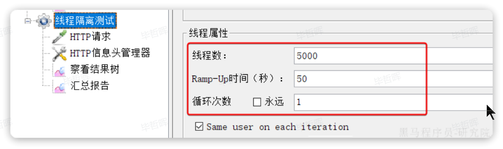
>
> 最终测试结果如下：
>
> 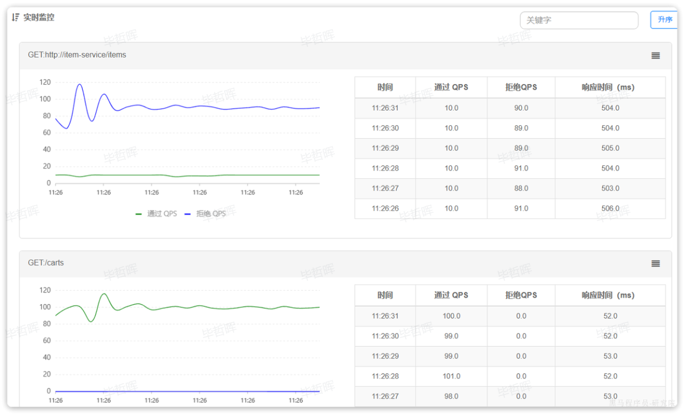
>
> 进入查询购物车的请求每秒大概在100，而在查询商品时却只剩下每秒10左右，符合我们的预期。
>
> 此时如果我们通过页面访问购物车的其它接口，例如添加购物车、修改购物车商品数量，发现不受影响：
>
> 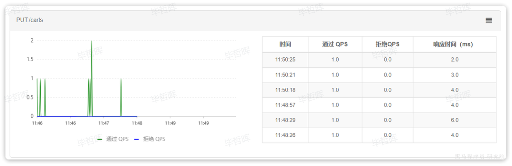
>
> 响应时间非常短，这就证明线程隔离起到了作用，尽管查询购物车这个接口并发很高，但是它能使用的线程资源被限制了，因此不会影响到其它接口。


#### 6.服务熔断与降级 (Fallback)

设置线程隔离、服务熔断之后，需要加入快速失败(Fallback)的逻辑，应对资源被占满的情况

> 前提：已经设置了线程隔离、服务熔断


在上节课，我们利用线程隔离对查询购物车业务进行隔离，保护了购物车服务的其它接口。由于查询商品的功能耗时较高（我们模拟了500毫秒延时），再加上线程隔离限定了线程数为5，导致接口吞吐能力有限，最终QPS只有10左右。这就导致了几个问题：

第一，超出的QPS上限的请求就只能抛出异常，从而导致购物车的查询失败。但从业务角度来说，即便没有查询到最新的商品信息，购物车也应该展示给用户，用户体验更好。也就是给查询失败设置一个**降级处理**逻辑。

第二，由于查询商品的延迟较高（模拟的500ms），从而导致查询购物车的响应时间也变的很长。这样不仅拖慢了购物车服务，消耗了购物车服务的更多资源，而且用户体验也很差。对于商品服务这种不太健康的接口，我们应该直接停止调用，直接走降级逻辑，避免影响到当前服务。也就是将商品查询接口**熔断**。


##### 编写降级逻辑


触发限流或熔断后的请求不一定要直接报错，也可以返回一些默认数据或者友好提示，用户体验会更好。

**给FeignClient编写失败后的降级逻辑有两种方式：**

- 方式一：FallbackClass，无法对远程调用的异常做处理
- 方式二：**FallbackFactory，可以对远程调用的异常做处理，我们一般选择这种方式**。

这里我们演示方式二的失败降级处理。

**步骤一**：**自定义类**，实现`FallbackFactory`，编写某个FeignClient的fallback逻辑
（例：在hm-api模块中给`ItemClient`定义降级处理类，实现`FallbackFactory`：）


> 如果熔断/限流了 就会走这个fallback里面写的逻辑

代码如下：

```Java
package com.hmall.api.client.fallback;

import com.hmall.api.client.ItemClient;
import com.hmall.api.dto.ItemDTO;
import com.hmall.api.dto.OrderDetailDTO;
import com.hmall.common.exception.BizIllegalException;
import com.hmall.common.utils.CollUtils;
import lombok.extern.slf4j.Slf4j;
import org.springframework.cloud.openfeign.FallbackFactory;

import java.util.Collection;
import java.util.List;

@Slf4j
public class ItemClientFallback implements FallbackFactory<ItemClient> {
    @Override
    public ItemClient create(Throwable cause) {
        return new ItemClient() {
            @Override
            public List<ItemDTO> queryItemByIds(Collection<Long> ids) {
                log.error("远程调用ItemClient#queryItemByIds方法出现异常，参数：{}", ids, cause);
                // 查询购物车允许失败，查询失败，返回空集合
                return CollUtils.emptyList();
            }

            @Override
            public void deductStock(List<OrderDetailDTO> items) {
                // 库存扣减业务需要触发事务回滚，查询失败，抛出异常
                throw new BizIllegalException(cause);
            }
        };
    }
}
```

**步骤二**：**将这个自定义类注册为bean，放到IOC容器中管理**
在`hm-api`模块中的`com.hmall.api.config.DefaultFeignConfig`类中将`ItemClientFallback`注册为一个`Bean`：


> 还有其他方法
>
> 比如：
>
> 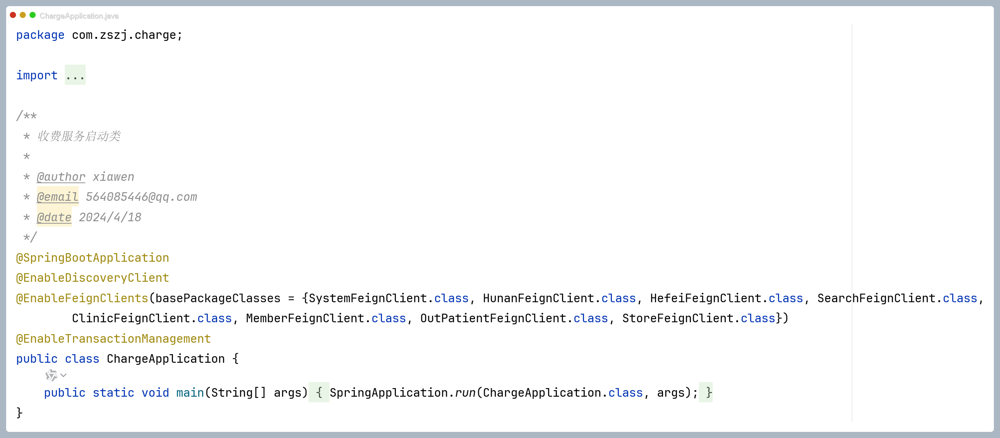
>
> 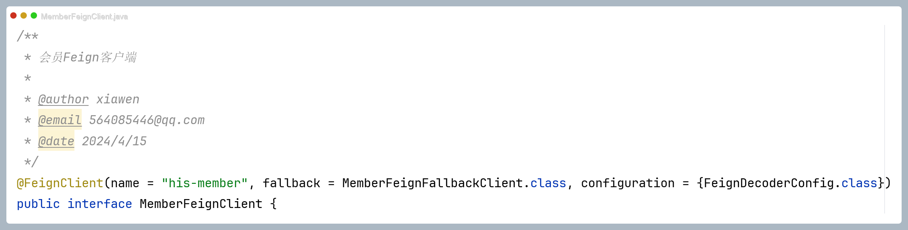
>
> 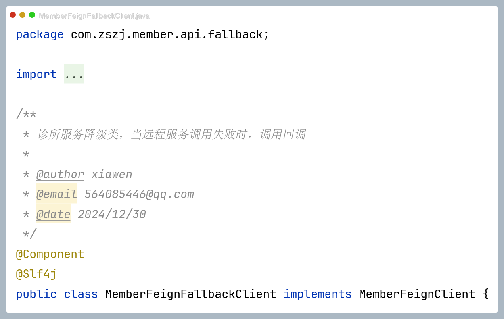
>
> ==在api和业务都放到微服务的情况下，能直接被扫描到，所以此处加@Component注解可行==
> 
>
> 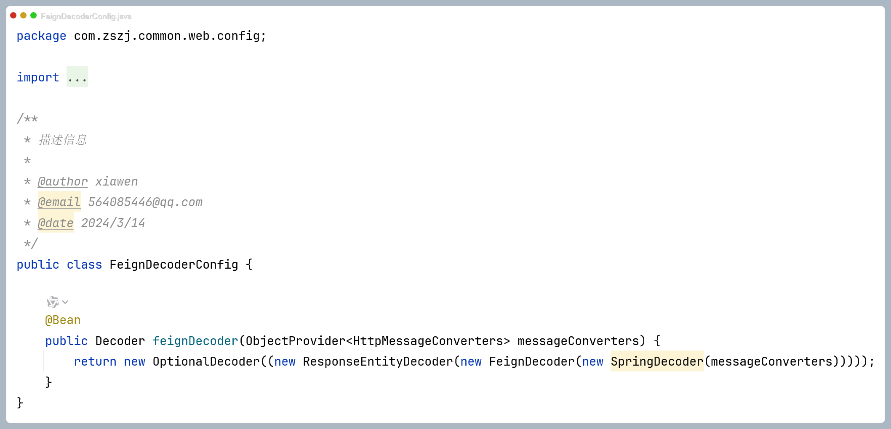
> （这是一个自定义的解码器)

**步骤三**：在`hm-api`模块中的`ItemClient`接口中使用`ItemClientFallbackFactory`：


重启后，再次测试，发现被限流的请求不再报错，走了降级逻辑：


但是未被限流的请求延时依然很高：


导致最终的平局响应时间较长。


##### 服务熔断 服务降级

> 查询商品的RT较高（模拟的500ms），从而导致查询购物车的RT也变的很长。这样不仅拖慢了购物车服务，消耗了购物车服务的更多资源，而且用户体验也很差。
>
> 对于商品服务这种不太健康的接口，我们应该停止调用，直接走降级逻辑，避免影响到当前服务。也就是将商品查询接口**熔断**。当商品服务接口恢复正常后，再允许调用。这其实就是**断路器**的工作模式了。
>
> 

Sentinel中的断路器不仅可以统计某个接口的**慢请求比例**，还可以统计**异常请求比例**。当这些比例超出阈值时，就会**熔断**该接口，即拦截访问该接口的一切请求，降级处理；当该接口恢复正常时，再放行对于该接口的请求。

---

断路器的工作状态切换有一个状态机来控制：

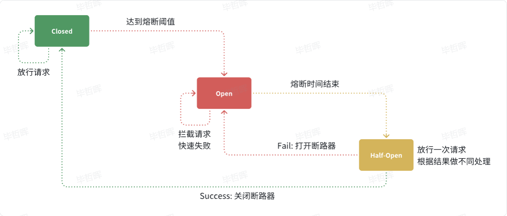

状态机包括三个状态：

- **closed**：关闭状态，断路器放行所有请求，并开始统计异常比例、慢请求比例。超过阈值则切换到open状态
- **open**：打开状态，服务调用被**熔断**，访问被熔断服务的请求会被拒绝，快速失败，直接走降级逻辑。Open状态持续一段时间后会进入half-open状态
- **half-open**：半开状态，放行一次请求，根据执行结果来判断接下来的操作。 
  - 请求成功：则切换到closed状态
  - 请求失败：则切换到open状态

---

我们可以在控制台通过点击簇点后的**`熔断`**按钮来配置熔断策略：


在弹出的表格中这样填写：


这种是按照慢调用比例来做熔断，上述配置的含义是：

- RT超过200毫秒的请求调用就是慢调用

- 统计最近1000ms内的最少5次请求，如果慢调用比例不低于0.5，则触发熔断

- 熔断持续时长20s

  > 正常熔断5s就行，这里写20s是为了方便观测效果


配置完成后，再次利用Jemeter测试，可以发现：


在一开始一段时间是允许访问的，后来触发熔断后，查询商品服务的接口通过QPS直接为0，所有请求都被熔断了。而查询购物车的本身并没有受到影响。

此时整个购物车查询服务的平均RT影响不大：


# 分布式事务


## 介绍

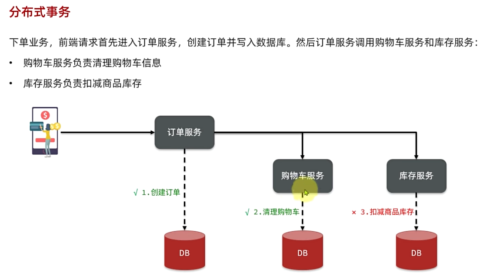


[官方文档](https://seata.apache.org/zh-cn/docs/overview/what-is-seata/)


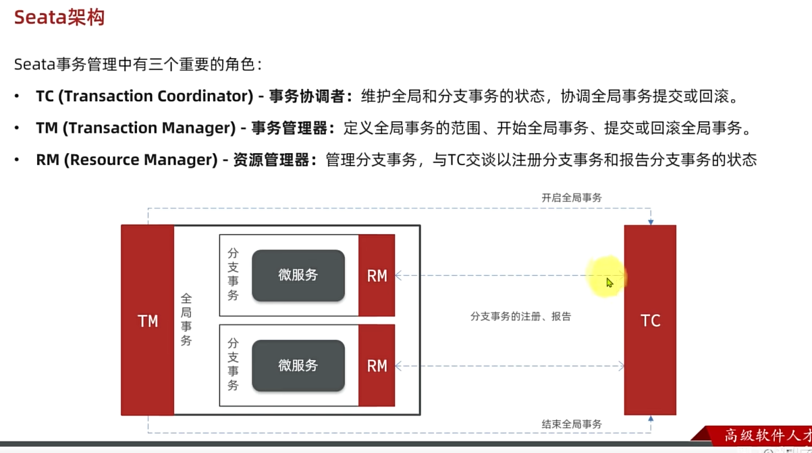


其中，**TM**和**RM**可以理解为Seata的客户端部分，引入到参与事务的微服务依赖中即可。将来**TM**和**RM**就会协助微服务，实现本地分支事务与**TC**之间交互，实现事务的提交或回滚。

而**TC**服务则是事务协调中心，是一个独立的微服务，需要单独部署。

> seata也作为一个微服务
>
> 作为注册到配置中心中，其他微服务从注册中心拉取到(没有必要给每个微服务都配置seata的ip和端口)
>
> 


## 部署TC服务


### 准备数据库表

Seata支持多种存储模式，但考虑到持久化的需要，我们一般选择基于数据库存储。执行课前资料提供的`《seata-tc.sql》`，导入数据库表：

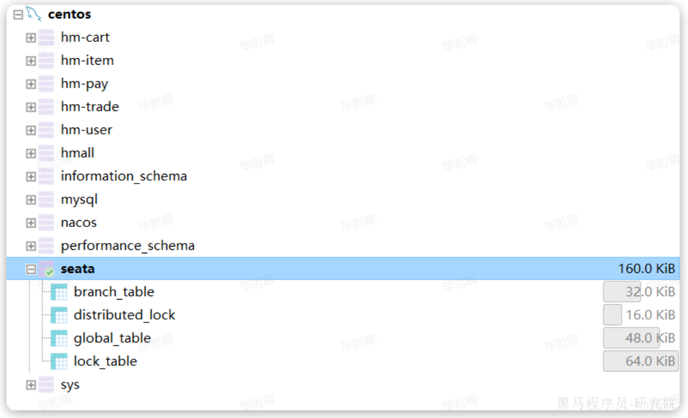

### 准备配置文件

课前资料准备了一个seata目录，其中包含了seata运行时所需要的配置文件：

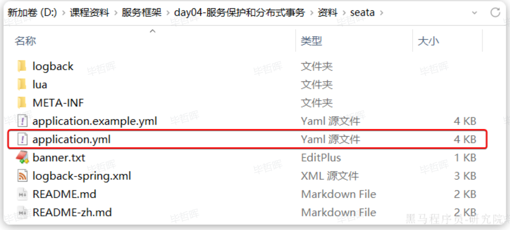

其中包含中文注释，大家可以自行阅读。

我们将整个seata文件夹拷贝到虚拟机的`/root`目录：

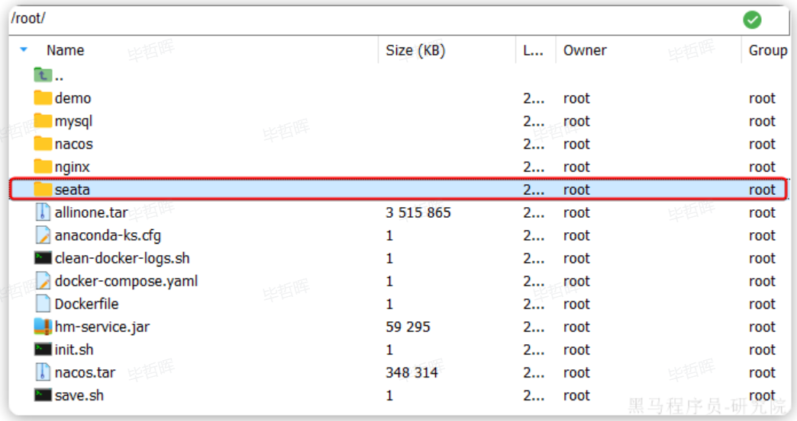

### Docker部署

需要注意，要确保nacos、mysql都在hm-net网络中。如果某个容器不再hm-net网络，可以参考下面的命令将某容器加入指定网络：

```Shell
docker network connect [网络名] [容器名]
```

在虚拟机的`/root`目录执行下面的命令：

```Shell
docker run --name seata \
-p 8099:8099 \
-p 7099:7099 \
-e SEATA_IP=192.168.150.101 \
-v ./seata:/seata-server/resources \
--privileged=true \
--network hm-net \
-d \
seataio/seata-server:1.5.2
```

如果镜像下载困难，也可以把课前资料提供的镜像上传到虚拟机并加载：


> #### 控制台
>
> 在ip:7099查看，用户名密码都是admin
>
> 


## 微服务集成Seata

参与分布式事务的每一个微服务都需要集成Seata，我们以`trade-service`为例。

### 引入依赖

为了方便各个微服务集成seata，我们需要把seata配置共享到nacos，因此`trade-service`模块不仅仅要引入seata依赖，还要引入nacos依赖:

```XML
<!--统一配置管理-->
<dependency>
  <groupId>com.alibaba.cloud</groupId>
  <artifactId>spring-cloud-starter-alibaba-nacos-config</artifactId>
</dependency>
<!--读取bootstrap文件-->
<dependency>
  <groupId>org.springframework.cloud</groupId>
  <artifactId>spring-cloud-starter-bootstrap</artifactId>
</dependency>
<!--seata-->
<dependency>
  <groupId>com.alibaba.cloud</groupId>
  <artifactId>spring-cloud-starter-alibaba-seata</artifactId>
</dependency>
```


### 改造配置

首先在nacos上添加一个共享的seata配置(最好使用nacos管理，方便很多，降低耦合度)，命名为`shared-seata.yaml`：

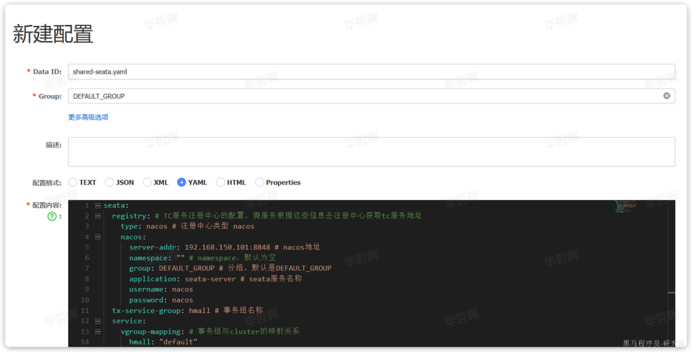

内容如下：

```YAML
seata:
  registry: # TC服务注册中心的配置，微服务根据这些信息去注册中心获取tc服务地址
    type: nacos # 注册中心类型 nacos
    nacos:
      server-addr: 47.100.37.166:8848 # nacos地址
      namespace: "" # namespace，默认为空
      group: DEFAULT_GROUP # 分组，默认是DEFAULT_GROUP
      application: seata-server # seata服务名称
      username: nacos
      password: hazenixnacos66
  tx-service-group: hmall # 事务组(可以理解成集群)名称
  service:
    vgroup-mapping: # 事务组与tc集群的映射关系
      hmall: "default"
```

> 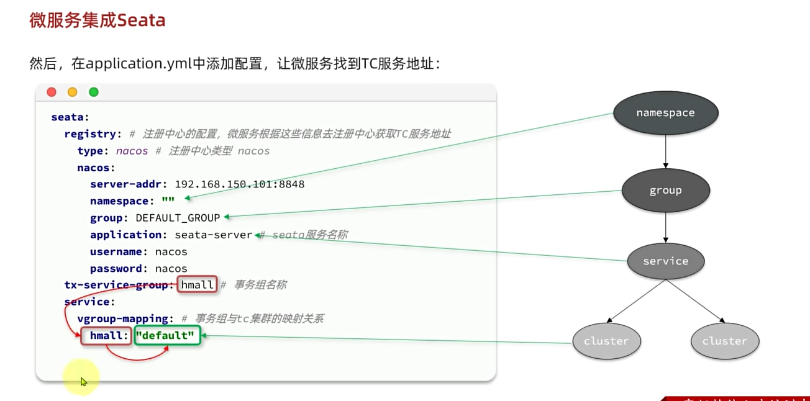
>
> 


然后，改造`trade-service`模块，==添加`bootstrap.yaml`==  ：

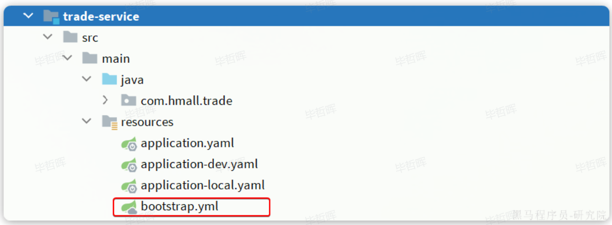

内容如下:

```YAML
spring:
  application:
    name: trade-service # 服务名称
  profiles:
    active: dev
  cloud:
    nacos:
      server-addr: 47.100.37.166 # nacos地址
      config:
        file-extension: yaml # 文件后缀名
        shared-configs: # 共享配置
          - dataId: shared-jdbc.yaml # 共享mybatis配置
          - dataId: shared-log.yaml # 共享日志配置
          - dataId: shared-swagger.yaml # 共享日志配置
          - dataId: shared-seata.yaml # 共享seata配置
```

可以看到这里加载了共享的seata配置。

然后改造application.yaml文件，内容如下：

```YAML
server:
  port: 8085
feign:
  okhttp:
    enabled: true # 开启OKHttp连接池支持
  sentinel:
    enabled: true # 开启Feign对Sentinel的整合
hm:
  swagger:
    title: 交易服务接口文档
    package: com.hmall.trade.controller
  db:
    database: hm-trade
```

参考上述办法分别改造`hm-cart`和`hm-item`两个微服务模块。


### 添加数据库表

seata的客户端在解决分布式事务的时候需要记录一些中间数据，保存在数据库中。因此我们要先准备一个这样的表。

将课前资料的seata-at.sql分别文件导入hm-trade、hm-cart、hm-item三个数据库中：

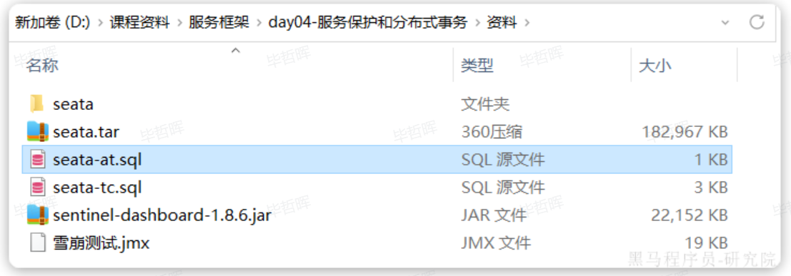

结果：

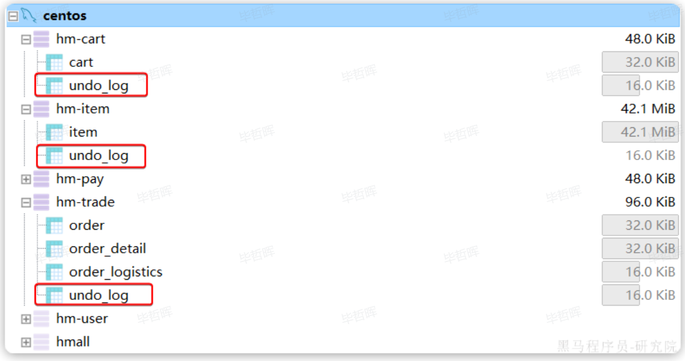

OK，至此为止，微服务整合的工作就完成了。可以参考上述方式对`hm-item`和`hm-cart`模块完成整合改造。

### 测试

接下来就是测试的分布式事务的时候了。

我们找到`trade-service`模块下的`com.hmall.trade.service.impl.OrderServiceImpl`类中的`createOrder`方法，也就是下单业务方法。

将其上的`@Transactional`注解改为Seata提供的`@GlobalTransactional`：


`@GlobalTransactional`注解就是在标记事务的起点，将来TM就会基于这个方法判断全局事务范围，初始化全局事务。

我们重启`trade-service`、`item-service`、`cart-service`三个服务。再次测试，发现分布式事务的问题解决了！

那么，Seata是如何解决分布式事务的呢？


## XA模式

Seata支持四种不同的分布式事务解决方案：

- **XA**
- **TCC**
- **AT**
- **SAGA**

这里我们以`XA`模式和`AT`模式来给大家讲解其实现原理。

`<u>XA` 规范 是` X/Open` 组织定义的分布式事务处理（DTP，Distributed Transaction Processing）标准，XA 规范 描述了全局的`TM`与局部的`RM`之间的接口，几乎所有主流的数据库都对 XA 规范 提供了支持。</u>


### 两阶段提交

目前主流数据库都实现了这种规范，实现的原理都是基于两阶段提交。

正常情况：

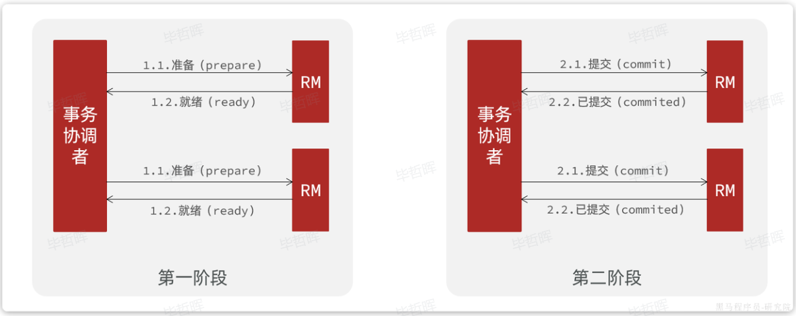

异常情况：

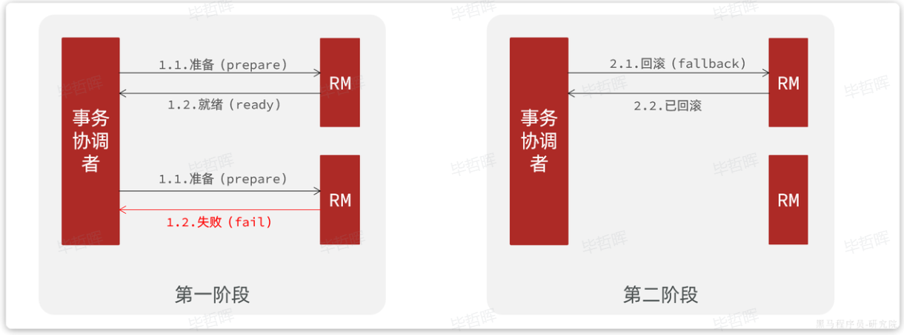

一阶段：

- 事务协调者通知每个事务参与者执行本地事务
- 本地事务执行完成后报告事务执行状态给事务协调者，此时事务不提交，继续持有数据库锁

二阶段：

- 事务协调者基于一阶段的报告来判断下一步操作
- 如果一阶段都成功，则通知所有事务参与者，提交事务
- 如果一阶段任意一个参与者失败，则通知所有事务参与者回滚事务


### Seata的XA模型

Seata对原始的XA模式做了简单的封装和改造，以适应自己的事务模型，基本架构如图：

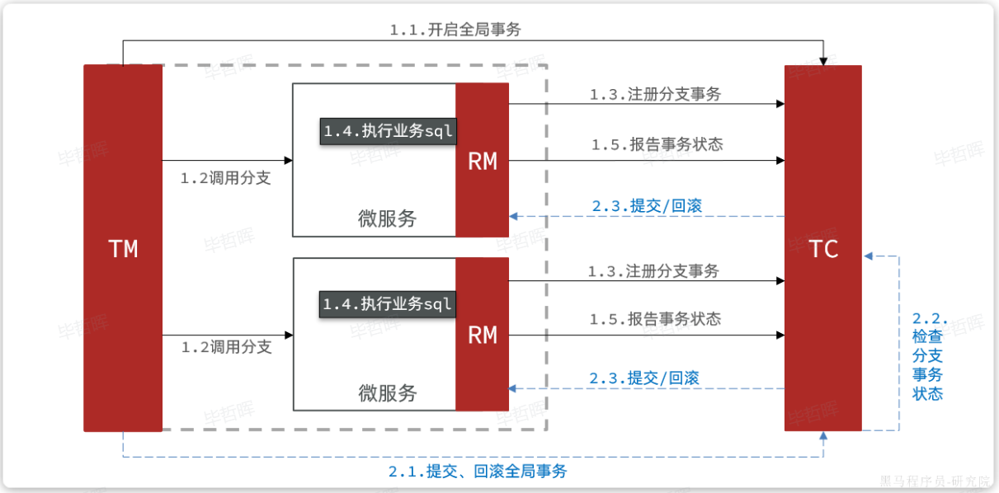

> `RM`一阶段的工作：
>
> 1. 注册分支事务到`TC`
> 2. 执行分支业务sql但不提交
> 3. 报告执行状态到`TC`
>
> `TC`二阶段的工作：
>
> * `TC`检测各分支事务执行状态
>   1. 如果都成功，通知所有RM提交事务
>   1. 如果有失败，通知所有RM回滚事务 
>
> `RM`二阶段的工作：
>
> - 接收`TC`指令，提交或回滚事务


### 优缺点

`XA`模式的优点是什么？

- 事务的**强一致性**，满足ACID原则
- 常用数据库都支持，实现简单，并且**没有代码侵入**

`XA`模式的缺点是什么？

- 因为一阶段需要锁定数据库资源，等待二阶段结束才释放，**性能较差**
- **依赖关系型数据库**实现事务，如果数据库不支持事务，就会失败


### 实现步骤


1. 在配置文件中指定要采用的分布式事务模式。我们可以在<u>Nacos中的共享shared-seata.yaml配置文件</u>中设置：

```YAML
seata:
  data-source-proxy-mode: XA
```

2. 利用`@GlobalTransactional`标记分布式事务的入口方法：

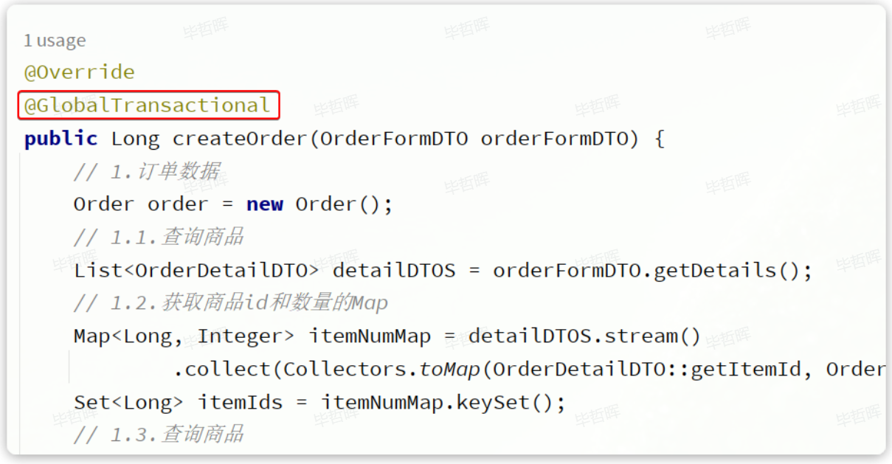

3. **这个总方法中调用的其他微服务的方法  需要加上@Transactional注解**(即便只对一个数据库执行了sql，因为将来需要回滚数据库事务)

   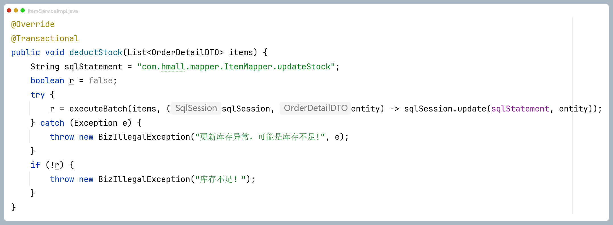


## AT模式

`AT`模式同样是分阶段提交的事务模型，不过缺弥补了`XA`模型中资源锁定周期过长的缺陷。

### Seata的AT模型

基本流程图：

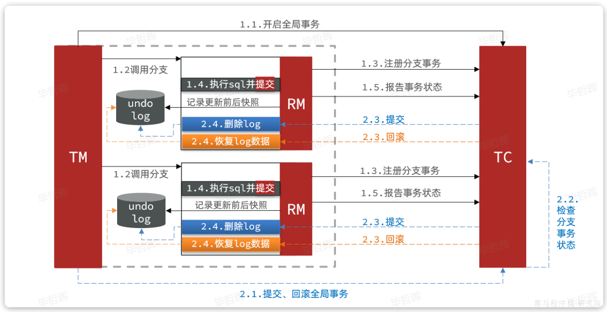

阶段一`RM`的工作：

- 注册分支事务
- 记录undo-log（数据快照）
- 执行业务sql并提交
- 报告事务状态

阶段二提交时`RM`的工作：

- 删除undo-log即可

阶段二回滚时`RM`的工作：

- 根据undo-log恢复数据到更新前


#### 缺点

* 中间过程会出现短暂的数据不一致(虽然中间不一致的状态时间很短)<u>（牺牲了强一致性），保证最终一致性</u>

  > 比如第一阶段清理完购物车、新增了订单 提交了事务，但是扣除库存失败，再到回滚事务这段时间，数据是不一致的


### 流程梳理

我们用一个真实的业务来梳理下AT模式的原理。

比如，现在有一个数据库表，记录用户余额：

| **id** | **money** |
| :----- | :-------- |
| 1      | 100       |

其中一个分支业务要执行的SQL为：

```SQL
 update tb_account set money = money - 10 where id = 1
```

AT模式下，当前分支事务执行流程如下：

**一阶段**：

1. `TM`发起并注册全局事务到`TC`
2. `TM`调用分支事务
3. 分支事务准备执行业务SQL
4. `RM`拦截业务SQL，根据where条件查询原始数据，形成快照。

```JSON
{
  "id": 1, "money": 100
}
```

1. `RM`执行业务SQL，提交本地事务，释放数据库锁。此时 money = 90
2. `RM`报告本地事务状态给`TC`

**二阶段**：

1. `TM`通知`TC`事务结束
2. `TC`检查分支事务状态
   1. 如果都成功，则立即删除快照
   2. 如果有分支事务失败，需要回滚。读取快照数据（{"id": 1, "money": 100}），将快照恢复到数据库。此时数据库再次恢复为100

流程图：

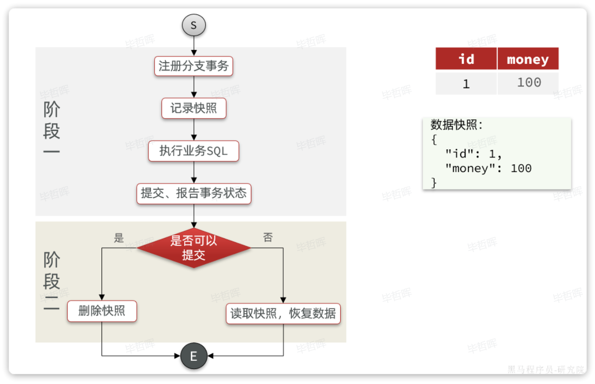


### 实现步骤

> seataa-at.sql在SpringCloud_HMALL文件夹里面

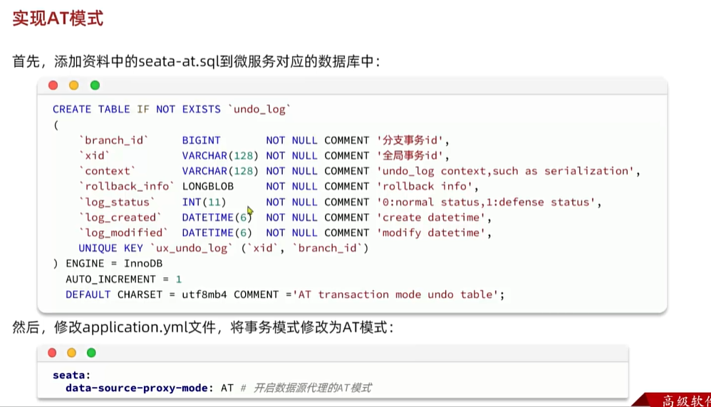

> 每个微服务的数据库都需要添加自己的undo_log表


> 改成AT，或者删掉（默认就是AT模式）
>
> ```
> seata:
>   data-source-proxy-mode: AT
> ```
>
> 


### AT与XA的区别

简述`AT`模式与`XA`模式最大的区别是什么？

- `XA`模式一阶段不提交事务，锁定资源；`AT`模式一阶段直接提交，不锁定资源。
- `XA`模式依赖数据库机制实现回滚；`AT`模式利用数据快照实现数据回滚。
- `XA`模式**强一致性**；`AT`模式**最终一致性**

可见，AT模式使用起来更加简单，无业务侵入，性能更好。**因此企业90%的分布式事务都可以用AT模式来解决**。


# 3.练习

## 3.1.编写降级逻辑

给黑马商城中现有的FeignClient都编写对应的降级逻辑，并且改造项目中每一个微服务，将OpenFeign与Sentinel整合。

## 3.2.解决分布式事务

除了下单业务以外，用户如果选择余额支付，前端会将请求发送到pay-service模块。而这个模块要做三件事情：

- 直接从user-service模块调用接口，扣除余额付款
- 更新本地（pay-service）交易流水表状态
- 通知交易服务（trade-service）更新其中的业务订单状态

流程如图：

暂时无法在飞书文档外展示此内容

显然，这里也存在分布式事务问题。

对应的页面如下：


当我们提交订单成功后，进入支付页面，选择余额支付，输入密码后点击确认支付即可。

前端会提交支付请求，业务接口的入口在`com.hmall.pay.controller.PayController`类的`tryPayOrderByBalance`方法：


对应的service方法如下：

```Java
@Override
@Transactional
public void tryPayOrderByBalance(PayOrderDTO payOrderDTO) {
    // 1.查询支付单
    PayOrder po = getById(payOrderDTO.getId());
    // 2.判断状态
    if(!PayStatus.WAIT_BUYER_PAY.equalsValue(po.getStatus())){
        // 订单不是未支付，状态异常
        throw new BizIllegalException("交易已支付或关闭！");
    }
    // 3.尝试扣减余额
    userClient.deductMoney(payOrderDTO.getPw(), po.getAmount());
    // 4.修改支付单状态
    boolean success = markPayOrderSuccess(payOrderDTO.getId(), LocalDateTime.now());
    if (!success) {
        throw new BizIllegalException("交易已支付或关闭！");
    }
    // 5.修改订单状态
    tradeClient.markOrderPaySuccess(po.getBizOrderNo());
}
```

利用seata解决这里的分布式事务问题，并思考这个业务实现有没有什么值得改进的地方


