#### 创建数据库


> 
>
> 

### 数据库相关


> 

表名设为tableX


### DDL-表结构-创建表


```
create table tablename(
	字段1 字段类型 [约束] [comment 字段1注释]
	字段1 字段类型 [约束] [comment 字段1注释]
	......
)[comment 表注释]
```


<u>**数值类型**</u>

 


> <u>**年龄——tinyint unsigned**</u>
>
> <u>**ID——int unsigned**</u>


> 
> username——varchar(50)
>
> idcard——char(18)
>
> phone——char(11)


> <u>**birthday————date**</u>
>
> <u>**operateTime——datetime**</u>

### DLL-表结构-查询、修改、删除

```
show tables;											-- 查询当前数据库所有表
desc 表名;											   -- 查询表结构
show create table 表名;										 -- 查询建表语句

alter table 表名 add 字段名 类型(长度) [comment 注释] [约束]; -- 添加字段
alter table 表名 modify 字段名 新数据类型(长度);			  -- 修改字段类型
alter table 表名 change [comment 注释][约束];				  -- 修改字段名与字段类型
alter table 表名 drop column 字段名;						   -- 删除字段
alter table 表名 rename to 新表名;						   -- 修改表名

drop table [if exists] 表名;								 -- 删除表
```


> data query language

### DQL-数据-查询


#### 基本查询-查询某个表所有数据


```
select count(*) from tableX;//计数
```

```
select sum(age) from tableX;//计算总年龄
```

```
select avg(salary) from emp;//查询平均薪资
```


```
-- 查询多个字段
select 字段1,字段2,字段3 from 表名;

-- 查询所有字段
select * from 表名;

-- 为查询字段设置别名，as关键字可以省略
select 字段1 [as 别名1],字段2 [as 别名2] from ;
select name as '姓名',entry_date as '入职日期' from emp;

-- 去除重复记录
select distinct 字段列表 from 表名;
```

> 
>
> 推荐使用第一种：性能更高
>
> 先写select from 表名
>
> 再依据提示一键搞定所有字段名


#### 条件查询

```
select * from tableX where id = 1;
select * from tableX where name = '青戈' and password = '1234';
```


> 查询没有分配职位的员工信息
> select * from emp where job is null;
>
> 
>
> 查询有职位的员工信息
> select * from emp where job is not null;
>
> 
>
> 
>
> 查询职位是  2 （讲师），3 （学工主管），4 （教研主管）的员工信息
> select * from emp where job=2 or job=3 or job=4;
>
> select * from emp where job in (2,3,4);
>
> 
>
> 


##### 模糊查询

_：单个字符；%：任意个字符

```
select * from tableX where name like '%哥哥%';//全部模糊
select * from tableX where name like '%哥哥';//前缀模糊
select * from tableX where name like '哥哥%';//后缀模糊
```

> 查询姓名为两个字符的员工信息
> select * from emp where name like '__';
>
> 
>
> 


新增查询

```
select * from tableX order by id desc;//按照id倒序排序（id越大、排越前面）
```

> desc--倒序排序
> adc---正序排序


#### 分组查询【一般用于统计个数】


```
SELECT * FROM employee GROUP BY sex HAVING sex = '男';
SELECT count(*) FROM employee GROUP BY sex HAVING sex = '男';
//统计数量

-- 统计企业员工数量
	-- 1. count(字段)——统计某个字段的条目数量(如果是null，就不会被统计进去)
	select count(id) from emp;
	-- 2. count(*)	——统计这张表的总条目
	select count(*) from emp;
	-- 3. count(常量)
	select count(1) from emp;

-- 统计员工平均薪资
select avg(salary) from emp;

-- 统计该企业员工的最低薪资
select min(salary) from emp;

-- 统计该企业员工的最高薪资
select max(salary) from emp

-- 每月给员工发放的薪资总额
select sum(salary) from emp;
```

> 统计数量优先考虑使用count*


```
-- 统计男性和女性员工数量
select gender from emp group by gender;

-- 先查询入职时间在'2015-01-01'（包含）以前的员工，并对结果根据职位分组，获取员工数量大于2的职位
select job,count(*) from emp where entry_date <= '2015-01-01' group by job having count(*)>2;


```


> HAVING后面跟条件
> 分组之后，select后的字段不能随意熟悉鹅，能写的一般是 分组字段+聚合函数


#### 排序查询


> 排序默认升序排序

```
-- 根据入职时间，对员工进行升序排序- asc
select * from emp order by entry_date asc;
select * from emp order by entry_date;


-- 根据入职时间，对员工进行降序排序- desc
select * from emp order by entry_date desc;

-- 根据入职时间，对员工进行升序排序，入职时间相同、再按照更新时间进行降序排序
select * from emp order by entry_date,update_time desc;

```


#### 分页查询

```
select * from tableX limit 0,3;//（第一行开始，显示三行）
```

> 第一个参数表示起始索引，第二个是显示多少个数据条目

> 如果起始索引是0，可以省略
>
> 

```
-- 从其实索引0开始查询员工数据，每页展示5条记录
select *from emp limit 0,5;
select *from emp limit 5;

-- 查询第1页员工数据，每页展示5条记录
select *from emp limit 0,5;

-- 查询第2页员工数据，每页展示5条记录
select *from emp limit 5,5;

-- 查询第3页员工数据，每页展示5条记录
select *from emp limit 10,5;


```

> 起始索引 = （查询页码-1）* 每页显示记录数


#### ==关联查询(多表查询)==

> 需要复习多表关系，可以看"数据库设计.md"


**内连接**


> 内连接查询两个表达的交集部分

> 隐式：两个表之间用逗号分隔，后面跟连接条件（where关键字），其他查询条件用and连接后跟在后面
>
> ```
> select emp.id , emp.name, dept.name from emp, dept where emp.dept_id = dept.id and emp.gender = 1;
> ```
>
> 显式：多张表直接显式的使用关键字，后面更联查条件(on关键字)
>
> ```
> select emp.id ,emp.name ,dept.name from emp inner join dept on emp.dept_id = dept.id;
> select emp.id ,emp.name ,dept.name from emp join dept on emp.dept_id = dept.id;//(inner关键字可省略)
> 
> ```
>
> 

> 如果只有其中一个表有这个字段，可以不用加所属表；但是还是<u>**建议：如果涉及到多表查询，字段前面都加上所属的表名**</u>

> 给表起别名（了解）
>
> 
>
> ```
> select emp.id ,emp.name ,dept.name from emp as e inner join dept as d on e.dept_id = d.id;
> ```
>
> 

**外连接**


> 左外连接完全包含左表的字段

> 查询员工表所有员工的姓名，和对应的部门名称
> select emp.name,dept.name from emp left join dept on emp.dept_id = dept.id

**子查询**


 

> [套娃查询]
>
> ```
> select * from emp where entry_date = (select min(entry_date) from emp);
> ```
>
> ```
> select * from emp where entry_date > (select entry_date from emp where name = '阮小五')
> ```
>
> 
>
> 

> select * from emp where dept_id = (select id from dept where name = '教研部') and entry_time > '2011_05_01'
>
> 
>
> 
>
> 
>
> 

select emp.*,dept.name from emp left join dept where emp.dept_id  = dept.id


```
SELECT employee.*,department.name as departmentName left join department on employee.department_id = department.id
//逻辑外键
```


> yid是tableX表里面的一个属性（关联两表），tableY.id是tableY表里面的id属性

> ### 大厂不让使用join查询（部分场景）

【【b站搜索关键词：关联 大厂】】


> 
>
> 如果两张表中存在两个字段名字一样，可以像这样给字段取个别名
>
> 


路径传参：/{id}    @PathVariable


> data manipulation language
>
> 

### DML-insert-插入


```
-- 为指定字段添加数据
insert into 表名 (字段1,字段2,字段3...) values (数据1,数据2,数据3...);
-- 为全部字段添加数据
insert into 表名 values (数据1,数据2,数据3...);
-- 批量添加数据（指定字段）
insert into 表名 (数据1,数据2,数据3) values (数据1,数据2,数据3),(数据a,数据b,数据c);
-- 批量添加数据（全部字段）
insert into 表名 values (数据1,数据2,数据3...),(数据1,数据2,数据3...);


```

insert into emp(username,password,name,gender,phone) values ('宋江')

> 如果要 插入当前时间，不要写死，使用mysql里面的now()函数


> 双引号也可以，推荐用单引号


### DML-update-修改

```
update 表名 set 字段1 = 数据1,字段2 = 数据2... where id = x;
```


#### 优化-动态sql

> 只更新有改动的字段


```
update emp set 
	username=#{username},
	password=#{password},
	name=#{name},
	gender=#{gender}，
	phone=#{phone},
	{job}=#{job},
	salary=#{salary},
	image=#{image},
	entry_date=#{entryDate},
	dept_id=#{deptId},
	update_time=#{updateTime}
where id=#{id}
```

**动态sql版本**

> 注意：如果字段为String类型，不仅要判断
>
> ```
> !=null
> ```
>
> 、还要判断
>
> ```
> !=‘’
> ```
>
> 

```
update emp set 
	<set>
        <if test="username != null and username != ''">username = #{username},</if>
        <if test="password != null and password != ''">password = #{password},</if>
        <if test="name != null and name != ''">name = #{name},</if>
        <if test="gender != null">gender = #{gender},</if>
        <if test="phone != null and phone != ''">phone = #{phone},</if>
        <if test="job != null">job = #{job},</if>
        <if test="salary != null">salary = #{salary},</if>
        <if test="image != null and image != ''">image = #{image},</if>
        <if test="entryDate != null">entry_date = #{entryDate},</if>
        <if test="deptId != null">dept_id = #{deptId},</if>
        <if test="updateTime != null">update_time = #{updateTime}</if>
    </set>
where id=#{id}
```


> #### set标最后
>
> 1. 自动生成set关键字
>
> 2. 自动删除掉更新字段后多余的逗号
>
>    
>
>    比如如果最后一个字段没有被录入，整个sql语句就会多一个逗号，此时set标签会自动删除这个逗号
>
> 


### DML-delete-删除

```
delete from 表名 where id = x;
```


> ## 经验
>
> 一般不存储年龄，因为年龄是变化的，一般存储生日
>
> dept是department的简写

#### 设置某一字段为唯一索引


* 即不能出现相同的值


## 函数


#### 字符串函数


```
select concat('%','张三','%')

select lower('Hello')
	   upper('Hello')
	   lpad('01',5,'-') //用 - 填充字符串，填充到5位
	   rpad('01',5,'-') //
	   trim(' Hello MySQL ')
	   substring('Hello MySQL',1,5)  //从索引1位置开始截，截取5位  //注意这个函数的索引从1开始，不从0开始（特例）
	   
```


```
update emp set workno = lpad(workno,5,'0')
```


#### 数值函数


#### 日期函数


```
select name, DATEDIFF(CURDATE(), entrydate) AS 'entrydays' from emp where ORDER BY entrydays
```

> <u>取个别名，方便后面复用</u>


#### ==流程函数==


```
IF(条件表达式, 'OK', 'Error') //此处：如果条件表达式 为true，返回OK，否则返回Error

IFNULL('OK', 'ERROR')
IFNULL(null, 'ERROR')

//语法；CASE WHEN THEN ELSE END
```


```
select name, workaddress from emp
```

```
select 
	name, 
	(Case workaddress
		WHEN '北京' or '上海' THEN '一线城市'
		ELSE '二线城市'
	END) AS '工作地址'
	from emp 
```


```
select 
	id,
	name,
	(CASE 
		WHEN math >= 85 THEN '优秀'
		WHEN math >= 60 THEN '及格'
		ELSE '不及格'
	END) AS '数学成绩',
	(CASE 
		WHEN math >= 85 THEN '优秀'
		WHEN math >= 60 THEN '及格'
		ELSE '不及格'
	END) AS '语文成绩',
	(CASE 
		WHEN math >= 85 THEN '优秀'
		WHEN math >= 60 THEN '及格'
		ELSE '不及格'
	END) AS '英语成绩',
	FROM score;
```


## 图形化界面

* column——字段


##### 查看不到近两年数据

可能是navicat的bug，将表示时间的字段按照降序排序就能看到


## 可视化查看数据库


（**SSH 隧道 + 本地可视化工具**）的意思是：**不直接让数据库暴露在公网上，而是通过你已经建立的 SSH 连接，把数据库端口“安全地转发”到你自己的电脑上**，然后用本地的图形化工具连接这个“本地转发端口”。

> ------
>
> ### 举个通俗的例子：
>
> - 你的云服务器 IP 是 `123.123.123.123`，上面运行着 MySQL（端口 3306），但 **只允许本机访问**（即 `localhost`）。
> - 你不想修改数据库配置或开放 3306 端口给公网（出于安全考虑）。
> - 于是你利用 SSH 的“隧道”功能，在你自己的电脑上开一个“假的”端口（比如 3307），所有发往这个端口的数据，都会通过 SSH 加密传送到云服务器，并自动转给服务器上的 `localhost:3306`。
>
> ------
>
> ### 具体操作步骤：
>
> **在这之前要先在阿里云安全组开放数据库的端口**
>
> #### 1. 在**本地电脑**打开终端（Windows 可用 PowerShell ）：
>
> ```bash
> ssh -L 3307:localhost:3306 your_username@123.123.123.123
> ```
>
> - ```
>   -L 3307:localhost:3306
>   ```
>
>    表示：
>
>   - 把本地的 `3307` 端口 → 转发到远程服务器的 `localhost:3306`
>
> - 输入密码后，保持这个终端窗口开着（SSH 隧道就建立了）
>
> #### 2. 打开你本地的数据库可视化工具（如 DBeaver、MySQL Workbench）：
>
> - 主机（Host）：`127.0.0.1`（或 `localhost`）
> - 端口（Port）：`3307`
> - 用户名/密码：填数据库的实际账号密码（如 root / your_password）
>
> ✅ 这样就能像操作本地数据库一样，**安全地可视化查看远程服务器上的数据库**，而且数据库本身不需要监听公网，更安全！
>
> ------
>
> ### 优点：
>
> - 不用改数据库配置（如 `bind-address`）
> - 不用在云平台开放数据库端口（如 3306）
> - 所有数据传输都经过 SSH 加密
>
> > 💡 提示：如果你用的是 Windows 且没有命令行经验，也可以用 **PuTTY** 或 **FinalShell** 等图形化 SSH 工具设置端口转发。


方案一：本地 Navicat → SSH 隧道 → 云服务器本机 MySQL
（无需开 3306，无需改安全组，只要你能 SSH 登录服务器）

1. 打开 Navicat → 新建连接 → 选「MySQL」。

2. 先填「常规」页

   - 主机：localhost（必须填 localhost，因为隧道打通后就是本地端口）
   - 端口：3306（或你自定义的本地端口，如 3307）
   - 用户名/密码：云服务器里 MySQL 的账号密码。

3. 切到「SSH」页 → 勾选「使用 SSH 隧道」

   - 主机：云服务器的公网 IP
   - 端口：22
   - 用户名/密码（或私钥）：你平时 SSH 登录用的账号。

4. 点「测试连接」→ 成功后保存即可。

5. 双击连接就能可视化查看、编辑库表数据，全程 3306 端口未对外开放，安全组无需任何改动 

   。


# (大).sql文件导入/导出


本地数据库：

在本地打开cmd

如果.sql文件 里面没有创建数据库的语句，自己要先创建数据库

```
mysql -u 用户名 -p 数据库名 < your_file.sql
```

```
mysql -u 用户名 -p 数据库名 < D:\Desk\klassbox3.sql
```


如果.sql文件 里面有创建数据库的语句

```
mysql -u 用户名 -p < your_file.sql
```


云服务器环境：用“重定向进容器”最稳妥

```bash
# 把文件内容通过标准输入灌进去，同时指定数据库
docker exec -i mysql mysql -uroot -pHazenixbzh66MySQLbulai seata < seata-tc.sql
```


### .sql文件导出


```
mysqldump -u username -p database_name > backup.sql
```


```
docker cp mysql-container:/database_name.sql /root/database_name.sql
```


# 约束


 **约束作用于表中字段， 可以再创建表/修改表的时候添加约束**

一个字段可以有多个约束


#### 约束演示


```
create table user {
	id int primary key auto_increment comment '主键',
	name varchar(10) not null unique comment '姓名',
	age int check( age > 0 && age<=120) comment '年龄',
	status char(1) default '1' comment '状态',
	gender tinyint comment '性别'
} comment '用户表';
```


#### (外键约束)


# 事务


## 事务简介


## 事务四大特性


## 并发事务问题


> 这条数据在读取的时间间隔中被另一个事务更新了


> 这个场景的前提是已经解决了不可重复读，即读取时不会读取其他事物改变后的结果
>
> 现象：数据插入的时候无法插入(提示已经存在)，但读取又无法读取的情况


## 事务隔离级别


* 读未提交：三种并发事务问题都可能出现
* **读已提交**：解决了脏读问题
* 可重复读：解决了脏读和不可重复读问题（默认）
* 串行化：解决了三种并发问题
  使用锁机制，性能差，不能随便用


事务隔离级别越高，数据越安全，性能越低 


解决了表


# 复杂sql案例


#### 单据


涉及表

* record

  > 

* sell

* sell_bill

* sre

* sre_bill

* buy

* buy_bill

* bre

* bre_bill

* swap

* entry

* extry


#### 购销费用查询

* 前端结构

  

* 返回的DTO

  


sql编写（返回List<TradeExpenseResponseDTO>）

> 


**sql讲解**

> 这段 SQL 是一个 **购销费用报表查询语句**，目的是从多个业务表中提取与“支出/核销”相关的记录，并统一格式化为 `TradeExpenseResponseDTO` 所需的字段结构。
>
> 下面我将逐部分详细解释它的逻辑和设计思路：
>
> ------
>
> ## 🔍 一、目标
>
> 生成一份包含以下信息的报表：
>
> - 单据类型（采购、销售、退货等）
> - 往来单位（客户或供应商）
> - 支出类别（运输费、包装费等）
> - 金额
> - 结算状态
> - 单据编号、时间、组织等元数据
>
> 这些数据分散在多个表中，需要通过 `record` 表作为“事件中心”进行关联。
>
> ------
>
> ## 🧱 二、核心表说明
>
> | 表名        | 作用                                                         |
> | ----------- | ------------------------------------------------------------ |
> | `record`    | 记录系统中所有业务事件（如创建采购单、核销费用等），包含 `type`（事件类型）和 `source`（关联主键） |
> | `buy`       | 采购订单                                                     |
> | `sell`      | 销售订单                                                     |
> | `bre`       | 采购退货单（buy Return）                                     |
> | `sre`       | 销售退货单（Sell Return）                                    |
> | `buy_bill`  | 采购核销明细（费用项）                                       |
> | `sell_bill` | 销售核销明细                                                 |
> | `sre_bill`  | 销售退货核销明细                                             |
>
> > 💡 注意：`*_bill` 表中的 `pid` 字段指向对应主单（如 `buy.id`），而 `record.source` 也指向这个主单 ID。
>
> ------
>
> ## 📌 三、SELECT 字段解析
>
> ### 1. 基础字段
>
> ```sql
> r.id AS id,                -- record 主键，作为 DTO 的 id
> r.source AS clazz,         -- 关联的单据主键（如 buy.id）
> r.type AS documentType     -- 事件类型，如 'buy_bill'
> ```
>
> ### 2. 动态映射字段（使用 `CASE WHEN`）
>
> #### 所属组织 (`organization`)
>
> ```sql
> CASE 
>     WHEN r.type IN ('buy_bill', 'buy') THEN b.frame
>     WHEN r.type IN ('sell_bill', 'sell') THEN s.frame
>     WHEN r.type IN ('sre_bill', 'sre') THEN sr.frame
>     ELSE br.frame
> END AS organization
> ```
>
> - 根据 `record.type` 判断是哪种单据，然后从对应的表取 `frame`（所属组织）。
>
> #### 往来单位 (`partnerUnit`)
>
> ```sql
> CASE 
>     WHEN r.type IN ('buy_bill', 'buy') THEN b.supplier   -- 采购 → 供应商
>     WHEN r.type IN ('sell_bill', 'sell') THEN s.customer -- 销售 → 客户
>     WHEN r.type IN ('sre_bill', 'sre') THEN sr.customer  -- 销售退货 → 客户
>     ELSE br.supplier
> END AS partnerUnit
> ```
>
> #### 单据时间 (`documentDate`)、编号 (`documentNumber`)
>
> 类似逻辑，根据类型从不同表取 `time` 和 `number`。
>
> #### 支出类别 (`expenseType`)
>
> ```sql
> COALESCE(bb.type, sb.type, srb.type) AS expenseType
> ```
>
> - `COALESCE` 返回第一个非空值。
> - 因为每条记录只属于一种 bill 类型，所以只会有一个非 NULL。
>
> #### 金额 (`amount`)
>
> ```sql
> CASE 
>     WHEN r.type = 'buy_bill' THEN bb.money
>     WHEN r.type = 'sell_bill' THEN sb.money
>     WHEN r.type = 'sre_bill' THEN srb.money
>     ELSE NULL
> END AS amount
> ```
>
> - 精确匹配 bill 类型，取出对应金额。
>
> #### 结算状态 (`settlementStatus`)
>
> ```sql
> CASE 
>     WHEN r.type IN ('buy_bill', 'buy') THEN b.cse
>     ...
> END AS settlementStatus
> ```
>
> - `cse` 字段在主单表中（buy/sell 等），表示结算状态（0~3）。
>
> ------
>
> ## 🔗 四、JOIN 逻辑
>
> ```sql
> FROM record r
> LEFT JOIN buy b ON r.source = b.id AND r.type IN ('buy', 'buy_bill')
> LEFT JOIN sell s ON r.source = s.id AND r.type IN ('sell', 'sell_bill')
> ...
> LEFT JOIN buy_bill bb ON bb.pid = r.source AND r.type = 'buy_bill'
> ...
> ```
>
> - **为什么用 LEFT JOIN？**
>   因为 `record` 是驱动表，我们只关心特定类型的事件，其他表可能不匹配，但不能丢弃主记录。
> - **ON 条件中加了 `r.type` 限制**
>   避免错误关联。例如：只有当 `r.type = 'buy_bill'` 时，才尝试关联 `buy` 和 `buy_bill`。
>
> ------
>
> ## 🚦 五、WHERE 条件
>
> ```sql
> WHERE r.type IN ('buy_bill', 'sell_bill', 'sre_bill')
>   AND r.source IS NOT NULL
>   AND (bb.money > 0 OR sb.money > 0 OR srb.money > 0)
> ```
>
> - 只查 **核销事件**（`*_bill` 类型）
> - 排除无效记录（`source` 为空）
> - **只保留金额 > 0 的费用项**（避免导出零值或负值干扰报表）
>
> > ✅ 这个条件确保结果都是有效的“支出”记录。
>
> ------
>
> ## 📈 六、排序
>
> ```sql
> ORDER BY r.time DESC
> ```
>
> - 按 `record` 表的时间倒序排列（最新事件在前）
>
> > ⚠️ 注意：`record.time` 是否存在？你前面没提。如果 `record` 表没有 `time` 字段，这里会报错！
> > 实际上，单据时间应来自 `buy.time` 等，建议改为：
> >
> > ```sql
> > ORDER BY documentDate DESC
> > ```
> >
> > 或者在 SELECT 中加一个 `real_time` 字段用于排序。
>
> ------
>
> ## ⚠️ 七、潜在问题 & 优化建议
>
> ### 1. **`sre` 的往来单位可能是 `customer` 而非 `supplier`**
>
> ```sql
> -- 当前：
> WHEN r.type IN ('sre_bill', 'sre') THEN sr.supplier
> 
> -- 建议改为：
> WHEN r.type IN ('sre_bill', 'sre') THEN sr.customer
> ```
>
> ### 2. **`ORDER BY r.time` 可能无效**
>
> 确认 `record` 表是否有 `time` 字段。如果没有，应改用计算出的 `documentDate` 排序。
>
> ### 3. **性能问题**
>
> - 如果数据量大，建议在 `record(type, source)` 上建索引。
> - `OR` 条件可能影响性能，可考虑 UNION ALL 拆分查询。
>
> ### 4. **`bre_bill` 缺失？**
>
> 你提到了采购退货（`bre`），但没有 `bre_bill` 表。如果存在，也需要加入。
>
> ------
>
> ## ✅ 总结
>
> 这段 SQL 的设计思路是：
>
> > **以 `record` 表为中心，根据事件类型动态关联不同业务单据和核销明细，最终统一输出标准化的费用报表数据。**
>
> 它巧妙地使用了：
>
> - `CASE WHEN` 实现多表字段映射
> - `LEFT JOIN + ON 条件过滤` 避免错误关联
> - `COALESCE` 简化多来源字段取值
>
> 只要确认字段名和业务逻辑无误（特别是 `sre` 的往来单位和排序字段），这段 SQL 就能正确工作。
>
> 需要我帮你改成 **UNION ALL 版本**（更清晰、可能更快）吗？


# 


# MySQL体系结构


存储引擎控制MySQL中数据存储和提取的方式，服务器会通过API和存储引擎来进行通讯


> **索引是在存储引擎层实现的，这意味着不同的存储引擎的索引结构不一样**


# 存储引擎


## 存储引擎简介

存储引擎就是存储数据、简历索引、更新/查询数据等技术的实现方式

，而不是基于库的，所以存储引擎也可能被称为表类型  s

> 决定了数据库存储、获取、更新、查询的方式

```
// 创建表user，并指定MyISAM存储引擎
create table user {
	id int,
	name varchar(10)
} engine = MyISAM ;

//查看当前数据库支持的存储引擎
SHOW ENGINES;

```


## 存储引擎特点

**InnoDB**

* **InnoDB**

  * 介绍
    InnoDB是一种兼顾高可靠性和高性能的通用存储引擎，在MySQL5.5之后，InnoDB是默认的MySQL存储引擎

  * 特点
    DML操作遵循ACID模型，支持事务；
    行级锁，提高并发访问性能

    支持外键约束

* 涉及到的磁盘文件

  xxx.ibd: xxx代表的是表名，innoDB引擎的每张表都会对应这样一个的表空间文件，存储该表的表结构（frm、sdi）、数据和引擎

  参数：innodb_file_per_table（这个参数决定：每张表对应一个表空间文件/所有表对应一个表空间文件）[默认每一张表对应一个表空间文件]

  > user 表对应 user.ibd文件

* 逻辑存储结构
  TableSpace：表空间
  Segment：段
  Extent：区
  Page：页
  Row：行

  

* 


**MyISAM**


* 介绍
  MySQL早期的默认存储引擎
* 缺点
  不支持事务，不支持外键
  支持表锁，不支持行锁
  访问速度快
* 涉及到的磁盘文件
  xxx.sdi：存储表结构信息
  xxx.MYD：存储数据
  xxx.MYI：存储索引


**Memory**

* 介绍
  Memory引擎的表数据存储在内存中，由于受到硬件问题、或断点问题的影响，只能将这些表作为临时表或缓存使用

* 特点
  内存存放
  支持Hash索引

* 涉及到的磁盘文件

  xxx.sdi：存储表结构信息


## 存储引擎选择


InnoDB：存储业务系统对于事务、数据完整性要求较高的核心数据

MyISAM：存储业务系统的非核心事务

> 后面两个用得少，因为
>
> 在MyISAM的使用场景中，大多使用MongoDB
>
> 在MEMORY的使用场景中，大多使用Redis5


# 索引


## 概述


无索引：全全表扫描

使用索引：就是使用数据结构


* 优点

  * 提高数据的检索速度，降低了数据库的IO成本
  * 通过索引列队数据进行排序，降低数据排序的成本，降低CPU的消耗

* 缺点

  * 占用磁盘空间

    > 但是磁盘很便宜

  * 会降低更新表达的速度（INSERT/UPDATE/DELETE）

    > 对于一个正常的业务系统，增删改的比例很小，主要是查询


索引 为什么叫索引？

> 这是一个非常好的问题！“索引”这个词听起来有点抽象，但它其实来源于我们日常生活中非常熟悉的概念——**书籍的索引（index）**。数据库中的“索引”正是借用了这个比喻。
>
> ------
>
> ##### 📚 一、现实中的“索引”：书本的索引页
>
> 想象你有一本厚厚的《操作系统原理》教材，你想找“虚拟内存”相关内容：
>
> - **没有索引**：你得从第1页翻到最后一章，逐页查找 → **效率低（全表扫描）**
>
> - 有索引
>
>   ：书末有个“索引”章节，写着：
>
>   ```
>   虚拟内存 ………… 见 第142, 156, 178页
>   ```
>
>   你直接翻到142页 → 
>
>   效率高
>
> 这里的“索引”就是一个**按关键词排序的目录**，它不包含全文，但告诉你**去哪里找内容**。
>
> ------
>
> ##### 💾 二、数据库中的“索引”：同样的逻辑
>
> 在数据库中：
>
> - **表的数据行** = 书的正文内容（存储在磁盘上，可能很大）
> - **索引** = 书末的索引页（一个额外的、更小的、有序的数据结构）
>
> 例如，你对 `users` 表的 `email` 字段建索引：
>
> ```sql
> CREATE INDEX idx_email ON users(email);
> ```
>
> 数据库会额外维护一个**按 email 排序的结构**（通常是 B+ 树），每个条目包含：
>
> - `email` 的值（如 `alice@example.com`）
> - 指向实际数据行的“指针”（比如主键 ID 或物理地址）
>
> 当你查询：
>
> ```sql
> SELECT * FROM users WHERE email = 'alice@example.com';
> ```
>
> 数据库不用扫描整张表，而是：
>
> 1. 在索引中**快速查找** `alice@example.com`（利用 B+ 树的 O(log n) 查找）
> 2. 通过索引中的指针**直接定位到数据行**
> 3. 返回结果
>
> 这就像查书的索引一样：**先查索引，再跳转到正文**。
>
> ------
>
> ##### 🌟 三、为什么叫“索引”？核心原因
>
> | 特性             | 书本索引          | 数据库索引                   |
> | ---------------- | ----------------- | ---------------------------- |
> | **目的**         | 快速定位内容位置  | 快速定位数据行位置           |
> | **结构**         | 按关键词排序      | 按字段值排序（B+树、哈希等） |
> | **本身不含全文** | 只有关键词 + 页码 | 只有字段值 + 指针            |
> | **额外开销**     | 占几页纸          | 占额外存储空间               |
> | **加速查找**     | 避免全文翻阅      | 避免全表扫描                 |
>
> 所以，“索引”这个名字非常贴切：**它是一个指向真实数据的“指引目录”**。
>
> ------
>
> ##### 🔍 补充：技术术语的来源
>
> - 英文 “**index**” 本意就是“指示器”“目录”“指标”
> - 在计算机科学早期（1950–60年代），数据库先驱们直接借用了图书馆/出版领域的术语
> - 中文翻译为“索引”，也沿用了图书检索的含义（“索”有“搜寻、探求”之意）
>
> > 类似例子：  
> >
> > - “**缓存（cache）**” 原意是“藏匿处”  
> > - “**垃圾回收（garbage collection）**” 像收垃圾一样清理内存
>
> ------
>
> ##### ✅ 总结
>
> > **数据库索引之所以叫“索引”，是因为它和书本末尾的索引功能完全一致：
> > 不存储全部内容，但提供一种快速找到内容位置的方法。**
>
> 它不是靠“魔法”，而是靠**精心设计的数据结构（如 B+ 树）+ 额外存储空间**，换取查询速度的大幅提升——这正是“空间换时间”的经典体现。
>
> 


## 索引结构


> 只有memory支持Hash索引


**B+树**


**Hash索引**


> 等值匹配：根据这个key计算hash值，然后根据hash值到链表中查找对应的元素
>
> 所以说查找用的是等值匹配，由于存储的时候不是顺序存储的、不支持范围查询


## 索引分类


> 二级索引（也叫辅助索引/非聚集索引）


> 字符串之间也能进行大小比较

查询案例（回表查询）

> 
>
> 


> 即使存储两千多万的数据，也只有三层


## 索引语法


案例

> 
>
> ```
> CREATE INDEX idx_username ON tb_user(name);
> CREATE INDEX idx_phone ON tb_user(phone);
> CREATE INDEX idx_pro_age_sta ON tb_user(profession,age,status);
> CREATE INDEX idx_email ON tb_user(email);''
> ```
>
> 


## SQL性能优化

常见的慢查询：

* 聚合查询

* 多表查询

* 表数据量过大查询

* 深度分页查询

  > 接口测试响应时间过长(大于1s)


#### **查看profile详情**


> 查看系统的having_profiling参数，判断是否支持profile操作
>
> ```
> SELECT @@have_profiling 
> ```
>
> 查看是否开启了profile操作
>
> ```
> select @@profiling;
> ```
>
> 开启开关
>
> ```
> setprofiling = 1;
> ```
>
> 查看会话中所有的sql语句 的执行耗时情况
>
> ```
> show profiles;
> ```
>
> 查看指定(query_id)的SQL语句<u>**各个阶段的耗时情况**</u>
>
> ```
> show profile for query query_id;
> //例 ↓
> show profile for query 16;
> ```
>
> 查看指定(query_id)的SQL语句的<u>**CPU使用情况**</u>
>
> ```
> show profile cpu for query query_id;
> //例 ↓
> show profile cpu for query 16;
> ```
>
> 


分析方式

1. **分析 SQL执行频率**
2. **分析(查看)慢查询日志**
3. 查看profile详情（查看各阶段耗时）
4. **<u>查看explain执行计划</u>**
5. 


#### **分析 SQL执行频率**


> 通过查看执行频率，判断当前数据库以哪种操作方式为主
>
> 这里Com后面跟七个下划线 


#### **查看explain执行计划**


> id表示查询的序列号，id相同，执行顺序从上到下；id不同，值大的先执行
>
> 如果访问系统表，会出现system；根据主键/唯一索引访问，一般会出现const
> 使用非唯一性索引(比如`where name  = '张三'`)，会出现ref；index：扫描索引，变遍历整个索引树；出现all，代表全表扫描
> 尽量往前优化


重点关注：type(看出来这条sql语句的性能大概怎么样)、possible_keys、key、key_len；


## 索引使用原则


**使用案例**


> 由于sn这个字段没有索引，所以执行效率较低（21s）
>
> 给sn这个字段加了索引之后(`create index idx_sku_sn on tb_sku(sn)`)，时间优化到0.01s
>
> 


#### 联合索引-**最左前缀法则**

> 研究where之后的部分


> 索引最左边的字段必须存在（但是不一定要放在where条件的最左边(可交换)）


**范围查询( > / < )右边的列索引将会失效**

> ```
> select * from tb_user where profession = '软件工程' and age > 30 and status = '0';
> ```
>
> #### 如何规避
>
> 在业务允许的情况下，尽量使用>= / <=这样的范围查询
>
> 

#### 索引失效的情况

> 研究where 之后的部分

1. 在索引列上进行运算操作，索引将失效
2. 字符串类型的字段，没加单引号，索引将失效
3. 模糊查询：如果仅仅是尾部模糊匹配，索引不会失效，如果是头部模糊匹配，索引失效
   (%string会失效，string%不会失效)
4. or连接的条件
   用or分割开的条件，如果or前的条件中的列有索引，而后面的列中没有索引，那么涉及的索引都不会被用到
5. 有时mysql会根据字段的数据分布情况判断是否要走索引，如果mysql评估  走全表扫描比走索引更快，此时 索引也会失效
   (如果判断全表扫描效率更高，就全表扫描)


在索引列上进行运算操作，索引将失效


**字符串类型的字段，没加单引号，索引将失效**

> 不加单引号，会有隐式类型转换

```
select * from tb_user where phone = '13685067027';

select * from tb_user where phone = 13685067027;
explain select * from tb_user where phone = 13685067027;
```


**模糊查询：如果仅仅是尾部模糊匹配，索引不会失效，如果是头部模糊匹配，索引失效**

**<u>如果是大数据量的情况，一定要规避模糊查询前面加百分号的情况</u>**

```
explain select * from tb_user where profession like '软件%';
explain select * from tb_user where profession like '%工程、';
explain select * from tb_user where profession like '%工%';
```


**用or分割开的条件，如果or前的条件中的列有索引，而后面的列中没有索引，那么涉及的索引都不会被用到**

```
explain select * from tb_user where id = 10 or age = 23;
explain select * from tb_user where phone = '13685067027' or age = 23;
```


**is NULL 和 is not NULL 走不走索引不是固定的，取决于当前数据库表结构这个字段的数据分布情况**

```
explain select * from tb_user where profession is not null;
explain select * from tb_user where profession is null;
```


#### **覆盖索引**

> 研究select 之后的部分

尽量使用覆盖索引（查询使用了索引，并且需要返回的列，在该索引中已经全部能找到），减少select *


**案例**

> ```
> explain select * from tb_user where profession = '软件工程' and age = 31 and status = '0';
> ```
>
> 
>
> explain表中的extra的解释：
>
> using index condition：查找使用了索引，但是需要回表查询数据
> using where;using index：查找使用了索引，但是需要的数据都在该索引列中能找到，所以不需要回表查询数据


回表查询图解

> 第二条sql语句查询所返回的字段没有超出覆盖索引的范畴，不需要回表查询
> 第三条sql查询所返回的字段超出了覆盖索引的范畴，需要回表查询
>
> 


应用：对sql进行优化

> 
>
> 建立username、password联合索引


#### 前缀索引

降低索引占用空间，提高磁盘效率


> 判断选择截取前几个
>
> ```
> select count(distinct substring(email,1,10))/count(*) from tb_user;
> select count(distinct substring(email,1,6))/count(*) from tb_user;
> select count(distinct substring(email,1,5))/count(*) from tb_user;
> 
> ```
>
> 
>
> 
>
> 创建email取前五个字符的 前缀索引(只针对前五个字符创建索引)
>
> ```
> CREATE INDEX idx_email_5 on tb_user(email(5));
> ```
>
> 
>
> 


#### 单列索引&联合索引的选择


> 也就是说，上面这个sql语句中涉及到的两个索引 只被用到了一个

**多个查询条件，尽量使用联合索引：效率较高，而且使用得当(覆盖索引)就能避免回表查询**


创建联合索引的时候还需要考虑字段顺序

> 比如上面这个sql中，phone在最左、则要求使用联合索引的时候必须包含phone这个字段


## 索引设计原则


1. 针对数据量较大，且查询比较频繁的表建立索引

   > 一百多万的数据量算大

2. 针对常作为查询条件(where)、排序(order by)、分组(group by)操作的字段建立索引

3. 尽量选择区分度高的列作为索引，尽量建立唯一索引，区分度越高，使用索引的效率越高

   > 常见区分度高的字段：用户名、手机号、身份证号
   >
   > 区分度不高的字段：关于状态的字段、关于逻辑删除的字段

4. 如果是字符串类型的字段，字段的长度较长，可以针对于字段的特点，建立前缀索引

5. 尽量使用联合索引，减少单列索引，查询时，联合索引很多时候可以覆盖索引，节省存储空间，避免回表，提高查询效率

6. 要控制索引的数量，索引并不是多多益善，索引越多，维护索引结构的代价也就越大，会影响增删改的效率

   > 只创建必要的索引，没必要的索引不创建  会影响增删改的效率

7. 如果索引列不能存储NULL值，请在创建表的时候使用NOT NULL约束它，当优化器知道每列是否包含NULL值时，它可以更好地确定哪个索引最有效地用于查询


# SQL优化


## insert语句优化


**一条语句批量插入  而不是  多条语句插入**

如果要批量插入，一次性插入的数据也不建议超过1000条（500-1000）

更大的数据量、把它分成多条语句插入


**改成手动提交事务**

MySQL的事务默认自动提交，这意味着你执行完一个insert语句之后，事务就会自动提交；这就会涉及到频繁的事务开启与提交，所以建议手动提交事务

```
start transaction
insert into tb_test value(1, 'Tom'),(2, 'Cat'),(3,'jerry');
insert into tb_test value(4, 'Tom'),(5, 'Cat'),(6,'jerry');
insert into tb_test value(7, 'Tom'),(8, 'Cat'),(9,'jerry');
commit
```


**主键顺序插入**

采用主键顺序插入，顺序插入的性能高于乱序插入


**(load指令大批量插入)**

如果一次性需要插入大批量数据，使用insert语句插入性能较低，此时可以使用MySQL数据库提供的load指令进行插入，操作如下：


```
# 客户端连接服务端时，加上参数 --local-infile
mysql --local-infile -u root -p
# 设置全局参数local_infile为1，开启从本地加载文件导入数据库的开关
set global local_infile = 1;
# 执行load指令将准备好的数据，加载到表结构中
load data local infile '/root/sql1.log' into table 'tb_user' fields terminated by ';' lines terminated by '\n'; 
```

> load插入的时候，使用主键顺序插入，顺序插入的性能高于乱序插入


## 主键优化


**页分裂现象**

主键顺序插入：


主键乱序插入：

可能发生页分裂现象，需要 移动数据，调整链表指针


**页合并**


#### 主键设计原则

1. 满足业务需求的情况下，尽量降低主键的长度

   > 二级索引中挂的是主键的值，如果主键长度比较长、二级索引比较多，就会占用较大磁盘空间  在搜索的时候耗费大量的磁盘IO

2. 插入数据时，尽量选择顺序插入，选择使用AUTO_INCREMENT自增主键

   > 不会出现页分裂现象

3. 尽量不要使用UUID或其他自然主键(如身份证号) 作为主键

   > UUID无序，插入的时候就是乱序插入 存在页分裂现象
   >
   > 身份证号 长度较长，会耗费大量磁盘IO

4. 业务操作时，避免对主键的修改

   > 修改主键 还需要动对应的索引结构，代价很大


## order by优化


优化order by 语句的时候，尽量优化为Using index;


**order by要走联合索引 就不能违背最左前缀法则（这里是要按顺序的）**

```
比如联合索引创建语句是：
CREATE INDEX idx_user_age_phone on tb_user(age, phone);

explain select id, age, phone from tb_user order by age, phone;//符合最左前缀法则
explain select id, age, phone from tb_user order by phone, age;//违背了最左前缀法则
explain select id, age, phone from tb_user order by age asc, phone desc;//这种情况，age会走Using index ；phone会走Using filesort（有额外的排序）
```

> ```
> CREATE INDEX idx_user_age_phone_ad on tb_user(age asc, phone desc);
> ```
>
> 如果这样创建索引，第三条sql就不会再排一次
>
>
> 


总


## group by优化


测试

```
# 查看执行计划——根据profession分组
explain select profession, count(*) from tb_user group by profession;
# 创建索引
CREATE INDEX idx_user_pro_age_sta on tb_user(profession, age, status);

# 查看执行计划——根据profession字段分组
explain select profession, count(*) from tb_user group by profession;
//Using index;

# 查看执行计划——根据profession字段分组
explain select age, count(*) from tb_user group by age;
//Using index;Using temporary

# 查看执行计划——根据profession，age字段分组
explain select profession, count(*) from tb_user group by profession,age;


```


## limit优化

> 面试会问


大数据量下，越往后，分页效率越低(limit 20,10    ->        limit 200000,10)


优化方式：覆盖索引+子查询

```
例如：
select s.* from tb_sku s order by id limit 2000000,10;

select s.* from tb_sku s, (select id from tb_sku order by id limit 2000000,10) a where s.id = a.id;


```

> 子查询覆盖索引，主查询通过聚集索引
>
> 避免了原sql语句的低性能全表扫描


> 原sql语句
>
> 1. 数据库需要 **按 `id` 排序**（虽然主键本身有序，但不影响下面的问题）。
> 2. 为了跳过前 2,000,000 行，MySQL 必须 **逐行扫描并计数** 到第 2,000,001 行。
> 3. 在这个过程中，**每一条记录都要从磁盘或缓冲池中读取完整的行数据（即 `s.*`）**，即使前 200 万条最终被丢弃。（查询的是*，没有覆盖索引）
> 4. I/O 和内存开销巨大，尤其当表很大、行很宽（字段多/有 text/blob）时，性能急剧下降。
>
> > 💥 **问题核心**：**在跳过阶段也读取了整行数据**，做了大量无用功。
>
> 
>
> 改良语句
>
> ##### 第一步：执行子查询
>
> ```
> SELECT id FROM tb_sku ORDER BY id LIMIT 2000000, 10
> ```
>
> - 这里只查 `id` 字段。
> - 如果 `id` 是 **主键**（InnoDB 聚簇索引），或者有 **二级索引**，那么这个查询可以 **完全在索引上完成**，**无需回表**。
> - 这就是 **覆盖索引（Covering Index）**：**查询所需的所有字段都包含在索引中**，直接从索引 B+ 树中获取数据，速度极快。
> - 即使要跳过 200 万行，也只是在**紧凑的索引结构**中遍历，每个索引项很小（比如 8 字节 bigint），I/O 少、缓存效率高。
>
> ##### 第二步：用子查询结果关联主表
>
> ```
> SELECT s.* FROM tb_sku s INNER JOIN (...) a ON s.id = a.id
> ```
>
> - 子查询返回最多 10 个 `id` 值。
> - 然后通过这 10 个 `id` 去主表 `tb_sku` 中 **精确查找完整行**。
> - 因为 `id` 是主键（或有唯一索引），所以是 **10 次主键等值查询（回表）**，效率非常高。
>
> 


## count优化


> “自己计数”指自己建一张表，专门计数、并添加维护的逻辑


**count的几种用法以及几种用法之间的性能差异**


所以**选择count(*)**


sql8对count进行优化会自动走索引


## update语句优化


```
update course set name = 'JavaEE' where id = 1;//会给id为1的这行加上行锁 
update course set name = 'Kafka1' where id = 4;//不影响这条语句的更新

update course set name = 'SpringBoot' where name = 'PHP';//由于name这个字段没有索引，会加个表锁
update course set name = 'Kafka2' where id = 4;//此时就会影响这条语句就的 正常执行
```

> InnoDB的行锁是针对索引加的锁，不是针对记录加的锁，并且该索引不能失效，否则会从行锁升级为表锁


**总结：更新某个字段是一定要走索引，否则走全表扫描会变成表级锁**

**——执行update如果条件字段没有索引 会进行全表扫描，就会上表锁，所以在update的sql的条件尽量要使用有索引的字段**

> 表锁的并发性能低


# ==【MySQL性能优化】==

1. 定位慢查询

   * 聚合查询

   * 多表查询

   * 表数据量过大查询

   * 深度分页查询

     > 接口测试响应时间过长(大于1s)

2. 提高sql查询速度(解决慢查询)

   1. 分析SQL执行计划

3. 增加索引，提升性能

4. [优化SQL语句](#SQL优化)


## 定位慢查询

常见的慢查询：

* 聚合查询

* 多表查询

* 表数据量过大查询——添加索引

* 深度分页查询

  > 接口测试响应时间过长(大于1s)

### 如何定位

#### 1.开源工具

**调试工具：Arthas（阿尔萨斯）**

可以使用命令的方式监控已经上线的项目，可以跟踪执行比较慢的方法，查看方法的执行时间，最终确定哪里出了问题

**运维工具：Prometheus、Skywalking**


监控中会有各种指标，可以实时查看接口的响应情况，

> 
>
> 
>
> 


#### **2.查看MySQL自带的慢查询日志**


查看慢查询日志是否开启了

```
show variables like 'slow_query_log'
```

> **慢查询日志需要提前开启**
>
> （生产环境不建议开启，影响性能；开发环境开启）


**开启慢查询日志**：

> 
>
> 重启mysql
>
> ```
> //可通过重启容器 方式
> restart 
> ```
>
> 


查看最新追加的日志

```
tail -f localhost-slow.log
```


> * Query_time：这条语句从开始进入解析器到执行完毕的总耗时（默认记录的是 **从接收客户端请求到返回结果的总时间**，包括多个阶段，而在服务器本地执行时只测“纯 SQL 执行”阶段。）
>
>   > ##### ✅ 详细对比：两个场景的时间组成
>   >
>   > | 阶段                           | 在应用中执行（慢日志记录）   | 在 DB 服务器本地执行（`mysql` 命令行） |
>   > | ------------------------------ | ---------------------------- | -------------------------------------- |
>   > | 1. 网络传输（应用 → DB）       | ✅ 包含（可能几十~几百 ms）   | ❌ 无（本地 socket，几乎 0）            |
>   > | 2. SQL 解析 & 优化             | ✅ 包含                       | ✅ 包含                                 |
>   > | 3. **SQL 执行（真正查表）**    | ✅ 包含                       | ✅ 包含（你测的就是这个）               |
>   > | 4. **结果集返回（DB → 应用）** | ✅ 包含（大数据量时极慢！）   | ✅ 包含，但输出到终端很快               |
>   > | 5. 应用处理结果（如 ORM 映射） | ❌ 不包含（慢日志只到 DB 层） | ❌ 不包含                               |
>   >
>   > > ⚠️ **最关键的区别：结果集大小 + 网络带宽**
>
> * Lock_time：在真正开始执行之前，花在「等待锁」上的时间，单位秒
>
> * Rows_sent：最终返回给客户端的行数
>
> * Rows_examined：引擎为了返回这 Rows_sent 行，一共扫描/检查了 Rows_examined 行


#### 3.**查看profile详情**


> 查看系统的having_profiling参数，判断是否支持profile操作
>
> ```
> SELECT @@have_profiling 
> ```
>
> 查看是否开启了profile操作
>
> ```
> select @@profiling;
> ```
>
> 开启开关
>
> ```
> setprofiling = 1;
> ```
>
> 查看会话中所有的sql语句 的执行耗时情况
>
> ```
> show profiles;
> ```
>
> 查看指定(query_id)的SQL语句<u>**各个阶段的耗时情况**</u>
>
> ```
> show profile for query query_id;
> //例 ↓
> show profile for query 16;
> ```
>
> 查看指定(query_id)的SQL语句的<u>**CPU使用情况**</u>
>
> ```
> show profile cpu for query query_id;
> //例 ↓
> show profile cpu for query 16;
> ```
>
> 


分析方式

1. **分析 SQL执行频率**
2. **分析(查看)慢查询日志**
3. 查看profile详情（查看各阶段耗时）
4. **<u>查看explain执行计划</u>**
5. 


#### (**分析 SQL执行频率**)


> 通过查看执行频率，判断当前数据库以哪种操作方式为主
>
> 这里Com后面跟七个下划线 


## 解决慢查询


### **分析sql的执行计划(explain)**

> **找到这条sql执行慢的原因**


> id表示查询的序列号，id相同，执行顺序从上到下；id不同，值大的先执行
>
> 如果访问系统表，会出现system；根据主键/唯一索引访问，一般会出现const
> 使用非唯一性索引(比如`where name  = '张三'`)，会出现ref；index：扫描索引，变遍历整个索引树；出现all，代表全表扫描
> 尽量往前优化


**重点关注：type(看出来这条sql语句的性能大概怎么样)、possible_keys、key、key_len、Extra；**


> type
>
> (从上至下，效率降低)
>
> | type   | 含义                                                     | 说明                                     | 性能等级      | 备注     |
> | ------ | -------------------------------------------------------- | ---------------------------------------- | ------------- | -------- |
> | NULL   | 这条sql执行的时候没使用到表（少见）                      |                                          |               |          |
> | system | 这条sql查询的表是MySQL内置的表（少见）                   |                                          |               |          |
> | const  | 常量查询[只返回一条数据]（多见）                         | 主键或唯一索引等值查询，数据唯一且确定   | ⭐⭐⭐⭐⭐         |          |
> | eq_ref | 非主键的唯一索引查询，或两个表的等值连接[只返回一条数据] | 非主键的唯一索引查询，或两个表的等值连接 | ⭐⭐⭐⭐☆         |          |
> | ref    | 使用普通索引进行等值查询                                 | 普通索引匹配，可能返回多条记录           | ⭐⭐⭐☆☆         |          |
> | range  | 范围查询，走索引但范围扫描                               | 如 `BETWEEN`, `IN`, `>`, `<` 等操作      | ⭐⭐☆☆☆         | 最低要求 |
> | index  | 全索引扫描，遍历了整个索引树                             | 不走主键，而是扫描完整个索引             | ⭐☆☆☆☆         | 需要优化 |
> | all    | 全盘扫描                                                 |                                          | ☆☆☆☆☆（最差） | 需要优化 |
>
> Extra
>
> | Extra                        | 含义                                                         |
> | ---------------------------- | ------------------------------------------------------------ |
> | Using where;Using index      | 查找使用了索引，需要的数据都能在索引列中找到，不需要回表查询数据 |
> | Using index condition        | 查找使用了索引，但是需要回表查询数据——有优化空间             |
> | Using index(order by语句)    | 通过有序索引顺序扫描直接返回有序数据，不需要额外排序，操作效率高(order by语句中的解释) |
> | Using filesort(order by语句) | 通过表的索引或全表扫描，读取满足条件的数据行，然后在排序缓冲区sort buffer中完成排序操作，所有不是通过索引直接返回排序结果的排序都叫FileSort排序(order by语句中出现) |
>
> 
>
> 
> 


#### [sql执行耗时测试]

可以直接在数据库看到


### 1.优化sql语句


#### limit优化

> PageHelper插件不会底层实现并不是覆盖索引+子查询，要自己手写
>
> ##### (PageHelper实现机制)
>
> PageHelper 是 MyBatis 生态中最流行的分页插件之一，它的**核心原理是通过 MyBatis 的插件（Interceptor）机制，在 SQL 执行前动态重写 SQL，加上 `LIMIT`（MySQL）、`ROWNUM`（Oracle）等分页语法**。
>
> ------
>
> ##### 📌 二、工作流程（以 MySQL 为例）
>
> 1. 调用 
>
>    ```
>    PageHelper.startPage(1, 10);
>    ```
>
>    - 将分页参数（pageNum=1, pageSize=10）存入 **ThreadLocal**
>
> 2. 执行 Mapper 查询方法
>
>    - 触发 MyBatis 的 `Executor.query()`
>
> 3. PageHelper 拦截该调用
>
>    - 从 ThreadLocal 取出分页参数
>    - 解析原始 SQL（如 `SELECT * FROM user WHERE name = ?`）
>    - 重写为：`SELECT * FROM user WHERE name = ? LIMIT 0, 10`
>
> 4. 同时发起一个 `COUNT(*)` 查询获取总数
>
> 5. 将结果封装为 `Page<User>` 对象返回
>
> ------
>
> ##### 🧩 三、拼接出来的 SQL 长什么样？
>
> ##### 场景 1：简单查询
>
> ```java
> PageHelper.startPage(2, 10);
> userMapper.selectAll(); // 原始 SQL: SELECT * FROM user
> ```
>
> ✅ **实际执行的 SQL**：
>
> ```sql
> -- 数据查询
> SELECT * FROM user LIMIT 10, 10;
> 
> -- 总数查询（自动触发）
> SELECT count(0) FROM user;
> ```
>
> ------
>
> ##### 场景 2：带条件的查询
>
> ```java
> PageHelper.startPage(1, 5);
> userMapper.selectByName("alice"); // 原始 SQL: SELECT * FROM user WHERE name = #{name}
> ```
>
> ##### ✅ **实际执行的 SQL**：
>
> ```sql
> -- 数据查询
> SELECT * FROM user WHERE name = 'alice' LIMIT 0, 5;
> 
> -- 总数查询
> SELECT count(0) FROM user WHERE name = 'alice';
> ```
>
> > ⚠️ 注意：PageHelper **不会解析 SQL 语义**，它只是在末尾加 `LIMIT`。如果原始 SQL 已有 `ORDER BY`、`GROUP BY`，它会保留。
>
> 
>
> 
>
> ##### ⚠️ PageHelper 的局限性（重点！）
>
> | 问题                     | 说明                                                         |
> | ------------------------ | ------------------------------------------------------------ |
> | **深分页性能差**         | `LIMIT 1000000, 10` 仍会扫描前 100 万行                      |
> | **不支持游标分页**       | 无法基于 `id > lastId` 优化                                  |
> | **COUNT 查询可能不准**   | 如果原始 SQL 有 `DISTINCT`、`GROUP BY`，需手动写 `countQuery` |
> | **SQL 注入风险（极低）** | 因为是参数化查询，一般安全                                   |
>
> ## 
>
> | 项目             | 说明                                        |
> | ---------------- | ------------------------------------------- |
> | **核心机制**     | MyBatis Interceptor + ThreadLocal           |
> | **SQL 改写**     | 在原始 SQL 末尾追加 `LIMIT offset, size`    |
> | **自动 COUNT**   | 会额外执行一次 `SELECT count(0) FROM (...)` |
> | **是否智能优化** | ❌ 不会自动用子查询/覆盖索引，需手动干预     |
> | **适用场景**     | 浅分页（前几十页），不适合深度分页          |
>
> ------
>
> ##### 💡 建议
>
> - **前 100 页**：放心用 PageHelper
> - **超过 100 页**：改用 **游标分页** 或 **子查询优化**
> - **高并发列表**：考虑前端禁止跳页，只允许“下一页”
>
> 


> **对于大页(>1000页)，我们最好自己手写覆盖索引+子查询的方式实现分页查询**


大数据量下，越往后，分页效率越低(limit 20,10    ->        limit 200000,10)


优化方式：覆盖索引+子查询

```
例如：
select s.* from tb_sku s order by id limit 2000000,10;

select s.* from tb_sku s, (select id from tb_sku order by id limit 2000000,10) a where s.id = a.id;


```

> 子查询覆盖索引，主查询通过聚集索引
>
> 避免了原sql语句的低性能全表扫描


> 原sql语句
>
> 1. 数据库需要 **按 `id` 排序**（虽然主键本身有序，但不影响下面的问题）。
> 2. 为了跳过前 2,000,000 行，MySQL 必须 **逐行扫描并计数** 到第 2,000,001 行。
> 3. 在这个过程中，**每一条记录都要从磁盘或缓冲池中读取完整的行数据（即 `s.*`）**，即使前 200 万条最终被丢弃。（查询的是*，没有覆盖索引）
> 4. I/O 和内存开销巨大，尤其当表很大、行很宽（字段多/有 text/blob）时，性能急剧下降。
>
> > 💥 **问题核心**：**在跳过阶段也读取了整行数据**，做了大量无用功。
>
> 
>
> 改良语句
>
> ##### 第一步：执行子查询
>
> ```
> SELECT id FROM tb_sku ORDER BY id LIMIT 2000000, 10
> ```
>
> - 这里只查 `id` 字段。
> - 如果 `id` 是 **主键**（InnoDB 聚簇索引），或者有 **二级索引**，那么这个查询可以 **完全在索引上完成**，**无需回表**。
> - 这就是 **覆盖索引（Covering Index）**：**查询所需的所有字段都包含在索引中**，直接从索引 B+ 树中获取数据，速度极快。
> - 即使要跳过 200 万行，也只是在**紧凑的索引结构**中遍历，每个索引项很小（比如 8 字节 bigint），I/O 少、缓存效率高。
>
> ##### 第二步：用子查询结果关联主表
>
> ```
> SELECT s.* FROM tb_sku s INNER JOIN (...) a ON s.id = a.id
> ```
>
> - 子查询返回最多 10 个 `id` 值。
> - 然后通过这 10 个 `id` 去主表 `tb_sku` 中 **精确查找完整行**。
> - 因为 `id` 是主键（或有唯一索引），所以是 **10 次主键等值查询（回表）**，效率非常高。
>
> 


#### 范围查询优化

在业务允许的情况下，尽量使用>= / <=这样的范围查询（**范围查询( > / < )右边的列索引将会失效**）


#### 多条件查询优化

如果此多条件查询 想让它用到联合索引，注意**遵循最左前缀法则**(最左前缀法则指的是从索引的最左列开始，并且不跳过索引中的)


#### 联表查询优化

能用inner join ，就不用 left join/right join，如必须使用，一定要以小表为驱动

> 内连接会对两个表进行优化，优先把小表放到外边，把大表放到里边。left join / right join不会重新调整顺序

> 假设
>
> - 表 A：100 万行（大表）
> - 表 B：1 万行（小表）
>
> | 写法                                | 实际执行顺序              | 扫描行数估算         | 性能 |
> | :---------------------------------- | :------------------------ | :------------------- | :--- |
> | `select … from B inner join A on …` | 优化器自动把 B 放前       | 1 w × 索引 ≈ 1 w     | 快   |
> | `select … from A inner join B on …` | 同上，优化器仍会把 B 放前 | 1 w × 索引 ≈ 1 w     | 快   |
> | `select … from A left join B on …`  | **必须按你写的顺序** A→B  | 100 w × 索引 ≈ 100 w | 慢   |
> | `select … from B left join A on …`  | **必须按你写的顺序** B→A  | 1 w × 索引 ≈ 1 w     | 快   |


> 据说：数据量和业务量过大的情况下，不使用join，单独查询两个表的数据，在后端处理成需要的数据集合


.

#### order by语句优化

<u>优化order by 语句的时候，尽量优化为Using index;</u>


**order by要走联合索引 就不能违背最左前缀法则（这里是要按顺序的）**

```
比如联合索引创建语句是：
CREATE INDEX idx_user_age_phone on tb_user(age, phone);

explain select id, age, phone from tb_user order by age, phone;//符合最左前缀法则
explain select id, age, phone from tb_user order by phone, age;//违背了最左前缀法则
explain select id, age, phone from tb_user order by age asc, phone desc;//这种情况，age会走Using index ；phone会走Using filesort（有额外的排序）
```

> ```
> CREATE INDEX idx_user_age_phone_ad on tb_user(age asc, phone desc);
> ```
>
> 如果这样创建索引，第三条sql就不会再排一次
>
>
> 


总


#### group by 优化

测试

```
# 查看执行计划——根据profession分组
explain select profession, count(*) from tb_user group by profession;
# 创建索引
CREATE INDEX idx_user_pro_age_sta on tb_user(profession, age, status);

# 查看执行计划——根据profession字段分组
explain select profession, count(*) from tb_user group by profession;
//Using index;

# 查看执行计划——根据profession字段分组
explain select age, count(*) from tb_user group by age;
//Using index;Using temporary

# 查看执行计划——根据profession，age字段分组
explain select profession, count(*) from tb_user group by profession,age;


```

，


#### 避免索引失效

检查是否有 会让索引失效的 操作

> 研究where 之后的部分


1. 在**索引列上进行运算操作**，索引将失效
2. **字符串类型的字段**，**没加单引号**，索引将失效
3. 模糊查询：如果仅仅是尾部模糊匹配，索引不会失效，如果是**头部模糊匹配**，索引失效
   (%string会失效，string%不会失效)
4. **or连接的条件**
   用or分割开的条件，如果or前的条件中的列有索引，而后面的列中没有索引，那么涉及的索引都不会被用到
5. 有时mysql会根据字段的数据分布情况判断是否要走索引，如果mysql评估  走全表扫描比走索引更快，此时 索引也会失效
   (如果判断全表扫描效率更高，就全表扫描)
6. **避免直接使用`select *`**


#### insert语句优化


**一条语句批量插入  而不是  多条语句插入**

如果要批量插入，一次性插入的数据也不建议超过1000条（500-1000）

更大的数据量、把它分成多条语句插入


**改成手动提交事务**

MySQL的事务默认自动提交，这意味着你执行完一个insert语句之后，事务就会自动提交；这就会涉及到频繁的事务开启与提交，所以建议手动提交事务

```
start transaction
insert into tb_test value(1, 'Tom'),(2, 'Cat'),(3,'jerry');
insert into tb_test value(4, 'Tom'),(5, 'Cat'),(6,'jerry');
insert into tb_test value(7, 'Tom'),(8, 'Cat'),(9,'jerry');
commit
```


**主键顺序插入**

采用主键顺序插入，顺序插入的性能高于乱序插入


**(load指令大批量插入)**

如果一次性需要插入大批量数据，使用insert语句插入性能较低，此时可以使用MySQL数据库提供的load指令进行插入，操作如下：


```
# 客户端连接服务端时，加上参数 --local-infile
mysql --local-infile -u root -p
# 设置全局参数local_infile为1，开启从本地加载文件导入数据库的开关
set global local_infile = 1;
# 执行load指令将准备好的数据，加载到表结构中
load data local infile '/root/sql1.log' into table 'tb_user' fields terminated by ';' lines terminated by '\n'; 
```

> load插入的时候，使用主键顺序插入，顺序插入的性能高于乱序插入


#### update语句优化


```
update course set name = 'JavaEE' where id = 1;//会给id为1的这行加上行锁 
update course set name = 'Kafka1' where id = 4;//不影响这条语句的更新

update course set name = 'SpringBoot' where name = 'PHP';//由于name这个字段没有索引，会加个表锁
update course set name = 'Kafka2' where id = 4;//此时就会影响这条语句就的 正常执行
```

> InnoDB的行锁是针对索引加的锁，不是针对记录加的锁，并且该索引不能失效，否则会从行锁升级为表锁


**总结：更新某个字段是一定要走索引，否则走全表扫描会变成表级锁**

**——执行update如果条件字段没有索引 会进行全表扫描，就会上表锁，所以<u>在update的sql的条件尽量要使用有索引的字段</u>**

> 表锁的并发性能低


### 2.添加索引


==**索引创建原则**==

1. 针对**数据量较大**，且**查询比较频繁的表**建立索引

   > 一百多万的数据量算大

2. 针对常作为**查询条件(where)、排序(order by)、分组(group by)操作的字段**建立索引

3. 尽量选择**区分度高的列**作为索引，尽量建立唯一索引，**区分度越高，使用索引的效率越高**

   > 常见区分度高的字段：用户名、手机号、身份证号
   >
   > 区分度不高的字段：关于状态的字段、关于逻辑删除的字段

4. 如果是字符串类型的字段，字段的长度较长，可以针对于字段的特点，建立前缀索引

5. **尽量使用联合索引**，减少单列索引，查询时，联合索引很多时候可以覆盖索引，节省存储空间，避免回表，提高查询效率

6. 创建**联合索引**的时候还需要**考虑字段顺序**

7. **尽量使用覆盖索引**（查询使用了索引，并且需要返回的列，在该索引中已经全部能找到）

8. 要**控制索引的数量**，索引并不是多多益善，索引越多，维护索引结构的代价也就越大，会影响增删改的效率

   > 只创建必要的索引，没必要的索引不创建  会影响增删改的效率

9. 如果索引列不能存储NULL值，请在创建表的时候使用**NOT NULL**约束它，当优化器知道每列是否包含NULL值时，它可以更好地确定哪个索引最有效地用于查询
   

**使用案例**


> 由于sn这个字段没有索引，所以执行效率较低（21s）
>
> 给sn这个字段加了索引之后(`create index idx_sku_sn on tb_sku(sn)`)，时间优化到0.01s
>
> 


## 主从复制、读写分离


## 分库分表


## SQL优化


# 视图/存储过程/存储函数/触发器


## 视图

**1.介绍**

视图（View）是一种虚拟存在的表。视图中的数据并不在数据库中实际存在，行和列数据来自定义视图的查询中使用的表，并且是在使用视图时动态生成的。

通俗的讲，视图只保存了查询的SQL逻辑，不保存查询结果。所以我们在创建视图的时候，主要的工作 就落在创建这条SQL查询语句上（视图 = 对数据进行操作所产生的(中间)表）


**2.语法**

* 创建

```sql
CREATE [OR REPLACE] VIEW 视图名称[(列名列表)] AS SELECT语句 [WITH [ CASCADED | LOCAL ] CHECK OPTION ]
```
```sql
CREATE OR REPLACE VIEW stu_view AS SELECT id, name from student WHERE id <= 10; 
```

> 创建或替换视图
>
> AS之后指定要试图要封装的数据

当使用WITH CHECK OPTION子句创建视图时 ，MySQL会<u>通过视图检查正在更改的每个行</u>，例如插入，更新，删除，**以使其符合视图的定义**。MySQL允许基于另一个视图创建视图，它还会检查依赖视 图中的规则以保持一致性。为了确定检查的范围， mysql提供了两个选项： CASCADED 和 LOCAL ，**默认值为 CASCADED(如果加上了`WITH CHECK OPTION`的话)**

> ##### CASCADED [级联](https://so.csdn.net/so/search?q=级联&spm=1001.2101.3001.7020)
>
> 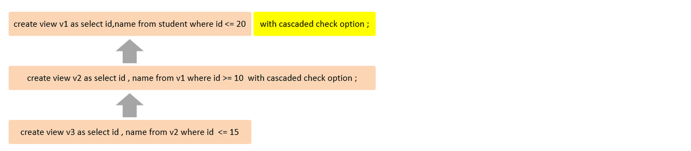
>
> 如上图，v2视图是基于v1视图的，如果在v2视图创建的时候指定了检查选项为 cascaded，但是v1视图 创建时未指定检查选项。而在执行检查时，不仅会检查v2，还会级联检查v2的关联视图v1（即检查v1的条件）(**“级联”的机制**)。而对于v3视图，因为没有设置check option与 cascaded，所以不会检查自身的的条件，但是会检查关联的视图的条件
>
> ```sql
> -- cascaded
> create or replace view stu_v_1 as select id,name from student where id <= 20;
>  
> insert into stu_v_1 values (5,'Tom'); -- 插入成功
> insert into stu_v_1 values (25,'Tom'); -- 插入成功
>  
> create or replace view stu_v_2 as select id,name from stu_v_1 where id >= 10 with cascaded check option ;
>  
> insert into stu_v_2 values (7,'Tom'); -- 插入失败，不满足stu_v_2
> insert into stu_v_2 values (26,'Tom'); -- 插入失败，不满足stu_v_1
> insert into stu_v_2 values (15,'Tom'); -- 插入成功
>  
> create or replace view stu_v_3 as select id,name from stu_v_2 where id <=15 ;
> insert into stu_v_2 values (11,'Tom'); -- 插入成功
> insert into stu_v_2 values (17,'Tom'); -- 插入成功，不会判定stu_v_3的条件
> insert into stu_v_2 values (28,'Tom'); -- 插入失败，不满足stu_v_1
> ```
>
> 
>
> ##### LOCAL 本地
>
> 会递归的找所依赖的视图，对有设定检查选项的视图做检查
>
> 比如，v2视图是基于v1视图的，如果在v2视图创建的时候指定了检查选项为 local ，但是v1视图创建时未指定检查选项。则在执行检查时，只会检查v2，不会检查v2的关联视图v1。
>
> 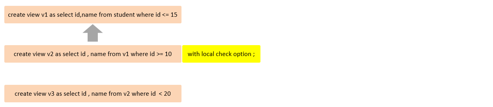
>
> ```sql
> -- local
> create or replace view stu_v_1 as select id,name from student where id <= 20;
>  
> insert into stu_v_1 values (5,'Tom');-- 插入成功
> insert into stu_v_1 values (25,'Tom');-- 插入成功
>  
> create or replace view stu_v_2 as select id,name from stu_v_1 where id >= 10 with local check option ;
>  
> insert into stu_v_2 values (7,'Tom');-- 插入失败，不满足stu_v_2条件
> insert into stu_v_2 values (26,'Tom');-- 插入成功，stu_v_1没有设置检查
> insert into stu_v_2 values (15,'Tom');-- 插入成功
>  
> create or replace view stu_v_3 as select id,name from stu_v_2 where id <=15 ;
> insert into stu_v_2 values (11,'Tom'); -- 插入成功
> insert into stu_v_2 values (17,'Tom'); -- 插入成功
> insert into stu_v_2 values (28,'Tom'); -- 插入成功
> ```
>
> 

> **可更新视图 的前提条件**
>
> 要使视图可更新，视图中的行与基础表中的行之间必须存在一对一的关系。如果视图包含以下任何一项，则该视图不可更新：
>
> * 聚合函数或窗口函数（SUM()、 MIN()、 MAX()、 COUNT()等）
>
> * DISTINCT
> * GROUP BY
> * HAVING
> * UNION 或者 UNION ALL

* 查询视图

```sql
查看创建视图语句：SHOW CREATE VIEW 视图名称;
查看视图数据：SELECT * FROM 视图名称 ...... ;
```
```sql
SHOW CREATE VIEW stu_view;
SELECT * FROM stu_view;
```

> 查询视图中的数据和查表一样

* 修改视图

```sql
方式一：CREATE [OR REPLACE] VIEW 视图名称 [ (列名列表)] AS SELECT语句 [ WITH
[ CASCADED | LOCAL ] CHECK OPTION ]
方式二：ALTER VIEW 视图名称 [ (列名列表)] AS SELECT语句 [ WITH [ CASCADED |
LOCAL ] CHECK OPTION ]
```
```sql
CREATE OR REPLACE VIEW stu_view AS SELECT id,name,no FROM student WHERE id <= 10;
ALTER VIEW stu_view AS SELECT id,name,no FROM student WHERE id <= 10;
```

* 删除视图

```sql
DROP VIEW [IF EXISTS] 视图名称 [,视图名称] ...
```
```sql
DROP VIEW stu_view;
```


**3.作用**

* 简单

  视图不仅可以简化用户对数据的理解，也可以简化他们的操作。那些被经常使用的查询可以被定义为视图，从而使得用户不必为以后的操作每次指定全部的条件。

* 安全

  数据库可以授权，但不能**授权到数据库特定行和特定的列**上。**通过视图用户只能查询和修改他们所能见到的数据**（<u>如学生表的视图，可以通过创建视图，让用户只能看到姓名和id，看不到学号</u>）。

* 数据独立

  视图可帮助用户屏蔽真实表结构变化带来的影响（比如业务需求更新学生表的学生姓名name为studentName，可以通过给创建语句起别名的方式屏蔽变化。
  


```sql
-- 1). 为了保证数据库表的安全性，开发人员在操作tb_user表时，只能看到的用户的基本字段，屏蔽 手机号和邮箱两个字段。
select id, name, profession, age, gender, status, createtime from tb_user;
create view user_view as select id, name, profession, age, gender, status, createtime from tb_user;
-- 2). 查询每个学生所选修的课程（三张表联查），这个功能在很多的业务中都有使用到，为了简化操作，定义一个视图。
select s.name, c.name from student s, student_course sc, course c where s.id = sc.studentid and c.id = sc.courseid;
create view tb_stu_course_view as select s.name student_name , s.no student_no , c.name course_name from student s, student_course sc, course c where s.id = sc.studentid and sc.courseid = c.id;
```


## 存储过程

**1.介绍**

存储过程是**事先经过编译并存储在数据库中的一段SQL 语句的集合**，调用存储过程可以简化应用开发人员的很多工作，**减少数据在数据库和应用服务器之间的传输**，对于提高数据处理的效率是有好处的。

存储过程思想上很简单，就是**数据库SQL 语言层面的代码封装与重用**

> 类似于API/脚本， 封装了系列操作，暴露接口给你进行操作

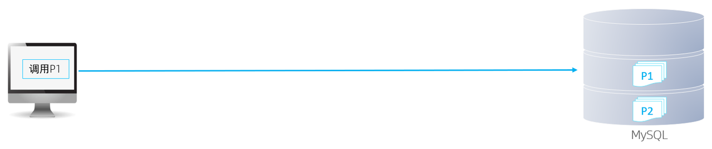

**特点**

* 封装，复用 -----------------------> 可以把某一业务SQL封装在存储过程中，需要用到的时候直接调用即可。
* 可以接收参数，也可以返回数据 --------> 在存储过程中，可以传递参数，也可以接收返回值。
* 减少网络交互，效率提升 -------------> 如果涉及到多条SQL，每执行一次都是一次网络传输。而如果封装在存储过程中，我们只需要网络交互一次可能就可以了


**2.基本语法**

* 创建

  ```sql
  CREATE PROCEDURE 存储过程名称 ([ 参数列表 ])
  BEGIN
  -- SQL语句
  END ;
  ```

  ```sql
  CREATE PROCEDURE p1()
  BEGIN
  	select count(*) from student;
  END;
  ```

  > **注意**：在命令行中，执行创建存储过程的SQL时，需要通过关键字delimiter指定SQL语句的结束符
  >
  > ```sql
  > delimiter $$ -- 设置sql语句结束符为“$$”
  > 
  > CREATE PROCEDURE p1
  > BEGIN
  > 	select count(*) from student;
  > END$$
  > 
  > delimiter ;
  > ```
  >
  > 

* 调用

  ```sql
  CALL 名称([ 参数 ]);
  ```

  

  ```sql
  call p1();
  ```

* 查看

  ```sql
  SELECT * FROM INFORMATION_SCHEMA.ROUTINES WHERE ROUTINE_SCHEMA = 'xxx '; -- 查询指定数据库的存储过程及状态信息
  SHOW CREATE PROCEDURE 存储过程名称 ; -- 查询某个存储过程的定义
  
  ```

  ```sql
  SELECT * FROM INFORMATION_SCHEMA.ROUTINES WHERE ROUTINE_SCHEMA = 'itcast';
  SHOW CREATE PROCEDURE p1;
  ```

* 删除

  ```sql
  DROP PROCEDURE [ IF EXISTS ] 存储过程名称;
  ```

  ```sql
  DROP PROCEDURE p1;
  ```

  

#### **变量**

在MySQL中变量分为三种类型 : 系统变量、用户定义变量、局部变量

* 系统变量

  系统变量 是MySQL服务器提供，不是用户定义的，属于服务器层面。分为全局变量（GLOBAL）、会话 变量（ SESSION）。

  全局变量 (GLOBAL): 全局变量针对于所有的会话。

  会话变量 (SESSION)（**默认值**）: 会话变量针对于单个会话，在另外一个会话窗口就不生效了

  * 查看系统变量

    ```sql
    SHOW [ SESSION | GLOBAL ] VARIABLES ; -- 查看所有系统变量
    SHOW [ SESSION | GLOBAL ] VARIABLES LIKE '...... '; -- 可以通过LIKE模糊匹配方式查找变量
    SELECT @@[SESSION | GLOBAL] 系统变量名; -- 查看指定变量的值
    ```

    ```sql
    -- 查看系统变量
    show session variables;
     
    show session variables like 'auto%';
    show global variables like 'auto%';
     
    select @@autocommit;
    select @@global.autocommit;
    select @@session.autocommit;
    ```

    

  * 设置系统变量

    ```sql
    SET [ SESSION | GLOBAL ] 系统变量名 = 值 ;
    SET @@ [SESSION | GLOBAL]系统变量名 = 值 ;
    ```

    ```sql
    -- 设置系统变量
    set session autocommit = 0; -- 关闭自动提交
     
    insert into course(id,name) values (6,'ES');
    commit;
    set global autocommit = 0;
    select @@global.autocommit;
    ```

    > **mysql服务重新启动之后，所设置的全局参数会失效，要想不失效，可以在 /etc/my.cnf 中配置**

* 用户定义变量

  用户定义变量 是用户根据需要自己定义的变量，用户变量不用提前声明，在用的时候直接用 "**@变量名** " 使用就可以。其作用域为当前连接

  * 赋值

    ```sql
    SET   @var_name = expr  [, @var_name = expr] ... ;
    SET   @var_name := expr [, @var_name := expr] ... ;
    ```

    赋值时，可以使用 = ，也可以使用 **:=**

    ```sql
    SET @myname := 'hazenix';
    SET @mygender := '男',@myhobby := 'java';
    select count(*) into @mycount from tb_user;
    ```

  * 使用

    ```sql
    SELECT   @var_name ;
    ```

    ```sql
    -- 使用
    select @myname,@mygender,@myhobby;
    ```

    注意 : 用户定义的变量**无需对其进行声明或初始化**，只不过未声明或初始化的变量获取到的值为NULL

    

* 局部变量

  局部变量是根据需要定义的在局部生效的变量，访问之前，**需要DECLARE声明**。可用作存储过程内的局部变量和输入参数，局部变量的范围是在其内声明的BEGIN ... END块

  * 声明

    ```sql
    DECLARE 变量名 变量类型 [DEFAULT ... ] ;
    ```

    ```sql
    DECLARE age int DEFAULT 0;
    ```

    

    变量类型就是数据库字段类型： INT、BIGINT、CHAR、VARCHAR、 DATE、TIME等

  * 赋值

    ```sql
    SET 变量名 = 值 ;
    SET 变量名 := 值 ;
    SELECT 字段名 INTO 变量名 FROM 表名 ... ;
    ```

    ```sql
    SET age := 18 ;
    ```


**包含变量的存储过程**

```sql
CREATE PROCEDURE p2()
BEGIN
	declare stu_count int default 0;
	select count(*) int stu_count from student;
	select stu_count;
END;

call p2()
```


#### 包含if判断的存储过程

**语法**

```sql
IF 条件1 THEN
.....
ELSEIF 条件2 THEN -- 可选
.....
ELSE -- 可选
.....
END IF;
```

ELSE IF 结构可以有多个，也可以没有。ELSE结构可以有，也可以没有


**案例**

```sql
-- 根据定义的分数score变量，判定当前分数对应的分数等级。
    -- score >= 85分，等级为优秀。
    -- score >= 60分  且  score < 85分，等级为及格。
    -- score < 60分，等级为不及格。
create procedure p3()
begin
    declare score int default 58;
    declare result varchar(10);
    if score >= 85 then
        set result := '优秀';
    elseif score >= 60 then
        set result := '及格';
    else
        set result := '不及格';
    end if;
    select result;
end;
 
call p3();
```


#### 包含参数的存储过程

**介绍**

参数的类型，主要分为以下三种： IN、OUT、 INOUT。 具体的含义如下

| 类型  | 含义                                         | 备注 |
| ----- | -------------------------------------------- | ---- |
| IN    | 该类参数作为输入，也就是需要调用时传入值     | 默认 |
| OUT   | 该类参数作为输出，也就是该参数可以作为返回值 |      |
| INOUT | 既可以作为输入参数，也可以作为输出参数       |      |

**语法**

```sql
CREATE PROCEDURE 存储过程名称 ([ IN/OUT/INOUT  参数名   参数类型 ])
BEGIN
    -- SQL语句
END ;
```

**案例**

```sql
-- 案例一：根据传入参数score，判定当前分数对应的分数等级，并返回。
create procedure p4(in score int, out result varchar(10))
begin
    if score >= 85 then
        set result := '优秀';
    elseif score >= 60 then
        set result := '及格';
    else
        set result := '不及格';
    end if;
end;
 
call p4( 18 ,@result); -- 用 用户自定义变量 接受结果
select @result;
 
-- 案例二：将传入的200分制的分数，进行换算，换算成百分制，然后返回。
create procedure p5(inout score double)
begin
    set score := score * 0.5;
end;
 
set @score = 197; -- 需要先赋值，因为这个变量同时也是传入参数
call p5( @score);
select @score;
```


#### 包含case的存储过程


**语法**

```sql
-- 含义： 当case_value的值为 when_value1时，执行statement_list1，
--       当值为 when_value2时， 执行statement_list2， 否则就执行 statement_list
CASE  case_value
    WHEN  when_value1  THEN  statement_list1
    [ WHEN  when_value2  THEN  statement_list2] ...
    [ ELSE  statement_list ]
END  CASE;
```

```sql
-- 含义： 当条件search_condition1成立时，执行statement_list1，
--       当条件search_condition2成立时，执行statement_list2， 否则就执行 statement_list
CASE
    WHEN  search_condition1  THEN  statement_list1
    [WHEN  search_condition2  THEN  statement_list2] ...
    [ELSE  statement_list]
END CASE;
```


**案例**

```sql
-- case
-- 根据传入的月份，判定月份所属的季节（要求采用case结构）。
-- 1-3月份，为第一季度
-- 4-6月份，为第二季度
-- 7-9月份，为第三季度
-- 10-12月份，为第四季度
create procedure p6(in month int)
begin
    declare result varchar(10);
    case
        when month >= 1 and month <= 3 then
            set result := '第一季度 ';
        when month >= 4 and month <= 6 then
            set result := '第二季度 ';
        when month >= 7 and month <= 9 then
            set result := '第三季度 ';
        when month >= 10 and month <= 12 then
            set result := '第四季度 ';
        else set result := '非法参数 ';
    end case;
 
    select concat('您输入的月份为 : ', month, ', 所属的季度为 : ', result); -- 这句作用可以理解为打印
end;
 
call p6(16);
```


#### 包含循环的存储过程

**语法**

```sql
-- 先判定条件，如果条件为true，则执行逻辑，否则，不执行逻辑
WHILE  条件  DO
    SQL逻辑 ...
END WHILE;
```


**案例**

```sql
-- 计算从1累加到n的值， n为传入的参数值。
create procedure p7(in n int)
begin
    declare total int default 0;
    while n>0 do
        set total := total + n;
        set n := n - 1;
    end while;
    select total;
end;
 
call p7(100);
```


#### 包含repeat的存储过程

repeat是有条件的循环控制语句 , 当满足until声明的条件的时候，则退出循环

> 和do while同一个逻辑

**语法**

```sql
-- 先执行一次逻辑，然后判定UNTIL条件是否满足，如果满足，则退出。如果不满足，则继续下一次循环

REPEAT
	SQL逻辑 ...
	UNTIL 条件
END REPEAT
```


**案例**

```sql
-- 计算从1累加到n的值， n为传入的参数值。 (使用repeat实现)
create procedure p8(in n int)
begin
    declare total int default 0;
    
    repeat
        set total := total + n;
        set n := n - 1;
    until n <= 0
    end repeat;
    
    select total;
end;
 
call p8(100);
```


#### 包含loop循环的存储过程


LOOP 用于实现简单的循环，如果不在SQL逻辑中增加退出循环的条件，**可以用其来实现简单的死循环**

LOOP可以配合以下两个语句使用：

- LEAVE ：配合循环使用，退出循环。（相当于`break`）
- ITERATE：必须用在循环中，作用是跳过当前循环剩下的语句，直接进入下一次循环（相当于`continue`）


**语法**

```sql
[begin_label:] LOOP
SQL逻辑...
END LOOP [end_label];
```

```sql
LEAVE label; -- 退出指定标记的循环体
ITERATE label; -- 直接进入下一次循环
```

上述语法中出现的 begin_label，end_label，label 指的都是我们所自定义的标记

> 推荐 `begin_label:`、`end_label` 都加上

**案例**

```sql
-- loop
-- 计算从1累加到n的值， n为传入的参数值
create procedure p9(in n int)
begin
    declare total int default 0;
    sum: loop
        if n<= 0 then
            leave sum;
        end if;
 
        set total := total + n;
        set n := n - 1;
    end loop sum;
    select total;
end;
 
call p9(100);
 
-- 计算从1到n之间的偶数累加的值， n为传入的参数值。
    -- A. 定义局部变量, 记录累加之后的值;
    -- B. 每循环一次, 就会对n进行-1 , 如果n减到0, 则退出循环 ----> leave xx
    -- C. 如果当次累加的数据是奇数, 则直接进入下一次循环 . --------> iterate xx
create procedure p10(in n int)
begin
    declare total int default 0;
    sum: loop
        if n<=0 then
            leave sum;
        end if;
 
        if n%2 = 1 then
            set n := n-1;
            iterate sum;
        end if;
 
        set total := total + n;
        set n := n - 1;
 
    end loop sum;
    select total;
end;
 
call p10(100);
```


#### 条件处理程序

条件处理程序（ Handler）可以用来定义 **在流程控制结构执行过程中遇到问题时 相应的处理步骤**（异常捕获与处理）

```sql
DECLARE handler_action HANDLER FOR  condition_value [, condition_value]... statement ;
```

* handler_action 的取值：

  * CONTINUE: 继续执行当前程序
  * EXIT: 终止执行当前程序

* condition_value 的取值：

  * SQLSTATE：sqlstate_value: 状态码，如 0200

    ```SQL
    SQLSTATE '02000'
    ```

  * SQLWARNING: 所有以01开头的SQLSTATE代码的简写

  * NOT FOUND: 所有以02开头的SQLSTATE代码的简写

  * SQLEXCEPTION: 所有没有被SQLWARNING 或 NOT FOUND捕获的SQLSTATE代码的简写
    

> 参考[官方文档](https://dev.mysql.com/doc/mysql-errors/8.0/en/server-error-reference.html)


#### 包含游标的存储过程

游标（ CURSOR）是**用来存储查询结果集的数据类型** , 在存储过程和函数中可以使用游标对结果集进行循环的处理。游标的使用包括游标的声明、 OPEN、 FETCH 和 CLOSE，其语法分别如下


**语法**

* 声明游标

  ```sql
  DECLARE 游标名称 CURSOR FOR 查询语句;
  ```

* 打开游标

  ```sql
  OPEN 游标名称;
  ```

* 获取游标记录

  ```sql
  FETCH 游标名称 INTO 变量 [,变量 ];
  ```

* 关闭游标

  ```sql
  CLOSE   游标名称 ;
  ```

  

**案例**

```sql
-- 根据传入的参数uage，来查询用户表tb_user中，所有的用户年龄小于等于uage的用户姓名
-- （name）和专业（profession），并将用户的姓名和专业插入到所创建的一张新表(id,name,profession)中。
-- 逻辑 :
   -- A. 声明游标, 用于存储查询结果集
   -- B. 准备: 创建表结构
   -- C. 开启游标
   -- D. 获取游标中的记录
   -- E. 插入数据到新表中
   -- F. 关闭游标
create procedure p12(in uage int)
begin
    declare uname varchar(100);
    declare upro varchar(100);
    declare u_cursor cursor for select name,profession from tb_user where age <= uage;	-- A. 声明游标, 用于存储查询结果集
    declare exit HANDLER FOR SQLSTATE '02000' close u_cursor; -- 通过SQLSTATE指定具体的状态码
 -- declare exit handler for not found close u_cursor; -- SQLSTATE的代码简写方式  NOT FOUND
 
 	-- B. 准备: 创建表结构
    drop table if exists tb_user_pro;
    create table if not exists tb_user_pro( 
        id int primary key auto_increment,
        name varchar(100),
        profession varchar(100)
    );
 
    open u_cursor;-- C. 开启游标
    
    while true do
    	-- D. 获取游标中的记录
        fetch u_cursor into uname,upro;
        -- E. 插入数据到新表中
        insert into tb_user_pro values (null,uname,upro);
    end while;
    -- F. 关闭游标
    close u_cursor;
 
end;
 
call p12(30);
```


## 存储函数

存储函数是<u>有返回值的存储过程</u>，存储函数的参数只能是IN类型的

**语法**

```sql
CREATE FUNCTION 存储函数名称 ([ 参数列表 ])
RETURNS type [characteristic ...]
BEGIN
    -- SQL语句
    RETURN ...;
END ;
```

* characteristic说明：

  * DETERMINISTIC：相同的输入参数总是产生相同的结果。表示函数或过程是纯函数或过程，即它的输出完全由输入参数确定
  * NO SQL ：不包含 SQL 语句
  * READS SQL DATA：包含读取数据的语句，但不包含写入数据的语句

**案例**

```sql
-- 计算从1累加到n的值， n为传入的参数值。
create function fun1(n int)
returns int deterministic
begin
    declare total int default 0;
    while n>0 do
            set total := total + n;
            set n := n - 1;
    end while;
    return total;
end;
 
select fun1(50);
```


## 触发器

**介绍**

* 触发器是与表有关的数据库对象，指在insert/update/delete之前(BEFORE)或之后 (AFTER)，触发并执行触发器中定义的SQL语句集合。触发器的这种特性可以协助应用在数据库端确保数据的完整性, 日志记录, 数据校验等操作。

* 使用别名OLD和NEW来引用触发器中发生变化的记录内容，这与其他的数据库是相似的。现在触发器还只支持行级触发，不支持语句级触发。（当执行一条sql语句后，如果影响了五行数据，则触发器触发五次，这就是行级触发器，如果一条sql语句影响了五行数据，但是只触发了一次，这就是语句级触发器。）

  > mysql只支持行级触发器

(类似AOP)

| 触发器类型      | NEW 和 OLD                                              |
| --------------- | ------------------------------------------------------- |
| INSERT 型触发器 | NEW 表示将要或者已经新增的数据                          |
| UPDATE 型触发器 | OLD 表示修改之前的数据 , NEW 表示将要或已经修改后的数据 |
| DELETE 型触发器 | OLD 表示将要或者已经删除的数据                          |


**语法**

* 创建

  ```sql
  CREATE TRIGGER trigger_name
  BEFORE/AFTER INSERT/UPDATE/DELETE
  ON tbl_name FOR EACH ROW -- 行级触发器
  BEGIN
  	trigger_stmt ;
  END;
  ```

* 查看

  ```sql
  SHOW TRIGGERS ;
  ```

* 删除

  ```sql
  DROP TRIGGER [schema_name.]trigger_name ; -- 如果没有指定 schema_name，默认为当前数据库
  ```

  


**案例**

1.插入数据触发器

```sql
create table user_logs(
                          id int(11) not null auto_increment,
                          operation varchar(20) not null comment '操作类型,         insert/update/delete',
                          operate_time datetime not null comment '操作时间',
                          operate_id int(11) not null comment '操作的ID',
                          operate_params varchar(500) comment '操作参数',
                          primary key(`id`)
)engine=innodb default charset=utf8;
 
-- 插入触发器
create trigger tb_user_insert_trigger
    after insert on tb_user for each row 
begin
    insert into user_logs(id, operation, operate_time, operate_id, operate_params)
        VALUES
            (null,'insert',now(),new.id,concat('输入的内容为：id= ',new.id, ',name= ',new.name, ', phone= ', NEW.phone, ', email= ', NEW.email, ', profession= ', NEW.profession));
end;
 
-- 查看触发器
show triggers ;
 
-- 插入数据到tb_user
insert into tb_user(id, name, phone, email, profession, age, gender, status, createtime)
VALUES (25,'二皇子','18809091212','erhuangzi@163.com','软件工程',23,'1','1',now());
 
-- 删除触发器
drop trigger tb_user_insert_trigger;
```

2.修改数据触发器

```sql
-- 修改数据触发器
create trigger tb_user_update_trigger
    after update on tb_user for each row
begin
    insert into user_logs(id, operation, operate_time, operate_id, operate_params)
    VALUES
        (null,'update',now(),new.id,concat('更新之前的内容为：id= ',old.id, ',name= ',old.name, ', phone= ', old.phone, ', email= ', old.email, ', profession= ', old.profession,
                                           ' | 更新之后的内容为：id= ',new.id, ',name= ',new.name, ', phone= ', NEW.phone, ', email= ', NEW.email, ', profession= ', NEW.profession));
end;
 
update tb_user set age = 20 where id = 23;
update tb_user set profession = '会计' where id <= 5;
```

3.删除数据触发器

```sql
-- 删除数据触发器
create trigger tb_user_delete_trigger
    after delete on tb_user for each row
begin
    insert into user_logs(id, operation, operate_time, operate_id, operate_params)
    VALUES
        (null,'delete',now(),old.id,concat('删除的内容为：id= ',old.id, ',name= ',old.name, ', phone= ', old.phone, ', email= ', old.email, ', profession= ', old.profession));
end;
 
delete from tb_user where id = 25;
```


# 锁


## 概述

锁是计算机协调多个进程或线程并发访问某一资源的机制。在数据库中，除传统的计算资源（ CPU、RAM、 I/O）的争用以外，数据也是一种供许多用户共享的资源。如何保证数据并发访问的一致性、有效性是所有数据库必须解决的一个问题，锁冲突也是影响数据库并发访问性能的一个重要因素。从这个 角度来说，锁对数据库而言显得尤其重要，也更加复杂


MySQL提供了各种锁来应对并发场景

按照锁的粒度分，有：

1. 全局锁：锁定数据库中的所有表
1. 表级锁：每次操作锁住整张表
1. 行级锁：每次操作锁住对应的行数据


## 全局锁


**介绍**

全局锁就是对整个数据库实例加锁，加锁后整个实例就处于只读状态，后续的DML的写语句，DDL语句，以及更新操作的事务提交语句都将被阻塞。

典型的使用场景：做**全库的逻辑备份**，对所有的表进行锁定，从而获取一致性视图，保证数据的完整性。

* 为什么全库逻辑备份，就需要加全局锁呢？

> A. 我们一起先来分析一下不加全局锁，可能存在的问题。
>
> 假设在数据库中存在这样三张表 : tb_stock 库存表， tb_order 订单表， tb_orderlog 订单日 志表
>
> 
>
> * 在进行数据备份时，先备份了tb_stock库存表。
> * 然后接下来，在业务系统中，执行了下单操作，扣减库存，生成订单（更新tb_stock表，插入 tb_order表）
> * 然后再执行备份 tb_order表的逻辑
> * 业务中执行插入订单日志操作
> * 最后，又备份了tb_orderlog表。
>
> 此时备份出来的数据，是存在问题的。因为备份出来的数据，tb_stock表与tb_order表的数据不一 致(有最新操作的订单信息 ,但是库存数没减)。
>
> 那如何来规避这种问题呢 ? 此时就可以借助于MySQL的全局锁来解决
>
> B. 再来分析一下加了全局锁后的情况
>
> 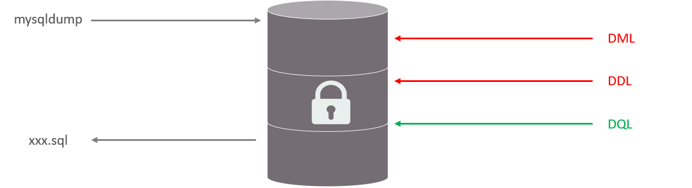
>
> **对数据库进行进行逻辑备份之前，先对整个数据库加上全局锁**，一旦加了全局锁之后，其他的DDL、DML全部都处于阻塞状态，**但是可以执行DQL语句，也就是处于只读状态**，而数据备份就是查询操作。那么数据在进行逻辑备份的过程中，数据库中的数据就是不会发生变化的，这样就保证了数据的一致性和完整性


**语法**

* 加全局锁

  ```sql
  flush tables with read lock;
  ```

* 数据备份

  ```sql
  mysqldump -uroot -p1234 itcast > A:/itcast.sql
  ```

* 释放锁

  ```sql
  unlock tables;
  ```

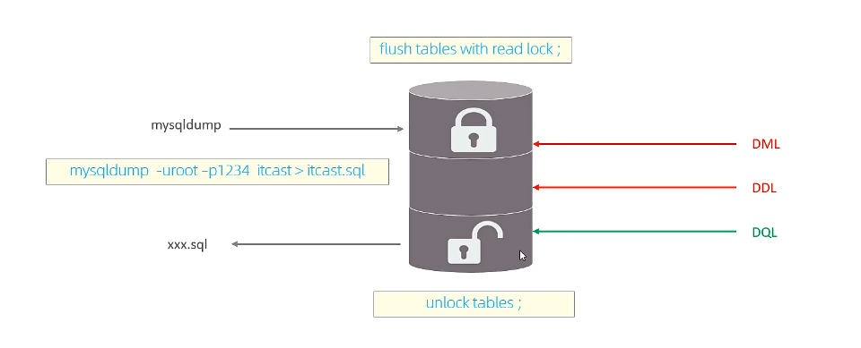

**特点**

数据库中加全局锁，是一个比较重的操作，存在以下问题：

* 如果在主库上备份，那么在备份期间都不能执行更新，业务基本上就得停摆。
* 如果在从库上备份，那么在备份期间从库不能执行主库同步过来的二进制日志（binlog），会导致主从延迟。

在InnoDB引擎中，我们可以在备份时加上参数 --single-transaction 参数来完成不加锁的 一致性数据备份。
```sql
mysqldump --single-transaction -uroot –p123456 itcast > itcast.sql
```


## 表级锁


**介绍**

表级锁，每次操作锁住整张表。锁定粒度大，发生锁冲突的概率最高，并发度最低。应用在MyISAM、 InnoDB、BDB等存储引擎中。

对于表级锁，主要分为以下三类：

- 表锁
- 元数据锁（meta data lock，MDL）
- 意向锁


#### **表锁**

对于表锁，分为两类：

- 表共享**读锁**（read lock）

  加上之后==只能读 不能写==，不会阻塞其他客户端的读

  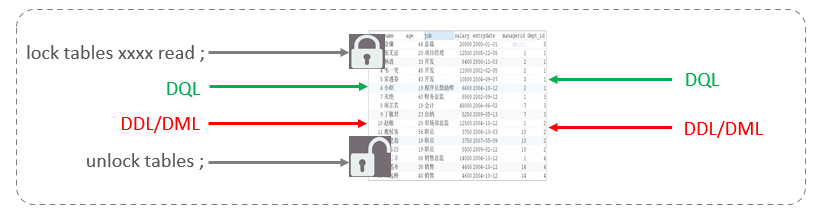

  > 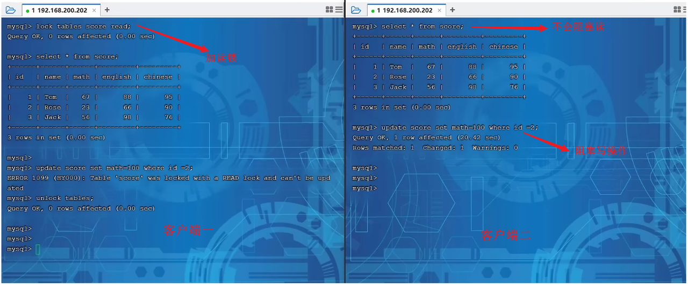

- 表独占**写锁**（write lock）

  加上之后==可以读 可以写==，阻塞其他客户端的读和写

> 读锁**不会阻塞其他客户端的读，但是会阻塞写**。写锁**既会阻塞其他客户端的读，又会阻塞其他客户端的写**。


**语法**

* 加锁

  ```sql
  lock tables 表名 ... read/write。 
  ```

* 释放锁

  ```sql
  unlock tables / 客户端断开连接 。
  ```

**特点**：


#### **元数据锁**

meta data lock , 元数据锁，简写MDL。

MDL加锁过程是<u>系统自动控制，无需显式使用</u>，在访问一张表的时候会自动加上。MDL锁主要作用是**维护表元数据的数据一致性**，在表上有活动事务的时候，不可以对元数据进行写入操作。**为了避免DML与DDL冲突，保证读写的正确性。 （即读写不能和修改表结构同时运行）**

这里的元数据可以简单理解为就是一张表的表结构。 也就是说，某一张表涉及到未提交的事务时，是不能够修改这张表的表结构的。

在MySQL5.5中引入了MDL，当对一张表进行增删改查的时候，加MDL读锁(共享)；当对表结构进行变 更操作的时候，加MDL写锁(排他)。

常见的SQL操作时，所添加的元数据锁：

| 对应SQL                                        | 锁类型                                  | 说明                                              |
| ---------------------------------------------- | --------------------------------------- | ------------------------------------------------- |
| lock tables xxx read / write                   | SHARED_READ_ONLY / SHARED_NO_READ_WRITE |                                                   |
| select 、 select ... lock in share mode        | SHARED_READ （元数据共享锁）            | 与SHARED_READ、SHARED WRITE兼容，与_EXCLUSIVE互斥 |
| insert 、update、delete、 select ... forupdate | SHARED_WRITE（元数据共享锁）            | 与SHARED_READ、SHARED WRITE兼容，与_EXCLUSIVE互斥 |
| alter table ...                                | EXCLUSIVE                               | 与其他的MDL都互斥                                 |


2. 当执行SELECT、 INSERT、UPDATE、 DELETE（增删改查）等语句时，添加的是**元数据共享锁（ SHARED_READ / SHARED_WRITE）**，**共享锁之间是兼容的**
   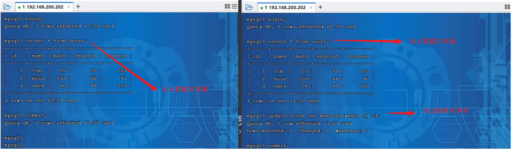

3. 更新表结构的操作和其他操作元数据锁都互斥(元数据排他锁和其他元数据锁互斥)，也就是说，其他锁存在的时候(事务没提交)，不能更改表结构
   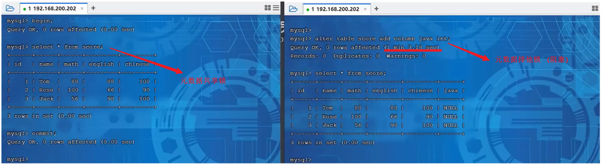

> **有两种类型，一种是表数据锁，一种是元数据锁。各自分别又有共享和排他锁**


**语法**

* 查看元数据锁

  ```sql
  select object_type, object_schema, object_name, lock_duration from performance_schema.metadata_locks;
  ```

  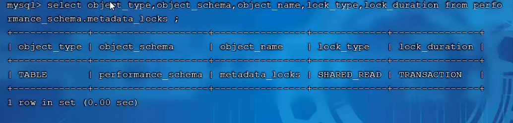

  


#### 意向锁

**介绍**

为了避免DML在执行时 **行锁与表锁的冲突问题**，在InnoDB中引入了意向锁，使得表锁不用检查每行数据是否加锁，使用意向锁来减少表锁的检查。

> 假如没有意向锁，客户端一对表加了行锁后，客户端二如何给表加表锁呢，来通过示意图简单分析一 下：
>
> 首先客户端一，开启一个事务，然后执行DML操作，在执行DML语句时，会对涉及到的行加行锁
> 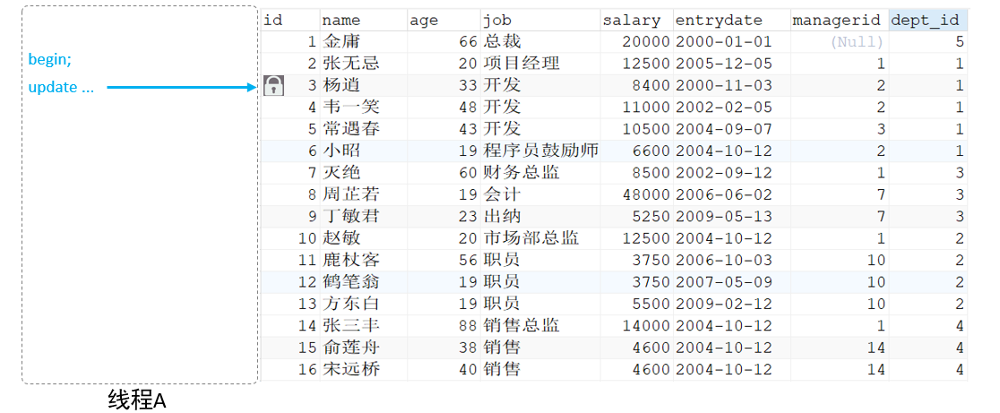
>
> 当客户端二，想对这张表加表锁时，会逐行检查当前表是否有对应的行锁，如果没有，则添加表锁，此时就会从第一行数据，检查到最后一行数据，效率较低
>
> 有了意向锁之后 :
>
> 客户端一，在执行DML操作时，**会对涉及的行加行锁，同时也会对该表加上意向锁**（事务提交后意向共享锁、意向排他锁，都会自动释放。）
>
> 而其他客户端，在对这张表加表锁的时候，**会根据该表上所加的意向锁来判定是否可以成功加表锁，而不用逐行判断行锁情况了**


**分类**

* 意向共享锁 (IS): 由语句select ... lock in share mode添加 。 与表锁共享锁 (read)兼容，与表锁排他锁(write)互斥。

* 意向排他锁 (IX): 由insert、update、delete、select...for update添加 。与表锁共享锁(read)及排他锁(write)都互斥，意向锁之间不会互斥。

  > 增删改语句执行时 自动添加**行锁和意向排他锁**


> 可以通过以下SQL，查看意向锁及行锁的加锁情况：
>
> ```sql
> select object_schema, object_name, index_name, lock_type, lock_mode, lock_data from performance_schema.data_locks;
> ```


## 行级锁

**介绍**

[行级锁](https://so.csdn.net/so/search?q=行级锁&spm=1001.2101.3001.7020)，每次操作锁住对应的行数据。锁定粒度最小，发生锁冲突的概率最低，并发度最高。应用在InnoDB存储引擎中。(MyISAM引擎没有行锁)

InnoDB的数据是基于**索引**组织的，**行锁是通过对索引上的索引项加锁来实现的**，而不是对记录加的锁。对于行级锁，主要分为以下三类：

> **Read committed读已提交 : RC**
>
> **Repeatable Read(默认)可重复读 : RR**

* 行锁（Record Lock）：锁定单个行记录的锁，防止其他事务对此行进行update和delete。在RC、RR隔离级别下都支持。

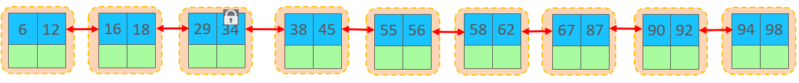

* 间隙锁（Gap Lock）：锁定索引记录间隙（不含该记录），确保索引记录间隙不变，防止其他事务在这个间隙进行insert，产生幻读。在RR隔离级别下都支持。

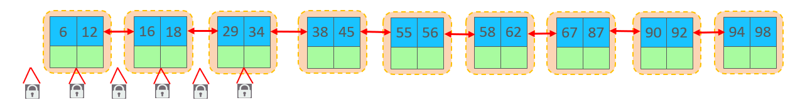

* 临键锁（Next-Key Lock）：行锁和间隙锁组合，同时锁住数据，并锁住数据前面的间隙Gap。在RR隔离级别下支持。

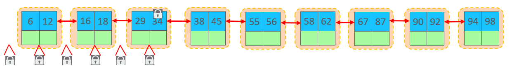


#### 行锁

**介绍**

InnoDB实现了以下两种类型的**行锁**：

1. 共享锁（S）：允许一个事务去读一行，阻止其他事务获得相同数据集的排他锁

   > 事务一获得某一行的共享锁后，其他事务无法再申请获得该行的排他锁（可以获得共享锁）

2. 排他锁（X）：允许获取排他锁的事务更新数据，阻止其他事务获得相同数据集的共享锁和排他锁

   > 事务一获取某一行的排他锁后，其他事务无法再申请该行的共享锁和排他锁

两种行锁的兼容情况如下:


**常见的SQL语句，在执行时所加的行锁如下**：

| SQL                          | 行锁类型          | 说明                                     |
| ---------------------------- | ----------------- | ---------------------------------------- |
| INSERT/UPDATE/DELETE ...     | 排他锁            | 自动加锁                                 |
| SELECT                       | <u>不加任何锁</u> |                                          |
| SELECT ... LOCK IN SHAREMODE | 共享锁            | 需要手动在SELECT之后加LOCK IN SHARE MODE |
| SELECT ... FOR UPDATE        | 排他锁            | 需要手动在SELECT之后加FOR UPDATE         |


**演示**

默认情况下， InnoDB在REPEATABLE READ事务隔离级别运行， InnoDB使用 临键(next-key) 锁进行搜索和索引扫描，以防止幻读

* 针对唯一索引进行检索时，对已存在的记录进行等值匹配时，将会自动优化为行锁
* InnoDB的行锁是针对于索引加的锁，不通过索引条件检索数据，那么InnoDB将对表中的所有记录加锁，此时 **就会升级为表锁**

> 可以通过以下SQL，查看意向锁及行锁的加锁情况：
>
> ```sql
> select object_schema,object_name,index_name,lock_type,lock_mode,lock_data from performance_schema.data_locks;
> ```
>
> 数据准备
>
> ```sql
> CREATE TABLE `stu`  (
>       `id` int NOT NULL  PRIMARY KEY AUTO_INCREMENT,
>       `name` varchar (255) DEFAULT NULL,
>       `age` int NOT NULL
> ) ENGINE = InnoDB CHARACTER SET = utf8mb4; 
> INSERT INTO `stu` VALUES (1, 'tom ', 1);
> INSERT INTO `stu` VALUES (3, 'cat ', 3);
> INSERT INTO `stu` VALUES (8, 'rose ', 8);
> INSERT INTO `stu` VALUES (11, 'jetty ', 11);
> INSERT INTO `stu` VALUES (19, 'lily ', 19);
> INSERT INTO `stu` VALUES (25, 'luci ', 25);
> ```
>
> 
>
> 演示行锁的时候，我们就通过上面这张表来演示一下。
>
> A. 普通的select语句，执行时，不会加锁
>
> 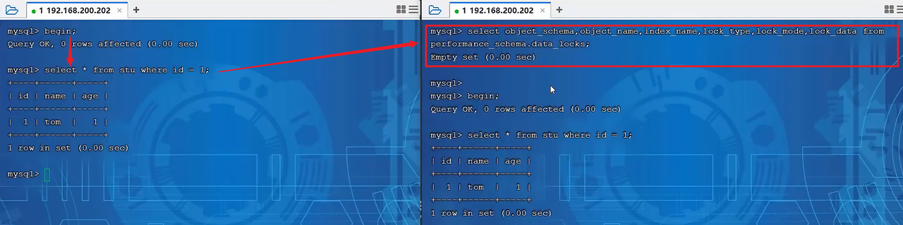
>
> B. select...lock in share mode，加共享锁，**共享锁与共享锁之间兼容**
>
> 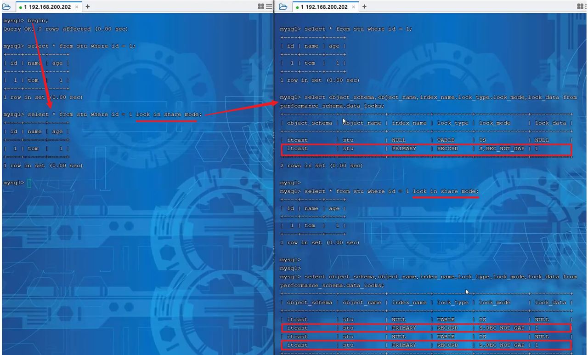
>
> **共享锁与排他锁之间互斥**
>
> 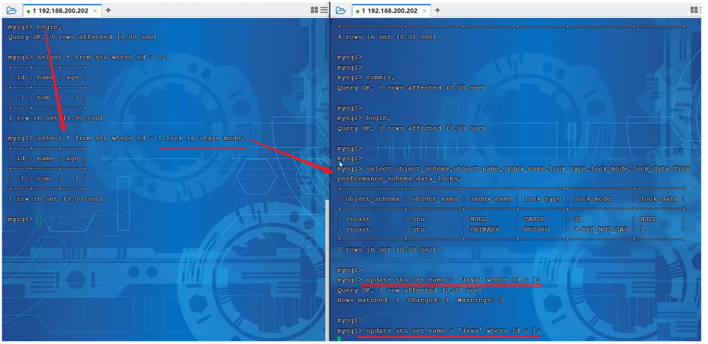
>
> 客户端一获取的是id为1这行的共享锁，客户端二是可以获取id为3这行的排它锁的，因为不是同一行数据。 而如果客户端二想获取id为1这行的排他锁，会处于阻塞状态，以为共享锁与排他锁之间互斥
>
> C. 排它锁与排他锁之间互斥
>
> 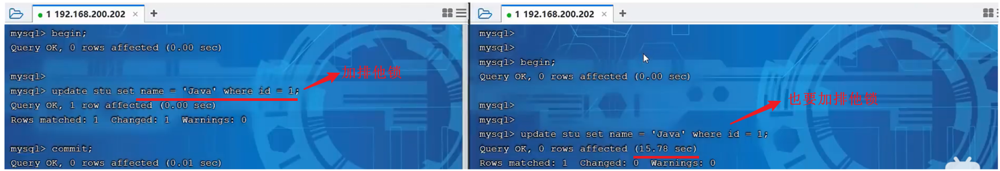
>
> 客户端一，执行update语句，会为id为1的记录加排他锁； 客户端二，如果也执行update语句更新id为1的数据，也要为id为1的数据加排他锁，但是客户端二会处于阻塞状态，因为排他锁之间是互斥的。 直到客户端一，把事务提交了，才会把这一行的行锁释放，此时客户端二，解除阻塞
>
> D. 无索引行锁升级为表锁
>
> stu表中数据如下
>
> 
>
> 我们在两个客户端中执行如下操作 :
>
> 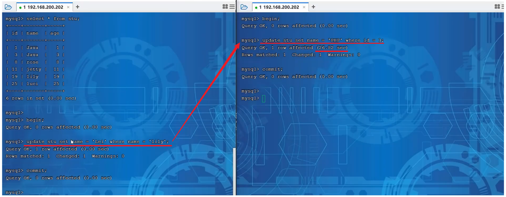
>
> 在客户端一中，开启事务，并执行update语句，更新name为Lily的数据，也就是id为19的记录 。 然后在客户端二中更新id为3的记录，却不能直接执行，会处于阻塞状态，为什么呢？原因就是因为此时，客户端一，**根据name字段进行更新时， name字段是没有索引的**，**如果没有索引， 此时行锁会升级为表锁**(因为<u>行锁是对索引项加的锁，而name没有索引</u>)。
>
> 接下来，我们再针对name字段建立索引，索引建立之后，再次做一个测试：
> 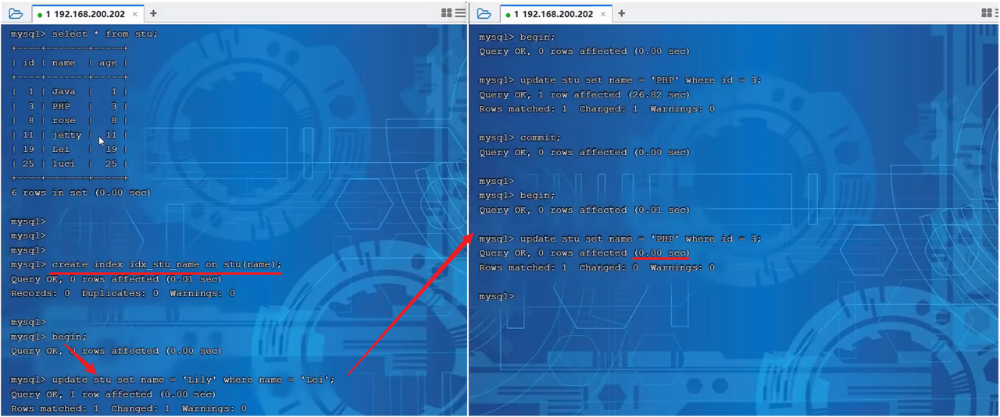
>
> 此时我们可以看到，客户端一，开启事务，然后依然是根据name进行更新。而客户端二，在更新id为3 的数据时，更新成功，并未进入阻塞状态。这样就说明，我们根据索引字段进行更新操作，就可以避免行锁升级为表锁的情况
>
> 

#### 间隙锁 **& 临键锁**

- **间隙锁：两个行之间的锁（不包含其中某个行的行锁）。**
- **临键锁：两个行之间的锁（包含其中一个或两个行的行锁）**

临键锁就是行锁加间隙锁。

默认情况下， InnoDB在**REPEATABLE READ**事务隔离级别运行， InnoDB使用next-key锁（临键锁）进行搜索和索引扫描，以防止幻读。

* 索引上的等值查询(唯一索引)，给不存在的记录加锁时 , 优化为间隙锁 。
* 索引上的等值查询(非唯一普通索引)，向右遍历时最后一个值不满足查询需求时，next-key lock 退化为间隙锁。
* 索引上的范围查询(唯一索引)--会访问到不满足条件的第一个值为止

> 注意：间隙锁唯一目的是防止其他事务插入间隙。间隙锁可以共存，一个事务采用的间隙锁不会阻止另一个事务在同一间隙上采用间隙锁


**演示**

A. 索引上的等值查询(唯一索引)，给不存在的记录加锁时 , 优化为[间隙锁](https://so.csdn.net/so/search?q=间隙锁&spm=1001.2101.3001.7020)

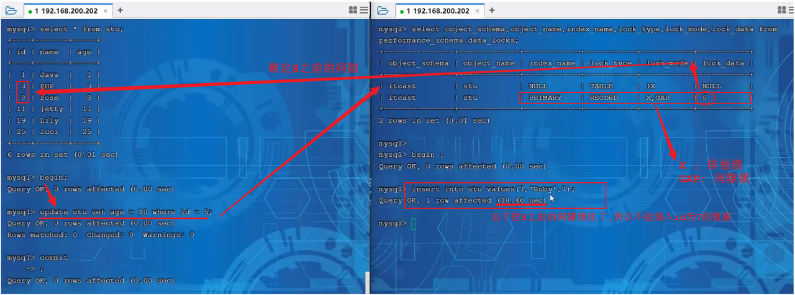

> ```
> update stu set age = 10 where id = 5;
> ```
>
> 更新了不存在的记录(给不存在的记录加上排他锁)，自动优化为间隙锁
>
> 

B. 索引上的等值查询(非唯一普通索引)，向右遍历时最后一个值不满足查询需求时， next-key lock 退化为间隙锁。

介绍分析一下：

我们知道InnoDB的B+树索引，叶子节点是有序的双向链表。 假如，我们要根据这个二级索引查询值为18的数据，并加上共享锁，我们是只锁定18这一行就可以了吗？ 并不是，因为是非唯一索引，这个结构中可能有多个18的存在，所以，在加锁时会继续往后找，找到一个不满足条件的值（当前案例中也就是29）。此时会对18加临键锁，并对29之前的间隙加锁

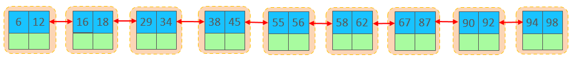

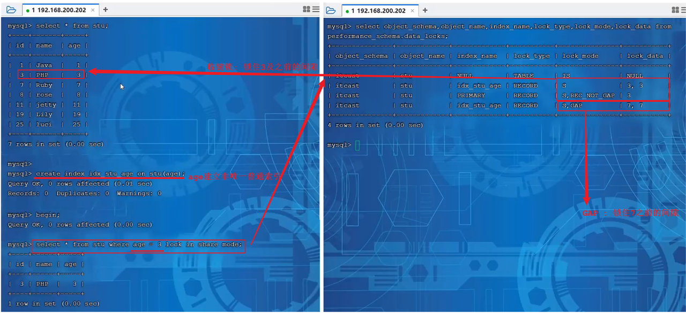

C. 索引上的范围查询(唯一索引)--会访问到不满足条件的第一个值为止

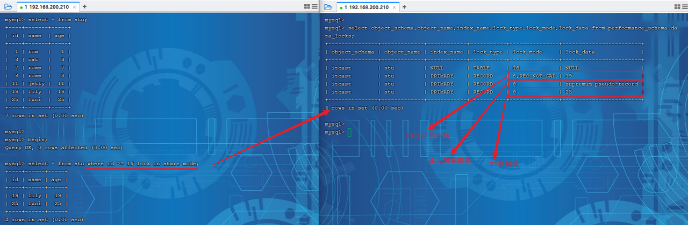

查询的条件为id>=19，并添加共享锁。此时我们可以根据数据库表中现有的数据，将数据分为三个部分：

[19]

(19,25]

(25,+∞]

所以数据库数据在加锁时，就是将19加了行锁， 25的临键锁（包含25及25之前的间隙），正无穷的临键锁(正无穷及之前的间隙)。


#### 临键锁


# InnoDB引擎


## 逻辑存储结构

InnoDB的逻辑[存储结构](https://so.csdn.net/so/search?q=存储结构&spm=1001.2101.3001.7020)如下图所示 :

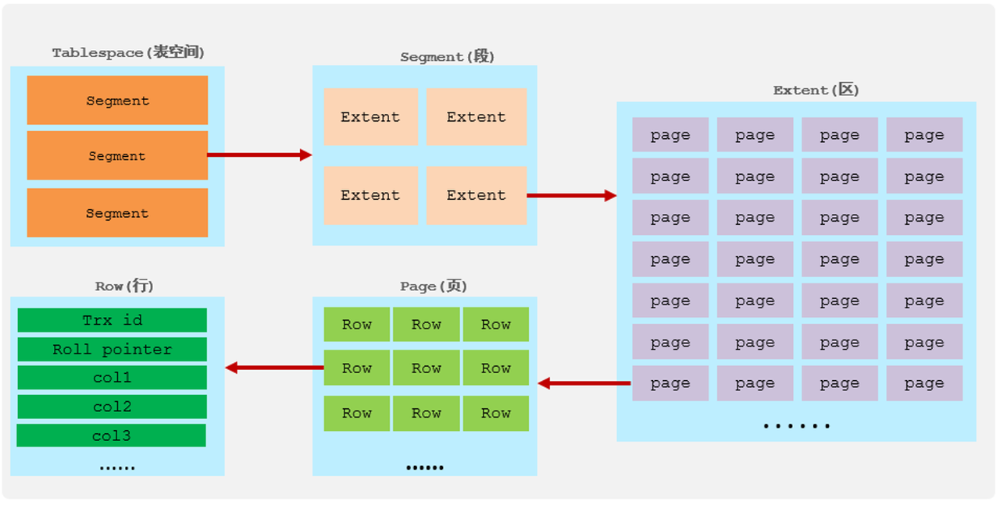

#### 1.表空间

表空间是InnoDB存储引擎逻辑结构的最高层， 如果用户启用了参数 innodb_file_per_table(在8.0版本中默认开启) ，则每张表都会有一个表空间（xxx.ibd），一个mysql实例可以对应多个表空间，**用于存储记录、索引等数据**

#### 2.段

段，分为数据段（Leaf node segment）、索引段（Non-leaf node segment）、回滚段（Rollback segment），InnoDB是索引组织表，数据段就是B+树的叶子节点， 索引段即为B+树的非叶子节点。段用来管理多个Extent（区）

#### 3.区

区，表空间的单元结构，每个区的大小为1M。 默认情况下， InnoDB存储引擎页大小为16K， 即一个区中一共有64个连续的页

#### 4.页

页，是InnoDB 存储引擎磁盘管理的最小单元，每个页的大小默认为 16KB。为了保证页的连续性，InnoDB 存储引擎每次从磁盘申请 4-5 个区

#### 5）行

行，InnoDB 存储引擎数据是按行进行存放的。在行中，默认有两个隐藏字段：

Trx_id：每次对某条记录进行改动时，都会把对应的事务id赋值给trx_id隐藏列。

Roll_pointer：每次对某条引记录进行改动时，都会把旧的版本写入到undo日志中，然后这个隐藏列就相当于一个指针，**可以通过它来找到该记录修改前的信息**


> 每一个ibd文件，都是一个表空间文件


## 架构


### 概述

MySQL5.5 版本开始，默认使用InnoDB存储引擎，它擅长事务处理，具有崩溃恢复特性，在日常开发中使用非常广泛。下面是InnoDB架构图，**左侧为内存结构，右侧为磁盘结构**

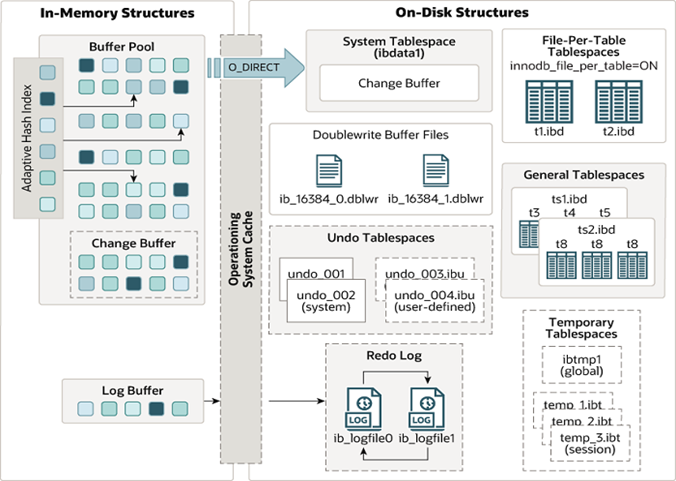


### 内存结构

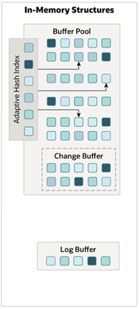

在左侧的内存结构中，主要分为这么四大块儿：Buffer Pool、Change Buffer、Adaptive Hash Index、Log Buffer。 接下来介绍一下这四个部分

（1）Buffer Pool （缓冲池）

InnoDB存储引擎基于磁盘文件存储，在物理硬盘和在内存中进行访问，速度相差很大，为了尽可能弥补这两者之间的I/O效率的差值，就需要**把经常使用的数据加载到缓冲池中，避免每次访问都进行磁盘I/O**

在InnoDB的缓冲池中不仅缓存了索引页和数据页，还包含了undo页、插入缓存、自适应哈希索引以及InnoDB的锁信息等等。

缓冲池 Buffer Pool，是主内存中的一个区域，里面可以缓存磁盘上经常操作的真实数据，在执行增删改查操作时，先操作缓冲池中的数据（若缓冲池没有数据，则从磁盘加载并缓存），然后再以一定频率刷新到磁盘，从而减少磁盘IO，加快处理速度。

缓冲池以Page页为单位，底层采用链表数据结构管理Page。根据状态，将Page分为三种类型：

free page：空闲page，未被使用。

clean page：被使用page，数据没有被修改过。

dirty page：脏页，被使用page，数据被修改过，也中数据与磁盘的数据产生了不一致（数据还没从缓冲池刷新到磁盘上）

> mysql专用服务器上，通常将多达80％的物理内存分配给缓冲池 。
>

> 参数设置： show variables like 'innodb_buffer_pool_size';
>
> 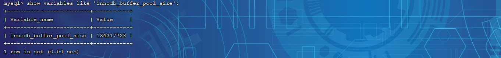

（2） Change Buffer

Change Buffer，更改缓冲区（针对于非唯一二级索引页）。在执行DML语句时，如果需要操作的数据Page没有在Buffer Pool中，那么不会直接操作磁盘，而会**将数据变更存在更改缓冲区 Change Buffer中**，在未来数据被读取时，再将**数据合并恢复到Buffer Pool中**，再**将合并后的数据刷新到磁盘中**。

**Change Buffer的意义**

先来看一幅图，这个是二级索引的结构图：

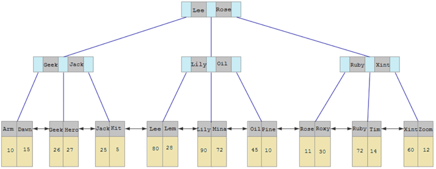

与聚集索引不同，二级索引通常是非唯一的，并且**以相对随机的顺序插入二级索引**。同样，**删除和更新可能会影响索引树中不相邻的二级索引页**，如果每一次都操作磁盘，会造成大量的磁盘IO。有了ChangeBuffer之后，我们可以在缓冲池中**进行合并处理**，**减少磁盘IO**

> 唯一索引和一级索引不会操作“更改缓冲区”

（3）Adaptive Hash Index

自适应hash索引，用于优化对Buffer Pool数据的查询。MySQL的innoDB引擎中虽然没有直接支持hash索引，但是给我们提供了一个功能就是这个自适应hash索引。因为前面我们讲到过，hash索引在进行**等值匹配**时，一般性能是要高于B+树的，因为**hash索引一般只需要一次IO**即可，而**B+树，可能需要几次匹配**，所以hash索引的效率要高，但是hash索引又不适合做范围查询、模糊匹配等。

InnoDB存储引擎会**监控对表上各索引页的查询**，如果**观察到在特定的条件下hash索引可以提升速度**，则**建立hash索引**，称之为自适应hash索引。

自适应哈希索引，无需人工干预，是系统根据情况自动完成。

> 参数： adaptive_hash_index
>
> 默认开启
> 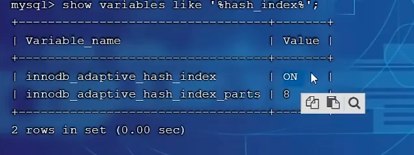


（4）Log Buffer

Log Buffer：日志缓冲区，用来保存要写入到磁盘中的log日志数据（redo log 、undo log），默认大小为 16MB，日志缓冲区的**日志会定期刷新到磁盘**中。如果需要更新、插入或删除许多行的事务，增加日志缓冲区的大小可以节省磁盘 I/O。

参数:

innodb_log_buffer_size：缓冲区大小

innodb_flush_log_at_trx_commit：日志刷新到磁盘时机，取值主要包含以下三个：

1: 日志在每次事务提交时写入并刷新到磁盘，默认值。

0: 每秒将日志写入并刷新到磁盘一次。

2: 日志在每次事务提交后写入，并每秒刷新到磁盘一次

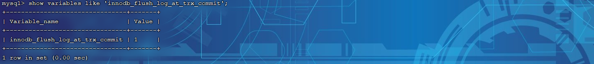


### 磁盘结构

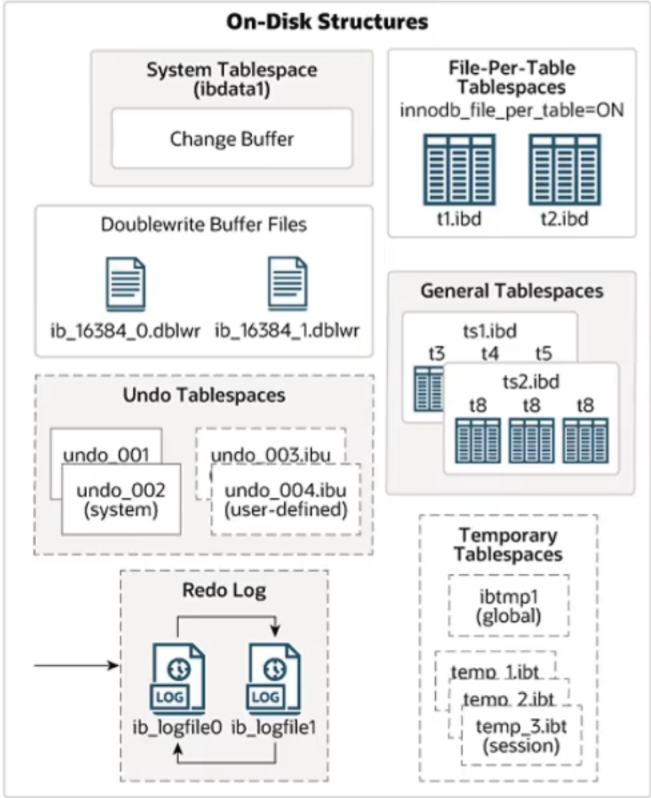

（1）System Tablespace（**系统表空间**）

系统表空间是**更改缓冲区的存储区域**。如果表是在系统表空间而不是每个表文件或通用表空间中创建的，它也可能包含表和索引数据。 (在MySQL5.x版本中还包含InnoDB数据字典、 undolog等信息)

> 参数： innodb data file path
>
> 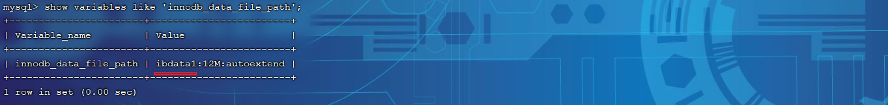
>
> 系统表空间，默认的文件名叫 ibdata1。
>


（2）File-Per-Table Tablespaces（每个表的**文件表空间**）

如果开启了innodb_file_per_table开关，则每个表都有独立的表空间

每个表的文件表空间包含单个 InnoDB表的数据和索引，并存储在文件系统上的单个数据文件中。

> 开关参数： innodb_file_per_table ，**该参数默认开启**
>
> 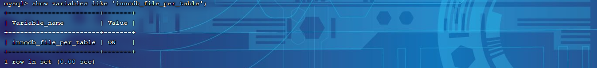
>
> 那也就是说，我们**每创建一个表，都会产生一个表空间文件(ibd结尾)**，如图：
>
> 

（3）General Tablespaces（**通用表空间**）

通用表空间：<u>需要手动通过 CREATE TABLESPACE 语法创建通用表空间，在创建表时，可以指定该表空间</u>

A. 创建表空间

```sql
CREATE TABLESPACE ts_name ADD DATAFILE 'file_name' ENGINE = engine_name;
```

```sql
CREATE TABLESPACE ts_itheima ADD DATAFILE 'myitheima.ibd' ENGINE = innodb;
```


B. 创建表时指定表空间

```sql
CREATE TABLE xxx ... TABLESPACE ts_name;
```

```sql
USE itcast;
CREATE TABLE a(id int primary key auto_increment, name varchar(10)) engine-innodb tablespace ts_itheima;
```


（4）Undo Tablespaces (**撤销表空间**)

撤销表空间， MySQL实例在初始化时会自动创建两个默认的undo表空间（初始大小16M），用于存储 undo log日志。

（5）Temporary Tablespaces (**临时表空间**)

InnoDB 使用会话临时表空间和全局临时表空间。存储用户创建的临时表等数据。

（6）Doublewrite Buffer Files

**双写缓冲区**， innoDB引擎将数据页从Buffer Pool刷新到磁盘前，先将数据页写入双写缓冲区文件中，便于系统异常时恢复数据
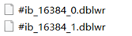

（7）Redo Log

重做日志，是**用来实现事务的持久性**。该日志文件由两部分组成：重做日志缓冲（redo log buffer）以及重做日志文件（redo log file）,前者是在内存中，后者在磁盘中。当事务提交之后会把所有修改信息都会存到该日志中, 用于在刷新脏页到磁盘时,**发生错误时, 进行数据恢复使用**。以循环方式写入重做日志文件，涉及两个文件：


> mysql会定期清理redo log


### 后台线程

作用：将innodb存储引擎中缓冲池的数据在合适的时机刷新到磁盘中

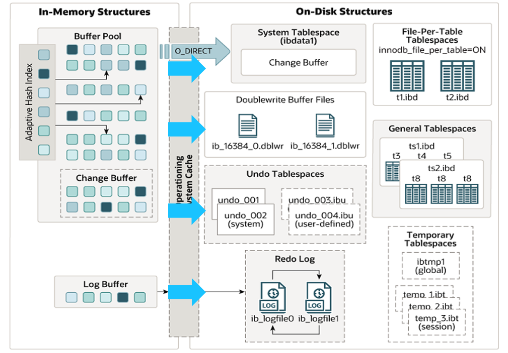

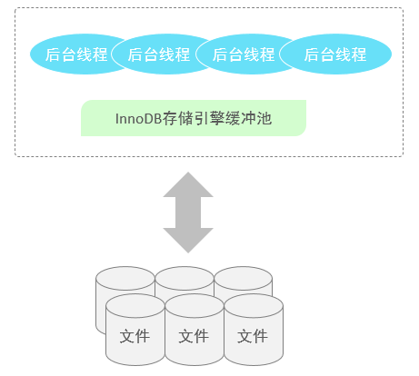

在InnoDB的后台线程中，分为4类，分别是：

Master Thread 、 IO Thread、 Purge Thread、 Page Cleaner Thread。

（1）Master Thread

核心后台线程，负责调度其他线程，还负责将缓冲池中的数据异步刷新到磁盘中 , 保持数据的一致性， 还包括脏页的刷新、合并插入缓存、 undo页的回收 。

（2） IO Thread

在InnoDB存储引擎中大量使用了AIO（异步IO）来处理IO请求 , 这样可以极大地提高数据库的性能， 而IO Thread主要负责这些IO请求的回调

| 线程类型             | 默认个数 | 职责                         |
| -------------------- | -------- | ---------------------------- |
| Read thread          | 4        | 负责读操作                   |
| Write thread         | 4        | 负责写操作                   |
| Log thread           | 1        | 负责将日志缓冲区刷新到磁盘   |
| Insert buffer thread | 1        | 负责将写缓冲区内容刷新到磁盘 |

我们可以通过以下的这条指令，查看到InnoDB的状态信息，其中就包含IO Thread信息

```sql
show engine innodb status \G;
```

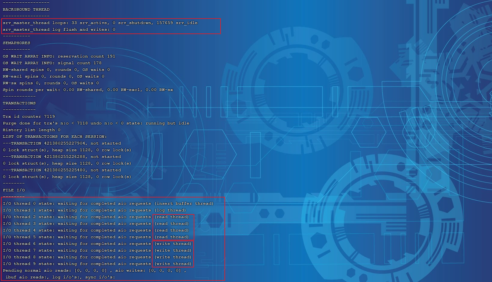


（3）Purge Thread

主要用于回收事务已经提交了的undo log，在事务提交之后，undo log可能不用了，就用它来回收。

（4）Page Cleaner Thread

协助 Master Thread 刷新脏页到磁盘的线程，它可以减轻 Master Thread 的工作压力，减少阻塞


## 事务原理


### 事务基础

1.事务

事务是一组操作的集合，它是一个不可分割的工作单位，事务把所有的操作作为一个整体，要么同时成功，要么同时失败

2.特性

**原子性（Atomicity）**：事务是不可分割的最小操作单元，要么全部成功，要么全部失败。

**一致性（Consistency）**：事务完成时，必须使所有的数据都保持一致状态。

**隔离性（Isolation）**：数据库系统提供的隔离机制，保证事务在不受外部并发操作影响的独立环境下运行。

**持久性（Durability）**：事务一旦提交或回滚，它对数据库中的数据的改变就是永久的


而对于这四大特性，实际上分为两个部分。 其中的原子性、一致性、持久化，实际上是由InnoDB中的两份日志来保证的，一份是redo log日志，一份是undo log日志。 而持久性是通过数据库的锁，加上MVCC来保证的


9**原子性和持久性是由undo log 和 redo log来保证的**

> 原子性-undo log
> 持久性-redo log

**隔离性是由innoDB存储引擎底层的锁机制 和 MVCC (多版本并发控制)来保证的**


### Redo log

* **重做日志**，记录事务提交时数据页的物理修改，用来实现事务的持久性

redo log由两部分组成：重做日志缓冲(redo log buffer )以及重做日志文件 (redo log file )，前者在内存中，后者在磁盘中。当事务提交之后会把所有修改信息都存到该日志文件中，**用于在刷新脏页到磁盘发生错误时，进行数据恢复使用**


> 如果没有redolog，可能会存在什么问题的？
>
> 在InnoDB引擎中的内存结构中，主要的内存区域就是缓冲池，在缓冲池中缓存了很多的数据页。当我们在一个事务中，执行多个增删改的操作时， InnoDB引擎会先操作缓冲池中的数据，如果缓冲区没有对应的数据，会通过后台线程将磁盘中的数据加载出来，存放在缓冲区中，然后将缓冲池中的数据修改，修改后的数据页我们称为脏页。而脏页则会在一定的时机，通过后台线程刷新到磁盘中，从而保证缓冲区与磁盘的数据一致。 而缓冲区的脏页数据并不是实时刷新的，而是一段时间之后将缓冲区的数据刷新到磁盘中，假如刷新到磁盘的过程出错了，而提示给用户事务提交成功，而数据却没有持久化下来，这就出现问题了，没有保证事务的持久性。
> 

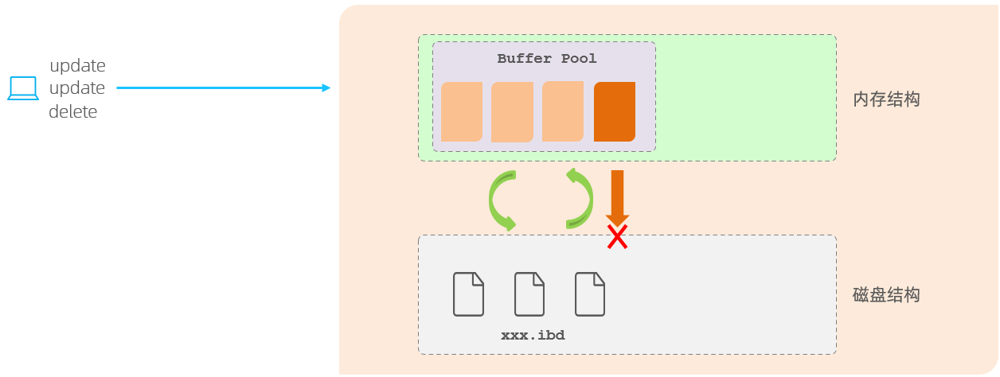

为了解决直接刷新脏页到磁盘导致的大量随机磁盘IO，有了redo log

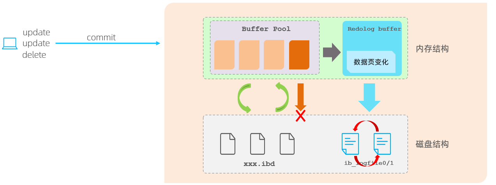

有了redo log之后，当对缓冲区的数据进行增删改之后，**会首先将操作的数据页的<u>变化，记录在redo log buffer</u>中**。在**事务提交**时，会先将**redo log buffer中的数据刷新到redo log磁盘文件**中。<u>过一段时间之后，如果刷新缓冲区的脏页到磁盘时，发生错误，此时就可以借助于redo log进行数据恢复</u>，这样就保证了事务的持久性。 而如果脏页成功刷新到磁盘或或者涉及到的数据已经落盘，此时redolog就没有作用了，就可以删除了，所以存在的两个redolog文件是循环写的


> 为什么每一次提交事务，要刷新redo log 到磁盘中呢，而不是直接将buffer pool中的脏页刷新到磁盘?
>
> 直接**刷脏页（Buffer Pool 中的数据页）**到磁盘存在两个巨大的性能瓶颈，而**刷 Redo Log** 则巧妙地规避了这些问题
>
> **A. 随机 I/O vs 顺序 I/O**
>
> - **直接刷脏页（随机 I/O）**：一个事务可能修改了表中分散在不同位置的多个数据页。如果要直接刷盘，就需要将这些分散在磁盘各处的数据页一个个写入，这属于**随机 I/O**，速度非常慢。
> - **刷 Redo Log（顺序 I/O）**：Redo Log 文件是追加写入的（Append-Only），新日志总是写在旧日志的后面。这种**顺序 I/O** 的写入速度远快于随机 I/O，能极大减少磁盘寻址时间。
>
> **B. 写入粒度大小**
>
> - **直接刷脏页（大粒度）**：InnoDB 的数据页默认大小是 16KB。即使你只修改了一个字节，为了保证事务持久性，你也需要把整个 16KB 的数据页刷到磁盘，非常浪费带宽。
> - **刷 Redo Log（小粒度）**：Redo Log 只记录“修改了什么”，日志体积极小。比如“将第100号页的第500字节从A改为B”，这条指令远小于 16KB。
>
> 口语版：因为在实际操作中，我们操作数据一般都是随机读写磁盘的，而不是顺序读写磁盘。 **而写入redo log是顺序IO**。顺序写的效率，要远大于随机写，mysql通过高效的顺序写入日志 加上 后台异步刷盘，大幅提高了效率
>
>  这种先写日志的方式，称之为 WAL（Write-Ahead Logging 预写日志机制）
>
> > #### ==关键==
> >
> > **兑现操作记录（刷脏页）”和“写日志记录（刷Redo Log）”并不是在同一个时间点发生的。**
> >
> > 正是因为这两个动作**在时间上解耦了**，数据库才获得了巨大的性能提升。
> >
> > 简单来说：**事务提交时，数据库只做“快的那部分”（顺序写日志），把“慢的那部分”（随机写数据）扔给后台慢慢做**

> #### 解析顺序IO与随机IO
>
> **“追加写入”意味着磁头（或写指针）永远只在文件末尾进行操作，不需要来回移动去寻找不同的存储位置。** 正是这种“位置的单一性和连续性”定义了顺序 I/O。
>
> ##### 1. 物理位置的差异：日志文件 vs 数据文件
>
> 要理解为什么是顺序 I/O，必须把“日志文件”和“数据文件”分开来看：
>
> - **数据文件的写入（随机 I/O 的根源）：**
>   假设你修改了用户 ID 为 100 的记录，它可能在磁盘数据文件的第 100 个数据块；接着你修改了用户 ID 为 5000 的记录，它可能在第 500 个数据块。如果直接写数据文件，磁头必须在第 100 块和第 500 块之间来回移动，这就是**随机 I/O**。
>
> - 日志文件的写入（顺序 I/O 的本质）：
>
>   Redo Log 是一个独立的、固定大小的物理文件（比如`ib_logfile0`）。不管你修改的是数据文件的哪个位置，你产生的日志统统追加在这个日志文件的末尾。
>
>   - 第一条日志写在文件开头。
>   - 第二条日志紧接在第一条后面。
>   - 第三条紧接在第二条后面。
>   - ...
>     **磁头不需要跳来跳去，只需要一直向前写，或者绕到开头继续写（循环写）。**
>
> ##### 2. “记录内容”不等于“写入位置”
>
> 你提到的“随机同步修改”，是指日志**记录的内容**描述了随机的修改动作，但这不影响日志**本身存储的位置**。
>
> - **日志内容（逻辑）：** “修改第100号页” -> “修改第500号页”。（看起来是跳跃的、随机的）。
> - **日志存储（物理）：** [物理地址1000] 存第一条 -> [物理地址1001] 存第二条。（在磁盘上是紧密相连的）。
>
> **打个比方：**
> 你在写日记（日志文件）。
>
> - **内容：** “早上去了公司A，下午去了医院B，晚上去了餐厅C。”（地点是随机的）。
> - **写法：** 你是在日记本上一行接一行地写下去的。（动作是顺序的）。
>
> 数据库写 Redo Log 就像写日记，不管业务逻辑跳到哪里，**落笔（写磁盘）永远是在最后一页的下一行**。
>
> ##### 3. 底层实现：环形缓冲区与检查点
>
> InnoDB 的 Redo Log 在磁盘上逻辑上是一个**环形结构**。
>
> - **指针移动：** InnoDB 维护了一个写入位置的指针。每次写日志，指针就向后移动相应的字节数。
> - **循环覆盖：** 当指针走到文件末尾时，它会绕回文件开头继续写（前提是这部分旧日志已经没用了，即已经通过检查点机制确认对应的脏页已刷入数据文件）。
>
> 在这个过程中，**磁头要么向前移动一点点（写入新内容），要么跳回开头（循环）**。相比于在数据文件中为了维护 B+ 树索引而频繁地在不同扇区跳转，这种写入模式的寻道时间极短，因此被归类为顺序 I/O。


### Undo log

回滚日志，用于记录数据被修改前的信息 , 作用包含两个：  **事务回滚**(保证事务的原子性) 和 **MVCC**(多版本并发控制) 。

* undo log和redo log记录物理日志不一样，**它是逻辑日志**。可以认为<u>当delete一条记录时，undo log中会记录一条对应的insert记录</u>，反之亦然，当update一条记录时，它记录一条对应相反的update记录。<u>当执行rollback时，就可以从undo log中的逻辑记录读取到相应的内容并进行回滚</u>

  > 物理日志：数据具体什么样
  >
  > 逻辑日志：每一步的操作是什么

* Undo log销毁：undo log在事务执行时产生，事务提交时，并不会立即删除undo log，因为这些日志可能还用于MVCC

  > 如何涉及MVCC，就不会删除

* Undo log存储：undo log采用段的方式进行管理和记录，存放在前面介绍的 rollback segment 回滚段中，内部包含1024个undo log segment


## MVCC


#### **基本概念**


**当前读：**

**读取的是记录的最新版本**，读取时**还保证其他并发事务不能修改当前记录** (会对读取的记录进行加锁) 对于我们日常的操作，如:select…lock in share mode(共享锁)，select… for update、update、insert、delete(排他锁)都是一种当前读。

**快照读：**

简单的select(不加锁)就是快照读，**快照读，读取的是记录数据的可见版本**，有可能是历史数据，不加锁，是非阻塞读。

- Read committed:每次select，都生成一个快照读。
- Repeatable Read:开启事务后第一个select语句才是快照读的地方。(后续的select语句都是用的之前的快照)
- Serializable:快照读会退化为当前读。


四个事务隔离级别中，只有在序列化的情况下，快照读才变成当前读，其他三个隔离级别都是 快照读，只不过生成快照的时机不同

> 例如：可重复读的隔离级别下，第一次select的时候生成快照，后面每次读取都是读取这个快照

**MVCC：**

全称 Multi-Version Concurrency Control，多版本并发控制。指维护一个数据的多个版本，使得读写操作没有冲突，快照读为MVSOL实现MVCC提供了一个非阻塞读功能。MVCC的具体实现，还需要依赖于数据库记录中的三个隐式字段、undo log日志、read View。


#### 实现原理


#### 三个隐藏字段

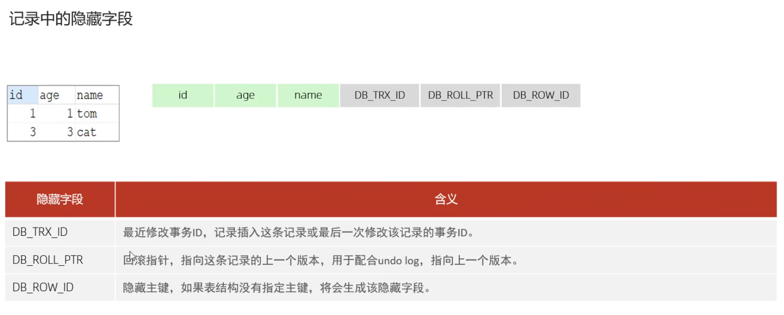

> TRX：指Transaction


#### 组件-undo log

> 在insert、update、delete的时候产生的便于数据回滚的日志。

当insert的时候，产生的undo loq日志只在回滚时需要，在事务提交后，可被立即删除

而update、delete的时候，产生的undo log日志不仅在回滚时需要，在快照读时也需要，不会立即被删除。

那么何时删除？

- 事务提交后：
  - 对于`INSERT`操作，事务提交后，undo log可以被立即删除，因为不再需要用于回滚。
  - 对于`UPDATE`和`DELETE`操作，undo log不会立即被删除，因为它们可能在后续的快照读取中被使用。
- 快照读取结束：
  - **当所有依赖于该undo log的快照读取操作结束后，undo log才会被删除**。这意味着如果有一个事务正在进行快照读取，并且依赖于某个undo log，那么这个undo log会一直保留直到该事务结束


流程解读

* 事务开始，记录修改之前，记录数据变更之前的版本到undo log日志
* 修改记录，并修改 事务id和回滚指针 的最新值
* 

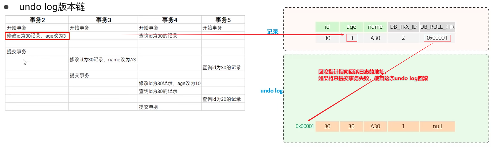

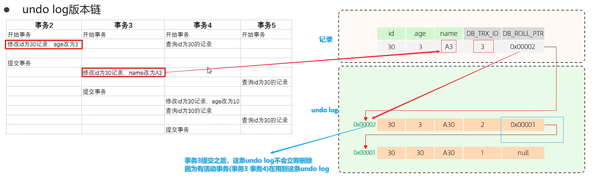

> 不同事务或相同事务对同一条记录进行修改，会导致该记录的undo log生成一条记录版本链表(所有的历史版本)，<u>链表的头部是最新的旧记录，链表尾部是最早的旧记录</u>
>
> 

> 进行查询（快照读）的时候，返回的是版本链中的哪个版本？


#### 组件-ReadView

ReadView(读视图)是 **快照读 SOL执行时MVCC提取数据的依据**，记录并维护系统当前活跃的事务(未提交的)id。

ReadView中包含了四个核心字段:

| 字段           | 含义                                                 |
| -------------- | ---------------------------------------------------- |
| m_ids          | 当前活跃的事务ID集合                                 |
| min_trx_id     | 最小活跃事务ID                                       |
| max_trx_id     | 预分配事务ID，当前最大事务ID+1（因为事务ID是自增的） |
| creator_trx_id | ReadView 创建者的事务ID（创建当前这个快照的事务ID）  |

**版本链数据访问规则**

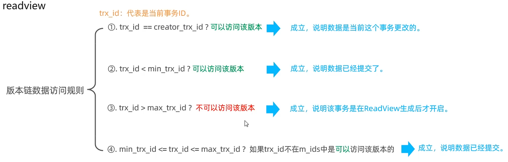

* 用当前事务ID(trx_id)和其他四个关键id比对

> 等于创建，小于最小，大于最大，在之间且不在之中


不同的隔离级别，生成ReadView的时机不同

* READ COMMITED：在事务每一次执行快照读时生成ReadView
* REPEATABLE READ：仅在事务中第一次执行快照读时生成ReadView，后续复用该ReadView


**RC级别下的MVCC提取原理**

RC隔离级别下，在事务每一次执行快照读时生成ReadView

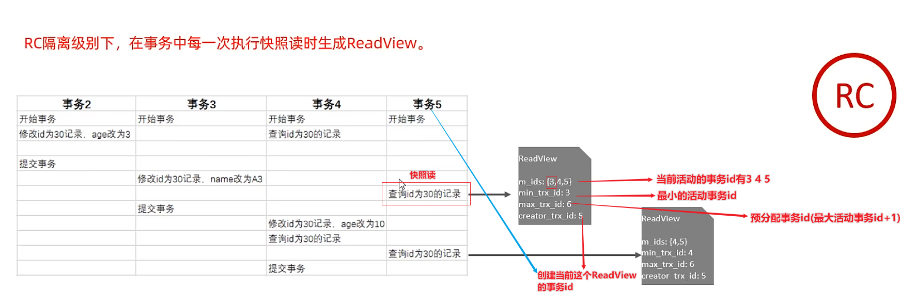

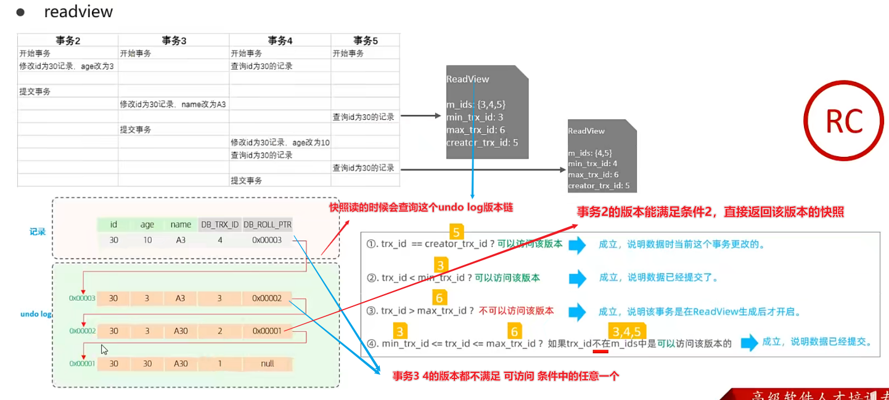

依次比较 undo log 日志版本链中的数据是否满足条件，找到可以进行访问的版本数据

> 保证最后读到的版本是已提交的版本


**RR级别下的MVCC提取原理**

RR隔离级别下，仅在事务中第一次执行快照读时生成ReadView，后续复用该ReadView

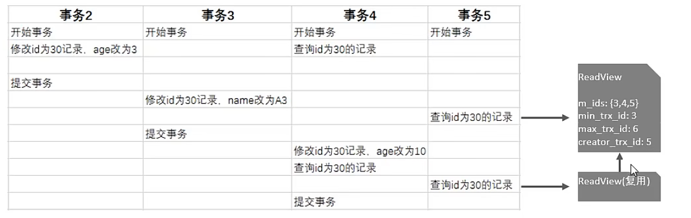

> 使用的ReadView一样、匹配规则一样，查找出来的数据也是一样的，保证了可重复读


# 日志

### 错误日志

错误日志是 MySQL 中最重要的日志之一，它记录了当 mysqld **启动和停止时**，以及**服务器在运行过程中发生任何严重错误时的相关信息** 当数据库出现任何故障导致无法正常使用时，建议首先查看此日志来 **定位问题**。

该日志是默认开启的，默认存放目录 /var/log/，默认的日志文件名为 mysqld.log 。查看日志位置：

```sql
show variables like '%log_error%'
```


### 二进制日志

#### 介绍

二进制日志(BINLOG)记录了所有的 DDL(数据定义语言)语句和 DML(数据操纵语言)语句，但不包括数据查询(SELECT、SHOW)语句。

作用：

1. **灾难时的数据恢复**；
2. **MySQL的主从复制**

在MVSOL8版本中，默认二进制日志是开启着的，涉及到的参数如下：

```sql
show variables like '%log_bin%';
```


#### 日志格式

MySQL服务器中提供了多种格式来记录二进制记录，具体格式及特点如下：

| 日志格式  | 含义                                                         |
| --------- | ------------------------------------------------------------ |
| statement | 基于SQL语句的日志记录，**记录的是SQL语句，对数据进行修改的SQL都会记录在日志文件中。** |
| row       | 基于行的日志记录，**记录的是每一行的数据变更**。(**默认**)   |
| mined     | 混合了STATEMENT和ROW两种格式，默认采用STATEMENT，在某些特殊情况下会自动切换为ROW进行记录。 |

查看参数方式：`show variables like '%binlog_format%';`


#### 日志查看

由于日志是以二进制方式存储的，不能直接读取，需要通过二进制日志查询工具 mysqlbinlog 来查看，具体语法：

```
mysqlbinlog[参数选项]logfilename

参数选项：
    -d    指定数据库名称，只列出指定的数据库相关的操作。
    -o    忽略掉日志中的前n行命令。
    -v    将行事件(数据变更)重构为SOL语句。
    -vv    将行事件(数据变更)重构为SQL语句，并输出注释信息
```

```sql
mysqlbinlog -v binlog.000002
```

> 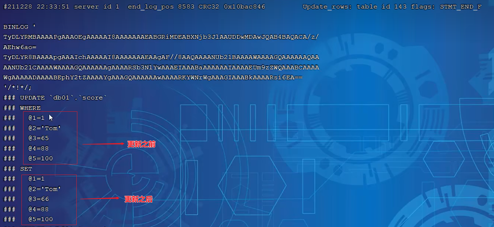


#### 日志删除

对于比较繁忙的业务系统，每天生成的binlog数据巨大，如果长时间不清除，将会占用大量磁盘空间。可以通过以下几种方式清理日志：

| 指令                                               | 含义                                                         |
| -------------------------------------------------- | ------------------------------------------------------------ |
| `reset master`                                     | 删除全部 binlog 日志，删除之后，日志编号将从 binlog.000001重新开始 |
| `purge master logs to ‘binlog.***’`                | 删除 *** 编号之前的所有日志                                  |
| `purge master logs before ‘yyyy-mm-dd hh24:mi:ss’` | 删除日志为”yyyy-mm-dd hh24:mi:ss”之前产生的所有日志          |

也可以在mysql的配置文件中配置二进制日志的过期时间，设置了之后，二进制日志过期会自动删除.

```sql
show variables like '%binlog_expire_logs_seconds%'
```


### 查询日志

查询日志中记录了客户端的所有操作语句，而二进制日志不包含查询数据的SQL语句。默认情况下，查询日志是未开启的。如果需要开启查询日志，可以设置一下配置：

修改MySQL的配置文件 /etc/my.cnf 文件，添加如下内容：

```
#该选项用来开启查询日志，可选值：0或者1；0代表关闭，1代表开启
general_log=1
#设置日志的文件名 ， 如果没有指定，默认的文件名为 host_name.log
general_log_file=mysql_query.log
```


### 慢查询日志

慢查询日志记录了所有执行时间超过参数 long_query_time 设置值并且扫描记录数不小于 min_examined_row_limit的所有的SQL语句的日志，默认未开启。long_query_time 默认为 10 秒，最小为0，精度可以到微秒。

```sql
#慢查询日志
slow_query_log=1
#执行时间参数
long_query_time=2
```

默认情况下，不会记录管理语句，也不会记录不使用索引进行查找的查询。可以使用log_slow_admin_statements和更改此行为log_queries_not_using_indexes，如下所述。

```sql
#记录执行较慢的管理语句
log_slow_admin_statements = 1
#记录执行较慢的未使用索引的语句
log_queries_not_using_indexes = 1
```


#### 查看MySQL自带的慢查询日志


查看慢查询日志是否开启了

```
show variables like 'slow_query_log'
```

> **慢查询日志需要提前开启**
>
> （生产环境不建议开启，影响性能；开发环境开启）


**开启慢查询日志**：

> 进入容器，修改变量
>
> ```
> -- 查看当前状态
> SHOW VARIABLES LIKE 'slow_query_log';
> SHOW VARIABLES LIKE 'long_query_time';
> 
> -- 开启慢查询日志（临时）
> SET GLOBAL slow_query_log = 'ON';
> SET GLOBAL long_query_time = 0.2;
> SET GLOBAL slow_query_log_file = '/var/log/mysql/slow.log';
> ```
>
> 

重启mysql

```
// 重启容器
restart container_name
```

查看最新追加的日志

```
tail -f localhost-slow.log
```


# 主从复制


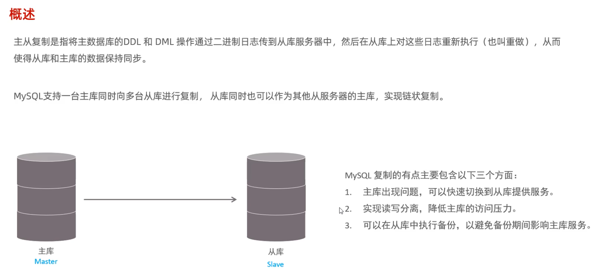


### 原理

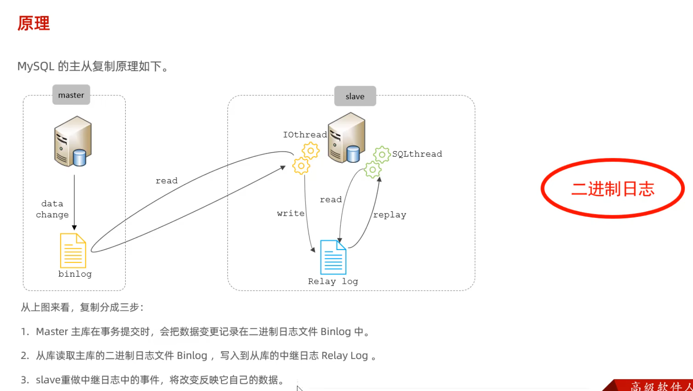


### 搭建实现

#### 主库配置

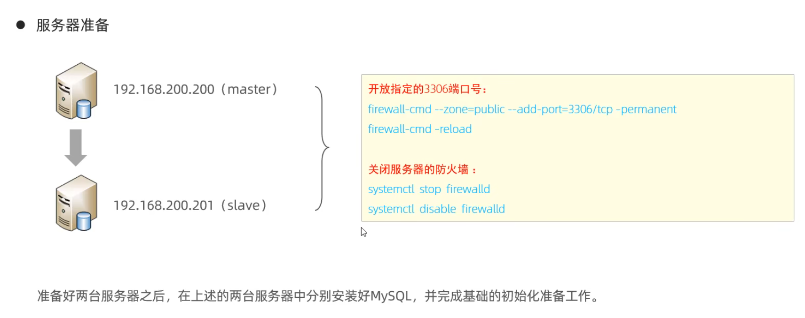

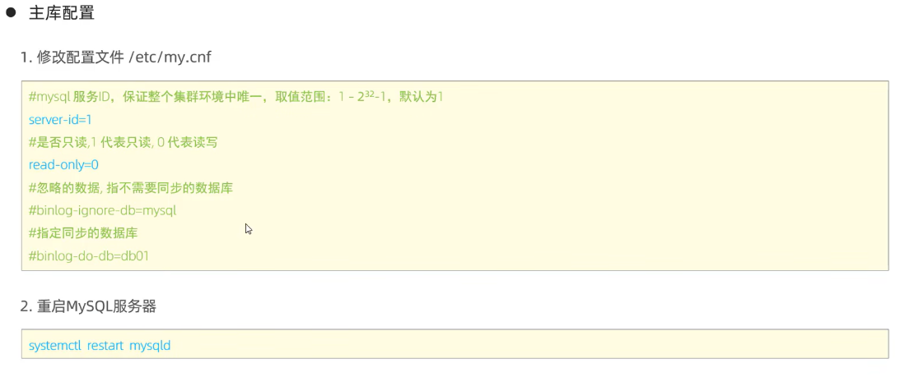

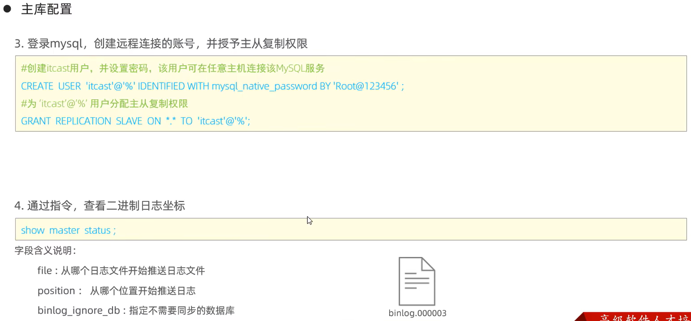


#### 从库配置


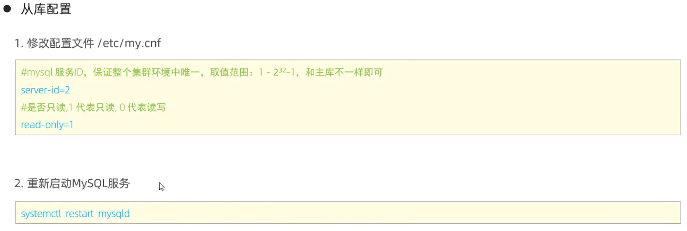

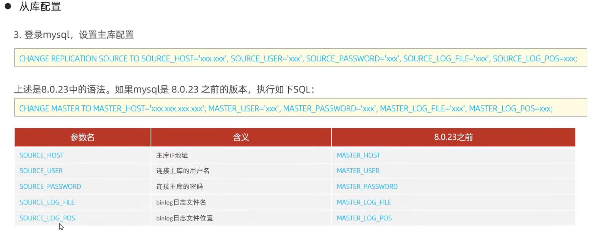


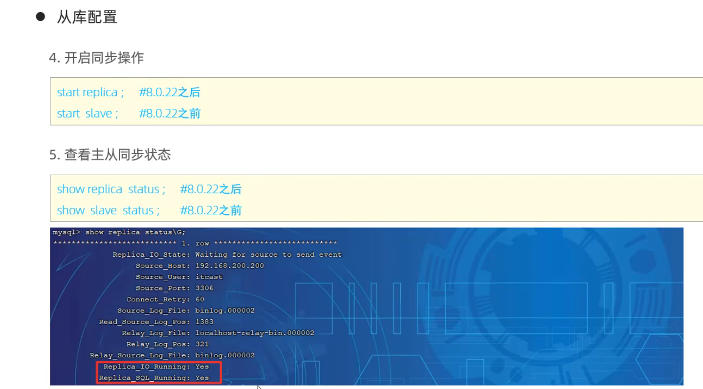


#### 测试

1、在主库上创建数据库、表，并插入数据

```
create database db01;
use db01;
create table tb_use(
	id int(11) primary key not null auto_increment,
	name varchar(50) not null,
	sex varchar(1)
)engine=innodb default charset=utf8mb4;
insert into tb_user(id, name, sex) valurs (null, 'Tom', '1'), (null, 'Trigger', '0'), (null, 'Dawn', '1');
```

2、在从库中查询数据，验证主从是否同步。


