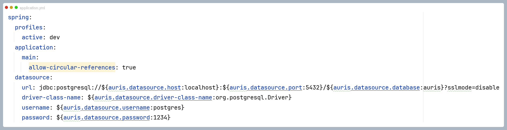
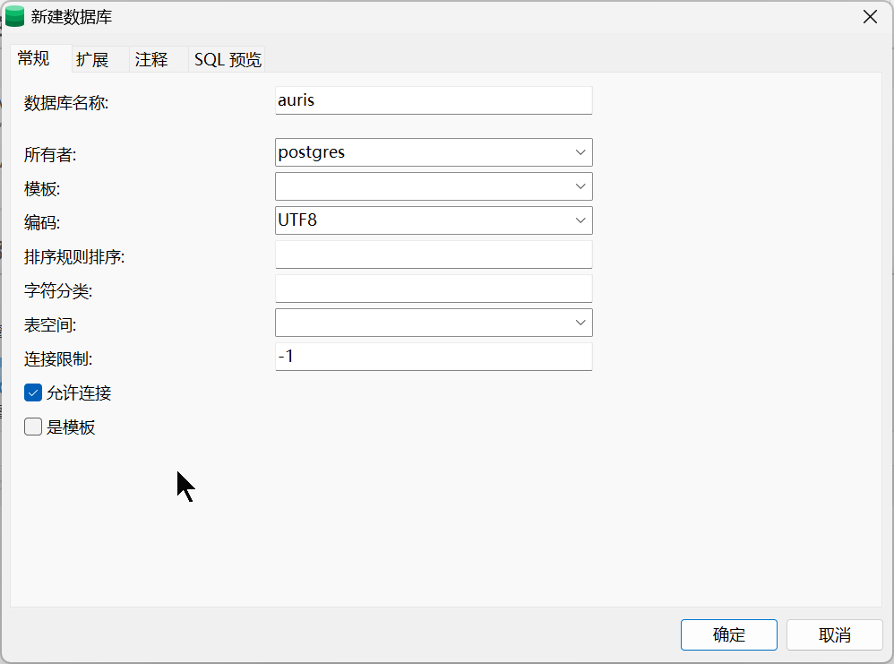
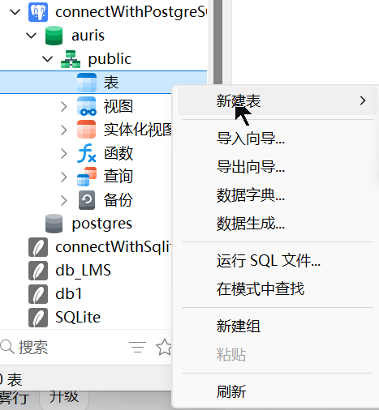
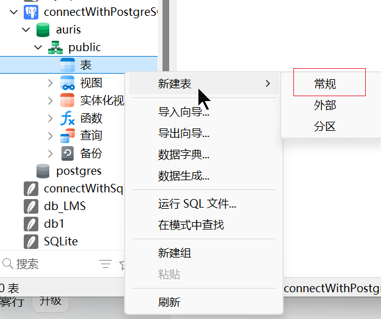

> 年初搓项目的时候用到了 PostgreSQL，整理一篇即看即用的快速上手教程
>
> 全文共计xx字，预计阅读时间

[toc]


# SpringBoot整合PostgreSQL


#### 引入依赖

```xml
<!--数据库连接池-->
<dependency>
    <groupId>org.postgresql</groupId>
    <artifactId>postgresql</artifactId>
    <version>42.6.0</version>
</dependency>
```

> https://mvnrepository.com/artifact/org.postgresql/postgresql
>
> 版本号这里查


#### 配置

配置数据源信息

```yaml
spring:
  profiles:
    active: dev
  application:
    main:
      allow-circular-references: true
  datasource:
    url: jdbc:postgresql://${auris.datasource.host:localhost}:${auris.datasource.port:5432}/${auris.datasource.database:auris}?sslmode=disable
    driver-class-name: ${auris.datasource.driver-class-name:org.postgresql.Driver}
    username: ${auris.datasource.username:postgres}
    password: ${auris.datasource.password:1234}
```




# 对比MySQL 


### ==数据类型差异==


| 场景         | MySQL                          | PostgreSQL                                 | 迁移提示                                                     |
| ------------ | ------------------------------ | ------------------------------------------ | ------------------------------------------------------------ |
| **整数**     | TINYINT(1)                     | SMALLINT / BOOLEAN                         | ① 把“布尔”字段直接改成 `BOOLEAN`；`TINYINT(1)` 里的 `(1)` 在 PG 无意义，去掉。 |
|              | INT / INTEGER                  | INTEGER（或 INT）                          | 完全等价                                                     |
|              | BIGINT                         | **BIGSERIAL**                              | **BIGSERIAL = bigint + 自增**                                |
| **精确小数** | DECIMAL(10,2)                  | DECIMAL(10,2) 或 NUMERIC(10,2)             | 同义，可不改                                                 |
| **浮点**     | FLOAT / DOUBLE                 | REAL / DOUBLE PRECISION                    | 对应关系：FLOAT→REAL，DOUBLE→DOUBLE PRECISION                |
| **字符串**   | CHAR(n) / VARCHAR(n)           | CHAR(n) / VARCHAR(n)                       | 完全等价；PG 里 `CHAR` 不会自动补空格，行为更标准            |
| 长文本       | TINYTEXT / TEXT / LONGTEXT     | TEXT                                       | 统一用 `TEXT` 即可，PG 的 `TEXT` 长度无上限（1 GB）          |
| **二进制**   | TINYBLOB / BLOB / LONGBLOB     | BYTEA                                      | ② 必须改：`BYTEA` 存任意字节；Navicat 会自动映射             |
| **日期时间** | DATE / TIME / DATETIME\[(fsp)] | DATE / TIME / TIMESTAMP\[(p)]              | ③ `DATETIME` =  `TIMESTAMP(0)` ；<br /> 带时区的`TIMESTAMP`用 `TIMESTAMPTZ` |
| **年份**     | YEAR                           | 无直接对应                                 | 用 `DATE` 或 `SMALLINT` 存 4 位年份                          |
| **枚举**     | ENUM('A','B','C')              | CREATE TYPE mood AS ENUM('A','B','C')      | ④ 先建自定义类型，再字段用 `mood`；Navicat 传输向导可自动完成 |
| **布尔**     | TINYINT(1) 0/1                 | BOOLEAN                                    | **语义层**：想继续存 **-128~127** 的小整数 → 改成 `SMALLINT(即int2)`； **布尔层**：<u>本来就当 0/1 用 → 直接改 `BOOLEAN(BOOL)`</u>，最干净； |
| **JSON**     | JSON / JSON                    | JSON & JSONB                               | ⑤ PG 推荐用 **JSONB**（二进制+索引），性能远好于 MySQL 的 JSON |
| **UUID**     | CHAR(36)                       | UUID                                       | ⑥ PG 原生 16 字节，带索引，比 CHAR 省空间                    |
| **自动递增** | INT AUTO\_INCREMENT            | SERIAL 或 GENERATED BY DEFAULT AS IDENTITY | ⑦ 建表时 Navicat 选 `serial` 即可，背后自动建序列            |
| **空间几何** | GEOMETRY / POINT / POLYGON     | GEOMETRY(POINT, 4326) 等                   | ⑧ 都需要装扩展：MySQL 用 `SPATIAL`，PG 装 **PostGIS**；语法几乎兼容 |
| **数组**     | 无原生                         | INTEGER\[] / TEXT\[] / 自定义数组          | ⑨ **PG 独有**：一列存整组标签，支持索引 GIN，MySQL 只能拆子表 |
| **范围类型** | 无                             | INT4RANGE / TSRANGE / DATERANGE            | ⑩ **PG 独有**：一条记录存“起止区间”，自动约束“不重叠”，酒店排班、价格区间神器 |
| **IP 地址**  | VARCHAR(39)                    | INET / CIDR                                | **PG 独有**：原生 IPv4/IPv6，支持网段包含查询                |
| **货币**     | DECIMAL(19,2)                  | MONEY                                      | 不推荐使用，两者都建议用 `NUMERIC`                           |

**总结**：

- **整数、浮点、字符串、DATE→TIME→TIMESTAMP**  基本照抄；
- **TINYINT(1)-> 布尔、BLOB→BYTEA、DATETIME→TIMESTAMP、ENUM 先建类型**  必须改；
- **JSONB、UUID、数组、范围、IP 类型** 是 PG 独有


---

> datetime修改：
>
> 迁移时把 MySQL 的 `DATETIME` 改成 PostgreSQL 的 `TIMESTAMP`（或 `TIMESTAMPTZ`）即可，**但有三处“必须动手”的地方**，一步错就会遇到“字段不存在的提示”或“时区漂移”。下面给出 3 种常见场景的对照写法，直接抄。
>
> ---
>
> ##### 1. 最简单：不需要时区，秒级精度
>
> | MySQL         | PostgreSQL     |
> | ------------- | -------------- |
> | `DATETIME`    | `TIMESTAMP(0)` |
> | `DATETIME(0)` | `TIMESTAMP(0)` |
>
> **解释**  
>
> - MySQL 的 `DATETIME` 永远“不带时区”，PG 里与之等价的是 **不带时区的 `TIMESTAMP`**。  
> - 括号里的 0 表示去掉小数秒，和 MySQL 默认行为一致；省略则 PG 会保留 6 位小数，看起来“多了 .000000”。
>
> ---
>
> ##### 2. 需要时区自动转换（推荐新项目）
>
> | MySQL         | PostgreSQL       |
> | ------------- | ---------------- |
> | `DATETIME`    | `TIMESTAMPTZ`    |
> | `DATETIME(6)` | `TIMESTAMPTZ(6)` |
>
> **解释**  
>
> - `TIMESTAMPTZ` = “timestamp with time zone”，PG 会把插入值当成 **会话时区** 时间，再转成 UTC 存；查的时候再按会话时区反显。  
> - 这样应用迁到不同机房也不用改代码，只要 `SET timezone = 'Asia/Shanghai'` 一次即可。
>
> ---
>
> 在 Navicat 的图形界面中创建表时，你可以直接选择 `timestamp` 类型，并且可以设置是否需要时区。如果你选择 `timestamp`，Navicat 通常会默认使用不带时区的版本。

---


### SQL差异与迁移

> **操作 MySQL 的 SQL 语句，换成 PostgreSQL 后 SQL语句怎么改？**

90 % 的“日常”语句两边都能跑，但是有 10 % 的差别


#### 一、不用变
1. 标准 DML
   `SELECT / INSERT / UPDATE / DELETE / WHERE / ORDER BY / GROUP BY / HAVING / JOIN`  
2. 最常见的数据类型  
   `INT, BIGINT, VARCHAR(n), TEXT, DATE, TIME, DATETIME/TIMESTAMP, DECIMAL, FLOAT, DOUBLE, BOOLEAN`  
3. 主键、外键、唯一、检查、非空约束  
4. 事务四大隔离级别（RC、RR、Serializable）  
   *注：PostgreSQL 的 RR 实现比 MySQL 更严格，但语法一样。*


#### 二、必须改，否则报错或行为异常

| 差异点                  | MySQL 写法                       | PostgreSQL 写法                                          | 不改的后果             |
| ----------------------- | -------------------------------- | -------------------------------------------------------- | ---------------------- |
| 1. **反引号 VS 双引号** | \`order\`                        | **“order”**                                              | 直接语法错误           |
| 2. 自增主键             | AUTO_INCREMENT                   | **SERIAL 或 GENERATED BY DEFAULT AS IDENTITY**           | 建表失败               |
| 3. **分页**             | LIMIT start, size                | **LIMIT size OFFSET start**                              | 语法错误               |
| 4. 内置函数             | NOW() / SYSDATE()                | NOW() / CURRENT_TIMESTAMP                                | SYSDATE 在 PG 里不存在 |
| 5. 字符串拼接           | CONCAT(a,’-‘,b)                  | CONCAT 也支持，但推荐**双竖线运算符：**` a || '-' || b ` |                        |
| 6. 空值处理             | IFNULL(col,0)                    | **COALESCE(col,0)**                                      | 报错                   |
| 7. 主键更新             | INSERT … ON DUPLICATE KEY UPDATE | INSERT … ON CONFLICT (pk) DO UPDATE                      | 语法错误               |
| 8. 枚举                 | ENUM(‘A’,’B’)                    | CREATE TYPE mood AS ENUM(‘A’,’B’) 或 CHECK + VARCHAR     | 不支持                 |
| 9. 布尔                 | TINYINT(1) 0/1                   | BOOL 或 BOOLEAN                                          | (都能存 0/1)           |
| 10. 转义字符            | \’ 反斜杠                        | ’’ 单引号翻倍                                            | 默认标准 SQL 模式不同  |


#### 三、可不改，但性能/结果会变

| 场景              | MySQL 行为               | PostgreSQL 行为             | 说明                                  |
| ----------------- | ------------------------ | --------------------------- | ------------------------------------- |
| 默认排序          | 索引顺序（非稳定）       | **无序，除非显式 ORDER BY** | <u>同样的 SELECT 可能每次顺序不同</u> |
| GROUP BY 宽松模式 | 可 SELECT 非聚合列       | 必须 **GROUP BY** 或聚合    | 迁移时 SQL 会直接报错                 |
| 字符集            | utf8mb4 默认不区分大小写 | UTF8 默认区分大小写         | 需要 COLLATE 子句保持老逻辑           |
| 时间戳精度        | DATETIME(0) 秒级         | TIMESTAMP(6) 微秒级         | 插入同样值，PG 会多 3 位小数          |


#### 四、实战迁移 checklist

1. 全局把 \` 换成 “（或用小写标识符直接弃用引号）。  
2. 所有 `AUTO_INCREMENT` 换成 `SERIAL` 或 `GENERATED ... IDENTITY`。  
3. 把 `IFNULL/ISNULL` 批量替换成 `COALESCE`。  
4. 把 `LIMIT m,n` 改成 `LIMIT n OFFSET m`。  
5. 把 `ON DUPLICATE KEY UPDATE` 改写成 `ON CONFLICT ... DO UPDATE SET`。  
6. 用 `pgloader` 或 `AWS DMS` 做一次性数据迁移，会自动把 `TINYINT(1)` 映射成 `BOOLEAN`，把 `ENUM` 映射成 `VARCHAR+CHECK`。  
7. 回归测试所有带 `GROUP BY` 的接口，确保列都在 GROUP BY 或聚合里。

——“增删改查 + 普通 JOIN” 基本无缝转换；  **用到自增、分页、函数、Upsert、枚举、反引号**，就必须改。  


> 把上面 7 步脚本化，通常一个普通业务系统 1～2 小时能完成迁移。


# 指令

> 以下操作基于已运行的 PostgreSQL Docker 容器（容器名 `postgresql`）
>

**1.连接数据库**

```postgresql
docker exec -it postgresql bash
psql -U postgres
```

**2.数据库管理**

```postgresql
# 查看所有数据库
\l

# 创建库
create database student; # 推荐小写+下划线命名 (未加引号的标识符自动转小写)

# 查看所有数据库
\l

# 删除库
drop database student;

# 切换数据库
\c database_name
```

**3.元命令**

| 命令        | 说明               | 示例              |
| ----------- | ------------------ | ----------------- |
| `\?`        | 查看所有元命令帮助 | `\?`              |
| `\h`        | SQL 语法帮助       | `\h CREATE TABLE` |
| `\dt`       | 列出当前库所有表   | `\dt`             |
| `\du`       | 查看用户/角色      | `\du`             |
| `\conninfo` | 显示当前连接信息   | `\conninfo`       |
| `\q`        | 退出 psql          | `\q`              |
| `exit`      | 退出容器 bash      | `exit`            |


# 使用navicat操作pg


#### 一、连上 PostgreSQL

1. 打开 Navicat → 文件 → 新建连接 → PostgreSQL。  
2. 填写四项即可：  
   - 主机：localhost（或远程 IP）  
   - 端口：5432  
   - 初始数据库：postgres（默认维护库）  
   - 用户名/密码：安装时设定的超级用户（如 postgres / ******）  
3. 点“测试连接”→ 成功 → 确定。左侧出现蓝色大象图标，说明已连上。

#### 二、创建新数据库

| 图形法                                                       | SQL 法                                                       |
| ------------------------------------------------------------ | ------------------------------------------------------------ |
| 1. 右键连接名 → 创建数据库 → 填写“数据库名”(db_demo) → 字符集选 UTF8 → 确定。 | 1. 点工具栏“查询”→ 新建查询 → 输入：<br>`CREATE DATABASE db_demo ENCODING 'UTF8' LC_COLLATE 'zh_CN.UTF-8' LC_CTYPE 'zh_CN.UTF-8';` |



> 3 个空格“必须”填/选，其余全部留空（保持 Navicat 给的默认值）即可
>
> | 字段                | 要不要填 | 怎么填/选                                           |
> | ------------------- | -------- | --------------------------------------------------- |
> | 数据库名称          | ✅必填    | 填你自己的库名，例如 `auris`                        |
> | 所有者              | ✅必填    | 下拉选 `postgres`（超级用户）或你事先建好的业务账号 |
> | 编码                | ✅必填    | 下拉选 `UTF8`（通用中英文）                         |
> | 模板                | ❌留空    | 默认 `template1`，Navicat 会自动带                  |
> | 排序规则 & 字符分类 | ❌留空    | 默认继承系统区域（`zh_CN.UTF-8`），后期可改         |
> | 表空间              | ❌留空    | 默认 `pg_default`                                   |
> | 连接限制            | ❌留空    | 保持 `-1`（无限制）                                 |
> | 允许连接            | ❌留空    | 保持勾选                                            |
> | 是模板              | ❌留空    | 不勾，普通业务库用不到                              |
>
> 


#### 三、打开数据库并建 Schema（可选）

PostgreSQL 默认是 `public` schema，可直接用
如果想隔离业务，就新建一个模式，在里面建表：  
右键数据库 → 新建模式 → 取名 `sales` → 确定。





#### 四、建表

1. 展开 db_demo → 表 → 右键“新建表”。  
2. 在下方表格里依次填列：  
   ```
   id          serial          not null   ← 主键
   name        varchar(50)     not null
   birth_date  date            null
   salary      numeric(12,2)   default 0
   ```
3. 点“约束”页签 → 添加主键 → 选 `id` → 命名 `pk_emp`。  
4. 保存 → 表名 `employee` → 确定。  
    **结果**：Navicat 自动帮你生成 `serial` 序列、主键索引、COMMENT 都带好了。




---

> 99% 的日常业务表 → 直接选 **“常规”**（= 普通堆表）。  
> 另外两个只在特定场景才用，先心里有数即可：
>
> | 选项                          | 是什么                                                       | 什么时候才选                                        |
> | ----------------------------- | ------------------------------------------------------------ | --------------------------------------------------- |
> | **常规**（Ordinary table）    | 默认堆表，行存、B-tree 主键、支持索引/外键/触发器            | 任何标准 CRUD 业务都用它                            |
> | **外部**（Foreign table）     | 外表——数据真正存在别的库/文件（MySQL、Mongo、CSV、Hadoop 等） | 做 **跨库联合查询** 或 **ETL** 才临时建             |
> | **分区**（Partitioned table） | 把大表按时间/ID 切成子表，提升查询/维护性能                  | 单表预计 **>2 千万行** 或 **每天增量百万级** 再考虑 |
>
> 所以你现在  
> 右键 → **新建表 → 常规** → 填字段即可，  
> “外部”“分区”先无视，等真遇到海量数据或跨库需求时再学不迟。

---

#### 五、插数据 & 查数据

1. 双击 `employee` → 界面右下角点“+”号即可可视化插行（类似 Excel）。  
2. 或打开“查询”→ 新建查询：  
   ```sql
   INSERT INTO employee(name,birth_date,salary)
   VALUES ('张三','1990-06-15',8800);
   SELECT * FROM employee;
   ```
3. 点绿色三角运行 → 结果网格即时出现。

#### 六、导出/逆向

1. 右键任意表 → 转储 SQL 文件 → 结构+数据 → 保存为 `employee.sql`  
2. 数据库迁移：把 MySQL 连接也建在 Navicat 里 → 工具 → 数据传输 → 源选 MySQL、目标选 PostgreSQL → 勾“转换字段类型”→ 开始，Navicat 会自动把 `AUTO_INCREMENT` 转成 `serial`，`DATETIME` 转成 `TIMESTAMP`，省去手工改写


**<u>也可使用命令行工具 `pg_dump` 稳定导出数据库</u>**

```postgresql
# 导出整个数据库（结构 + 数据）
pg_dump -h localhost -U your_username -d your_database_name > backup.sql

# 只导出 public schema 的结构和数据
pg_dump -h localhost -U your_username -n public -d your_database_name > public_backup.sql

# 只导出结构（无数据）
pg_dump -h localhost -U your_username -s -d your_database_name > schema_only.sql
```


