#  介绍

> 世界范围内最流行的缓存中间件，公司离不开redis
>

#### 缓存-介绍


**重点：读写性能高**

> 浏览器缓存：缓存页面的css、一些图片到本地，不必每次访问都请求服务器
>
> 
>
> 


> #### 数据一致性
>
> 【弹幕区说有 可以直接监控MySQL的插件，如果MySQL中有数据发生变化，要么清除缓存中的信息、要么同步更新
>
> 延迟双删
>
> 】
>
> 


#### redis的使用场景

* **会话存储（Session Store）**

  - **作用**：存储用户登录状态（Session ID → 用户信息）。

  - 为什么用 Redis

    ：

    - 多台服务器共享 Session（分布式系统）；
    - 自动过期（设置 TTL），安全又省事。

  - **替代方案**：传统存在文件或数据库里，性能差

* **作用**：存储用户登录状态（Session ID → 用户信息）。

* 为什么用 Redis

  ：

  - 多台服务器共享 Session（分布式系统）；
  - 自动过期（设置 TTL），安全又省事。

* **替代方案**：传统存在文件或数据库里，性能差。

------

### 3. **排行榜 / 计数器（Sorted Set）**

- **数据结构**：`ZSET`（有序集合）

- 例子

  ：

  - 热门文章 TOP 10；
  - 游戏积分榜；
  - 直播间人气排序。

- **优势**：插入、排序、取 Top N 都是 O(log N)，高效！

------

### 4. **消息队列（轻量级）**

- **数据结构**：`List` 或 `Stream`

- 用途

  ：

  - 异步发邮件、短信；
  - 日志收集；
  - 解耦业务（比如用户注册后触发欢迎流程）。

- **注意**：Redis 不是专业消息队列（如 Kafka、RabbitMQ），但对简单场景足够用。

------

### 5. **限流 / 防刷（Rate Limiting）**

- **原理**：利用 `INCR` + 过期时间，统计单位时间内请求次数。

- 例子

  ：

  - 接口每秒最多调用 10 次；
  - 登录失败 5 次锁定 10 分钟；
  - 防止恶意爬虫。

- **常用算法**：滑动窗口、令牌桶（可用 Redis + Lua 实现）。

------

### 6. **分布式锁（Distributed Lock）**

- **场景**：多个服务实例同时操作共享资源（如抢购、库存扣减）。
- **实现**：用 `SET key value NX EX` 命令（原子操作）。
- **注意**：需处理锁过期、死锁等问题（推荐用 Redlock 或现成库）。

------

### 7. **实时数据 / 通知系统**

- **数据结构**：`Pub/Sub`（发布订阅）

- 例子

  ：

  - 聊天室消息广播；
  - 系统告警通知；
  - 在线用户状态同步。

- **局限**：消息不持久化，适合“即时性”场景。

------

### 8. **位图统计（Bitmap）**

- **用途**：高效统计布尔状态。

- 例子

  ：

  - 用户签到（365 天只需 365 位 ≈ 46 字节）；
  - 活跃用户统计（DAU/MAU）。

- **命令**：`SETBIT`, `GETBIT`, `BITCOUNT`


**不适合的场景**

* 存储大文件（如视频、图片）；
* 需要复杂查询（如 JOIN、模糊搜索）；
* 对数据持久性要求极高（虽支持持久化，但本质是内存优先）


* 判断缓存中是否存在xx数据，如果存在直接使用
  如果不存在，就查询数据库，然后更新缓存
* 新增、删除、修改，都需要清理缓存数据


* 案例
  * 查询菜品数据：
    将菜品数据缓存起来，减少数据库负荷


# 基础篇

### 初始redis


> 实际场景中不会这样直接拆分
>
> #### 一般采取key+json的结构
>
> 
>
> 
>
> 
> 

* Redis是NoSql库
  (非关系型数据库)

##### 认识NoSQL

* 指非关系型数据库

   

* 对比

  

  

  > SQL：
  > 不建议修改初始定义好的表结构，表和业务有关系、表变了业务也要变；
  > NoSQL：键值对形式，对于key、value的约束小
  > 还可以采用JSON格式存储，字段约束松散、数据结构没有严格要求，字段修改影响小

  

  

  > 表与表之间可以构建联系、可以构建物理外键
  >
  > 表与表之间没有物理外键的功能，通过json方式维护，数据库本身不会维护，但是程序员可以自己写逻辑外键

  

  > 各种SQL库查询语句语法固定：sql语句
  > 各个NoSQL库查询语句语法不固定，不同库不同语法

  

  > ACID：原子性，隔离性，一致性，持久性
  >
  > 
  > NoSQL数据库要么没有事务、要么就难以满足事务的强一致性，无法全部满足ACID
  >
  > 

  

  

> 数据结构固定，业务安全性要求高、一致性要求高；
>
> 数据结构不固定，对查询性能要求较高的场景
> 


##### 认识Redis


> 主要是因为基于内存，所以即使单线程、也很快
>
>
> 定期数据持久化到磁盘
>
> 
> 


##### 下载与安装

> 
> 


'''

> redis默认没有密码，客户端不用密码就能连接上服务端
>
> 需要在配置文件中手动配置密码
> 搜索pass
> 

> redis没有用户的概念，连接服务端不需要提供用户名，直接用密码即可

* **linux系统redis安装指南**

  redis基于C语言编写，首先安装Redis所需要的gcc依赖

  ```
  yum install -y gcc tcl
  ```

  上传安装包到任意目录(比如usr/local/<u>src</u>)并解压，

  


### 数据类型


> 列表：朋友圈点赞
>
> 有序集合：排行榜
>
> 


、


### 常用命令


> 过期时间的应用场景：手机验证码
>
> 


> ```
> hset 100 name xiaoming
> hset 100 age 22
> ```
>
> 

 																																																																																																																																																																																																																																																																																																																																																																																																																																																																																																																																																																																																																																																																															


> 无序不重复
>
> 


> ```
> keys *
> keys set*
> ```
>
> ```
> exits name
> ```
>
> ```
> type name
> type set1
> type mylist
> ```
>
> ```
> del set1 set2 zset1
> ```
>
> 
>
> 


### java中操作Redis


> 
>
> 
> 

> Spring Data Redis：对jedis和Lettuce进行了高度的封装
>
> 

#### SpringDataRedis


> 
>
> 
>
> **<u>编写配置类</u>**
>
> ```
> @Configuration
> @Slf4j
> public class RedisConfiguration {
>     @Bean
>     public RedisTemplate redisTemplate(RedisConnectionFactory redisConnectionFactory){
>         log.info("开始创建redis模版对象");
>         RedisTemplate redisTemplate = new RedisTemplate();
>         //设置redis的连接工厂对象（引入依赖之后，spring就会把工厂对象创建好然后放到IOC容器中，在这里@Bean注解注入进来）
>         redisTemplate.setConnectionFactory(redisConnectionFactory);
>         //设置redis key的序列化器
>         redisTemplate.setKeySerializer(new StringRedisSerializer());
>         return redisTemplate;
>     }
> }
> ```
>
> ```
> <!--java操作redis的依赖-->
> <dependency>
>     <groupId>org.springframework.boot</groupId>
>     <artifactId>spring-boot-starter-data-redis</artifactId>
> </dependency>
> ```

* 可以用redisTemplate对象来获取不同的对象，实现不同的redis操作

  valueOperations——操作字符串

  hashOperations——操作哈希
  listOperations
  setOperations
  zSetOperations
  **示例**

  

  ```
          System.out.println(redisTemplate);
          ValueOperations valueOperations = redisTemplate.opsForValue();//【】
          valueOperations.set("name","张三");
          String name = (String) valueOperations.get("name");
          System.out.println(name);
          //这些对象的方法和命令并不完全一致
          valueOperations.set("code","1234",3, TimeUnit.MINUTES);
          valueOperations.setIfAbsent("code", "123456");//如果不存在就新增
  
          HashOperations hashOperations = redisTemplate.opsForHash();//【】
          hashOperations.put("100","name","Jack");
          hashOperations.put("100","age",18);
          String name1 = (String) hashOperations.get("100", "name");
          hashOperations.delete("100","age");
  
          ListOperations listOperations = redisTemplate.opsForList();//【】
          listOperations.leftPushAll("mylist", "1","2","3");
          listOperations.leftPush("mylist", "4");
          listOperations.rightPop("mylist");//弹出
          List mylist = listOperations.range("mylist", 0, -1);
          System.out.println(mylist);
          Long size = listOperations.size("mylist");
          System.out.println(size);
  
          SetOperations setOperations = redisTemplate.opsForSet();//【】
          setOperations.add("set1","a","b","c","d");
          setOperations.add("set2","a","b","e","f");
          Set members = setOperations.members("set1");//获取set1集合的所有元素
          System.out.println(members);
          Long size1 = setOperations.size("set1");
          System.out.println(size);
          Set union = setOperations.intersect("set1", "set2");//得到两个集合的交集集合
          System.out.println(union);
          setOperations.remove("set1","a");//移除集合元素
  
  
          ZSetOperations zSetOperations = redisTemplate.opsForZSet();//【】
          zSetOperations.add("zset1","a",13);
          zSetOperations.add("zset1","b",88);
          zSetOperations.add("zset1","c",10);
          Set zset1 = zSetOperations.range("zset1", 0, -1);
          System.out.println(zset1);
          zSetOperations.incrementScore("zset1","a",11);
          zSetOperations.remove("zset1", "a", "b");
  
  
          //通用命令
          Set keys = redisTemplate.keys("*");//获取符合格式的key
          System.out.println(keys);
  
          Boolean name2 = redisTemplate.hasKey("name");//hasKey() 判断是否存在某个key
          Boolean set1 = redisTemplate.hasKey("set1");
          for(Object key :keys){
              DataType type = redisTemplate.type(key);
              System.out.println(type.name());
          }
  
          redisTemplate.delete("mylist");//根据key删除
  
  ```

  > 可以考虑给value的序列化器设置成Jackson2JsonRedisSerializer，这样redis客户端看着不会乱码（不设置也不影响使用）

* 


#### 案例-店铺营业状态设置


* 

  

  

  

  


# 实战

StringRedisTemplate和RedisTemplate的选用

> 在使用 Spring Data Redis 操作 Redis 时，`StringRedisTemplate` 和 `RedisTemplate` 是两个常用的模板类。它们的选择主要取决于你的数据类型和序列化需求。
>
> ------
>
> ### 1. **StringRedisTemplate**
>
> - 特点
>
>   ：
>
>   - 是 `RedisTemplate<String, String>` 的一个特化实现。
>   - 键（key）和值（value）都默认使用 **String 类型**。
>   - 使用 `StringRedisSerializer` 进行序列化/反序列化。
>
> - 适用场景
>
>   ：
>
>   - 所有操作的数据都是字符串（比如缓存 JSON 字符串、纯文本、简单键值对等）。
>   - 不需要存储复杂对象（如 Java Bean）。
>   - 与前端或其他系统交互时，通常以字符串形式传输数据（如 JSON）。
>
> ✅ **优点**：简单、高效、可读性强（Redis 中直接看到字符串内容）。
>
> ------
>
> ### 2. **RedisTemplate<K, V>**
>
> - 特点
>
>   ：
>
>   - 泛型模板，支持任意类型的 key 和 value。
>   - 默认使用 `JdkSerializationRedisSerializer`（会将对象序列化为字节数组，Redis 中显示为乱码）。
>   - 可自定义序列化方式（如使用 `GenericJackson2JsonRedisSerializer` 存储 JSON）。
>
> - 适用场景
>
>   ：
>
>   - 需要直接存储和读取 Java 对象（如 User、Order 等 POJO）。
>   - 需要更灵活的键/值类型（如 Long 作 key，Object 作 value）。
>   - 项目中对性能或兼容性有特殊要求，需定制序列化策略。
>
> ⚠️ **注意**：若使用默认 JDK 序列化，Redis 中的值不可读，且不同语言难以共享数据。
>
> ------
>
> ### 如何选择？
>
> | 场景                                     | 推荐模板                                     |
> | ---------------------------------------- | -------------------------------------------- |
> | 缓存 JSON 字符串、配置项、计数器等       | ✅ `StringRedisTemplate`                      |
> | 直接存取 Java 对象（且接受二进制存储）   | `RedisTemplate`（需配置序列化）              |
> | 希望 Redis 中数据可读、跨语言兼容        | ✅ `StringRedisTemplate` + 手动 JSON 转换     |
> | 高性能、结构化缓存（如 Hash 存对象字段） | `RedisTemplate` + 自定义序列化（如 Jackson） |
>
> ------
>
> ### 实际建议
>
> 大多数实际项目中，**推荐使用 `StringRedisTemplate`**，并配合手动将对象转为 JSON 字符串（如用 Jackson 或 FastJSON）：
>
> ```java
> // 存
> stringRedisTemplate.opsForValue().set("user:1001", objectMapper.writeValueAsString(user));
> 
> // 取
> String json = stringRedisTemplate.opsForValue().get("user:1001");
> User user = objectMapper.readValue(json, User.class);
> ```
>
> 这样做的好处：
>
> - Redis 中数据可读；
> - 跨语言兼容；
> - 避免 JDK 序列化的安全与兼容性问题；
> - 更容易调试和维护。
>
> ------
>
> ### 总结
>
> - **优先选 `StringRedisTemplate`**：适用于 90% 以上的业务场景。
> - **慎用 `RedisTemplate` 默认配置**：除非你明确需要对象直存，并已配置合适的序列化器。
>
> 如有进一步需求（如 Hash、ZSet 等复杂结构），两者都能支持，关键是**序列化方式的选择**。

#### 配置RedisTemplate


RedisTemplate接受的参数不是字符串，而是对象（接收任何类型的对象，通过jdk的序列化工具 转成redis可以处理的字节）

默认的JDK序列化 缺点：可读性差；内存占用较大

```
import com.fasterxml.jackson.annotation.JsonAutoDetect;
import com.fasterxml.jackson.annotation.JsonTypeInfo;
import com.fasterxml.jackson.annotation.PropertyAccessor;
import com.fasterxml.jackson.databind.ObjectMapper;
import com.fasterxml.jackson.databind.SerializationFeature;
import com.fasterxml.jackson.databind.jsontype.impl.LaissezFaireSubTypeValidator;
import com.fasterxml.jackson.datatype.jsr310.JavaTimeModule;
import lombok.extern.slf4j.Slf4j;
import org.springframework.cache.CacheManager;
import org.springframework.context.annotation.Bean;
import org.springframework.context.annotation.Configuration;
import org.springframework.data.redis.cache.RedisCacheConfiguration;
import org.springframework.data.redis.cache.RedisCacheManager;
import org.springframework.data.redis.connection.RedisConnectionFactory;
import org.springframework.data.redis.core.RedisTemplate;
import org.springframework.data.redis.serializer.GenericJackson2JsonRedisSerializer;
import org.springframework.data.redis.serializer.Jackson2JsonRedisSerializer;
import org.springframework.data.redis.serializer.RedisSerializationContext;
import org.springframework.data.redis.serializer.StringRedisSerializer;

import java.time.Duration;

@Configuration
@Slf4j
public class RedisConfiguration {
    @Bean
    public RedisTemplate redisTemplate(RedisConnectionFactory redisConnectionFactory){
        log.info("开始创建redis模版对象");
        RedisTemplate redisTemplate = new RedisTemplate();
        //设置redis的连接工厂对象（引入依赖之后，spring就会把工厂对象创建好然后放到IOC容器中，在这里@Bean注解注入进来）
        redisTemplate.setConnectionFactory(redisConnectionFactory);
        // Key 使用 String 序列化
        redisTemplate.setKeySerializer(new StringRedisSerializer());
        redisTemplate.setHashKeySerializer(new StringRedisSerializer());

        // Value 使用 JSON 序列化
        Jackson2JsonRedisSerializer<Object> jsonSerializer = new Jackson2JsonRedisSerializer<>(Object.class);
        ObjectMapper objectMapper = new ObjectMapper();
        objectMapper.setVisibility(PropertyAccessor.ALL, JsonAutoDetect.Visibility.ANY);
        // 注册时间模块（必须！用于处理 LocalDateTime 等时间类型）
        objectMapper.registerModule(new JavaTimeModule());
        objectMapper.disable(SerializationFeature.WRITE_DATES_AS_TIMESTAMPS); // 使用 ISO 格式而非时间戳
        
        // 配置类型信息：只对 Object、抽象类和接口启用类型信息，避免对 final 类（如 LocalDateTime）生效
        objectMapper.activateDefaultTyping(
                LaissezFaireSubTypeValidator.instance,
                ObjectMapper.DefaultTyping.NON_FINAL,
                JsonTypeInfo.As.PROPERTY
        );
        jsonSerializer.setObjectMapper(objectMapper);

        redisTemplate.setValueSerializer(jsonSerializer);
        redisTemplate.setHashValueSerializer(jsonSerializer);
        redisTemplate.afterPropertiesSet();

        return redisTemplate;
    }

    // 同时配置 CacheManager 使用相同的序列化方式
    @Bean
    public CacheManager cacheManager(RedisConnectionFactory factory) {
        // 创建 ObjectMapper
        ObjectMapper mapper = new ObjectMapper();
        mapper.setVisibility(PropertyAccessor.ALL, JsonAutoDetect.Visibility.ANY);
        
        // 注册时间模块（必须！用于处理 LocalDateTime 等时间类型）
        mapper.registerModule(new JavaTimeModule());
        mapper.disable(SerializationFeature.WRITE_DATES_AS_TIMESTAMPS); // 使用 ISO 格式而非时间戳
        
        // 配置类型信息：只对非 final 类启用类型信息（避免对 final 类如 LocalDateTime 生效）
        mapper.activateDefaultTyping(
                LaissezFaireSubTypeValidator.instance,
                ObjectMapper.DefaultTyping.NON_FINAL,
                JsonTypeInfo.As.PROPERTY
        );

        // 创建配置好的 GenericJackson2JsonRedisSerializer
        GenericJackson2JsonRedisSerializer jsonRedisSerializer = new GenericJackson2JsonRedisSerializer(mapper);

        RedisCacheConfiguration config = RedisCacheConfiguration.defaultCacheConfig()
                .serializeKeysWith(RedisSerializationContext.SerializationPair.fromSerializer(new StringRedisSerializer()))
                .serializeValuesWith(RedisSerializationContext.SerializationPair.fromSerializer(jsonRedisSerializer))
                //GenericJackson2JsonRedisSerializer 会保留类型信息（通过 @class 字段），能正确反序列化泛型
                .entryTtl(Duration.ofHours(1)); // 设置默认过期时间

        return RedisCacheManager.builder(factory).cacheDefaults(config).build();
    }
}

```


> 也可以用GenericJackson2JsonRedisSerializer

> 作用：配置RedisTemplate对象(用于直接操作redis)
>
>  配置 `CacheManager`（用于 Spring Cache 抽象，如 `@Cacheable`），让 Spring 的缓存注解（如 `@Cacheable`, `@CacheEvict`）底层使用 Redis 作为缓存存储，并使用与 `RedisTemplate` **一致的序列化方式**。

> 要点：
>
> - 使用 StringRedisSerializer 序列化 key，便于在 Redis 中查看
>
> - 通过 RedisConnectionFactory 自动注入连接工厂


> 
>
> cacheManage里面设置了默认的过期时间


#### 配置StringRedisTemplate


> 
>
> 

```
# 手动序列化
//使用ObjectMapper、FastJson或hutool的JSONUtil.toJsonStr()方法

private static final ObjectMapper mapper = new ObjectMapper();

String userJson = mapper.writeValueAsString(user);
stringRedisTemplate.opsForValue().set("user:200",json);
```

 

```
# 手动反序列化
String userJson = stringRedisTemplate.opsForValue().get("user:200");
User user = mapper.readVallue(userJson, User.class);

```

opsForValue操作字符串

opsForHash操作哈希

```
stringRedisTemplate.opsForHash().put("user:400", "name", "虎哥");
stringRedisTemplate.opsForHash().put("user:400", "age", "21");

Map<Object, Object> entries = stringRedisTemplate.opsForHash().entries("user:400");


```


#### 缓存工具类

解决缓存穿透、缓存基础击穿的代码逻辑较为复杂，每次都要写一遍、比较繁琐，封装成工具类

总览

```


```


> 方法一和方法三用于常规数据的缓存；
> 方法二+方法四   /   方法五 针对热点key的缓存，可以应对缓存击穿问题
>


##### **存**

**方法一：将任意java对象序列化为json并存储在string类型的key中，并且可以设置<u>*TTL过期时间*</u>**

```
/**
 * 将任意java对象序列化为json并存储在string类型的key中，并且可以设置TTL过期时间
 * @param key
 * @param value
 * @param time
 * @param unit
 */
public void set(String key, Object value, Long time, TimeUnit unit){
    //使用hutool将Object序列化成json字符串
    stringRedisTemplate.opsForValue().set(key, JSONUtil.toJsonStr(value), time, unit);
}

```


**方法二：将任意java对象序列化为json并存储在string类型的key中，并且可以设置*<u>逻辑过期时间</u>*，用于处理缓存击穿问题**

```
/**
 * 将任意java对象序列化为json并存储在string类型的key中，并且可以设置逻辑过期时间
 * @param key
 * @param value
 *
 */
public void setWithLogicalExpire(String key, Object value, Long time, TimeUnit unit){
    //设置逻辑过期时间
    RedisData redisData = new RedisData();
    redisData.setData(value);
    redisData.setExpireTime(LocalDateTime.now().plusSeconds(unit.toSeconds(time)));
    //使用hutool将Object序列化成json字符串
    stringRedisTemplate.opsForValue().set(key, JSONUtil.toJsonStr(redisData));
}
```


##### 取 

**方法三：根据指定的key查询缓存，并反序列化为指定类型(包含应对缓存穿透的逻辑(缓存空值))**

```
/**
 * 获取缓存（附带应对缓存穿透问题的逻辑）
 * @param
 * @param type
 * @return
 * @param <T>
 */
public <T,ID> T queryWithPassThrough(String keyPrefix, ID id, Class<T> type, Function<ID, T> dbFallback, Long time, TimeUnit unit){
   //拼接key
   String key = keyPrefix+id;
    //从redis中查询缓存
    String json = stringRedisTemplate.opsForValue().get(key);
    // 判断命中的是否是空值[应对缓存穿透]
    if ("".equals(json)){
        return null;
    }
    if (json != null){
        //存在，直接返回
        return JSONUtil.toBean(json, type);
    }

    //缓存中不存在，下面进行缓存重建
//        T t = getById(id);//这个方法没办法，需要调用者作为参数传进来
    //【Function<ID, T> dbFallback，ID是传入参数的类型、T是返回值的类型; 传入一个函数，用这个函数调用apply方法】
    T t = dbFallback.apply(id);

    // 数据库不存在数据
    if (t == null){
        //将空值写入redis，防止缓存穿透
        stringRedisTemplate.opsForValue().set(key, "");
        return null;
    }
    // 数据库存在数据，写入redis
    stringRedisTemplate.opsForValue().set(key, JSONUtil.toJsonStr(t), time, unit);

    //返回
    return t;
}
```

> 返回null(不存在该数据)或指定类型对象


**方法四：根据指定的key查询缓存，并反序列化为指定类型，需要利用逻辑过期解决缓存击穿问题**

```
private static final ExecutorService CACHE_REBUILD_EXECUTOR = Executors.newFixedThreadPool(10);
/**
 * 缓存逻辑过期解决缓存击穿【方案-“逻辑过期”】
 * @param id
 * @return
 * @throws InterruptedException
 */
public <T, ID> T queryWithLogicalExpire(String keyPrefix, ID id, Class<T> type, Function<ID, T> dbFallback, Long time, TimeUnit unit) throws InterruptedException {
    String key = keyPrefix+id;
    //从redis中查询缓存
    String json = stringRedisTemplate.opsForValue().get(key);
    if (json != null){
        //存在，直接返回
        Shop shop = JSONUtil.toBean(json, Shop.class);
        return null;
    }


    //命中缓存，反序列化为对象，判断是否过期
    RedisData redisData = JSONUtil.toBean(json, RedisData.class);
    T t = JSONUtil.toBean((JSONObject) redisData.getData(), type );

    LocalDateTime expireTime = redisData.getExpireTime();//过期时间
    if (expireTime.isAfter(LocalDateTime.now())){
        //未过期，直接返回
        return t;
    }

    //已过期，缓存重建
    //a. 尝试获取互斥锁
    String lockKey = "lock:"+ key;//每个店铺有自己的锁
    boolean isLock = trylock(lockKey);
    //b. 判断是否获取到锁（没抢到互斥锁，直接返回过期的商铺信息）
    if (isLock){
        //[注意]获取锁成功之后 再次检测redis缓存是否过期，如果未过期则无需重建缓存【多线程场景下的doublecheck】
        // （因为这里获取到的锁可能是上一个线程刚刚做完缓存重建所释放的，这样目标数据已经缓存重建完了）


        //c. 获取到锁，开启独立线程，实现缓存重建
        CACHE_REBUILD_EXECUTOR.submit(() -> {
            //这里使用try-catch-finally的目的是不管重建成功还是失败都必须释放锁
            try {
                //重建缓存
                //1. 查询店铺数据
                T t2 = dbFallback.apply(id);
                //3. 写入redis
                this.setWithLogicalExpire(key, t2, time, unit);
            } catch (Exception e) {
                throw new RuntimeException(e);
            } finally {
                //释放锁
                unlock(lockKey);
            }

        });
    }

    //返回
    return t;
}


```

> 不考虑空值原因是因为在redis里这个key是没有过期时间的，会一直存在；并且按照这里的逻辑、提前有缓存预热，如果未命中缓存(数据不在redis)，会直接返回空，而不是去查数据库


**方法五：根据指定的key查询缓存，并反序列化为指定类型（包含应对缓存击穿、缓存穿透的逻辑，[互斥锁]解决缓存击穿）**

```
/**
 * 获取缓存（附带应对缓存击穿、缓存穿透问题的逻辑）【方案-“互斥锁”】
 * @param id
 * @return
 * @throws InterruptedException
 */
public <T,ID> T queryWithMutex(String keyPrefix, ID id, Class<T> type, Function<ID, T> dbFallback, Long time, TimeUnit unit) throws InterruptedException {
    String key = keyPrefix+id;
    //从redis中查询缓存
    String json = stringRedisTemplate.opsForValue().get(key);
    // 判断命中的是否是空值
    if ("".equals(json)){
        return null;
    }
    if (json != null){
        //存在，直接返回
        return JSONUtil.toBean(json, type);
    }

    //缓存中不存在，下面进行缓存重建
    //a. 尝试获取互斥锁
    String lockKey = "lock:"+key;//每个店铺有自己的锁
    boolean isLock = trylock(lockKey);
    //b. 判断是否获取到锁
    while (!isLock){
        //c. 没获取到锁，休眠一段时间再尝试
        Thread.sleep(50);
        isLock = trylock(lockKey);
    }

    //d. 获取到锁，从数据库查询数据，并写入缓存；最后释放互斥锁
    T t = dbFallback.apply(id);
    // 数据库不存在数据
    if (t == null){
        //将空值写入redis，防止缓存穿透
        stringRedisTemplate.opsForValue().set(key, "");
        return null;
    }
    // 数据库存在数据，写入redis
    stringRedisTemplate.opsForValue().set(key, JSONUtil.toJsonStr(t), time, unit);
    //释放互斥锁
    unlock(lockKey);

    //返回
    return t;
}
```


**trylock与unlock**

```
/**
 * 尝试获取锁 方法（在处理互斥锁的逻辑中要用到）
 * @param key
 * @return
 */
private boolean trylock(String key){
    Boolean flag = stringRedisTemplate.opsForValue().setIfAbsent(key, "1", 10, TimeUnit.SECONDS);//过期时间：比正常业务时间长，10-20倍
    //不要直接返回，转换成基本类型再返回，不然可能会出现null
    return Boolean.TRUE.equals(flag);
    //或者用hutool包  BooleanUtil.isTrue(flag)
}
/**
 * 释放锁 方法（在处理互斥锁的逻辑中要用到）
 * @param key
 * @return
 */
private void unlock(String key){
    stringRedisTemplate.delete(key);
}
```


#### SpringCache注解操作redis


* 导入SpringCache、redis相关的maven坐标

  ```
  <!--java操作redis的依赖-->
  <dependency>
      <groupId>org.springframework.boot</groupId>
      <artifactId>spring-boot-starter-data-redis</artifactId>
  </dependency>
  ```

  

* **把@EnableCaching加启动类上，开启缓存注解功能**

  

  **@CachePut**
  **将方法返回值存到指定的key中**

  > 使用spEL语法动态生成key
  > 
  >
  > 案例
  > 
  >
  > > 加了这个注解之后、需要手动加上主键回填，底层基于aop实现
  > > 执行完方法之后加入redis数据库，框架自动将方法返回值作为value存进去
  > >
  > > （注解方式的主键回填：@Option(useGenerateKeys = true,keyProperty = "id")）

  **@Cacheable**

  **动态算一个key出来，然后自动查询redis里面有没有这个key，如果没有，执行完方法会创建**

  > 
  > 案例
  >
  > 动态算一个key出来，然后自动查询redis里面有没有这个key
  >
  > 
  >
  >
  > 底层基于动态代理技术，自动创建一个代理对象，先查询redis，redis里面没有才执行controller方法的逻辑

  **@CacheEvict**

  **执行完该方法之后，删除指定的key**

  > 
  >
  > 
  >
  > 

* 

  > 备注：管理端新增的时候可以用@CachePut新增缓存

  > 
  >
  > 
  >
  > 
  >
  > 
  >
  > **通过@CacheEvict(cacheNames = "setmealCache",allEntries = true)删除setmealCache目录下的所有缓存**


* **查询方法上加上@Cacheable注解**
* **增删改方法上加上@CacheEvict注解**


> #### 包要导对
>
> org.springframework.cache.annotation
>
> 
>
> Redis存储的对象需要实现Serializable接口，（如果没有实现这个接口，当存储到Redis时，spring对其尝试进行序列化就会出现异常）
>


#### RedisTemplate和SpringCache的选择

> 这是一个在实际开发中非常常见且关键的问题。选择 **Spring Cache 抽象（如 `@Cacheable`、`@CacheEvict`）** 还是 **直接使用 `RedisTemplate`**，取决于你的具体需求、项目复杂度和对灵活性/控制力的要求。
>
> 下面从多个维度对比分析，并给出推荐建议：
>
> ------
>
> #### 一、核心区别
>
> | 维度              | Spring Cache（注解方式）                           | RedisTemplate（编程方式）                             |
> | ----------------- | -------------------------------------------------- | ----------------------------------------------------- |
> | **抽象层级**      | 高层抽象（与具体缓存实现解耦）                     | 底层操作（绑定 Redis）                                |
> | **侵入性**        | 低（只需加注解）                                   | 高（需写代码调用）                                    |
> | **灵活性**        | 中等（依赖 SpEL 表达式）                           | 高（完全控制 key、value、TTL、序列化等）              |
> | **可移植性**      | 强（切换 Ehcache、Caffeine、Redis 无需改业务代码） | 弱（强依赖 Redis）                                    |
> | **功能支持**      | 基础缓存操作（读、写、删）                         | 支持 Redis 所有数据结构（List、Set、ZSet、Stream 等） |
> | **事务/复杂逻辑** | 不适合                                             | 适合                                                  |
>
> ------
>
> #### 二、适用场景推荐
>
> #### ✅ 推荐使用 **Spring Cache 注解** 的情况：
>
> - 缓存的是**简单对象**（如 User、Product），且 key 可通过方法参数生成。
> - 你希望**业务代码干净简洁**，不想混杂缓存逻辑。
> - 未来可能**更换缓存中间件**（比如从 Redis 换成本地缓存 Caffeine）。
> - 缓存策略相对固定：查不到就加载、更新时清除、定时失效等。
> - 团队追求**高内聚、低耦合**的架构风格。
>
> > 🌰 示例：
> >
> > ```java
> > @Cacheable(value = "users", key = "#id")
> > public User getUser(Long id) {
> >     return userMapper.selectById(id); // 自动缓存
> > }
> > 
> > @CacheEvict(value = "users", key = "#user.id")
> > public void updateUser(User user) {
> >     userMapper.update(user); // 自动清除缓存
> > }
> > ```
>
> #### ✅ 推荐使用 **RedisTemplate** 的情况：
>
> - <u>需要操作 **Redis 特有数据结构**（如排行榜用 ZSet、消息队列用 List/Stream）。</u>
> - 需<u>要**精细控制** **TTL、过期策略、Lua 脚本、Pipeline、事务**</u>。
> - <u>缓存 key 或 value 的生成逻辑**非常复杂**</u>，SpEL 难以表达。
> - <u>需要实现**分布式锁、限流、布隆过滤器**等高级功能。</u>
> - 对性能有极致要求，需要手动优化序列化或批量操作。
>
> > 🌰 示例：
> >
> > ```java
> > redisTemplate.opsForZSet().incrementScore("rank:user", userId, 10);
> > redisTemplate.expire("temp:key", 5, TimeUnit.MINUTES);
> > ```
>
> ------
>
> ## 三、混合使用（最佳实践）
>
> 在大多数中大型项目中，**两者结合使用是最优解**：
>
> - **80% 的简单缓存场景** → 用 `@Cacheable` / `@CacheEvict`
> - **20% 的复杂或高性能场景** → 用 `RedisTemplate`
>
> 例如：
>
> - 用户信息、商品详情：用 Spring Cache
> - 秒杀库存扣减、实时排行榜、分布式锁：用 RedisTemplate
>
> > 💡 Spring Boot 中可以同时配置：
> >
> > ```java
> > @EnableCaching
> > @Configuration
> > public class RedisConfig {
> >     // 配置 CacheManager 使用 Redis
> >     @Bean
> >     public RedisCacheManager cacheManager(RedisConnectionFactory factory) {
> >         // ...
> >     }
> > 
> >     // 同时注入 RedisTemplate 供手动使用
> >     @Bean
> >     public RedisTemplate<String, Object> redisTemplate(...) { ... }
> > }
> > ```
>
> ------
>
> ## 四、注意事项
>
> 1. **Spring Cache 默认不支持 TTL 设置**（需通过 `RedisCacheManager` 自定义）。
> 2. **异常处理**：`@Cacheable` 默认只在方法正常返回时缓存；若需缓存异常结果，需自定义。
> 3. **空值缓存**：防止缓存穿透，建议开启 `cache-null-values=true`。
> 4. **序列化一致性**：确保 `RedisTemplate` 和 `CacheManager` 使用相同的序列化方式（如 JSON）。
>
> ------
>
> ## 五、结论：怎么选？
>
> | 你的需求                       | 推荐方案                |
> | ------------------------------ | ----------------------- |
> | 快速实现简单缓存，保持代码整洁 | ✅ **Spring Cache 注解** |
> | 需要 Redis 高级特性或极致控制  | ✅ **RedisTemplate**     |
> | 项目长期维护、可能换缓存中间件 | ✅ **优先 Spring Cache** |
> | 高并发、复杂业务逻辑（如秒杀） | ✅ **混合使用**          |
>
> > 🔔 **一般建议**：
> > **优先使用 Spring Cache 注解**，只有当它无法满足需求时，再退回到 `RedisTemplate`。这样既能享受声明式缓存的便利，又保留了底层操作的灵活性。
>
> 如果你告诉我你的具体业务场景（比如“用户登录 token 缓存” or “商品库存扣减”），我可以给出更精准的建议！


#### 序列化

**需要实现Serializable接口的类**

> 在使用 **Spring Cache + Redis** 时，是否需要让类实现 `Serializable` 接口，**取决于你使用的 Redis 序列化方式**。
>
> ------
>
> ### ✅ 核心结论（先说重点）：
>
> > **如果你使用的是 JDK 序列化（默认或显式配置），那么缓存的 key 和 value 所涉及的所有类都必须实现 `Serializable`。**
> > **如果你使用的是 JSON、String 或其他非 JDK 序列化方式（如 Jackson2JsonRedisSerializer），则不需要实现 `Serializable`。**
>
> ------
>
> ### 🔍 详细说明
>
> #### 1. **Redis 默认序列化方式（Spring Boot < 2.0 或未自定义）**
>
> - Spring Data Redis 默认对 **value 使用 `JdkSerializationRedisSerializer`**。
>
> - 这个序列化器要求对象必须实现 `java.io.Serializable`。
>
> - 如果不实现，会抛出异常：
>
>   ```java
>   java.io.NotSerializableException: com.example.ArticleDetailVO
>   ```
>
> ✅ **此时你需要：**
>
> - 缓存的 **返回值类型**（如 `ArticleDetailVO`、`List<ArticleDetailVO>`）
> - 缓存的 **key 中用到的对象**（如 `ArticleListQuery`，如果作为 key 的一部分且被序列化）
>
> 都要实现 `Serializable`。
>
> ------
>
> #### 2. **你主动配置了 JSON 序列化（推荐做法）**
>
> 大多数项目会自定义 RedisTemplate，使用 JSON 序列化（如 Jackson），例如：
>
> ```java
> @Bean
> public RedisTemplate<String, Object> redisTemplate(RedisConnectionFactory factory) {
>     RedisTemplate<String, Object> template = new RedisTemplate<>();
>     template.setConnectionFactory(factory);
> 
>     // 使用 Jackson 序列化 value
>     Jackson2JsonRedisSerializer<Object> serializer = new Jackson2JsonRedisSerializer<>(Object.class);
>     ObjectMapper mapper = new ObjectMapper();
>     mapper.setVisibility(PropertyAccessor.ALL, JsonAutoDetect.Visibility.ANY);
>     mapper.activateDefaultTyping(LaissezFaireSubTypeValidator.instance, ObjectMapper.DefaultTyping.NON_FINAL);
>     serializer.setObjectMapper(mapper);
> 
>     template.setValueSerializer(serializer);
>     template.setKeySerializer(new StringRedisSerializer());
>     template.afterPropertiesSet();
>     return template;
> }
> ```
>
> ✅ **在这种情况下：**
>
> - **不需要** 实现 `Serializable`！
> - 因为对象是通过 JSON 字符串存储的，与 Java 序列化无关。
> - 你的 `ArticleDetailVO`、`ArticleListQuery` 等 POJO 只需是普通的 Java Bean（有 getter/setter 即可）。
>
> ------
>
> #### 3. **缓存 key 的情况**
>
> - 如果你使用的是 SpEL 表达式生成字符串 key（如 `"title_xxx_cat_5"`），那么 key 是 `String` 类型，**不需要 Serializable**。
> - 但如果你把整个 `ArticleListQuery` 对象作为 key（例如 `key = "#articleListQuery"`），并且 Redis 使用 JDK 序列化，那么 `ArticleListQuery` 必须实现 `Serializable`。
>
> > 📌 你的代码中 key 是字符串拼接，所以 key 是 `String`，安全。
>
> ------
>
> ### ✅ 最佳实践建议
>
> 1. **不要依赖默认的 JDK 序列化**，改用 **JSON 序列化**（更通用、可读、跨语言）。
>
> 2. **无需让业务类 implements Serializable**，除非你明确使用 JDK 序列化。
>
> 3. 如果团队规范或历史原因必须用 JDK 序列化，则所有缓存对象加上：
>
>    ```java
>    public class ArticleDetailVO implements Serializable {
>        private static final long serialVersionUID = 1L;
>        // ...
>    }
>    ```
>
> ------
>
> ### 🔧 如何检查你当前用的序列化方式？
>
> 查看你的 `RedisTemplate` 配置：
>
> - 如果没有自定义，Spring Boot 2.x+ 默认对 **key 用 String，value 用 JDK 序列化**。
> - Spring Boot 3.x 开始默认可能不同，但通常仍建议显式配置。
>
> 你可以通过 Redis 客户端（如 Redis Desktop Manager）查看缓存内容：
>
> - 如果 value 是乱码（如 `\xac\xed\x00\x05...`）→ **JDK 序列化** → 需要 `Serializable`
> - 如果 value 是 JSON 字符串（如 `{"title":"xxx", ...}`）→ **JSON 序列化** → 不需要
>
> ------
>
> ### ✅ 总结
>
> | 场景                              | 是否需要 `implements Serializable`     |
> | --------------------------------- | -------------------------------------- |
> | 使用默认 Redis 配置（JDK 序列化） | ✅ 需要（缓存的 value 和复杂 key 对象） |
> | 自定义为 JSON 序列化（推荐）      | ❌ 不需要                               |
> | key 是字符串（如你的例子）        | ❌ 不需要（无论哪种序列化）             |
>
> > 💡 **强烈建议配置 JSON 序列化，避免 Serializable 的麻烦。**
>
> 如果你已经配置了 JSON 序列化，那你的 `ArticleDetailVO`、`ArticleListQuery` 等类**完全不需要**实现 `Serializable`。


#### key的编写


* 可以拼接

  ```
  @GetMapping("/{id}/related")
  @Cacheable(cacheNames = "articlesCache", key = "#id +'_'+#limit")
  public Result getRelatedArticles(@PathVariable Long id, Integer limit){
      log.info("获取相关文章");
      List<ArticleShortVO> list = articleService.getRelatedArticles(id,limit);
      return Result.success(list);
  }
  ```

  ```
  /**
       * 获取文章列表（用于用户端）
       * @param articleListQuery
       * @return
       */
      @GetMapping
      @Cacheable(cacheNames = "articlesCache", key = "#root.args[0].title+ '_' + #root.args[0].categoryId+ '_' + #root.args[0].tagId+ '_' + #root.args[0].status+ '_' + #root.args[0].userId")
      public Result getArticleList(ArticleListQuery articleListQuery){
          log.info("获取文章列表");
          //由于用于用户端，只返回不是草稿的文章
          articleListQuery.setStatus(0);
          List<ArticleDetailVO> list = articleService.getArticleList(articleListQuery);
          return Result.success(list);
      }
  ```

  > 这里也可以用自定义key生成器
  >
  > > 你的 `@Cacheable` 的 `key` 表达式：
  > >
  > > ```java
  > > key = "#root.args[0].title+ '_' + #root.args[0].categoryId+ '_' + #root.args[0].tagId+ '_' + #root.args[0].status+ '_' + #root.args[0].userId"
  > > ```
  > >
  > > **从功能上讲是可以工作的**，但存在一些潜在问题和优化建议，下面逐一说明：
  > >
  > > ------
  > >
  > > ### ✅ **优点**
  > >
  > > - 使用了查询参数的多个字段拼接成唯一 key，能区分不同查询条件。
  > > - 利用了 Spring Expression Language（SpEL），语法合法。
  > >
  > > ------
  > >
  > > ### ⚠️ **潜在问题**
  > >
  > > #### 1. **空值（null）导致 key 不一致或异常**
  > >
  > > 如果 `title`、`categoryId` 等字段为 `null`，SpEL 会将其转为字符串 `"null"`，例如：
  > >
  > > ```text
  > > "null_5_null_0_123"
  > > ```
  > >
  > > 这虽然不会报错，但：
  > >
  > > - 可能导致缓存命中率下降（比如 `title=null` 和 `title=""` 被视为不同 key）。
  > > - 语义不清晰，调试困难。
  > >
  > > ✅ **建议**：对 null 做默认值处理，例如使用 `T(org.springframework.util.ObjectUtils).isEmpty(...)` 或三元表达式（SpEL 支持有限）。
  > >
  > > 但 SpEL 中处理 null 较麻烦，更推荐自定义 key 生成器（见下文）。
  > >
  > > ------
  > >
  > > #### 2. **硬编码字段顺序 & 可维护性差**
  > >
  > > - 如果将来 `ArticleListQuery` 增加新字段（如 `pageNum`, `pageSize`, `orderBy`），你必须手动修改 key 表达式，否则缓存可能错误复用。
  > > - 当前 key 没包含分页参数（如 `pageNum`, `pageSize`），**这是严重问题！**
  > >
  > > > 🚨 **关键缺陷**：如果你的接口支持分页（通常都支持），但 key 中没有 `pageNum` 和 `pageSize`，那么第一页和第二页会返回相同缓存结果！
  > >
  > > 请确认 `ArticleListQuery` 是否包含分页字段。如果有，**必须加入 key**。
  > >
  > > ------
  > >
  > > #### 3. **性能与可读性**
  > >
  > > - 长 SpEL 表达式难以阅读和测试。
  > > - 多字段拼接字符串作为 key，不够优雅。
  > >
  > > ------
  > >
  > > ### ✅ **推荐改进方案**
  > >
  > > #### ✅ 方案一：**自定义 KeyGenerator（推荐）**
  > >
  > > ```java
  > > @Component
  > > public class ArticleListKeyGenerator implements KeyGenerator {
  > >     @Override
  > >     public Object generate(Object target, Method method, Object... params) {
  > >         ArticleListQuery query = (ArticleListQuery) params[0];
  > >         return String.format("title:%s,cat:%s,tag:%s,status:%s,user:%s,page:%s,size:%s",
  > >                 safeStr(query.getTitle()),
  > >                 safeStr(query.getCategoryId()),
  > >                 safeStr(query.getTagId()),
  > >                 safeStr(query.getStatus()),
  > >                 safeStr(query.getUserId()),
  > >                 safeStr(query.getPageNum()),   // 如果有分页
  > >                 safeStr(query.getPageSize())
  > >         );
  > >     }
  > > 
  > >     private String safeStr(Object obj) {
  > >         return obj == null ? "null" : obj.toString();
  > >     }
  > > }
  > > ```
  > >
  > > 然后在方法上使用：
  > >
  > > ```java
  > > @GetMapping
  > > @Cacheable(cacheNames = "articlesCache", keyGenerator = "articleListKeyGenerator")
  > > public Result getArticleList(ArticleListQuery articleListQuery) {
  > >     // ...
  > > }
  > > ```
  > >
  > > > 注意：确保 `articleListKeyGenerator` 是 Spring Bean（如加上 `@Component("articleListKeyGenerator")`）。
  > >
  > > ------
  > >
  > > #### ✅ 方案二：**简化 key，仅用于不分页场景（谨慎）**
  > >
  > > 如果你**确定不分页**，且所有字段都参与缓存区分，可以保留当前写法，但建议：
  > >
  > > - 显式处理 null（虽然 SpEL 难做）
  > > - 或在 `ArticleListQuery` 中重写 `toString()`，然后用 `#root.args[0].toString()`（但需保证 `toString()` 稳定且包含所有关键字段）
  > >
  > > ------
  > >
  > > ### 🔒 **额外注意：安全性 & 缓存污染**
  > >
  > > - 如果 
  > >
  > >   ```
  > >   userId
  > >   ```
  > >
  > >    来自当前登录用户（而非查询参数），那你可能误用了 
  > >
  > >   ```
  > >   userId
  > >   ```
  > >
  > >   。
  > >
  > >   - 通常文章列表是公开的，`userId` 可能表示“作者ID”。如果是这样，没问题。
  > >   - 但如果 `userId` 是当前请求用户的 ID（用于权限过滤），那这个缓存会跨用户共享，**导致信息泄露**！
  > >
  > > 请确认 `userId` 的语义。
  > >
  > > ------
  > >
  > > ### ✅ 总结
  > >
  > > | 问题              | 建议                                 |
  > > | ----------------- | ------------------------------------ |
  > > | ❌ 缺少分页参数    | 必须加入 `pageNum`/`pageSize` 到 key |
  > > | ⚠️ null 处理不友好 | 自定义 KeyGenerator 更安全           |
  > > | ⚠️ 可维护性差      | 使用 KeyGenerator 或工具类生成 key   |
  > > | ⚠️ userId 语义不明 | 确保不会造成跨用户缓存污染           |
  > >
  > > > **强烈建议改用自定义 KeyGenerator**，逻辑清晰、易扩展、易测试。
  > >
  > > 如果你提供 `ArticleListQuery` 的字段结构，我可以帮你写出更精确的 key 生成逻辑。


# 实战篇


> ##### 短信登录
>
> Redis共享的session应用
>
> ##### 商户查询缓存
>
> 企业的缓存使用技巧，缓存雪崩、穿透等问题的解决
>
> ##### 达人探店
>
> 基于List的点赞列表
> 基于sortedSet的点赞排行榜
>
> ##### 优惠卷秒杀
>
> Redis的计数器、Lua脚本Redis
> 分布式锁
> Redis的三种消息队列
>
> ##### 好友关注
>
> 基于Set集合的关注、取关、共同关注、消息推送等功能
>
> ##### 附近的商户
>
> Redis的GeoHash的应用
>
> ##### 用户签到
>
> Redis的BitMap数据统计功能
>
> ##### UV统计
>
> Redis的HyperLogLog的统计功能


## 短信登录


### session实现登录 复习


**发送短信验证码**


**service层**

```
@Override
    public Result sendCode(String phone, HttpSession session) {
        //1. 校验手机号
        //利用自己提前准别好的RegexPatterns 类中的正则表达式
        if (RegexUtils.isPhoneInvalid(phone)){
            //2. 如果不符合，返回错误信息

            return Result.fail(MessageConstant.PHONE_INVALID);
        }

        //3. 符合生成验证码
        String code = RandomUtil.randomNumbers(6);//hutool的工具类(生成一个6位随机数)

        //4. 保存验证码到session，将来用于校验
        session.setAttribute("phone+code", phone+code);

        //5. 发送验证码
        //TODO 调用第三方平台api发送验证码（或者使用邮箱发送短信【邮箱免费】）


        return Result.ok();
    }
```


**短信验证码登录注册**


> 校验验证码那步、手机要也需要校验

service层

```
@Override
public Result login(LoginFormDTO loginForm, HttpSession session) {
    String phone = loginForm.getPhone();
    String code = loginForm.getCode();
    Object attribute = session.getAttribute("phone+code");
    String phoneCode = attribute.toString();
    if(!(phone+code).equals(phoneCode)){
        return Result.fail(MessageConstant.CODE_ERROR);
    }
    User user = query().eq("phone", phone).one();
    if(user == null){
        user = new User();
        user.setNickName(MessageConstant.RANDOM_USERNAME_PREFIX+RandomUtil.randomString(10));
        user.setCreateTime(LocalDateTime.now());
        user.setUpdateTime(LocalDateTime.now());
        user.setPhone(phone);

    }
    UserDTO userDTO = BeanUtil.copyProperties(user, UserDTO.class);
    session.setAttribute("user",userDTO);
    return Result.ok();


}
```


**校验登录状态**


> 从请求携带的session里面获取session id


> 难以解决，所以需要其他方案


### **基于Redis实现<u>共享session</u>登录**


> 实际场景不用这个方案做登录功能 ，我们这里用于学习redis

数据结构：选用string

key：选用


## 商户查询缓存

> 缓存使用技巧，常见问题【数据同步问题、更新策略、三大经典问题】的解决方案

### 添加Redis缓存


==使用@Cacheable注解==


### 缓存更新策略

> 如果数据库做了修改，而缓存没有正确更新，就会出现数据不一致问题

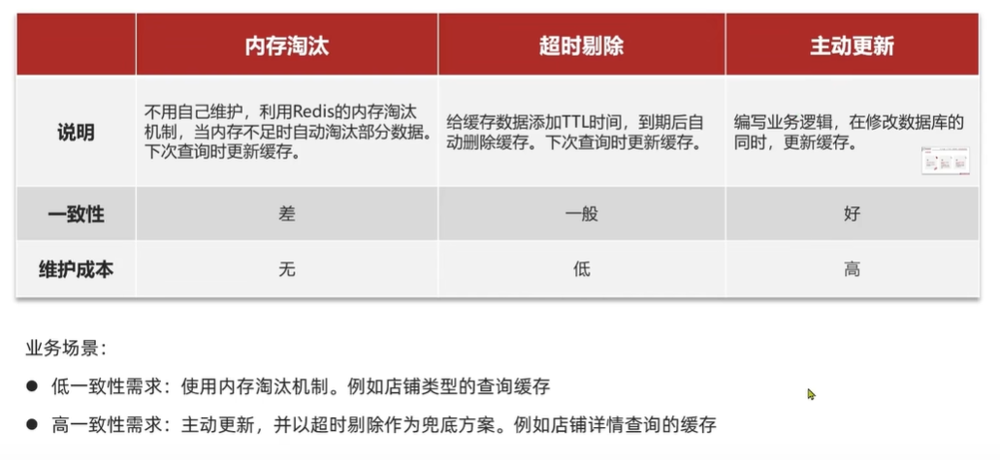

* 低一致性需求：内存淘汰机制

* 高一致性需求：主动更新，超时剔除作为补充

  > 基本都是主动更新


#### 主动更新

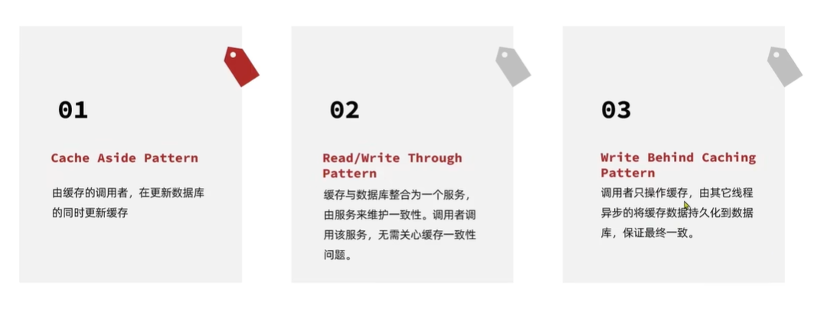


**方案一使用最多**

> 方案一、二强一致性，方案三最终一致性

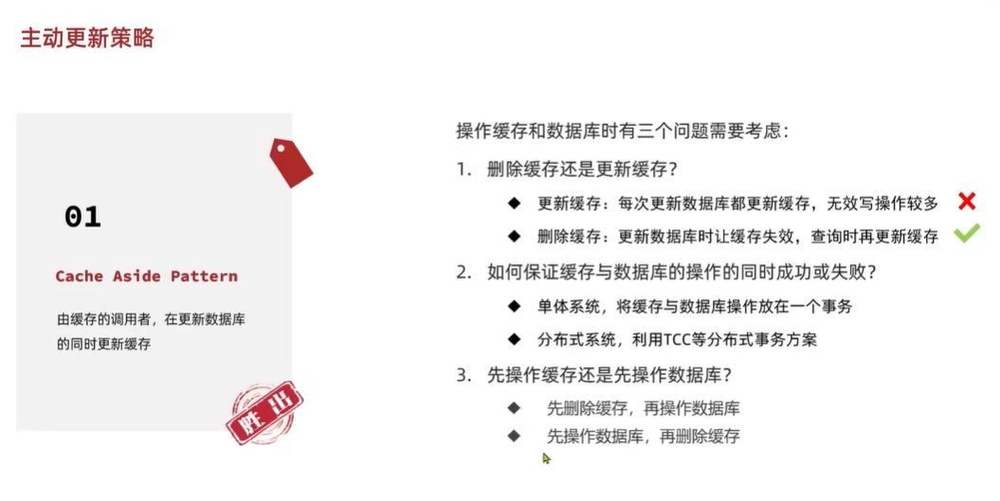

> 更新缓存弊端：每次更新数据库都要更新缓存，如果你对数据库做了上百次操作，缓存也要做上百次操作（还会有很大的线程安全问题）
>
> 一般选择删除缓存

> 需要保证同时成功或失败
> 不能更新数据成功、结果删除缓存失败了

==【如何选择数据一致性策略】==

同时要考虑这个业务需不需要加上 应对缓存击穿、缓存穿透、缓存雪崩的逻辑

> #### 方案 1：接受最终一致性（大多数业务足够、普通业务）
>
> 先更新数据库+后删除缓存
>
> ✅ **适合：普通电商、内容管理等非强一致场景**
>
> 小概率会出现问题：
>
> > **问题场景**：
> >
> > 
> >
> > 导致缓存中仍是旧数据
> >
> > “用缓存过期时间兜底。不过 若缓存 TTL 较长，不一致窗口可能较大。可配合‘缓存空值’或‘逻辑过期’缓解。”
>
> ------
>
> #### 方案 2：更新数据库+异步删缓存（强一致性需求 场景）
使用 **事务消息（Transaction Message）**
>
> > ✅ **适合：对一致性要求较高的系统（如库存、余额）**
>
> **使用 事务消息**
>
> ```java
> // 示例
> @Transactional
> public void updateShop(Shop shop) {
>     try {
>         updateById(shop); // 更新 DB
>         // 发送事务消息（半消息）
>         rocketMQTemplate.sendMessageInTransaction(
>             "delete-cache-topic",
>             new Message("shop", JSON.toJSONString(shop.getId())),
>             null
>         );
>     } catch (Exception e) {
>         log.error("更新失败", e);
>         throw e;
>     }
> }
> ```
>
> 由消费者处理 缓存删除任务
> 需确保消息发送与 DB 更新原子性，推荐使用事务消息实现可靠删除。
>
> - 优点：
>   - 缓存删除与事务解耦
>   - 消息发送与 DB 更新原子性保证（本地事务执行成功才提交消息）
>   - 即使删缓存失败，也支持重试(支持重试机制)
> - 缺点：
>   - 架构复杂度上升
>   - 增加了 MQ 的复杂度（需实现 `LocalTransactionState` 回调）
>   - 仅部分 MQ 支持
>
> **通过一个本地事务表记录“待删除缓存事件”，由定时任务异步处理。**
>
> > 适用于不希望引入MQ(增加复杂度)的场景
>
> ```
> @Transactional
> public void updateShop(Shop shop) {
>     updateById(shop);
>     cacheDeleteTaskService.createTask(shop.getId(), "shop");
> }
> 
> // 定时任务（每秒扫描一次）
> @Scheduled(fixedRate = 1000)
> public void processCacheDeleteTasks() {
>     List<CacheDeleteTask> tasks = taskMapper.selectPending();
>     for (CacheDeleteTask task : tasks) {
>         try {
>             redisTemplate.delete(task.getKey());
>             taskMapper.markAsDone(task.getId());
>         } catch (Exception e) {
>             log.warn("删除缓存失败，稍后重试", e);
>         }
>     }
> }
> ```
>
> - 优点
>   - 不依赖外部系统（如 MQ），简单可靠
>   - 可结合幂等设计（防止重复删除）
> - 缺点
>   - 存在延迟（取决于定时频率）
>   - 需要维护额外表结构和任务逻辑
>
> **监听数据库 binlog（高阶方案）**
>
> - 使用 Canal / Debezium 监听 MySQL binlog
> - 自动触发缓存删除，**解耦业务代码与缓存逻辑**
> - 保证“DB 改了 → 缓存一定删”，即使应用崩溃也能最终一致
>
> 
>
> * 优点
>   - 解耦业务代码与缓存逻辑
>   - 即使应用宕机也能保证最终一致
>   - 支持多源、跨服务同步
>
> * 缺点
>   * 需要部署 Canal/Debezium，运维复杂度高
>   * 存在 binlog 解析延迟（通常毫秒级，但极端情况可达秒级） 
>   * 无法处理 非 DB 触发的缓存更新（如定时任务、外部系统写 DB）
>
> ##### 对比
>
> | 方案              | 是否原子     | 是否解耦 | 是否复杂 | 适用场景               |
> | ----------------- | ------------ | -------- | -------- | ---------------------- |
> | **事务消息**      | ✅ 是         | ✅ 是     | ⚠️ 中     | 高可用、强一致要求系统 |
> | 本地事务表 + 补偿 | ✅ 是（最终） | ❌ 否     | ✅ 简单   | 小型系统、可控延迟     |
> | binlog 监听       | ✅ 是（最终） | ✅ 是     | ⚠️ 高     | 大型系统、微服务架构   |
>
> ------
>
> ---
>
> #### 方案 3：分布式锁+延迟双删（高并发 热点数据）
>
>  **延迟双删（Delayed Double Delete）**：
>
> ```
> //此处是redisTemplate方式的案例
> @Service
> public class UserService {
> 
>     @Autowired
>     private RedisTemplate<String, Object> redisTemplate;
> 
>     @Autowired
>     private UserRepository userRepository; 
>     public void updateUser(User user) {
>         // 1. 更新数据库
>         userRepository.update(user);
> 
>         String cacheKey = "user:" + user.getId();
> 
>         // 2. 第一次删除缓存
>         redisTemplate.delete(cacheKey);
> 
>         // 3. 延迟一段时间（例如 200ms）
>         CompletableFuture.runAsync(() -> {
>             try {
>                 Thread.sleep(200); // 或使用更优雅的调度器
>                 // 4. 第二次删除缓存
>                 redisTemplate.delete(cacheKey);
>             } catch (InterruptedException e) {
>                 Thread.currentThread().interrupt();
>             }
>         }, Executors.newSingleThreadExecutor());
>     }
> 
>     public User getUser(Long id) {
>         String cacheKey = "user:" + id;
>         User user = (User) redisTemplate.opsForValue().get(cacheKey);
>         if (user == null) {
>             user = userRepository.findById(id);
>             if (user != null) {
>                 redisTemplate.opsForValue().set(cacheKey, user, Duration.ofMinutes(10));
>             }
>         }
>         return user;
>     }
> }
> ```
>
> > 注意：`Thread.sleep` 不优雅，生产环境建议用异步任务或 MQ 延迟删除。
>
> 
>
> 


###### ==操作数据库->删除缓存==

> 强一致性需求中，我们主动更新缓存，为了保证缓存与数据库一致性 而采取的一种策略

[实战篇-04]([实战篇-商户查询缓存-04.缓存更新策略_哔哩哔哩_bilibili](https://www.bilibili.com/video/BV1cr4y1671t?spm_id_from=333.788.player.switch&vd_source=67ef3bb4c8d68a96408acdaa865b1313&p=38))

**线程安全与数据不一致**

先删除缓存，再操作数据库-正常情况

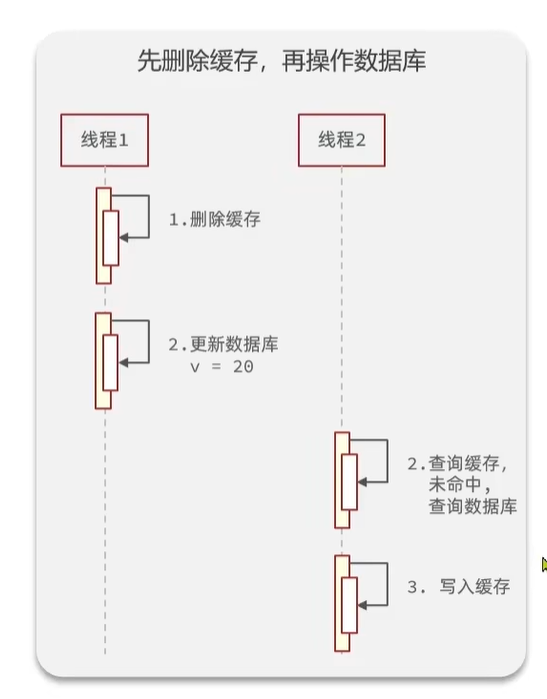

先删除缓存，再操作数据库-异常情况

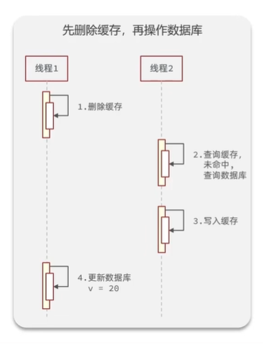


---

先操作数据库，再删除缓存-正常情况

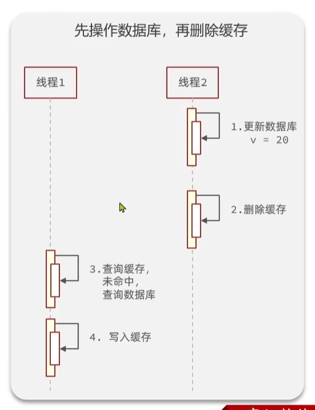

先操作数据库，再删除缓存-异常情况

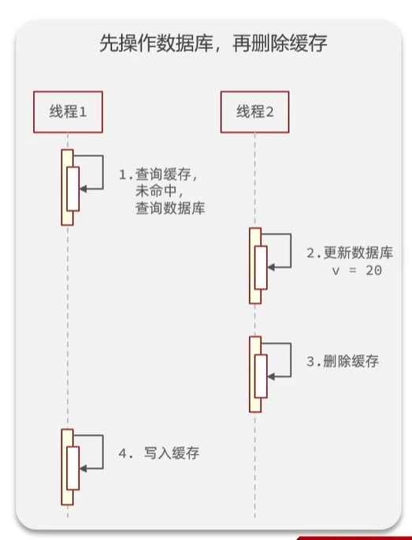

两种方案都有可能出现线程安全问题，但是方案二(先写数据库，再删缓存)出现的可能性更低

> 【因为大多数情况下 查询数据库+写入缓存 这一步都会比更新数据库再删除缓存快】

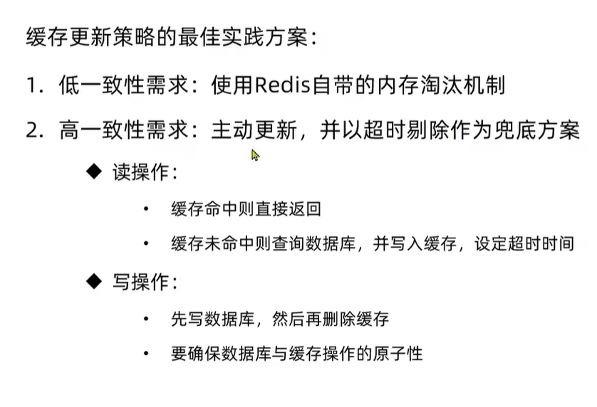


1. 使用“ 更新数据库+@CacheEvict”

   > 可能有数据库操作成功，缓存删除失败（触发原因 ：比如 Redis 不可达、网络异常、超时等）的风险
   >
   > **风险较大**，尤其是在以下场景中：
   >
   > | 场景                                   | 风险程度    |
   > | -------------------------------------- | ----------- |
   > | 高并发读写系统                         | ⭐⭐⭐⭐⭐（高） |
   > | 缓存命中率高                           | ⭐⭐⭐⭐（高）  |
   > | Redis 不稳定或网络抖动                 | ⭐⭐⭐⭐⭐（高） |
   > | 数据一致性要求高的业务（如订单、余额） | ⭐⭐⭐⭐⭐（高） |
   >
   > 不过这些场景一般也不会用方案一

2. 使用“更新数据库+redisTemplate对象删除缓存+ @Transactional”


**缓存更新中，需要保证缓存操作和数据库操作都成功，否则回滚**

> #### 使用@Transactional：
>
> ```
> @Override
> @Transactional
> public Result updateShop(Shop shop) {
>     if(shop.getId() == null){
>         return Result.fail(MessageConstant.SHOP_ID_ERROR);
>     }
>     updateById(shop);
>     redisTemplate.delete("shopCache::"+shop.getId())
>     return Result.ok();
> }
> ```
>
> 这里的事务只是为了让数据库回滚的，重点在于当redis报错了，数据库能回滚，redis本身不需要回滚
>
> 但是这种方案如果使用的是下面这种SpringCache的写法就无法生效
>
> ```
> @Override
> @CacheEvict(cacheNames = "shopCache", key = "#shop.id")
> @Transactional
> public Result updateShop(Shop shop) {
>     if(shop.getId() == null){
>         return Result.fail(MessageConstant.SHOP_ID_ERROR);
>     }
>     updateById(shop);
>     return Result.ok();
> }
> ```
>
> > #### 为什么无法不能  注解写法+事务
> >
> > 你提供的这段代码：
> >
> > ```java
> > @Override
> > @CacheEvict(cacheNames = "cache:shop", key = "#shop.id")
> > @Transactional
> > public Result updateShop(Shop shop) {
> >     if (shop.getId() == null) {
> >         return Result.fail(MessageConstant.SHOP_ID_ERROR);
> >     }
> >     updateById(shop); // 假设这是 MyBatis-Plus 的更新方法，操作数据库
> >     return Result.ok();
> > }
> > ```
> >
> > 我们来分析两个关键点：
> >
> > ------
> >
> > #### ✅ 一、`@Transactional` **本身是有效的**（前提条件满足）
> >
> > 只要满足以下条件，`@Transactional` 就能正常工作：
> >
> > 1. **该方法被 Spring 容器管理（是 Bean）**
> > 2. **调用方式是通过 Spring 代理（不能是 this.updateShop() 内部调用）**
> > 3. **底层数据源支持事务（如 MySQL + InnoDB）**
> > 4. **异常是 RuntimeException 或其子类（或配置了 rollbackFor）**
> >
> > > 在你的场景中，如果 `updateById(shop)` 是对数据库的写操作（如 MyBatis-Plus 的 `updateById`），那么：
> > >
> > > - 如果方法抛出未被捕获的运行时异常，**数据库会回滚**。
> > > - 如果正常执行完毕，**数据库会提交**。
> >
> > ✅ 所以：**`@Transactional` 对数据库操作是有效的。**
> >
> > ------
> >
> > ##### ⚠️ 二、但 **`@CacheEvict` 不受事务控制！**
> >
> > 这是关键问题！
> >
> > ##### Spring Cache 的执行时机由 `beforeInvocation` 决定（默认 `false`）：
> >
> > - 默认 `beforeInvocation = false` → **在目标方法成功执行后**才清除缓存。
> > - 而“成功执行”是指：**方法返回且没有抛出异常**（此时事务已提交）。
> >
> > 所以你当前的逻辑实际执行顺序是：
> >
> > 1. 开启数据库事务
> > 2. 执行 `updateById(shop)`（写 DB，但尚未提交）
> > 3. 方法正常返回 `Result.ok()`
> > 4. **Spring 提交数据库事务**
> > 5. **触发 `@CacheEvict`，删除 Redis 缓存**
> >
> > 👉 这个顺序 **看起来没问题**，**但如果在第 4 步（事务提交）时失败了呢？**
> >
> > ##### 潜在风险场景（极小概率，但存在）：
> >
> > | 步骤 | 动作                                    | 是否可回滚               |
> > | ---- | --------------------------------------- | ------------------------ |
> > | 1    | 开启事务                                | —                        |
> > | 2    | update DB                               | 可回滚                   |
> > | 3    | 方法返回 OK                             | —                        |
> > | 4    | **事务提交失败**（如网络中断、DB 崩溃） | ❌ 无法回滚（已尝试提交） |
> > | 5    | **缓存已被删除**（因为方法“看似成功”）  | ❌ 无法恢复               |
> >
> > → 结果：**数据库没更新成功，但缓存被删了！**
> > 下次读取会从 DB 加载数据
> >
> > > 💡 注意：这种情况非常罕见（事务提交阶段失败），但在高可用系统中仍需考虑。
> >
> > 


###### ==延迟双删==

> 强一致性需求中，我们主动更新缓存，为了保证缓存与数据库一致性 而采取的一种策略
>
> 场景：对一致性要求高、写多读多

核心思想：**在更新数据库后，先删除一次缓存，稍等一段时间后再删除一次缓存**，以应对主从延迟、并发读写导致的脏数据问题。

```
public void updateUser(User user) {
    
    userMapper.update(user);                      // 更新 DB
    redisTemplate.delete("user:" + user.getId()); // 第一次删（防并发）
    Thread.sleep(100);                            // 等待可能的并发读完成
    redisTemplate.delete("user:" + user.getId()); // 第二次删
}
```

> 注意：`Thread.sleep` 不优雅，生产环境建议用异步任务或 MQ 延迟删除。

一、**延迟双删 + RedisTemplate**（推荐方式）

1. 原理回顾

- 第一次删除：更新 DB 后立即删除缓存。
- 等待一段时间（如 100ms~500ms）：让可能正在执行的旧读请求完成（避免旧值回填缓存）。
- 第二次删除：再次删除缓存，确保最终一致性。

2. 示例代码（基于 RedisTemplate）

```java
@Service
public class UserService {

    @Autowired
    private RedisTemplate<String, Object> redisTemplate;

    @Autowired
    private UserRepository userRepository; 
    public void updateUser(User user) {
        // 1. 更新数据库
        userRepository.update(user);

        String cacheKey = "user:" + user.getId();

        // 2. 第一次删除缓存
        redisTemplate.delete(cacheKey);

        // 3. 延迟一段时间（例如 200ms）
        CompletableFuture.runAsync(() -> {
            try {
                Thread.sleep(200); // 或使用更优雅的调度器
                // 4. 第二次删除缓存
                redisTemplate.delete(cacheKey);
            } catch (InterruptedException e) {
                Thread.currentThread().interrupt();
            }
        }, Executors.newSingleThreadExecutor());
    }

    public User getUser(Long id) {
        String cacheKey = "user:" + id;
        User user = (User) redisTemplate.opsForValue().get(cacheKey);
        if (user == null) {
            user = userRepository.findById(id);
            if (user != null) {
                redisTemplate.opsForValue().set(cacheKey, user, Duration.ofMinutes(10));
            }
        }
        return user;
    }
}
```

> ⚠️ 注意：
>
> - `Thread.sleep` 在异步线程中使用，避免阻塞主线程。
> - 生产环境建议使用 `ScheduledExecutorService` 或 Spring 的 `@Async` + 自定义线程池，避免频繁创建线程。
> - 延迟时间应略大于主从复制延迟或业务读请求的最大耗时。

------

二、**延迟双删 + Spring Cache**（较难直接实现）

Spring Cache 抽象（如 `@Cacheable`, `@CacheEvict`）本身**不支持延迟操作**，因此无法直接通过注解实现“延迟双删”。

但可以通过以下方式**间接实现**：

方案 A：手动控制缓存（绕过 Spring Cache 注解）

放弃使用 `@CacheEvict`，改用 `RedisTemplate` 手动管理缓存，如上文所示。

方案 B：自定义 CacheManager / Cache 实现（复杂，不推荐）

你可以继承 `RedisCache` 并重写 `evict` 方法，在其中加入延迟双删逻辑，但这会破坏 Spring Cache 的简洁性，且难以维护。

方案 C：结合 `@CacheEvict` + 异步延迟再删（折中）

```java
@Service
public class UserService {

    @Autowired
    private RedisTemplate<String, Object> redisTemplate;

    @CacheEvict(value = "users", key = "#user.id")
    public void updateUser(User user) {
        // 1. 更新数据库
        userRepository.update(user);

        // 2. 第一次删除由 @CacheEvict 完成

        // 3. 延迟后再次删除（需知道 Spring Cache 的 key 生成规则）
        String cacheKey = "users::" + user.getId(); // 默认前缀格式
        CompletableFuture.runAsync(() -> {
            try {
                Thread.sleep(200);
                redisTemplate.delete(cacheKey);
            } catch (InterruptedException e) {
                Thread.currentThread().interrupt();
            }
        });
    }

    @Cacheable(value = "users", key = "#id")
    public User getUser(Long id) {
        return userRepository.findById(id);
    }
}
```

> ✅ 关键点：
>
> - Spring Boot 默认使用 `CacheName::Key` 作为 Redis key（可通过配置修改）。
> - 需确保 `redisTemplate` 操作的 key 与 Spring Cache 生成的 key 一致。
> - 可通过 `@CacheConfig(keyGenerator = "...")` 统一 key 生成逻辑。

------

三、注意事项

1. **延迟时间设置**：通常 100~500ms，需根据业务和主从延迟调整。
2. **幂等性**：`delete` 是幂等的，多次删除无副作用。
3. **异常处理**：异步任务中的异常需捕获，避免静默失败。
4. **资源管理**：不要在每次调用都新建线程池，应使用共享线程池。
5. **替代方案**：考虑使用 **Cache-Aside + 失效时间（TTL）+ 更新时加锁** 等组合策略，有时比延迟双删更简单可靠


### 过期淘汰(超时剔除)-带来的经典问题


#### 缓存雪崩-解决方案

缓存雪崩：同时时间段，大量缓存的key同时失效或者Redis服务宕机，导致大量请求到达数据库，带来巨大压力

* 利用redis集群等策略提高redis可用性

  > 使用redis集群【主从，集群，哨兵机制】

* 给缓存业务添加降级限流策略

  > 发现redis出现故障之后，及时**降级、限流(微服务部分讲了)**，而不是把请求继续压到服务器上

* 给业务添加多级缓存**(微服务部分讲了)**

  > nginx缓存-redis缓存-jvm缓存-数据库

  > 大型电商项目，都会添加多级缓存(比如京东的商品详情，从而应对亿级以上的并发)

* **不同key使用随机的TTL**

  


##### TTL随机


待补充


##### 后台线程同步更新

待补充


##### 增加互斥锁

待补充


#### 缓存击穿-解决方案


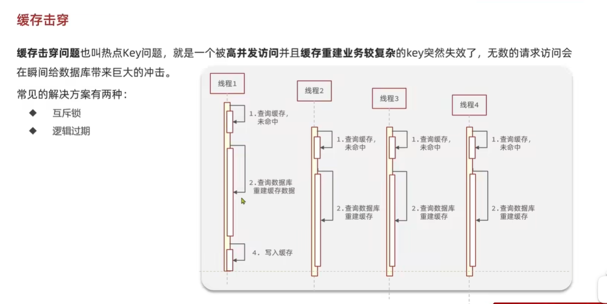

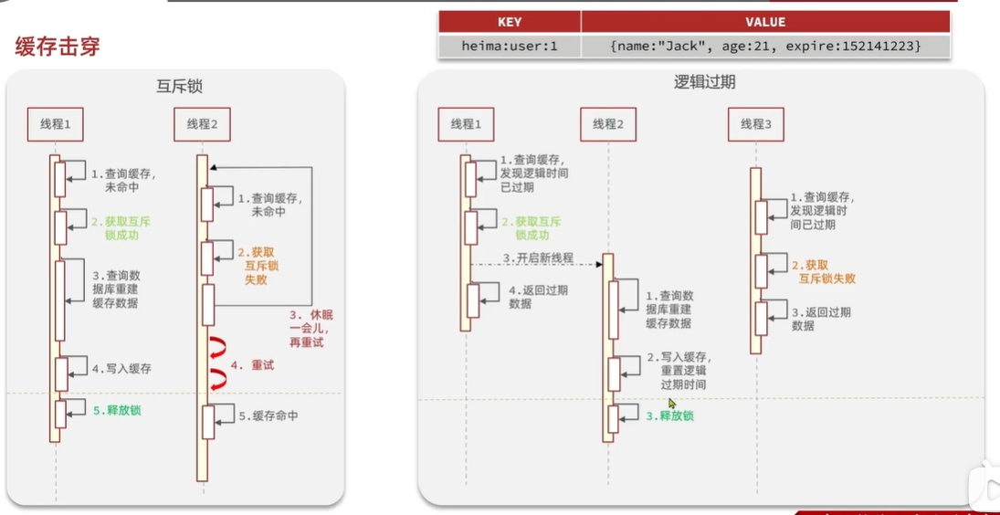


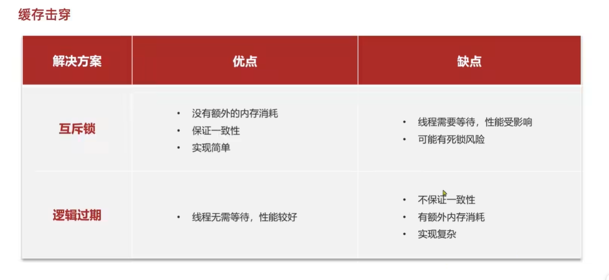

*  怎么选
  依据场景选：更看重可用性、还是更看重一致性？


##### 互斥锁

> 似乎更常用


* 缺点
  * 性能较差


> 这里使用的不是syncronize、lock（如果没拿到锁就不能执行）
>
> 使用自定义的互斥锁
>
> 
> 可以利用setnx
>
> 往往需要加有效期，防止一直不释放
>
> 

**案例**

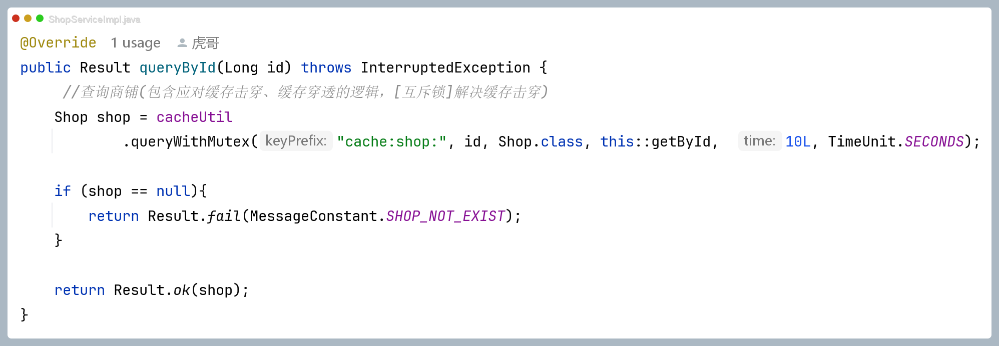

```
@Override
public Result queryById(Long id) throws InterruptedException {
    //查询商铺(包含应对缓存击穿、缓存穿透的逻辑，[互斥锁]解决缓存击穿)
    Shop shop = cacheUtil
            .queryWithMutex("cache:shop:", id, Shop.class, this::getById,  10L, TimeUnit.SECONDS);

    if (shop == null){
        return Result.fail(MessageConstant.SHOP_NOT_EXIST);
    }

    return Result.ok(shop);
}
```


##### 逻辑过期

不设置TTL，使用逻辑过期，（做活动的时候添加进去）

> 设置逻辑过期的原因是因为，热点数据过期（redis中删除了）会导致击穿，而利用逻辑时间维护的数据在redis中是一直存在的，只需要根据逻辑时间确定是否更新即可保证弱一致性
> 
>
> 牺牲了一定一致性，换取性能


总结：只要Redis中获取到数据，就返回这个数据用着。如果发现缓存过期，尝试去获取锁，获取到锁的线程只是通知重建线程去更新数据，而没有获取到锁的线程继续返回旧数据


**案例**

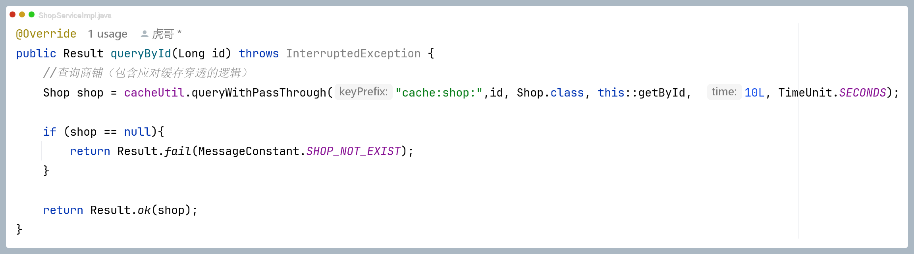


（逻辑过期需要数据预热 ↓）


```
/**
 * 写入有逻辑过期时间的店铺数据到缓存中
 * @param id
 * @param expireSeconds
 */
private void saveShop2Redis(Long id, Long expireSeconds){
    //1. 查询店铺数据
    Shop shop = getById(id);
    //2. 封装逻辑过期时间
    RedisData redisData = new RedisData();
    redisData.setData(shop);
    redisData.setExpireTime(LocalDateTime.now().plusSeconds(expireSeconds));
    //3. 写入redis
    stringRedisTemplate.opsForValue().set("shopCache::"+id, JSONUtil.toJsonStr(redisData));
}
```


```
@Override
public Result queryById(Long id) throws InterruptedException {
	//查询商铺(包含应对缓存击穿的逻辑，[逻辑过期]解决缓存击穿(该方式缓存穿透问题))
    Shop shop = cacheUtil
            .queryWithLogicalExpire("cache:shop:",id, Shop.class, this::getById,  10L, TimeUnit.MINUTES);

    if (shop == null){
        return Result.fail(MessageConstant.SHOP_NOT_EXIST);
    }

    return Result.ok(shop);
}
```


 

> 【一致性好、性能较差】【一致性差、性能较好】
>
> 没有绝对好的方案，只有更适合当前场景的方案，根据实际业务需求选择


#### 缓存穿透-解决方案


> 缓存   ”“


* 优点
  * 内存占用小，没有多余key
* 缺点
  * 存在误判的可能

> 布隆过滤器准确性:不存在是真的不存在，存在是可能存在


##### **被动措施-缓存空对象**

* 优点
* 缺点
  * 额外的内存消耗(可以通过设置过期时间弥补)
  * 可能造成短期的不一致


```
@Override
public Result queryById(Long id) throws InterruptedException {
    //查询商铺（包含应对缓存穿透的逻辑）
    Shop shop = cacheUtil.queryWithPassThrough("cache:shop:",id, Shop.class, this::getById,  10L, TimeUnit.SECONDS);
	if (shop == null){
		return Result.fail(MessageConstant.SHOP_NOT_EXIST);
	}
    return Result.ok(shop);
}
```


##### 被动措施-布隆过滤器

补充学下


##### **主动措施**

* 增加id复杂度

  正规的id不用1、2、3，应该保证长度在10-20位，有一定的规律性，比如雪花算法

  > 后端可以检查id规则：id不符合规则，都不用去查，直接返回错误信息了（有利于预防缓存穿透）
  >
  > 或者前端直接驳回

* 

  

* 使用sentinal对热点数据限流


#### 缓存工具封装


# 高级篇


# 原理篇


