


# ==【MySQL性能优化】==

1. 定位慢查询

   * 聚合查询

   * 多表查询

   * 表数据量过大查询

   * 深度分页查询

     > 接口测试响应时间过长(大于1s)

2. 提高sql查询速度(解决慢查询)

   1. 分析SQL执行计划

3. 增加索引，提升性能

4. [优化SQL语句](#SQL优化)


## 定位慢查询

常见的慢查询：

* 聚合查询

* 多表查询

* 表数据量过大查询——添加索引

* 深度分页查询

  > 接口测试响应时间过长(大于1s)

### 如何定位

#### 1.开源工具

**调试工具：Arthas（阿尔萨斯）**

可以使用命令的方式监控已经上线的项目，可以跟踪执行比较慢的方法，查看方法的执行时间，最终确定哪里出了问题

**运维工具：Prometheus、Skywalking**


监控中会有各种指标，可以实时查看接口的响应情况，

> 
>
> 
>
> 


#### **2.查看MySQL自带的慢查询日志**


查看慢查询日志是否开启了

```
show variables like 'slow_query_log'
```

> **慢查询日志需要提前开启**
>
> （生产环境不建议开启，影响性能；开发环境开启）


**开启慢查询日志**：

> 
>
> 重启mysql
>
> ```
> //可通过重启容器 方式
> restart 
> ```
>
> 


查看最新追加的日志

```
tail -f localhost-slow.log
```


> * Query_time：这条语句从开始进入解析器到执行完毕的总耗时（默认记录的是 **从接收客户端请求到返回结果的总时间**，包括多个阶段，而在服务器本地执行时只测“纯 SQL 执行”阶段。）
>
>   > ##### ✅ 详细对比：两个场景的时间组成
>   >
>   > | 阶段                           | 在应用中执行（慢日志记录）   | 在 DB 服务器本地执行（`mysql` 命令行） |
>   > | ------------------------------ | ---------------------------- | -------------------------------------- |
>   > | 1. 网络传输（应用 → DB）       | ✅ 包含（可能几十~几百 ms）   | ❌ 无（本地 socket，几乎 0）            |
>   > | 2. SQL 解析 & 优化             | ✅ 包含                       | ✅ 包含                                 |
>   > | 3. **SQL 执行（真正查表）**    | ✅ 包含                       | ✅ 包含（你测的就是这个）               |
>   > | 4. **结果集返回（DB → 应用）** | ✅ 包含（大数据量时极慢！）   | ✅ 包含，但输出到终端很快               |
>   > | 5. 应用处理结果（如 ORM 映射） | ❌ 不包含（慢日志只到 DB 层） | ❌ 不包含                               |
>   >
>   > > ⚠️ **最关键的区别：结果集大小 + 网络带宽**
>
> * Lock_time：在真正开始执行之前，花在「等待锁」上的时间，单位秒
>
> * Rows_sent：最终返回给客户端的行数
>
> * Rows_examined：引擎为了返回这 Rows_sent 行，一共扫描/检查了 Rows_examined 行


#### 3.**查看profile详情**


> 查看系统的having_profiling参数，判断是否支持profile操作
>
> ```
> SELECT @@have_profiling 
> ```
>
> 查看是否开启了profile操作
>
> ```
> select @@profiling;
> ```
>
> 开启开关
>
> ```
> setprofiling = 1;
> ```
>
> 查看会话中所有的sql语句 的执行耗时情况
>
> ```
> show profiles;
> ```
>
> 查看指定(query_id)的SQL语句<u>**各个阶段的耗时情况**</u>
>
> ```
> show profile for query query_id;
> //例 ↓
> show profile for query 16;
> ```
>
> 查看指定(query_id)的SQL语句的<u>**CPU使用情况**</u>
>
> ```
> show profile cpu for query query_id;
> //例 ↓
> show profile cpu for query 16;
> ```
>
> 


分析方式

1. **分析 SQL执行频率**
2. **分析(查看)慢查询日志**
3. 查看profile详情（查看各阶段耗时）
4. **<u>查看explain执行计划</u>**
5. 


#### (**分析 SQL执行频率**)


> 通过查看执行频率，判断当前数据库以哪种操作方式为主
>
> 这里Com后面跟七个下划线 


## 解决慢查询


### **分析sql的执行计划(explain)**

> **找到这条sql执行慢的原因**


> id表示查询的序列号，id相同，执行顺序从上到下；id不同，值大的先执行
>
> 如果访问系统表，会出现system；根据主键/唯一索引访问，一般会出现const
> 使用非唯一性索引(比如`where name  = '张三'`)，会出现ref；index：扫描索引，变遍历整个索引树；出现all，代表全表扫描
> 尽量往前优化


**重点关注：type(看出来这条sql语句的性能大概怎么样)、possible_keys、key、key_len、Extra；**


> type
>
> (从上至下，效率降低)
>
> | type   | 含义                                                     | 说明                                     | 性能等级      | 备注     |
> | ------ | -------------------------------------------------------- | ---------------------------------------- | ------------- | -------- |
> | NULL   | 这条sql执行的时候没使用到表（少见）                      |                                          |               |          |
> | system | 这条sql查询的表是MySQL内置的表（少见）                   |                                          |               |          |
> | const  | 常量查询[只返回一条数据]（多见）                         | 主键或唯一索引等值查询，数据唯一且确定   | ⭐⭐⭐⭐⭐         |          |
> | eq_ref | 非主键的唯一索引查询，或两个表的等值连接[只返回一条数据] | 非主键的唯一索引查询，或两个表的等值连接 | ⭐⭐⭐⭐☆         |          |
> | ref    | 使用普通索引进行等值查询                                 | 普通索引匹配，可能返回多条记录           | ⭐⭐⭐☆☆         |          |
> | range  | 范围查询，走索引但范围扫描                               | 如 `BETWEEN`, `IN`, `>`, `<` 等操作      | ⭐⭐☆☆☆         | 最低要求 |
> | index  | 全索引扫描，遍历了整个索引树                             | 不走主键，而是扫描完整个索引             | ⭐☆☆☆☆         | 需要优化 |
> | all    | 全盘扫描                                                 |                                          | ☆☆☆☆☆（最差） | 需要优化 |
>
> Extra
>
> | Extra                        | 含义                                                         |
> | ---------------------------- | ------------------------------------------------------------ |
> | Using where;Using index      | 查找使用了索引，需要的数据都能在索引列中找到，不需要回表查询数据 |
> | Using index condition        | 查找使用了索引，但是需要回表查询数据——有优化空间             |
> | Using index(order by语句)    | 通过有序索引顺序扫描直接返回有序数据，不需要额外排序，操作效率高(order by语句中的解释) |
> | Using filesort(order by语句) | 通过表的索引或全表扫描，读取满足条件的数据行，然后在排序缓冲区sort buffer中完成排序操作，所有不是通过索引直接返回排序结果的排序都叫FileSort排序(order by语句中出现) |
>
> 
>
> 


#### [sql执行耗时测试]

可以直接在数据库看到


explain 分析SQL执行计划

1. 避免使用 select * ，避免查询不必要的列、占用网络带宽、发生不必要的回表查询
2. 索引
   1. 考虑给where order by group by join 后面的字段添加索引
   2. 添加索引尽量使用联合索引，尽量通过覆盖索引来避免回表
   3. update 和 delete 后面 where 条件应该使用索引列，让查询加行锁而不是表锁

3. 多条件查询
   1. 尽量避免在 where 子句中使用!=或<>操作符，否则将引擎放弃 使用索引而进行全表扫描 
   2. 尽量避免在 where 子句中对字段进行 null 值判断，否则将导致 引擎放弃使用索引而进行全表 扫描

4. 链表查询
   1. 表关联查询的效率高于子查询, 所以尽量少用子查询, 用关联查询 替代. 

5. 优化sql语句
   1. 插入数据
      批量插入数据而不是逐个插入，大数据量插入的时候手动管理事务  避免事务频繁开启和关闭
      按照主键顺序插入数据，避免页分裂
   2. limit 优化
      使用覆盖索引+子查询优化深度分页的效率
   3. count 优化
      尽量使用 `count(*)`统计数量（count(*) MySQL做过优化）
   4. 主键优化
   5. order by 优化
   6. group by 优化
   7. update 优化

### 1.优化sql语句


#### limit优化

> PageHelper插件不会底层实现并不是覆盖索引+子查询，要自己手写
>
> ##### (PageHelper实现机制)
>
> PageHelper 是 MyBatis 生态中最流行的分页插件之一，它的**核心原理是通过 MyBatis 的插件（Interceptor）机制，在 SQL 执行前动态重写 SQL，加上 `LIMIT`（MySQL）、`ROWNUM`（Oracle）等分页语法**。
>
> ------
>
> ##### 📌 二、工作流程（以 MySQL 为例）
>
> 1. 调用 
>
>    ```
>    PageHelper.startPage(1, 10);
>    ```
>
>    - 将分页参数（pageNum=1, pageSize=10）存入 **ThreadLocal**
>
> 2. 执行 Mapper 查询方法
>
>    - 触发 MyBatis 的 `Executor.query()`
>
> 3. PageHelper 拦截该调用
>
>    - 从 ThreadLocal 取出分页参数
>    - 解析原始 SQL（如 `SELECT * FROM user WHERE name = ?`）
>    - 重写为：`SELECT * FROM user WHERE name = ? LIMIT 0, 10`
>
> 4. 同时发起一个 `COUNT(*)` 查询获取总数
>
> 5. 将结果封装为 `Page<User>` 对象返回
>
> ------
>
> ##### 🧩 三、拼接出来的 SQL 长什么样？
>
> ##### 场景 1：简单查询
>
> ```java
> PageHelper.startPage(2, 10);
> userMapper.selectAll(); // 原始 SQL: SELECT * FROM user
> ```
>
> ✅ **实际执行的 SQL**：
>
> ```sql
> -- 数据查询
> SELECT * FROM user LIMIT 10, 10;
> 
> -- 总数查询（自动触发）
> SELECT count(0) FROM user;
> ```
>
> ------
>
> ##### 场景 2：带条件的查询
>
> ```java
> PageHelper.startPage(1, 5);
> userMapper.selectByName("alice"); // 原始 SQL: SELECT * FROM user WHERE name = #{name}
> ```
>
> ##### ✅ **实际执行的 SQL**：
>
> ```sql
> -- 数据查询
> SELECT * FROM user WHERE name = 'alice' LIMIT 0, 5;
> 
> -- 总数查询
> SELECT count(0) FROM user WHERE name = 'alice';
> ```
>
> > ⚠️ 注意：PageHelper **不会解析 SQL 语义**，它只是在末尾加 `LIMIT`。如果原始 SQL 已有 `ORDER BY`、`GROUP BY`，它会保留。
>
> 
>
> 
>
> ##### ⚠️ PageHelper 的局限性（重点！）
>
> | 问题                     | 说明                                                         |
> | ------------------------ | ------------------------------------------------------------ |
> | **深分页性能差**         | `LIMIT 1000000, 10` 仍会扫描前 100 万行                      |
> | **不支持游标分页**       | 无法基于 `id > lastId` 优化                                  |
> | **COUNT 查询可能不准**   | 如果原始 SQL 有 `DISTINCT`、`GROUP BY`，需手动写 `countQuery` |
> | **SQL 注入风险（极低）** | 因为是参数化查询，一般安全                                   |
>
> ## 
>
> | 项目             | 说明                                        |
> | ---------------- | ------------------------------------------- |
> | **核心机制**     | MyBatis Interceptor + ThreadLocal           |
> | **SQL 改写**     | 在原始 SQL 末尾追加 `LIMIT offset, size`    |
> | **自动 COUNT**   | 会额外执行一次 `SELECT count(0) FROM (...)` |
> | **是否智能优化** | ❌ 不会自动用子查询/覆盖索引，需手动干预     |
> | **适用场景**     | 浅分页（前几十页），不适合深度分页          |
>
> ------
>
> ##### 💡 建议
>
> - **前 100 页**：放心用 PageHelper
> - **超过 100 页**：改用 **游标分页** 或 **子查询优化**
> - **高并发列表**：考虑前端禁止跳页，只允许“下一页”
>
> 


> **对于大页(>1000页)，我们最好自己手写覆盖索引+子查询的方式实现分页查询**


大数据量下，越往后，分页效率越低(limit 20,10    ->        limit 200000,10)


优化方式：覆盖索引+子查询

```
例如：
select s.* from tb_sku s order by id limit 2000000,10;

select s.* from tb_sku s, (select id from tb_sku order by id limit 2000000,10) a where s.id = a.id;


```

> 子查询覆盖索引，主查询通过聚集索引
>
> 避免了原sql语句的低性能全表扫描


> 原sql语句
>
> 1. 数据库需要 **按 `id` 排序**（虽然主键本身有序，但不影响下面的问题）。
> 2. 为了跳过前 2,000,000 行，MySQL 必须 **逐行扫描并计数** 到第 2,000,001 行。
> 3. 在这个过程中，**每一条记录都要从磁盘或缓冲池中读取完整的行数据（即 `s.*`）**，即使前 200 万条最终被丢弃。（查询的是*，没有覆盖索引）
> 4. I/O 和内存开销巨大，尤其当表很大、行很宽（字段多/有 text/blob）时，性能急剧下降。
>
> > 💥 **问题核心**：**在跳过阶段也读取了整行数据**，做了大量无用功。
>
> 
>
> 改良语句
>
> ##### 第一步：执行子查询
>
> ```
> SELECT id FROM tb_sku ORDER BY id LIMIT 2000000, 10
> ```
>
> - 这里只查 `id` 字段。
> - 如果 `id` 是 **主键**（InnoDB 聚簇索引），或者有 **二级索引**，那么这个查询可以 **完全在索引上完成**，**无需回表**。
> - 这就是 **覆盖索引（Covering Index）**：**查询所需的所有字段都包含在索引中**，直接从索引 B+ 树中获取数据，速度极快。
> - 即使要跳过 200 万行，也只是在**紧凑的索引结构**中遍历，每个索引项很小（比如 8 字节 bigint），I/O 少、缓存效率高。
>
> ##### 第二步：用子查询结果关联主表
>
> ```
> SELECT s.* FROM tb_sku s INNER JOIN (...) a ON s.id = a.id
> ```
>
> - 子查询返回最多 10 个 `id` 值。
> - 然后通过这 10 个 `id` 去主表 `tb_sku` 中 **精确查找完整行**。
> - 因为 `id` 是主键（或有唯一索引），所以是 **10 次主键等值查询（回表）**，效率非常高。
>
> 


#### 范围查询优化

在业务允许的情况下，尽量使用>= / <=这样的范围查询（**范围查询( > / < )右边的列索引将会失效**）


* 尽量避免在 where 子句中使用!=或<>操作符，否则将引擎放弃 使用索引而进行全表扫描

  > `<>` 和 `!=` 在功能上是等价的，都表示“不等于”

* 尽量避免在 where 子句中对字段进行 null 值判断，否则将导致 引擎放弃使用索引而进行全表 扫描


#### 多条件查询优化

如果此多条件查询 想让它用到联合索引，注意**遵循最左前缀法则**(最左前缀法则指的是从索引的最左列开始，并且不跳过索引中的)


#### 联表查询优化

能用inner join ，就不用 left join/right join，如必须使用，一定要以小表为驱动

> 内连接会对两个表进行优化，优先把小表放到外边，把大表放到里边。left join / right join不会重新调整顺序

> 假设
>
> - 表 A：100 万行（大表）
> - 表 B：1 万行（小表）
>
> | 写法                                | 实际执行顺序              | 扫描行数估算         | 性能 |
> | :---------------------------------- | :------------------------ | :------------------- | :--- |
> | `select … from B inner join A on …` | 优化器自动把 B 放前       | 1 w × 索引 ≈ 1 w     | 快   |
> | `select … from A inner join B on …` | 同上，优化器仍会把 B 放前 | 1 w × 索引 ≈ 1 w     | 快   |
> | `select … from A left join B on …`  | **必须按你写的顺序** A→B  | 100 w × 索引 ≈ 100 w | 慢   |
> | `select … from B left join A on …`  | **必须按你写的顺序** B→A  | 1 w × 索引 ≈ 1 w     | 快   |


> 据说：数据量和业务量过大的情况下，不使用join，单独查询两个表的数据，在后端处理成需要的数据集合


.


#### order by优化

1. **Using filesort**：通过表的索引或全表扫描，读取满足条件的数据行，然后在排序缓冲区sort buffer中完成排序操作，所有不是通过索引直接返回排序结果的排序都叫 FileSort 排序
2. **Using index**：通过有序索引顺序扫描直接返回有序数据，这种情况即为 using index，不需要额外排序，操作效率高

优化order by 语句的时候，尽量优化为Using index;


```sql
# 没有创建索引时，根据age, phone进行排序
explain select id, age, phone from tb_user order by age, phone;
# 创建索引
create index idx_user_age_phone_aa on tb_user(age, phone);
```

创建索引后，全部使用升序排序/降序排序，都会走索引

```sql
# 创建索引后，根据age, phone进行升序排序
explain select id, age, phone from tb_user order by age, phone;
# 创建索引后，根据age, phone进行降序排序
explain select id, age, phone from tb_user order by age desc, phone desc;
```

如果一个升序，一个降序，索引就会部分失效

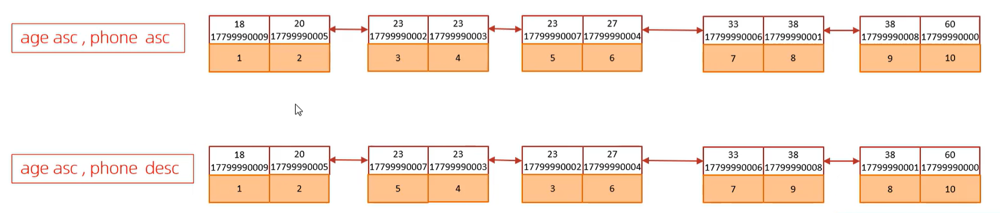


**order by要走联合索引 就不能违背最左前缀法则（这里是要按顺序的）**

```sql
比如联合索引创建语句是：
CREATE INDEX idx_user_age_phone on tb_user(age, phone);

explain select id, age, phone from tb_user order by age, phone;//符合最左前缀法则
explain select id, age, phone from tb_user order by phone, age;//违背了最左前缀法则
explain select id, age, phone from tb_user order by age asc, phone desc;//这种情况，age会走Using index ；phone会走Using filesort（有额外的排序）
```

> ```
> CREATE INDEX idx_user_age_phone_ad on tb_user(age asc, phone desc);
> ```
>
> （默认情况下，两个字段都是升序排列）但如果这样创建索引，第三条sql就不会再排一次


如果没有使用覆盖索引，就会回表查询，获取行数据之后再在排序缓冲区中排序 (Using filesort 级别)

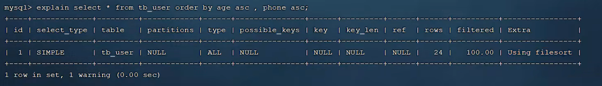


总结：

* 根据排序字段建立合适的索引，多字段排序时，也遵循最左前缀法则
* 尽量使用覆盖索引
* 多字段排序，一个升序一个降序，此时需要注意联合索引在创建时的规则 (ASC/DESC)
* 如果不可避免的出现 filesort ，大数据量排序时，可以适当增加排序缓冲区的大小（sort_buffer_size（默认256k））


#### group by优化

* 分组操作时，也可以通过索引来提高效率
* 分组操作中，索引的使用也要满足最左前缀法则

```sql
# 查看执行计划——根据profession分组
explain select profession, count(*) from tb_user group by profession;
# Using temporary（使用临时表）

# 创建索引
CREATE INDEX idx_user_pro_age_sta on tb_user(profession, age, status);
# 查看执行计划——根据profession字段分组
explain select profession, count(*) from tb_user group by profession;
# Using index;

# 查看执行计划——根据profession字段分组
explain select age, count(*) from tb_user group by age;
# Using index;Using temporary（不满足最左前缀法则）
# 其中Using index的含义是：查询所需的所有列（ GROUP BY 的列）都包含在这个联合索引的 B+ Tree 结构中（仅意味着不用回表查询）

# 查看执行计划——根据profession，age字段分组
explain select profession, count(*) from tb_user group by profession,age;
# Using index（满足最左前缀法则）

explain select age, count(*) from tb_user where profession = '软件工程' group by age;
# Using index（满足最左前缀法则）

```


#### limit优化

> 面试会问⬆️

* **分页查询一定有排序吗？**
  分页查询不一定会有 `order by` 字段，但是业务上的分页查询语句肯定都是有 `order by` 的，否则仅仅limit返回的顺序是不确定的，是物理存储顺序，每次查询结果可能不同
  例：`SELECT * FROM t ORDER BY id LIMIT 100,10`
  在分页查询sql语句一定有 `order by` 字段的前提下：

  * 若 `order by` 字段有索引
    ——无额外排序，只是”按索引顺序遍历“
  * 若 `order by` 字段无索引
    ——需要在排序缓冲区排序 (filesort)

* **为什么深度分页效率低？**

  | 步骤   | 组件       | 关键动作                                                     | 与深度分页的关联                                             |
  | ------ | ---------- | ------------------------------------------------------------ | ------------------------------------------------------------ |
  | 1️⃣ 连接 | 连接器     | 验证用户/密码，检查权限，分配线程                            | 无                                                           |
  | 2️⃣ 缓存 | 查询缓存   | （MySQL 8.0 已移除）                                         | 无                                                           |
  | 3️⃣ 解析 | 分析器     | 词法分析 → 语法分析 → 生成解析树                             | 确认 `ORDER BY id` 和 `LIMIT` 语法合法                       |
  | 4️⃣ 优化 | 优化器     | 生成执行计划： - 选索引（主键聚簇索引） - 确定扫描方向       | 决定“按 id 顺序扫描聚簇索引”                                 |
  | 5️⃣ 执行 | **执行器** | 循环调用存储引擎： ① 要第1行 → 引擎返回完整行 → 执行器计数=1 ② 要第2行 → ... ... ⑩ 要第1,000,010行 → 引擎返回 → 执行器丢弃前1,000,000行，保留最后10行 | ❗ 深度分页瓶颈所在： - 执行器需处理 1,000,010 行完整数据 - 每行解析、内存暂存、丢弃 → CPU/内存爆炸 |
  | 6️⃣ 返回 | 执行器     | 将10行结果封装，通过连接器返回客户端                         | 无                                                           |
  | 7️⃣ 断开 | 连接器     | （若设置 wait_timeout）释放连接                              | 无                                                           |

  


大数据量下，越往后，分页效率越低(limit 20,10    ->   limit 200000,10)

> 比如 `select s.* from tb_sku s order by created_at limit 2000000,10;`
>
> 此时只用查询10条数据，但是要对200万条数据都排序，最终才通过limit字段获取出需要的 10条数据

> 就像你要在一本 200 万页的书里找第 200001 到 200010 页的内容，
> 你必须一页一页翻过去，直到翻到那 10 页为止。
> 即使你只关心最后 10 页，你也得翻前面 20 万页！


##### 优化方式：覆盖索引+子查询

* 覆盖索引：两次覆盖，子查询中只返回主键id (第一次覆盖索引)，主查询中利用主键id作为条件(聚簇索引叶子节点包含完整数据行，第二次覆盖索引)
* 子查询：根据order by 条件先获取一个主键 id 的集合

```sql
例如：
select s.* from tb_sku s order by id limit 2000000,10;

select s.* from tb_sku s, (select id from tb_sku order by id limit 2000000,10) a where s.id = a.id;
```

> 子查询只查出主键id的集合（实现了覆盖索引的效果），主查询通过主键 id，直接在聚集索引中获取行数据
>
> 避免了原sql语句的低性能全表扫描


###### 为什么“覆盖索引+子查询”会比正常的分页查询更高效？

（以下情形是 两者都对 `order by`的字段创建了索引来提升效率，同时这也是本方法能提高效率的前提）

正常的分页查询：`SELECT * FROM table ORDER BY indexed_col LIMIT offset, size`
“覆盖索引+子查询”优化指的是：`SELECT t.* FROM table t INNER JOIN (SELECT id FROM table ORDER BY indexed_col LIMIT offset, size) tmp ON t.primary_key = tmp.id`（注意：子查询中SELECT的字段<u>必须是覆盖索引包含的，且能用于关联</u>，通常是主键）

> ```sql
> SELECT t.* FROM table t INNER JOIN (SELECT id FROM table ORDER BY id LIMIT offset, size) tmp ON t.primary_key = tmp.id
> 
> SELECT t.* FROM table t INNER JOIN (SELECT id FROM table ORDER BY balance LIMIT offset, size) tmp ON t.primary_key = tmp.id
> ```

  

1. 正常分页查询的执行过程（以InnoDB为例）：

   - 由于ORDER BY indexed_col有索引，MySQL会使用该索引进行扫描（避免filesort）。
   - 但是，因为SELECT *，需要回表获取完整行数据。
   - 执行步骤：
     a. **从索引中按顺序读取(offset + size)条记录（即5000010条）**。
     b. 对于每一条索引记录，**根据主键（或聚簇索引）回表查询完整行数据（即5000010次回表）**。
     c. **将这5000010条完整行数据放入结果集**
     d. **丢弃前offset条（5000000条），返回最后size条**（10条）。
   - 问题：回表5000010次，且丢弃了5000000条完整行数据，浪费了大量I/O和CPU。【回表次数太多】

2. 覆盖索引+子查询

   - 子查询：

     ```sql
     SELECT id FROM table ORDER BY indexed_col LIMIT offset, size
     ```

     - 由于SELECT的字段（id）在索引中（覆盖索引），所以**子查询只需要扫描索引，不需要回表**。
     - 扫描索引，按顺序读取(offset + size)条索引记录（5000010条），但只获取索引中的主键id，不回表。
     - 丢弃前offset条，返回最后size条（10条）主键值。

   - 外层查询：用这10个主键值，通过主键索引（聚簇索引）回表查询完整行数据（10次回表）。

   - 总回表次数：10次。

> 另外，在正常分页查询中，**如果ORDER BY的字段是聚簇索引(主键)**，此时不需要回表查询，**但 SELECT * 会读取整行数据**，假设是 `limit 100000,10`，执行器中需要处理100010条完整数据行  压力极大；而子查询中，仅提取 `id` ，执行器只用处理1000010个id+10行完整数据，而id通常很小（8字节），所以内存和CPU开销更低
>
> 因此此时覆盖索引+子查询效率仍然更高


###### 注意：

**对 `ORDER BY` 字段创建索引是 ”覆盖索引+子查询“能提升查询效率的前提**，没有这个索引，第一次覆盖查询就无从谈起

当 **`ORDER BY` 字段无任何索引** 时，“覆盖索引+子查询”优化 **不仅不会提升效率，反而通常比正常分页查询更慢**。【关键：两种方式均需全表扫描 + filesort】

由于 `ORDER BY non_indexed_col` 无索引，**两者都必须进行全表扫描 + 外部排序（filesort）**，<u>无法避免对全表 N 行数据的处理</u>

执行过程对比（以 InnoDB 为例）

| **环节**          | **正常分页查询** `SELECT * FROM t ORDER BY col LIMIT offset, size` | **“覆盖索引+子查询”** `SELECT t.* FROM t JOIN (SELECT id FROM t ORDER BY col LIMIT offset, size) tmp ...` |
| ----------------- | ------------------------------------------------------------ | ------------------------------------------------------------ |
| **排序阶段**      | filesort 处理 `(排序键, 主键)` 对；全表扫描、全量排序        | 子查询 filesort 同样处理 `(排序键, 主键)` 对；全表扫描，全量排序 |
| **回表次数**      | 排序后通过主键回表 **size 次**（取最终结果行）               | 外层查询通过主键回表 **size 次**（取最终结果行）             |
| **额外开销**      | 无                                                           | 子查询需物化为临时表（存 size 个 id） <br />额外 JOIN 操作 <br />查询解析/执行计划更复杂 |
| **内存/磁盘压力** | 取决于 `sort_buffer_size`，但处理数据量与子查询相同          | 相同排序压力 + 临时表 I/O（虽小但存在）                      |


- **子查询只查 `id`，排序时数据量更小？**
  **事实**：MySQL 的 filesort 优化机制（5.6+）在 `SELECT *` 且无覆盖索引时，**默认仅存储 `(排序键, 主键)`** 进行排序，而非整行数据。因此两者的排序数据量**完全相同**。
- **“覆盖索引”失效**：子查询中 `SELECT id` 本可构成覆盖索引，但因 `ORDER BY non_indexed_col` 无索引，**无法避免回表扫描聚簇索引获取排序值**，覆盖索引优势彻底丧失。
- 所以此时“覆盖索引+子查询” 因临时表+JOIN 增加固定开销，通常略慢


 


##### 游标分页


##### 滚动分页


#### 避免索引失效

检查是否有 会让索引失效的 操作

> 研究where 之后的部分


1. 在**索引列上进行运算操作**，索引将失效
2. **字符串类型的字段**，**没加单引号**，索引将失效
3. 模糊查询：如果仅仅是尾部模糊匹配，索引不会失效，如果是**头部模糊匹配**，索引失效
   (%string会失效，string%不会失效)
4. **or连接的条件**
   用or分割开的条件，如果or前的条件中的列有索引，而后面的列中没有索引，那么涉及的索引都不会被用到
5. 有时mysql会根据字段的数据分布情况判断是否要走索引，如果mysql评估  走全表扫描比走索引更快，此时 索引也会失效
   (如果判断全表扫描效率更高，就全表扫描)
6. **避免直接使用`select *`**


#### insert语句优化


**一条语句批量插入  而不是  多条语句插入**

> 如果要批量插入，一次性插入的数据也不建议超过1000条（500-1000）
>
> 更大的数据量、把它分成多条语句插入

```sql
insert into test values(1, 'tom');
insert into test values(1, 'cat');
insert into test values(1, 'jerry');

insert into test values(1, 'tom'), (2, 'Cat'), (3, 'Jerry');
```


**改成手动提交事务**

MySQL的事务默认自动提交，这意味着你执行完一个insert语句之后，事务就会自动提交；这就会涉及到频繁的事务开启与提交，所以建议手动提交事务，避免多次提交事务

```sql
start transaction
insert into tb_test value(1, 'Tom'),(2, 'Cat'),(3,'jerry');
insert into tb_test value(4, 'Tom'),(5, 'Cat'),(6,'jerry');
insert into tb_test value(7, 'Tom'),(8, 'Cat'),(9,'jerry');
commit
```


**主键顺序插入**

采用主键顺序插入，顺序插入的性能高于乱序插入

```
主键乱序插入：8  1  9  21  88  2  4  15  89  5   7   3
主键顺序插入：1  2  3  4   5   6  7  8   9   15  21  88  89
```


**(load指令大批量插入)**

如果一次性需要插入大批量数据，使用insert语句插入性能较低，此时可以使用MySQL数据库提供的load指令进行插入，操作如下：

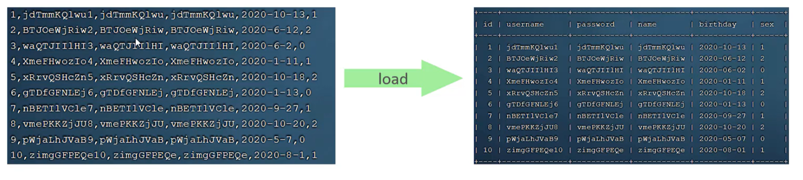

```sql
# 客户端连接服务端时，加上参数 --local-infile
mysql --local-infile -u root -p

# 设置全局参数local_infile为1，开启从本地加载文件导入数据库的开关
select @@local_infile;
set global local_infile = 1;

# 执行load指令将准备好的数据，加载到表结构中
load data local infile '/root/sql1.log' into table 'tb_user' fields terminated by ';' lines terminated by '\n'; 
# (指令中说明了，每一个字段使用';'分隔， 每一行使用'\n'分隔)
```

> load插入的时候，使用主键顺序插入，顺序插入的性能高于乱序插入


#### 主键优化


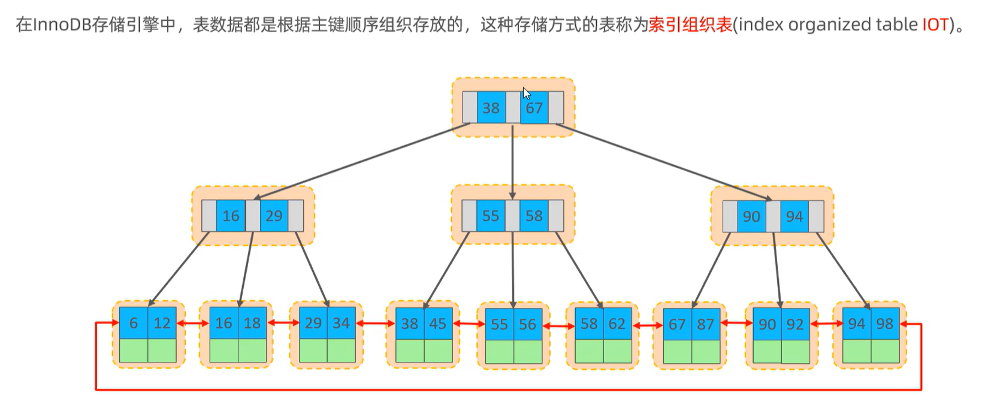

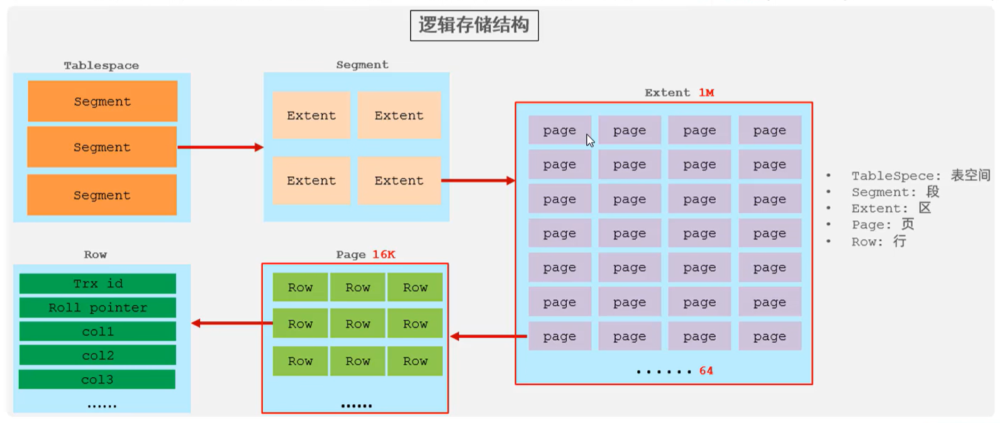


**页分裂现象**

页可以为空，也可以填充一半，也可以填充100%。每个页包含了 2~N 行数据 (如果一行数据过大，会行溢出)

<u>主键顺序插入：</u>

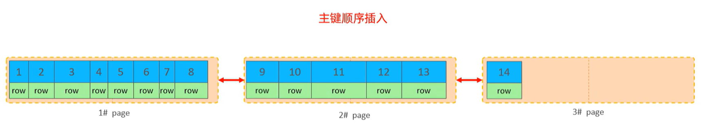


<u>主键乱序插入：</u>

主键乱序插入的情况下可能发生页分裂现象 (需要移动数据、调整链表指针)

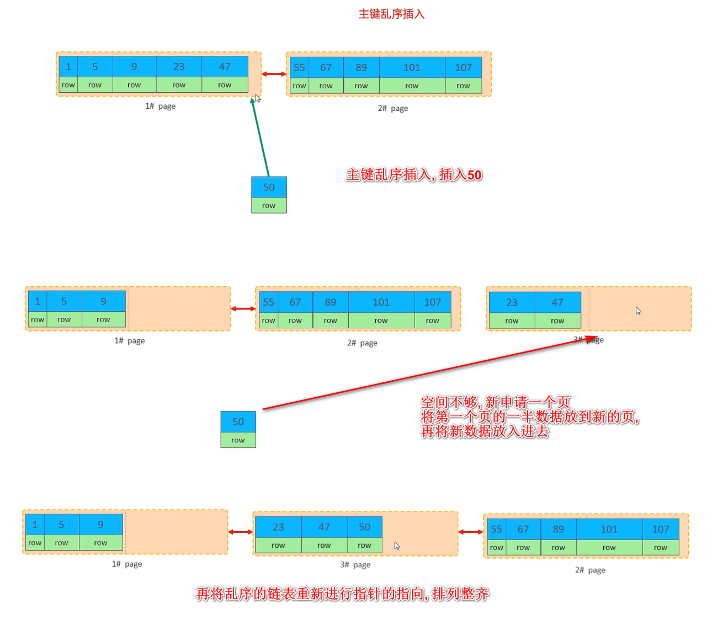


**页合并**

当删除一行记录时，实际上记录并没有被物理删除，只是记录被标记为删除并且它的空间变得允许被其他记录声明使用

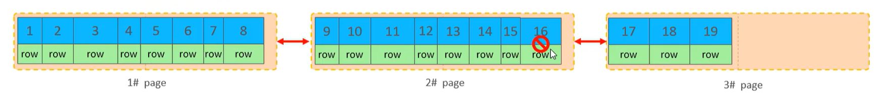

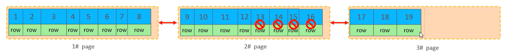

当页中删除的记录达到 MERGE_THRESHOLD（默认为页的 50%），InnoDB 就会寻找靠近的页(前/后) 看看是否可以将两个页合并以优化空间使用

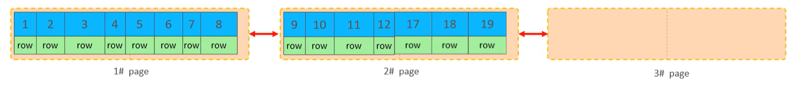

> MERGE_THRESHOLD，合并页的阈值，可以在创建表或者创建索引时指定


#### 主键设计原则

1. 满足业务需求的情况下，尽量降低主键的长度

   > 二级索引中挂的是主键的值，**如果主键长度比较长、二级索引比较多，就会占用较大磁盘空间  在搜索的时候耗费大量的磁盘IO**

2. 插入数据时，尽量选择**顺序插入**，选择使用AUTO_INCREMENT自增主键

   > 避免出现页分裂现象

3. 尽量不要使用UUID或其他自然主键(如身份证号) 作为主键

   > UUID无序，插入的时候就是乱序插入 存在页分裂现象
   >
   > 身份证号 长度较长，会耗费大量磁盘IO

4. 业务操作时，避免对主键的修改

   > 修改主键 还需要动对应的索引结构，代价很大


#### update语句优化


```sql
update course set name = 'JavaEE' where id = 1;# 会给id为1的这行加上行锁 
update course set name = 'Kafka1' where id = 4;# 不影响这条语句的更新

update course set name = 'SpringBoot' where name = 'PHP';# 由于name这个字段没有索引，会加个表锁
update course set name = 'Kafka2' where id = 4;# 此时就会影响这条语句就的 正常执行
```

**InnoDB的行锁是针对索引加的锁，不是针对记录加的锁，并且该索引不能失效，否则会从行锁升级为表锁**


**总结：更新某个字段是一定要走索引，否则会走全表扫描   变成表级锁**

**——执行update如果条件字段没有索引 会进行全表扫描，就会上表锁，所以<u>在update的sql的条件尽量要使用有索引的字段</u>**

> 表锁的并发性能低


#### count优化

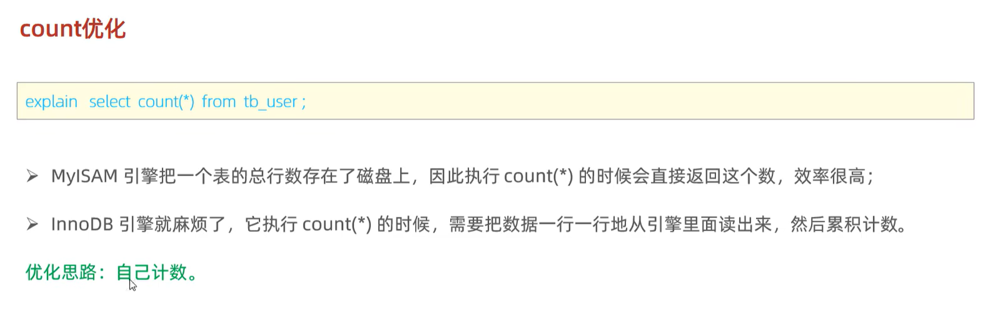

> “自己计数”指自己建一张表，专门计数、并添加维护的逻辑


**count的几种用法以及几种用法之间的性能差异**


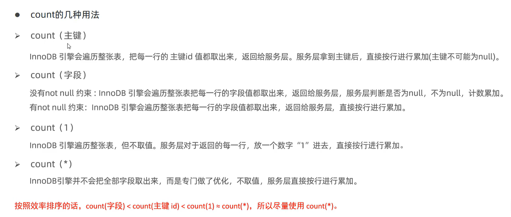

所以**选择count(*)**


### 2.添加索引


==**索引创建原则**==

1. 针对**数据量较大**，且**查询比较频繁的表**建立索引

   > 一百多万的数据量算大

2. 针对常作为**查询条件(where)、排序(order by)、分组(group by)操作的字段**建立索引

3. 尽量选择**区分度高的列**作为索引，尽量建立唯一索引，**区分度越高，使用索引的效率越高**

   > 常见区分度高的字段：用户名、手机号、身份证号
   >
   > 区分度不高的字段：关于状态的字段、关于逻辑删除的字段

4. 如果是字符串类型的字段，字段的长度较长，可以针对于字段的特点，建立前缀索引

5. **尽量使用联合索引**，减少单列索引，查询时，联合索引很多时候可以覆盖索引，节省存储空间，避免回表，提高查询效率

6. 创建**联合索引**的时候还需要**考虑字段顺序**

7. **尽量使用覆盖索引**（查询使用了索引，并且需要返回的列，在该索引中已经全部能找到）

8. 要**控制索引的数量**，索引并不是多多益善，索引越多，维护索引结构的代价也就越大，会影响增删改的效率

   > 只创建必要的索引，没必要的索引不创建  会影响增删改的效率

9. 如果索引列不能存储NULL值，请在创建表的时候使用**NOT NULL**约束它，当优化器知道每列是否包含NULL值时，它可以更好地确定哪个索引最有效地用于查询

**使用案例**


> 由于sn这个字段没有索引，所以执行效率较低（21s）
>
> 给sn这个字段加了索引之后(`create index idx_sku_sn on tb_sku(sn)`)，时间优化到0.01s
>
> 


## 主从复制、读写分离


## 分库分表


