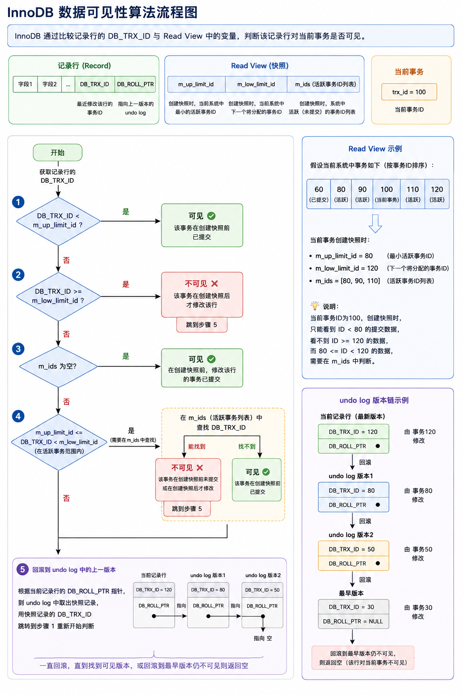
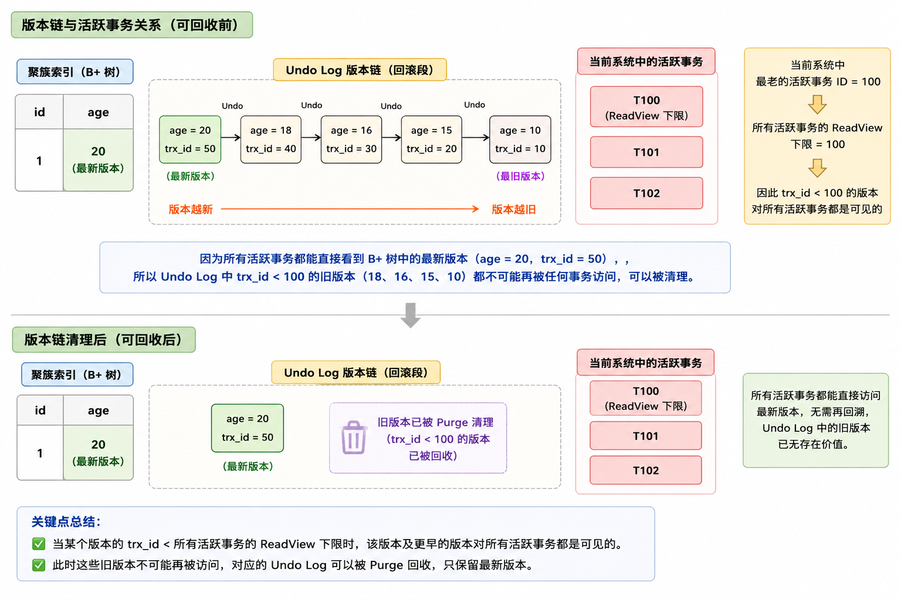

#article/myblog


# MVCC的作用

* 通过 ReadView 和 undolog，解决并发事务的**脏读、不可重复读、幻读**问题
* 隔离级别中的读已提交和可重复读都依赖于MVCC机制
* 事务四大特性中的<u>隔离性</u>也是通过 MVCC+锁机制 来保证的


# 基础知识


## 核心组成

`MVCC` 的实现依赖**隐藏字段、Read View、undo log**


### 隐藏字段

`InnoDB` 存储引擎为每行数据有三个 [隐藏字段](https://dev.mysql.com/doc/refman/5.7/en/innodb-multi-versioning.html)：

- **`DB_TRX_ID（6字节）`**：表示最后一次插入或更新该行的事务 id。此外，`delete` 操作在内部被视为更新，只不过会在记录头 `Record header` 中的 `deleted_flag` 字段将其标记为已删除

- **`DB_ROLL_PTR（7字节）`** 回滚指针，指向该行的 `undo log` 。如果该行未被更新，则为空

  > 刚刚新增的数据是没有 `undo log` 的

- `DB_ROW_ID（6字节）`：如果没有设置主键且该表没有唯一非空索引时，`InnoDB` 会使用该 id 来生成聚簇索引


### ReadView

[`Read View`](https://github.com/facebook/mysql-8.0/blob/8.0/storage/innobase/include/read0types.h#L298) 主要是**用来做可见性判断**，里面保存了 “当前对本事务不可见的其他活跃事务”

主要有以下字段：

- `m_low_limit_id`：目前出现过的**最大的事务 ID+1**，即下一个将被分配的事务 ID。**大于等于这个 ID 的数据版本均不可见**

  > 如果某个数据版本大于等于这个 ID，说明在创建ReadView的时候还没有这个事务

- `m_up_limit_id`：活跃事务列表 `m_ids` 中**最小的事务 ID**，如果 `m_ids` 为空，则 `m_up_limit_id` 为 `m_low_limit_id`。**小于这个 ID 的数据版本均可见**

  > 如果某个数据版本小于这个 ID ，说明这个数据版本已经提交了，对当前ReadView可见

- `m_ids`：`Read View` 创建时 *其他未提交的**活跃事务 ID 列表***。创建 `Read View`时，将当前未提交事务 ID 记录下来，后续即使它们修改了记录行的值，对于当前事务也是不可见的。`m_ids` 不包括当前事务自己和已提交的事务（正在内存中）

- `m_creator_trx_id`：创建**该** `Read View` 的**事务 ID**


### Undo Log

核心使命：

1. **回滚（Rollback）：** 事务失败了，得把数据改回去——**每当我们要对一条记录做改动时 (这里的改动可以指 `INSERT、DELETE、UPDATE`)，都需要把回滚时所需的东西记下来**
   1. 当插入一条记录时，至少要把这条记录的主键值记下来，之后回滚的时候只需要把这个主键值对应的记录删掉就好了。(对于每个 `INSERT`, InnoDB 存储引擎会执行一个 `DELETE`)
   2. 当修改一条记录时、，至少要把修改这条记录前的旧值都记录下来，这样之后回滚时再把这条记录更新为旧值就好了。(对于每个 `UPDATE`，InnoDB 存储引擎会执行一个 `相反的UPDATE`，将修改前的行放回去)
   3. 当删除一条记录时，至少要把这条记录中的内容都记下来，这样之后回滚时再把由这些内容组成的记录插入到表中就好了。(对于每个 `DELETE`, InnoDB 存储引擎会执行一个 `INSERT`)

2. **快照读（MVCC）：** 当一个事务发现当前记录（B+ 树里的最新数据）对自己“不可见”时，顺着 `roll_pointer` 指针去 Undo Log 里找那个“可见”的历史版本


**`insert undo log`**：在 `insert` 操作中产生的 `undo log`。因为 <u>`insert` 操作的记录只对事务本身可见，对其他事务不可见，故该 `undo log` 可以在事务提交后直接删除</u>。

（`insert undo log` 只用于回滚）

**`insert` 时的数据初始状态：**


**`update undo log`**：`update` 或 `delete` 操作中产生的 `undo log`。该 `undo log`可能需要提供 `MVCC` 机制，因此不能在事务提交时就进行删除。提交时放入 `undo log` 链表，等待 `purge线程` 进行最后的删除

**数据第一次被修改时：**


**数据第二次被修改时：**


版本链的形成过程：不同事务或者相同事务的对同一记录行的修改，会使该记录行的 `undo log` 成为一条链表，链首就是最新的记录，链尾就是最早的旧记录


## 一致性非锁定读和锁定读

### 一致性非锁定读

对于 [**一致性非锁定读（Consistent Nonlocking Reads）**](https://dev.mysql.com/doc/refman/5.7/en/innodb-consistent-read.html)的实现，通常做法是加一个版本号或者时间戳字段，在更新数据的同时版本号 + 1 或者更新时间戳。查询时，将当前可见的版本号与对应记录的版本号进行比对，如果记录的版本小于可见版本，则表示该记录可见

在 `InnoDB` 存储引擎中，[多版本控制 (multi versioning)](https://dev.mysql.com/doc/refman/5.7/en/innodb-multi-versioning.html) 就是对非锁定读的实现。如果读取的行正在执行 `DELETE` 或 `UPDATE` 操作，这时读取操作不会去等待行上锁的释放。相反地，`InnoDB` 存储引擎会去读取行的一个快照数据，对于这种读取历史数据的方式，我们叫它快照读 (snapshot read)

在 `Repeatable Read` 和 `Read Committed` 两个隔离级别下，如果是执行普通的 `select` 语句（不包括 `select ... lock in share mode` ,`select ... for update`）则会使用 `一致性非锁定读（MVCC）`。并且在 `Repeatable Read` 下 `MVCC` 实现了可重复读和防止部分幻读

### 锁定读

如果执行的是下列语句，就是 [**锁定读（Locking Reads）**](https://dev.mysql.com/doc/refman/5.7/en/innodb-locking-reads.html)

- `select ... lock in share mode`
- `select ... for update`
- `insert`、`update`、`delete` 操作

在锁定读下，读取的是数据的最新版本，这种读也被称为 `当前读（current read）`。锁定读会对读取到的记录加锁：

- `select ... lock in share mode`：对记录加 `S` 锁，其它事务也可以加`S`锁，如果加 `x` 锁则会被阻塞

- `select ... for update`、`insert`、`update`、`delete`：对记录加 `X` 锁，且其它事务不能加任何锁

在一致性非锁定读下，即使读取的记录已被其它事务加上 `X` 锁，这时记录也是可以被读取的，即读取的快照数据。上面说了，在 `Repeatable Read` 下 `MVCC` 防止了部分幻读，这边的 “部分” 是指在 `一致性非锁定读` 情况下，只能读取到第一次查询之前所插入的数据（根据 Read View 判断数据可见性，Read View 在第一次查询时生成）。但是！如果是 `当前读` ，每次读取的都是最新数据，这时如果两次查询中间有其它事务插入数据，就会产生幻读。所以， **`InnoDB` 在实现`Repeatable Read` 时，如果执行的是当前读，则会对读取的记录使用 `Next-key Lock` ，来防止其它事务在间隙间插入数据**


## 数据可见性算法

> 数据可见性算法：如何根据ReadView和当前记录行的 `DB_TRX_ID`判断 当前记录行是否对事务可见

在 `InnoDB` 存储引擎中，创建一个新事务后，执行每个 `select` 语句前，都会创建一个快照（Read View），**快照中保存了当前数据库系统中正处于活跃（没有 commit）的事务的 ID 号**。其实简单的说保存的是系统中当前不应该被本事务看到的 事务 ID 列表（即 m_ids）。当用户在这个事务中要读取某个记录行的时候，`InnoDB` 会将该记录行的 `DB_TRX_ID` 与 `Read View` 中的一些变量及当前事务 ID 进行比较，判断是否满足可见性条件




1. 如果记录 DB_TRX_ID < m_up_limit_id，那么表明最新修改该行的事务（DB_TRX_ID）<u>在当前事务创建快照之前就提交了，所以该记录行的值对当前事务是可见的</u>

2. 如果 DB_TRX_ID >= m_low_limit_id，那么表明最新修改该行的事务（DB_TRX_ID）**在当前事务创建快照之后才修改该行，所以该记录行的值对当前事务不可见**。跳到步骤 5

3. m_ids 为空，则表明在当前事务创建快照之前，修改该行的事务就已经提交了，所以该记录行的值对当前事务是可见的

4. 如果 **m_up_limit_id <= DB_TRX_ID < m_low_limit_id**，表明最新修改该行的事务（DB_TRX_ID）在 Read View 创建之前就已经分配出去了 (在创建快照的时候可能处于“活动状态”或“已提交状态”)；所以就要对活跃事务列表 m_ids 进行查找（源码中是用的二分查找，因为是有序的）

   - 如果**在活跃事务列表 m_ids 中能找到 DB_TRX_ID**，可能有两种情况：
     ① 在当前事务<u>创建快照前</u>，该记录行的值被事务 ID 为 DB_TRX_ID 的事务修改了，但**没有提交 **；
     ② 在当前事务<u>创建快照后</u>，该记录行的值被事务 ID 为 DB_TRX_ID 的事务修改了。这些情况下，这个记录行的值对当前事务都是不可见的。跳到步骤 5

     > ①②情况都说明这行数据 **属于没有提交的数据(在创建这个快照的时候是未提交的)**

   - 在活跃事务列表中找不到，则表明“id 为 trx_id 的事务”在修改“该记录行的值”后，**在“当前事务”创建快照前就已经提交了**，<u>所以记录行对当前事务可见</u>

5. 在该记录行的 DB_ROLL_PTR 指针所指向的 `undo log` 取出快照记录，用快照记录的 DB_TRX_ID 跳到步骤 1 重新开始判断，直到找到满足的快照版本或返回空

> 自己的更新记录总是可见(即 `trx_id == creator_trx_id` 时可见)

**这种通过「版本链」来控制并发事务访问同一个记录时的行为就叫 MVCC（多版本并发控制）**


## RC 和 RR 隔离级别下 MVCC 的差异


RC和RR的隔离级别都使用快照读，关键差异在于生成 `Read View` 的时机‘不同

- RC 隔离级别下的 **`每次select` 查询前都生成一个`Read View`** (m_ids 列表)
- RR 隔离级别下只在**事务开始后 `第一次select` 数据前生成一个`Read View`**（m_ids 列表）

  > 通过使用同一个 ReadView 来判断数据可见性，实现可重复读（每次读取的都是同一个快照）


# 常见问题整理


## 1. 基础概念类

#### 什么是 MVCC？它的作用是什么？

**A：** MVCC（Multi-Version Concurrency Control，多版本并发控制）是一种并发控制机制，通过在每行数据维护多个版本，在保证事务隔离性的前提下提高数据库并发性能。

**核心作用：**

- **读操作使用快照读取，不阻塞写操作**
- **写操作创建新版本，不阻塞读操作**
- 实现 RC 和 RR 隔离级别下的快照读


#### 什么是快照读和当前读？

**A：**

| 类型                        | 定义                                           | 场景                                                         |
| --------------------------- | ---------------------------------------------- | ------------------------------------------------------------ |
| **快照读**（Snapshot Read） | 读取的是历史版本数据，基于 ReadView 判断可见性 | 普通 `SELECT` 语句                                           |
| **当前读**（Current Read）  | 读取的是最新版本数据                           | `SELECT...LOCK IN SHARE MODE`、`SELECT...FOR UPDATE`、INSERT、UPDATE、DELETE |

**关键区别：** 快照读不加锁，当前读会对读取的记录加锁。


## 2. InnoDB 实现细节

#### InnoDB 中 MVCC 依赖哪些核心组件？

**A：** 依赖三个核心组件：**隐藏字段、ReadView、undo log**

```
数据行 ──→ 隐藏字段 ──→ DB_TRX_ID（最后一次修改的事务ID）
              └──→ DB_ROLL_PTR（回滚指针，指向undo log）
              └──→ DB_ROW_ID（聚簇索引ID）

ReadView ──→ m_low_limit_id（最大事务ID+1）
         ──→ m_up_limit_id（活跃事务最小ID）
         ──→ m_ids（活跃事务ID列表）
         ──→ m_creator_trx_id（创建该视图的事务ID）
```


#### InnoDB 行记录的三个隐藏字段分别是什么？作用是什么？

**A：**

| 字段          | 大小  | 作用                                                         |
| ------------- | ----- | ------------------------------------------------------------ |
| `DB_TRX_ID`   | 6字节 | 记录最后一次插入或更新该行的事务ID；DELETE操作在内部被视为更新 |
| `DB_ROLL_PTR` | 7字节 | 回滚指针，指向该行的 undo log；未被更新时为空                |
| `DB_ROW_ID`   | 6字节 | 当无主键且无唯一非空索引时，由InnoDB生成聚簇索引             |


#### ReadView 的各个字段含义是什么？

**A：**

| 字段               | 含义                                                         |
| ------------------ | ------------------------------------------------------------ |
| `m_low_limit_id`   | 目前出现过的最大事务ID+1，**大于等于这个ID的事务均不可见**   |
| `m_up_limit_id`    | 活跃事务列表中最小的事务ID，**小于这个ID的事务均可见**；若m_ids为空则等于m_low_limit_id |
| `m_ids`            | 创建ReadView时未提交的活跃事务ID列表（不包括当前事务和已提交事务） |
| `m_creator_trx_id` | 创建该ReadView的事务ID                                       |
| `m_low_limit_no`   | 事务Number，用于Purge线程判断哪些Undo Logs可以删除           |


#### undo log 分为哪两种？区别是什么？

**A：**

| 类型              | 产生时机          | 删除时机                              | 原因                                 |
| ----------------- | ----------------- | ------------------------------------- | ------------------------------------ |
| `insert undo log` | INSERT操作        | **事务提交后直接删除**                | 只对事务本身可见，对其他事务不可见   |
| `update undo log` | UPDATE/DELETE操作 | **提交后放入链表，等待purge线程删除** | 需要提供MVCC机制，可能被其他事务依赖 |

**注意：** 不同事务或相同事务对同一记录的修改，会形成 undo log 链表，链首是最新的记录，链尾是最早的旧记录。


#### undolog版本链不断累加不会导致内存爆炸吗？/ purge 线程的作用是什么？

不会，InnoDB 后台有专门的 Purge 线程定期进行回收不再需要的历史版本，从而释放空间

> 1. 删除 `insert undo log`：事务提交后即可删除
> 2. 删除 `update undo log`：当该undo log不再被任何 ReadView 使用时，由purge线程删除


##### 什么样的数据可以被回收

Purge 删除的是：

- 已提交事务产生的
- 并且未来不可能再被任何 Read View 访问到的
  （如果某一个数据版本的`trx_id`小于<u>所有 Read View 里面的最小活动事务id</u>，那么这个数据版本就是对当前数据库中所有事务都是可见的，它之前的旧版本数据就可以被删除）
- 历史版本 Undo Log

由于 InnoDB 只需要保留 **当前数据版本 和 那些仍然可能被活跃事务访问到的历史版本**（**<u>还可能被 Read View 访问</u>的版本**）

所以版本链中的某一版本对所有事务都是可见的，那么它之前的旧数据版本就都可以被清理，或者说：版本链中那些 对现在活跃事务都可见的 版本，我们只需要保留最新的那一个




> #### 为什么某个数据版本就是对当前数据库中所有事务都是可见的，它之前的旧版本数据就可以被删除？
>
> 区分 **“当前记录（最新数据）”** 和 **“Undo Log（历史版本）”**
>
> | 存储位置       | 内容         |
> | -------------- | ------------ |
> | 聚簇索引(B+树) | 当前最新数据 |
> | Undo Log       | 历史版本数据 |
>
> MVCC 查询时，会优先读取聚簇索引里的最新版本，如果对当前事务不可见，才会沿 Undo Log 版本链回溯历史版本
>
> 当你笔记里说“一个 Undo 版本 ID 小于所有活跃事务的 ReadView 下限”时，真正的含义是：**当前系统里所有的活跃事务，都能直接看到 B+ 树里的“最新版本”数据，而不需要去回滚段（Undo Log）里找更旧的版本。**
>
> #### 举个例子：
>
> 1. **初始状态：** 数据库里 `age = 18`。
> 2. **事务 A (ID=50)：** 把 `age` 改成了 `20`，并**提交**了。
>    - 此时，B+ 树里 `age = 20`。
>    - Undo Log 里存着 `age = 18`（为了让 ID < 50 的事务能看到 18）。
> 3. **系统现状：** 现在系统里最老的活跃事务是 **ID=100**。
>    - 根据 MVCC 规则，ID=100 的事务开启时，事务 A (ID=50) 已经提交了。
>    - 所以 ID=100 的事务能直接看到 B+ 树里的 `age = 20`。
>    - 比 ID=100 更年轻的事务（如 ID=101, 102...），自然也能看到 `age = 20`。
>
> **结论：** 既然现在全天下（所有活跃事务）都能直接看到最新的 `age = 20`，那躲在 Undo Log 里的 `age = 18` 还有谁会去读它吗？**没有了。** 既然没人读，也没法给已提交的事务回滚，它就是“死数据”，可以回收了。


#### MVCC 在哪些场景下会失效？

**A：** 以下场景会退化为锁定读（不再使用MVCC快照读）：

1. **`SELECT...FOR UPDATE` / `SELECT...LOCK IN SHARE MODE`** — 当前读
2. **`INSERT` / `UPDATE` / `DELETE` 操作** — 写操作
3. **锁定读读取的行正在执行 DELETE/UPDATE** — 等待锁释放
4. **`SERIALIZABLE` 隔离级别** — 强制锁定读
5. **显式加锁**：`LOCK IN SHARE MODE`、`FOR UPDATE`


## 3. 可见性判断算法

#### MVCC 的数据可见性算法流程是什么？

**A：** 判断某记录对当前事务是否可见的步骤：

```
1. 如果 DB_TRX_ID < m_up_limit_id
   → 该事务在ReadView创建前已提交，**可见**

2. 如果 DB_TRX_ID >= m_low_limit_id
   → 该事务在ReadView创建后修改，**不可见**，跳到步骤5

3. 如果 m_ids 为空
   → 没有活跃事务，**可见**

4. 如果 m_up_limit_id <= DB_TRX_ID < m_low_limit_id
   → 需要在m_ids中二分查找DB_TRX_ID
   ├─ 找到 → 该事务未提交或创建快照后修改，**不可见**，跳到步骤5
   └─ 找不到 → 该事务在创建快照前已提交，**可见**

5. 通过 DB_ROLL_PTR 找到undo log中的上一个版本
   → 重新从步骤1开始判断，直到找到可见版本或返回空
```


#### MVCC如何保证不读取到未提交事务的数据？

当一个事务执行读操作时，它会使用快照读取。ReadView中维护了一个活跃事务ID列表，如果某个版本的数据在活跃事务列表中，说明这行数据在创建快照的时候就是未提交的、对当前事务不可见


## 4. 隔离级别差异

#### RC 和 RR 隔离级别下 MVCC 的区别是什么？

**A：** 核心区别在于 **生成 ReadView 的时机不同**：

| 隔离级别                  | ReadView生成时机                                         | 结果       |
| ------------------------- | -------------------------------------------------------- | ---------- |
| **RC**（Read Committed）  | **每次SELECT前**都生成新的ReadView                       | 不可重复读 |
| **RR**（Repeatable Read） | 事务中**第一次SELECT前**生成，整个事务复用同一个ReadView | 可重复读   |

**举例说明：**

- 事务A开启，先查询得到数据X
- 事务B修改数据X并提交
- 事务A再次查询：
  - RC级别：新生成ReadView，事务B已提交，可见 → 返回新值（**不可重复读**）
  - RR级别：复用之前的ReadView，事务B不可见 → 返回旧值（**可重复读**）


### 幻读问题

#### MVCC和临键锁是如何解决幻读问题的？

MVCC通过快照读解决了快照读情况下的不可重复读的问题，并且在当前读中 对读取的记录使用了临键锁，让两次当前读之间的时间间隔中其他事务无法插入数据

> 在 `Repeatable Read` 下 `MVCC` 防止了部分幻读，这边的 “部分” 是指在 `一致性非锁定读` 情况下，只能读取到第一次查询之前所插入的数据（根据 Read View 判断数据可见性，Read View 在第一次查询时生成）。但是！如果是 `当前读` ，每次读取的都是最新数据，这时如果两次查询中间有其它事务插入数据，就会产生幻读。所以， **`InnoDB` 在实现`Repeatable Read` 时，如果执行的是当前读，则会对读取的记录使用 `Next-key Lock` ，来防止其它事务在间隙间插入数据**


#### 无法解决哪些幻读问题？


**1. 场景一：快照读升级为当前读（“修改幻读”）**

当一个事务在执行过程中，原本一直在用快照读，但突然执行了一条 `UPDATE` 语句，而这条语句刚好命中了另一个事务新插入并提交的记录。

**复现流程：**

| **时间** | **事务 A (Transaction A)**                                   | **事务 B / C (其他事务)**                          |
| -------- | ------------------------------------------------------------ | -------------------------------------------------- |
| T1       | `BEGIN;`                                                     |                                                    |
| T2       | `SELECT * FROM users WHERE id = 5;` (结果为空，快照读)       |                                                    |
| T3       |                                                              | `BEGIN;` (事务 B)                                  |
| T4       |                                                              | `INSERT INTO users (id, name) VALUES (5, 'Jack');` |
| T5       |                                                              | `COMMIT;` (事务 B 提交)                            |
| T6       | **`UPDATE users SET name = 'Rose' WHERE id = 5;`**           |                                                    |
| T7       | `SELECT * FROM users WHERE id = 5;` (**发现 id=5 的记录出现了！**) |                                                    |

**为什么会这样？**

- 在 T2 时，事务 A 生成了 ReadView，看不到 id=5。
- 在 T6 时，事务 A 执行 `UPDATE`。注意，**`UPDATE` 属于“当前读”**，它必须去寻找磁盘上最新提交的数据。它意外发现了事务 B 提交的 id=5 记录，并成功将其更新。
- 根据 MVCC 规则，当事务 A 更新了这条记录后，该记录的 **`DB_TRX_ID`（事务 ID）变成了事务 A 的 ID**。
- 在 T7 时，事务 A 再次 `SELECT`。MVCC 发现这条记录的事务 ID 就是当前事务自己，按照可见性原则，**自己改的数据必须可见**。 
- 于是，原本消失的记录“幻影般”地出现了。

> 该场景有点违和，因为事务 A 在看不见 id = 5 这条记录的情况下执行 update 更新了这条记录


**2. 场景二：先“快照读”，后“当前读”**

如果在同一个事务中，你先用普通 `SELECT`（快照读），后来又用了 `SELECT ... FOR UPDATE`（当前读），那么第二次读取的结果可能会多出数据。

**复现流程：**

1. **事务 A**：执行 `SELECT * FROM user WHERE id > 10;` (返回 3 条数据)。
2. **事务 B**：执行 `INSERT INTO user (id) VALUES (15); COMMIT;`。
3. **事务 A**：执行 `SELECT * FROM user WHERE id > 10 FOR UPDATE;` (返回 4 条数据！)。

**原因：**

- 第一次是快照读，受 ReadView 保护，看不到 T2 插入的数据。
- 第二次是当前读，它会直接扫描 B+ 树上的最新记录，并加锁。此时它看到了 T2 提交的数据。
- **Next-Key Lock 为什么没生效？** <u>因为在事务 A 第一次执行普通 `SELECT` 时，**它是不会加锁的**。</u>既然没加锁，事务 B 自然可以自由地插入数据。只有从一开始就使用 `SELECT ... FOR UPDATE`，临键锁才会把间隙锁死。


**3. 场景三：“当前读”能防幻读，但如果“间隙”没找对？**

如果你使用了当前读（如 `FOR UPDATE`），但你的过滤条件没有命中索引（导致全表扫描加锁），或者你的范围给得不够宽，依然防不住逻辑上的“幻”。

比如：

- 事务 A 锁住了 `id < 10` 的间隙。
- 事务 B 插入了 `id = 15` 的记录。
- 虽然不违反锁规则，但对于事务 A 来说，如果它的逻辑是“统计全表人数”，那么结果依然变了。


1. **混合读陷阱**：在同一个事务中，将**快照读**（普通 `SELECT`）与**当前读**（`UPDATE/DELETE/SELECT FOR UPDATE`）混合使用，是幻读发生的温床。
2. **自我标记效应**：如果当前事务通过“当前读”修改了其他事务新插入的记录，该记录会因为事务 ID 的变更而对当前事务变得可见。
3. **防御建议**：
   - 如果业务逻辑对幻读极度敏感，建议从事务开始的第一条语句就使用 `SELECT ... FOR UPDATE`（强制开启临键锁）。
   - 或者直接使用最严格的隔离级别：`SERIALIZABLE`（串行化）。


#### 为什么 RR 级别下能防止幻读，而 RC 不行？

| 特性                                | RR (可重复读)                                                | RC (读已提交)                                                |
| ----------------------------------- | ------------------------------------------------------------ | ------------------------------------------------------------ |
| 快照读 (普通 SELECT)                | MVCC + 固定 Read View 事务开始时生成一个“快照”，整个事务期间都只看这个旧版本，不管别人插入了什么新数据，我都看不见。 | MVCC + 最新 Read View 每次查询都生成一个新的“快照”，只要别人提交了，我立马就能看见。 |
| 当前读 (UPDATE/SELECT...FOR UPDATE) | MVCC + 间隙锁 (Next-Key Lock) 不仅锁住行，还锁住“空隙”。别人想在我查过的范围内插入新数据？门都没有。 | 仅记录锁 (Record Lock) 只锁住存在的行，不锁空隙。别人可以随时往空隙里插队，导致幻读。 |

| **时间** | **事务 A (Transaction A)**                                   | **事务 B / C (其他事务)**                                    |
| -------- | ------------------------------------------------------------ | ------------------------------------------------------------ |
| T1       | `BEGIN;`                                                     |                                                              |
| T2       | `SELECT * FROM users WHERE id = 5;` (结果为空，快照读)       |                                                              |
| T3       |                                                              | `BEGIN;` (事务 B)                                            |
| T4       |                                                              | `INSERT INTO users (id, name) VALUES (5, 'Jack');`           |
| T5       |                                                              | `COMMIT;` (事务 B 提交)                                      |
| T6       | **`UPDATE users SET name = 'Rose' WHERE id = 5;`**           |                                                              |
| T7       | `SELECT * FROM users WHERE id = 5;` (**发现 id=5 的记录出现了！**) |                                                              |
| T8       |                                                              | **`BEGIN; INSERT INTO users (id, name) VALUES (5, 'Zhao Liu'); COMMIT;`**<br/>*(假设事务 C 插入并提交新数据)* |
| T9       | **`SELECT \* FROM users WHERE id = 5;`**                     |                                                              |

**1. 阶段一：T1 - T5（普通查询阶段）**

- **场景**：事务 A 开启，查 id=5 为空。此时事务 B 插入 id=5 并提交。
- RR 的表现（防幻读）：
  - 在 T2 时刻，事务 A 生成了一个 **Read View（快照）**。
  - 当事务 B 在 T5 提交后，虽然数据在磁盘上存在了，但在事务 A 的眼里，id=5 这条数据的“版本号”比我的快照新，所以**我看不到它**。
  - **结果**：事务 A 依然觉得 id=5 是空的。
- RC 的表现（会幻读）：
  - RC 模式下，每次 `SELECT` 都会重新生成 Read View。
  - 如果在 T5 之后事务 A 再查一次，它会立刻看到事务 B 刚提交的 id=5。这就是**幻读**（或者说是不可重复读的一种表现）。

**2. 阶段二：T6（关键的 UPDATE 操作）**

- **动作**：事务 A 执行 `UPDATE users SET name = 'Rose' WHERE id = 5;`
- 原理（当前读）：
  - `UPDATE`、`DELETE` 或 `SELECT ... FOR UPDATE` 属于**当前读**，当前读不看旧快照，必须看最新的数据库状态，否则更新就覆盖掉别人的修改了。
  - 因此，事务 A 在 T6 这一刻，“穿越”到了现在，看到了事务 B 提交的 id=5，并将其更新为 'Rose'。
- RR 的防护（间隙锁）：
  - 在执行这个 UPDATE 时，InnoDB 会给 id=5 加上**临键锁（Next-Key Lock）**。这不仅锁住了 id=5 这一行，还锁住了它周围的“坑位”。
  - 这就意味着，从 T6 开始，直到事务 A 结束，**任何其他事务（如事务 C）都无法在 id=5 这个位置插入或修改数据**，会被阻塞

**3. 阶段三：T7 - T9（再次查询）**

- **场景**：事务 A 再次查询 id=5。
- RR 的表现：
  - **T7 (`SELECT`)**：虽然之前 `UPDATE` 看到了数据，但普通的 `SELECT` 依然遵循 T2 生成的旧快照。不过，因为事务 A 自己刚刚更新了这行数据（T6），InnoDB 有一个特殊规则：**自己能看见自己修改的最新版本**。所以这里能看到 'Rose'。
  - T8 & T9 (事务 C 尝试插入)：注意表格中的 T8，事务 C 试图插入 id=5。
    - 因为在 T6 时，事务 A 已经对 id=5 加了锁（排他锁）。
    - **事务 C 会被阻塞（卡住）**，直到事务 A 提交或回滚。
    - 所以，事务 A 在 T9 再次查询时，不会出现“突然多出一个由别人插入的 id=5”的情况。


#### 当前读为什么要加锁？加的是什么锁？

**A：** 当前读读取最新数据，为了防止并发修改造成数据不一致：

| 语句类型                      | 锁类型        | 说明                       |
| ----------------------------- | ------------- | -------------------------- |
| `SELECT...LOCK IN SHARE MODE` | S锁（共享锁） | 其他事务可加S锁，不能加X锁 |
| `SELECT...FOR UPDATE`         | X锁（排他锁） | 其他事务不能加任何锁       |
| `INSERT/UPDATE/DELETE`        | X锁           | 其他事务不能加任何锁       |

**注意：** 即使记录被其他事务加X锁，当前读仍然可以读取（快照读则需要回滚到历史版本）。


# 参考资料

* [https://javaguide.cn/database/mysql/innodb-implementation-of-mvcc.html](https://javaguide.cn/database/mysql/innodb-implementation-of-mvcc.html)
* https://xiaolincoding.com/mysql/transaction/mvcc.html#%E4%BA%8B%E5%8A%A1%E6%9C%89%E5%93%AA%E4%BA%9B%E7%89%B9%E6%80%A7
* [图文结合带你搞定MySQL日志之Undo log(回滚日志)-腾讯云开发者社区-腾讯云](https://cloud.tencent.com/developer/article/2220871)