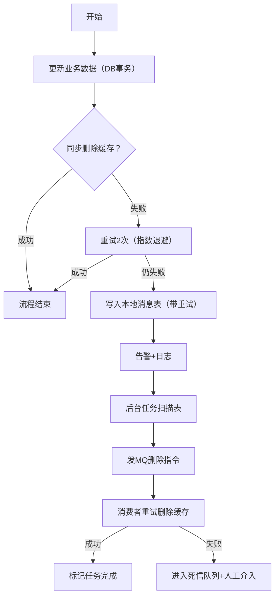

# 缓存与数据库的一致性问题


## 解决方案

> #### ——数据更新顺序及其一致性分析


### 先更新数据库，后更新缓存


操作失败引发的不一致：
如果数据库更新成功，缓存更新失败，那么此时数据库中是新值， 缓存中是旧值. 出现不一致


**高并发下的不一致问题：**
假设现在有线程A和线程B同时要进行更新操作，那么可能会这样： （1）线程A更新了数据库； 
（2）线程B更新了数据库； 
（3）线程B更新了缓存； 
（4）线程A更新了缓存； 
此时数据库是线程B更新的值, 缓存中是线程A的旧值. 出现不一致


### 先删除缓存，后更新数据库


**高并发下的不一致问题：**
假设同时有一个请求A进行更新操作，另一个请求B进行查询操作。 那么可能会这样: 
（1）请求A进行写操作，删除缓存； 
（2）请求B查询发现缓存不存在； 
（3）请求B去数据库查询得到旧值； 
（4）请求B将旧值写入缓存； 
（5）请求A将新值写入数据库； 
缓存和数据库不一致

> **即删除缓存后，查询请求在数据库更新前读到旧值并写入缓存**


### 先更新数据库，后删除缓存

> 旁路缓存模式


**操作失败引发的不一致：**
如果删除缓存失败，会导致缓存和数据库不一致

> **需要保证删除缓存的成功，或者有重试机制** => [如何确保该方案删除缓存的成功](####如何确保该方案删除缓存的成功)


**高并发下的不一致问题：**
假设现在有线程A和线程B同时要进行更新操作，那么可能会这样： （1）线程A**查询缓存未命中，查询数据库**； 
（2）线程B更新数据库； 
（3）线程B删除缓存； 
（4）线程A将查询结果写入缓存； 

> 前提是线程A缓存未命中（服务刚启动 且没有缓存预热；或 缓存刚好过期 且线程A查询数据库与线程B更新数据库并发  且线程B“更新+删除缓存”的时间比线程A“查询+写入缓存”的时间更短）
>
> 我们可以发现这种情况发生的概率非常之小，属于极端情况


**短暂的不一致问题：**
更新数据库后，删除缓存前，线程A查询缓存，查询到的就是旧数据

> 但这种短暂不一致在大多数业务中是可接受的


#### 如何确保该方案删除缓存的成功

> ——即 如何确保“更新数据库”与“删除缓存”这两个操作的原子性

**方案一(不可行)**：通过将更新操作和删除缓存操作放在同一个事务下，保证更新操作成功时 删除操作也能成功

| 问题             | 说明                                                         |
| ---------------- | ------------------------------------------------------------ |
| 事务回滚风险     | 缓存删除失败（如Redis超时）会导致整个数据库事务回滚 → 业务写入失败（**数据持久化是核心，不应因缓存问题牺牲**） |
| **性能瓶颈**     | **缓存操作（网络IO）阻塞数据库连接**，延长锁持有时间，高并发下极易引发数据库连接池耗尽 |
| 技术不可行       | Redis等缓存不支持XA协议，**无法与MySQL组成分布式事务**（Seata等框架对缓存操作支持极差） |
| **违背设计原则** | 缓存是旁路存储，其操作不应影响核心数据持久化流程             |


**方案二(主流)**：将删除缓存交给MQ（这个方案需要确保消息一定会发送给MQ），MQ自带重试机制 确保消息消费成功（但是这个方案的延迟应该比较大吧？）

##### **实践方案：同步重试+本地事务表+后台任务发MQ+消费者重试机制**

> 可监控+可补偿+有兜底




代码参考

```java
updateDB(data);
boolean deleted = false;

// 缓存操作独立执行，不参与事务
deleted = deleteWithRetry(key);

if (!deleted) {
    // 补偿: 写入本地消息表
    compensateService.recordDeleteTask(cacheKey);
            log.error("缓存删除失败，已触发补偿！key={}", cacheKey);
    // asyncSendDeleteMsg(key);
}
```

```java
@Transactional(rollbackFor = Exception.class)
public void updateDB(Object Data) {// 仅包含数据库操作的一个事务
    userMapper.update(data); 
}
```

```java
private static final int MAX_RETRIES = 2;
private static final long BACKOFF_MS = 50;
private StringRedisTemplate redisTemplate;

public boolean deleteWithRetry(String key) {
    for (int i = 1; i <= MAX_RETRIES; i++) {
        try {
            Boolean result = redisTemplate.delete(key);
            if (Boolean.TRUE.equals(result)) {
                log.info("缓存删除成功, key={}", key);
                return true;
            }
            // Redis返回false表示key不存在，也算成功
            if (Boolean.FALSE.equals(result)) return true; 
        } catch (RedisConnectionException e) {
            if (i == MAX_RETRIES) throw e; // 最后一次失败抛出
            sleep(BACKOFF_MS * (i + 1)); // 指数退避
        }
    }
    return false;
}
```

```java
@Autowired
private CacheDeleteTaskMapper taskMapper; // 操作本地消息表

// 写入本地消息表（含重试，避免补偿任务丢失）
public void recordDeleteTask(String cacheKey) {
    CacheDeleteTask task = new CacheDeleteTask();
    task.setCacheKey(cacheKey);
    task.setStatus("pending");
    task.setRetryCount(0);
    task.setCreateTime(new Date());

    for (int i = 0; i < 3; i++) {
        try {
            taskMapper.insert(task); // 单独小事务
            log.info("补偿任务记录成功, key={}", cacheKey);
            return;
        } catch (Exception e) {
            log.error("记录补偿任务失败, 重试={}", i + 1, e);
            if (i == 2) {
                // 三次均失败：紧急告警！依赖TTL兜底
                AlertUtil.sendCriticalAlert("补偿任务持久化失败！key=" + cacheKey);
            }
        }
    }
}
```

本地消息表结构 ⬇️

```sql
CREATE TABLE `cache_delete_task` (
  `id` BIGINT AUTO_INCREMENT PRIMARY KEY,
  `cache_key` VARCHAR(255) NOT NULL COMMENT '缓存key',
  `status` VARCHAR(20) DEFAULT 'pending' COMMENT 'pending/success/failed',
  `retry_count` INT DEFAULT 0,
  `create_time` DATETIME,
  `update_time` DATETIME,
  INDEX idx_status (`status`),
  INDEX idx_create_time (`create_time`)
) ENGINE=InnoDB;
```

后台补偿任务（定时扫描）

```java
@Component
@Slf4j
public class CacheCompensateJob {
    
    @Autowired
    private CacheDeleteTaskMapper taskMapper;
    @Autowired
    private RabbitTemplate rabbitTemplate; // 或RocketMQ

    // 每30秒扫描一次待处理任务
    @Scheduled(fixedDelay = 30000)
    public void scanAndSend() {
        List<CacheDeleteTask> tasks = taskMapper.selectPendingTasks(100); // 查询status='pending'
        
        for (CacheDeleteTask task : tasks) {
            try {
                // 发送MQ（MQ自身有持久化+ACK）
                rabbitTemplate.convertAndSend("cache.delete.queue", task.getCacheKey());
                taskMapper.updateStatus(task.getId(), "sent"); // 标记已发送
            } catch (Exception e) {
                log.error("发送MQ失败, taskId={}", task.getId(), e);
                taskMapper.incrementRetry(task.getId());
            }
        }
    }
}
```

MQ消费消息

```java
@Component
@Slf4j
public class CacheDeleteConsumer {
    
    @Autowired
    private CacheService cacheService;
    @Autowired
    private CacheDeleteTaskMapper taskMapper;

    @RabbitListener(queues = "cache.delete.queue")
    public void handle(String cacheKey, Channel channel, Message message) throws IOException {
        try {
            // 幂等：即使重复消费也安全
            cacheService.deleteWithRetry(cacheKey, 1); // 消费者内再重试1次
            
            // 标记任务成功（根据cacheKey更新，避免ID依赖）
            taskMapper.markSuccessByCacheKey(cacheKey);
            channel.basicAck(message.getMessageProperties().getDeliveryTag(), false);
        } catch (Exception e) {
            // 达到最大重试进入死信队列
            if (isMaxRetry(message)) {
                taskMapper.markFailed(cacheKey);
                channel.basicNack(..., true); // 拒绝并路由到DLQ
            } else {
                channel.basicNack(..., false); // 重新入队
            }
        }
    }
}
```

> 对比方案一
>
> | 方案        | 性能瓶颈                 | 实际表现                       |
> | ----------- | ------------------------ | ------------------------------ |
> | 同一事务    | 缓存网络IO阻塞数据库连接 | ⚠️ 高并发下连接池耗尽，TPS暴跌  |
> | 同步重试+MQ | **无数据库事务绑定**     | ✅ 缓存删除失败不影响DB事务提交 |


| 环节                                                | 为什么这样设计？                                             |
| --------------------------------------------------- | ------------------------------------------------------------ |
| `@TransactionalEventListener(phase = AFTER_COMMIT)` | 确保DB事务提交后再删缓存，避免“删了缓存但DB回滚”导致缓存空洞 |
| 同步重试3次（指数退避）                             | 解决95%网络抖动问题，延迟<200ms，避免直接走MQ增加延迟        |
| 本地消息表写入重试                                  | 防止“删缓存失败+记录补偿任务也失败”导致任务丢失              |
| MQ消费者幂等删除                                    | `redis.delete(key)` 本身幂等，重复执行无副作用               |
| TTL兜底                                             | 所有缓存设置expire（如30分钟），即使补偿全失败，旧数据也会自动失效 |
| 监控指标                                            | 补偿任务积压数、删除成功率、MQ消费延迟（Prometheus+Grafana） |

效果

- **正常路径**（99.5%请求）：
  `DB更新 → 同步删缓存（1次成功）` → **总耗时≈20ms**
- **异常路径**（0.5%）：
  `同步删失败 → 重试2次 → 写本地表 → 后台30s内补偿` → **最终一致（<1分钟）**
  （同时缓存TTL=30分钟兜底）

> 为什么删除缓存失败之后写入本地消息表、然后后台线程扫描 发消息给mq，而不是直接异步发消息给mq？
>
> | 环节       | 方案A：删缓存失败 → 直接发MQ            | 方案B：删缓存失败 → 写本地消息表 → 后台发MQ       |
> | ---------- | --------------------------------------- | ------------------------------------------------- |
> | 持久化位置 | 无持久化（内存中尝试发MQ）              | 持久化到与业务同库的数据库表                      |
> | MQ不可用时 | 消息发送失败 → 任务永久丢失（无持久化） | 任务已落库，后台任务持续重试直到MQ恢复            |
> | 服务重启时 | 内存中待发消息全部丢失                  | 任务仍在数据库，重启后继续处理                    |
> | 可靠性等级 | 依赖MQ客户端重试（通常3次）             | 数据库ACID保障 + 多层重试（强，与业务数据同等级） |
> | 监控能力   | 难追踪“哪些key需补偿”                   | 直接查`cache_delete_task`表，状态清晰             |
>
> “写本地消息表”不是为了增加复杂度，而是用**极小的存储成本**（一张小表），换取**补偿任务100%不丢失**的确定性。这是经过阿里“双11"、微信红包等超大流量场景验证的可靠性基石。直接发MQ看似简单，实则将系统可靠性押注在MQ瞬时可用性上，在分布式环境中是危险的反模式。
>
> 


> **为什么同步删缓存失败、写入本地消息表之后，不会直接使用后台线程删除缓存，而是用后台线程发消息给MQ 由消费者删除缓存？**
>
> 核心原因：
>
> - **解耦与可靠性**：后台任务直接删除缓存，如果删除失败，需要自己处理指数退避、最大重试次数、死信等，逻辑复杂。而MQ（如RocketMQ、Kafka）提供了成熟的重试、死信队列、流量控制等机制，将“删除缓存”这个操作交给专门的消费者，更可靠。
> - **避免单点瓶颈**：如果后台任务直接删除缓存，当缓存删除任务积压时，后台任务可能成为瓶颈。而MQ可以水平扩展消费者，提高处理能力。
> - **事务一致性**：本地消息表记录的是“需要删除缓存”的任务，但删除缓存操作本身可能失败。如果后台任务直接删除，需要处理删除失败后的重试逻辑，而MQ消费者可以利用MQ的重试机制（如RocketMQ的重试队列），简化代码。
> - **监控与运维**：MQ提供了完善的监控（如消费延迟、重试次数），便于运维。而自研的后台任务重试逻辑难以监控。
>
> | 方案     | 后台任务直接删缓存                                           | 后台任务发MQ → 消费者删缓存（企业级选择）                    |
> | -------- | ------------------------------------------------------------ | ------------------------------------------------------------ |
> | 可靠性   | ❌ **任务进程宕机/重启 → 任务丢失**                           | ✅ **MQ持久化 + 消费者ACK + 死信队列，删除动作100%不丢失**    |
> | 重试能力 | ❌ **需自研重试逻辑**（指数退避、最大次数、死信）             | ✅ MQ**原生支持**（RocketMQ重试16次、Kafka重试策略）          |
> | 解耦性   | ❌ 后台任务需连接Redis，与缓存强耦合                          | ✅ 后台任务只负责“发指令”，消费者专注“执行删除”               |
> | 流量控制 | **任务积压时暴力重试压垮Redis**<br /><br />当缓存删除洪峰到来（如大促后批量更新），任务线程池耗尽 → **阻塞其他补偿任务** | ✅ **MQ流量削峰 + 消费者限流**（如Sentinel）<br /><br />消费者独立部署，与业务服务资源隔离 |
> | 监控运维 | ❌ 需自建监控体系                                             | ✅ 直接复用MQ监控（消费延迟、重试次数、DLQ告警）              |
> | 扩展性   | ❌ 单机任务处理能力有限                                       | ✅ 消费者水平扩容，应对突发缓存删除洪峰                       |
>
> 后台任务删除缓存也是可行的 且延迟更低，但是MQ方案更稳健、可靠性更强
>
> 


然后还可以“**同步删缓存失败 → 直接写DB消息表（不经过MQ）**”


##### 实践方案：同步重试+Binlog监听+触发删除缓存


### 延迟双删

> 一种业界主流做法

流程：先删除缓存 -> 更新数据库 -> 延迟一段时间（比如几百毫秒）后再删除一次缓存

延迟双删是为了解决常规处理下，“更新数据库”到“删除缓存”中间的短暂不一致而出现的，因为提前删除了一次缓存，所以“更新数据库”到“删除缓存”中间这个短暂的时间段不会查询到旧数据的缓存


> **其中几个时间段的一致性分析：**
>
> 1. 第一次删除缓存~更新数据库：请求查询的是数据库（数据一致）
> 2. 更新数据库~可能存在的线程将旧数据设为缓存：请求会去数据库查询最新数据（数据一致）
> 3. 可能存在的线程将旧数据设为缓存~第二次删除缓存：请求查询到旧数据（数据不一致）
> 4. 第二次删除缓存之后：请求查询到最新的数据并写入缓存（数据一致）

所以延迟双删在极端的情况下(第一次删除和更新数据库之间刚好有个请求查询数据；且“将旧数据设为缓存~第二次删除缓存”的期间有请求查询  ) 也会出现很小概率的数据不一致问题。显然延迟双删出现数据不一致的概率比常规流程小得多

缺点总结:

* 极端情况下的不一致
* 会增加写操作的延时(因为第二次删除需要延迟删除)
* 延迟时间难以确定


### 总结

大多数互联网应用，采用 **“先更新数据库，后删除缓存”+重试机制+极端情况时的缓存过期兜底** 即可满足需求


## 极致的强一致性方案

适用场景

* 一致性要求**极高**的核心业务(**不允许短暂的不一致**)，如金融交易


* 加锁，保证同一时间只有一个线程能更新数据库和缓存
* 增加版本号校验


缺点总结

* 性能太差
* 


# 参考


# 主从架构一致性问题


对于主从数据库架构，考虑**主从同步延迟**


# 理论


## CAP理论


> 一个节点宕机了，不影响其他节点工作（分区容错性和分布式系统具备的基本能力）


> 同一时间所有节点看到的数据一致


略，没时间记笔记


## BASE 理论


