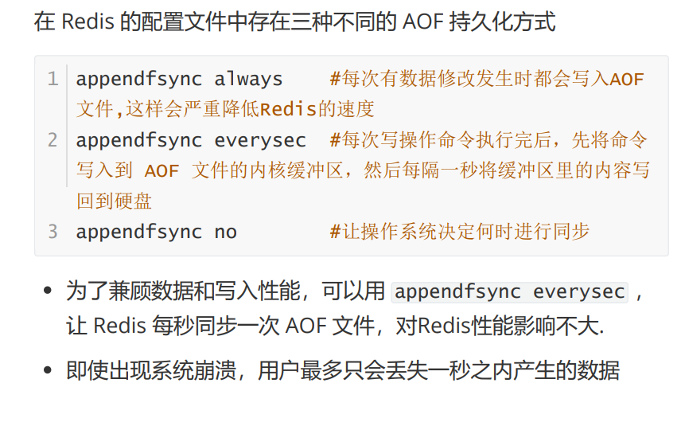

每种方式在 **数据安全性和性能** 之间有不同的权衡。下面我为你详细讲解这三种方式：

------

### 1. `appendfsync always`

```conf
appendfsync always
```

特点：

- **每次有数据修改发生时，都会立即同步到磁盘**。
- Redis 执行完一个写命令后，立刻调用 `fsync()` 将数据写入 AOF 文件。

优点：

- 数据安全性最高：**几乎不会丢失任何数据**，即使系统崩溃。

缺点：

- 性能开销大：频繁的磁盘 I/O 会显著降低 Redis 的写入性能。
- 可能成为瓶颈，尤其是在高并发写入场景下。

> ⚠️ 适合对数据安全性要求极高的场景，但一般不推荐用于生产环境，除非你能接受性能下降。


### 2. `appendfsync everysec`（推荐）

```conf
appendfsync everysec
```

特点：

- 每次写操作命令执行后，**先将命令写入内核缓冲区（内存）**，然后 **每隔一秒** 调用 `fsync()` 把缓冲区内容写入磁盘。
- 这是 Redis 的默认配置。

优点：

- **性能与安全性之间的最佳平衡**。
- 对 Redis 性能影响较小（相比 `always`）。
- 即使系统崩溃，最多只会丢失 **最近 1 秒内的数据**。

缺点：

- 有可能丢失最多 1 秒的数据（如果系统在这 1 秒内崩溃）。

> ✅ **最推荐的配置**，适用于大多数生产环境。


### 3. `appendfsync no`

```conf
appendfsync no
```

特点：

- **由操作系统决定何时将缓冲区数据写入磁盘**。
- Redis 不主动调用 `fsync()`，完全依赖 OS 的缓存机制。

优点：

- 性能最好：几乎没有额外的同步开销。

缺点：

- **数据安全性最低**。
- 如果系统突然崩溃（如断电、宕机），可能会丢失大量未写入磁盘的数据。
- 无法保证数据的实时持久化。

> ❌ 不推荐用于需要数据可靠性的场景，仅适用于对性能要求极高且可以容忍数据丢失的特殊场合。


### 总结对比表

| 配置       | 同步频率         | 数据安全性               | 性能影响             | 推荐场景             |
| ---------- | ---------------- | ------------------------ | -------------------- | -------------------- |
| `always`   | 每次写操作都同步 | 最高（几乎无丢失）       | 最大（性能下降明显） | 极高安全性需求       |
| `everysec` | 每秒同步一次     | 较高（最多丢1秒数据）    | 较小（推荐）         | 生产环境通用         |
| `no`       | 由操作系统决定   | 最低（可能丢失大量数据） | 最小（最快）         | 性能优先，可容忍丢失 |

### 建议

- **生产环境建议使用 `appendfsync everysec`**，因为它在性能和数据安全之间达到了很好的平衡。
- 如果你担心数据丢失，还可以结合 **RDB 快照 + AOF** 使用，Redis 支持两者同时开启（AOF 优先级更高）