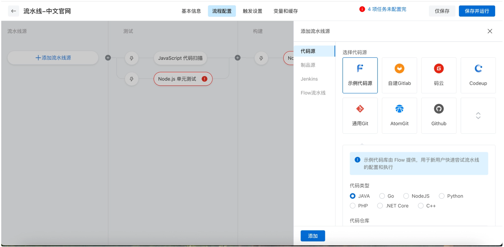
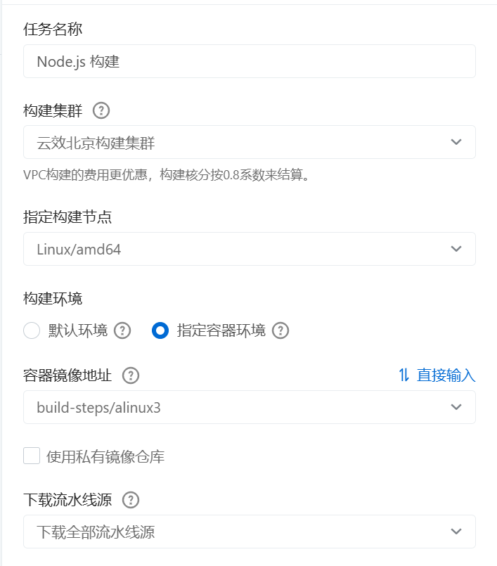
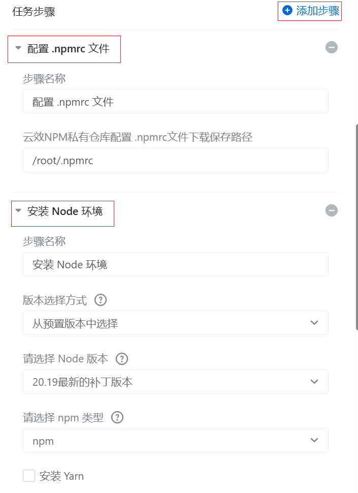
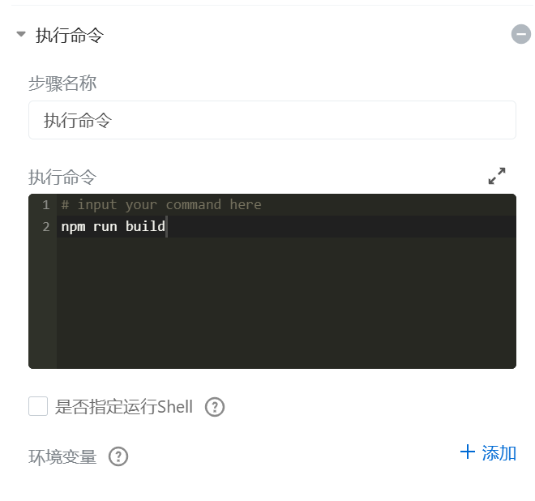
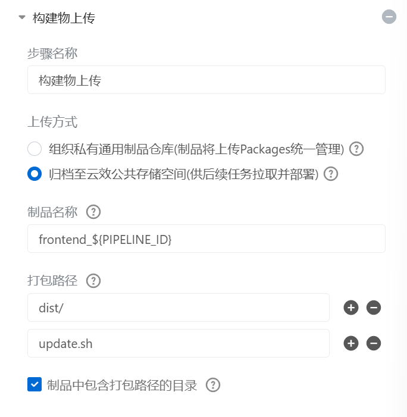
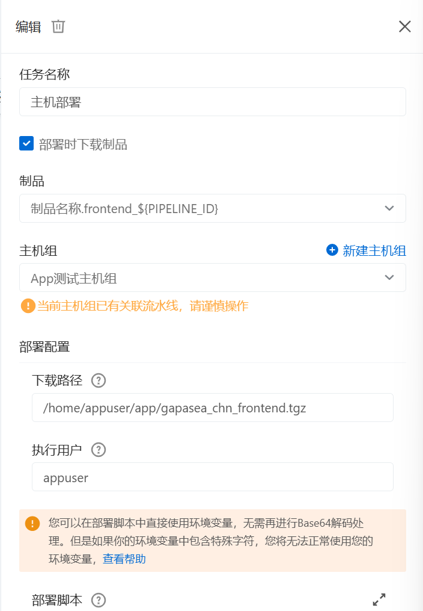
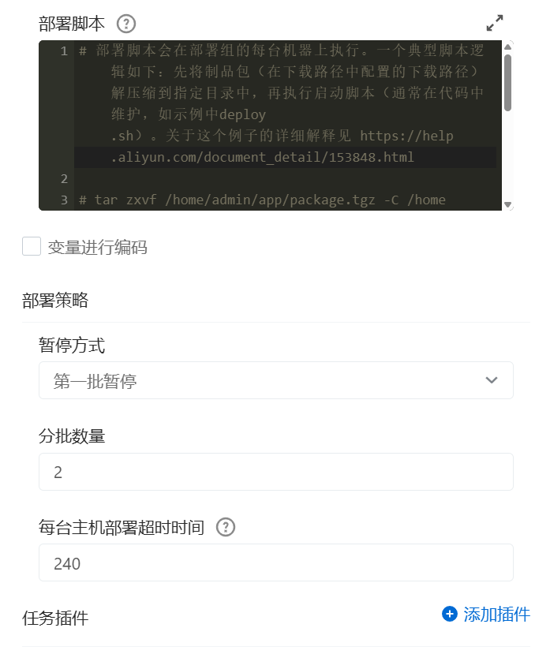

* 官方文档：[https://help.aliyun.com/zh/yunxiao/user-guide/what-is-the-pipeline?spm=a2c4g.11186623.help-menu-150040.d_2_5_0.3c166e18DGEc9w](https://help.aliyun.com/zh/yunxiao/user-guide/what-is-the-pipeline?spm=a2c4g.11186623.help-menu-150040.d_2_5_0.3c166e18DGEc9w)
* 


## 前端流水线


### 1. 添加流水线源



示例：


### 2. (测试)


### 3. 构建

* 设置
	* 任务名称
	* 构建集群
	* 指定构建节点
	* 构建环境
	* 容器镜像地址
	* 下载流水线源




#### 设置任务步骤




执行命令默认是在当前代码仓库的根目录下，不用 `cd 根目录`


构建物上传到云效公共存储空间

指定制品名称：自定义产出物名称，例如 target1，用于区分多次构建产生的不同产出物，定义后在部署组件使用
> 后面下载的时候下载出来的制品名称不是这个，而是下载路径里面指定的名称


!
>由于我这个流水线叫“gapasea-chn”，所以任务会输出 “制品名称.frontend_gapasea-chn”


### 4. 部署
!


```sh
# 部署脚本会在部署组的每台机器上执行。一个典型脚本逻辑如下：先将制品包（在下载路径中配置的下载路径）解压缩到指定目录中，再执行启动脚本（通常在代码中维护，如示例中deploy.sh）。关于这个例子的详细解释见 https://help.aliyun.com/document_detail/153848.html 

# tar zxvf /home/admin/app/package.tgz -C /home/admin/app/
# sh /home/admin/app/deploy.sh restart
# 如果你是php之类的无需制品包的制品方式，可以使用git clone 或者 git pull将源代码更新到服务器，再执行其他命令 
# git clone ***@***.git
APP=/home/appuser/gapasea-chn
rm -rf $APP/dist
mkdir -p $APP 
tar zxf /home/appuser/app/gapasea_chn_frontend.tgz -C $APP/
sh $APP/update.sh
```




##### 为什么构建的时候指定了制品名称，后面部署的时候就能直接用 `tar zxf /home/appuser/app/gapasea_chn_frontend. Tgz -C $APP/` 这个指令

这是云效自己干的活，不是你脚本干的。串起来看：

**① 构建阶段：「任务输出」= 把产物登记到流水线**

Node. Js 构建任务跑完后，云效的「构建物上传」步骤（就是我上条说你缺的那一步）会：

- <u>把构建机上的 `dist/` 等指定的目录打成 tgz
- 上传到云效自己的**制品仓库**</u>
- 给它贴个标签叫 `frontend_${PIPELINE_ID}`（PIPELINE_ID 是本次流水线的运行 ID，保证每次构建产物不冲突）

所以「任务输出」那行蓝色的 `制品名称.frontend_${PIPELINE_ID}` 不是"命令"，是一个**引用句柄**，意思是"这次构建产出了一个名为 frontend 的制品，后面谁要用就拿这个名字找我要"。

**② 部署阶段：「部署时下载制品」= 云效把它下回来**

看你主机部署任务里的这两个框：

`☑ 部署时下载制品 制品： 制品名称.frontend_${PIPELINE_ID} ← 要哪个制品 下载路径： /home/appuser/app/gapasea_chn_frontend.tgz ← `~={green}`放到哪里`=~

**部署脚本开始执行之前**，云效的部署 agent 已经在目标机上做完了这件事：

1. 通过上面的制品名从制品仓库拉下那个 tgz
2. 按你填的「下载路径」把它放到 `/home/appuser/app/gapasea_chn_frontend.tgz`

> **文件名 `gapasea_chn_frontend.tgz` 也是你自己在「下载路径」里写的**，云效就按你写的这个名字落盘。你要是改成 `/tmp/foo.tgz`，那脚本里也就得写 `tar zxf /tmp/foo.tgz`。

然后**你的部署脚本才开始跑**，所以 `tar zxf /home/appuser/app/gapasea_chn_frontend.tgz ...` 这行执行时，那个 tgz 文件已经静静躺在那儿了。

整个链路是：

`构建机 dist/ │ [构建物上传步骤打包] ▼ 云效制品仓库（用 frontend_${PIPELINE_ID} 标记） │ [部署任务「部署时下载制品」] ▼ 目标机 /home/appuser/app/gapasea_chn_frontend.tgz │ [你的部署脚本 tar zxf] ▼ /home/appuser/gapasea-chn/dist/`

所以你要警觉的是：**如果构建阶段没加「构建物上传」步骤**，制品仓库里根本没有这个东西，部署阶段「下载制品」会失败，脚本压根轮不到执行，或者执行时会找不到那个 tgz 文件。这正是我上一条说的"最重要的那个问题"。


