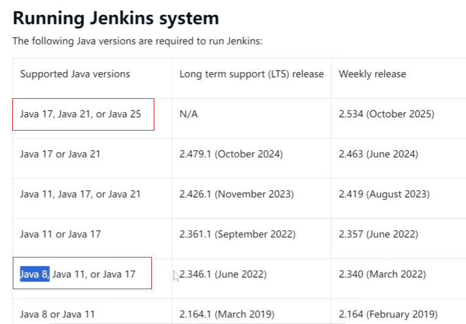
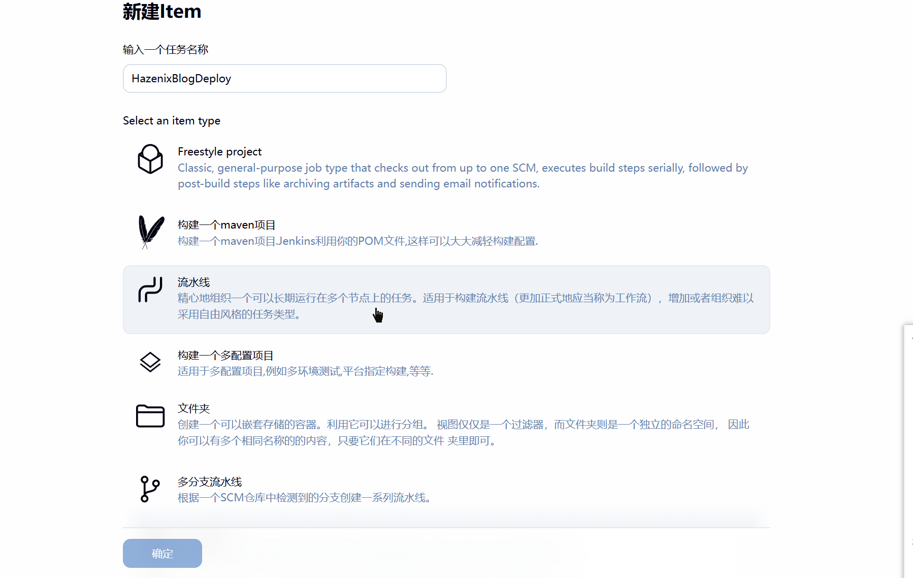
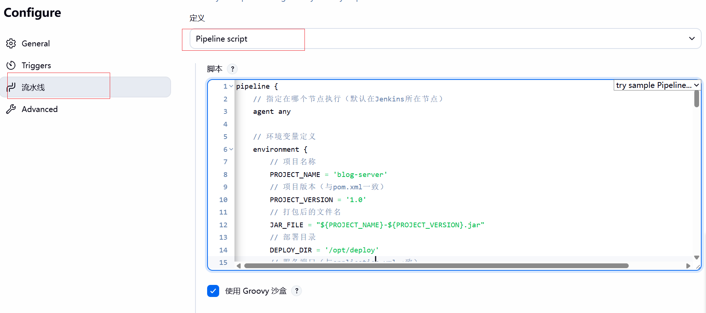

https://www.jenkins.io/

注意jdk版本适配

https://jishuzhan.net/article/1955855444752248834

### Jenkins Pipeline 实战 ------ 编写自动化脚本

Pipeline 是 Jenkins 中最强大的功能，通过代码（Jenkinsfile）定义整个构建部署流程，支持版本控制和复用。我们将创建一个包含 "拉取代码→编译→测试→打包→部署" 的完整 Pipeline。

#### 5.1 创建 Pipeline 项目

1. 登录 Jenkins，点击左侧 "新建 Item"

2. 输入项目名称（如`jenkins-demo-pipeline`），选择 "Pipeline"，点击 "确定"

   

3. 在项目配置页面，拉到 "Pipeline" 配置区域

#### 5.2 编写基础 Pipeline 脚本

在 "Pipeline" 配置中选择 "Definition" 为 "Pipeline script"，输入以下脚本：

复制代码<svg class="md-editor-icon" aria-hidden="true"><use xlink:href="#md-editor-icon-collapse-tips"></use></svg>

<pre style="margin: 0px; position: relative;"><code class="language-" language="" style="background-color: rgb(40, 44, 52); border-radius: 0px 0px 5px 5px; color: rgb(169, 183, 198); line-height: 1.6; padding: 1em; display: block; font-family: source-code-pro, Menlo, Monaco, Consolas, &quot;Courier New&quot;, monospace; font-size: 14px; overflow: auto; position: relative; box-shadow: rgba(0, 0, 0, 0.333) 0px 2px 2px;">pipeline {
    // 指定在哪个节点执行（默认在Jenkins所在节点）
    agent any
    
    // 环境变量定义
    environment {
        // 项目名称
        PROJECT_NAME = 'jenkins-demo'
        // 项目版本（与pom.xml一致）
        PROJECT_VERSION = '1.0.0'
        // 打包后的文件名
        JAR_FILE = "${PROJECT_NAME}-${PROJECT_VERSION}.jar"
        // 部署目录
        DEPLOY_DIR = '/opt/deploy'
        // 服务端口（与application.yml一致）
        SERVICE_PORT = 8081
    }
    
    // 工具配置（关联全局工具配置中的名称）
    tools {
        maven 'Maven3.8'
        jdk 'JDK17'
        git 'Git'
    }
    
    // 构建阶段定义
    stages {
        // 1. 拉取代码
        stage('拉取代码') {
            steps {
                echo "开始拉取代码..."
                // 替换为你的Git仓库地址
                git url: 'https://gitee.com/your-username/jenkins-demo.git',
                    branch: 'master'
            }
        }
        
        // 2. 编译代码
        stage('编译代码') {
            steps {
                echo "开始编译代码..."
                sh 'mvn clean compile'
            }
        }
        
        // 3. 运行单元测试
        stage('运行单元测试') {
            steps {
                echo "开始运行单元测试..."
                sh 'mvn test'
            }
            post {
                // 测试失败后保存测试报告
                always {
                    junit '**/target/surefire-reports/*.xml'
                }
            }
        }
        
        // 4. 打包构建
        stage('打包构建') {
            steps {
                echo "开始打包构建..."
                sh 'mvn package -DskipTests'
            }
        }
        
        // 5. 部署应用
        stage('部署应用') {
            steps {
                echo "开始部署应用..."
                
                // 创建部署目录
                sh "mkdir -p ${DEPLOY_DIR}"
                
                // 停止旧服务（如果存在）
                sh """
                    if [ -f "${DEPLOY_DIR}/${PROJECT_NAME}.pid" ]; then
                        PID=\$(cat ${DEPLOY_DIR}/${PROJECT_NAME}.pid)
                        echo "停止旧服务，PID: \$PID"
                        kill -9 \$PID || true
                    fi
                """
                
                // 复制新包到部署目录
                sh "cp target/${JAR_FILE} ${DEPLOY_DIR}/"
                
                // 启动新服务，记录PID
                sh """
                    cd ${DEPLOY_DIR}
                    nohup java -jar ${JAR_FILE} &gt; ${PROJECT_NAME}.log 2&gt;&amp;1 &amp;
                    echo \$! &gt; ${PROJECT_NAME}.pid
                    echo "新服务启动成功，PID: \$(cat ${PROJECT_NAME}.pid)"
                """
            }
        }
        
        // 6. 验证部署
        stage('验证部署') {
            steps {
                echo "验证服务是否正常启动..."
                // 循环检查健康接口，最多等待30秒
                sh """
                    count=0
                    while true; do
                        if curl -s "http://localhost:${SERVICE_PORT}/api/users/health" | grep -q "Service is running"; then
                            echo "服务验证成功"
                            exit 0
                        fi
                        count=\$((count + 1))
                        if [ \$count -ge 6 ]; then
                            echo "服务启动超时"
                            exit 1
                        fi
                        sleep 5
                    done
                """
            }
        }
    }
    
    // 构建结果通知
    post {
        success {
            echo "构建部署成功！"
        }
        failure {
            echo "构建部署失败！"
        }
        always {
            echo "构建流程结束"
        }
    }
}
</code></pre>

#### 5.3 脚本关键步骤解析

1. **agent any**：表示在任何可用的 Jenkins 节点上执行（后续可扩展为多节点）
2. **environment**：定义环境变量，避免硬编码，方便维护
3. **tools**：指定构建工具，关联全局配置中的 JDK、Maven、Git
4. **stages** ：核心构建阶段，每个 stage 完成一个独立任务：
   - **拉取代码**：从 Git 仓库克隆代码，支持指定分支
   - **编译代码** ：`mvn clean compile`清理并编译源码
   - **运行单元测试** ：`mvn test`执行测试，`junit`插件收集测试报告
   - **打包构建** ：`mvn package`生成 jar 包，`-DskipTests`跳过测试（已单独执行）
   - **部署应用** ：
     - 停止旧服务（通过 PID 文件）
     - 复制新 jar 包到部署目录
     - 启动新服务，将进程 ID 写入 PID 文件
   - **验证部署**：通过健康检查接口确认服务启动成功
5. **post**：构建结束后执行的操作，支持成功 / 失败 / 总是执行的逻辑

#### 5.4 运行 Pipeline 并查看结果

1. 点击项目页面的 "Build Now" 触发构建
2. 点击左侧 "Build History" 中的构建编号（如 #1）进入构建详情
3. 点击 "Console Output" 查看实时构建日志
4. 构建成功后，访问`http://服务器IP:8081/api/users/health`，显示 "Service is running" 即为部署成功

### 六、自动化进阶 ------ 让部署更智能

基础 Pipeline 实现了自动部署，但在实际生产中还需要更多功能，如代码提交触发构建、远程部署、代码质量检查、邮件通知等。

#### 6.1 配置代码提交自动触发构建

无需手动点击 "Build Now"，代码提交到 Git 后自动触发构建：

1. 安装 "Generic Webhook Trigger" 插件
2. 进入项目配置，在 "构建触发器" 中勾选 "Generic Webhook Trigger"
3. 设置 "Token"（如`jenkins-demo-trigger`）
4. 在 Git 仓库中配置 WebHook：
   - Gitee：仓库 → 管理 → WebHooks → 添加
   - Payload URL：`http://JenkinsIP:8080/generic-webhook-trigger/invoke?token=jenkins-demo-trigger`
   - 触发事件：选择 "推送事件"
5. 保存配置，后续提交代码到 master 分支会自动触发构建

#### 6.2 远程服务器部署（通过 SSH）

实际场景中，Jenkins 和应用服务器通常分离，需要通过 SSH 部署：

1. 进入 "系统管理" → "系统" → "Publish over SSH"
2. 配置 SSH 服务器：
   - Name：`app-server`（自定义名称）
   - Hostname：应用服务器 IP
   - Username：登录用户名（如 root）
   - 选择认证方式（密码或密钥）
   - 点击 "Test Configuration" 验证连接
3. 修改 Pipeline 的 "部署应用" 阶段：

groovy

复制代码<svg class="md-editor-icon" aria-hidden="true"><use xlink:href="#md-editor-icon-collapse-tips"></use></svg>

<pre style="margin: 0px; position: relative;"><code class="language-" language="" style="background-color: rgb(40, 44, 52); border-radius: 0px 0px 5px 5px; color: rgb(169, 183, 198); line-height: 1.6; padding: 1em; display: block; font-family: source-code-pro, Menlo, Monaco, Consolas, &quot;Courier New&quot;, monospace; font-size: 14px; overflow: auto; position: relative; box-shadow: rgba(0, 0, 0, 0.333) 0px 2px 2px;">stage('部署应用') {
    steps {
        echo "开始部署到远程服务器..."
        
        // 通过SSH执行命令
        sshPublisher(publishers: [sshPublisherDesc(
            configName: 'app-server', // 对应配置的SSH服务器名称
            transfers: [sshTransfer(
                cleanRemote: false,
                excludes: '',
                execCommand: """
                    # 停止旧服务
                    if [ -f "/opt/deploy/${PROJECT_NAME}.pid" ]; then
                        PID=\$(cat /opt/deploy/${PROJECT_NAME}.pid)
                        kill -9 \$PID || true
                    fi
                    
                    # 启动新服务
                    cd /opt/deploy
                    nohup java -jar ${JAR_FILE} &gt; ${PROJECT_NAME}.log 2&gt;&amp;1 &amp;
                    echo \$! &gt; ${PROJECT_NAME}.pid
                """,
                execTimeout: 120000,
                flatten: false,
                makeEmptyDirs: false,
                noDefaultExcludes: false,
                patternSeparator: '[, ]+',
                remoteDirectory: '/opt/deploy', // 远程服务器目录
                remoteDirectorySDF: false,
                removePrefix: 'target', // 移除本地的target前缀
                sourceFiles: "target/${JAR_FILE}" // 本地文件路径
            )],
            usePromotionTimestamp: false,
            useWorkspaceInPromotion: false,
            verbose: true
        )])
    }
}</code></pre>

#### 6.3 集成 SonarQube 代码质量检查

SonarQube 用于检测代码中的漏洞、异味和重复代码，在 Pipeline 中添加质量门禁：

1. 安装 SonarQube 服务器（参考官方文档）
2. Jenkins 中安装 "SonarQube Scanner" 插件
3. 进入 "系统管理" → "系统" → "SonarQube servers" 配置：
   - Name：`SonarQube`
   - Server URL：SonarQube 访问地址（如`http://sonarIP:9000`）
   - Server authentication token：在 SonarQube 中生成的令牌
4. 在 Pipeline 中添加代码质量检查阶段：

groovy

复制代码<svg class="md-editor-icon" aria-hidden="true"><use xlink:href="#md-editor-icon-collapse-tips"></use></svg>

<pre style="margin: 0px; position: relative;"><code class="language-" language="" style="background-color: rgb(40, 44, 52); border-radius: 0px 0px 5px 5px; color: rgb(169, 183, 198); line-height: 1.6; padding: 1em; display: block; font-family: source-code-pro, Menlo, Monaco, Consolas, &quot;Courier New&quot;, monospace; font-size: 14px; overflow: auto; position: relative; box-shadow: rgba(0, 0, 0, 0.333) 0px 2px 2px;">stage('代码质量检查') {
    steps {
        echo "开始代码质量检查..."
        withSonarQubeEnv('SonarQube') {
            sh """
                mvn sonar:sonar \
                -Dsonar.projectKey=${PROJECT_NAME} \
                -Dsonar.projectName=${PROJECT_NAME} \
                -Dsonar.projectVersion=${PROJECT_VERSION} \
                -Dsonar.sources=src/main/java \
                -Dsonar.java.binaries=target/classes
            """
        }
    }
}

// 添加质量门禁检查（需安装Sonar Quality Gates插件）
stage('质量门禁检查') {
    steps {
        script {
            def qualityGate = waitForQualityGate()
            if (qualityGate.status != 'OK') {
                error "代码质量检查未通过: ${qualityGate.status}"
            }
        }
    }
}</code></pre>

#### 6.4 邮件通知构建结果

构建完成后自动发送邮件通知相关人员：

1. 安装 "Email Extension" 插件
2. 进入 "系统管理" → "系统" → "Extended E-mail Notification" 配置：
   - SMTP 服务器：如`smtp.163.com`
   - SMTP 端口：25（或 465 用于 SSL）
   - 用户名：发件人邮箱
   - 密码：邮箱授权码
   - 默认收件人：`developer@example.com`
3. 在 Pipeline 的 post 部分添加邮件通知：

groovy

复制代码<svg class="md-editor-icon" aria-hidden="true"><use xlink:href="#md-editor-icon-collapse-tips"></use></svg>

<pre style="margin: 0px; position: relative;"><code class="language-" language="" style="background-color: rgb(40, 44, 52); border-radius: 0px 0px 5px 5px; color: rgb(169, 183, 198); line-height: 1.6; padding: 1em; display: block; font-family: source-code-pro, Menlo, Monaco, Consolas, &quot;Courier New&quot;, monospace; font-size: 14px; overflow: auto; position: relative; box-shadow: rgba(0, 0, 0, 0.333) 0px 2px 2px;">post {
    success {
        echo "构建部署成功！"
        emailext(
            subject: "构建成功: ${PROJECT_NAME} #${BUILD_NUMBER}",
            body: """
                &lt;h3&gt;构建信息&lt;/h3&gt;
                &lt;p&gt;项目名称: ${PROJECT_NAME}&lt;/p&gt;
                &lt;p&gt;构建编号: ${BUILD_NUMBER}&lt;/p&gt;
                &lt;p&gt;构建结果: 成功&lt;/p&gt;
                &lt;p&gt;查看详情: &lt;a href="${BUILD_URL}"&gt;${BUILD_URL}&lt;/a&gt;&lt;/p&gt;
            """,
            to: 'developer@example.com'
        )
    }
    failure {
        echo "构建部署失败！"
        emailext(
            subject: "构建失败: ${PROJECT_NAME} #${BUILD_NUMBER}",
            body: """
                &lt;h3&gt;构建信息&lt;/h3&gt;
                &lt;p&gt;项目名称: ${PROJECT_NAME}&lt;/p&gt;
                &lt;p&gt;构建编号: ${BUILD_NUMBER}&lt;/p&gt;
                &lt;p&gt;构建结果: 失败&lt;/p&gt;
                &lt;p&gt;查看详情: &lt;a href="${BUILD_URL}"&gt;${BUILD_URL}&lt;/a&gt;&lt;/p&gt;
            """,
            to: 'developer@example.com'
        )
    }
}</code></pre>

#### 6.5 版本回滚机制

部署失败时能快速回滚到上一版本：

1. 在部署阶段保存历史版本：

groovy

复制代码<svg class="md-editor-icon" aria-hidden="true"><use xlink:href="#md-editor-icon-collapse-tips"></use></svg>

<pre style="margin: 0px; position: relative;"><code class="language-" language="" style="background-color: rgb(40, 44, 52); border-radius: 0px 0px 5px 5px; color: rgb(169, 183, 198); line-height: 1.6; padding: 1em; display: block; font-family: source-code-pro, Menlo, Monaco, Consolas, &quot;Courier New&quot;, monospace; font-size: 14px; overflow: auto; position: relative; box-shadow: rgba(0, 0, 0, 0.333) 0px 2px 2px;">stage('部署应用') {
    steps {
        echo "开始部署应用..."
        
        // 创建历史版本目录
        sh "mkdir -p ${DEPLOY_DIR}/history"
        
        // 备份当前版本（如果存在）
        sh """
            if [ -f "${DEPLOY_DIR}/${JAR_FILE}" ]; then
                cp ${DEPLOY_DIR}/${JAR_FILE} ${DEPLOY_DIR}/history/${JAR_FILE}.bak.${BUILD_TIMESTAMP}
                echo "备份当前版本到历史目录"
            fi
        """
        
        // 后续部署步骤...
    }
}</code></pre>

1. 配置参数化构建：
   - 项目配置中勾选 "This project is parameterized"
   - 添加 "Choice Parameter"，名称`ACTION`，选项：`deploy`和`rollback`
   - 添加 "String Parameter"，名称`ROLLBACK_VERSION`，默认值为空
2. 修改 Pipeline 支持回滚逻辑：

groovy

复制代码<svg class="md-editor-icon" aria-hidden="true"><use xlink:href="#md-editor-icon-collapse-tips"></use></svg>

<pre style="margin: 0px; position: relative;"><code class="language-" language="" style="background-color: rgb(40, 44, 52); border-radius: 0px 0px 5px 5px; color: rgb(169, 183, 198); line-height: 1.6; padding: 1em; display: block; font-family: source-code-pro, Menlo, Monaco, Consolas, &quot;Courier New&quot;, monospace; font-size: 14px; overflow: auto; position: relative; box-shadow: rgba(0, 0, 0, 0.333) 0px 2px 2px;">stage('部署或回滚') {
    steps {
        script {
            if (params.ACTION == 'deploy') {
                // 执行正常部署步骤
                echo "执行部署操作..."
                // 部署脚本...
            } else if (params.ACTION == 'rollback') {
                // 执行回滚操作
                echo "执行回滚操作，版本: ${params.ROLLBACK_VERSION}"
                sh """
                    # 停止当前服务
                    if [ -f "${DEPLOY_DIR}/${PROJECT_NAME}.pid" ]; then
                        PID=\$(cat ${DEPLOY_DIR}/${PROJECT_NAME}.pid)
                        kill -9 \$PID || true
                    fi
                    
                    # 恢复历史版本
                    cp ${DEPLOY_DIR}/history/${params.ROLLBACK_VERSION} ${DEPLOY_DIR}/${JAR_FILE}
                    
                    # 启动服务
                    cd ${DEPLOY_DIR}
                    nohup java -jar ${JAR_FILE} &gt; ${PROJECT_NAME}.log 2&gt;&amp;1 &amp;
                    echo \$! &gt; ${PROJECT_NAME}.pid
                """
            }
        }
    }
}</code></pre>

### 七、常见问题与解决方案

在 Jenkins 使用过程中，可能会遇到各种问题，以下是高频问题及解决方法：

#### 7.1 构建失败：找不到 JDK/Maven

**现象** ：日志中出现`java: command not found`或`mvn: command not found`

**原因**：全局工具配置错误，Jenkins 无法找到 JDK/Maven 路径

**解决**：

1. 确认 JDK/Maven 实际安装路径（`which java`或`which mvn`）
2. 进入 "全局工具配置"，检查路径是否正确（绝对路径）
3. 确保 Jenkins 用户有访问该路径的权限

#### 7.2 权限问题：无法创建目录或执行命令

**现象** ：日志中出现`Permission denied`

**原因**：Jenkins 运行用户（通常是 jenkins）权限不足

**解决**：

1. 查看 Jenkins 运行用户：`ps -ef | grep jenkins`
2. 为部署目录授权：`chown -R jenkins:jenkins /opt/deploy`
3. 必要时赋予 sudo 权限（谨慎操作）：编辑`/etc/sudoers`添加`jenkins ALL=(ALL) NOPASSWD: ALL`

#### 7.3 测试失败：单元测试不通过导致构建中断

**现象** ：`mvn test`执行失败，构建终止

**解决**：

1. 查看测试报告：构建详情 → "Test Result"
2. 修复代码中的测试用例
3. 紧急情况下可临时跳过测试（不推荐）：将`mvn package`改为`mvn package -DskipTests`

#### 7.4 插件冲突：安装插件后 Jenkins 无法启动

**现象**：Jenkins 启动失败，日志中有插件相关错误

**解决**：

1. 进入 Jenkins 插件目录（通常是`/root/.jenkins/plugins`）
2. 删除冲突的插件目录（如`problem-plugin/`）
3. 重启 Jenkins：`systemctl restart jenkins`

#### 7.5 远程部署超时：SSH 连接失败

**现象** ：远程部署阶段提示`Connection timed out`

**解决**：

1. 检查网络：在 Jenkins 服务器上`ping 应用服务器IP`
2. 检查端口：`telnet 应用服务器IP 22`确认 SSH 端口开放
3. 检查认证：重新配置 "Publish over SSH" 的密钥或密码
4. 增加超时时间：在 sshPublisher 中设置`execTimeout: 300000`（5 分钟）

### 八、总结与展望

通过本文的步骤，可以掌握从 0 搭建 Jenkins 环境、配置自动化工具、编写 Pipeline 脚本、实现 Java 项目自动部署的完整流程。一个成熟的 CI/CD 流水线能为团队带来显著的效率提升，让开发者从繁琐的部署工作中解放出来，专注于代码质量和业务逻辑。

