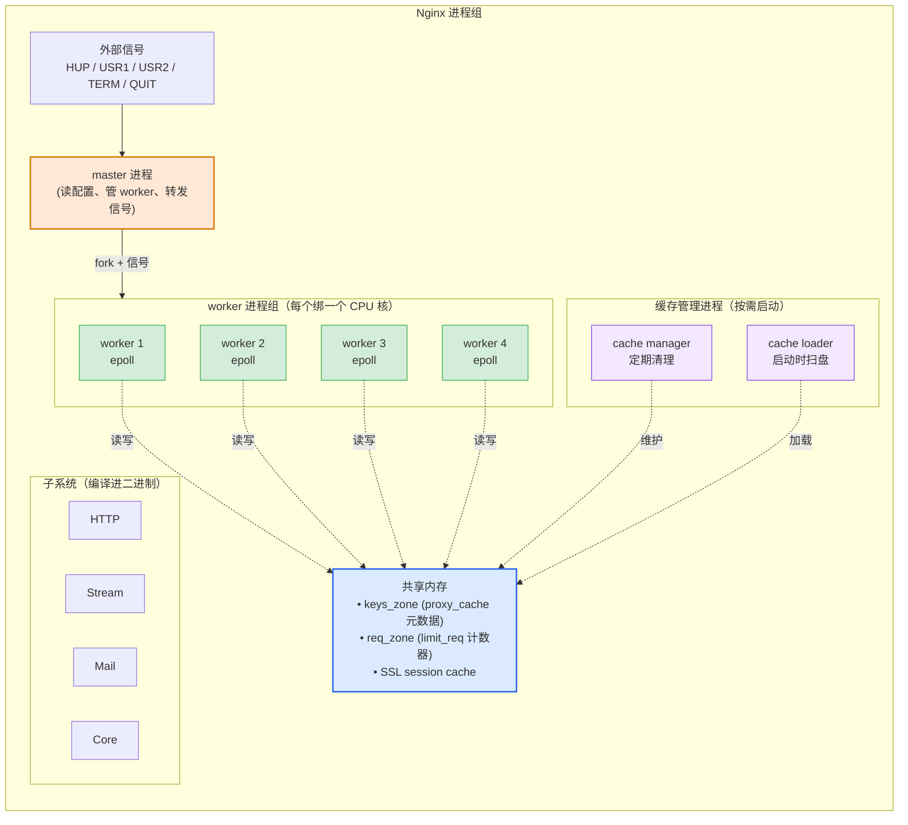
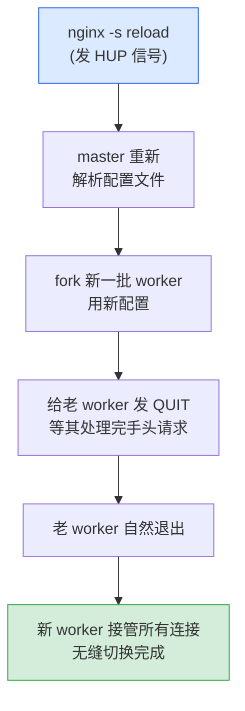
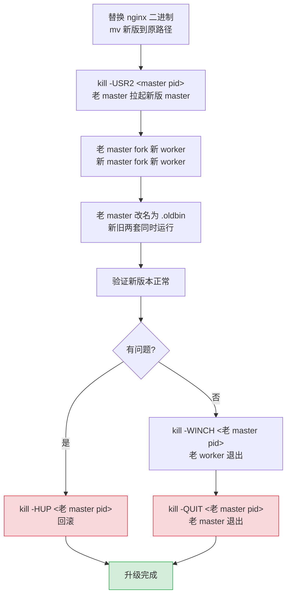
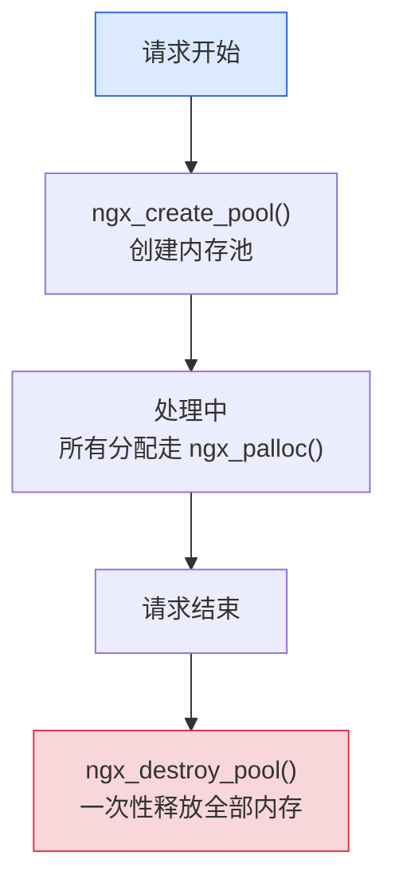
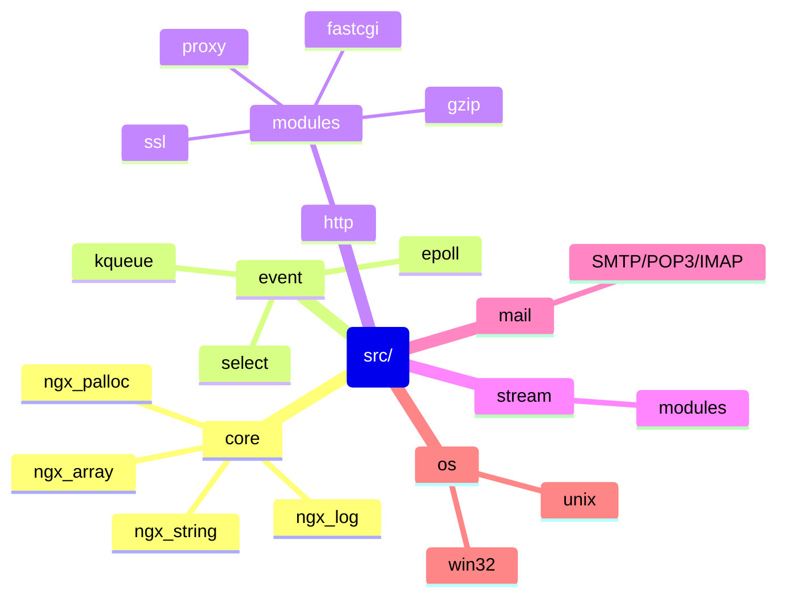

> 接 [Nginx 入门](从静态站点到反向代理：Nginx%20配置快速入门.md) 和 [Nginx 进阶](Nginx%20进阶：缓存、限流、HTTPS%20优化、高可用一网打尽.md)。前两篇都在讲"怎么配"，这一篇讲"为什么这样设计就快"。
>
> 本文共计xx字，适合有一定 Nginx 基础/想了解一定 Nginx 原理的读者，整理不易，点个免费的赞吧


Nginx 为什么快？一句话：**多进程 + 异步非阻塞 + 事件驱动 + 模块化**。

后面所有章节，都是围绕这句话

[spacer]

## 整体架构

先看一张全貌图：



关键点：

- **一个 master，多个 worker**
  master 不处理请求，只管 worker；worker 才负责干活
- **每个 worker 一个 epoll 实例**
  "epoll 实例"是内核为 epoll 维护的一套数据结构（本质是一个 fd (**文件描述符**)），负责记住这个 worker 监听了哪些连接、哪些连接上有事件。每个 worker 独立一个，互不干扰。单线程、异步处理成千上万个连接
  
  > [epoll 是什么？](epoll 是什么.md)
- **共享内存**能让 worker 之间共享状态（缓存元数据、限流计数、SSL 会话）。worker 自身的内存是隔离的
- **Cache Manager / Loader** 是两个特殊进程，按需启动，专门管缓存目录
- **HTTP / Stream / Mail / Core** 是 nginx 的四大子系统，模块化加载

[spacer]

## 进程模型：master + worker

### master 的作用

master 进程本身**不处理任何请求**，它的工作只有四件：

1. 读配置文件
2. fork 出 worker 进程
3. 监听信号（HUP/USR1/USR2/TERM/QUIT，信号是 Linux 进程间通信的一种方式——你可以理解成"给进程发一个数字代号，进程收到后做对应的事"），把信号转发给 worker
4. 监控 worker，挂了就重启

master 的定位类似包工头——不搬砖，只管分配任务。worker 才是干活的。

> 当 master 收到外界信号（比如 `nginx -s reload` 触发的 HUP 信号），master 会重新加载配置文件，fork 新 worker，然后给老 worker 发 QUIT 信号：老 worker 不再接收新请求，处理完当前请求后退出

### worker 的作用

worker 负责真正处理请求：

- 调用 `accept()` 接受新连接（accept 是系统级调用，从监听队列里取出一个已完成 TCP 三次握手的新连接）
- 把连接的 socket 加进自己的 epoll
- 等事件来，处理事件，吐响应
- 单进程内**所有连接都是这个 worker 一个人扛**——可能是几千、几万个

每个 worker 通常**绑定一个 CPU 核**（`worker_cpu_affinity auto;`）。worker 数量推荐配成 CPU 核数（`worker_processes auto;`），让每个 CPU 都有一个 worker 跑满。

[spacer]

### 为什么不用多线程

如果你了解过 Tomcat 或者 Apache prefork，可能会疑惑：**为什么 nginx 不开一堆线程并发处理请求？**

理由：

- **多线程要锁**。锁就要竞争，竞争就有 cache miss（CPU 缓存没命中，得去慢得多的内存里取数据）和上下文切换开销（CPU 从一个线程切到另一个线程，要保存/恢复寄存器、刷新缓存，一次切换几十微秒到几百微秒）
- **多线程一旦阻塞会卡住整个进程**——一个文件 IO 卡住，那个线程就堵了
- **nginx 用异步非阻塞 IO**——所谓"非阻塞"，就是读数据时如果没有数据可读，函数立刻返回（而不是阻塞等待），程序可以先处理别的连接，回头再来问。一个 worker 就能同时处理几万连接，根本不需要线程并发

简单说：nginx 的每个 worker 是个**单线程的事件循环**——"事件循环"就是一个 `while(1)` 死循环，反复问 epoll "谁有动静？"，有就处理，没有就等。靠 epoll + 非阻塞 IO，一个单线程 worker 能扛住多线程模型几倍到几十倍的并发连接。

[spacer]

### 惊群问题与 accept_mutex / SO_REUSEPORT

这里有个细节坑：多个 worker 都在 listen 同一个端口，新连接进来时，**操作系统会唤醒哪个 worker？**

老内核实现是：**全部唤醒**，但只有一个能 accept 成功，其他白醒一次——这就是"惊群效应（thundering herd）"。

nginx 的两种应对方式：

1. **`accept_mutex on`**（老办法）：worker 之间抢一把锁，谁拿到谁去 accept
2. **`reuseport`**（新办法）：内核在 listen socket（处于监听状态的 socket，等着接新连接）上做负载均衡，每个 worker 只被唤醒处理分给自己的连接

```nginx
# 现在推荐的写法
events {
    use epoll;
    accept_mutex off;       # 新版默认关
}

http {
    server {
        listen 80 reuseport;   # 这一行启用 SO_REUSEPORT
    }
}
```

> Linux 3.9+ 支持 SO_REUSEPORT。性能最好，建议直接开。


## reload / quit / hot upgrade 是怎么发生的

入门篇讲了 `reload` 不会丢请求，那么它到底是怎么做到的？

### reload 流程



整个过程**新连接从一开始就由新 worker 接管，老连接由老 worker 处理完**——零中断。

### quit 和 stop 的区别

- `nginx -s quit` ≈ 给 master 发 QUIT：master 转发给所有 worker，让它们处理完手头请求再退。**优雅停**
- `nginx -s stop` ≈ TERM：立刻全部退，未处理完的连接直接断。**强制停**

`stop` 几乎不该用，除非 nginx 卡死了不响应 quit。

### hot upgrade：不停机升级 nginx 二进制

你 nginx 跑在线上，想把版本从 1.24 升到 1.26，**完全不停机**怎么做？



如果新版有问题，可以一键回滚：`kill -HUP <老 master>` 让老 master 把 worker 拉回来。

> 这个机制是 nginx 早期就有的"工业级"特性，被很多其他服务（如 Envoy）参考。


## 事件驱动：从 select/poll 到 epoll/kqueue

一个 worker 能同时处理几万连接，靠的就是事件驱动模型。

### 经典的并发模型对比

| 模型 | 代表 | 1 万并发连接表现 |
|---|---|---|
| **一连接一进程** | Apache prefork | fork 1 万次进程，OS 直接死 |
| **一连接一线程** | Tomcat 默认 | 1 万线程，上下文切换吃 CPU |
| **线程池 + 阻塞 IO** | Tomcat NIO 之前 | 池子满了就排队，吞吐有上限 |
| **异步非阻塞 + 事件驱动** | Nginx, Node.js | 1 个进程/线程扛几万连接 |

nginx 是最后一种。

### 为什么 epoll 快

select/poll/epoll 都是 Linux 上的 IO 多路复用机制——**让一个进程同时监听多个 fd（文件描述符，可以理解成"连接的数字编号"），谁有事件就处理谁**。

> 先搞清楚一个概念：操作系统分**用户态**和**内核态**。用户态是你的程序（nginx）运行的地方，不能直接操作硬件；内核态是操作系统核心运行的地方，管磁盘、网络、内存。程序要做 IO 就得"系统调用"——从用户态切换到内核态，这个切换本身有开销。epoll 省的就是这个。

三者有性能差异：

| 对比维度 | select | poll | epoll |
|---|---|---|---|
| fd 数量上限 | 1024 | 无 | 无 |
| 每次调用的开销 | 全量扫所有 fd（O(n)）| 全量扫（O(n)）| 只返回就绪的 fd（O(1)）|
| 用户态/内核态拷贝 | 每次都拷贝 fd 集合 | 每次都拷贝 | 只在注册时拷贝一次 |

epoll 的两个关键设计：

1. **`epoll_ctl` 注册一次，内核一直记着**——不像 select/poll 每次都把整个 fd 集合从用户态拷到内核态
2. **`epoll_wait` 只返回就绪的 fd**——不需要应用层自己一个个轮询

伪代码长这样：

```c
// nginx 简化版
int epfd = epoll_create();
epoll_ctl(epfd, EPOLL_CTL_ADD, listen_fd, ...);  // 注册一次

while (1) {
    int n = epoll_wait(epfd, events, MAX, timeout);  // 只返回就绪的
    for (i = 0; i < n; i++) {
        handle(events[i]);
    }
}
```

> 在 BSD/macOS 上对应的机制叫 **kqueue**，思想一样，API 不同。`events { use epoll; }` 在 Linux 上写，BSD 上写 `use kqueue;`。一般不用手动写，nginx 会自己挑。

### 配 epoll 相关的几个参数

```nginx
events {
    worker_connections 10240;      # 每个 worker 最多多少连接
    use epoll;                     # Linux 上用 epoll
    multi_accept on;               # 一次 accept 多个连接，进一步减系统调用
}
```

> 源码线索（Linux）：[`src/event/modules/ngx_epoll_module.c`](https://github.com/nginx/nginx/blob/master/src/event/modules/ngx_epoll_module.c)


## 一个请求走过的路：11 个 phase

理解 nginx 的请求处理，最直观的方式是看它把请求处理分成哪些阶段。HTTP 请求在 nginx 里要走 **11 个 phase**，每个 phase 都可以挂载多个模块（handler）：

| 序号 | Phase | 干什么 | 典型指令 |
|---|---|---|---|
| 1 | `POST_READ` | 读完请求行和请求头之后立刻调用 | `realip` 模块 |
| 2 | `SERVER_REWRITE` | server 块里的 rewrite | `rewrite` |
| 3 | `FIND_CONFIG` | 找匹配的 location（这一阶段由 nginx 核心实现，不允许挂载模块）| - |
| 4 | `REWRITE` | location 块里的 rewrite | `rewrite` |
| 5 | `POST_REWRITE` | rewrite 后做整理（核心阶段）| - |
| 6 | `PREACCESS` | access 阶段之前 | `limit_req`, `limit_conn` |
| 7 | `ACCESS` | 鉴权 | `allow/deny`, `auth_basic`, `auth_request` |
| 8 | `POST_ACCESS` | access 阶段后 | - |
| 9 | `PRECONTENT` | content 之前（之前叫 TRY_FILES）| `try_files` |
| 10 | `CONTENT` | **生成响应内容** | `proxy_pass`, `fastcgi_pass`, `return`, 静态文件 handler |
| 11 | `LOG` | 写日志 | `access_log` |

用几个例子说清这张表怎么查：

- `limit_req` 在 `PREACCESS`，所以**先限流再鉴权**——被限流的请求根本走不到鉴权那步，省 CPU
- `proxy_pass` 在 `CONTENT`，是**生成响应**用的，不能在一个 location 里写两个 content handler
- `access_log` 在 `LOG`，**任何返回 403/500 的请求也会走 LOG 阶段**——所以错误请求也会被记录

> 源码线索：[`src/http/ngx_http_core_module.h`](https://github.com/nginx/nginx/blob/master/src/http/ngx_http_core_module.h) 里 `ngx_http_phases` 枚举。


## 内存池：为什么不用 malloc/free

nginx 是 C 写的，C 里手动管理内存有两个主要痛点：

1. **内存碎片**：频繁分配释放小块内存会让堆变得稀碎
2. **内存泄漏**：忘了 `free` 就泄漏，错误处理路径上特别容易漏

nginx 的对策是 **per-request 内存池（memory pool）**：



- **零碎片**：pool 内部按 chunk 管理，请求结束 pool 一删，所有内存归还
- **零泄漏**：根本不用 free，请求结束自动清
- **快**：池内分配只是 ptr 移动一下，不用进内核

> 源码线索：[`src/core/ngx_palloc.c`](https://github.com/nginx/nginx/blob/master/src/core/ngx_palloc.c)


## 限流的两种算法

进阶篇讲了 `limit_req` 怎么配。这一节讲为什么 nginx 选了**漏桶**而不是令牌桶。

### 漏桶（Leaky Bucket）


特点：**出水速率恒定**，不管进水多快，进入后端的请求都是匀速的。

nginx 的 `limit_req` 就是漏桶。`rate=10r/s burst=20`：

- **桶大小 = burst 名额 = 20**
- **漏出速率 = rate = 10r/s**
- 桶满了再来的请求被丢弃（503）

`nodelay` 参数让积压在桶里的请求**立刻被处理**（而不是等到漏出来），但桶的总容量不变——也就是说仍然控制着**平均速率**。

### 令牌桶（Token Bucket）


特点：**允许短时间突发**——只要桶里攒了足够的令牌，瞬间放出 N 个请求都没问题。

### 区别在哪

- **漏桶**：保证后端被打到的请求**严格匀速**——保护后端最重要时用
- **令牌桶**：允许突发，**对客户端友好**——希望偶尔的小尖峰能过去时用

nginx 选漏桶是因为它的核心定位：**保护后端**。后端拒绝突发流量比给用户一点突发更重要。

> 业务场景里也可以两个都用：限流网关用令牌桶（用户友好），打到后端时再用漏桶（保护服务）。


## 缓存机制

进阶篇讲了 `proxy_cache_path` + `keys_zone`。这一节看 nginx 缓存内部是怎么组织的。

### keys_zone 共享内存里放什么

```nginx
proxy_cache_path /var/cache/nginx 
                 keys_zone=mycache:10m 
                 max_size=1g;
```

注意有两个尺寸：

- **`keys_zone=mycache:10m`**：**共享内存**，存**索引**（key 的 MD5 + 元数据 + LRU 链表节点）
- **`max_size=1g`**：**磁盘**目录上限，存实际响应内容

10MB 的 keys_zone 大约能装 8 万个 key。**索引在内存里、内容在磁盘上**，是 nginx 缓存设计的关键——查询索引快，存内容多。

### 两个特殊进程：cache manager 和 cache loader

启用 proxy_cache 之后，你 `ps -ef | grep nginx` 会看到多出两个进程：

```
nginx: master process
nginx: worker process
nginx: worker process
nginx: cache manager process    ← 这个
nginx: cache loader process     ← 和这个
```

各自的职责：

- **cache loader**：nginx 启动时跑一次。把磁盘上已经存在的缓存文件**扫描一遍**，把元数据加载回 keys_zone 共享内存。扫完就退出。
- **cache manager**：长期运行。**定期检查缓存大小**，超过 `max_size` 就按 LRU 删旧的；同时清理 `inactive` 时间内没人访问的条目。

> 为什么把这两个抽出来做单独进程？因为 worker 要专心处理请求，**扫盘和清盘是耗时操作**，不能阻塞 worker 的事件循环。

### LRU 淘汰

`keys_zone` 共享内存里的索引节点用**红黑树 + LRU 链表**双链组织：

- **红黑树**：一种自平衡的二叉查找树，按 key 的 MD5 值快速定位某个缓存条目。O(log n) 的查找效率
- **LRU（Least Recently Used）链表**：每访问一次就把节点移到链表头。链尾自然就是"最久没被访问过的"

cache manager 清理时从**LRU 链表尾部**开始删——访问最少的先被淘汰。


## 连接复用：HTTP keepalive 与 upstream keepalive 是两件事

很多人把这两个搞混。它们对应的是**不同方向**的连接：

```mermaid
flowchart LR
    Browser["浏览器"]
    Nginx["nginx"]
    Backend["后端"]
    Browser <-"1. HTTP keepalive"| Nginx
    Nginx <-"2. upstream keepalive"| Backend
    style Browser fill:#dbeafe,stroke:#2563eb
    style Nginx fill:#ffe8d6,stroke:#d97706
    style Backend fill:#f3e8ff,stroke:#7c3aed
```

**1 = HTTP keepalive**（浏览器 ↔ nginx）
**2 = upstream keepalive**（nginx ↔ 后端）

### HTTP keepalive：浏览器到 nginx

让浏览器在一个 TCP 连接上发多个 HTTP 请求，避免频繁握手。

```nginx
keepalive_timeout 65;          # 连接空闲 65 秒就关
keepalive_requests 1000;       # 一个连接最多服务 1000 个请求就关
```

### upstream keepalive：nginx 到后端

默认情况下 **nginx 每次代理请求都会和后端新建 TCP 连接，处理完就关**——高并发下，频繁建连和断连的开销很大。

开启 upstream keepalive：

```nginx
upstream backend {
    server backend1.example.com;
    server backend2.example.com;
    
    keepalive 32;                  # 每个 worker 缓存 32 个空闲连接到后端
}

server {
    location / {
        proxy_pass http://backend;
        
        # 这两行必加，否则 keepalive 不生效
        proxy_http_version 1.1;
        proxy_set_header Connection "";
    }
}
```

为什么 `Connection ""` 必须？因为 nginx 默认会把 `Connection: close` 加进上游请求头——这会让后端用完就关连接，缓存就废了。设成空字符串后，nginx 不会加这个头，后端就保持长连接。

### Ephemeral Port 耗尽问题

不做 upstream keepalive 的反代，每次都新建 TCP 连接到后端，意味着 **每次都用一个本地临时端口（ephemeral port）**。

Linux 默认临时端口范围是 32768-60999，**一共两万八**。一旦 nginx → 后端的 TCP 连接太多（即使连接已关闭，处于 TIME_WAIT 状态——TCP 协议规定主动关闭方要等 60 秒才能彻底释放端口），就会**端口耗尽**，新请求直接连不上后端。

```bash
# 查看临时端口范围
sysctl net.ipv4.ip_local_port_range

# 查看 TIME_WAIT 数量
ss -s
```

upstream keepalive 是这个问题的根本解法——连接复用之后，新连接数大幅减少，端口自然够用。


## 模块化：HTTP / Stream / Mail / Core

nginx 的代码组织本身就是模块化的。看下源码目录：



**所有 nginx 功能都是模块**——你看到的每一个 `proxy_pass`、`gzip`、`limit_req` 都是某个模块导出的指令。

### 编译期模块 vs 动态模块

老 nginx 只支持**编译期模块**——加新模块就得重编。1.9.11 之后支持**动态模块**：

```bash
# 编译时声明这是个动态模块
./configure --add-dynamic-module=/path/to/ngx_brotli

# 运行时在配置里加载
load_module modules/ngx_http_brotli_filter_module.so;
```

但能动态加载的模块**仍然要在编译时声明**——nginx 不像 Apache 那样可以完全运行时插件化。

### 自己写模块？

可以，但不如用 OpenResty 的 Lua 钩子（下一节讲）。开发 C 模块需要熟悉 nginx 的核心数据结构（`ngx_pool_t`、`ngx_buf_t`、`ngx_chain_t`），且每升 nginx 主版本都可能要改代码。


## 扩展：OpenResty + Lua 钩子点

[OpenResty](https://openresty.org/) 是基于 nginx 的扩展平台——把 LuaJIT 嵌进 nginx，**让你在 nginx 处理请求的任意阶段插入 Lua 代码**。

```nginx
location /api {
    access_by_lua_block {
        -- 在 ACCESS 阶段做鉴权
        local token = ngx.var.http_authorization
        if not check_token(token) then
            ngx.exit(401)
        end
    }
    
    content_by_lua_block {
        -- 在 CONTENT 阶段直接生成响应
        ngx.say("hello from lua")
    }
    
    log_by_lua_block {
        -- 在 LOG 阶段上报到监控系统
        report_metrics(ngx.var.request_uri, ngx.var.request_time)
    }
}
```

可以挂载 Lua 的钩子点（不完全列举）：
- `set_by_lua` — rewrite 阶段，给变量赋值
- `rewrite_by_lua` — REWRITE 阶段
- `access_by_lua` — ACCESS 阶段
- `content_by_lua` — CONTENT 阶段
- `header_filter_by_lua` — 改响应头
- `body_filter_by_lua` — 改响应体
- `log_by_lua` — LOG 阶段

国内大量 API 网关（Kong、APISIX）都是基于 OpenResty 构建的——本质上就是把这些钩子点用 Lua 串起来，做成一个动态可配置的网关。


## 参考

- 官方文档：
  - [nginx Development guide](https://nginx.org/en/docs/dev/development_guide.html)
  - [Inside NGINX: How We Designed for Performance & Scale (官方博客)](https://www.f5.com/company/blog/nginx/inside-nginx-how-we-designed-for-performance-scale)
- 源码：
  - [nginx/nginx (GitHub)](https://github.com/nginx/nginx)
  - 关键文件：`src/event/modules/ngx_epoll_module.c`、`src/http/ngx_http_core_module.h`、`src/core/ngx_palloc.c`
- 社区：
  - [Tengine](https://tengine.taobao.org/)：阿里出的 nginx 增强版
  - [OpenResty](https://openresty.org/)
  - [agentzh 的 nginx 教程（已停更但仍是经典）](https://moonbingbing.gitbooks.io/openresty-best-practices/content/)
- 系列其他文章：
  - [Nginx 入门](从静态站点到反向代理：Nginx%20配置快速入门.md)
  - [Nginx 进阶](Nginx%20进阶：缓存、限流、HTTPS%20优化、高可用一网打尽.md)
