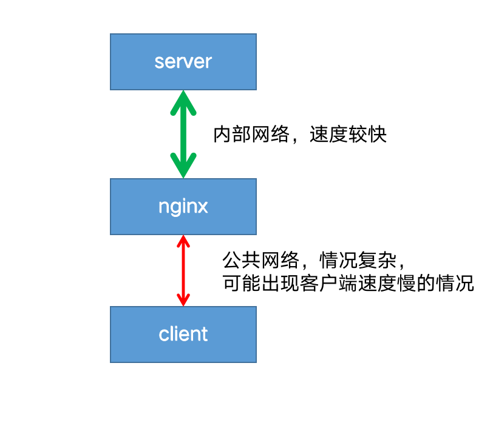
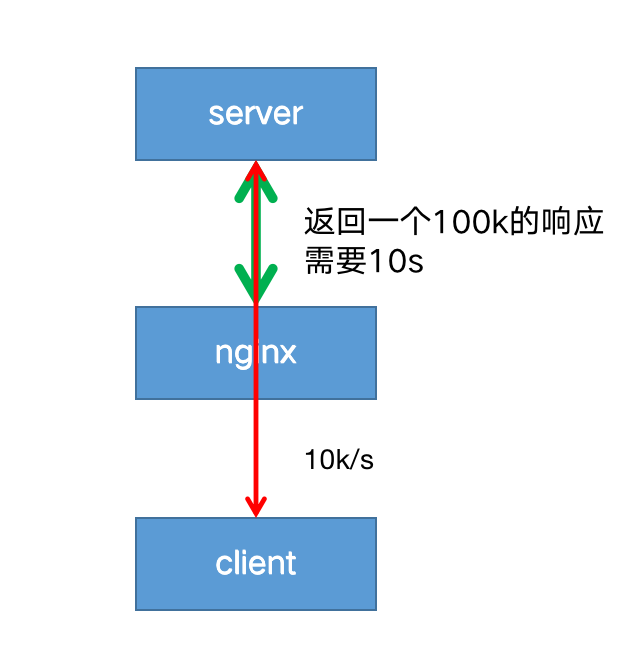
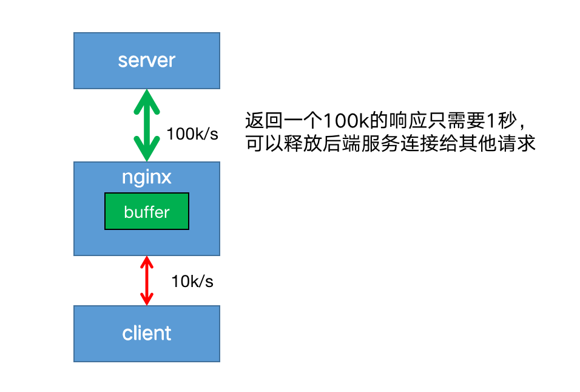
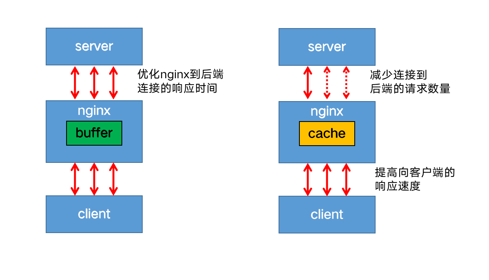
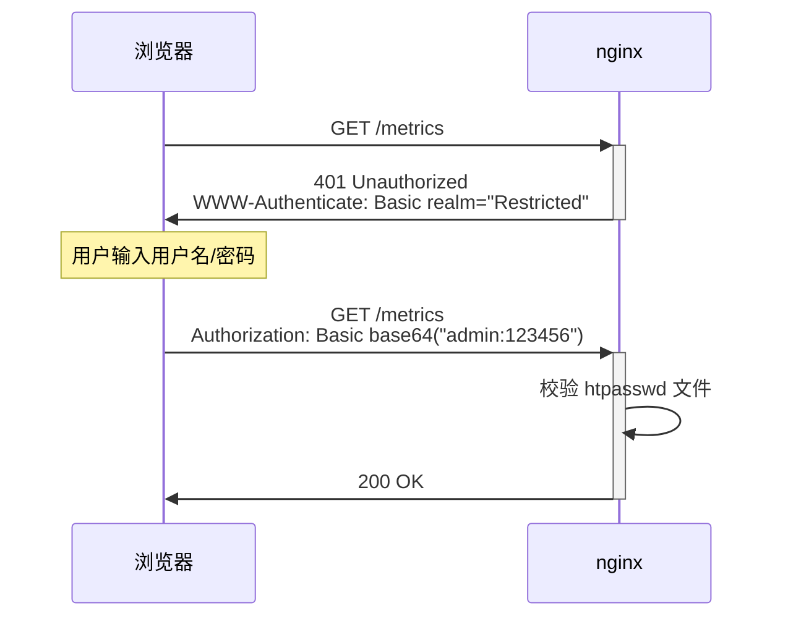
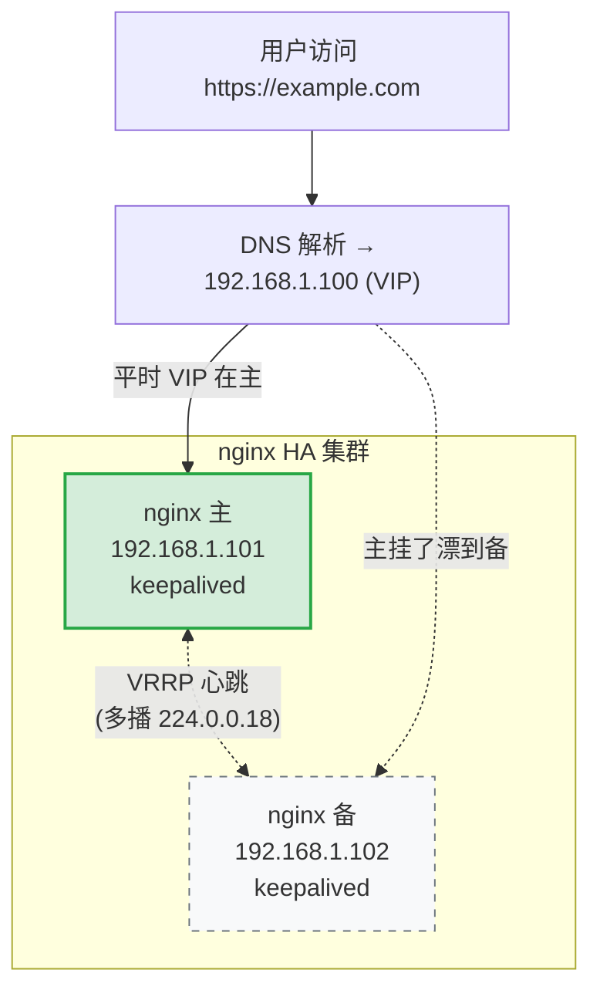

#article/myblog  
> 接上篇 [Nginx 入门](https://blog.hazenix.top/article/nginx-quick-start)。这一篇讲的是：默认配置跑得起来之后，怎么把它调到能扛上线流量。
>
> 不是每个项目都需要这些配置。如果网站日活几百、后端没什么压力，default.conf 改改 server_name 就够用了。这篇主要是用于应对如下场景：
>
> - 后端被慢客户端拖垮
> - 想加接口限流
> - 上了 HTTPS 之后 CPU 飙高
> - 保证 nginx 高可用（HA）
> - 日志太杂、出问题查不动
> - 静态资源和动态接口混在一起，性能太低

[toc]

[spacer]

## Nginx 缓冲（buffer）

缓冲一般放在内存中，如果不适合放入内存（比如超过了指定大小），则会将响应写入磁盘临时文件中。

**启用缓冲后，nginx 先将后端的请求响应（response）放入缓冲区中，等到整个响应完成后，再发给客户端**。



客户端往往是公共网络，情况复杂，可能出现网络不稳定，速度较慢的情况。

而 nginx 到后端 server 一般处于同一个机房或者区域，网速稳定且速度极快。



如果禁用了缓冲，则在客户端从代理服务器接收响应时，响应将同步发送到客户端。

对于需要尽快开始接收响应的快速交互式客户端，此行为可能是可取的

但是这会带来一个问题：**因为客户端到 nginx 的网速过慢，导致 nginx 只能以一个较慢的速度将响应传给客户端；进而导致后端 server 也只能以同样较慢的速度传递响应给 nginx**，造成一次请求连接耗时过长。

在高并发的情况下，后端 server 可能会出现<u>大量的连接积压，最终拖垮 server 端</u>。

> **如果<u>不使用缓冲区</u>，过程是这样的：**
>
> 1. 后端服务器瞬间生成好了一份 10MB 的数据，想一口气扔给 Nginx。
>
> 2. Nginx 接到数据，转头想扔给客户端。
>
> 3. **但是！** 客户端接收能力很差，一秒钟只能接一点点数据。
>
> 4. 因为 Nginx 手里没有“仓库”（缓冲区），它不能先把数据存下来，它必须**一边从后端收，一边往客户端发**。
>
> 5. 由于客户端那边堵住了（接收太慢），Nginx 的发车口就堵住了，且 Nginx 此时没法把数据暂存，所以它**无法继续从后端读取新数据**（否则内存会爆）
>
>    **结果：** 后端服务器明明一秒钟能处理完的事，现在被迫陪着客户端慢慢“磨”。后端服务器的连接（Connection）一直被占用，直到这 10MB 数据全部慢吞吞地传完给客户端，这个连接才能释放。




开启代理缓冲后，**nginx 可以用较快的速度尽可能将响应体读取并缓冲到本地内存或磁盘中，然后同时根据客户端的网络质量以合适的网速将响应传递给客户端**。

这样既解决了 server 端连接过多的问题，也保证了能持续稳定的像客户端传递响应。

[spacer]

可以使用：

* [proxy_buffering](https://nginx.org/en/docs/http/ngx_http_proxy_module.html#proxy_buffering) 参数：启用和禁用缓冲，nginx 默认为 on 启用缓冲，若要关闭，设置为 off。

  ```nginx
  proxy_buffering off;
  ```

* [proxy_buffers](https://nginx.org/en/docs/http/ngx_http_proxy_module.html#proxy_buffers) 指令：设置每个连接读取响应的缓冲区的`大小`和`数量`。默认情况下，缓冲区大小等于一个内存页，4K 或 8K，具体取决于操作系统。

* [proxy_buffer_size](https://nginx.org/en/docs/http/ngx_http_proxy_module.html#proxy_buffer_size) 指令：设置**设置用于读取响应“第一部分”的缓冲区大小**（这个“第一部分”通常指的是后端服务器返回的响应头）

  ```nginx
  location / {
      # 分配 2KB 的空间专门用来快速读取后端返回的响应头信息，剩下的数据则使用 16 个 4KB 缓冲区来处理
      proxy_buffers 16 4k;
      proxy_buffer_size 2k;
      proxy_pass http://localhost:8088;
  }
  ```

  如果整个响应不适合存到内存里，则将其中的一部分保存到磁盘上的‎‎临时文件中‎‎。

  > **与** `proxy_buffers` **的区别**
  >
  > | 指令                | 作用对象         | 典型配置建议                         |
  > | ------------------- | ---------------- | ------------------------------------ |
  > | `proxy_buffer_size` | 响应头 (Headers) | 通常较小，如 `4k` 或 `2k`            |
  > | `proxy_buffers`     | 响应体 (Body)    | 数量多且总容量大，如 `8 4k` (即 32k) |


> 其他：
>
> ‎[‎proxy_max_temp_file_size‎](https://nginx.org/en/docs/http/ngx_http_proxy_module.html#proxy_max_temp_file_size)‎：设置临时文件的最大值。
>
> ‎[‎proxy_temp_file_write_size‎](https://nginx.org/en/docs/http/ngx_http_proxy_module.html#proxy_temp_file_write_size)‎：设置一次写入临时文件的大小。

[spacer]

## Nginx 缓存（cache）

启用缓存后，nginx 将响应保存在磁盘中，返回给客户端的数据首先从缓存中获取，这样子相同的请求不用每次都发送给后端服务器，减少到后端请求的数量。



* 要启用缓存，需要在 http 上下文中使用 [proxy_cache_path](https://nginx.org/en/docs/http/ngx_http_proxy_module.html#proxy_cache_path) 指令，定义缓存的本地文件目录，名称和大小。
* 缓存区可以被多个 server 共享，使用 [proxy_cache](https://nginx.org/en/docs/http/ngx_http_proxy_module.html#proxy_cache) 指定使用哪个缓存区。

```nginx
http {
    proxy_cache_path /data/nginx/cache keys_zone=mycache:10m;
    server {
        proxy_cache mycache;
        location / {
            proxy_pass http://localhost:8000;
        }
    }
}
```

> 缓存目录的文件名是 [proxy_cache_key](https://nginx.org/en/docs/http/ngx_http_proxy_module.html#proxy_cache_key) 的 MD5 值。
>
> 例如：`/data/nginx/cache/c/29/b7f54b2df7773722d382f4809d65029c`
>
> [proxy_cache_key](https://nginx.org/en/docs/http/ngx_http_proxy_module.html#proxy_cache_key) 默认设置如下：
>
> ```nginx
> proxy_cache_key $scheme$proxy_host$uri$is_args$args;
> ```
>
> 也可以自定义缓存的键，例如
>
> ```nginx
> proxy_cache_key "$host$request_uri$cookie_user";
> ```

> 缓存不应该设置的太敏感，可以使用 [proxy_cache_min_uses](https://nginx.org/en/docs/http/ngx_http_proxy_module.html#proxy_cache_min_uses) 设置相同的 key 的请求，访问次数超过指定数量才会被缓存。
>
> ```nginx
> proxy_cache_min_uses 5;
> ```

默认情况下，响应无限期地保留在缓存中。仅当缓存超过最大配置大小时，按照时间删除最旧的数据。

### 完整示例

```nginx
proxy_cache_path /var/cache/nginx/data keys_zone=mycache:10m;

server {

    listen 8001;
    server_name ruoyi.localhost;

    location / {
        #设置 buffer
        proxy_buffers 16 4k;
        proxy_buffer_size 2k;
        proxy_pass http://localhost:8088;
    }


    location ~ \.(js|css|png|jpg|gif|ico) {
        #设置 cache
        proxy_cache mycache;
        proxy_cache_valid 200 302 10m;
        proxy_cache_valid 404      1m;
        proxy_cache_valid any 5m;

        proxy_pass http://localhost:8088;
    }

    location = /html/ie.html {

        proxy_cache mycache;
        proxy_cache_valid 200 302 10m;
        proxy_cache_valid 404      1m;
        proxy_cache_valid any 5m;

        proxy_pass http://localhost:8088;
    }

    location ^~ /fonts/ {

        proxy_cache mycache;
        proxy_cache_valid 200 302 10m;
        proxy_cache_valid 404      1m;
        proxy_cache_valid any 5m;

        proxy_pass http://localhost:8088;
    }

}
```

### 缓存击穿：proxy_cache_lock

上面是基础玩法。生产里还有几个坑要绕。

第一个：**缓存击穿**。一个热点 key 缓存刚过期，瞬间一万个请求同时打过来，发现缓存没了，全都穿透到后端。后端可能就直接挂了。

`proxy_cache_lock` 用来解决这个问题。开启后，**同一个 key 同时只允许一个请求去回源，其他请求排队等结果**：

```nginx
location / {
    proxy_cache mycache;
    proxy_cache_valid 200 10m;

    proxy_cache_lock on;             # 同 key 只放一个请求回源
    proxy_cache_lock_timeout 5s;     # 等不到的话最多等 5 秒，超时后自己也回源
    proxy_cache_lock_age 5s;         # 上一个回源 5 秒还没回来就再放一个

    proxy_pass http://backend;
}
```

### 后端挂了用旧缓存：proxy_cache_use_stale

第二个坑：后端挂了，缓存又刚好过期。这时候 nginx 直接返 502/504，用户骂街。

`proxy_cache_use_stale` 让 nginx 在指定的错误情况下，**优先返回过期的缓存**——总比 502 好：

```nginx
location / {
    proxy_cache mycache;
    proxy_cache_valid 200 10m;

    # 后端 5xx、超时、连不上时，用过期的缓存兜底
    proxy_cache_use_stale error timeout updating http_500 http_502 http_503 http_504;

    # updating：缓存正在被另一个请求更新时，让其他请求直接读旧的，不用排队
    proxy_pass http://backend;
}
```

### 手动清缓存

社区版 nginx **没有内置**清缓存的指令。商业版 NGINX Plus 才有 `proxy_cache_purge` 指令。社区版有两种常见做法：

1. 编译时加 [ngx_cache_purge](https://github.com/FRiCKLE/ngx_cache_purge) 第三方模块，提供 `purge` URL 接口。
2. 直接根据 `proxy_cache_key` 算 MD5、找到磁盘文件 `rm` 掉。简单粗暴，写个脚本就能用。

[spacer]

## 压缩与传输优化

### gzip 进阶

入门篇讲了 `gzip on` + `gzip_types`。生产上还有几个参数：

```nginx
gzip on;
gzip_types text/plain text/css application/json application/javascript application/xml;
gzip_min_length 1024;        # 小于 1KB 不压（压完反而更大）
gzip_comp_level 4;           # 压缩级别 1-9，4 是性价比高，9 太耗 CPU
gzip_vary on;                # 加 Vary: Accept-Encoding 响应头，方便 CDN 区分缓存
gzip_proxied any;            # 经过代理的请求也压
gzip_disable "msie6";        # IE6 别压
```

> 几个常被忽略的点：
> - `gzip_comp_level` 别上 9，6 以上 CPU 涨得很快但压缩率提升不到 5%
> - 图片（jpg/png/webp）已经是压缩格式，再压浪费 CPU，**不要**加到 `gzip_types` 里
> - 启用 `gzip_vary` 之后，CDN 才会按 `Accept-Encoding` 分别缓存压缩版和非压缩版


#### Brotli

Brotli 是 Google 推的压缩算法，**同等 CPU 开销下压缩率比 gzip 高 15%-25%**。现代浏览器（Chrome/Firefox/Safari/Edge）全都支持。

社区版 nginx 默认不带 brotli，需要编译时加 [ngx_brotli](https://github.com/google/ngx_brotli) 模块。配置写法和 gzip 几乎一样：

```nginx
brotli on;
brotli_comp_level 4;
brotli_types text/plain text/css application/json application/javascript application/xml;
```

实际部署可以把 **gzip + brotli 同时打开**，浏览器支持谁就用谁（看 `Accept-Encoding` 请求头）


### sendfile / tcp_nopush / tcp_nodelay 三件套

这三个指令一起用，是静态文件下载场景的标配。(参考入门篇)
**完整推荐配置**：

```nginx
sendfile      on;     # 零拷贝，省一次内存复制
tcp_nopush    on;     # 配合 sendfile，把响应头和文件数据合包发，减小包数
tcp_nodelay   on;     # keep-alive 长连接里，小数据不要等满 MSS 再发，立即发出去
```

> 看起来 `tcp_nopush`（攒包）和 `tcp_nodelay`（不攒）矛盾，其实不矛盾——nginx 内部会根据连接状态自己切换：sendfile 大文件传输时用 nopush 攒包，长连接小请求时用 nodelay 立即发。

[spacer]

## HTTPS 性能优化

入门篇讲了 HTTPS 的基础配置（如 `ssl_certificate` ）。但 HTTPS 上线之后可能会引发 **CPU 飙高**——每个新连接都要做 TLS 握手，且由于使用了复杂的非对称加密算法，很消耗 CPU 资源。

降低开销的核心思路：**让客户端少握手**。下面几个手段是叠加的，建议全开。

### SSL 会话复用：减少握手次数

会话复用（Session Resumption）：让浏览器和 nginx 在第一次握手成功后，把协商好的密钥缓存起来；下次同一个客户端再来，**跳过完整握手**，直接复用。

nginx 默认的 `builtin` 模式只在单 worker 内有效，多 worker 之间不共享，命中率低。生产环境用 `shared`，所有 worker 共享一块内存：

```nginx
ssl_session_cache   shared:SSL:10m;   # 10MB 共享内存，能存约 4 万个会话
ssl_session_timeout 1h;               # 会话有效期，默认 5 分钟，建议拉长到 1 小时
ssl_session_tickets on;               # 开启 Session Ticket，比 Session ID 更省服务端内存
```

### OCSP Stapling：握手时少做一次外部请求

浏览器在握手时要去验证证书是否被吊销，正常流程是浏览器自己去访问证书 CA 的 OCSP 接口——这是一次额外网络请求，慢且容易失败。

OCSP Stapling 让 **nginx 自己定时去查 OCSP，把结果"钉"在握手响应里**，浏览器不用再单独请求一次：

```nginx
ssl_stapling on;
ssl_stapling_verify on;
ssl_trusted_certificate /etc/nginx/ssl/ca-bundle.crt;   # 证书链
resolver 8.8.8.8 1.1.1.1 valid=300s;                    # nginx 自己查 OCSP 用的 DNS
resolver_timeout 5s;
```

### 启用 HTTP/2 和 TLS 1.3

免费的性能提升，没理由不开

```nginx
listen 443 ssl http2;                       # 加上 http2 就开了
ssl_protocols TLSv1.2 TLSv1.3;              # TLS 1.3 握手只要 1-RTT，而且更安全
ssl_prefer_server_ciphers off;              # TLS 1.3 推荐让客户端选加密套件
```

> 注意：HTTP/2 必须配合 HTTPS（虽然规范允许明文 HTTP/2，但所有主流浏览器都强制要 TLS）。
> TLS 1.3 把握手压到了 1-RTT，会话复用甚至可以做到 0-RTT，性能提升明显

[spacer]

## 访问控制

### IP 黑白名单

最基础的一种。`allow` 放行，`deny` 拒绝，**自上而下匹配**，第一条命中就生效：

```nginx
location /admin/ {
    allow 192.168.1.0/24;       # 公司内网放行
    allow 10.0.0.5;             # 老板的 IP 单独放行
    deny  all;                  # 其他全拒
    proxy_pass http://backend;
}
```

> 注意顺序，如果`deny all` 写在最前面就什么都进不来了。

[spacer]

### Basic Auth：最简单的密码保护

给 `/admin`、`/metrics`、Grafana、Kibana 这类**只给内部人看的接口**加一层薄密码，最快的方式就是 Basic Auth——nginx 内置，不用改后端代码，几行配置搞定。

配置好后 用户访问时浏览器会弹一个登录框，输对用户名/密码才放行。

#### 工作流程



#### 配置步骤

**第一步：生成密码文件**

nginx 自己不存密码，它只读一个**密码文件**（约定俗成放 `/etc/nginx/.htpasswd`，名字随便起）。这个文件由 `htpasswd` 工具生成：

```bash
# 装 htpasswd 工具
# Debian/Ubuntu
apt install apache2-utils
# CentOS
yum install httpd-tools

# 第一次创建文件，加用户 admin（会让你输入两次密码）
htpasswd -c /etc/nginx/.htpasswd admin

# 后续再加用户去掉 -c（-c 是 create，会覆盖文件）
htpasswd /etc/nginx/.htpasswd alice
```

生成出来的文件长这样（一行一个用户，密码是加盐 hash 过的，不是明文）：

```
admin:$apr1$xL3pY...$6gJVk.x9z/aBcdEf
alice:$apr1$mN2qR...$8kLpW.y7a/CdEfGh
```

**第二步：在 nginx 里启用**

```nginx
location /metrics {
    auth_basic           "Restricted";          # 弹框上显示的提示文字（随便写）
    auth_basic_user_file /etc/nginx/.htpasswd;  # 指向第一步生成的密码文件

    proxy_pass http://localhost:9090;
}
```

`nginx -s reload` 之后，访问 `/metrics` 浏览器就会弹登录框。

#### 几个常用变种

放在 `server` 块里——**整站**都要密码：

```nginx
server {
    listen 80;
    server_name internal.example.com;

    auth_basic           "Internal Only";
    auth_basic_user_file /etc/nginx/.htpasswd;

    location / {
        proxy_pass http://localhost:3000;
    }
}
```

某个 location 单独**关掉**认证（比如健康检查接口要让 LB 探活）：

```nginx
server {
    auth_basic           "Internal Only";
    auth_basic_user_file /etc/nginx/.htpasswd;

    location /health {
        auth_basic off;                # 关掉
        return 200 "ok";
    }
}
```

#### 必须配合 HTTPS

Basic Auth 把 `用户名:密码` **直接 base64 编码**塞在 `Authorization` 请求头里：

```
Authorization: Basic YWRtaW46MTIzNDU2
```

base64 不是加密，**任何抓包工具都能 1 秒还原成明文**。所以：

- 走 HTTP 等于把密码挂在公告板上，**绝对不要这么用**
- 一定要在 HTTPS 下用 Basic Auth
- 不要把它当主要的认证方案保护重要数据，**只用来挡爬虫和误访问**——真正的后台还是要用 OAuth / JWT 这种正经方案

[spacer]

### 防盗链：valid_referers

别人把你网站上的图片直接 `` 引到他们站点上，盗你的带宽。

使用 `valid_referers` 可以防盗：

```nginx
location ~* \.(jpg|jpeg|png|gif|webp)$ {
    valid_referers none blocked server_names *.example.com;
    if ($invalid_referer) {
        return 403;
    }
}
```

参数含义：
- `none`：允许直接访问（地址栏直接打开图片，没有 referer）
- `blocked`：允许 referer 被代理/防火墙剥掉的情况
- `server_names`：允许自己域名
- `*.example.com`：额外白名单

> 防盗链不是绝对安全的——referer 可以伪造。但可以挡掉大部分懒得伪造的爬虫和盗用方。

[spacer]

## 限流：limit_req 与 limit_conn

使用 Nginx 还可以解决接口被刷、爬虫频繁、突发流量打爆后端的问题

nginx 提供了两种限流：

- **`limit_req`**：限制请求频率（QPS / RPS），漏桶算法
- **`limit_conn`**：限制并发连接数

### limit_req：限请求频率

先在 `http` 块里定义一个限流区域（共享内存）：

```nginx
http {
    # zone 名 = req_limit，10MB 共享内存（约存 16 万个 IP），速率 10 r/s
    limit_req_zone $binary_remote_addr zone=req_limit:10m rate=10r/s;
}
```

然后在 location 里用：

```nginx
location /api/ {
    limit_req zone=req_limit burst=20 nodelay;
    proxy_pass http://backend;
}
```

参数解释：
- `$binary_remote_addr`：以客户端 IP 为限流维度。`$binary_` 比 `$remote_addr` 省内存（4 字节 vs 字符串）
- `rate=10r/s`：每秒最多 10 个请求**通过**
- `burst=20`：突发缓冲，**最多允许 20 个请求排队**
- `nodelay`：排队的请求**立刻处理不延迟**，但仍然占 burst 名额

#### `burst` 和 `nodelay` 配不配，差很多

| 配置 | 行为 |
|---|---|
| 不加 burst | 严格 10r/s，多 1 个直接 503 |
| `burst=20` | 多出来的 20 个排队**慢慢处理**（每秒放 10 个出来），用户会感到明显延迟 |
| `burst=20 nodelay` | 多出来的 20 个**立刻处理**，但 burst 名额只能慢慢恢复（每秒回 10 个）。**生产推荐这个组合** |

> zone 大小怎么估？10MB 大约能存 16 万个唯一 IP（每个 IP 占 64 字节左右）。
> 如果 IP 量更大，扩到 100MB 都不夸张——shared 内存不会真分配物理内存，按需用。

[spacer]

### limit_conn：限制并发连接数

适合限制下载的场景，防止一个 IP 开 100 个线程下载文件：

```nginx
http {
    limit_conn_zone $binary_remote_addr zone=conn_limit:10m;
}

location /download/ {
    limit_conn conn_limit 5;     # 同一 IP 最多 5 个并发连接
}
```

[spacer]

## TCP/UDP 反向代理（stream 模块）

nginx 不仅可以代理 HTTP，也可以代理 TCP / UDP。stream 模块和 http 模块是平级的，写在 `http {}` 外面。

### 基本用法

```nginx
# HTTP 代理
http {
  server {
    listen 8002;
    proxy_pass http://localhost:8080/;
  }
}

# TCP 代理
# 监听 13306 端口，转发到 localhost:3306（代理 MySQL）
stream {
  server {
    listen 13306;
    proxy_pass localhost:3306;
  }
}
```

> （编译时记得带 `--with-stream`，apt/yum 装的版本一般都带了）

[spacer]

### 负载均衡 + 连接池 配置

对于代理数据库这种长连接场景，每个请求都重新建 TCP 连接太浪费。**使用 `keepalive`， 让 nginx 在 worker 内复用到后端的连接**：

```nginx
stream {
    upstream backend-mysql {
        server 192.168.1.10:3306;
        server 192.168.1.11:3306;

        keepalive 8;     # 每个 worker 缓存 8 个空闲连接
    }

    server {
        listen 13306;
        proxy_pass backend-mysql;
    }
}
```

| 参数 | 默认值 | 说明 |
|---|---|---|
| `keepalive` | 无 | 每个 worker 进程缓存到后端的**空闲连接最大数**。超出就关掉最旧的 |
| `keepalive_timeout` | 60s | 空闲连接超过这个时间就关掉 |

> 连接池大小怎么定：
> - 数据库代理（MySQL/Redis）：8-32，避免占太多 DB 连接
> - HTTP 应用服务器：可以更大（128 起步），看后端能扛多少

[spacer]

### UDP 反代

```nginx
stream {
    server {
        listen 53 udp;
        proxy_pass dns_upstream;
    }
}
```

DNS、syslog、游戏服务器这种 UDP 协议都能代。

[spacer]

## 动静分离的工程实践

入门篇推荐写法里讲了 `try_files` 把静态请求拦在 nginx 这一层，不要全打到后端。这里更进一步：**多级 fallback**（当 nginx 找不到静态文件时，按一个**优先级链**继续找，找到最后还没结果才交给后端）

### 一个典型的前后端混合站点

假设你有一个项目长这样：

- 用 Vue/React 写的前端，打包出来放在 `/var/www/static`，入口是 `index.html`
- 后端 Node 服务监听在 `localhost:3000`，提供 `/api/*` 接口
- 前端用了客户端路由（History 模式），所以 `/user/profile` 这种 URL 在服务器上**根本没有对应文件**

这种站点用一个 `try_files` 就能搞定：

```nginx
server {
    root /var/www/static;

    location / {
        try_files $uri $uri/ /index.html @backend;
    }

    location @backend {
        proxy_pass http://localhost:3000;
    }
}
```

`try_files` 的语法是**从左到右依次尝试，命中就停**。最后一个参数必须是兜底，可以是状态码（`=404`）或者命名 location（`@xxx`）。

### 三种典型请求

**请求 1：`GET /logo.png`**（一张图片，物理存在）

```
1. $uri      → 试 /var/www/static/logo.png       ✓ 存在，直接返回
   (不走后面三步)
```

nginx 直接读文件返回，**不会碰后端**。

**请求 2：`GET /docs/`**（一个目录，里面有 index.html）

```
1. $uri      → 试 /var/www/static/docs           ✗ 这不是文件
2. $uri/     → 试 /var/www/static/docs/          ✓ 是目录，自动找 index.html
   (不走后面两步)
```

**请求 3：`GET /user/profile`**（前端路由，物理不存在）

```
1. $uri      → 试 /var/www/static/user/profile          ✗
2. $uri/     → 试 /var/www/static/user/profile/         ✗
3. /index.html → 试 /var/www/static/index.html          ✓ 返回 SPA 入口
   (浏览器拿到 index.html 后，前端路由会读 URL 接管渲染)
```

注意第 3 步：返回的是 `index.html` 的内容，**但浏览器地址栏仍然是 `/user/profile`**。前端 JS 读到这个 URL，自己渲染对应页面。这就是为什么 SPA 项目都要配这一行。

**请求 4：`GET /api/user/list`**（后端接口）

```
1. $uri        → 试 /var/www/static/api/user/list        ✗
2. $uri/       → 试 /var/www/static/api/user/list/       ✗
3. /index.html → 哎，这里有坑！                            ✗（看下面）
```

> **注意**：上面这个配置对 `/api/*` 请求**也会先返回 index.html**，因为 try_files 第 3 步永远会命中（index.html 一直存在），根本走不到 `@backend`！
>
> 解决方法：**给 `/api/` 单独配一个 location，优先级比 `/` 高**：
>
> ```nginx
> server {
>     root /var/www/static;
> 
>     # API 请求直接走后端，跳过 try_files
>     location /api/ {
>         proxy_pass http://localhost:3000;
>     }
> 
>     location / {
>         try_files $uri $uri/ /index.html;
>     }
> }
> ```
>
> 这样 `/api/*` 走 `proxy_pass`，其余的走 try_files。这是生产里更常见的写法。

### 什么时候用 `@backend`，什么时候用单独 location

最开头那个带 `@backend` 的版本，它适合的场景是：**前端是 MPA（多页应用）**或者**前后端 URL 没有清晰的前缀划分**（比如老项目里有些动态页面叫 `/user.do`、`/order.action`，这些请求文件也找不到、index.html 又不适合返回，就让它们落到 `@backend`）

但凡前后端是 SPA + 清晰 `/api/` 前缀，**推荐用上面那个独立 location 的写法**，更明确，不容易出 bug。


[spacer]

## 日志运维

### 自定义 log_format

默认的 `combined` 日志格式信息少，生产环境一般自己定义：

```nginx
log_format detailed '$remote_addr - $remote_user [$time_local] '
                    '"$request" $status $body_bytes_sent '
                    '"$http_referer" "$http_user_agent" '
                    'rt=$request_time uct=$upstream_connect_time '
                    'uht=$upstream_header_time urt=$upstream_response_time '
                    'uaddr=$upstream_addr';

access_log /var/log/nginx/access.log detailed;
```

- `$request_time`：nginx 处理完这个请求总共花的时间（从收到第一个字节到发完响应）
- `$upstream_response_time`：后端处理时间。如果这个值高，说明后端慢
- `$upstream_addr`：实际打到了哪台后端机器，排查负载均衡问题的关键
- `$upstream_status`：后端返回的状态码

> `$request_time` 减去 `$upstream_response_time` 大致就是 nginx 自己 + 网络的耗时，能用于定位是 nginx 慢、后端慢还是网络慢

### 按 server 分文件

每个 server 单独一个日志文件，看起来清爽：

```nginx
server {
    server_name api.example.com;
    access_log /var/log/nginx/api.access.log detailed;
    error_log  /var/log/nginx/api.error.log;
    # ...
}

server {
    server_name www.example.com;
    access_log /var/log/nginx/www.access.log detailed;
    error_log  /var/log/nginx/www.error.log;
    # ...
}
```

### JSON 格式日志：方便 ELK 采集

如果接了 ELK / Loki 这种日志系统，建议使用 JSON 格式，比文本更好解析：

```nginx
log_format json escape=json '{'
    '"time":"$time_iso8601",'
    '"remote_addr":"$remote_addr",'
    '"request":"$request",'
    '"status":$status,'
    '"bytes":$body_bytes_sent,'
    '"rt":$request_time,'
    '"urt":"$upstream_response_time",'
    '"ua":"$http_user_agent"'
'}';
```

> `escape=json` 必加，否则 user_agent 里的引号会把 JSON 弄坏。

### 日志轮转：logrotate

nginx 自己不做日志切割，靠系统的 `logrotate`。Debian/Ubuntu 用 apt 装的 nginx 默认带 `/etc/logrotate.d/nginx`，长这样：

```
/var/log/nginx/*.log {
    daily
    missingok
    rotate 14            # 保留 14 天
    compress
    delaycompress
    notifempty
    create 0640 nginx adm
    sharedscripts
    postrotate
        [ ! -f /var/run/nginx.pid ] || kill -USR1 `cat /var/run/nginx.pid`
    endscript
}
```

> 关键点是 `postrotate` 里的 `kill -USR1`——这个信号告诉 nginx **重新打开日志文件**。否则 nginx 会一直往老的（已经被 mv 过的）文件里写，新日志文件就一直是空的。

[spacer]

## 高可用：Keepalived + Nginx 主备

到目前为止我们做的所有调优——缓存、限流、HTTPS 优化，都是**单机**优化。但只要 nginx 还是一台机器，它就是单点：网卡坏了、机器宕了、OS 崩了，整个站点都挂。

生产环境的标准做法是**两台 nginx 互为主备**，做高可用（HA）：



### 相关概念

**VIP（Virtual IP，虚拟 IP）**

不是哪一台机器的真实 IP，是一个**可以在多台机器之间漂移**的 IP。

平时它"挂"在主机的网卡上——主机响应所有发到这个 IP 的请求；当主机挂了，这个 IP 就"漂"到备机的网卡上——备机开始响应。**对外看起来 IP 没变**，用户、DNS、防火墙规则全都不需要改。

DNS 解析填的是 VIP，不是任何一台 nginx 的真实 IP。

**VRRP（Virtual Router Redundancy Protocol）**

这是 IETF 标准协议，专门解决"两台机器抢一个 VIP"的问题。简单来说：

1. 两台机器配同一个 VIP
2. 谁的**优先级（priority）高**，谁来挂这个 VIP（成为 MASTER）
3. MASTER 每秒（`advert_int 1`）发一个心跳包到多播地址 `224.0.0.18`，宣告"我还活着"
4. BACKUP 听到心跳就老老实实待命；**连续几次听不到心跳，就认为主挂了，自己接管 VIP**

> Keepalived 就是 VRRP 协议的一个开源实现，外加健康检查、邮件告警等周边功能。
>

**为什么要"心跳 + 优先级"而不是简单的两台轮值**

因为分布式系统里"对方是不是真挂了"不是一个简单的问题——可能是网络抖动、可能是机器卡了 2 秒、可能是 nginx 进程没了但机器还在。VRRP 用心跳超时给一个明确的判定，用优先级保证恢复后主机能自动夺回 VIP。

[spacer]

### 故障切换的完整流程

主机出问题的几种情况，Keepalived 各自怎么处理：

| 故障类型 | Keepalived 能不能感知 | 怎么切 |
|---|---|---|
| 主机断电 / 网卡坏 | 能 | 备机连续 3 次（约 3 秒）收不到心跳，认为主挂了，自己接管 VIP |
| 主机的 nginx 进程死了，但机器还活 | **默认感知不到**，心跳还在发，VIP 不切 | 这就是为什么必须配 `vrrp_script` 健康检查 |
| 主机恢复 | 能 | 主机优先级更高，自动抢回 VIP（如果你不想抢回，加 `nopreempt` 参数）|

### 安装

```bash
# CentOS
yum install keepalived -y

# Ubuntu
apt install keepalived -y
```

### 主机配置 `/etc/keepalived/keepalived.conf`

```nginx
global_defs {
    router_id NGINX_MASTER     # 当前节点的标识，主备最好不一样，方便日志区分
}

# 健康检查脚本：检查 nginx 是不是活着
vrrp_script chk_nginx {
    script   "/etc/keepalived/check_nginx.sh"
    interval 2          # 每 2 秒跑一次脚本
    weight   -20        # 脚本失败时，把当前节点的优先级 -20
    fall     2          # 连续 2 次失败算 down
    rise     1          # 1 次成功算 up
}

vrrp_instance VI_1 {
    state MASTER
    interface eth0              # VIP 要绑在哪张网卡上，根据实际网卡名改
    virtual_router_id 51        # 主备必须一致（同网段下不同 keepalived 组也不能重复）
    priority 100                # 主机优先级
    advert_int 1                # 心跳间隔 1 秒
    authentication {
        auth_type PASS
        auth_pass 1111          # 主备一致，防止局域网内别的 VRRP 误加入
    }
    virtual_ipaddress {
        192.168.1.100           # VIP，可以写多个
    }
    track_script {
        chk_nginx               # 挂载上面定义的健康检查
    }
}
```

**`weight -20` 这一行最关键**，它是连接"nginx 死活"和"VIP 漂移"的桥梁：

- 主机正常：优先级 100，备机 90，主机赢，VIP 在主机
- 主机的 nginx 挂了 → 健康检查失败 → 主机优先级被减成 100 - 20 = **80**
- 备机优先级 90 > 主机 80，**备机自动接管 VIP**

整个判断在备机本地完成，不需要主机主动通知"我不行了"——避免了"主机网络都断了它哪来力气通知备机"这种死锁。

### 备机配置

和主机几乎一样，只改三处：

```nginx
global_defs {
    router_id NGINX_BACKUP     # 改成 _BACKUP
}

vrrp_instance VI_1 {
    state BACKUP                # 改成 BACKUP
    interface eth0
    virtual_router_id 51
    priority 90                 # 比主机低
    # ... 其他全部和主机一样
}
```

> 实际上 `state` 这个字段只是个初始声明，最终谁是 MASTER 由 priority 决定。两边都写 `BACKUP` 也能跑——但写明白点方便维护。

### 健康检查脚本

`/etc/keepalived/check_nginx.sh`：

```bash
#!/bin/bash
# 检查 nginx 进程是否存在
if ! pgrep -x nginx > /dev/null; then
    # 没了，先试着拉起来一次（可能是临时 crash）
    systemctl start nginx
    sleep 1
    
    # 再检查一次，如果还是起不来说明这台机器有问题
    if ! pgrep -x nginx > /dev/null; then
        # 主动把 keepalived 也停掉，让 VIP 立刻漂走
        # 比等优先级降下来更快
        systemctl stop keepalived
        exit 1
    fi
fi
exit 0
```

**两个细节**：

1. 脚本必须 `chmod +x`，否则 keepalived 跑不起来
2. 脚本里那个"自动拉起 nginx"是温柔的兜底——nginx 偶尔 OOM 重启很常见，没必要每次都把整台机器切走

> 进一步可以用 `curl -fsS http://127.0.0.1/health` 代替 `pgrep`，**真正测一下 nginx 能不能响应**，而不只是进程在。但这要求你在 nginx 里配一个 `/health` 接口，看场景。

> ### 验证
>
> ```bash
> # 1) 主机上：看 VIP 是不是绑在网卡上了
> ip addr show eth0 | grep 192.168.1.100
> # 应该能看到 192.168.1.100/32 这一行
> 
> # 2) 备机上：此时不应该有 VIP
> ip addr show eth0 | grep 192.168.1.100
> # 应该没输出
> 
> # 3) 模拟故障：把主机的 nginx 干掉
> systemctl stop nginx
> 
> # 4) 等 4-5 秒（脚本 2 秒一次，连续失败 2 次才触发）
> # 然后到备机上看
> ip addr show eth0 | grep 192.168.1.100
> # 此时 VIP 应该漂到备机来了
> 
> # 5) 在主机上恢复 nginx
> systemctl start nginx
> systemctl start keepalived   # 如果脚本把 keepalived 也停了，要手动起回来
> 
> # 6) 等几秒，VIP 会自动漂回主机
> ```
>
> 切换过程中，外部用户访问 `https://example.com`（DNS → VIP）**几乎无感知**——最多有几秒的 5xx 或者超时，浏览器一刷新就恢复了。
>

### 常见问题

- **`virtual_router_id` 必须主备一致**——这是组的标识，不一样就是两个独立的组，各自抢各自的 VIP，会出现两边都挂着 VIP 的"脑裂"
- **同一局域网内不能有两组 keepalived 用同一个 `virtual_router_id`**——会互相打架
- **云上的虚拟机一般不支持 VRRP**——阿里云、AWS 这种环境，VIP 漂移会被云网络挡住，得用云厂商的 HAVIP / EIP 漂移方案。物理机房或自建 IDC 才能直接用这套
- **防火墙要放行 VRRP 协议（IP 协议号 112）和多播地址 224.0.0.18**——iptables 默认不会挡，但有些云镜像默认装了 firewalld，就会出问题

> 这是最简单的主备方案，适合中小流量。流量再大就要做 LVS + keepalived 双主双活，或者直接上 K8s + Ingress Controller，有兴趣的读者可以自行查阅

[spacer]

## 运维相关

### reload / quit / stop 指令

| 命令 | 行为 | 什么时候用 |
|---|---|---|
| `nginx -s reload` | master 重读配置，fork 新 worker，老 worker 处理完手头请求自杀 | **改完配置后使用**，零停机 |
| `nginx -s quit` | 优雅退出，等所有连接处理完才退 | 主动停服时用 |
| `nginx -s stop` | 强制立即退出，未处理完的请求直接断 | 不推荐，紧急情况才用 |
| `systemctl restart nginx` | 完全重启，会有几百毫秒断流 | reload 解决不了的疑难情况 |

> 99% 的情况都用 `reload`。改完配置先 `nginx -t` 测试语法，再 `nginx -s reload`

### 灰度配置

新配置上线怕翻车？考虑使用 weight 参数实现灰度发布：

```nginx
upstream backend {
    server v1.backend.local weight=9;     # 90% 流量走老版本
    server v2.backend.local weight=1;     # 10% 试水
}
```

观察一段时间没问题，再调成 5:5、1:9，最后下掉老版本。

[spacer]

### 其他可能问题

#### 接 CDN 之后，nginx 拿到的 IP 是 CDN 节点

如果使用了 CDN（CloudFlare、阿里云 CDN、腾讯 CDN 等），用户请求路径：


nginx 看到的 `$remote_addr` 是 **CDN 节点的 IP（8.8.8.8）**，不是真实用户的 1.2.3.4。后果：

- **限流失效**：你按 IP 限流，但所有请求看起来都来自同一批 CDN 节点 IP，要么误伤合法用户、要么形同虚设
- **日志失真**：access.log 里全是 CDN 节点的 IP，根本不知道谁在访问
- **风控失效**：靠 IP 做的封禁、地理位置判断全都歪了

CDN 通常会把真实 IP 放在 `X-Forwarded-For` 或 `X-Real-IP` 请求头里。nginx 自带的 `ngx_http_realip_module` 就是用来读这个头、把 `$remote_addr` **替换成真实 IP**：

```nginx
# 告诉 nginx：这些 IP 段是可信的代理（也就是你 CDN 的回源 IP 段，CDN 厂商会给）
set_real_ip_from 192.168.0.0/16;
set_real_ip_from 10.0.0.0/8;
# 实际场景填你的 CDN 厂商提供的 IP 段，比如阿里云 CDN 的回源 IP

# 从这个请求头里取真实 IP
real_ip_header X-Forwarded-For;

# 如果中间经过了多层代理，X-Forwarded-For 会是 "用户IP, 代理1, 代理2"
# 开启 recursive 后 nginx 会从右往左跳过所有可信 IP，取到最左边的真实用户 IP
real_ip_recursive on;
```

> **为什么要 `set_real_ip_from` 限制可信 IP**？因为 `X-Forwarded-For` 是请求头，**任何人都可以伪造**。如果不限制可信源，攻击者随便发个 `X-Forwarded-For: 1.1.1.1` 就能绕过你的 IP 风控。`set_real_ip_from` 的意思是"只有从这些 IP 来的请求，我才相信它头里的真实 IP"。

配完之后，`$remote_addr` 就是真实用户 IP 了，限流、日志、风控才有意义。

#### 大文件上传被截断

nginx 默认 `client_max_body_size` 是 1MB。**请求体超过这个值，会返回 413 Request Entity Too Large**

> 前端上传图片视频可能遇到这个问题

```nginx
# 这几个可以放在 http / server / location 任意一层
client_max_body_size 100m;          # 允许的请求体最大尺寸
client_body_buffer_size 1m;         # 接收请求体的内存缓冲区。超出部分会落到临时文件
client_body_timeout 60s;            # 读完整个请求体的超时时间
```

值怎么定：

- 普通后台、表单为主的站点 → 10m-100m 够用
- 头像、图片上传 → 10m-50m
- 视频/大文件上传站点 → 1g-2g

> 注意 `client_max_body_size` 设大，不代表 nginx 会占用那么多内存——超过 `client_body_buffer_size` 的部分会写到磁盘临时文件（`/var/lib/nginx/body/`），最后再转发给后端。

#### 上传/下载大文件时连接超时

nginx 和后端之间也有一堆超时参数。默认值在普通接口下够用，但**遇到耗时长的接口或者大文件传输就会被中断**：

```nginx
# nginx 和后端建连的超时
proxy_connect_timeout 60s;

# nginx 等后端返回数据的超时（两次数据包之间的间隔，不是总时间）
proxy_read_timeout    60s;

# nginx 向后端发送数据的超时（同上，是两次发送之间的间隔）
proxy_send_timeout    60s;
```

案例：你的后端有一个生成报表的接口要跑 90 秒，前端调它会发现 60 秒就被 nginx 切断、返回 504。把 `proxy_read_timeout` 调到 120s 就好了。

> 这几个 timeout 是**两次数据包之间的最大间隔**，不是总时长。所以只要后端定期吐数据（比如流式响应），就算总耗时 10 分钟也不会触发超时。

[spacer]


## 工具简介

Nginx 相关的可视化和管理工具：

- **[Nginx Amplify](https://amplify.nginx.com/)**：nginx 官方出的监控，免费版够用。装个 agent 就能看到 QPS、连接数、状态码分布、慢请求 top。
- **[Nginx Proxy Manager](https://nginxproxymanager.com/)**：Web UI 管理反向代理 + Let's Encrypt 自动续证书，特别适合家用 NAS 或个人项目。
- **[GoAccess](https://goaccess.io/)**：把 access.log 直接渲染成 HTML 仪表盘，命令行一行搞定。
- **[NginxConfig](https://www.digitalocean.com/community/tools/nginx)**：在线生成 nginx 配置文件的工具，DigitalOcean 出品。新手参考用。

[spacer]

## 参考

- 官方文档：
  - [proxy_cache_lock / proxy_cache_use_stale](https://nginx.org/en/docs/http/ngx_http_proxy_module.html#proxy_cache_lock)
  - [ngx_http_limit_req_module](https://nginx.org/en/docs/http/ngx_http_limit_req_module.html)
  - [ngx_http_limit_conn_module](https://nginx.org/en/docs/http/ngx_http_limit_conn_module.html)
  - [ssl_stapling](https://nginx.org/en/docs/http/ngx_http_ssl_module.html#ssl_stapling)
  - [ngx_stream_core_module](https://nginx.org/en/docs/stream/ngx_stream_core_module.html)
  - [ngx_http_realip_module](https://nginx.org/en/docs/http/ngx_http_realip_module.html)
- [Keepalived 官方文档](https://www.keepalived.org/manpage.html)
- [ngx_brotli](https://github.com/google/ngx_brotli)
- [ngx_cache_purge](https://github.com/FRiCKLE/ngx_cache_purge)
- 系列其他文章：
  - [Nginx 入门](从静态站点到反向代理：Nginx%20配置快速入门.md)
  - Nginx 原理（待发布）
