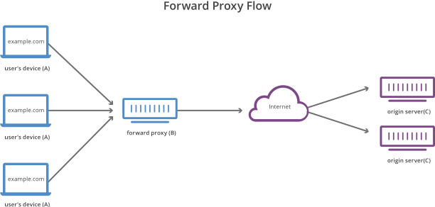
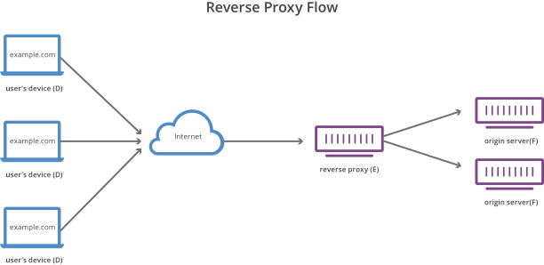
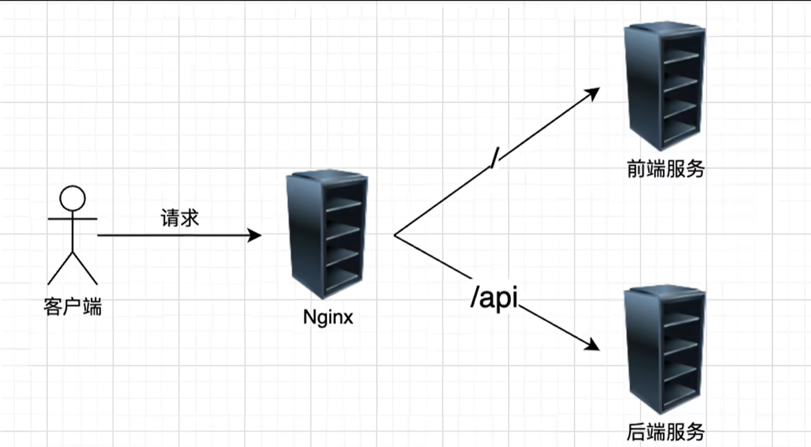
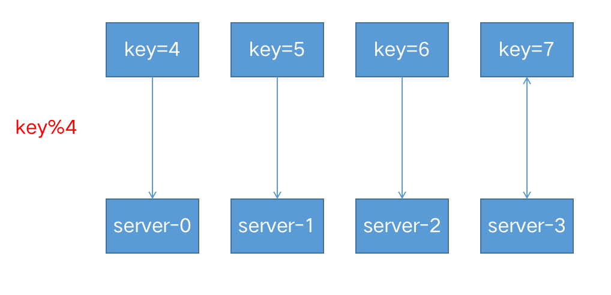
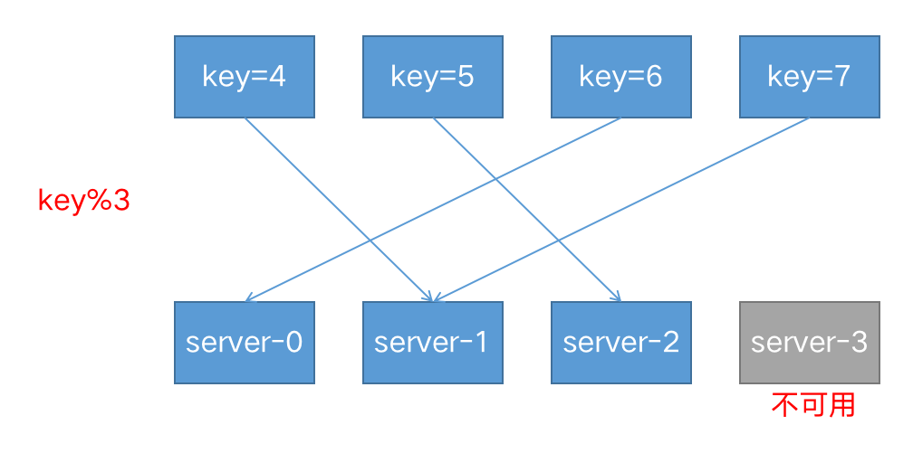
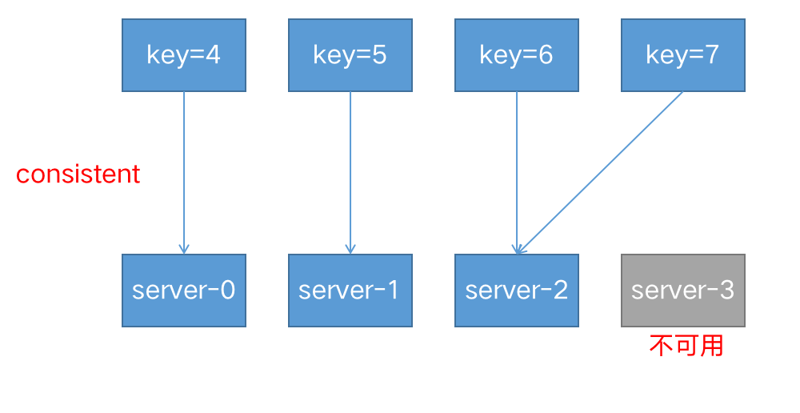
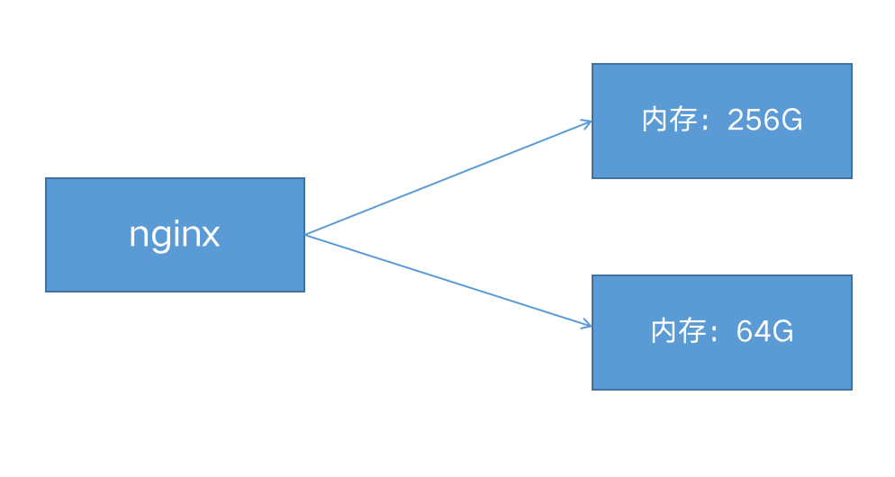
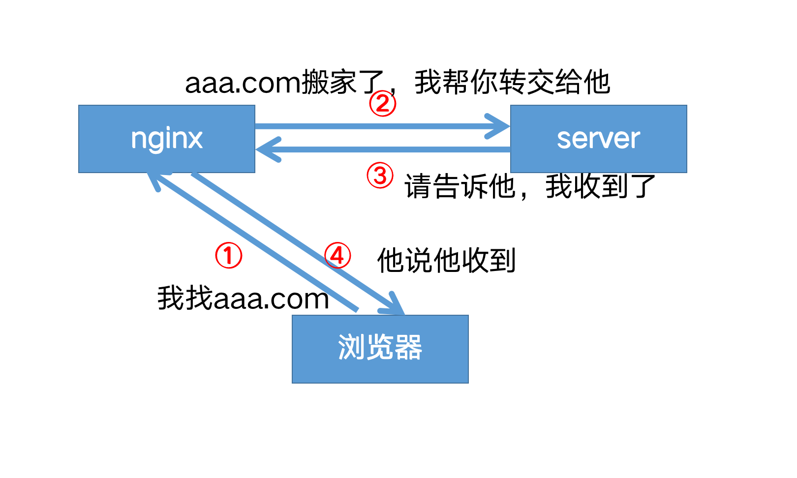
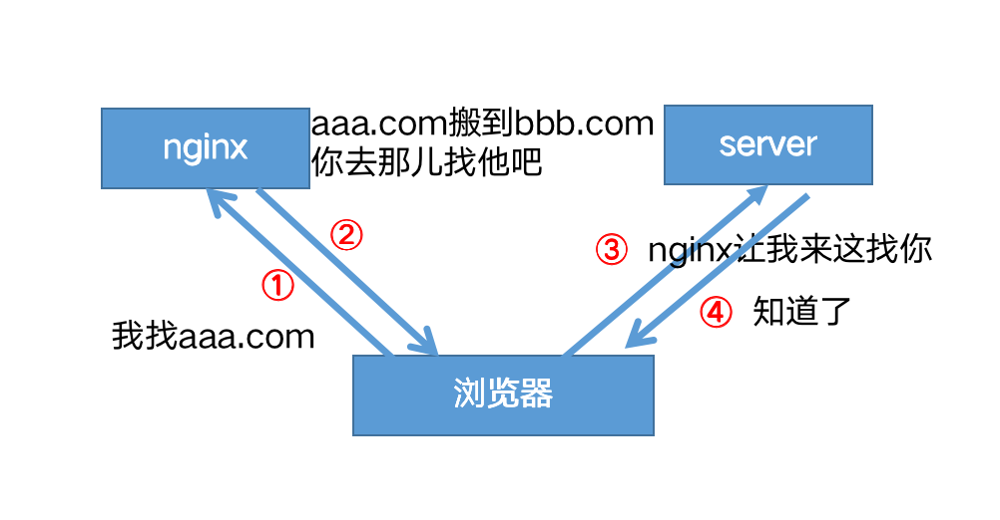

#article/myblog (入门篇)


> 在公司部署又涉及到了 nginx，之前只学到了会用的程度，借此机会深入学习一下，顺便整理一些博客出来，感兴趣的朋友可以订阅这个系列👍

本系列共三篇：
- 入门（本篇）：会用就够了的那部分
- 进阶：缓存、限流、HTTPS 优化、高可用
- 原理：nginx 为什么这么快


## 是什么 

Nginx 是一款轻量级的 Web 服务器、反向代理服务器，由于它的内存占用少，启动极快，高并发能力强，在互联网项目中广泛应用。


##  Nginx 安装

不同发行版安装方式不一样，挑你环境对应的那条。

**Debian / Ubuntu**

```bash
sudo apt update
sudo apt install nginx
```

**CentOS / RHEL**

```bash
sudo yum install epel-release   # nginx 不在默认源，要先加 epel
sudo yum install nginx
```

**Docker**

不想动主机环境就用 Docker，起一个容器：

```bash
docker run -d --name nginx -p 80:80 nginx
```

把宿主机的 80 端口映射到容器，访问 `http://localhost` 就能看到欢迎页。
如果想改配置就挂载本地目录：

```bash
docker run -d --name nginx -p 80:80 \
  -v /your/path/nginx.conf:/etc/nginx/nginx.conf \
  -v /your/path/conf.d:/etc/nginx/conf.d \
  nginx
```

**源码编译**

apt/yum 装的版本通常会比官网新版落后几个小版本，且默认没编译某些第三方模块（比如后面会提到的 `ngx_brotli`）。这种情况就只能源码编译，这里不展开，进阶篇再聊。

装完之后用 `nginx -v` 看版本，`systemctl status nginx` 看状态。


## 基本信息

* 日志默认在/var/log/nginx 目录

#### 配置文件


* 配置文件默认在/etc/nginx 目录下
	* 默认配置文件是 nginx.conf
	* 默认包含 conf.d 目录下的所有配置文件（`*.conf`）
	* **主配置文件位于 /etc/nginx/nginx.conf** , 下列命令会引用/etc/nginx/conf.d目录下所有的.conf文件，这样可以保持主配置文件的简洁，同时配多个.conf文件方便区分，增加可读性
	  
	  ```nginx
	  include /etc/nginx/conf.d/*.conf
	  ```
	  
	   （详情参考[模块化设计]）
	  
	  * 默认配置位置：/etc/nginx/conf.d/default.conf
	  
	    ```nginx
	    server {
	        listen       80; #监听端口
	        server_name  localhost;
	    
	        location / {
	            root   /usr/share/nginx/html; #根目录
	            index  index.html index.htm; #首页
	        }
	    
	        error_page   500 502 503 504  /50x.html;
	        location = /50x.html {
	            root   /usr/share/nginx/html;
	        }
	    }
	    ```
	  
	* 默认监听80端口；访问80端口会指向这个目录下的 index.html (“welcome to nginx”页面)
	
	  ```nginx
	  listen		80;
	  ......
	  location / {
	      root /usr/share/nginx/html;
	      index index.html index.htm;
	  }
	  ```

#### 相关指令

* 启动 nginx ：`systemctl start nginx`
* 查看 nginx 状态：`systemctl status nginx`
* 重新加载 nginx 的配置文件：`nginx -s reload`

> #### 可能的问题
>
> 在 centos 7 中，用 systemctl 启动 nginx 可能出现如下错误：
>
> `nginx:[emerg]bind()to0.0.0.0:8000 failed (13:Permission denied)`
>
> 这是 selinux 的安全策略引起的。解决方法如下：
>
> - setenforce 0 （临时）
> - 修改/etc/selinux/config，设置SELINUX=disabled （永久有效，需重启）
>
> 


## 基础配置


### 文件结构

```nginx
http {

  server{#虚拟主机
     
    location {
      listen 80；
      server_name localhost;
    }
    location {
       
    }
      
  }

  server{
  
  }

}
```


### 配置静态页面

#### listen

监听可以配置成`IP`或`端口`或`IP+端口` 

```nginx
listen 127.0.0.1:8000; 
listen 127.0.0.1;（ 端口不写,默认80 ） 
listen 8000; 
listen *:8000; 
listen localhost:8000;
```

#### server_name

server_name：`server_name` 的作用就是**告诉 Nginx，当收到一个网络请求时，应该由哪一个“虚拟服务器”来处理**

* 可以使用变量 ` $hostname ` 配置成主机名

* 使用域名：` example.org ` ` www.example.org ` ` *.example.org `

**如果多个 server 的端口重复，那么匹配 server_name 来确定怎么转发**

> 如果有多个 server，server之间的 “监听端口+server_name” 组合不能重复


例子：

```nginx
# curl http://localhost:80 会访问 /usr/share/nginx/html
server {
    listen       80;
    server_name  localhost;

    #access_log  /var/log/nginx/host.access.log  main;

    location / {
        root   /usr/share/nginx/html;
        index  index.html index.htm;
    }
}

# curl http://nginx-dev:80 会访问 /home/AdminLTE-3.2.0
server{
    listen 80;
    server_name nginx-dev;            # 主机名
    
    location / {
        root /home/AdminLTE-3.2.0;    # 指定静态文件根目录
        index index.html index2.html index3.html;   # 指定默认首页
    }
}
```

#### location

> 如果说 `server_name` 是决定请求进入哪栋“大楼”，那么 **`location` 就是这栋大楼里的“前台”或“导航员**
>
> 它的核心作用是：**在确定了服务器（Server）之后，根据你访问的具体路径（URI），决定由谁来处理这个请求 / 把文件存放在哪里。**
>
> 当 Nginx 确定了由哪个 `server` 块来处理请求后，它会拿着 URL 中的路径部分（比如 `/images/logo.png` 中的 `/images/`），去和配置文件里的一个个 `location` 规则进行比对。
>
> - **静态资源服务**：告诉 Nginx，“如果用户要图片，就去服务器的硬盘里找文件夹”。
> - **反向代理**：告诉 Nginx，“如果用户要查数据（API），就把请求转发给后端的 Java/Python 程序”。
> - **权限控制**：告诉 Nginx，“如果是管理员页面，需要密码才能进”。

##### location 修饰符

location 中可以使用修饰符或正则表达式

1. `=`：等于，**精确匹配** ，匹配优先级最高。
2. `^~`  ：表示普通字符匹配，**前缀匹配**。如果匹配成功，则不再匹配其它 location。优先级第二高。
3. `~` ：区分大小写
4. `~*`：不区分大小写，**正则匹配**

**示例**：

```nginx
location ^~ /images/ {
    proxy_pass http://localhost:8080;
}

location ~ \.jpg {
    proxy_pass http://localhost:8080;
}
```

> `/images/1.jpg` 会被代理到 `http://localhost:8080/images/1.jpg`
>
> `/some/path/1.jpg` 会被代理到 `http://localhost:8080/some/path/1.jpg`


**匹配规则的优先级**

Nginx 匹配 `location` 是有严格等级制度的，就像公司审批流程一样：

| 优先级          | 符号/类型  | 说明                                                         | 场景举例                              |
| :-------------- | :--------- | :----------------------------------------------------------- | :------------------------------------ |
| **最高 (秒杀)** | `=`        | **精确匹配**。必须一模一样，差一个字符都不行。               | `location = /login` (只匹配登录页)    |
| **高 (特权)**   | `^~`       | **前缀匹配**。只要以这个开头，就立刻通过，**不再检查后面的正则规则**。 | `location ^~ /static/` (所有静态资源) |
| **中 (正则)**   | `~` / `~*` | **正则匹配**。按书写顺序一个个试，匹配上就停。`~`区分大小写，`~*`不区分。 | `location ~ \.php$` (所有PHP文件)     |
| **低 (普通)**   | (无符号)   | **普通前缀匹配**。匹配最长的路径。                           | `location /images/`                   |
| **最低 (兜底)** | `/`        | **通用匹配**。通常写在最后，接住所有漏网之鱼。               | `location /`                          |

**示例**

假设你的配置如下：

```nginx
server {
    listen 80;
    server_name example.com;

    # 1. 精确匹配：只有访问 / 时才生效，常用于首页优化
    location = / {
        return 200 "这是首页！";
    }

    # 2. 静态资源：匹配 /images/ 开头的路径
    location /images/ {
        root /var/www; 
        # 结果：去 /var/www/images/ 目录下找文件
    }
    
    location ^~ /static/ {
        root /var/www; 
        # 如果以/static开头，就去 /var/www/static/ 目录下寻找
    }

    # 3. 动态接口：匹配 .php 结尾的文件
    location ~ \.php$ {
        proxy_pass http://127.0.0.1:9000;
        # 结果：转发给后端处理
    }

    # 4. 兜底规则：上面都没匹配到，就走这里
    location / {
        return 404 "找不到页面";
    }
}
```

**场景：**

- 访问 `example.com/` → 命中 **1** (`=`)，返回“这是首页！”
- 访问 `example.com/images/a.jpg` → 命中 **2** (普通前缀)，去读文件。
- 访问 `example.com/index.php` → 命中 **3** (`~` 正则)，转发给后端。
- 访问 `example.com/abc` → 命中 **4** (`/`)，返回 404。


> - **`server_name`** 负责把流量引到正确的**网站配置块**。
> - **`location`** 负责在这个配置块内部，把具体的**URL 路径**分发到正确的处理逻辑（读文件、转发、重写等）。


### 配置反向代理

* 正向代理：在**客户端**代理转发请求称为**正向代理**（例如VPN）
  

* 反向代理：在**服务器端**代理转发请求称为**反向代理**（例如nginx）

  


假设现在有一个后端服务，端口为8080；

nginx配置文件：

```nginx
server {
  
  listen 80;
  
  server_name example.com;
  
  location /api {
    proxy_pass http://localhost:8080
  }

}
```


**proxy_pass配置说明：**

如果`proxy-pass`的地址只配置到端口，不包含`/`或其他路径，那么location将被追加到转发地址中

```nginx
location /some/path/ {
    proxy_pass http://localhost:8080;
}
```

> 访问 `http://localhost/some/path/page.html` 将被代理到 `http://localhost:8080/some/path/page.html` 


如果 `proxy-pass` 的地址包括 `/` 或其他路径，那么 `/some/path` 将会被替换

```nginx
location /some/path/ {
    proxy_pass http://localhost:8080/zh-cn/;
}
```

> 访问 `http://localhost/some/path/page.html` 将被代理到 `http://localhost:8080/zh-cn/page.html`（/some/path 不会被追加到请求中）


**作用：**

* 让客户端感知不到后端服务器的存在

* 让前后端域名统一，解决了跨域问题

  

* 可以配置负载均衡策略
* 缓存内容，减少后端负担
* 集中处理SSL加密
* 记录日志


#### 设置代理请求 headers

nginx 转发请求时，会自己生成一份新的请求头发给后端，**不是把客户端原封不动地塞过去**。默认它只会设置两个 header：

```nginx
proxy_set_header Host       $proxy_host;   # = proxy_pass 里写的主机名+端口
proxy_set_header Connection close;         # 用完就断
```

其他 header（比如客户端 IP）默认不会带过去——这就带来一个常见的坑：

> **后端服务拿不到用户的真实 IP**。
>
> 因为站在后端的角度，请求是 nginx 发过来的，它看到的"客户端 IP"是 nginx 自己的 IP，不是真正的用户 IP。日志记录、风控、限流全都会失真。

解决方法：用 `proxy_set_header` 把客户端的信息塞到请求头里，让后端能读到。下面是反向代理几乎都有的标准配置：

```nginx
location /some/path/ {
    proxy_set_header Host              $http_host;                  # 透传客户端访问的域名
    proxy_set_header X-Real-IP         $remote_addr;                # 客户端真实 IP
    proxy_set_header X-Forwarded-For   $proxy_add_x_forwarded_for;  # 经过的所有代理 IP 链

    proxy_pass http://localhost:8088;
}
```

后端拿到请求后，从 `X-Real-IP` 或 `X-Forwarded-For` 里读用户真实 IP 就行。

**这几个常用变量的含义**（容易搞混，单独列一下，假设 nginx 跑在 `192.168.56.105:8001`，proxy_pass 配的是 `http://localhost:8088`）：

| 变量 | 值 | 含义 |
|---|---|---|
| `$remote_addr` | 例如 `223.5.5.5` | **客户端真实 IP**——直连 nginx 那一端的 IP |
| `$host` | 例如 `192.168.56.105` | 客户端请求里 Host 头的主机部分，**不含端口** |
| `$http_host` | 例如 `192.168.56.105:8001` | 客户端请求里 Host 头的完整值，**含端口** |
| `$proxy_host` | `localhost:8088` | `proxy_pass` 里写的那个上游地址，**不是客户端给的** |
| `$proxy_add_x_forwarded_for` | 拼接结果 | 如果原请求已有 `X-Forwarded-For`，会在末尾追加 `$remote_addr`；否则就是 `$remote_addr` |

> 关于 `Host` ：
> - 用 `$proxy_host`（默认）：后端看到的 Host 是 `localhost:8088`，不适用于按域名分发的后端来说
> - 用 `$host` 或 `$http_host`：把客户端原本访问的域名透传过去，后端的虚拟主机才能正常工作
>
> 一般推荐 `$http_host`，因为它把端口也带过去了。


#### 非HTTP代理

如果要将请求传递到非 HTTP 代理服务器，可以使用下列指令：

- [fastcgi_pass](https://nginx.org/en/docs/http/ngx_http_fastcgi_module.html#fastcgi_pass)：将请求转发到 FastCGI 服务器（多用于PHP）
- [scgi_pass](https://nginx.org/en/docs/http/ngx_http_scgi_module.html#scgi_pass)：将请求转发到 SCGI server 服务器（多用于PHP）
- [uwsgi_pass](https://nginx.org/en/docs/http/ngx_http_uwsgi_module.html#uwsgi_pass)：将请求转发到 uwsgi 服务器（多用于python）
- [memcached_pass](https://nginx.org/en/docs/http/ngx_http_memcached_module.html#memcached_pass)：将请求转发到 memcached 服务器


### 改写请求和响应

作用：

* 控制浏览器缓存
* 请求重定向
  将 HTTP 请求重定向到 HTTPS / URI 重写（参考[重写 (return & rewrite)](##重写 (return & rewrite))）
* URI 重写

通过设置响应的响应头，可以指导浏览器如何处理缓存

```nginx
server {
    listen 80;
    server_name example.com;
    
    location /images/ {
        root /tmp/nginx/html;
        experes 30d; # 设置缓存有效期为30天
        add_header Cache-Control "public"; # 设置缓存头
    }
}
```


## 负载均衡

跨多个应用程序实例的负载平衡是一种常用技术，用于优化资源利用率、最大化吞吐量、减少延迟和确保容错配置。‎使用nginx作为非常有效的HTTP负载平衡器，将流量分配到多个应用程序服务器，可以提升Web应用程序的性能，提高扩展性和可靠性。

### 配置服务组


**使用 `upstream `定义一组服务** 

注意：upstream 位于 http上下文中，与server 并列，不要放在server中。

```nginx
# 使用upstream块定义一个名为example-apps的服务器组
upstream example-apps {
    #不写，采用轮循机制
    server localhost:8081;
    server localhost:8082;
  
}

server {
  
  listen 80;
  server_name backend1.loadbalance;
  
  location / {
    proxy_pass http://backend1;
  }

}
```

> 轮流访问8081端口和8082端口


### 负载均衡策略

#### 1.轮循机制（round-robin）

默认机制，以轮循机制方式分发。


#### 2.[最小连接](https://nginx.org/en/docs/http/ngx_http_upstream_module.html#least_conn)（least-connected ）

将下一个请求分配给 **活动连接数最少的服务器**（较为空闲的服务器）。‎

```nginx
upstream backend {
    least_conn;
    server backend1.example.com;
    server backend2.example.com;
}
```

请注意，使用轮循机制或最少连接的负载平衡，每个客户端的请求都可能分发到不同的服务器。不能保证同一客户端将始终定向到同一服务器。‎


#### 3.[ip-hash](https://nginx.org/en/docs/http/ngx_http_upstream_module.html#ip_hash)

客户端的 IP 地址将用作哈希键，来自同一个ip的请求会被转发到相同的服务器。

```nginx
upstream backend {
    ip_hash;
    server backend1.example.com;
    server backend2.example.com;
}
```

此方法可确保**来自同一客户端的请求将始终定向到同一服务器**，<u>除非此服务器不可用</u>。


#### 4.[‎hash](https://nginx.org/en/docs/http/ngx_http_upstream_module.html#hash)

通用 hash，允许用户自定义 hash 的 key，key 可以是字符串、变量或组合。

例如，key 可以是配对的源 IP 地址和端口，也可以是 URI，如以下示例所示：‎

```nginx
upstream backend {
    hash $request_uri consistent;
    server backend1.example.com;
    server backend2.example.com;
}
```

> **基于 Key 的哈希算法存在一个问题，那就是当有一个上游服务器宕机或者扩容的时候，会引发大量的路由变更，进而引发连锁反应，导致大量缓存失效等问题。**
>
> 假设我们基于 key 来做 hash，现在有 4 台上游服务器，如果 hash 算法对 key 取模，请求根据用户定义的哈希键值均匀分布在所有上游服务器之间
>
> 当有一台服务器宕机的时候，就需要重新对 key 进行 hash，最后会发现所有的对应关系全都失效了，从而会引发缓存大范围失效。
>
> 
>
> 

可以使用 `consistent` 参数启用 ‎[‎ketama‎](http://www.last.fm/user/RJ/journal/2007/04/10/rz_libketama_-_a_consistent_hashing_algo_for_memcache_clients)‎ 一致哈希算法，如果在上游组中添加或删除服务器，**只会重新映射部分键，从而最大限度地减少缓存失效**。‎


#### 5.[‎随机‎](https://nginx.org/en/docs/http/ngx_http_upstream_module.html#random)‎  (random）

每个请求都将传递到随机选择的服务器。

```nginx
upstream backend {
    random two least_conn;
    server backend1.example.com;
    server backend2.example.com;
    server backend3.example.com;
    server backend4.example.com;
}
```

> two 是可选参数，NGINX 在考虑服务器权重的情况下随机选择两台服务器，然后使用指定的方法选择其中一台，默认为选择连接数最少（least_conn‎）的服务器。


#### 6.权重（weight）



```nginx
upstream my-server {
  
    server performance.server weight=3;
    server app1.server;
    server app2.server;

}
```

‎如上所示，每 5 个新请求将按如下方式分布在应用程序实例中：3 个请求将定向到performance.server，一个请求将转到app1.server，另一个请求将转到app2.server。‎

#### 7.健康检查

在反向代理中，如果后端服务器在某个周期内响应失败次数超过规定值，nginx会将此服务器标记为失败，并在之后的一个周期不再将请求发送给这台服务器。‎

通过 [fail_timeout‎](https://nginx.org/en/docs/http/ngx_http_upstream_module.html#fail_timeout)‎ 来设置检查周期，默认为10秒。

通过 [max_fails‎](https://nginx.org/en/docs/http/ngx_http_upstream_module.html#max_fails) 来设置检查失败次数，默认为1次。‎

‎在以下示例中，如果NGINX无法向服务器发送请求或在30秒内请求失败次数超过3次，则会将服务器标记为不可用30秒。

```nginx
upstream backend {
  server backend1.example.com;
  server backend2.example.com max_fails=3 fail_timeout=30s; 
} 
```


## 配置 HTTPS

HTTPS 协议是**由HTTP 加上 TLS 协议构建的可进行加密传输、身份认证的网络协议**，主要通过数字证书、加密算法、非对称密钥等技术完成互联网数据传输加密，实现互联网传输安全保护。

### 准备证书

可参考 [这篇文档]([https://help.aliyun.com/zh/ssl-certificate/product-overview/get-started-with-free-certificates?spm=5176.ecscore_overview.console-base_help.dexternal.787c4df52mnsmF&scm=20140722.S_help%40%40%E6%96%87%E6%A1%A3%40%40405062.S_RQW%40ag0%2BBB2%40ag0%2BBB1%40ag0%2Bos0.ID_405062-RL_ssl%E8%AF%81%E4%B9%A6-LOC_console~UND~help-OR_ser-PAR1_213e6dde17747596412096471d0d1a-V_4-P0_1-P1_0](https://help.aliyun.com/zh/ssl-certificate/product-overview/get-started-with-free-certificates?spm=5176.ecscore_overview.console-base_help.dexternal.787c4df52mnsmF&scm=20140722.S_help@@文档@@405062.S_RQW@ag0%2BBB2@ag0%2BBB1@ag0%2Bos0.ID_405062-RL_ssl证书-LOC_console~UND~help-OR_ser-PAR1_213e6dde17747596412096471d0d1a-V_4-P0_1-P1_0))


### 配置ssl

```nginx
server {
    listen              443 ssl;
    server_name         example.com;
    ssl_certificate     /home/ssl/server.crt;
    ssl_certificate_key /home/ssl/server.key;
    ssl_protocols       TLSv1.2 TLSv1.3;
    ssl_ciphers         HIGH:!aNULL:!MD5;
  
    location / {
        proxy_pass http://localhost:8088;
    }
}
```

* `ssl_certificate`：**公钥证书路径**

  * 指向你的 SSL 证书文件（通常是 `.crt` 或 `.pem`）

* `ssl_certificate_key`：**私钥文件路径**

  * 指向与证书配对的私钥文件（`.key`）

* `ssl_protocols`：**协议版本控制**

  * 指定允许使用的 TLS/SSL 协议版本。

    >  `TLSv1` 和 `TLSv1.1` 这两个版本因存在已知安全漏洞（如 POODLE、BEAST），目前已被业界视为不安全，建议仅保留 `TLSv1.2` 和 `TLSv1.3`。

* `ssl_ciphers`：**加密套件规则**

  * 定义数据传输时使用的加密算法列表。`HIGH:!aNULL:!MD5` 的意思是：优先使用高强度加密算法 (`HIGH`)，但明确排除掉无身份验证的算法 (`!aNULL`) 和使用 MD5 哈希的弱算法 (`!MD5`)，以确保通信安全。

> 如果设置了密码，需要加上
>
> ```nginx
> server{
>   ……
>   ssl_password_file   /home/ssl/cert.pass;
>   ……
> } 
> ```

> HTTPS 还可以通过 SSL 会话复用进一步降低 CPU 开销，参考进阶篇。


## 重写 (return & rewrite)

nginx有两个重写指令：`return`和`rewrite`

### Return

服务端停止处理并将状态码status code返回给客户端

```NGINX
return *code* *URL*
return *code* *text*
return *code*
return *URL*
```

#### 用法1：强制所有请求使用 Https

```nginx
server {

    listen 8003;
    server_name example.com;

    return 301 https://192.168.56.105:8004;
}
```

> 错误写法
>
> ```nginx
> server {
> 
>     listen 8003;
>     server_name example.com;
> 
>     return 301 https://localhost:8004;
> }
> ```
>
> #### 为什么这里使用localhost不行呢？
>
> ##### 转发和重定向
>
> 转发是服务端的行为，重定向是客户端的行为。
>
> ##### 转发
>
> 反向代理(proxy_pass)  属于**转发**，浏览器的访问栏输入的地址不会发生变化。
>
> 
>
> ##### 重定向
>
> return，rewrite属于重定向，在客户端进行。浏览器的访问栏输入的地址会发生变化。
>
> 
>
> > 因为 return 是重定向的操作，如果使用 localhost，**由于服务器地址并不在客户端本地，自然就访问不到**


#### 用法二：域名迁移

如果域名发生了迁移，使用 return 将对老域名进行的访问重定向到新域名上，不让用户收藏的链接或者搜索引擎的链接失效

##### 示例

将请求从 `www.old-name.com` `old-name.com` 永久重定向到 `www.new-name.com`

```nginx
server {
    listen 80;
    listen 443 ssl;
    server_name www.old-name.com old-name.com;
    return 301 $scheme://www.new-name.com$request_uri;
}
```

由于捕获了域名后面的 URL 部分，因此，如果新旧网站之间存在一对一的页面对应关系（例如，**www.new-name.com/about** 具有与 **www.old-name.com/about** 相同的基本内容），则此重写是合适的。如果除了更改域名之外还重新组织了网站，则通过省略以下内容，将所有请求重定向到主页可能会更安全

```nginx
server {
    listen 80;
    listen 443 ssl;
    server_name www.old-name.com old-name.com;
    return 301 $scheme://www.new-name.com;
}
```


#### 用法3：自动添加www

用户访问 `domain.com`，自动重定向到`www.domain.com`（起到自动加 `www` 的效果）

```nginx
# add 'www'
server {
    listen 80;
    listen 443 ssl;
    server_name domain.com;
    return 301 $scheme://www.domain.com$request_uri;
}
```

> 这里用到的 301 状态码表示：永久重定向


### Rewrite

`rewrite` 指令允许你通过正则表达式匹配用户请求的 URI，并将其修改为新的地址。Nginx 会严格按照配置文件中出现的**自上而下**的顺序依次执行这些规则。

#### 基础语法

```nginx
rewrite <正则表达式> <替换目标> [flag];
```

#### 场景一：路径结构重组（正则捕获）

 `rewrite` 最强大的功能：**提取旧路径中的关键信息，重组为新路径**。

**示例代码：**

```nginx
server {
    # 规则 1: 将 /media/ 目录下的文件重写为 /mp3/，并强制后缀为 .mp3
    rewrite ^(/download/.*)/media/(\w+)\.?.*$ $1/mp3/$2.mp3 last;
    
    # 规则 2: 将 /audio/ 目录下的文件重写为 /mp3/，并强制后缀为 .ra
    rewrite ^(/download/.*)/audio/(\w+)\.?.*$ $1/mp3/$2.ra  last;
    
    # 兜底策略：如果都不匹配，返回 403
    return 403;
}
```

**逻辑解析：**

- **正则拆解**：以第一条规则为例，`^(/download/.*)` 捕获了前半段路径（如 `/download/cdn-west`），`(\w+)` 捕获了文件名（如 `file1`）。
- 替换效果：
  - 原请求：`/download/cdn-west/media/file1.flv`
  - 新路径：`/download/cdn-west/mp3/file1.mp3`
- **智能清洗**：注意正则中的 `\.?.*` 配合替换字符串中的 `.mp3`，实现了**剥离旧扩展名**（如 `.flv`）并**强制添加新扩展名**的效果。

#### 场景二：查询参数控制

默认情况下，如果替换后的 URL 包含参数，Nginx 会自动将**旧 URL 的参数追加**到新 URL 后面。如果你不希望这样，可以使用问号 `?` 来截断。

**示例代码：**

```nginx
# 目的：将 /users/zhangsan 重写为 /show?user=zhangsan
# 注意末尾的 ? ：它告诉 Nginx "不要携带原始请求的任何参数"
rewrite ^/users/(.*)$ /show?user=$1? last;
```

| 写法             | 结果 (假设原请求带参数 ?id=1) | 说明                            |
| :--------------- | :---------------------------- | :------------------------------ |
| `/show?user=$1`  | `/show?user=zhangsan&id=1`    | 默认行为：新旧参数合并          |
| `/show?user=$1?` | `/show?user=zhangsan`         | **推荐**：末尾加 `?` 丢弃旧参数 |


#### last与break

在理解了正则替换后，`rewrite` 指令最关键的在于 **Flag（标志位）** 的选择。它决定了 URL 重写后，Nginx 接下来该做什么。

##### 1. 核心概念速览

| Flag       | 行为描述     | 结果走向                                                     |
| ---------- | ------------ | ------------------------------------------------------------ |
| **无标记** | 默认行为     | 继续执行当前块内后续的 rewrite 规则。                        |
| **break**  | **内部终止** | 停止后续 rewrite，直接使用新路径在当前 location 内查找资源。 |
| **last**   | **重新匹配** | 停止后续 rewrite，拿着新路径**重新发起**一次 location 匹配（相当于内部重定向）。 |

##### 2. 实验环境与目标

为了直观展示区别，我们搭建如下环境：

- **物理文件**：`/home/AdminLTE-3.2.0/pages/1.txt` (内容为 `this is a file`)
- **虚拟 Location**：定义了一个特殊的 `/pages/1.txt` 路由，直接返回字符串 `this is rewrite test!`。
- **访问目标**：请求 `http://.../old/1.txt`，期望通过重写最终命中那个虚拟 Location。

```nginx
server {
    listen 8000;
    server_name nginx-dev;
    rewrite_log on; # 开启重写日志以便观察

    # 根目录
    root /home/AdminLTE-3.2.0;

    # 测试用的 Location
    location /pages/1.txt {
        return 200 "this is rewrite test!";
    }
}
```


##### 3. 场景一：默认行为（无标记）

**逻辑**：按顺序执行，一条接一条。

```nginx
location / {
    rewrite ^/old/(.*) /new/$1;
    rewrite ^/new/(.*) /pages/$1;
}
```

- 流程：
  1. 请求 `/old/1.txt` 进来。
  2. 第一条规则匹配，变为 `/new/1.txt`。
  3. **不中断**，继续向下执行第二条规则。
  4. 第二条规则匹配 `/new/1.txt`，变为 `/pages/1.txt`。
  5. 所有规则执行完毕，Nginx 开始寻找 location 处理最终路径。
- **结果**：成功匹配到 `location /pages/1.txt`，返回 `this is rewrite test!`。


##### 4. 场景二：使用 Break

**逻辑**：**“我就在这里停下，别的地方都不去了。”**

```nginx
location / {
    rewrite ^/old/(.*) /new/$1 break;
    rewrite ^/new/(.*) /pages/$1; # 这行不会执行
}
```

- 流程

  ：

  1. 请求 `/old/1.txt` 进来。
  2. 第一条规则匹配，变为 `/new/1.txt`。
  3. 遇到 `break`，**立即停止**后续 rewrite 规则。
  4. Nginx 尝试在**当前 location (`/`)** 的上下文中寻找 `/new/1.txt` 文件。
  5. 由于物理磁盘上不存在 `/home/AdminLTE-3.2.0/new/1.txt`，且无法再次匹配外部的 `location /pages/1.txt`。

- **结果**：**404 Not Found**。

- **适用场景**：通常用于简单的路径别名映射（如将 `/img/` 映射到 `/static/images/`），不需要复杂的跳转逻辑。


##### 5. 场景三：使用 Last

**逻辑**：**“换个新地址，重新开始整个流程。”**

```nginx
location / {
    rewrite ^/old/(.*) /new/$1 last;
    rewrite ^/new/(.*) /pages/$1; # 这行不会执行
}
```

- 流程：

  1. 请求 `/old/1.txt` 进来。
  2. 第一条规则匹配，变为 `/new/1.txt`。
  3. 遇到 `last`，**立即停止**当前 location 的后续指令。
  4. **关键步骤**：Nginx 拿着新路径 `/new/1.txt` **重新发起**一次全局 location 匹配。
  5. 这次请求再次进入 `location /`，第一条规则不匹配（因为是 new 不是 old），但第二条规则 `^/new/(.*)` 匹配成功！
  6. 路径被再次重写为 `/pages/1.txt`（假设第二条也有 last 或执行完）。
  7. 最终匹配到 `location /pages/1.txt`。
  
- **结果**：返回 `this is rewrite test!`。

- **适用场景**：需要多级跳转、或者重写后需要由其他 location 块处理的复杂场景（如伪静态框架）。

##### 总结

- **Break** = **截断**（在当前目录下改名，找不到就报错）。
- **Last** = **重启**（改个名，重新走一遍 Nginx 的匹配流程）。


## 其他常见指令


### gzip压缩

压缩响应通常会显著减小传输数据的大小。但由于压缩发生在运行时，因此它还会增加相当大的处理开销，对性能产生负面影响。NGINX在将响应发送到客户端之前执行压缩，但如果后端服务器已经对内容进行了压缩，则nginx不会再压缩。

若要启用压缩，请在参数中包含 [gzip](https://nginx.org/en/docs/http/ngx_http_gzip_module.html#gzip) 指令。

```nginx
# 启用压缩
gzip on; 
# 指定要压缩的类型
gzip_types text/plain application/xml; 
# 指定被压缩响应的最小长度
gzip_min_length 1000; 
```

* [gzip_types](https://nginx.org/en/docs/http/ngx_http_gzip_module.html#gzip_types) 指令：列出其他类型；默认情况下，NGINX仅压缩 `text/html` 类型的响应。如果压缩其他类型，可以使用 
* [gzip_min_length](https://nginx.org/en/docs/http/ngx_http_gzip_module.html#gzip_min_length) 指令：指定被压缩响应的最小长度；默认值为 20 个字节（此处调整为 1000)


### sendfile

在默认配置下，Nginx 读取磁盘文件并将其发送给客户端时，数据通常需要经历四次上下文切换和多次内存复制（从磁盘读入内核缓冲区，再复制到用户态的应用程序缓冲区，最后写回套接字缓冲区）。

为了大幅提升静态文件传输效率，需要引入 **`sendfile`** 指令。

#### 1. 核心机制：零拷贝（Zero-Copy）

通过启用 `sendfile on;`，Nginx 可以直接在内核空间将文件数据从文件描述符“推送”到套接字描述符，**省略了将数据复制到用户态缓冲区（Nginx 进程内存）的步骤**。

- **效果**：这不仅减少了 CPU 的资源消耗，还显著降低了内存带宽的占用，特别适合传输大文件（如视频、软件下载等）

#### 2. TCP_NOPUSH 指令

虽然 `sendfile` 解决了内存复制的问题，但网络传输效率还有优化空间。此时需要配合 **`tcp_nopush`** 指令使用。

- 协同原理：
  - `tcp_nopush` 利用了 TCP 协议的 **Nagle 算法**优化机制。
  - 当它与 `sendfile` 一起启用时，Nginx 会尽可能地将**响应头**和**文件数据**打包在一个 TCP 数据包中发送出去。
- **价值**：这避免了网络中出现大量包含少量数据的“小包”（Small Packets），从而减少了网络拥塞，提升了吞吐量。

#### 3. 推荐配置

对于以文件传输为主的场景（如下载站），建议采用以下配置组合：

```nginx
location /download {
    # 启用零拷贝文件传输
    sendfile    on;
    
    # 配合 sendfile 使用，强制在发送响应头后尽可能多地累积数据再发送
    tcp_nopush  on; 
    
    # ... 其他配置
}
```

> **补充**：`tcp_nopush` 仅在 `sendfile` 开启时生效。在 Linux 系统下，它对应的是 `TCP_CORK` 选项；而在 FreeBSD 下则是 `TCP_NOPUSH`。


### try_files

[try_files](https://nginx.org/en/docs/http/ngx_http_core_module.html#try_files) 指令：用于检查指定的文件或目录是否存在；**如果不存在，则重定向到指定位置**。

#### 语法与逻辑

```nginx
try_files $uri $uri/ $uri.html =404;
```

- 逻辑：Nginx 会按顺序测试参数中的文件是否存在：
  1. `参数1`：先看请求的 URI 是否对应一个真实文件（如 `/index.html`）。
  2. `参数2`：如果不是文件，看是否对应一个目录（如 `/images/`），如果是则尝试调用索引文件（index）。
  3. `参数3`：再尝试加后缀（如 `/about.html`）。
  4. `参数N`：如果以上都失败，最后一个参数必须是存在的路径。它可以是：
     - 一个命名 location（Named Location，以 `@` 开头）。
     - 一个状态码（如 `=404`）。

#### 典型场景一：SPA 应用的路由兜底

对于 Vue、React 等单页应用（SPA），前端路由（如 `/user/profile`）在服务器上并没有对应的物理文件。我们需要将所有非静态资源的请求，都指向 `index.html`，交由前端路由处理。

```nginx
location / {
    # 1. 先找文件 -> 2. 找目录 -> 3. 都找不到，内部重定向到 @router
    try_files $uri $uri/ @router;
}

# 定义名为 @router 的命名位置
location @router {
    # 重写 URI 为 /index.html，但 URL 地址栏保持不变
    rewrite ^.*$ /index.html last;
}
```

#### 典型场景二：动静分离与后端代理

先尝试提供静态文件，如果静态文件不存在（例如用户上传的头像丢失），则将请求转发给后端应用服务器处理（如 PHP 或 Node.js）。

```nginx
location / {
    # 1. 先找静态文件 -> 2. 找静态目录 -> 3. 都找不到，转给后端 @backend
    try_files $uri $uri/ @backend;
}

# 定义后端处理逻辑
location @backend {
    proxy_pass http://127.0.0.1:3000; # 转发给 Node.js
}
```

#### 典型场景三：404 处理

如果不想让 Nginx 暴露默认的 404 页面，或者想记录 404 日志，可以这样配置：

```nginx
location / {
    # 尝试找文件，找不到直接返回 404 状态码
    try_files $uri =404;
}

# 或者，将 404 请求重定向到一个自定义的错误页面
location = /404.html {
    internal; # 仅允许内部重定向访问，禁止用户直接访问
}
```

> **关键点**
> `try_files` 的最后一个参数不能是一个普通的 URI（除非你确定它一定存在），否则 Nginx 会报错。它必须是一个**命名 location** 或者以 `=` 开头的**状态码**。


### error_page

为错误码指定显示的页面

通常会为 404 / 50X 错误码指定错误页面：

```nginx
error_page 404             /404.html; 
error_page 500 502 503 504 /50x.html;
```


## 推荐写法和注意事项


#### 一、推荐写法

##### 1.重复的配置可继承自父级

在编写 Nginx 配置时，如果每个 `location` 块中都重复相同的指令，比如 `root`。这不仅让配置文件变得冗长，更重要的是增加了维护成本。一旦需要修改根目录，就得逐个查找并替换，极易出错。

要解决这个问题，需要理解 Nginx 配置的**继承机制**。

> **什么是配置的“继承”？**
>
> 你可以把 Nginx 的配置结构想象成一个公司：
>
> - **`server` 块是“总公司”**：在这里制定的规则是默认适用于所有部门的。
> - **`location` 块是“各个部门”**：它们会自动遵循总公司的规定，除非有特殊需求需要单独申请。
>
> 这个机制意味着，如果在一个 `location` 块中没有明确指定某个指令（如 `root`），Nginx 就会自动向上查找，使用其在 `server` 块中定义的值。这就是我们所说的“继承”。

**示例**

假设我们的网站大部分文件都在 `/var/www/nginx-default/` 目录下，但 `/bar` 路径下的内容需要从 `/some/other/place` 获取。

**不推荐的写法（冗余且难维护）**

这种写法在每个 `location` 里都重复了 `root` 指令，即使它们的值大部分是相同的。

```nginx
server {
  server_name www.example.com;
  
  location / {
    root /var/www/nginx-default/; # 1. 重复配置
    # [...]
  }
  location /foo {
    root /var/www/nginx-default/; # 2. 又是重复配置
    # [...]
  }
  location /bar {
    root /some/other/place;       # 3. 这里是特例
    # [...]
  }
}
```

**推荐的写法（简洁且高效）**

将通用的 `root` 指令提升到 `server` 层级，作为默认值。这样，`location /` 和 `location /foo` 会自动继承这个设置。只有在特殊的 `location /bar` 中，我们才需要显式地覆盖它。

```nginx
server {
  server_name www.example.com;
  root /var/www/nginx-default/; #  将通用配置放在这里，作为默认值
  
  location / {
    # 自动继承父级的 root 配置，无需重复书写
    # [...]
  }
  location /foo {
    # 同样继承父级的 root 配置
    # [...]
  }
  location /bar {
    #  只有这里特殊，需要覆盖默认的 root 路径
    root /some/other/place;
    # [...]
  }
}
```

**好处：**

1. **代码更整洁**：消除了不必要的重复行，配置文件的可读性大大提升。
2. **维护更方便**：如果需要更改网站的默认根目录，你只需要修改 `server` 块中的一行代码，所有继承了该配置的 `location` 都会立即生效。
3. **降低出错风险**：避免了因忘记修改某个 `location` 中的重复配置而导致的线上问题。


##### 2.不要将所有请求都代理到后端服务器

**不推荐的写法（全盘代理）**

```nginx
# 这种写法意味着，连一张 logo.png 图片，Nginx 都要跑去问后端服务器要
location / {
    proxy_pass http://localhost:8088;        
}
```

**推荐的写法（动静分离）**

我们利用 `try_files` 指令来实现这一逻辑。它的执行顺序是从左到右，一旦满足条件就立即停止并返回结果。

```nginx
server {
    listen 8002;
    server_name ruoyi.tomcat;
    
    # 1. 定义静态文件存放的根目录
    root /home/www/static;

    location / {
        # 2. 核心逻辑：
        # $uri      -> 尝试查找与 URL 同名的文件 (例如访问 /img/logo.png，就找 /home/www/static/img/logo.png)
        # $uri/     -> 如果没找到文件，尝试将其作为目录查找 (用于处理 index.html)
        # @proxy    -> 如果上面两个都没找到，说明是动态请求，转交给名为 @proxy 的处理块
        try_files $uri $uri/ @proxy;
    }

    # 3. 专门处理动态请求的命名 location
    location @proxy {
        proxy_set_header Host $http_host;
        proxy_set_header X-Real-IP $remote_addr;
        proxy_set_header X-Forwarded-For $proxy_add_x_forwarded_for;

        proxy_pass http://localhost:8080;
    }
}
```

在这个配置中，当用户请求 `http://yoursite.com/css/style.css` 时：

1. Nginx 收到请求。
2. 进入 `try_files`，检查 `/home/www/static/css/style.css` 是否存在。
3. **如果存在**：Nginx 直接读取该文件并返回给用户。**请求结束，根本不经过后端 8080 端口。**
4. **如果不存在**（例如用户访问的是 `/api/user/list`）：Nginx 发现静态目录下没有这个文件，于是将请求内部重定向到 `@proxy`，再由 `@proxy` 转发给后端的 Tomcat 处理。

后端服务器只需要专注于处理复杂的业务逻辑，而繁重的静态文件传输压力完全由 Nginx 承担。


##### 3.若非必要，不要缓存动态请求，只缓存静态文件

> nginx关于缓存的相关指令：
>
> ​     [proxy_cache](http://nginx.org/en/docs/http/ngx_http_proxy_module.html#proxy_cache)
> ​     [proxy_cache_background_update](http://nginx.org/en/docs/http/ngx_http_proxy_module.html#proxy_cache_background_update)
> ​     [proxy_cache_bypass](http://nginx.org/en/docs/http/ngx_http_proxy_module.html#proxy_cache_bypass)
> ​     [proxy_cache_convert_head](http://nginx.org/en/docs/http/ngx_http_proxy_module.html#proxy_cache_convert_head)
> ​     [proxy_cache_key](http://nginx.org/en/docs/http/ngx_http_proxy_module.html#proxy_cache_key)
> ​     [proxy_cache_lock](http://nginx.org/en/docs/http/ngx_http_proxy_module.html#proxy_cache_lock)
> ​     [proxy_cache_lock_age](http://nginx.org/en/docs/http/ngx_http_proxy_module.html#proxy_cache_lock_age)
> ​     [proxy_cache_lock_timeout](http://nginx.org/en/docs/http/ngx_http_proxy_module.html#proxy_cache_lock_timeout)
> ​     [proxy_cache_max_range_offset](http://nginx.org/en/docs/http/ngx_http_proxy_module.html#proxy_cache_max_range_offset)
> ​     [proxy_cache_methods](http://nginx.org/en/docs/http/ngx_http_proxy_module.html#proxy_cache_methods)
> ​     [proxy_cache_min_uses](http://nginx.org/en/docs/http/ngx_http_proxy_module.html#proxy_cache_min_uses)
> ​     [proxy_cache_path](http://nginx.org/en/docs/http/ngx_http_proxy_module.html#proxy_cache_path)
> ​     [proxy_cache_purge](http://nginx.org/en/docs/http/ngx_http_proxy_module.html#proxy_cache_purge)
> ​     [proxy_cache_revalidate](http://nginx.org/en/docs/http/ngx_http_proxy_module.html#proxy_cache_revalidate)
> ​     [proxy_cache_use_stale](http://nginx.org/en/docs/http/ngx_http_proxy_module.html#proxy_cache_use_stale)
> ​     [proxy_cache_valid](http://nginx.org/en/docs/http/ngx_http_proxy_module.html#proxy_cache_valid)
> ​     [proxy_no_cache](http://nginx.org/en/docs/http/ngx_http_proxy_module.html#proxy_no_cache)

不要直接在 server 块中定义缓存(静态和动态请求都会使用缓存)，仅缓存静态文件就行。

> 缓存的具体配置和进阶玩法（防击穿、stale 兜底、手动清缓存）见进阶篇。


##### 4.检查文件是否存在使用 try_files 代替 if -f

不推荐用法：

```nginx
server {
    root /var/www/example.com;
    location / {
        if (!-f $request_filename) {
            break;
        }
    }
}
```

推荐用法：

```nginx
server {
    root /var/www/example.com;
    location / {
        try_files $uri $uri/ /index.html;
    }
}
```

优势

- **性能更优**：`try_files` 是专为文件检查设计的指令，内部处理比 `if` 更高效，高并发下开销更小。
- **规避风险**：Nginx 中的 `if` 指令行为复杂且难以预测（被称为 "If Is Evil"），容易引发隐蔽的配置错误。
- **功能更强**：`try_files` 支持按顺序依次尝试多个路径，并能定义优雅的“兜底”方案（如单页应用路由 fallback 到 index.html），代码也更简洁易读。


##### 5.在重写路径中包含http://或https://

```nginx
#推荐写法
rewrite ^ http://example.com permanent; 

#不推荐的写法
rewrite ^ example.com permanent; 
```


##### 6.保持重写规则简单干净

```nginx
#复杂的写法
rewrite ^/(.*)$ http://example.com/$1 permanent; 

#简单有效的写法
rewrite ^ http://example.com$request_uri? permanent; 
return 301 http://example.com$request_uri; 
```

> **不要用复杂的正则表达式去“匹配”整个网址，然后又把它“拼回去”。直接使用 Nginx 内置的变量（如 `$request_uri`）来引用原始请求，这样代码更短、性能也更高**


#### 二、注意事项

##### 1.正确的配置未生效，请清除浏览器缓存

如果确定修改的配置的正确的，但是未生效，请清除浏览器缓存或者禁用浏览器缓存


##### 2.不要将 root 目录配置成 `/`或 `/root`。

错误用法

```nginx
server {
  #错误用法
  root /;
  
  location /project/path {
    #错误用法
    root /root;
  }
}
```


- **安全风险**：配置 `root /; `意味着你把**整个操作系统**的根目录设为了网站目录， 这会把整个操作系统目录暴露给 Web，极易导致黑客读取敏感系统文件
  （黑客可以通过浏览器访问你服务器上的敏感文件，比如 `/etc/passwd`（用户密码文件）或 `/var/log/`（系统日志）。这相当于把你家所有房间的钥匙都给了陌生人）
- **路径拼接错误**：Nginx 的 `root` 指令会将 URL 路径直接拼接到物理路径后（例如访问 `/project/path` 会尝试查找 `/root/project/path`），这通常会导致找不到文件的 **404 错误**


##### 3.不要将部署的项目拷贝到默认目录下

升级或更新nginx的时候，默认目录可能被覆盖。


## 参考

* 

* 官方文档：

  * https://nginx.org/en/linux_packages.html

  * https://nginx.org/en/docs/beginners_guide.html#control

  * https://nginx.org/en/docs/http/ngx_http_core_module.html#listen

  * https://nginx.org/en/docs/http/server_names.html

  * https://docs.nginx.com/nginx/admin-guide/web-server/reverse-proxy/

    http://nginx.org/en/docs/http/ngx_http_proxy_module.html#proxy_set_header

  * https://nginx.org/en/docs/http/ngx_http_core_module.html#location
    https://docs.nginx.com/nginx/admin-guide/web-server/serving-static-content/

  * https://nginx.org/en/docs/http/ngx_http_proxy_module.html#proxy_buffer_size

    https://docs.nginx.com/nginx/admin-guide/content-cache/content-caching/

    http://nginx.org/en/docs/http/ngx_http_proxy_module.html#proxy_cache_path

  * https://nginx.org/en/docs/http/load_balancing.html

    https://docs.nginx.com/nginx/admin-guide/load-balancer/http-load-balancer/

  * https://nginx.org/en/docs/http/ngx_http_upstream_module.html#keepalive

    https://docs.nginx.com/nginx/admin-guide/load-balancer/tcp-udp-load-balancer/

    https://www.nginx.com/blog/http-keepalives-and-web-performance/

    https://www.nginx.com/blog/overcoming-ephemeral-port-exhaustion-nginx-plus/

  * https://www.nginx.com/blog/creating-nginx-rewrite-rules/

    [https://nginx.org/en/docs/http/ngx_http_rewrite_module.html](https://nginx.org/en/docs/http/ngx_http_rewrite_module.html#return)

    https://www.w3.org/Protocols/rfc2616/rfc2616-sec10.html

  * http://nginx.org/en/docs/http/configuring_https_servers.html

    https://docs.nginx.com/nginx/admin-guide/security-controls/terminating-ssl-http/

  * https://docs.nginx.com/nginx/admin-guide/web-server/compression/

    https://docs.nginx.com/nginx/admin-guide/web-server/serving-static-content/

  * https://www.nginx.com/resources/wiki/start/topics/tutorials/config_pitfalls/

    https://www.nginx.com/resources/wiki/start/topics/depth/ifisevil/
  
* https://www.yuque.com/wukong-zorrm/cql6cz/lursbr

