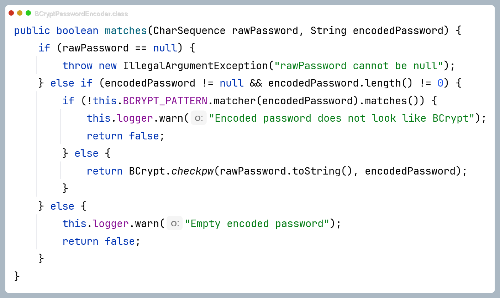
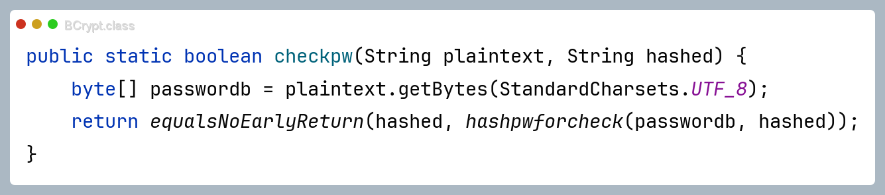
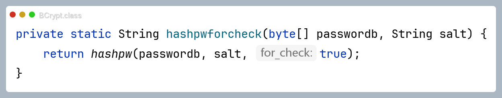

[toc]

> 最近在升级博客，尝试引入了 Spring Security，写篇博客整理一下 Spring Security 快速入门
>
> 本文共计xx字，预计阅读时间

# Spring Security 的作用

- **1. 身份验证（Authentication）**
  - 用来识别“你是谁”，例如用户名/密码登录、短信验证码登录、OAuth2 登录等。
  - **提供完整的认证流程**：登录请求 → 用户信息查询 → 凭证校验 → 生成认证对象并保存到安全上下文。

- **2. 授权（Authorization）/ 权限控制**
  - 在“知道你是谁”之后，判断“你能干什么”。
  - **支持基于 URL、方法、注解**（如 `@PreAuthorize`、`@Secured`）等多种方式**的权限控制**。
  - 可以基于角色（Role）、权限（Authority）、组织结构等多维度进行访问控制。

- **3. 防护常见安全攻击**
  - **CSRF 防护**：防止跨站请求伪造，默认对状态变更请求（POST/PUT/DELETE 等）开启 CSRF 保护。
  - **Session 固定攻击防护**：登录后重新生成 Session ID，降低会话劫持风险。
  - **点击劫持防护**：通过 `X-Frame-Options`、`Content-Security-Policy` 等响应头增强安全。
  - **<u>密码加密存储</u>**：提供 `PasswordEncoder`（如 BCrypt）保证密码非明文存储。

- **4. 与 Spring 生态深度集成**
  - 与 Spring MVC、Spring Data、Spring Boot 等无缝整合。
  - **通过<u>自动配置和注解方式</u>，大部分安全逻辑可配置而非硬编码**。

- **5. 高度可扩展**
  - 通过过滤器链、认证管理器、用户详情服务等扩展点可以定制：
    - 自定义登录逻辑（短信、二维码、单点登录等）
    - 自定义权限模型、数据权限
    - 与第三方认证系统对接（OAuth2 / OpenID Connect / SSO 等）


# 引入与实战


## 1. 引入依赖

- **Maven 示例**

```xml
<!-- Spring Security -->
<dependency>
    <groupId>org.springframework.boot</groupId>
    <artifactId>spring-boot-starter-security</artifactId>
</dependency>
```


**启动后的默认行为**

- 所有 HTTP 接口默认需要认证访问。
- 会自动生成一个默认用户：
  - 默认用户名：`user`
  - 默认密码：在应用启动日志中输出（`Using generated security password`）。
- 未登录访问受保护资源时，会自动跳转到框架提供的默认登录页。

在实际项目中，一般会**通过配置类来自定义登录逻辑和放行规则**。


## 2. 编写基础安全配置类

**定义过滤链与基本访问规则**

```java
package top.hazenix.config;

import lombok.RequiredArgsConstructor;
import org.springframework.context.annotation.Bean;
import org.springframework.context.annotation.Configuration;
import org.springframework.security.config.annotation.web.builders.HttpSecurity;
import org.springframework.security.config.http.SessionCreationPolicy;
import org.springframework.security.crypto.bcrypt.BCryptPasswordEncoder;
import org.springframework.security.crypto.password.PasswordEncoder;
import org.springframework.security.web.SecurityFilterChain;
import org.springframework.security.web.authentication.UsernamePasswordAuthenticationFilter;
import top.hazenix.security.JsonAccessDeniedHandler;
import top.hazenix.security.JsonAuthenticationEntryPoint;
import top.hazenix.security.JwtAuthenticationFilter;

@Configuration
@RequiredArgsConstructor
// @EnableGlobalMethodSecurity(prePostEnabled = true)  // Spring Boot 2.7.x【如果需要开启方法级别控制】
// 或者
// @EnableMethodSecurity(prePostEnabled = true)  // Spring Boot 3.x【如果需要开启方法级别控制】
public class SecurityConfig {

    private final JwtAuthenticationFilter jwtAuthenticationFilter;
    private final JsonAuthenticationEntryPoint jsonAuthenticationEntryPoint;
    private final JsonAccessDeniedHandler jsonAccessDeniedHandler;

    /**
     * 对所有请求暂时放行，保留现有 JWT 拦截器逻辑
     */
    @Bean
    public SecurityFilterChain securityFilterChain(HttpSecurity http) throws Exception {
        http
                // 前后端分离 + JWT，采用无状态会话
                .csrf().disable()
                .sessionManagement().sessionCreationPolicy(SessionCreationPolicy.STATELESS)
                .and()
                // 统一异常处理，未登录/权限不足的返回
                .exceptionHandling()
                .authenticationEntryPoint(jsonAuthenticationEntryPoint)
                .accessDeniedHandler(jsonAccessDeniedHandler)
                .and()
                // 配置访问控制规则
                .authorizeRequests()
                // 登录、注册 & 第三方登录相关接口放行
                .antMatchers(
                        "/user/user/login",
                        "/user/user/register",
                        "/user/user/google/**",
                        "/user/user/github/**"
                ).permitAll()
                // Swagger / Knife4j 文档放行
                .antMatchers(
                        "/doc.html",
                        "/webjars/**",
                        "/v2/api-docs",
                        "/swagger-resources/**",
                        "/swagger-ui.html"
                ).permitAll()
                // 管理端接口：需要 ADMIN 角色
                .antMatchers("/admin/**").hasRole("ADMIN")
                // 用户端需要登录的接口（与 JwtTokenUserInterceptor 保持一致）
                .antMatchers(
                        "/user/user/logout",
                        "/user/user/userinfo",
                        "/user/user/stats",
                        "/user/user/profile",
                        "/user/user/password",
                        "/user/user/favorite",
                        "/user/comments",
                        "/user/tree/**",
                        "/user/articles/*/favorite"
                ).authenticated()
                // 放行其他接口（后续可以按需逐步收紧）
                .anyRequest().permitAll();

        // 在用户名密码过滤器之前添加 JWT 过滤器
        http.addFilterBefore(jwtAuthenticationFilter, UsernamePasswordAuthenticationFilter.class);

        return http.build();
    }

    /**
     * 提供全局 PasswordEncoder Bean，使用 BCrypt 实现密码加密与校验
     */
    @Bean
    public PasswordEncoder passwordEncoder() {
        return new BCryptPasswordEncoder();
    }
}


```

> 关于放行路径的一些细节:
>
> * 如果在 `application.properities` 中配置的有 `server.servlet.context-path=/api` 前缀的话，在放行路径中不需要写 `/api`。
> * 如果 `@RequestMapping(value = "/test/")` 中写的是 `/test/`, 那么放行路径必须也写成 `/test/`, （`/test`）是不行的，反之亦然。
> * 如果 `@RequestMapping(value = "/test")` 链接 `/test` 后面要加查询字符的话（`/test?type=0`），不要写成 `@RequestMapping(value = "/test/")`
>
> 

### 统一异常处理

统一异常处理，未登录/权限不足的返回

```java
@Bean
public SecurityFilterChain securityFilterChain(HttpSecurity http) throws Exception {
    http
            // ...省略上文代码
            // 统一未登录 / 权限不足返回
            .exceptionHandling()
            .authenticationEntryPoint(jsonAuthenticationEntryPoint)
            .accessDeniedHandler(jsonAccessDeniedHandler)
            .and()
            // ......省略下文代码

}
```


可以在 `JsonAuthenticationEntryPoint` 类里面自定义 “未登录时的返回值”

```java
/**
 * 未认证（未登录）时的统一返回处理
 */
@Component
@Slf4j
public class JsonAuthenticationEntryPoint implements AuthenticationEntryPoint {

    private static final ObjectMapper OBJECT_MAPPER = new ObjectMapper();

    @Override
    public void commence(HttpServletRequest request,
                         HttpServletResponse response,
                         AuthenticationException authException) throws IOException, ServletException {
        log.warn("未认证访问接口: URI = {}, message = {}", request.getRequestURI(), authException.getMessage());

        response.setStatus(HttpStatus.UNAUTHORIZED.value());
        response.setContentType("application/json;charset=UTF-8");

        Result<?> result = Result.error(ErrorCode.A01003, MessageConstant.USER_NOT_LOGIN);
        OBJECT_MAPPER.writeValue(response.getWriter(), result);
    }
}

```


可以在 `JsonAccessDeniedHandler` 类里面自定义 ”访问权限不足时的返回值“

```java
/**
 * 已认证但权限不足时的统一返回处理
 */
@Component
@Slf4j
public class JsonAccessDeniedHandler implements AccessDeniedHandler {

    private static final ObjectMapper OBJECT_MAPPER = new ObjectMapper();

    @Override
    public void handle(HttpServletRequest request,
                       HttpServletResponse response,
                       AccessDeniedException accessDeniedException) throws IOException, ServletException {
        log.warn("权限不足访问接口: URI = {}, message = {}", request.getRequestURI(), accessDeniedException.getMessage());

        response.setStatus(HttpStatus.FORBIDDEN.value());
        response.setContentType("application/json;charset=UTF-8");

        Result<?> result = Result.error(ErrorCode.A00002, MessageConstant.NOT_AUTHED);
        OBJECT_MAPPER.writeValue(response.getWriter(), result);
    }
}
```


### 实现路径拦截与身份验证


#### **1.定义`JwtAuthenticationFilter`过滤器**

- 从请求头读取 JWT → 检查 Redis 黑名单 → 用你原来的 JwtUtil 解析出 userId；

- 查询 User 与角色，根据 User.role 构造 ROLE_ADMIN / ROLE_AUTHOR / ROLE_USER 等权限；

- 把认证信息放入 SecurityContextHolder，后续请求可以通过SecurityContextHolder获取当前用户信息
  (作用同 `BaseContext`，存放当前线程的用户信息)

```java
package top.hazenix.security;

import io.jsonwebtoken.Claims;
import lombok.RequiredArgsConstructor;
import lombok.extern.slf4j.Slf4j;
import org.apache.commons.lang.StringUtils;
import org.springframework.data.redis.core.RedisTemplate;
import org.springframework.security.authentication.UsernamePasswordAuthenticationToken;
import org.springframework.security.core.GrantedAuthority;
import org.springframework.security.core.authority.SimpleGrantedAuthority;
import org.springframework.security.core.context.SecurityContextHolder;
import org.springframework.security.web.authentication.WebAuthenticationDetailsSource;
import org.springframework.stereotype.Component;
import org.springframework.web.filter.OncePerRequestFilter;
import top.hazenix.constant.JwtClaimsConstant;
import top.hazenix.constant.UserConstants;
import top.hazenix.context.BaseContext;
import top.hazenix.entity.User;
import top.hazenix.mapper.UserMapper;
import top.hazenix.properties.JwtProperties;
import top.hazenix.utils.JwtUtil;

import javax.servlet.FilterChain;
import javax.servlet.ServletException;
import javax.servlet.http.HttpServletRequest;
import javax.servlet.http.HttpServletResponse;
import java.io.IOException;
import java.util.ArrayList;
import java.util.List;

/**
 * 基于JWT的SpringSecutity认证过滤器
 *
 * 作用：
 * 1. 从请求头中解析出 JWT
 * 2. 校验是否在黑名单中
 * 3. 解析出用户信息，构建 Spring Security 的 Authentication
 * 4. 同时维护项目原有的 BaseContext，保证旧代码可以继续通过 BaseContext 获取 userId
 */
@Component
@RequiredArgsConstructor
@Slf4j
public class JwtAuthenticationFilter extends OncePerRequestFilter {

    private final JwtProperties jwtProperties;
    private final RedisTemplate redisTemplate;
    private final UserMapper userMapper;

    @Override
    protected void doFilterInternal(HttpServletRequest request,
                                    HttpServletResponse response,
                                    FilterChain filterChain) throws ServletException, IOException {

        String requestURI = request.getRequestURI();
        String tokenHeaderName = jwtProperties.getUserTokenName();
        String token = request.getHeader(tokenHeaderName);

        try {
            if (StringUtils.isNotBlank(token) && !isTokenInBlacklist(token)) {
                Claims claims = JwtUtil.parseJWT(jwtProperties.getUserSecretKey(), token);
                Long userId = Long.valueOf(claims.get(JwtClaimsConstant.USER_ID).toString());

                // 查询用户信息（用于构建权限）
                User user = userMapper.getById(userId);
                if (user != null && (user.getStatus() == null || !user.getStatus().equals(UserConstants.STATUS_LOCKED))) {
                    List<GrantedAuthority> authorities = buildAuthorities(user);

                    // 创建认证对象
                    UsernamePasswordAuthenticationToken authentication =
                            new UsernamePasswordAuthenticationToken(userId, null, authorities);
                    authentication.setDetails(new WebAuthenticationDetailsSource().buildDetails(request));

                    // 将认证信息存入Spring Security的安全上下文中,后续请求可以通过SecurityContextHolder获取当前用户信息
                    SecurityContextHolder.getContext().setAuthentication(authentication);
                    
                    // 用于兼容旧代码：继续使用 BaseContext 传递 userId
                    // BaseContext.setCurrentId(userId);
                }
            }
        } catch (Exception ex) {
            log.warn("JWT 解析失败, URI = {}, error = {}", requestURI, ex.getMessage());
            SecurityContextHolder.clearContext();
            BaseContext.removeCurrentId();
        }

        try {
            filterChain.doFilter(request, response);
        } finally {
            // 避免线程复用导致的脏数据
            BaseContext.removeCurrentId();
        }
    }

    /**
     * 根据用户角色构建权限集合
     */
    private List<GrantedAuthority> buildAuthorities(User user) {
        List<GrantedAuthority> authorities = new ArrayList<>();
        if (user.getRole() != null) {
            if (UserConstants.ROLE_ADMIN.equals(user.getRole())) { // 在这里自定义了什么情况下该用户是管理员
                authorities.add(new SimpleGrantedAuthority("ROLE_ADMIN"));
            } else if (UserConstants.ROLE_AUTHOR.equals(user.getRole())) {
                authorities.add(new SimpleGrantedAuthority("ROLE_AUTHOR"));
            } else {
                authorities.add(new SimpleGrantedAuthority("ROLE_USER"));
            }
        }
        return authorities;
    }

    /**
     * 在 JWT 验证时增加黑名单检查
     */
    private boolean isTokenInBlacklist(String token) {
        String key = "jwt:blacklist:" + getTokenSignature(token);
        return Boolean.TRUE.equals(redisTemplate.hasKey(key));
    }

    private String getTokenSignature(String token) {
        if (StringUtils.isBlank(token)) {
            return null;
        }
        String[] chunks = token.split("\\.");
        if (chunks.length > 2) {
            return chunks[2]; // signature part
        }
        return null;
    }
}


```

> 通过SecurityContextHolder获取当前用户信息：
>
> ```java
> @Override
> public void updatePassword(UserDTO userDTO) {
>     // 从 SecurityContext 获取当前认证信息
>     Authentication authentication = SecurityContextHolder.getContext().getAuthentication();
>     if (authentication == null || !authentication.isAuthenticated()) {
>         throw new BussinessException(ErrorCode.A01003, MessageConstant.USER_NOT_LOGIN);
>     }
>     
>     // 从 Authentication 中获取用户ID
>     CustomUserDetails userDetails = (CustomUserDetails) authentication.getPrincipal();
>     Long currentId = userDetails.getUserId();
>     
>     // ... 
> }
> ```
>
> 


#### **2.配置类中配置该过滤器**

```java
private final JwtAuthenticationFilter jwtAuthenticationFilter;
@Bean
public SecurityFilterChain securityFilterChain(HttpSecurity http) throws Exception {
    // ...... 上文代码省略
    
    // 在用户名密码过滤器之前添加 JWT 过滤器
    http.addFilterBefore(jwtAuthenticationFilter, UsernamePasswordAuthenticationFilter.class);
    return http.build();
}
```


#### **3.配置拦截路径**

```java
@Bean
public SecurityFilterChain securityFilterChain(HttpSecurity http) throws Exception {
    http
            // ... 上文代码省略
        
            // 配置访问控制规则
            .authorizeRequests()
            // 登录、注册 & 第三方登录相关接口放行
            .antMatchers(
                    "/user/user/login",
                    "/user/user/register",
                    "/user/user/google/**",
                    "/user/user/github/**"
            ).permitAll()
            // Swagger / Knife4j 文档放行
            .antMatchers(
                    "/doc.html",
                    "/webjars/**",
                    "/v2/api-docs",
                    "/swagger-resources/**",
                    "/swagger-ui.html"
            ).permitAll()
            // 管理端接口：需要 ADMIN 角色
            .antMatchers("/admin/**").hasRole("ADMIN")
            // 用户端需要登录的接口（与 JwtTokenUserInterceptor 保持一致）
            .antMatchers(
                    "/user/user/logout",
                    "/user/user/userinfo",
                    "/user/user/stats",
                    "/user/user/profile",
                    "/user/user/password",
                    "/user/user/favorite",
                    "/user/comments",
                    "/user/tree/**",
                    "/user/articles/*/favorite"
            ).authenticated()
        
            // 放行其他接口（后续可以按需逐步收紧）
            .anyRequest().permitAll();

    // 在用户名密码过滤器之前添加 JWT 过滤器
    http.addFilterBefore(jwtAuthenticationFilter, UsernamePasswordAuthenticationFilter.class);

    return http.build();
}
```


> #### 对比
>
> 如果不用Spring Secutity的过滤器链，就需要自己在配置类里配置 登录校验拦截器
>
> ```java
> @Configuration
> @Slf4j
> @RequiredArgsConstructor
> public class WebMvcConfiguration extends WebMvcConfigurationSupport {
> 
>     private final JwtTokenUserInterceptor jwtTokenUserInterceptor;
> 	private final JwtTokenAdminInterceptor jwtTokenAdminInterceptor;
>     /**
>      * 注册自定义拦截器
>      *
>      * @param registry
>      */
>     protected void addInterceptors(InterceptorRegistry registry) {
>         // log.info("开始注册自定义拦截器...");
> 		registry.addInterceptor(jwtTokenAdminInterceptor)
>             	.addPathPatterns("admin/**");
>         registry.addInterceptor(jwtTokenUserInterceptor)
>                 .addPathPatterns("/user/user/logout")
>                 .addPathPatterns("/user/user/userinfo")
>                 .addPathPatterns("/user/user/profile")
>                 .addPathPatterns("/user/user/password")
>                 .addPathPatterns("/user/playlist/**")
>                 .addPathPatterns("/user/track/**")
>                 .addPathPatterns("/user/lyrics/**");
>     }
> }
> ```
>
> ```java
> @Component
> @Slf4j
> @RequiredArgsConstructor
> public class JwtTokenUserInterceptor implements HandlerInterceptor {
>     public boolean preHandle(HttpServletRequest request, HttpServletResponse response, Object handler) throws Exception {
>         // ...
>     }   
>     @Override
>     public void afterCompletion(HttpServletRequest request, HttpServletResponse response, Object handler, Exception ex) throws Exception {
>         // ...
>     }
> }
> ```


> 后续如果要开启更细粒度的权限控制（例如某些接口必须登录、基于角色限制等），只需要在这个配置类里调整 `authorizeRequests()` 规则即可。


## 3. 使用 BCrypt 加密/校验密码

> #### 登录 / 注册 / 修改密码


1. 注入在配置类配置过的`BCryptPasswordEncoder`对象

   ```java
   private final PasswordEncoder passwordEncoder;// 这是多态的写法
   ```

2. ==加密密码==

   使用`String encode(CharSequence rawPassword);`方法在注册时 

   > `String` 继承了 `CharSequence`，第一个参数传入 String 即可

   ```java
   String encodedPassword = passwordEncoder.encode(userLoginDTO.getPassword())
   ```

3. ==校验是否相等==

   使用 `boolean matches(CharSequence rawPassword, String encodedPassword);` 方法 

   ```java
   if(!passwordEncoder.matches(userLoginDTO.getPassword(), user.getPassword())){
       throw new BussinessException(ErrorCode.A01002, MessageConstant.EMAIL_OR_PASSWORD_ERROR);
   }
   ```

   > 
   >
   > 
   >
   > 
   >
   > 源码底层会将明文加密之后再与数据库中的加密字符串


> **辅助：提供一个简单的 BCrypt 生成工具（测试类）**
>
> ```java
> PasswordEncoder passwordEncoder = new BCryptPasswordEncoder();
> String bcryptPassword = passwordEncoder.encode("123456");
> System.out.println(bcryptPassword);
> ```
>
> 用途：本地需要手动插入用户时，可以通过它生成 BCrypt 加密后的密码。
>


## 4. 用Spring Secutity实现登录/注册

> 可选
> 用 UserDetails + UserDetailsService + AuthenticationManager 接管 账号密码 登录校验，让登录过程也走 Spring Security ，再在登录成功后发 JWT。

Spring Security 的认证流程可以简化为以下几个步骤：

```
用户提交登录请求（邮箱+密码）
    ↓
Controller 接收请求
    ↓
调用 AuthenticationManager.authenticate()
    ↓
AuthenticationManager 委托给 UserDetailsService 加载用户
    ↓
UserDetailsService 从数据库查询用户信息
    ↓
DaoAuthenticationProvider 使用 PasswordEncoder 校验密码
    ↓
认证成功 → 生成 Authentication 对象 → 存入 SecurityContext
    ↓
Controller 返回 JWT Token 给前端
```

```java
// Controller 中
Authentication authentication = authenticationManager.authenticate(
    new UsernamePasswordAuthenticationToken(email, password)
);
// Spring Security 自动完成用户查询、密码校验、异常处理
// 认证成功后，从 authentication 中获取用户信息，生成 JWT ⬇️
// ...
```

> #### 对比
>
> 手动校验
>
> ```java
> // UserServiceImpl.login()
> User user = userMapper.selectByEmail(email);
> if (user == null) {
>     throw new BussinessException(...);
> }
> if (!passwordEncoder.matches(password, user.getPassword())) {
>     throw new BussinessException(...);
> }
> // 手动生成 JW
> ```

* 优势
  * 统一的异常处理（`BadCredentialsException`、`UsernameNotFoundException` 等）
  * 更好的扩展性（可以轻松接入短信登录、OAuth2 等）
  * 与 Spring Security 的权限控制无缝集成
  * 支持账户锁定、密码过期等高级特性


### 核心组件

#### UserDetails 接口


`UserDetails` 接口是 Spring Security 中表示用户信息的核心接口，是用户身份验证机制的基础，包含：

- `getUsername()`：用户名（在你的项目中是邮箱）
- `getPassword()`：加密后的密码
- `getAuthorities()`：用户拥有的权限集合（角色、权限等）
- `isAccountNonExpired()`：账户是否未过期
- `isAccountNonLocked()`：账户是否未锁定
- `isCredentialsNonExpired()`：凭证是否未过期
- `isEnabled()`：账户是否启用

通过实现该接口，开发者可以定义自己的用户模型，并提供用户相关的信息，以便进行身份验证和权限检查

```java
package top.hazenix.security;

import lombok.AllArgsConstructor;
import lombok.Data;
import lombok.NoArgsConstructor;
import org.springframework.security.core.GrantedAuthority;
import org.springframework.security.core.userdetails.UserDetails;
import top.hazenix.constant.UserConstants;

import java.util.Collection;
import java.util.List;

/**
 * Spring Security 用户详情实现
 */
@Data
@NoArgsConstructor
@AllArgsConstructor
public class CustomUserDetails implements UserDetails {
    
    private Long userId;
    private String email;
    private String password;
    private Integer role;
    private Integer status;
    private List<GrantedAuthority> authorities;
    
    @Override
    public Collection<? extends GrantedAuthority> getAuthorities() {
        return authorities;
    }
    
    @Override
    public String getPassword() {
        return password;
    }
    
    @Override
    public String getUsername() {
        return email; // 使用邮箱作为用户名
    }
    
    @Override
    public boolean isAccountNonExpired() {
        return true; // 账户未过期
    }
    
    @Override
    public boolean isAccountNonLocked() {
        // 检查账户是否被锁定
        return status == null || !status.equals(UserConstants.STATUS_LOCKED);
    }
    
    @Override
    public boolean isCredentialsNonExpired() {
        return true; // 凭证未过期
    }
    
    @Override
    public boolean isEnabled() {
        return true; // 账户已启用
    }
}
```


#### UserDetailsService 接口

`UserDetailsService` 负责根据用户名加载用户信息：

```java
public interface UserDetailsService {
    UserDetails loadUserByUsername(String username) throws UsernameNotFoundException;
}
```


通过实现`UserDetailsService` 接口并重写 `loadUserByUsername` 方法，可以你自定义用户信息加载逻辑

```java
@Service
@RequiredArgsConstructor
public class CustomUserDetailsService implements UserDetailsService {
    
    private final UserMapper userMapper;
    private final PasswordEncoder passwordEncoder;
    
    @Override
    public UserDetails loadUserByUsername(String email) throws UsernameNotFoundException {
        User user = userMapper.selectByEmail(email);
        if (user == null) {
            throw new UsernameNotFoundException("邮箱未注册: " + email);
        }
        
        // 检查账户状态
        if (user.getStatus() != null && user.getStatus().equals(UserConstants.STATUS_LOCKED)) {
            throw new LockedException("账户已被锁定");
        }
        
        // 构建权限集合
        List<GrantedAuthority> authorities = buildAuthorities(user);
        
        return new CustomUserDetails(
            user.getId(),
            user.getEmail(),
            user.getPassword(),
            user.getRole(),
            user.getStatus(),
            authorities
        );
    }
    
    private List<GrantedAuthority> buildAuthorities(User user) {
        List<GrantedAuthority> authorities = new ArrayList<>();
        if (user.getRole() != null) {
            if (UserConstants.ROLE_ADMIN.equals(user.getRole())) {
                authorities.add(new SimpleGrantedAuthority("ROLE_ADMIN"));
            } else if (UserConstants.ROLE_AUTHOR.equals(user.getRole())) {
                authorities.add(new SimpleGrantedAuthority("ROLE_AUTHOR"));
            } else {
                authorities.add(new SimpleGrantedAuthority("ROLE_USER"));
            }
        }
        return authorities;
    }
}
```

> 这里`CustomUserDetails` 是实现了 `UserDetails` 接口的类


#### AuthenticationManager

`AuthenticationManager` 是认证管理器，负责协调整个认证过程。在 Spring Security 中，通常使用 `DaoAuthenticationProvider`（基于数据库的认证提供者）。

配置示例：

```java
@Configuration
public class SecurityConfig {
    private final UserDetailsService userDetailsService;

    /**
     * 配置 AuthenticationManager
     */
    @Bean
    public AuthenticationManager authenticationManager(
            HttpSecurity http,
            PasswordEncoder passwordEncoder) throws Exception {

        AuthenticationManagerBuilder builder = http.getSharedObject(AuthenticationManagerBuilder.class);
        builder.userDetailsService(userDetailsService)
                .passwordEncoder(passwordEncoder);
        return builder.build();
    }
}
```


### 实现登录

示例：

```java
@RestController
@RequestMapping("/user/user")
@RequiredArgsConstructor
public class UserController {
    
    private final AuthenticationManager authenticationManager;
    private final UserService userService;
    private final JwtProperties jwtProperties;
    
    @PostMapping("/login")
    public Result<UserLoginVO> login(@Valid @RequestBody UserLoginDTO userLoginDTO) {
        log.info("用户登录: {}", userLoginDTO.getEmail());
        
        // 1. 使用 Spring Security 进行认证
        Authentication authentication = authenticationManager.authenticate(
            new UsernamePasswordAuthenticationToken(
                userLoginDTO.getEmail(),
                userLoginDTO.getPassword()
            )
        );
        
        // 2. 认证成功后，从 Authentication 中获取用户信息
        CustomUserDetails userDetails = (CustomUserDetails) authentication.getPrincipal();
        Long userId = userDetails.getUserId();
        
        // 3. 更新最后登录时间
        userService.updateLastLoginTime(userId);
        
        // 4. 生成 JWT Token
        HashMap<String, Object> claims = new HashMap<>();
        claims.put(JwtClaimsConstant.USER_ID, userId);
        String token = JwtUtil.createJWT(
            jwtProperties.getUserSecretKey(),
            jwtProperties.getUserTtl(),
            claims
        );
        
        // 5. 查询完整用户信息（用于返回）
        User user = userMapper.getById(userId);
        
        // 6. 组装返回对象
        UserLoginVO userLoginVO = UserLoginVO.builder()
            .id(user.getId())
            .username(user.getUsername())
            .avatar(user.getAvatar())
            .email(user.getEmail())
            .role(user.getRole())
            .token(token)
            .build();
        
        return Result.success(userLoginVO);
    }
}
```


> #### 异常处理
>
> Spring Security 在认证失败时会抛出以下异常：
>
> - `UsernameNotFoundException`：用户不存在
> - `BadCredentialsException`：密码错误
> - `LockedException`：账户被锁定
> - `DisabledException`：账户被禁用
>
> **统一异常处理示例：**
>
> ```java
> @RestControllerAdvice
> public class GlobalExceptionHandler {
>     
>     @ExceptionHandler(BadCredentialsException.class)
>     public Result handleBadCredentialsException(BadCredentialsException e) {
>         return Result.error(ErrorCode.A01002, MessageConstant.EMAIL_OR_PASSWORD_ERROR);
>     }
>     
>     @ExceptionHandler(UsernameNotFoundException.class)
>     public Result handleUsernameNotFoundException(UsernameNotFoundException e) {
>         return Result.error(ErrorCode.A01001, MessageConstant.CURRENT_EMAIL_NOT_REGISTERD);
>     }
>     
>     @ExceptionHandler(LockedException.class)
>     public Result handleLockedException(LockedException e) {
>         return Result.error(ErrorCode.A01005, MessageConstant.CURRENT_USER_IS_ILLEGAL);
>     }
> }
> ```
>


### 实现注册

注册功能**不需要**使用 Spring Security 的认证流程（因为用户还不存在），但仍然需要使用 `PasswordEncoder` 加密密码

示例：

```java
@Service
@RequiredArgsConstructor
public class UserServiceImpl implements UserService {
    
    private final UserMapper userMapper;
    private final PasswordEncoder passwordEncoder;
    private final JwtProperties jwtProperties;
    
    @Override
    public UserLoginVO register(UserLoginDTO userLoginDTO) {
        // 1. 检查邮箱是否已注册
        if (userMapper.selectByEmail(userLoginDTO.getEmail()) != null) {
            throw new BussinessException(
                ErrorCode.A01004, 
                MessageConstant.CURRENT_EMAIL_HAS_REGISTERED
            );
        }
        
        // 2. 使用 BCrypt 加密密码
        String encodedPassword = passwordEncoder.encode(userLoginDTO.getPassword());
        
        // 3. 创建用户对象
        User user = User.builder()
            .username(userLoginDTO.getUsername())
            .email(userLoginDTO.getEmail())
            .password(encodedPassword)
            .role(UserConstants.ROLE_USER) // 默认普通用户
            .lastLoginTime(LocalDateTime.now())
            .build();
        
        // 4. 插入数据库
        userMapper.insert(user);
        
        // 5. 生成 JWT Token（注册后自动登录）
        HashMap<String, Object> claims = new HashMap<>();
        claims.put(JwtClaimsConstant.USER_ID, user.getId());
        String token = JwtUtil.createJWT(
            jwtProperties.getUserSecretKey(),
            jwtProperties.getUserTtl(),
            claims
        );
        
        // 6. 组装返回对象
        UserLoginVO userLoginVO = UserLoginVO.builder()
            .id(user.getId())
            .username(user.getUsername())
            .avatar(user.getAvatar())
            .email(user.getEmail())
            .role(user.getRole())
            .token(token)
            .build();
        
        return userLoginVO;
    }
}
```


## 5. 使用注解进行方法级权限控制

> 可选
> 在 Service 层逐步增加 `@PreAuthorize`，实现方法级权限控制

* 优点

  * 颗粒度更细

    能做更精细的权限控制；能区分<u>同一路径下</u>的不同操作 (如查看和删除)；可以保护 Service 层的方法

  * 支持动态判断
    不仅能基于角色/权限做控制，还能基于方法参数、返回值等

* 区别

  * URL 级别的权限控制在配置类中配置；而方法级别是通过 `@PreAuthorize` 注解


在配置类上加上 `@EnableMethodSecurity` 注解后，可以在业务层/控制层使用此注解：

**案例：**

```java
@RestController
@RequestMapping("/admin/articles")
public class ArticleController {
    
    @GetMapping
    @PreAuthorize("hasAnyRole('ADMIN', 'AUTHOR')")  // 管理员和作者都能查看
    public Result getArticles() { ... }
    
    @GetMapping("/{id}")
    @PreAuthorize("hasAnyRole('ADMIN', 'AUTHOR')")  // 管理员和作者都能查看详情
    public Result getArticleDetail(@PathVariable Long id) { ... }
    
    @PostMapping
    @PreAuthorize("hasAnyRole('ADMIN', 'AUTHOR')")  // 管理员和作者都能新增
    public Result addArticle(@RequestBody ArticleDTO dto) { ... }
    
    @PutMapping("/{id}")
    @PreAuthorize("hasAnyRole('ADMIN', 'AUTHOR')")  // 管理员和作者都能更新
    public Result updateArticle(@PathVariable Long id, @RequestBody ArticleDTO dto) { ... }
    
    @DeleteMapping("/{id}")
    @PreAuthorize("hasRole('ADMIN')")  // ⚠️ 只有管理员能删除
    public Result deleteArticle(@PathVariable Long id) { ... }
    
    @PutMapping("/{id}/{status}")
    @PreAuthorize("hasRole('ADMIN')")  // ⚠️ 只有管理员能修改状态（发布/下架）
    public Result updateArticleStatus(@PathVariable Long id, @PathVariable Integer status) { ... }
    
    // 其他形式的权限
    @PreAuthorize("hasAuthority('article:write')")
    public void writeArticle() {
        // 只有拥有 article:write 权限的用户才能访问
    }
}
```


```java
// - 管理员可以更新/删除任何文章
// - 作者只能更新/删除自己创建的文章
// - 如果作者尝试更新别人的文章，Spring Security 会在**方法执行前**就拦截，返回 403
// - **不需要在 Service 方法内部写 `if` 判断**

@PutMapping("/{id}")
@PreAuthorize("hasRole('ADMIN') or (hasRole('AUTHOR') and @articleService.isAuthor(#id, authentication.principal.userId))")
public Result updateArticle(@PathVariable Long id, @RequestBody ArticleDTO dto) {
    articleService.updateArticle(id, dto);
    return Result.success();
}

@DeleteMapping("/{id}")
@PreAuthorize("hasRole('ADMIN') or (hasRole('AUTHOR') and @articleService.isAuthor(#id, authentication.principal.userId))")
public Result deleteArticle(@PathVariable Long id) {
    articleService.deleteArticle(id);
    return Result.success();
}
```

> **在 Service 中添加辅助方法：**
>
> ```java
> @Service
> public class ArticleServiceImpl implements ArticleService {
>     
>     public boolean isAuthor(Long articleId, Long userId) {
>         Article article = articleMapper.getById(articleId);
>         return article != null && article.getUserId().equals(userId);
>     }
> }
> ```
>
> 

```java
// - 批量删除文章时，需要检查**所有文章**是否都是当前用户创建的
// - 如果有一个不是，就拒绝整个操作
// 通过Spring Security的注解实现⬇️
@DeleteMapping("/batch")
@PreAuthorize("hasRole('ADMIN') or " +
              "(hasRole('AUTHOR') and " +
              "@articleService.areAllArticlesOwnedByUser(#dto.ids, authentication.principal.userId))")
public Result deleteArticles(@RequestBody DeleteArticleRequestDTO dto) {
    articleService.deleteArticles(dto.getIds());
    return Result.success();
}

```

> ·**Service 中添加辅助方法：**
>
> ```java 
> @Service
> public class ArticleServiceImpl implements ArticleService {
>     
>     public boolean areAllArticlesOwnedByUser(List<Long> articleIds, Long userId) {
>         for (Long id : articleIds) {
>             Article article = articleMapper.getById(id);
>             if (article == null || !article.getUserId().equals(userId)) {
>                 return false;
>             }
>         }
>         return true;
>     }
> }
> ```
>
> 


# 注意事项

- **1. 密码一定要加密存储**
  - 强制使用 `BCryptPasswordEncoder` 等安全算法，而不是明文或可逆加密。

- **2. 明确区分“认证失败”和“权限不足”**
  - 认证失败：用户未登录或凭证错误，一般返回 401 或跳转登录页。
  - 权限不足：已经登录，但无访问该资源的权限，一般返回 403。

- **3. 结合前后端分离架构设计**
  - 若为前后端分离，可使用：
    - Session + Cookie
    - JWT + `OncePerRequestFilter`
    - OAuth2 / OpenID Connect 等方案。
  - 需要根据架构设计合理开启/关闭 CSRF、配置跨域（CORS）等。

- **4. 审计与日志**
  - 建议记录登录成功/失败日志、关键接口访问日志，便于安全审计与问题追踪。

- **5. 与现有权限模型对齐**
  - 在引入 Spring Security 时，需要结合项目现有的“用户-角色-权限-菜单”等模型进行适配。
  - 可以将数据库中的角色/权限映射为 `GrantedAuthority`，统一走框架的鉴权逻辑。


# 总结

- **Spring Security 的核心价值**：提供标准化、可扩展的认证与授权能力，并内建大量安全防护机制，避免重复造轮子和安全细节遗漏。
- **引入步骤概览**：
  1. 在构建工具中添加 `spring-boot-starter-security` 依赖。
  2. 编写安全配置类（`SecurityFilterChain`），定义登录、登出和访问规则。
  3. 配置用户信息来源（内存/数据库）与密码加密方式。
  4. 根据业务需要使用注解等方式做细粒度权限控制。
  5. 结合项目架构完善 CSRF、防护策略、日志审计等安全细节。


