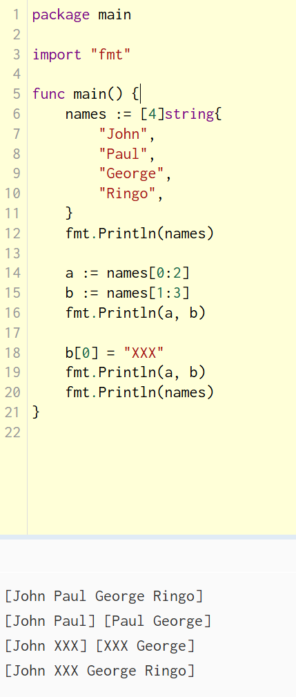

#### 参考

==[Go语言快速学习指南（2025年更新版） - 知乎](https://zhuanlan.zhihu.com/p/1965085774337769632)==

[10分钟上手 Go 语言：从安装到编程实战！](https://juejin.cn/post/7467867800780324905)


[官方文档](https://go.dev/doc/)

[go语言中文网](https://studygolang.com/)

[GOFRAME (文档和教程丰富)](https://goframe.org/docs)


本文适合有一定 Java 基础，想快速入门 go 的读者

#### 了解go

go的设计哲学是“少即是多”（Less is More），它刻意移除了许多 Java 中常见的特性（如类继承、泛型早期的缺失、复杂的异常体系等），以换取更简单的代码结构和更高的编译/运行效率


#### 安装go


 https://go.dev/dl/ 或 https://goframe.org/docs/install-go/index

```cmd
C:\Users\Hazenix>go version
go version go1.26.1 windows/amd64
```


#### 开发工具

- **GoLand**（JetBrains出品，功能强大）
- **Visual Studio Code + Go插件**
- **Vim/Neovim + LSP支持**


##### Go编辑器Goland安装

https://www.jetbrains.com/go/download/

安装电脑对应的版本


#### 常用命令


| 命令                                                         | 功能               |
| ------------------------------------------------------------ | ------------------ |
| go run main.go                                               | 直接运行Go源码     |
| go build main.go                                             | 编译生成可执行文件 |
| go fmt                                                       | 格式化代码         |
| go mod init <module>                                         | 初始化模块         |
| go test ./...                                                | 运行所有测试       |
| go get [http://github.com/user/repo](https://link.zhihu.com/?target=http%3A//github.com/user/repo) | 下载第三方依赖     |


# Go 语言学习指南：从 Java 到 Golang 的思维转变

这是一份为 Java 开发者准备的 Go 语言学习博客，重点梳理基础语法、函数与方法、面向对象编程的核心差异，帮助你快速建立 Go 的语感。


## 一、基础语法

import

```go
```


### 1. 变量与常量

```go
// 声明变量
var name string = "Alice"
var age int = 30
var isActive bool

// 短变量声明（最常用）
name := "Alice"
age := 30


// 多变量声明
var c, python ,java bool
// The var statement declares a list of variables; as in function argument lists, the type is last.

var x, y int = 1, 2 // A var declaration can include initializers, one per variable.

var rust, golang, javascript  = true, false, "no!"
// If an initializer is present, the type can be omitted(省略); the variable will take the type of the initializer.

a, b := 10, 20
// Inside a function, the := short assignment statement can be used in place of a var declaration with implicit(隐含的) type.


// Variable declarations may be "factored" into blocks, as with import statements.
var (
	ToBe   bool       = false
	MaxInt uint64     = 1<<64 - 1
	z      complex128 = cmplx.Sqrt(-5 + 12i)
)


// 常量
const Pi = 3.14159
const (
    StatusOK = 200
    StatusNotFound = 404
)

// iota 常量生成器（Go 特有）
const (
    Sunday = iota  // 0
    Monday         // 1
    Tuesday        // 2
)
```

**💡 注意事项：**

- <u>`:=` 只能在函数内部使用，全局变量必须用 `var`</u> 

  > Inside a function, the `:=` short assignment statement can be used in place of a `var` declaration with implicit type.
  >
  > Outside a function, every statement begins with a keyword (`var`, `func`, and so on) and so the `:=` construct is not available.
  >
  > ```go
  > package main
  > 
  > import "fmt"
  > 
  > func main() {
  > 	var i, j int = 1, 2
  > 	k := 3
  > 	c, python, java := true, false, "no!"
  > 
  > 	fmt.Println(i, j, k, c, python, java)
  > }
  > ```
  >
  > 

- 类型推断

  > When declaring a variable without specifying an explicit type (either by using the `:=` syntax or `var =` expression syntax), the variable's type is inferred from the value on the right hand side.
  >
  > **When the right hand side of the declaration is typed, the new variable is of that same type:**
  >
  > ```go
  > var i int
  > j := i // j is an int
  > ```
  >
  > But **when the right hand side contains an untyped numeric constant, the new variable may be an `int`, `float64`, or `complex128` depending on the precision of the constant:**
  >
  > ```go
  > i := 42           // int
  > f := 3.142        // float64
  > g := 0.867 + 0.5i // complex128
  > ```

- <u>声明的变量必须使用，否则编译报错（无未使用变量）</u>

- 常量在编译时确定，不能是函数返回值；常量的定义不能使用 `:=` 语法


### 2. 数据类型

```go
// 基本类型
var (
    num     int
    decimal float64
    flag    bool
    text    string
)
```
#### **数组：**

```go
// 数组
package main

import "fmt"

func main() {
    // The type [n]T is an array of n values of type T.
    var arr [3]int	// declares a variable arr as an array of three integers.An array's length is part of its type, so arrays cannot be resized. 
	var a [2]string
	a[0] = "Hello"
	a[1] = "World"
	fmt.Println(a[0], a[1])// Hello World
	fmt.Println(a)		   // [Hello World]

	primes := [6]int{2, 3, 5, 7, 11, 13}
	fmt.Println(primes)		// [2 3 5 7 11 13]
}
```
#### **切片：**

An array has a fixed size. A slice, on the other hand, **is a dynamically-sized, flexible view into the elements of an array** (切片是对数组元素的一种**动态大小、灵活的视图**). **In practice, slices are much more common than arrays.**

```go
// 切片

package main

import "fmt"

func main() {
    // The type []T is a slice with elements of type T.
	slice := []int{1, 2, 3}
    
	primes := [6]int{2, 3, 5, 7, 11, 13}

    // A slice is formed by specifying two indices, a low and high bound, separated by a colon:
    // a[low : high] (you may omit the high or low bounds to use their defaults instead.The default is zero for the low bound and the length of the slice for the high bound.)
	var s []int = primes[1:4] // 左闭右开
	fmt.Println(s) // [3 5 7]
}


```
A slice does not store any data, **it just describes a section of an underlying array**.

Changing the elements of a slice modifies the corresponding elements of its underlying array.

Other slices that share the same underlying array will see those changes.



**切片的定义：**

<u>A slice literal is like an array literal without the length.</u>

This is an array literal:

```
[3]bool{true, true, false}
```

And this⬇️ <u>creates the same array as above</u>, <u>then builds a slice that references it</u>:

```
[]bool{true, true, false}
```


**切片的长度与容量：**

A slice has both a *length* and a *capacity*.
The length of a slice is the number of elements it contains.
The capacity of a slice is the number of elements in the underlying array, counting from the first element in the slice.
The length and capacity of a slice `s` can be obtained using the expressions `len(s)` and `cap(s)`.
You can extend a slice's length by re-slicing it, provided it has sufficient capacity. Try changing one of the slice operations in the example program to extend it beyond its capacity and see what happens.

```go
package main

import "fmt"

func main() {
	s := []int{2, 3, 5, 7, 11, 13} 
	printSlice(s) // len=6 cap=6 [2 3 5 7 11 13]

	// Slice the slice to give it zero length.
	s = s[:0]
	printSlice(s) // len=0 cap=6 []

	// Extend its length.
	s = s[:4]
	printSlice(s) // len=4 cap=6 [2 3 5 7]

	// Drop its first two values.
	s = s[2:]
	printSlice(s) // len=2 cap=4 [5 7]
}

func printSlice(s []int) {
	fmt.Printf("len=%d cap=%d %v\n", len(s), cap(s), s)
}
```

**Creating a slice with make**

Slices can be created with the built-in `make` function; **this is how you create dynamically-sized arrays.**
The `make` function allocates a zeroed array and returns a slice that refers to that array:

```go
a := make([]int, 5)  // len(a)=5
```

To specify a capacity, pass a third argument to `make`:

```go
b := make([]int, 0, 5) // len(b)=0, cap(b)=5

b = b[:cap(b)] // len(b)=5, cap(b)=5
b = b[1:]      // len(b)=4, cap(b)=4
```

```go
package main

import "fmt"

func main() {
	a := make([]int, 5)
	printSlice("a", a)

	b := make([]int, 0, 5)
	printSlice("b", b)

	c := b[:2]
	printSlice("c", c)

	d := c[2:5]
	printSlice("d", d)
}

func printSlice(s string, x []int) {
	fmt.Printf("%s len=%d cap=%d %v\n",
		s, len(x), cap(x), x)
}

```


```go
m := map[string]int{"a": 1}      // 映射
person := Person{Name: "Alice"}  // 结构体

// 指针
p := &age      // 取地址
value := *p    // 解引用
```


#### 指针

Go has pointers. A pointer holds the memory address of a value.

**The type `*T` is a pointer to a `T` value. Its zero value is `nil`.**

```go
var p *int
```

The `&` operator generates a pointer to its operand.

```go
i := 42
p = &i			// &运算符返回其操作数（变量）的内存地址，从而生成一个指针。
```

**The `*` operator denotes the pointer's underlying value.**

```go
fmt.Println(*p) // read i through the pointer p
*p = 21         // set i through the pointer p
```

This is known as "dereferencing"(解引用) or "indirecting"(间接寻址).

> 解引用后，可以像操作普通变量一样读写该内存位置的值。


Unlike C, Go has no pointer arithmetic, such as `p + 1`、`p++`、`p-q`

> 这是为了安全性和简化内存模型，避免越界访问和复杂错误。
> Go 设计哲学是“简单、安全、高效”。指针算术容易出错（如缓冲区溢出），所以被刻意省略了。

```go
package main

import "fmt"

func main() {
	i, j := 42, 2701

	p := &i         // point to i
	fmt.Println(*p) // read i through the pointer
	*p = 21         // set i through the pointer
	fmt.Println(i)  // see the new value of i

	p = &j         // point to j
	*p = *p / 37   // divide j through the pointer
	fmt.Println(j) // see the new value of j
}
```


#### 总结

| 类型                                                         | 说明                                             | 零值      |
| ------------------------------------------------------------ | ------------------------------------------------ | --------- |
| `int` / `int8` / `int16` / `int32` / `int64`                 | 整数                                             | `0`       |
| `uint` / `uint8` / `uint16` / `uint32` / `uint64`  / `uintptr` |                                                  |           |
| `byte`                                                       | alias for uint8                                  |           |
| `rune`                                                       | alias for int32, represents a Unicode code point |           |
| `complex64` / `complex128`                                   |                                                  |           |
| `float32` / `float64`                                        | 浮点数                                           | `0.0`     |
| `bool`                                                       | 布尔                                             | `false`   |
| `string`                                                     | 字符串                                           | `""`      |
| `slice`                                                      | 切片                                             | **`nil`** |
| `map`                                                        | 映射                                             | `nil`     |
| `pointer`                                                    | 指针                                             | `nil`     |

> The `int`, `uint`, and `uintptr` types are usually 32 bits wide on 32-bit systems and 64 bits wide on 64-bit systems. When you need an integer value you should use `int` unless you have a specific reason to use a sized or unsigned integer type.

**⚠️ 重要特性：**

- **零值**：`0` for numeric types, `false` for the boolean type, and `""` (the empty string) for strings   ......

  > Variables declared without an explicit initial value are given their *zero value*.

- **无隐式类型转换**：`int` 和 `int64` 不能直接运算，需显式转换 `int64(num)`

  > The expression `T(v)` converts the value `v` to the type `T`.
  >
  > Some numeric conversions:
  >
  > ```go
  > var i int = 42
  > var f float64 = float64(i)
  > var u uint = uint(f)
  > ```
  >
  > Or, put more simply:
  >
  > ```go
  > i := 42
  > f := float64(i)
  > u := uint(f)
  > ```

- **字符串不可变**：修改字符串需转为 `[]byte` 或 `[]rune`

- **`nil` 不是万能**：切片、map、channel 默认为 `nil`，需初始化才能使用

### 3. 流程控制

**if - else**

```go

// The expression need not be surrounded by parentheses ( ) but the braces { } are required.
x, n := 2, 3
if v := math.Pow(x, n); v < lim {
    return v
}
// Like for, the if statement can start with a short statement to execute before the condition.Variables declared by the statement are only in scope until the end of the if.
fmt.Printf(v);// 这句会引发报错


if score := getScore(); score >= 60 {
    fmt.Println("及格")
} else {
    fmt.Println("不及格")
}
// score 的作用域仅限于 if-else 块


// Variables declared inside an if short statement are also available inside any of the else blocks.
if v := math.Pow(x, n); v < lim {
    fmt.Printf(v)
} else {
    fmt.Printf("%g >= %g\n", v, lim)
}
```


```go
// for 循环（三种形式）
for i := 0; i < 10; i++ {// 传统循环
    fmt.Println(i)
};

// For is Go's "while"——At that point you can drop the semicolons(分号): C's while is spelled for in Go.
for i < 10 {
    
}                    


//无限循环
for {
    
}

// range 遍历
for i, v := range slice {
    fmt.Println(i, v)
}
for k, v := range map {
    fmt.Println(k, v)
}
```

* 注意

  * `for` 循环的三个表达式不能用括号包裹

    > Go's `for` statements are like its `if` loops; the expression need not be surrounded by parentheses `( )` but the braces `{ }` are required.

  * The init and post statements are optional.

    ```go
    func main() {
    	sum := 1
    	for ; sum < 1000; {
    		sum += sum
    	}
    	fmt.Println(sum)
    }
    ```


```go
// switch（自动 break）
switch day {
case "Mon", "Tue":  // 多条件
    fmt.Println("工作日")
case "Sat", "Sun":
    fmt.Println("周末")
default:
    fmt.Println("其他")
}

// 类型选择（switch 特殊用法）
switch v := interfaceValue.(type) {
case int:
    fmt.Println("整数")
case string:
    fmt.Println("字符串")
}


```

> The `break` statement that is needed at the end of each case in those languages is provided automatically in Go. Another important difference is that Go's switch cases need not be constants, and the values involved need not be integers.

```go
import (
	"fmt"
	"time"
)

func main() {
	t := time.Now()
    // Switch without a condition is the same as switch true.
	switch {
	case t.Hour() < 12:
		fmt.Println("Good morning!")
	case t.Hour() < 17:
		fmt.Println("Good afternoon.")
	default:
		fmt.Println("Good evening.")
	}
}
```


### 与 Java 对比

Go 的语法非常简洁，去掉了许多"样板代码"，并且强制统一的代码风格

| 特性      | Java                                           | Go (Golang)                                      | 核心差异点                                                   |
| --------- | ---------------------------------------------- | ------------------------------------------------ | ------------------------------------------------------------ |
| 代码组织  | 必须定义在 `class` 中。                        | 直接定义在 `package` 下，无需类包裹。            | Go 没有类的概念，只有包（文件）和函数/结构体。               |
| 变量声明  | `int age = 25;` `String name = "Go";`          | `var age int = 25`   `name := "Go"` (短变量声明) | **类型后置**：类型写在变量名后面。 **类型推断**：`:=` 是 Go 中最常用的声明方式。 |
| 常量      | `public static final int MAX = 100;`           | `const Max = 100`                                | Go 没有访问修饰符，通过**首字母大小写**控制导出（大写=公开，小写=私有）。 |
| 分号      | 语句末尾必须加分号 `;`                         | 不需要手动加分号                                 | 编译器会自动在行尾插入分号。                                 |
| 循环      | `for`, `while`, `do-while` 三种。              | **只有 `for`**                                   | Go 的 `for` 万能，配合 `range` 遍历集合。                    |
| 条件判断  | `if (x > 0) { ... }`                           | `if x > 0 { ... }`                               | <u>括号可选，支持**初始化语句**</u>：`if x := f(); x > 0 {}` |
| Switch    | 默认会穿透（需要 `break`）                     | **默认不穿透**（自动 break                       | 更安全，若需穿透需显式写 `fallthrough`。Case 可以是任意类型。 |
| 数组/切片 | `int[] arr = new int[5];` `List<Integer> list` | `arr := [5]int{}` `slice := []int{}`             | <u>Go 的**切片**是动态数组</u>，底层是数组视图，性能更高且**无装箱拆箱**。 |
| 类型转换  | 支持隐式转换（如 int→long）                    | <u>**必须显式转换**</u>                          | `int64(num)`，无隐式转换减少意外错误。                       |

**代码对比示例：**

```java
// Java
public class Main {
    public static void main(String[] args) {
        int i = 0;
        while (i < 5) {
            if (i % 2 == 0) {
                System.out.println("Even: " + i);
            }
            i++;
        }
    }
}
// Go
package main

import "fmt"

func main() {
    i := 0
    for i < 5 {
        if i % 2 == 0 {
            fmt.Println("Even:", i)
        }
        i++
    }
    
    // Go 特有的 if 初始化
    if x := 10; x > 5 {
        fmt.Println("x is large")
    }
    // 注意：x 的作用域仅限于 if 块内
}
```


## 二、函数

### 1. 函数定义

```go
// 基础函数
func Add(a int, b int) int{
    //When two or more consecutive named function parameters share a type, you can omit the type from all but the last.
    return a + b
}
func Add(a, b int) int {
    return a + b
}

// 多返回值（Go 特色）
// A function can return any number of results
func swap(x, y string) (string, string){
    return y, x;
}
func Divide(a, b float64) (float64, error) {
    if b == 0 {
        return 0, errors.New("除数不能为零")
    }
    return a / b, nil
}

// 命名返回值
func GetInfo() (name string, age int) {
    name = "Alice"
    age = 30
    return  // 自动返回命名变量
    // A return statement without arguments returns the named return values. This is known as a "naked" return.
    // Naked return statements should be used only in short functions, as with the example shown here. They can harm readability in longer functions.
}

// 可变参数
func Sum(nums ...int) int {
    total := 0
    for _, n := range nums {
        total += n
    }
    return total
}
// 调用：Sum(1, 2, 3) 或 Sum(slice...)
```

### 2. 匿名函数与闭包

```go
// 匿名函数
func() {
    fmt.Println("Hello")
}()  // 立即执行

// 闭包
func adder() func(int) int {
    sum := 0
    return func(x int) int {
        sum += x
        return sum
    }
}

add := adder()
fmt.Println(add(1))  // 1
fmt.Println(add(2))  // 3
fmt.Println(add(3))  // 6
```

### 3. defer 机制

**A defer statement defers the execution of a function until the surrounding function returns.**

The deferred call's arguments are evaluated immediately, but the function call is not executed until the surrounding function returns.

```go
package main

import "fmt"

func main() {
	defer fmt.Print("world")

	fmt.Print("hello ")
}
// 输出：hello world
```
```go
// Deferred function calls are pushed onto a stack. When a function returns, its deferred calls are executed in last-in-first-out order.
func readFile() error {
    file, err := os.Open("data.txt")
    if err != nil {
        return err
    }
    defer file.Close()  // 函数返回前自动执行
    
    // 多个 defer 按 LIFO 顺序执行(后进先出)
    defer fmt.Println("最后执行")
    defer fmt.Println("中间执行")
    // 输出顺序：中间执行 → 最后执行
    
    // 读取文件逻辑...
    return nil
}
```

**⚠️ defer 注意事项：**

- 参数在 `defer` 声明时**立即求值**
- 多个 `defer` 按**后进先出**顺序执行
- 常用于资源清理（文件、锁、连接）


### 与 Java 对比

Go 的函数是一等公民，但在定义、返回值和错误处理上与 Java 有显著不同。

| 特性           | Java                             | Go (Golang)                 | 核心差异点                                                 |
| -------------- | -------------------------------- | --------------------------- | ---------------------------------------------------------- |
| **定义位置**   | 必须在类内部                     | 可以在包级别直接定义        | 函数不依附于对象存在                                       |
| **多返回值**   | 不支持（需返回对象、Map 或数组） | **原生支持**                | 经典模式：`(结果, error)`                                  |
| **命名返回值** | 不支持                           | **支持**                    | 可在函数签名中给返回值命名，`return` 时可省略变量名        |
| **可变参数**   | `void func(String... args)`      | `func func(args ...string)` | 语法相似，传递切片时 Go 需要 `...` 展开                    |
| **延迟执行**   | 无内置关键字（需 try-finally）   | **`defer`** 关键字          | `defer` 注册的函数在当前函数返回前执行（LIFO）             |
| **错误处理**   | `try-catch-finally` 异常机制     | **显式返回 `error`**        | Go 没有 Exception。错误也是值，需手动 `if err != nil` 判断 |
| **函数重载**   | 支持（同名不同参）               | **不支持**                  | 需改名（如 `ParseInt`, `ParseFloat`）或利用可变参数/接口   |

**代码对比示例：**

```java
// Java: 模拟多返回值通常需要创建 DTO 类或使用 Map
public Result divide(int a, int b) {
    if (b == 0) {
        throw new ArithmeticException("Divide by zero");
    }
    return new Result(a / b, null);
}
// 调用
try {
    Result r = divide(10, 2);
} catch (ArithmeticException e) {
    // 处理
}
// Go: 原生多返回值 + 显式错误处理
func divide(a, b int) (int, error) {
    if b == 0 {
        return 0, errors.New("divide by zero")
    }
    return a / b, nil
}

// 调用处：必须显式处理错误
result, err := divide(10, 2)
if err != nil {
    log.Fatal(err)
}
```


## 三、面向对象编程（OOP）

Go 没有传统意义上的"类"，但通过**结构体（struct）** 和 **方法（method）** 实现面向对象特性。


### 1. 结构体定义

**A `struct` is a collection of fields.**

```go
package main

import "fmt"

type Vertex struct {
	X int
	Y int
    age int
}

func main() {
    fmt.Println(Vertex{1, 2, 3})// 输出{1 2 3}
    fmt.Println(Vertex{1, 2})// 报错 too few values in struct literal of type Vertex
    fmt.Println(Vertex{X:1, Y:2})// 输出{1 2 0}
    // ⬆️You can list just a subset of fields by using the Name: syntax. (And the order of named fields is irrelevant.)
    
    // Struct fields are accessed using a dot.
    v := Vertex{1, 2, 3}
    v.age = 10
    ftm.Println(v.age) // 输出10
    
    
    // Struct fields can be accessed through a struct pointer.
    p := &v
    p.age = 12 
    // To access the field X of a struct when we have the struct pointer p we could write (*p).X. However, that notation is cumbersome, so the language permits us instead to write just p.X, without the explicit dereference.
    fmt.Println(v.age) // 输出12
}
```

```go
type Person struct {
    FirstName string
    LastName  string
    Age       int
    email     string  // 小写=私有（包内可见）
}

// 创建实例
p1 := Person{FirstName: "Alice", Age: 30}
p2 := &Person{FirstName: "Bob"}  // 返回指针
```


### 2. 方法绑定

```go
// 值接收者（复制副本）
func (p Person) FullName() string {
    return p.FirstName + " " + p.LastName
}

// 指针接收者（可修改原值）
func (p *Person) SetAge(newAge int) {
    p.Age = newAge
}

// 选择指南：
// - 需要修改原值 → 指针接收者
// - 结构体较大 → 指针接收者（避免复制）
// - 基本类型/小结构体 → 值接收者
```

> 相当于类的方法不在类里面，而是通过 (ob Object) 这样的方式绑定


### 3. 组合代替继承

```go
type Animal struct {
    Name string
}

func (a Animal) Speak() {
    fmt.Println("Animal speaks")
}

// 嵌入结构体（组合）
type Dog struct {
    Animal  // 匿名嵌入，可直接访问 Animal 的字段和方法
    Breed string
}

d := Dog{Animal: Animal{Name: "旺财"}, Breed: "哈士奇"}
fmt.Println(d.Name)   // 直接访问嵌入结构体字段
d.Speak()             // 直接调用嵌入结构体方法
```

### 4. 接口（Interface）

```go
// 接口定义
type Speaker interface {
    Speak() string
}

// 实现（隐式）
type Dog struct{}
func (d Dog) Speak() string { return "汪汪" }

type Cat struct{}
func (c Cat) Speak() string { return "喵喵" }

// 多态调用
var s Speaker = Dog{}  // 无需 implements
fmt.Println(s.Speak())

// 空接口（类似 Object）
func PrintAny(v interface{}) {}  // 或 any（Go 1.18+）

// 类型断言
value, ok := v.(int)

// 类型选择
switch v := v.(type) {
case int:
    // 处理 int
case string:
    // 处理 string
}
```


### 与 Java 对比

这是 Java 开发者适应 Go 最大的难点。**Go 没有类（Class），没有继承（Inheritance），也没有构造函数重载。**

| 特性             | Java                             | Go (Golang)                                      | 核心差异点                                                   |
| ---------------- | -------------------------------- | ------------------------------------------------ | ------------------------------------------------------------ |
| **面向对象基础** | `class` + `extends` (继承)       | `struct` + **组合 (Composition)**                | Go 提倡"组合优于继承"。<u>通过嵌入结构体实现复用</u>         |
| **方法定义**     | 定义在类内部                     | 定义在结构体之外，通过**接收者 (Receiver)** 绑定 | 方法只是带特殊第一个参数的函数。语法：`func (t Type) Method() {}` |
| **访问控制**     | `public`, `private`, `protected` | **首字母大小写**。大写=导出，小写=私有           | 跨包访问仅看首字母。没有 `protected` 概念                    |
| **构造函数**     | 同名方法，支持重载               | **无构造函数**。使用 `NewXxx()` 工厂函数惯例     | 通常返回指针 `*T`                                            |
| **多态实现**     | 接口显式声明 (`implements`)      | **隐式实现 (Duck Typing)**                       | 只要实现了所有方法，自动视为实现接口                         |
| **静态方法**     | `static` 关键字                  | **无静态方法**                                   | 通过包级别函数实现类似功能                                   |
| **This 指针**    | `this`                           | 接收者变量名（如 `s *Server`）                   | 可以起任何名字，习惯用类型首字母小写                         |

**代码对比示例：**

**Java 方式：**

```java
public class Animal {
    private String name;
    
    public Animal(String name) {
        this.name = name;
    }
    
    public void Speak() {
        System.out.println("Animal speaks");
    }
}

public class Dog extends Animal {
    public Dog(String name) {
        super(name);
    }

    @Override
    public void Speak() {
        System.out.println("Woof!");
    }
}
```

**Go 方式：**

```go
type Animal struct {
    Name string
}

func (a Animal) Speak() {
    fmt.Println("Animal speaks")
}

func NewAnimal(name string) *Animal {
    return &Animal{Name: name}
}

type Dog struct {
    Animal  // 嵌入
}

func (d Dog) Speak() {
    fmt.Println("Woof!")
}

type Speaker interface {
    Speak()
}
// var s Speaker = Dog{} // 合法，隐式实现
```


## 四、错误处理机制

Go 不使用异常，而是通过返回 `error` 类型来处理错误。这是 Go 与 Java 最显著的差异之一。

### 1. 错误类型基础

```go
// error 是内置接口
type error interface {
    Error() string
}

// 标准库错误
errors.New("错误信息")
fmt.Errorf("格式化错误：%s", msg)
```

### 2. 自定义错误类型

```go
type TimeoutError struct {
    Operation string
    Duration  time.Duration
}

// 实现 error 接口
func (e *TimeoutError) Error() string {
    return fmt.Sprintf("操作 '%s' 超时：%v", e.Operation, e.Duration)
}

// 创建自定义错误
err := &TimeoutError{Operation: "DB.Query", Duration: 5 * time.Second}
```

### 3. 错误判断与处理

```go
// 基础错误检查
result, err := PerformOperation()
if err != nil {
    log.Printf("错误: %v", err)
    return
}

// 类型断言判断具体错误类型
if te, ok := err.(*TimeoutError); ok {
    log.Printf("超时操作：%s, 时长：%v", te.Operation, te.Duration)
}

// Go 1.13+ 推荐方式：errors.Is() 和 errors.As()
if errors.Is(err, os.ErrNotExist) {
    // 处理文件不存在
}

var te *TimeoutError
if errors.As(err, &te) {
    // 处理超时错误
}
```

### 4. 错误包装（Error Wrapping）

```go
// 包装错误，保留原始错误链
err := doSomething()
if err != nil {
    return fmt.Errorf("处理失败: %w", err)  // %w 保留原始错误
}

// 解包错误
originalErr := errors.Unwrap(wrappedErr)
```

### 5. panic 与 recover（类似 try-catch）

```go
// 抛出 panic（慎用）
panic("严重错误")

// 捕获 panic
func safeFunc() {
    defer func() {
        if r := recover(); r != nil {
            log.Printf("捕获 panic: %v", r)
        }
    }()
    // 可能 panic 的代码
}
```

> ⚠️ **最佳实践**：
>
> - 业务逻辑错误用 `error` 返回
> - `panic` 仅用于不可恢复的错误（如配置错误、数据不一致）
> - 优先使用 `errors.Is()` 和 `errors.As()` 进行错误判断

------

### 与 Java 异常处理对比

| 特性         | Java                    | Go (Golang)           | 核心差异点                     |
| ------------ | ----------------------- | --------------------- | ------------------------------ |
| **错误类型** | `Exception` 类层次结构  | `error` 接口          | Go 的错误是值，不是控制流      |
| **抛出方式** | `throw new Exception()` | `return errors.New()` | Go 错误作为返回值显式传递      |
| **捕获方式** | `try-catch-finally`     | `if err != nil`       | Go 需手动检查每个错误          |
| **受检异常** | 支持（必须捕获）        | 不支持                | Go 所有错误都是"非受检"的      |
| **错误链**   | `getCause()`            | `errors.Unwrap()`     | Go 1.13+ 支持错误包装          |
| **finally**  | `finally` 块            | `defer`               | `defer` 更简洁，但功能略有不同 |
| **异常传播** | 自动向上抛              | 手动返回错误          | Go 需要逐层返回错误            |

**代码对比示例：**

```java
// Java
public String readFile(String path) throws IOException {
    try {
        return Files.readString(Paths.get(path));
    } catch (FileNotFoundException e) {
        throw new CustomException("文件不存在", e);
    } catch (IOException e) {
        throw new CustomException("IO 错误", e);
    }
}
// Go
func readFile(path string) (string, error) {
    data, err := os.ReadFile(path)
    if err != nil {
        if errors.Is(err, os.ErrNotExist) {
            return "", fmt.Errorf("文件不存在：%w", err)
        }
        return "", fmt.Errorf("读取失败：%w", err)
    }
    return string(data), nil
}
```


## 五、包与依赖管理

Go 使用 **Go Modules** 进行依赖管理（Go 1.13+ 默认启用），替代了早期的 `GOPATH` 模式。

### 1. 包的基本规则

| 规则     | 说明                                               |
| -------- | -------------------------------------------------- |
| 包名     | 与目录名一致，通常小写                             |
| 可见性   | 首字母大写=导出（公有），小写=私有                 |
| 文件组织 | 同一目录下所有 `.go` 文件必须属于同一个包          |
| main 包  | 可执行程序必须包含 `package main` 和 `func main()` |

```go
// mypkg/utils.go
package mypkg

func PublicFunc() {}    // 外部可访问
func privateFunc() {}   // 仅包内可用
```

### 2. go.mod 文件结构

```go
// go.mod
module github.com/username/project

go 1.21

require (
    github.com/gin-gonic/gin v1.9.0
    github.com/stretchr/testify v1.8.0
)
```

### 3. 常用命令

```bash
# 初始化模块
go mod init github.com/username/project

# 下载依赖
go get github.com/gin-gonic/gin
go get -u github.com/gin-gonic/gin  # 升级到最新版

# 整理依赖（删除未使用的）
go mod tidy

# 查看依赖树
go mod graph

# 验证依赖
go mod verify
```

### 4. 初始化函数 init()

```go
// 每个包可包含多个 init() 函数
// 按声明顺序自动执行，无法手动调用
func init() {
    fmt.Println("模块初始化...")
    // 常用于：配置加载、日志初始化、注册组件
}

// 多个 init 执行顺序：按文件名排序，同文件按声明顺序
```

> ⚠️ **注意**：避免在 `init()` 中执行耗时操作或可能失败的操作

### 5. 导入与别名

```go
import (
    "fmt"
    "os"
    
    // 别名
    cm "github.com/easierway/concurrent_map"
    
    // 忽略包（仅执行 init）
    _ "github.com/lib/pq"
    
    // 点导入（不推荐）
    // . "fmt"
)
```


### 与 Java 依赖管理对比

| 特性         | Java (Maven/Gradle)            | Go (Go Modules)          | 核心差异点                       |
| ------------ | ------------------------------ | ------------------------ | -------------------------------- |
| **配置文件** | `pom.xml` / `build.gradle`     | `go.mod` + `go.sum`      | Go 配置更简洁                    |
| **依赖下载** | `mvn install` / `gradle build` | `go get` / `go mod tidy` | Go 无需构建工具                  |
| **版本管理** | 语义化版本 + 范围              | 语义化版本 + 代理        | Go 有官方代理 (proxy.golang.org) |
| **本地仓库** | `~/.m2/repository`             | `go/pkg/mod`             | Go 模块缓存统一管理              |
| **传递依赖** | 自动解析                       | 自动解析                 | 两者都支持                       |
| **多模块**   | 支持（父子模块）               | 支持（workspaces）       | Go 1.18+ 支持 workspace          |


## 六、并发编程（Concurrency）

Go 的并发模型基于 **CSP（Communicating Sequential Processes）** 理论，核心是 `goroutine` 和 `channel`。这是 Go 最强大的特性之一。

### 1. Goroutine（轻量级协程）

```go
func sayHello() {
    fmt.Println("Hello from goroutine!")
}

func main() {
    go sayHello()           // 启动新协程
    time.Sleep(100 * time.Millisecond)
    fmt.Println("Main finished")
}
```

| 特性     | 说明                          |
| -------- | ----------------------------- |
| 内存占用 | 初始约 2KB（Java 线程约 1MB） |
| 创建成本 | 极低，可轻松创建数万协程      |
| 调度     | Go 运行时调度，非操作系统线程 |
| 生命周期 | 随函数返回而结束              |

### 2. M:P:G 调度模型

```
┌─────────────────────────────────────┐
│  M (Machine) - 操作系统线程          │
│  ┌─────────────────────────────┐    │
│  │  P (Processor) - 逻辑处理器  │    │
│  │  ┌────┐ ┌────┐ ┌────┐       │    │
│  │  │ G  │ │ G  │ │ G  │ ...   │    │
│  │  │    │ │    │ │    │       │    │
│  │  └────┘ └────┘ └────┘       │    │
│  │    Goroutine 任务队列        │    │
│  └─────────────────────────────┘    │
└─────────────────────────────────────┘
```

- **M（Machine）**：操作系统线程
- **P（Processor）**：逻辑处理器，负责调度 G（默认数量 = CPU 核心数）
- **G（Goroutine）**：协程任务

> ✅ **优势**：当某个 G 执行系统调用阻塞时，Go 运行时会将 P 转移到其他 M 上继续执行其他 G，避免线程浪费。

### 3. Channel（通信机制）

```go
// 创建 channel
ch := make(chan int)           // 无缓冲
ch := make(chan int, 10)       // 有缓冲（容量 10）
ch := make(<-chan int)         // 只读
ch := make(chan<- int)         // 只写

// 发送与接收
ch <- value        // 发送
value := <-ch      // 接收
close(ch)          // 关闭

// 遍历 channel
for v := range ch {
    fmt.Println(v)
}
```

| Channel 类型 | 特点              | 使用场景               |
| ------------ | ----------------- | ---------------------- |
| 无缓冲       | 发送/接收同步阻塞 | 需要严格同步的场景     |
| 有缓冲       | 缓冲区满前不阻塞  | 生产者-消费者模式      |
| 单向         | 编译时限制方向    | API 设计，明确数据流向 |

### 4. select 多路复用

```go
select {
case msg := <-ch1:
    fmt.Println("收到 ch1:", msg)
case msg := <-ch2:
    fmt.Println("收到 ch2:", msg)
case <-time.After(1 * time.Second):
    fmt.Println("超时")
default:
    fmt.Println("无数据，不阻塞")
}
```

> ✅ **特点**：`select` 会随机选择可用的 case，避免饥饿问题。

### 5. 同步原语（sync 包）

```go
// WaitGroup - 等待多个 goroutine 完成
var wg sync.WaitGroup
for i := 0; i < 5; i++ {
    wg.Add(1)
    go func(id int) {
        defer wg.Done()
        fmt.Println("任务", id)
    }(i)
}
wg.Wait()

// Mutex - 互斥锁
var mu sync.Mutex
var counter int

func increment() {
    mu.Lock()
    defer mu.Unlock()
    counter++
}

// RWMutex - 读写锁
var rwmu sync.RWMutex
func read() {
    rwmu.RLock()
    defer rwmu.RUnlock()
    // 读操作
}
func write() {
    rwmu.Lock()
    defer rwmu.Unlock()
    // 写操作
}

// Once - 只执行一次
var once sync.Once
func initConfig() {
    once.Do(func() {
        // 初始化代码，只执行一次
    })
}
```

### 6. Context（上下文控制）

```go
// 创建 context
ctx := context.Background()
ctx, cancel := context.WithTimeout(ctx, 5*time.Second)
defer cancel()

// 在 goroutine 中使用
func doWork(ctx context.Context) {
    select {
    case <-ctx.Done():
        fmt.Println("任务取消")
        return
    case <-time.After(10 * time.Second):
        fmt.Println("任务完成")
    }
}

// 传递 value（慎用）
ctx = context.WithValue(ctx, "key", "value")
```

> ✅ **最佳实践**：
>
> - 优先使用 `channel` 进行通信，而非共享内存
> - 使用 `context` 控制 goroutine 生命周期
> - 避免 goroutine 泄漏（确保所有 goroutine 能退出）

------

### 与 Java 并发对比

| 特性         | Java                                | Go (Golang)                     | 核心差异点                |
| ------------ | ----------------------------------- | ------------------------------- | ------------------------- |
| **并发单元** | `Thread` / `ExecutorService`        | `Goroutine`                     | Go 协程更轻量，创建成本低 |
| **通信方式** | 共享内存 + 锁                       | `Channel` + `sync`              | Go 提倡"通过通信共享内存" |
| **线程池**   | `ThreadPoolExecutor`                | Go 运行时自动调度               | Go 无需手动管理线程池     |
| **同步原语** | `synchronized`, `Lock`, `Semaphore` | `Mutex`, `WaitGroup`, `Channel` | Go 原语更简洁             |
| **超时控制** | `Future.get(timeout)`               | `context.WithTimeout`           | Go 的 context 更灵活      |
| **并发安全** | 需手动保证                          | 需手动保证                      | 两者都需要开发者注意      |
| **调试难度** | 较复杂（线程 dump）                 | 较复杂（goroutine dump）        | Go 提供 `pprof` 工具      |

**代码对比示例：**

```java
// Java - 线程池 + Future
ExecutorService executor = Executors.newFixedThreadPool(5);
List<Future<Integer>> futures = new ArrayList<>();

for (int i = 0; i < 5; i++) {
    futures.add(executor.submit(() -> {
        return compute(i);
    }));
}

for (Future<Integer> f : futures) {
    System.out.println(f.get());
}
executor.shutdown();
// Go - Goroutine + Channel
results := make(chan int, 5)
for i := 0; i < 5; i++ {
    go func(id int) {
        results <- compute(id)
    }(i)
}

for i := 0; i < 5; i++ {
    fmt.Println(<-results)
}
```

------

## 七、测试与调试

### 1. 单元测试

文件命名以 `_test.go` 结尾，测试函数以 `Test` 开头：

```go
// add_test.go
func TestAdd(t *testing.T) {
    result := Add(2, 3)
    if result != 5 {
        t.Errorf("期望 5，实际 %d", result)
    }
}

// 表格驱动测试（推荐）
func TestAddTable(t *testing.T) {
    tests := []struct {
        a, b, expected int
    }{
        {1, 2, 3},
        {0, 0, 0},
        {-1, 1, 0},
    }
    
    for _, tt := range tests {
        t.Run(fmt.Sprintf("%d+%d", tt.a, tt.b), func(t *testing.T) {
            result := Add(tt.a, tt.b)
            if result != tt.expected {
                t.Errorf("期望 %d，实际 %d", tt.expected, result)
            }
        })
    }
}
```

### 2. 性能测试（Benchmark）

```go
func BenchmarkAdd(b *testing.B) {
    for i := 0; i < b.N; i++ {
        Add(2, 3)
    }
}

// 运行性能测试
// go test -bench=. -benchmem
```

| 参数          | 说明                  |
| ------------- | --------------------- |
| `-bench=.`    | 运行所有 benchmark    |
| `-benchmem`   | 显示内存分配统计      |
| `-count=5`    | 运行 5 次取平均       |
| `-cpuprofile` | 生成 CPU 性能分析文件 |

### 3. 测试覆盖率

```bash
# 生成覆盖率报告
go test -coverprofile=coverage.out
go tool cover -html=coverage.out  # 生成 HTML 报告

# 查看覆盖率
go test -cover
```

### 4. 测试辅助函数

```go
// 测试辅助函数（以 T 或 B 为第一个参数）
func setupTest(t *testing.T) {
    t.Helper()  // 标记为辅助函数，错误显示调用者位置
    // 初始化代码
}

// 并行测试
func TestParallel(t *testing.T) {
    t.Parallel()  // 标记为可并行执行
    // 测试代码
}
```

### 5. 调试工具

| 工具              | 用途         | 命令            |
| ----------------- | ------------ | --------------- |
| **go test**       | 运行测试     | `go test -v`    |
| **go test -race** | 检测数据竞争 | `go test -race` |
| **pprof**         | 性能分析     | `go tool pprof` |
| **delve**         | 调试器       | `dlv debug`     |
| **go vet**        | 代码检查     | `go vet ./...`  |

```bash
# 检测数据竞争
go test -race ./...

# 生成性能分析
go test -cpuprofile=cpu.prof -memprofile=mem.prof

# 使用 pprof 分析
go tool pprof cpu.prof
```

------

### 与 Java 测试对比

| 特性         | Java (JUnit)      | Go (testing 包)      | 核心差异点          |
| ------------ | ----------------- | -------------------- | ------------------- |
| **测试框架** | JUnit, TestNG     | 内置 `testing` 包    | Go 无需额外依赖     |
| **断言库**   | AssertJ, Hamcrest | 标准库 + testify     | Go 常用第三方断言库 |
| **Mock**     | Mockito           | gomock, testify/mock | Go 需第三方库       |
| **性能测试** | JMH               | 内置 Benchmark       | Go 更简单易用       |
| **覆盖率**   | JaCoCo            | 内置 cover           | Go 内置支持         |
| **并行测试** | `@Parallel`       | `t.Parallel()`       | 两者都支持          |
| **表格测试** | 参数化测试        | 表格驱动测试         | Go 更灵活           |

------

## 八、学习路线与最佳实践

### 1. 学习路线建议

```
基础语法 → 函数与方法 → 错误处理 → 包管理 → 并发编程 → 测试调试 → 项目实战
   ↓           ↓           ↓          ↓          ↓          ↓          ↓
 1-2 天      2-3 天      1-2 天     1 天       3-5 天     1-2 天     持续
```

### 2. 代码规范

| 规范         | 说明                          |
| ------------ | ----------------------------- |
| **格式化**   | 使用 `go fmt` 统一代码风格    |
| **命名**     | 变量/函数：驼峰式；包名：小写 |
| **注释**     | 导出的函数/类型必须有注释     |
| **错误处理** | 每个错误都必须检查            |
| **并发安全** | 文档说明是否并发安全          |

### 3. 常见陷阱

| 陷阱                         | 说明                   | 解决方案                  |
| ---------------------------- | ---------------------- | ------------------------- |
| **goroutine 泄漏**           | goroutine 无法退出     | 使用 context 控制生命周期 |
| **channel 死锁**             | 发送/接收阻塞          | 确保有对应的接收/发送方   |
| **闭包变量捕获**             | 循环中闭包引用同一变量 | 循环内重新声明变量        |
| **nil slice vs empty slice** | `nil` 和 `[]` 行为不同 | 注意初始化和判断          |
| **map 并发读写**             | map 不是并发安全的     | 使用 `sync.Map` 或加锁    |

### 4. 推荐项目结构

```
project/
├── cmd/              # 可执行程序
│   └── main/
│       └── main.go
├── internal/         # 私有包（外部不可导入）
│   └── pkg/
├── pkg/              # 公共包
├── api/              # API 定义
├── configs/          # 配置文件
├── scripts/          # 脚本文件
├── tests/            # 集成测试
├── go.mod
└── go.sum
```

------

## 九、总结：从 Java 到 Go 的思维转变

| #    | 转变         | Java 思维       | Go 思维             |
| ---- | ------------ | --------------- | ------------------- |
| 1    | **面向对象** | 类 + 继承       | 结构体 + 组合       |
| 2    | **错误处理** | try-catch       | if err != nil       |
| 3    | **并发模型** | 线程 + 锁       | goroutine + channel |
| 4    | **依赖管理** | Maven/Gradle    | go mod              |
| 5    | **接口实现** | 显式 implements | 隐式满足            |
| 6    | **代码风格** | 灵活多样        | go fmt 统一         |
| 7    | **泛型支持** | 成熟（Java 5+） | 较新（Go 1.18+）    |
| 8    | **构建速度** | 较慢            | 极快                |

### 🎯 最后建议

1. **不要试图用 Java 的思维写 Go 代码** - 接受 Go 的设计哲学
2. **多读标准库代码** - 学习 Go 的惯用写法
3. **善用工具** - `go fmt`, `go vet`, `go test` 是你的好朋友
4. **从小项目开始** - 先写工具脚本，再逐步扩大
5. **理解并发模型** - 这是 Go 的核心优势，值得深入学习

------

**📚 推荐资源：**

| 类型           | 资源              | 链接                                                |
| -------------- | ----------------- | --------------------------------------------------- |
| 官方文档       | Go Documentation  | [https://go.dev](https://go.dev/)                   |
| ==交互式教程== | A Tour of Go      | https://go.dev/tour                                 |
| 代码实践       | Go Best Practices | https://github.com/golang/go/wiki                   |
| 性能优化       | Go Performance    | https://github.com/golang/go/wiki/Performance       |
| 中文社区       | Go 中文社区       | [https://studygolang.com](https://studygolang.com/) |

------

**🚀 开始你的 Go 之旅吧！** 当你开始享受这种简洁和高效时，你就真正入门了。


